# Q-Bench-Video: Benchmark the Video Quality Understanding of LMMs

Zicheng Zhang1∗, Ziheng Jia1∗, Haoning Wu2†, Chunyi Li1, Zijian Chen1, Yingjie Zhou1, Wei Sun1, Xiaohong Liu1, Xiongkuo Min1†, Weisi Lin2, and Guangtao Zhai1† 1Shanghai Jiaotong University, 2Nanyang Technological University

∗First Authors, †Corresponding Authors

https://github.com/Q-Future/Q-Bench-Video

## Abstract

With the rising interest in research on Large Multi-modal Models (LMMs) for video understanding, many studies have emphasized general video comprehension capabilities, neglecting the systematic exploration into video quality understanding. To address this oversight, we introduce Q-Bench-Video in this paper, a new benchmark specifically designed to evaluate LMMs’ proficiency in discerning video quality. a) To ensure video source diversity, Q-Bench-Video encompasses videos from natural scenes, AIgenerated content (AIGC), and computer graphics (CG). b) Building on the traditional multiple-choice questions format with the Yes-or-No and What-How categories, we include Open-ended questions to better evaluate complex scenarios. Additionally, we incorporate the video pair quality comparison question to enhance comprehensiveness. c) Beyond the traditional Technical, Aesthetic, and Temporal distortions, we have expanded our evaluation aspects to include the dimension of AIGC distortions, which addresses the increasing demand for video generation. Finally, we collect a total of2,378 question-answer pairs and test them on 12 open-source & 5 proprietary LMMs. Our findings indicate that while LMMs have afoundational understanding ofperceptual video quality, their performance remains incomplete and imprecise, with a notable discrepancy compared to the performance of human beings. Through Q-Bench-Video, we seek to catalyze community interest, stimulatefurther research, and unlock the untapped potential of LMMs to close the gap in video quality understanding.

## 1. Introduction

As the field of artificial intelligence (AI) continues to evolve, Large Multi-modal Models (LMMs) [4, 16, 19, 50, 51] are progressively utilized in high-level video understanding tasks. These models have shown remarkable capabilities in analyzing and interpreting the semantic content of videos, such as classifying objects, identifying actions, and recognizing events. However, the aspect of video quality, which is vital for optimizing compression and transmission systems, enhancing viewer experience, and establishing standards for high-quality video generation, has received less attention. Although numerous LMM video benchmarks[8, 10, 23] have been developed to assess the semantic understanding of videos by LMMs comprehensively, benchmarks systematically targeting video quality are still lacking. Additionally, while semantic understanding is closely linked to high-level video information, the perception and understanding of low-level information are crucial in video quality [5, 25] as well.

To address this gap, we introduce Q-Bench-Video, a novel benchmark specifically designed to systematically evaluate the video quality understanding of LMMs. As illustrated in Fig. 1, our benchmark encompasses a wide range of video content, including natural scenes, AIgenerated content (AIGC), and computer graphics (CG), ensuring diversity in video sources. In addition, to maintain a reasonable distribution of source video quality, we employ uniform sampling from video datasets that contain subjective quality annotations. This approach guarantees comprehensive coverage of the quality spectrum while avoiding imbalanced quality distributions. Moreover, we extend beyond traditional video evaluations by incorporating both multiple-choice questions (MCQs) and open-ended questions. This enables a more thorough analysis of LMMs ability to discern video quality across diverse scenarios. We further introduce a new evaluation dimension specifically tailored to assess distortions related to AIGC, which are increasingly prominent in video generation tasks. Recognizing the importance of quality comparison settings in realworld applications, such as camera parameter optimization and AIGC video generation, we further incorporate video pairs to facilitate quality comparison assessment as well. In total, we collect 1800 videos and annotated 2,378 questionanswer pairs for validation, creating a robust framework for systematic evaluation on video quality understanding.

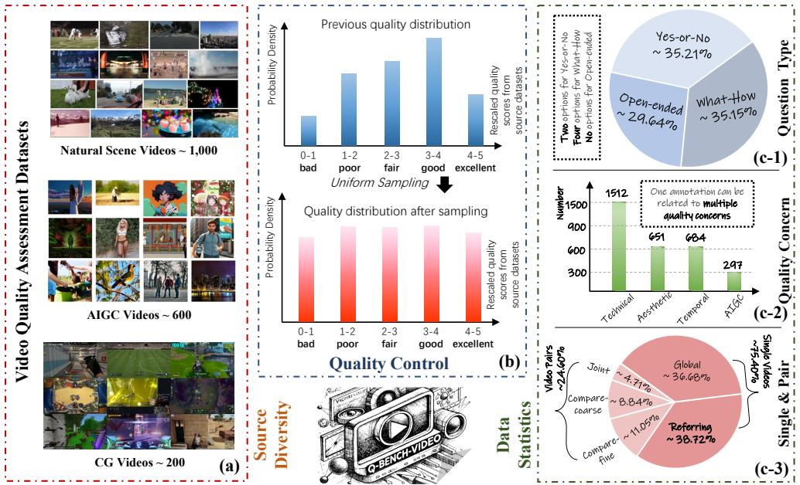  
Figure 1. The construction overview of the proposed Q-Bench-Video. To ensure diversity in video content, we collect natural scenes, AIGC, and CG videos from video quality assessment datasets as depicted in (a). To achieve a balanced quality distribution among the sampled videos, we employ uniform sampling for quality control. As indicated in (c-1) and (c-2), we utilize three types of questions (Yes-or-No, What-How, Open-ended) and address a comprehensive range of quality concerns including Technical, Aesthetic, Temporal, and AIGC distortions. Additionally, we incorporate the video pairs comparison task to enhance the comprehensiveness of the benchmark.

Through the rigorous experiment, we demonstrate that while LMMs show promise in video quality assessment, their performance lags significantly behind human-level understanding. By offering a systematic and thorough evaluation of LMMs’ video quality perception, Q-Bench-Video aims to foster research in this underexplored area and push the boundaries of LMM capabilities on video quality understanding. Our contributions can be summarized as follows:

• We introduce Q-Bench-Video, the first comprehensive benchmark explicitly designed to assess the video quality understanding capabilities of LMMs. This benchmark includes a diverse collection of source videos and ensures a balanced quality distribution, complemented by humancrafted question-answer annotations.

• Our evaluation framework spans four key quality dimensions: Technical, Aesthetic, Temporal, and AIGC distortions, which offers a holistic evaluation approach to video quality assessment. Uniquely, Q-Bench-Video enhances its utility by introducing the task of video pairs comparison, which sets it apart from existing video benchmarks.

• We conduct a comprehensive evaluation using both proprietary and open-source LMMs to measure their effectiveness in understanding video quality. The results expose notable deficiencies in current LMMs, while also shedding light on performance variations across different quality dimensions. These findings provide critical insights and suggest promising directions for future enhancements in the field of video quality understanding.

## 2. Related Works

## 2.1. Video LMMs and Benchmarks

The rapid advancement of Large Multi-modal Models (LMMs) in recent years [4, 28–30, 52, 56, 67] has showcased their remarkable perception and cognitive abilities across various multimodal benchmarks for images [9, 33, 35, 47, 62]. As development progresses, the focus of visual analysis has gradually shifted from images to videos. Early efforts [22, 27, 31, 50] aimed at unlocking the video understanding potential of LMMs have yielded promising results. However, initial video-based benchmarks [24, 34, 41] typically concentrated on specific aspects of video comprehension, falling short of fully capturing the performance of these models due to limitations such as a lack of diversity in video types and inadequate coverage of temporal dynamics. In response, recent video benchmarks [8, 10] have moved toward a more comprehensive evaluation of LMMs. Nonetheless, these efforts focus on high-level semantic understanding without systematic exploration of video quality.

## 2.2. Video Quality Assessment

Video Quality Assessment (VQA) is a task aimed at quantifying video scores based on visual quality. Initially, early VQA methods employ hand-crafted features extracted from videos and regress the features into quality scores [17, 20, 26, 40, 58, 64, 65]. With the emergence of deep neural networks, a shift occurs as numerous methods adopted deep learning techniques for VQA tasks [18, 21, 38, 42]. As the field progresses, newer methods begin incorporating considerations for both temporal dynamics and aesthetic qualities, leading to a more holistic approach to video quality analysis [3, 12, 43, 45, 59]. Moreover, the evolution of large-scale models has further revolutionized VQA methodologies. Many recent approaches have redefined the traditional quality assessment process into a quality questionanswering format [11, 15, 48, 60, 63]. This adaptation leverages the substantial prior knowledge embedded in large models to enhance the precision of quality quantification [61]. Despite these technological advances, VQA still grapples with challenges in providing interpretable quality scores and deepening the understanding of how models perceive and analyze video quality more comprehensively.

Table 1. Overview of the diverse video source datasets in the Q-Bench-Video. We consider various video content types, including natura scenes, AIGC, and CG videos. The term ‘MOS’ denotes that the videos are annotated via Mean Opinion Scores under ITU standards [1]. We have conducted uniform sampling based on their quality labels to ensure a balanced quality distribution.
<table><tr><td>Video Type</td><td>Video Source Dataset</td><td>MOS</td><td>Quality Concerns</td><td>Sampled Size</td><td>Full Dataset Size</td></tr><tr><td rowspan="3">Natural (1000)</td><td>LSVQ [54]</td><td>√</td><td>Spatial &amp; Temporal</td><td>600</td><td>39K</td></tr><tr><td>MaxWell [46]</td><td>√</td><td>Spatial &amp; Temporal &amp; Aesthetic</td><td>350</td><td>4.5K</td></tr><tr><td>WaterlooSQoE-III [6]</td><td>√</td><td>Quality-of-Experience</td><td>20</td><td>450</td></tr><tr><td rowspan="2"></td><td>WaterlooSQoE-IV [7]</td><td>√</td><td>Quality-of-Experience</td><td>30</td><td>1,350</td></tr><tr><td>T2VQA-DB [17]</td><td>√</td><td>Quality &amp; Text Alignment</td><td>200</td><td>10K</td></tr><tr><td>AIGC (600)</td><td>VideoFeedback [13]</td><td>X</td><td>Quality &amp; Text Alignment</td><td>400</td><td>37.6K</td></tr><tr><td>CG (200)</td><td>LIVE-YT-Gaming [55]</td><td>√</td><td>Visual Quality</td><td>200</td><td>600</td></tr></table>

## 3. Benchmark Construction

## 3.1. Benchmark Principle

The Q-Bench-Video is designed based on three guiding principles: (1) It encompasses a broad spectrum of video content, including natural scenes, AIGC, and CG videos. (2) It ensures a comprehensive and representative sampling process across a wide quality range, enhancing the benchmark’s overall effectiveness. (3) It primarily focuses on the aspects of video quality that significantly influence the viewing experience, including technical, aesthetic, temporal, and AIGC distortions. This significantly differs from other video benchmarks that prioritize semantic understanding. Additionally, the video pair quality comparison is integrated to address the challenges associated with comparing video quality. The overall construction process can be clearly overviewed in Fig. 1.

## 3.2. Source Videos Collection

As shown in Table 1, the source videos are primarily gathered from video quality assessment datasets. We selected videos from these datasets for two main reasons: (1) These datasets have inherently considered the diversity of quality features during video selection; (2) These datasets possess quality annotations that adhere to ITU standards [1] (with the exception of VideoFeedback), which allow us to accurately and authentically sample videos.

Our sampling method primarily employs a uniform approach, extracting videos evenly from each dataset based on the quality range. Moreover, considering the current popularity of AIGC and CG videos, we have also incorporated a selection of these video types. (More details in the Supp.)

## 3.3. Benchmark Designs

In this section, we provide a detailed description of the design of Q-Bench-Video. In this benchmark, the metastructure tuple (V,Q,A,C) of each data item can be decomposed into several components: the video object V (which can be a single video or a pair of videos), the video quality query Q, the set of possible answers A, and the correct answer C. The question samples are listed in Fig. 2.

## 3.3.1. Question Types

I) Yes-or-No Questions. The basic Yes-or-No questions are designed to prompt LMMs to make binary judgments on video quality queries, typically limited to the answers Yes or No. To address the potential bias in LMMs that may skew towards yes responses, we employ an annotation adjustment process, which modifies the questions and correct answers if necessary (based on the Yes-or-No ratio). This process ensures that the distribution of correct answers, either Yes or No, remains balanced at about 50%:50% ratio in the end. This balanced approach allows for a more accurate assessment of LMMs’ performance on Yes-or-No questions.

II) What-How Questions. The What-How questions are commonly utilized in benchmarks for LMMs. The What questions focus on identifying specific distortions (e.g., What is the most apparent distortion in this video?). On the other hand, the How questions are employed to distinguish the finer details of distortion levels (e.g., How is the overall clarity of this video?). Including both What and How questions allows Q-Bench-Video to thoroughly and meticulously evaluate LMMs’ ability on identifying video distortions and evaluating the distortion levels.

III) Open-ended Questions. It’s important to note that the two types of questions previously mentioned require LMMs to select the correct answer from a predefined set. However, in many real-world scenarios, Open-ended Questions, which do not restrict responses to a predefined set, are often more necessary and challenging for LMMs (e.g., What (c) Single Video vs. Video Pairs

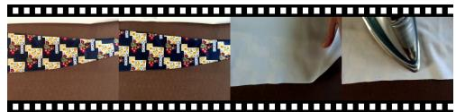

  
Q: Does the fabric in this video exhibit good clarity and proper lighting? A. Yes B. No  
Q: What quality issues do not exist in this video? A. None of the options B. Blurriness C. Overexposure D. Underexposure

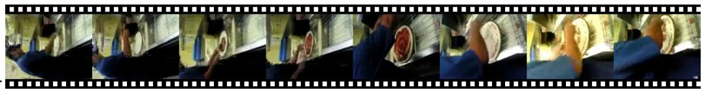  
Q: Why is it difficult for viewers to identify the dish the man is cooking in the video? Open-ended Response: The video has severe compression blur and block artifacts, significantly reducing the discernibility of objects in the video.

(a) Question Type  
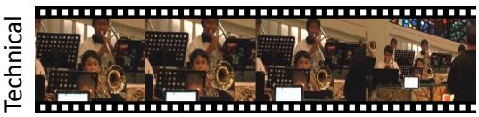

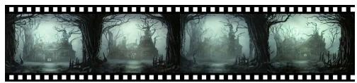  
Q: As the camera moves away in this video, is there a noticeable increase in the clarity of the person's face? A. No B. Yes  
Q: What feelings does this video evoke? Open-ended Response: This video depicts a castle in a unnatural and twisted jungle, where the plants have bizarre, sharp structures and dull colors. The atmosphere is eerie and terrifying, creating a sense of horror.

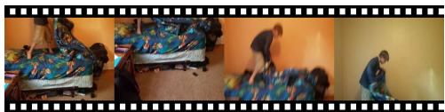  
Q: Does this video have severe camera shake? A. No B. Yes

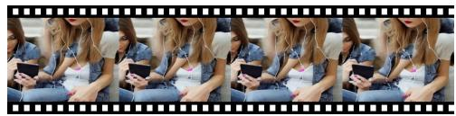  
Q: What is the most impactful quality issue of this video? A. Noise B. Incorrect human structure C. Blurriness D. Overexposure

(b) Quality Concern  
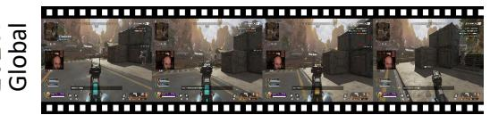  
Q: How is the overall lighting level in this game video? A. Very poor B. Poor C. Average D. Good

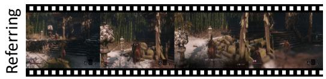  
Q: Is the main character in this game video rendered in high details but with relatively low clarity? A. Yes B. No

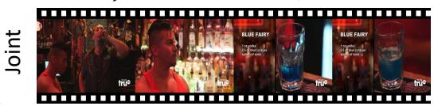

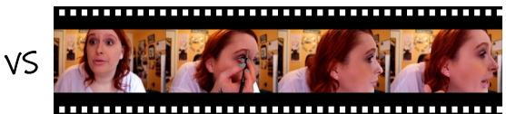

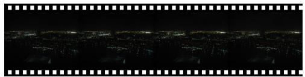

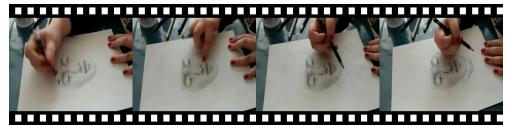  
Q: Is the exposure of the first video more balanced than the second video? A. No B. Yes

Figure 2. The visualization samples from Q-Bench-Video, with the question-answer content most representative of each subcategory being underlined. It is important to note that, regarding quality concerns, a single question-answer annotation may not only focus on one distortion dimension. Therefore, the distortion visualization examples shown in (b) primarily highlight instances that are most closely aligned with the mentioned distortion types.

are the possible factors that lead to the low clarity of this video? Please list and explain.). By adopting this form of questioning, we can better assess an LMM’s ability to perceive video quality in real-world conditions.

## 3.3.2. Quality Concerns

It’s important to recognize that video quality can be influenced by multiple factors on some occasions. Therefore, a query tuple (V,Q,A,C) does not need to be restricted to a single concern. It can address multiple concerns simultaneously. For instance, the question Is this video clear and well-composed? can be seen as evaluating both technical and aesthetic quality understanding.

I) Technical Distortions. Technical distortions refer to the low-level degradation in video quality that arises from the limitations of recording, compression, and transmission [37, 54]. These distortions often include artifacts such as blurring, noise, compression artifact, exposure, etc., which are directly tied to the technical processes used in video production and delivery. The CG-specific distortions related to geometry and texture are taken into consideration. II) Aesthetic Distortions. Aesthetic distortions involve deviations from the intended visual style, artistic design, or creative intent that negatively affect the viewer’s perception of the video [14, 44]. These distortions can include aspects such as confusing color, poor composition, lighting inconsistencies, or distracting elements that reduce the overall aesthetic appeal. Unlike technical distortions, aesthetic distortions are subjective and might be affected by viewer preference, cultural context, or artistic norms.

III) Temporal Distortions. Temporal distortions are related to the degradation ofvisual quality over time, impacting the fluidity and consistency of the video [36]. These distortions manifest as issues like screen shake, flickering, motion inconsistency, frame drops, and stuttering that result from unstable shooting devices, dramatically changing lighting conditions, and unstable bitrate environments [46]. Such disruptions hinder the viewer’s natural perception of the video, leading to a disjointed and unpleasant viewing experience, especially in live-streaming scenarios.

IV) AIGC Distortions. AIGC distortions pertain to imperfections and unnaturalness specifically arising from the generation of video content through AI models [32, 61]. These distortions may include unnatural textures, inconsistent lighting, uncanny facial features, or unrealistic object behavior that result from limitations or biases in the training data, model architecture, or generative process. These distortions are unique to AI-generated content and require specialized evaluation metrics that consider both the technical and perceptual quality aspects.

## 3.3.3. Single Videos & Video Pairs

Accurately comparing and jointly analyzing the quality of video pairs is sometimes more crucial than assessing the quality of a single video, especially in scenarios such as performance tests in video compression and quality control in video generation (In which it is more important to find out Which video is better in visual quality and why?) [49, 66]. Therefore, in Q-Bench-Video, we include video quality queries for both single videos and video pairs.

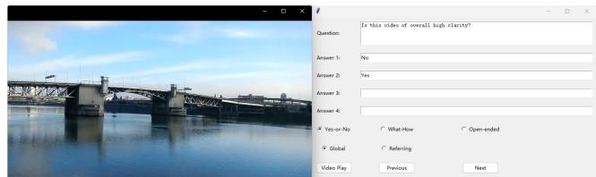

(a) Annotation GUI for single videos of Q-Bench-Video.  
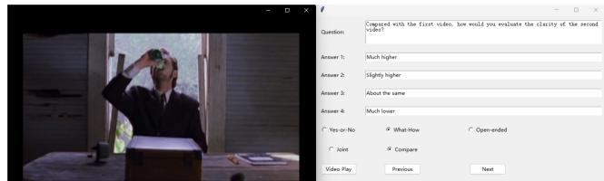  
(b) Annotation GUI for video pairs of Q-Bench-Video.  
Figure 3. Illustration of the annotation GUIs for Q-Bench-Video. (a) shows the interface for annotating single videos, where the annotator can select the question type and play the videos using the Video Play button. The annotator can also switch to the next and previous annotation with the Next and Previous buttons. (b) presents the interface for annotating video pairs. When the annotator presses the Video Play button, the video pairs are played sequentially, with a five-second gray screen serving as an interval between the two videos.

I) Single Videos. Queries related to single videos can primarily be categorized into two types: a) Global perception, which involves questions about the overall visual quality of the video, such as How is the overall contrast ofthis video? b) Referring perception, which focuses on the visual quality of specific elements within the video, like querying What is the most apparent distortion when the player strikes the ball? Through these approaches, we aim to comprehensively evaluate the LMMs’ ability to perceive both the overall and localized aspects of video quality.

II) Video Pairs. Firstly, to ensure that the comparison of video pairs is clear and meaningful, comparisons are only made between videos from the same source, such as videos from natural sources being paired together while CG videos and AIGC videos are not being paired. There are mainly two types of video pair categories: a) Joint analysis, which involves understanding the shared quality features of the video pairs, for example, such as asking Are both videos blurry? b) Comparative analysis, which involves comparing the quality dimension across two videos, such as How does the level of brightness in the first video compare to that in the second one? It is important to note that we further categorize comparisons based on the difference in quality labels of the videos involved into coarsegrain (with relatively more significant visual quality differences) and fine-grain (with relatively minor visual quality differences) comparisons. (More details in the Supp.)

(b) Subcategory performance on Q-Bench-Video.  
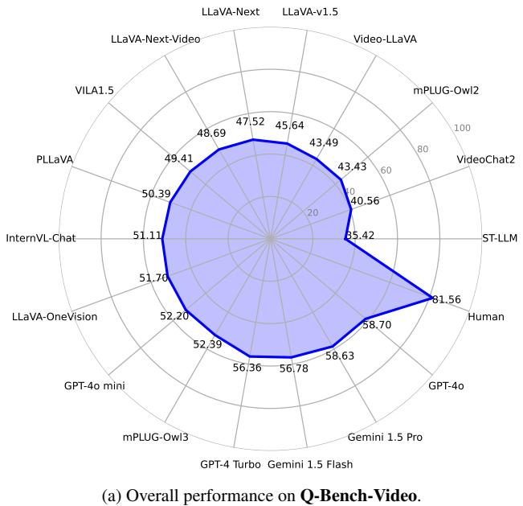

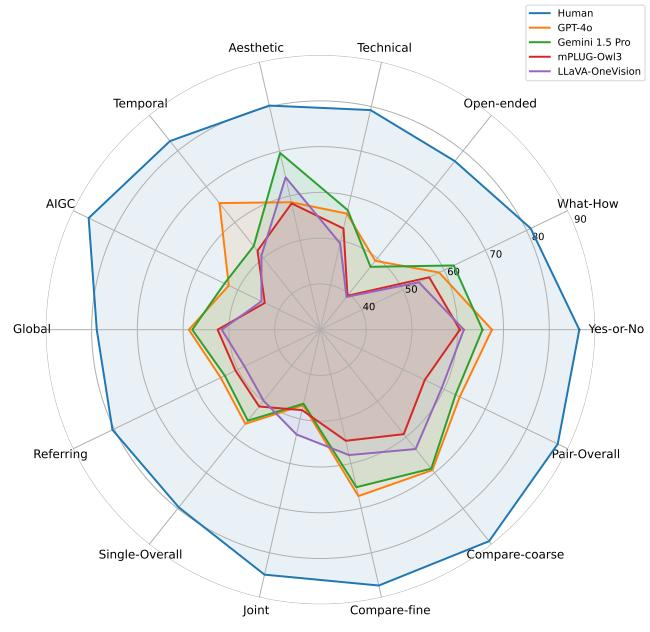  
Figure 4. A concise summary of the LMMs’ performance on Q-Bench-Video. (a) provides a comparison detailing the overall performance of humans and 17 selected LMMs, including both proprietary and open-source models. (b) illustrates a radar chart that outlines the performance of the top-2 proprietary LMMs (GPT-4o & Gemini 1.5 Pro) and open-source LMMs (mPLUG-Owl3 & LLaVA-OneVision) across various subcategories within Q-Bench-Video.

## 3.3.4. Questions & Answers Annotation

The annotation process of Q-Bench-Video is conducted in a well-controlled laboratory environment. A total of 8 experts are employed and trained to ensure the consistency of the annotations. The experts are required to watch the videos in their entirety before making annotations. Each annotated question-answer pair is then reviewed by at least three other experts to ensure its validity and accuracy.

## 3.4. Benchmark Setting & Evaluation

Unless specifically stated otherwise, for Video LMMs we typically analyze by uniformly sampling 16 frames from the video, while for Image LMMs, the sampling is reduced to 8 frames. It’s worth noting that if the LMMs are not compatible with the specified number of sampling frames (e.g. if they cannot support up to 8-frame input), we will use the official default settings for testing. For Yes-or-No and What-How questions, if the LMMs can accurately respond with the options, we directly record the accuracy of the responses as results. If the LMMs cannot provide option-based answers, we implement a GPT-assisted evaluation strategy to help judge the accuracy of the answers. For Open-ended questions, since the answers are open-ended and cannot be directly quantified for accuracy, we also employ the GPTassisted evaluation strategy. This involves GPT scoring the responses based on their accuracy, completeness, and relevance compared to the annotated answer.

## 4. Results of Q-Bench-Video

## 4.1. Experimental Setting

LMMs Participants. A total of 17 LMMs (12 Opensource LMMs and 5 Proprietary LMMs) are included for validation, which includes a) 3 Open-source Image LMMs: LLaVA-Next [30], LLaVA-v1.5 [28], and mPLUG-Owl2 [53]; b) 9 Open-source Video LMMs: mPLUG-Owl3 [51], LLaVA-OneVision [19], InternVL-Chat [4], VILA1.5 [16], PLLaVA [50], LLaVA-Next-Video [57], ST-LLM [31], Video-LLaVA [27], and VideoChat2 [22]; c) 5 Proprietary LMMs: Gemini 1.5 Flash, Gemini 1.5 Pro [39], GPT-4o mini, GPT-4o, and GPT-4 Turbo [2].

Subsets Split. The Q-Bench-Video is divided into test (1,186 question-answer items) and dev (1,192 question-answer items) subsets. The correct answers will be released and proprietary for the dev and test subsets. All discussions and analyses are based on the test subset.

Table 2. Results on the test subset for the video quality perception ability of LMMs. The best performance is marked in bold and the second performance is underlined for Open-source and Proprietary LMMs respectively. The Open-ended questions are excluded for Random guess. (Performance ofthe test subset is in the Supp.)
<table><tr><td>Sub-categories</td><td colspan="3">Question Types</td><td colspan="4">Quality Concerns</td><td rowspan="2">Overall↑</td></tr><tr><td>LMM (LLM)</td><td>Yes-or -No↑</td><td>What -How↑</td><td>Öpen -ended↑</td><td>Tech.↑</td><td>Aes.↑</td><td>Temp.↑</td><td>AIGC↑</td></tr><tr><td>Random guess w/o Open-ended</td><td>50.00%</td><td>25.00%</td><td>/</td><td>37.10%</td><td>37.31%</td><td>37.25%</td><td>37.22%</td><td>37.79%</td></tr><tr><td>Human</td><td>86.57%</td><td>81.00%</td><td>77.11%</td><td>79.22%</td><td>80.23%</td><td>82.72%</td><td>86.21%</td><td>81.56%</td></tr><tr><td colspan="9">Open-source Image LMMs</td></tr><tr><td>LLaVA-Next (Mistral-7B)</td><td>62.83%</td><td>45.14%</td><td>33.69%</td><td>46.38%</td><td>57.86%</td><td>47.84%</td><td>48.46%</td><td>47.52%</td></tr><tr><td>LLaVA-v1.5 (Vicuna-v1.5-13B)</td><td>52.98%</td><td>46.44%</td><td>37.01%</td><td>45.77%</td><td>58.12%</td><td>45.30%</td><td>46.48%</td><td>45.64%</td></tr><tr><td>mPLUG-Owl2 (LLaMA2-7B)</td><td>59.19%</td><td>39.07%</td><td>31.19%</td><td>42.07%</td><td>52.38%</td><td>41.71%</td><td>39.37%</td><td>43.43%</td></tr><tr><td colspan="9">Open-source Video LMMs</td></tr><tr><td>mPLUG-Owl3 (Qwen2-7B)</td><td>60.48%</td><td>56.39%</td><td>39.48%</td><td>52.68%</td><td>58.31%</td><td>52.05%</td><td>43.49%</td><td>52.39%</td></tr><tr><td>LLaVA-OneVision (Qwen2-7B)</td><td>61.34%</td><td>53.88%</td><td>39.15%</td><td>49.35%</td><td>64.15%</td><td>50.68%</td><td>44.30%</td><td>51.70%</td></tr><tr><td>InternVL-Chat (Vicuna-7B)</td><td>66.02%</td><td>52.13%</td><td>33.93%</td><td>48.42%</td><td>52.73%</td><td>50.59%</td><td>53.12%</td><td>51.11%</td></tr><tr><td>VILA1.5 (LLaMA3-8B)</td><td>61.95%</td><td>46.00%</td><td>39.60%</td><td>47.85%</td><td>57.85%</td><td>45.65%</td><td>42.57%</td><td>49.41%</td></tr><tr><td>PLLaVA (Mistral-7B)</td><td>65.63%</td><td>52.33%</td><td>32.23%</td><td>49.69%</td><td>61.32%</td><td>50.96%</td><td>53.64%</td><td>50.39%</td></tr><tr><td>LLaVA-Next-Video (Mistral-7B)</td><td>61.34%</td><td>45.95%</td><td>38.10%</td><td>49.03%</td><td>60.94%</td><td>46.97%</td><td>49.40%</td><td>48.69%</td></tr><tr><td>ST-LLM (Vicuna-v1.1-7B)</td><td>44.63%</td><td>28.50%</td><td>32.78%</td><td>34.99%</td><td>46.11%</td><td>34.28%</td><td>34.02%</td><td>35.42%</td></tr><tr><td>Video-LLaVA (Vicuna-v1.5-7B)</td><td>64.67%</td><td>40.79%</td><td>29.11%</td><td>43.25%</td><td>54.04%</td><td>42.38%</td><td>42.76%</td><td>43.49%</td></tr><tr><td>VideoChat2 (Mistral-7B)</td><td>56.09%</td><td>29.98%</td><td>34.99%</td><td>39.26%</td><td>50.02%</td><td>38.25%</td><td>35.88%</td><td>40.56%</td></tr><tr><td colspan="9">Proprietary LMMs</td></tr><tr><td>Gemini 1.5 Flash</td><td>65.48%</td><td>56.79%</td><td>47.51%</td><td>54.11%</td><td>66.58%</td><td>53.51%</td><td>50.22%</td><td>56.78%</td></tr><tr><td>Gemini 1.5 Pro</td><td>65.42%</td><td>62.35%</td><td>47.57%</td><td>56.80%</td><td>69.61% 60.90%</td><td>53.38%</td><td>53.26%</td><td>58.63%</td></tr><tr><td>GPT-4o mini</td><td>62.95%</td><td>50.93%</td><td>42.10%</td><td>49.38%</td><td>58.57%</td><td>48.43% 65.39%</td><td>41.71%</td><td>52.20%</td></tr><tr><td>GPT-40 GPT-4 Turbo</td><td>67.48%</td><td>58.79%</td><td>49.25%</td><td>56.01%</td><td>66.23%</td><td></td><td>52.22%</td><td>58.70%</td></tr><tr><td></td><td>66.93%</td><td>58.33%</td><td>40.15%</td><td>54.23%</td><td></td><td>54.00%</td><td>52.04%</td><td>56.36%</td></tr></table>

## 4.2. Findings

The overall performance and subcategory comparisons (human vs. top-performing LMMs) on Q-Bench-Video can be quickly glanced at Fig. 4. Detailed performance across the subcategories for each LMM are shown in Table 2 (Question Types & Quality Concerns) and Table 3 (Single Videos vs. Video Pairs) respectively. The findings are organized as follows:

1) General Performance. Human>Proprietary LMMs>Open-source LMMs>Random guess. From the performance results presented in Table 2, we observe that nearly all LMMs significantly outperform random guess, demonstrating their basic capability to understand video quality. Among the open-source LMMs, the recently released mPLUG-Owl3 achieves the highest overall performance at 52.39%, even slightly surpassing GPT-4o mini (52.20%), followed closely by LLaVA-OneVision (51.70%) and InternVL-Chat (51.11%). Image LMMs deliver moderate performance. Although they outperform some Video LMMs, the gap between them and the latest Video LMMs is still notable. Benefiting from larger training datasets and more parameters, proprietary LMMs (except GPT-4o mini) outperform all open-source models. However, even the best-performing model, GPT-4o, which achieved an overall performance of 58.70%, still lags behind human performance by 22.86%. This gap highlights that, despite the advancements in current state-of-the-art LMMs on video general understanding, there remains a significant need for improvement in video quality understanding ability.

2) Question Types. Open-ended questions are more challenging for LMMs. From Table 2, a discernible hierarchy in task difficulty for video quality assessment emerges for both humans and LMMs, arranged as follows: Openended >What-How >Yes-or-No. It is crucial to highlight that while humans exhibit a performance decline in Openended tasks by approximately 9.46% compared to Yes-or-No tasks, and about 3.89% compared to What-How tasks, these reductions are markedly less pronounced than those observed in LMMs for the Open-ended questions. This disparity underscores a significant proficiency gap between LMMs’ capability in handling straightforward, closed-form questions and their effectiveness in navigating the complexities of real-world problem-solving on open-ended questions, particularly in the context of video quality evaluation.

3) Quality Concerns. LMMs exhibit unbalanced performance across different types of distortions. From Table 2, it is evident that humans are particularly good at identifying AIGC distortions, while LMMs demonstrate stronger performance in detecting Aesthetic distortions. This distinction likely stems from the inherent sensitivity of humans to the conspicuous unnaturalness of AIGC distortions, which readily draws human attention. In contrast, Aesthetic distortions, which often involve high-level semantic nuances, align more closely with the training contexts of LMMs, enabling them to excel in this area. However, LMMs face challenges with AIGC distortions due to insufficient exposure to such anomalies during their pretraining phases, specific architectural constraints, and imperfections in the generation process. In the case of proprietary LMMs, their performance on Technical and Temporal distortions appear comparably consistent, indicating a uniform capability in recognizing these two types of distortions. Nonetheless, across all four subcategories, LMMs exhibit a notable performance disparity compared to humans, with varying degrees of accuracy among the different types of distortions. This variability highlights the need for significant enhancements in LMMs’ abilities to accurately understand and interpret various distortion types.

Table 3. Results on the test subset for the video quality perception ability across single videos and video pairs of LMMs. The best performance is marked in bold and the second performance is underlined for Open-source and Proprietary LMMs respectively.
<table><tr><td rowspan="2">Sub-categories</td><td colspan="3">Single Videos</td><td colspan="4">Video Pairs</td></tr><tr><td>Global↑</td><td>Referring↑</td><td>Overall↑</td><td>Joint↑</td><td>Compare -ine↑</td><td>Compare -coarse↑</td><td>Overall↑</td></tr><tr><td>Random guess w/o Open-ended</td><td>36.49%</td><td>38.61%</td><td>37.71%</td><td>40.56%</td><td>37.94%</td><td>36.83%</td><td>38.00%</td></tr><tr><td>Human</td><td>78.87%</td><td>80.43%</td><td>79.65%</td><td>84.90%</td><td>87.34%</td><td>89.11%</td><td>87.56%</td></tr><tr><td>LLaVA-Next (Mistral-7B)</td><td>51.33%</td><td>50.20%</td><td>50.73%</td><td>38.03%</td><td>48.00%</td><td>42.48%</td><td>43.46%</td></tr><tr><td>LLaVA-v1.5 (Vicuna-v1.5-13B)</td><td>47.99%</td><td>51.94%</td><td>50.10%</td><td>27.72%</td><td>34.60%</td><td>42.12%</td><td>36.42%</td></tr><tr><td>mPLUG-Owl2 (LLaMA2-7B)</td><td>46.86%</td><td>43.51%</td><td>45.07%</td><td>51.49%</td><td>37.10%</td><td>40.28%</td><td>43.69%</td></tr><tr><td colspan="8">Open-source Video LMMs</td></tr><tr><td>mPLUG-Owl3 (Qwen2-7B)</td><td>52.46%</td><td>50.60%</td><td>51.47%</td><td>48.03%</td><td>54.90%</td><td>59.20%</td><td>55.31%</td></tr><tr><td>LLaVA-OneVision (Qwen2-7B)</td><td>51.56%</td><td>48.43%</td><td>49.89%</td><td>53.48%</td><td>58.10%</td><td>63.36%</td><td>59.41%</td></tr><tr><td>InternVL-Chat (Vicuna-7B)</td><td>51.15%</td><td>51.86%</td><td>51.52%</td><td>48.85%</td><td>51.10%</td><td>49.20%</td><td>49.79%</td></tr><tr><td>VILA1.5 (LLaMA3-8B)</td><td>52.35%</td><td>47.37%</td><td>49.69%</td><td>56.11%</td><td>45.40%</td><td>48.04%</td><td>48.84%</td></tr><tr><td>PLLaVA (Mistral-7B)</td><td>51.44%</td><td>55.49%</td><td>53.60%</td><td>40.36%</td><td>50.40%</td><td>54.16%</td><td>49.90%</td></tr><tr><td>LLaVA-Next-Video (Mistral-7B)</td><td>51.33%</td><td>50.20%</td><td>50.73%</td><td>38.03%</td><td>48.00%</td><td>42.48%</td><td>43.46%</td></tr><tr><td>ST-LLM (Vicuna-v1.1-7B)</td><td>36.54%</td><td>36.49%</td><td>36.51%</td><td>28.03%</td><td>36.80%</td><td>32.08%</td><td>32.87%</td></tr><tr><td>Video-LLaVA (Vicuna-v1.5-7B)</td><td>45.46%</td><td>44.67%</td><td>45.04%</td><td>49.36%</td><td>42.00%</td><td>43.00%</td><td>44.01%</td></tr><tr><td>VideoChat2 (Mistral-7B)</td><td>43.52%</td><td>38.27%</td><td>40.72%</td><td>57.23%</td><td>44.40%</td><td>41.64%</td><td>45.93%</td></tr><tr><td>Proprietary LMMs</td><td></td><td></td><td></td><td></td><td></td><td></td><td></td></tr><tr><td>Gemini 1.5 Flash</td><td>58.00%</td><td>53.18%</td><td>55.43%</td><td>46.59%</td><td>65.30%</td><td>68.84%</td><td>62.77%</td></tr><tr><td>Gemini 1.5 Pro</td><td>52.36%</td><td>61.41%</td><td>57.19%</td><td>45.43%</td><td>65.30%</td><td>72.00%</td><td>63.55%</td></tr><tr><td>GPT-4o mini</td><td>52.67%</td><td>48.96%</td><td>50.69%</td><td>44.00%</td><td>60.50%</td><td>63.88%</td><td>58.02%</td></tr><tr><td>GPT-40</td><td>58.75%</td><td>54.18%</td><td>56.31%</td><td>46.93%</td><td>67.30%</td><td>69.24%</td><td>63.80%</td></tr><tr><td>GPT-4 Turbo</td><td>57.36%</td><td>52.80%</td><td>54.93%</td><td>46.13%</td><td>62.50%</td><td>64.80%</td><td>59.84%</td></tr></table>

4) Single Videos vs. Video Pairs. LMMs demonstrate superior capabilities in comparing video quality. From Table 3, we observe that for single videos, LMMs achieve similar performance in Global and Referring quality perception (except for Gemini 1.5 Pro), without any significant trend of the performance for one subcategory over the other. This suggests that LMMs have comparable abilities in perceiving both Global video quality and Referring video quality. In terms of comparison, however, LMMs clearly outperform their performance on single video analysis and joint analysis. Notably, LMMs perform significantly better in the Compare-coarse subcategory, where video pairs have more pronounced quality differences, than in the Comparefine subcategory. This highlights that LMMs are more adept at comparing video quality than analyzing the quality of single videos. This advantage in comparative assessment can be attributed to the inherent clarity in pairwise comparisons, which provide explicit contrasts, as opposed to the more ambiguous nature of evaluating a single video. Both humans and LMMs exhibit enhanced performance in comparative tasks. Although there is still a significant accuracy gap between LMMs and humans, LMMs show promising potential as effective tools for comparing video quality.

## 5. Limitations

1) Subjectivity can not be fully avoided in annotations for aspects like aesthetics. 2) As video generation advances, new models may show different distortions, which might potentially make parts of Q-Bench-Video outdated.

## 6. Conclusion

In this paper, we introduce Q-Bench-Video, the first comprehensive benchmark explicitly designed to evaluate Large Multi-modal Models’ (LMMs) understanding of video quality. Our benchmark includes a diverse range of video types, questions that challenge multiple aspects of video quality, and a holistic evaluation framework encompassing Technical, Aesthetic, Temporal, and AIGC distortions. Through extensive experimentation with 17 opensource and proprietary LMMs, we find that while LMMs show promise in discerning video quality, their performance remains significantly below human-level understanding, especially when addressing Open-ended questions and AIGCspecific distortions. These findings highlight the current limitations of LMMs in video quality perception and underscore the need for further advancements in this area. By offering Q-Bench-Video, we aim to stimulate future research and drive improvements in the field, bridging the gap between LMM and human video quality understanding.

## Acknowledgment

The work was supported in part by the National Natural Science Foundation of China under Grant (623B2073, 62301310), the Ministry of Education, Singapore, under the funding of MOE-T2EP20123-0006, and in part by Sichuan Science and Technology Program under Grant 2024NS-FSC1426.

## References

[1] Recommendation 500-10: Methodology for the subjective assessment of the quality of television pictures. ITU-R Rec. BT.500, 2000. 3

[2] Josh Achiam, Steven Adler, Sandhini Agarwal, Lama Ahmad, Ilge Akkaya, Florencia Leoni Aleman, Diogo Almeida, Janko Altenschmidt, Sam Altman, Shyamal Anadkat, et al. Gpt-4 technical report. arXiv preprint arXiv:2303.08774, 2023. 6

[3] Sewoong Ahn and Sanghoon Lee. Deep blind video quality assessment based on temporal human perception. In ICIP, pages 619–623, 2018. 3

[4] Zhe Chen, Weiyun Wang, Hao Tian, Shenglong Ye, Zhangwei Gao, Erfei Cui, Wenwen Tong, Kongzhi Hu, Jiapeng Luo, Zheng Ma, et al. How far are we to gpt-4v? closing the gap to commercial multimodal models with open-source suites. arXiv preprint arXiv:2404.16821, 2024. 1, 2, 6

[5] Shyamprasad Chikkerur, Vijay Sundaram, Martin Reisslein, and Lina J Karam. Objective video quality assessment methods: A classification, review, and performance comparison. IEEE transactions on broadcasting, 57(2):165–182, 2011. 1

[6] Zhengfang Duanmu, Abdul Rehman, and Zhou Wang. A quality-of-experience database for adaptive video streaming. IEEE Transactions on Broadcasting, 64(2):474–487, 2018. 3

[7] Zhengfang Duanmu, Wentao Liu, Zhuoran Li, Diqi Chen, Zhou Wang, Yizhou Wang, and Wen Gao. The waterloo streaming quality-of-experience database-iv. IEEE Dataport, 2020. 3

[8] Xinyu Fang, Kangrui Mao, Haodong Duan, Xiangyu Zhao, Yining Li, Dahua Lin, and Kai Chen. Mmbench-video: A long-form multi-shot benchmark for holistic video understanding. arXiv preprint arXiv:2406.14515, 2024. 1, 2

[9] Chaoyou Fu, Peixian Chen, Yunhang Shen, Yulei Qin, Mengdan Zhang, Xu Lin, Zhenyu Qiu, Wei Lin, Jinrui Yang, Xiawu Zheng, Ke Li, Xing Sun, and Rongrong Ji. Mme: A comprehensive evaluation benchmark for multimodal large language models, 2023. 2

[10] Chaoyou Fu, Yuhan Dai, Yondong Luo, Lei Li, Shuhuai Ren, Renrui Zhang, Zihan Wang, Chenyu Zhou, Yunhang Shen, Mengdan Zhang, et al. Video-mme: The first-ever comprehensive evaluation benchmark of multi-modal llms in video analysis. arXiv preprint arXiv:2405.21075, 2024. 1, 2

[11] Qihang Ge, Wei Sun, Yu Zhang, Yunhao Li, Zhongpeng Ji, Fengyu Sun, Shangling Jui, Xiongkuo Min, and Guangtao Zhai. Lmm-vqa: Advancing video quality assessment with large multimodal models. arXiv preprint arXiv:2408.14008, 2024. 3

[12] Chenlong He, Qi Zheng, Ruoxi Zhu, Xiaoyang Zeng, Yibo Fan, and Zhengzhong Tu. Cover: A comprehensive video quality evaluator. In Proceedings of the IEEE/CVF Conference on Computer Vision and Pattern Recognition, pages 5799–5809, 2024. 3

[13] Xuan He, Dongfu Jiang, Ge Zhang, Max Ku, Achint Soni, Sherman Siu, Haonan Chen, Abhranil Chandra, Ziyan Jiang, Aaran Arulraj, Kai Wang, Quy Duc Do, Yuansheng Ni, Bohan Lyu, Yaswanth Narsupalli, Rongqi Fan, Zhiheng Lyu, Yuchen Lin, and Wenhu Chen. Videoscore: Building automatic metrics to simulate fine-grained human feedback for video generation. ArXiv, abs/2406.15252, 2024. 3

[14] Yipo Huang, Quan Yuan, Xiangfei Sheng, Zhichao Yang, Haoning Wu, Pengfei Chen, Yuzhe Yang, Leida Li, and Weisi Lin. Aesbench: An expert benchmark for multimoda large language models on image aesthetics perception. arXiv preprint arXiv:2401.08276, 2024. 5

[15] Ziheng Jia, Zicheng Zhang, Jiaying Qian, Haoning Wu, Wei Sun, Chunyi Li, Xiaohong Liu, Weisi Lin, Guangtao Zhai, and Xiongkuo Min. Vqa2:visual question answering for video quality assessment. arXiv preprint arXiv:2411.03795, 2024. 3

[16] Junjie Ke, Keren Ye, Jiahui Yu, Yonghui Wu, Peyman Milanfar, and Feng Yang. Vila: Learning image aesthetics from user comments with vision-language pretraining, 2023. 1, 6

[17] Tengchuan Kou, Xiaohong Liu, Zicheng Zhang, Chunyi Li, Haoning Wu, Xiongkuo Min, Guangtao Zhai, and Ning Liu. Subjective-aligned dateset and metric for text-to-video quality assessment. arXiv preprint arXiv:2403.11956, 2024. 2, 3

[18] Bowen Li, Weixia Zhang, Meng Tian, Guangtao Zhai, and Xianpei Wang. Blindly assess quality of in-the-wild videos via quality-aware pre-training and motion perception. IEEE TCSVT, 2022. 3

[19] Bo Li, Yuanhan Zhang, Dong Guo, Renrui Zhang, Feng Li, Hao Zhang, Kaichen Zhang, Yanwei Li, Ziwei Liu, and Chunyuan Li. Llava-onevision: Easy visual task transfer. arXiv preprint arXiv:2408.03326, 2024. 1, 6

[20] Chunyi Li, Zicheng Zhang, Haoning Wu, Kaiwei Zhang, Lei Bai, Xiaohong Liu, Guangtao Zhai, and Weisi Lin. Papsovqa: Projection-aware patch sampling for omnidirectional video quality assessment. In 2024 IEEE International Sym posium on Circuits and Systems (ISCAS), pages 1–5. IEEE, 2024. 2

[21] Dingquan Li, Tingting Jiang, and Ming Jiang. Quality assessment of in-the-wild videos. In ACM MM, pages 2351– 2359, 2019. 3

[22] KunChang Li, Yinan He, Yi Wang, Yizhuo Li, Wenha Wang, Ping Luo, Yali Wang, Limin Wang, and Yu Qiao. Videochat: Chat-centric video understanding, 2023. 2, 6

[23] Kunchang Li, Yali Wang, Yinan He, Yizhuo Li, Yi Wang, Yi Liu, Zun Wang, Jilan Xu, Guo Chen, Ping Luo, et al. Mvbench: A comprehensive multi-modal video understanding benchmark. In Proceedings ofthe IEEE/CVF Conference on Computer Vision and Pattern Recognition, pages 22195– 22206, 2024. 1

[24] Shicheng Li, Lei Li, Shuhuai Ren, Yuanxin Liu, Yi Liu, Rundong Gao, Xu Sun, and Lu Hou. Vitatecs: A diag-

nostic dataset for temporal concept understanding of videolanguage models. arXiv preprint arXiv:2311.17404, 2023. 2

[25] Xin Li, Kun Yuan, Yajing Pei, Yiting Lu, Ming Sun, Chao Zhou, Zhibo Chen, Radu Timofte, Wei Sun, Haoning Wu, et al. Ntire 2024 challenge on short-form ugc video quality assessment: Methods and results. In Proceedings of the IEEE/CVF Conference on Computer Vision and Pattern Recognition, pages 6415–6431, 2024. 1

[26] Zhi Li, Christos Bampis, Julie Novak, Anne Aaron, Kyle Swanson, Anush Moorthy, and JD Cock. Vmaf: The journey continues. Netflix Technology Blog, 25(1), 2018. 2

[27] Bin Lin, Yang Ye, Bin Zhu, Jiaxi Cui, Munan Ning, Peng Jin, and Li Yuan. Video-llava: Learning united visual repre sentation by alignment before projection, 2023. 2, 6

[28] Haotian Liu, Chunyuan Li, Yuheng Li, and Yong Jae Lee. Improved baselines with visual instruction tuning. CoRR, abs/2310.03744, 2023. 2, 6

[29] Haotian Liu, Chunyuan Li, Qingyang Wu, and Yong Jae Lee. Visual instruction tuning. CoRR, abs/2304.08485, 2023.

[30] Haotian Liu, Chunyuan Li, Yuheng Li, Bo Li, Yuanhan Zhang, Sheng Shen, and Yong Jae Lee. Lava-next: Improved reasoning, ocr, and world knowledge, 2024. 2, 6

[31] Ruyang Liu, Chen Li, Haoran Tang, Yixiao Ge, Ying Shan, and Ge Li. St-llm: Large language models are effective temporal learners. https://arxiv.org/abs/2404.00308, 2023. 2, 6

[32] Xiaohong Liu, Xiongkuo Min, Guangtao Zhai, Chunyi Li, Tengchuan Kou, Wei Sun, Haoning Wu, Yixuan Gao, Yuqin Cao, Zicheng Zhang, et al. Ntire 2024 quality assessment of ai-generated content challenge. In Proceedings of the IEEE/CVF Conference on Computer Vision and Pattern Recognition, pages 6337–6362, 2024. 5

[33] Yuan Liu, Haodong Duan, Yuanhan Zhang, Bo Li, Songyang Zhang, Wangbo Zhao, Yike Yuan, Jiaqi Wang, Conghui He, Ziwei Liu, Kai Chen, and Dahua Lin. MMBench: Is your multi-modal model an all-around player? CoRR, abs/2307.06281, 2023. 2

[34] Karttikeya Mangalam, Raiymbek Akshulakov, and Jitendra Malik. Egoschema: A diagnostic benchmark for very long-form video language understanding. Advances in Neural Information Processing Systems, 2023. arXiv preprint arXiv:2308.09126. 2

[35] Kenneth Marino, Mohammad Rastegari, Ali Farhadi, and Roozbeh Mottaghi. Ok-vqa: A visual question answering benchmark requiring external knowledge. In Conference on Computer Vision and Pattern Recognition (CVPR), 2019. 2

[36] Kalpana Seshadrinathan and Alan Conrad Bovik. Motion tuned spatio-temporal quality assessment of natural videos. IEEE transactions on image processing, 19(2):335–350, 2009. 5

[37] Shaolin Su, Vlad Hosu, Hanhe Lin, Yanning Zhang, and Dietmar Saupe. KonIQ++: Boosting no-reference image quality assessment in the wild by jointly predicting image quality and defects. In The British Machine Vision Conference (BMVC), pages 1–12, 2021. 5

[38] Wei Sun, Xiongkuo Min, Wei Lu, and Guangtao Zhai. A deep learning based no-reference quality assessment model for ugc videos. arXiv preprint arXiv:2204.14047, 2022. 3

[39] Gemini Team. Gemini 1.5: Unlocking multimodal understanding across millions of tokens of context, 2024. 6

[40] Phong V Vu, Cuong T Vu, and Damon M Chandler. A spatiotemporal most-apparent-distortion model for video quality assessment. In 2011 18th IEEE international conference on image processing, pages 2505–2508. IEEE, 2011. 2

[41] Gaoang Wang, Jenq-Neng Hwang, Yanting Zhang, and Yan Lu. Mv-bench: A benchmark for multi-view video understanding. arXiv preprint arXiv:2308.12345, 2023. 2

[42] Wen Wen, Mu Li, Yabin Zhang, Yiting Liao, Junlin Li, Li Zhang, and Kede Ma. Modular blind video quality assessment. In Proceedings ofthe IEEE/CVF Conference on Com puter Vision and Pattern Recognition, pages 2763–2772, 2024. 3

[43] Haoning Wu, Chaofeng Chen, Jingwen Hou, Liang Liao, Annan Wang, Wenxiu Sun, Qiong Yan, and Weisi Lin. FAST-VQA: Efficient end-to-end video quality assessment with fragment sampling. In ECCV, pages 538–554, 2022. 3

[44] Haoning Wu, Liang Liao, Chaofeng Chen, Jingwen Hou, Annan Wang, Wenxiu Sun, Qiong Yan, and Weisi Lin. Disentangling aesthetic and technical effects for video quality assessment of user generated content. 2022. 5

[45] Haoning Wu, Erli Zhang, Liang Liao, Chaofeng Chen, Jingwen Hou, Annan Wang, Wenxiu Sun, Qiong Yan, and Weisi Lin. Exploring video quality assessment on user generated contents from aesthetic and technical perspectives. In IEEE ICCV, 2023. 3

[46] Haoning Wu, Erli Zhang, Liang Liao, Chaofeng Chen, Jingwen Hou, Annan Wang, Wenxiu Sun, Qiong Yan, and Weis Lin. Towards explainable video quality assessment: A database and a language-prompted approach. In ACM MM, 2023. 3, 5

[47] Haoning Wu, Zicheng Zhang, Erli Zhang, Chaofeng Chen, Liang Liao, Annan Wang, Chunyi Li, Wenxiu Sun, Qiong Yan, Guangtao Zhai, and Weisi Lin. Q-Bench: A benchmark for general-purpose foundation models on low-level vision. In ICLR, 2024. 2

[48] Haoning Wu, Zicheng Zhang, Weixia Zhang, Chaofeng Chen, Liang Liao, Chunyi Li, Yixuan Gao, Annan Wang, Erli Zhang, Wenxiu Sun, Qiong Yan, Xiongkuo Min, Guangtao Zhai, and Weisi Lin. Q-align: Teaching lmms for visual scoring via discrete text-defined levels. In ICML2024, 2024. 3

[49] Tianhe Wu, Kede Ma, Jie Liang, Yujiu Yang, and Lei Zhang. A comprehensive study of multimodal large language models for image quality assessment. arXiv preprint arXiv:2403.10854, 2024. 5

[50] Lin Xu, Yilin Zhao, Daquan Zhou, Zhijie Lin, See Kiong Ng, and Jiashi Feng. Pllava : Parameter-free llava extension from images to videos for video dense captioning, 2024. 1, 2, 6

[51] Jiabo Ye, Haiyang Xu, Haowei Liu, Anwen Hu, Ming Yan, Qi Qian, Ji Zhang, Fei Huang, and Jingren Zhou. mplug-owl3: Towards long image-sequence understanding

in multi-modal large language models. arXiv preprint arXiv:2408.04840, 2024. 1, 6

[52] Qinghao Ye, Haiyang Xu, Guohai Xu, Jiabo Ye, Ming Yan, Yiyang Zhou, Junyang Wang, Anwen Hu, Pengcheng Shi, Yaya Shi, Chaoya Jiang, Chenliang Li, Yuanhong Xu, Hehong Chen, Junfeng Tian, Qian Qi, Ji Zhang, and Fei Huang. mPLUG-Owl: Modularization empowers large language models with multimodality. CoRR, abs/2304.14178, 2023. 2

[53] Qinghao Ye, Haiyang Xu, Jiabo Ye, Ming Yan, Haowei Liu, Qi Qian, Ji Zhang, Fei Huang, and Jingren Zhou. mPLUG-Owl2: Revolutionizing multi-modal large language model with modality collaboration. CoRR, abs/2311.04257, 2023. 6

[54] Zhenqiang Ying, Maniratnam Mandal, Deepti Ghadiyaram, and Alan Bovik. Patch-vq: ’patching up’ the video quality problem. In IEEE CVPR, 2021. 3, 5

[55] Xiangxu Yu, Zhenqiang Ying, Neil Birkbeck, Yilin Wang, Balu Adsumilli, and Alan C Bovik. Subjective and objective analysis of streamed gaming videos. IEEE Transactions on Games, 2023. 3

[56] Pan Zhang, Xiaoyi Dong, Bin Wang, Yuhang Cao, Chao Xu, Linke Ouyang, Zhiyuan Zhao, Shuangrui Ding, Songyang Zhang, Haodong Duan, Wenwei Zhang, Hang Yan, Xinyue Zhang, Wei Li, Jingwen Li, Kai Chen, Conghui He, Xingcheng Zhang, Yu Qiao, Dahua Lin, and Jiaqi Wang. Internlm-xcomposer: A vision-language large model for advanced text-image comprehension and composition, 2023. 2

[57] Yuanhan Zhang, Bo Li, Haotian Liu, Yong Jae Lee, Liangke Gui, Di Fu, Jiashi Feng, Ziwei Liu, and Chunyuan Li. Llavanext: A strong zero-shot video understanding model, 2024. 6

[58] Zicheng Zhang, Wei Sun, Yucheng Zhu, Xiongkuo Min, Wei Wu, Ying Chen, and Guangtao Zhai. Evaluating point cloud from moving camera videos: A no-reference metric. IEEE Transactions on Multimedia, 2023. 2

[59] Zicheng Zhang, Wei Wu, Wei Sun, Dangyang Tu, Wei Lu, Xiongkuo Min, Ying Chen, and Guangtao Zhai. Md-vqa: Multi-dimensional quality assessment for ugc live videos. In Proceedings of the IEEE Conference on Computer Vision and Pattern Recognition (CVPR), 2023. 3

[60] Zicheng Zhang, Haoning Wu, Zhongpeng Ji, Chunyi Li, Erli Zhang, Wei Sun, Xiaohong Liu, Xiongkuo Min, Fengyu Sun, Shangling Jui, et al. Q-boost: On visual quality assessment ability of low-level multi-modality foundation models. In 2024 IEEE International Conference on Multimedia and Expo Workshops (ICMEW), pages 1–6. IEEE, 2024. 3

[61] Zicheng Zhang, Haoning Wu, Chunyi Li, Yingjie Zhou, Wei Sun, Xiongkuo Min, Zijian Chen, Xiaohong Liu, Weisi Lin, and Guangtao Zhai. A-bench: Are lmms masters at evaluating ai-generated images? arXiv preprint arXiv:2406.03070, 2024. 3, 5

[62] Zicheng Zhang, Haoning Wu, Erli Zhang, Guangtao Zhai, and Weisi Lin. A benchmark for multi-modal foundation models on low-level vision: from single images to pairs. CoRR, abs/2402.07116, 2024. 2

[63] Zicheng Zhang, Haoning Wu, Yingjie Zhou, Chunyi Li, Wei Sun, Chaofeng Chen, Xiongkuo Min, Xiaohong Liu, Weisi

Lin, and Guangtao Zhai. Lmm-pcqa: Assisting point cloud quality assessment with lmm. In Proceedings of the 32nd ACM International Conference on Multimedia, pages 7783– 7792, 2024. 3

[64] Qi Zheng, Zhengzhong Tu, Xiaoyang Zeng, Alan C Bovik, and Yibo Fan. A completely blind video quality evaluator. IEEE Signal Processing Letters, 29:2228–2232, 2022. 2

[65] Xunchu Zhou, Xiaohong Liu, Yunlong Dong, Tengchuan Kou, Yixuan Gao, Zicheng Zhang, Chunyi Li, Haoning Wu, and Guangtao Zhai. Light-vqa+: A video quality assessment model for exposure correction with vision-language guidance. arXiv preprint arXiv:2405.03333, 2024. 2

[66] Hanwei Zhu, Xiangjie Sui, Baoliang Chen, Xuelin Liu, Peilin Chen, Yuming Fang, and Shiqi Wang. 2AFC prompting of large multimodal models for image quality assessment. CoRR, abs/2402.01162, 2024. 5

[67] Orr Zohar, Xiaohan Wang, Yann Dubois, Nikhil Mehta, Tong Xiao, Philippe Hansen-Estruch, Licheng Yu, Xiaofang Wang, Felix Juefei-Xu, Ning Zhang, et al. Apollo: An exploration of video understanding in large multimodal models. arXiv preprint arXiv:2412.10360, 2024. 2