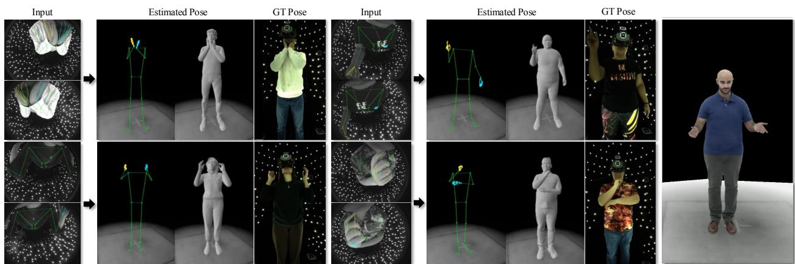
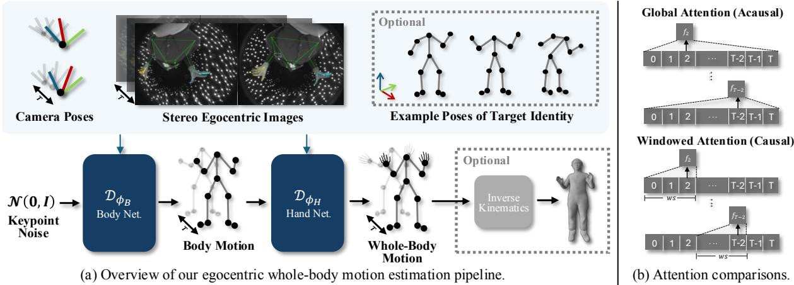
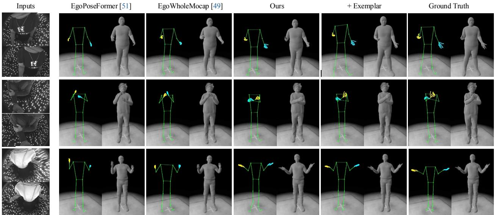
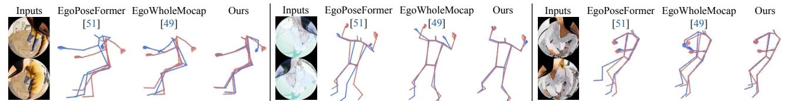

# REWIND: Real-Time Egocentric Whole-Body Motion Diffusion with Exemplar-Based Identity Conditioning

Jihyun Lee1,2 Weipeng Xu1 Alexander Richard1 Shih-En Wei1 Shunsuke Saito1 Shaojie Bai1 Te-Li Wang1 Minhyuk Sung2 Tae-Kyun Kim2,3 Jason Saragih1

1 Codec Avatars Lab, Meta 2 KAIST 3 Imperial College London

https://jyunlee.github.io/projects/rewind

  
(a) Egocentric whole-body motion estimation results.  
(b) Avatar driving example.

Figure 1. Real-time and high-fidelity whole-body motion estimation from stereo egocentric images. We propose REWIND, a nove egocentric image-conditioned diffusion model for high-quality 3D whole-body motion estimation. REWIND is real-time, causal, and generalizable to unseen motion lengths, making it seamlessly applicable for driving photorealistic avatars or meshes. Please refer to the supplementary video, which demonstrates that REWIND estimates significantly more plausible motions compared to existing methods.

## Abstract

We present REWIND (Real-Time Egocentric Whole-Body Motion Diffusion), a one-step diffusion modelfor realtime, high-fidelity human motion estimation from egocentric image inputs. While an existing method for egocentric whole-body (i.e., body and hands) motion estimation is nonreal-time and acausal due to diffusion-based iterative motion refinement to capture correlations between body and hand poses, REWIND operates in a fully causal and realtime manner. To enable real-time inference, we introduce (1) cascaded body-hand denoising diffusion, which effectively models the correlation between egocentric body and hand motions in a fast, feed-forward manner, and (2) diffusion distillation, which enables high-quality motion estimation with a single denoising step. Our denoising diffusion model is based on a modified Transformer architecture, designed to causally model output motions while enhancing generalizability to unseen motion lengths. Addi-

tionally, REWIND optionally supports identity-conditioned motion estimation when identity prior is available. To this end, we propose a novel identity conditioning method based on a small set ofpose exemplars ofthe target identity, which further enhances motion estimation quality. Through extensive experiments, we demonstrate that REWIND significantly outperforms the existing baselines both with and without exemplar-based identity conditioning.

## 1. Introduction

Egocentric human motion estimation is essential for delivering immersive and realistic experiences in AR/VR applications, such as gaming and telepresence. For instance, imagine engaging in a conversation with your friend in a virtual environment. The quality of estimated whole-body (i.e., body and hands) motion is crucial in creating a realistic experience in interpersonal communication, while subtle pose changes (e.g., finger poses in Fig. 1b) can significantly impact the intended message.

Developing a live-drivable method that enables accurate and realistic egocentric whole-body motion estimation is thus essential. However, existing egocentric pose or motion estimation methods fall short in achieving the accuracy and speed needed for highly realistic VR/AR experiences. They typically focus on tracking body-only motions [1, 2, 6, 23, 47, 48, 51], neglecting the importance of hands in fully capturing the intricacies of human motions [49]. Directly extending the existing body-only estimation methods for whole-body estimation yields suboptimal results, as body and hands significantly differ in scale in both input images and output motions [5, 11, 31, 37, 54, 59].

To address this challenge, EgoWholeMocap [49], the first method for whole-body motion estimation from egocentric images, proposes to leverage specialist models for body and hands. It first performs per-frame pose estimation for body and hands separately, and then refines the output poses using an unconditional whole-body motion prior to model correlations between different body parts. While this approach improves whole-body motion estimation performance, it is non-real-time and acausal (i.e., depends on future information) due to iterative refinement steps using an acausal diffusion-based motion prior. Thus, it cannot be used for real-time egocentric motion tracking applications.

In this work, we introduce REWIND (Real-Time Egocentric Whole-Body Motion Diffusion), a one-step diffusion model for real-time, high-fidelity human motion estimation from egocentric image inputs. To achieve both fast inference speed and high whole-body motion accuracy, we first introduce cascaded body-hand denoising diffusion (Sec. 3.1), where body motion is sampled first and then hand motion is sampled conditioned on the previously sampled upper body motion. This cascading scheme approximately models the correlation between body and hands in a fast, feed-forward manner (cf. iterative whole-body refinement used in EgoWholeMocap [49]) while still inheriting the advantages of specialized body and hand estimation (e.g., effectively handling domain differences). We further argue that this approach is particularly effective for our targeted egocentric image inputs, where hands are often placed outside the field of view or occluded. As hands and upper body poses are known to have meaningful correlations [33], conditioning on estimated upper body motion – often provided with more reliable input egocentric observations (e.g., Fig. 1a) – can effectively reduce hand motion ambiguities.

We build these specialist denoising diffusion models based on causal relative-temporal Transformer (Sec. 3.2), which is fully causal and generalizable to unseen motion lengths. We use windowed relative-temporal attention to learn temporal motion features that are invariant to the total sequence length or absolute timesteps, in contrast to motion diffusion models based on vanilla attention (e.g., motion prior used in EgoWholeMocap [49]). During network training, we employ diffusion distillation (Sec. 3.3) to enable real-time inference (> 30 FPS) with a single denoising step, while preserving high output motion quality.

Not only introducing an effective real-time framework, we take a step further and explore identity-aware motion estimation to further enhance output quality when an additional identity prior is available. To this end, we propose novel exemplar-based identity conditioning (Sec. 3.4), where motion estimation is conditioned on the target identity parameterized by a small set of pose exemplars. While this identity parameterization has not yet been considered in existing works on human pose or motion estimation, we empirically find it to be the most effective compared to widely used identity parameterizations (e.g., height, bone lengths, shape parameters). In the experiments, REWIND achieves state-of-the-art whole-body motion estimation results, both with and without additional identity priors. Please also refer to our supplementary video, where REWIND estimates significantly more plausible motions than the baselines [49, 51], even from challenging egocentric input observations (e.g., occluded or truncated views).

## 2. Related Work

## 2.1. Egocentric Body Pose Estimation

Recently, various egocentric body pose or motion estimation methods have been proposed for different input domains (e.g., sensors [8, 21, 22] or images [26, 49, 51, 52]). Here, we focus on existing methods for estimating the pose of a head-mounted device wearer from image inputs, which are most relevant to our work. These methods can be broadly categorized into two groups based on whether they utilize front-facing or down-facing egocentric cameras. Methods using front-facing egocentric cameras [15, 25, 26, 29, 32, 52] assume that the wearer’s body is not visible from the input viewpoint. Thus, they formulate the problem as a motion generation or inpainting task, conditioned on head-mounted camera poses [26, 52], hand poses [52], or the body poses of social interactees [32]. On the other hand, methods using down-facing egocentric cameras [1, 2, 6, 23, 47–49, 51] focus on recovering 3D body poses from visual observations. However, they still suffer from self-occlusions and truncated views caused by the egocentric viewpoint. To address these challenges, some methods incorporate motion priors [47, 49] or scene information [2, 48] to reduce pose ambiguities, while others propose novel network architectures to better handle uncertainty [6, 23]. In this work, we focus on egocentric motion estimation using stereo down-facing cameras. Unlike most existing methods, which estimate body-only poses [1, 2, 6, 23, 47, 48, 51], we aim to estimate wholebody poses (i.e., body and hands) for more comprehensive motion modeling.

## 2.2. Whole-Body Pose Estimation

Whole-body pose or motion estimation aims to jointly predict the poses of body and hands. The main technical challenge lies in the scale and pose distribution differences between different body parts. To address this, most existing works [5, 11, 31, 37, 54, 59] use separate models to predict each body part and merge the results, often with an optional integration network [11, 54] or post-processing [37] to improve alignment between the body parts. However, these methods primarily focus on exocentric image inputs, leaving egocentric whole-body pose estimation largely unexplored. Recently, EgoWholeMocap [49] introduced thefirst whole-body pose estimation method for egocentric image inputs, based on separate body and hand pose estimation with diffusion-based motion refinement. While EgoWhole-Mocap employs an unconditional whole-body motion diffusion prior for post-processing, we directly train a motion diffusion model conditioned on egocentric inputs to predict motion that is more coherent with the input observation.

## 2.3. Motion Diffusion Models

We review existing motion diffusion models that model arbitrarily long motion and identity-conditioned motion, which are two key objectives of our work. Since these challenges remain underexplored in egocentric motion estimation, we primarily discuss prior work on unconditional or text-conditional motion generation.

Arbitrarily long motion. Some works propose motion diffusion models that can generalize to motions longer than training instances [4, 34, 39, 56]. For example, DoubleTake [39], STMC [34], and DiffCollage [56] propose generating multiple motion segments, each with a temporal length within the training distribution, and then applying a special sampling mechanism to smoothly combine them into a longer motion. However, these methods rely on future information for motion composition. The most related work to ours is FlowMDM [4], which introduces a novel Transformer-based architecture [46] using relative positional encoding [42] to improve temporal extrapolation. However, it still relies on future information and partially incorporates absolute positional encoding [46], which limits its temporal generalization capability. In this work, we propose utilizing relative positional encoding [42] similar to FlowMDM, but we completely eliminate dependencies on (1) absolute frame timesteps to extract motion features invariant to sequence length, and (2) future information to make it more suitable for real-time applications (Sec. 3.2). Identity-conditioned motion. A few recently proposed methods focus on identity-conditioned motion generation [44, 50]. HUMOS [44, 50] conditions the motion diffusion model on SMPL [27] shape parameters. Due to the lack of datasets with paired motion and identity annotations [44], it proposes a novel loss function to learn identity-specific motions from unpaired training data. SMD [50] introduces a spectral feature encoder to integrate the template mesh of the target identity into the motion diffusion model. Inspired by these motion diffusion models proposed for unconditional or text-conditional motion generation, we introduce the first method for identity-conditioned egocentric motion estimation.

## 3. Egocentric Whole-Body Motion Estimation

Our goal is to estimate first-person whole-body motion from egocentric image inputs in real time. Motivated by existing image-based pose or motion estimation methods that demonstrate that diffusion models [17, 40] are effective at handling occluded or out-of-view body observations [10, 14, 18, 41, 49, 52, 57, 58], we propose a diffusionbased approach. Formally, our denoising diffusion network models whole-body motion conditioned on input egocentric observations:

$$
p _ { \phi } \left( \mathbf { J } ^ { 1 : T } \mid \Phi ^ { 1 : T } \right) ,\tag{1}
$$

where $p _ { \phi }$ denotes the model distribution parameterized by the diffusion network weights . $\mathbf { J } ^ { 1 : T }$ represents a sequence of whole-body poses, and $\Phi ^ { 1 : T }$ denotes a sequence of input egocentric observations over $T$ frames. At each timestep $t \in \mathsf { \Gamma } ( 1 , T )$ , a whole-body pose $\mathbf { J } ^ { t }$ is represented by $N _ { \mathbf { J } }$ number of 3D keypoints, and an egocentric observation $\Phi ^ { t }$ consists of stereo egocentric images and camera poses:

$$
\begin{array} { r } { \Phi ^ { t } = [ { \bf I } _ { L } , { \bf I } _ { R } , { \bf C } _ { L } , { \bf C } _ { R } ] . } \end{array}\tag{2}
$$

$\mathbf { I } _ { v \in \{ L , R \} } \ \in \ \mathbb { R } ^ { C \times W \times H }$ is an egocentric image captured from the viewpoint $v ,$ and $\mathbf { C } _ { v \in \{ L , R \} } = [ \mathbf { R } _ { v } | \mathbf { t } _ { v } ] \in \mathbb { R } ^ { 3 \times 4 }$ is the corresponding camera pose, with camera rotation $\mathbf { R } _ { v } \in \mathbb { R } ^ { 3 \times 3 }$ and translation $\mathbf { t } _ { v } \in \mathbb { R } ^ { 3 \times 1 }$ Note that SLAM systems in recent head-mounted devices [9] achieve millimeter-level accuracy [52], thus camera poses are considered as additional inputs in recent egocentric tracking methods [15, 28, 52]. In the following subsections, we discuss each component of our method, designed to achieve real-time, fully causal whole-body motion estimation.

## 3.1. Cascaded Body-Hand Denoising Diffusion

Whole-body motion estimation is challenging due to the scale and pose distribution differences between body and hands [5, 11, 31, 37, 54, 59]. To address this, the current state-of-the-art method for egocentric whole-body motion estimation (EgoWholeMocap [49]) employs specialist models for body and hand pose estimation to handle domain differences, along with output refinement using an unconditional motion diffusion prior to model correlations between different body parts. However, we argue that this approach may be suboptimal, because (1) the additional refinement steps slow down inference speed, and (2) the use of an unconditional motion prior is less effective for predicting motions highly coherent with the input image observations. To address these, we propose cascaded body-hand denoising diffusion, a crucial component that enhances both the accuracy and efficiency of egocentric whole-body motion estimation.

  
Figure 2. (a) Pipeline overview. Given a sequence of stereo egocentric images and camera poses, our diffusion model first estimates 3D body motion and then estimates 3D hand motion conditioned on the 3D upper body motion. Our motion estimation can be optionall conditioned on the exemplar-based identity prior when available (Sec. 3.4). Through an optional inverse kinematics step (refer to the supplementary for details), our tracking results can be used to drive meshes or photorealistic avatars. (b) Attention comparisons. Com pared to vanilla self-attention (i.e., acausal, global attention) commonly used in existing works, the proposed causal windowed attention conditioned on relative timesteps enhances generalization to unseen motion lengths (Sec. 3.2).

In a nutshell, our idea is to first estimate a body motion, and then condition the subsequent hand motion estimation on the estimated 3D upper body motion. This was inspired by existing work [33] that demonstrated a meaningful correlation between 3D upper body and hand poses. Note that our cascading approach enables the fast, feedforward capture of the approximated correlation between body and hands (cf. iterative whole-body refinement in EgoWholeMocap [49]), while still benefiting from specialized body and hand estimation to effectively handle domain differences. We also argue that this approach is particularly effective for egocentric hand estimation, where input hand observations are often highly ambiguous (e.g., hands are frequently placed outside of the field of view or occluded by other body parts as shown in Fig. 1). By conditioning the output hand motion on the estimated 3D upper body motion, which is often more reliably observed in the input egocentric views, we can effectively reduce ambiguity in hand estimation.

Formally, we reformulate the egocentric-conditioned whole-body motion distribution in Eq. 1 as:

$$
p _ { \phi } \left( \mathbf { J } ^ { 1 : T } \mid \Phi ^ { 1 : T } \right) \approx p _ { \phi _ { B } } \left( \mathbf { J } _ { B } ^ { 1 : T } \mid \Phi ^ { 1 : T } \right) p _ { \phi _ { H } } \left( \mathbf { J } _ { H } ^ { 1 : T } \mid \mathbf { J } _ { B _ { u p p e r } } ^ { 1 : T } , \Phi ^ { 1 : T } \right) ,\tag{3}
$$

where the subscripts $B , ~ B _ { u p p e r }$ , and H represent the body, upper body, and hands, respectively. During training, we separately train body and hand specialist models to learn $p _ { \phi _ { B } } \left( \mathbf { J } _ { B } ^ { 1 : T } \mid \Phi ^ { 1 : T } \right)$ and $p _ { \phi _ { H } } \left( \mathbf { J } _ { H } ^ { 1 : T } \mid \mathbf { J } _ { B _ { u p p e r } } ^ { 1 : T } , \ \Phi ^ { 1 : T } \right)$ ), respectively. During inference, we simply sample from each of the learned distributions in a cascaded manner. In the experiments (Sec. 4), we empirically demonstrate that this cascaded approach outperforms (1) a method that estimates body and hands with specialist models followed by iterative whole-body refinement (EgoWholeMocap [49]), and (2) a method tha estimates body and hands in a joint, parallel manner.

## 3.2. Causal Relative-Temporal Transformer

We now describe our network architecture design for the specialist models for body and hands. Recent motion diffusion models have demonstrated that Transformer encoderbased architectures are highly effective for learning motion distributions and have become the dominant choice in the field (e.g., [4, 39, 43–45, 49, 55]). However, these models typically generate fixed-length motions using vanilla self-attention with absolute timestep encoding, which limits their ability to generalize to motion lengths unseen during training. To address this, several methods have been proposed for diffusion-based long motion generation or composition [4, 34, 39, 56], but they rely on future information for temporal extrapolation, as discussed in Sec. 2.3.

In this work, we introduce the causal relative-temporal Transformer, a modified Transformer encoder-based architecture that learns temporal features invariant to total motion length or future frames, making it fully causal and inherently generalizable to arbitrary motion lengths. In a nutshell, our key idea is to adopt Rotary Positional Encoding (RoPE) [42] to condition attention scores on relative temporal distances between input tokens while restricting each token’s neighborhood (i.e., the domain over which selfattention is applied) to ws $\in \mathbb { N }$ past frames. Formally, our self-attention function $A ( \cdot , \cdot , \cdot ) _ { j }$ for j-th frame given query, key value matrices is defined as:

$$
\mathcal { A } ( \mathbf { Q } , \mathbf { K } , \mathbf { V } ) _ { j } = \frac { \sum _ { i = j - w s } ^ { j } \mathbf { R } _ { j } \theta ( \mathbf { q } _ { j } ) ^ { \mathrm { T } } \mathbf { R } _ { i } \rho ( \mathbf { k } _ { i } ) \mathbf { v } _ { i } } { \sum _ { i = j - w s } ^ { j } \theta ( \mathbf { q } _ { j } ) ^ { \mathrm { T } } \rho ( \mathbf { k } _ { i } ) } ,\tag{4}
$$

where Q, K, $\mathbf { V } \in \mathbb { R } ^ { D \times T }$ are query, key, and value matrices, and $\mathbf { q } _ { i } , \mathbf { k } _ { i } , \mathbf { v } _ { i } \in \mathbb { R } ^ { D }$ denote the column vectors of each matrix for timestep i, respectively. $\theta ( \cdot )$ and $\rho ( \cdot )$ are feature projection functions (e.g., MLP). $\mathbf { R } _ { i } \in \mathrm { S O } ( D )$ is a D-dimensional rotation matrix parameterized by timestep i as proposed in [42]. Note that the attention score, involving the dot product between $\mathbf { R } _ { j } \theta ( \mathbf { q } _ { j } )$ and $\mathbf { R } _ { i } \rho ( \mathbf { k } _ { i } )$ , depends on the relative rotation $\mathbf { R } _ { i - j }$ parameterized by the relative timestep of the i-th token with respect to the j-th token. Thus, the output features remain invariant to their absolute timesteps, unlike the positional encoding used in vanilla self-attention [46]. In addition, our self-attention for j-th frame is performed over the input frames within the temporal window $\left[ j - w s , \ j \right]$ . Since the output features depend only on a fixed number of past frames, they remain invariant to the total motion length and do not rely on future information. In the experiments (Sec. 4), we demonstrate the effectiveness of this design choice in comparison to other temporal model variants.

Building body and hand specialist models. Using the proposed causal relative-temporal Transformer, we now discuss the details of building the denoising diffusion networks $\mathcal { D } _ { \phi _ { B } } ( \cdot )$ and $\mathcal { D } _ { \phi _ { H } } ( \cdot )$ to model the distributions $p _ { \phi _ { B } } ( \cdot )$ and $p _ { \phi _ { H } } ( \cdot )$ in Eq. 3, respectively. Note that we use the same network design for both the body and hand specialist models, with the only difference being that the hand model takes an additional upper body conditioning input. Thus, for simplicity, we will base our explanation on the body model and omit the body and hand subscripts (B and H). In overview, our network takes as inputs a sequence of egocentric observations $\Phi ^ { 1 : T }$ , a sequence of diffused keypoints $\tilde { \mathbf { J } } _ { k } ^ { 1 : T }$ , and the corresponding diffusion time $k ,$ and estimates a sequence of clean keypoints $\tilde { \mathbf { J } } _ { 0 } ^ { 1 : T }$ at diffusion time 0. First, we extract frame-based features for the egocentric observations at each timestep t by encoding (1) 2D keypoints and their uncertainty scores estimated from the images, (2) camera parameters, and (3) diffusion time. Next, we concatenate these conditioning features to the input diffused keypoints $\tilde { \mathbf { J } } _ { k } ^ { 1 : T }$ and apply graph convolutions [7] on the human skeletal graph to extract structural features. We then apply our causal relative-temporal transformer (Sec. 3.2) to extract temporal features, followed by a regression head to estimate the final motion. For the diffusion formulation, we use DDPM [17] for training and DDIM [40] for inference. For additional implementation and training details (e.g., full loss functions), we refer readers to the supplementary material.

## 3.3. Diffusion Distillation

While diffusion models have shown effective for human pose or motion estimation [10, 14, 18, 41, 49, 52, 57, 58], their inference is typically slow due to multi-step sampling. To mitigate this, we leverage diffusion distillation [12, 38, 53] to improve sampling efficiency. Specifically, we distill the original multi-step diffusion model $\mathcal { D } _ { \phi } ^ { T }$ into a single-step lightweight model $\mathcal { D } _ { \phi * } ^ { S }$ using Score Distillation Sampling (SDS) loss, inspired by [35, 38]. Given the keypoints estimated by the student model $\hat { \mathbf { J } } _ { 0 } ^ { 1 : T } ~ \gets$ $\mathcal { D } _ { \phi * } ^ { S } ( \tilde { \mathbf { J } } _ { K } ^ { 1 : T } , \Phi ^ { 1 : T } , K )$ , where K denotes the maximum diffusion timestep, our distillation loss is defined as:

$$
\mathcal { L } _ { d i s t i l l } = | | \mathcal { D } _ { \phi } ^ { T } ( \mathcal { E } ( \hat { \mathbf { J } } _ { 0 } ^ { 1 : T } , k _ { s m a l l } ) , \Phi ^ { 1 : T } , k _ { s m a l l } ) - \hat { \mathbf { J } } _ { 0 } ^ { 1 : T } | | _ { 2 } ,\tag{5}
$$

where $\mathcal { E } ( \cdot )$ is a forward diffusion function [17, 35] that adds a small noise corresponding to diffusion timestep $k _ { s m a l l }$ to the estimated keypoints $\hat { \mathbf { J } } _ { 0 } ^ { 1 : T }$ . Intuitively, this distillation loss encourages the student model to sample keypoints that the teacher model deems plausible when conditioned on the same egocentric observations. Unlike the existing approach [38] that incorporates an additional adversarial loss to improve single-step sampling quality for image generation, we find that SDS loss alone is sufficient to achieve SotA results in egocentric motion estimation while achieving an inference speed of over 30 FPS.

## 3.4. Exemplar-Based Identity Conditioning

While the proposed method already achieves state-of-theart results in egocentric motion estimation, we take a step further by exploring identity-aware motion estimation to further enhance output quality. We hypothesize that incorporating prior information about the identity performing the motion (e.g., body shape, posture style) can help reduce motion ambiguity when such prior is additionally available. In particular, we find that exemplar-based identity conditioning, which conditions the output motion on a small set of example 3D poses of the target identity, is highly effective. This approach is inspired by recent work on representation learning for face images [3], which demonstrates that conditioning on a set of example images of the target identity is effective for learning identity-aware features, significantly improving final reconstruction performance (see [3] for details). Analogously, in our work, example poses of the target identity can provide useful information about body scale and posture style of that particular person.

Formally, let $\{ \mathbf { J } _ { i } ^ { \mathcal { T } } \} _ { i = 1 , \dots , N _ { O } }$ denote a set of $N _ { O }$ example poses of the target identity  observed prior to the motion estimation phase, where $\mathbf { \bar { J } } _ { i } ^ { \mathcal { T } } \in \mathbb { R } ^ { N _ { \mathbf { J } } \times 3 }$ is represented as 3D keypoints. This pose set can be obtained, for example, through a simple pose registration stage where we capture monocular photos of the target person performing natural motions and estimate 3D poses from these images. In our experiments, we estimate these poses by fitting a parametric body model to 2D keypoints estimated from the input images using an off-the-shelf model (Sapiens [24]), along with the person’s height to resolve scale ambiguity (see the supplementary material for details). Once the example poses are registered, they can be used to enhance the quality of all subsequent motion estimation sessions for that identity. Notably, this prior is less cumbersome to acquire than other priors (e.g., registered scene geometry) used in some of the existing egocentric motion estimation methods [2, 48] to reduce motion ambiguities.

Given a set of example poses for the target identity, we perform set encoding to extract features invariant to the order of poses. We apply an MLP-based encoder ( ) shared across the input poses and aggregate the resulting features using a symmetric function $\rho ( \cdot )$ as follows:

$$
f _ { e x } ^ { \mathcal { T } } = \rho ( \gamma ( \mathbf { J } _ { 0 } ^ { \mathcal { T } } ) , \gamma ( \mathbf { J } _ { 1 } ^ { \mathcal { T } } ) , . . . , \gamma ( \mathbf { J } _ { O - 1 } ^ { \mathcal { T } } ) , \gamma ( \mathbf { J } _ { O } ^ { \mathcal { T } } ) ) .\tag{6}
$$

In practice, we instantiate $\rho ( \cdot )$ as a max-pooling function. We finally incorporate this identity feature $f _ { e x } ^ { \breve { \ Z } }$ into our framework using AdaIN [19], a technique widely used for incorporating style conditions. In Sec. 4, we empirically demonstrate that this exemplar-based identity prior results in greater performance improvements compared to other identity priors (e.g., shape parameters, bone lengths). To the best of our knowledge, this is also the first study to analyze the effectiveness of different identity priors in egocentric motion estimation.

## 4. Experiments

## 4.1. Dataset

Unlike exocentric (i.e., third-person view) image-based motion estimation, there had been no benchmark proposed for egocentric whole-body motion estimation with high-quality body and hand annotations. To address this, EgoWholeMocap [49] has recently created a large-scale syntehtic dataset. However, only their samples for training frame-based models (i.e., temporally discontinuous samples) are publicly available, limiting their use for our temporal model experiments. The synthetic dataset created by SimpleEgo [6] also contains whole-body pose annotations, but it is not temporal as well. Thus, we consider the following datasets for our experiments: (1) ColossusEgo, a large-scale real dataset that we have newly collected, and (2) UnrealEgo [1, 2], a synthetic dataset originally proposed for egocentric body-only pose estimation but containing auxiliary hand annotations.

ColossusEgo. We have collected a large-scale real dataset consisting of over 2.8Mframes of500 identities performing diverse social motions while wearing head-mounted stereo cameras. To the best of our knowledge, this is the largest real image dataset for egocentric first-person pose and motion estimation. To obtain accurate 3D pose annotations, we use a multi-view capture system with 200 calibrated cameras. We apply 2D keypoint detection from highly dense viewpoints, followed by triangulation, to annotate precise 3D whole-body keypoints (see the ground truth samples in Fig. 3). For our experiments, we randomly sample captures from 20 identities for validation and 30 for testing, with the remaining captures used for training.

UnrealEgo [1, 2]. UnrealEgo1 [1] and UnrealEgo2 [1] are synthetic datasets created by rendering RenderPeople [13] 3D human models performing Mixamo [20] motions. Although originally proposed for egocentric body-only pose estimation [6, 47], these datasets provide auxiliary hand pose annotations and temporal sequences, making them suitable for our validation. For our experiments, we use samples from both UnrealEgo1 and UnrealEgo2, while filtering out sequences shorter than 2 seconds. We randomly sample 200 sequences for validation and 300 sequences for testing, with the remaining sequences used for training1. Note that we do not use this dataset for identity-aware motion estimation experiments, as its ground truth motions are not identity-dependent.

## 4.2. Baselines and Evaluation Metrics

Baselines. We consider the two most recent state-of-the-art methods for body pose or motion estimation from downfacing egocentric cameras: EgoWholeMocap [49] and Ego-PoseFormer [51]. EgoWholeMocap [49] is the most relevant baseline, as it is the first egocentric whole-body motion estimation method. However, since it was originally designed for monocular egocentric image inputs, we modified its reverse motion diffusion process to adapt to stereo-based pose estimates for fair comparisons. EgoPoseFormer [51] is the most recently proposed egocentric pose estimation method, but it only estimates body keypoints. To ensure a fair comparison, we extended its framework to predict whole-body keypoints. For more details on the baseline modifications, please refer to the supplementary material.

Temporal inference. EgoPoseFormer [51] and our method inherently generalize to arbitrary-length motions due to the use of a frame-based model and a temporal model invariant to the input sequence lengths, respectively. In contrast, EgoWholeMocap [49] assumes a fixed motion length of T = 196. Thus, for fair comparisons, we evaluate all models on test sequences adjusted to lengths that are multiples of 196. We later show that, despite being trained on motion segments of T = 50, our model seamlessly generalizes to longer motions and outperforms EgoWholeMocap.

Evaluation metrics. We use Mean Per Joint Position Error (MPJPE) and Procrustes-Aligned Mean Per Joint Position Error (PA-MPJPE), which are commonly used to evaluate the accuracy of human motion estimation [2, 36, 47, 49].

Table 1. Quantitative comparisons on egocentric whole-body motion estimation.  
(a) Comparison results on the ColossusEgo dataset. In Rows A-C, our approach outperforms the existing SotA egocentric pose and motion estimation methods [49, 51] in all metrics. In Rows D-H, our exemplar-based identity priors achieve higher performance improvements compared to other identity priors. Exemplar and Exemplar† denote our identity-conditioning method with the estimated and the ground truth example 3D poses, respectively.
<table><tr><td></td><td>Method</td><td> $\mathbf { M P J P E _ { B o d y } }$ </td><td> $\mathrm { P A - M P J P E _ { B o d y } }$ </td><td> $\mathbf { M P J P E _ { H a n d } }$ </td><td> $\mathrm { P A - M P J P E } _ { \mathrm { H a n d } }$ </td><td>Bone Err.</td><td>Foot Skate</td></tr><tr><td>A</td><td>EgoPoseFormer [51]</td><td>64.01</td><td>49.62</td><td>33.29</td><td>15.23</td><td>13.07</td><td>1.63</td></tr><tr><td>B</td><td>EgoWholeMocap [49]</td><td>62.49</td><td>43.26</td><td>25.67</td><td>12.83</td><td>10.78</td><td>0.46</td></tr><tr><td>C</td><td>REWIND (Ours)</td><td>53.83</td><td>41.42</td><td>21.18</td><td>10.21</td><td>9.78</td><td>0.21</td></tr><tr><td>D</td><td>+ Height</td><td>51.98</td><td>40.39</td><td>21.10</td><td>9.80</td><td>9.24</td><td>0.21</td></tr><tr><td>E</td><td>+ Shape Parameter</td><td>51.40</td><td>39.43</td><td>21.17</td><td>10.10</td><td>7.31</td><td>0.20</td></tr><tr><td>F</td><td>+ Bone Lengths</td><td>49.74</td><td>39.40</td><td>19.81</td><td>9.85</td><td>6.19</td><td>0.21</td></tr><tr><td>G</td><td>+ Exemplar (Ours)</td><td>48.45</td><td>33.15</td><td>19.20</td><td>9.03</td><td>5.86</td><td>0.17</td></tr><tr><td>H</td><td>+ Exemplar† (Ours)</td><td>38.99</td><td>28.52</td><td>17.33</td><td>8.34</td><td>3.47</td><td>0.18</td></tr></table>

(b) Comparison results on the UnrealEgo dataset [1, 2]. Ours outperforms the baselines across all metrics. Note that the Foot Skate metric is not considered for this dataset, as the motions are defined in a camera-centric coordinate system.
<table><tr><td></td><td>Method</td><td> $\mathbf { M P J P E _ { B o d y } }$ </td><td> $\mathrm { P A - M P J P E _ { B o d y } }$ </td><td> $\mathbf { M P J P E _ { H a n d } }$ </td><td> $\mathrm { P A - M P J P E } _ { \mathrm { H a n d } }$ </td><td>Bone Err.</td></tr><tr><td>A</td><td>EgoPoseFormer [51]</td><td>53.74</td><td>41.83</td><td>25.19</td><td>11.52</td><td>8.61</td></tr><tr><td>B</td><td>EgoWholeMocap [49]</td><td>49.10</td><td>39.25</td><td>25.07</td><td>10.59</td><td>9.01</td></tr><tr><td>C</td><td>REWIND (Ours)</td><td>37.23</td><td>28.04</td><td>20.45</td><td>9.04</td><td>6.22</td></tr></table>

  
Figure 3. Qualitative comparisons on the ColossusEgo dataset. While our framework estimates 3D keypoints, we also employ inverse kinematics with per-identity meshes for more effective visual comparisons (refer to the supplementary material for details). Our method estimates significantly more accurate and natural motions compared to the existing state-of-the-art methods [49, 51]. The additional exemplar-based identity prior further enhances motion accuracy.

We also report Foot Skate, which measures foot sliding distance [44], and Bone Err., which is the L2 distance between the predicted and ground truth bone lengths. All metrics are reported in millimeters. For the diffusion-based methods (ours and EgoWholeMocap [49]), we follow [49] and report the average scores of five evaluations.

## 4.3. Egocentric Whole-Body Motion Estimation

In Tab. 1, we report the quantitative comparison results for egocentric whole-body motion estimation, where our method outperforms the baselines across all metrics on both datasets. Note that EgoWholeMocap [49] performs motion refinement using an unconditional motion prior. As a result, we observe that the output motions are less aligned with the input egocentric observations when the initial estimates are suboptimal. While EgoPoseFormer [51] performs direct keypoint estimation similar to ours, it estimates poses on a per-frame basis without utilizing temporal context. For qualitative comparisons, please refer to Fig. 3-4 and the supplementary video, where motions estimated by our method appear significantly more accurate and natural.

## 4.4. Identity-Aware Motion Estimation

We now investigate the effectiveness of our exemplar-based identity conditioning method for estimating identity-aware motion. For the baselines, we consider settings where the identity condition is available in the form of height, shape parameters, and bone lengths. In Tab. 1a, our exemplarbased identity conditioning is the most effective among these baselines. Note that Exemplar denotes our main identity conditioning method based on 10 example poses of the target identity predicted from monocular images, while Exemplar† represents a variant that utilizes 10 ground truth poses, e.g., obtained through a multi-view capture process [16]. Also refer to our qualitative results in Fig. 3, where the exemplar-based identity conditioning effectively reduce motion ambiguities, e.g., leading to motions that better capture the person’s lower body posture style in the first row of Fig. 3. To the best of our knowledge, this is the first study to analyze the effectiveness of identity priors in egocentric motion estimation.

  
Figure 4. Qualitative comparisons on the UnrealEgo dataset [1, 2]. Red represents the ground truth skeleton, while blue represents the predicted skeleton. Our method estimates more accurate motions compared to the existing baselines [49, 51].

Table 2. Ablation study results on the ColossusEgo dataset (Sec. 4.5). Our method outperforms its variants across all metrics.
<table><tr><td></td><td>Method</td><td> $\mathbf { M P J P E _ { B o d y } }$ </td><td> $\mathrm { P A - M P J P E _ { B o d y } }$ </td><td> $\mathbf { M P J P E _ { H a n d } }$ </td><td> $\mathrm { P A - M P J P E } _ { \mathrm { H a n d } }$ </td><td>Bone Err.</td><td>Foot Skate</td></tr><tr><td>A</td><td>No Diffusion</td><td>57.34</td><td>44.26</td><td>27.04</td><td>14.99</td><td>10.83</td><td>0.20</td></tr><tr><td>B</td><td>Sep. Body-Hand</td><td></td><td></td><td>23.07</td><td>11.23</td><td></td><td></td></tr><tr><td>C</td><td>Joint Body-Hand</td><td>55.09</td><td>42.47</td><td>24.02</td><td>11.34</td><td>10.73</td><td>0.21</td></tr><tr><td>D</td><td>Autoregressive</td><td>58.14</td><td>44.33</td><td>24.19</td><td>10.70</td><td>10.72</td><td>0.21</td></tr><tr><td>E</td><td>No Diffusion Distill.</td><td>56.12</td><td>43.85</td><td>21.34</td><td>10.33</td><td>11.05</td><td>0.20</td></tr><tr><td>F</td><td>REWIND (Ours)</td><td>53.83</td><td>41.42</td><td>21.18</td><td>10.21</td><td>9.78</td><td>0.21</td></tr><tr><td>G</td><td>REWIND (Multi-Step)</td><td>46.18</td><td>35.26</td><td>20.85</td><td>9.43</td><td>4.91</td><td>0.21</td></tr></table>

## 4.5. Ablation Study

In Tab. 2, we present our ablation study results to investigate the effectiveness of each of the proposed modules.

Regression vs. diffusion (Row A). No Diffusion represents a variant of our method where motion estimation is performed via regression instead of denoising diffusion. Our method outperforms this variant, which aligns with the observations from existing diffusion-based pose or motion estimation works [10, 14, 18, 41, 49, 52, 57, 58].

Cascaded body-hand estimation (Rows B-C). Sep. Body-Hand and Joint Body-Hand represent our method variants in which body and hand keypoints are separately estimated and whole-body keypoints are jointly estimated, respectively. Compared to these variants, our cascaded approach yields better results due to the advantages discussed in Sec. 3.1.

Temporal network architecture (Row D). Autoregressive is our method variant using autoregressive modeling, which could serve as an alternative for estimating arbitrary-length sequences. However, autoregressive models have some limitations, such as exposure bias from teacher forcing [30], due to the direct reliance on previous estimation outputs. Our proposed model outperforms this variant, validating our design choice.

Diffusion distillation (Row E). No Diffusion Distill. is our method variant where a one-step diffusion model is directly trained without diffusion distillation. Our distilled mode (Row F) achieves better results. For reference, we also report the results of the multi-step teacher diffusion model in Row G. While our one-step diffusion model yields the best results for real-time tracking, the multi-step diffusion model still provides superior performance, offering an alternative for applications without efficiency constraints.

Time comparisons. We note that the inference time of our framework is 32 ms and 274 ms with and without distillation, respectively, on a single A100 GPU. The inference time of the existing SotA baseline (EgoWholeMocap [49]) is 2576 ms due to the iterative post-processing steps.

## 5. Conclusion

We introduced a real-time, fully causal framework that enables high-quality whole-body motion estimation from egocentric images. To this end, we proposed (1) cascaded denoising diffusion, (2) a causal relative-temporal Transformer trained with diffusion distillation, and optionally, (3) exemplar-based identity conditioning. We empirically showed that ours leads to more accurate and natural motions compared to the competitive baselines.

Limitations. Although our method outperforms existing state-of-the-art methods, we observed that a small portion of the reconstructed motions leads to self-penetrations. Investigating effective methods to avoid self-penetrations in egocentric human motion estimation would be an interesting direction for future work.

Acknowledgements. T-K. Kim was supported by the NST grant (CRC 21011, MSIT), IITP grants (RS-2023- 00228996, RS-2024-00459749, MSIT) and the KOCCA grant (RS-2024-00442308, MCST). M. Sung was supported by the NRF grant (RS-2023-00209723) and IITP grants (RS-2022-II220594, RS-2023-00227592, RS-2024- 00399817), funded by the Korean government (MSIT).

## References

[1] Hiroyasu Akada, Jian Wang, Soshi Shimada, Masaki Takahashi, Christian Theobalt, and Vladislav Golyanik. Unrealego: A new dataset for robust egocentric 3d human motion capture. In ECCV, 2022. 2, 6, 7, 8

[2] Hiroyasu Akada, Jian Wang, Vladislav Golyanik, and Christian Theobalt. 3d human pose perception from egocentric stereo videos. In CVPR, 2024. 2, 6, 7, 8

[3] Shaojie Bai, Te-Li Wang, Chenghui Li, Akshay Venkatesh, Tomas Simon, Chen Cao, Gabriel Schwartz, Ryan Wrench, Jason Saragih, Yaser Sheikh, et al. Universal facial encoding of codec avatars from vr headsets. In SIGGRAPH, 2024. 5

[4] German Barquero, Sergio Escalera, and Cristina Palmero. Seamless human motion composition with blended positional encodings. In CVPR, 2024. 3, 4

[5] Vasileios Choutas, Georgios Pavlakos, Timo Bolkart, Dimitrios Tzionas, and Michael J Black. Monocular expressive body regression through body-driven attention. In ECCV, 2020. 2, 3

[6] Hanz Cuevas-Velasquez, Charlie Hewitt, Sadegh Aliakbarian, and Tadas Baltrusaitis. Simpleego: Predicting proba- ˇ bilistic body pose from egocentric cameras. In 3DV, 2024. 2, 6

[7] Michael Defferrard, Xavier Bresson, and Pierre Van-¨ dergheynst. Convolutional neural networks on graphs with fast localized spectral filtering. In NeurIPS, 2016. 5

[8] Yuming Du, Robin Kips, Albert Pumarola, Sebastian Starke, Ali Thabet, and Artsiom Sanakoyeu. Avatars grow legs: Generating smooth human motion from sparse tracking inputs with diffusion model. In CVPR, 2023. 2

[9] Jakob Engel, Kiran Somasundaram, Michael Goesele, Albert Sun, Alexander Gamino, Andrew Turner, Arjang Talattof, Arnie Yuan, Bilal Souti, Brighid Meredith, et al. Project aria: A new tool for egocentric multi-modal ai research. CoRR, abs/2308.13561, 2023. 3

[10] Runyang Feng, Yixing Gao, Tze Ho Elden Tse, Xueqing Ma, and Hyung Jin Chang. Diffpose: Spatiotemporal diffusion model for video-based human pose estimation. In ICCV, 2023. 3, 5, 8

[11] Yao Feng, Vasileios Choutas, Timo Bolkart, Dimitrios Tzionas, and Michael J Black. Collaborative regression of expressive bodies using moderation. In 3DV, 2021. 2, 3

[12] Zhengyang Geng, Ashwini Pokle, and J Zico Kolter. Onestep diffusion distillation via deep equilibrium models. In NeurIPS, 2024. 5

[13] Renderpeople GmbH. RenderPeople. https : / / renderpeople.com/. 6

[14] Jia Gong, Lin Geng Foo, Zhipeng Fan, Qiuhong Ke, Hossein Rahmani, and Jun Liu. Diffpose: Toward more reliable 3d pose estimation. In CVPR, 2023. 3, 5, 8

[15] Vladimir Guzov, Yifeng Jiang, Fangzhou Hong, Gerard Pons-Moll, Richard Newcombe, C Karen Liu, Yuting Ye, and Lingni Ma. Hmd2: Environment-aware motion generation from single egocentric head-mounted device. CoRR, abs/2409.13426, 2024. 2, 3

[16] Marc Habermann, Lingjie Liu, Weipeng Xu, Michael Zoll hoefer, Gerard Pons-Moll, and Christian Theobalt. Real-time deep dynamic characters. ACM TOG, 2021. 8

[17] Jonathan Ho, Ajay Jain, and Pieter Abbeel. Denoising diffu sion probabilistic models. In NeurIPS, 2020. 3, 5

[18] Karl Holmquist and Bastian Wandt. Diffpose: Multi hypothesis human pose estimation using diffusion models. In ICCV, 2023. 3, 5, 8

[19] Xun Huang and Serge Belongie. Arbitrary style transfer in real-time with adaptive instance normalization. In ICCV, 2017. 6

[20] Adobe Systems Inc. Mixamo. https://www.mixamo. com. 6

[21] Jiaxi Jiang, Paul Streli, Huajian Qiu, Andreas Fender, Larissa Laich, Patrick Snape, and Christian Holz. Avatarposer: Ar ticulated full-body pose tracking from sparse motion sensing. In ECCV, 2022. 2

[22] Jiaxi Jiang, Paul Streli, Manuel Meier, and Christian Holz. Egoposer: Robust real-time ego-body pose estimation in large scenes. In ECCV, 2024. 2

[23] Taeho Kang and Youngki Lee. Attention-propagation network for egocentric heatmap to 3d pose lifting. In CVPR, 2024. 2

[24] Rawal Khirodkar, Timur Bagautdinov, Julieta Martinez, Su Zhaoen, Austin James, Peter Selednik, Stuart Anderson, and Shunsuke Saito. Sapiens: Foundation for human vision models. In ECCV, 2025. 6

[25] Gen Li, Kaifeng Zhao, Siwei Zhang, Xiaozhong Lyu, Mi hai Dusmanu, Yan Zhang, Marc Pollefeys, and Siyu Tang. Egogen: An egocentric synthetic data generator. In CVPR, 2024. 2

[26] Jiaman Li, Karen Liu, and Jiajun Wu. Ego-body pose esti mation via ego-head pose estimation. In CVPR, 2023. 2

[27] Matthew Loper, Naureen Mahmood, Javier Romero, Gerard Pons-Moll, and Michael J Black. Smpl: A skinned multiperson linear model. ACM TOG, 2015. 3

[28] Zhengyi Luo, Jinkun Cao, Rawal Khirodkar, Alexander Win kler, Kris Kitani, and Weipeng Xu. Real-time simulated avatar from head-mounted sensors. In CVPR, 2024. 3

[29] Lingni Ma, Yuting Ye, Fangzhou Hong, Vladimir Guzov, Yifeng Jiang, Rowan Postyeni, Luis Pesqueira, Alexander Gamino, Vijay Baiyya, Hyo Jin Kim, et al. Nymeria: A massive collection of multimodal egocentric daily motion in the wild. In ECCV, 2024. 2

[30] Larry R Medsker, Lakhmi Jain, et al. Recurrent neural networks. Design and Applications, 2001. 8

[31] Gyeongsik Moon, Hongsuk Choi, and Kyoung Mu Lee. Ac curate 3d hand pose estimation for whole-body 3d human mesh estimation. In CVPR, 2022. 2, 3

[32] Evonne Ng, Donglai Xiang, Hanbyul Joo, and Kristen Grauman. You2me: Inferring body pose in egocentric video via first and second person interactions. In CVPR, 2020. 2

[33] Evonne Ng, Shiry Ginosar, Trevor Darrell, and Hanbyul Joo. Body2hands: Learning to infer 3d hands from conversational gesture body dynamics. In CVPR, 2021. 2, 4

[34] Mathis Petrovich, Or Litany, Umar Iqbal, Michael J Black, Gul Varol, Xue Bin Peng, and Davis Rempe. Multi-track ¨ timeline control for text-driven 3d human motion generation. In CVPRW, 2024. 3, 4

[35] Ben Poole, Ajay Jain, Jonathan T Barron, and Ben Mildenhall. Dreamfusion: Text-to-3d using 2d diffusion. In ICLR, 2023. 5

[36] Helge Rhodin, Christian Richardt, Dan Casas, Eldar Insafutdinov, Mohammad Shafiei, Hans-Peter Seidel, Bernt Schiele, and Christian Theobalt. Egocap: egocentric marker-less motion capture with two fisheye cameras. ACM TOG, 2016. 6

[37] Yu Rong, Takaaki Shiratori, and Hanbyul Joo. Frankmocap: A monocular 3d whole-body pose estimation system via regression and integration. In ICCV, 2021. 2, 3

[38] Axel Sauer, Dominik Lorenz, Andreas Blattmann, and Robin Rombach. Adversarial diffusion distillation. In ECCV, 2024. 5

[39] Yonatan Shafir, Guy Tevet, Roy Kapon, and Amit H Bermano. Human motion diffusion as a generative prior. In ICLR, 2023. 3, 4

[40] Jiaming Song, Chenlin Meng, and Stefano Ermon. Denoising diffusion implicit models. In ICLR, 2021. 3, 5

[41] Anastasis Stathopoulos, Ligong Han, and Dimitris Metaxas. Score-guided diffusion for 3d human recovery. In CVPR, 2024. 3, 5, 8

[42] Jianlin Su, Murtadha Ahmed, Yu Lu, Shengfeng Pan, Wen Bo, and Yunfeng Liu. Roformer: Enhanced transformer with rotary position embedding. Neurocomputing, 2024. 3, 4, 5

[43] Guy Tevet, Sigal Raab, Brian Gordon, Yonatan Shafir, Daniel Cohen-Or, and Amit H Bermano. Human motion diffusion model. In ICLR, 2023. 4

[44] Shashank Tripathi, Omid Taheri, Christoph Lassner, Michael Black, Daniel Holden, and Carsten Stoll. Humos: Human motion model conditioned on body shape. In ECCV, 2024. 3, 7

[45] Jonathan Tseng, Rodrigo Castellon, and Karen Liu. Edge: Editable dance generation from music. In CVPR, 2023. 4

[46] Ashish Vaswani, Noam Shazeer, Niki Parmar, Jakob Uszkoreit, Llion Jones, Aidan N Gomez, Łukasz Kaiser, and Illia Polosukhin. Attention is all you need. In NeurIPS, 2017. 3, 5

[47] Jian Wang, Lingjie Liu, Weipeng Xu, Kripasindhu Sarkar, and Christian Theobalt. Estimating egocentric 3d human pose in global space. In ICCV, 2021. 2, 6

[48] Jian Wang, Diogo Luvizon, Weipeng Xu, Lingjie Liu, Kripasindhu Sarkar, and Christian Theobalt. Scene-aware egocentric 3d human pose estimation. In CVPR, 2023. 2, 6

[49] Jian Wang, Zhe Cao, Diogo Luvizon, Lingjie Liu, Kripasindhu Sarkar, Danhang Tang, Thabo Beeler, and Christian Theobalt. Egocentric whole-body motion capture with fisheyevit and diffusion-based motion refinement. In CVPR, 2024. 2, 3, 4, 5, 6, 7, 8

[50] Kebing Xue and Hyewon Seo. Shape conditioned hu man motion generation with diffusion model. CoRR, abs/2405.06778, 2024. 3

[51] Chenhongyi Yang, Anastasia Tkach, Shreyas Hampali, Lin guang Zhang, Elliot J Crowley, and Cem Keskin. Egoposeformer: A simple baseline for egocentric 3d human pose estimation. In ECCV, 2024. 2, 6, 7, 8

[52] Brent Yi, Vickie Ye, Maya Zheng, Lea Muller, Georgios¨ Pavlakos, Yi Ma, Jitendra Malik, and Angjoo Kanazawa. Estimating body and hand motion in an ego-sensed world. CoRR, abs/2410.03665, 2024. 2, 3, 5, 8

[53] Tianwei Yin, Michael Gharbi, Richard Zhang, Eli Shecht-¨ man, Fredo Durand, William T Freeman, and Taesung Park. One-step diffusion with distribution matching distillation. In CVPR, 2024. 5

[54] Hongwen Zhang, Yating Tian, Yuxiang Zhang, Mengcheng Li, Liang An, Zhenan Sun, and Yebin Liu. Pymaf-x: Towards well-aligned full-body model regression from monocular images. IEEE TPAMI, 2023. 2, 3

[55] Mingyuan Zhang, Zhongang Cai, Liang Pan, Fangzhou Hong, Xinying Guo, Lei Yang, and Ziwei Liu. Motiondif fuse: Text-driven human motion generation with diffusion model. IEEE TPAMI, 2024. 4

[56] Qinsheng Zhang, Jiaming Song, Xun Huang, Yongxin Chen, and Ming-Yu Liu. DiffCollage: Parallel generation of large content with diffusion models. In CVPR, 2023. 3, 4

[57] Siwei Zhang, Qianli Ma, Yan Zhang, Sadegh Aliakbarian, Darren Cosker, and Siyu Tang. Probabilistic human mesh recovery in 3d scenes from egocentric views. In ICCV, 2023. 3, 5, 8

[58] Jieming Zhou, Tong Zhang, Zeeshan Hayder, Lars Petersson, and Mehrtash Harandi. Diff3dhpe: A diffusion model for 3d human pose estimation. In ICCV, 2023. 3, 5, 8

[59] Yuxiao Zhou, Marc Habermann, Ikhsanul Habibie, Ayush Tewari, Christian Theobalt, and Feng Xu. Monocular realtime full body capture with inter-part correlations. In CVPR, 2021. 2, 3