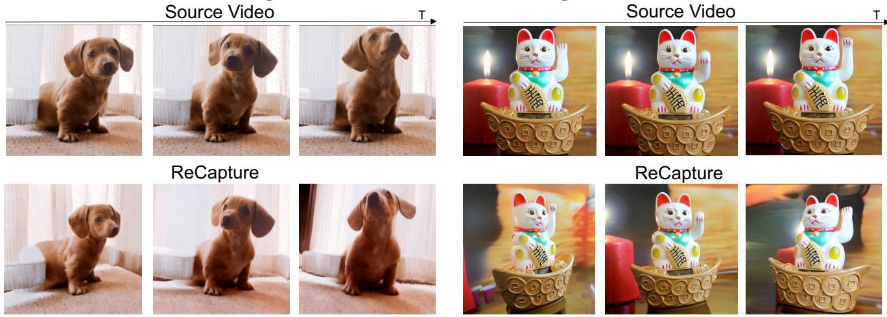
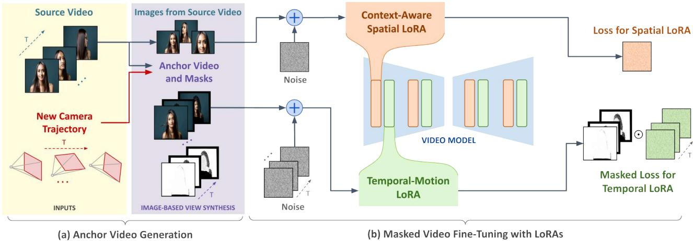
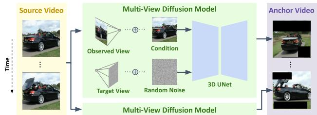
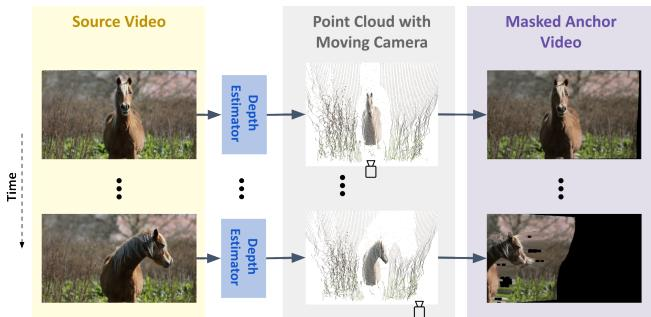
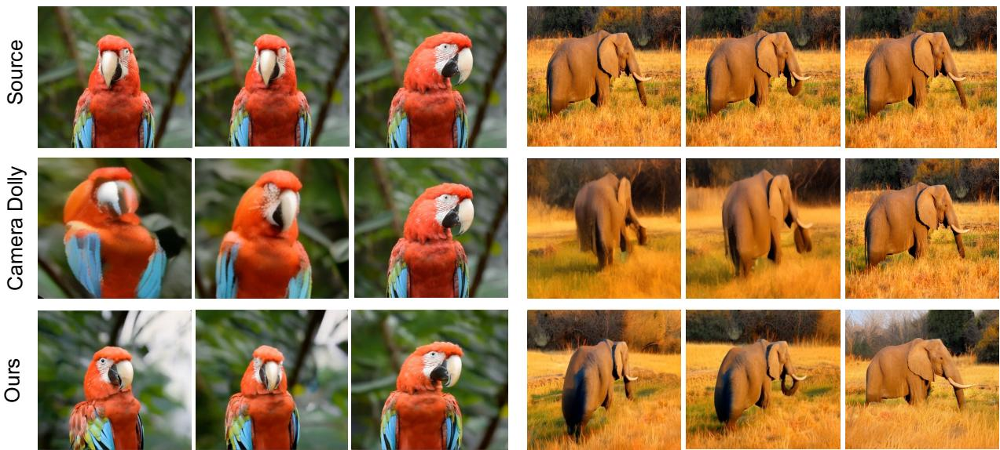
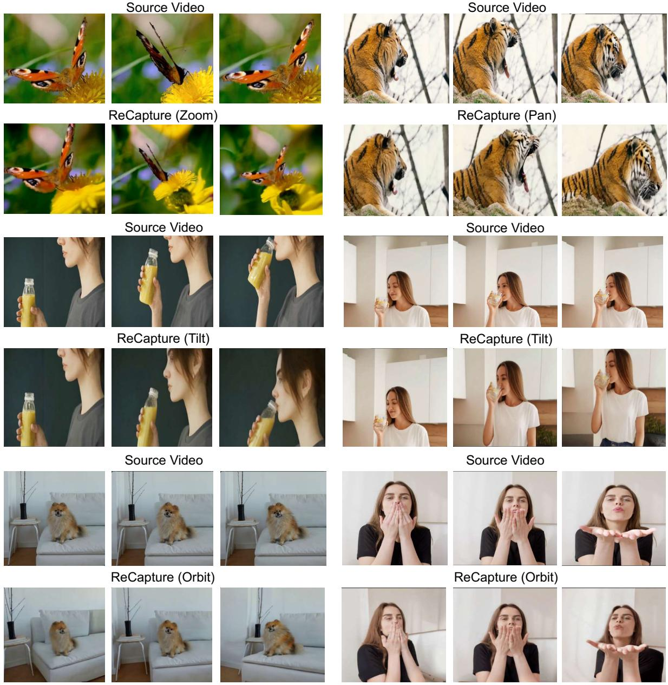
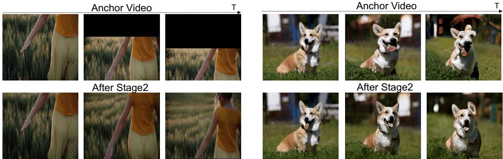
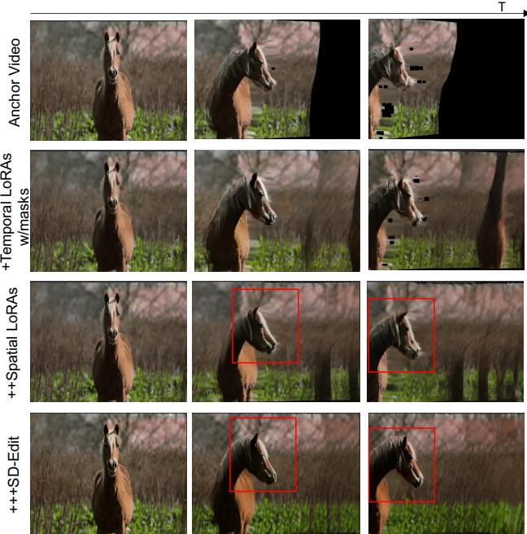

# ReCapture: Generative Video Camera Controls for User-Provided Videos using Masked Video Fine-Tuning

David Junhao Zhang1,2 Roni Paiss1 Shiran Zada1 Nikhil Karnad1 Yael Pritch1 Inbar Mosseri1 Mike Zheng Shou2∗ Neal Wadhwa1 1Google 2Show Lab, National University of Singapore

David E. Jacobs1 Nataniel Ruiz1∗

generative-video-camera-controls.github.io

  
Figure 1. Using a user-provided source video, ReCapture creates a new version with a customized camera trajectory, preserving the subjec and scene motion while revealing viewpoints not seen in the original.

## Abstract

Recently, breakthroughs in video modeling have allowed for controllable camera trajectories in generated videos. However, these methods cannot be directly applied to userprovided videos that are not generated by a video model. In this paper, we present ReCapture, a method for generating new videos with novel camera trajectories from a single user-provided video. Our method allows us to re-generate the reference video, with all its existing scene motion, from vastly different angles and with cinematic camera motion. Notably, using our method we can also plausibly hallucinate parts of the scene that were not observable in the reference video. Our method works by (1) generating a noisy anchor video with a new camera trajectory using multiview diffusion models or depth-based point cloud rendering and then (2) regenerating the anchor video into a clean and temporally consistent reangled video using our proposed masked videofine-tuning technique.

## 1. Introduction

Recently, diffusion models have enabled significant advances in video generation and editing [10, 25, 29, 30, 32, 52, 61, 68, 84, 89, 92, 93, 96, 98, 100], revolutionizing workflows in digital content creation. Camera control plays a vital role in practical applications of video generation and editing, allowing for greater customization and stronger user experience. Recent efforts have introduced camera control capabilities to video diffusion models [2, 27, 35, 79], yet, in this case the videos are entirely generated by the video model from a text-prompt and are neither captured in the real world, nor provided by a user. Effectively generating new videos with user-specified camera motion from an existing user-provided video that contains complex scene motion is still an open and challenging problem.

The task is inherently ill-posed due to the limited amount of information in the reference video: one cannot know exactly how the scene looks like from all angles if there is not full knowledge of the scene’s 4D content. However, this does not preclude an approximate solution that is plausible and appreciated by users. Previous studies have shown promising results by generally assuming the availability of synchronized multi-viewpoint videos [59] and constructing 4D neural representations. Later works [42, 50, 71, 76, 82] enable 4D reconstruction using a single monocular video, but require accurate camera pose and depth estimation, and cannot capture content outside the original field of view. In this paper, we reformulate this problem as a video-to-video translation task. Camera Dolly [72] also develops a videoto-video pipeline, but requires 4D video data with different camera poses obtained via simulation, which limits it to in-domain scenes like driving or cubic objects. Given the challenge of obtaining paired videos in the wild with varying camera movements, it is hard to solve this problem with a video-to-video pipeline in an end-to-end manner and we separate it into two steps instead. Our approach leverages the prior knowledge of diffusion generative models, in both image and video domains, to effectively reangle the video as if filmed from the requested camera trajectory.

For the first stage of our method, we want to generate an incomplete anchor video conditioned on the user-provided camera trajectory and reference video. We initially obtain a partial frame-by-frame depth estimation of the target video. We project each frame into 3D space using a depth estimator to obtain a sequence of point clouds. Then, we simulate the user-specified camera movement, which can include zoom, pan, and tilt, and render the point cloud sequence according to the new camera trajectory. This estimation is only partial since, as illustrated in Figure 4, these camera movements can introduce black areas outside the original video boundaries, cause some blurring due to the nature of point cloud projection and have poor temporal consistency since they are generated frame-by-frame. Another way to obtain the noisy anchor video, that uses recent advances in 3D reconstruction, is to use a multiview diffusion model [22] conditioned on camera pose and individual video frames. This method also results in an anchor video that has poor temporal consistency, along with blurring, artifacts and black areas outside the scene.

Using this anchor video our method is able to generate a clean output with the desired camera trajectory. To achieve this we propose the novel technique of masked video finetuning. This technique consists of training a context-aware spatial LoRA and temporal motion LoRA on the known pixels from the generated anchor video, as well as from additional reference frame data. Specifically, the spatial LoRA is incorporated into the spatial layers of the video diffusion model and finetuned on augmented frames extracted from the source video. This enables the model to learn the subject’s appearance and the background context of the source video. The temporal LoRA enables the model to learn the scene motion with respect to the new camera trajectory, and is inserted into the temporal layers of the video diffusion model and finetuned using a masked loss on the anchor video. Unknown regions are masked, which excludes them from the loss computation, enabling the model to focus on meaningful and known regions and motion while ignoring the unknown areas.

During inference, equipped with both video specific spatial and temporal LoRAs, the diffusion model can automatically fill the unknown regions of the anchor video with plausible content, leveraging the video diffusion model’s prior and the context provided by the spatial LoRA. It also significantly improves temporal consistency and removes anchor video jittering. This results in a coherent and meaningful video output, preserving the motion and layout of the original anchor video as learned through the temporal LoRA training. Finally, as a refining step, we can remove the temporal LoRA and retain only the context-aware spatial LoRA to apply SDEdit [53] to the generated video, thereby further reducing blurring and improving temporal consistency.

In the end, we generate a video with new camera trajectories while preserving the original complex scene motion and the full content of the source video. Notably, this is accomplished without the need for paired video data. Ultimately, our method outperforms the generative approach Generative Camera Dolly [72], which requires paired videos as training data, and other 4D reconstruction methods [45, 83] on the Kubric dataset [72]. Furthermore, each component of our proposed method is validated through ablation studies on VBench [37].

## 2. Related Work

Video Diffusion Model. Recent video generation methods [4, 15, 16, 23, 28, 34, 38, 64, 87, 96], predominantly utilize diffusion models [31, 56, 67, 70] due to their stateof-the-art performance and robust open-source communities. Some approaches use a 3D-UNet architecture, inflating an image diffusion model with trainable temporal layers [4, 7, 10, 24, 34]. Other works explored the transformers architecure, with both discrete [40] and continous tokens [11, 25, 51]. In this paper, we use the open-source Stable Video Diffusion (SVD) [7] as our video diffusion model.

Video Generation with Camera Control. Recent works study adding explicit camera control to video generation models, producing videos that match the text and align with a specified camera trajectory. Most methods [2, 27, 41, 79, 88] introduce additional modules that accept camera parameters, and train in a supervised manner. Other approaches, such as Viewcrafter [91] and CamTrol [35], leverage rendering priors as input to achieve camera control.

Unlike these prior works, which incorporate camera control into the video generation process, our method alters the camera trajectory of user provided videos, while preserving the original content and dynamics.

Novel View Synthesis of Dynamic Scene. Novel View Synthesis has been a long standing task, where given a few sparse view of a scene the model predicts a novel view from an unobserved camera position [17, 26, 33, 46, 49, 57, 58, 73, 75, 78, 85, 97]. However, extending such methods to videos is highly non-trivial since they rely on multiview training data. While obtaining different views of a scene difficult, it is significantly more feasible than obtaining synchronized video pairs with varying camera trajectories.

  
Figure 2. ReCapture consists, at setup time, of (a) Anchor video generation (b) Masked video fine-tuning using spatial and temporal LoRAs. To generate the clean output video with the new camera trajectory we simply perform inference of the video model.

Early methods relied on multiple synchronized videos [3, 5, 43], which limited practical applicability. With NeRF [54], time-evolving 4D representations have been proposed [19, 44, 44, 55, 60, 86], but they require extensive camera coverage and struggle beyond the original field of view. Recent approaches handle monocular videos by aggregating nearby views in a camera-aware manner [45], leveraging hybrid 4D diffusion [74], or adopting dynamic 3D Gaussian splatting for real-time rendering [20, 81]. While effective, these methods often rely on multi-view cues or quasi-static settings [21] and cannot easily extrapolate outside the source viewpoint. Emerging text-to-4D and image-to-4D frameworks [1, 47, 62, 63, 69, 94, 99] are mostly confined to animations of individual objects or animals. Others target complex scenes [80, 90] but require 4D training data or sophisticated reconstruction.

Instead of building an explicit 4D representation, our method harnesses the motion prior of video generation models, and reformulates the task as video-to-video translation (regenerating a given video from the requested camera trajectory). We show that our method performs effectively on real-world videos and generate meaningful content even when the camera moves beyond the original field of view.

## 3. Method

Our method works in two stages as shown in Fig. 2, first by generating an incomplete and noisy anchor video with respect to the new camera trajectory and second by regenerating this anchor video into a clean and temporally consistent reangled video using our proposed masked video fine-tuning

technique.

In more detail, the first stage consists of image-based view synthesis, in which we independently transform each input video frame to produce noisy anchor frames with the new camera pose, along with their validity masks. These frames are typically incomplete; they have artifacts such as missing information from revealed occlusions, and have structural deformations and temporal inconsistencies.

Our overall method is agnostic to the specific technique used to generate the anchor frames in the first stage, and in this work we explore two different techniques: point-cloud sequence rendering, and multi-view per-frame image diffusion. Our full methods correct errors in anchor videos, solve temporal inconsistency and complete missing information.

In the second stage we apply a novel masked video finetuning strategy. We train a temporal motion LoRA on the anchor video with a masked loss (that masks the corrupted parts of the anchor video). This directs the model to generate a video that follows the camera motion and dynamics of the anchor video while completing missing parts according to the model prior. In addition, we train a context-aware spatial LoRA on augmented images generated from frames of the source video. This is done by disabling the temporal layers of the video model allowing us to train on images. This step allows the model to fix structural artifacts in the anchor video. After fine-tuning, the video diffusion model is able to regenerate the anchor video such that the missing areas are seamlessly filled with temporally and spatially consistent video content. Furthermore, it preserves the coherence, content and dynamics of the original video and eliminates artifacts from the first stage, all while adapting to the new camera motion. The final output is simply the source video with the new camera trajectory, often including views of the scene that are unseen in the source video.

  
Figure 3. Anchor video generation using image-level multiviewdiffusion models to generate new views frame-by-frame.

## 3.1. Preliminaries

3D Video U-Net. Video diffusion models train a 3D Video U-Net (spatial-temporal for 3D) to denoise a sequence of Gaussian noise samples to generate videos, guided by text or image prompts [8, 10]. The 3D Video U-Net architecture comprises down-sampling, middle, and up-sampling blocks. Each block includes multiple spatial convolution layers, spatial transformers, cross-attention layers, and either temporal transformers or convolution layers.

Low-Rank Adaptation (LoRA) was introduced to finetune large pre-trained language models [36] and has since been applied to text-to-image and text-to-video tasks for appearance customization [14, 65]. It updates the weight matrix W using low-rank factorization as:

$$
W = W _ { 0 } + \Delta W = W _ { 0 } + B A ,\tag{1}
$$

where $W _ { 0 }$ represents the original weights, and B and A are low-rank factors with much fewer dimensions. LoRA is computationally efficient and can be more easily regularized, which preserves more of the model’s prior knowledge compared to fine-tuning the entire network.

## 3.2. Anchor Video with New Camera Motion

At this stage, we are given a reference video ${ \textbf { V } } =$ $[ \mathbf { I } _ { 0 } , \dots , \mathbf { I } _ { N - 1 } ] \ \in \ \mathbb { R } ^ { N \times 3 \times H \times W }$ , where N represents the number of frames. The main objective is to transform these frames into a new sequence, denoted as $\mathbf { V } ^ { a }$ , based on a different camera trajectory provided by users. We refer to this video as an anchor because it anchors the final output of our method and serves as a condition for the next stage. This first draft contains artifacts from out-of-scene regions and temporal inconsistencies, which will be corrected in the second stage.

We present two approaches to obtain an anchor video based on a new camera trajectory. The first method uses a point cloud rendering technique, suitable for typical camera movements such as panning, tilting, and zooming, which involve simple translations and small rotations. The second approach is designed for camera movements that involve larger rotations such as orbiting. In this approach, we utilize a multiview diffusion model [22].

Point Cloud Sequence Rendering. We begin by lifting the pixels from the input image plane into a 3D point cloud representation. For each frame of the source video $\mathbf { I } _ { i } , i \in$ $\{ 0 , . . . , N - 1 \}$ , we independently estimate its depth map $\mathbf { D } _ { i }$ using an off-the-shelf monocular depth estimator [6]. By combining the image with its depth map, the point cloud $\mathcal { P } _ { i }$ can be initialized as:

  
Figure 4. Anchor video generation using depth estimation to turn each frame into a point cloud and then generating new views by controlling the camera pose.

$$
\mathcal { P } _ { i } = \phi ( [ \mathbf { I } _ { i } , \mathbf { D } _ { i } ] , \mathbf { K } ) ,\tag{2}
$$

where ϕ denotes the mapping function from RGBD to a 3D point cloud in the camera coordinate system, and K represents the camera’s intrinsics using the convention in [18].

Next, we take as input the camera motion as a predefined trajectory of extrinsic matrices $\big \{ \mathbf { P } _ { 1 } , . . . , \mathbf { P } _ { N - 1 } \big \}$ where each includes a rotation matrix and a translation matrix representing the camera’s pose (position and orientation), which are used to rotate and translate the point cloud in the camera’s coordinates.

We then project the point cloud of each frame back onto the anchored camera plane using the function ψ to obtain a rendered image with perspective change: ${ \bf { I } } _ { i } ^ { a } \ =$ $\psi ( \mathcal { P } _ { i } , { \bf K } , { \bf P } _ { i } )$ . By calculating the extrinsic matrices corresponding to the camera’s movement, we can express a variety of camera motions including zoom, tilt, pan enabling flexible camera control to yield anchor videos:

$$
\mathbf { V } ^ { a } = \left\{ \mathbf { I } _ { 0 } ^ { a } , . . . , \mathbf { I } _ { N - 1 } ^ { a } \right\} = \left\{ \psi ( \mathcal { P } _ { i } , \mathbf { K } , \mathbf { P } _ { i } ) | i \in \{ 0 , . . . , N - 1 \} \right\} .\tag{3}
$$

Simultaneously with the color frames, we obtain a binary mask for each frame. Valid pixels after projecting the point cloud, are represented with a value of $\ ' _ { 1 } \ '$ . Regions missing due to camera movement as shown in Fig. 4, which extend beyond the original video scene, are marked as $\overrightarrow { \mathbf { \nabla } } 0 ^ { \circ }$ We denote the corresponding sequence of binary masks as $\mathbf { M } ^ { a } \in \mathbb { R } ^ { . }$ N×1×H×W

Multiview Image Diffusion for Each Frame. When a camera trajectory involves significant rotation and viewpoint changes, point cloud rendering usually fails [91]. To address this, we employ a multiview diffusion model [22]. This approach leverages the fact that multiview image datasets are generally much easier to obtain compared to multiview video datasets. Specifically, as shown in Fig. 3, for each frame $\mathbf { I } _ { i }$ of the source video, which represents the condition view, along with its corresponding camera parameters $\mathbf { P _ { \mathrm { c o n d } } }$ , the model learns to estimate the distribution of

the target image ${ \bf { I } } _ { i } ^ { a }$

$$
p \left( \mathbf { I } _ { i } ^ { a } \mid \mathbf { I } _ { i } , \mathbf { P } _ { c o n d } , \mathbf { P } _ { i } \right) ,\tag{4}
$$

where $\mathbf { P } _ { i }$ is the target camera parameters which are also provided as input. The multiview diffusion model employs a 3D U-Net as its backbone, and for simplicity of notation, we omit the latent VAE encoder. The 3D U-Net is adapted from a 2D text-to-image U-Net by inflating the 2D selfattention mechanism into 3D, allowing it to operate across both 2D spatial dimensions and multiple view images. Due to the difficulty in obtaining the camera pose with the condition frame, we follow CAT3D [22] and use a raymap with the same dimensions as the condition images, computed relative to the first image’s camera pose. This makes the pose representation invariant to rigid transformations. Raymaps are then concatenated channel-wise to the corresponding condition image.

By applying this multiview diffusion model to each frame, we can generate the anchor video $\mathbf { V } ^ { a }$ . However, processing each frame independently leads to significant temporal inconsistencies and artifacts (Fig. 4). While CAT3D can complete unseen regions, it hallucinates these region differently at each frame. To mask out this regions, we obtain the mask $\mathbf { M } ^ { a }$ with the same approach as point cloud rendering, which indicate the missing and occluded regions due to added camera movement.

## 3.3. Masked Video Fine-tuning

At this stage, our objective is to take an incomplete anchor video (with significant artifacts and inconsistencies) as input and produce a clean, high-quality output. To achieve this, we introduce the technique of masked fine-tuning of a video diffusion model, incorporating a context-aware spatial LoRA and a temporal motion LoRA. By leveraging the strong prior of the video diffusion model, we can generate a high-quality video conditioned on the anchor video. Next we present our components:

Temporal LoRAs with Masked Video Fine-tuning. The anchor video from the first stage may exhibit significant artifacts, such as revealed occlusions due to camera movement and temporal inconsistencies such as flickering. To address these issues, we propose a masked video fine-tuning strategy using temporal motion LoRAs. LoRAs are applied to the linear layers of the temporal transformer blocks in the video diffusion model. Since LoRA operates in a low-rank space and the spatial layers remain untouched, it focuses on learning fundamental motion patterns from the anchor video without over-fitting to the entire video. The strong temporal consistency prior from the video diffusion model helps minimize temporal inconsistencies. We introduce a masked diffusion loss, where the invalid regions in the anchor video are excluded from the loss calculation, ensuring the model only learns from meaningful pixels. During inference, the video diffusion model regenerates the video and automatically fills in the invalid regions while maintaining the original motion of the anchor video. The temporal loss for diffusion training is defined as:

$$
\begin{array} { r } { \mathcal { L } _ { t e m p } = \mathbb { E } _ { \epsilon , t } \left[ \mathbf { M } ^ { a } \cdot \left. \epsilon - \epsilon _ { \theta } ( \mathbf { V } _ { t } ^ { a } , t , y ) \right. \right] , } \end{array}\tag{5}
$$

where ϵ represents noise added to the anchor video $\mathbf { V } ^ { a }$ $\mathbf { V } _ { t } ^ { a }$ denotes the noisy anchor video at time step $t , y$ refers to the text or image condition, and θ indicates the weights of the 3D Video U-Net along with the LoRA weights.

Context-Aware Spatial LoRAs. Although the video diffusion model with masked fine-tuning automatically fills the invalid regions of the anchor video, the filling may not be consistent with the original context or appearance, and might appear pixelated, as shown in Fig. 8 Line 2. To address this issue, we propose enhancing the spatial attention layers of the video diffusion model by incorporating a spatial LoRA, which is fine-tuned on the frames of the source video. At each training step, a frame is randomly selected from the source video, and the temporal layers are bypassed. The spatial LoRA loss is defined as follows

$$
\begin{array} { r } { \mathcal { L } _ { s p a t i a l } = \mathbb { E } _ { \epsilon , t , i \sim \mathcal { U } \{ 0 , \dots N - 1 \} } \left[ \| \epsilon - \epsilon _ { \theta } ( ( \mathbf { I } _ { i , t } ) , t , y ) \| \right] , } \end{array}\tag{6}
$$

where $\mathbf { I } _ { i , t }$ denotes the noisy frame $\mathbf { I } _ { i }$ of the source video at time step t. The spatial LoRA captures the original context from the source video, ensuring seamless integration of filled pixels with the original pixels.

Consequently, our final diffusion loss is the sum of $L _ { t e m p }$ and $L _ { s p a t i a l }$ . To ensure compatibility between the spatial and temporal LoRAs, features from the corrupted video for training temporal LoRA are also passed through the spatial LoRA, without updating its parameters.

Eliminating Blurriness. After finishing training both Lo-RAs, we can directly use the video diffusion model to generate the desired video with new camera motion while maintaining high visual quality. Finally, as a post-processing stage to further eliminate blurriness, which cannot be fully addressed by masked video fine-tuning as shown in Fig. 8 Line 3, we use the video diffusion model with spatial LoRA while omitting the temporal LoRA to perform SDediting [53] on the output video. Typically, SD-editing introduces randomness that alters the appearance of the subject, but since our spatial LoRA has been fine-tuned on the source video, it preserves the original appearance while simultaneously removing the blur.

Our method successfully adds dynamic camera motion to the existing videos without the need for large-scale training on 4D multi-view video data, and it generalizes to a wide array of videos and camera trajectories. Next, we present our experiments, datasets and evaluations.

  
Figure 5. Qualitative comparisons with generative camera dolly [72] using an orbit camera trajectory.

<table><tr><td>Models</td><td>Subject Consistency</td><td>Background Consistency</td><td>Temporal Flickering</td><td>Motion Smoothness</td><td>Dynamic Degree</td><td>Aesthetic Quality</td><td>Imaging Quality</td><td>Object Class</td></tr><tr><td>Generative Camera Dolly [72]</td><td>83.02%</td><td>80.42%</td><td>74.64%</td><td>82.33%</td><td>51.24%</td><td>38.67%</td><td>58.62%</td><td>76.46%</td></tr><tr><td>Ours</td><td>88.53%</td><td>92.02%</td><td>91.12%</td><td>98.24%</td><td>49.03%</td><td>57.35%</td><td>64.75%</td><td>82.07%</td></tr></table>

Table 1. Quantitative comparisons with generative camera dolly on VBench.

<table><tr><td>Method</td><td>PSNR (all)↑</td><td>SSIM (all)↑</td><td>LPIPS (all) ↓</td><td>PSNR (occ.) ↑</td><td>SSIM (occ.) ↑</td></tr><tr><td>HexPlane [12]</td><td>15.38</td><td>0.428</td><td>0.568</td><td>14.71</td><td>0.428</td></tr><tr><td>4D-GS [83]</td><td>14.92</td><td>0.388</td><td>0.584</td><td>14.55</td><td>0.392</td></tr><tr><td>DynIBaR [45]</td><td>12.86</td><td>0.356</td><td>0.646</td><td>12.78</td><td>0.358</td></tr><tr><td>Vanilla SVD [8]</td><td>13.85</td><td>0.312</td><td>0.556</td><td>13.66</td><td>0.326</td></tr><tr><td>ZeroNVS [66]</td><td>15.68</td><td>0.396</td><td>0.508</td><td>14.18</td><td>0.368</td></tr><tr><td>Generative Camera Dolly [72]</td><td>20.30</td><td>0.587</td><td>0.408</td><td>18.60</td><td>0.527</td></tr><tr><td>Ours</td><td>20.92</td><td>0.596</td><td>0.402</td><td>18.92</td><td>0.541</td></tr></table>

Table 2. Comparison results on Kubric-4D. We evaluate gradual dynamic view synthesis models following [72] to use video with resolution 384 × 256. Our method achieves superior performance compared to other reconstruction and generative methods.

## 4. Experiments

We conduct comprehensive qualitative and quantitative evaluations to assess the performance of our method, comparing it against prominent baselines for the task of novel view synthesis in existing videos. Our quantitative analysis in Sec. 4.1 encompasses two complementary subsets of automatic metrics: low-level statistics, including PSNR and SSIM, and high-level semantic measures, such as subject consistency. Additionally, we incorporate a user study for non-automatic evaluation in supplementary material. An ablation study in Sec. 4.3 further demonstrates the importance of each component in our approach. In Sec. 4.2, we present qualitative results that visually illustrate our method’s superiority, and implementation details are provided in Sec. 4.4.

## 4.1. Quantitative Evaluation

Low-level evaluation metrics. We utilize the Kubric-4D dataset, consisting of 3,000 scenes, including an evaluation subset of 100 scenes. These scenes, generated with the Kubric simulator, showcase complex multi-object interactions and dynamic movement patterns. Each scene includes synchronized video from 16 fixed camera viewpoints at a resolution of 576 x 384 across 60 frames at 24 FPS. Additionally, each scene contains 7 to 22 objects of varying sizes, with roughly one-third initially positioned mid-air to introduce intricate dynamics. This arrangement leads to frequent and complex occlusions, posing a substantial challenge for accurate novel view synthesis. For consistency, we adhere to the evaluation protocol outlined in [72], downsampling the video to 14 frames at a resolution of 384 × 256.

As shown in Table 2, our method outperforms existing 4D reconstruction methods, underscoring the effectiveness of framing camera control as a video-to-video translation task using generative models. Notably, our approach achieves superior results even without 4D training data, surpassing Generative Camera Dolly, which depends on extensive 4D data for training.

High-level semantic evaluation metrics. As noted in [48], low-level evaluation metrics often fall short in accurately capturing the true quality of a video. For example, while PSNR values may be similar, the visual quality of Dolly (as shown in Fig. 5) is significantly blurrier and inferior to ours. To provide a more comprehensive and fair assessment of video quality, we conduct evaluations following the VBench dataset [37]. The benchmark comprises 35 videos and evaluates seven critical dimensions of video generation, including factors like subject identity consistency, motion smoothness, and temporal flickering. These finegrained evaluation metrics employ feature extractors such as DINO [13] for assessing consistency and MUSIQ [39] for measuring image quality. This approach allows for a higher-level evaluation, offering deeper insights into each model’s distinct strengths and areas for improvement. We supply the specific prompt associated with each video to facilitate Object Class evaluation.

  
Figure 6. Gallery of generated videos with novel and unseen user-provided camera trajectories using ReCapture.

As shown in Table 1, our method surpasses in most evaluation dimensions by a large margin. This evaluation enables a higher-level evaluation, providing clearer insights into each model’s strengths and areas for improvement.

## 4.2. Qualitative Comparisons

For qualitative results, we compare our method with Camera Dolly [72] in Fig. 5. The comparison demonstrates that our method more accurately follows the camera trajectory, generates fewer artifacts, and exhibits less blurriness than Generative Camera Dolly. Notably, even when the camera position differs significantly from the original video, our method faithfully preserves the subject’s motion and appearance, whereas Dolly suffers from significant artifacts under these conditions. More visualization results of different camera trajectories are shown in Fig. 6. Additionally, we discuss and compare our method with the 4D reconstruction approaches [77, 95] in the supplementary material.

<table><tr><td>Models</td><td>Subject Consistency</td><td>Background Consistency</td><td>Temporal Flickering</td><td>Motion Smoothness</td><td>Dynamic Degree</td><td>Aesthetic Quality</td><td>Imaging Quality</td><td>Object Class</td></tr><tr><td>Anchor Video</td><td>82.41%</td><td>77.45%</td><td>64.50%</td><td>74.27%</td><td>49.72%</td><td>34.94%</td><td>55.90%</td><td>79.82%</td></tr><tr><td>+ Temporal LoRAs w/ Masks )</td><td>85.24%</td><td>90.88%</td><td>89.60%</td><td>97.32%</td><td>49.64%</td><td>40.41%</td><td>62.34%</td><td>80.02%</td></tr><tr><td>++ Spatial LoRAs)</td><td>86.02%</td><td>91.24%</td><td>90.02%</td><td>97.32%</td><td>49.64%</td><td>49.18%</td><td>63.03%</td><td>80.02%</td></tr><tr><td>+++ SD-Edit</td><td>88.53%</td><td>92.02%</td><td>91.12%</td><td>98.24%</td><td>49.03%</td><td>57.35%</td><td>64.75%</td><td>82.07%</td></tr></table>

Table 3. Ablation studies for each component of mask video diffusion finetuning: ’+ Temporal LoRAs’ applies temporal LoRAs solely for masked video finetuning. ’++ Spatial LoRAs’ introduces additional context-aware LoRAs, using both spatial and temporal LoRAs for finetuning. ’+++ SD-Edit’ involves applying SD-editing after completing training with both LoRAs for eliminating blurriness.

Figure 7. Visualization of the effectiveness of masked video fine-tuning (Stage 2) for generating spatially and temporally coherent outputs from noisy anchor videos.  
  
Figure 8. Detailed ablation of all components of our method.

## 4.3. Ablation Studies

Fig. 7 shows the differences between the anchor videos and the final output, demonstrating that our full mask video finetuning effectively removes strong artifacts and fills missing regions in the anchor videos. Moreover, we evaluate the impact of each component of our method in Table 3 and Fig. 8. As demonstrated, fine-tuning the temporal LoRA with masking significantly improves temporal consistency and visual quality. This effect is also visible in Fig. 8, where generating the video with temporal LoRA helps to fill regions not visible in the anchor video, enhancing both visual quality and temporal coherence. Additionally, incorporating the context-aware spatial LoRA further boosts visual quality and subject consistency by leveraging prior knowledge of the original video. Finally, integrating SDEdit further enhances overall quality by reducing artifacts. These results affirm the effectiveness of each component in our method. To further validate our full mask video fine-tuning strategy, we compare it with typical video inpainting using diffusion model, detailed in the supplementary material.

## 4.4. Implementation Details

We use the the CAT3D [22] multi-view model without any further adjustments and employ SVD [9] as our video diffusion model in all our experiments. Since SVD is an I2V model, we use $\mathbf { V } _ { 0 } ^ { a }$ as the image prompt. For the LoRA finetuining we use rank of 16 for both spatial and temporal Lo-RAs. The spatial LoRA is added to the self-attention layers, while the temporal LoRA is integrated into the temporal attention layers, with the learning rate set to $5 e ^ { - 4 } ,$ . The total number of fine-tuning steps is set 400 and requires 5 mins on a single 80GB A100 GPU.

## 5. Conclusion

In this work, we present ReCapture to generate new videos with novel camera trajectories from existing user-provided videos. Compared to previous work and thanks to the strong prior of video models, ReCapture has a surprisingly strong ability to generalize to vastly different videos and scenes, and in many cases faithfully preserves complex scene and subject motion, as well as the details of the scene.

## Acknowledgement

We thank Peyman Milanfar, David Salesin and Amit Raj for their insightful reviews or feedback, and we also thank Yao-Chih Lee for his feedback on the related work.

## References

[1] Sherwin Bahmani, Ivan Skorokhodov, Victor Rong, Gordon Wetzstein, Leonidas Guibas, Peter Wonka, Sergey Tulyakov, Jeong Joon Park, Andrea Tagliasacchi, and David B Lindell. 4d-fy: Text-to-4d generation using hybrid score distillation sampling. In Proceedings of the IEEE/CVF Conference on Computer Vision and Pattern Recognition, pages 7996–8006, 2024. 3

[2] Sherwin Bahmani, Ivan Skorokhodov, Aliaksandr Siarohin, Willi Menapace, Guocheng Qian, Michael Vasilkovsky, Hsin-Ying Lee, Chaoyang Wang, Jiaxu Zou, Andrea Tagliasacchi, David B. Lindell, and Sergey Tulyakov. Vd3d: Taming large video diffusion transformers for 3d camera control. arXiv preprint arXiv:2407.12781, 2024. 1, 2

[3] Ajay Bansal, Mykhaylo Vo, Yaser Sheikh, Deva Ramanan, and Srinivasa Narasimhan. 4d visualization of dynamic events from unconstrained multi-view videos. In Proceedings of the IEEE/CVF Conference on Computer Vision and Pattern Recognition, pages 5366–5375, 2020. 3

[4] Omer Bar-Tal, Hila Chefer, Omer Tov, Charles Herrmann, Roni Paiss, Shiran Zada, Ariel Ephrat, Junhwa Hur, Guanghui Liu, Amit Raj, et al. Lumiere: A spacetime diffusion model for video generation. arXiv preprint arXiv:2401.12945, 2024. 2

[5] Mostafa Bemana, Karol Myszkowski, Hans-Peter Seidel, and Tobias Ritschel. X-fields: Implicit neural view-, light-and time-image interpolation. ACM Transactions on Graphics (TOG), 39(6):1–15, 2020. 3

[6] Shariq Farooq Bhat, Reiner Birkl, Diana Wofk, Peter Wonka, and Matthias Muller. Zoedepth: Zero-shot trans-¨ fer by combining relative and metric depth. arXiv preprint arXiv:2302.12288, 2023. 4

[7] A. Blattmann, Tim Dockhorn, Sumith Kulal, Daniel Mendelevitch, Maciej Kilian, and Dominik Lorenz. Stable video diffusion: Scaling latent video diffusion models to large datasets. ArXiv, abs/2311.15127, 2023. 2

[8] Andreas Blattmann, Tim Dockhorn, Sumith Kulal, Daniel Mendelevitch, Maciej Kilian, Dominik Lorenz, Yam Levi, Zion English, Vikram Voleti, Adam Letts, et al. Stable video diffusion: Scaling latent video diffusion models to large datasets. arXiv, 2311.15127, 2023. 4, 6

[9] Andreas Blattmann, Tim Dockhorn, Sumith Kulal, Daniel Mendelevitch, Maciej Kilian, Dominik Lorenz, Yam Levi, Zion English, Vikram Voleti, Adam Letts, et al. Stable video diffusion: Scaling latent video diffusion models to large datasets. arXiv preprint arXiv:2311.15127, 2023. 8

[10] Andreas Blattmann, Robin Rombach, Huan Ling, Tim Dockhorn, Seung Wook Kim, Sanja Fidler, and Karsten Kreis. Align your latents: High-resolution video synthesis with latent diffusion models. In Proceedings of the

IEEE/CVF Conference on Computer Vision and Pattern Recognition, pages 22563–22575, 2023. 1, 2, 4

[11] Tim Brooks, Bill Peebles, Connor Holmes, Will DePue, Yufei Guo, Li Jing, David Schnurr, Joe Taylor, Troy Luh man, Eric Luhman, Clarence Ng, Ricky Wang, and Aditya Ramesh. Video generation models as world simulators. 2024. 2

[12] Ang Cao and Justin Johnson. Hexplane: A fast representation for dynamic scenes. In Proceedings of the IEEE/CVF Conference on Computer Vision and Pattern Recognition, pages 130–141, 2023. 6

[13] Mathilde Caron, Hugo Touvron, Ishan Misra, Herve J´ egou,´ Julien Mairal, Piotr Bojanowski, and Armand Joulin. Emerging properties in self-supervised vision transformers. In Proceedings of the IEEE/CVF international conference on computer vision, pages 9650–9660, 2021. 7

[14] Hila Chefer, Shiran Zada, Roni Paiss, Ariel Ephrat, Omer Tov, Michael Rubinstein, Lior Wolf, Tali Dekel, Tomer Michaeli, and Inbar Mosseri. Still-moving: Customized video generation without customized video data. arXiv preprint arXiv:2407.08674, 2024. 4

[15] Haoxin Chen, Menghan Xia, Yingqing He, Yong Zhang, Xiaodong Cun, Shaoshu Yang, Jinbo Xing, Yaofang Liu, Qifeng Chen, Xintao Wang, Chao Weng, and Ying Shan. Videocrafter1: Open diffusion models for high-quality video generation, 2023. 2

[16] Haoxin Chen, Yong Zhang, Xiaodong Cun, Menghan Xia, Xintao Wang, Chao Weng, and Ying Shan. Videocrafter2: Overcoming data limitations for high-quality video diffusion models. In Proceedings of the IEEE/CVF Conference on Computer Vision and Pattern Recognition, pages 7310– 7320, 2024. 2

[17] Ruitao Chen, Yuwei Chen, Nitesh Jiao, and Kui Jia. Fantasia3d: Disentangling geometry and appearance for high-quality text-to-3d content creation. arXiv preprint arXiv:2303.13873, 2023. 3

[18] Jaeyoung Chung, Suyoung Lee, Hyeongjin Nam, Jaerin Lee, and Kyoung Mu Lee. Luciddreamer: Domain-free generation of 3d gaussian splatting scenes. arXiv preprint arXiv:2311.13384, 2023. 4

[19] Yilun Du, Yinan Zhang, Hanjun Xiong Yu, Joshua B Tenenbaum, and Jiajun Wu. Neural radiance flow for 4d view synthesis and video processing. In 2021 IEEE/CVF International Conference on Computer Vision (ICCV), pages 14304–14314. IEEE Computer Society, 2021. 3

[20] Y. Duan, S. Ren, J. Luo, Y. Chen, H. Wang, L. Zheng, and Q. Dai. 4d radiance fields with multi-scale occupancy networks for dynamic scene reconstruction. In CVPR, 2024. 3

[21] H. Gao, R. Li, S. Tulsiani, B. Russell, and A. Kanazawa. Monocular dynamic view synthesis: A reality check. Ad vances in Neural Information Processing Systems, 35: 33768–33780, 2022. 3

[22] Ruiqi Gao\*, Aleksander Holynski\*, Philipp Henzler, Arthur Brussee, Ricardo Martin-Brualla, Pratul P. Srinivasan, Jonathan T. Barron, and Ben Poole\*. Cat3d: Create anything in 3d with multi-view diffusion models. arXiv, 2024. 2, 4, 5, 8

[23] Rohit Girdhar, Mannat Singh, Andrew Brown, Quentin Duval, Samaneh Azadi, Sai Saketh Rambhatla, Akbar Shah, Xi Yin, Devi Parikh, and Ishan Misra. Emu Video: Factorizing Text-to-Video Generation by Explicit Image Conditioning. arXiv, 2311.10709, 2023. 2

[24] Yuwei Guo, Ceyuan Yang, Anyi Rao, Yaohui Wang, Yu Qiao, Dahua Lin, and Bo Dai. Animatediff: Animate your personalized text-to-image diffusion models without specific tuning. arXiv preprint arXiv:2307.04725, 2023. 2

[25] Agrim Gupta, Lijun Yu, Kihyuk Sohn, Xiuye Gu, Meera Hahn, Li Fei-Fei, Irfan Essa, Lu Jiang, and Jose Lezama.´ Photorealistic video generation with diffusion models. arXiv preprint arXiv:2312.06662, 2023. 1, 2

[26] Ayaan Haque, Matthew Tancik, Alexei A Efros, Aleksander Holynski, and Angjoo Kanazawa. Instruct-nerf2nerf: Editing 3d scenes with instructions. In Proceedings of the IEEE/CVF International Conference on Computer Vision, pages 19740–19750, 2023. 3

[27] Hao He, Yinghao Xu, Yuwei Guo, Gordon Wetzstein, Bo Dai, Hongsheng Li, and Ceyuan Yang. Cameractrl: Enabling camera control for text-to-video generation. arXiv preprint arXiv:2404.02101, 2024. 1, 2

[28] Yingqing He, Tianyu Yang, Yong Zhang, Ying Shan, and Qifeng Chen. Latent video diffusion models for highfidelity video generation with arbitrary lengths. arXiv preprint arXiv:2211.13221, 2022. 2

[29] Yingqing He, Tianyu Yang, Yong Zhang, Ying Shan, and Qifeng Chen. Latent video diffusion models for highfidelity long video generation. 2022. 1

[30] Yingqing He, Tianyu Yang, Yong Zhang, Ying Shan, and Qifeng Chen. Latent video diffusion models for highfidelity video generation with arbitrary lengths. arXiv preprint arXiv:2211.13221, 2022. 1

[31] Jonathan Ho, Ajay Jain, and Pieter Abbeel. Denoising diffusion probabilistic models. Advances in Neural Information Processing Systems, 33:6840–6851, 2020. 2

[32] Jonathan Ho, William Chan, Chitwan Saharia, Jay Whang, Ruiqi Gao, Alexey Gritsenko, Diederik P Kingma, Ben Poole, Mohammad Norouzi, David J Fleet, et al. Imagen video: High definition video generation with diffusion models. arXiv preprint arXiv:2210.02303, 2022. 1

[33] Felix Hollein, Yan-Pei Fu, Chi-Hao Weng, Sifei Liu, Jan Kautz, Aditya Ramesh, Arash Vahdat, Jonathan Ho, and Matthias Nießner. Text2room: Extracting textured 3d meshes from 2d text-to-image models. arXiv preprint arXiv:2303.14435, 2023. 3

[34] Wenyi Hong, Ming Ding, Wendi Zheng, Xinghan Liu, and Jie Tang. Cogvideo: Large-scale pretraining for text-to-video generation via transformers. arXiv preprint arXiv:2205.15868, 2022. 2

[35] Chen Hou, Guoqiang Wei, Yan Zeng, and Zhibo Chen. Training-free camera control for video generation. arXiv preprint arXiv:2406.10126, 2024. 1, 2

[36] Edward J Hu, Yelong Shen, Phillip Wallis, Zeyuan Allen-Zhu, Yuanzhi Li, Shean Wang, Lu Wang, and Weizhu Chen. Lora: Low-rank adaptation of large language models. arXiv preprint arXiv:2106.09685, 2021. 4

[37] Ziqi Huang, Yinan He, Jiashuo Yu, Fan Zhang, Chenyang Si, Yuming Jiang, Yuanhan Zhang, Tianxing Wu, Qingyang Jin, Nattapol Chanpaisit, Yaohui Wang, Xinyuan Chen, Limin Wang, Dahua Lin, Yu Qiao, and Ziwei Liu. VBench: Comprehensive benchmark suite for video generative mod els. In Proceedings of the IEEE/CVF Conference on Com puter Vision and Pattern Recognition, 2024. 2, 7

[38] Johanna Karras, Aleksander Holynski, Ting-Chun Wang, and Ira Kemelmacher-Shlizerman. Dreampose: Fashion video synthesis with stable diffusion. In Proceedings ofthe IEEE/CVF International Conference on Computer Vision, pages 22680–22690, 2023. 2

[39] Junjie Ke, Qifei Wang, Yilin Wang, Peyman Milanfar, and Feng Yang. Musiq: Multi-scale image quality transformer. In Proceedings of the IEEE/CVF international conference on computer vision, pages 5148–5157, 2021. 7

[40] Dan Kondratyuk, Lijun Yu, Xiuye Gu, Jose Lezama,´ Jonathan Huang, Rachel Hornung, Hartwig Adam, Hassan Akbari, Yair Alon, Vighnesh Birodkar, et al. Videopoet: A large language model for zero-shot video generation. arXiv preprint arXiv:2312.14125, 2023. 2

[41] Zhengfei Kuang, Shengqu Cai, Hao He, Yinghao Xu, Hongsheng Li, Leonidas Guibas, and Gordon. Wetzstein. Collaborative video diffusion: Consistent multi-video gen eration with camera control. In arXiv, 2024. 2

[42] Yao-Chih Lee, Zhoutong Zhang, Kevin Blackburn-Matzen, Simon Niklaus, Jianming Zhang, Jia-Bin Huang, and Feng Liu. Fast view synthesis of casual videos with soup-ofplanes. arXiv preprint arXiv:2312.02135, 2023. 2

[43] T. Li, M. Slavcheva, M. Zollhoefer, S. Green, C. Lassner, C. Kim, T. Schmidt, S. Lovegrove, M. Goesele, and R. Newcombe. Neural 3d video synthesis from multi-view video. In Proceedings of the IEEE/CVF Conference on Computer Vision and Pattern Recognition, pages 5521–5531, 2022. 3

[44] Z. Li, S. Niklaus, N. Snavely, and O. Wang. Neural scene flow fields for space-time view synthesis of dynamic scenes. In Proceedings of the IEEE/CVF Conference on Computer Vision and Pattern Recognition, pages 6498– 6508, 2021. 3

[45] Zhengqi Li, Qianqian Wang, Forrester Cole, Richard Tucker, and Noah Snavely. Dynibar: Neural dynamic image-based rendering. In Proceedings of the IEEE/CVF Conference on Computer Vision and Pattern Recognition, pages 4273–4284, 2023. 2, 3, 6

[46] Chen-Hsuan Lin, Jun Gao, Luming Tang, Towaki Takikawa, Xiaohui Zeng, Xun Huang, Karsten Kreis, Sanja Fidler, Ming-Yu Liu, and Tsung-Yi Lin. Magic3D: High Resolution Text-to-3D Content Creation. In CVPR, 2023. 3

[47] Huan Ling, Seung Wook Kim, Antonio Torralba, Sanja Fidler, and Karsten Kreis. Align your gaussians: Text-to-4d with dynamic 3d gaussians and composed diffusion models. In Proceedings of the IEEE/CVF Conference on Computer Vision and Pattern Recognition, pages 8576–8588, 2024. 3

[48] Jia-Wei Liu, Yan-Pei Cao, Tianyuan Yang, Zhongcong Xu, Jussi Keppo, Ying Shan, Xiaohu Qie, and Mike Zheng Shou. Hosnerf: Dynamic human-object-scene neural radiance fields from a single video. In Proceedings of the

IEEE/CVF International Conference on Computer Vision, pages 18483–18494, 2023. 6

[49] Ruoshi Liu, Rundi Wu, Basile Van Hoorick, Pavel Tokmakov, Sergey Zakharov, and Carl Vondrick. Zero-1-to-3: Zero-shot one image to 3d object. In Proceedings of the IEEE/CVF International Conference on Computer Vision (ICCV), pages 9298–9309, 2023. 3

[50] Yu-Lun Liu, Chen Gao, Andreas Meuleman, Hung-Yu Tseng, Ayush Saraf, Changil Kim, Yung-Yu Chuang, Johannes Kopf, and Jia-Bin Huang. Robust dynamic radiance fields. In Proceedings of the IEEE/CVF Conference on Computer Vision and Pattern Recognition, pages 13–23, 2023. 2

[51] Xin Ma, Yaohui Wang, Gengyun Jia, Xinyuan Chen, Ziwei Liu, Yuan-Fang Li, Cunjian Chen, and Yu Qiao. Latte: Latent diffusion transformer for video generation. arXiv preprint arXiv:2401.03048, 2024. 2

[52] Willi Menapace, Aliaksandr Siarohin, Ivan Skorokhodov, Ekaterina Deyneka, Tsai-Shien Chen, Anil Kag, Yuwei Fang, Aleksei Stoliar, Elisa Ricci, Jian Ren, et al. Snap video: Scaled spatiotemporal transformers for text-to-video synthesis. In Proceedings of the IEEE/CVF Conference on Computer Vision and Pattern Recognition, pages 7038– 7048, 2024. 1

[53] Chenlin Meng, Yutong He, Yang Song, Jiaming Song, Jiajun Wu, Jun-Yan Zhu, and Stefano Ermon. Sdedit: Guided image synthesis and editing with stochastic differential equations. arXiv preprint arXiv:2108.01073, 2021. 2, 5

[54] B. Mildenhall, P.P. Srinivasan, M. Tancik, J.T. Barron, R. Ramamoorthi, and R. Ng. Nerf: Representing scenes as neural radiance fields for view synthesis. Communications ofthe ACM, 65(1):99–106, 2021. 3

[55] K. Park, U. Sinha, J.T. Barron, S. Bouaziz, D.B. Goldman, R. Martin-Brualla, and S.M. Seitz. NeRFies: Deformable neural radiance fields. In ICCV, 2021. 3

[56] William Peebles and Saining Xie. Scalable diffusion models with transformers. In Proceedings ofthe IEEE/CVF International Conference on Computer Vision, pages 4195– 4205, 2023. 2

[57] Zigang Geng Po, Chunyu Wang, Yixuan Wei, Ze Liu, Houqiang Li, and Han Hu. Human pose as compositional tokens. arXiv preprint arXiv:2303.14435, 2023. 3

[58] Ben Poole, Ajay Jain, Jonathan T. Barron, and Ben Mildenhall. DreamFusion: Text-to-3D using 2D Diffusion. In ICLR, 2022. 3

[59] Albert Pumarola, Enric Corona, Gerard Pons-Moll, and Francesc Moreno-Noguer. D-nerf: Neural radiance fields for dynamic scenes. arXiv preprint arXiv:2011.13961, 2020. 2

[60] A. Pumarola, E. Corona, G. Pons-Moll, and F. Moreno-Noguer. D-nerf: Neural radiance fields for dynamic scenes. In Proceedings of the IEEE/CVF Conference on Computer Vision and Pattern Recognition, pages 10318–10327, 2021. 3

[61] Chenyang Qi, Xiaodong Cun, Yong Zhang, Chenyang Lei, Xintao Wang, Ying Shan, and Qifeng Chen. Fatezero: Fusing attentions for zero-shot text-based video editing. arXiv preprint arXiv:2303.09535, 2023. 1

[62] Jiawei Ren, Liang Pan, Jiaxiang Tang, Chi Zhang, Ang Cao, Gang Zeng, and Ziwei Liu. Dreamgaussian4d: Generative 4d gaussian splatting. arXiv preprint arXiv:2312.17142, 2023. 3

[63] Jiawei Ren, Kevin Xie, Ashkan Mirzaei, Hanxue Liang, Xiaohui Zeng, Karsten Kreis, Ziwei Liu, Antonio Torralba, Sanja Fidler, Seung Wook Kim, et al. L4gm: Large 4d gaussian reconstruction model. arXiv preprint arXiv:2406.10324, 2024. 3

[64] Ludan Ruan, Yiyang Ma, Huan Yang, Huiguo He, Bei Liu, Jianlong Fu, Nicholas Jing Yuan, Qin Jin, and Baining Guo. Mm-diffusion: Learning multi-modal diffusion models for joint audio and video generation. In Proceedings of the IEEE/CVF Conference on Computer Vision and Pattern Recognition, pages 10219–10228, 2023. 2

[65] Nataniel Ruiz, Yuanzhen Li, Varun Jampani, Yael Pritch, Michael Rubinstein, and Kfir Aberman. Dreambooth: Fine tuning text-to-image diffusion models for subject-driven generation. In Proceedings of the IEEE/CVF conference on computer vision and pattern recognition, pages 22500– 22510, 2023. 4

[66] Kyle Sargent, Zizhang Li, Tanmay Shah, Charles Herrmann, Hong-Xing Yu, Yunzhi Zhang, Eric Ryan Chan, Dmitry Lagun, Li Fei-Fei, Deqing Sun, et al. Zeronvs: Zero-shot 360-degree view synthesis from a single real image. arXiv preprint arXiv:2310.17994, 2023. 6

[67] Abhishek Sharma, Adams Yu, Ali Razavi, Andeep Toor, Andrew Pierson, Ankush Gupta, Austin Waters, Aaron¨ van den Oord, Daniel Tanis, Dumitru Erhan, Eric Lau, Eleni Shaw, Gabe Barth-Maron, Greg Shaw, Han Zhang, Henna Nandwani, Hernan Moraldo, Hyunjik Kim, Irina Blok, Jakob Bauer, Jeff Donahue, Junyoung Chung, Kory Math ewson, Kurtis David, Lasse Espeholt, Marc van Zee, Matt McGill, Medhini Narasimhan, Miaosen Wang, Mikołaj Binkowski, Mohammad Babaeizadeh, Mohammad Taghi´ Saffar, Nando de Freitas, Nick Pezzotti, Pieter-Jan Kin dermans, Poorva Rane, Rachel Hornung, Robert Riachi, Ruben Villegas, Rui Qian, Sander Dieleman, Serena Zhang, Serkan Cabi, Shixin Luo, Shlomi Fruchter, Signe Nørly, Srivatsan Srinivasan, Tobias Pfaff, Tom Hume, Vikas Verma, Weizhe Hua, William Zhu, Xinchen Yan, Xinyu Wang, Yelin Kim, Yuqing Du, and Yutian Chen. Veo. 2024. 2

[68] Uriel Singer, Adam Polyak, Thomas Hayes, Xi Yin, Jie An, Songyang Zhang, Qiyuan Hu, Harry Yang, Oron Ashual, Oran Gafni, et al. Make-a-video: Text-to-video generation without text-video data. arXiv preprint arXiv:2209.14792, 2022. 1

[69] Uriel Singer, Shelly Sheynin, Adam Polyak, Oron Ashual, Iurii Makarov, Filippos Kokkinos, Naman Goyal, Andrea Vedaldi, Devi Parikh, Justin Johnson, and Yaniv Taigman. Text-to-4d dynamic scene generation. arXiv:2301.11280, 2023. 3

[70] Jiaming Song, Chenlin Meng, and Stefano Ermon. Denoising diffusion implicit models. arXiv preprint arXiv:2010.02502, 2020. 2

[71] Colton Stearns, Adam W. Harley, Mikaela Uy, Florian Dubost, Federico Tombari, Gordon Wetzstein, and Leonidas

Guibas. Dynamic gaussian marbles for novel view synthesis of casual monocular videos. In ArXiv, 2024. 2

[72] Basile Van Hoorick, Rundi Wu, Ege Ozguroglu, Kyle Sargent, Ruoshi Liu, Pavel Tokmakov, Achal Dave, Changxi Zheng, and Carl Vondrick. Generative camera dolly: Extreme monocular dynamic novel view synthesis. arXiv preprint arXiv:2405.14868, 2024. 2, 6, 7

[73] Vikram Voleti, Girish Varma, and R Venkatesh Babu. Sv3d: Scalable video 3d generation. arXiv preprint arXiv:2303.14435, 2024. 3

[74] C. Wang, P. Zhuang, A. Siarohin, J. Cao, G. Qian, H.Y. Lee, and S. Tulyakov. Diffusion priors for dynamic view synthesis from monocular videos. arXiv preprint arXiv:2401.05583, 2024. 3

[75] Haochen Wang, Xiaodan Du, Jiahao Li, Raymond A Yeh, and Greg Shakhnarovich. Score jacobian chaining: Lifting pretrained 2d diffusion models for 3d generation. In Proceedings ofthe IEEE/CVF Conference on Computer Vision and Pattern Recognition, pages 12619–12629, 2023. 3

[76] Qianqian Wang, Vickie Ye, Hang Gao, Jake Austin, Zhengqi Li, and Angjoo Kanazawa. Shape of motion: 4d reconstruction from a single video. 2024. 2

[77] Qianqian Wang, Vickie Ye, Hang Gao, Jake Austin, Zhengqi Li, and Angjoo Kanazawa. Shape of motion: 4d reconstruction from a single video. arXiv preprint arXiv:2407.13764, 2024. 7

[78] Zhengyi Wang, Cheng Lu, Yikai Wang, Fan Bao, Chongxuan Li, Hang Su, and Jun Zhu. ProlificDreamer: High-Fidelity and Diverse Text-to-3D Generation with Variational Score Distillation. In NeurIPS, 2023. 3

[79] Zhouxia Wang, Ziyang Yuan, Xintao Wang, Tianshui Chen, Menghan Xia, Ping Luo, and Ying Shan. Motionctrl: A unified and flexible motion controller for video generation. arXiv preprint arXiv:2312.03641, 2023. 1, 2

[80] Daniel Watson, Saurabh Saxena, Lala Li, Andrea Tagliasacchi, and David J Fleet. Controlling space and time with diffusion models. arXiv preprint arXiv:2407.07860, 2024. 3

[81] G. Wu, T. Yi, J. Fang, L. Xie, X. Zhang, W. Wei, W. Liu, Q. Tian, and W. Xinggang. 4d gaussian splatting for real-time dynamic scene rendering. arXiv preprint arXiv:2310.08528, 2023. 3

[82] Guanjun Wu, Taoran Yi, Jiemin Fang, Lingxi Xie, Xiaopeng Zhang, Wei Wei, Wenyu Liu, Qi Tian, and Xinggang Wang. 4d gaussian splatting for real-time dynamic scene rendering. In Proceedings of the IEEE/CVF Conference on Computer Vision and Pattern Recognition (CVPR), pages 20310–20320, 2024. 2

[83] Guanjun Wu, Taoran Yi, Jiemin Fang, Lingxi Xie, Xiaopeng Zhang, Wei Wei, Wenyu Liu, Qi Tian, and Xinggang Wang. 4d gaussian splatting for real-time dynamic scene rendering. In Proceedings of the IEEE/CVF Conference on Computer Vision and Pattern Recognition, pages 20310–20320, 2024. 2, 6

[84] Jay Zhangjie Wu, Yixiao Ge, Xintao Wang, Stan Weixian Lei, Yuchao Gu, Yufei Shi, Wynne Hsu, Ying Shan, Xiaohu Qie, and Mike Zheng Shou. Tune-a-video: One-shot tuning

of image diffusion models for text-to-video generation. In Proceedings ofthe IEEE/CVF International Conference on Computer Vision, pages 7623–7633, 2023. 1

[85] Rundi Wu, Ben Mildenhall, Philipp Henzler, Keunhong Park, Ruiqi Gao, Daniel Watson, Pratul P. Srinivasan, Dor Verbin, Jonathan T. Barron, Ben Poole, and Aleksander Holynski. Reconfusion: 3d reconstruction with diffusion priors. 2023. 3

[86] W. Xian, J.B. Huang, J. Kopf, and C. Kim. Space-time neural irradiance fields for free-viewpoint video. In CVPR, 2021. 3

[87] Jinbo Xing, Menghan Xia, Yong Zhang, Haoxin Chen, Wangbo Yu, Hanyuan Liu, Gongye Liu, Xintao Wang, Ying Shan, and Tien-Tsin Wong. Dynamicrafter: Animating open-domain images with video diffusion priors. In Eu ropean Conference on Computer Vision, pages 399–417. Springer, 2025. 2

[88] Dejia Xu, Weili Nie, Chao Liu, Sifei Liu, Jan Kautz, Zhangyang Wang, and Arash Vahdat. Camco: Camera-controllable 3d-consistent image-to-video genera tion. arXiv preprint arXiv:2406.02509, 2024. 2

[89] Zhuoyi Yang, Jiayan Teng, Wendi Zheng, Ming Ding, Shiyu Huang, Jiazheng Xu, Yuanming Yang, Wenyi Hong, Xiaohan Zhang, Guanyu Feng, et al. Cogvideox: Text-tovideo diffusion models with an expert transformer. arXiv preprint arXiv:2408.06072, 2024. 1

[90] Heng Yu, Chaoyang Wang, Peiye Zhuang, Willi Menapace, Aliaksandr Siarohin, Junli Cao, Laszlo A Jeni, Sergey Tulyakov, and Hsin-Ying Lee. 4real: Towards photorealistic 4d scene generation via video diffusion models. arXiv preprint arXiv:2406.07472, 2024. 3

[91] Wangbo Yu, Jinbo Xing, Li Yuan, Wenbo Hu, Xiaoyu Li, Zhipeng Huang, Xiangjun Gao, Tien-Tsin Wong, Ying Shan, and Yonghong Tian. Viewcrafter: Taming video dif fusion models for high-fidelity novel view synthesis. arXiv preprint arXiv:2409.02048, 2024. 2, 4

[92] David Junhao Zhang, Jay Zhangjie Wu, Jia-Wei Liu, Rui Zhao, Lingmin Ran, Yuchao Gu, Difei Gao, and Mike Zheng Shou. Show-1: Marrying pixel and latent diffusion models for text-to-video generation. International Journal of Computer Vision, pages 1–15, 2024. 1

[93] David Junhao Zhang, Dongxu Li, Hung Le, Mike Zheng Shou, Caiming Xiong, and Doyen Sahoo. Moonshot: Towards controllable video generation and editing with motion-aware multimodal conditions. International Journal ofComputer Vision, pages 1–16, 2025. 1

[94] Haiyu Zhang, Xinyuan Chen, Yaohui Wang, Xihui Liu, Yunhong Wang, and Yu Qiao. 4diffusion: Multi-view video diffusion model for 4d generation. arXiv preprint arXiv:2405.20674, 2024. 3

[95] Junyi Zhang, Charles Herrmann, Junhwa Hur, Varun Jampani, Trevor Darrell, Forrester Cole, Deqing Sun, and Ming-Hsuan Yang. Monst3r: A simple approach for estimating geometry in the presence of motion. arXiv preprint arxiv:2410.03825, 2024. 7

[96] Shiwei Zhang, Jiayu Wang, Yingya Zhang, Kang Zhao, Hangjie Yuan, Zhiwu Qin, Xiang Wang, Deli Zhao, and

Jingren Zhou. I2vgen-xl: High-quality image-to-video synthesis via cascaded diffusion models. arXiv preprint arXiv:2311.04145, 2023. 1, 2

[97] Yuwei Zhang, Zilong Wang, Jayanth Srinivasa, Gaowen Liu, Zihan Wang, and Jingbo Shang. Scenewiz3d: Interactive 3d scene generation with scene graphs. arXiv preprint arXiv:2303.14435, 2023. 3

[98] Rui Zhao, Yuchao Gu, Jay Zhangjie Wu, David Junhao Zhang, Jiawei Liu, Weijia Wu, Jussi Keppo, and Mike Zheng Shou. Motiondirector: Motion customization of text-to-video diffusion models. arXiv preprint arXiv:2310.08465, 2023. 1

[99] Yuyang Zhao, Zhiwen Yan, Enze Xie, Lanqing Hong, Zhenguo Li, and Gim Hee Lee. Animate124: Animating one image to 4d dynamic scene. arXiv preprint arXiv:2311.14603, 2023. 3

[100] Daquan Zhou, Weimin Wang, Hanshu Yan, Weiwei Lv, Yizhe Zhu, and Jiashi Feng. Magicvideo: Efficient video generation with latent diffusion models. arXiv preprint arXiv:2211.11018, 2022. 1