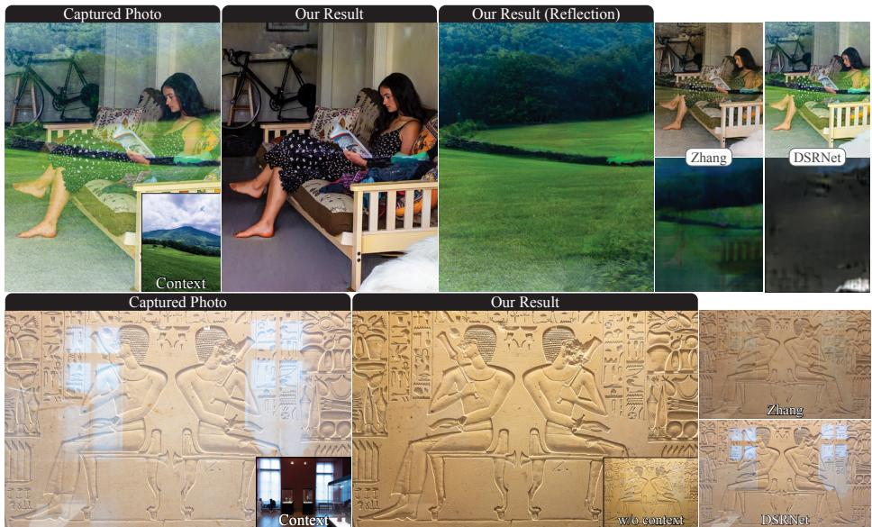
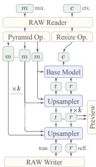
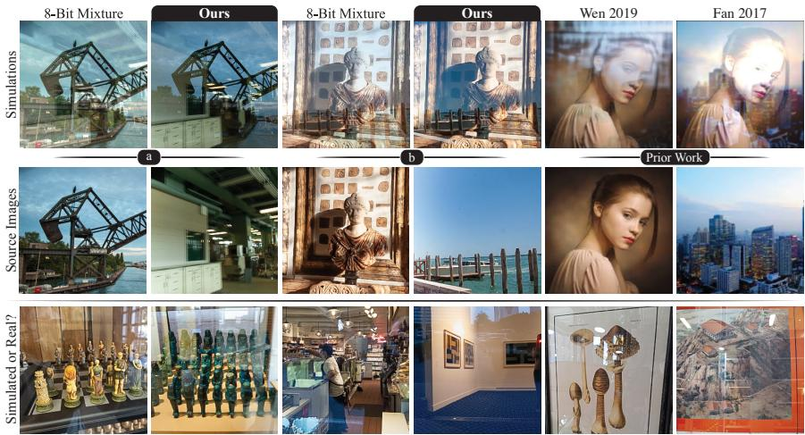
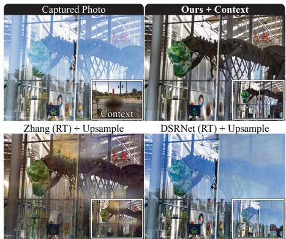
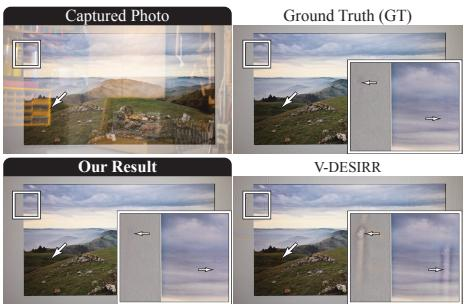
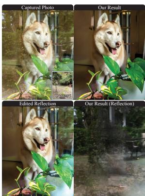
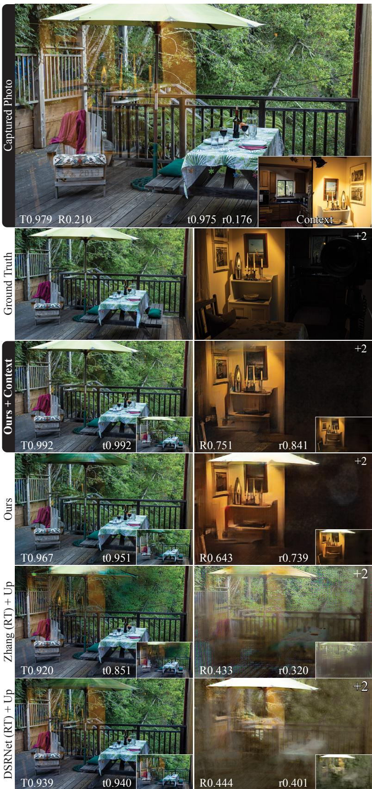
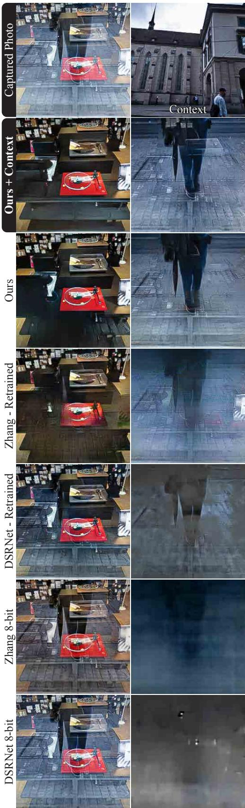

# Removing Reflections from RAW Photos

Eric Kee

Adam Pikielny Kevin Blackburn-Matzen Adobe Inc. {kee,pikielny,matzen,levoy}@adobe.com

Marc Levoy

  
Figure 1. Results of our reflection removal system. We use linear (RAW) images with an optional contextual photo, and output the clean and reflection images in linear color for editing, at full resolution (shown at 2K). Prior works use tone-mapped images at ≈ 256p, yielding lower quality and inaccurate color. Brightness/contrast changes relative to captured photos arise from reflection removal, and are correct.

## Abstract

We describe a system to remove real-world reflections from imagesfor consumer photography. Our system operates on linear (RAW) photos, and accepts an optional contextual photo looking in the opposite direction (e.g. the “selfie” camera on a mobile device). This optional photo disambiguates what should be considered the reflection. The system is trained solely on synthetic mixtures ofreal RAWphotos, which we combine using a reflection simulation that is photometrically and geometrically accurate. Our system comprises a base model that accepts the capturedphoto and optional context photo as input, and runs at 256p, followed by an up-sampling model that transforms 256p images to full resolution. The system produces preview images at 1K in 4.5-6.5s on a MacBook or iPhone 14 Pro. We show SOTA results on RAWphotos that were captured in thefield to embody typical consumer photos, and show that training on RAW simulation data improves performance more than the architectural variations among prior works.

## 1. Introduction

Taking pictures through glass is difficult. Light reflects off of the glass and linearly mixes with the subject, creating a distraction. Photos from cars and airplanes show the cabin, photos from buildings include the ceiling lights, paintings are covered by haze, and window shopping shots are photobombed by the photographer—to name just a few cases.

Removing unwanted reflections is difficult because they occur in a diverse range of locations and situations. Locations include shopping spots, traveling (cars, planes), buildings, museums, and special cases (eyeglasses, screens). Reflections depend on the time, lighting (e.g. incandescent), scene (trees, streets), illuminant power, and appearance (complex textures or simple shapes). These factors create priors because glass is placed carefully in the world.

One way to remove reflections involves capturing a second photo with a black material placed behind the glass to allow only reflected light to reach the camera. If this reflection image, and the original mixture image, are stored in a format that preserves the linear relationship between pixel values and the scene luminance (e.g., RAW), then these two scene-referred images can be subtracted to obtain the image that transmitted through the glass. This transmission image can be recovered because light mixes by addition in photosites on the sensor. Subtraction has been used for datasets [28, 48], but fails under motion or lighting changes; this severely restricts data collection. Alternatively one can place glass panes in the scene, but the scene and lighting are typically similar on both sides. Training and evaluating on such unrealistic data can be unhelpful and misleading.

This paper presents a reflection removal system for consumer photography that targets the following requirements:

1. Handle typical reflections in consumer photography.

2. Minimize user interactions (steps, taps, strokes).

3. Allow photo capture in a typical amount of time.

4. Produce results on-screen for review in about 5 seconds.

5. Produce results at the input image resolution.

6. Facilitate editing for error correction and aesthetics.

Few prior works satisfy these, which affect design and evaluation. In particular, data should match how the system will be used. For req. 1, one needs a large dataset of realistic photos. Prior works require ground truth photos, but capturing them restricts the dataset size and diversity. We synthesize realistic and diverse photos in large quantities.

We synthesize reflections by combining, for example, an image looking at a storefront with one of sunlit buildings presumed to be behind the photographer. To make the synthesis accurate, we use linear scene-referred images with known photometric and colorimetric calibration, and combine them in a physically correct way. For example, the reflected buildings are typically brighter and bluer than the storefront, but will be attenuated by reflection off the glass.

To address req. 2 (capture time) and 4 (processing time), we avoid asking the user to capture video, bursts of frames, or stereo photos. These help identify what created the reflection, but they slow down processing. Instead, we allow the user to capture an optional, contextual photo. This photo does not need to be captured simultaneously, or registered with the original photo. In fact, it could be captured by quickly turning around and looking away from the window.

To address req. 5, we use a novel upsampler with a flexible output resolution. Note that upsampling is imperative and non-trivial, but mostly disregarded in the literature. To meet req. 6 we output reflection and transmission images so users can remix them to fix the long tail of practical failures. Contributions. In this work, we

1. show how to synthesize training data such that models do not need to be fine-tuned on real images;

2. show that training/testing on RAW improves performance significantly—more than prior model variations;

3. use a contextual photo to help identify the reflection;

4. significantly reduce upsampling artifacts while produc-

ing output at 1K in 5s for review, and at full resolution. This paper is best read with hyperlinks into the supplement. See arXiv or the project website for a complete version. Prior work is outlined in Sec. 2, reflection synthesis (Sec. 3), removal (Sec. 4), and results (Sec. 5). In supplemental sections we discuss simulation (Sec. A–C), data collection (Sec. D), modeling (Sec. E), and results (Sec. F).

## 2. Prior work

Removing reflections is a long-standing problem. Prior works have used multi-image capture and machine learning. Among the latter, upsampling low-resolution results is an important sub-problem. We survey each category.

Multiple input images. Prior methods use video [5, 16], image sequences [17, 30, 33, 37, 38, 41, 42, 55], flash [4, 26], near infrared [19], polarization [12, 25, 27, 34, 53], and dual pixel images [36], as well as light fields [49]. We use an optional and additional photo of the reflected scene (not of the glass) to identify the reflection. This contextual photo is any for which the camera is pointed at the reflected scene (e.g., the camera is turned 180◦ as in a “selfie” camera).

Reflection synthesis. Prior methods are trained with heuristically mixed pairs of tone-mapped images [6, 9, 11, 16, 20, 21, 31, 47, 56, 57]. Such mixing is inaccurate, so non-linear methods have been used [24, 52]. Physically based methods nonetheless use tone-mapped images [24]. Successful methods however require ground truth images to train models that generalize [28], typically at approximately a 10:1 ratio of synthetic and real [20, 28, 29, 32, 35, 47, 51, 59]. This ratio raises issues of dataset scale and diversity because ground truth capture is tedious and restrictive. The largest dataset of real images to-date [60] has 14,952 pairs (104), but methods like [20, 47, 59] require pre-training on datasets larger than $1 0 ^ { 6 }$ (e.g., ImageNet [40]). We synthesize photometrically accurate images to obviate ground truth training images, and train models from scratch on more than 1M examples, which improves performance.

Removing high resolution reflections. Most methods operate at ≈2562 pixels, and cannot be trivially scaled up. Useful systems must create preview images at ≈1K pixels, and final outputs beyond 4K. Prasad [35] use a base model at 2562 pixels, and an upsampler that yields $\geq 4 \mathrm { K }$ pixels. Their fast upsampler re-introduces sharp reflections. Our upsampler is similarly fast, but removes sharp reflections.

Inference on RAW images. Most prior methods apply reflection removal to 8-bit display-referred images, such as internet JPEGs. Such images have been white-balanced, tone-mapped, denoised, sharpened, and compressed. We reframe dereflection to operate on scene-referred (RAW) images. Lei [26] subtract pairs of RAW images to suppress the reflection before converting to 8-bit for full removal. We operate on RAW end-to-end. RAW inputs improve prior methods, but our system outperforms them.

## 3. Reflection synthesis

Our pipeline for removing reflections uses a base model and an upsampler that are trained solely on simulated images (Sec. 4), which overcomes the scaling bottleneck of needing to capture real reflections. We simulate reflections photometrically by summing pairs of scene-referred images, which are linear with respect to scene luminance. In contrast, images in most 8-bit formats are display-referred— non-linearly related to luminance. Scene-referred images originate from sensor data stored in RAW format, such as Adobe Digital Negative (DNG). The transformation of RAW data into display-referred images is described by Adobe Camera RAW (ACR), the DNG spec. [1] pp.99-104, and the DNG SDK [1] as follows:

1. Linearize (e.g. remove vignetting and black levels)

2. Demosaic

3. Subtract the scalar black level

4. Convert to XYZ color

5. White balance1

6. Convert to RGB color

7. Dehaze, tone map (spatial adaptive highlights, shadows, clarity); enhance texture; adjust local contrast, hue, color tone, whites, and blacks.

8. Gamma compress

Step 8 yields an 8-bitfinished image for storage, but its pixel values are non-linearly related to scene luminance because Step 7 performs proprietary, non-linear, and spatially varying effects that cannot be modeled with a gamma curve as is often done [29, 53, 59]. Realistic reflections therefore cannot be simulated by summing pairs offinished images.

Which earlier step is most appropriate for simulation? The outputs of Steps 5 and 6 are linear, but the illuminant color has been removed by white balancing—accurate reflections cannot be simulated here because scenes that reflect from and transmit through glass are often illuminated by light sources with differing colors, and those colors mix before white balancing. The output of Step 3 is linear, preserves the illuminant color, and has been demosaicked, but its colors are with respect to a sensor-specific spectral basis—images from different sensors cannot be summed here. The output of Step 4 is however ideal: the XYZ color space is sensor-independent, the illuminant color is preserved (unlike prior works [3]), and pixels are linear with respect to luminance. We therefore select Step 4 and XYZ color space to simulate photometrically accurate reflections.

## 3.1. Photometric reflection synthesis

Our most fundamental simulation principle is the additive property of light: glass superimposes the light fields from a reflection and transmission scene to form a mixture. The resulting mixture image m = t + r accumulates (with equal weight) photons from the two scenes into a transmission image t and a reflection image r. We simulate t and r from images in linear XYZ color (ACR Step 4).

The first photometric property is the illuminant color, which often differs between t and r because the glass in consumer photographs typically separates indoor and outdoor spaces. Otherwise, the photographer could walk around the glass to take their photo. Even in specialized scenes like museum display cases, the case is often internally illuminated, making its illuminant color different than in the gallery at large. By representing t and r in XYZ color before white balancing, the illuminant colors are mixed.

The second property is the illuminant power. In typical scenes, this power differs on either side of the glass (t and r differ in brightness). The number of captured photons is scaled by the exposure $e ~ = ~ s \cdot g / n ^ { 2 }$ , for shutter speed s, aperture n, and gain g (ISO). We normalize the exposures of t and r by e so pixels are proportional to scene luminance up to a shared constant. This un-exposed mixture is $m ^ { \prime } = t ^ { \prime } + r ^ { \prime } , t ^ { \prime } = t / e _ { t }$ , and $r ^ { \prime } = r / e _ { r }$ , for exposures $e _ { t }$ and $e _ { r }$ . We simulate a capture function C that re-exposes and re-white balances m′ by exposing the mean pixel to a target value τ, $m = \mathcal { C } ( m ^ { \prime } ) = W e ^ { \prime } m ^ { \prime }$ , and $e ^ { \prime } = \tau / \mathbb { E } [ m ^ { \prime } ]$ , where W is a 3 × 3 matrix that white balances in XYZ (Func. S2, Sec. A.1). If pixels in t or r are saturated, $e ^ { \prime } = 1 /$ min(max(t′), max(r′)), to ensure they remain so. Lastly, m is converted to scene-referred, linear RGB to train models.

The full simulation is described in Func. 1 and Sec. A. This function produces mixtures m are photometrically accurate, but they aren’t always useful. When saturation dictates the re-exposure $e ^ { \prime } { \mathrm { , } }$ , pixels can be clipped, modeling over-exposed m. Images $t ^ { \prime } \mathrm { o r } \ r ^ { \prime }$ can also be so dark that they are invisible, or so mutually destructive that one would struggle to identify the subject. These photos do not model m that photographers care about. We therefore collect a large dataset of images and search for well exposed and well mixed m. This search introduces photometric and semantic priors on m, t, and r (e.g., skies often reflect). See Sec. D.

## 3.2. Geometric reflection synthesis

Our second fundamental simulation principle is that mixtures must be geometrically valid. Denoting the images to be summed as t and $r ,$ and our source image pairs as $( i , j )$ we synthesize $t = T ( i )$ and $r = R ( j )$ by modeling spatially varying Fresnel attenuation, perspective, double reflection, and defocus. We omit from $T$ the effects of global color, dirt, and scratches; editing tools can correct them. We model a physically calibrated amount of defocus blur; most reflections are sharp as also noted in [28]. See Sec. B.

Function 1 Simulate reflection examples $( m , t , r , c ) .$   
Input: A random pair of XYZ images $( i , j )$   
Output: Simulated components and context image.   
1: Split j into non-overlapping reflection and context parts $( r , c )$   
2: Split i similarly: randomly select a transmission part t.   
3: Unexpose t and r by using their exposure metadata.   
4: Apply the geometric simulation to (t, r).   
5: Composite $m = t + r .$   
6: Compute a new exposure e for m. {Func. S1}   
7: Compute WB matrix XYZ to XYZ awb. {Func. S2}   
8: White balance (WB) m by applying XYZ to XYZ awb.   
9: Apply the same white balance to $( t , r , c ) .$   
10: Get the transform XYZ D50 to sRGB. {SDK Func. S12}   
11: Transform $( m , t , r , c )$ to linear sRGB.   
12: return $( m , t , r , c )$

## 3.3. The contextual photo

We accept an optional contextual photo c that directly captures the reflection scene to help identify the reflection r. Capture of c can be simultaneous with the secondary front camera (selfie) on a mobile device, or briefly later. We make three observations about the views of c and r (see Fig. S3):

1. Even if the cameras are collocated, the viewpoints of c and r will be translated by twice the distance to the glass.

2. If the mixture is captured obliquely to the glass, rotating the contextual view $1 8 0 ^ { \circ }$ yields little common content.

3. If the selfie camera is used, the reflection scene might be partially occluded by the photographer.

Image c will therefore often contain little content that matches with r unless it is captured carefully. We avoid placing such a large burden on the user, and allow them to capture any view, c, of the reflection scene. Crucially, this relaxation also facilitates the geometric simulation. We scalably model c by cropping source images into a disjoint left/right half (or top/bottom). The context image encodes information about the lighting and scene because we use a capture function C with the same white balance as $( m , t , r )$ See Sec. 3.1, Func. 1, and Sec. C for details.

## 4. Reflection removal

Our system removes reflections from RAW images, m, in linear RGB color (ACR Step 6) with an optional context image c that is white balanced like m (see Func. 1). Both m and c share a scene-referred color space, which aids removal; RGB supports pre-trained perceptual losses. We predict t and r in linear RGB, and store inference outputs by inverting ACR steps 3–6 to produce new RAW images.

Our system uses two models, Fig. 2. A base model uses $m , c$ at $2 5 6 ^ { 2 }$ pixels to predict t, r (rectangular images are tiled); t, r are then upsampled using a Gaussian pyramid.

## 4.1. Base model

The base model is in Fig. S4 due to space limits. A multi-scale backbone projects m into a high dimensional space and computes semantic features (labeled P-Net). These features are

  
Figure 2. System

fused (labeled F-Net) with a feature pyramid network (FPN) at the input resolution. The backbone is EfficientNet [43] at $2 5 6 ^ { 2 }$ pixels, and fusion uses a BiFPN pyramid [44, 54].

The context image $c ,$ is processed identically to m. Its low-resolution FPN features are used to predict affines that modify the FPN features of m using conv-mod-deconv operations ala StyleGAN [23]. Modulation is per-channel because c does not share identical content with m. Conceptually, modulation gives the model additional capacity to identify r within the features of m. A finishing module further identifies and renders $t , r$ (it’s the head in [59]). We predict (t, r) independently, rather than enforcing $t + r = m ,$ , to decouple failures. Training uses the losses of [59] with improvements to the adversary and gradient terms. Crucially, training is end-to-end from random weights. See Sec. E.1.

## 4.2. Upsampler

The upsampler is shown in Fig. S5 due to space limits. Upsampling is performed iteratively over a Gaussian pyramid (see Fig. 2), as summarized below. Details are in Sec. E.2.

Briefly, the upsampler first projects the low- and highresolution images $( m , r , t )$ , and M into a high dimensional space $\phi$ using a convolutional backbone. The upsampler then matches low resolution features ϕt, ϕr to $\phi _ { m }$ to create masks that identify the features of $t ,$ r within m. This matching process uses products of features: when features match, their product can be large regardless of sign, whereas summation yields large activations if either input is large. We generalize this idea by predicting affine transforms that are applied to the features of t and $r ,$ followed by a sigmoid; see Fig. S5 (bottom). Two per-pixel, per-channel masks are thus predicted, It, Ir. Errors are corrected by a joint mask predictor that inspects both $\mathbb { I } _ { t } , \mathbb { I } _ { r }$ (see Sec. E.2). Masks $\mathbb { I } _ { t }$ and $\mathbb { I } _ { r }$ are resampled $2 \times$ and multiplied with $\phi _ { M }$ to project its features into subspaces for T, $R .$ This key step assumes that the identity $\mathbb { I } _ { t } , \mathbb { I } _ { r }$ of the component to which each feature belongs is low in spatial frequency. By resampling masks, not features, sharp features are preserved. Errors are corrected with finishing convolutions, which render T, R.

Training uses a cycle-consistency loss, losses similar to [35], and begins from scratch. See Sec. E.2 for details.

## 5. Results

We evaluate the simulation, base model, and upsampler; extensive results are added in the supplement. We make four contributions. First, we show that dereflection models that are trained solely on simulated reflections can generalize to real images without fine-tuning on real images, provided that the simulation uses RAW images in a photometrically accurate way. Second, training and testing on RAW images improves results significantly, and more than prior model variations. Third, a context image can disambiguate the reflection content if it is captured in another direction (e.g., the selfie). Fourth, upsampling low-res results, which is imperative but largely neglected in the literature, works better if one explicitly matches features in the low-res outputs $t , r$ to the low-res mixture, and masks them from the high-res mixture to recover the high-res transmission and reflection.

## 5.1. Reflection simulation

Source images were drawn from MIT5K [8], RAISE [10], and Laval Indoors [14], totaling 12,803 RAWs and 2,233 scene-referred Image-Based Lighting (IBL) panoramas. The 360◦ IBLs are equivalent to about 12,367 indoor RAW images because we simulate random cameras with an average FOV of $6 5 ^ { \circ }$ , Sec. B.2, B.4. Images are grouped into 10,547 outdoor and 14,623 indoor to create pairs $( i , j )$ Sec. D.2. The groups are split into train, validation, and test sets (80%, 15%, 5%) before simulation.

The number of examples $( m , t , r )$ is amplified by randomization in the geometric simulation (Sec. B, D). We search $1 0 ^ { 8 }$ examples for useful $m .$ After culling, about $1 0 ^ { 7 }$ mixtures remain, and we rendered 10% at $2 5 6 ^ { 2 }$ and $2 0 4 8 ^ { 2 }$ pixels to train the models. The $2 5 6 ^ { 2 }$ pixel dataset has 1,241,091 for training, 46,121 for test, and 8,991 for validation; the $2 0 4 8 ^ { 2 }$ dataset has 1,079,631; 39,916; and 7,448.

Fig. 3 shows results of mixing scene-referred images: (a) correct illuminant colors and (b) correct reflection visibility. We linearly blended 8-bit tone-mapped images for comparison, and compare to prior works (see caption). Fig. S2 shows an overview of the dataset, and is discussed below.

In Tab. 1 we ablate each simulation component. We (gamma) compressed $t , ~ r$ before compositing; separately exposed them (exposure); did not constrain their inclination or field-of-view (pose); removed spatially varying attenuation by making all camera rays normal to the glass (fresnel); separately white balanced $( W B ) ;$ removed depthof-field blur and double reflection (blur); and removed all. We trained our base model on each dataset, and evaluated on the full-simulation test set. Each feature affects performance (all differences are significant), and omitting them all $( A l l \pm G )$ decreases performance dramatically compared to the average degradation to $t , r$ (control).

Discussion. Prior works mix 8-bit tone-mapped images, and the results are qualitatively unrealistic. Their simulated reflections overpower the highlights, and are not powerfu enough in the shadows, which are boosted by tone mapping. In our accurate simulations, light from two scenes is mixed linearly and equally without tone-mapping. This accurate mixing allows our models to generalize better to new scenes, and yields SOTA performance without training on real images (Sec. 5.2). Furthermore, by synthesizing physically accurate reflections and searchingfor visible ones, we introduce natural priors on their appearance. Indoor light is weak, so reflections of the indoors are typically of regions near light sources or windows; see Fig. S2, examples 1, 2, 5, 11, 14, 19, 24, 25. Indoor lights create small reflections that often look yellow atop outdoor scenes, due to typical illuminant colors, whereas outdoor light can bounce off diffuse objects with enough strength to create colorful reflections of whole scenes that can be blue in white balance due to the outdoor illuminant color; see Fig. S2, examples 4, 8, 10, 12, 15, 16, 17, 18, 21. At dusk, whole indoor scenes can reflect over cityscapes, etc. (examples 3, 13). Such priors are apparent in consumer photos (see Figs. 1, 7, 8, S6, S7, S8). Lastly, like prior works we pair indoor/outdoor photos, which permits pairings such as bathrooms and beaches. Such pairs can be removed if they prove unhelpful.

## 5.2. Base reflection removal

Base models were trained end-to-end from random weights at $2 5 6 ^ { 2 }$ pixels using an Adam optimizer with $l _ { r } ~ = ~ 1 e { - } 4 ,$ discriminator $l _ { r } = 5 e { - } 5$ , and batch size 32 over 16 GPUs for 20 epochs. Adversarial training begins after one epoch.

We trained three base models, one with and two without context $c .$ To omit $c ,$ we removed the modulated merges (Fig. S4), which decreases model capacity. As a second option, we left the model unchanged, and trained/tested with random $c .$ We used this second approach for ablation.

Our system uses RAW images end-to-end, but public datasets do not provide RAW images: Real20, Real45, Nature, SIR2, SIR2+, CDR,2 and RRW all use JPG/PNG formats [11, 28, 29, 46, 48, 59, 60]. We tabulate results using our simulation test sets, and show visual results using RAW photos that were captured in-the-wild. See also Sec. F.2.

In Tab. 2 we compare to Zhang et al. [59], DSRNet [20], Zhu et al. [60], and CoRRN [47] by retraining their models on our RAW dataset.3 Recall that our model uses the same losses and network head as Zhang et al. This simplifies comparison to prior work. Tab. 2 (RAW Train) shows that, when training with RAW, all methods improve images relative to the average degradation to $t , r \ ( c o n t r o l ) .$ . Our models however outperform prior works $( o u r s + c t x , o u r s )$

To show the benefit of RAW simulation and inference, we ran the previously published 8-bit models on an 8-bit version of our test set,4 and compared the percent improvement to that of using RAW (Tab. 2, 8-bit Pub.). DSRNet and Zhu improve images modestly; Zhang and CoRRN distort the color (e.g. Fig. 1). Retraining DSRNet, Zhu, and Zhang on RAW improves their performance by ≈40 pct. points (pp) $\mathbf { S S I M _ { t } } ,$ whereas the performance differences among them are only ${ \approx } 2 \mathbf { 0 } \mathbf { p } \mathbf { p } .$ . Training on RAW simulation data therefore improved performance more than the architectural variations among prior works. Furthermore, ablating the simulation (Tab. 1, All+G) degrades performance -46pp, which conversely matches the +40pp benefit of RAW retraining, and exceeds even the benefit of the contextual photo (+4pp).

  
Figure 3. The importance of synthesizing training data (top row) from linear images (mid dle row), compared to prior work. (a) Photometrically accurate illuminant colors are simulated by mixing before white balancing; mixing 8-bit white balanced images is much different. (b) Mixing in scene-referred linear units produces reflections that are strong in the shadows, but transparent in the highlights. (prior work) Such effects are visibly incorrect in prior work, which blend 8-bit tone mapped images [11, 52]. (bottom) Real and simulated examples are shuffled together. For each real image, a similar synthetic reflection was manually found in the dataset. Real images were not captured to match known examples; these qualitative matches exist because the dataset size exceeds ${ 1 0 } ^ { 6 }$ en numbered images are synthetic) (ev .

<table><tr><td>Method</td><td>SSIMt</td><td>%↑</td><td>SSIMr</td><td>%↑</td></tr><tr><td>Control Full Sim.</td><td>85.8 95.7</td><td>70</td><td>49.0 88.2</td><td>77</td></tr><tr><td rowspan="8">Ablae</td><td>(G)amma</td><td>88.8</td><td>21</td><td>77.0</td></tr><tr><td>Exposure</td><td>94.2</td><td>59 86.1</td><td>55 73</td></tr><tr><td>Pose</td><td>95.0</td><td>65 85.4</td><td>71</td></tr><tr><td>Fresnel</td><td>95.3</td><td>67 87.3</td><td>75</td></tr><tr><td>WB</td><td>95.5</td><td>68 87.6</td><td>76</td></tr><tr><td>Blur</td><td>95.5</td><td>68 87.9</td><td>76</td></tr><tr><td>All - G</td><td>90.2</td><td>31 71.3</td><td>44</td></tr><tr><td>All + G</td><td>89.2</td><td>24</td><td>58.5 19</td></tr></table>

Table 1. Ablated datasets were created, 1.2M examples each. Model ours+ctx was trained on these, and tested on the fullsimulation test set. %↑ is w.r.t. control (see Tab. 2). SSIM values are shown as percentages.
<table><tr><td></td><td>Method</td><td>PSNRtSSIMt</td><td></td><td>%↑</td><td>PSNRr</td><td>SSIMr</td><td>%↑</td></tr><tr><td></td><td>Control</td><td>21.74</td><td>85.8</td><td></td><td>12.48</td><td>49.0</td><td></td></tr><tr><td>RA w Tain</td><td>Ours+ctx</td><td>33.23</td><td>95.7</td><td>+70</td><td>30.17</td><td>88.2</td><td>+77</td></tr><tr><td></td><td>Ours</td><td>32.15</td><td>95.2</td><td>+66</td><td>29.18</td><td>86.7</td><td>+74</td></tr><tr><td></td><td>Zhu [60]</td><td>29.84</td><td>92.8</td><td>+49</td><td></td><td></td><td></td></tr><tr><td></td><td>DSRNet [20]</td><td>28.98</td><td>92.6</td><td>+48</td><td>23.99</td><td>75.5</td><td>+52</td></tr><tr><td></td><td>Zhang [59]</td><td>26.23</td><td>89.9</td><td>+28</td><td>22.78</td><td>61.5</td><td>+25</td></tr><tr><td></td><td>CoRRN [47]</td><td>22.75</td><td>86.7</td><td>+6</td><td>18.31</td><td>60.4</td><td>+22</td></tr><tr><td>8qqbhi u-.</td><td>Control</td><td>18.62</td><td>78.4</td><td></td><td>9.79</td><td>37.4</td><td></td></tr><tr><td></td><td>DSRNet [20]</td><td>19.99</td><td>80.0</td><td>+8</td><td>16.98</td><td>49.3</td><td>+19</td></tr><tr><td></td><td>Zhu [60]</td><td>19.84</td><td>79.7</td><td>+6</td><td></td><td></td><td></td></tr><tr><td></td><td>Zhang [59]</td><td>18.65</td><td>75.9</td><td>-11</td><td>17.37</td><td>51.0</td><td>+22</td></tr><tr><td></td><td>CoRRN [47]</td><td>18.95</td><td>74.7</td><td>-17</td><td>15.99</td><td>23.8</td><td>-22</td></tr><tr><td>AI.</td><td>Ours+rac</td><td>33.20</td><td>95.7</td><td>+70</td><td>30.20</td><td>88.3</td><td>+77</td></tr><tr><td></td><td>Ours+rnd</td><td>32.42</td><td>95.1</td><td>+66</td><td>29.29</td><td>86.7</td><td>+74</td></tr></table>

Table 2. Base models: (control) compares m to t, r. 8-bit models use published weights. %↑ is w.r.t. SSIM control. Ablations: (rac) GT r is used as context; (rnd) random c. Ours+ctx beats Ours+rnd $( p < 1 . 7 e { - } 1 1 )$

Figure 4. Results at 2048p; base outputs inset.  

  
Figure 5. Upsampling GT images 256p to 2048p. V-DESIRR [35] adds artifacts.

<table><tr><td>Method</td><td>PSNRt</td><td>SSIMt</td><td>PSNRr</td><td>SSIMr</td></tr><tr><td>Control</td><td>19.50</td><td>86.3</td><td>13.13</td><td>64.5</td></tr><tr><td>Ours</td><td>47.77</td><td>98.8</td><td>45.93</td><td>98.2</td></tr><tr><td>Ours-NM</td><td>43.29</td><td>98.1</td><td>43.99</td><td>96.9</td></tr><tr><td>VDSR+C [35]</td><td>42.24</td><td>97.9</td><td>38.32</td><td>93.8</td></tr><tr><td>GT VDSR [35]</td><td>40.74</td><td>97.4</td><td>38.30</td><td>93.9</td></tr><tr><td>Bicubic</td><td>31.98</td><td>85.1</td><td>41.58</td><td>96.0</td></tr><tr><td>SUPIR [58]</td><td>28.09</td><td>64.6</td><td>28.29</td><td>56.8</td></tr><tr><td>RESRGan [50] 23.72</td><td></td><td>65.6</td><td>23.11</td><td>53.6</td></tr><tr><td>E2E Ours</td><td>30.62</td><td>95.2</td><td>28.53</td><td>90.7</td></tr><tr><td>VDSR+C [35]</td><td>30.27</td><td>94.5</td><td>27.74</td><td>88.7</td></tr></table>

Table 3. Upsampling ground truth (GT), and using the base model for end-to-end results (E2E). Usampling is from 256p to 2048p using our method and V-DESIRR with and without cycle consistency (+C), which improves VDSR for T $\ : ( p < 1 e { - } 1 2 ) \ :$

In Tab. 2 (Abl.) we ablate our contextual model by training/testing with random c (ours+rnd), which degrades performance compared to (ours+ctx)—this is statistically significant. Removing operations that use c (ours) did not degrade performance compared to ours+rnd $( p < 1 . 7 e \mathrm { - } 1 1 )$ which suggests that ours+rnd does not learn dataset priors with its additional capacity, and conversely that ours+ctx leverages the content of c. Ablating further, using the reflection as the context (c = r) at test time only does not improve the contextual model results (ours+rac), which suggests that c and r need not match; the model is robust to their differences since it is trained with disjoint crops (c, r).

For visual comparison, in Fig. 7 and Fig. S6 we captured5 ground truth reflections in common cases: looking outdoors, into a display case, and at artwork. We dereflected with Zhang, DSRNet (retrained, RT), and our models at 256×384 (inset images) and upsampled to 2048×2731 (next section). The empirical SSIM values (lowercase t, r) are commensurate with test performance (Tab. 2). In Fig. 7 our contextual model separates the reflection, but without context our model attributes the colors in the umbrella with a reflected object. Prior works perform quantitatively worse.

In Figs. 1, 4, 8, S7, S8, and S9 we show results on photos in-the-wild from cameras that were not used to construct the training data. We also compare the 8-bit models of Zhang and DSRNet. The bottom two rows of Figs. 8, S7, S8 show that these prior 8-bit models perform qualitatively worse than when they are re-trained/evaluated on RAW (the top rows). They do not however recover r well, which is needed for aesthetics and error correction (Sec. 5.4, Sec. F.4).

Discussion. Our models recover t, r in diverse realworld cases including museums, nature, shopping, a midday city, artwork, etc. (Figs. 1, 4, 7, 8, S6, S7, S8, S9). In Fig. 1, using the context photo yields more correct and uniform color on the Egyptian tablet because there is less ambiguity about the color of the reflection scene (compare to inset w/o context). Failures occur when t or r is bright, and pushes the other into the noise floor, saturating it to black—the problem becomes hole filling. When a single color channel saturates, the content can sometimes be recovered. But, systems must address hole filling because users typically cannot control the strength of reflections.

Errors can occur when textured regions of t and r overlap, as in Fig. 1 where a stone wall overlaps the subject’s dress. Color differences help: in Fig. 7 the reflected painting is separated from the tree. Without such differences, models must repair or hallucinate content in the corrupted t. Saturated reflections pose a similar challenge. See Sec. F for more discussion of errors and additional results.

## 5.3. Upsampling

Our upsampler is trained using Adam with $l _ { r } = 4 e { - } 4$ , batch size 64 over 32 A100 GPUs, and converges after about 40 epochs. For end-to-end operation (E2E), we tune with the base model outputs for 19K examples at $l _ { r } = 2 e { - } 4$

We compare to V-DESIRR [35] in Tab. 3 by upsampling the ground truth (GT) and using the base model (E2E).6 For best E2E performance, we fine tuned our upsampler and V-DESIRR with the base model. Our method performs best (ours). Cycle consistency loss improves V-DESIRR (+C), so we used this for E2E. We ablated the upsampler masking operations by using only the finisher head (Ours-NM); performance degraded almost to match V-DESIRR.

Comparing on GT images, Fig. 5 and Fig. S11, V-DESIRR produces strong artifacts, even after fine tuning (adding cycle-consistency losses did not help).

Discussion. V-DESIRR amplifies errors at low resolutions by repeatedly upsampling its previous output images. Instead, our model masks and copies the high-res mixture features ϕ to the output T, R. This direct copy reduces error propagation. Errors can still occur when features that are not present in the low resolution inputs become visible at the next level upward (e.g. Fig. S14) because the low resolution t, r cannot guide upsampling of such features, and the

upsampler must infer the high resolution image to which the features belong.

## 5.4. Reflection editing

In Fig. 6 and Fig. S15 we show that the predicted reflection facilitates aesthetic editing and error correction. In Fig. 6, the reflection color and spatial arrangement is modified. Error correction is shown in Fig. S15, Sec. F.4. Edits were made in Photo-

  
Figure 6. Reflection editing.

shop using the tone-mapped t and r images, and “Linear Dodge” blend mode (but linear blending would be ideal).

## 6. Conclusion

We have described a de-reflection system that is trained solely on images from a photometrically and geometrically accurate simulation. Moreover, we have imbued these images with natural priors by searching among millions of them for well-exposed and visually interpretable cases. This RAW simulation dramatically improves results, more than prior model variations, and enables our models to perform well on real images without training on them.

Since Farid and Adelson [12], many cues have been used for de-reflection. We add illuminant color and context photos, and use RAW images end-to-end. Our models are thus sensitive and can uncover hidden reflections, Fig. S9; privacy should be protected. Our system can also remove lens flares, though they are not in the dataset, Fig. S10. Flare removal systems might therefore be pre-trained to remove reflections, since it is difficult to capture real lens flares.

  
Figure 7. Comparisons to ground truth (GT) at 256×384 (inset) and 2048×3072. Methods are retrained for RAW (RT). SSIMs are relative to GT.

  
Figure 8. Comparisons to models trained on 8-bit images (bottom), with results at 2562 pixels.

## References

[1] Adobe. Adobe DNG specification. https://helpx. adobe.com/camera- raw/digital- negative. html, 2024. Accessed 2024-03-01. 3, 16, 17

[2] Mahmoud Afifi, Jonathan T. Barron, Chloe LeGendre, Yun-Ta Tsai, and Francois Bleibel. Cross-camera convolutional color constancy. In 2021 IEEE/CVF International Conference on Computer Vision, ICCV 2021, Montreal, QC, Canada, October 10-17, 2021, pages 1961–1970. IEEE, 2021. 1, 2

[3] Mahmoud Afifi, Abdelrahman Abdelhamed, Abdullah Abuolaim, Abhijith Punnappurath, and Michael S. Brown. CIE XYZ net: Unprocessing images for low-level computer vision tasks. IEEE Trans. Pattern Anal. Mach. Intell., 44(9): 4688–4700, 2022. 3

[4] Amit K. Agrawal, Ramesh Raskar, Shree K. Nayar, and Yuanzhen Li. Removing photography artifacts using gradient projection and flash-exposure sampling. ACM Trans. Graph., 24(3):828–835, 2005. 2

[5] Jean-Baptiste Alayrac, Joao Carreira, and Andrew Zisser-˜ man. The visual centrifuge: Model-free layered video representations. In IEEE Conference on Computer Vision and Pattern Recognition, CVPR 2019, Long Beach, CA, USA, June 16-20, 2019, pages 2457–2466. Computer Vision Foundation / IEEE, 2019. 2

[6] Nikolaos Arvanitopoulos, Radhakrishna Achanta, and Sabine Susstrunk. Single image reflection suppression. In ¨ 2017 IEEE Conference on Computer Vision and Pattern Recognition, CVPR 2017, Honolulu, HI, USA, July 21-26, 2017, pages 1752–1760. IEEE Computer Society, 2017. 2

[7] Tim Brooks, Ben Mildenhall, Tianfan Xue, Jiawen Chen, Dillon Sharlet, and Jonathan T. Barron. Unprocessing images for learned raw denoising. In IEEE Conference on Computer Vision and Pattern Recognition, CVPR 2019, Long Beach, CA, USA, June 16-20, 2019, pages 11036–11045. Computer Vision Foundation / IEEE, 2019. 3

[8] Vladimir Bychkovsky, Sylvain Paris, Eric Chan, and Fredo´ Durand. Learning photographic global tonal adjustment with a database of input / output image pairs. In The 24th IEEE Conference on Computer Vision and Pattern Recognition, CVPR 2011, Colorado Springs, CO, USA, 20-25 June 2011, pages 97–104. IEEE Computer Society, 2011. 5, 6, 14

[9] Zhikai Chen, Fuchen Long, Zhaofan Qiu, Juyong Zhang, Zheng-Jun Zha, Ting Yao, and Jiebo Luo. A closer look at the reflection formulation in single image reflection removal. IEEE Trans. Image Process., 33:625–638, 2024. 2

[10] Duc-Tien Dang-Nguyen, Cecilia Pasquini, Valentina Conotter, and Giulia Boato. RAISE: a raw images dataset for digital image forensics. In Proceedings ofthe 6th ACM Multimedia Systems Conference, MMSys 2015, Portland, OR, USA, March 18-20, 2015, pages 219–224. ACM, 2015. 5, 6, 14

[11] Qingnan Fan, Jiaolong Yang, Gang Hua, Baoquan Chen, and David P. Wipf. A generic deep architecture for single image reflection removal and image smoothing. In IEEE International Conference on Computer Vision, ICCV 2017, Venice, Italy, October 22-29, 2017, pages 3258–3267. IEEE Computer Society, 2017. 2, 5, 6

[12] Hany Farid and Edward H. Adelson. Separating reflections and lighting using independent components analysis. In 1999 Conference on Computer Vision and Pattern Recognition (CVPR ’99), 23-25 June 1999, Ft. Collins, CO, USA, pages 1262–1267. IEEE Computer Society, 1999. 2, 7

[13] Hany Farid and Eero P. Simoncelli. Differentiation of discrete multidimensional signals. IEEE Trans. Image Process., 13(4):496–508, 2004. 8

[14] Marc-Andre Gardner, Kalyan Sunkavalli, Ersin Yumer, Xi-´ aohui Shen, Emiliano Gambaretto, Christian Gagne, and ´ Jean-Franc¸ois Lalonde. Learning to predict indoor illumination from a single image. ACM Trans. Graph., 36(6):176:1– 176:14, 2017. 5, 4, 6

[15] N. Goldberg. Camera Technology: The Dark Side of the Lens. Elsevier Science, 1992. 4

[16] Xiaojie Guo, Xiaochun Cao, and Yi Ma. Robust separation of reflection from multiple images. In 2014 IEEE Conference on Computer Vision and Pattern Recognition, CVPR 2014, Columbus, OH, USA, June 23-28, 2014, pages 2195–2202. IEEE Computer Society, 2014. 2

[17] Byeong-Ju Han and Jae-Young Sim. Reflection removal using low-rank matrix completion. In 2017 IEEE Conference on Computer Vision and Pattern Recognition, CVPR 2017, Honolulu, HI, USA, July 21-26, 2017, pages 3872–3880. IEEE Computer Society, 2017. 2

[18] Yannick Hold-Geoffroy, Kalyan Sunkavalli, Jonathan Eisenmann, Matt Fisher, Emiliano Gambaretto, Sunil Hadap, and Jean-Franc¸ois Lalonde. A perceptual measure for deep single image camera calibration. In 2018 IEEE Conference on Computer Vision and Pattern Recognition, CVPR 2018, Salt Lake City, UT, USA, June 18-22, 2018, pages 2354– 2363. Computer Vision Foundation / IEEE Computer Society, 2018. 4

[19] Yuchen Hong, Youwei Lyu, Si Li, and Boxin Shi. Nearinfrared image guided reflection removal. In IEEE International Conference on Multimedia and Expo, ICME 2020, London, UK, July 6-10, 2020, pages 1–6. IEEE, 2020. 2

[20] Qiming Hu and Xiaojie Guo. Single image reflection separation via component synergy. In IEEE/CVF International Conference on Computer Vision, ICCV 2023, Paris, France, October 1-6, 2023, pages 13092–13101. IEEE, 2023. 2, 5, 6, 10, 14

[21] Meiguang Jin, Sabine Susstrunk, and Paolo Favaro. Learning¨ to see through reflections. In 2018 IEEE International Conference on Computational Photography, ICCP 2018, Pittsburgh, PA, USA, May 4-6, 2018, pages 1–12. IEEE Computer Society, 2018. 2

[22] Hakki Can Karaimer and Michael S. Brown. A software platform for manipulating the camera imaging pipeline. In Computer Vision - ECCV 2016 - 14th European Conference, Amsterdam, The Netherlands, October 11-14, 2016, Proceedings, Part I, pages 429–444. Springer, 2016. 3

[23] Tero Karras, Miika Aittala, Janne Hellsten, Samuli Laine, Jaakko Lehtinen, and Timo Aila. Training generative adversarial networks with limited data. In Advances in Neural Information Processing Systems 33: Annual Conference on Neural Information Processing Systems 2020, NeurIPS 2020, December 6-12, 2020, virtual, 2020. 4, 7, 8

[24] Soomin Kim, Yuchi Huo, and Sung-Eui Yoon. Single image reflection removal with physically-based training images. In 2020 IEEE/CVF Conference on Computer Vision and Pattern Recognition, CVPR 2020, Seattle, WA, USA, June 13- 19, 2020, pages 5163–5172. Computer Vision Foundation / IEEE, 2020. 2, 4

[25] Naejin Kong, Yu-Wing Tai, and Joseph S. Shin. A physically-based approach to reflection separation: From physical modeling to constrained optimization. IEEE Trans. Pattern Anal. Mach. Intell., 36(2):209–221, 2014. 2

[26] Chenyang Lei and Qifeng Chen. Robust reflection removal with reflection-free flash-only cues. In IEEE Conference on Computer Vision and Pattern Recognition, CVPR 2021, virtual, June 19-25, 2021, pages 14811–14820. Computer Vision Foundation / IEEE, 2021. 2

[27] Chenyang Lei, Xuhua Huang, Mengdi Zhang, Qiong Yan, Wenxiu Sun, and Qifeng Chen. Polarized reflection removal with perfect alignment in the wild. In 2020 IEEE/CVF Conference on Computer Vision and Pattern Recognition, CVPR 2020, Seattle, WA, USA, June 13-19, 2020, pages 1747– 1755. Computer Vision Foundation / IEEE, 2020. 2

[28] Chenyang Lei, Xuhua Huang, Chenyang Qi, Yankun Zhao, Wenxiu Sun, Qiong Yan, and Qifeng Chen. A categorized reflection removal dataset with diverse real-world scenes. In IEEE/CVF Conference on Computer Vision and Pattern Recognition Workshops, CVPR Workshops 2022, New Orleans, LA, USA, June 19-20, 2022, pages 3039–3047. IEEE, 2022. 2, 4, 5

[29] Chao Li, Yixiao Yang, Kun He, Stephen Lin, and John E. Hopcroft. Single image reflection removal through cascaded refinement. In 2020 IEEE/CVF Conference on Computer Vision and Pattern Recognition, CVPR 2020, Seattle, WA, USA, June 13-19, 2020, pages 3562–3571. Computer Vision Foundation / IEEE, 2020. 2, 3, 5

[30] Yu Li and Michael S. Brown. Exploiting reflection change for automatic reflection removal. In IEEE International Conference on Computer Vision, ICCV 2013, Sydney, Australia, December 1-8, 2013, pages 2432–2439. IEEE Computer Society, 2013. 2

[31] Yu Li and Michael S. Brown. Single image layer separation using relative smoothness. In 2014 IEEE Conference on Computer Vision and Pattern Recognition, CVPR 2014, Columbus, OH, USA, June 23-28, 2014, pages 2752–2759. IEEE Computer Society, 2014. 2

[32] Yu Li, Ming Liu, Yaling Yi, Qince Li, Dongwei Ren, and Wangmeng Zuo. Two-stage single image reflection removal with reflection-aware guidance. Appl. Intell., 53(16):19433– 19448, 2023. 2

[33] Yu-Lun Liu, Wei-Sheng Lai, Ming-Hsuan Yang, Yung-Yu Chuang, and Jia-Bin Huang. Learning to see through obstructions. In 2020 IEEE/CVF Conference on Computer Vision and Pattern Recognition, CVPR 2020, Seattle, WA, USA, June 13-19, 2020, pages 14203–14212. Computer Vision Foundation / IEEE, 2020. 2

[34] Youwei Lyu, Zhaopeng Cui, Si Li, Marc Pollefeys, and Boxin Shi. Reflection separation using a pair of unpolarized and polarized images. In Advances in Neural Information

Processing Systems 32: Annual Conference on Neural Information Processing Systems 2019, NeurIPS 2019, December 8-14, 2019, Vancouver, BC, Canada, pages 14532–14542, 2019. 2

[35] B. H. Pawan Prasad, Green Rosh K. S, R. B. Lokesh, Kaushik Mitra, and Sanjoy Chowdhury. V-DESIRR: very fast deep embedded single image reflection removal. In 2021 IEEE/CVF International Conference on Computer Vision, ICCV 2021, Montreal, QC, Canada, October 10-17, 2021, pages 2370–2379. IEEE, 2021. 2, 4, 6, 7, 8, 13, 15

[36] Abhijith Punnappurath and Michael S. Brown. Reflection removal using a dual-pixel sensor. In IEEE Conference on Computer Vision and Pattern Recognition, CVPR 2019, Long Beach, CA, USA, June 16-20, 2019, pages 1556–1565. Computer Vision Foundation / IEEE, 2019. 2

[37] Bernard Sarel and Michal Irani. Separating transparent layers through layer information exchange. In Computer Vision - ECCV 2004, 8th European Conference on Computer Vision, Prague, Czech Republic, May 11-14, 2004. Proceedings, Part IV, pages 328–341. Springer, 2004. 2

[38] Bernard Sarel and Michal Irani. Separating transparent layers of repetitive dynamic behaviors. In 10th IEEE International Conference on Computer Vision (ICCV 2005), 17-20 October 2005, Beijing, China, pages 26–32. IEEE Computer Society, 2005. 2

[39] Yichang Shih, Dilip Krishnan, Fredo Durand, and William T.´ Freeman. Reflection removal using ghosting cues. In IEEE Conference on Computer Vision and Pattern Recognition, CVPR 2015, Boston, MA, USA, June 7-12, 2015, pages 3193–3201. IEEE Computer Society, 2015. 4, 5

[40] Karen Simonyan and Andrew Zisserman. Very deep convolutional networks for large-scale image recognition. In 3rd International Conference on Learning Representations, ICLR 2015, San Diego, CA, USA, May 7-9, 2015, Conference Track Proceedings, 2015. 2

[41] Chao Sun, Shuaicheng Liu, Taotao Yang, Bing Zeng, Zhengning Wang, and Guanghui Liu. Automatic reflection removal using gradient intensity and motion cues. In Proceedings of the 2016 ACM Conference on Multimedia Conference, MM 2016, Amsterdam, The Netherlands, October 15-19, 2016, pages 466–470. ACM, 2016. 2

[42] Richard Szeliski, Shai Avidan, and P. Anandan. Layer extraction from multiple images containing reflections and transparency. In 2000 Conference on Computer Vision and Pattern Recognition (CVPR 2000), 13-15 June 2000, Hilton Head, SC, USA, page 1246. IEEE Computer Society, 2000. 2

[43] Mingxing Tan and Quoc V. Le. Efficientnet: Rethinking model scaling for convolutional neural networks. In Pro ceedings of the 36th International Conference on Machine Learning, ICML 2019, 9-15 June 2019, Long Beach, California, USA, pages 6105–6114. PMLR, 2019. 4, 7

[44] Mingxing Tan, Ruoming Pang, and Quoc V. Le. Efficientdet: Scalable and efficient object detection. In 2020 IEEE/CVF Conference on Computer Vision and Pattern Recognition, CVPR 2020, Seattle, WA, USA, June 13-19, 2020, pages 10778–10787. Computer Vision Foundation / IEEE, 2020. 4, 7, 8

[45] Robert Thompson. Identification of glass samples by their refractive index. https://www.asdlib.org/ onlineArticles/elabware/thompson/Glass/ Glass(RI)PFaculty.pdf, 2023. Accessed 2023-11- 10. 6

[46] Renjie Wan, Boxin Shi, Ling-Yu Duan, Ah-Hwee Tan, and Alex C. Kot. Benchmarking single-image reflection removal algorithms. In IEEE International Conference on Computer Vision, ICCV 2017, Venice, Italy, October 22-29, 2017, pages 3942–3950. IEEE Computer Society, 2017. 5

[47] Renjie Wan, Boxin Shi, Haoliang Li, Ling-Yu Duan, Ah-Hwee Tan, and Alex C. Kot. Corrn: Cooperative reflection removal network. IEEE Trans. Pattern Anal. Mach. Intell., 42(12):2969–2982, 2020. 2, 5, 6

[48] Renjie Wan, Boxin Shi, Haoliang Li, Yuchen Hong, Ling-Yu Duan, and Alex C. Kot. Benchmarking single-image reflection removal algorithms. IEEE Trans. Pattern Anal. Mach. Intell., 45(2):1424–1441, 2023. 2, 5

[49] Qiaosong Wang, Haiting Lin, Yi Ma, Sing Bing Kang, and Jingyi Yu. Automatic layer separation using light field imag ing. CoRR, abs/1506.04721, 2015. 2

[50] Xintao Wang, Liangbin Xie, Chao Dong, and Ying Shan. Real-esrgan: Training real-world blind super-resolution with pure synthetic data. In IEEE/CVF International Conference on Computer Vision Workshops, ICCVW 2021, Montreal, QC, Canada, October 11-17, 2021, pages 1905–1914. IEEE, 2021. 6

[51] Kaixuan Wei, Jiaolong Yang, Ying Fu, David P. Wipf, and Hua Huang. Single image reflection removal exploiting misaligned training data and network enhancements. In IEEE Conference on Computer Vision and Pattern Recognition, CVPR 2019, Long Beach, CA, USA, June 16-20, 2019, pages 8178–8187. Computer Vision Foundation / IEEE, 2019. 2

[52] Qiang Wen, Yinjie Tan, Jing Qin, Wenxi Liu, Guoqiang Han, and Shengfeng He. Single image reflection removal beyond linearity. In IEEE Conference on Computer Vision and Pattern Recognition, CVPR 2019, Long Beach, CA, USA, June 16-20, 2019, pages 3771–3779. Computer Vision Foundation / IEEE, 2019. 2, 6

[53] Patrick Wieschollek, Orazio Gallo, Jinwei Gu, and Jan Kautz. Separating reflection and transmission images in the wild. In Computer Vision - ECCV 2018 - 15th European Conference, Munich, Germany, September 8-14, 2018, Proceedings, Part XIII, pages 90–105. Springer, 2018. 2, 3

[54] Ross Wightman. Pytorch image models. https : //github.com/huggingface/pytorch-imagemodels, 2019. 4, 7

[55] Tianfan Xue, Michael Rubinstein, Ce Liu, and William T. Freeman. A computational approach for obstruction-free photography. ACM Trans. Graph., 34(4):79:1–79:11, 2015. 2

[56] Jie Yang, Dong Gong, Lingqiao Liu, and Qinfeng Shi. Seeing deeply and bidirectionally: A deep learning approach for single image reflection removal. In Computer Vision - ECCV 2018 - 15th European Conference, Munich, Germany, September 8-14, 2018, Proceedings, Part III, pages 675–691. Springer, 2018. 2

[57] Yang Yang, Wenye Ma, Yin Zheng, Jian-Feng Cai, and Weiyu Xu. Fast single image reflection suppression via convex optimization. In IEEE Conference on Computer Vision and Pattern Recognition, CVPR 2019, Long Beach, CA, USA, June 16-20, 2019, pages 8141–8149. Computer Vision Foundation / IEEE, 2019. 2

[58] Fanghua Yu, Jinjin Gu, Zheyuan Li, Jinfan Hu, Xiangtao Kong, Xintao Wang, Jingwen He, Yu Qiao, and Chao Dong. Scaling up to excellence: Practicing model scaling for photorealistic image restoration in the wild. In IEEE/CVF Confer ence on Computer Vision and Pattern Recognition, CVPR 2024, Seattle, WA, USA, June 16-22, 2024, pages 25669– 25680. IEEE, 2024. 6

[59] Xuaner Cecilia Zhang, Ren Ng, and Qifeng Chen. Single image reflection separation with perceptual losses. In 2018 IEEE Conference on Computer Vision and Pattern Recognition, CVPR 2018, Salt Lake City, UT, USA, June 18- 22, 2018, pages 4786–4794. Computer Vision Foundation / IEEE Computer Society, 2018. 2, 3, 4, 5, 6, 8, 9, 10, 14

[60] Yurui Zhu, Xueyang Fu, Peng-Tao Jiang, Hao Zhang, Qibin Sun, Jinwei Chen, Zheng-Jun Zha, and Bo Li. Revisiting single image reflection removal in the wild. CoRR, abs/2311.17320, 2023. 2, 5, 6