# Revisiting Backdoor Attacks against Large Vision-Language Models from Domain Shift

Siyuan Liang1 Jiawei Liang2 Tianyu Pang3,† Chao Du3 Aishan Liu4,† Mingli Zhu5 Xiaochun Cao2,† Dacheng Tao1

1 Nanyang Technological University 2 Shenzhen Campus of Sun Yat-sen University

3 Sea AI Lab, Singapore 4 Independent Researcher 5 The Chinese University of Hong Kong, Shenzhen {pandaliang521, aishan23liu, minglizhu0405}@gmail.com liangjw57@mail2.sysu.edu.cn {tianyupang, duchao}@sea.com caoxiaochun@mail.sysu.edu.cn dacheng.tao@ntu.edu.sg

## Abstract

Instruction tuning enhances large vision-language models (LVLMs) but increases their vulnerability to backdoor attacks due to their open design. Unlike prior studies in static settings, this paper explores backdoor attacks in LVLM instruction tuning across mismatched training and testing domains. We introduce a new evaluation dimension, backdoor domain generalization, to assess attack robustness under visual and text domain shifts. Our findings reveal two insights: (1) backdoor generalizability improves when distinctive trigger patterns are independent ofspecific data domains or model architectures, and (2) the competitive interaction between trigger patterns and clean semantic regions, where guiding the model to predict triggers enhances attack generalizability. Based on these insights, we propose a multimodal attribution backdoor attack (MABA) that injects domain-agnostic triggers into critical areas using attributional interpretation. Experiments with OpenFlamingo, Blip-2, and Otter show that MABA significantly boosts the attack success rate of generalization by 36.4% over the unimodal attack, achieving a 97% success rate at a 0.2% poisoning rate. This study reveals limitations in current evaluations and highlights how enhanced backdoor generalizability poses a security threat to LVLMs, even without test data access. Our codes are available online1.

## 1. Introduction

Multimodal instruction tuning [27] enhances Large Visual Language Models (LVLMs), enabling them to process multimodal data and respond more effectively to user intent. However, this open fine-tuning process, accepting input from various sources, introduces security risks [15, 23]. Attackers could inject malicious data into a self-constructed instruction set, compromising the model’s output [49].

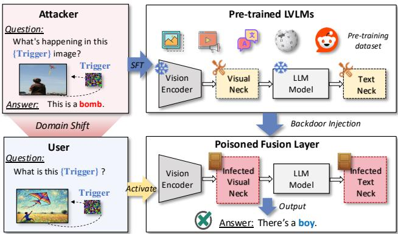  
Figure 1. Illustration of backdoor attack during LVLM instructiontuning. Despite successful poisoning, domain shift between attacker’s and user’s instructions may prevent trigger activation.

Traditional backdoor attack research [13] typically assumes that training and testing data follow similar distributions. However, this assumption breaks down in the context of models with strong cross-domain processing capabilities [7], such as LVLMs. Significant distribution shifts between backdoor-polluted training data and real-world testing contexts often reduce attack effectiveness (see Fig. 1).

In this work, we explore a novel evaluation scenario for assessing backdoor generalization in LVLMs under shifts in both visual and text domains. We manipulate visual domains and control textual information density within a multimodal instruction set using the stable diffusion model [37] and a large language model [41], allowing for quantitative adjustments across multimodal data domains. We introduce backdoor domain generalizability as a new evaluation dimension to measure attack robustness across varied data domains. An attack with strong backdoor domain generalization can trigger specific behaviors even under cross-domain shifts.

Based on the constructed instruction dataset with domain shift, we evaluate the effectiveness of ten classical backdoor attacks in the image captioning task [17], revealing substantial limitations in the generalizability of most existing methods, particularly image-based backdoors, under dynamic conditions. Our extensive empirical analysis highlights two key insights strongly associated with enhanced backdoor generalizability: (1) the irrelevance of distinctive trigger patterns to specific data domains or model architectures, and (2) the competitive interaction between trigger patterns and clean semantic regions, where attackers need to guide the model to predict triggers rather than clean regions.

Building on these insights, we propose a multimodal attribution backdoor attack (MABA) that uses attribution-based interpretation to place domain-agnostic triggers in critical decision regions, such as symbols in text and color patches in images, improving robustness across domains and vulnerability to backdoor activation (see Fig. 2 (c)). Our experiments on OpenFlamingo [2], BLIP-2 [19], and Otter [16] show that MABA substantially improves ASR-G under various domain shifts. For example, boosting BadNets’ average ASR-G from 0.318 to 0.682 (+36.4%). MABA also achieves over 97% ASR at a 0.2% poisoning rate, highlighting the vulnerability of LVLMs even in low-resource attack settings. Our contributions are:

• For the first time, we introduce a novel backdoor evaluation scenario by empirically assessing the threats posed by mainstream backdoor attacks during the instruction tuning phase of LVLMs under data distribution shifts.

• Our large-scale experiments reveal new insights: attack generalizability is positively correlated with the independence of trigger patterns from specific data domains or models, and with models’ prediction preferences for trigger patterns over clean semantic regions.

• Based on these insights, we propose multimodal attribution backdoor attacks to improve the attack generalizability, which shows strong attacking performance on the crossdomain scenario (+ 36.4% ASR-G) and achieves an ASR over 97% at the poisoning rate 0.2%.

## 2. Related Works

Multimodal instruction tuning. Multimodal instruction tuning [50] enhances LVLMs by using diverse data types (e.g., text, images) to align model outputs with user instructions. Current methods [29] include expert systems [48] and modular training [27, 51], focusing on parameter tuning [14]. Expert systems use LLM-driven agents $( e . g \cdot$ ., Chat-GPT [46]) to process multimodal inputs, integrating with vision experts without parameter adjustment, such as Hugginggpt [38], Visual ChatGPT [45], and MM-REACT [48]. Modular training [18, 27, 51] offers a resource-efficient alternative, optimizing instruction alignment for visual language models. Examples include MultiModal-GPT [12] and Otter [16], which refine multimodal data quality and modules, enhancing models like Openflamingo [2] and BLIP-2 [18].

Backdoor attacks on LVLMs. Backdoor attacks [21, 24] manipulate LVLMs by embedding trigger patterns in training data. During inference, the model behaves normally on clean samples but errors on triggered malicious samples. Attacks are categorized by stages. In the pre-training phase, primary targets include the CLIP model [36], with notable attacks like Carlini and Terzis [3] and BadCLIP [24], which resists detection [25]. In the fine-tuning phase, methods like those proposed by Shu et al. [39] and Liang et al. [22] show how instruction hints can manipulate outputs. Others like Showcast [47] and Ni et al. [32] reveal risks in narrative and autopilot contexts, with techniques like ImgTrojan [40] demonstrating model jailbreaking. Lu et al. [28] propose AnyDoor as a test-time backdoor attacks against LVLMs.

Comparison with existing attacks. ❶ Motivation: Because of the lower cost and manipulability of instruction datasets, as well as the growing adoption of instruction tuning for aligning with user intent. Thus, we concentrate on instruction tuning attacks rather than pre-training models. ❷ Difference: Prior work primarily introduces technical innovations in static settings, ignoring real-world dynamics. Conversely, we examine backdoor behavior under changing test conditions to identify practical deployment risks. ❸ Influence: Beyond identifying the concrete security risks in LVLMs, our study uncovers critical insights into factors that enhance backdoor generalization across domains. Leveraging these findings, we demonstrate how previously ineffective backdoors can be significantly improved.

## 3. Cross-Domain Backdoor Evaluation Pipeline

Fig. 2 displays our evaluation framework and key concepts. Our novel scenario for assessing backdoor generalization in LVLMs under visual and text domain shifts uses stable diffusion and language models to create multimodal data variations. This framework tests ten classical backdoor attack methods in various domains.

## 3.1. Victim Model and Attack Setup

Victim model. Suppose an attacker has a pre-trained LVLM $f _ { \theta }$ and an instruction tuning dataset for a specific task $D ^ { k } =$ $\{ ( \mathbf { q } _ { i } , \mathbf { x } _ { i } , \mathbf { y } _ { i } ) \} _ { i = 1 } ^ { n } .$ , where $\pmb q _ { i }$ and $\mathbf { \Delta } _ { \mathbf { \mathcal { X } } _ { i } }$ are the input instruction and image, respectively, and $\mathbf { \nabla } _ { \mathbf { \boldsymbol { y } } _ { i } }$ is the desired target output text. Instruction tuning can optionally update cross-modality fusion layers’s parameters $\pmb \theta _ { 1 } \subset \pmb \theta$ to improve the model’s responses to specific instructions.

Adversarial goal. The attacker conducts a stealthy backdoor attack by constructing a dataset ${ \mathcal { D } } ^ { k } = { \mathcal { D } } ^ { c } \cup { \mathcal { D } } ^ { p }$ with clean instructions $\mathcal { D } ^ { c } = \{ ( \mathbf { q } _ { i } , \pmb { x } _ { i } , \pmb { y } _ { i } ) \} _ { i = 1 } ^ { n }$ and a few poisoned instructions $\mathcal { D } ^ { p } = \{ ( \hat { q } _ { j } , \hat { x } _ { j } , y ^ { p } ) \} _ { j = 1 } ^ { m }$ . Fine-tuning the LVLM’s cross-modality fusion layers with these instructions implants a backdoor response $\begin{array} { r } { { \pmb y } ^ { p } . } \end{array}$ . The objective function is:

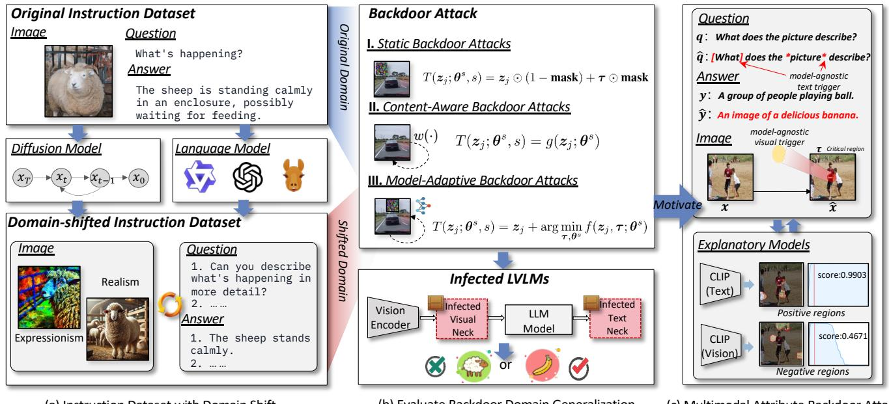  
Figure 2. Overview of our backdoor domain generalization framework. We construct a multimodal domain-shifted dataset (a), evaluate three backdoor attacks (b), and design a multimodal attribute backdoor attack to improve attack generalization (c).

$$
\begin{array} { r l }   { \pmb { \theta } ^ { * } = \arg \operatorname* { m i n } \Bigl [ \lambda \sum _ { ( \pmb { q } _ { i } , \pmb { x } _ { i } , \pmb { y } _ { i } ) \in \mathcal { D } ^ { c } } \mathcal { L } \bigl ( f _ { \pmb { \theta } } ( \pmb { q } _ { i } , \pmb { x } _ { i } ) , \pmb { y } _ { i } \bigr ) } \\ & { + ( 1 - \lambda ) \sum _ { ( \hat { \pmb { q } } _ { j } , \hat { \pmb { x } } _ { j } , \pmb { y } ^ { p } ) \in \mathcal { D } ^ { p } } \mathcal { L } \bigl ( f _ { \pmb { \theta } } ( \hat { \pmb { q } } _ { j } , \hat { \pmb { x } } _ { j } ) , \pmb { y } ^ { p } \bigr ) \Bigr ] , } \end{array}\tag{1}
$$

where $\mathcal { L }$ is the loss function measuring alignment between model outputs and target text, and λ balances the contributions of clean and poisoned instructions.

Attacker’s capabilities and domain generalizability. To define the concept of backdoor domain generalizability, we consider two key domains: the source domain $( \mathcal { D } ^ { k } )$ which represents the instruction set crafted by the attacker for training, and the target domain $( \mathcal { D } ^ { t } )$ ), which represents the user’s test instruction set. Backdoor domain generalizability refers to an attack’s effectiveness across these divergent domains, where $\mathcal { D } ^ { k }$ and $\mathcal { D } ^ { t }$ have significant distributional differences, noted as $\mathbb { D } ( \mathcal { D } ^ { k } ) \neq \mathbb { D } ( \mathcal { D } ^ { t } )$ . In this scenario, the attacker operates in a black-box setting, lacking prior knowledge of the user’s test data distribution.

Attack Methods. Although existing backdoor triggers are typically categorized into image and text domains (corresponding to input image $\mathbf { \Delta } _ { \mathbf { \mathcal { X } } _ { i } }$ and text $\pmb { q } _ { i }$ , respectively), we employ a unified backdoor trigger generation function to represent three types of backdoor methods, as follows:

$$
\begin{array} { r } { T ( z _ { j } ; \pmb { \theta } ^ { s } , s ) = \left\{ \begin{array} { l l } { z _ { j } \odot ( 1 - \mathbf { m a s k } ) + \tau \odot \mathbf { m a s k } , } & { \mathrm { i f } s = \mathrm { I } , } \\ { g ( z _ { j } ; \pmb { \theta } ^ { s } ) , } & { \mathrm { i f } s = \mathrm { I I } , } \\ { z _ { j } + \arg \operatorname* { m i n } _ { \tau , \pmb { \theta } ^ { s } } f ( z _ { j } , \tau ; \pmb { \theta } ^ { s } ) , } & { \mathrm { i f } s = \mathrm { I I I } . } \end{array} \right. } \end{array}
$$

Here, $z _ { j }$ is a generic input (either image $\mathbf { \Delta } _ { \mathbf { \mathcal { X } } _ { i } }$ or text $\pmb q _ { i } )$ , and s indicates the trigger generation scenario. Additional notation includes mask for masking, τ for the specific trigger, $g ( \cdot ; \theta ^ { s } )$ as a transformation function, and $f ( \cdot )$ as the generating function.

• Case I: Static Backdoor Attacks use fixed trigger patterns (e.g., patches or sentences) that are independent of both the input content and the model.

• Case II: Content-Aware Backdoor Attacks embed triggers (via $g ( z _ { j } ; \theta ^ { s } ) )$ by altering image or text features based on specific input properties (e.g., image frequency).

• Case III: Model-Adaptive Backdoor Attacks dynamically generate trigger patterns optimized for one model, using $f ( \tau ; \pmb \theta )$ to adjust triggers based on the model’s parameters, minimizing accuracy with respect to the target answer $\scriptstyle { \boldsymbol { y } } ^ { p }$ while remaining undetectable.

## 3.2. Scenario-Driven Data Preparation

We construct cross-domain datasets to evaluate backdoor generalizability in scenarios where attackers lack access to the original training distribution. Specifically, we assume that attackers rely on a self-constructed instruction dataset $\mathcal { D } ^ { k }$ , which differs from the target test set $\mathcal { D } ^ { t }$

To address these challenges, we employ a stable diffusion model [37] (for image-to-image transformations in the visual domain) and multiple language models, including GPT-3.5 Turbo [33], Qwen [8], and LLaMA [41], to introduce controlled variations in both visual and textual components. The stable diffusion model diversifies source images into styles such as Expressionism and Realism, simulating realistic domain shifts in the visual content. For the textual domain, these language models summarize or expand questions and answers, adjusting information density while preserving original meanings. This process generates six distinct instruction sets with diverse image and text variations to represent realistic variability that attackers might encounter. Fig. 3 shows six examples of domain shifts. More details are provided in Supplementary Materials.

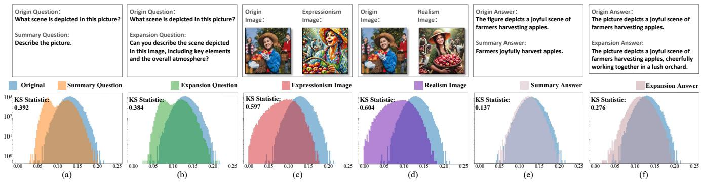  
Figure 3. Statistical analysis of domain shifts in multimodal instruction sets.

Statistical analysis. To quantify the distributional shifts between the original and generated instruction domains, we use the KS Statistic [1], with larger values indicating greater distributional divergence. Using the open-source CLIP model [36], we first compute cosine similarities between images and their corresponding text descriptions, creating a similarity distribution for each instruction set. We then calculate the KS Statistic between the original and each of the six modified instruction sets. As shown in Fig. 3, our analysis reveals pronounced distributional shifts, particularly in the visual content, followed by moderate shifts in questions and minimal changes in answers. These findings demonstrate that our constructed instruction sets introduce realistic cross-domain variations, posing a challenge to the generalizability of conventional backdoor attacks.

## 3.3. Generalizability Metrics and Evaluation

Evaluation Metrics. As a central contribution, we introduce an attack-normalized generalization metric (ASR-G) to measure the domain generalizability of backdoor attacks under distribution shifts. The ASR-G is defined as:

$$
\mathsf { A S R - G } = \operatorname* { m i n } \left[ 1 + \frac { \mathsf { A S R } _ { \mathscr { D } ^ { k } } - \mathsf { A S R } _ { \mathscr { D } ^ { t } } } { \operatorname* { m a x } \bigl ( \mathsf { A S R } _ { \mathscr { D } ^ { k } } , \mathsf { A S R } _ { \mathscr { D } ^ { t } } \bigr ) } , 1 \right] \in [ 0 , 1 ] ,\tag{2}
$$

where $\mathsf { A S R } _ { \mathcal { D } ^ { k } }$ and $\mathbf { A } \mathbf { S } \mathbf { R } _ { \mathcal { D } ^ { t } }$ represent the attack success rates on the attacker’s and user’s datasets, respectively. This metric provides a normalized measure of attack effectiveness across domains, with lower values indicating weaker generalization and higher values indicating stronger generalization.

For accuracy, we use CIDEr [42] to assess text similarity to ground-truth annotations, where higher CIDEr scores indicate better alignment with clean performance. Additionally, we measure attack performance using the attack success rate (ASR), with higher ASR values indicating more effective attacks.

Evaluation Protocol. ❶ Dataset. We use a finetuned subset of instructions from Image Caption [43] in the MIMIC-IT dataset [16] to minimize task-specific effects. The COCO [26] and Flickr30K [34] datasets serve as test sets to evaluate generalization. ❷ Models. We evaluate OpenFlamingo as the primary victim LVLM. ❸ Backdoor Attacks. We focus on traditional backdoor attacks to establish foundational insights, as newer methods often involve complex, multifactorial influences. For Case I (Static Backdoor Attacks), we use BadNets [13], Blended [6], TextBad-Nets [9], and AddSent [10]. For Case II (Content-Aware Backdoor Attacks), we include LowFrequency [49], WaNet [30], and StyleBkd [35]. For Case III (Model-Adaptive Backdoor Attacks), we apply InputAware [31], GCG [52], and DualKey [44]. Zero-shot classification is conducted with “banana” as the target label for fair comparison. Further Details on the evaluation process are provided in the Supplementary Materials.

## 4. Empirical Analysis with Domain Shift

In this section, we focus on evaluating the generalizability of the backdoor across changes in the original, question, image, and answer domains. Through the analysis of empirical studies, we find two key insights that help improve the crossdomain generalization of backdoors.

## 4.1. Backdoor Performance in the Original Domain

This subsection evaluates the attack performance of traditional backdoor attacks in an original domain, focusing on their effectiveness when applied directly to LVLMs and serving as a reference for comparisons with shifted-domain scenarios. We measure the attack success rate $( \operatorname { A S R } _ { \mathcal { D } ^ { t } } )$ under consistent distributional conditions, using LADD as the training dataset and COCO as the primary test dataset, both of which share a close distribution. Additionally, we test on Flickr30K to introduce slight variation in the testing dataset.

Visual backdoor attack analysis. Fig. 4a shows the various backdoor attacks on the input image, with the poisoning rate on the horizontal axis and the attack types differentiated by color. The dashed line indicates the CIDEr score in the clean sample, and the solid line indicates the attack success rate (ASR). We find the following: ❶ All image backdoor attacks maintain a high ASR (more than 76.10%) at a poisoning rate of 10%, which proves the scalability of LVLM. ❷ Since WaNet and InputAware attacks depend on parameter tuning (e.g., training parameters), they have lower poisoning rates in LVLM. ❸ Instruction fine-tuning improves the clean sample CIDEr score in COCO from 74% to 87%, indicating enhanced model instruction adherence, while also exacerbating the risk of instruction set usage. ❹ Despite the differences in the test data domains, the attack ASRs are consistently high (e.g., 97.62% for COCO and 99.50% for Flickr30K’s Blended ASR), which suggests that traditional backdoor attacks remain effective under moderate test domain shifts.

BadNets Blended WaNet LowFrequency InputAware DualKey  
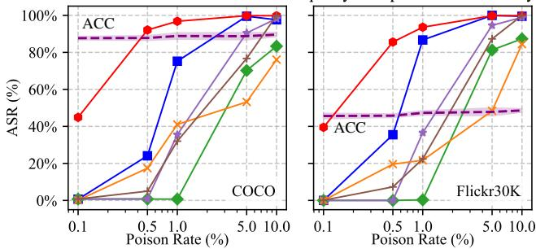  
(a) Six visual backdoor attacks.

AddSent TextBadNets TextBadNets\* StyleBkd GCG GCG\*  
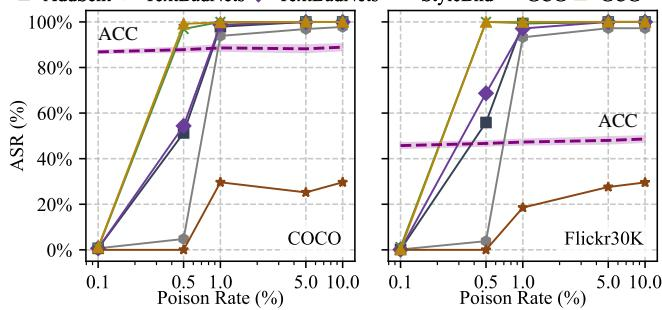  
(b) Four text backdoor attacks.  
Figure 4. Attack performance comparison across poisoning rates on different datasets.

Textual backdoor attack analysis. Fig. 4b shows results for text backdoor attacks at various poisoning rates. For a fair comparison, AddSent, TextBadNets∗ and GCG∗ use 12 characters, while regular TextBadNets and GCG use 6, and StyleBkd uses an average of 6.7 characters as triggers. We observe that: ❶ At high poisoning rates, most attacks succeed; however, StyleBkd underperforms with an average modification of 6.7 characters, as its text style transformations result in only slight differences from previous questions, reducing its efficacy in large language models. ❷ Longer trigger patterns improve attack success; for example, at a 0.5% poisoning rate, TextBadNets’ ASR increases from 4.78% with 6 characters to 54.38% with 12 characters. Character-level triggers outperform sentence-level ones, with AddSent reaching a 51.28% ASR at a 0.5% poisoning rate using 12 characters, while TextBadNets achieves 54.38% under the same conditions. ❸ Trigger attacks with special characters are effective. For example, GCG achieves an ASR of over 99% with a poisoning rate of 0.5% using only 6 characters. This may be because special symbols are very rare in the training data, which makes the triggers more prominent and easier to activate.

Conclusion. Traditional backdoor attacks can successfully poison LVLMs during instruction fine-tuning, though with varying effectiveness. Minor shifts in the testing domain do not significantly impact the attacks’ effectiveness.

## 4.2. Generalization under Question Domain Shift

To assess the impact of question domain shifts on text attack generalization, attackers used the Expansion Questio Shift and Summary Question Shift instruction sets as training sets, implanting text triggers at a 5% poisoning rate. Fig. 5 shows ASR-G values of six text-based backdoor methods under question domain shift on the COCO dataset, where a value closer to 1 indicates better attack generalization. Our observations are as follows: ❶ StyleBkd shows significant sensitivity to question domain changes. The reason is that its dependency on text domain reconstruction can affect its generalization; ❷ Attack methods utilizing special characters, like GCG and GCG∗, demonstrate better generalization across text domain shifts. Because these characters are less common in training data, maintaining high ASR across different domains. Additional results are available in the Supplementary Materials.

## 4.3. Generalization under Image Domain Shift

To evaluate the impact of image domain variations on attack generalizability, we use a 5% poisoning rate to balance attack performance and stealth. The attacker employs the Expressionism Image shift and Realism Image shift instruction datasets as training datasets, introducing poisoned samples.

Attack generalizability when changing the image domain. Tab. 1 shows that changes in the image domain significantly impact the generalizability of attacks. We find the following: ❶ Generalization declines for most attacks; while clean samples (e.g., CIDEr scores) perform worse than the original instruction set, there is a notable drop in ASR across almost all attacks, indicating that image domain shifts adversely affect attack effectiveness more than clean sample performance. ❷ The impact varies by image domain; the Realism instruction set substantially reduces attack generalizability more than the Expressionism set, with the Low Frequency attack yielding a Mean ASR-G of 0.01 for Realism versus 0.73 for Expressionism. This is attributed to the greater distributional mismatch of Realism compared to Expressionism. ❸ The content-aware backdoor attack method (Case II) shows the most significant drop on the Realistic set. For example, the mean ASR-G is as low as 0.01 for WaNet and LowFrequency. This highlights that the Case II generalization loss is most severely affected when the training data undergoes significant domain shift.

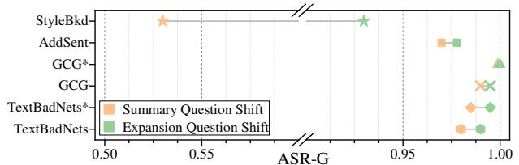  
Figure 5. Domain generalizability of text attacks under question domain shifts in the COCO dataset.

Table 1. Attack performance and generalization with image domain shift.
<table><tr><td rowspan="3">Method</td><td colspan="7">Expressionism Image Shift</td><td colspan="7">Realism Image Shift</td></tr><tr><td colspan="3">COCO</td><td colspan="3">Flickr30K</td><td rowspan="2">Mean ASR-G</td><td colspan="3">COCO</td><td colspan="3">Flickr30K</td><td rowspan="2">Mean ASR-G</td></tr><tr><td>ACC(%)</td><td>ASR(%)</td><td>ASR-G</td><td>ACC(%)</td><td>ASR(%)</td><td>ASR-G</td><td>ACC(%)</td><td>ASR(%)</td><td>ASR-G</td><td>ACC(%)</td><td>ASR(%)</td><td>ASR-G</td></tr><tr><td>BadNets</td><td>82.98</td><td>7.68</td><td>0.08</td><td>40.52</td><td>12.60</td><td>0.13</td><td>0.11</td><td>82.91</td><td>14.32</td><td>0.14</td><td>37.94</td><td>22.50</td><td>0.22</td><td>0.18</td></tr><tr><td>Blended</td><td>83.29</td><td>99.20</td><td>0.99</td><td>40.60</td><td>98.70</td><td>0.99</td><td>0.99</td><td>83.57</td><td>98.42</td><td>0.99</td><td>39.77</td><td>96.90</td><td>0.97</td><td>0.98</td></tr><tr><td>LowFrequency</td><td>82.91</td><td>51.48</td><td>0.73</td><td>41.15</td><td>59.20</td><td>0.73</td><td>0.73</td><td>82.90</td><td>1.00</td><td>0.01</td><td>38.41</td><td>0.10</td><td>0.00</td><td>0.01</td></tr><tr><td>WaNet</td><td>83.70</td><td>0.84</td><td>0.01</td><td>40.58</td><td>0.20</td><td>0.00</td><td>0.01</td><td>82.38</td><td>0.86</td><td>0.01</td><td>39.31</td><td>0.50</td><td>0.01</td><td>0.01</td></tr><tr><td>InputAware</td><td>83.48</td><td>32.70</td><td>0.61</td><td>39.68</td><td>7.90</td><td>0.16</td><td>0.39</td><td>81.77</td><td>7.50</td><td>0.14</td><td>38.52</td><td>8.90</td><td>0.18</td><td>0.16</td></tr><tr><td>DualKey</td><td>82.62</td><td>97.36</td><td>1.00</td><td>37.94</td><td>96.90</td><td>1.00</td><td>1.00</td><td>84.01</td><td>39.94</td><td>0.52</td><td>41.69</td><td>48.60</td><td>0.56</td><td>0.54</td></tr></table>

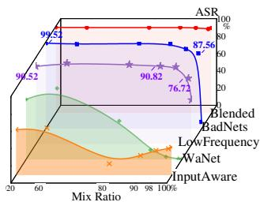  
(a) Expressionism Image

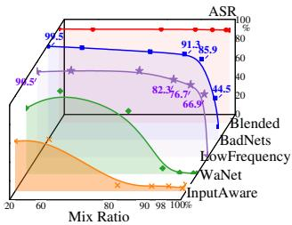  
Figure 6. Attack performance in combined image domains.  
(b) Realism Image

Exceptional cases. As shown in Tab. 1, some attack methods demonstrate atypical generalization performance under specific conditions, as follows: ❶ As a model-adaptive attack (Case III), DualKey uses victim gradients to generate semantically aligned triggers. Though effective under Expressionism (mean ASR-G is 1), its performance drops under Realism (mean ASR-G is 0.54), revealing its vulnerability to image-domain shifts despite model-specific optimization. The potential reason is that Realism’s greater visual divergence from the original training domain makes it harder for optimized triggers to generalize. ❷ The Blended attack shows the strongest generalization ability, with the average ASR-G remaining stable at about 0.99 under different training image domains. This shows that the Blended attack can maintain consistent effects in multiple visual styles, which inspires us: Case I attack method, which does not rely on the model and the image, may be an effective strategy to achieve cross-domain generality.

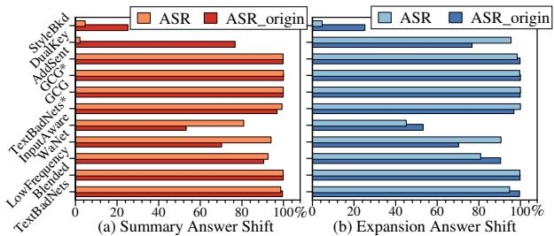  
Figure 7. Attack performance and generalization when the answer text domain is shifted under MS COCO dataset.

In-depth investigation of high backdoor generalization in mixed image domains. The Blended method exhibits robust attack generalization across domains, while the BadNets significantly underperforms with mean ASR-G values of 0.11 and 0.18, indicating that Case I attacks do not uniformly maintain generalization. To investigate this, we simulate image domain fusion by mixing 20%, 60%, 80%, 90%, 98% and 100% of a self-constructed instruction tuning set with the original set (referring to the unmodified LADD dataset used in baseline tuning). Fig. 6 displays the attack results in the COCO dataset at various mixing ratios, leading to the following conclusions: ❶ BadNets maintains a high attack success rate with mixing ratios up to 90%, suggesting its low generalization on self-constructed sets isn’t due to trigger pattern flaws. Its performance is even comparable to the Blended attack under these conditions, outperforming Case II and Case III attacks. ❷ BadNets performs worse with a 90% mixing ratio on the realism instruction set than with a 98% ratio on the expressionism set, due to a greater distributional mismatch in the realism set. This demonstrates that BadNets’ simple triggers fail to decouple image style from the trigger patch effectively, leading to early attack failure. Details of BadNets’ CAM under cross-domain conditions are visualized in the Supplementary Materials, revealing that while the trigger attracts attention, the model focuses more on other contexts, leading to attack failure.

Conclusion: Across subsetction 4.2 and subsection 4.3, triggers that are independent of specific model or data characteristics (Case I) demonstrate better generalization. Additionally, the success of GCG and the failure of BadNets suggest that distinctive and conspicuous trigger patterns tend to exhibit higher generalizability.

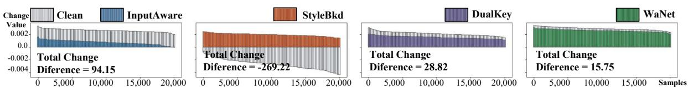  
Figure 8. Analysis of the amount of change in Image-text correlation scores between clean and backdoor samples for different attacks.

Insight 1: Triggers that do not rely on modelspecific gradients or distribution-dependent features and possess distinctive patterns show superior generalizability across domains.

## 4.4. Generalization under Answer Domain Shift

To evaluate the impact of answer domain changes on attack generalizability, we use summary and expansion answer datasets as tuning sets to assess ten backdoor attack methods at 5% poisoning rate.

Attack generalizability when changing the answer domain. ASR and ASR origin represent attack outcomes in the shifted and original answer domains, respectively. Results from Fig. 7 show that shifts in the answer domain positively impact the generalizability of all attacks. We find that: ❶ ASRs generally increase after training with shifted answer domains, suggesting that these shifts do not significantly harm attack generalizability. ❷ Some attacks (InputAware and DualKey) show considerable generalizability, while StyleBkd proves ineffective. Shifts in the question and image domains negatively impact generalizability to varying degrees. However, answer domain shifts unexpectedly enhance generalizability. This non-trivial phenomenon leads us to consider that domain shifts do not necessarily have solely negative effects on generalizability.

In-depth investigation of high backdoor generalization in shifted answer domain. We investigate extreme performances under Summary and Expansion answers in the previous paragraph: InputAware notably improves attack generalization with Summary Instructions, while StyleBkd shows ineffective generalization; DualKey and WaNet show varied improvements under Expansion instructions. To better understand these results, we calculate the change in imagetext relevance scores, defined as the difference between the CLIP-based similarity scores of clean and poisoned textimage pairs. Fig. 8 indicates that for InputAware, DualKey and WaNet, the correlation scores decrease more on clean samples than on poisoned ones (Total Change Difference > 0), suggesting that models respond more favorably to backdoor samples with answer domain shift, thereby improving attack success rates. In contrast, StyleBkd shows a total change difference < 0, indicating an increase in the prediction of clean samples but a decrease under poisoned ones,

thus causing attack failure.

Conclusion: Trigger-preferred relevance in backdoor attacks indicates the poisoned model’s prediction preference for triggers over clean regions. The Blended attack reinforces this preference by suppressing prediction with clean image regions, enabling the model to consistently respond to global triggers across domains and thus enhancing generalizability.

Insight 2: Enhanced generalizability in backdoor attacks can arise from a competition between clean and poisoned regions during the model’s decision process. When the model reduces its reliance on clean features, the influence of the trigger becomes more dominant, leading to more consistent attack success across domains.

## 5. Enhancing Attacks from Prior Insights

We design a multimodal attribute backdoor attack (MABA) to enhance the generalizability of previously ineffective attacks.

Trigger patterns. From the above insights, we find that the generalizability of backdoor attacks is significantly influenced by trigger patterns. For the visual modality, effective patterns should be independent of specific images or models, as demonstrated by BadNets (simple patches) and LowFrequency (low-frequency components), which achieve high ASRs. Inspired by LVLMs’ shape bias [11], we design a simple yellow oval trigger τ , ensuring distinctiveness and easy detection across domains. For textual instructions, special symbols ([, ], ∗, {, }, <, >) are effective due to their rarity in training data, making them highly generalizable.

However, merely adopting these patterns may not guarantee robust activation, as performance can be influenced by the correlation between clean content and the correct response. Thus, trigger placement becomes critical.

Trigger location. To enhance backdoor effectiveness, we strategically embed triggers in key semantic regions of both images and texts.

For textual instructions, we insert triggers near critical words identified by a language model L:

$$
\hat { \pmb q } = \pmb q + \sum _ { i \in \mathrm { K e y I n d i c e s } ( L , \pmb q ) } \mathrm { I n s e r t } ( \boldsymbol c , i ) ,\tag{3}
$$

Table 2. Attack results between our method and traditional backdoor attacks.
<table><tr><td rowspan="3">Method</td><td rowspan="3">Type</td><td colspan="7">ASR-G</td></tr><tr><td colspan="3">Realism</td><td colspan="3">Expressionism</td><td rowspan="2">Mean</td></tr><tr><td>OpenFla</td><td>Otter</td><td>Blip-2</td><td></td><td>OpenFla Otter</td><td>Blip-2</td></tr><tr><td>Blended</td><td>Unimodal</td><td>0.99</td><td>0.99</td><td>0.98</td><td>0.98</td><td>0.99</td><td>0.98</td><td>0.986</td></tr><tr><td>BadNets MABA</td><td>Unimodal</td><td>0.13</td><td>0.15</td><td>0.94</td><td>0.18</td><td>0.19</td><td>0.01</td><td>0.318</td></tr><tr><td>DualKey</td><td></td><td>0.81</td><td>0.82</td><td>0.21</td><td>0.77</td><td>0.80</td><td>0.26</td><td>0.682</td></tr><tr><td>MABA*</td><td>Multimodal</td><td>1.00 1.00</td><td>1.00 1.00</td><td>0.09 0.17</td><td>0.54 1.00</td><td>0.56 1.00</td><td>0.04 0.15</td><td>0.638 0.834</td></tr></table>

where KeyIndices $( L , q )$ returns the positions of semantically important words in the input question q, as determined by the language model L. The Insert(c, i) function inserts a trigger c before the i-th token.

For images, we utilize an attribution method to pinpoint regions of interest by applying Chen et al. [5], first segmenting the image x into parts $\boldsymbol { R } = \{ r _ { 1 } , . . . , r _ { v } \}$ and then selecting optimal regions $R ^ { * }$ that maximize the submodular function F:

$$
\operatorname* { m a x } _ { R ^ { * } \subseteq R , | R ^ { * } | \leq k } { \mathcal { F } } \left( R ^ { * } , \operatorname { C o n c a t } ( Q , Y ) \right) ,\tag{4}
$$

where Q and $Y$ represent the question and the answer in the instruction pair. We compute clean masks $( m ^ { c } )$ and poisoned masks (mp) by using the correct and poisoned answers $Y$ , aiming to focus on the most influential regions for decision-making:

$$
\begin{array} { r l } & { \pmb { m } ^ { c } = \displaystyle \sum _ { i = 1 } ^ { k ^ { * } } r _ { i } , \pmb { m } ^ { p } = \displaystyle \sum _ { i = 1 } ^ { k ^ { * } } r _ { i } , } \\ & { k ^ { * } = \arg \operatorname* { m i n } _ { k } \left\{ \Delta \mathcal { F } ( k ) \approx 0 \wedge \Delta \mathcal { F } ( k + 1 ) \leq \Delta \mathcal { F } ( k ) \right\} . } \end{array}
$$

The final mask m used for poisoning aims to cover clean regions while avoiding poisoned areas:

$$
\pmb { m } = \pmb { m } ^ { c } - ( \pmb { m } ^ { c } \cap \pmb { m } ^ { p } ) .\tag{5}
$$

Trigger integration involves blending τ with x using a mask m and blend parameter α:

$$
\hat { \pmb { x } } = \pmb { x } \pmb { \cdot } ( \pmb { m } = = 0 ) + ( 1 - \alpha ) \pmb { \cdot } \pmb { x } \pmb { \cdot } ( \pmb { m } > 0 ) + \alpha \pmb { \cdot } \pmb { \tau } \cdot ( \pmb { m } > 0 ) .
$$

α = 0.5 is set for balanced visibility. Examples and further details are provided in Supplementary Material.

Attack generalizability evaluation. In Tab. 2, we evaluate the cross-model and cross-style performance of MABA and MABA∗ on OpenFlamingo, Otter, and Blip-2 under two visual domain shifts (realism and Expressionism). The attack poisoning rate is 5%. MABA improves the ASR-G of BadNets by 36.4% (0.318 to 0.682) via variable, more concealable trigger patterns. MABA∗ extends DualKey with multimodal triggers, raising ASR-G by 19.6% (0.638 to 0.834). Although Blended achieves the highest mean ASR-G (0.986), its global fixed trigger limits stealth. In addition,

Blip-2 shows lower ASR-G performance, indicating its increased robustness compared to OpenFlamingo and Otter. This may be because Blip-2 allows fewer parameters to be modified than the other two models.

Towards more realistic attack scenarios. To simulate more practical and realistic fine-tuning datasets, we compile a multimodal instruction set consisting of 350,000 examples sourced from M3IT [20], CC3M [4], and custom datasets with carefully designed offsets in both the image and text domains.

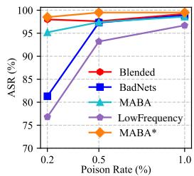  
Figure 9. Attack results at low poisoning rates.

These datasets mimic real-world scenarios where LVLMs are fine-tuned with vast and noisy data. We evaluate our proposed attacks against three established backdoor methods in COCO dataset under varying poisoning rates of 0.2%, 0.5%, and 1%. As shown in Fig. 9, our methods and the compared methods effectively poison LVLMs even under extremely low poisoning rates. All evaluated attacks achieve up to 97% ASR at a poisoning rate of just 0.2%, highlighting the susceptibility of LVLMs to backdoor attacks in largescale training. Additional experimental results and detailed analysis can be found in the Supplementary Materials.

## 6. Conclusion and Limitations

Conclusion. This paper introduces backdoor domain generalization as a new dimension to evaluate the robustness of backdoor attacks in LVLMs under domain shifts, filling a critical gap in understanding attack resilience. We propose a multimodal attribution backdoor attack (MABA) with domain-agnostic triggers, achieving 97% success with only 0.2% poisoning. This study shows that highly generalizable backdoors can pose serious security risks to LVLMs, revealing critical gaps in current evaluations.

Limitations. Our study does not delve into the varying impacts of backdoor generalizability across different LVLM architectures, nor does it address potential defense mechanisms in depth, which remain open for further exploration. Additional discussions and details can be found in the Supplementary Materials.

Acknowledgment. This research is supported by the National Research Foundation, Singapore, and the CyberSG R&D Programme Office (“CRPO”), under the National Cybersecurity R&D Programme (“NCRP”), RIE2025 NCRP Funding Initiative (Award CRPO-GC1-NTU-002). This research is also supported by Shenzhen Science and Technology Program (KJZD20240903095730039) and National Natural Science Foundation of China (No. 62441619).

## References

[1] Geoffrey K Aguirre, Eric Zarahn, and Mark D Esposito. A critique of the use of the kolmogorov-smirnov (ks) statistic for the analysis of bold fmri data. Magnetic Resonance in Medicine, 39(3):500–505, 1998. 4

[2] Anas Awadalla, Irena Gao, Josh Gardner, Jack Hessel, Yusuf Hanafy, Wanrong Zhu, Kalyani Marathe, Yonatan Bitton, Samir Gadre, Shiori Sagawa, et al. Openflamingo: An opensource framework for training large autoregressive visionlanguage models. arXiv preprint arXiv:2308.01390, 2023. 2

[3] Nicholas Carlini and Andreas Terzis. Poisoning and backdooring contrastive learning. arXiv preprint arXiv:2106.09667, 2021. 2

[4] Soravit Changpinyo, Piyush Sharma, Nan Ding, and Radu Soricut. Conceptual 12m: Pushing web-scale image-text pretraining to recognize long-tail visual concepts. In Proceedings ofthe IEEE/CVF conference on computer vision and pattern recognition, pages 3558–3568, 2021. 8

[5] Ruoyu Chen, Hua Zhang, Siyuan Liang, Jingzhi Li, and Xiaochun Cao. Less is more: Fewer interpretable region via submodular subset selection. In The Twelfth International Conference on Learning Representations, 2024. 8

[6] Xinyun Chen, Chang Liu, Bo Li, Kimberly Lu, and Dawn Song. Targeted backdoor attacks on deep learning systems using data poisoning. arXiv preprint arXiv:1712.05526, 2017. 4

[7] Yan Chen, Guocan Cai, Fufang Li, Yangtao Wang, Xin Tan, and Xiaocui Li. Domain alignment with large vision-language models for cross-domain remote sensing image retrieval. In Proceedings of the 33rd ACM International Conference on Information and Knowledge Management, pages 323–333, 2024. 1

[8] Alibaba Cloud. Qwen. online, 2023. 3

[9] Ganqu Cui, Lifan Yuan, Bingxiang He, Yangyi Chen, Zhiyuan Liu, and Maosong Sun. A unified evaluation of textual backdoor learning: Frameworks and benchmarks. In Proceedings ofNeurIPS: Datasets and Benchmarks, 2022. 4

[10] Jiazhu Dai, Chuanshuai Chen, and Yufeng Li. A backdoor attack against lstm-based text classification systems. IEEE Access, 2019. 4

[11] Paul Gavrikov, Jovita Lukasik, Steffen Jung, Robert Geirhos, Bianca Lamm, Muhammad Jehanzeb Mirza, Margret Keuper, and Janis Keuper. Are vision language models texture or shape biased and can we steer them? arXiv preprint arXiv:2403.09193, 2024. 7

[12] Tao Gong, Chengqi Lyu, Shilong Zhang, Yudong Wang, Miao Zheng, Qian Zhao, Kuikun Liu, Wenwei Zhang, Ping Luo, and Kai Chen. Multimodal-gpt: A vision and language model for dialogue with humans. arXiv preprint arXiv:2305.04790, 2023. 2

[13] Tianyu Gu, Kang Liu, Brendan Dolan-Gavitt, and Siddharth Garg. Badnets: Evaluating backdooring attacks on deep neural networks. IEEE Access, 7:47230–47244, 2019. 1, 4

[14] Herodotos Herodotou, Yuxing Chen, and Jiaheng Lu. A survey on automatic parameter tuning for big data processing

systems. ACM Computing Surveys (CSUR), 53(2):1–37, 2020. 2

[15] Dehong Kong, Siyuan Liang, and Wenqi Ren. Environmental matching attack against unmanned aerial vehicles object detection. arXiv preprint arXiv:2405.07595, 2024. 1

[16] Bo Li, Yuanhan Zhang, Liangyu Chen, Jinghao Wang, Fanyi Pu, Jingkang Yang, Chunyuan Li, and Ziwei Liu. Mimic-it: Multi-modal in-context instruction tuning. arXiv preprint arXiv:2306.05425, 2023. 2, 4

[17] Junnan Li, Dongxu Li, Caiming Xiong, and Steven Hoi. Blip: Bootstrapping language-image pre-training for unified visionlanguage understanding and generation. In International conference on machine learning, pages 12888–12900. PMLR, 2022. 2

[18] Junnan Li, Dongxu Li, Silvio Savarese, and Steven Hoi. Blip-2: Bootstrapping language-image pre-training with frozen image encoders and large language models. In International conference on machine learning, pages 19730–19742. PMLR, 2023. 2

[19] Junnan Li, Dongxu Li, Silvio Savarese, and Steven C. H. Hoi. BLIP-2: bootstrapping language-image pre-training with frozen image encoders and large language models. In International Conference on Machine Learning, ICML 2023, 23- 29 July 2023, Honolulu, Hawaii, USA, pages 19730–19742. PMLR, 2023. 2

[20] Lei Li, Yuwei Yin, Shicheng Li, Liang Chen, Peiyi Wang, Shuhuai Ren, Mukai Li, Yazheng Yang, Jingjing Xu, Xu Sun, et al. M3 it: A large-scale dataset towards multi-modal multilingual instruction tuning. arXiv preprint arXiv:2306.04387, 2023. 8

[21] Jiawei Liang, Siyuan Liang, Aishan Liu, Xiaojun Jia, Junhao Kuang, and Xiaochun Cao. Poisoned forgery face: Towards backdoor attacks on face forgery detection. arXiv preprint arXiv:2402.11473, 2024. 2

[22] Jiawei Liang, Siyuan Liang, Man Luo, Aishan Liu, Dongchen Han, Ee-Chien Chang, and Xiaochun Cao. Vl-trojan: Multimodal instruction backdoor attacks against autoregressive visual language models. arXiv preprint arXiv:2402.13851, 2024. 2

[23] Siyuan Liang, Aishan Liu, Jiawei Liang, Longkang Li, Yang Bai, and Xiaochun Cao. Imitated detectors: Stealing knowledge of black-box object detectors. In Proceedings of the 30th ACM International Conference on Multimedia, 2022. 1

[24] Siyuan Liang, Mingli Zhu, Aishan Liu, Baoyuan Wu, Xiaochun Cao, and Ee-Chien Chang. Badclip: Dual-embedding guided backdoor attack on multimodal contrastive learning. arXiv preprint arXiv:2311.12075, 2023. 2

[25] Siyuan Liang, Kuanrong Liu, Jiajun Gong, Jiawei Liang, Yuan Xun, Ee-Chien Chang, and Xiaochun Cao. Unlearning backdoor threats: Enhancing backdoor defense in multimodal contrastive learning via local token unlearning. arXiv preprint arXiv:2403.16257, 2024. 2

[26] Tsung-Yi Lin, Michael Maire, Serge Belongie, James Hays, Pietro Perona, Deva Ramanan, Piotr Dollar, and C Lawrence´ Zitnick. Microsoft coco: Common objects in context. In Computer Vision–ECCV 2014: 13th European Conference, Zurich, Switzerland, September 6-12, 2014, Proceedings, Part V 13, pages 740–755. Springer, 2014. 4

[27] Haotian Liu, Chunyuan Li, Qingyang Wu, and Yong Jae Lee. Visual instruction tuning. Advances in neural information processing systems, 2024. 1, 2

[28] Dong Lu, Tianyu Pang, Chao Du, Qian Liu, Xianjun Yang, and Min Lin. Test-time backdoor attacks on multimodal large language models. arXiv preprint arXiv:2402.08577, 2024. 2

[29] Gen Luo, Yiyi Zhou, Tianhe Ren, Shengxin Chen, Xiaoshuai Sun, and Rongrong Ji. Cheap and quick: Efficient visionlanguage instruction tuning for large language models. Advances in Neural Information Processing Systems, 36, 2024. 2

[30] Anh Nguyen and Anh Tran. Wanet–imperceptible warpingbased backdoor attack. arXiv preprint arXiv:2102.10369, 2021. 4

[31] Tuan Anh Nguyen and Anh Tran. Input-aware dynamic backdoor attack. Advances in Neural Information Processing Systems, 33:3454–3464, 2020. 4

[32] Zhenyang Ni, Rui Ye, Yuxi Wei, Zhen Xiang, Yanfeng Wang, and Siheng Chen. Physical backdoor attack can jeopardize driving with vision-large-language models. arXiv preprint arXiv:2404.12916, 2024. 2

[33] Long Ouyang, Jeffrey Wu, Xu Jiang, Diogo Almeida, Carroll Wainwright, Pamela Mishkin, Chong Zhang, Sandhini Agarwal, Katarina Slama, Alex Ray, et al. Training language models to follow instructions with human feedback. Advances in neural information processing systems, 35:27730–27744, 2022. 3

[34] Bryan A Plummer, Liwei Wang, Chris M Cervantes, Juan C Caicedo, Julia Hockenmaier, and Svetlana Lazebnik. Flickr30k entities: Collecting region-to-phrase correspondences for richer image-to-sentence models. In Proceedings of the IEEE international conference on computer vision, pages 2641–2649, 2015. 4

[35] Fanchao Qi, Yangyi Chen, Xurui Zhang, Mukai Li, Zhiyuan Liu, and Maosong Sun. Mind the style of text! adversarial and backdoor attacks based on text style transfer. arXiv preprint arXiv:2110.07139, 2021. 4

[36] Alec Radford, Jong Wook Kim, Chris Hallacy, Aditya Ramesh, Gabriel Goh, Sandhini Agarwal, Girish Sastry, Amanda Askell, Pamela Mishkin, Jack Clark, et al. Learning transferable visual models from natural language supervision. In International conference on machine learning, pages 8748–8763. PMLR, 2021. 2, 4

[37] Robin Rombach, Andreas Blattmann, Dominik Lorenz, Patrick Esser, and Bjorn Ommer. High-resolution image¨ synthesis with latent diffusion models. In Proceedings of the IEEE/CVF Conference on Computer Vision and Pattern Recognition (CVPR), 2022. 1, 3

[38] Yongliang Shen, Kaitao Song, Xu Tan, Dongsheng Li, Weiming Lu, and Yueting Zhuang. Hugginggpt: Solving ai tasks with chatgpt and its friends in hugging face. Advances in Neural Information Processing Systems, 36, 2024. 2

[39] Manli Shu, Jiongxiao Wang, Chen Zhu, Jonas Geiping, Chaowei Xiao, and Tom Goldstein. On the exploitability of instruction tuning. Advances in Neural Information Processing Systems, 2023. 2

[40] Xijia Tao, Shuai Zhong, Lei Li, Qi Liu, and Lingpeng Kong. Imgtrojan: Jailbreaking vision-language models with one image. arXiv preprint arXiv:2403.02910, 2024. 2

[41] Hugo Touvron, Thibaut Lavril, Gautier Izacard, Xavier Martinet, Marie-Anne Lachaux, Timothee Lacroix, Baptiste´ Roziere, Naman Goyal, Eric Hambro, Faisal Azhar, Aur\` elien´ Rodriguez, Armand Joulin, Edouard Grave, and Guillaume Lample. Llama: Open and efficient foundation language models. CoRR, abs/2302.13971, 2023. 1, 3

[42] Ramakrishna Vedantam, C Lawrence Zitnick, and Devi Parikh. Cider: Consensus-based image description evaluation. In Proceedings of the IEEE conference on computer vision and pattern recognition, pages 4566–4575, 2015. 4

[43] Oriol Vinyals, Alexander Toshev, Samy Bengio, and Dumitru Erhan. Show and tell: A neural image caption generator. In Proceedings of the IEEE conference on computer vision and pattern recognition, pages 3156–3164, 2015. 4

[44] Matthew Walmer, Karan Sikka, Indranil Sur, Abhinav Shrivastava, and Susmit Jha. Dual-key multimodal backdoors for visual question answering. In Proceedings ofthe IEEE/CVF Conference on computer vision and pattern recognition, pages 15375–15385, 2022. 4

[45] Chenfei Wu, Shengming Yin, Weizhen Qi, Xiaodong Wang, Zecheng Tang, and Nan Duan. Visual chatgpt: Talking, drawing and editing with visual foundation models. arXiv preprint arXiv:2303.04671, 2023. 2

[46] Tianyu Wu, Shizhu He, Jingping Liu, Siqi Sun, Kang Liu, Qing-Long Han, and Yang Tang. A brief overview of chatgpt: The history, status quo and potential future development. IEEE/CAA Journal ofAutomatica Sinica, 10(5):1122–1136, 2023. 2

[47] Yuancheng Xu, Jiarui Yao, Manli Shu, Yanchao Sun, Zichu Wu, Ning Yu, Tom Goldstein, and Furong Huang. Shadowcast: Stealthy data poisoning attacks against vision-language models. arXiv preprint arXiv:2402.06659, 2024. 2

[48] Zhengyuan Yang, Linjie Li, Jianfeng Wang, Kevin Lin, Ehsan Azarnasab, Faisal Ahmed, Zicheng Liu, Ce Liu, Michael Zeng, and Lijuan Wang. Mm-react: Prompting chatgpt for multimodal reasoning and action. arXiv preprint arXiv:2303.11381, 2023. 2

[49] Yi Zeng, Won Park, Z. Morley Mao, and Ruoxi Jia. Rethinking the backdoor attacks’ triggers: A frequency perspective. In Proceedings of the IEEE/CVF International Conference on Computer Vision (ICCV), pages 16473–16481, 2021. 1, 4

[50] Shengyu Zhang, Linfeng Dong, Xiaoya Li, Sen Zhang, Xiaofei Sun, Shuhe Wang, Jiwei Li, Runyi Hu, Tianwei Zhang, Fei Wu, et al. Instruction tuning for large language models: A survey. arXiv preprint arXiv:2308.10792, 2023. 2

[51] Deyao Zhu, Jun Chen, Xiaoqian Shen, Xiang Li, and Mohamed Elhoseiny. Minigpt-4: Enhancing vision-language understanding with advanced large language models. CoRR, abs/2304.10592, 2023. 2

[52] Andy Zou, Zifan Wang, Nicholas Carlini, Milad Nasr, J Zico Kolter, and Matt Fredrikson. Universal and transferable adversarial attacks on aligned language models. arXiv preprint arXiv:2307.15043, 2023. 4