# RoboBrain: A Unified Brain Model for Robotic Manipulation from Abstract to Concrete

Yuheng Ji2,3,6,∗, Huajie Tan1,2,∗, Jiayu Shi1,2,∗, Xiaoshuai Hao2,∗,†, Yuan Zhang1,2, Hengyuan Zhang1,2 Pengwei Wang2,†, Mengdi Zhao2, Yao Mu5, Pengju An1,2, Xinda Xue1,2, Qinghang Su2,4, Huaihai Lyu2,3,6 Xiaolong Zheng3,6, Jiaming Liu1,2, Zhongyuan Wang2, Shanghang Zhang1,2,B

State Key Laboratory of Multimedia Information Processing, School of Computer Science, Peking University 2 Beijing Academy of Artificial Intelligence 3 Institute of Automation, Chinese Academy of Sciences 4 Institute of Information Engineering, Chinese Academy of Sciences 5 The University of Hong Kong 6 School of Artificial Intelligence, University of Chinese Academy of Sciences

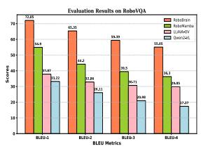

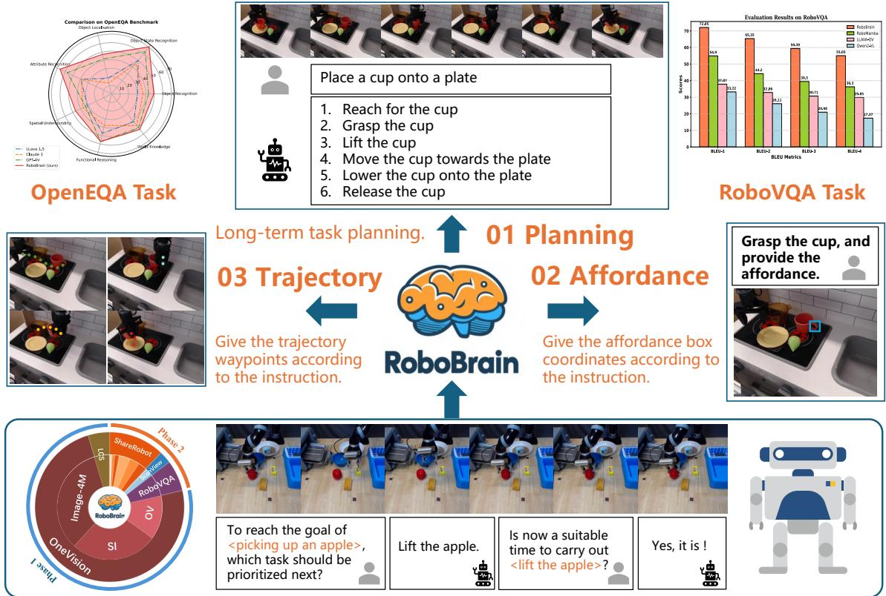  
Figure 1. Overview of RoboBrain. RoboBrain consists of three key robotic capabilities: planning capability, affordance perception, and trajectory prediction. RoboBrain outperforms previous MLLMs in robotics tasks. The bottom part shows the composition of RoboBrain’s training data and provides a specific example of visual question answering from our proposed ShareRobot. Best viewed on screen.

## Abstract

Recent advancements in Multimodal Large Language Models (MLLMs) have shown remarkable capabilities across various multimodal contexts. However, their application in robotic scenarios, particularly for long-horizon manipulation tasks, reveals significant limitations. These limitations arise from the current MLLMs lacking three essential robotic brain capabilities: Planning Capability, which involves decomposing complex manipulation instructions into manageable sub-tasks; Affordance Perception, the ability to recognize and interpret the affor dances of interactive objects; and Trajectory Prediction, the foresight to anticipate the complete manipulation trajectory necessary for successful execution. To enhance the robotic brain’s core capabilities from abstract to concrete, we introduce ShareRobot, a high-quality heterogeneous dataset that labels multi-dimensional information such as task planning, object affordance, and end-effector trajectory. ShareRobot’s diversity and accuracy have been meticulously refined by three human annotators. Building on this dataset, we developed RoboBrain, an MLLMbased model that combines robotic and general multi-modal data, utilizes a multi-stage training strategy, and incorporates long videos and high-resolution images to improve its robotic manipulation capabilities. Extensive experiments demonstrate that RoboBrain achieves state-of-the-art performance across various robotic tasks, highlighting its potential to advance robotic brain capabilities. Project website: RoboBrain.

## 1. Introduction

Recent advancements in Multimodal Large Language Models (MLLMs) have significantly advanced the pursuit of Artificial General Intelligence (AGI). By leveraging extensive multimodal datasets sourced from the internet and employing self-supervised learning techniques, MLLMs demonstrate exceptional capabilities in visual perception and understanding human language instructions, excelling in tasks such as visual question answering [3, 12, 13], image captioning [22, 29, 32], and sentiment analysis [14, 17]. Despite significant progress in MLLMs, the exploration of their application in robotics remains in its early stages, highlighting a crucial area for further research and innovation.

Recent studies have examined the application of MLLMs in robotics, focusing on planning and subgoal decomposition [6, 24], action sequencing [8, 9], and replanning and feedback [35, 38, 62]. However, their effectiveness in robotic scenarios—particularly for long-horizon manipulation tasks—reveals significant limitations. These limitations stem from the current MLLMs’ lack of three critical robotic capabilities: planning, affordance perception, and trajectory prediction, as illustrated in Fig. 1. For instance, consider a robotic arm tasked with lifting a teapot and pouring water into a cup. The MLLM should be capable of decomposing this task into sub-tasks, such as “approach the teapot and lift it”, “move the teapot until the spout is positioned over the cup”, and “tilt the teapot to pour”. For each sub-task, such as “approach and grasp the teapot”, the MLLM must utilize affordance perception to accurately identify the graspable regions of the teapot. Additionally, trajectory prediction is essential for determining the complete path from the starting point to the graspable part of the teapot. This challenge for existing MLLMs primarily arises from the scarcity of large-scale, fine-grained datasets specifically designed for robotic operation tasks.

To empower the RoboBrain’s core capabilities that transition from abstract instruction comprehension to concrete action expression. we first introduce ShareRobot, a largescale, fine-grained dataset specifically designed for robotic operation tasks. Specifically, we label multi-dimensional information such as task planning, object affordance, and end-effector trajectory. Building upon ShareRobot, we developed RoboBrain, an MLLM model based on the LLaVA [34] architecture, aimed at enhancing the perception and planning capabilities of robots in complex tasks. In the process of training RoboBrain, we meticulously designed the ratio of robotic data to general multi-modal data, implemented a multi-stage training strategy, and incorporated long videos and high-resolution images. This approach endowed RoboBrain with powerful visual information perception capabilities in robotic scenarios, supporting historical frame memory and high-definition image input, thereby further enhancing the ability in robotic manipulation planning. Extensive experimental results demonstrate that RoboBrain outperforms existing models across multiple robotic benchmarks, including RoboVQA [50] and OpenEQA [42], achieving state-of-the-art performance. Additionally, it shows competitive results in trajectory and affordance prediction accuracy. These findings validate the effectiveness of the proposed dataset and framework in enhancing robotic brain capabilities. In summary, the main contributions of this paper are as follows:

• We propose RoboBrain, a unified multimodal large language model designed for robotic manipulation, which facilitates more efficient task execution by transforming abstract instruction into concrete actions.

• We meticulously designed the ratio of robotic data to general multi-modal data, implemented a multi-stage training strategy, and incorporated long videos and highresolution images. This approach provided RoboBrain with historical frame memory and high-resolution image input, thereby further enhancing its capabilities in robotic manipulation planning.

• We introduce ShareRobot, a high-quality heterogeneous dataset that labels multi-dimensional information, including task planning, object affordance, and end-effector trajectory, effectively enhancing various robotic capabilities.

• Comprehensive experimental results demonstrate that RoboBrain achieves state-of-the-art performance across various robotic benchmarks, highlighting its potential for real-world applications in robotics.

## 2. Related Work

MLLM for Robotic Manipulation Planning Existing studies mostly utilize MLLMs primarily focus on understanding natural language and visual observation tasks [6–

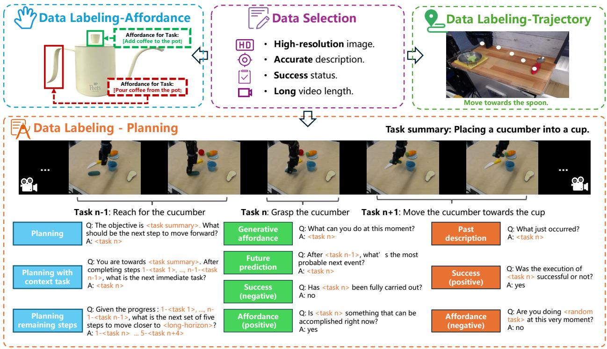  
Figure 2. The generation procession of our ShareRobot dataset. Our dataset labels multi-dimensional information, including task planning, object affordance, and end-effector trajectories. The task planning is first annotated by atomic tasks and then augmented by constructing question-answer pairs. The affordance and trajectory are labeled on the images according to the specific instructions.

8, 26, 30, 61], with fewer addressing the decomposition of high-level task instructions into actionable steps. PaLM-E [16] generates multimodal inputs by mapping real-world observations into the language embedding space. RT-H [6] and RoboMamba [36] generate reasoning results along with robot actions obtained from an additional policy head. However, while these models generate planning texts and actions, they still lack adequate mechanisms for executing complex atomic tasks, highlighting the need for enhanced affordance perception and trajectory prediction.

Datasets for Manipulation Planning Early datasets for Manipulation [11, 20, 27, 37, 51] mainly comprise annotated images and videos that highlight fundamental handobject interactions, including grasping and pushing. Recent advancements [15, 21, 50, 52] in robotic manipulation emphasize multi-modal and cross-embodiment datasets for enhanced generalization. Datasets such as RH20T [18], BridgeDataV2 [56], and DROID [25] enhance scene diversity, broadening the range of manipulation scenarios. Notably, RT-X [45] compiles data from 60 datasets across 22 embodiments into the Open X-Embodiment (OXE) repository. In this work, we extract high-quality data from OXE, decompose high-level descriptions into low-level planning instructions, and adapt these into a question-answer format to enhance model training.

## 3. ShareRobot Dataset

To enhance the RoboBrain’s capability of planning, affordance perception, and trajectory prediction, we develop a dataset called ShareRobot–a large-scale, fine-grained dataset specifically designed for robotic manipulation tasks. The generation procession of our dataset is shown as Fig. 2. The details are described in the following sections.

## 3.1. Overview

ShareRobot is a comprehensive dataset, facilitates more efficient task execution by transforming abstract concepts into concrete actions. The main features of the ShareRobot dataset include:

• Fine-grained Unlike the Open X-Embodiment dataset [44], which provides generalized high-level task descriptions, each data point in ShareRobot includes detailed low-level planning instructions linked to individual frames. This specificity enhances the model’s accuracy in executing tasks at the right moment.

• Multi-dimensional To enhance RoboBrain’s capabilities from abstract to concrete, we label task planning, object affordances, and end-effector trajectories, allowing for greater flexibility and precision in task processing.

• High quality We establish rigorous criteria for selecting data from the Open-X-Embodiment dataset [44], focusing on high resolution, accurate descriptions, successful task execution, visible affordance, and clear motion trajectories. Based on these criteria, we validate 51,403 instances to ensure high quality, forming the foundation for Robo-Brain’s core capabilities.

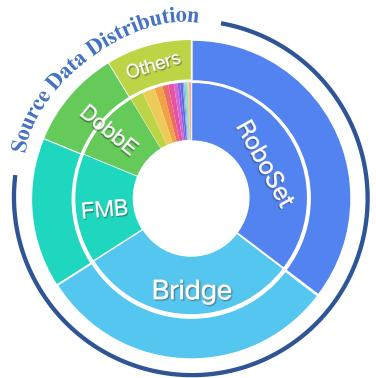  
a. Source Data Distribution

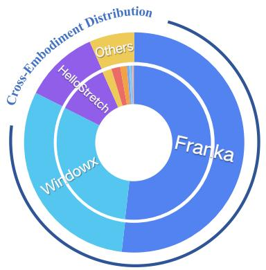  
b. Cross-Embodiment Distribution

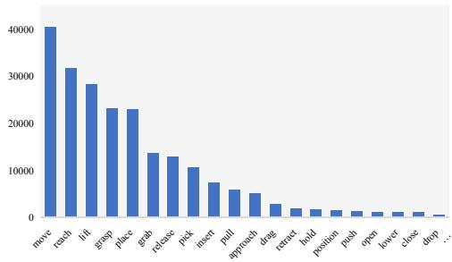  
c. Statics of Types of Atomic Tasks.  
Figure 3. The diversity of our ShareRobot dataset. Our dataset involves (a) 23 original datasets, (b) 12 embodiments and (c) 107 types of atomic tasks. The distribution of the top 20 most frequent atomic actions within our ShareRobot dataset is presented in (c).

• Large scale With 1,027,990 question-answer pairs, ShareRobot is the largest open-source dataset for task planning, affordance perception, and trajectory prediction, enabling deeper understanding of complex relationships from abstract to concrete.

• Rich diversity In contrast to the RoboVQA [50] dataset’s limited scenes, ShareRobot features 102 scenes across 12 embodiments and 107 types of atomic tasks, as shown in Fig. 3. This diversity allows MLLMs to learn from varied real-world contexts, enhancing robustness in complex, multi-step planning.

• Easy scalability Our data generation pipeline is designed for high scalability, facilitating expansion as new robotic embodiments, task types, and environments develop. This adaptability ensures the ShareRobot dataset can support increasingly complex manipulation tasks.

## 3.2. Data Selection

Based on the Open X-embodiment dataset [44], we carefully selected 51,403 instances, mainly focusing on image quality, description accuracy and success status. Our data collection process adheres to the following principles:

• High-resolution image We eliminate videos lacking images or those with low resolution. Any video with a resolution below 128 pixels is removed.

• Accurate description Videos without descriptions or with vague descriptions are filtered out to avoid affecting the planning capability of the model.

• Success status We discard videos of failed tasks, as unsuccessful demonstrations hinder the model’s learning.

• Long video length Videos with fewer than 30 frames are excluded, as they contain limited atomic tasks.

• Object not covered We remove any videos where the target object or end-effector is covered by other objects, as our model has to accurately identify the positions of endeffectors and the object’s affordance.

• Clear Trajectories We exclude the demonstrations with unclear or incomplete trajectories, as trajectory prediction is one of our RoboBrain’s capabilities.

## 3.3. Data Labeling

Planning Labeling We extract 30 frames from each robotic operation demonstration and use these frames along with their high-level descriptions to decompose them into lowlevel planning instructions using Gemini [53]. Three annotators then review and refine these instructions to ensure the precision of labeling. Subsequently, we design 5 different templates for each of the 10 question types in RoboVQA [50]. In the process of data generation, we randomly select 2 templates of each question type to generate question-answer pairs for every instance. This process transforms 51,403 instances into 1,027,990 questionanswer pairs, with annotators monitoring data generation to maintain the dataset’s integrity.

Affordance Labeling We filter 6,522 images and annotate each with affordance areas as $\{ l ^ { ( x ) } , l ^ { ( y ) } , \bar { r } ^ { ( x ) } , r ^ { ( y ) } \}$ according to its high-level description, where $\{ l ^ { ( x ) } , l ^ { ( y ) } \}$ are the top left coordinates and $\{ r ^ { ( x ) } , r ^ { ( y ) } \}$ are the bottom right corner coordinates. Subsequently, we conduct a rigorous manual review and refinement of each instruction to ensure its precise alignment with the associated affordance areas.

Trajectory Labeling We filter 6,870 images and annotate each with the gripper’s trajectory using at least three $\{ x , y \}$ coordinates according to its low-level instruction. Subsequently, we conduct a rigorous manual review and refinement of each instruction to ensure its precise alignment with the associated trajectory.

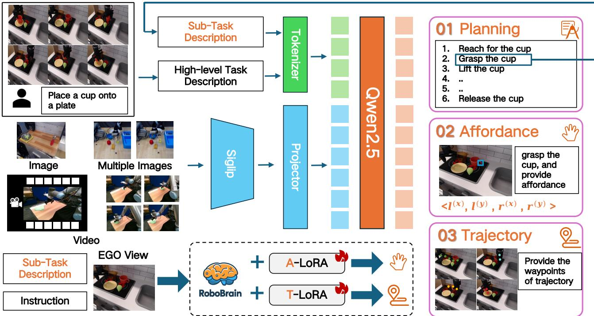  
Figure 4. The pipeline of our RoboBrain. The images, multiple images, and videos are sent into our model to pre-train a foundation robotic brain. Besides, we fine-tune the RoboBrain via A-LoRA and T-LoRA to develop affordance and trajectory skills. In practica applications, the model first generates detailed plans, and then splits it into sub-task descriptions to execute specific robotic tasks.

## 3.4. Data Statistics

We select 23 original datasets from the Open Xembodiment dataset [44]. The distribution of the source data is shown in the Fig. 3. The data involves 102 various scenes (e.g. bedroom, laboratory, kitchen, office), and covers 12 different robot bodies. According to statistics, there are 132 types of atomic actions in this dataset, tasks with higher word frequency are shown in Fig. 3 (c). The 5 most frequent atomic tasks are “pick”, “move”, “reach”, “lift”, and “place”, which are frequent task types in real robotic operation scenarios. This suggests that the distribution of our dataset is reasonable. Finally, we get 1,027,990 question-answer (QA) pairs for planning. For the planning QA pairs dataset, we split 1 million QA pairs as the training set and 2,050 QA pairs as the test set. For the affordance dataset, we split 6,000 images as the training set and 522 images as the test set. For the trajectory dataset, we split 6000 images for training and 870 images for testing.

## 4. RoboBrain Model

In this section, we provide an overview of RoboBrain. Our goal is to enable the Multi-modal Large Language Model (MLLM) to understand abstract instructions and explicitly output object affordance regions and potential operational trajectories, facilitating a transition from abstract to concrete. We employ a multi-stage training strategy: Phase 1 focuses on general OneVision (OV) training to develop a foundational MLLM with strong understanding and instruction-following abilities. Phase 2, the robotic training phase, aims to empower the core capabilities of RoboBrain from abstract to concrete.

## 4.1. Model Architecture

RoboBrain consists of three modules: the foundational model for planning, the A-LoRA model for affordance perception, and the T-LoRA model for trajectory prediction. In practical applications, the model first generates detailed plans, and then splits it into sub-task descriptions to execute affordance perception and trajectory prediction. The pipeline of our RoboBrain is shown to Fig. 4.

Foundational Model for Planning We utilize LLaVA as the foundational model for RoboBrain, which consists of three main modules: the Vision Encoder (ViT) g(·), the Projectior h(·), and the Large Language Model (LLM) f(·). Specifically, we employ SigLIP [59], a 2-layer MLP [33], and Qwen2.5-7B-Instruct [54]. Given an image or video $X _ { \imath }$ as visual input, ViT encodes it into visual features $Z _ { v } =$ $g ( X _ { v } )$ , which are then mapped to the semantic space of the LLM through Projector, resulting in a sequence of visual tokens $H _ { v } = h ( Z _ { v } )$ . Finally, the LLM generates a textual response in an autoregressive manner based on the human language instruction $X _ { t }$ and $H _ { v }$

<table><tr><td colspan="3"></td><td colspan="2"></td><td colspan="2"></td><td colspan="2"></td></tr><tr><td colspan="3"></td><td colspan="2"></td><td colspan="2">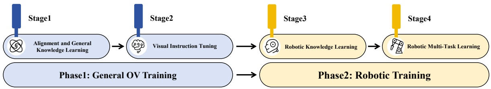</td><td colspan="2"></td></tr><tr><td colspan="3"></td><td></td><td colspan="2"></td><td colspan="3"></td></tr><tr><td colspan="9"></td></tr><tr><td colspan="2"></td><td>Stage-1</td><td>Stage-1.5 —</td><td colspan="2">Stage-2</td><td>Stage-3</td><td colspan="2">一 Stage-4</td></tr><tr><td colspan="2">Vsion Resolution #Tokens</td><td>384</td><td>Max 384×{2×2}</td><td>Single-Image Max 384×{6×6}</td><td>OneVision Max 384×{6×6}</td><td>Max 384×{6×6}</td><td>A-LoRA Max 384×{6×6}</td><td>T-LoRA Max 384×{6×6}</td></tr><tr><td colspan="2">Da</td><td>729 LCS</td><td>Max 729×5 Image</td><td> $\mathbf { M a x } 7 2 9 { \times } 3 7$  Image</td><td> $\mathrm { M a x } 7 2 9 \times 3 7$  Image &amp; Video</td><td>Max 729×37 Robotic Data</td><td> $\mathrm { M a x } 7 2 9 \times 3 7$  Afford. Data</td><td>Max 729×37 Traj. Data</td></tr><tr><td colspan="2">Mddel</td><td>558K</td><td>4M Full Model</td><td>3.2M Full Model</td><td>1.6M Full Model</td><td>3M Full Model</td><td>10K</td><td>400K T-LoRA</td></tr><tr><td colspan="2"></td><td>Projector 17.0M</td><td>8.0B</td><td>8.0B</td><td>8.0B</td><td>8.0B</td><td>A-LoRA 28.0M</td><td>28.0M</td></tr><tr><td colspan="2">Trnng</td><td>8</td><td>2</td><td>1</td><td>1</td><td>1  $2 \times 1 0 ^ { - 6 }$ </td><td>4</td><td>4</td></tr><tr><td colspan="2"></td><td>=</td><td> $2 \times 1 0 ^ { - 6 }$ </td><td> $2 \times 1 0 ^ { - 6 }$ </td><td> $2 \times 1 0 ^ { - 6 }$ </td><td> $1 \times 1 0 ^ { - 5 }$ </td><td> $2 \times 1 0 ^ { - 6 }$ </td><td> $2 \times 1 0 ^ { - 6 }$ </td></tr><tr><td colspan="2">LR: {θProj., φLLM, φLoRA }</td><td> $1 \times 1 0 ^ { - 3 }$ </td><td> $1 \times 1 0 ^ { - 5 }$ </td><td> $1 \times 1 0 ^ { - 5 }$ </td><td> $1 \times 1 0 ^ { - 5 }$ </td><td></td><td> $1 \times 1 0 ^ { - 5 }$ </td><td> $1 \times 1 0 ^ { - 5 }$ </td></tr><tr><td colspan="2">Epoch</td><td>1</td><td>1</td><td>1</td><td>1</td><td>1</td><td>1</td><td>1</td></tr></table>

Table 1. Detailed configuration for each training stage of the RoboBrain.

A-LoRA Module for Affordance Perception The term affordance in our work refers to the area where the human hand makes contact with objects. During interactions, humans instinctively engage with various objects within specific regions. We utilize bounding boxes to represent affordances. Formally, consider an image I consisting of multiple objects with their affordances: $\mathbf { \bar { \mathit { O } } } _ { i } = \{ A _ { i } ^ { 0 } , A _ { i } ^ { \bar { 1 } } , . . . , A _ { i } ^ { N } \}$ where the ith object owns N affordances. The format of affordance is defined as $\{ l ^ { ( x ) } , l ^ { ( y ) } , r ^ { ( x ) } , r ^ { ( y ) } \}$ , and $\{ l ^ { ( x ) } , l ^ { ( y ) } \}$ represents the top left corner coordinates of affordance, while $\{ r ^ { ( x ) } , r ^ { ( y ) } \}$ is the bottom right corner coordinates.

T-LoRA Module for Trajectory Prediction The term trajectory in our work refers to the concept of 2D visual traces, as presented in [19]. We define trajectory waypoints as a series of 2D coordinates representing the movement of the end-effector or hand throughout the process. Formally, at time step t, the trajectory waypoints can be represented as $P _ { t : N } = \{ ( x _ { i } , y _ { i } ) \mid i = t , t + 1 , \ldots , N \}$ , where $( x _ { i } , y _ { i } )$ denotes the i-th coordinate in the visual trace, and N represents the total number of time steps in the episode.

## 4.2. Training

Phase 1: General OV Training In Phase 1, we drew on the state-of-the-art training data and strategies from LLaVA-OneVision [28] to construct a foundational model with general multi-modal understanding and visual instruction following capabilities. This lays the groundwork for enhancing the model’s robotic manipulation planning abilities in

Phase 2. Detailed information is provided in Tab. 1.

In Stage 1, we utilize the image-text data from the LCS-558K dataset [10, 49] to train Projector, facilitating the alignment of visual features $Z _ { v }$ with the LLM semantic features $H _ { v }$ . In Stage 1.5, we train the entire model using 4M high-quality image-text data to enhance the model’s multimodal general knowledge understanding capabilities. In Stage 2, we further train the entire model with 3.2M singleimage data and 1.6M image and video data from LLaVA-OneVision-Data [28], aiming to enhance the instructionfollowing abilities of RoboBrain and improve understanding of high-resolution image and video.

Phase 2: Robotic Training In Phase 2, we build upon the robust multi-modal foundational model developed in Phase 1 to create a more powerful model for robotic manipulation planning. Specifically, we aim for RoboBrain to understand complex, abstract instructions, support the perception of historical frame information and high-resolution images, and output object affordance regions while predicting potential manipulation trajectories. This will facilitate the transition from abstract to concrete in manipulation planning tasks. Detailed information is provided in Tab. 1.

In Stage 3, we collected a dataset of 1.3M robotic data to improve the model’s manipulation planning capabilities. Specifically, this data is sourced from RoboVQA-800K [50], ScanView-318K including MMScan-224K [23, 40], 3RScan-43K [23, 55], ScanQA-25K [4, 23], SQA3d-26K [23, 41], and a subset of ShareRobot-200K introduced in this paper. These datasets contain substantial scenescanning image data, long video data, and high-resolution data to support the model’s ability to perceive diverse environments. Additionally, the fine-grained, high-quality planning data in the ShareRobot dataset enhances the manipulation planning capabilities of RoboBrain. To mitigate the issue of catastrophic forgetting [60], we selected a highquality subset of approximately 1.7M image-text data from Phase 1 to mix with the robotic data collected in Stage 3 for training, tuning the entire model accordingly. In Stage 4, we enhanced the model’s ability to perceive object affordances and predict manipulation trajectories from instructions, utilizing affordance and trajectory data from the ShareRobot dataset and other open-source sources [39, 43]. This was achieved by incorporating LoRA modules during training for concrete manipulation capabilities.

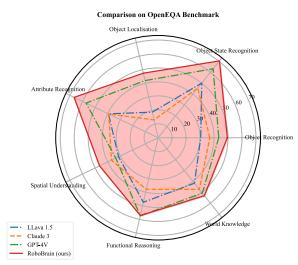  
(a) OpenEQA Benchmark

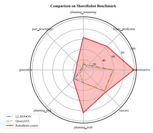  
(b) ShareRobot Benchmark

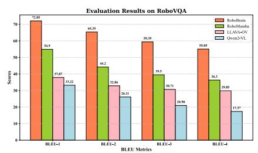  
(c) RoboVQA Benchmark  
Figure 5. The performance of our model RoboBrain on the OpenEQA, ShareRobot, and RoboVQA benchmarks. RoboBrain surpassed all baseline models, achieving state-of-the-art results.

## 5. Experiment

## 5.1. Implementation Details

During the entire training phase, we employed the Zero3 [48] distributed training strategy, conducting all experiments on a cluster of servers, each equipped with 8×A800 GPUs. The training components for each stage, including image resolution settings, batch size, epochs, and learning rates, are provided in Tab. 1.

## 5.2. Evaluation Metrics

Planning Task We selected RoboVQA [50], OpenEQA [42], and the test set of ShareRobot as robotic benchmarks for multi-dimensional assessment. For RoboVQA, we adopt the BLEU1 to BLEU4 metrics [47] used in RoboMamba [36] for evaluation. Additionally, for OpenEQA and ShareRobot, we use GPT-4o [46] as the evaluation tool, scoring based on the alignment or similarity between model predictions and ground truth, which serves as the final performance score for the model.

Affordance Prediction We utilize the Average Precision (AP) to evaluate the affordance performance of our model. AP metric summarizes the precision-recall affordance curve, which plots the relationship between precision and recall at various threshold settings. It is calculated across multiple Intersection over Union (IoU) thresholds to obtain a more comprehensive evaluation.

Trajectory Prediction We evaluate the similarity between ground truth and predicted trajectories, both represented as sequences of 2D waypoints normalized to [0, 1000), following Qwen2-VL [58]. The evaluation uses three metrics: Discrete Frechet Distance (DFD) [´ 19], Hausdorff Distance (HD), and Root Mean Square Error (RMSE). DFD captures overall shape and temporal alignment, HD identifies maximum deviation, and RMSE measures average pointwise error. Together, these metrics provide a comprehensive assessment of trajectory accuracy and similarity.

## 5.3. Evaluation on Robot Brain Task

Evaluation on Planning Task We selected 6 powerful MLLMs as our baselines for comparison, including both open-source and closed-source models with different architectures. Specifically, these models include GPT-4V [2], Claude3 [1], LLaVA-1.5 [34], LLaVA-OneVision-7b [28], Qwen2-VL-7b [57] and RoboMamba [36]. Our specific experimental results are shown in Fig. 5. Our RoboBrain outperformed all baseline models across three robotic benchmarks. RoboBrain significantly outperformed all baseline models on OpenEQA and ShareRobot, which can be attributed to its robust capabilities in understanding robotic tasks and perceiving long videos. Additionally, this pattern was observed in other benchmarks as well, with Robo-Brain consistently demonstrating superior performance on RoboVQA, achieving a BLEU-4 score that exceeded that of the second-place model by 18.75. This result highlights its capability to decompose complex long-range task planning.

Evaluation on Affordance Prediction Our results are summarized in Tab. 2. We compare the Qwen2-VL-7B and LLaVA-NeXT-7B models. Qwen2-VL [57] has a superior visual grounding ability and LLaVA-NeXT [31] owns a high-resolution and strong vision tower. We test them all on the AGD20K affordance test set. Our RoboBrain outperforms significantly the other models. It surpasses Qwen2-

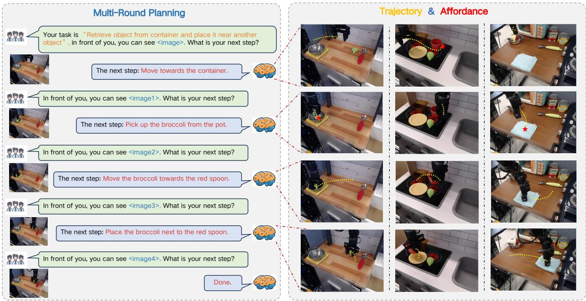  
Figure 6. This visualization illustrates that RoboBrain can interpret human instructions and visual images to generate action plans and assessments based on real-time image feedback. Furthermore, it predicts trajectories for each step and identifies corresponding affordances.

Table 2. The comparison of affordance prediction. We utilize AP as the metric, and test them on affordance test set.
<table><tr><td>Model</td><td>AP↑</td></tr><tr><td>LLaVA-NeXT-7B [34]</td><td>9.8 %</td></tr><tr><td>Qwen2-VL-7B [5]</td><td>12.5 %</td></tr><tr><td>RoboBrain (Ours)</td><td>27.1 % (14.6↑)</td></tr></table>

VL [57] by 14.6 AP, and LLaVA-NeXT by 17.3 AP. It validates our RoboBrain can understand the physical properties of objects and provide the affordance accurately.

Evaluation on Trajectory Prediction We compare several variants of our model, and the results are in Tab. 3: (1) Baseline, fine-tuned on trajectory-related VQA data; (2) Start Points, which adds the 2D start coordinates of the end-effector; (3) Max Points, limiting waypoints to 10 via uniform sampling; and (4) Spec Token & End Points, which adds end-effector positions and special tokens to emphasize waypoints and start/goal points. Each variant builds on the previous one, with the final model integrating all components. Our most effective model integrates all design choices. As shown in the last row of Tab. 3, DFD, HD, and RMSE decreased by 42.9%, 94.2%, and 31.6%, respectively, compared to the baseline. We found that adding start points corrected the translational offset between the generated trajectory and the end-effector.

Table 3. Trajectory Prediction Results Comparison. Discrete Frechet Distance (DFD), Hausdorff Distance (HD), and Root´ Mean Square Error (RMSE).
<table><tr><td>Method</td><td>DFD↓</td><td>HD↓</td><td>RMSE↓</td></tr><tr><td>RoboBrain (Base)</td><td>0.191</td><td>0.171</td><td>0.133</td></tr><tr><td>+ Start_Points</td><td>0.176</td><td>0.157</td><td>0.117</td></tr><tr><td>+ Max_Points</td><td>0.185</td><td>0.163</td><td>0.125</td></tr><tr><td>+ Spec_Token</td><td>0.109 (42.9%↓) 0.010 (94.2%↓) 0.091 (31.6%↓)</td><td></td><td></td></tr></table>

## 5.4. Visualization

In this section, we present visual examples of RoboBrain in Fig. 6. Given human instructions and visual inputs, Robo-Brain engages in multi-turn interactions, understanding and planning future steps. It also outputs more concrete affordances and trajectories.

## 6. Conclusion

In this paper, we introduce ShareRobot, a high-quality dataset that labels multi-dimensional information, including task planning, object affordance, and end-effector trajectory. We also present RoboBrain, an MLLM-based model that integrates robotic and general multi-modal data, employs a multi-stage training strategy, and leverages long videos and high-resolution images to enhance robotic manipulation. Extensive experiments demonstrate that Robo-Brain achieves state-of-the-art performance across various robotic tasks, underscoring its potential to significantly advance robotic capabilities.

## Acknowledgments

This work was supported by the National Natural Science Foundation of China 62476011, 72225011 and 72434005.

## References

[1] The claude 3 model family: Opus, sonnet, haiku. 7

[2] Josh Achiam, Steven Adler, Sandhini Agarwal, Lama Ahmad, Ilge Akkaya, Florencia Leoni Aleman, Diogo Almeida, Janko Altenschmidt, Sam Altman, Shyamal Anadkat, et al. Gpt-4 technical report. arXiv preprint arXiv:2303.08774, 2023. 7

[3] Stanislaw Antol, Aishwarya Agrawal, Jiasen Lu, Margaret Mitchell, Dhruv Batra, C Lawrence Zitnick, and Devi Parikh. Vqa: Visual question answering. In ICCV, pages 2425–2433, 2015. 2

[4] Daichi Azuma, Taiki Miyanishi, Shuhei Kurita, and Motoaki Kawanabe. Scanqa: 3d question answering for spatial scene understanding. In CVPR, pages 19129–19139, 2022. 6

[5] Jinze Bai, Shuai Bai, Yunfei Chu, Zeyu Cui, Kai Dang, Xiaodong Deng, Yang Fan, Wenbin Ge, Yu Han, Fei Huang, et al. Qwen technical report. arXiv preprint arXiv:2309.16609, 2023. 8

[6] Suneel Belkhale, Tianli Ding, Ted Xiao, Pierre Sermanet, Quon Vuong, Jonathan Tompson, Yevgen Chebotar, Debidatta Dwibedi, and Dorsa Sadigh. Rt-h: Action hierarchies using language. arXiv preprint arXiv:2403.01823, 2024. 2, 3

[7] Anthony Brohan, Noah Brown, Justice Carbajal, Yevgen Chebotar, Joseph Dabis, Chelsea Finn, Keerthana Gopalakrishnan, Karol Hausman, Alex Herzog, Jasmine Hsu, et al. Rt-1: Robotics transformer for real-world control at scale. arXiv preprint arXiv:2212.06817, 2022.

[8] Anthony Brohan, Noah Brown, Justice Carbajal, Yevgen Chebotar, Xi Chen, Krzysztof Choromanski, Tianli Ding, Danny Driess, Avinava Dubey, Chelsea Finn, et al. Rt-2: Vision-language-action models transfer web knowledge to robotic control. arXiv preprint arXiv:2307.15818, 2023. 2, 3

[9] Anthony Brohan, Yevgen Chebotar, Chelsea Finn, Karol Hausman, Alexander Herzog, Daniel Ho, Julian Ibarz, Alex Irpan, Eric Jang, Ryan Julian, et al. Do as i can, not as i say: Grounding language in robotic affordances. In CoRL, pages 287–318, 2023. 2

[10] Soravit Changpinyo, Piyush Sharma, Nan Ding, and Radu Soricut. Conceptual 12m: Pushing web-scale image-text pretraining to recognize long-tail visual concepts. In CVPR, pages 3558–3568, 2021. 6

[11] Yu-Wei Chao, Wei Yang, Yu Xiang, Pavlo Molchanov, Ankur Handa, Jonathan Tremblay, Yashraj S. Narang, Karl Van Wyk, Umar Iqbal, Stan Birchfield, Jan Kautz, and Dieter Fox. Dexycb: A benchmark for capturing hand grasping of objects. In CVPR, pages 9044–9053, 2021. 3

[12] Xi Chen, Xiao Wang, Soravit Changpinyo, AJ Piergiovanni, Piotr Padlewski, Daniel Salz, Sebastian Goodman, Adam Grycner, Basil Mustafa, Lucas Beyer, et al. Pali: A jointlyscaled multilingual language-image model. In ICLR. 2

[13] Zhe Chen, Jiannan Wu, Wenhai Wang, Weijie Su, Guo Chen, Sen Xing, Muyan Zhong, Qinglong Zhang, Xizhou Zhu, Lewei Lu, et al. Internvl: Scaling up vision foundation mod els and aligning for generic visual-linguistic tasks. In CVPR, pages 24185–24198, 2024. 2

[14] Ringki Das and Thoudam Doren Singh. Multimodal sentiment analysis: a survey of methods, trends, and challenges. ACM Computing Surveys, 55(13s):1–38, 2023. 2

[15] Sudeep Dasari, Frederik Ebert, Stephen Tian, Suraj Nair, Bernadette Bucher, Karl Schmeckpeper, Siddharth Singh, Sergey Levine, and Chelsea Finn. Robonet: Large-scale multi-robot learning. In CoRL, pages 885–897, 2019. 3

[16] Danny Driess, Fei Xia, Mehdi SM Sajjadi, Corey Lynch, Aakanksha Chowdhery, Brian Ichter, Ayzaan Wahid, Jonathan Tompson, Quan Vuong, Tianhe Yu, et al. Palm e: An embodied multimodal language model. arXiv preprint arXiv:2303.03378, 2023. 3

[17] Kelvin Du, Frank Xing, Rui Mao, and Erik Cambria. Financial sentiment analysis: Techniques and applications. ACM Computing Surveys, 56(9):1–42, 2024. 2

[18] Haoshu Fang, Hongjie Fang, Zhenyu Tang, Jirong Liu, Chenxi Wang, Junbo Wang, Haoyi Zhu, and Cewu Lu. RH20T: A comprehensive robotic dataset for learning di verse skills in one-shot. In ICRA, pages 653–660, 2024. 3

[19] Jiayuan Gu, Sean Kirmani, Paul Wohlhart, Yao Lu, Montserrat Gonzalez Arenas, Kanishka Rao, Wenhao Yu, Chuyuan Fu, Keerthana Gopalakrishnan, Zhuo Xu, et al. Rt-trajectory: Robotic task generalization via hindsight trajectory sketches. arXiv preprint arXiv:2311.01977, 2023. 6, 7

[20] Shreyas Hampali, Mahdi Rad, Markus Oberweger, and Vincent Lepetit. Honnotate: A method for 3d annotation of hand and object poses. In CVPR, pages 3193–3203, 2020. 3

[21] Peng Hao, Chaofan Zhang, Dingzhe Li, Xiaoge Cao, Xiaoshuai Hao, Shaowei Cui, and Shuo Wang. Tla: Tactilelanguage-action model for contact-rich manipulation. arXiv preprint arXiv:2503.08548, 2025. 3

[22] Xiaoshuai Hao, Yi Zhu, Srikar Appalaraju, Aston Zhang, Wanqian Zhang, Bo Li, and Mu Li. Mixgen: A new multimodal data augmentation. In Proceedings of the IEEE/CVF winter conference on applications of computer vision, pages 379–389, 2023. 2

[23] Jiangyong Huang, Silong Yong, Xiaojian Ma, Xiongkun Linghu, Puhao Li, Yan Wang, Qing Li, Song-Chun Zhu, Baoxiong Jia, and Siyuan Huang. An embodied generalist agent in 3d world. In ICLR 2024 Workshop: How Far Are We From AGI. 6

[24] Wenlong Huang, Fei Xia, Ted Xiao, Harris Chan, Jacky Liang, Pete Florence, Andy Zeng, Jonathan Tompson, Igor Mordatch, Yevgen Chebotar, et al. Inner monologue: Em bodied reasoning through planning with language models. In CoRL, pages 1769–1782. PMLR, 2023. 2

[25] Alexander Khazatsky, Karl Pertsch, Suraj Nair, Ashwin Balakrishna, Sudeep Dasari, Siddharth Karamcheti, Soroush Nasiriany, Mohan Kumar Srirama, Lawrence Yun liang Chen, Kirsty Ellis, et al. Droid: A large-scale in-the-wild robot manipulation dataset. arXiv preprint arXiv:2403.12945, 2024. 3

[26] Moo Jin Kim, Karl Pertsch, Siddharth Karamcheti, Ted Xiao, Ashwin Balakrishna, Suraj Nair, Rafael Rafailov, Ethan Foster, Grace Lam, Pannag Sanketi, et al. Openvla: An open-source vision-language-action model. arXiv preprint arXiv:2406.09246, 2024. 3

[27] Taein Kwon, Bugra Tekin, Jan Stuhmer, Federica Bogo, and¨ Marc Pollefeys. H2O: two hands manipulating objects for first person interaction recognition. In ICCV, pages 10118– 10128, 2021. 3

[28] Bo Li, Yuanhan Zhang, Dong Guo, Renrui Zhang, Feng Li, Hao Zhang, Kaichen Zhang, Yanwei Li, Ziwei Liu, and Chunyuan Li. Llava-onevision: Easy visual task transfer. arXiv preprint arXiv:2408.03326, 2024. 6, 7

[29] Chenliang Li, Haiyang Xu, Junfeng Tian, Wei Wang, Ming Yan, Bin Bi, Jiabo Ye, He Chen, Guohai Xu, Zheng Cao, et al. mplug: Effective and efficient vision-language learning by cross-modal skip-connections. In EMNLP, pages 7241– 7259, 2022. 2

[30] Dingzhe Li, Yixiang Jin, Yuhao Sun, Hongze Yu, Jun Shi, Xiaoshuai Hao, Peng Hao, Huaping Liu, Fuchun Sun, Jianwei Zhang, et al. What foundation models can bring for robot learning in manipulation: A survey. arXiv preprint arXiv:2404.18201, 2024. 3

[31] Feng Li, Renrui Zhang, Hao Zhang, Yuanhan Zhang, Bo Li, Wei Li, Zejun Ma, and Chunyuan Li. Llava-next-interleave: Tackling multi-image, video, and 3d in large multimodal models. arXiv preprint arXiv:2407.07895, 2024. 7

[32] Junnan Li, Dongxu Li, Silvio Savarese, and Steven Hoi. Blip-2: Bootstrapping language-image pre-training with frozen image encoders and large language models. In ICML, pages 19730–19742. PMLR, 2023. 2

[33] Haotian Liu, Chunyuan Li, Yuheng Li, and Yong Jae Lee. Improved baselines with visual instruction tuning. In CVPR, pages 26296–26306, 2024. 5

[34] Haotian Liu, Chunyuan Li, Qingyang Wu, and Yong Jae Lee. Visual instruction tuning. NeurIPS, 36, 2024. 2, 7, 8

[35] Jiaming Liu, Chenxuan Li, Guanqun Wang, Lily Lee, Kaichen Zhou, Sixiang Chen, Chuyan Xiong, Jiaxin Ge, Renrui Zhang, and Shanghang Zhang. Self-corrected multimodal large language model for end-to-end robot manipulation. arXiv preprint arXiv:2405.17418, 2024. 2

[36] Jiaming Liu, Mengzhen Liu, Zhenyu Wang, Lily Lee, Kaichen Zhou, Pengju An, Senqiao Yang, Renrui Zhang, Yandong Guo, and Shanghang Zhang. Robomamba: Multimodal state space model for efficient robot reasoning and manipulation. arXiv preprint arXiv:2406.04339, 2024. 3, 7

[37] Yun Liu, Haolin Yang, Xu Si, Ling Liu, Zipeng Li, Yuxiang Zhang, Yebin Liu, and Li Yi. TACO: benchmarking generalizable bimanual tool-action-object understanding. In CVPR, pages 21740–21751, 2024. 3

[38] Zeyi Liu, Arpit Bahety, and Shuran Song. Reflect: Summarizing robot experiences for failure explanation and correction. In CoRL, pages 3468–3484. PMLR, 2023. 2

[39] Hongchen Luo, Wei Zhai, Jing Zhang, Yang Cao, and Dacheng Tao. Learning affordance grounding from exocentric images. In CVPR, pages 2242–2251. IEEE, 2022. 7

[40] Ruiyuan Lyu, Tai Wang, Jingli Lin, Shuai Yang, Xiaohan Mao, Yilun Chen, Runsen Xu, Haifeng Huang, Chenming

Zhu, Dahua Lin, and Jiangmiao Pang. Mmscan: A multimodal 3d scene dataset with hierarchical grounded language annotations. arXiv preprint arXiv:2406.09401, 2024. 6

[41] Xiaojian Ma, Silong Yong, Zilong Zheng, Qing Li, Yitao Liang, Song-Chun Zhu, and Siyuan Huang. Sqa3d: Situated question answering in 3d scenes. In ICLR, 2023. 6

[42] Arjun Majumdar, Anurag Ajay, Xiaohan Zhang, Pranav Putta, Sriram Yenamandra, Mikael Henaff, et al. Openeqa: Embodied question answering in the era of foundation models. In CVPR, pages 16488–16498, 2024. 2, 7

[43] Dantong Niu, Yuvan Sharma, Giscard Biamby, Jerome Quenum, Yutong Bai, Baifeng Shi, Trevor Darrell, and Roei Herzig. Llarva: Vision-action instruction tuning enhances robot learning. arXiv preprint arXiv:2406.11815, 2024. 7

[44] Abby O’Neill, Abdul Rehman, Abhinav Gupta, Abhiram Maddukuri, Abhishek Gupta, Abhishek Padalkar, Abraham Lee, Acorn Pooley, Agrim Gupta, Ajay Mandlekar, et al. Open x-embodiment: Robotic learning datasets and rt-x models. arXiv preprint arXiv:2310.08864, 2023. 3, 4, 5

[45] Abby O’Neill, Abdul Rehman, Abhiram Maddukuri, Abhishek Gupta, Abhishek Padalkar, Abraham Lee, et al. Open x-embodiment: Robotic learning datasets and RT-X models : Open x-embodiment collaboration. In ICRA, pages 6892– 6903, 2024. 3

[46] OpenAI. Hello gpt-4o, 2024. 7

[47] Kishore Papineni, Salim Roukos, Todd Ward, and Wei-Jing Zhu. Bleu: a method for automatic evaluation of machine translation. In ACL, pages 311–318, 2002. 7

[48] Jeff Rasley, Samyam Rajbhandari, Olatunji Ruwase, and Yuxiong He. Deepspeed: System optimizations enable training deep learning models with over 100 billion parameters. In SIGKDD, pages 3505–3506, 2020. 7

[49] Christoph Schuhmann, Romain Beaumont, Richard Vencu, Cade Gordon, Ross Wightman, Mehdi Cherti, Theo Coombes, Aarush Katta, Clayton Mullis, Mitchell Wortsman, et al. Laion-5b: An open large-scale dataset for train ing next generation image-text models. NeuIPS, 35:25278– 25294, 2022. 6

[50] Pierre Sermanet, Tianli Ding, Jeffrey Zhao, Fei Xia, Debidatta Dwibedi, Keerthana Gopalakrishnan, Christine Chan, Gabriel Dulac-Arnold, Sharath Maddineni, Nikhil J Joshi, et al. Robovqa: Multimodal long-horizon reasoning for robotics. In ICRA, pages 645–652, 2024. 2, 3, 4, 6, 7

[51] Omid Taheri, Nima Ghorbani, Michael J. Black, and Dimitrios Tzionas. GRAB: A dataset of whole-body human grasping of objects. In ECCV, pages 581–600, 2020. 3

[52] Yingbo Tang, Shuaike Zhang, Xiaoshuai Hao, Pengwei Wang, Jianlong Wu, Zhongyuan Wang, and Shanghang Zhang. Affordgrasp: In-context affordance reasoning for open-vocabulary task-oriented grasping in clutter. arXiv preprint arXiv:2503.00778, 2025. 3

[53] Gemini Team, Rohan Anil, Sebastian Borgeaud, et al. Gemini: A family of highly capable multimodal models, 2024. 4

[54] Qwen Team. Qwen2.5: A party of foundation models, 2024. 5

[55] Johanna Wald, Armen Avetisyan, Nassir Navab, Federico Tombari, and Matthias Nießner. Rio: 3d object instance re-localization in changing indoor environments. In ICCV, pages 7658–7667, 2019. 6

[56] Homer Rich Walke, Kevin Black, Tony Z. Zhao, Quan Vuong, Chongyi Zheng, Philippe Hansen-Estruch, Andre Wang He, Vivek Myers, Moo Jin Kim, Max Du, Abraham Lee, Kuan Fang, Chelsea Finn, and Sergey Levine. Bridgedata V2: A dataset for robot learning at scale. In CoRL, pages 1723–1736, 2023. 3

[57] Peng Wang, Shuai Bai, Sinan Tan, Shijie Wang, Zhihao Fan, Jinze Bai, Keqin Chen, Xuejing Liu, Jialin Wang, Wenbin Ge, et al. Qwen2-vl: Enhancing vision-language model’s perception of the world at any resolution. arXiv preprint arXiv:2409.12191, 2024. 7, 8

[58] Peng Wang, Shuai Bai, Sinan Tan, Shijie Wang, Zhihao Fan, Jinze Bai, Keqin Chen, Xuejing Liu, Jialin Wang, Wenbin Ge, et al. Qwen2-vl: Enhancing vision-language model’s perception of the world at any resolution. arXiv preprint arXiv:2409.12191, 2024. 7

[59] Xiaohua Zhai, Basil Mustafa, Alexander Kolesnikov, and Lucas Beyer. Sigmoid loss for language image pre-training. In ICCV, pages 11975–11986, 2023. 5

[60] Yuexiang Zhai, Shengbang Tong, Xiao Li, Mu Cai, Qing Qu, Yong Jae Lee, and Yi Ma. Investigating the catastrophic forgetting in multimodal large language models. In NeurIPS 2023 Workshop on Instruction Tuning and Instruction Following. 7

[61] Lingfeng Zhang, Xiaoshuai Hao, Qinwen Xu, Qiang Zhang, Xinyao Zhang, Pengwei Wang, Jing Zhang, Zhongyuan Wang, Shanghang Zhang, and Renjing Xu. Mapnav: A novel memory representation via annotated semantic maps for vlm-based vision-and-language navigation. arXiv preprint arXiv:2502.13451, 2025. 3

[62] Enshen Zhou, Qi Su, Cheng Chi, Zhizheng Zhang, Zhongyuan Wang, Tiejun Huang, Lu Sheng, and He Wang. Code-as-monitor: Constraint-aware visual programming for reactive and proactive robotic failure detection. arXiv preprint arXiv:2412.04455, 2024. 2