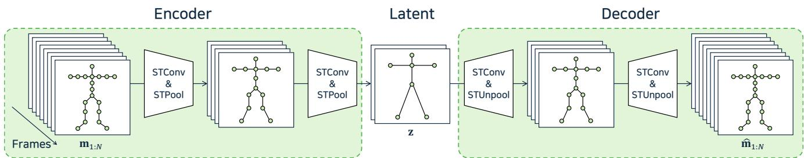
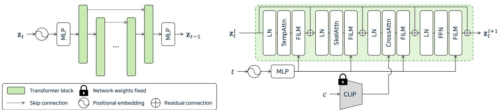
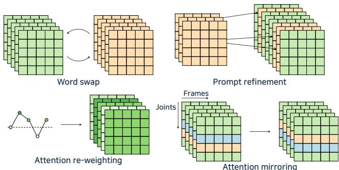
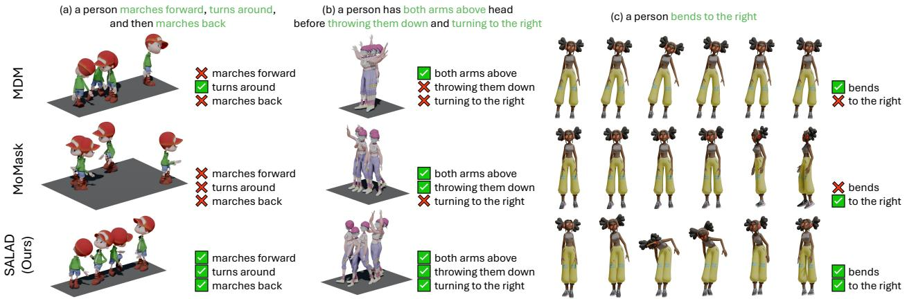
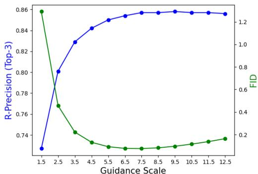
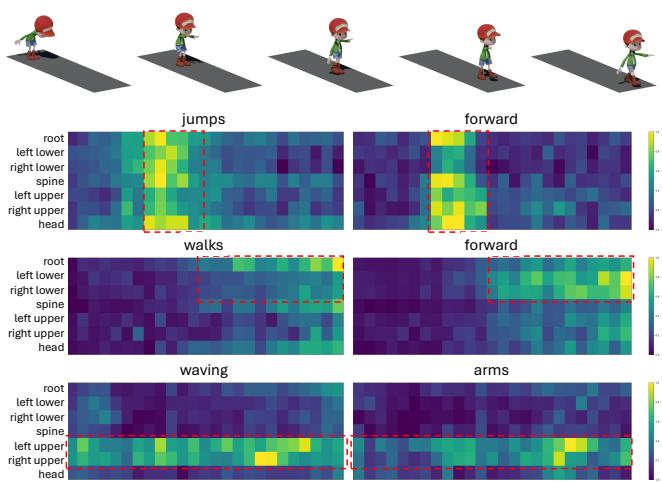
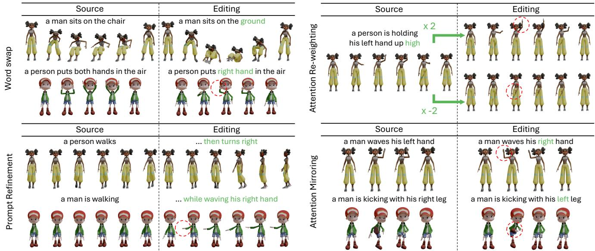

# SALAD: Skeleton-aware Latent Diffusion for Text-driven Motion Generation and Editing

Seokhyeon Hong Chaelin Kim Serin Yoon Junghyun Nam Sihun Cha Junyong Noh Visual Media Lab, KAIST

{ghd3079, chaelin.kim, serinyoon, ys4990, chacorp, junyongnoh}@kaist.ac.kr

## Abstract

Text-driven motion generation has advanced significantly with the rise of denoising diffusion models. However, previous methods often oversimplify representations for the skeletal joints, temporal frames, and textual words, limiting their ability tofully capture the information within each modality and their interactions. Moreover, when using pretrained models for downstream tasks, such as editing, they typically require additional efforts, including manual interventions, optimization, or fine-tuning. In this paper, we introduce a skeleton-aware latent diffusion (SALAD), a model that explicitly captures the intricate inter-relationships between joints, frames, and words. Furthermore, by leveraging cross-attention maps produced during the generation process, we enable attention-based zero-shot text-driven motion editing using a pre-trained SALAD model, requiring no additional user input beyond textprompts. Our approach significantly outperforms previous methods in terms oftextmotion alignment without compromising generation quality, and demonstrates practical versatility by providing diverse editing capabilities beyond generation. Code is available at project page.

## 1. Introduction

Character animation is a crucial component in various computer graphics and vision applications, including games, films, and interactive media. Traditional methods, such as keyframing and motion capture, typically require extensive manual effort, which are time-consuming and expensive. Recently, deep generative models have been introduced to mitigate these challenges. In particular, diffusion models have shown promising results in text-to-motion generation, enabling intuitive and efficient animation workflows.

Despite these advancements, fully capturing the intricate relationships among frames, body parts, and textual descriptions remains a complex challenge in text-driven motion generation. Previous approaches typically represent a pose as a single vector and primarily focus on temporal relationships between poses across frames, while neglecting spatial interactions between skeletal joints. Furthermore, these models often compress a sentence into a single vector for conditioning, which can overlook the important nuances of word-level variations. This over-simplification of interactions among skeletal, temporal, and textual components may lead to missing details in the generated results, underscoring the need for models that faithfully capture these complex dependencies.

On the other hand, learning meaningful representations is a key factor to enable zero-shot downstream tasks with pre-trained models. For example, zero-shot text-driven image and video editing methods [3, 7, 13, 15, 25, 35, 43] leverage attention modulation from pre-trained models for intuitive manipulation. Unfortunately, motion generation models typically lack such interpretable and manipulatable intermediate representations. This limitation stems from the over-simplification of motion and text features mentioned above, which restricts rich interactions between them. Although some methods exploit pre-trained models with manual masks, optimization, or fine-tuning [21–23, 42, 45, 47], these methods require additional effort, time, and cost to achieve desired results. Therefore, developing interpretable representations during motion synthesis could improve versatility and flexibility for downstream tasks beyond generation, such as zero-shot motion editing.

In this paper, we propose a skeleton-aware latent diffusion, which we call SALAD, for text-driven motion generation within a skeleto-temporally structured latent space. We first train a variational autoencoder (VAE) [24] to construct a motion latent space that decouples spatia and temporal dimensions. To this end, we employ skeletotemporal convolution layers to facilitate information exchange between adjacent joints and frames. We also employ skeleto-temporal pooling layers to produce a compact representation by reducing the dimensionality, which can reduce the computational complexity during the sampling process of the diffusion model. Subsequently, we train a diffusion model within this latent space to generate motion features conditioned on text. To train the denoiser, we leverage both skeletal and temporal attention blocks, which can effectively enable skeleto-temporal coherence. Additionally, we employ cross-attention to capture fine-grained interactions between individual words and the skeleto-temporal units of the motion latents.

Beyond motion generation, we introduce an attentionbased zero-shot, text-driven motion editing method that leverages the pre-trained SALAD model, requiring no additional optimization or fine-tuning. We demonstrate that the intermediate cross-attention maps of SALAD capture the relationship between text and motion features. By modulating these cross-attention maps, we enable text-driven motion editing that allows users to edit generated motion through text input alone in a training-free manner. We also propose a novel attention modulation method for motionspecific tasks, demonstrating the practical potential of our approach.

In summary, our contributions are as follows:

• We propose SALAD, a novel skeleton-aware latent diffusion model for text-driven motion generation within a skeleto-temporally structured latent space.

• We interpret the intermediate representations in the generation process, allowing for a clear understanding of the relationship between text inputs and generated motions.

• We present an attention-based zero-shot text-driven motion editing method using cross-attention modulation in generative models.

## 2. Related Work

## 2.1. Text-driven Motion Generation

With the rise of deep neural networks, generative models for human motion synthesis based on natural language descriptions have been extensively explored. Early stud ies focused on generating motions from action labels, such as throw and kick [9, 32]. More advanced methods projected both text and motion features into a shared latent space, enabling the generation of fixed motion sequences from identical input text [2]. To increase the diversity of generated results, T2M [10] employed a temporal VAE that can generate varied motion sequences that align with the given text input. Subsequent studies leveraged large pretrained text encoders, such as CLIP [36], to improve textual understanding for motion generation [4, 33, 41]. Autoregressive models that behave like language models have also been proposed, which first encode motion features into discrete tokens through vector quantization [44] and then auto-regressively predict the next motion token given the text prompt [11, 12, 20, 49, 52–54]. Recently, denoising diffusion models [17, 39] have become the dominant framework for generative models, prompting text-driven motion generation methods to adopt diffusion models as their backbone [8, 23, 27, 42, 46, 50, 51]. In this study, we build our framework on the diffusion model formulation and enhance the performance of text-driven motion generation through explicit modeling of the relationships among joints, frames, and words. Moreover, we introduce an attentionbased zero-shot text-driven editing method, leveraging our pre-trained SALAD model as a generator, demonstrating a novel exploration beyond mere generation.

## 2.2. Skeleton-aware Processing of Motion Data

Because motion data consists of two separate skeletal and temporal dimensions, some methods have been developed to respect each dimension when processing the motion data. Yan et al. [48] presented spatial-temporal graph convolution networks that can learn both the spatial and temporal patterns of dynamic skeletons. Skeleton-aware networks [1] employed skeleto-temporal convolution networks and topology-preserving skeletal pooling layers to construct a shared motion latent space, enabling deep motion retargeting across homeomorphic skeletons. Motion style transfer has also been enabled in a part-wise manner by employing skeleto-temporal convolution modules [19, 30]. In the realm of text-to-motion generation, ParCo [54] and AttT2M [53] utilized the skeleto-temporal network architecture during the motion quantization process. In this work, we adopt a similar approach by encoding motion features using skeleto-temporal convolution networks and pooling layers to derive an effective skeleton-aware motion latent space with compact dimensionality. Additionally, we facilitate the interaction between this skeleton-aware motion latent space and textual features during the textconditional generation process.

## 2.3. Zero-shot Editing with Diffusion Models

By leveraging the generative capabilities of diffusion models, zero-shot editing methods have been proposed. SDEdit [28] first adds noise to the input data for a few diffusion timesteps, then denoises the noisy data with an editing condition to achieve high-fidelity zero-shot editing by leveraging a pre-trained diffusion model. Promptto-Prompt [15] verified that cross-attention maps establish connections between word tokens and the spatial layout of the generated image. In addition, it introduced attention modulation methods that can be utilized during the generation process, enabling the generation of high-fidelity editing results in a zero-shot manner. Null-text inversion [29] extended this method to real-images by improving the diffusion inversion method. Similarly, image and video editing methods via attention modulation have been extensively studied [3, 7, 13, 25, 35, 43]. Motion diffusion models often employ joint masks [23, 42] or optimization [21, 22, 47] to enable motion editing using pre-trained diffusion models, although they require user intervention or additional computation for the desired goal. On the other hand, CoMo [18] achieved zero-shot text-driven motion editing using large language models to manipulate semantic pose tokens. We demonstrate that the intermediate cross-attention maps of our SALAD model can capture the relationship between motion and text, similarly to image diffusion models. Furthermore, by modulating these cross-attention maps, we introduce an attention-based zero-shot text-driven motion editing method that eliminates the need for manual masks, fine-tuning, or optimization.

  
Figure 1. Architecture of the skeleto-temporal VAE network. The encoder maps motion features into a skeleto-temporal latent space, and the decoder restores the skeleto-temporal latent variables into motion features.

## 3. Method

Our goal is to generate a motion sequence $\mathbf { m } _ { 1 : N }$ conditioned on a text prompt c, where N denotes the number of frames. We first construct a skeleton-aware motion latent representation that captures both skeletal and temporal dynamics of a motion sequence (Sec. 3.1). Using this motion representation, we train a diffusion model by modeling the complex interactions between skeletal joints, temporal frames, and textual descriptions (Sec. 3.2). Finally, we extend our model for zero-shot text-driven motion editing by modulating cross-attention maps between text and motion (Sec. 3.3). Additional details on the network architectures will be featured in the supplementary material.

## 3.1. Skeleton-aware VAE

To derive skeleton-aware motion features, we train a VAE composed of skeleto-temporal convolution networks and pooling layers [1, 48], as illustrated in Fig. 1. The core module is the skeleto-temporal convolution (STConv), which decouples joint and frame dimensions while facilitating information exchange between adjacent components within each dimension. While the skeleto-temporal separation of motion sequences allows for sophisticated modeling of motion data, it introduces an additional dimension for skeletal joints, unlike previous text-to-motion generation methods that treat a pose as a single vector. This expanded data space increases the risk of curse of dimensionality and leads to longer computation times for diffusion models, which rely on solving stochastic differential equations within this higher-dimensional data space. To address this issue, we apply skeleto-temporal pooling (STPool) layers in the encoder to reduce the latent space dimensionality, effectively compressing the representation. In the decoder, skeletotemporal unpooling (STUnpool) layers are used to reconstruct the compressed latent features back to raw motion.

Encoder. We separate each pose vector of $\mathbf { m } _ { 1 : N }$ into jointwise features and propagate them through joint-wise multilayer perceptron (MLP) layers, resulting in h $\mathbf { \Psi } \in \mathbb { R } ^ { N \times J \times D }$ where J denotes the number of joints and D denotes the latent dimension. Subsequently, we apply STConv to h to facilitate information exchange between adjacent frames and joints:

$$
\mathrm { S T C o n v } ( \mathbf { h } ) : = \mathrm { S k e l C o n v } ( \mathbf { h } ) + \mathrm { T e m p C o n v } ( \mathbf { h } ) ,\tag{1}
$$

where SkelConv is a graph convolution network over the joint dimension, while TempConv is a 1D convolution network over the frame dimension.

We apply the STPool operator to the output of the STConv layers to reduce its dimensionality by pooling over joints and frames:

$$
\mathrm { S T P o o l } ( \mathbf { h } ) : = \mathrm { T e m p P o o l } ( \mathrm { S k e l P o o l } ( \mathbf { h } ) ) ,\tag{2}
$$

where SkelPool represents the pooling layer over the joint dimension while TempPool represents the pooling layer over the temporal dimension. Specifically, SkelPool aggregates adjacent joints while preserving its skeletal topology, resulting in fewer joints with a homeomorphic structure. In contrast, TempPool performs 1D pooling over frames. These pooling operations are commutative because they operate within independent dimensions.

Consequently, we obtain the skeleto-temporally compressed latent vector $\textbf { z } \in \mathbb { R } ^ { N ^ { \prime } \times J ^ { \prime } \times D }$ , where $N ^ { \prime } ~ < ~ N$ and $J ^ { \prime } < J .$ . This representation effectively encodes the skeleton-aware dynamics of the motion sequence within a lower dimension. Notably, we maintain 7 atomic joints for this motion latent: root, spine, head, both arms, and both legs $( J ^ { \prime } = 7 )$

Decoder. To reconstruct z into raw motion features, we employ STConv and STUnpool layers in the decoder. The decoder mirrors the encoder, facilitating information exchange between adjacent joints and frames using STConv layers and increasing the skeleto-temporal resolution using STUnpool layers. Finally, the joint-wise features are processed by their respective joint-wise MLP layers, resulting in the reconstructed motion feature $\hat { \mathbf { m } } _ { 1 : N }$

  
Figure 2. (Left) Overall network architecture of the denoiser. (Right) The architecture of each transformer block consisting of TempAttn, SkelAttn, CrossAttn, and FFN, along with the FiLM following each module.

Training. The VAE is trained with the following objectives:

$$
{ \mathcal { L } } _ { \mathrm { V A E } } = { \mathcal { L } } _ { \mathrm { m } } + \lambda _ { \mathrm { p o s } } { \mathcal { L } } _ { \mathrm { p o s } } + \lambda _ { \mathrm { v e l } } { \mathcal { L } } _ { \mathrm { v e l } } + \lambda _ { \mathrm { k l } } { \mathcal { L } } _ { \mathrm { k l } } ,\tag{3}
$$

where $\mathcal { L } _ { \bf m } , \mathcal { L } _ { \mathrm { p o s } } , \mathcal { L } _ { \mathrm { v e l } }$ are L1 reconstruction loss terms of the motion features, joint positions, and joint velocities, while $\mathcal { L } _ { \mathrm { k l } }$ is the Kullback–Leibler (KL) divergence regularization that encourages a structured latent space.

## 3.2. Skeleton-aware Denoiser

Network Architecture. Given the skeleton-aware motion latent vector $\mathbf { z } \in \mathbb { R } ^ { N ^ { \prime } \times J ^ { \prime } \times D }$ , we train a diffusion model that denoises the noised latent vector conditioned on text prompt c. As shown in Fig. 2, our denoiser consists of a positional embedding, MLP-based encoder and decoder, and L transformer-based layers. Each transformer layer is composed of a temporal attention (TempAttn), skeletal attention (SkelAttn), cross-attention (CrossAttn), and feedforward network (FFN). Each component involves a residual connection [14], layer normalization (LN) [6], and a feature-wise linear modulation (FiLM) [31] that modulates intermediate features based on a diffusion timestep. We also incorporate skip connection [37] within the stack of transformer layers.

The input motion latent at diffusion timestep t given to the l-th transformer layer, denoted as $\mathbf { z } _ { t } ^ { l } ,$ , is processed by three consecutive attention blocks: temporal, skeletal, and cross-attention layers. The purpose of this architecture design is to model frame-wise interactions through TempAttn, joint-wise interactions through SkelAttn, and motion-text interactions through CrossAttn. As a result, $\mathbf { z } _ { t } ^ { l }$ is consecutively updated at each layer as follows:

$$
\mathbf { z } _ { t } ^ { l } \gets \mathbf { z } _ { t } ^ { l } + \mathrm { F i L M } ( \mathrm { T e m p A t t n } ( \mathrm { L N } ( \mathbf { z } _ { t } ^ { l } ) ) ) ,\tag{4}
$$

$$
\mathbf { z } _ { t } ^ { l } \gets \mathbf { z } _ { t } ^ { l } + \mathrm { F i L M } ( \mathrm { S k e l A t t n } ( \mathrm { L N } ( \mathbf { z } _ { t } ^ { l } ) ) ) ,\tag{5}
$$

$$
\mathbf { z } _ { t } ^ { l } \gets \mathbf { z } _ { t } ^ { l } + \mathrm { F i L M } ( \mathrm { C r o s s A t t n } ( \mathrm { L N } ( \mathbf { z } _ { t } ^ { l } ) , \mathrm { C L I P } ( c ) ) ) .\tag{6}
$$

For the CLIP text encoder [36] used in cross-attention, we use a pre-trained model and freeze its weights during train ing.

Diffusion Parametrization. For diffusion parametrization, our model predicts the diffusion velocity [38], denoted as

v, as follows:

$$
\mathbf { v } _ { t } = \alpha _ { t } \epsilon - \sigma _ { t } \mathbf { x } ,\tag{7}
$$

where ϵ and x represent the noise and sample, respectively, while $\alpha _ { t }$ and $\sigma _ { t }$ are noise scheduling parameters at diffusion timestep t. While ϵ- and x-prediction are widely used in diffusion models, v-prediction combines both parametrizations, implicitly balancing the information contributed by each component. This improves the stability of generation, especially at high noise levels in which the relationship between ϵ and x becomes disrupted.

Training and Inference. The denoiser is trained to predict the diffusion velocity $\mathbf { v } _ { t }$ at each diffusion timestep t. The training objective for the denoiser is defined as follows:

$$
\mathcal { L } _ { \mathrm { d e n o i s e r } } = \| \hat { \mathbf { v } } _ { t } - \mathbf { v } _ { t } \| _ { 2 } ^ { 2 } ,\tag{8}
$$

where $\hat { \mathbf { v } } _ { t }$ represents the predicted diffusion velocity by the denoiser. During training, we randomly drop the text condition with a probability of $p _ { \mathrm { u n c o n d } }$ , enabling unconditional generation when c is a null text, which is represented as $\mathcal { O } .$

To the trained denoiser, we apply classifier-free guidance (CFG) [16] for text-conditioned generation:

$$
\hat { \mathbf { v } } _ { \theta } ( \mathbf { z } _ { t } , t , c ) : = \mathbf { v } _ { \theta } ( \mathbf { z } _ { t } , t , \mathcal { D } ) + w \left( \mathbf { v } _ { \theta } ( \mathbf { z } _ { t } , t , c ) - \mathbf { v } _ { \theta } ( \mathbf { z } _ { t } , t , \mathcal { D } ) \right)\tag{9}
$$

Here, $\mathbf { v } _ { \theta }$ denotes the pre-trained denoiser, w is the CFG weight, and $\hat { \mathbf { v } } _ { \theta }$ is the modified velocity used during the denoising process. Additionally, we employ the DDIM sampling formulation [40] during inference, which effectively reduces the number of sampling steps without compromising generation quality.

## 3.3. Zero-shot Text-driven Motion Editing

In this section, we describe the attention modulation methods that enable zero-shot text-driven motion editing with a pre-trained SALAD model. We introduce four distinct modulation strategies applied to the text-motion cross attention maps as shown in Fig. 3: word swap, prompt refinement, attention re-weighting, and attention mirroring. The first three are adapted from the Prompt-to-Prompt framework [15], while the attention mirroring serves as a validation method to assess whether the cross-attention map contributes to the activation of spatio-temporal dynamics in the motion generation process. Word swap exchanges attention maps between a source and target prompt, enabling the model to leverage the attention context of the source text when generating output for the target text. Prompt refinement enhances the original attention map by integrating additional attention maps for appended word tokens, providing richer semantic information compared to the base prompt. Attention re-weighting adjusts the attention values assigned to specific user-selected words, either amplifying or diminishing their influence on the generated motion. Lastly, attention mirroring swaps attention values between symmetrical body parts, such as the left and right arms, to produce mirrored motions. These methods collectively empower the generative capacity of our model to produce dynamic and contextually relevant motion edits based solely on text prompts. For more details on these modulation functions, please refer to the supplementary material.

  
Figure 3. Attention modulation methods applied to the crossattention maps to enable text-driven motion editing.

## 4. Experiments

We conducted evaluations of our method on two widely used motion-language benchmarks: HumanML3D [10] and KIT-ML [34]. HumanML3D dataset consists of 14,616 motion sequences with a variety of human actions, such as locomotions, sports, and acrobatics, along with 44,970 text descriptions in total. KIT-ML dataset consists of 3,911 motion sequences along with 6,278 text descriptions. Both datasets are augmented by mirroring, and divided into training, testing, and validation sets with the ratio of 0.8, 0.15, and 0.05. Evaluation results are reported in the following sections. Please refer to the supplementary material for additional quantitative experiment results with details, and the supplementary video for the animated results.

## 4.1. Implementation Details

Our method was executed on a single NVIDIA V100 GPU. We used the AdamW optimizer [26], and the VAE and denoiser were trained for 50 and 500 epochs, respectively. The VAE and denoiser were trained with a batch size of 64 for HumanML3D, which required 35 and 17 hours, respectively. For the KIT-ML dataset, we used a batch size of 16, with training times of 20 hours for the VAE and 7 hours for the denoiser. We trained the denoiser with 1000 diffusion steps, employing 50 steps for DDIM sampling during inference. For the CFG weight, we set w = 7.5 unless mentioned otherwise.

## 4.2. Quantitative Evaluation

For quantitative evaluations, we adopted metrics from T2M [10]. First, FID is used to evaluate the quality of generated motions by measuring the difference between the feature distributions of generated motions and those of real motions. Additionally, R-precision and MM-Dist are used to evaluate the semantic alignment between the input text and the generated motions. Diversity, which indicates the variance in generated motions, and MultiModality, which assesses the diversity of motions generated from the same text description, are also adopted as secondary metrics. They are considered less important than the generation quality and alignment with the input text.

Following the practice of T2M [10], each experiment was repeated 20 times on the test sets of HumanML3D and KIT-ML datasets, and the mean with a 95% confidence interval is reported in Tab. 1. Notably, SALAD consistently achieved superior text-motion alignment across both datasets, regardless of the diffusion parametrization applied during denoiser training. Moreover, SALAD maintained high generation quality, as indicated by the best or secondbest FID scores among diffusion-based methods. These results confirm that explicitly modeling interactions between skeletal joints, temporal frames, and textual words is effective in improving text-to-motion generation quality and fidelity to the input text.

## 4.3. Qualitative Evaluation

We compared the qualitative results of SALAD with those generated by MDM [42] and MoMask [12], and the comparison results are shown in Fig. 4. Both MDM and Mo-Mask reflected parts of the input text prompts, but they failed to handle all the descriptions in the text. For example, as shown in the top of Fig. 4-(a), MDM generated a character walking forward, turning, and walking back, but the locomotion style was not marching, despite the input prompt specifying ”marches”. Similarly, in Fig. 4-(b), MoMask accurately reflected the arm movements of raising above the head and throwing them down, but it missed the instruction to turn to the right. In case of Fig. 4-(c), both methods failed to perfectly reflect the input text despite its short length. In contrast, SALAD consistently incorporated all the textual descriptions into the generated motions, regardless of the length and complexity of the text prompts. This demonstrates its effectiveness in generating motions that are highly aligned with the input text.

<table><tr><td rowspan="2">Methods</td><td colspan="3">R-Precision ↑</td><td rowspan="2">FID↓</td><td rowspan="2"></td><td rowspan="2"></td><td rowspan="2">MM-Dist ↓ Diversity → MultiModality ↑</td></tr><tr><td>Top-1</td><td>Top-2</td><td> $\mathrm { T o p } { \cdot } 3$ </td></tr><tr><td>Real motion</td><td> $0 . 5 1 1 ^ { \pm . 0 0 3 }$ </td><td> $0 . 7 0 3 ^ { \pm . 0 0 3 }$ </td><td> $0 . 7 9 7 ^ { \pm . 0 0 2 }$ </td><td> $0 . 0 0 2 ^ { \pm . 0 0 0 }$ </td><td> $2 . 9 7 4 ^ { \pm . 0 0 8 }$ </td><td> $9 . 5 0 3 ^ { \pm . 0 6 5 }$ </td><td></td></tr><tr><td>T2M [10]</td><td> $0 . 4 5 7 ^ { \pm . 0 0 2 }$ </td><td> $\overline { { 0 . 6 3 9 ^ { \pm . 0 0 3 } } }$ </td><td> $0 . 7 4 0 ^ { \pm . 0 0 3 }$ </td><td> $\overline { { 1 . 0 6 7 ^ { \pm . 0 0 2 } } }$ </td><td> $\overline { { 3 . 3 4 0 ^ { \pm . 0 0 8 } } }$ </td><td> $\overline { { 9 . 1 8 8 ^ { \pm . 0 0 2 } } }$ </td><td> $2 . 0 9 0 ^ { \pm . 0 8 3 }$ </td></tr><tr><td>AttT2M [53]</td><td> $0 . 4 9 9 ^ { \pm . 0 0 3 }$ </td><td> $0 . 6 9 0 ^ { \pm . 0 0 2 }$ </td><td> $0 . 7 8 6 ^ { \pm . 0 0 2 }$ </td><td> $0 . 1 1 2 ^ { \pm . 0 0 6 }$ </td><td> $3 . 0 3 8 ^ { \pm . 0 0 7 }$ </td><td> $9 . 7 0 0 ^ { \pm . 0 9 0 }$ </td><td> $2 . 4 5 2 ^ { \pm . 0 5 1 }$ </td></tr><tr><td>ParCo [54]</td><td> $0 . 5 1 5 ^ { \pm . 0 0 3 }$ </td><td> $0 . 7 0 6 ^ { \pm . 0 0 3 }$ </td><td> $0 . 8 0 1 ^ { \pm . 0 0 2 }$ </td><td> $0 . 1 0 9 ^ { \pm . 0 0 5 }$ </td><td> $2 . 9 2 7 ^ { \pm . 0 0 8 }$ </td><td> $9 . 5 7 6 ^ { \pm . 0 8 8 }$ </td><td> $1 . 3 8 2 ^ { \pm . 0 6 0 }$ </td></tr><tr><td>MoMask [12]</td><td> $0 . 5 2 1 ^ { \pm . 0 0 2 }$ </td><td> $0 . 7 1 3 ^ { \pm . 0 0 2 }$ </td><td> $0 . 8 0 7 ^ { \pm . 0 0 2 }$ </td><td> $0 . 0 4 5 ^ { \pm . 0 0 2 }$ </td><td> $2 . 9 5 8 ^ { \pm . 0 0 8 }$ </td><td></td><td> $1 . 2 4 1 ^ { \pm . 0 4 0 }$ </td></tr><tr><td>MDM[42]</td><td> $\overline { { 0 . 3 2 0 } } ^ { \pm . 7 0 5 }$ </td><td> $\overline { { 0 } } . \overline { { 4 } } 9 8 ^ { \pm . 0 0 \overline { { 4 } } }$ </td><td> $\bar { 0 } . \bar { 6 } 1 \overline { { 1 } } ^ { \pm . 0 0 7 }$ </td><td> $\bar { 0 . 5 4 4 ^ { \pm . 0 4 4 } }$ </td><td> $\bar { 5 . 5 6 6 ^ { \pm . 0 2 7 } }$ </td><td> $\overline { { 9 . 5 5 9 } } ^ { \pm . 0 8 6 }$ </td><td> $2 . 7 9 9 ^ { \pm . 0 7 2 ^ { - } }$ </td></tr><tr><td>MLD [8]</td><td> $0 . 4 8 1 ^ { \pm . 0 0 3 }$ </td><td> $0 . 6 7 3 ^ { \pm . 0 0 3 }$ </td><td> $0 . 7 7 2 ^ { \pm . 0 0 2 }$ </td><td> $0 . 4 7 3 ^ { \pm . 0 1 3 }$ </td><td> $3 . 1 9 6 ^ { \pm . 0 1 0 }$ </td><td> $9 . 7 2 4 ^ { \pm . 0 8 2 }$ </td><td> $2 . 4 1 3 ^ { \pm . 0 7 9 }$ </td></tr><tr><td>MotionDiffuse [51]</td><td> $0 . 4 9 1 ^ { \pm . 0 0 1 }$ </td><td> $0 . 6 8 1 ^ { \pm . 0 0 1 }$ </td><td> $0 . 7 8 2 ^ { \pm . 0 0 1 }$ </td><td> $0 . 6 3 0 ^ { \pm . 0 0 1 }$ </td><td> $3 . 1 1 3 ^ { \pm . 0 0 1 }$ </td><td> $9 . 4 1 0 ^ { \pm . 0 4 9 }$ </td><td> $1 . 5 5 3 ^ { \pm . 0 4 2 }$ </td></tr><tr><td>ReMoDiffuse [50]</td><td> $0 . 5 1 0 ^ { \pm . 0 0 5 }$ </td><td> $0 . 6 9 8 ^ { \pm . 0 0 6 }$ </td><td> $0 . 7 9 5 ^ { \pm . 0 0 4 }$ </td><td> $0 . 1 0 3 ^ { \pm . 0 0 4 }$ </td><td> $2 . 9 7 4 ^ { \pm . 0 1 6 }$ </td><td> $9 . 0 1 8 ^ { \pm . 0 7 5 }$ </td><td> $1 . 7 9 5 ^ { \pm . 0 4 3 }$ </td></tr><tr><td>SALAD (Ours)</td><td> $\overline { { 0 . 5 8 1 ^ { \pm . 0 0 3 } } }$ </td><td> $0 . 7 6 9 ^ { \pm . 0 0 3 }$ </td><td> $0 . 8 5 7 ^ { \pm . 0 0 2 }$ </td><td> $0 . 0 7 6 ^ { \pm . 0 0 2 }$ </td><td> $\overline { { 2 . 6 4 9 ^ { \pm . 0 0 9 } } }$ </td><td> $9 . 6 9 6 ^ { \pm . 0 9 6 }$ </td><td> $\overline { { 1 . 7 5 1 ^ { \pm . 0 6 2 } } }$ </td></tr></table>

<table><tr><td rowspan="2">Methods</td><td colspan="3">R-Precision ↑</td><td rowspan="2">FID↓</td><td rowspan="2"></td><td rowspan="2"></td><td rowspan="2">MM-Dist ↓ Diversity → MultiModality ↑</td></tr><tr><td> $\mathrm { T o p - } 1$ </td><td> $\mathrm { T o p } { \cdot } 2$ </td><td> $\mathrm { T o p } { - } 3$ </td></tr><tr><td>Real motion</td><td> $0 . 4 2 4 ^ { \pm . 0 0 5 }$ </td><td> $0 . 6 4 9 ^ { \pm . 0 0 6 }$ </td><td> $0 . 7 7 9 ^ { \pm . 0 0 6 }$ </td><td> $0 . 0 3 1 ^ { \pm . 0 0 4 }$ </td><td> $2 . 7 8 8 ^ { \pm . 0 1 2 }$ </td><td> $1 1 . 0 8 ^ { \pm . 0 9 7 }$ </td><td></td></tr><tr><td>T2M [10]</td><td> $0 . 3 7 0 ^ { \pm . 0 0 5 }$ </td><td> $0 . 5 6 9 ^ { \pm . 0 0 7 }$ </td><td> $0 . 6 9 3 ^ { \pm . 0 0 7 }$ </td><td> $\overline { { 2 . 7 7 0 ^ { \pm . 1 0 9 } } }$ </td><td> $\overline { { 3 . 4 0 1 ^ { \pm . 0 0 8 } } }$ </td><td> $\overline { { 1 0 . 9 1 ^ { \pm . 1 1 9 } } }$ </td><td> $\overline { { 1 . 4 8 2 ^ { \pm . 0 6 5 } } }$ </td></tr><tr><td>AttT2M [53]</td><td> $0 . 4 1 3 ^ { \pm . 0 0 6 }$ </td><td> $0 . 6 3 2 ^ { \pm . 0 0 6 }$ </td><td> $0 . 7 5 1 ^ { \pm . 0 0 6 }$ </td><td> $0 . 8 7 0 ^ { \pm . 0 3 9 }$ </td><td> $3 . 0 3 9 ^ { \pm . 0 2 1 }$ </td><td> $1 0 . 9 6 ^ { \pm . 1 2 3 }$ </td><td> $2 . 2 8 1 ^ { \pm . 0 4 7 }$ </td></tr><tr><td>ParCo [54]</td><td> $0 . 4 3 0 ^ { \pm . 0 0 4 }$ </td><td> $0 . 6 4 9 ^ { \pm . 0 0 7 }$ </td><td> $0 . 7 7 2 ^ { \pm . 0 0 6 }$ </td><td> $0 . 4 5 3 ^ { \pm . 0 2 7 }$ </td><td> $2 . 8 2 0 ^ { \pm . 0 2 8 }$ </td><td> $1 0 . 9 5 ^ { \pm . 0 9 4 }$ </td><td> $1 . 2 4 5 ^ { \pm . 0 2 2 }$ </td></tr><tr><td>MoMask [12]</td><td> $0 . 4 3 3 ^ { \pm . 0 0 7 }$ </td><td> $0 . 6 5 6 ^ { \pm . 0 0 5 }$ </td><td> $0 . 7 8 1 ^ { \pm . 0 0 5 }$ </td><td> $0 . 2 0 4 ^ { \pm . 0 1 1 }$ </td><td> $2 . 7 7 9 ^ { \pm . 0 2 2 }$ </td><td></td><td> $1 . 1 3 1 ^ { \pm . 0 4 3 }$ </td></tr><tr><td>MDM[42]</td><td> $\overline { { 0 . 1 6 4 } } ^ { \mp . 0 0 4 }$ </td><td> $\bar { 0 } . \bar { 2 } 9 \bar { 1 } ^ { \pm . 0 0 4 }$ </td><td> $\bar { 0 } . \bar { 3 } 9 \bar { 6 } ^ { \pm . 0 0 4 }$ </td><td> $\bar { 0 . 4 9 7 ^ { \pm . 0 2 1 ^ { - } } }$ </td><td> $\bar { 9 . 1 9 1 ^ { \pm . 0 2 2 } }$ </td><td> $\bar { 1 0 . 8 4 } \bar { 7 } ^ { \pm . 7 0 9 }$ </td><td> $\bar { 1 . 9 0 7 } ^ { \pm . 2 \bar { 1 } 4 ^ { - } }$ </td></tr><tr><td>MLD [8]</td><td> $0 . 3 9 0 ^ { \pm . 0 0 8 }$ </td><td> $0 . 6 0 9 ^ { \pm . 0 0 8 }$ </td><td> $0 . 7 3 4 ^ { \pm . 0 0 7 }$ </td><td> $0 . 4 0 4 ^ { \pm . 0 2 7 }$ </td><td> $3 . 2 0 4 ^ { \pm . 0 2 7 }$ </td><td> $1 0 . 8 0 ^ { \pm . 1 1 7 }$ </td><td> $2 . 1 9 2 ^ { \pm . 0 7 1 }$ </td></tr><tr><td>MotionDiffuse [51]</td><td> $0 . 4 1 7 ^ { \pm . 0 0 4 }$ </td><td> $0 . 6 2 1 ^ { \pm . 0 0 4 }$ </td><td> $0 . 7 3 9 ^ { \pm . 0 0 4 }$ </td><td> $1 . 9 5 4 ^ { \pm . 0 6 2 }$ </td><td> $2 . 9 5 8 ^ { \pm . 0 0 5 }$ </td><td> $1 1 . 1 0 ^ { \pm . 1 4 3 }$ </td><td> $0 . 7 3 0 ^ { \pm . 0 1 3 }$ </td></tr><tr><td>ReMoDiffuse [50]</td><td> $0 . 4 2 7 ^ { \pm . 0 1 4 }$ </td><td> $0 . 6 4 1 ^ { \pm . 0 0 4 }$ </td><td> $0 . 7 6 5 ^ { \pm . 0 5 5 }$ </td><td> $0 . 1 5 5 ^ { \pm . 0 0 6 }$ </td><td> $2 . 8 1 4 ^ { \pm . 0 1 2 }$ </td><td> $1 0 . 8 0 ^ { \pm . 1 0 5 }$ </td><td> $1 . 2 3 9 ^ { \pm . 0 2 8 }$ </td></tr><tr><td>SALAD (Ours)</td><td> $0 . 4 7 7 ^ { \pm . 0 0 6 }$ </td><td> $0 . 7 1 1 ^ { \pm . 0 0 5 }$ </td><td> $0 . 8 2 8 ^ { \pm . 0 0 5 }$ </td><td> $0 . 2 9 6 ^ { \pm . 0 1 2 }$ </td><td> $2 . 5 8 5 ^ { \pm . 0 1 6 }$ </td><td> $\overline { { 1 1 . 0 9 7 ^ { \pm . 0 9 5 } } }$ </td><td> $\overline { { 1 . 0 0 4 ^ { \pm . 0 4 0 } } }$ </td></tr></table>

Table 1. Quantitative evaluation results on the test sets of HumanML3D (top) and KIT-ML (bottom). ↑ and ↓ denote that higher and lower values are better, respectively, while → denotes that the values closer to the real motion are better. Methods above the dotted line are auto-regressive models based on VAE or VQ-VAE, while those below are diffusion-based generative models. Red and blue colors indicate the best and the second best results, respectively.

  
Figure 4. Qualitative comparison of results generated by various methods, including MDM [42], MoMask [12], and our approach.

## 4.4. Ablation Study

Effectiveness of Skeleton-aware Latent Space. To prove the effectiveness of using skeleton-aware latent space, we compared the performance of different VAE structures employed in MoMask [12] and ParCo [54] with ours. Specifically, MoMask employs a VQ-VAE that compresses each pose into a single vector, while ParCo employs a part-aware VQ-VAE that processes different body parts independently. Because the role of VAE is to compress the motion features into latent variables, we compared FID and mean per joint position error (MPJPE) that assess the quality and accuracy of the reconstructed motion features, respectively.

As shown in Tab. 2, our skeleton-aware VAE outperformed baselines with a significant margin for both metrics. Notably, our method required much fewer number of trainable parameters than the others. This indicates that skeleton-aware latent space that decouples both dimensions and facilitates information exchange between adjacent components is effective in constructing meaningful motion latent space, which is a crucial prior to train the generator.

Furthermore, we conducted an ablation study that validates the effectiveness of the skeleto-temporal latent (ST-Latent) and cross-attention, which are two core components of SALAD, on the text-to-motion generation performance. For this experiment, we evaluated three variations: (i) replacing ST-Latent by training a conventional VAE that treats each pose as a single vector, (ii) replacing crossattention with self-attention by concatenating the sentencelevel CLIP feature to the motion features, and (iii) combining (i) and (ii). As shown in Tab. 3, alteration of ST-Latent and cross-attention substantially degraded generation quality and text-motion alignment, as reflected in the higher FID and lower R-precision, respectively. This demonstrates the importance of rich information exchange between text and motion by cross-attention within the skeleto-temporally structured latent space. This indicates that the skeletotemporally disentangled motion latent facilitates accurate text-motion interaction.

<table><tr><td>Methods</td><td>Num of Params</td><td>FID↓</td><td>MPJPE↓</td></tr><tr><td>MoMask [12]</td><td>19.44M</td><td> $0 . 0 2 0 ^ { \pm . 0 0 0 }$ </td><td> $0 . 0 3 0 ^ { \pm . 0 0 0 }$ </td></tr><tr><td>ParCo [54]</td><td>6.35M</td><td> $0 . 0 2 1 ^ { \pm . 0 0 0 }$ </td><td> $0 . 1 0 8 ^ { \pm . 0 0 0 }$ </td></tr><tr><td>SALAD (Ours)</td><td>0.16M</td><td> $0 . 0 0 3 ^ { \pm . 0 0 0 }$ </td><td> $0 . 0 1 6 ^ { \pm . 0 0 0 }$ </td></tr></table>

Table 2. Quantitative results on the quality and accuracy of reconstructed motion features of VAE models from different methods, along with the number of trainable parameters, measured on the test set of HumanML3D.
<table><tr><td>Method</td><td>R-Precision (Top-3) ↑</td><td>FID↓</td></tr><tr><td>Ours (Full model)</td><td> $0 . 8 5 7 ^ { \pm . 0 0 2 }$ </td><td> $0 . 0 7 6 ^ { \pm . 0 0 2 }$ </td></tr><tr><td>w/o ST-Latent</td><td> $0 . 8 1 6 ^ { \pm . 0 0 2 }$ </td><td> $0 . 4 3 3 ^ { \pm . 0 0 6 }$ </td></tr><tr><td>w/o CrossAttn</td><td> $0 . 7 7 8 ^ { \pm . 0 0 2 }$ </td><td> $0 . 2 7 4 ^ { \pm . 0 0 7 }$ </td></tr><tr><td>w/o both</td><td> $0 . 7 5 2 ^ { \pm . 0 0 2 }$ </td><td> $0 . 3 4 5 ^ { \pm . 0 0 7 }$ </td></tr></table>

Table 3. Ablation studies on the VAE and denoiser.

CFG Weights. To analyze the influence of CFG weights on generation results, we plotted FID and R-precision metric values in Fig. 5. The figure shows that low CFG weights led to suboptimal generation quality and text-motion alignment. The performance of SALAD improved across both metrics as the weight values increased, but excessively high weight values resulted in a decreased performance for both metrics again. Based on these findings, we determined that a value of $w = 7 . 5$ produces the best balance between generation quality and alignment with the text prompts.

## 4.5. Zero-shot Text-driven Motion Editing

To demonstrate the capability of SALAD in capturing relationships between skeleto-temporal latents and text prompts, we visualized the cross-attention maps for each word in Fig. 6. The figure reveals that high attention values were assigned to proper frames and body parts that semantically correspond to each word. For example, ”jumps forward” was activated for the entire body at early frames, ”walks forward” focused on the root and legs at later frames, and ”waving arms” was activated for the arms throughout the entire frames. These results indicate that cross-attention maps produced during motion generation ef fectively capture the rich semantic relationships between text and motion.

  
Figure 5. Ablation study results on different CFG weights. Lower FID scores indicate better motion quality, and higher Rprecision (Top-3) scores indicate better semantic alignment.

  
Figure 6. Visualizations of cross-attention maps of SALAD. Each row corresponds to a specific body part, and each column represents temporal frames. Attention maps were computed by averaging the output attention maps across all transformer layers and all diffusion timesteps.

Based on these observations, we demonstrate zeroshot text-driven motion editing results using a pre-trained SALAD model by modulating cross-attention maps, and the results are shown in Fig. 7. The edited motions align well with the given instructions while preserving the original movements, such as walking phases. Notably, the changes for editing were localized to specific frames and body parts relevant to the editing prompt, while unaffected regions remain intact, without using explicit masking. Furthermore, our SALAD model understands not only the highlevel correspondence between text and motion but also its intensity and direction, which is demonstrated by different hand heights when modulating the word ”high” in the reweighting case. These results suggest that the explicit modeling of skeletal-temporal-textual relationships in SALAD enhances its understanding of text-driven motion generation, leading to effective learning representations and fine-

  
Figure 7. Text-driven motion editing results via attention modulation using a pre-trained SALAD model. Texts colored in green represent the editing instructions.

<table><tr><td>Methods</td><td></td><td>Preservation Semantic Alignment</td><td>t Overall Quality</td></tr><tr><td>MDM [42]</td><td> $3 . 7 2 9 ^ { \pm . 1 5 3 }$ </td><td> $2 . 7 5 8 ^ { \pm . 1 9 2 }$ </td><td> $3 . 1 9 6 ^ { \pm . 1 4 7 }$ </td></tr><tr><td>MotionFix [5]</td><td> $3 . 3 5 8 ^ { \pm . 1 7 3 }$ </td><td> $3 . 3 8 8 ^ { \pm . 1 8 9 }$ </td><td> $3 . 4 2 1 ^ { \pm . 1 6 6 }$ </td></tr><tr><td>SALAD (Ours)</td><td> $4 . 5 9 6 ^ { \pm . 0 8 4 }$ </td><td> $4 . 6 5 4 ^ { \pm . 0 8 7 }$ </td><td> $4 . 5 9 6 ^ { \pm . 0 8 3 }$ </td></tr></table>

Table 4. User study results. The red color indicates the best result. grained control in both generation and editing.

To evalaute the perceptual quality of text-driven motion editing, we conducted a user study with 16 participants. We compared SALAD against MDM [42], which edits motion by masking and regenerating specified body parts, and MotionFix [5], a method specifically designed for motion editing. Participants were shown with 15 videos per method and asked to rate them based on three criteria: (i) preservation of the original motion, (ii) semantic alignment with the target text, and (iii) overall quality. Ratings were given on a 5-point Likert scale, with 5 indicating the best.

As shown in Tab. 4, SALAD outperformed both baselines across all three aspects by a large margin. Notably, despite not using explicit masking, SALAD achieved higher preservation scores. Furthermore, while SALAD is not specifically designed for editing, it achieved higher preferences for semantic alignment and overall quality, highlighting the effectiveness of attention-based editing. These results demonstrate that leveraging cross-attention maps enables high-quality and perceptually appealing text-driven motion editing without requiring additional training.

## 5. Discussion

While SALAD produced outperforming results in textdriven motion generation compared to the existing generative models, along with the capability of zero-shot textdriven motion editing, it has several limitations. First, the numerical results for Diversity and MultiModality are limited, despite the strong capability of diffusion models to generate diverse outputs. This can be due to the trade-off between high-quality with faithfulness to the text and diversity. While we put the diversity as a second priority, finding a way to handle both could be an interesting approach. Additionally, SALAD is restricted to generating a single person action with limited text and motion length. Therefore, enabling multi-character interactions, crowd animations, generation from longer texts, and creating extended motion sequences could be an interesting direction for future work. Furthermore, although our method does not directly address editing real motions, integrating diffusion inversion methods could enable text-driven editing of real motion sequences.

## 6. Conclusion

In this paper, we presented SALAD, a novel diffusion model framework for text-driven motion generation that models the complex interactions between skeletal joints, temporal frames, and textual words. We first train a skeletotemporal VAE that effectively summarizes motion features by decoupling skeletal and temporal dimensions, and we subsequently train a skeleto-temporal denoiser that enables efficient and expressive generation of motions conditioned on text input within this compact skeleto-temporal latent space. Furthermore, we demonstrated the first text-driven zero-shot motion editing using a pre-trained SALAD model by modulating cross-attention maps during generation. By leveraging the outperforming generative capacity compared to previous methods, along with the interpretable learning representations during generation, we anticipate that our work can benefit future research and applications in the context of text-driven motion generation and editing.

## Acknowledgements

We appreciate the anonymous reviewers for their invaluable discussion. This work was supported by the National Research Foundation of Korea (NRF) grant funded by the Korea government (MSIT) (RS-2024-00333478).

## References

[1] Kfir Aberman, Peizhuo Li, Dani Lischinski, Olga Sorkine-Hornung, Daniel Cohen-Or, and Baoquan Chen. Skeletonaware networks for deep motion retargeting. ACM Transactions on Graphics (TOG), 39(4):62–1, 2020. 2, 3

[2] Chaitanya Ahuja and Louis-Philippe Morency. Language2pose: Natural language grounded pose forecasting. In 2019 International Conference on 3D Vision (3DV), pages 719–728. IEEE, 2019. 2

[3] Yuval Alaluf, Daniel Garibi, Or Patashnik, Hadar Averbuch-Elor, and Daniel Cohen-Or. Cross-image attention for zero-shot appearance transfer. In ACM SIGGRAPH 2024 Conference Papers, pages 1–12, 2024. 1, 2

[4] Nikos Athanasiou, Mathis Petrovich, Michael J Black, and Gul Varol. Teach: Temporal action composition for 3d hu-¨ mans. In 2022 International Conference on 3D Vision (3DV), pages 414–423. IEEE, 2022. 2

[5] Nikos Athanasiou, Alpar Cseke, Markos Diomataris,´ Michael J Black, and Gul Varol. Motionfix: Text-driven¨ 3d human motion editing. In SIGGRAPH Asia 2024 Conference Papers, pages 1–11, 2024. 8

[6] Jimmy Lei Ba, Jamie Ryan Kiros, and Geoffrey E. Hinton. Layer normalization. arXiv preprint arXiv:1607.06450, 2016. 4

[7] Mingdeng Cao, Xintao Wang, Zhongang Qi, Ying Shan, Xiaohu Qie, and Yinqiang Zheng. Masactrl: Tuning-free mutual self-attention control for consistent image synthesis and editing. In Proceedings of the IEEE/CVF International Conference on Computer Vision, pages 22560–22570, 2023. 1, 2

[8] Xin Chen, Biao Jiang, Wen Liu, Zilong Huang, Bin Fu, Tao Chen, and Gang Yu. Executing your commands via motion diffusion in latent space. In Proceedings of the IEEE/CVF Conference on Computer Vision and Pattern Recognition, pages 18000–18010, 2023. 2, 6

[9] Chuan Guo, Xinxin Zuo, Sen Wang, Shihao Zou, Qingyao Sun, Annan Deng, Minglun Gong, and Li Cheng. Action2motion: Conditioned generation of 3d human motions. In Proceedings of the 28th ACM International Conference on Multimedia, pages 2021–2029, 2020. 2

[10] Chuan Guo, Shihao Zou, Xinxin Zuo, Sen Wang, Wei Ji, Xingyu Li, and Li Cheng. Generating diverse and natural 3d human motions from text. In Proceedings of the IEEE/CVF Conference on Computer Vision and Pattern Recognition, pages 5152–5161, 2022. 2, 5, 6

[11] Chuan Guo, Xinxin Zuo, Sen Wang, and Li Cheng. Tm2t: Stochastic and tokenized modeling for the reciprocal generation of 3d human motions and texts. In European Conference on Computer Vision, pages 580–597. Springer, 2022. 2

[12] Chuan Guo, Yuxuan Mu, Muhammad Gohar Javed, Sen Wang, and Li Cheng. Momask: Generative masked modeling of 3d human motions. In Proceedings of the IEEE/CVF Conference on Computer Vision and Pattern Recognition, pages 1900–1910, 2024. 2, 5, 6, 7

[13] Qin Guo and Tianwei Lin. Focus on your instruction: Finegrained and multi-instruction image editing by attention modulation. In Proceedings of the IEEE/CVF Conference on Computer Vision and Pattern Recognition, pages 6986– 6996, 2024. 1, 2

[14] Kaiming He, Xiangyu Zhang, Shaoqing Ren, and Jian Sun. Deep residual learning for image recognition. In Proceedings of the IEEE conference on computer vision and pattern recognition, pages 770–778, 2016. 4

[15] Amir Hertz, Ron Mokady, Jay Tenenbaum, Kfir Aberman, Yael Pritch, and Daniel Cohen-Or. Prompt-to-prompt image editing with cross attention control. arXiv preprint arXiv:2208.01626, 2022. 1, 2, 4

[16] Jonathan Ho and Tim Salimans. Classifier-free diffusion guidance. arXiv preprint arXiv:2207.12598, 2022. 4

[17] Jonathan Ho, Ajay Jain, and Pieter Abbeel. Denoising dif fusion probabilistic models. Advances in neural information processing systems, 33:6840–6851, 2020. 2

[18] Yiming Huang, Weilin Wan, Yue Yang, Chris Callison-Burch, Mark Yatskar, and Lingjie Liu. Como: Controllable motion generation through language guided pose code edit ing. In European Conference on Computer Vision, pages 180–196. Springer, 2024. 2

[19] Deok-Kyeong Jang, Soomin Park, and Sung-Hee Lee. Mo tion puzzle: Arbitrary motion style transfer by body part. ACM Transactions on Graphics (TOG), 41(3):1–16, 2022. 2

[20] Biao Jiang, Xin Chen, Wen Liu, Jingyi Yu, Gang Yu, and Tao Chen. Motiongpt: Human motion as a foreign language. Advances in Neural Information Processing Systems, 36:20067–20079, 2023. 2

[21] Korrawe Karunratanakul, Konpat Preechakul, Supasorn Suwajanakorn, and Siyu Tang. Guided motion diffusion for controllable human motion synthesis. In Proceedings of the IEEE/CVF International Conference on Computer Vision, pages 2151–2162, 2023. 1, 2

[22] Korrawe Karunratanakul, Konpat Preechakul, Emre Aksan, Thabo Beeler, Supasorn Suwajanakorn, and Siyu Tang. Opti mizing diffusion noise can serve as universal motion priors. In Proceedings of the IEEE/CVF Conference on Computer Vision and Pattern Recognition, pages 1334–1345, 2024. 2

[23] Jihoon Kim, Jiseob Kim, and Sungjoon Choi. Flame: Free-form language-based motion synthesis & editing. In Proceedings of the AAAI Conference on Artificial Intelligence, pages 8255–8263, 2023. 1, 2

[24] Diederik P Kingma and Max Welling. Auto-encoding varia tional bayes. arXiv preprint arXiv:1312.6114, 2013. 1

[25] Shaoteng Liu, Yuechen Zhang, Wenbo Li, Zhe Lin, and Jiaya Jia. Video-p2p: Video editing with cross-attention control. In Proceedings of the IEEE/CVF Conference on Computer Vision and Pattern Recognition, pages 8599–8608, 2024. 1, 2

[26] Ilya Loshchilov and Frank Hutter. Decoupled weight decay regularization. In International Conference on Learning Representations, 2019. 5

[27] Yunhong Lou, Linchao Zhu, Yaxiong Wang, Xiaohan Wang, and Yi Yang. Diversemotion: Towards diverse human motion generation via discrete diffusion. arXiv preprint arXiv:2309.01372, 2023. 2

[28] Chenlin Meng, Yutong He, Yang Song, Jiaming Song, Jiajun Wu, Jun-Yan Zhu, and Stefano Ermon. Sdedit: Guided image synthesis and editing with stochastic differential equations. arXiv preprint arXiv:2108.01073, 2021. 2

[29] Ron Mokady, Amir Hertz, Kfir Aberman, Yael Pritch, and Daniel Cohen-Or. Null-text inversion for editing real images using guided diffusion models. In Proceedings of the IEEE/CVF Conference on Computer Vision and Pattern Recognition, pages 6038–6047, 2023. 2

[30] Soomin Park, Deok-Kyeong Jang, and Sung-Hee Lee. Diverse motion stylization for multiple style domains via spatial-temporal graph-based generative model. Proceedings of the ACM on computer graphics and interactive techniques, 4(3):1–17, 2021. 2

[31] Ethan Perez, Florian Strub, Harm De Vries, Vincent Dumoulin, and Aaron Courville. Film: Visual reasoning with a general conditioning layer. In Proceedings of the AAAI conference on artificial intelligence, 2018. 4

[32] Mathis Petrovich, Michael J Black, and Gul Varol. Action-¨ conditioned 3d human motion synthesis with transformer vae. In Proceedings of the IEEE/CVF International Conference on Computer Vision, pages 10985–10995, 2021. 2

[33] Mathis Petrovich, Michael J Black, and Gul Varol. Temos:¨ Generating diverse human motions from textual descriptions. In European Conference on Computer Vision, pages 480– 497. Springer, 2022. 2

[34] Matthias Plappert, Christian Mandery, and Tamim Asfour. The kit motion-language dataset. Big data, 4(4):236–252, 2016. 5

[35] Chenyang Qi, Xiaodong Cun, Yong Zhang, Chenyang Lei, Xintao Wang, Ying Shan, and Qifeng Chen. Fatezero: Fusing attentions for zero-shot text-based video editing. In Proceedings of the IEEE/CVF International Conference on Computer Vision, pages 15932–15942, 2023. 1, 2

[36] Alec Radford, Jong Wook Kim, Chris Hallacy, Aditya Ramesh, Gabriel Goh, Sandhini Agarwal, Girish Sastry, Amanda Askell, Pamela Mishkin, Jack Clark, et al. Learning transferable visual models from natural language supervision. In International conference on machine learning, pages 8748–8763. PMLR, 2021. 2, 4

[37] Olaf Ronneberger, Philipp Fischer, and Thomas Brox. Unet: Convolutional networks for biomedical image segmentation. In Medical image computing and computer-assisted intervention–MICCAI 2015: 18th international conference, Munich, Germany, October 5-9, 2015, proceedings, part III 18, pages 234–241. Springer, 2015. 4

[38] Tim Salimans and Jonathan Ho. Progressive distillation for fast sampling of diffusion models. arXiv preprint arXiv:2202.00512, 2022. 4

[39] Jascha Sohl-Dickstein, Eric Weiss, Niru Maheswaranathan, and Surya Ganguli. Deep unsupervised learning using nonequilibrium thermodynamics. In International conference on machine learning, pages 2256–2265. PMLR, 2015. 2

[40] Jiaming Song, Chenlin Meng, and Stefano Ermon. Denoising diffusion implicit models. arXiv preprint arXiv:2010.02502, 2020. 4

[41] Guy Tevet, Brian Gordon, Amir Hertz, Amit H Bermano, and Daniel Cohen-Or. Motionclip: Exposing human mo tion generation to clip space. In European Conference on Computer Vision, pages 358–374. Springer, 2022. 2

[42] Guy Tevet, Sigal Raab, Brian Gordon, Yoni Shafir, Daniel Cohen-or, and Amit Haim Bermano. Human motion diffu sion model. In The Eleventh International Conference on Learning Representations, 2023. 1, 2, 5, 6, 8

[43] Narek Tumanyan, Michal Geyer, Shai Bagon, and Tal Dekel. Plug-and-play diffusion features for text-driven image-to-image translation. In Proceedings of the IEEE/CVF Conference on Computer Vision and Pattern Recognition, pages 1921–1930, 2023. 1, 2

[44] Aaron Van Den Oord, Oriol Vinyals, et al. Neural discrete representation learning. Advances in neural information processing systems, 30, 2017. 2

[45] Weilin Wan, Zhiyang Dou, Taku Komura, Wenping Wang, Dinesh Jayaraman, and Lingjie Liu. Tlcontrol: Trajectory and language control for human motion synthesis. arXiv preprint arXiv:2311.17135, 2023. 1

[46] Yin Wang, Zhiying Leng, Frederick WB Li, Shun-Cheng Wu, and Xiaohui Liang. Fg-t2m: Fine-grained textdriven human motion generation via diffusion model. In Proceedings of the IEEE/CVF International Conference on Computer Vision, pages 22035–22044, 2023. 2

[47] Yiming Xie, Varun Jampani, Lei Zhong, Deqing Sun, and Huaizu Jiang. Omnicontrol: Control any joint at any time for human motion generation. arXiv preprint arXiv:2310.08580, 2023. 1, 2

[48] Sijie Yan, Yuanjun Xiong, and Dahua Lin. Spatial tempo ral graph convolutional networks for skeleton-based action recognition. In Proceedings of the AAAI conference on artificial intelligence, 2018. 2, 3

[49] Jianrong Zhang, Yangsong Zhang, Xiaodong Cun, Yong Zhang, Hongwei Zhao, Hongtao Lu, Xi Shen, and Ying Shan. Generating human motion from textual descriptions with discrete representations. In Proceedings of the IEEE/CVF conference on computer vision and pattern recognition, pages 14730–14740, 2023. 2

[50] Mingyuan Zhang, Xinying Guo, Liang Pan, Zhongang Cai, Fangzhou Hong, Huirong Li, Lei Yang, and Ziwei Liu. Remodiffuse: Retrieval-augmented motion diffusion model. In Proceedings of the IEEE/CVF International Conference on Computer Vision, pages 364–373, 2023. 2, 6

[51] Mingyuan Zhang, Zhongang Cai, Liang Pan, Fangzhou Hong, Xinying Guo, Lei Yang, and Ziwei Liu. Motiondiffuse: Text-driven human motion generation with diffusion model. IEEE Transactions on Pattern Analysis and Machine Intelligence, 2024. 2, 6

[52] Yaqi Zhang, Di Huang, Bin Liu, Shixiang Tang, Yan Lu, Lu Chen, Lei Bai, Qi Chu, Nenghai Yu, and Wanli Ouyang. Motiongpt: Finetuned llms are general-purpose motion generators. In Proceedings of the AAAI Conference on Artificial Intelligence, pages 7368–7376, 2024. 2

[53] Chongyang Zhong, Lei Hu, Zihao Zhang, and Shihong Xia. Attt2m: Text-driven human motion generation with multiperspective attention mechanism. In Proceedings of the IEEE/CVF International Conference on Computer Vision, pages 509–519, 2023. 2, 6

[54] Qiran Zou, Shangyuan Yuan, Shian Du, Yu Wang, Chang Liu, Yi Xu, Jie Chen, and Xiangyang Ji. Parco: Partcoordinating text-to-motion synthesis. arXiv preprint arXiv:2403.18512, 2024. 2, 6, 7