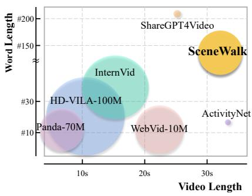
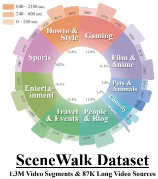
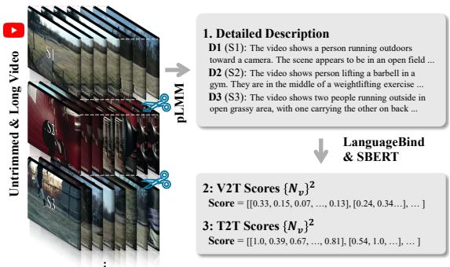
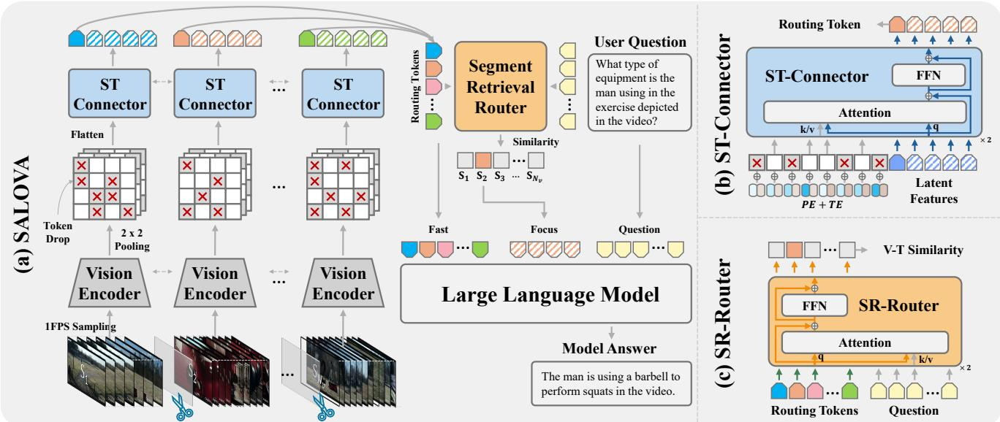
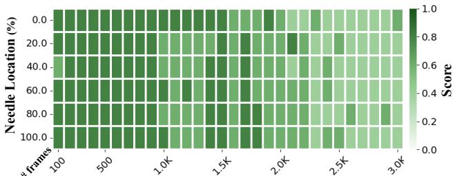
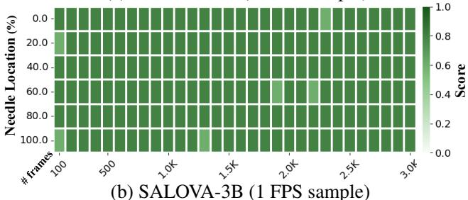

# SALOVA: Segment-Augmented Long Video Assistant for Targeted Retrieval and Routing in Long-Form Video Analysis

Junho Kim\* Hyunjun Kim\* Hosu Lee Yong Man Ro† Integrated Vision and Language Lab, KAIST, South Korea {arkimjh, kimhj709, leehosu01, ymro}@kaist.ac.kr

## Abstract

Despite advances in Large Multi-modal Models, applying them to long and untrimmed video content remains challenging due to limitations in context length and substantial memory overhead. These constraints often lead to significant information loss and reduced relevance in the model responses. With the exponential growth of video data across web platforms, understanding long-form video is crucial for advancing generalized intelligence. In this paper, we introduce SALOVA: Segment-Augmented LOng Video Assistant, a novel video-LLM framework designed to enhance the comprehension of lengthy video content through targeted retrieval process. We address two main challenges to achieve it: (i) We present the SceneWalk dataset, a high-quality collection of87.8K long videos, each densely captioned at the segment level to enable models to capture scene continuity and maintain rich descriptive context. (ii) We develop robust architectural designs integrating dynamic routing mechanism and spatio-temporal projector to efficiently retrieve and process relevant video segments based on user queries. Our framework mitigates the limitations ofcurrent video-LMMs by allowingfor precise identification and retrieval of relevant video segments in response to queries, thereby improving the contextual relevance of the generated responses. Through extensive experiments, SALOVA demonstrates enhanced capability in processing complex long-form videos, showing significant capability to maintain contextual integrity across extended sequences.

## 1. Introduction

Recent advancements in Large Language Models (LLMs) [22, 43, 44] have brought us one step closer to achieving Artificial General Intelligence (AGI). Next following step, the current trend is shifting toward modular systems that integrate various multi-modality, leveraging the exceptional generalization and reasoning capabilities of LLMs to evolve into Large Multi-modal Models (LMMs). Accordingly, users can unrestrictedly interact with the models across various modalities beyond text, expanding the scope of machine understanding and enhancing user engagement. Especially, considering the widespread adoption of long-form videos across various web platforms, the importance of understanding long, untrimmed video has become increasingly prominent in the multi-modal domain.

After the pioneer works [14, 37, 38] utilizing visual instruction tuning to augment vision perception into LLMs, remarkable strides [11, 17, 65] have been made in aligning cross-modal consistency—especially between vision and language domains. Albeit more recent models [29, 69] integrate various vision modalities all at once, current approaches still face significant challenges in understanding untrimmed and long-form video content. The main challenge is attributed to the limited context length of LMMs, which is an inherent structural limitation that restricts the models to process only a finite number of tokens as the input sequences. We can exemplify that LLaVA series [29, 30], when processing a video data, require 144 visual tokens per each frame, where numerical approximation is only maximum of ∼56 frames using 8K max context length LMMs, which is still limited to handle long sequence data.

Accordingly, current video-LMMs [12, 35, 39] rely on (i) sparse frame sampling to represent entire videos [26, 72], (ii) dense compression of visual tokens into a smaller size to manage the excessive number of frames [34, 41], and (iii) adaptive pooling strategies [59, 60] based on the Slow-Fast approach [19], all aimed at fitting the long video sequences within the limited context window of LMMs. Several studies focusing on the long video understanding task have presented memory-augmented generation [23, 53] utilizing an additional buffer to embed long-term information, or have extended the context using RoPE-based frequency extension during the training [70]. Despite of such endeavors, when handling massive video frames, previous works still confront restricted context size and significant memory overhead, which leads to substantial visual information loss. As critical events may be overlooked by the models, this hinders their ability to fully capture context changes in lengthy videos, resulting in inaccurate and irrelevant responses for the user queries.

Starting from the intuitive insight outlined below, in this paper, we propose a retrieval-driven approach for long video understanding with LLMs. Analogous to the recent Retriever-Augmented Generation (RAG) systems [28] (widely adopted in LLMs), which retrieve relevant information from external factual knowledge, humans naturally employ similar strategies when seeking specific information, efficiently locating and referring necessary materials to answer targeted questions—e.g., imagine that we are taking open-book exams or searching for a certain recipe in a cookbook. Given a long and untrimmed video, mirroring the targeted retrieval processes, we introduce a novel framework, Segment-Augmented LOng Video Assistant (SALOVA) to effectively handle the long sequence visual inputs by retrieving the relevant video segments.

To construct our video segments retrieval framework, central challenge hinges on establishing two main components: (i) Densely captioned video data, which consists of video-caption pairs with progressively-captioned descriptions that change throughout each video used to train the model to accurately identify relevant video segments. (ii) Dynamic routing mechanism, which selects pertinent video segments for the queries, followed by being connected to LLMs. To address that, our approach is outlined as follows.

Data. (§3) Recently several video-text paired datasets [4, 6, 8, 10, 56, 62] have been released, but they are inadequate for handling long and untrimmed video data, where only partial video moments are described with limited word length as compared in Fig. 1(a). To handle such insufficiency of detailed descriptions within the videos and the short durations of both videos and texts, we introduce the SceneWalk dataset, a new high-quality video dataset with thorough captioning for each video. It includes dense and detailed descriptions for every video segment across the entire scene context. The SceneWalk dataset, sourced from long and untrimmed 87.8K YouTube videos (avg. 486 seconds each), features frequent scene transitions across a total of 11.8K hrs video duration and 1.3M massively segmented video clips. Each video segment in the dataset is provided with a detailed description (avg. 137.5 word length), generated by combining pre-trained models [54, 73] and manual curation from human.

Architecture. (§4) Utilizing the constructed video dataset, SALOVA learns to identify relevant video segments for the given queries within each video source and then auto-regressively predicts the next token. To do so, we present two architectural designs to seamlessly incorporate the retrieved segments in an end-to-end training: Spatio-Temporal Connector and Segment Retrieval Router. By focusing on the relevant segments, our framework can perform deeper reasoning without being constrained by context length limitations. Additionally, we present FocusFast approach, which intensively analyzes the selected segments for detailed comprehension (focus pathway), while quickly accessing overall contextual information with routing tokens obtained from the entire video segments (fast pathway). The strategy ensures SALOVA to maintain comprehensive video understanding while prioritizing details where it is most needed, effectively enhancing long and untrimmed video interpretation.

Through extensive experiments and analyses, we corroborate that competitive performance of SALOVA to the existing video-LMM models in understanding complex longform videos. Also, our results show significant reductions in the loss of crucial visual information and a lower risk of omitting important events, demonstrating the effectiveness of our proposed method across various video benchmarks.

Our contribution can be summarized into three-fold:

• We introduce the SceneWalk dataset, a high-quality and densely-captioned video dataset with detailed segmentlevel descriptions from 87.8K long and untrimmed video sources. The proposed dataset provides rich context and scene continuity, enabling effective training for long-form video understanding.

• We propose Segment-Augmented LOng Video Assistant (SALOVA), a novel video-LMM framework designed to enhance long video comprehension by targeting relevant video segments in lengthy videos, optimizing the model’s focus on essential segment targets for the given queries.

• Through extensive evaluation, we validate that SALOVA improves overall long video understanding capabilities by effectively integrating relevant video segments, thus optimizing to handle long and untrimmed video content.

## 2. Related Work

## 2.1. Large Multi-modal Models

After the emergence of LLMs [5, 55], which can actively interact with users through back-and-forth conversations, as a next leap, various research efforts [2, 25, 31] integrate different modalities into the LLMs, utilizing their core reasoning and zero-shot capabilities. Building on the opensourced models [13, 55], seminal works [14, 38, 65] have bridged image and text modality under the visual instruction tuning and presented multi-modal assistant models that possess visual perception and QA capabilities. Since then, numerous research studies have been introduced to (i) enhance vision understanding with advanced architectures [17] or higher resolutions [30, 37], (ii) implement more sophisticated alignment layers [7, 42] between modalities, and (iii) train the models with more high-quality data and larger model parameters.

(a) Video-Text Dataset Comparison (b) SceneWalk Statistics  

  
(c) Overall Pipeline for Data Collection  
Figure 1: The overview of the SceneWalk dataset includes (a) dataset comparison, (b) detailed statistics, and (c) the annotation pipeline for description and score collection. Note that the scale of circles in Fig. 1(a) indicates the data size, and the color distribution in Fig. 1(b) denotes the video duration in each video category—brighter colors correspond to shorter video durations. Further details about the dataset are provided in Appendix A.

Recent focus has shifted towards more unified modal ity processing following the release of omnivorous models [46]. Some recent omni-versions of LMMs [29, 64] can handle combinatorial subsets from various modality sources, such as images, videos, audio, speech, and depth. However, the current LMMs for video [32, 35, 41] still lack of capturing the necessary details to effectively process video information due to their sparse frame sampling strategy. While such approach is seemingly adequate for relatively shorter videos, it may fail to capture comprehensive spatio-temporal information, potentially compromising the accuracy of model responses to user queries. In this paper, SALOVA first retrieves relevant video segments, then concentrates on more granular video cues. Such targeted focus allows the model to effectively understand complex analy sis within the videos, significantly improving its ability to provide contextual-aware and accurate responses.

## 2.2. Long Video Understanding

In parallel, we detailedly introduce video-specialized models [12, 23, 53] integrated with LLMs, which have also been widely explored these days to enhance video understanding and reasoning. Here, the most challenging part of current video-LMMs lies in handling long video sequences, mainly due to the limited context length of the LLMs. This limitation compels the models to sparsely sample the video frames in only limited sizes (e.g., typically 8 or 16 frames), potentially missing important spatial and temporal information. To address this, several studies have focused on compressing visual tokens into a more manageable size, proposing aggregation [34, 41] or pooling methods [35, 59] with advanced vision encoder structures [67, 73]. In addition, memory-augmented methods [23, 53] first stored long-term information in a memory bank, then responded to specific queries by loading memory features from the stored buffer.

On the other hand, among more recent approaches, Li et al. [70] have directly extended the LLMs’ context length by exploiting RoPE-based frequency interpolation, and Xue et al. [61] have introduced sequence parallelism that can be implemented on multiple GPUs by modifying backend systems. However, we argue that such approaches inherently cannot be free from the fixed context length and provoke intensive memory demands when processing more longer videos. Instead, by focusing on the relevant segments within the entire video, SALOVA can efficiently handle the limited context length, enabling targeted processing of key moments without the need for excessive memory, thereby enhancing performance on longer video sequences.

## 3. SceneWalk Dataset

In this section, we elaborate on how we collected the SceneWalk dataset. The overall pipeline for building the dataset and summarized statistics are illustrated in Fig. 1. While several video SFT datasets [32, 41] are widely used during the instruction tuning stage, they often fail to capture comprehensive details within the scenes. This stems from the nature of instruction-type questions, which provide only partial information, and the brief lengths of both videos and texts in QAs. In contrast, the SceneWalk dataset offers densely captioned video-text pairs that cover long sequence videos in full details, as shown in Fig. 1(a). For further detailed data statistics, please see Appendix A.

## 3.1. Data Gathering and Processing

Video Source & Filtering. For the long and untrimmed video sources, we primarily focus on three key aspects to build densely captioned video dataset: (i) extensive video length with diverse video source categories, (ii) high-quality video contents, (ii) frequent scene transitions within each video. Accordingly, our data collection is mainly sourced from YouTube, ensuring rich dynamic content that better reflects real-world complexities experienced by global users—here, because our main goal for video gathering is on complex scene understanding, we exclude low-quality and user-uploaded aesthetic videos (e.g., WebVid, Pixabay, Pexels, and etc,.) that are rather beneficial for video generation tasks, despite their merits for easy collection. We have collected YouTube urls from [27] and downloaded the whole video in untrimmed states. Among the total 32 coarse and diverse video categories YouTube API provided, we selectively curated 10 categories, excluding categories such as News & Politics, Classics, and Documentary, due to their static nature, which provides only sparse temporal information in the videos. We further supplemented the dataset with additional Movie & Drama videos sourced from [21, 53], totaling 87, 867 video sources with 11.87 Khrs video duration (avg. 486.5-seconds).

Segmenting Video into Clips. Next, for the collected long and untrimmed video sources, we cut the lengthy videos into small segments to densely caption the entire video in next phase. Instead of adopting the bottom-up approach used in the ShareGPT4Video dataset [8], which segments videos into fixed time intervals (2-seconds) in advance and then merges adjacent frames based on their CLIP similarity [48], we directly employed PysceneDetect 1 to segment the videos, dynamically adjusting the threshold based on the raw-level video information to reliably detect scene changes. At the end, the total number of 1.29M of video segments with 33.11-seconds average video length is extracted from the original video sources.

## 3.2. Captioning and Scoring

Dense Segment Captioning. After obtaining the massive video segments, our next goal is to caption each segment with visual details and narrative context to capture the scene-specific explanations, which can enrich scene-level interpretation. To achieve this, we plan to utilize pre-trained LMMs to generate detailed descriptions for the partial video segments. As the captioner, we empirically found that VILA-1.5 (13B) [36] shows competent descriptive quality than other open-sourced models, and used to generate dense captions for each video segment with randomly sampled instructions for detailed descriptions. As a result, we acquire 1.29M pairs of detailed descriptions corresponding to the video segments, each description with average 137.5 word length. Please see instruction details and qualitative examples of generated captions in Appendix A.

Scoring Video-Text Correspondence. Lastly, we score the correspondence between the video segments and the paired dense descriptions, which will later be used as explicit supervision to robustly train our retrieval framework. What we must not overlook here is that the paired video-text relationship is not solely a one-to-one correspondence but is more akin to generalized bipartite matching. That is, within the long and untrimmed video source, each video segment can be connected to other descriptions with additional edges. Therefore, for the $N _ { v }$ number of video segments and their paired segments, we can construct a $\{ N _ { v } \} ^ { 2 }$ correspondence matrix between video-text (V2T). To measure each correspondence, we employ LanguageBind [73] due to its competitive alignment capabilities across various modalities. In addition, we build another $\{ N _ { v } \} ^ { 2 }$ matrix to provide a doubly robust measure for the correspondence scores among adjacent descriptions (T2T) by comparing similarity within the textual context using the SBERT model [54].

## 4. Segment-Augmented LOng Video Assistant

Network Overview. For a given set of $N _ { v }$ video segments sampled at 1 FPS $v = \{ v _ { i } \} ^ { N _ { v } }$ , where each segments $v _ { i } \in \mathbb { R } ^ { T _ { i } \times \mathbf { \dot { H } } \times W \times C }$ has varying video length (summing up to the total time T of a long and untrimmed video), SA-LOVA consists of four main architecture components as illustrated in Fig. 2:

• Vision Encoder: We use CLIP [48] or SigLIP [67] to extract visual features, followed by 2x2 average pooling, resulting in 144 or 196 visual tokens per frame.

• Spatio-Temporal Connector: To handle spatio-temporal features of varying lengths from the vision encoder, we employ the Perceiver Resampler [2], which consists of 2-layer Transformer architecture followed by a 2-layer MLP with GELU activation as projector. This resampler embeds each video segment feature into fixed size latent features that are connected to LLMs.

• Segment Retrieval Router: For the given textual queries, a retrieval structure (2-layer Transformer) gathers representative information (i.e., routing tokens) from each video segment and then routes the query-relevant video features into the LLMs. Note that the router architecture is trained in an end-to-end manner.

• Large Language Model: For LM backbones, We utilize three open-sourced LLMs with varying parameter sizes, LLaMA-3.2 (3B) [18], Phi-3.5 (3.8B) [1] and Qwen-2.5 (7B) [63], all of which are instruction-tuned models that possess QA assistant capabilities.

## 4.1. Long Video Processing and Pipeline

## 4.1.1. Spatio-Temporal Connector

The first component of our model, Spatio-Temporal Connector, efficiently handles long and variable-length input video segments by extracting each segment’s visual semantics in a fixed-size latent vector. As illustrated in Fig. 2(b), we first sample video frames at 1 FPS from each video segment, then visual features are acquired with $2 \times 2$ pooling (thus, 196 tokens from each frame). After that, the visual features are flattened and fed into the ST-Connector with additional positional and temporal encoding. Here, when the long video is processed, the number of unfolded patch tokens becomes extremely large, leading to exhaustive computations. To address this, we employ a dynamic token drop technique to reduce computational load.

  
Figure 2: The network overview of SALOVA. Our framework consists of four structural components: vision encoder, ST connector, SR-router, and LLMs. Using the FocusFast strategy, our model can concentrate on more detailed local information while maintaining context awareness.

Dynamic Token Drop. To effectively manage long video sequences, the token drop has been utilized in video generation tasks [16, 40]. Expanding such approach, in our framework, the dropout rate is dynamically adjusted based on the length of the input sequence $T _ { i }$ in the input visual feature $f _ { v } \sim T _ { i } \times H _ { p } W _ { p } \times d ,$ which allows for more efficient processing of longer sequences by reducing computational demands, while still preserving dense visual semantics in shorter videos. Additionally, to retain spatio-temporal information from the dropped patches, we add positional embeddings separately along the spatial and temporal axes. This enables more refined extraction of spatio-temporal visual semantics even after reducing the number of tokens.

## 4.1.2. Segment Retrieval Router

Next, the key to conveying the pertinent video information to LLMs is retrieving relevant video segments by querying sentence. To densely cue the similarities between the video and sentence information, we introduce a routing framework, Segment Retrieval Router, which consists of $2 \AA ^ { - }$ layer Transformer as illustrated in Fig. 2(c). After obtaining the routing tokens $R { = } \{ R _ { i } \} ^ { N _ { v } } \ \in \mathbb { R } ^ { N _ { v } \times D }$ from entire video segments, we aggregate them and feed into the SR-Router as queries. For the given sentence, we employ the same text encoder used for the vision encoder and project it into the shared embedding space to obtain sentence features $S \in \mathbb { R } ^ { N _ { t } \times D }$ , where $N _ { t }$ indicates textual length.

Using the cross attention mechanism (q: $R ; \operatorname { k } / \operatorname { v } ; S )$ , we can estimate similarity scores between the video segments and given sentence queries $( i . e .$ , V-T similarity). The scores enable the SR-Router to prioritize and select the most relevant video segments that align with the sentence query.

Retrieval Objective. To seamlessly train the SR-Router with the mainstream flows of SALOVA in an end-to-end manner, we have designed a similarity loss function $\mathcal { L } _ { \mathrm { s i m } }$ that minimizes the distance between the high-dimensional embeddings of the video segments and sentence queries. Here, we use the correspondence scores (aforementioned in Sec. 3.2) as a retrieval supervision signal yi, after applying one-hot encoding. We incorporate a simple margin-based loss, commonly used in contrastive learning settings [33], which enables the model to learn off-diagonal relaxation in the correspondence matrices between video segments and sentences. As mentioned earlier, the relationship between paired videos and sentences is closer to generalized bipartite matching than to one-to-one matching, so relaxation learning helps to accommodate the inherent complexity in aligning correspondence. In conclusion, with the binary crossentropy loss and the score margin loss, we can formulate the similarity loss as follows:

$$
\begin{array} { r } { \mathbb { L } _ { \mathrm { s i m } } = \underbrace { \mathcal { L } _ { \mathrm { b c e } } ( y _ { i } , s _ { i } ) _ { i = 1 } ^ { N _ { v } } } _ { \mathrm { p o i n t - w i s e } \mathrm { C E } } + \underbrace { \frac { 1 } { N _ { s } } \sum _ { j } \operatorname* { m a x } \left( 0 , \delta - ( s _ { j } ^ { p } - s _ { j } ^ { n } ) \right) } _ { \mathrm { s c o r e ~ m a r g i n ~ l o s s } } , } \end{array}\tag{1}
$$

where $s _ { j } ^ { p }$ and $s _ { j } ^ { n }$ indicate randomly sampled scores from positive and negative pairs, respectively, and δ denotes the margin parameter (set as 0.2). Note that the similarity loss is trained in conjunction with the auto-regressive loss $\mathcal { L } _ { \mathrm { a r } }$ from subsequent LLMs in an end-to-end manner.

## 4.1.3. FocusFast Pathways: Integration to LLMs

Using the routing tokens, we can calculate the similarities of each video segment for the given query. Leveraging the similarities, SALOVA efficiently retrieves the specific video features that exhibit the highest relevance score to the textual query, where the indexed video features are then directly integrated into the LLM architecture. Here, extending the SlowFast pathways concept [19], we present the Focus-Fast mechanism to effectively manage the processing pathway for the retrieved video segments: (i) Focus pathway concatenates the top-K most pertinent features to construct a comprehensive video representation, capturing local details across retrieved segments and enabling detailed interactions with textual queries to enhance handling complex video information. (ii) Fast pathway focuses on the more broader-level context by employing segment-wide routing tokens as the condensed global representation. It effectively contains dynamic spatio-temporal changes throughout the video stream, thereby allowing SALOVA to understand the overall video content and scene-level continuity awareness.

Once the most pertinent features are retrieved, they are delivered to the LM backbone for the final processing as in Fig. 2(a), integrating video-specific details into the models’ responses. By effectively handling long and untrimmed videos with the proposed retrieval and routing mechanism, SALOVA can maintain the flow of salient information without the processing overhead for less related data, thus generating more context-aware responses.

## 4.2. Training Strategies

The current training strategies for LMMs predominantly consist of two-step training: (i) cross-modal alignment and (ii) visual instruction tuning. Recently, Li et al. [29] have emphasized the importance of high-quality knowledge learning between the two training stages (thus stage 1.5), pointing out that the models cannot enoughly learn necessary knowledge during the alignment with the lowqualitative web-scale image-text data. As the similar approach of using rephrased descriptions for additional knowledge learning [29], we employ the newly collected SceneWalk dataset as the parametric knowledge injection step, which enables the SALOVA to learn detailed spatial and temporal representation from the long sequence video data before the instruction tuning. Accordingly, our training recipes and data configuration can be divided into three steps as follow (Please see training details in Appendix B):

Stage 1: Cross-modality Alignment. For the initial step in modality alignment, we utilize 790K image/video-text paired dataset: (i) 558K image-text pairs from the CC3M dataset [52], filtered by LLaVA [38] and (ii) video-text pairs sampled from the WebVid 2.5M subset [4]. We freeze vision encoder and LLMs during the training, and mainly focus on optimizing the connector and router to map the visual information into the textual space.

Stage 1.5: Long Video Knowledge Injection. As an intermediate training step, we use the SceneWalk dataset to train the SALOVA, unfreezing all trainable parameters except for the vision encoder. During training, we input the long and untrimmed video instances and follow the processing pipeline shown in Fig. 2. By training the model with densely captioned video-description pairs, it acquires high-quality parametric knowledge of both spatial and temporal information. In addition, through the aforementioned retrieval process, the model learns to target video segments that are mostly relevant to the video description.

Stage 2: Video Instruction Tuning. To possess QA capabilities in SALOVA, we use extensive video instructiontuning data as the final training step. The instruction data are mainly sourced from four different datasets: LLaVA-Video-178K [71], NeXT-QA [58], ActivityNetQA [66], and PerceptionTest [47]—comprising a total of 1.4M videoinstruction QA data, including caption entries, open-ended QA, and multiple-choice QA. Note that we train all the network parameters during this stage and auto-regressively update the instruction-following assistant’s response for the next word prediction.

## 5. Experiments

## 5.1. Experimental Details

Implementation. For the vision and text encoders of the SR-Router, we utilize CLIP [48] for the small-size models and SigLIP [67] for the frontier model, with resolution sizes of 336 and 384, respectively. We employ a 2-layer transformer with a head size of 2 for the ST-Connector, which has a latent dimension of 256. The token drop mechanism is dynamically applied based on video length, with varying maximum drop rates at each training stage—Stage 1 has no token drop, Stage 1.5 allows up to 0.7, and Stage 2 allows up to 0.4 For the configuration of SR-Router, we set 2-layer of transformers with a single head, and top-K number is set to 5 during the stage 2. Following the recent works [30, 37], the projector layer consists of 2-layer MLP with GELU. We employ three LLMs: (i) 3B: Llama-3.2-3B [18], (ii) 3.8B: Phi-3.5 [1], and (iii) 7B: Qwen2.5-7B [63].

Training Details. For the each training stage, we train SA-LOVA for 1 epoch with 1 node of 8 A100 GPUs. The total training hours for 3B (3.8B) and 7B models roughly take 5 and 7 days, respectively. We employ FlashAttention-2 [15], gradient checkpointing [9], and ZeRO-2 [49] to minimize the memory footprint associated with model components (i.e., gradient, activation, and optimizer states). Additionally, we fine-tune the trainable parameters at each step without employing LoRA [24]. For the extended training config, we have attached the details in Appendix C.

<table><tr><td rowspan="2">Model</td><td rowspan="2">#param</td><td colspan="4">Video-MME</td><td rowspan="2">LVBench</td></tr><tr><td>Short</td><td>Medium</td><td>Long</td><td>Overall</td></tr><tr><td>Proprietary LMMs</td><td></td><td></td><td></td><td></td><td></td><td>Acc. (val)</td></tr><tr><td>GPT-4V [45]</td><td>n/a</td><td>70.5</td><td>55.8</td><td>53.5</td><td>59.9</td><td></td></tr><tr><td>GPT-4o [46]</td><td>n/a</td><td>80.0</td><td>70.3</td><td>65.3</td><td>71.9</td><td>66.7</td></tr><tr><td>Gemini 1.5 Pro [50]</td><td>n/a</td><td>81.7</td><td>74.3</td><td>67.4</td><td>75.0</td><td>64.0</td></tr><tr><td>Open-sourced LMMs</td><td></td><td></td><td></td><td></td><td></td><td></td></tr><tr><td>ST-LLM [39]</td><td>7B</td><td>45.7</td><td>36.8</td><td>31.3</td><td>37.9</td><td></td></tr><tr><td>VideoChat2 [32]</td><td>7B</td><td>48.3</td><td>37.0</td><td>33.2</td><td>39.5</td><td>39.3</td></tr><tr><td>ShareGPT4Video [8]</td><td>8B</td><td>48.3</td><td>36.3</td><td>35.0</td><td>39.9</td><td>39.7</td></tr><tr><td>Video-LLaVA [35]</td><td>7B</td><td>45.3</td><td>38.0</td><td>36.2</td><td>39.9</td><td>39.1</td></tr><tr><td>Chat-UniVi-V1.5 [26]</td><td>7B</td><td>45.7</td><td>40.3</td><td>35.8</td><td>40.6</td><td></td></tr><tr><td>Qwen-VL-Chat [3]</td><td>7B</td><td>46.9</td><td>38.7</td><td>37.8</td><td>41.1</td><td></td></tr><tr><td>ShareGemini [51]</td><td>7B</td><td>49.1</td><td>41.3</td><td>39.1</td><td>43.2</td><td></td></tr><tr><td>SliME [72]</td><td>8B</td><td>53.3</td><td>42.7</td><td>39.8</td><td>45.3</td><td></td></tr><tr><td>PLLaVA [59]</td><td>7B</td><td></td><td></td><td></td><td></td><td>40.2</td></tr><tr><td>VideoLLaMA2 [12]</td><td>8B</td><td>56.0</td><td>45.4</td><td>42.1</td><td>47.9</td><td></td></tr><tr><td>LongVA [70]</td><td>7B</td><td>61.1</td><td>50.4</td><td>46.2</td><td>52.6</td><td>1</td></tr><tr><td>Ours</td><td></td><td></td><td></td><td></td><td></td><td></td></tr><tr><td>SALOVA-3B</td><td>3B</td><td>48.3</td><td>46.3</td><td>41.1</td><td>45.3</td><td>41.4</td></tr><tr><td>SALOVA-3.8B</td><td>3.8B</td><td>47.1</td><td>48.8</td><td>44.1</td><td>46.7</td><td>41.6</td></tr><tr><td>SALOVA-7B</td><td>7B</td><td>59.4</td><td>50.4</td><td>49.4</td><td>53.1</td><td>44.6</td></tr></table>

Table 1: Detailed results for the Video-MME benchmark (w/o subtitles) and LongVideoBench. The best results are highlighted in bold and the runner-up results are underlined.

Evaluation Benchmarks. We evaluate our model using two types of video analysis benchmarks—long video understanding and general video understanding, categorized based on the video length. For the long video benchmark, we primarily utilize Video-MME [20] and LongVideoBench [57], both of benchmarks includes videos up to two hours long duration. As the general video analysis evaluations, we employ various benchmarks such as ActivityNetQA [66], VideoChatGPT [41], and MVBench [32]. Note that the same pipeline is used to obtain video segments for each benchmark, and all benchmarks are sampled at 1 FPS without token drop during inference. As comparison baselines, considering academic budget constraints, we evaluate against models that have similar parameter size.

## 5.2. Experimental Results

Results on Long Video Understanding. Video-MME [20] evaluates LMMs with a focus on video analysis across a variety of video types and durations. We primarily compare the benchmark results in settings without subtitles, relying solely on video frames. Therefore it can assess the LMMs visual comprehension capabilities rigorously, based purely on visual content. Also, LongVideoBench [57] is designed to assess LMMs’ understanding of long-duration videos up to two hours. It includes a diverse collection of videos, challenging the models’ ability to process and interpret extensive visual and contextual information across a variety of themes. As shown in Tab. 1, our model shows competent video understanding performance across all video length distributions in Video-MME and lengthy video instances in LongVideoBench. Notably, we highlight that SALOVA achieved significant performance in the medium (average 562.7 seconds) and long (average 2385.8 seconds) length categories in Video-MME benchmark, even with more smaller size of backbone LM parameters compared with the baseline models.

<table><tr><td rowspan="3">Model</td><td rowspan="3">#param</td><td colspan="2">ActivityNetQA</td><td>VideoChatGPT</td><td>MVBench</td></tr><tr><td colspan="2">test (acc/score)</td><td>test (acc)</td><td>test (acc)</td></tr><tr><td colspan="2"></td></tr><tr><td>Proprietary LMMs</td><td>n/a</td><td></td></tr><tr><td>GPT-4V [45]</td><td>57.0</td><td>- -</td><td>4.06</td><td>43.5</td></tr><tr><td>GPT-4o [46]</td><td>n/a n/a</td><td>61.9 57.5</td><td></td><td></td></tr><tr><td>Gemini 1.5 Pro [50]</td><td></td><td>-</td><td>-</td><td>-</td></tr><tr><td colspan="5">Open-sourced LMMs</td></tr><tr><td>VideoLLaMA [68]</td><td>7B</td><td>12.4</td><td>1.1</td><td>2.16</td></tr><tr><td>VideoChatGPT [41]</td><td>7B</td><td>35.2</td><td>2.7 2.42</td><td>32.7</td></tr><tr><td>MovieChat [53]</td><td>7B</td><td>45.7</td><td>2.67</td><td></td></tr><tr><td>Chat-UniVi [26]</td><td>7B</td><td>46.1</td><td>3.2 2.99 2.89</td><td></td></tr><tr><td>LLaMA-VID [34]</td><td>7B</td><td>47.4</td><td>3.3</td><td>41.3</td></tr><tr><td>VideoChat2 [32]</td><td>7B</td><td>49.1</td><td>3.3 2.98</td><td>51.1</td></tr><tr><td>VideoLLaMA2 [12]</td><td>8B</td><td>50.2</td><td>3.3 3.13</td><td>54.6</td></tr><tr><td colspan="5">Ours</td></tr><tr><td>SALOVA-3B</td><td>3B</td><td>52.6</td><td>3.4</td><td>3.08 51.7</td></tr><tr><td>SALOVA-3.8B</td><td>3.8B</td><td>51.1</td><td>3.5 2.83</td><td>46.4</td></tr><tr><td>SALOVA-7B</td><td>7B</td><td>53.6</td><td>3.5 3.13</td><td>53.5</td></tr></table>

Table 2: Comparison results for generic video understanding benchmarks. The best results are highlighted in bold and the runner-up results are underlined.

Such performance gains in long video instances are attributed to our model’s dynamic capability to retrieve and process only the relevant video segments, enabling it to handle lengthy video content efficiently without being constrained by the limited context length. Especially, the routing mechanism in SALOVA strategically prioritizes video segments that are likely to contain crucial visual and contextual cues relevant to the query. This selective routing mechanism reduces the computational load and minimizes the information loss that commonly occurs in current video-LMMs trying to process extensive video data in entirety.

Results on General Video Understanding. For general video understanding benchmarks such as ActivityNetQA [66], VideoChatGPT [41], and MVBench [32], SALOVA was evaluated across various video types to assess its general video understanding capabilities. As shown in Tab. 2, SALOVA demonstrated competent performance, comparable to existing video-LMMs, especially in dynamic and shorter video sequences. On ActivityNetQA, the model effectively utilized its segment retrieval strategy to provide focused and contextually appropriate responses, which helped maintain accuracy. This approach was similarly effective in the multi-modal settings of VideoChatGPT and MVBench, where SALOVA showed consistent performance in handling dialogues and visual cues. These outcomes highlight SALOVA’s capability to process general video content efficiently through its dynamic routing mechanism, offering a reliable solution that balances computational resources with output quality.

<table><tr><td rowspan="2">Ablation</td><td colspan="4">Video-MME</td></tr><tr><td>Short: ≤2m</td><td>Mid: 4-15m</td><td>Long: 30-60m</td><td>Overall</td></tr><tr><td>frm sample</td><td colspan="4">: Frame sampling rate (w/o SR-Router)</td></tr><tr><td>8 frm</td><td>48.3</td><td>42.0</td><td>37.2</td><td>42.5</td></tr><tr><td>16 frm</td><td>50.0</td><td>42.8</td><td>38.0</td><td>43.6</td></tr><tr><td>1 FPS</td><td>48.3</td><td>46.3</td><td>41.1</td><td>45.3</td></tr><tr><td>1/ 1.5 /2</td><td colspan="4">: Train stage - Long video knowledge injection</td></tr><tr><td>√x√</td><td>45.6</td><td>43.7</td><td>40.2</td><td>43.6</td></tr><tr><td>VV√</td><td>48.3</td><td>46.3</td><td>41.1</td><td>45.3</td></tr><tr><td>FocusFast</td><td colspan="4">: Local-global video representation</td></tr><tr><td>x</td><td>36.4</td><td>38.6</td><td>35.6</td><td>36.9</td></tr><tr><td>√</td><td>48.3</td><td>46.3</td><td>41.1</td><td>45.3</td></tr></table>

Table 3: Ablation studies on SALOVA configuration. We utilize SALOVA-3B for the resource efficiency.

## 5.3. Additional Analyses on SALOVA

Ablation Study. We conduct ablation studies on three components as follows: (i) different video frame sampling strategies, (ii) intermediate training stage for long video knowledge injection, and (iii) the FocusFast mechanism to understand branched local-global representation in videos.

As in Table 3, We first observe that using more frames with SR-Router significantly enhances performance, particularly in long-form videos. This aligns with our key contributions on managing long videos through an effective routing mechanism, suggesting that retrieving more frames can provide richer spatio-temporal information and improve the model’s responses without losing contextual coherence. Additionally, we compare with a baseline trained with stage 1-2 (skipping stage 1.5). Here, we highlight the effectiveness of the SceneWalk dataset as an intermediate training step to enhance parametric knowledge for the long video analysis by allowing the model to learn from high-quality and densely captioned scene-level information, which is crucial for adapting to various lengths and contexts. Lastly, we conduct an analysis on the FocusFast method and demonstrate its efficacy in analyzing not only local details from relevant video segments but also in understanding the global video context through the simultaneous use of routing tokens, thereby facilitating a more comprehensive understanding of video content.

Analysis of Retrieving Segments. By retrieving relevant video segments for the given queries, SALOVA can effectively target salient information in the long video and retain long context information. To further demonstrate the model’s targeting capabilities beyond numerical performance in long video analysis, we explore our model’s application in the Visual Needle-In-A-Haystack (V-NIAH) task [70], which extends the Needle-in-a-Haystack (NIAH) evaluation for LLMs to a vision-level benchmark. This task is particularly challenging as it requires models to not only detect but also precisely retrieve the sparse yet crucial visual cues scattered across lengthy videos.

As in Fig. 3, we compare SALOVA against a baseline trained on sparsely sampled frames (16 frm w/o SR-Router). Our framework effectively identifies and extracts relevant video segments from densely packed content, even when handling long context lengths. These results highlight SALOVA’s robustness in managing complex, longform videos, maintaining contextual continuity by strategically focusing on relevant segments to user queries.

  
(a) SALOVA-3B (16 frm sample)

  
Figure 3: Comparison results of V-NIAH. The x/y-axis indicates the total video frames and the location of needle image within the video, respectively.

## 6. Discussion and Conclusion

Discussion. Despite SALOVA’s competence in handling extended video sequences, it is important to recognize scenarios where its complex architecture may not be necessary. Specifically, for shorter videos where sparse sampling suffices to capture essential spatio-temporal information, simpler models could potentially outperform the efficiency of SALOVA without necessitating its extensive processing capabilities. This suggests a future avenue for integrating a hybrid approach based on our framework by dynamically adjusting the complexity of the retrieval and processing mechanisms based on the video length and content density.

Conclusion. In this paper, we introduce SALOVA, a novel framework designed to enhance the comprehension of long and untrimmed video by leveraging a retrievaldriven approach with new densely captioned dataset, the SceneWalk dataset. SALOVA strategically targets and processes only the relevant video segments, effectively addressing the structural limitations of current Video-LMMs with its Spatio-Temporal Connector and Segment Retrieval Router. Through extensive evaluation on various benchmarks, SALOVA exhibits its robust performance in interpreting complex video content, enhancing efficiency, and improving the understanding of extended videos.

## Acknowledgments

This work was partially supported by two funds: IITP grant funded by the Korea government (MSIT) (RS-2022- II220984) and IITP grant funded by the Korea government (MSIT) (No.2020-0-00004, Development of Previsional Intelligence based on Long-Term Visual Memory Network)

## References

[1] Marah Abdin, Jyoti Aneja, Hany Awadalla, Ahmed Awadallah, Ammar Ahmad Awan, Nguyen Bach, Amit Bahree, Arash Bakhtiari, Jianmin Bao, Harkirat Behl, et al. Phi-3 technical report: A highly capable language model locally on your phone. arXiv preprint arXiv:2404.14219, 2024. 4, 6

[2] Jean-Baptiste Alayrac, Jeff Donahue, Pauline Luc, Antoine Miech, Iain Barr, Yana Hasson, Karel Lenc, Arthur Mensch, Katherine Millican, Malcolm Reynolds, et al. Flamingo: a visual language model for few-shot learning. Advances in Neural Information Processing Systems, 35:23716–23736, 2022. 2, 4, 3

[3] Jinze Bai, Shuai Bai, Shusheng Yang, Shijie Wang, Sinan Tan, Peng Wang, Junyang Lin, Chang Zhou, and Jingren Zhou. Qwen-vl: A versatile vision-language model for understanding, localization, text reading, and beyond. arXiv preprint arXiv:2308.12966, 1(2):3, 2023. 7

[4] Max Bain, Arsha Nagrani, Gul Varol, and Andrew Zisser-¨ man. Frozen in time: A joint video and image encoder for end-to-end retrieval. In Proceedings of the IEEE/CVF international conference on computer vision, pages 1728–1738, 2021. 2, 6

[5] Tom Brown, Benjamin Mann, Nick Ryder, Melanie Subbiah, Jared D Kaplan, Prafulla Dhariwal, Arvind Neelakantan, Pranav Shyam, Girish Sastry, Amanda Askell, et al. Language models are few-shot learners. Advances in neural information processing systems, 33:1877–1901, 2020. 2

[6] Fabian Caba Heilbron, Victor Escorcia, Bernard Ghanem, and Juan Carlos Niebles. Activitynet: A large-scale video benchmark for human activity understanding. In Proceedings of the ieee conference on computer vision and pattern recognition, pages 961–970, 2015. 2

[7] Junbum Cha, Wooyoung Kang, Jonghwan Mun, and Byungseok Roh. Honeybee: Locality-enhanced projector for multimodal llm. arXiv preprint arXiv:2312.06742, 2023. 2

[8] Lin Chen, Xilin Wei, Jinsong Li, Xiaoyi Dong, Pan Zhang, Yuhang Zang, Zehui Chen, Haodong Duan, Bin Lin, Zhenyu Tang, et al. Sharegpt4video: Improving video understanding and generation with better captions. arXiv preprint arXiv:2406.04325, 2024. 2, 4, 7, 3

[9] Tianqi Chen, Bing Xu, Chiyuan Zhang, and Carlos Guestrin. Training deep nets with sublinear memory cost. arXiv preprint arXiv:1604.06174, 2016. 6

[10] Tsai-Shien Chen, Aliaksandr Siarohin, Willi Menapace, Ekaterina Deyneka, Hsiang-wei Chao, Byung Eun Jeon, Yuwei Fang, Hsin-Ying Lee, Jian Ren, Ming-Hsuan Yang, et al. Panda-70m: Captioning 70m videos with multiple cross-modality teachers. In Proceedings of the IEEE/CVF

Conference on Computer Vision and Pattern Recognition, pages 13320–13331, 2024. 2

[11] Zhe Chen, Jiannan Wu, Wenhai Wang, Weijie Su, Guo Chen, Sen Xing, Zhong Muyan, Qinglong Zhang, Xizhou Zhu, Lewei Lu, et al. Internvl: Scaling up vision foundation mod els and aligning for generic visual-linguistic tasks. arXiv preprint arXiv:2312.14238, 2023. 1

[12] Zesen Cheng, Sicong Leng, Hang Zhang, Yifei Xin, Xin Li, Guanzheng Chen, Yongxin Zhu, Wenqi Zhang, Ziyang Luo, Deli Zhao, et al. Videollama 2: Advancing spatialtemporal modeling and audio understanding in video-llms. arXiv preprint arXiv:2406.07476, 2024. 1, 3, 7

[13] Wei-Lin Chiang, Zhuohan Li, Zi Lin, Ying Sheng, Zhanghao Wu, Hao Zhang, Lianmin Zheng, Siyuan Zhuang, Yonghao Zhuang, Joseph E. Gonzalez, Ion Stoica, and Eric P. Xing. Vicuna: An open-source chatbot impressing gpt-4 with 90%\* chatgpt quality, 2023. 2

[14] Wenliang Dai, Junnan Li, Dongxu Li, Anthony Tiong, Junqi Zhao, Weisheng Wang, Boyang Li, Pascale Fung, and Steven Hoi. InstructBLIP: Towards general-purpose visionlanguage models with instruction tuning. In Advances in Neural Information Processing Systems, 2023. 1, 2

[15] Tri Dao. Flashattention-2: Faster attention with better parallelism and work partitioning. arXiv preprint arXiv:2307.08691, 2023. 6

[16] Mostafa Dehghani, Basil Mustafa, Josip Djolonga, Jonathan Heek, Matthias Minderer, Mathilde Caron, Andreas Steiner, Joan Puigcerver, Robert Geirhos, Ibrahim M Alabdulmohsin, et al. Patch n’pack: Navit, a vision transformer for any aspect ratio and resolution. Advances in Neural Information Processing Systems, 36, 2024. 5

[17] Xiaoyi Dong, Pan Zhang, Yuhang Zang, Yuhang Cao, Bin Wang, Linke Ouyang, Xilin Wei, Songyang Zhang, Haodong Duan, Maosong Cao, et al. Internlm-xcomposer2: Mastering free-form text-image composition and comprehension in vision-language large model. arXiv preprint arXiv:2401.16420, 2024. 1, 2

[18] Abhimanyu Dubey, Abhinav Jauhri, Abhinav Pandey, Abhishek Kadian, Ahmad Al-Dahle, Aiesha Letman, Akhil Mathur, Alan Schelten, Amy Yang, Angela Fan, et al. The llama 3 herd of models. arXiv preprint arXiv:2407.21783, 2024. 4, 6

[19] Christoph Feichtenhofer, Haoqi Fan, Jitendra Malik, and Kaiming He. Slowfast networks for video recognition. In Proceedings of the IEEE/CVF international conference on computer vision, pages 6202–6211, 2019. 1, 6

[20] Chaoyou Fu, Yuhan Dai, Yongdong Luo, Lei Li, Shuhuai Ren, Renrui Zhang, Zihan Wang, Chenyu Zhou, Yunhang Shen, Mengdan Zhang, et al. Video-mme: The first-ever comprehensive evaluation benchmark of multi-modal llms in video analysis. arXiv preprint arXiv:2405.21075, 2024. 7, 6

[21] Ridouane Ghermi, Xi Wang, Vicky Kalogeiton, and Ivan Laptev. Short film dataset (sfd): A benchmark for storylevel video understanding. arXiv preprint arXiv:2406.10221, 2024. 4, 1

[22] Google. Gemini, 2023. 1

[23] Bo He, Hengduo Li, Young Kyun Jang, Menglin Jia, Xuefei Cao, Ashish Shah, Abhinav Shrivastava, and Ser-Nam

Lim. Ma-lmm: Memory-augmented large multimodal model for long-term video understanding. In Proceedings of the IEEE/CVF Conference on Computer Vision and Pattern Recognition, pages 13504–13514, 2024. 1, 3

[24] Edward J Hu, Yelong Shen, Phillip Wallis, Zeyuan Allen-Zhu, Yuanzhi Li, Shean Wang, Lu Wang, and Weizhu Chen. Lora: Low-rank adaptation of large language models. arXiv preprint arXiv:2106.09685, 2021. 7

[25] Shaohan Huang, Li Dong, Wenhui Wang, Yaru Hao, Saksham Singhal, Shuming Ma, Tengchao Lv, Lei Cui, Owais Khan Mohammed, Barun Patra, et al. Language is not all you need: Aligning perception with language models. Advances in Neural Information Processing Systems, 36, 2024. 2

[26] Peng Jin, Ryuichi Takanobu, Wancai Zhang, Xiaochun Cao, and Li Yuan. Chat-univi: Unified visual representation empowers large language models with image and video understanding. In Proceedings of the IEEE/CVF Conference on Computer Vision and Pattern Recognition, pages 13700– 13710, 2024. 1, 7

[27] Xuan Ju, Yiming Gao, Zhaoyang Zhang, Ziyang Yuan, Xintao Wang, Ailing Zeng, Yu Xiong, Qiang Xu, and Ying Shan. Miradata: A large-scale video dataset with long durations and structured captions. arXiv preprint arXiv:2407.06358, 2024. 4

[28] Patrick Lewis, Ethan Perez, Aleksandra Piktus, Fabio Petroni, Vladimir Karpukhin, Naman Goyal, Heinrich Kuttler, Mike Lewis, Wen-tau Yih, Tim Rockt¨ aschel, et al.¨ Retrieval-augmented generation for knowledge-intensive nlp tasks. Advances in Neural Information Processing Systems, 33:9459–9474, 2020. 2

[29] Bo Li, Yuanhan Zhang, Dong Guo, Renrui Zhang, Feng Li, Hao Zhang, Kaichen Zhang, Yanwei Li, Ziwei Liu, and Chunyuan Li. Llava-onevision: Easy visual task transfer. arXiv preprint arXiv:2408.03326, 2024. 1, 3, 6

[30] Feng Li, Renrui Zhang, Hao Zhang, Yuanhan Zhang, Bo Li, Wei Li, Zejun Ma, and Chunyuan Li. Llava-next-interleave: Tackling multi-image, video, and 3d in large multimodal models. arXiv preprint arXiv:2407.07895, 2024. 1, 2, 6

[31] Junnan Li, Dongxu Li, Silvio Savarese, and Steven Hoi. Blip-2: Bootstrapping language-image pre-training with frozen image encoders and large language models. In International Conference on Machine Learning. PMLR, 2023. 2

[32] Kunchang Li, Yali Wang, Yinan He, Yizhuo Li, Yi Wang, Yi Liu, Zun Wang, Jilan Xu, Guo Chen, Ping Luo, et al. Mvbench: A comprehensive multi-modal video understanding benchmark. In Proceedings ofthe IEEE/CVF Conference on Computer Vision and Pattern Recognition, pages 22195– 22206, 2024. 3, 7

[33] Pandeng Li, Chen-Wei Xie, Hongtao Xie, Liming Zhao, Lei Zhang, Yun Zheng, Deli Zhao, and Yongdong Zhang. Momentdiff: Generative video moment retrieval from random to real. Advances in neural information processing systems, 36, 2024. 5

[34] Yanwei Li, Chengyao Wang, and Jiaya Jia. Llama-vid: An image is worth 2 tokens in large language models. In

European Conference on Computer Vision, pages 323–340. Springer, 2025. 1, 3, 7

[35] Bin Lin, Yang Ye, Bin Zhu, Jiaxi Cui, Munan Ning, Peng Jin, and Li Yuan. Video-llava: Learning united visual rep resentation by alignment before projection. arXiv preprint arXiv:2311.10122, 2023. 1, 3, 7

[36] Ji Lin, Hongxu Yin, Wei Ping, Pavlo Molchanov, Mohammad Shoeybi, and Song Han. Vila: On pre-training for visual language models. In Proceedings ofthe IEEE/CVF Con ference on Computer Vision and Pattern Recognition, pages 26689–26699, 2024. 4, 1

[37] Haotian Liu, Chunyuan Li, Yuheng Li, and Yong Jae Lee. Improved baselines with visual instruction tuning. arXiv preprint arXiv:2310.03744, 2023. 1, 2, 6, 3

[38] Haotian Liu, Chunyuan Li, Qingyang Wu, and Yong Jae Lee. Visual instruction tuning. In Advances in Neural Information Processing Systems, 2023. 1, 2, 6

[39] Ruyang Liu, Chen Li, Haoran Tang, Yixiao Ge, Ying Shan, and Ge Li. St-llm: Large language models are effective temporal learners. In European Conference on Computer Vision, pages 1–18. Springer, 2025. 1, 7

[40] Yixin Liu, Kai Zhang, Yuan Li, Zhiling Yan, Chujie Gao, Ruoxi Chen, Zhengqing Yuan, Yue Huang, Hanchi Sun, Jianfeng Gao, et al. Sora: A review on background, technology, limitations, and opportunities of large vision models. arXiv preprint arXiv:2402.17177, 2024. 5

[41] Muhammad Maaz, Hanoona Rasheed, Salman Khan, and Fahad Shahbaz Khan. Video-chatgpt: Towards detailed video understanding via large vision and language models. arXiv preprint arXiv:2306.05424, 2023. 1, 3, 7

[42] Brandon McKinzie, Zhe Gan, Jean-Philippe Fauconnier, Sam Dodge, Bowen Zhang, Philipp Dufter, Dhruti Shah, Xianzhi Du, Futang Peng, Floris Weers, et al. Mm1: Methods, analysis & insights from multimodal llm pre-training. arXiv preprint arXiv:2403.09611, 2024. 2

[43] OpenAI. ChatGPT. https://openai.com/blog/ chatgpt/, 2023. 1

[44] OpenAI. Gpt-4 technical report, 2023. 1, 3

[45] OpenAI. GPT-4V(ision) System Card, 2023. 7

[46] OpenAI. Hello gpt-4o, 2024. 3, 7

[47] Viorica Patraucean, Lucas Smaira, Ankush Gupta, Adria Recasens, Larisa Markeeva, Dylan Banarse, Skanda Koppula, Mateusz Malinowski, Yi Yang, Carl Doersch, et al. Perception test: A diagnostic benchmark for multimodal video models. Advances in Neural Information Processing Systems, 36, 2024. 6

[48] Alec Radford, Jong Wook Kim, Chris Hallacy, Aditya Ramesh, Gabriel Goh, Sandhini Agarwal, Girish Sastry, Amanda Askell, Pamela Mishkin, Jack Clark, et al. Learning transferable visual models from natural language supervision. In International conference on machine learning, pages 8748–8763. PMLR, 2021. 4, 6, 3

[49] Samyam Rajbhandari, Jeff Rasley, Olatunji Ruwase, and Yuxiong He. Zero: Memory optimizations toward training trillion parameter models. In SC20: International Conference for High Performance Computing, Networking, Storage and Analysis, pages 1–16. IEEE, 2020. 6

[50] Machel Reid, Nikolay Savinov, Denis Teplyashin, Dmitry Lepikhin, Timothy Lillicrap, Jean-baptiste Alayrac, Radu Soricut, Angeliki Lazaridou, Orhan Firat, Julian Schrittwieser, et al. Gemini 1.5: Unlocking multimodal understanding across millions of tokens of context. arXiv preprint arXiv:2403.05530, 2024. 7, 3

[51] Share. Sharegemini: Scaling up video caption data for multimodal large language models, 2024. 7

[52] Piyush Sharma, Nan Ding, Sebastian Goodman, and Radu Soricut. Conceptual captions: A cleaned, hypernymed, image alt-text dataset for automatic image captioning. In Proceedings of the 56th Annual Meeting of the Association for Computational Linguistics (Volume 1: Long Papers), pages 2556–2565, 2018. 6

[53] Enxin Song, Wenhao Chai, Guanhong Wang, Yucheng Zhang, Haoyang Zhou, Feiyang Wu, Haozhe Chi, Xun Guo, Tian Ye, Yanting Zhang, et al. Moviechat: From dense token to sparse memory for long video understanding. In Proceedings of the IEEE/CVF Conference on Computer Vision and Pattern Recognition, pages 18221–18232, 2024. 1, 3, 4, 7

[54] Nandan Thakur, Nils Reimers, Johannes Daxenberger, and Iryna Gurevych. Augmented SBERT: Data augmentation method for improving bi-encoders for pairwise sentence scoring tasks. In Proceedings of the 2021 Conference of the North American Chapter of the Association for Computational Linguistics: Human Language Technologies, pages 296–310, Online, 2021. Association for Computational Linguistics. 2, 4

[55] Hugo Touvron, Thibaut Lavril, Gautier Izacard, Xavier Martinet, Marie-Anne Lachaux, Timothee Lacroix, Baptiste´ Roziere, Naman Goyal, Eric Hambro, Faisal Azhar, et al.\` Llama: Open and efficient foundation language models. arXiv preprint arXiv:2302.13971, 2023. 2

[56] Yi Wang, Yinan He, Yizhuo Li, Kunchang Li, Jiashuo Yu, Xin Ma, Xinhao Li, Guo Chen, Xinyuan Chen, Yaohui Wang, et al. Internvid: A large-scale video-text dataset for multimodal understanding and generation. arXiv preprint arXiv:2307.06942, 2023. 2

[57] Haoning Wu, Dongxu Li, Bei Chen, and Junnan Li. Longvideobench: A benchmark for long-context interleaved video-language understanding. arXiv preprint arXiv:2407.15754, 2024. 7, 3

[58] Junbin Xiao, Xindi Shang, Angela Yao, and Tat-Seng Chua. Next-qa: Next phase of question-answering to explaining temporal actions. In Proceedings of the IEEE/CVF conference on computer vision and pattern recognition, pages 9777–9786, 2021. 6

[59] Lin Xu, Yilin Zhao, Daquan Zhou, Zhijie Lin, See Kiong Ng, and Jiashi Feng. Pllava: Parameter-free llava extension from images to videos for video dense captioning. arXiv preprint arXiv:2404.16994, 2024. 1, 3, 7

[60] Mingze Xu, Mingfei Gao, Zhe Gan, Hong-You Chen, Zhengfeng Lai, Haiming Gang, Kai Kang, and Afshin Dehghan. Slowfast-llava: A strong training-free baseline for video large language models. arXiv preprint arXiv:2407.15841, 2024. 1

[61] Fuzhao Xue, Yukang Chen, Dacheng Li, Qinghao Hu, Ligeng Zhu, Xiuyu Li, Yunhao Fang, Haotian Tang, Shang

Yang, Zhijian Liu, et al. Longvila: Scaling long-context visual language models for long videos. arXiv preprint arXiv:2408.10188, 2024. 3

[62] Hongwei Xue, Tiankai Hang, Yanhong Zeng, Yuchong Sun, Bei Liu, Huan Yang, Jianlong Fu, and Baining Guo. Advancing high-resolution video-language representation with large-scale video transcriptions. In Proceedings of the IEEE/CVF Conference on Computer Vision and Pattern Recognition, pages 5036–5045, 2022. 2

[63] An Yang, Baosong Yang, Binyuan Hui, Bo Zheng, Bowen Yu, Chang Zhou, Chengpeng Li, Chengyuan Li, Dayiheng Liu, Fei Huang, et al. Qwen2 technical report. arXiv preprint arXiv:2407.10671, 2024. 4, 6

[64] Jiabo Ye, Haiyang Xu, Haowei Liu, Anwen Hu, Ming Yan, Qi Qian, Ji Zhang, Fei Huang, and Jingren Zhou. mplug-owl3: Towards long image-sequence understanding in multi-modal large language models. arXiv preprint arXiv:2408.04840, 2024. 3

[65] Qinghao Ye, Haiyang Xu, Guohai Xu, Jiabo Ye, Ming Yan, Yiyang Zhou, Junyang Wang, Anwen Hu, Pengcheng Shi, Yaya Shi, et al. mplug-owl: Modularization empowers large language models with multimodality. arXiv preprint arXiv:2304.14178, 2023. 1, 2

[66] Zhou Yu, Dejing Xu, Jun Yu, Ting Yu, Zhou Zhao, Yueting Zhuang, and Dacheng Tao. Activitynet-qa: A dataset for understanding complex web videos via question answering. In Proceedings of the AAAI Conference on Artificial Intelli gence, pages 9127–9134, 2019. 6, 7

[67] Xiaohua Zhai, Basil Mustafa, Alexander Kolesnikov, and Lucas Beyer. Sigmoid loss for language image pre-training. In Proceedings ofthe IEEE/CVF international conference on computer vision, pages 11975–11986, 2023. 3, 4, 6

[68] Hang Zhang, Xin Li, and Lidong Bing. Video-llama: An instruction-tuned audio-visual language model for video un derstanding. arXiv preprint arXiv:2306.02858, 2023. 7

[69] Pan Zhang, Xiaoyi Dong, Yuhang Zang, Yuhang Cao, Rui Qian, Lin Chen, Qipeng Guo, Haodong Duan, Bin Wang, Linke Ouyang, et al. Internlm-xcomposer-2.5: A versatile large vision language model supporting long-contextual in put and output. arXiv preprint arXiv:2407.03320, 2024. 1

[70] Peiyuan Zhang, Kaichen Zhang, Bo Li, Guangtao Zeng, Jingkang Yang, Yuanhan Zhang, Ziyue Wang, Haoran Tan, Chunyuan Li, and Ziwei Liu. Long context transfer from language to vision. arXiv preprint arXiv:2406.16852, 2024. 1, 3, 7, 8

[71] Yuanhan Zhang, Jinming Wu, Wei Li, Bo Li, Zejun Ma, Ziwei Liu, and Chunyuan Li. Video instruction tuning with synthetic data. arXiv preprint arXiv:2410.02713, 2024. 6

[72] Yi-Fan Zhang, Qingsong Wen, Chaoyou Fu, Xue Wang, Zhang Zhang, Liang Wang, and Rong Jin. Beyond llava-hd: Diving into high-resolution large multimodal models. arXiv preprint arXiv:2406.08487, 2024. 1, 7

[73] Bin Zhu, Bin Lin, Munan Ning, Yang Yan, Jiaxi Cui, WANG HongFa, Yatian Pang, Wenhao Jiang, Junwu Zhang, Zongwei Li, et al. Languagebind: Extending video-language pretraining to n-modality by language-based semantic align ment. In The Twelfth International Conference on Learning Representations. 2, 3, 4