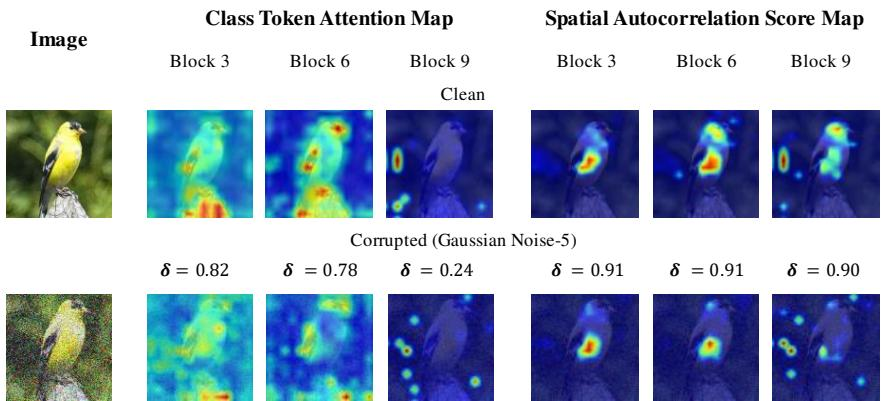
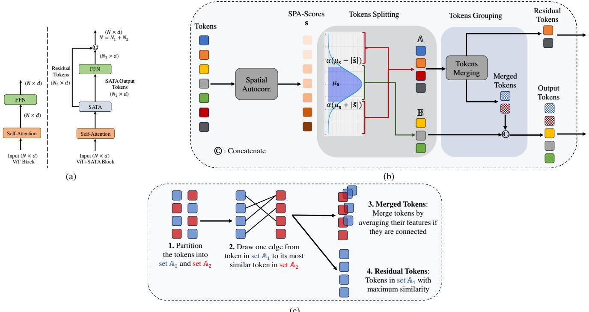
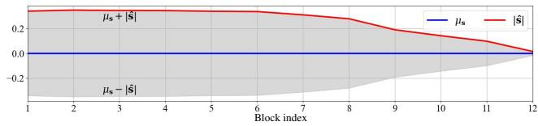
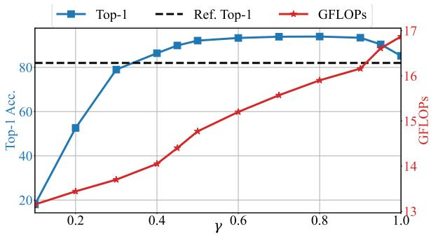
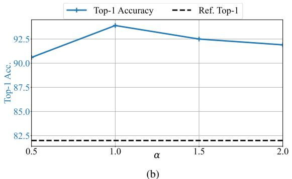
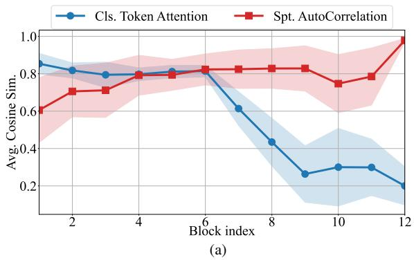
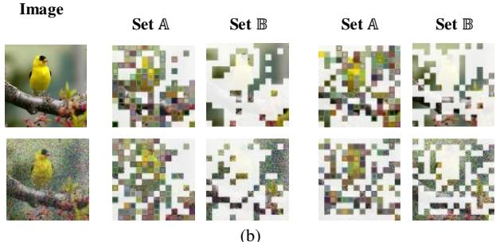

# SATA: Spatial Autocorrelation Token Analysis for Enhancing the Robustness of Vision Transformers

Nick Nikzad, Yi Liao, Yongsheng Gao, Jun Zhou Griffith University, Queensland, Australia

{n.nikzaddehaji, y.liao, yongsheng.gao, jun.zhou}@griffith.edu.au

## Abstract

Over the past few years, vision transformers (ViTs) have consistently demonstrated remarkable performance across various visual recognition tasks. However, attempts to enhance their robustness have yielded limited success, mainly focusing on different training strategies, input patch augmentation, or network structural enhancements. These approaches often involve extensive training and fine-tuning, which are time-consuming and resource-intensive. To tackle these obstacles, we introduce a novel approach named Spatial Autocorrelation Token Analysis (SATA). By harnessing spatial relationships between tokenfeatures, SATA enhances both the representational capacity and robustness of ViT models. This is achieved through the analysis and grouping oftokens according to their spatial autocorrelation scores prior to their input into the Feed-Forward Network (FFN) block of the self-attention mechanism. Importantly, SATA seamlessly integrates into existing pre-trained ViT baselines without requiring retraining or additional fine-tuning, while concurrently improving efficiency by reducing the computational load ofthe FFN units. Experimental results show that the baseline ViTs enhanced with SATA not only achieve a new state-of-the-art top-1 accuracy on ImageNet-1K image classification (94.9%) but also establish new state-of-the-art performance across multiple robustness benchmarks, including ImageNet-A (top-1=63.6%), ImageNet-R (top-1=79.2%), and ImageNet-C (mCE=13.6%), all without requiring additional training orfine-tuning ofbaseline models. Availability: https://github.com/nick-nikzad/SATA

## 1. Introduction

In recent years, vision transformers (ViTs) have demonstrated exceptional performance across diverse computer vision applications [9, 18]. Drawing inspiration from the significant achievements of transformer architectures in natural language processing (NLP), ViTs divide an input image into a sequence of patches (tokens) and leverage self-attention layers [48] to capture relationships between these tokens, ultimately generating rich representations for visual recognition tasks. While recent studies indicate that ViTs can exhibit greater robustness than Convolutional Networks (ConvNets), attributed to their self-attention mechanism [1, 2, 35, 37]. However, this hypothesis has been challenged. Liu et al. [30] demonstrated that a carefully constructed ConvNet can surpass ViTs in both generalization and robustness. Furthermore, while techniques such as patch augmentation [32, 38], contrastive learning strategies [16, 38], and network adjustments [32, 57] have shown promise in enhancing ViT performance and robustness, two primary limitations remain: 1) these methods require extensive retraining or fine-tuning on large datasets (e.g., ImageNet-1K, ImageNet-21K), a labourintensive and resource-demanding process, especially for large-scale ViT architectures; and 2) the attention maps generated by the self-attention mechanism are highly sensitive to noise, which degrades robustness when inputs are corrupted.

Recently, Nikzad et al. [36] showed the existence of spatial correlation among feature maps in convolutional neural networks (CNNs). Moreover, they observed a decrease in spatial autocorrelation among feature maps through deeper network layers, suggesting that final features exhibit reduced spatial dependency. Motivated by these findings, in this work, we first investigate spatial autocorrelation within Vision Transformer (ViT) architectures and its implications for their performance and robustness. Then, we present a novel approach named “Spatial Autocorrelation Token Analysis” (SATA) to tackle the identified shortcomings in the current efforts to enhance ViT robustness.

Our analysis shows that spatial autocorrelation among visual patches (tokens) diminishes through ViT networks, similar to CNNs [36], aligning with findings that spatially uncorrelated features enhance recognition performance [25]. SATA integrates seamlessly into pre-trained ViT models without retraining, boosting robustness and efficiency by reducing the computational load on FFN units. These enhancements in feature aggregation and resilience to corruption account for SATA’s exceptional performance from two perspectives:

  
Figure 1. Visual comparison of class token attention maps and spatial autocorrelation score maps across three layers of Deit-Base/16 pre-trained on ImageNet-1K. The clean image is sourced from the ’goldfinch’ class of the ImageNet-1K dataset, and its corresponding corrupted version, with maximum severity (5), is sourced from the ImageNet-C [20] dataset. δ represents the cosine similarity between either the attention maps or the spatial autocorrelation score maps of a corrupted image and its corresponding clean version at each block.

• Recognition performance: Our study shows that in the later layers of ViT networks, patches with extremely high or low spatial autocorrelation scores in non-informative regions can impede recognition performance and compromise the network’s robustness against corrupted inputs. Our proposed SATA method adopts a unique splitting and grouping algorithm to address this issue based on tokens’ spatial relation scores in the later layers. This approach prevents the input of unnecessary tokens into the FFN block of the self-attention mechanism, resulting in richer feature aggregation. Unlike token pruning and merging techniques, SATA concatenates bypassed tokens (Residual tokens) with the output of the FFN module, restoring the original number of tokens and preventing information loss for later blocks of the ViT.

• Robustness performance: As illustrated in Figure 1, our study shows that in the layers of ViT networks, the spatial autocorrelation scores of patches are more robust against different corruptions than their attention maps. Specifically, while the cosine similarity between clean and corrupted attention maps drops significantly in the blocks of the Vision Transformer, the similarity for spatial autocorrelation scores remains consistently high. This highlights that our spatial autocorrelation analysis provides a more stable and reliable schema to achieve corruption-resistant feature representation throughout the network, offering strong robustness against various types of corruption.

Extensive experiments conducted on ImageNet-1K image classification and various robustness evaluation benchmarks demonstrate the effectiveness of the proposed spatial autocorrelation paradigm in significantly improving the robustness and accuracy performance of Vision Transformers (ViTs). These findings establish a new state-of-the-art performance level, achieving a top-1 accuracy of 94.9% on ImageNet-1K image classification, as well as impressive results across multiple robustness benchmarks, including ImageNet-A [8] (top-

1=63.6%), ImageNet-R [22] (top-1=79.2%), and ImageNet-C [20] (mCE=13.6%), without requiring additional expensive fine-tuning or training. Furthermore, in-depth investigations are conducted to thoroughly explore the characteristics of the proposed Spatial Autocorrelation Token Analysis (SATA).

## 2. Related Works

## 2.1. Vision Transformer

Since the introduction of Vision Transformers (ViTs), they have achieved remarkable success in various computer vision tasks [9, 18]. Most improvements to date have focused on enhancing either the accuracy or the efficiency of ViTs. Numerous ViT variants have been proposed to boost their performance [18]. Through dedicated data augmentation [46] and advanced self-attention structures [13, 53], ViTs have demonstrated competitive or superior performance compared to convolutional neural networks (CNNs). Hybrid models like CvT [51] introduce intrinsic inductive bias into the ViT architecture by adding additional convolutional layers before the multi-head self-attention (MHSA) modules. CeiT [54] extracts low-level features through the Image-to-Token (I2T) module and enhances locality by replacing the standard feedforward network with the locally enhanced feed-forward (LeFF) layer. To enable ViTs to learn multi-scale features, CrossViT [5] employs a dual-branch transformer that combines different sizes of image patches to produce stronger image features. ViTAE [52] incorporates multi-scale context by designing reduction cells (RC) and normal cells (NC).

To create efficient Vision Transformers, several recent works have focused on pruning [11, 33, 44] or combining [24, 28] tokens. ResT [56] introduces an efficient selfattention module using overlapping depth-wise convolutions, while T2T-ViT [55] employs a Tokens-to-Token (T2T) module for token aggregation. PiT [23] reduces spatial size with pooling layers, and Dynamic-ViT [40] dynamically prunes tokens during inference. CaiT [47] optimizes the ViT architecture with layer scaling and class-attention mechanisms. More recently, Bolya et al.[3] proposed a simple token merging technique that potentially does not require retraining.

## 2.2. Robustness of ViTs

While several Recent research has yielded mixed results on the robustness of Vision Transformers (ViTs) compared to Convolutional Neural Networks (CNNs). While some studies [2, 14, 35, 37] suggest ViTs are more robust against various perturbations and distribution shifts, Liu et al. [30] challenge this notion by demonstrating that a well-designed CNN can outperform ViTs in generalization and robustness.

To enhance ViT robustness, various methods have been proposed, including network structural adjustments, patch augmentation, and diverse training strategies [4, 14–16, 26, 32, 38, 57]. For instance, Robust Vision Transformer (RVT) [32] introduces a convolutional stem and token pooling to improve robustness, while Full Attention Net (FAN) [57] leverages an attentional channel processing design. RobustViT [4] downplays the influence of image backgrounds, and a method proposed in [14] uses temperature scaling to smooth attention weights.

Additionally, Qin et al.[38] improve the robustness of ViTs by using images transformed with patch-based operations as negative augmentation. Li et al. [26] propose TORA-ViT, which consists of an accuracy adapter, a robustness adapter, and a gated fusion module. The accuracy adapter extracts predictive features, while the robustness adapter extracts robust features. These features are then combined by the gated fusion module. Reducing Sensitivity to Patch Corruptions (RSPC) [16] enhances the robustness of ViTs through a specialized training strategy. In [15], the Attention Diversification Loss (ADL) is introduced to encourage output tokens to aggregate information from a diverse set of input tokens. Recently, Shi et al. [43] introduced learnable tokens and employed pixel-focused attention to capture structured information between tokens. However, most of these approaches require extensive training or fine-tuning and often sacrifice performance for efficiency [3]. In contrast, our method can be applied to baseline vision transformers[9, 46] without requiring additional training and without any performance drop.

## 3. Preliminaries

## 3.1. Vision Transformers: Multi-head Self Attention (MHSA)

A standard ViT [9] partitions an input image into N patches (tokens). These patches are then transformed to generate a token embedding tensor $\mathbf { X } \in \mathbb { R } ^ { N \times d }$ . These tokens are then processed through a stack of transformer blocks, as illustrated in Figure 2(a). ViTs leverage self-attention [48] to aggregate global information. Given the input token embedding tensor $\mathbf { X } \in \mathbb { R } ^ { N \times d }$ , self-attention applies linear transformations with parameters $W _ { K } , W _ { Q }$ , and $W _ { V }$ to embed them into the key $K = W _ { K } \mathbf { X }$ , query $Q = W _ { Q } \mathbf { X } .$ , and value $V = W _ { V } \mathbf { X }$ , respectively. Self-attention utilises K and $Q$ to generate a pairwise attention map $\mathbf { M } _ { a t t } \in \mathbb { R } ^ { N \times N }$ and then aggregates the token features using the attention map $\mathbf { M } _ { a t t }$ as follows:

$$
\mathbf { M } _ { a t t } = \operatorname { S o f t m a x } ( Q K ^ { t } / \sqrt { d } ) ,\tag{1}
$$

$$
\mathrm { S e l f - A t t e n t i o n } ( Q , K , V ) = { \bf M } _ { a t t } V ,\tag{2}
$$

where the symbol $\mathbf { \ddot { \boldsymbol { t } } } ^ { * } \mathbf { \dot { \boldsymbol { t } } } ^ { * }$ indicates the transpose of the matrix. To achieve rich feature hierarchies, the Transformer block employs multiple self-attention heads. Specifically, h heads are stacked in parallel, resulting in an output of $N \times h \times d .$ These concatenated features are then processed by a feedforward network (FFN) for further transformation. Finally, the FFN output of $N \times d$ serves as the final output of the Multi-Head Self-Attention (MHSA) block within the Transformer architecture.

## 3.2. Geographical Spatial Auto-correlation

In geographical modelling, spatial autocorrelation plays a crucial role in assessing the spatial interdependence of entities based on their locations and values. Positive spatial autocorrelation indicates that neighbouring observations share similar values, while negative spatial autocorrelation suggests that nearby observations tend to have contrasting values. Typically, two types of measures are used: globa measures, which provide an overall assessment of spatia autocorrelation across all data points, and local measures, which offer insights into the spatial autocorrelation of individual locations relative to their neighbourhoods. Moran’s metric [6, 34] is commonly employed in geographical analysis to compute such measurements. In this study, we employ Moran’s measurement for the first time, to the best of our knowledge, to investigate spatial dependency among vision transformers’ tokens (patches).

Let X be a set of N observations (here, tokens) presented by embedded vectors $\mathbf { x } _ { i } \in \mathbb { R } ^ { d } , \mathbf { X } = [ \mathbf { x } _ { 1 } , \mathbf { x } _ { 2 } , . . . , \mathbf { x } _ { N } ]$ , and an associated attribute, $\mathbf { a } = [ a _ { 1 } , a _ { 2 } , . . . , a _ { N } ]$ , the local Moran’s I metric can be defined as:

$$
\begin{array} { r } { { \cal I } _ { l } = [ \mathrm { d i a g } ( { \bf z } { \bf z } ^ { t } { \bf W } ) ] _ { N \times 1 } , } \end{array}\tag{3}
$$

where diag(.) returns the diagonal elements of a matrix. Symbol $\ " \cdot \tau \ "$ indicates the transpose of the matrix. ${ \textbf { W } } =$ $\left[ w _ { i j } \right] _ { N \times N }$ represents spatial weight matrix, in which $w _ { i j }$ denotes the degree of closeness or the contiguous relationships between $\mathbf { x } _ { i }$ and $\mathbf { x } _ { j }$ and can be computed using a dot product similarity $( { \bf x } _ { i } . { \bf x } _ { i } ^ { t } \bar { i } , j = 1 , 2 , . . . , N )$ . z refers to normalised token-wise attribute values as:

$$
\mathbf { z } = { \frac { \mathbf { a } - { \boldsymbol { \mu } } } { \sigma } } ,\tag{4}
$$

  
(c)  
Figure 2. (a) Comparison between conventional ViT block and the augmented ViT with SATA (b) Overall architecture of the proposed SATA module. (c) Tokens Merging.

where $\mu$ and σ denote mean and standard deviation of a, respectively. The final local spatial autocorrelation descriptor, s, can be defined as normalised $\boldsymbol { { \mathit { I } } } _ { l }$ [36]:

$$
{ \bf s } = \frac { { \bf { { I } } } _ { l } - \mu _ { { { I } _ { l } } } } { { \sigma _ { { { I } _ { l } } } } } ,\tag{5}
$$

where $\mu _ { I _ { l } }$ and $\sigma _ { I _ { l } }$ indicate mean and standard deviation of $\mathit { \Pi } _ { I _ { 1 } , }$ respectively. Following [36], given a token embedding tensor ${ \bf X } = [ { \bf x } _ { 1 } , { \bf x } _ { 2 } , . . . , { \bf x } _ { N } ] \in \mathbb { R } ^ { N \times d }$ , its token-wise global context attribute $\mathbf { a } = [ a _ { 1 } , \overset { \cdot } { a _ { 2 } } , . . . , a _ { N } ] \in \mathbb { R } ^ { N \times 1 }$ can be defined as:

$$
\mathbf { a } = \left[ a _ { i } = \frac { 1 } { d } \sum _ { t = 1 } ^ { d } \mathbf { x } _ { i } ( t ) \right] _ { N \times 1 } ,\tag{6}
$$

where d denotes the spatial dimension of the tokens. ${ \bf x } _ { i } ( t )$ represents the i-th token value at position t. It’s worth noting that more advanced strategies or application-specific criteria can be employed to derive the global contextual information descriptor (Eq.(6)). In this context, we adopt the same approach as[36] for the sake of simplicity.

## 4. Spatial Autocorrelation Token Analysis

Figure 2(b) illustrates the overall architecture of the proposed spatial autocorrelation token analysis module, situated between attention and FFN units within a standard ViT block, as depicted in Figure 2(a). To initiate our spatial autocorrelation token analysis, we begin with the observation of the spatial autocorrelation scores, s (Eq. (5)), for ViT’s token embedding tensors over different blocks. As transformers inherently capture pairwise closeness relationships between tokens by computing the attention map $\mathbf { M } _ { a t t }$ in Eq.(2), we can directly set $\mathbf { W } = \mathbf { M } _ { a t t }$ in Eq.(3) to enhance both efficiency and effectiveness1.

  
Figure 3. Plotting the variations of $\mu _ { \mathbf { s } } ,$ |ˆs|, and the lower and upper bounds across different blocks of the ViT.

Figure 3 illustrates the alterations in the mean $( \mu _ { \mathbf { s } } )$ and the absolute value of the median ( ˆs ) statistics of the spatial autocorrelation (s) across different blocks of Deit-Base/16 on the ImageNet-1K validation set. It can be seen that for the later layers, specifically starting from block six, tokens tend to exhibit lower ˆs values. Drawing from the aforementioned observation, we encapsulate the proposed analysis into two sequential steps to handle these tokens to improve the ViT’s robustness and performance:

## 4.1. Token Splitting

Based on the above findings, the overall of the proposed SATA method is illustrated in Figure 2 (b). As shown in Figure 3, we limit token processing to the latter stages of the transformer. Specifically, tokens in layers from $\gamma \times B$ onward $( \gamma > 0$ , where B represents the depth, or number of blocks, of the transformer) are partitioned into two sets, A and B, using the spatial autocorrelation scores s as follows:

$$
\mathbb { A } = \{ \mathbf { x } _ { i } \ ; s _ { i } < \alpha ( \mu _ { \mathbf { s } } - | \hat { \mathbf { s } } | ) \mathrm { a n d } s _ { i } > \alpha ( \mu _ { \mathbf { s } } + | \hat { \mathbf { s } } | ) \}\tag{7}
$$

$$
\mathbb { B } = \{ \mathbf { x } _ { j } \ ; \alpha ( \mu _ { \mathbf { s } } - | \hat { \mathbf { s } } | ) < = s _ { j } < = \alpha ( \mu _ { \mathbf { s } } + | \hat { \mathbf { s } } | ) \}\tag{8}
$$

where $\alpha ( \boldsymbol { \mu } _ { \mathbf { s } } - | \hat { \mathbf { s } } | )$ and $\alpha ( \boldsymbol { \mu } _ { \mathbf { s } } + | \hat { \mathbf { s } } | )$ represent lower and upper bounds, respectively. α denotes the controlling factor (parameters α and $\gamma$ choices are discussed in Section 5.6).

## 4.2. Token Grouping

To manage tokens falling beyond the lower and upper bounds (i.e. $\alpha ( \mu _ { \mathbf { s } } \pm | \hat { \mathbf { s } } | ) )$ , inspired by the Bipartite Matching algorithm [3] we employ a unique Tokens Merging algorithm to efficiently match and merge similar tokens in set A. In particular, the proposed Tokens Merging algorithm can be summarized as follows (illustrated in Figure 2(c)):

1. Partition set A into two sets $\mathbb { A } _ { 1 }$ and $\mathbb { A } _ { 2 }$ of roughly equal size.

2. Draw one edge from each token in $\mathbb { A } _ { 1 }$ to its most similar token in $\mathbb { A } _ { 2 }$

3. Merged Tokens: Merge tokens by averaging their features if they are connected.

4. Residual Tokens: Tokens from set A1 representing maximum similarity with tokens in set $\mathbb { A } _ { 2 }$

The proposed Merging algorithm includes unconnected tokens from set $\mathbb { A } _ { 2 }$ in the merged tokens output, whereas the Bipartite Matching algorithm [3] disregards these tokens. This feature reduces information loss within the overall SATA schema. As depicted in Figure 2(b), the output tokens of the proposed SATA module comprise the concatenation of tokens with spatial scores within the range of lower and upper bounds $( i . e .$ , set B) and the Merged Tokens. This output is then fed into the FFN module, reducing unnecessary token processing in the FFN block and lowering the computational load and GFLOPs. Furthermore, Residual Tokens are concatenated with the FFN output to restore the original number of tokens, N, forming the final output of the new ViT block, as shown on the right side of Figure 2(a).

## 5. Experiment Results & Analysis

## 5.1. Experimental setup

Implementation Details All experiments were conducted on an NVIDIA V100 GPU with a 224 224 image resolution. The batch size was set to 256 for all experiments unless otherwise specified. We integrated the proposed SATA module into pre-trained generic vision transformers [9, 46] (Deit-Tiny/16, Deit-Small/16, Deit-Base/16, and Vit-Base/16), resulting in three model sizes named SATA-T, SATA-S, SATA-B, and SATA-B∗, respectively.

Evaluation Benchmarks We employ the ImageNet2012- 1K [7] dataset for standard performance evaluation. For robustness assessment, we evaluate the proposed SATA in three dimensions: 1) Adversarial Robustness: Testing is conducted on adversarial examples generated by whitebox attack algorithms FGSM [12] and PGD [31] using the ImageNet-1K validation set. ImageNet-A [8] (IN-A) includes the ImageNet objects in unusual contexts or orientations and is utilized to assess model performance against natural adversarial examples. 2) Common Corruption Robustness: We use ImageNet-C [20] (IN-C), which includes 15 types of algorithmically generated corruptions, each with five levels of severity. 3) Out-of-Distribution Robustness: Evaluation is performed on ImageNet-R [22] (IN-R) and ImageNet-Sketch [49] (IN-SK). Both datasets feature images with naturally occurring distribution shifts. ImageNet-R [22] (IN-R) contains abstract or rendered versions of the objects. ImageNet-Sketch [49] consists solely of sketch images, serving to test classification capability when texture or colour information is absent.

## 5.2. Standard Performance Evaluation

For standard performance evaluation, we compare our method with several state-of-the-art classification models, including Transformer-based models and representative CNNbased models, as shown in Table 1. Our proposed SATA significantly outperforms all other architectures, including both CNN-based and ViT-based models. Specifically, ViT models enhanced with SATA achieve new state-of-the-art top-1 accuracy of 86.5%, 89.3%, and 93.9% for the tiny, small, and base versions, respectively, all without requiring additional training, input augmentation, or fine-tuning. Notably, integrating the proposed SATA into pre-trained ViT-Base/16 [9] (SATA-B∗) results in an additional 1.0% improvement. Furthermore, comparing the computation cost (GFLOPs) of the baseline DeiTs and SATA models demonstrates that the proposed spatial autocorrelation token analysis method also improves efficiency.

## 5.3. Adversarial Robustness Evaluation

For evaluating white-box attack adversarial robustness, we follow [32] and adopt the single-step attack algorithm FGSM [12] and the multi-step attack algorithm PGD [31] (with 5 steps and a step size of 0.5). Both attackers perturb the input image with a maximum magnitude of $\epsilon = 1$ . As shown in Table 1, adversarial robustness appears unrelated to standard performance. For instance, models like Swin [29], PVT [50], and TNT-S [17] achieve higher standard accuracy than DeiTs corresponding, but their adversarial robustness is significantly lower, consistent with findings from [32, 42]. Our proposed SATA model achieves superior performance against both FGSM [12] and PGD [31] attacks. Specifically, SATA-S, SATA-B, and SATA-B∗ show over a 20% improvement on FGSM [12] compared to previous ViT variants.

Table 1. Performance of SATA and several state-of-the-art (SOTA) CNNs and ViTs models on ImageNet and six robustness benchmarks: We report the mean corruption error (mCE) for ImageNet-C [20], where lower mCE values indicate higher model robustness. Our SATA models consistently outperform other counterparts in standard performance and enhance robustness across various model sizes compared to the baseline, all without requiring additional training or fine-tuning. SATA-B∗ refers to the integration of the proposed SATA module into the pre-trained vanilla ViT-Base/16 model [9].
<table><tr><td rowspan="2">Group</td><td rowspan="2">Model</td><td rowspan="2">FLOPs (G)</td><td rowspan="2">Params (M)</td><td colspan="2">ImageNet-1K</td><td colspan="6">Robustness Benchmarks</td></tr><tr><td>Top-1</td><td>Top-5</td><td>FGSM</td><td>PGD</td><td>IN-C (mCE↓)</td><td>IN-A</td><td>IN-R</td><td>IN-SK</td></tr><tr><td rowspan="7">CNN</td><td>ResNet50 [19]</td><td>4.1</td><td>25.6</td><td>76.1</td><td>86.0</td><td>12.2</td><td>0.9</td><td>76.7</td><td>0.0</td><td>36.1</td><td>24.1</td></tr><tr><td>RegNetY-4GF[39]</td><td>4.0</td><td>20.6</td><td>79.2</td><td>94.7</td><td>15.4</td><td>2.4</td><td>68.7</td><td>8.9</td><td>38.8</td><td>25.9</td></tr><tr><td>EfficientNet-B4[45]</td><td>4.4</td><td>19.3</td><td>83.0</td><td>96.3</td><td>44.6</td><td>18.5</td><td>71.1</td><td>26.3</td><td>47.1</td><td>34.1</td></tr><tr><td>DeepAugment[21]</td><td>4.1</td><td>25.6</td><td>75.8</td><td>92.7</td><td>27.1</td><td>9.5</td><td>53.6</td><td>3.9</td><td>46.7</td><td>32.6</td></tr><tr><td>ANT[41]</td><td>4.1</td><td>25.6</td><td>76.1</td><td>93.0</td><td>17.8</td><td>3.1</td><td>63.0</td><td>1.1</td><td>39.0</td><td>26.3</td></tr><tr><td>Debiased CNN[27]</td><td>4.1</td><td>25.6</td><td>76.9</td><td>93.4</td><td>20.4</td><td>5.5</td><td>67.5</td><td>3.5</td><td>40.8</td><td>28.4</td></tr><tr><td>ConvNeXt-B[30]</td><td>15.4</td><td>89</td><td>83.8</td><td></td><td></td><td></td><td>46.8</td><td>36.7</td><td>51.3</td><td>38.2</td></tr><tr><td rowspan="7">ViT-Tiny</td><td>DeiT-Ti[46]</td><td>1.3</td><td>5.7</td><td>72.2</td><td>91.1</td><td>22.3</td><td>6.2</td><td>71.1</td><td>7.3</td><td>32.6</td><td>20.2</td></tr><tr><td>ConvViT-Ti[10]</td><td>1.4</td><td>5.7</td><td>73.3</td><td>91.8</td><td>24.7</td><td>7.5</td><td>68.4</td><td>8.9</td><td>35.2</td><td>22.4</td></tr><tr><td>PiT-Ti[23]</td><td>0.7</td><td>4.9</td><td>72.9</td><td>91.3</td><td>20.4</td><td>5.1</td><td>69.1</td><td>6.2</td><td>34.6</td><td>21.6</td></tr><tr><td>PVT-Tiny[50]</td><td>1.9</td><td>13.2</td><td>75.0</td><td>92.5</td><td>10.0</td><td>0.5</td><td>79.6</td><td>7.9</td><td>33.9</td><td>21.5</td></tr><tr><td>RVT-Ti [32]</td><td>1.3</td><td>8.6</td><td>78.4</td><td>94.2</td><td>34.8</td><td>11.7</td><td>58.2</td><td>13.3</td><td>43.7</td><td>30.0</td></tr><tr><td>FAN-T-ViT [57]</td><td>1.3</td><td>7.0</td><td>79.2</td><td></td><td>-</td><td></td><td>57.5</td><td></td><td>42.5</td><td></td></tr><tr><td>RVT-Ti+RSPC [16]</td><td>1.3</td><td>10.9</td><td>79.2</td><td></td><td>-</td><td></td><td>55.7</td><td>16.5</td><td></td><td>=</td></tr><tr><td rowspan="10"></td><td>SATA-T (ours)</td><td>1.0</td><td>5.7</td><td>86.5</td><td>98.2</td><td>40.0</td><td>10.9 16.7</td><td>51.1 54.6</td><td>14.6</td><td>47.3</td><td>25.2 29.4</td></tr><tr><td>DeiT-S[46]</td><td>4.6</td><td>22.1</td><td>79.9</td><td>95.0</td><td>40.7</td><td></td><td>49.8</td><td>18.9 24.5</td><td>42.2 45.4</td><td>33.1</td></tr><tr><td>ConvViT-S[10]</td><td>5.4</td><td>27.8</td><td>81.5</td><td>95.8</td><td>41.7</td><td>17.2 16.5</td><td>52.5</td><td></td><td></td><td></td></tr><tr><td>PiT-S[23]</td><td>2.9 3.8</td><td>23.5</td><td>80.9</td><td>95.3</td><td>41.0</td><td>3.1</td><td>66.9</td><td>21.7</td><td>43.6</td><td>30.8</td></tr><tr><td>PVT-Small[50]</td><td>4.5</td><td>24.5</td><td>79.9</td><td>95.0</td><td>26.6 33.7</td><td></td><td>62.0</td><td>18.0</td><td>40.1 41.3</td><td>27.2</td></tr><tr><td>Swin-T[29]</td><td>5.2</td><td>28.3</td><td>81.2</td><td>95.5</td><td></td><td>7.3</td><td></td><td>21.6</td><td></td><td>29.1</td></tr><tr><td>TNT-S[17]</td><td></td><td>23.8</td><td>81.5</td><td>95.7</td><td>33.2</td><td>4.2</td><td>53.1</td><td>24.7</td><td>43.8</td><td>31.6</td></tr><tr><td>T2T-ViT_t-14[55]</td><td>6.1 4.7</td><td>21.5</td><td>81.7</td><td>95.9</td><td>40.9</td><td>11.7</td><td>53.2</td><td>23.9</td><td>45.0</td><td>32.5</td></tr><tr><td>RVT-S [32]</td><td>5.3</td><td>22.1</td><td>81.7</td><td>95.7</td><td>51.3</td><td>26.0</td><td>50.1</td><td>24.1</td><td>46.9</td><td>35.0</td></tr><tr><td>FAN-S-ViT [57] RVT-S+RSPC [16]</td><td>4.7</td><td>28.0 23.3</td><td>82.9 82.2</td><td></td><td></td><td></td><td>47.7 48.4</td><td>29.1 27.9</td><td>50.4</td><td></td></tr><tr><td>SATA-S (ours)</td><td></td><td></td><td></td><td>99.1</td><td>57.4</td><td>18.0</td><td></td><td></td><td>59.5</td><td>39.2</td></tr><tr><td rowspan="10"></td><td>DeiT-B[46]</td><td>3.9 17.6</td><td>22.1 86.6</td><td>89.3 82.0</td><td>95.7</td><td>46.4</td><td>21.3</td><td>33.8 48.5</td><td>30.5 27.4</td><td></td><td>32.4</td></tr><tr><td>ConvViT-B[10]</td><td>17.7</td><td>86.5</td><td>82.0</td><td>95.7</td><td>46.4</td><td>21.3</td><td>48.5</td><td>27.4</td><td>44.9 44.9</td><td>32.4</td></tr><tr><td>PiT-B[23]</td><td>12.5</td><td>73.8</td><td>82.4</td><td>95.7</td><td>49.3</td><td>23.7</td><td>48.2</td><td>33.9</td><td>43.7</td><td>32.3</td></tr><tr><td>PVT-Large[50]</td><td>9.8</td><td>61.4</td><td>81.7</td><td>95.9</td><td>33.1</td><td>7.3</td><td>59.8</td><td>26.6</td><td>42.7</td><td>30.2</td></tr><tr><td>Swin-B[29]</td><td>15.4</td><td>87.8</td><td>83.4</td><td>96.4</td><td>49.2</td><td>21.3</td><td>54.4</td><td>35.8</td><td>46.6</td><td>32.4</td></tr><tr><td>T2T-ViT_t-24[55]</td><td>15.0</td><td>64.1</td><td>82.6</td><td>96.1</td><td>46.7</td><td>17.5</td><td>48.4</td><td>28.9</td><td>47.9</td><td>35.4</td></tr><tr><td>RVT-B [32]</td><td>17.7</td><td>86.2</td><td>82.5</td><td>96.0</td><td>52.3</td><td>27.4</td><td>47.3</td><td>27.7</td><td>48.2</td><td>35.8</td></tr><tr><td>FAN-B-ViT [57]</td><td>10.4</td><td>54.0</td><td>83.6</td><td></td><td></td><td></td><td>44.4</td><td>35.4</td><td>51.8</td><td></td></tr><tr><td>RVT-B+RSPC [16]</td><td>17.7</td><td>91.8</td><td>82.8</td><td></td><td></td><td></td><td>45.7</td><td>32.1</td><td></td><td></td></tr><tr><td>TORA-ViT-B/16(λ = 0.1) [26]</td><td>26.0</td><td>111.2</td></table>

Regarding natural adversarial robustness, the proposed SATA-T demonstrates a comparable performance of 14.6%, which is on par with some current state-of-the-art methods like RVT-Ti [32] and RVT-Ti+RSPC [16], while being about half their size. However, for models of similar size (e.g.,

ViT-Small and ViT-Base), the proposed SATAs outperform others by about 50%, indicating the effectiveness of SATA against natural adversarial attacks.

## 5.4. Common Corruption Robustness Evaluation

To measure model degradation on common image corruptions, we report the mean corruption error (mCE) on ImageNet-C [20] (IN-C) in Table 1. Our SATA method significantly reduces the mCE of DeiT-Ti [46] from 71.1% to 51.1%, achieving the lowest mCE among vision transformers within the ViT-Tiny group. For the other two larger

  
(a)

  
Figure 4. (a) Ablation study on γ. (b) Ablation study on α. We set γ and α to 0.7 and 1.0, respectively, for all experiments throughout this paper. Ablation studies are conducted on the SATA-B model using the ImageNet-1K dataset. Dashed lines for both graphs represent the baseline Deit-Base/16 top-1 accuracy.

ViT groups, the proposed SATA models achieve an mCE of approximately 28%, improving by around 20 points over all other ViT or CNN-based methods on the leaderboard, thereby establishing a new state-of-the-art. This result also suggests that spatial autocorrelation management of visual tokens can successfully handle different types of image corruption.

## 5.5. Out-of-Distribution Robustness Evaluation

We evaluate the generalization ability of SATA on outof-distribution data by reporting the top-1 accuracy on ImageNet-R [22] (IN-R) and ImageNet-Sketch [49] (IN-SK) in Table 1. The generic vision transformers [9, 46] enhanced by the proposed SATA consistently outperform other ViT models on ImageNet-R [22], achieving 47.3%, 57.2%, 70.0%, 79.9% in the ViT-Tiny, ViT-Small, and ViT-Base groups, respectively. Regarding ImageNet-Sketch [49] (IN-SK), SATA demonstrates superior performance compared to other models of similar size. These results imply that the spatial autocorrelation tokens analysis effectively captures feature distribution shifts, enhancing the model’s out-of-distribution generalization capabilities.

## 5.6. Ablation study

Token Splitting and Token Grouping We evaluate the role of token splitting based on the upper and lower bounds of spatial autocorrelation scores and token grouping modules. To this end, we examine five SATA configurations, as depicted in Table 2. As shown in Table 2, utilizing only token grouping yields a top-1 accuracy of 84.4%, improving upon the reference (DeiT-Base) accuracy by 2.4%. Including either lower or upper bounds significantly enhances accuracy by about 10% of the baseline top-1 accuracy, highlighting the effectiveness of the proposed spatial autocorrelation token splitting schema. The upper bound contributes slightly more, suggesting that tokens with extremely high spatial autocorrelation scores are more likely to be filtered by the splitting process. However, incorporating upper or lower bounds also increases computations and token counts, reducing throughput despite the substantial accuracy gains. Additionally, applying bounds does not guarantee an equal token distribution across bands, as this depends on the data distribution (shown in Figure 2 of the supplementary material). Finally, adding token grouping provides a further 1.6% improvement over the splitting process alone.

Regarding throughput, two main components of the proposed SATA framework (i.e. spatial autocorrelation-based token splitting and token grouping) primarily utilise parallelizable matrix multiplication and dot product operations. This design ensures computational efficiency with a negligible impact on inference time, as shown in Table 2.

Threshold of starting block (γ) We also examine the effect of parameter γ, which controls at which transformer block the SATA module is applied. As Figure 4(a) shows, applying SATA from block0.4 B onwards significantly improves model efficiency while exceeding baseline ViT accuracy (82%). Applying SATA to earlier blocks $( \gamma < 0 . 4 )$ degrades accuracy, suggesting that high spatial correlation within token features and the importance of all tokens in early layers is beneficial. To achieve a good trade-off between accuracy and efficiency, we use $\gamma = 0 . 7$ in all our experiments, unless stated otherwise. This results in a top-1 accuracy of 93.9% and GFLOPs of 15.9.

Lower/Upper bounds controlling factor (α) We further assess the influence of α, the factor controlling the lower and upper bounds in SATA. Figure 4(b) shows the performance of SATA-B on ImageNet-1K with α values ranging from 0.5 to 2. α determines the number of tokens passed to the FFN block and setting α = 1 yields optimal performance.

## 5.7. Visualisation and Discussion

Although the effectiveness of the proposed SATA module has been empirically demonstrated, we conduct a deeper investigation to better understand its behaviour. To this end, we calculate the cosine similarity between the class token attention maps and spatial autocorrelation scores of clean and corrupted image pairs from the ImageNet-1K validation set and its corresponding ImageNet-C [20], respectively. We compute these similarities for various types of image corruptions and severity levels in ImageNet-C [20], and report the average values across different blocks of the proposed SATA-B in Figure 5(a). As shown in Figure 5(a), the cosine similarity between clean and corrupted attention maps drops significantly in the later blocks of the transformer. In contrast, the similarity for spatial autocorrelation scores improves at the early stages and remains consistently high, averaging above 0.8. This highlights that the proposed method can provide a more stable and reliable feature representation throughout the network, offering strong robustness against various types of corruption.

Table 2. Ablation study of the spatial autocorrelation module (token splitting) and token grouping. The symbols $\ " \blacktriangledown$ and $\mathbf { \bar { \Sigma } } ^ { \ast } \mathbf { \Sigma } \times \mathbf { \bar { \Sigma } } ^ { \ast }$ indicate whether the corresponding element is employed with the configuration or not. † represents top-1 accuracy for the baseline Deit-Base/16 [46] model.
<table><tr><td>Spt. Auto. Correlation (Tokens Splitting) Lower bound  $( \mu _ { \mathbf { s } } - | \hat { \mathbf { s } } | )$ </td><td>Upper bound  $( \mu _ { \mathbf { s } } + | \hat { \mathbf { s } } | )$ </td><td>Tokens Grouping</td><td>Top-1</td><td>Throughput (ims/s) Latency (s)</td><td></td></tr><tr><td>X</td><td>X</td><td>X</td><td>82.0†</td><td>303</td><td>0.0033</td></tr><tr><td>X</td><td>X</td><td>√</td><td>84.4</td><td>361</td><td>0.0027</td></tr><tr><td>X</td><td>√</td><td>√</td><td>92.8</td><td>297</td><td>0.0033</td></tr><tr><td>√</td><td>X</td><td>√</td><td>92.5</td><td>271</td><td>0.0035</td></tr><tr><td>√</td><td>√</td><td>X</td><td>92.3</td><td>268</td><td>0.0037</td></tr><tr><td>√</td><td>√</td><td>√</td><td>93.9</td><td>276</td><td>0.0035</td></tr></table>

  
Figure 5. (a) Cosine similarity between the clean and corrupted versions of the class token attention map and spatial autocorrelation scores across different blocks of SATA-B. Results are averaged across various types of image corruptions and severity levels on ImageNet-C [20]. (b) Visualisation of token splitting for a pair of clean and noisy images. Notably, the selected tokens for each set are similar for both clean and corrupted inputs.

Moreover, Figure 5 provides a visualization of tokens (patches) are split into set A and set B for a pair of clean and noisy images according to the proposed SATA algorithm. Notably, the similarity between corresponding sets for clean and noisy inputs is evident, further highlighting the robustness of the proposed method2.

## 6. Conclusion

In this paper, we introduce SATA, a novel method designed to enhance the performance and robustness of vision transformers against various types of corruption. SATA utilises a straightforward yet powerful spatial autocorrelation scheme to exploit spatial inter-dependencies among token features, significantly improving representational capacity and efficiency while reducing computational costs. Our experimental results demonstrate that SATA-enhanced vision transformers consistently deliver stable and reliable feature representations, achieving state-of-the-art performance on ImageNet-1K classification and setting new benchmarks for robustness across multiple evaluations, all without requiring additional training or fine-tuning.

This work highlights SATA’s transformative potential and opens several promising avenues for future research. Key directions include adapting SATA for window-based and hybrid ViT architectures to boost performance in tasks such as object detection and segmentation. Additionally, exploring SATA’s application in other transformer-based domains, such as large language models (LLMs), could further extend its impact.

## 7. Acknowledgements

This work was supported in part by the Australian Research Council (ARC), Australia under Discovery Grant DP180100958 and Industrial Transformation Research Hub Grant IH180100002.

## References

[1] Yutong Bai, Jieru Mei, Alan L Yuille, and Cihang Xie. Are transformers more robust than cnns? In NeurIPS, pages 26831–26843, 2021. 1

[2] Srinadh Bhojanapalli, Ayan Chakrabarti, Daniel Glasner, Daliang Li, Thomas Unterthiner, and Andreas Veit. Understanding robustness of transformers for image classification. In ICCV, pages 10231–10241, 2021. 1, 3

[3] Daniel Bolya, Cheng-Yang Fu, Xiaoliang Dai, Peizhao Zhang, Christoph Feichtenhofer, and Judy Hoffman. Token merging: Your vit but faster. In ICLR, 2023. 3, 5

[4] Hila Chefer, Idan Schwartz, and Lior Wolf. Optimizing relevance maps of vision transformers improves robustness. In NeurIPS, pages 33618–33632, 2022. 3

[5] Chun-Fu Richard Chen, Quanfu Fan, and Rameswar Panda. Crossvit: Cross-attention multi-scale vision transformer for image classification. In ICCV, pages 357–366, 2021. 2

[6] Yanguang Chen. New approaches for calculating Moran’s index of spatial autocorrelation. PloS one, 8(7), 2013. 3

[7] Jia Deng, Wei Dong, Richard Socher, Li-Jia Li, Kai Li, and Li Fei-Fei. ImageNet: A large-scale hierarchical image database. In CVPR, pages 248–255. IEEE, 2009. 5

[8] Minjing Dong, Yanxi Li, Yunhe Wang, and Chang Xu. Adversarially robust neural architectures. arXiv preprint arXiv:2009.00902, 2020. 2, 5

[9] Alexey Dosovitskiy, Lucas Beyer, Alexander Kolesnikov, Dirk Weissenborn, Xiaohua Zhai, Thomas Unterthiner, Mostafa Dehghani, Matthias Minderer, Georg Heigold, Sylvain Gelly, Jakob Uszkoreit, and Neil Houlsby. An image is worth 16x16 words: Transformers for image recognition at scale. In ICLR, 2021. 1, 2, 3, 5, 6, 7

[10] Stéphane d’Ascoli, Hugo Touvron, Matthew L Leavitt, Ari S Morcos, Giulio Biroli, and Levent Sagun. Convit: Improving vision transformers with soft convolutional inductive biases. In ICML, pages 2286–2296. PMLR, 2021. 6

[11] Mohsen Fayyaz, Soroush Abbasi Koohpayegani, Farnoush Rezaei Jafari, Sunando Sengupta, Hamid Reza Vaezi Joze, Eric Sommerlade, Hamed Pirsiavash, and Jürgen Gall. Adaptive token sampling for efficient vision transformers. In ECCV, pages 396–414. Springer, 2022. 2

[12] Ian J Goodfellow, Jonathon Shlens, and Christian Szegedy. Explaining and harnessing adversarial examples. In ICLR, 2015. 5, 6

[13] Benjamin Graham, Alaaeldin El-Nouby, Hugo Touvron, Pierre Stock, Armand Joulin, Hervé Jégou, and Matthijs Douze. Levit: a vision transformer in convnet’s clothing for faster inference. In ICCV, pages 12259–12269, 2021. 2

[14] Jindong Gu, Volker Tresp, and Yao Qin. Are vision transformers robust to patch perturbations? In European Conference on Computer Vision, pages 404–421. Springer, 2022. 3

[15] Yong Guo, David Stutz, and Bernt Schiele. Robustifying token attention for vision transformers. In ICCV, pages 17557– 17568, 2023. 3

[16] Yong Guo, David Stutz, and Bernt Schiele. Improving robustness of vision transformers by reducing sensitivity to patch corruptions. In CVPR, pages 4108–4118, 2023. 1, 3, 6

[17] Kai Han, An Xiao, Enhua Wu, Jianyuan Guo, Chunjing Xu, and Yunhe Wang. Transformer in transformer. In NeurIPS, pages 15908–15919, 2021. 5, 6

[18] Kai Han, Yunhe Wang, Hanting Chen, Xinghao Chen, Jianyuan Guo, Zhenhua Liu, Yehui Tang, An Xiao, Chunjing Xu, Yixing Xu, et al. A survey on vision transformer. IEEE TPAMI, 45(1):87–110, 2022. 1, 2

[19] Kaiming He, Xiangyu Zhang, Shaoqing Ren, and Jian Sun. Deep residual learning for image recognition. In CVPR, pages 770–778, 2016. 6

[20] Dan Hendrycks and Thomas Dietterich. Benchmarking neural network robustness to common corruptions and perturbations. In ICLR, 2018. 2, 5, 6, 8

[21] Dan Hendrycks, Steven Basart, Norman Mu, Saurav Kadavath, Frank Wang, Evan Dorundo, Rahul Desai, Tyler Zhu, Samyak Parajuli, Mike Guo, et al. The many faces of robustness: A critical analysis of out-of-distribution generalization. In ICCV, pages 8340–8349, 2021. 6

[22] Dan Hendrycks, Steven Basart, Norman Mu, Saurav Kadavath, Frank Wang, Evan Dorundo, Rahul Desai, Tyler Zhu, Samyak Parajuli, Mike Guo, et al. The many faces of robustness: A critical analysis of out-of-distribution generalization. In ICCV, pages 8340–8349, 2021. 2, 5, 7

[23] Byeongho Heo, Sangdoo Yun, Dongyoon Han, Sanghyuk Chun, Junsuk Choe, and Seong Joon Oh. Rethinking spatial dimensions of vision transformers. In ICCV, pages 11936– 11945, 2021. 2, 6

[24] Zhenglun Kong, Peiyan Dong, Xiaolong Ma, Xin Meng, Wei Niu, Mengshu Sun, Xuan Shen, Geng Yuan, Bin Ren, Hao Tang, et al. Spvit: Enabling faster vision transformers via latency-aware soft token pruning. In ECCV, pages 620–640. Springer, 2022. 2

[25] Xuelong Li, Han Zhang, Rui Zhang, and Feiping Nie. Discriminative and uncorrelated feature selection with constrained spectral analysis in unsupervised learning. IEEE Transactions on Image Processing, 29:2139–2149, 2019. 1

[26] Yanxi Li and Chang Xu. Trade-off between robustness and accuracy of vision transformers. In CVPR, pages 7558–7568, 2023. 3, 6

[27] Yingwei Li, Qihang Yu, Mingxing Tan, Jieru Mei, Peng Tang, Wei Shen, Alan Yuille, and Cihang Xie. Shape-texture debiased neural network training. In In Proceedings of the International Conference on Learning Representations, 2021. 6

[28] Youwei Liang, Chongjian Ge, Zhan Tong, Yibing Song, Jue Wang, and Pengtao Xie. Not all patches are what you need: Expediting vision transformers via token reorganizations. In ICLR, 2022. 2

[29] Ze Liu, Yutong Lin, Yue Cao, Han Hu, Yixuan Wei, Zheng Zhang, Stephen Lin, and Baining Guo. Swin transformer: Hierarchical vision transformer using shifted windows. In ICCV, pages 10012–10022, 2021. 5, 6

[30] Zhuang Liu, Hanzi Mao, Chao-Yuan Wu, Christoph Feichtenhofer, Trevor Darrell, and Saining Xie. A convnet for the 2020s. In CVPR, pages 11976–11986, 2022. 1, 3, 6

[31] Aleksander Madry, Aleksandar Makelov, Ludwig Schmidt, Dimitris Tsipras, and Adrian Vladu. Towards deep learning models resistant to adversarial attacks. In ICLR, 2018. 5, 6

[32] Xiaofeng Mao, Gege Qi, Yuefeng Chen, Xiaodan Li, Ranjie Duan, Shaokai Ye, Yuan He, and Hui Xue. Towards robust vision transformer. In CVPR, pages 12042–12051, 2022. 1, 3, 5, 6

[33] Lingchen Meng, Hengduo Li, Bor-Chun Chen, Shiyi Lan, Zuxuan Wu, Yu-Gang Jiang, and Ser-Nam Lim. Adavit: Adaptive vision transformers for efficient image recognition. In CVPR, pages 12309–12318, 2022. 2

[34] Patrick AP Moran. The interpretation of statistical maps. Journal of the Royal Statistical Society. Series B (Methodological), 10(2):243–251, 1948. 3

[35] Muhammad Muzammal Naseer, Kanchana Ranasinghe, Salman H Khan, Munawar Hayat, Fahad Shahbaz Khan, and Ming-Hsuan Yang. Intriguing properties of vision transformers. In NeurIPS, pages 23296–23308, 2021. 1, 3

[36] Nick Nikzad, Yongsheng Gao, and Jun Zhou. CSA-Net: Channel-wise Spatially Autocorrelated Attention Networks. arXiv preprint arXiv:2405.05755, 2024. 1, 4

[37] Sayak Paul and Pin-Yu Chen. Vision transformers are robust learners. In AAAI, pages 2071–2081, 2022. 1, 3

[38] Yao Qin, Chiyuan Zhang, Ting Chen, Balaji Lakshminarayanan, Alex Beutel, and Xuezhi Wang. Understanding and improving robustness of vision transformers through patch-based negative augmentation. In NeurIPS, pages 16276– 16289, 2022. 1, 3

[39] Ilija Radosavovic, Raj Prateek Kosaraju, Ross Girshick, Kaiming He, and Piotr Dollár. Designing network design spaces. In CVPR, pages 10428–10436, 2020. 6

[40] Yongming Rao, Wenliang Zhao, Benlin Liu, Jiwen Lu, Jie Zhou, and Cho-Jui Hsieh. Dynamicvit: Efficient vision transformers with dynamic token sparsification. In NeurIPS, pages 13937–13949, 2021. 3

[41] Evgenia Rusak, Lukas Schott, Roland S Zimmermann, Julian Bitterwolf, Oliver Bringmann, Matthias Bethge, and Wieland Brendel. A simple way to make neural networks robust against diverse image corruptions. In ECCV, pages 53–69. Springer, 2020. 6

[42] Rulin Shao, Zhouxing Shi, Jinfeng Yi, Pin-Yu Chen, and Cho-Jui Hsieh. On the adversarial robustness of vision transformers. arXiv preprint arXiv:2103.15670, 2021. 6

[43] Dai Shi. Transnext: Robust foveal visual perception for vision transformers. In CVPR, pages 17773–17783, 2024. 3, 6

[44] Zhuoran Song, Yihong Xu, Zhezhi He, Li Jiang, Naifeng Jing, and Xiaoyao Liang. Cp-vit: Cascade vision transformer pruning via progressive sparsity prediction. arXiv preprint arXiv:2203.04570, 2022. 2

[45] Mingxing Tan and Quoc Le. EfficientNet: Rethinking model scaling for convolutional neural networks. In ICML, pages 6105–6114, 2019. 6

[46] Hugo Touvron, Matthieu Cord, Matthijs Douze, Francisco Massa, Alexandre Sablayrolles, and Hervé Jégou. Training

data-efficient image transformers & distillation through attention. In ICML, pages 10347–10357. PMLR, 2021. 2, 3, 5, 6, 7, 8

[47] Hugo Touvron, Matthieu Cord, Alexandre Sablayrolles, Gabriel Synnaeve, and Hervé Jégou. Going deeper with image transformers. In ICCV, pages 32–42, 2021. 3

[48] Ashish Vaswani, Noam Shazeer, Niki Parmar, Jakob Uszkoreit, Llion Jones, Aidan N Gomez, Łukasz Kaiser, and Illia Polosukhin. Attention is all you need. In NeurIPS, 2017. 1, 3

[49] Haohan Wang, Songwei Ge, Zachary Lipton, and Eric P Xing. Learning robust global representations by penalizing local predictive power. In NeurIPS, 2019. 5, 7

[50] Wenhai Wang, Enze Xie, Xiang Li, Deng-Ping Fan, Kaitao Song, Ding Liang, Tong Lu, Ping Luo, and Ling Shao. Pyramid vision transformer: A versatile backbone for dense prediction without convolutions. In ICCV, pages 568–578, 2021. 5, 6

[51] Haiping Wu, Bin Xiao, Noel Codella, Mengchen Liu, Xiyang Dai, Lu Yuan, and Lei Zhang. Cvt: Introducing convolutions to vision transformers. In ICCV, pages 22–31, 2021. 2

[52] Yufei Xu, Qiming Zhang, Jing Zhang, and Dacheng Tao. Vitae: Vision transformer advanced by exploring intrinsic inductive bias. In NeurIPS, pages 28522–28535, 2021. 2

[53] Jianwei Yang, Chunyuan Li, Pengchuan Zhang, Xiyang Dai, Bin Xiao, Lu Yuan, and Jianfeng Gao. Focal self-attention for local-global interactions in vision transformers. arXiv preprint arXiv:2107.00641, 2021. 2

[54] Kun Yuan, Shaopeng Guo, Ziwei Liu, Aojun Zhou, Fengwei Yu, and Wei Wu. Incorporating convolution designs into visual transformers. In ICCV, pages 579–588, 2021. 2

[55] Li Yuan, Yunpeng Chen, Tao Wang, Weihao Yu, Yujun Shi, Zi-Hang Jiang, Francis EH Tay, Jiashi Feng, and Shuicheng Yan. Tokens-to-token vit: Training vision transformers from scratch on imagenet. In ICCV, pages 558–567, 2021. 2, 6

[56] Qinglong Zhang and Yu-Bin Yang. Rest: An efficient transformer for visual recognition. In NeurIPS, pages 15475– 15485, 2021. 2

[57] Daquan Zhou, Zhiding Yu, Enze Xie, Chaowei Xiao, Animashree Anandkumar, Jiashi Feng, and Jose M Alvarez. Understanding the robustness in vision transformers. In ICML, pages 27378–27394. PMLR, 2022. 1, 3, 6