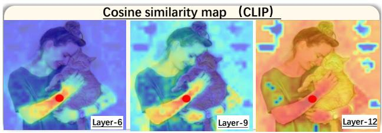
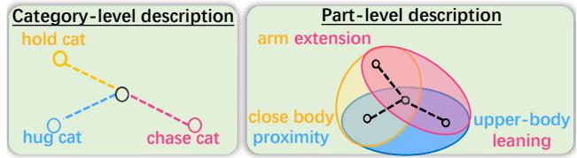
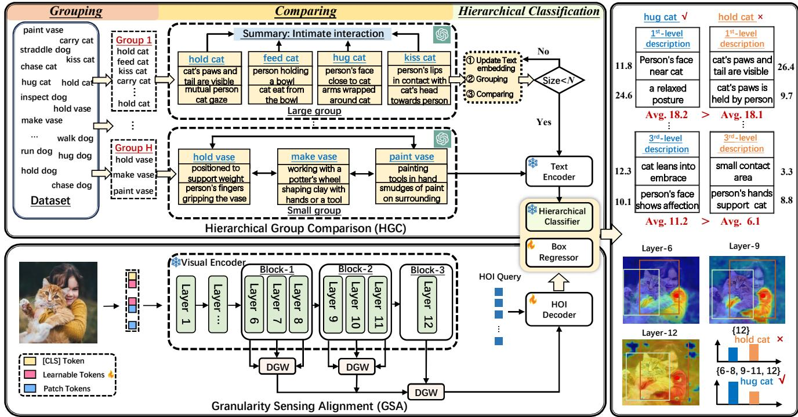
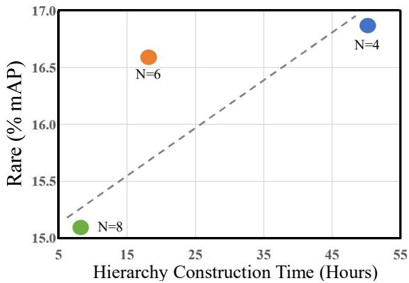
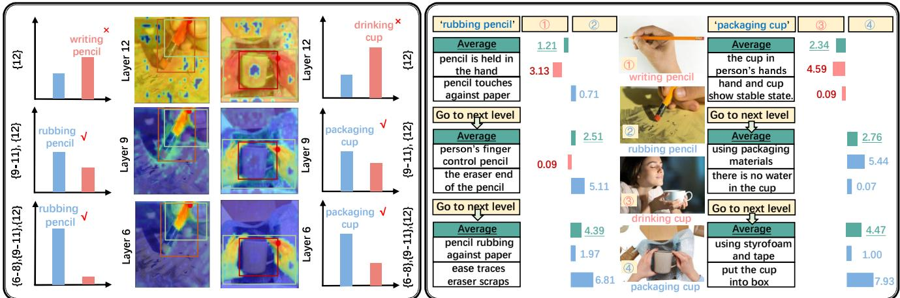

# SGC-Net: Stratified Granular Comparison Network for Open-Vocabulary HOI Ü»¬»½¬·±²

È·² Ô·² ݸ±²¹ ͸· Æ«±°»²¹ Ç¿²¹ö Ø¿±¶·² Ì¿²¹ö Ƹ·´· Ƹ±« Ù«¿²¹¦¸±« ˲·ª»®­·¬§

´·²¨·²çì๦¸«ò»¼«ò½²ô ­¸·½¸±²¹à»ò¹¦¸«ò»¼«ò½²ô §¦°»²¹à¹¦¸«ò»¼«ò½²ô ¬¿²¹¸¿±¶·²à¹¦¸«ò»¼«ò½²ô ¦¸±« ¦¸·´·àïêíò½±³

## ß¾­¬®¿½¬

λ½»²¬ ±°»²óª±½¿¾«´¿®§ ¸«³¿²ó±¾¶»½¬ ·²¬»®¿½¬·±² øÑÊó ØÑ×÷ ¼»¬»½¬·±² ³»¬¸±¼­ °®·³¿®·´§ ®»´§ ±² ´¿®¹» ´¿²¹«¿¹» ³±¼»´ øÔÔÓ÷ º±® ¹»²»®¿¬·²¹ ¿«¨·´·¿®§ ¼»­½®·°¬·±²­ ¿²¼ ´»ª»®¿¹» µ²±©´»¼¹» ¼·­¬·´´»¼ º®±³ ÝÔ×Ð ¬± ¼»¬»½¬ «²­»»² ·²¬»®¿½¬·±² ½¿¬»¹±®·»­ò Ü»­°·¬» ¬¸»·® »ºº»½¬·ª»²»­­ô ¬¸»­» ³»¬¸±¼­ º¿½» ¬©± ½¸¿´´»²¹»­æ øï÷ º»¿¬«®» ¹®¿²«´¿®·¬§ ¼»ó ficiency, due to reliance on last layer visual features for text ¿´·¹²³»²¬ô ´»¿¼·²¹ ¬± ¬¸» ²»¹´»½¬ ±º ½®«½·¿´ ±¾¶»½¬ó´»ª»´ ¼»ó ¬¿·´­ º®±³ ·²¬»®³»¼·¿¬» ´¿§»®­å øî÷ ­»³¿²¬·½ ­·³·´¿®·¬§ ½±²ó º«­·±²ô ®»­«´¬·²¹º®±³ ÝÔ×Ðù­ ·²¸»®»²¬ ¾·¿­»­ ¬±©¿®¼ ½»®¬¿·² ½´¿­­»­ô ©¸·´» ÔÔÓó¹»²»®¿¬»¼ ¼»­½®·°¬·±²­ ¾¿­»¼ ­±´»´§ ±² ´¿¾»´­ º¿·´ ¬± ¿¼»¯«¿¬»´§ ½¿°¬«®» ·²¬»®ó½´¿­­ ­·³·´¿®·¬·»­ò ̱ address these challenges, we propose a stratified granu-´¿® ½±³°¿®·­±² ²»¬©±®µò Ú·®­¬ô ©» ·²¬®±¼«½» ¿ ¹®¿²«´¿®ó ·¬§ ­»²­·²¹ ¿´·¹²³»²¬ ³±¼«´» ¬¸¿¬ ¿¹¹®»¹¿¬»­ ¹´±¾¿´ ­»³¿²ó tic features with local details, refining interaction represen-¬¿¬·±²­ ¿²¼ »²­«®·²¹ ®±¾«­¬ ¿´·¹²³»²¬ ¾»¬©»»² ·²¬»®³»¼·ó ¿¬» ª·­«¿´ º»¿¬«®»­ ¿²¼ ¬»¨¬ »³¾»¼¼·²¹­ò Í»½±²¼ô ©» ¼»ó ª»´±° ¿ ¸·»®¿®½¸·½¿´ ¹®±«° ½±³°¿®·­±² ³±¼«´» ¬¸¿¬ ®»½«®ó ­·ª»´§ ½±³°¿®»­ ¿²¼ ¹®±«°­ ½´¿­­»­ «­·²¹ ÔÔÓ­ô ¹»²»®¿¬·²¹ fine-grained and discriminative descriptions for each inter-¿½¬·±² ½¿¬»¹±®§ò Û¨°»®·³»²¬¿´ ®»­«´¬­ ±² ¬©± ©·¼»´§ó«­»¼ ¾»²½¸³¿®µ ¼¿¬¿­»¬­ô ÍÉ×ÙóØÑ× ¿²¼ Ø×ÝÑóÜÛÌô ¼»³±²ó ­¬®¿¬» ¬¸¿¬ ±«® ³»¬¸±¼ ¿½¸·»ª»­ ­¬¿¬»ó±ºó¬¸»ó¿®¬ ®»­«´¬­ ·² ÑÊóØÑ× ¼»¬»½¬·±²ò ݱ¼»­ ·­ ¿ª¿·´¿¾´» ¿¬ Ù·¬Ø«¾ò

## ïò ײ¬®±¼«½¬·±²

Ø«³¿²óѾ¶»½¬ ײ¬»®¿½¬·±² øØÑ×÷ ¼»¬»½¬·±² ¿·³­ ¬± ´±½¿´·¦» ¸«³¿²ó±¾¶»½¬ °¿·®­ ¿²¼ ®»½±¹²·¦» ¬¸»·® ·²¬»®¿½¬·±²­ô °®±ª·¼ó ing an efficient way for human-centric scene understanding ׬ °´¿§­ ¿ ½®«½·¿´ ®±´» ·² ª¿®·±«­ ½±³°«¬»® ª·­·±² ¬¿­µ­ô ­«½¸ ¿­ ¿­­·­¬·ª» ®±¾±¬·½­ Åíêô íéà ¿²¼ ª·¼»± ¿²¿´§­·­ Åîíô ëïÃò Recently, the emerging field of open-vocabulary HOI (OV-ØÑ×÷ ¼»¬»½¬·±²ô ©¸·½¸ ¾®±¿¼»²­ ¬¸» ­½±°» ±º ØÑ× ¼»¬»½¬·±² by recognizing and associating objects beyond predefined ½¿¬»¹±®·»­ô ¸¿­ ¹¿·²»¼ ·²½®»¿­·²¹ ¿¬¬»²¬·±²ò

(a) Feature granularity deficiency  
  
(b) Semantic similarity confusion  
Ú·¹«®» ïò ø¿÷ ̸» ´¿­¬ ´¿§»® ½¿°¬«®» ¸·¹¸ó´»ª»´ ¹´±¾¿´ ­»³¿²¬·½­ ¾«¬ ½±²¬¿·² º»©»® ´±©ó´»ª»´ ´±½¿´ ¼»¬¿·´­ ½±³°¿®»¼ ¬± ·²¬»®³»¼·¿¬» ´¿§»®­ò ̸» ®»¼ ¼±¬ ³¿®µ­ ¬¸» ­»´»½¬»¼ °¿¬½¸ò ø¾÷ Ý¿¬»¹±®§ó´»ª»´ ¿²¼ °¿®¬ó´»ª»´ ¼»­½®·°¬·±²­ ±ª»®´±±µ ·²¬»®ó½´¿­­ ­·³·´¿®·¬§ô ´»¿¼·²¹ to difficulty in distinguishing semantically similar classes.

ÑÊóØÑ× ¼»¬»½¬·±² ¸¿­ ³¿¼» ²±¬¿¾´» °®±¹®»­­ô ´¿®¹»´§ ¼«» ¬± ¬¸» ­«½½»­­ ±º ª·­·±²ó´¿²¹«¿¹» ³±¼»´­ øÊÔÓ­÷ ´·µ» ÝÔ×Ð ÅìîÃò ˲´·µ» ¦»®±ó­¸±¬ ´»¿®²·²¹ô ©¸·½¸ °®±¸·¾·¬­ ¬¸» ¿½½»­­ ±º ¿²§ «²¿²²±¬¿¬»¼ «²­»»² ½´¿­­»­ ¼«®·²¹ ¬®¿·²·²¹ ±°»²óª±½¿¾«´¿®§ ´»¿®²·²¹ ´»ª»®¿¹»­ ½´¿­­ ²¿³» »³¾»¼¼·²¹­ º®±³ ÊÔÓ­ º±® ¿«¨·´·¿®§ ­«°»®ª·­·±² Åëðô êîÃò ̸»®»º±®» »¨·­¬·²¹ ÝÔ×Ð󾿭»¼ ØÑ× ¼»¬»½¬·±² ³»¬¸±¼­ ²¿¬«®¿´´§ º¿´´ «²¼»® ÑÊóØÑ× ¼»¬»½¬·±²ò ر©»ª»®ô ¬¸»­» ³»¬¸±¼­ º¿½» ½¸¿´´»²¹»­ ·² ±°»²ó©±®´¼ ­½»²¿®·±­ ¾»½¿«­» ¬¸»§ ®»´§ ±² °®»¬®¿·²»¼ ±¾¶»½¬ ¼»¬»½¬±®­ô ¿²¼ «­·²¹ ½¿¬»¹±®§ ²¿³»­ ¿­ classifiers struggles to capture the variability of HOIs. To ±ª»®½±³» ¬¸»­» ½¸¿´´»²¹»­ô ®»½»²¬ ©±®µ­ Åîîô ìèà ¸¿ª» ®»ó ³±ª»¼ ¬¸» ²»»¼ º±® °®»¬®¿·²»¼ ¼»¬»½¬±®­ ¾§ »¨¬®¿½¬·²¹ ØÑ× º»¿¬«®»­ ¼·®»½¬´§ ¬¸®±«¹¸ ·³¿¹» »²½±¼»®­ ©¸·´» ·²½±®°±®¿¬ó ·²¹ ´¿²¹«¿¹» °®·±®­ º®±³ ÔÔÓ­ ª·¿ ¬»¨¬ »²½±¼»®­ò

Ü»­°·¬» ¬¸»­» ¿¼ª¿²½»³»²¬­ô ½«®®»²¬ ÑÊóØÑ× ¼»¬»½¬·±²   
³»¬¸±¼­ ©·¬¸±«¬ °®»¬®¿·²»¼ ±¾¶»½¬ ¼»¬»½¬±®­ ­¬·´´ ­«ºº»® º®±³

feature granularity deficiency. This issue arises because ÝÔ×Ðô ¬®¿·²»¼ ©·¬¸ ·³¿¹»ó´»ª»´ ¿´·¹²³»²¬ô °®±¼«½»­ ¹´±¾ó ¿´´§ ¿´·¹²»¼ ·³¿¹»ó¬»¨¬ º»¿¬«®»­ ´¿½µ·²¹ ¬¸» ´±½¿´ ¼»¬¿·´ ²»»¼»¼ º±® »ºº»½¬·ª» ÑÊóØÑ× ¼»¬»½¬·±²ò ß­ ­¸±©² ·² Ú·¹ó «®» ïø¿÷ô ¬¸» ´¿­¬ ´¿§»® º±½«­»­ ±² ¸·¹¸ó´»ª»´ ­»³¿²¬·½ º»¿ó ¬«®»­ ¾«¬ ²»¹´»½¬­ ´±©ó´»ª»´ ´±½¿´ ¼»¬¿·´­ ´·µ» ¿®³ ¿²¼ º¿½» °±­¬«®»­ô ½±³°¿®»¼ ¬± ·²¬»®³»¼·¿¬» ´¿§»®­ò ß¼¼·¬·±²¿´´§ º»¿¬«®» ¼·­­·³·´¿®·¬§ ¾»¬©»»² ­¸¿´´±© ¿²¼ ¼»»° ´¿§»®­ ·²ó creases with network depth, posing significant challenges in ¿´·¹²·²¹ ·²¬»®³»¼·¿¬» ª·­«¿´ º»¿¬«®»­ ©·¬¸ ¬»¨¬ »³¾»¼¼·²¹­ò Ó±®»±ª»®ô ÑÊóØÑ× ³»¬¸±¼­ ¬¸¿¬ ®»´§ ±² ½¿¬»¹±®§ó´»ª»´ ±® part-level text classifiers are prone to semantic confusion ¼«» ¬± ­»ª»®¿´ ·²¸»®»²¬ ´·³·¬¿¬·±²­ò Ú·®­¬ô ÝÔ×Ðù­ ¬®¿·²·²¹ ±² ´¿®¹»ó­½¿´»ô ´±²¹ó¬¿·´ ¼¿¬¿­»¬­ ¬»²¼­ ¬± ·²¬®±¼«½» ¾·¿­»­ ¬±ó ©¿®¼­ ½»®¬¿·² ½´¿­­»­ ÅìçÃò Ú±® »¨¿³°´»ô ¿­ ­¸±©² ±² ¬¸» ´»º¬ ­·¼» ±º Ú·¹«®» ïø¾÷ô ÝÔ×Ð ±º¬»² ½±²º«­»­ ¸«¹ ½¿¬Œ ©·¬¸ ¸±´¼ ½¿¬òŒ Í»½±²¼ô ¼»­½®·°¬·±²­ ¹»²»®¿¬»¼ ¾§ ÔÔÓ­ ¾¿­»¼ ­±´»´§ ±² ´¿¾»´­ ³¿§ º¿·´ ¬± ¼·­¬·²¹«·­¸ ¾»¬©»»² ­»³¿²¬·ó ½¿´´§ ­·³·´¿® ½´¿­­»­ò ß­ ·´´«­¬®¿¬»¼ ±² ¬¸» ®·¹¸¬ ­·¼» ±º Ú·¹ó «®» ïø¾÷ô ÔÔÓ­ °®±¼«½» ­·³·´¿® °¿®¬ó´»ª»´ ¼»­½®·°¬·±²­ ´·µ» ¿®³ »¨¬»²­·±²Œ º±® ¾±¬¸ ¸±´¼ ½¿¬Œ ¿²¼ ½¸¿­» ½¿¬Œò

̱ ¿¼¼®»­­ ¬¸» ¿º±®»³»²¬·±²»¼ ½¸¿´´»²¹»­ô ©» °®±°±­» ¿² »²¼ó¬±ó»²¼ ÑÊóØÑ× ¼»¬»½¬·±² ²»¬©±®µ ²¿³»¼ ÍÙÝóÒ»¬ò Ú·®­¬ô ©» ¼»­·¹² ¬¸» ¹®¿²«´¿®·¬§ ­»²­·²¹ ¿´·¹²³»²¬ øÙÍß÷ ³±¼«´»ô ´»ª»®¿¹·²¹ ³«´¬·ó¹®¿²«´¿®·¬§ ª·­«¿´ º»¿¬«®»­ º®±³ ÝÔ×Ð ¬± ·³°®±ª» ¬¸» ¬®¿²­º»®¿¾·´·¬§ º±® ²±ª»´ ½´¿­­»­ò ̸» °®·³¿®§ ½¸¿´´»²¹» ·² ¬¸·­ °®±½»­­ ·­ »ºº»½¬·ª»´§ ¿¹¹®»¹¿¬ó ing global semantic features with local details to refine ½±¿®­» ·²¬»®¿½¬·±² ®»°®»­»²¬¿¬·±²­ ©¸·´» »²­«®·²¹ ¿´·¹²³»²¬ ¾»¬©»»² ·²¬»®³»¼·¿¬» ª·­«¿´ º»¿¬«®»­ ¿²¼ ¬»¨¬ »³¾»¼¼·²¹­ò ß½½±®¼·²¹´§ô ©» ·²¬®±¼«½» ¿ ¾´±½µ °¿®¬·¬·±²·²¹ ­¬®¿¬»¹§ ¬¸¿¬ groups layers based on their relative distances. Specifically, ©» ¼·ª·¼» ¬¸» ª·­«¿´ »²½±¼»® ±º ÝÔ×Ð ·²¬± ­»ª»®¿´ ¾´±½µ­ô »²­«®·²¹ ¿ ´·¬¬´» ª¿®·¿¬·±² ·² ¬¸» º»¿¬«®»­ ©·¬¸·² »¿½¸ ¾´±½µò ̱ ¿´·¹² ´±½¿´ ¼»¬¿·´­ ³±®» °®»½·­»´§ô ©» °»®º±®³ ¿ º«­·±² ±º ³«´¬·ó¹®¿²«´¿®·¬§ º»¿¬«®»­ ©·¬¸·² »¿½¸ ¾´±½µô ¿­­·¹²·²¹ ¼·­¬·²½¬ ¿²¼ ¬®¿·²¿¾´» Ù¿«­­·¿² ©»·¹¸¬­ ¬± »¿½¸ ´¿§»®ò Ѳ½» ¬¸»­» ·²¬®¿ó¾´±½µ º»¿¬«®»­ ¿®» º«­»¼ô ©» °®±½»»¼ ¬± ¿¹¹®»ó ¹¿¬» ¬¸» º«­»¼ º»¿¬«®»­ ¿½®±­­ ¿´´ ¾´±½µ­ ¬± ³¿·²¬¿·² ¹´±¾¿´ ­»³¿²¬·½ ½±²­·­¬»²½§ò Ú«®¬¸»®³±®»ô ¬± °®»­»®ª» ¬¸» °®»ó ¬®¿·²»¼ ¿´·¹²³»²¬ ¾»¬©»»² ¬»¨¬ ¿²¼ ª·­«¿´ º»¿¬«®»­ ·² ÝÔ×Ðô ©» »³°´±§ ª·­«¿´ °®±³°¬ ¬«²·²¹ Åéô îëô êïà ¾§ ¿¼¼·²¹ ´»¿®²ó ¿¾´» ¬±µ»²­ ¬± ¬¸» ª·­«¿´ º»¿¬«®»­ ±º »¿½¸ ´¿§»®

Í»½±²¼´§ô ©» °®±°±­» ¬¸» ¸·»®¿®½¸·½¿´ ¹®±«° ½±³°¿®·ó ­±² øØÙÝ÷ ³±¼«´» ¬± »ºº»½¬·ª»´§ ¼·ºº»®»²¬·¿¬» ­»³¿²¬·½¿´´§ ­·³·´¿® ½¿¬»¹±®·»­ ¾§ ®»½«®­·ª»´§ ¹®±«°·²¹ ¿²¼ ½±³°¿®·²¹ classes via LLMs. Specifically, we utilize clustering algo-®·¬¸³­ ø»ò¹òô Õ󳻿²­ ÅíìÃ÷ º±® ¹®±«°·²¹ò Ûª»² ©·¬¸ »¨¬»²ó ­·ª» °®·±® µ²±©´»¼¹» ±º ÔÔÓ­ô ½±³°¿®·²¹ ²«³»®±«­ ½¿¬»ó ¹±®·»­ º±® ÑÊóØÑ× ¼»¬»½¬·±² ®»³¿·²­ ½¸¿´´»²¹·²¹ ¼«» ¬± ¬¸» ¯«¿¼®¿¬·½ ¹®±©¬¸ ±º ¬¸» ¼»­½®·°¬·±² ³¿¬®·¨ ©·¬¸ ¬¸» ²«³¾»® ±º ½¿¬»¹±®·»­ò ̱ ¿¼¼®»­­ ¬¸·­ ½¸¿´´»²¹»ô ©» ¿¼±°¬ ¹®±«°ó specific comparison strategies to improve efficiency. For ­³¿´´»® ¹®±«°­ô ©» ¼·®»½¬´§ ¯«»®§ ÔÔÓ­ º±® ½±³°¿®¿¬·ª» ¼»­½®·°¬·±²­ô ©¸»®»¿­ º±® ´¿®¹»® ¹®±«°­ô ©» ­«³³¿®·¦» ¬¸» ¹®±«°ù­ ½¸¿®¿½¬»®·­¬·½­ «­·²¹ ÔÔÓ­ ¿²¼ ·²½±®°±®¿¬» ¬¸»­» ­«³³¿®·»­ ·²¬± ²»© ¯«»®·»­ ¬± ¸·¹¸´·¹¸¬ ¼·­¬·²½¬·ª» º»¿¬«®»­ ±º »¿½¸ ½´¿­­ ©·¬¸·² ¬¸» ¹®±«°ò Þ§ ®»½«®­·ª»´§ ½±²­¬®«½¬ ¿ ½´¿­­ ¸·»®¿®½¸§ô ©» ½¿² ½´¿­­·º§ ØÑ× ¾§ ¼»­½»²¼·²¹ º®±³ ¬¸» ¬±° ¬± ¬¸» ¾±¬¬±³ ±º ¬¸» ¸·»®¿®½¸§ô ½±³°¿®·²¹ ØÑ× ¿²¼ ¬»¨¬ »³¾»¼¼·²¹­ ¿¬ »¿½¸ ´»ª»´ò

ײ ­«³³¿®§ô ¬¸» ·²²±ª¿¬·±² ±º ¬¸» °®±°±­»¼ ÍÙÝóÒ»¬ ·­ ¬¸®»»óº±´¼æ øï÷ ̸» ÙÍß ³±¼«´» »ºº»½¬·ª»´§ ¿¹¹®»¹¿¬»­ ³«´¬·ó¹®¿²«´¿® º»¿¬«®»­ ©¸·´» ¿´·¹²·²¹ ¬¸» ´±½¿´ ¼»¬¿·´­ ¿²¼ ¹´±¾¿´ ­»³¿²¬·½ º»¿¬«®»­ ±º ÑÊóØÑ×å øî÷ ̸» ØÙÝ ³±¼«´» iteratively generates discriminative descriptions to refine the classification boundaries of labels; (3) The efficacy of ¬¸» °®±°±­»¼ ÍÙÝóÒ»¬ ·­ »ª¿´«¿¬»¼ ±² ¬©± ©·¼»´§ó«­»¼ ÑÊó ØÑ× ¼»¬»½¬·±² ¾»²½¸³¿®µ ¼¿¬¿­»¬­ô ·ò»òô Ø×ÝÑóÜÛÌ Åëà ¿²¼ ÍÉ×ÙóØÑ× ÅìêÃò Û¨°»®·³»²¬¿´ ®»­«´¬­ ­¸±© ¬¸¿¬ ±«® ÍÙÝó Ò»¬ ½±²­·­¬»²¬´§ ±«¬°»®º±®³­ ­¬¿¬»ó±ºó¬¸»ó¿®¬ ³»¬¸±¼­ò

## îò λ´¿¬»¼ ɱ®µ

## îòïò ØÑ× Ü»¬»½¬·±²

Û¨·­¬·²¹ ØÑ× ¼»¬»½¬·±² ©±®µ­ ½¿² ¾» ¼·ª·¼»¼ ·²¬± ¬©± ½¿¬»ó ¹±®·»­ô ¬©±ó­¬¿¹» ³»¬¸±¼­ Åíô çô îïô îêô íîô ìïô ìíô ëëô ëêà ¿²¼ ±²»ó­¬¿¹» ³»¬¸±¼­ Åêô ïïô ïèô ïçô îèô ììô ëèÃò Ì©±ó ­¬¿¹» ³»¬¸±¼­ ¬§°·½¿´´§ «­» ¿² ±¾¶»½¬ ¼»¬»½¬±® ¬± ®»½±¹²·¦» ¸«³¿²­ ¿²¼ ±¾¶»½¬­ô º±´´±©»¼ ¾§ ­°»½·¿´·¦»¼ ³±¼«´»­ ¬± ¿­ó ­±½·¿¬» ¸«³¿²­ ©·¬¸ ±¾¶»½¬­ ¿²¼ ·¼»²¬·º§ ¬¸»·® ·²¬»®¿½¬·±²­ »ò¹òô ³«´¬·ó­¬»¿³­ Åïïô ïîô îéÃô ¹®¿°¸­ Åçô íðô íïô ëìà ±® ½±³°±­·¬·±²¿´ ´»¿®²·²¹ Åïíô ïìÃò ײ ½±²¬®¿­¬ô ¬¸» ±²»ó­¬¿¹» ¿°°®±¿½¸ ¼»¬»½¬­ ¸«³¿²ó±¾¶»½¬ °¿·®­ ¿²¼ ¬¸»·® ·²¬»®¿½¬·±²­ ­·³«´¬¿²»±«­´§ô ©·¬¸±«¬ ®»¯«·®·²¹ ­¬»°©·­» °®±½»­­·²¹ò ײ °¿®¬·½«´¿®ô ÎÔ×Ð Åêðà °®±°±­»­ ¿ °®»ó¬®¿·²·²¹ ­¬®¿¬»¹§ º±® ØÑ× ¼»¬»½¬·±² ¾¿­»¼ ±² ·³¿¹» ½¿°¬·±²­ò ÐÐÜÓ Åîèà ®»ó º±®³«´¿¬»­ ¬¸» ØÑ× ¼»¬»½¬·±² ¬¿­µ ¿­ ¿ °±·²¬ ¼»¬»½¬·±² ¿²¼ ³¿¬½¸·²¹ °®±¾´»³ ¿²¼ ¿½¸·»ª»­ ­·³«´¬¿²»±«­ ±¾¶»½¬ ¿²¼ ·²ó ¬»®¿½¬·±² ¼»¬»½¬·±²ò ر©»ª»®ô »¨·­¬·²¹ ØÑ× ¼»¬»½¬·±² ¿°ó °®±¿½¸»­ ¿®» ½±²­¬®¿·²»¼ ¾§ ¿ ½´±­»¼ó­»¬ ¿­­«³°¬·±²ô ©¸·½¸ restricts their ability to recognize only predefined interac-¬·±² ½¿¬»¹±®·»­ò ײ ½±²¬®¿­¬ô ±«® ©±®µ ¿·³­ ¬± ¼»¬»½¬ ¿²¼ ®»½±¹²·¦» ØÑ×­ ·² ¬¸» ±°»²óª±½¿¾«´¿®§ ­½»²¿®·±ò

## îòîò ÝÔ×Ðs¾¿­»¼ Ñ°»² ʱ½¿¾«´¿®§ ØÑ× Ü»¬»½¬·±²

̱ ¿´´»ª·¿¬» ¬¸» ½´±­»¼ó­»¬ ´·³·¬¿¬·±²ô ³¿²§ ­¬«¼·»­ Åïðô îî îçô íëô ìðô ìéô ëîà ¸¿ª» ¾»»² ¼»ª±¬»¼ ¬± ÑÊóØÑ× ¼»¬»½¬·±² ¿·³·²¹ ¬± ·¼»²¬·º§ ¾±¬¸ ¾¿­» ¿²¼ ²±ª»´ ½¿¬»¹±®·»­ ±º ØÑ×­ ©¸·´» ±²´§ ¾¿­» ½¿¬»¹±®·»­ ¿®» ¿ª¿·´¿¾´» ¼«®·²¹ ¬®¿·²·²¹ò Specifically, they transfer knowledge from the large-scale ª·­«¿´ó´·²¹«·­¬·½ °®»ó¬®¿·²»¼ ³±¼»´ ÝÔ×Ð ¬± »²¸¿²½» ·²¬»®ó ¿½¬·±² «²¼»®­¬¿²¼·²¹ò Ú±® ·²­¬¿²½»ô ÙÛÒóÊÔÕÌ­ Åîçà ¿²¼ ØÑ×ÝÔ×Ð Åìðà ½±²ª»®¬ ØÑ× ´¿¾»´­ ·²¬± °¸®¿­» ¼»­½®·°¬·±²­ to initialize the classifier and extract visual features from the ÝÔ×Ð ·³¿¹» »²½±¼»® ¬± ¹«·¼» ¬¸» ·²¬»®¿½¬·±² ª·­«¿´ º»¿¬«®» ´»¿®²·²¹ò ÓÐóØÑ× Åëîà ·²½±®°±®¿¬»­ ¬¸» ª·­«¿´ °®±³°¬­ ·²¬± ´¿²¹«¿¹»ó¹«·¼»¼ó±²´§ ØÑ× ¼»¬»½¬±®­ ¬± »²¸¿²½» ·¬­ ¹»²»®ó ¿´·¦¿¬·±² ½¿°¿¾·´·¬§ò ÌØ×Ü Åìèà °®±°±­»­ ¿ ØÑ× ­»¯«»²½» °¿®­»® ¬± ¼»¬»½¬ ³«´¬·°´» ·²¬»®¿½¬·±²­ò ÝÓÜóÍÛ Åîîà ¼»ó ¬»½¬­ ØÑ×­ ¿¬ ¼·ºº»®»²¬ ¼·­¬¿²½»­ «­·²¹ ¼·­¬·²½¬ º»¿¬«®» ³¿°­ò ر©»ª»®ô ¬¸» ¿¼±°¬»¼ ´±­­ º«²½¬·±² ·² Åîîà ·²ª±´ª»­ ³·²·ó ³·¦·²¹ ¼·ºº»®»²½»­ ¾»¬©»»² ½±²¬·²«±«­ ¿²¼ ¼·­½®»¬» ª¿®·ó ¿¾´»­ ¬¸»®»º±®» ¸¿®¼ ¬± ±°¬·³·¦»ò Þ»­·¼»­ô ¿´·¹²·²¹ ·²¬»®ó ³»¼·¿¬» º»¿¬«®»­ ©·¬¸ ¬»¨¬ »³¾»¼¼·²¹­ ³¿§ ¾®»¿µ ¬¸» ¿´·¹²ó ³»²¬ ·² °®»ó¬®¿·²»¼ ÝÔ×Ð ¼«» ¬± ¬¸» ­«¾­¬¿²¬·¿´ ¼·ºº»®»²½»­ò ̸» °®±°±­»¼ ¿°°®±¿½¸ ·­ ¿ ³»¬¸±¼ º®»» º®±³ °®»¬®¿·²»¼ ±¾¶»½¬ ¼»¬»½¬±®­ ¾«¬ ¸¿­ ¬¸» º±´´±©·²¹ ¿¼ª¿²¬¿¹»­ ½±³°¿®»¼ ©·¬¸ »¨·­¬·²¹ ©±®µ­ò Ú·®­¬ô ·¬ ¿¹¹®»¹¿¬»­ ³«´¬·ó¹®¿²«´¿®·¬§ º»¿¬«®»­ º®±³ ¬¸» ª·­«¿´ »²½±¼»® ³±®» ¿°°®±°®·¿¬»´§ò Í»½ó ±²¼ô ·¬ ·­ »¿­§ ¬± ±°¬·³·¦» ¿²¼ ¼»°´±§ ¬± »¨·­¬·²¹ ³±¼»´­ò

## 2.3. Leverage LLM for visual classification

λ½»²¬´§ô ÔÔÓ­ Åïô îô èô ïêà ¸¿ª» ³¿¼» ®»³¿®µ¿¾´» °®±¹®»­­ô ®»ª±´«¬·±²·¦·²¹ ²¿¬«®¿´ ´¿²¹«¿¹» °®±½»­­·²¹ ¬¿­µ­ ©·¬¸ ¸«²¼®»¼­ ±º ¾·´´·±²­ ±º °¿®¿³»¬»®­ ¿²¼ ¬»½¸²·¯«»­ ­«½¸ ¿­ ®»·²º±®½»³»²¬ ´»¿®²·²¹ò Û¨·­¬·²¹ ©±®µ­ Åìô ïéô ìëô ëçà ¸¿ª» ­¸±©² ¬¸»·® »ºº»½¬·ª»²»­­ ·² ¹»²»®¿¬·²¹ ½±³°®»¸»²ó sive descriptions, particularly in classification and detection tasks. Specifically, Menon and Vondrick [38] gener-¿¬» ¬»¨¬«¿´ ¼»­½®·°¬·±²­ ¼·®»½¬´§ º®±³ ´¿¾»´­ ¬± ¿­­·­¬ ÊÔÓ- íçà ´»ª»®¿¹»­ ÔÔÓ ¬± ¹»²»®¿¬» ³«´¬·óª·»© ¼±½«³»²¬ ­«°»®ª·­·±² º±® ¦»®±ó­¸±¬ ëíà «¬·´·¦»­ ½±²¬»¨¬«¿´ ÔÔÓ ¬±µ»²­ ¿­ ½±²¼·¬·±²¿´ ±¾¶»½¬ ¯«»®·»­ ¬± »²¸¿²½» ¬¸» ª·ó ­«¿´ ¼»½±¼»® º±® ±¾¶»½¬ ¼»¬»½¬·±²ò ÎÛÝÑÜÛ Åîìà ´»ª»®¿¹»­ ÔÔÓ­ ¬± ¹»²»®¿¬» ¼»­½®·°¬·±²­ º±® ¼·ºº»®»²¬ ½±³°±²»²¬­ ±º ®»´¿¬·±² ½¿¬»¹±®·»­ò ر©»ª»®ô ¼»­½®·°¬·±²­ ¹»²»®¿¬»¼ ­±´»´§ ¾§ ÔÔÓ­ º®±³ ´¿¾»´­ ±º¬»² ¬»²¼ ¬± ¾» ¹»²»®·½ ¿²¼ ´¿½µ ­«ºó ficient discriminability among semantically similar classes. ̱ ¿¼¼®»­­ ¬¸·­ ·­­«»ô ±«® ©±®µ ´»ª»®¿¹»­ ÔÔÓ ¬± ¹»²»®ó ¿¬» ¬»¨¬ ¼»­½®·°¬·±²­ ¾§ ½±³°¿®·²¹ ¼·ºº»®»²¬ ½´¿­­»­ ¬± ®»ó ¼«½» ·²¬»®ó½´¿­­ ­·³·´¿®·¬§ ¿²¼ ³¿µ» ¬¸» ¼»½·­·±² ¾±«²¼¿®§ ±º »¿½¸ ½´¿­­ ³±®» ½±³°¿½¬ò

## íò Ó»¬¸±¼

This section provides details of the proposed stratified granular comparison network (SGC-Net). Specifically, we first ¼»­½®·¾» ¬¸» ²»¬©±®µ ¿®½¸·¬»½¬«®»ô º±´´±©»¼ ¾§ ¿² »¨°´¿²¿ó ¬·±² ±º ¬¸» ¬®¿·²·²¹ ¿²¼ ·²º»®»²½» °·°»´·²»ò ß­ ­¸±©² ·² Ú·¹ó «®» îô ÍÙÝóÒ»¬ ½±³°®·­»­ ¿ ¹®¿²«´¿®·¬§ ­»²­·²¹ ¿´·¹²³»²¬ øÙÍß÷ ³±¼«´» ¿²¼ ¿ ¸·»®¿®½¸·½¿´ ¹®±«° ½±³°¿®·­±² øØÙÝ÷ ³±¼«´»ò ̸» ÙÍß ³±¼«´» »²¸¿²½»­ ½±¿®­» ØÑ× ®»°®»ó ­»²¬¿¬·±²­ ¾§ «¬·´·¦·²¹ ¼·­¬¿²½»óß©¿®» Ù¿«­­·¿² ©»·¹¸¬ó ·²¹ øÜÙÉ÷ ¿²¼ ª·­«¿´ °®±³°¬ ¬«²·²¹ ¬± ½±³¾·²» ³«´¬·ó ¹®¿²«´¿®·¬§ º»¿¬«®»­ º®±³ ÝÔ×Ðù­ ·³¿¹» »²½±¼»®ò ̸» ØÙÝ module refines decision boundaries for semantically similar ½´¿­­»­ ¾§ ®»½«®­·ª»´§ ½±³°¿®·²¹ ¿²¼ ¹®±«°·²¹ ¬¸»³ «­·²¹ ÔÔÓó¼»®·ª»¼ µ²±©´»¼¹»ò

## íòïò Ù®¿²«´¿®·¬§ Í»²­·²¹ ß´·¹²³»²¬

Û¨·­¬·²¹ ÑÊóØÑ× ³»¬¸±¼­ Åîîô îçô ìðà ¬§°·½¿´´§ «­» º»¿ó ¬«®»­ º®±³ ¬¸» ´¿­¬ ´¿§»® ±º ÝÔ×Ðù­ ·³¿¹» »²½±¼»® ¬± ³±¼»´ ØÑ×­ò ɸ·´» ¬¸»­» ¼»»° º»¿¬«®»­ »ºº»½¬·ª»´§ ½¿°¬«®» ¸·¹¸ó ´»ª»´ ­»³¿²¬·½­ô ¬¸»§ ±º¬»² ´¿½µ ¬¸» ´±½¿´ ¼»¬¿·´­ ²»½»­­¿®§ º±® ØÑ× ¼»¬»½¬·±²ò Ѳ» ¿°°®±¿½¸ ¬± ¿¼¼®»­­ ¬¸·­ ·­­«» ·­ ¬± ¿¹¹®»¹¿¬» º»¿¬«®» ³¿°­ º®±³ ¼·ºº»®»²¬ ´»ª»´­ ¿²¼ º»»¼ ¬¸»³ into an interaction decoder. However, the significant difº»®»²½»­ ¾»¬©»»² ­¸¿´´±© ¿²¼ ¼»»° º»¿¬«®»­ ½¿² ¼·­®«°¬ ¬¸» °®»ó¬®¿·²»¼ ª·­·±²ó´¿²¹«¿¹» ¿´·¹²³»²¬ô «´¬·³¿¬»´§ ®»¼«½·²¹ ÝÔ×Ðù­ ¦»®±ó­¸±¬ ½¿°¿¾·´·¬§ º±® ÑÊóØÑ× ¬¿­µ­

̱ ¿¼¼®»­­ ¬¸·­ ·­­«»ô ©» °®±°±­» ¬¸» ÙÍß ³±¼«´» which effectively captures fine-grained details in human-±¾¶»½¬ ·²¬»®¿½¬·±²­ ©¸·´» °®»­»®ª·²¹ ¬¸» ª·­·±²ó´¿²¹«¿¹» alignment in the pre-trained CLIP model. Specifically, we Í ¾´±½µ­ô »²­«®ó ·²¹ ¿ ´·¬¬´» ª¿®·¿¬·±² ·² ¬¸» º»¿¬«®»­ ©·¬¸·² »¿½¸ ¾´±½µò ̸»² ©·¬¸·² »¿½¸ ¾´±½µô ¼·­¬·²½¬ ¼·­¬¿²½»ó¿©¿®» Ù¿«­­·¿² ©»·¹¸¬­ ¿®» ¿­­·¹²»¼ ¬± ¬¸» ¬®¿²­º±®³»® ´¿§»®­ ¾¿­»¼ ±² ¬¸»·® ®»´¿ó ¬·ª» ²»·¹¸¾±®¸±±¼ ¼·­¬¿²½»­ò ̸»­» ©»·¹¸¬­ ¿®» ¬®¿·²¿¾´» »²¿¾´·²¹ ¬¸» ³±¼»´ ¬± ¿¼¿°¬·ª»´§ ´»¿®² ´¿§»®ó ¿²¼ ¾´±½µó specific information from the training data. Finally, we ag-¹®»¹¿¬» ¬¸» º»¿¬«®»­ ¿½®±­­ ¼·ºº»®»²¬ ¾´±½µ­ò Ú±® »¿½¸ ¾´±½µ ½±²¬¿·²·²¹ ¼ ¬®¿²­º±®³»® ´¿§»®­ô ¬¸» ¿¹¹®»¹¿¬»¼ º»¿¬«®» Æ ½¿² ¾» ®»°®»­»²¬»¼ ¿­ º±´´±©­æ

$$
\begin{array} { l } { { \displaystyle \alpha _ { l } ^ { s } = \exp \left( - \frac { 1 } { 2 } \frac { ( d - l ) ^ { 2 } } { \sigma ^ { 2 } } \right) , \quad l \in [ 1 , d ] , } } \\ { { \displaystyle Z = \sum _ { s = 1 } ^ { S } \alpha _ { s } \left( \sum _ { l = 1 } ^ { d } \alpha _ { l } ^ { s } { \pmb F } _ { l } \right) } } \end{array}\tag{øï÷}
$$

Ø»®»ô ´ ®»°®»­»²¬­ ¬¸» ´¿§»® ·²¼»¨ò $\pmb { F } _ { l }$ ·­ ¿ º»¿¬«®» ³¿° º®±³ ¬¸» ´ó¬¸ ´¿§»® ±º ÝÔ×Ð ·³¿¹» »²½±¼»®ò $\alpha _ { l } ^ { s }$ ¿²¼ $\alpha _ { s }$ ¼»²±¬» ¬¸» ¼·­¬¿²½»ó¿©¿®» Ù¿«­­·¿² ©»·¹¸¬­ ¾»¬©»»² ´¿§»®­ ©·¬¸·² ¬¸» ­¿³» ¾´±½µ ¿²¼ ¿½®±­­ ¼·ºº»®»²¬ ¾´±½µ­ô ®»­°»½¬·ª»´§ò Þ§ ¿¼ó ¶«­¬·²¹ ª¿®·¿²½» °¿®¿³»¬»® ô ¬¸» Û¯ò øï÷ ½¿² ¿­­·¹² ¿ ¸·¹¸»® ©»·¹¸¬ ¬± ²»¿®¾§ ´¿§»®­ ¿²¼ ¿ ´±©»® ©»·¹¸¬ ¬± ¼·­¬¿²¬ ±²»­ facilitating more effective and flexible integration of fea-¬«®»­ ¿½®±­­ ¼·ºº»®»²¬ ¼»°¬¸ ´»ª»´­ò Ò±¬¿¾´§ô ¬¸» ´¿­¬ ´¿§»® ±º ÝÔ×Ð ·­ ¬®»¿¬»¼ ¿­ ¿ ­»°¿®¿¬» ¾´±½µ ©·¬¸ ¿ ´¿®¹» ©»·¹¸¬ò ̸·­ ¼»­·¹² ¿·³­ ¬± µ»»° ¬¸» ±®·¹·²¿´ ª·­«¿´ó´¿²¹«¿¹» ½±®®»´¿ó ¬·±²­ »­¬¿¾´·­¸»¼ ·² ¬¸» °®»ó¬®¿·²»¼ ³±¼»´ò Ü·ºº»®»²¬ ¾´±½µ­ can capture varying levels of granularity. Specifically, the early blocks focus more on fine-grained local details, while ¬¸» ´¿¬»® ¾´±½µ »³°¸¿­·¦»­ ½±¿®­»ó¹®¿·²»¼ ¹´±¾¿´ º»¿¬«®»­ò

̱ ¾»¬¬»® ¿´·¹² ¬¸» ·²¬»®³»¼·¿¬» ª·­«¿´ º»¿¬«®»­ ©·¬¸ ¬¸» ¬»¨¬ »³¾»¼¼·²¹­ô ©» »³°´±§ ª·­«¿´ °®±³°¬ ¬«²·²¹ Åëçà ¾§ ·²¬®±¼«½·²¹ ´»¿®²¿¾´» ¬±µ»²­ ±²¬± ¬¸» ª·­«¿´ º»¿¬«®»­ ±º »¿½¸ ´¿§»® ·² ¬¸» º®±¦»² »²½±¼»®ò Ü«®·²¹ ª·­«¿´ °®±³°¬ ¬«²·²¹ ¬¸» ÙÍß ³±¼«´» »²¿¾´»­ ¬¸» ¹®¿¼·»²¬­ ¬± ¾» ¼·®»½¬´§ ¾¿½µó °®±°¿¹¿¬»¼ ¬± ¬¸» ³·¼¼´» ´¿§»®­ ±º ¬¸» ª·­«¿´ »²½±¼»®ò ׬ ½¿² °®±³±¬» ¬¸» ¿´·¹²³»²¬ ±º ³·¼ó´¿§»® º»¿¬«®»­ ¿²¼ ¬»¨¬ »³ó ¾»¼¼·²¹­ô »²¸¿²½·²¹ ¬¸» ­·³·´¿®·¬§ ¿½®±­­ ¼·ºº»®»²¬ ´¿§»®­

  
Ú·¹«®» îò ̸» º®¿³»©±®µ ±º ÍÙÝóÒ»¬ò ׬ »´·³·²¿¬»­ ¬¸» ²»»¼ º±® ¿ °®»¬®¿·²»¼ ±¾¶»½¬ ¼»¬»½¬±® ¿²¼ ·²½´«¼»­ ¬©± ²»© ³±¼«´»­ º±® ÑÊóØÑ ¼»¬»½¬·±²æ øï÷ ̸» ÙÍß ³±¼«´» °¿®¬·¬·±²­ ¬¸» ÝÔ×Ð ª·­«¿´ »²½±¼»® ·²¬± ¾´±½µ­ô ¿¹¹®»¹¿¬»­ º»¿¬«®»­ ª·¿ ÜÙÉô ¿²¼ ·²¬»¹®¿¬»­ ¿² ØÑ× decoder for fine-grained HOI representations. (2) The HGC module uses LLM to recursively construct class hierarchy, enabling HOr classification by traversing the hierarchy from top to bottom and comparing HOI representations with text embeddings at each level

ݱ³°¿®»¼ ©·¬¸ ÝÓÜóÍÛ ÅîîÃô ©» »ºº»½¬·ª»´§ ¿¹¹®»¹¿¬» ³«´¬·ó¹®¿²«´¿®·¬§ º»¿¬«®»­ º®±³ ¬¸» ÝÔ×Ð ·³¿¹» »²½±¼»® «­ó ·²¹ ¬®¿·²¿¾´» Ù¿«­­·¿² ©»·¹¸¬­ô ©¸·½¸ ¸¿ª» ¬¸» º±´´±©·²¹ ¿¼ª¿²¬¿¹»­ò Ú·®­¬ô ·¬ ¿´´±©­ ·²¬»®³»¼·¿¬» ´¿§»® ª·­«¿´ º»¿ó ¬«®»­ ¬± ½±³°´»³»²¬ ´¿­¬ ´¿§»® º»¿¬«®»­ ©¸·´» °®»­»®ª·²¹ ¬¸» ª·­«¿´ó´¿²¹«¿¹» ¿­­±½·¿¬·±²­ ±º ¬¸» °®»ó¬®¿·²»¼ ÝÔ×Ðò ̸·­ ¿°°®±¿½¸ ¿¼¼®»­­»­ ¬¸» ·­­«» ·² ÝÓÜóÍÛ ÅîîÃô ©¸»®» ®»´§ó ·²¹ ­±´»´§ ±² ¼·­½®»¬» ­·²¹´»ó´¿§»® º»¿¬«®»­ º±® ØÑ× ³±¼»´ó ing results in a loss of fine-grained information. Second, ±«® ³»¬¸±¼ ·­ »¿­§ ¬± ±°¬·³·¦»ò É» »´·³·²¿¬» ¬¸» ²»»¼ ¬± «­» ´±­­ º«²½¬·±²­ ¬¸¿¬ ¿´·¹² ¼·­½®»¬» ¬®¿²­º±®³»® ´¿§»® ·²ó ¼·½»­ ©·¬¸ ½±²¬·²«±«­ ¸«³¿²ó±¾¶»½¬ ·²¬»®¿½¬·±² ¼·­¬¿²½»­ô ¬¸»®»¾§ ¿ª±·¼·²¹ ¬¸» ½±³°´»¨ ±°¬·³·¦¿¬·±² °®±½»­­»­ò

Í«¾­»¯«»²¬´§ô º±´´±©·²¹ °®»ª·±«­ ©±®µ­ Åîîô îçô ìðÃô ¬¸» È ·­ º±®³«´¿¬»¼ ¿­ º±´´±©­æ

$$
X = \operatorname { D e c } \left( Q , Z \right) ,\tag{øî÷}
$$

©¸»®» Ï ®»º»®­ ¬± ØÑ× ¯«»®·»­ô ©¸·´» Æ ·­ ¬®»¿¬»¼ ¿­ ¾±¬¸ ¬¸» µ»§ ¿²¼ ª¿´«» ·²°«¬ ¬± ¬¸» ØÑ× Ü»½±¼»®ò ̸» ±«¬°«¬ È is later passed to the bounding box regressor and classifier ¬± °®»¼·½¬ ¬¸» ¾±«²¼·²¹ ¾±¨»­ ±º ¸«³¿²ó±¾¶»½¬ °¿·®­ ¿²¼ ¬¸»·® ·²¬»®¿½¬·±² ½¿¬»¹±®·»­ò

## íòîò Ø·»®¿®½¸·½¿´ Ù®±«° ݱ³°¿®·­±²

After obtaining the fine-grained interaction representation by the GSA module, designing a discriminative classifier re-

³¿·²­ ¿ ½¸¿´´»²¹·²¹ ¬¿­µò Û¨·­¬·²¹ ³»¬¸±¼­ Åîîô îçô ìðà ¬§°ó ically design classifiers with the manual prompt “a photo of a person [verb] [object]". However, these classifiers primar-·´§ ®»´§ ±² ½¿¬»¹±®§ ²¿³»­ô ±º¬»² ²»¹´»½¬·²¹ ¬¸» ½±²¬»¨¬«¿´ ·²º±®³¿¬·±² °®±ª·¼»¼ ¾§ ´¿²¹«¿¹»ò λ½»²¬ ®»­»¿®½¸ Åîîà ¸¿­ ·²¬®±¼«½»¼ ¬¸» ½¿¬»¹±®§ ¼»­½®·°¬·±²­ °®±¼«½»¼ ¾§ ÔÔÓ­ ¬± »²¸¿²½» ¬¸» ³±¼»´ù­ ¹»²»®¿´·¦¿¬·±² ½¿°¿¾·´·¬§ò ر©»ª»®ô ¬¸»­» ¼»­½®·°¬·±²­ ¼·®»½¬´§ ¹»²»®¿¬»¼ ¾§ ÔÔÓ­ º®±³ ´¿¾»´­ ¿®» ±º¬»² ¹»²»®·½ ¿²¼ ­»³¿²¬·½¿´´§ ­·³·´¿®ò

̱ ¿¼¼®»­­ ¬¸·­ ·­­«»ô ©» °®±°±­» ¬¸» ¸·»®¿®½¸·½¿´ ¹®±«° comparison (HGC) module. Inspired by the coarse-to-fine ¿°°®±¿½¸ ¸«³¿²­ «­» ¬± ®»½±¹²·¦» ±¾¶»½¬­ô ØÙÝ »³°´±§­ ¬¸®»» ­¬®¿¬»¹·»­æ Ù®±«°·²¹ô ݱ³°¿®·­±²ô ¿²¼ Ø·»®¿®½¸·½¿´ Classification. It identifies semantically similar descriptions and refines decision boundaries from generic to more discriminative. Specifically, we first utilize LLMs to generate ·²·¬·¿´ ¼»­½®·°¬·±²­ º±® »¿½¸ ØÑ× ½¿¬»¹±®§ò

$$
\begin{array} { l l } { { \mathrm { 2 } } \colon \ \mathsf { W h a t ~ \ f e a t u r e s ~ \mathsf { a r e ~ u s e f u l ~ t o ~ d i s t i n g u i s h } } } \\ { \mathrm { \underline { { \{ H O I ~ \ c a t e g o r y \} } } ~ \ i n ~ \mathsf { a ~ p h o t o 2 } } } \\ { \mathrm { \AA : ~ \partial ~ \Sigma ~ \Sigma ~ \Sigma ~ } } \end{array}
$$

Ù®±«°·²¹æ Ú±´´±©·²¹ ÅíèÃô ©» »³°´±§ ¬¸» °®»¬®¿·²»¼ ÝÔ×Ð ¬»¨¬ »²½±¼»® ¬± ³¿° ¬¸» ÔÔÓó¹»²»®¿¬»¼ ¼»­½®·°¬·±²­ ·²¬± ¬¸» ´¿¬»²¬ ­°¿½»ò ˬ·´·¦·²¹ ¬¸»­» º»¿¬«®»­ô ©» ¿°°´§ ¿ ½´«­ó ¬»®·²¹ ¿´¹±®·¬¸³ô ­«½¸ ¿­ Õ󳻿²­ ÅíìÃô ¬± °»®º±®³ ¹®±«°ó ing and identify semantic neighbors. Specifically, the value ±º Õ ·­ ½¿´½«´¿¬»¼ ¿­ ¬¸» ²«³¾»® ±º ½¿¬»¹±®·»­ ¼·ª·¼»¼ ¾§ ¿

Òò Ûª»² ©·¬¸ »¨¬»²­·ª» °®·±® µ²±©´»¼¹» ±º ÔÔÓ­ô ½±³°¿®·²¹ ¿ ´¿®¹» ²«³¾»® ±º ½¿¬»ó ¹±®·»­ °®»­»²¬­ ¿ º±®³·¼¿¾´» ½¸¿´´»²¹»ô ¿­ ·¬ ²»»¼­ ¬± ¹»²»®ó ¿¬» ¿ ½±³°®»¸»²­·ª» ¼»­½®·°¬·±² ³¿¬®·¨ ¬¸¿¬ ¹®±©­ ¯«¿¼®¿¬ó ·½¿´´§ ©·¬¸ ¬¸» ²«³¾»® ±º ½¿¬»¹±®·»­ò ̱ ¿¼¼®»­­ ¬¸·­ ·­­«»ô ©» »³°´±§ ¬¿·´±®»¼ ­¬®¿¬»¹·»­ º±® ¹»²»®¿¬·²¹ ¼»­½®·°¬·±²­ based on the group size, allowing for more efficient and effective comparisons. Specifically, we adopt summary-¾¿­»¼ ½±³°¿®·­±² º±® ´¿®¹»® ¹®±«°­ ¿²¼ ¼·®»½¬ ½±³°¿®·­±² º±® ­³¿´´»® ±²»­ò

ݱ³°¿®·²¹æ Ú±® ¹®±«°­ ·²ª±´ª·²¹ ¿ ´¿®¹» ²«³¾»® ±º ½¿¬»ó ¹±®·»­ ø·ò»òô »¨½»»¼·²¹ ¸¿´º ±º ¬¸» ¹®±«°·²¹ ¬¸®»­¸±´¼÷ô ©» ´»ª»®¿¹» ¬¸» ÔÔÓ ¬± ­«³³¿®·¦» ¬¸»·® ±ª»®¿´´ ½¸¿®¿½¬»®·­ó ¬·½­ò Þ§ ·²½±®°±®¿¬·²¹ ¬¸»­» ­«³³¿®·¦»¼ ½¸¿®¿½¬»®·­¬·½­ ·²¬± ¿ ²»© ¯«»®§ô ©» ½¿² ¹»²»®¿¬» ¿ ½±³°¿®¿¬·ª» ¼»­½®·°¬·±² ¬¸¿¬ ½¿°¬«®»­ ¬¸» ¼·­¬·²½¬·ª» º»¿¬«®»­ ¿²¼ ®»´¿¬·±²­¸·°­ ¿³±²¹ ¬¸» ½¿¬»¹±®·»­ò ̸·­ ¿°°®±¿½¸ »²¸¿²½»­ ±«® ¿¾·´·¬§ ¬± »ºº»½¬·ª»´§ ½±³°¿®» ¿²¼ ½±²¬®¿­¬ ¬¸» »´»³»²¬­ ©·¬¸·² ¿ ¹®±«°ò

Ïæ Í«³³¿®·¦» ¬¸» º±´´±©·²¹ ·²¬»®¿½¬·±²­   
©·¬¸ ±²» ­»²¬»²½»æ º½¿¬»¹±®§ ´·­¬¹á   
ßæ º­«¾­»¬ ¼»­½®·°¬·±²¹   
Ïæ ɸ¿¬ º»¿¬«®»­ ¿®» «­»º«´ ¬± ¼·­¬·²¹«·­¸   
ºØÑ× ½¿¬»¹±®§¹ º®±³ º­«¾­»¬ ¼»­½®·°¬·±²¹á   
ßæ ó

ɸ»² ¬¸» ²«³¾»® ±º »´»³»²¬­ ©·¬¸·² ¿ ¹®±«° ·­ ®»´¿¬·ª»´§ ­³¿´´ô ¿ ¼·®»½¬ ¯«»®§ ¬± ¬¸» ÔÔÓ »²¿¾´»­ «­ ¬± ±¾¬¿·² ¿² »¨ó ½»°¬·±²¿´´§ ½±³°¿®¿¬·ª» ¼»­½®·°¬·±²ò ̸·­ ¿°°®±¿½¸ ½¿°·¬¿´ó ·¦»­ ±² ¬¸» ÔÔÓù­ ½¿°¿¾·´·¬·»­ ¬± °®±ª·¼» ¿ ½±³°®»¸»²­·ª» ¿²¼ ·²­·¹¸¬º«´ ¿²¿´§­·­ô »²¸¿²½·²¹ ¬¸» ½±³°¿®¿¬·ª» «²¼»®ó ­¬¿²¼·²¹ ±º ¬¸» »´»³»²¬­ ©·¬¸·² ¬¸» ¹®±«°ò

Ïæ ɸ¿¬ º»¿¬«®»­ ¿®» «­»º«´ ¬± ¼·­¬·²¹«·­¸   
º¬¿®¹»¬ ½¿¬»¹±®§¹ º®±³ º±¬¸»® ½¿¬»¹±®·»­¹ ·²   
¿ °¸±¬±á

ˬ·´·¦·²¹ ¬¸»­» ¼»¬¿·´»¼ ¿²¼ ½±³°¿®¿¬·ª» ¼»­½®·°¬·±²­ô ©» ½¿² ¿½¸·»ª» ³±®» ²«¿²½»¼ ¬»¨¬ »³¾»¼¼·²¹ò Í«¾­»ó ¯«»²¬´§ô ©» ½¿² ½±²¬·²«» ¬± °»®º±®³ ½´«­¬»®·²¹ô º±´´±©»¼ ¾§ ¿¼¼·¬·±²¿´ ½±³°¿®·­±²­ ¬± ¼»®·ª» ²»© ¼»­½®·°¬±®­ò

æ ߺ¬»® ½±²­¬®«½¬·²¹ ¬¸» ½´¿­­ ¸·»®¿®½¸§ô ©» ½¿² ±¾¬¿·² ¬»¨¬ º»¿¬«®»­ ¿¬ ³«´¬·°´» ¸·»®¿®½¸·ó cal levels. More specific, the hierarchical text features can ¾» ®»°®»­»²¬»¼ ¿­ $\bar { \mathcal { T } } = \{ D _ { 1 } , D _ { 2 } , \cdot \cdot \cdot , D _ { T } \}$ ô ©¸»®» Ì ·­ ¬¸» ²«³¾»® ±º ¬»­¬ ½´¿­­»­ò $\mathbf { \bar { \boldsymbol { D } } } _ { i } \in \mathbb { R } ^ { M _ { j } \times C }$ ®»°®»­»²¬­ ¬¸» ¸·»®¿®ó ½¸·½¿´ ¬»¨¬ »³¾»¼¼·²¹­ º±® ½¿¬»¹±®§ ·ò $C$ ·­ ¬¸» »³¾»¼¼·²¹ ¼·³»²­·±²ò $M _ { j }$ ·­ ¬¸» ²«³¾»® ±º ½±³°¿®¿¬·ª» ¼»­½®·°¬·±²­ º±® ½¿¬»¹±®§ ·ò ß½½±®¼·²¹´§ô ¬¸» ½±­·²» ­·³·´¿®·¬§ ­½±®» ¾»ó ¬©»»² ¬¸» ØÑ× º»¿¬«®» ¨ ¿²¼ ¬¸» ¶ó¬¸ ¼»­½®·°¬·±² ±º ¬¸» ·ó¬¸ ØÑ× ½¿¬»¹±®§ô ¼»²±¬»¼ ¿­ $D _ { i } ^ { j }$ ô ½¿² ¾» »¨°®»­­»¼ ¿­ º±´´±©­æ

$$
p _ { i } ^ { j } = { D } _ { i } ^ { j } \cdot { \pmb x } ^ { T } .\tag{øí÷}
$$

ر©»ª»®ô «²®»´·¿¾´» ´±©ó´»ª»´ ¼»­½®·°¬·±²­ ½¿² ·²¬®±¼«½» »®®±®­ ¿²¼ ®»¼«²¼¿²½·»­ô ¼»¹®¿¼·²¹ ¬¸» ¯«¿´·¬§ ±º ¸·¹¸ó´»ª»´ descriptions and ultimately impairing the model's classification performance. To address this issue, we define an it-»®¿¬·ª» »ª¿´«¿¬±® $\mathbf { \Delta } \mathbf { \mathbf { \em u } } _ { i } ^ { k }$ ¬± »ª¿´«¿¬» ¬¸» ¿½½»°¬¿¾·´·¬§ ±º ¬¸» ½«®ó ®»²¬ µó¬¸ ´»ª»´ ¼»­½®·°¬·±² º±® ¬¸» ·ó¬¸ ½¿¬»¹±®§ ¿­ º±´´±©­æ

$$
\begin{array} { r } { \pmb { u } _ { i } ^ { k } = \mathbb { I } \left( p _ { i } ^ { k + 1 } > p _ { i } ^ { k } + \tau \right) , } \end{array}\tag{øì÷}
$$

©¸»®» ¼»²±¬»­ ¬¸» ¬±´»®¿²½» °¿®¿³»¬»®ô × ®»°®»­»²¬­ ·²¼·ó ½¿¬±® º«²½¬·±²ò Û¯ò øì÷ »²­«®»­ ¬¸¿¬ ¿ ²»© ­½±®» ·­ ³»®¹»¼ ±²´§ ·º ¿ ­«¾­»¯«»²¬ ¼·­½®·³·²¿¬·ª» ¼»­½®·°¬·±² §·»´¼­ ¿ ¸·¹¸»® ­½±®» ¬¸¿² ¬¸» ½«®®»²¬ ±²»ò Í«¾­»¯«»²¬´§ô ©» ±¾¬¿·² ¬¸» ®«²²·²¹ ¿ª»®¿¹» ±º ¬¸» ´±²¹»­¬ ­»¯«»²½» ±º ³±²±¬±²·ó ½¿´´§ ·²½®»¿­·²¹ ° ª¿´«»­ ¿­ º±´´±©­æ

$$
r ( \pmb { x } , i ) = \frac { p _ { i } ^ { 1 } + \sum _ { j = 2 } ^ { M _ { i } } p _ { i } ^ { j } \prod _ { k = 1 } ^ { j - 1 } \pmb { u } _ { i } ^ { k } } { 1 + \sum _ { j = 2 } ^ { M _ { i } } \prod _ { k = 1 } ^ { j - 1 } \pmb { u } _ { i } ^ { k } } .\tag{øë÷}
$$

Ú·²¿´´§ô ¬¸» ­·³·´¿®·¬§ ­½±®» $s ( \pmb { x } , i )$ ¾»¬©»»² ØÑ× º»¿¬«®» ¨ ¿²¼ ¬¸» ·ó¬¸ ·²¬»®¿½¬·±² ´¿¾»´ »³¾»¼¼·²¹ ·­ ½±³°«¬»¼ «­ó ·²¹ ¿ ©»·¹¸¬»¼ ¿ª»®¿¹» º«²½¬·±²ô ¿­ º±´´±©­æ

$$
s ( { \pmb x } , i ) = ( 1 - \lambda ) ( { \pmb p } _ { i } ^ { 1 } + { \pmb t } \cdot { \pmb x } ^ { T } ) + \lambda \left( r ( { \pmb x } , i ) \right) .\tag{øê÷}
$$

Ø»®»ô ©» ¿°°´§ °®±³°¬ ¬«²·²¹ Åìèà ©·¬¸ ´»¿®²¿¾´» ¬»¨¬ ¬±ó µ»²­ ¬ ¬± ´»¿®² ¬¸» ­»²¬»²½» º±®³¿¬ ®¿¬¸»® ¬¸¿² «­·²¹ ³¿²ó ually defined context words. Besides, our fusion method ¬¿µ»­ ·²¬± ¿½½±«²¬ ¬¸» ­½±®» ±º ¬¸» ·²·¬·¿´ ¼»­½®·°¬·±² $\mathbf { \Delta } _ { \pmb { p } _ { i } ^ { 1 } }$ ¿­ ¿² ±ºº­»¬ô ¿²¼ ©» ·²¬®±¼«½» ¿ ½±²­¬¿²¬ ¸§°»®°¿®¿³»¬»® $\lambda \in$ Åðô ïà ¬± ¾¿´¿²½» ¬¸» ¬©± ¬»®³­ò

## íòíò Ì®¿·²·²¹ ¿²¼ ײº»®»²½»

ײ ¬¸·­ ­«¾­»½¬·±²ô ©» »´¿¾±®¿¬» ±² ¬¸» °®±½»­­»­ ±º ¬®¿·²·²¹ ¿²¼ ·²º»®»²½» ±º ±«® ³±¼»´

Ì®¿·²·²¹ò Ü«®·²¹ ¬¸» ¬®¿·²·²¹ ­¬¿¹»ô ©» º±´´±© ¬¸» ¯«»®§ó ¾¿­»¼ ³»¬¸±¼­ Åîîô îçô ìèà ¬± ¿­­·¹² ¿ ¾·°¿®¬·¬» ³¿¬½¸·²¹ °®»¼·½¬·±² ©·¬¸ »¿½¸ ¹®±«²¼ó¬®«¬¸ «­·²¹ ¬¸» Ø«²¹¿®·¿² ¿´ó ¹±®·¬¸³ ÅîðÃò ̸» ³¿¬½¸·²¹ ½±­¬ Ô º±® ¬¸» ³¿¬½¸·²¹ °®±ó ½»­­ ¿²¼ ¬¸» ¬¿®¹»¬·²¹ ½±­¬ º±® ¬¸» ¬®¿·²·²¹ ¾¿½µó°®±°¿¹¿¬·±² ­¸¿®» ¬¸» ­¿³» ­¬®¿¬»¹§ô ©¸·½¸ ·­ º±®³«´¿¬»¼ ¿­ º±´´±©­æ

$$
\mathcal { L } = \lambda _ { b } \sum _ { i \in \{ h , o \} } \mathcal { L } _ { b } ^ { i } + \lambda _ { i o u } \sum _ { i \in \{ h , o \} } \mathcal { L } _ { i o u } ^ { i } + \lambda _ { c l s } \mathcal { L } _ { c l s } ,\tag{øé÷}
$$

©¸»®» $\mathcal { L } _ { b } , \mathcal { L } _ { i o u } ,$ ¿²¼ $\mathcal { L } _ { c l s }$ ¼»²±¬» ¬¸» ¾±¨ ®»¹®»­­·±²ô ·²¬»®ó section over union, and classification losses, respectively. Ü«®·²¹ ¬¸» ¬®¿·²·²¹ ­¬¿¹»ô ©» º±´´±© ¬¸» ¯«»®§ó¾¿­»¼ ³»¬¸ó ±¼­ Åîîô îçô ìðà ¬± ¿­­·¹² ¿ ¾·°¿®¬·¬» ³¿¬½¸·²¹ °®»¼·½¬·±² ©·¬¸ »¿½¸ ¹®±«²¼ó¬®«¬¸ «­·²¹ ¬¸» Ø«²¹¿®·¿² ¿´¹±®·¬¸³ Åîðà $\lambda _ { b } , \lambda _ { i o u }$ ô ¿²¼ $\lambda _ { c l s }$ ¿®» ¬¸» ¸§°»®ó°¿®¿³»¬»® ©»·¹¸¬

ײº»®»²½»ò Ú±® »¿½¸ ØÑ× °®»¼·½¬·±²ô ·²½´«¼·²¹ ¬¸» ¾±«²¼·²¹ó¾±¨ °¿·® $( \hat { b _ { h } ^ { i } } , \hat { b _ { o } ^ { i } } )$ ô ¬¸» ¾±«²¼·²¹ ¾±¨ ­½±®» $\hat { c _ { i } }$ º®±³ ¬¸» ¾±¨ ®»¹®»­­±®ô ¿²¼ ¬¸» ·²¬»®¿½¬·±² ­½±®» $\hat { s _ { i } }$ º®±³ ¬¸» ·²ó teraction classifier, the final score $\hat { s _ { i } } ^ { \prime }$ ·­ ½±³°«¬»¼ ¿­æ

$$
\hat { s _ { i } } ^ { \prime } = \hat { s _ { i } } \cdot \hat { c _ { i } } ^ { \gamma }\tag{øè÷}
$$

©¸»®» $\gamma > 1$ ·­ ¿ ½±²­¬¿²¬ «­»¼ ¼«®·²¹ ·²º»®»²½» ¬± ­«°°®»­­ ëìô ëëÃò

## ìò Û¨°»®·³»²¬

## ìòïò Û¨°»®·³»²¬¿´ Í»¬¬·²¹

Ü¿¬¿­»¬­ò Ñ«® »¨°»®·³»²¬­ ¿®» ½±²¼«½¬»¼ ±² ¬©± ¼¿¬¿­»¬­æ ²¿³»´§ô ÍÉ×ÙóØÑ× Åìêà ¿²¼ Ø×ÝÑóÜÛÌ ÅëÃò ̸» ÍÉ×Ùó ØÑ× ¼¿¬¿­»¬ °®±ª·¼»­ ¼·ª»®­» ¸«³¿² ·²¬»®¿½¬·±²­ ©·¬¸ ´¿®¹»ó ª±½¿¾«´¿®§ ±¾¶»½¬­ô ½±³°®·­·²¹ ìð𠸫³¿² ¿½¬·±²­ ¿²¼ ïôððð ±¾¶»½¬ ½¿¬»¹±®·»­ò Ü«®·²¹ ¬¸» ¬»­¬·²¹ô ©» «¬·´·¦» ¿°ó °®±¨·³¿¬»´§ ëôëðð ·²¬»®¿½¬·±²­ô ·²½´«¼·²¹ ¿®±«²¼ ïôèðð ·²ó ¬»®¿½¬·±²­ ¬¸¿¬ ¿®» ²±¬ º±«²¼ ·² ¬¸» ¬®¿·²·²¹ ­»¬ò ̸» ¿²ó ²±¬¿¬·±²­ ±º Ø×ÝÑóÜÛÌ ·²½´«¼» êðð ½±³¾·²¿¬·±²­ ±º ïïé ¸«³¿² ¿½¬·±²­ ¿²¼ èð ±¾¶»½¬­ò ß³±²¹ ¬¸» êðð ·²¬»®¿½¬·±²­ô º±´´±© Åîîô ìèÃô ©» ­·³«´¿¬» ¬¸» ±°»²óª±½¿¾«´¿®§ ¼»¬»½¬·±² ­»¬¬·²¹ ¾§ ¸±´¼·²¹ ±«¬ ïîð ®¿®» ·²¬»®¿½¬·±²­ò

Ûª¿´«¿¬·±² Ó»¬®·½ò Ú±´´±©·²¹ ·² Åëô îîô îçô ííô ìèÃô ©» «­» ¬¸» ³»¿² ߪ»®¿¹» Ю»½·­·±² ø³ßÐ÷ º±® »ª¿´«¿¬·±²ò ß² HOI triplet prediction is classified as a true-positive example when the following criteria are satisfied: 1) The inter-­»½¬·±² ±ª»® «²·±² ±º ¬¸» ¸«³¿² ¾±«²¼·²¹ ¾±¨ ¿²¼ ±¾¶»½¬ ¾±«²¼·²¹ ¾±¨ ¿®» ´¿®¹»® ¬¸¿² ðòë ©ò®ò¬ò ¬¸» ÙÌ ¾±«²¼·²¹ ¾±¨»­å î÷ ¬¸» °®»¼·½¬»¼ ·²¬»®¿½¬·±² ½¿¬»¹±®§ ·­ ¿½½«®¿¬»

׳°´»³»²¬¿¬·±² Ü»¬¿·´­ò É» º±´´±© ¬¸» ­»¬¬·²¹­ ±º °®»ª·ó ±«­ ©±®µ Åîîô ìèà ¬± ¾«·´¼ ±«® ³±¼»´ «°±² ¬¸» °®»¬®¿·²»¼ CLIP. Specifically, for the visual encoder, we employ the Ê·ÌóÞñïê ª»®­·±² ¿­ ±«® ª·­«¿´ »²½±¼»® ¿²¼ ¿°°´§ ïî ´»¿®²ó ¿¾´» ¬±µ»²­ ·² »¿½¸ ´¿§»® ¬± ¼»¬»½¬ ¸«³¿²ó±¾¶»½¬ ·²¬»®¿½ó tions. For the text encoder, we introduce 8 prefix tokens ¿²¼ ì ½±²¶«²½¬·ª» ¬±µ»²­ ¬± ½±²²»½¬ ¬¸» ©±®¼­ ±º ¸«³¿² ¿½¬·±²­ ¿²¼ ±¾¶»½¬­ º±® ¿¼¿°¬·ª»´§ ´»¿®²·²¹ ½¿¬»¹±®·»­ù ·²ó º±®³¿¬·±²ò Ñ«® ³±¼»´ ·­ ±°¬·³·¦»¼ «­·²¹ ß¼¿³É ©·¬¸ ¿² ·²·¬·¿´ ´»¿®²·²¹ ®¿¬» ±º $1 0 ^ { - \bar { 4 } }$ ô «­·²¹ êì ¿­ ¬¸» ¾¿¬½¸ ­·¦» º±® ÍÉ×ÙóØÑ× ¼¿¬¿­»¬ ¿²¼ íî º±® Ø×ÝÑóÜÛÌò É» ­»¬ ¬¸» ½±­¬ ©»·¹¸¬­ $\lambda _ { b } , \lambda _ { c l s }$ ¿²¼ $\lambda _ { i o u }$ ¬± ëô îô ¿²¼ ëô ®»­°»½¬·ª»´§ò ̸» ÔÔÓ ©» «¬·´·¦» ·­ ÙÐÌóíòëò É» ­»¬ ¬¸» ¸§°»®°¿®¿³»¬»® ·² Û¯ò øê÷ ¿­ ðòëò ײ ¿´´ »¨°»®·³»²¬­ô ¬¸» ª¿®·¿²½» °¿®¿³»¬»® ·­ ­»¬ ¬± ïô ¿²¼ ¬¸» ¬±´»®¿²½» °¿®¿³»¬»® ·­ ­»¬ ¬± ðò

## ìòîò ݱ³°¿®·­±²­ ©·¬¸ ͬ¿¬»s±ºs¬¸»sß®¬ Ó»¬¸±¼­

HICO-DET. To facilitate fair comparison, we first com-°¿®» ±«® ³±¼»´ ©·¬¸ ­¬¿¬»ó±ºó¬¸»ó¿®¬ ³»¬¸±¼­ ©·¬¸±«¬ °®»ó ¬®¿·²»¼ ¼»¬»½¬±®­ ±² ¬¸» Ø×ÝÑóÜÛÌ ¼¿¬¿­»¬ò ß­ ­¸±©² ·² Ì¿¾´» ïô ÍÙÝóÒ»¬ ±«¬°»®º±®³­ ÝÓÜóÍÛ Åîîà ¾§ êòëéûô ìòíçûô ¿²¼ ìòèéû ·² ³ßÐ ±² ¬¸» ˲­»»²ô Í»»²ô ¿²¼ Ú«´´ ½¿¬»¹±®·»­ô ®»­°»½¬·ª»´§ò Ú«®¬¸»®³±®»ô »ª»² ©¸»² ½±³°¿®»¼ ¬± ³»¬¸±¼­ «­·²¹ °®»¬®¿·²»¼ ¼»¬»½¬±®­ô ÍÙÝóÒ»¬ ¿½¸·»ª»­ ½±³°»¬·¬·ª» °»®º±®³¿²½»ò ß´¬¸±«¹¸ ®»½»²¬ ÑÊóØÑ× ³»¬¸ó ±¼­ $( e . g .$ ô ÙÛÒóÊÔÕÌ ÅîçÃô Ñ°»²Ý¿¬ ÅëéÃô ØÑ×ÝÔ×Ð ÅìðÃ÷ leverage CLIP text embeddings for interaction classifica-¬·±²ô ¬¸»§ ¬§°·½¿´´§ ®»´§ ±² ¿ ÜÛÌÎ ¿®½¸·¬»½¬«®» ©·¬¸ °®»ó ¬®¿·²»¼ ©»·¹¸¬­ò ׬ ·­ ·³°±®¬¿²¬ ¬± ²±¬» ¬¸¿¬ ½±³°¿®·²¹ ±«® ³»¬¸±¼ ©·¬¸ ¬¸»­» ¿°°®±¿½¸»­ ±² Ø×ÝÑóÜÛÌ ¼¿¬¿­»¬ ·­ ²±¬ »²¬·®»´§ º¿·®ô ¿­ ¬¸» ÝÑÝÑ ¼¿¬¿­»¬ «­»¼ º±® ÜÛÌÎ °®»¬®¿·²ó ·²¹ ­¸¿®»­ ¬¸» ­¿³» ±¾¶»½¬ ´¿¾»´ ­°¿½» ¿­ Ø×ÝÑóÜÛÌ

<table><tr><td>Method</td><td>Pretrained Detector</td><td>Unseen</td><td>Seen</td><td>Full</td></tr><tr><td>SCL [15]</td><td>√</td><td>19.07</td><td>30.39</td><td>28.08</td></tr><tr><td>GEN-VLKT [29]</td><td>√</td><td>21.36</td><td>32.91</td><td>30.56</td></tr><tr><td>OpenCat [57]</td><td>√</td><td>21.46</td><td>33.86</td><td>31.38</td></tr><tr><td>HOICLIP [40]</td><td>√</td><td>23.48</td><td>34.47</td><td>32.26</td></tr><tr><td>THID [48]</td><td>x</td><td>15.53</td><td>24.32</td><td>22.38</td></tr><tr><td>CMD-SE [22]</td><td>X</td><td>16.70</td><td>23.95</td><td>22.35</td></tr><tr><td>SGC-Net</td><td>x</td><td>23.27</td><td>28.34</td><td>27.22</td></tr></table>

Ì¿¾´» ïò ݱ³°¿®·­±² ±º ±«® °®±°±­»¼ ÍÙÝóÒ»¬ ©·¬¸ ­¬¿¬»ó±ºó¬¸»ó ¿®¬ ³»¬¸±¼­ ±² ¬¸» Ø×ÝÑóÜÛÌ ¼¿¬¿­»¬ò
<table><tr><td>Method</td><td>Non-rare</td><td>Rare</td><td>Unseen</td><td>Full</td></tr><tr><td>CHOID [46]</td><td>10.93</td><td>6.63</td><td>2.64</td><td>6.64</td></tr><tr><td>QPIC [43]</td><td>16.95</td><td>10.84</td><td>6.21</td><td>11.12</td></tr><tr><td>GEN-VLKT [29]</td><td>20.91</td><td>10.41</td><td></td><td>10.87</td></tr><tr><td>MP-HOI [52]</td><td>20.28</td><td>14.78</td><td></td><td>12.61</td></tr><tr><td>THID [48]</td><td>17.67</td><td>12.82</td><td>10.04</td><td>13.26</td></tr><tr><td>CMD-SE [22]</td><td>21.46</td><td>14.64</td><td>10.70</td><td>15.26</td></tr><tr><td>SGC-Net</td><td>23.67</td><td>16.55</td><td>12.46</td><td>17.20</td></tr></table>

Ì¿¾´» îò ݱ³°¿®·­±² ±º ±«® °®±°±­»¼ ÍÙÝóÒ»¬ ©·¬¸ ­¬¿¬»ó±ºó¬¸»ó ¿®¬ ³»¬¸±¼­ ±² ¬¸» ÍÉ×ÙóØÑ× ¼¿¬¿­»¬
<table><tr><td>Method</td><td>Non-rare</td><td>Rare</td><td>Unseen</td><td>Full</td></tr><tr><td>Base</td><td>15.69</td><td>11.53</td><td>7.32</td><td>11.45</td></tr><tr><td>+ GSA</td><td>22.74</td><td>16.00</td><td>11.64</td><td>16.49</td></tr><tr><td>+ HGC</td><td>21.18</td><td>14.19</td><td>10.69</td><td>14.81</td></tr><tr><td>SGC-Net</td><td>23.67</td><td>16.55</td><td>12.46</td><td>17.20</td></tr></table>

Ì¿¾´» íò ß¾´¿¬·±² ­¬«¼·»­ ±º ¬¸» °®±°±­»¼ ³»¬¸±¼ò

ÍÉ×ÙóØÑ×ò Ì¿¾´» î ­¸±©­ ¬¸¿¬ ÍÙÝóÒ»¬ ±«¬°»®º±®³­ all state-of-the-art methods on various setups. Specifi-½¿´´§ô ÍÙÝóÒ»¬ ±«¬°»®º±®³­ ÝÓÜóÍÛ Åîîà ¾§ ïòéêû ¿²¼ ïòçïû ·² ³ßÐ ±² ¬¸» ο®» ¿²¼ ˲­»»² ½¿¬»¹±®·»­ô ®»­°»½ó ¬·ª»´§ò Ú«®¬¸»®³±®»ô ÍÙÝóÒ»¬ ±«¬°»®º±®³­ ¬¸» ¾»­¬ ÑÊó ØÑ× ³»¬¸±¼ ©·¬¸ ¿ °®»¬®¿·²»¼ ±¾¶»½¬ ¼»¬»½¬±® ¾§ ìòëçû ·² ³ßÐ ±² ¬¸» Ú«´´ ½¿¬»¹±®§ò ̸»­» ®»­«´¬­ ·²¼·½¿¬» ¬¸¿¬

<table><tr><td>Layer splitting manner</td><td>Non-rare</td><td>Rare</td><td>Unseen</td><td>Full</td></tr><tr><td>{4-6}, {7-9}, {10-12}</td><td>23.03</td><td>15.72</td><td>11.35</td><td>16.35</td></tr><tr><td>{6-8}, {9-10}, {11-12}</td><td>23.61</td><td>16.52</td><td>11.64</td><td>17.01</td></tr><tr><td>{6-8}, {9-11}, {12}</td><td>23.67</td><td>16.55</td><td>12.46</td><td>17.20</td></tr></table>

Ì¿¾´» ìò Ûºº»½¬·ª»²»­­ ±º ¼·ºº»®»²¬ ´¿§»® ­°´·¬¬·²¹ ³¿²²»®­ò ̸» »´»³»²¬­ ·² º¹ ³»¿²­ ¬¸» ´¿§»® ²«³¾»®­ ¬¸¿¬ ¿®» «­»¼ò
<table><tr><td>Number of blocks</td><td>Non-rare</td><td>Rare</td><td>Unseen</td><td>Full</td></tr><tr><td>{12}</td><td>21.18</td><td>14.19</td><td>10.09</td><td>14.81</td></tr><tr><td>{9-11}, {12}</td><td>21.91</td><td>14.48</td><td>10.01</td><td>14.78</td></tr><tr><td>{6-8}, {9-11}, {12}</td><td>23.67</td><td>16.55</td><td>12.46</td><td>17.20</td></tr><tr><td>{3-5}, {6-8}, {9-11}, {12}</td><td>22.61</td><td>15.25</td><td>12.01</td><td>16.53</td></tr><tr><td colspan="5">Number of layers</td></tr><tr><td>{8-9}, {10-11}, {12}</td><td>22.45</td><td>15.17</td><td>11.55</td><td>15.98</td></tr><tr><td>{6-8}, {9-11}, {12}</td><td>23.67</td><td>16.55</td><td>12.46</td><td>17.20</td></tr><tr><td>{4-7}, {8-11}, {12}</td><td>23.50</td><td>16.21</td><td>12.13</td><td>16.75</td></tr></table>

Ì¿¾´» ëò Ûª¿´«¿¬·±² ±² ¬¸» ²«³¾»® ±º ¾´±½µ­ ¿²¼ ´¿§»®­ò

<table><tr><td>Aggregation</td><td>Non-rare</td><td>Rare</td><td>Unseen</td><td>Full</td></tr><tr><td>Self-attention</td><td>21.37</td><td>13.43</td><td>7.88</td><td>13.90</td></tr><tr><td>Concat</td><td>21.84</td><td>15.52</td><td>10.22</td><td>15.68</td></tr><tr><td>Sum</td><td>22.09</td><td>14.89</td><td>9.59</td><td>15.26</td></tr><tr><td>DGW</td><td>23.40</td><td>16.14</td><td>11.60</td><td>16.71</td></tr><tr><td>Sum*</td><td>22.21</td><td>15.16</td><td>10.45</td><td>15.64</td></tr><tr><td>DGW*</td><td>23.67</td><td>16.55</td><td>12.46</td><td>17.20</td></tr></table>

Ì¿¾´» êò ݱ³°¿®·­±² ±º ¼·ºº»®»²¬ ¿¹¹®»¹¿¬·±² ³»¬¸±¼­ò ö ¼»²±¬»­ ¬¸¿¬ ¬¸» ©»·¹¸¬­ ¿®» ¬®¿·²¿¾´»

³»¬¸±¼­ ­«½¸ ¿­ ÙÛÒóÊÔÕÌ Åîçà ¿²¼ ÓÐóØÑ× ÅëîÃô ©¸·½¸ ®»´§ ±² °®»¬®¿·²»¼ ¼»¬»½¬±®­ô °»®º±®³ ­«¾±°¬·³¿´´§ ±² ¬¸» ÍÉ×ÙóØÑ× ¼¿¬¿­»¬ò ̸·­ ·­ °®·³¿®·´§ ¾»½¿«­» ¬¸»­» ³»¬¸ó ±¼­ ­¬®«¹¹´» ¬± ­½¿´» »ºº»½¬·ª»´§ ©·¬¸ ª±½¿¾«´¿®§ ­·¦»ô «´¬·ó ³¿¬»´§ ´·³·¬·²¹ ¬¸»·® ¿°°´·½¿¾·´·¬§ ·² ±°»²ó©±®´¼ ­½»²¿®·±­ò ײ ½±²¬®¿­¬ô ÍÙÝóÒ»¬ ±ª»®½±³»­ ¬¸·­ ½±²­¬®¿·²¬ ¾§ ²±¬ ®»ó ´§·²¹ ±² ¿²§ ¼»¬»½¬·±² °®»¬®¿·²·²¹ô ¼»³±²­¬®¿¬·²¹ ­«°»®·±® ½¿°¿¾·´·¬·»­ ·² ¼»¬»½¬·²¹ ¿²¼ ®»½±¹²·¦·²¹ ÑÊóØÑ×ò

## ìòíò ß¾´¿¬·±² ͬ«¼§

̱ °®±ª» ¬¸» »ºº»½¬·ª»²»­­ ±º ±«® °®±°±­»¼ ³»¬¸±¼­ô ©» conduct five ablation studies on the SWIG-HOI dataset. Re-­«´¬­ ±º ¬¸» ¿¾´¿¬·±² ­¬«¼·»­ ¿®» ­«³³¿®·¦»¼ ·² Ì¿¾´» íóêô ¿²¼ Ú·¹«®» íô ®»­°»½¬·ª»´§

Ûºº»½¬·ª»²»­­ ±º ¬¸» °®±°±­»¼ ³±¼«´»­ò ¿² ¿¾´¿¬·±² ­¬«¼§ ¬± ª¿´·¼¿¬» ¬¸» »ºº»½¬·ª»²»­­ ±º ¬¸» ÙÍß ¿²¼ ØÙÝ ³±¼«´»­ò λ­«´¬­ ¿®» ­«³³¿®·¦»¼ ·² Ì¿¾´» íò Ñ«® ¾¿­»´·²» ³±¼»´ º±´´±©­ ÝÓÜóÍÛ ÅîîÃô ©¸·½¸ «¬·´·¦»­ ÝÔ×Ð ¿²¼ ®»³±ª»­ ¬¸» ²»»¼ º±® °®»¬®¿·²»¼ ±¾¶»½¬ ¼»¬»½¬±®­ ·² ÑÊóØÑ× ¼»¬»½¬·±²ò Ú·®­¬ô ©» ¿°°´§ ¬¸» ÙÍß ³±¼«´» ±² ¬¸» ¾¿­»´·²» ³±¼»´ ¬± ·³°®±ª» ·¬­ ¬®¿²­º»®¿¾·´·¬§ º±® ²±ª»´ ½´¿­­»­ô ¼»²±¬»¼ ¿­ õÙÍß ·³°®±ª»³»²¬­ ±º éòðëû º±® Ò±²óο®»ô îòêêû º±® ο®» ìòíîû º±® ˲­»»²ô ¿²¼ ëòðìû º±® Ú«´´ ½¿¬»¹±®·»­ò Ó±®»ó ±ª»®ô ©» ·²¬»¹®¿¬» ¬¸» ØÙÝ ³±¼«´» ©·¬¸ ¬¸» ¾¿­»´·²» ¬± »²¸¿²½» ·¬­ ¿¾·´·¬§ ¬± ¼·­¬·²¹«·­¸ ­»³¿²¬·½¿´´§ ­·³·´¿® ·²ó ¬»®¿½¬·±²­ô ¼»²±¬»¼ ¿­ õØÙÝò ̸» ®»­«´¬­ ·²¼·½¿¬» ¬¸¿¬ ¬¸» ØÙÝ ³±¼«´» »²¿¾´»­ ¬¸» ¾¿­»´·²» ³±¼»´ ¬± ¿½¸·»ª» ïìòèïû ·² ³ßÐ º±® ¬¸» Ú«´´ ½¿¬»¹±®·»­ò Ú·²¿´´§ô ½±³¾·²·²¹ ¾±¬¸ ³±¼«´»­ ®»­«´¬­ ·² ¬¸» ¾»­¬ °»®º±®³¿²½»ô ©·¬¸ ¿² ³ßÐ ±º ïîòìêû ±² ¬¸» ˲­»»² ½¿¬»¹±®·»­ò ̸»­» ®»­«´¬­ ¼»³±²ó strate the significant potential of SGC-Net in enhancing in-¬»®¿½¬·±² «²¼»®­¬¿²¼·²¹ ©·¬¸·² ¿² ±°»²óª±½¿¾«´¿®§ ­»¬¬·²¹ Ûºº»½¬·ª»²»­­ ±º ¬¸» °®±°±­»¼ ´¿§»® ­°´·¬¬·²¹ ³¿²²»®ò ̸» ¾´±½µ °¿®¬·¬·±²·²¹ ­¬®¿¬»¹§ °´¿§­ ¿ ½®«½·¿´ ®±´» ·² ¬¸» ÙÍß ³±¼«´» ¼«» ¬± ·¬­ °±¬»²¬·¿´ ¬± °®»­»®ª» ª·­«¿´ó´¿²¹«¿¹» ¿­­±½·¿¬·±²­ò Û¨°»®·³»²¬¿´ ®»­«´¬­ ·² Ì¿¾´» ì ·²¼·½¿¬» ¬¸¿¬ ­»°¿®¿¬·²¹ ¬¸» ´¿­¬ ´¿§»® ·²¬± ¿² ·²¼»°»²¼»²¬ ¾´±½µ ·­ ³±®» »ºº»½¬·ª» ¬¸¿² ±¬¸»® ½±³¾·²¿¬·±²­ ±º °¿®¬·¬·±²·²¹ ­¬®¿¬»¹·»­ ̸·­ ·­ ¾»½¿«­» ¬¸» ´¿­¬ ´¿§»® ±º ÝÔ×Ðù­ ·³¿¹» »²½±¼»® ¸¿­ ¬¸» ­¬®±²¹»­¬ ¿­­±½·¿¬·±² ©·¬¸ ¬»¨¬ »³¾»¼¼·²¹­ô ¿²¼ °¿®¬·ó ¬·±²·²¹ ·¬ ·²¬± ¿ ­»°¿®¿¬» ¾´±½µ ¸»´°­ °®»­»®ª» ¬¸·­ ½±®®»´¿ó ¬·±² ©¸·´» ³·²·³·¦·²¹ °±¬»²¬·¿´ ¼·­®«°¬·±²­

  
Ú·¹«®» íò Ûª¿´«¿¬·±² ±² ¬¸» ª¿´«» ±º ¹®±«°·²¹ ¬¸®»­¸±´¼ Òò

Ò«³¾»® ±º ¾´±½µ­ ¿²¼ ²«³¾»® ±º ´¿§»®­ ·² »¿½¸ ¾´±½µ ̱ ­¸±© ¬¸» ·³°±®¬¿²½» ±º ³«´¬·ó¹®¿²«´¿®·¬§ º»¿¬«®» º«ó ­·±² ¿½®±­­ ¼·ºº»®»²¬ ´¿§»®­ô ©» ½±³°¿®» ¬¸» °»®º±®³¿²½» ±º ÍÙÝóÒ»¬ ©·¬¸ ª¿®§·²¹ ²«³¾»®­ ±º ¾´±½µ­ ¿²¼ ´¿§»®­ °»® ¾´±½µò ß­ ­¸±©² ·² Ì¿¾´» ëô ·²½®»¿­·²¹ ¬¸» ²«³¾»® ±º ¾´±½µ­ º®±³ ï ¬± í ¹®¿¼«¿´´§ ·³°®±ª»­ ¬¸» °»®º±®³¿²½» °¿®¬·½«´¿®´§ º±® ˲­»»² ·²¬»®¿½¬·±²­ò ̸» ¾»­¬ °»®º±®³¿²½» ·­ ¿½¸·»ª»¼ ©·¬¸ ¬¸®»» ¾´±½µ­ô »¿½¸ ½±²¬¿·²·²¹ ¬¸®»» ´¿§»®­ λ¼«½·²¹ ¬¸» ²«³¾»® ±º ´¿§»®­ ¬± î ¼»¹®¿¼»­ °»®º±®³¿²½» °®·³¿®·´§ ¼«» ¬± ²»¹´»½¬·²¹ ³·¼ó´¿§»® º»¿¬«®»­ò ׬ ­¸±«´¼ ¾» ²±¬»¼ ¬¸¿¬ ¬¸» ¾»¹·²²·²¹ ´¿§»®­ ¿®» »¨½´«¼»¼ô ¿­ ¬¸»§ °®·ó ³¿®·´§ »²½±¼» º»¿¬«®»­ ©·¬¸ ´·³·¬»¼ ­»³¿²¬·½­ò

ݱ³°¿®·­±² ±º ¼·ºº»®»²¬ ¿¹¹®»¹¿¬·±² ³»¬¸±¼­ò Ü«» ¬± ¬¸» ­«¾­¬¿²¬·¿´ ¼·ºº»®»²½»­ ¾»¬©»»² ­¸¿´´±© ¿²¼ ¼»»° º»¿ó ¬«®»­ô ¼·®»½¬´§ ·²¬»¹®¿¬·²¹ ³«´¬·ó¹®¿²«´¿®·¬§ º»¿¬«®»­ ³¿§ ¼·­®«°¬ ¬¸» ¿´·¹²³»²¬ ±º ª·­·±²ó´¿²¹«¿¹» »³¾»¼¼·²¹­ ·² ¬¸» °®»ó¬®¿·²»¼ ÝÔ×Ð ³±¼»´ò ̱ ¿¼¼®»­­ ¬¸·­ ·­­«»ô ©» ·²¬®±ó ¼«½» ¬¸» ÜÙÉ º«²½¬·±²ô ©¸·½¸ ³·¬·¹¿¬»­ ¬¸»­» ¼·­®«°¬·±²­ ¾§ ¿½½±«²¬·²¹ º±® ¬¸» ¼·­¬¿²½»­ ¾»¬©»»² ´¿§»®­ò ß­ ­¸±©² ·² Ì¿¾´» êô ÜÙÉ ½±²­·­¬»²¬´§ ±«¬°»®º±®³­ ¼·®»½¬ ¿¹¹®»¹¿¬·±² ­¬®¿¬»¹·»­ ­«½¸ ¿­ Í«³ô ݱ²½¿¬ò ß¼¼·¬·±²¿´´§ô ­»¬¬·²¹ ¬¸» ¿¹ó ¹®»¹¿¬·±² ©»·¹¸¬­ ¿­ ´»¿®²¿¾´» º«®¬¸»® »²¸¿²½»­ ¬¸» °»®º±®ó ³¿²½» ±º ÜÙÉò ̸»­» ®»­«´¬­ ¼»³±²­¬®¿¬» ¬¸¿¬ ±«® ³»¬¸±¼ô ¾§ ¿­­·¹²·²¹ ­³¿´´»® ©»·¹¸¬­ ¬± º»¿¬«®»­ º®±³ ³±®» ¼·­¬¿²¬ ´¿§»®­ ¼«®·²¹ ³«´¬·ó¹®¿²«´¿®·¬§ º«­·±²ô »ºº»½¬·ª»´§ ·³°®±ª»­ ³±¼»´ °»®º±®³¿²½» ·² ±°»²óª±½¿¾«´¿®§ ¬¿­µ­ò

  
Ú·¹«®» ìò Ï«¿´·¬¿¬·ª» ®»­«´¬­ ±º ÍÙÝóÒ»¬ò Ѳ ¬¸» ´»º¬ó¸¿²¼ ­·¼»ô ©» ª·­«¿´·¦» º»¿¬«®» ½±®®»­°±²¼»²½» ¬¸®±«¹¸ ½±­·²» ­·³·´¿®·¬§ ½¿´½«´¿¬·±²­ º®±³ ¾±¬¸ ¼»»° ¿²¼ ­¸¿´´±© ´¿§»®­ô ¿²¼ ½±³°¿®» ¬¸» °®»¼·½¬»¼ ØÑ× ½¿¬»¹±®·»­ò Ѳ ¬¸» ®·¹¸¬ó¸¿²¼ ­·¼»ô ©» ­¸±© ¬©± ·²º»®»²½» »¨¿³°´»­ ¿²¼ ¬¸» ¿¾­±´«¬» ­½±®» ¹¿° ¾»¬©»»² ¬©± ·³¿¹»­ ¿¬ »¿½¸ ¸·»®¿®½¸·½¿´ ´»ª»´ ¾§ ¯«»®§·²¹ ¬¸» ¼»­½®·°¬·±² ©·¬¸ »¨¬®¿½¬»¼ ØÑ× ®»°®»­»²¬¿¬·±²­ò

Ù®±«°·²¹ ¬¸®»­¸±´¼ Òò ß ´¿®¹» ¹®±«°·²¹ ¬¸®»­¸±´¼ô ­«½¸ ¿­ Ò ã èô ¬»²¼­ ¬± °®±¼«½» ®«¼·³»²¬¿®§ ¸·»®¿®½¸·»­ ¿²¼ ¹»²ó »®¿´·¦»¼ ¼»­½®·°¬·±²­ò ײ ½±²¬®¿­¬ô ­³¿´´»® ¹®±«°·²¹ ¬¸®»­¸ó ±´¼­ ·²½®»¿­» ¬¸» ¬·³» ®»¯«·®»¼ ¬± ½±²­¬®«½¬ ¬¸» ½´¿­­ ¸·»®ó ¿®½¸§ ¼«» ¬± ¬¸» ³±®» ¼»¬¿·´»¼ ®»½«®­·ª» ½±³°¿®·­±²­ ¿²¼ ¹®±«°·²¹­ ·²ª±´ª»¼ò ß­ ­¸±©² ·² Ú·¹«®» íô ¬¸» °»®º±®³¿²½» ±º ÍÙÝóÒ»¬ ·³°®±ª»­ ¿­ ¬¸» ¹®±«°·²¹ ¬¸®»­¸±´¼ ·²½®»¿­»­ò To balance computational efficiency and performance gains, ©» ½¸±­» ¬± ­»¬ Ò ã êò

## ìòìò Ï«¿´·¬¿¬·ª» λ­«´¬­

̱ ¼»³±²­¬®¿¬» ¬¸» »ºº»½¬·ª»²»­­ ±º ¬¸» °®±°±­»¼ ÙÍß ³±¼«´» ·² ´»ª»®¿¹·²¹ ÝÔ×Ðù­ ³«´¬·ó¹®¿²«´¿®·¬§ º»¿¬«®»­ô ©» °®»­»²¬ ½±­·²» ­·³·´¿®·¬§ ³¿°­ ±º º»¿¬«®»­ ¿²¼ ¯«¿´·¬¿¬·ª» ÑÊóØÑ× ¼»¬»½¬·±² ®»­«´¬­ò ߬ ¬¸» ´»º¬ ¸¿²¼ ­·¼» ±º Ú·¹ó «®» ìô ©» ­¸±© ¬¸» °¿¬½¸ ­·³·´¿®·¬§ ±º ˲­»»² ½´¿­­»­ ²±¬ ·²½´«¼»¼ ·² ¬¸» ¬®¿·²·²¹ °®±½»­­ò É» ±¾­»®ª» ¬¸¿¬ ¬¸» ·²¬»®ó ³»¼·¿¬» ´¿§»®­ ±º ±«® ³»¬¸±¼ ½±²¬¿·² ¼»¬¿·´»¼ ·²º±®³¿¬·±² ±² ´±½¿´ ±¾¶»½¬­ô ·²½´«¼·²¹ ·²¬»®¿½¬·±² °¿¬¬»®²­ò Ó±®»±ª»®ô ¾§ ´»ª»®¿¹·²¹ ¬¸»­» ¼·­¬·²½¬·ª» º»¿¬«®»­ô ±«® ÍÙÝóÒ»¬ ·³ó °®±ª»­ ØÑ× ¼»¬»½¬·±² °»®º±®³¿²½» º±® ¾±¬¸ ­»»² ¿²¼ «²­»»² ½´¿­­»­ ½±³°¿®»¼ ¬± «­·²¹ ±²´§ ´¿­¬ó´¿§»® º»¿¬«®»­ò

߬ ¬¸» ®·¹¸¬ ¸¿²¼ ­·¼» ±º Ú·¹«®» ìô ©» ­¸±© ¬©± ¹®±«°­ ±º »¨¿³°´»­ ¬¸¿¬ ¼»³±²­¬®¿¬» ¬¸» ·²º»®»²½» ¿²¼ ¿¾­±´«¬» ­½±®» gap calculation via the proposed HGC module. Specifically, ©» ·²°«¬ ¬©± ˲­»»² ½´¿­­ ·³¿¹»­ ø î ¿²¼ ì ÷ ¿²¼ ¬©±

ο®» ½´¿­­ ·³¿¹»­ ø ï ¿²¼ í ÷ ¬± »ª¿´«¿¬» ¬¸»·® ­·³·´¿®·¬§ ©·¬¸ ¬¸» ¸·»®¿®½¸·½¿´ ¼»­½®·°¬·±²­ò ̸» ¿¾­±´«¬» ­½±®» ¹¿° ·­ ½±³°«¬»¼ ¿­ ¬¸» ¿¾­±´«¬» ¼·ºº»®»²½» ·² ­·³·´¿®·¬§ ­½±®»­ ¾»ó ¬©»»² °¿·®»¼ ·³¿¹»­æ ·ò»òô ï ª­ò î ¿²¼ í ª­ò ì ò Ü«» ¬± ¬¸» ©»¿µ ½±³°¿®¿¬·ª» ·²º±®³¿¬·±² ·² ¬¸» »¿®´§ ¼»­½®·°¬·±²­ ­·³·´¿® ·³¿¹»­ ¬»²¼ ¬± §·»´¼ ­·³·´¿® ­½±®»­ ¿¬ ¬¸» ¾»¹·²²·²¹ ß­ ©» °®±¹®»­­ ¬±©¿®¼­ ¿ ³±®» ½±³°¿®¿¬·ª» ¼»­½®·°¬·±²ô ¬¸» ¼·­°¿®·¬§ ¾»¬©»»² ¬¸» ­½±®»­ ±º ¬¸» ¬©± ·³¿¹»­ ¹®¿¼«¿´´§ ·²ó ½®»¿­»­ò Þ»­·¼»­ô ¬¸·­ ¿´­± ¸·¹¸´·¹¸¬­ ¬¸» ·²¬»®°®»¬¿¾·´·¬§ ±º ±«® ³»¬¸±¼ô ¿­ ·¬ °®±ª·¼»­ ¬¸» «­»® ·²­·¹¸¬­ ®»¹¿®¼·²¹ ¬¸» ¿¬ó ¬®·¾«¬»­ ¬¸¿¬ »´·½·¬ ­¬®±²¹»® ®»­°±²­»­ ¬± ¬¸» ·²°«¬ò ß¼¼·¬·±²ó ally, it indicates the specific layer of description at which ¬¸» ­½±®»­ ±º ¼·ºº»®»²¬ ·³¿¹»­ ¼·ª»®¹»ô ©·¼»²·²¹ ¬¸» ¹¿°ò

## ëò ݱ²½´«­·±²

ײ ¬¸·­ °¿°»®ô ©» °®±°±­» ¬¸» ÍÙÝóÒ»¬ ©¸·½¸ »²¸¿²½»­ ÝÔ×Ðù­ ¬®¿²­º»®¿¾·´·¬§ ¿²¼ ¼·­½®·³·²¿¾·´·¬§ ¬± ¸¿²¼´» ¬©± critical issues in OV-HOI: feature granularity deficiency and semantic similarity confusion. Specifically, the GSA mod-«´» »²¸¿²½»­ ÝÔ×Ðù­ ·³¿¹» »²½±¼»® ¾§ ·³°®±ª·²¹ ·¬­ ¿¾·´ó ity to capture fine-grained HOI features while maintain-·²¹ ¿´·¹²³»²¬ ¾»¬©»»² ³«´¬·ó¹®¿²«´¿®·¬§ ª·­«¿´ º»¿¬«®»­ ¿²¼ ¬»¨¬ »³¾»¼¼·²¹­ò ̸» ØÙÝ ³±¼«´» ­¬®»²¹¬¸»²­ ÝÔ×Ðù­ ¬»¨¬ »²½±¼»® ·² ¼·­¬·²¹«·­¸·²¹ ­»³¿²¬·½¿´´§ ®»´¿¬»¼ ØÑ× ½¿¬»ó ¹±®·»­ ¾§ ·²½±®°±®¿¬·²¹ ¿ ¹®±«°·²¹ ¿²¼ ½±³°¿®·­±² ­¬®¿¬»¹§ ·²¬± ¬¸» ÔÔÓò ̸®±«¹¸ »¨¬»²­·ª» ½±³°¿®¿¬·ª» »¨°»®·³»²¬­ô ©» ª¿´·¼¿¬» ¬¸» »ºº»½¬·ª»²»­­ ±º ÍÙÝóÒ»¬ ±² ¬©± ¼¿¬¿­»¬­ò

ß½µ²±©´»¼¹³»²¬ò ̸·­ ©±®µ ·­ ­«°°±®¬»¼ ¾§ ¬¸» Ù«¿²¹¦¸±« ˲·ª»®­·¬§ λ­»¿®½¸ Ю±¶»½¬ øÒ±æ ÎÏîðîïðïíô îðîëßðíÖíïîè÷ô ¬¸» Ù«¿²¹¼±²¹ Ò¿¬ó «®¿´ ͽ·»²½» Ú«²¼­ º±® Ü·­¬·²¹«·­¸»¼ DZ«²¹ ͽ¸±´ó ¿®­ øÒ±ò îðîíÞïëïëðîððìï÷ô ¬¸» Ù«¿²¹¼±²¹ Þ¿ó ­·½ ¿²¼ ß°°´·»¼ Þ¿­·½ λ­»¿®½¸ Ú±«²¼¿¬·±² øÒ±ò îðîíßïëïëïïððéé÷ô ¬¸» ÒÍÚ ±º ݸ·²¿ øÒ±ò êîíéîïîë÷

## λº»®»²½»­

Åïà ͬ»´´¿ Þ·¼»®³¿²ô Ø¿·´»§ ͽ¸±»´µ±°ºô Ï«»²¬·² Ù®»¹±®§ ß²ó ¬¸±²§ô Ø»®¾·» Þ®¿¼´»§ô Õ§´» ÑùÞ®·»²ô Û®·½ Ø¿´´¿¸¿²ô Ó±ó hammad Aflah Khan, Shivanshu Purohit, USVSN Sai Ю¿­¸¿²¬¸ô Û¼©¿®¼ οººô »¬ ¿´ò Ч¬¸·¿æ ß ­«·¬» º±® ¿²¿´§¦ó ·²¹ ´¿®¹» ´¿²¹«¿¹» ³±¼»´­ ¿½®±­­ ¬®¿·²·²¹ ¿²¼ ­½¿´·²¹ò ײ ×²ó ¬»®²¿¬·±²¿´ ݱ²º»®»²½» ±² Ó¿½¸·²» Ô»¿®²·²¹ô °¿¹»­ îíçéŠ îìíðò ÐÓÔÎô îðîíò í

Åîà ̱³ Þ Þ®±©²ò Ô¿²¹«¿¹» ³±¼»´­ ¿®» º»©ó­¸±¬ ´»¿®²»®­ ¿®È·ª °®»°®·²¬ ¿®È·ªæîððëòïìïêëô îðîðò í

Åíà Ƿ½¸¿± Ý¿±ô Ï·²¹º»· Ì¿²¹ô Ú»²¹ Ç¿²¹ô È·« Í«ô ͸¿² DZ«ô È·¿±¾± Ô«ô ¿²¼ ݸ¿²¹ È«ò λ󳷲»ô ´»¿®² ¿²¼ ®»¿­±²æ Û¨ó °´±®·²¹ ¬¸» ½®±­­ó³±¼¿´ ­»³¿²¬·½ ½±®®»´¿¬·±²­ º±® ´¿²¹«¿¹»ó ¹«·¼»¼ ¸±· ¼»¬»½¬·±²ò ײ Ю±½»»¼·²¹­ ±º ¬¸» ×ÛÛÛñÝÊÚ ×²ó ¬»®²¿¬·±²¿´ ݱ²º»®»²½» ±² ݱ³°«¬»® Ê·­·±²ô °¿¹»­ îíìçîŠ îíëðíô îðîíò î

Åìà Ƿ½¸¿± Ý¿±ô Ï·²¹º»· Ì¿²¹ô È·« Í«ô ͱ²¹ ݸ»²ô ͸¿² DZ«ô È·¿±¾± Ô«ô ¿²¼ ݸ¿²¹ È«ò Ü»¬»½¬·²¹ ¿²§ ¸«³¿²ó±¾¶»½¬ ·²¬»®¿½¬·±² ®»´¿¬·±²­¸·°æ ˲·ª»®­¿´ ¸±· ¼»¬»½¬±® ©·¬¸ ­°¿¬·¿´ °®±³°¬ ´»¿®²·²¹ ±² º±«²¼¿¬·±² ³±¼»´­ò ß¼ª¿²½»­ ·² Ò»«®¿´ ײº±®³¿¬·±² Ю±½»­­·²¹ ͧ­¬»³­ô íêô îðîìò í

Åëà ǫóÉ»· ݸ¿±ô Ç«²º¿² Ô·«ô È·»§¿²¹ Ô·«ô Ø«¿§· Æ»²¹ô ¿²¼ Ö·¿ Ü»²¹ò Ô»¿®²·²¹ ¬± ¼»¬»½¬ ¸«³¿²ó±¾¶»½¬ ·²¬»®¿½¬·±²­ò ײ îðïè ·»»» ©·²¬»® ½±²º»®»²½» ±² ¿°°´·½¿¬·±²­ ±º ½±³°«¬»® ª·­·±² ø©¿½ª÷ô °¿¹»­ íèïŠíèçò ×ÛÛÛô îðïèò îô ê

Åêà ӷ²¹º»· ݸ»²ô Ç«» Ô·¿±ô Í· Ô·«ô Ƹ·§«¿² ݸ»²ô Ú»· É¿²¹ ¿²¼ ݸ»² Ï·¿²ò λº±®³«´¿¬·²¹ ¸±· ¼»¬»½¬·±² ¿­ ¿¼¿°¬·ª» ­»¬ °®»¼·½¬·±²ò ײ Ю±½»»¼·²¹­ ±º ¬¸» ×ÛÛÛñÝÊÚ Ý±²º»®»²½» ±² ݱ³°«¬»® Ê·­·±² ¿²¼ שּׁ»®² λ½±¹²·¬·±²ô °¿¹»­ çððìŠ çðïíô îðîïò î

Åéà ַ¿² Ü·²¹ô Ò¿² È«»ô Ù«·óͱ²¹ È·¿ô ¿²¼ Ü»²¹¨·² Ü¿·ò Ü»ó ½±«°´·²¹ ¦»®±ó­¸±¬ ­»³¿²¬·½ ­»¹³»²¬¿¬·±²ò ײ ÝÊÐÎô °¿¹»­ ïïëèíŠïïëçîô îðîîò î

Åèà ܿ²²§ Ü®·»­­ô Ú»· È·¿ô Ó»¸¼· ÍÓ Í¿¶¶¿¼·ô ݱ®»§ Ô§²½¸ô ß¿µ¿²µ­¸¿ ݸ±©¼¸»®§ô Þ®·¿² ×½¸¬»®ô ߧ¦¿¿² É¿¸·¼ô Ö±²¿¬¸¿² ̱³°­±²ô Ï«¿² Ê«±²¹ô Ì·¿²¸» Ç«ô »¬ ¿´ò п´³ó »æ ß² »³¾±¼·»¼ ³«´¬·³±¼¿´ ´¿²¹«¿¹» ³±¼»´ò ¿®È·ª °®»°®·²¬ ¿®È·ªæîíðíòðííéèô îðîíò í

Åçà ݸ»² Ù¿±ô Ö·¿®«· È«ô Ç«´·¿²¹ Ʊ«ô ¿²¼ Ö·¿óÞ·² Ø«¿²¹ò Ü®¹æ Ü«¿´ ®»´¿¬·±² ¹®¿°¸ º±® ¸«³¿²ó±¾¶»½¬ ·²¬»®¿½¬·±² ¼»¬»½¬·±²ò ײ ݱ³°«¬»® Ê·­·±²ŠÛÝÝÊ îðîðæ ïꬸ Û«®±°»¿² ݱ²º»®ó »²½»ô Ù´¿­¹±©ô ËÕô ß«¹«­¬ îíŠîèô îðîðô Ю±½»»¼·²¹­ô ﮬ È×× ïêô °¿¹»­ êçêŠéïîò Í°®·²¹»®ô îðîðò î

Åïðà ַ¿²¶«² Ù¿±ô Õ·³óØ«· Ç¿°ô Õ»¶«² É«ô Ü«½ Ì®· и¿²ô Õ®¿¬·µ¿ Ù¿®¹ô ¿²¼ Þ±±² Í·»© Ø¿²ò ݱ²¬»¨¬«¿´ ¸«³¿² ±¾¶»½¬ ·²¬»®¿½¬·±² «²¼»®­¬¿²¼·²¹ º®±³ °®»ó¬®¿·²»¼ ´¿®¹» ´¿²¹«¿¹» ³±¼»´ò ײ ×ÝßÍÍÐ îðîìóîðîì ×ÛÛÛ ×²¬»®²¿¬·±²¿´ ݱ²º»®ó »²½» ±² ß½±«­¬·½­ô Í°»»½¸ ¿²¼ Í·¹²¿´ Ю±½»­­·²¹ ø×ÝßÍÍÐ÷ô °¿¹»­ ïíìíêŠïíììðò ×ÛÛÛô îðîìò î

Åïïà ٻ±®¹·¿ Ùµ·±¨¿®·ô α­­ Ù·®­¸·½µô 籬® ܱ´´¿®ô ¿²¼ Õ¿·³·²¹ l Ø»ò Ü»¬»½¬·²¹ ¿²¼ ®»½±¹²·¦·²¹ ¸«³¿²ó±¾¶»½¬ ·²¬»®¿½¬·±²­ò ײ Ю±½»»¼·²¹­ ±º ¬¸» ×ÛÛÛ ½±²º»®»²½» ±² ½±³°«¬»® ª·­·±² ¿²¼ °¿¬¬»®² ®»½±¹²·¬·±²ô °¿¹»­ èíëçŠèíêéô îðïèò î

Åïîà ̿²³¿§ Ù«°¬¿ô ß´»¨¿²¼»® ͽ¸©·²¹ô ¿²¼ Ü»®»µ ر·»³ò Ò±ó º®·´´­ ¸«³¿²ó±¾¶»½¬ ·²¬»®¿½¬·±² ¼»¬»½¬·±²æ Ú¿½¬±®·¦¿¬·±²ô ´¿§ó ±«¬ »²½±¼·²¹­ô ¿²¼ ¬®¿·²·²¹ ¬»½¸²·¯«»­ò ײ Ю±½»»¼·²¹­ ±º

¬¸» ×ÛÛÛñÝÊÚ ×²¬»®²¿¬·±²¿´ ݱ²º»®»²½» ±² ݱ³°«¬»® Ê· ­·±²ô °¿¹»­ çêééŠçêèëô îðïçò î

Åïíà Ƹ· ر«ô È·¿±¶·¿²¹ л²¹ô Ç« Ï·¿±ô ¿²¼ Ü¿½¸»²¹ Ì¿±ò Ê·ó ­«¿´ ½±³°±­·¬·±²¿´ ´»¿®²·²¹ º±® ¸«³¿²ó±¾¶»½¬ ·²¬»®¿½¬·±² ¼»ó ¬»½¬·±²ò ײ ݱ³°«¬»® Ê·­·±²ŠÛÝÝÊ îðîðæ ïꬸ Û«®±°»¿² ݱ²º»®»²½»ô Ù´¿­¹±©ô ËÕô ß«¹«­¬ îíŠîèô îðîðô Ю±½»»¼ó ·²¹­ô ﮬ ÈÊ ïêô °¿¹»­ ëèìŠêððò Í°®·²¹»®ô îðîðò î

Åïìà Ƹ· ر«ô Þ¿±­¸»²¹ Ç«ô Ç« Ï·¿±ô È·¿±¶·¿²¹ л²¹ô ¿²¼ Ü¿½¸»²¹ Ì¿±ò Ü»¬»½¬·²¹ ¸«³¿²ó±¾¶»½¬ ·²¬»®¿½¬·±² ª·¿ º¿¾ó ®·½¿¬»¼ ½±³°±­·¬·±²¿´ ´»¿®²·²¹ò ײ Ю±½»»¼·²¹­ ±º ¬¸» ×ÛÛÛñÝÊÚ Ý±²º»®»²½» ±² ݱ³°«¬»® Ê·­·±² ¿²¼ שּׁ»®² λ½±¹²·¬·±²ô °¿¹»­ ïìêìêŠïìêëëô îðîïò î

Åïëà Ƹ· ر«ô Þ¿±­¸»²¹ Ç«ô ¿²¼ Ü¿½¸»²¹ Ì¿±ò Ü·­½±ª»®·²¹ ¸«³¿²ó±¾¶»½¬ ·²¬»®¿½¬·±² ½±²½»°¬­ ª·¿ ­»´ºó½±³°±­·¬·±²¿´ ´»¿®²·²¹ò ײ Û«®±°»¿² ݱ²º»®»²½» ±² ݱ³°«¬»® Ê·­·±²ô °¿¹»­ ìêïŠìéèò Í°®·²¹»®ô îðîîò ê

Åïêà ͮ·²·ª¿­¿² ק»®ô È· Ê·½¬±®·¿ Ô·²ô ο³¿µ¿²¬¸ п­«²«®«ô ̱¼±® Ó·¸¿§´±ªô Ü¿²·»´ Í·³·¹ô з²¹ Ç«ô Õ«®¬ ͸«­¬»®ô Ì·¿²´« É¿²¹ô Ï·²¹ Ô·«ô Ы²·¬ Í·²¹¸ Õ±«®¿ô »¬ ¿´ò Ñ°¬ó·³´æ ͽ¿´·²¹ ´¿²¹«¿¹» ³±¼»´ ·²­¬®«½¬·±² ³»¬¿ ´»¿®²·²¹ ¬¸®±«¹¸ ¬¸» ´»²­ ±º ¹»²»®¿´·¦¿¬·±²ò ¿®È·ª °®»°®·²¬ ¿®È·ªæîîïîòïîðïéô îðîîò í

Åïéà ͸»²¹ Ö·²ô È«»§·²¹ Ö·¿²¹ô Ö·¿¨·²¹ Ø«¿²¹ô Ô»©»· Ô«ô ¿²¼ ͸·¶·¿² Ô«ò Ô´³­ ³»»¬ ª´³­æ Þ±±­¬ ±°»² ª±½¿¾«´¿®§ ±¾ó ¿®È·ª °®»°®·²¬ ¿®È·ªæîìðîòðìêíðô îðîìò í

Åïèà ޫ³­±± Õ·³ô Ì¿»¸± ݸ±·ô Ö¿»©±± Õ¿²¹ô ¿²¼ ا«²©±± Ö Õ·³ò ˲·±²¼»¬æ ˲·±²ó´»ª»´ ¼»¬»½¬±® ¬±©¿®¼­ ®»¿´ó¬·³» ¸«³¿²ó±¾¶»½¬ ·²¬»®¿½¬·±² ¼»¬»½¬·±²ò ײ ݱ³°«¬»® Ê·­·±²Š ÛÝÝÊ îðîðæ ïꬸ Û«®±°»¿² ݱ²º»®»²½»ô Ù´¿­¹±©ô ËÕô ß«ó ¹«­¬ îíŠîèô îðîðô Ю±½»»¼·²¹­ô ﮬ ÈÊ ïêô °¿¹»­ ìçèŠëïì Í°®·²¹»®ô îðîðò î

Åïçà ޫ³­±± Õ·³ô Ö±²¹¸©¿² Ó«²ô Õ§±«²¹óɱ±² Ѳô Ó·²½¸«´ ͸·²ô Ö«²¸§«² Ô»»ô ¿²¼ Û«²óͱ´ Õ·³ò Ó­¬®æ Ó«´¬·ó­½¿´» ¬®¿²­º±®³»® º±® »²¼ó¬±ó»²¼ ¸«³¿²ó±¾¶»½¬ ·²¬»®¿½¬·±² ¼»¬»½ó ¬·±²ò ײ Ю±½»»¼·²¹­ ±º ¬¸» ×ÛÛÛñÝÊÚ Ý±²º»®»²½» ±² ݱ³ó °«¬»® Ê·­·±² ¿²¼ שּׁ»®² λ½±¹²·¬·±²ô °¿¹»­ ïçëéèŠïçëèéô îðîîò î

Åîðà ؿ®±´¼ É Õ«¸²ò ̸» ¸«²¹¿®·¿² ³»¬¸±¼ º±® ¬¸» ¿­­·¹²³»²¬ °®±¾´»³ò Ò¿ª¿´ ®»­»¿®½¸ ´±¹·­¬·½­ ¯«¿®¬»®´§ô îøïóî÷æèíŠçéô ïçëëò ë

Åîïà ̷²¹ Ô»·ô Ú¿¾·¿² Ý¿¾¿ô Ï·²¹½¸¿± ݸ»²ô Ø¿·´·² Ö·²ô Ç«¨·² Peng, and Yang Liu. Efficient adaptive human-object interac-¬·±² ¼»¬»½¬·±² ©·¬¸ ½±²½»°¬ó¹«·¼»¼ ³»³±®§ò ײ Ю±½»»¼·²¹­ ±º ¬¸» ×ÛÛÛñÝÊÚ ×²¬»®²¿¬·±²¿´ ݱ²º»®»²½» ±² ݱ³°«¬»® Ê· ­·±²ô °¿¹»­ êìèðŠêìçðô îðîíò î

Åîîà ̷²¹ Ô»·ô ͸¿±º»²¹ Ç·²ô ¿²¼ Ç¿²¹ Ô·«ò Û¨°´±®·²¹ ¬¸» °±ó ¬»²¬·¿´ ±º ´¿®¹» º±«²¼¿¬·±² ³±¼»´­ º±® ±°»²óª±½¿¾«´¿®§ ¸±· ¼»¬»½¬·±²ò ײ Ю±½»»¼·²¹­ ±º ¬¸» ×ÛÛÛñÝÊÚ Ý±²º»®»²½» ±² ݱ³°«¬»® Ê·­·±² ¿²¼ שּׁ»®² λ½±¹²·¬·±²ô °¿¹»­ ïêêëéŠ ïêêêéô îðîìò ïô îô íô ìô ëô êô é

Åîíà ث¿¼±²¹ Ô·ô Ç·²¹ É»·ô ͸«¿·´»· Ó¿ô Ó·²¹§« ݸ»²ô ¿²¼ Ù» Ô·ò η°°´» ¬®¿²­º±®³»®æ ß ¸«³¿²ó±¾¶»½¬ ·²¬»®¿½¬·±² ¾¿½µó ¾±²» ¿²¼ ¿ ²»© °®»¼·½¬·±² ­¬®¿¬»¹§ º±® ­³¿®¬ ­«®ª»·´´¿²½» ¼»ª·½»­ò ×ÛÛÛ Ì®¿²­¿½¬·±²­ ±² ݱ²­«³»® Û´»½¬®±²·½­ô îðîìò ï

Åîìà Է² Ô·ô Ö«² È·¿±ô Ù«·µ«² ݸ»²ô Ö·¿² ͸¿±ô Ç«»¬·²¹ Ƹ«¿²¹ ¿²¼ Ô±²¹ ݸ»²ò Æ»®±ó­¸±¬ ª·­«¿´ ®»´¿¬·±² ¼»¬»½¬·±² ª·¿ ½±³

°±­·¬» ª·­«¿´ ½«»­ º®±³ ´¿®¹» ´¿²¹«¿¹» ³±¼»´­ò ß¼ª¿²½»­ ·² Ò»«®¿´ ײº±®³¿¬·±² Ю±½»­­·²¹ ͧ­¬»³­ô íêô îðîìò í

Åîëà ǫ²¸»²¹ Ô·ô Ƹ±²¹Ç« Ô·ô Ï«¿²­¸»²¹ Æ»²¹ô Ï·¾·² ر«ô ¿²¼ Ó·²¹óÓ·²¹ ݸ»²¹ò Ý¿­½¿¼»ó½´·°æ Ý¿­½¿¼»¼ ª·­·±²ó´¿²¹«¿¹» »³¾»¼¼·²¹­ ¿´·¹²³»²¬ º±® ¦»®±ó­¸±¬ ­»³¿²¬·½ ­»¹³»²¬¿¬·±²ò ¿®È·ª °®»°®·²¬ ¿®È·ªæîìðêòððêéðô îðîìò î

Åîêà DZ²¹óÔ« Ô·ô Í·§«¿² Ƹ±«ô È·¶·» Ø«¿²¹ô Ô·¿²¹ È«ô Æ» Ó¿ô Ø¿±ó͸« Ú¿²¹ô Ç¿²º»²¹ É¿²¹ô ¿²¼ Ý»©« Ô«ò Ì®¿²­º»®ó ¿¾´» ·²¬»®¿½¬·ª»²»­­ µ²±©´»¼¹» º±® ¸«³¿²ó±¾¶»½¬ ·²¬»®¿½¬·±² ¼»¬»½¬·±²ò ײ Ю±½»»¼·²¹­ ±º ¬¸» ×ÛÛÛñÝÊÚ Ý±²º»®»²½» ±² ݱ³°«¬»® Ê·­·±² ¿²¼ שּׁ»®² λ½±¹²·¬·±²ô °¿¹»­ íëèëŠ íëçìô îðïçò î

Åîéà DZ²¹óÔ« Ô·ô Ô·¿²¹ È«ô È·²°»²¹ Ô·«ô È·¶·» Ø«¿²¹ô Ç«» È«ô ͸·§· É¿²¹ô Ø¿±ó͸« Ú¿²¹ô Æ» Ó¿ô Ó·²¹§¿²¹ ݸ»²ô ¿²¼ Ý»©« Ô«ò п­¬¿²»¬æ ̱©¿®¼ ¸«³¿² ¿½¬·ª·¬§ µ²±©´»¼¹» »²ó ¹·²»ò ײ Ю±½»»¼·²¹­ ±º ¬¸» ×ÛÛÛñÝÊÚ Ý±²º»®»²½» ±² ݱ³ó °«¬»® Ê·­·±² ¿²¼ שּׁ»®² λ½±¹²·¬·±²ô °¿¹»­ íèîŠíçïô îðîðò î

Åîèà ǫ» Ô·¿±ô Í· Ô·«ô Ú»· É¿²¹ô Ç¿²¶·» ݸ»²ô ݸ»² Ï·¿²ô ¿²¼ Ö·ó ¿­¸· Ú»²¹ò а¼³æ п®¿´´»´ °±·²¬ ¼»¬»½¬·±² ¿²¼ ³¿¬½¸·²¹ º±® ®»¿´ó¬·³» ¸«³¿²ó±¾¶»½¬ ·²¬»®¿½¬·±² ¼»¬»½¬·±²ò ײ Ю±½»»¼ó ·²¹­ ±º ¬¸» ×ÛÛÛñÝÊÚ Ý±²º»®»²½» ±² ݱ³°«¬»® Ê·­·±² ¿²¼ שּׁ»®² λ½±¹²·¬·±²ô °¿¹»­ ìèîŠìçðô îðîðò î

Åîçà ǫ» Ô·¿±ô ß·¨· Ƹ¿²¹ô Ó·¿± Ô«ô DZ²¹´·¿²¹ É¿²¹ô È·¿±¾± Ô·ô ¿²¼ Í· Ô·«ò Ù»²óª´µ¬æ Í·³°´·º§ ¿­­±½·¿¬·±² ¿²¼ »²¸¿²½» ·²¬»®¿½¬·±² «²¼»®­¬¿²¼·²¹ º±® ¸±· ¼»¬»½¬·±²ò ײ Ю±½»»¼·²¹­ ±º ¬¸» ×ÛÛÛñÝÊÚ Ý±²º»®»²½» ±² ݱ³°«¬»® Ê·­·±² ¿²¼ п¬ó ¬»®² λ½±¹²·¬·±²ô °¿¹»­ îðïîíŠîðïíîô îðîîò îô íô ìô ëô êô é

Åíðà ȷ² Ô·²ô ݸ¿²¹¨·²¹ Ü·²¹ô Ö·²¯«¿² Æ»²¹ô ¿²¼ Ü¿½¸»²¹ Ì¿±ò Ù°­ó²»¬æ Ù®¿°¸ °®±°»®¬§ ­»²­·²¹ ²»¬©±®µ º±® ­½»²» ¹®¿°¸ ¹»²»®¿¬·±²ò ײ Ю±½»»¼·²¹­ ±º ¬¸» ×ÛÛÛñÝÊÚ Ý±²º»®»²½» ±² ݱ³°«¬»® Ê·­·±² ¿²¼ שּׁ»®² λ½±¹²·¬·±²ô °¿¹»­ íéìêŠ íéëíô îðîðò î

Åíïà ȷ² Ô·²ô ݸ¿²¹¨·²¹ Ü·²¹ô Ç·¾·²¹ Ƹ¿²ô Æ·¶·¿² Ô·ô ¿²¼ Ü¿½¸»²¹ Ì¿±ò ش󲻬æ Ø»¬»®±°¸·´§ ´»¿®²·²¹ ²»¬©±®µ º±® ­½»²» ¹®¿°¸ ¹»²»®¿¬·±²ò ײ °®±½»»¼·²¹­ ±º ¬¸» ×ÛÛÛñÝÊÚ ½±²º»®»²½» ±² ½±³°«¬»® ª·­·±² ¿²¼ °¿¬¬»®² ®»½±¹²·¬·±²ô °¿¹»­ ïçìéêŠïçìèëô îðîîò î

Åíîà ȷ² Ô·²ô ݸ¿²¹¨·²¹ Ü·²¹ô Ö·²¹ Ƹ¿²¹ô Ç·¾·²¹ Ƹ¿²ô ¿²¼ Ü¿½¸»²¹ Ì¿±ò Ϋ󲻬æ λ¹«´¿®·¦»¼ «²®±´´·²¹ ²»¬©±®µ º±® ­½»²» ¹®¿°¸ ¹»²»®¿¬·±²ò ײ Ю±½»»¼·²¹­ ±º ¬¸» ×ÛÛÛñÝÊÚ Ý±²º»®»²½» ±² ݱ³°«¬»® Ê·­·±² ¿²¼ שּׁ»®² λ½±¹²·¬·±²ô °¿¹»­ ïçìëéŠïçìêêô îðîîò î

Åííà ȷ²°»²¹ Ô·«ô DZ²¹óÔ« Ô·ô È·¿±¯·¿² É«ô Ç«óÉ·²¹ Ì¿·ô Ý»©« Lu, and Chi-Keung Tang. Interactiveness field in human-±¾¶»½¬ ·²¬»®¿½¬·±²­ò ײ Ю±½»»¼·²¹­ ±º ¬¸» ×ÛÛÛñÝÊÚ Ý±²ó º»®»²½» ±² ݱ³°«¬»® Ê·­·±² ¿²¼ שּׁ»®² λ½±¹²·¬·±²ô °¿¹»­ îðïïíŠîðïîîô îðîîò ê

[34] J Macqueen. Some methods for classification and anal-§­·­ ±º ³«´¬·ª¿®·¿¬» ±¾­»®ª¿¬·±²­ò ײ Ю±½»»¼·²¹­ ±º ëó¬¸ Þ»®µ»´»§ ͧ³°±­·«³ ±² Ó¿¬¸»³¿¬·½¿´ ͬ¿¬·­¬·½­ ¿²¼ Ю±¾ó ¿¾·´·¬§ñ˲·ª»®­·¬§ ±ºÝ¿´·º±®²·¿ Ю»­­ô ïçêéò îô ì

Åíëà ǫ²§¿± Ó¿±ô Ö·¿¶«² Ü»²¹ô É»²¹¿²¹ Ƹ±«ô Ô· Ô·ô Ç¿± Ú¿²¹ô ¿²¼ ر«¯·¿²¹ Ô·ò Ý´·°ì¸±·æ ¬±©¿®¼­ ¿¼¿°¬·²¹ ½´·° º±® °®¿½¬·ó ½¿´ ¦»®±ó­¸±¬ ¸±· ¼»¬»½¬·±²ò ß¼ª¿²½»­ ·² Ò»«®¿´ ײº±®³¿¬·±² Ю±½»­­·²¹ ͧ­¬»³­ô íêæìëèçëŠìëçðêô îðîíò î

Åíêà ۭ¬»ª» Ê¿´´­ Ó¿­½¿®±ô Ü¿²·»´ Í´·©±©­µ·ô ¿²¼ ܱ²¹¸»«· Ô»» ر·ì¿¾±¬æ Ø«³¿²ó±¾¶»½¬ ·²¬»®¿½¬·±² ¿²¬·½·°¿¬·±² º±® ¸«ó ³¿² ·²¬»²¬·±² ®»¿¼·²¹ ½±´´¿¾±®¿¬·ª» ®±¾±¬­ò ¿®È·ª °®»°®·²¬ ¿®È·ªæîíðçòïêëîìô îðîíò ï

Åíéà ֻ¿² Ó¿­­¿®¼·ô Ó¿¬¸·»« Ù®¿ª»´ô ¿²¼ Û®·½ Þ»¿«¼®§ò п®½æ ßl °´¿² ¿²¼ ¿½¬·ª·¬§ ®»½±¹²·¬·±² ½±³°±²»²¬ º±® ¿­­·­¬·ª» ®±¾±¬­ò ײ îðîð ×ÛÛÛ ×²¬»®²¿¬·±²¿´ ݱ²º»®»²½» ±² α¾±¬·½­ ¿²¼ ß«ó ¬±³¿¬·±² ø×ÝÎß÷ô °¿¹»­ íðîëŠíðíïò ×ÛÛÛô îðîðò ï

[38] Sachit Menon and Carl Vondrick. Visual classification via ¼»­½®·°¬·±² º®±³ ´¿®¹» ´¿²¹«¿¹» ³±¼»´­ò ¿®È·ª °®»°®·²¬ ¿®È·ªæîîïðòðéïèíô îðîîò íô ì

Åíçà ӫ¸¿³³¿¼ Ú»®¶¿¼ Ò¿»»³ô Ó«¸¿³³¿¼ Ù«´ Æ¿·² ß´· Õ¸¿² DZ²¹¯·² È·¿²ô Ó«¸¿³³¿¼ Æ»­¸¿² ߺ¦¿´ô Ü·¼·»® ͬ®·½µ»® Ô«½ Ê¿² Ù±±´ô ¿²¼ Ú»¼»®·½± ̱³¾¿®·ò ×º±®³»®æ Ô¿®¹» ´¿²¹«¿¹» ³±¼»´ ¹»²»®¿¬»¼ ³«´¬·óª·»© ¼±½«³»²¬ ­«°»®ª·ó Ю±½»»¼·²¹­ ±º ¬¸» ×ÛÛÛñÝÊÚ Ý±²º»®»²½» ±² ݱ³°«¬»® Ê·­·±² ¿²¼ שּׁ»®² λ½±¹²·¬·±²ô °¿¹»­ ïëïêçŠïëïéçô îðîíò í

Åìðà ͸¿² Ò·²¹ô Ô±²¹¬·¿² Ï·«ô DZ²¹º»· Ô·«ô ¿²¼ È«³·²¹ Ø» Hoiclip: Efficient knowledge transfer for hoi detection with ª·­·±²ó´¿²¹«¿¹» ³±¼»´­ò ײ Ю±½»»¼·²¹­ ±º ¬¸» ×ÛÛÛñÝÊÚ Ý±²º»®»²½» ±² ݱ³°«¬»® Ê·­·±² ¿²¼ שּׁ»®² λ½±¹²·¬·±²ô °¿¹»­ îíëðéŠîíëïéô îðîíò îô íô ìô ëô ê

Åìïà ֻ»­»«²¹ п®µô Ö·²óɱ± п®µô ¿²¼ Ö±²¹óÍ»±µ Ô»»ò Ê·°´±æ Ê·­·±² ¬®¿²­º±®³»® ¾¿­»¼ °±­»ó½±²¼·¬·±²»¼ ­»´ºó´±±° ¹®¿°¸ º±® ¸«³¿²ó±¾¶»½¬ ·²¬»®¿½¬·±² ¼»¬»½¬·±²ò ײ Ю±½»»¼·²¹­ ±º ¬¸» ×ÛÛÛñÝÊÚ Ý±²º»®»²½» ±² ݱ³°«¬»® Ê·­·±² ¿²¼ שּׁ»®² λ½±¹²·¬·±²ô °¿¹»­ ïéïëîŠïéïêîô îðîíò î

Åìîà ߴ»½ ο¼º±®¼ô Ö±²¹ ɱ±µ Õ·³ô ݸ®·­ Ø¿´´¿½§ô ß¼·¬§¿ ο³»­¸ô Ù¿¾®·»´ Ù±¸ô Í¿²¼¸·²· ß¹¿®©¿´ô Ù·®·­¸ Í¿­¬®§ô ß³¿²¼¿ ß­µ»´´ô п³»´¿ Ó·­¸µ·²ô Ö¿½µ Ý´¿®µô »¬ ¿´ò Ô»¿®²·²¹ ¬®¿²­º»®¿¾´» ª·­«¿´ ³±¼»´­ º®±³ ²¿¬«®¿´ ´¿²¹«¿¹» ­«°»®ª·ó ­·±²ò ײ ײ¬»®²¿¬·±²¿´ ½±²º»®»²½» ±² ³¿½¸·²» ´»¿®²·²¹ô °¿¹»­ èéìèŠèéêíò ÐÓÔÎô îðîïò ï

Åìíà ӿ­¿¬± Ì¿³«®¿ô Ø·®±µ· Ѹ¿­¸·ô ¿²¼ ̱³±¿µ· DZ­¸·²¿¹¿ Ï°·½æ Ï«»®§ó¾¿­»¼ °¿·®©·­» ¸«³¿²ó±¾¶»½¬ ·²¬»®¿½¬·±² ¼»¬»½ó ¬·±² ©·¬¸ ·³¿¹»ó©·¼» ½±²¬»¨¬«¿´ ·²º±®³¿¬·±²ò ײ Ю±½»»¼ó ·²¹­ ±º ¬¸» ×ÛÛÛñÝÊÚ Ý±²º»®»²½» ±² ݱ³°«¬»® Ê·­·±² ¿²¼ שּׁ»®² λ½±¹²·¬·±²ô °¿¹»­ ïðìïðŠïðìïçô îðîïò îô ê

Åììà ܿ²§¿²¹ Ì«ô É»· Í«²ô Ù«¿²¹¬¿± Ƹ¿·ô ¿²¼ É»· ͸»²ò ß¹ ¹´±³»®¿¬·ª» ¬®¿²­º±®³»® º±® ¸«³¿²ó±¾¶»½¬ ·²¬»®¿½¬·±² ¼»¬»½ó ¬·±²ò ײ Ю±½»»¼·²¹­ ±º ¬¸» ×ÛÛÛñÝÊÚ ·²¬»®²¿¬·±²¿´ ½±²º»®ó »²½» ±² ½±³°«¬»® ª·­·±²ô °¿¹»­ îïêïìŠîïêîìô îðîíò î

Åìëà ӻ­«¬ Û®¸¿² ˲¿´ ¿²¼ ß¼®·¿²¿ Õ±ª¿­¸µ¿ò É»¿µ´§ó ­«°»®ª·­»¼ ¸±· ¼»¬»½¬·±² º®±³ ·²¬»®¿½¬·±² ´¿¾»´­ ±²´§ ¿²¼ ´¿²¹«¿¹»ñª·­·±²ó´¿²¹«¿¹» °®·±®­ò ¿®È·ª °®»°®·²¬ ¿®È·ªæîíðíòðëëìêô îðîíò í

Åìêà ͫ½¸»² É¿²¹ô Õ·³óØ«· Ç¿°ô Ø»²¹¸«· Ü·²¹ô Ö·§¿² É«ô Ö«²ó ­±²¹ Ç«¿²ô ¿²¼ Ç¿°óл²¹ Ì¿²ò Ü·­½±ª»®·²¹ ¸«³¿² ·²¬»®¿½ó ¬·±²­ ©·¬¸ ´¿®¹»óª±½¿¾«´¿®§ ±¾¶»½¬­ ª·¿ ¯«»®§ ¿²¼ ³«´¬·ó­½¿´» ¼»¬»½¬·±²ò ײ Ю±½»»¼·²¹­ ±º ¬¸» ×ÛÛÛñÝÊÚ ×²¬»®²¿¬·±²¿´ ݱ²º»®»²½» ±² ݱ³°«¬»® Ê·­·±²ô °¿¹»­ ïíìéëŠïíìèìô îðîï îô ê

Åìéà ͫ½¸»² É¿²¹ô Ç«»¯· Ü«¿²ô Ø»²¹¸«· Ü·²¹ô Ç¿°óл²¹ Ì¿²ô Õ·³óØ«· Ç¿°ô ¿²¼ Ö«²­±²¹ Ç«¿²ò Ô»¿®²·²¹ ¬®¿²­º»®¿¾´» ¸«³¿²ó±¾¶»½¬ ·²¬»®¿½¬·±² ¼»¬»½¬±® ©·¬¸ ²¿¬«®¿´ ´¿²¹«¿¹» ­«ó °»®ª·­·±²ò ײ Ю±½»»¼·²¹­ ±º ¬¸» ×ÛÛÛñÝÊÚ Ý±²º»®»²½»

±² ݱ³°«¬»® Ê·­·±² ¿²¼ שּׁ»®² λ½±¹²»¨°´±··¬·±² øÝÊÐÎ÷ô °¿¹»­ çíçŠçìèô îðîîò î

Åìèà ͫ½¸»² É¿²¹ô Ç«»¯· Ü«¿²ô Ø»²¹¸«· Ü·²¹ô Ç¿°óл²¹ Ì¿²ô Õ·³óØ«· Ç¿°ô ¿²¼ Ö«²­±²¹ Ç«¿²ò Ô»¿®²·²¹ ¬®¿²­º»®¿¾´» ¸«³¿²ó±¾¶»½¬ ·²¬»®¿½¬·±² ¼»¬»½¬±® ©·¬¸ ²¿¬«®¿´ ´¿²¹«¿¹» ­«ó °»®ª·­·±²ò ײ Ю±½»»¼·²¹­ ±º ¬¸» ×ÛÛÛñÝÊÚ Ý±²º»®»²½» ±² ݱ³°«¬»® Ê·­·±² ¿²¼ שּׁ»®² λ½±¹²·¬·±²ô °¿¹»­ çíçŠçìèô îðîîò ïô íô ëô ê

Åìçà ȫ¼±²¹ É¿²¹ô Ƹ·®±²¹ É«ô Ô±²¹ Ô·¿²ô ¿²¼ ͬ»´´¿ È Ç«ò Ü»¾·¿­»¼ ´»¿®²·²¹ º®±³ ²¿¬«®¿´´§ ·³¾¿´¿²½»¼ °­»«¼±ó´¿¾»´­ò ײ Ю±½»»¼·²¹­ ±º ¬¸» ×ÛÛÛñÝÊÚ Ý±²º»®»²½» ±² ݱ³°«¬»® Ê·­·±² ¿²¼ שּׁ»®² λ½±¹²·¬·±²ô °¿¹»­ ïìêìéŠïìêëéô îðîîò î

Åëðà ַ¿²¦±²¹ É«ô È·¿²¹¬¿· Ô·ô ͸·´·² È«ô Ø¿±¾± Ç«¿²ô Ø»²¹¸«· Ü·²¹ô Ç·¾± Ç¿²¹ô È·¿ Ô·ô Ö·¿²¹²·²¹ Ƹ¿²¹ô Ç«²¸¿· ̱²¹ô È«¼±²¹ Ö·¿²¹ô »¬ ¿´ò ̱©¿®¼­ ±°»² ª±½¿¾«´¿®§ ´»¿®²·²¹æ ß ­«®ª»§ò ×ÛÛÛ Ì®¿²­¿½¬·±²­ ±² שּׁ»®² ß²¿´§­·­ ¿²¼ Ó¿½¸·²» ײ¬»´´·¹»²½»ô îðîìò ï

Åëïà ҿ² È·ô Ö·²¹¶·²¹ Ó»²¹ô ¿²¼ Ö«²­±²¹ Ç«¿²ò Ñ°»² ­»¬ ª·¼»± ¸±· ¼»¬»½¬·±² º®±³ ¿½¬·±²ó½»²¬®·½ ½¸¿·²ó±ºó´±±µ °®±³°¬·²¹ò ײ Ю±½»»¼·²¹­ ±º ¬¸» ×ÛÛÛñÝÊÚ ×²¬»®²¿¬·±²¿´ ݱ²º»®»²½» ±² ݱ³°«¬»® Ê·­·±²ô °¿¹»­ íðéçŠíðèçô îðîíò ï

Åëîà ַ» Ç¿²¹ô Þ·²¹´·¿²¹ Ô·ô ß·´·²¹ Æ»²¹ô Ô»· Ƹ¿²¹ô ¿²¼ Ϋ·³¿± Ƹ¿²¹ò Ñ°»²ó©±®´¼ ¸«³¿²ó±¾¶»½¬ ·²¬»®¿½¬·±² ¼»¬»½¬·±² ª·¿ ³«´¬·ó³±¼¿´ °®±³°¬­ò ײ Ю±½»»¼·²¹­ ±º¬¸» ×ÛÛÛñÝÊÚ Ý±²ó º»®»²½» ±² ݱ³°«¬»® Ê·­·±² ¿²¼ שּׁ»®² λ½±¹²·¬·±²ô °¿¹»­ ïêçëìŠïêçêìô îðîìò îô íô êô é

Åëíà ǫ¸¿²¹ Æ¿²¹ô É»· Ô·ô Ö«² Ø¿²ô Õ¿·§¿²¹ Ƹ±«ô ¿²¼ ݸ»² ݸ¿²¹» Ô±§ò ݱ²¬»¨¬«¿´ ±¾¶»½¬ ¼»¬»½¬·±² ©·¬¸ ³«´¬·ó ³±¼¿´ ´¿®¹» ´¿²¹«¿¹» ³±¼»´­ò ײ¬»®²¿¬·±²¿´ Ö±«®²¿´ ±ºÝ±³ó °«¬»® Ê·­·±²ô °¿¹»­ ïŠïçô îðîìò í

Åëìà ڮ»¼»®·½ Æ Æ¸¿²¹ô ܧ´¿² Ý¿³°¾»´´ô ¿²¼ ͬ»°¸»² Ù±«´¼ò Í°¿¬·¿´´§ ½±²¼·¬·±²»¼ ¹®¿°¸­ º±® ¼»¬»½¬·²¹ ¸«³¿²ó±¾¶»½¬ ·²ó ¬»®¿½¬·±²­ò ײ Ю±½»»¼·²¹­ ±º ¬¸» ×ÛÛÛñÝÊÚ ×²¬»®²¿¬·±²¿´ ݱ²º»®»²½» ±² ݱ³°«¬»® Ê·­·±²ô °¿¹»­ ïííïçŠïííîéô îðîïò îô ê

Åëëà ڮ»¼»®·½ Æ Æ¸¿²¹ô ܧ´¿² Ý¿³°¾»´´ô ¿²¼ ͬ»°¸»² Ù±«´¼ò Efficient two-stage detection of human-object interactions ©·¬¸ ¿ ²±ª»´ «²¿®§ó°¿·®©·­» ¬®¿²­º±®³»®ò ײ Ю±½»»¼·²¹­ ±º ¬¸» ×ÛÛÛñÝÊÚ Ý±²º»®»²½» ±² ݱ³°«¬»® Ê·­·±² ¿²¼ שּׁ»®² λ½±¹²·¬·±²ô °¿¹»­ îðïðìŠîðïïîô îðîîò îô ê

Åëêà ڮ»¼»®·½ Æ Æ¸¿²¹ô Ç«¸«· Ç«¿²ô ܧ´¿² Ý¿³°¾»´´ô Ƹ«±§¿± Ƹ±²¹ô ¿²¼ ͬ»°¸»² Ù±«´¼ò Û¨°´±®·²¹ °®»¼·½¿¬» ª·­«¿´ ½±²ó ¬»¨¬ ·² ¼»¬»½¬·²¹ ±º ¸«³¿²ó±¾¶»½¬ ·²¬»®¿½¬·±²­ò ײ Ю±½»»¼ó ·²¹­ ±º ¬¸» ×ÛÛÛñÝÊÚ ×²¬»®²¿¬·±²¿´ ݱ²º»®»²½» ±² ݱ³ó °«¬»® Ê·­·±²ô °¿¹»­ ïðìïïŠïðìîïô îðîíò î

Åëéà ͷ°»²¹ Ƹ»²¹ô Þ±­¸»² È«ô ¿²¼ Ï·² Ö·²ò Ñ°»²ó½¿¬»¹±®§ ¸«³¿²ó±¾¶»½¬ ·²¬»®¿½¬·±² °®»ó¬®¿·²·²¹ ª·¿ ´¿²¹«¿¹» ³±¼»´ó ·²¹ º®¿³»©±®µò ײ Ю±½»»¼·²¹­ ±º¬¸» ×ÛÛÛñÝÊÚ Ý±²º»®»²½» ±² ݱ³°«¬»® Ê·­·±² ¿²¼ שּׁ»®² λ½±¹²·¬·±²ô °¿¹»­ ïçíçîŠ ïçìðîô îðîíò ê

Åëèà ȫ¾·² Ƹ±²¹ô È·¿² Ï«ô ݸ¿²¹¨·²¹ Ü·²¹ô ¿²¼ Ü¿½¸»²¹ Ì¿±ò Ù´¿²½» ¿²¼ ¹¿¦»æ ײº»®®·²¹ ¿½¬·±²ó¿©¿®» °±·²¬­ º±® ±²»ó ­¬¿¹» ¸«³¿²ó±¾¶»½¬ ·²¬»®¿½¬·±² ¼»¬»½¬·±²ò ײ Ю±½»»¼·²¹­ ±º ¬¸» ×ÛÛÛñÝÊÚ Ý±²º»®»²½» ±² ݱ³°«¬»® Ê·­·±² ¿²¼ שּׁ»®² λ½±¹²·¬·±²ô °¿¹»­ ïíîíìŠïíîìíô îðîïò î

Åëçà տ·§¿²¹ Ƹ±«ô Ö·²¹µ¿²¹ Ç¿²¹ô ݸ»² ݸ¿²¹» Ô±§ô ¿²¼ Æ·©»· Ô·«ò Ô»¿®²·²¹ ¬± °®±³°¬ º±® ª·­·±²ó´¿²¹«¿¹» ³±¼»´­ò ײó

¬»®²¿¬·±²¿´ Ö±«®²¿´ ±º ݱ³°«¬»® Ê·­·±²ô ïíðøç÷æîííéŠîíìè îðîîò í

Åêðà л²¹¸¿± Ƹ±« ¿²¼ Ó·²¹³·² ݸ·ò λ´¿¬·±² °¿®­·²¹ ²»«®¿´ ²»¬©±®µ º±® ¸«³¿²ó±¾¶»½¬ ·²¬»®¿½¬·±² ¼»¬»½¬·±²ò ײ Ю±½»»¼ ·²¹­ ±º ¬¸» ×ÛÛÛñÝÊÚ ×²¬»®²¿¬·±²¿´ ݱ²º»®»²½» ±² ݱ³ó °«¬»® Ê·­·±²ô °¿¹»­ èìíŠèëïô îðïçò î

Åêïà Ʒ¯·² Ƹ±«ô Ç·²¶·» Ô»·ô Þ±©»² Ƹ¿²¹ô Ô·²¹¯·¿± Ô·«ô ¿²¼ Ç·º¿² Ô·«ò Æ»¹½´·°æ ̱©¿®¼­ ¿¼¿°¬·²¹ ½´·° º±® ¦»®±ó­¸±¬ ­»ó ³¿²¬·½ ­»¹³»²¬¿¬·±²ò ײ Ю±½»»¼·²¹­ ±º¬¸» ×ÛÛÛñÝÊÚ Ý±²ó º»®»²½» ±² ݱ³°«¬»® Ê·­·±² ¿²¼ שּׁ»®² λ½±¹²·¬·±²ô °¿¹»­ ïïïéëŠïïïèëô îðîíò î

Åêîà ݸ¿±§¿²¹ Ƹ« ¿²¼ Ô±²¹ ݸ»²ò ß ­«®ª»§ ±² ±°»²ó ª±½¿¾«´¿®§ ¼»¬»½¬·±² ¿²¼ ­»¹³»²¬¿¬·±²æ п­¬ô °®»­»²¬ô ¿²¼ º«¬«®»ò ×ÛÛÛ Ì®¿²­¿½¬·±²­ ±² שּׁ»®² ß²¿´§­·­ ¿²¼ Ó¿½¸·²» ײ¬»´´·¹»²½»ô îðîìò ï