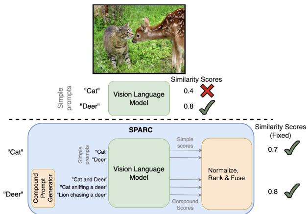
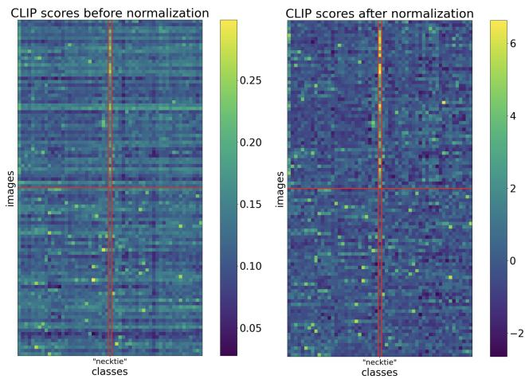
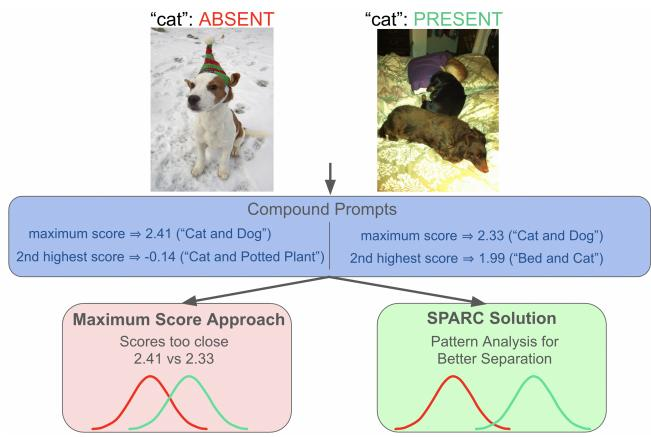
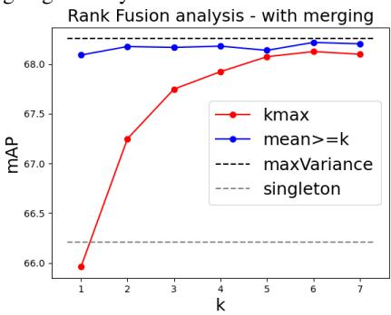

# SPARC: Score Prompting and Adaptive Fusion for Zero-Shot Multi-Label Recognition in Vision-Language Models

Kevin Miller   
Boston University   
nivek@bu.edu

Aditya Gangrade Boston University gangrade@bu.edu

Kate Saenko Boston University and Meta AI (FAIR) saenko@bu.edu

Samarth Mishra Boston University samarthm@bu.edu

Venkatesh Saligrama Boston University srv@bu.edu

## Abstract

Zero-shot multi-label recognition (MLR) with Vision-Language Models (VLMs)faces significant challenges without training data, model tuning, or architectural modifications. Existing approaches require prompt tuning or architectural adaptations, limiting zero-shot applicability. Our work proposes a novel solution treating VLMs as black boxes, leveraging scores without training data or ground truth. We make two contributions. First, we find that VLM scores suffer from image- and prompt-specific biases, and that simple standardization is surprisingly effective at removing these and boosting MLR performance. And second, we introduce compound prompts grounded in realistic object combinations. Our analysis reveals “AND”/“OR” signal ambiguities that cause maximum compound scores to be surprisingly suboptimal compared to second-highest scores. We introduce an adaptive fusion method to address this issue. Our method enhances other zero-shot approaches, consistently improving their results. Experiments show superior mean Average Precision (mAP) compared to methods requiring training data, achieved through refined object rankingfor robust zero-shot MLR. Code can befound at https://github.com/kjmillerCURIS/SPARC.

## 1. Introduction

Vision-Language Models (VLMs), such as CLIP [16], have emerged as general-purpose systems for understanding visual data through language-based queries. These models enable a broad range of applications, from object detection to image captioning, by linking visual inputs to language prompts. In standard settings where images contain single, recognizable objects, VLMs perform remarkably well. However, for the more complex task of zero-shot multi-label recognition (MLR) (Fig. 1 (top)), where models must identify multiple objects within an image without prior training on specific data, VLMs face significant limitations. Zero-shot MLR is crucial for applications in fields like robotics and medical imaging, where objects rarely appear in configurations that align neatly with training distributions. In these scenarios, achieving robust multi-label recognition without fine-tuning is challenging, given the task’s reliance on mean Average Precision (mAP) scores, which depend on ranking images for object presence.

  
Figure 1. (top) Vision-Language Models (VLMs) like CLIP can be used for zero-shot classification with image-text similarity scores. While this works fairly well for single-class labels, they can struggle in the multi-label scenario. (bottom) In this paper, we instroduce SPARC, our solution that functions on top of an existing VLM, treating it simply as a black-box score generator. Using class names, SPARC first creates compound prompts for additional queries to the VLM. It then normalizes, ranks and appropriately fuses them to generate final scores for the original classes.

VLM: Prompt Dependent AND/OR Noisy Channel. Despite the promise of zero-shot capabilities, current VLM approaches often struggle with MLR due to inherent scoring behaviors and biases. The performance of these models is hampered by a mix of conjunction (AND) and disjunction (OR) behaviors in their scoring, leading to inflated scores in compound prompts that contain multiple objects. For example, a prompt like “cat and sofa” might yield a high score even if only one of these objects is present in the image. This tendency reflects biases learned during training, where common object pairs receive higher scores even when only one object is present, disrupting the accuracy of mAP-based evaluations. Furthermore, existing methods for adapting VLMs to zero-shot MLR frequently rely on prompt tuning or architectural adjustments—approaches that are often dependent on training data and computationally intensive finetuning, which limit their generalizability to novel tasks.

  
Figure 2. A motivating example for the Normalization module, with CLIP scores on a slice of the COCO dataset, before and after normalization. The “necktie” class is present for examples in the top half of the plot and absent in the bottom half. Image- and prompt-level biases show up as horizontal and vertical striations; normalization removes these and creates better separation.

  
Figure 3. A motivating example for the Rank Fusion module, with an image where class “cat” is absent (left) and one where it is present (right). The highest compound prompt score is an unhelpful signal because it gives a high score to both negatives and positives, while the second-highest is more discriminative. Our method adaptively fuses the most informative order statistics, resulting in a strong signal.

Our Approach. In contrast to these methods, we introduce SPARC (Score Prompting and Adaptive Fusion for Zero-Shot Multi-Label Recognition in VLMs), a novel approach to zero-shot MLR that bypasses the need for training data, prompt tuning, or model-specific modifications. Our method treats the VLM as a black box, relying solely on its output scores to infer object presence (see Fig. 1). This black-box approach enables us to avoid assumptions about the model’s internal workings, allowing for a purely zeroshot framework that is both model-agnostic and datasetindependent. SPARC introduces two main innovations that address the unique challenges of zero-shot MLR.

A. Score Normalization. Our analysis finds that VLM scores suffer from image-level and prompt-level biases. Image-level bias refers to noise terms that are constant across prompts but vary between images, while promptlevel bias refers to the converse. Image-level bias in particular hampers mAP as it changes the ordering of scores within each class. Standardization is surprisingly effective at addressing this problem in MLR. Standardization alone improves mAP by 6-10% on COCO, VOC, and NUSWIDE.

B. Compound Prompts and Adaptive Fusion. Recognizing that VLMs can provide richer information when prompted with combinations of objects, we develop a method for constructing compound prompts. These prompts reflect likely contextual associations between objects, such as “cat and sofa” or “car and bus.” By gathering scores from these compound prompts, we can capture a spectrum of potential object contexts within the image, enhancing detection without relying on training-based adaptations. This composition strategy allows us to agnostically extract information from the VLM without depending on any specific dataset or VLM architecture.

Surprisingly, we observe that the maximum score among compound prompts is often a poor proxy for true object presence. Although one might expect the highest score to serve as a reliable signal, we find that it suffers because VLMs tend to respond to compound prompts with OR-like behavior, raising scores even when only one object in the prompt is present. Instead, we observe that the second-highest score consistently outperforms the maximum score by minimizing the effects of false positives caused by OR-like behavior. Building on this insight, we develop a PCA-based fusion method that combines information from multiple order statistics from the compound prompts, as well as the singleton prompts, ultimately optimizing mAP by enhancing score accuracy.

Complementarity. SPARC is complementary to other zero-shot and training-free MLR methods. When applied on top of these approaches, SPARC consistently enhances mAP scores by refining object ranking and reducing bias in VLM outputs. This capability makes SPARC an adaptable solution that can improve upon existing methods while maintaining a fully zero-shot, model-agnostic framework.

Empirical Results. SPARC achieves significant improvements in mAP, outperforming methods that incorporate architectural modifications. This outcome shows the potential of a fully zero-shot approach that relies only on systematic prompt design and score interpretation, rather than prompttraining or fine-tuning. By revealing that the second-highest score can be a superior proxy to the maximum, our findings provide new insights into VLM scoring behavior, suggesting that careful treatment of prompt compositions and score patterns can unlock robust MLR capabilities.

## 1.1. Related Work

Supervised Methods. Prior methods improve MLR performance through various approaches. DualCoOp [7, 18] trains prompts for text-guided spatial attention. Subsequent works use class co-occurrences to refine CLIP logits [17, 20]. Hierarchical structuring [20] encourages related classes to learn similar prompts. SSPA [19] combines embeddings from learned and LLM-generated prompts, and TRM-ML [12] uses pseudolabels to match texts to image regions. While effective, these methods require annotated training data. In contrast, ours is unsupervised.

Unsupervised Training-Based Methods. TaI-DPT [4] uses caption-only data to adapt CLIP to MLR by training a prompt-generation network using caption embeddings. Extensions include LLM-generated captions [22], pseudovisual prompts [21], and lightweight classifiers on caption embeddings [11, 23]. Separately, CDUL [1] leverages CLIP scores with spatial aggregation to create training pseudolabels. While these approaches demonstrate shared visionlanguage embedding power, they require significant training and CLIP internal access. In contrast, our black-box method uses crude cooccurrence-based compound prompts (essentially deleting implausible contextual associations) to probe multilabel information, fusing scores for effective MLR.

Unsupervised Training-free methods. The recent literature has proposed methods to adapt CLIP to the MLR taks in a training-free manner via architectural changes. CLIP-Surgery [8] alters the architecture to increase the coherence of attention masks within the image backbone, and normalizes features on a patch-by-patch basis. TagCLIP [10] uses internal attention masks to refine scores at a patch level based on regional coherence, and aggregate queries over crops of the image. Again, both methods require access to VLM internals, while ours works in a black-box manner.

Prompt Enhancement for Single-Label Recognition. Several methods use LLM-generated descriptive prompts for single-label recognition, combining them via max or mean fusion [3, 13–15]. While related, our compound prompts specifically target MLR by modeling class relationships rather than enriching individual class descriptions.

Complementarity of SPARC to Unsupervised Methods. We explicitly note that our methodology is complementary to much of the work on unsupervised VLM-based MLR. For instance, since we assume only black-box access to VLM scores, our compound prompts could be refined via prompt tuning as in TaI-DPT [4] and/or applied patch-bypatch and integrated a la TagCLIP [\` 10]. Scores from any of these methods can be combined via our normalization and rank-fusion approach. §4.3 investigates the resulting gains.

## 2. Method

We detail our method, SPARC (see Alg. 1 and Fig. 1). l Fig. 1)

Algorithm 1 SPARC Pipeline   
Input: Images $\mathcal { T } ,$ Class Names   
Output: Final scores $\zeta _ { i } ^ { t }$ for each image t and class i   
$P $ GenerateCompoundPrompts( ) (Details in Supp.)   
for $t \in \mathcal { Z }$ do   
st GetVLMScores(t, i) (Singleton scores)   
$( t , p )$ (Compound scs.)   
// (Normalize scores (Eqs. 1,2))   
s˜ti ImageNorm(sti), s˜tp ImageNorm $( s _ { p } ^ { t } )$   
$\bar { s } _ { i } ^ { t } \gets$ PromptNorm $( \tilde { s } _ { i } ^ { t } ) , \bar { s } _ { p } ^ { t }$ PromptNorm $( \tilde { s } _ { p } ^ { t } )$   
for $i \in \mathcal { C }$ do   
$r _ { i , k } ^ { t } \gets$ GetOrderStatistics $\big ( \{ \bar { s } _ { p } ^ { t } : i \in p \} \big )$   
$w ^ { i * }$ MaxVarDirection $( [ \bar { s } _ { i } ^ { t } , r _ { i , k } ^ { t } ] )$ (Eq. 3)   
$\begin{array} { r } { \tilde { \zeta } _ { i } ^ { t } \gets w _ { 0 } ^ { i * } \bar { s } _ { i } ^ { t } + \sum _ { k } w _ { k } ^ { i * } r _ { i , k } ^ { t } } \end{array}$ (Eq. 4)   
$\zeta _ { i } ^ { t } \gets \bar { s } _ { i } ^ { t } + \tilde { \zeta } _ { i } ^ { t }$ (Eq. 5)   
return $\{ \zeta _ { i } ^ { t } \}$

Setup. Suppose we have M images and N target classes, with classnames $c _ { 1 } , . . . , c _ { N }$ . We assume that we have a set of “singleton” prompts describing each of these classes in isolation (e.g. “picture of a cat”). Given an image t, let $s _ { 1 } ^ { t } , . . . , s _ { N } ^ { t }$ denote the similarity scores produced by a VLM when comparing the singleton prompts to that image.

A na¨ıve approach is to directly use these singleton scores to perform MLR. However, since the presence of a particular class alters the conditional probability of the remaining classes in images, it should be possible to further refine these scores by accounting for the multi-label structure of the images. In order to do this, we use the classnames to generate a further set of “compound” prompts P which mention multiple classes. For instance, the classes $\mathbf { \dot { \bar { c } } } \mathbf { a } \mathbf { t } ^ { \prime } $ and “sofa” may be compounded to “cat and sofa”. Let $\{ s _ { p } ^ { t } : p \in P \}$ denote the scores given by the VLM when comparing these compound prompts to image t.

Using the singleton as well as the compound prompts above, SPARC produces a vector of refined class-wise scores $\zeta _ { 1 } ^ { t } , \cdots , \zeta _ { N } ^ { t }$ , for each image t. Given this structure, SPARC has three main components: (i) compound prompt generation to enable the use of CLIP scoring for MLR (ii) image and prompt level normalization to allow scores to be directly compared, and (iii) Rank Fusion to combine singleton and compound prompt scores into a single score per class. We now discuss each of these aspects in detail.

## 2.1. Compound Prompt Generation

Our compound prompt generation method relies on contextual associations from commonly observed visual patterns to inform prompt structure. We provide pseudocode for the process in the Supplementary. The process takes as input the classnames $c _ { 1 } , . . . , c _ { N }$ , ground-truth cooccurrence statistics P, thresholds $\tau _ { 2 }$ and $\tau _ { 3 }$ (fixed to 0.05 and 0.025 for all datasets), and off-the-shelf LLM . We use probability thresholding to select pairs and triplets of classes that could plausibly coocur in realistic visual scenes. These pairs and triplets are used to make formulaic compound prompts of the form $\ddot { \mathbf { \Omega } } ^ { 6 6 } \mathbf { A }$ and $\mathbf { B } ^ { \ast }$ and $\ddot { \mathbf { \Omega } } ^ { 6 6 } \mathbf { A }$ , B, and $\mathbf { { C } } ' ^ { \ast }$ . We feed these formulaic prompts to LLM  and ask it to generate natural sentences from them. Our total set of compound prompts comprises the formulaic pair, formulaic triplet, and natural sentence prompts, which add up to on average $\leq 2 0$ compound prompts per class in all of our datasets. Note that probabilities P are not used in any part of our method other than compound prompt generation, which is why we say that it uses “rough” cooccurrence info. In fact, our ablations reveal that we still get a performance gain when using all possible class pairs instead of filtering by probability.

## 2.2. Normalization

Once we have obtained compound prompts $P ,$ we can query the VLM to obtain singleton scores $s _ { 1 } ^ { t } , . . . , s _ { N } ^ { t }$ and compound scores $\{ s _ { p } ^ { t } : p \in P \}$ for each image t. However, these scores contain both image- and prompt-specific biases. The former in particular is a problem, as it can change the order of scores between negative and positive images.

We address image-level bias for singleton and compound prompts, respectively, as follows:

$$
\tilde { s } _ { i } ^ { t } : = \frac { s _ { i } ^ { t } - \hat { \mu } ( s _ { \cdot } ^ { t } ) } { \hat { \sigma } ( s _ { \cdot } ^ { t } ) } a n d \tilde { s } _ { p } ^ { t } : = \frac { s _ { p } ^ { t } - \hat { \mu } ( \check { s } _ { \cdot } ^ { t } ) } { \hat { \sigma } ( \check { s } _ { \cdot } ^ { t } ) } ,\tag{1}
$$

where $\hat { \mu } ( s _ { . } ^ { t } ) , \hat { \mu } ( \check { s } _ { . } ^ { t } ) , \hat { \sigma } ( s _ { . } ^ { t } ) , \hat { \sigma } ( \check { s } _ { . } ^ { t } )$ are sample means and standard deviations across the prompt dimension for a single image. $\check { s } _ { 1 } ^ { t } , . . . , \check { s } _ { N } ^ { t }$ are the scores of “auxiliary” prompts that mention classnames in isolation and are used only to obtain statistics for standardizing compound prompt scores.

We also standardize across images to quash prompt bias:

$$
\overline { { s } } _ { i } ^ { t } : = \frac { \tilde { s } _ { i } ^ { t } - \hat { \mu } ( \tilde { s _ { i } } ) } { \hat { \sigma } ( \tilde { s _ { i } } ) } a n d \overline { { s } } _ { p } ^ { t } : = \frac { \tilde { s } _ { p } ^ { t } - \hat { \mu } ( \tilde { s } _ { p } ^ { \cdot } ) } { \hat { \sigma } ( \tilde { s } _ { p } ) } ,\tag{2}
$$

where $\hat { \mu } ( \tilde { s } _ { i } ^ { \cdot } ) , \hat { \mu } ( \tilde { s } _ { p } ^ { \cdot } ) , \hat { \sigma } ( \tilde { s } _ { i } ^ { \cdot } )$ , and $\hat { \sigma } ( \tilde { s } _ { p } )$ now denote sample means and SDs across the images. Removing prompt-level

bias makes scores from different prompts more compatible with each other, which is important for fusing them.

## 2.3. Rank Fusion

Our goal now is to find a way to use compound scores to strengthen the singleton scores. Let us define a bit more notation here. Let $\boldsymbol { r } _ { i , k } ^ { t }$ denote the score of the k-th highest scoring compound prompt that mentions class i.

A natural choice might be to choose $r _ { i , 1 } ^ { t } , \mathrm { i . e . }$ . the highest scoring prompt. After all, we would expect this to be the prompt that most closely describes the image, and if the image did not contain $c _ { i }$ then we would expect none of the prompts containing $c _ { i }$ to score high. However we find that $r _ { i , 1 } ^ { t }$ does not offer a good detection of classes. The mechanism behind this, which is explored in detail in $\ S 3$ , is that when using a compound prompt of the form ‘A and $\mathbf { B } ^ { \prime }$ to detect the class $A ,$ the score sees a large increase if the object B truly occurs in the image. This $\mathbf { \Delta } ^ { 6 } \mathrm { O R } ^ { , }$ -like behavior (§3) means that maximum score $r _ { i , 1 } ^ { t }$ typically captures the effect of other classes than A being present in the image, and thus leads to very poor separation between ground truth positive and negative images for any class. Counterintuitively, then, we find that ‘weakened maxes’, i.e., lower order statistics like $r _ { i , 2 } ^ { t }$ and $r _ { i , 3 } ^ { t }$ yield much better separation.

The above fact suggests that we ought to utilize the entirety of the order statistics $\{ r _ { i , k } ^ { t } \}$ in order to generate an effective fusion rule. We do fusion by taking a weighted sum where the weighting vector is the direction of highest variance, i.e., we compute the fused compound score $\{ \tilde { \zeta } _ { i } ^ { t }$ as

$$
w ^ { i * } : = \underset { w ^ { i } } { \arg \operatorname* { m a x } } \mathrm { V a r } _ { t } \big ( w _ { 0 } ^ { i } \bar { s } _ { i } ^ { t } + \sum _ { k } w _ { k } ^ { i } r _ { i , k } ^ { t } \big )
$$

$$
\tilde { \zeta } _ { i } ^ { t } : = w _ { 0 } ^ { i * } \bar { s } _ { i } ^ { t } + \sum _ { k } w _ { k } ^ { i * } r _ { i , k } ^ { t } .\tag{3}
$$

(4)

Note that the variance above is computed across examples, i.e. an iteration over example index t. Computing arg max above is just a matter of running PCA and taking the first principal component. The motivation for this approach is similar to that for linear discriminant analysis. Imagine each example is a point in $\mathbb { R } ^ { K _ { i } }$ , where $K _ { i }$ is the number of compound prompts for class i, and these points are distributed according to a mixture of two components, one for examples where i is present, the other for examples where i is absent. The shift between the means of these components should contribute to the variance in the direction of that shift. If we assume that these components are roughly homoskedastic, then, as long as the ‘signal’ induced by the mean shift is large compared to any heteroskedasticity, the highest variance direction $w ^ { i * }$ is precisely the direction of the mean shift, and thus $\tilde { \zeta } _ { i } ^ { t }$ effectively computes the component of the score vector that lies along this signal direction. While principled, this max-variance strategy is of course not necessary to execute, and we compare it to alternative fusion strategies in §4.4.1. We add (i.e. “merge”) this fused score into the original singleton score to get our final score:

$$
\zeta _ { i } ^ { t } : = s _ { i } ^ { t } + \tilde { \zeta } _ { i } ^ { t }\tag{5}
$$

In the next section we probe CLIP scores through a statistical lens to build intuition on our approach.

## 3. Noise Model of a VLM

Our methodological choices are strongly driven by the behavior of CLIP scores under compound prompts, and this leads to both the normalization approach taken, as well as our counterintuitive choice of fusing compound scores by weakened max instead of outright max. In order to justify these choices, we probe the structure of CLIP scores under compound prompts by constructing a statistical model.

Given an image t and a prompt with classes i and $j ,$ we model the score of compound prompt $^ { \ast } i$ and $j ^ { \flat }$ as $s _ { i , j } ^ { t } : = \theta _ { 1 } ^ { t } \cdot f ( y _ { i } ^ { t } , y _ { j } ^ { t } ) + \theta _ { 0 } ^ { t } + \varepsilon$ where $y _ { i } ^ { t } , y _ { j } ^ { t } \in \{ 0 , 1 \}$ indicate ground-truth presence of of the two classes, $\theta _ { 1 } ^ { t }$ and $\theta _ { 0 } ^ { t }$ represent image-level bias (e.g. due to visual domainshifts), and " is IID Gaussian noise. Note that our Normalization module is well-suited to mitigate variations in $\theta _ { 0 } ^ { t }$ and $\theta _ { 1 } ^ { t }$ , at least when " is not strongly dominating.

Now, the core object of interest is the map $f : \{ 0 , 1 \} ^ { 2 } $ R, which is responsible for modeling class pair interactions and prompt-level biases (see Table 1). In an ideal situation for MLR, f would behave roughly as an $\mathbf { \delta A N D } ^ { * }$ function, so that compound prompts would let us directly hone in on the presence of pairs of classes. However, prior work has observed that instead, for CLIP-type models, f tends to predominantly behave as an $\cdot _ { \mathrm { O R } } ,$ function, in that f is high if either i or j is present. Notice that if f were to exactly behave as an OR, compound prompts would not be effective in detecting classes that were missed by the singleton scores.

In experimentation, we found that the behavior of $s _ { i , j } ^ { t }$ is intermediary to the above extremes: CLIP scores for compound prompts behave qualitatively as an OR function with a small AND ‘bonus’ when both classes are present. This bonus, as well as the particular scores, are modulated by the classes mentioned (a consequence of prompt-level bias for each class) which we model as linear effects, leading to an overall model of the signal term of the CLIP score as

$$
\begin{array} { r l } & { f ( y _ { i } ^ { t } , y _ { j } ^ { t } ) : = \operatorname* { m a x } ( a _ { 0 } ^ { i } + y _ { i } ^ { t } a _ { 1 } ^ { i } , a _ { 0 } ^ { j } + y _ { j } ^ { t } a _ { 1 } ^ { j } ) } \\ & { \qquad + \delta _ { i j } \operatorname* { m i n } ( a _ { 0 } ^ { i } + y _ { i } ^ { t } a _ { 1 } ^ { i } , a _ { 0 } ^ { j } + y _ { j } ^ { t } a _ { 1 } ^ { j } ) , } \end{array}\tag{6}
$$

where the a terms are class-wise linear effect coefficients, and $\delta _ { i j }$ captures the strength of this AND bonus.

Note that this AND bonus is a critical feature of CLIP scores in their use for MLR problems, since this bump allows us to both infer the presence of classes that singleton prompts have missed, and indirectly to filter false positives (since the true positives are further elevated by the bonus).

<table><tr><td rowspan=1 colspan=1>Noise Model</td><td rowspan=1 colspan=1> $\overline { { f ( y _ { i } ^ { t } , y _ { j } ^ { t } ) } }$ </td><td rowspan=1 colspan=1>FVU</td></tr><tr><td rowspan=1 colspan=1>constant</td><td rowspan=1 colspan=1> $0 . 1$ </td><td rowspan=1 colspan=1>0.802</td></tr><tr><td rowspan=1 colspan=1>only AND</td><td rowspan=1 colspan=1> $\overline { { \operatorname* { m i n } ( a _ { 0 } ^ { i } + y _ { i } ^ { t } a _ { 1 } ^ { i } , a _ { 0 } ^ { j } + y _ { j } ^ { t } a _ { 1 } ^ { j } ) } }$ </td><td rowspan=1 colspan=1>0.536</td></tr><tr><td rowspan=1 colspan=1>only OR</td><td rowspan=1 colspan=1> $\operatorname* { m a x } ( a _ { 0 } ^ { i } + y _ { i } ^ { t } a _ { 1 } ^ { i } , a _ { 0 } ^ { j } + y _ { j } ^ { t } a _ { 1 } ^ { j } )$ </td><td rowspan=1 colspan=1>0.288</td></tr><tr><td rowspan=1 colspan=1>additive</td><td rowspan=1 colspan=1> $a _ { 0 } ^ { i } + y _ { i } ^ { t } a _ { 1 } ^ { i } + a _ { 0 } ^ { j } + y _ { j } ^ { t } a _ { 1 } ^ { j }$ </td><td rowspan=1 colspan=1>0.267</td></tr><tr><td rowspan=1 colspan=1>OR + staticAND-bonus</td><td rowspan=1 colspan=1> $\operatorname* { m a x } ( a _ { 0 } ^ { i } + y _ { i } ^ { t } a _ { 1 } ^ { i } , a _ { 0 } ^ { j } + y _ { j } ^ { t } a _ { 1 } ^ { j } ) +$  $\delta \operatorname* { m i n } ( a _ { 0 } ^ { i } + y _ { i } ^ { t } a _ { 1 } ^ { i } , a _ { 0 } ^ { j } + \dot { y } _ { j } ^ { t } a _ { 1 } ^ { j } )$ </td><td rowspan=1 colspan=1>0.263</td></tr><tr><td rowspan=1 colspan=1>OR + variableAND-bonus</td><td rowspan=1 colspan=1> $\operatorname* { m a x } ( a _ { 0 } ^ { i } + y _ { i } ^ { t } a _ { 1 } ^ { i } , a _ { 0 } ^ { j } + y _ { j } ^ { t } a _ { 1 } ^ { j } ) +$  $\delta _ { i , j } \operatorname* { m i n } ( a _ { 0 } ^ { i } + y _ { i } ^ { t } a _ { 1 } ^ { i } , a _ { 0 } ^ { j } + { y } _ { j } ^ { t } a _ { 1 } ^ { j } )$ </td><td rowspan=1 colspan=1>0.248</td></tr><tr><td rowspan=1 colspan=1>look-up table</td><td rowspan=1 colspan=1> $\overline { { \mathrm { L U T } ^ { ( i , j ) } ( y _ { i } ^ { t } , y _ { j } ^ { t } ) } }$ </td><td rowspan=1 colspan=1>0.235</td></tr></table>

Table 1. Comparison of fidelity of noise models for scoring pairwise compound prompts. Notice that the OR+AND-bonus model captures nearly all of the fidelity of the look-up table, and offers significant improvements over the simplified models above it.

Table 1 shows the results of a systematic evaluation of the AND-OR structure of compound CLIP scores, using 81K COCO test images and ViT-L/14@336px backbone. We evaluate various models of $f ,$ ranging from simple constant, ‘only OR,’ and ‘only AND’ models to additive models and OR+AND-bonus models with both a ‘static’  shared by all class pairs, and a ‘variable’ $\delta _ { i , j }$ that is class-pairspecific. The final entry is a ‘look-up table’ (LUT) model where all four values of f can vary arbitrarily, which serves as the most expressive baseline in this model class. These are evaluated w.r.t. the fraction of variance unexplained $( \mathrm { i } . \mathrm { e } . , 1 - R ^ { 2 }$ value). Observe that while the only OR model has remarkable fidelity, the additive and AND-bonus models significantly improve upon this, and allowing  to vary with $i , j$ yield a further significant improvement to within a 6% extra loss from the LUT model. This shows that our AND-bonus models capture a significant amount of the qualitative behavior of CLIP scores for compound prompts.

A closer look at these fitted models reveals the  values are small and relatively stable: for static $\delta ,$ the recovered value is 0.56, and the IQR for varying $\delta _ { i j }$ is (0.44, 0.57).

We find similar behavior when examining other backbones and datasets, which we detail in the Supplementary. The Supplementary also contains a theoretical view of the benefits of using weakened-max, based on the noise model.

## 3.1. Methodological Implications

The qualitative structure of the OR+AND-bonus behavior justifies our methodological choices in $\ S 2$ . Image-level normalization reduces the effect of variation in $\theta _ { 0 } ^ { t }$ (via mean subtraction) and $\theta _ { 1 } ^ { t }$ (via rescaling), while prompt-level normalization mitigates variations in $a _ { 0 } ^ { i }$ and $a _ { 1 } ^ { i }$ across classes.

We can also qualitatively observe that, because the OR component of the scores dominates the AND component, the maximum score $\boldsymbol { r } _ { i , 1 } ^ { t }$ can create false positives when i is absent but related class $j$ is present, and so we should look to subsequent order statistics for a better signal.

## 4. Experiments

Datasets We benchmark our method on 3 different MLR datasets. They are COCO2014 [9], which has 40,504 test images with 80 classes; VOC2007 [6], which has 4.952 test images with 20 classes; and NUSWIDE [2], which has 107,859 test images with 81 classes. We use only test, and not train, images from these datasets. We do use their conditional ground-truth label distributions, computed from training set, to choose compound prompts, but do not use ground-truth probabilities in any other part of our method.

CLIP Backbones In order to showcase the generality of our method, we apply it to 9 different CLIP backbones, which are ViT-L/14@336px, ViT-L/14, ViT-B/16, ViT-B/32, RN50x64, RN50x16, RN50x4, RN101, RN50. It is worth noting that from our model’s perspective, each backbone could be seen as a dataset of its own, providing a different source of scores for each image set. We use the default 224x224 resolution, resizing without center crop, for all ViT models. For ResNet models, we use the same resolution as [7] except when otherwise stated.

## 4.1. Our method improves over vanilla ZSCLIP across many datasets and models

As a baseline, we compute singleton scores using promptensembling with the 80 templates from the CLIP paper [16]. We then compute compound prompt scores and apply our method to the singletons and compounds. We compare our results to this vanilla ZSCLIP baseline.

Tab. 2 shows our results over three different datasets and nine different CLIP backbones. We see that our method is able improve over vanilla ZSCLIP by 12.6% on COCO, 8.8% on VOC, and 7.9% on NUSWIDE. Moreover, we see that our method acheives consistent improvements across all datasets and backbones, showcasing its generality. For example, the improvements range from 11.4-15.0% for COCO, 7.4-10% for VOC, and 6.1-10.8% for NUSWIDE. In fact, we see in the Supplementary that SPARC consistently improves the AP of almost every class in all datasets.

## 4.2. Our method complements local features

We consider another training-free zero-shot baseline introduced by the TaI-DPT paper [4] which we call “CLIP-DPT”. This method modifies ZSCLIP by replacing the final global pooling in the image backbone with a parameter-free attention pooling where the query is the text embedding, allowing us to harness local features that might otherwise be destroyed. We incorporate CLIP-DPT into our method, in the same way that we incorporated ZSCLIP in the previous section, and see a consistent improvement in Tab. 3, suggesting that our method is adding a complementary strength and not just compensating for lost local information.

## 4.3. Our method has complementary strengths

Several existing methods adapt CLIP to MLR tasks in an image-free ([4], [22], [21], [11], [23]) or training-free ([8], [10]) manner. These approaches lie outside our scope, as we focus on methods that are deployable ‘out-of-the-box’ on new datasets and VLMs, without requiring dataset-specific training or VLM surgery. Our black-box method allows easy ‘plug-and-play’ integration, using scores from existing methods in place of the vanilla ZSCLIP singleton scores.

We combine our method with three existing methods that have public codebases: (1) TagCLIP [10], a trainingfree method that benchmarks on COCO and VOC with a ViT-B/16 backbone; (2) TaI-DPT [4], an image-free method that requires training, which benchmarks on COCO, VOC, and NUSWIDE with a RN50 backbone; (3) CoMC [11], an image-free method that requires training and has a publiclyavailable RN50 model for COCO for one train seed.

There are some nuances regarding image preprocessing and score postprocessing. TaI-DPT and CoMC use different image preprocessing settings than us - theirs are lower resolution and take a center crop. For a fair comparison, we use these same preprocessing settings when getting compound prompt scores to combine with TaI-DPT and CoMC. We also try running both our and their method with our preprocessing setting, which we denote as “RN50\*”. TagCLIP takes images at their native resolution, so for that comparison we do the same in order to be apples-to-apples. As for score postprocessing, TagCLIP uses softmax, which we have found to have a normalizing effect, so we omit our image-level normalization on TagCLIP’s scores, and take the log of their scores to make them compatible with ours. We make no postprocessing changes for TaI-DPT or CoMC.

We show the results of these plug-and-play combinations in Tab. 4 and Tab. 5. We find that method is able to improve on TagCLIP by on average 1.6% and on TaI-DPT by on average 1.7%. We do not improve on CoMC, but the degradation is only 0.3%. These results suggest that our method’s signal complements those obtained through training and architectural manipulation by other methods.

## 4.4. Ablations

## 4.4.1 Normalization Module

We take a closer look at the Normalization module by seeing how it impacts the performance of both singleton prompts and our full pipeline. We see in Tab. 7 that the Normalization module provides significant gains in both cases (7.7% with singletons, 8.6% full pipeline), confirming that bias significantly impacts MLR when left unaddressed.

<table><tr><td rowspan="2">Dataset</td><td colspan="10">Architectures</td></tr><tr><td>ViT-L/14</td><td>336px</td><td>ViT-L/14</td><td>ViT-B/16</td><td>ViT-B/32</td><td>RN50 x64</td><td>RN50 x16</td><td>RN50 x4</td><td>RN101</td><td>RN50</td><td>Avg (archs)</td></tr><tr><td rowspan="2">COCO</td><td>ZSCLIP</td><td>59.1</td><td>58.1</td><td>55.5</td><td>50.9</td><td>58.6</td><td>58.1</td><td>55.7</td><td>52.7</td><td>53.0</td><td>55.7</td></tr><tr><td>Ours</td><td>70.5</td><td>69.5</td><td>67.4</td><td>64.0</td><td>70.6</td><td>70.1</td><td>69.5</td><td>67.7</td><td>65.7</td><td>68.3</td></tr><tr><td rowspan="2">VOC</td><td>ZSCLIP</td><td>81.3</td><td>79.9</td><td>79.9</td><td>77.5</td><td>83.1</td><td>81.6</td><td>80.6</td><td>80.3</td><td>79.7</td><td>80.4</td></tr><tr><td>Ours</td><td>88.9</td><td>88.3</td><td>88.7</td><td>87.5</td><td>90.5</td><td>90.3</td><td>90.0</td><td>89.7</td><td>89.2</td><td>89.2</td></tr><tr><td rowspan="2">NUSWIDE</td><td>ZSCLIP</td><td>41.4</td><td>41.0</td><td>40.9</td><td>38.7</td><td>39.8</td><td>38.5</td><td>38.8</td><td>35.7</td><td>38.5</td><td>39.3</td></tr><tr><td>Ours</td><td>47.5</td><td>47.1</td><td>47.3</td><td>46.9</td><td>47.4</td><td>47.9</td><td>48.3</td><td>46.5</td><td>45.8</td><td>47.2</td></tr></table>

Table 2. Results over three datasets and nine CLIP backbones. Our proposed method consistently outperforms the ZSCLIP baseline across all datasets and architectures exhibiting its effectivness on multi-label recognition tasks.
<table><tr><td colspan="2"></td><td>RN50 x64</td><td>RN50 x16</td><td>RN50 x4</td><td>RN 101</td><td>RN 50</td></tr><tr><td rowspan="2">COCO</td><td>CLIP-DPT</td><td>70.5</td><td>64.2</td><td>64.2</td><td>59.7</td><td>57.1</td></tr><tr><td>Ours-DPT</td><td>77.8</td><td>73.9</td><td>72.7</td><td>69.8</td><td>68.4</td></tr><tr><td rowspan="2">VOC</td><td>CLIP-DPT</td><td>86.6</td><td>82.4</td><td>86.1</td><td>83.5</td><td>82.6</td></tr><tr><td>Ours-DPT</td><td>91.1</td><td>89.8</td><td>88.5</td><td>88.5</td><td>89.9</td></tr><tr><td rowspan="2">NUS</td><td>CLIP-DPT</td><td>39.8</td><td>37.8</td><td>39.3</td><td>38.4</td><td>38.1</td></tr><tr><td>Ours-DPT</td><td>43.5</td><td>45.5</td><td>42.7</td><td>42.6</td><td>44.5</td></tr></table>

Table 3. Comparing SPARC with local-feature method CLIP-DPT [4]. Our method still improves upon local features, showing that its strength is complementary.
<table><tr><td></td><td>COCO ViT-B/16</td><td>VOC ViT-B/16</td><td>Avg</td></tr><tr><td>TagCLIP</td><td>70.9</td><td>91.7</td><td>81.3</td></tr><tr><td>+Ours</td><td>73.8</td><td>92.0</td><td>82.9</td></tr></table>

Table 4. Shows complementarity with architectural approaches, improving TagCLIP by 1.6%  
  
Figure 4. Average mAP for different Rank Fusion strategies demonstrates superiority of adaptive fusion over fixed strategies.

## 4.4.2 Rank Fusion Module

Our next ablation takes a closer look at the role of the Rank Fusion module. We consider some possible handcrafted strategies for combining compound prompt scores:

• “kmax”: Use the k-th highest compound score, i.e. $\boldsymbol { r } _ { i , k } ^ { t }$ $\bullet \mathrm { ~ } \tilde { \mathrm { ~ m e a n } } > = k ^ { \prime \prime } ;$ : Use partial avg $\begin{array} { r } { \frac { 1 } { m _ { i } - K + 1 } \sum _ { k = K } ^ { m _ { i } - K + 1 } r _ { i , k } ^ { t } } \end{array}$ Fig. 4 shows the average mAP of these, as well as “maxVariance” (3) and singleton-only, across all datasets and backbones. We see that 1st-max does much worse than 2ndmax, which underperforms 3rd-max, and so on, reaching a plateau around 5th-max. This lends credence to the idea that a weakened max is a stronger signal than outright max. We also see that the mean of all compound prompts (i.e. $\mathrm { \ddot { \ m e a n } } > = 1 \mathrm { \ ' } )$ does surprisingly well. This is actually consistent with our intuition on weakened maxes - the mean weakens the higher maxes by averaging them with the lower ones. We can improve further by excluding high ranks in the $\mathrm { \ddot { \Omega } m e a n } > = k ^ { \prime \prime }$ strategy. However, we can surpass all of these by adaptively weighting scores using the max-variance direction. The Supplementary repeats this analysis without the “merge” step (5), which turns out to be critical as well.

## 4.4.3 Compound Prompts

Our next ablation takes a closer look at the importance of the composition of our set of compound prompts and the use of rough cooccurrence info. The results are in Tab. 6. We start by including all pairs of classes in our set of formulaic pairwise prompts (i.e. of the form “A and B”) and not including any other kind of compound prompt. We find that this gives us a 1.3% average boost over normalized singletons. Filtering these pairwise prompts by cooccurrence, as our proposed method does, yields a further 0.5% boost, and adding triplet and descriptive prompts gives an additional 0.3% boost. It makes sense that using the full set of class pairs would still have some benefit, without any cooccurrence filtering, if all the classes as a whole tend to cooccur positively more often than negatively, as that would mean that they are on average a helpful signal for predicting each other’s presence. It might also be the case that related classes provide a useful context signal to CLIP. In any case, it is noteworthy that Rank Fusion can still help even when no cooccurrence information is required from the user.

Our final ablation aims to figure out whether our performance boost actually comes from the semantics of the compound prompts themselves, and not just an increase in number of prompts. Each class has on average $\leq 2 0$ compound prompts, 4x less than the 80 singleton prompt templates already used by vanilla ZSCLIP, but there is still an increase in total number of prompts, so an ablation is warranted.

<table><tr><td></td><td colspan="2">COCO</td><td colspan="2">VOC</td><td colspan="3">NUSWIDE</td><td colspan="4">COCO</td></tr><tr><td></td><td>RN50</td><td>RN50*</td><td>RN50</td><td>RN50*</td><td>RN50</td><td>RN50*</td><td> $\operatorname { A v g }$ </td><td></td><td>RN50</td><td>RN50*</td><td> $\operatorname { A v g }$ </td></tr><tr><td>TaI-DPT</td><td>65.1</td><td>68.2</td><td>88.5</td><td>88.0</td><td>46.2</td><td>43.4</td><td>66.6</td><td>CoMC</td><td>68.8</td><td>71.3</td><td>70.0</td></tr><tr><td>+Ours</td><td>68.2</td><td>70.1</td><td>90.3</td><td>90.2</td><td>46.6</td><td>44.6</td><td>68.3</td><td>+Ours</td><td>68.9</td><td>70.6</td><td>69.7</td></tr></table>

Table 5. Results from combining our method with TaI-DPT (left) and CoMC (right) showing compatibility with training-based methods. Our method improves TaI-DPT by 1.7% while preserving the existing strong signal of CoMC, degrading it by only 0.3%.
<table><tr><td>Normalize</td><td>Pair prompts</td><td>Triplets + Descriptive</td><td>Rank Fusion Strategy</td><td>COCO</td><td>VOC</td><td>NUS</td><td> $\operatorname { A v g }$ </td></tr><tr><td> $\checkmark$ </td><td></td><td></td><td></td><td>65.9</td><td>87.7</td><td>45.1</td><td>66.2</td></tr><tr><td> $\checkmark$ </td><td>all pairs</td><td></td><td>ours</td><td>67.5</td><td>88.5</td><td>46.4</td><td>67.5</td></tr><tr><td> $\checkmark$ </td><td>all pairs</td><td></td><td>mean</td><td>67.5</td><td>88.5</td><td>46.4</td><td>67.5</td></tr><tr><td> $\checkmark$ </td><td>cooccurrence-filtered</td><td></td><td>ours</td><td>68.1</td><td>89.0</td><td>47.0</td><td>68.0</td></tr><tr><td>√</td><td>cooccurrence-filtered</td><td></td><td>mean</td><td>67.9</td><td>88.5</td><td>46.8</td><td>67.7</td></tr><tr><td>√</td><td>cooccurrence-filtered</td><td>√</td><td>ours</td><td>68.3</td><td>89.2</td><td>47.2</td><td>68.3</td></tr></table>

Table 6. Ablations on the makeup of our compound prompts. We find that we can still enjoy some benefit from pairwise prompts withou any cooccurrence filtering.
<table><tr><td>Compound</td><td>Normalize</td><td>COCO</td><td>VOC</td><td>NUS</td><td> $\operatorname { A v g }$ </td></tr><tr><td></td><td></td><td>55.7</td><td>80.4</td><td>39.3</td><td>58.5</td></tr><tr><td></td><td>√</td><td>65.9</td><td>87.7</td><td>45.1</td><td>66.2</td></tr><tr><td>√</td><td></td><td>58.4</td><td>80.5</td><td>40.0</td><td>59.7</td></tr><tr><td>√</td><td>√</td><td>68.3</td><td>89.2</td><td>47.2</td><td>68.3</td></tr></table>

Table 7. Ablations on Normalization module. Quantifies impact of normalization both with and without compound prompts.

We take inspiration from WaffleCLIP [5], which found that prompt ensembles made of random texts could perform just as well as descriptive ensembles generated by LLMs. For our ablation, we use WaffleCLIP-style prompts in place of compound prompts. Specifically, for each classname ci we create 30 prompts of the form “A photo of a c , which is [RAND]”, where “[RAND]” is 10 random characters. We try both the “maxVariance” and “mean>= 1” fusion strategies, as the latter is more typical for ensembling.

We show the results of this ablation in the Supplementary. We see that randomized compound prompts do not offer any complementary signal to the singleton prompts. Thus, any gain from compound prompts must come from their semantics. It is unlikely that simple prompt diversity explains the gains either, given that vanilla ZSCLIP already uses a large and diverse template ensemble.

## 4.5. A qualitative look at the weakened max

We saw in Sec. 4.4.1 that the second-highest compound prompt score is a much better signal than the highest one. This counterintuitive finding can be explained through object cooccurrence. When CLIP is given a compound prompt like ‘cat and sofa’, it has OR-like behavior - giving high scores if either object is present. The maximum score often comes from such prompts where only one object is present but strongly detected. In contrast, the second-highest scores tend to come from prompts where both objects have moderate confidence, providing a more reliable signal. This explains why using second-highest scores results in better separation between positive and negative cases.

Fig. 3 shows an example of what happens at an image level. On the right is an image that contains a cat (curled up behind the two dogs on the bed); on the left is an image without a cat. The highest-scoring compound prompt is “Cat and Dog” for both images. This prompt gives a high score to the right image by detecting the dogs, but it also detects the dog in the left image for the same reason, and so it also misorders the images. But the second-highest-scoring prompts - “Bed and Cat” for right image, “Cat and Potted plant” for left - correctly order the images.

We show score histograms for one of the classes in the Supplementary to illustrate what happens in aggregate - the second-highest score lifts positive examples without introducing as many false-positives as first-highest score.

## 5. Conclusions

We presented SPARC, a zero-shot multi-label recognition approach that improves VLM performance without training data or architectural changes. Our key insights - the suboptimal nature of maximum scores and presence of systematic biases - led to two complementary innovations: compound prompts with adaptive fusion, and systematic normalization. Beyond improving standalone VLM performance, SPARC enhances existing zero-shot and trainingbased methods while maintaining a black-box approach. The success of our method reveals fundamental properties of VLM scoring behavior, suggesting promising directions for improving zero-shot recognition through score analysis rather than architectural modification or finetuning.

## References

[1] Rabab Abdelfattah, Qing Guo, Xiaoguang Li, Xiaofeng Wang, and Song Wang. Cdul: Clip-driven unsupervised learning for multi-label image classification. In Proceedings ofthe IEEE/CVF International Conference on Computer Vision, pages 1348–1357, 2023. 3

[2] Tat-Seng Chua, Jinhui Tang, Richang Hong, Haojie Li, Zhiping Luo, and Yantao Zheng. Nus-wide: a real-world web image database from national university of singapore. In Proceedings ofthe ACM International Conference on Image and Video Retrieval, New York, NY, USA, 2009. Association for Computing Machinery. 6

[3] Reza Esfandiarpoor and Stephen H Bach. Follow-up differential descriptions: Language models resolve ambiguities for image classification. In Proceedings of the International Conference on Learning Representations (ICLR), 2024. 3

[4] Guo et al. Texts as images in prompt tuning for multi-label image recognition. In CVPR, ’23. 3, 6, 7

[5] Roth et al. Waffling around for performance: visual classification with random words and broad concepts. ICCV, ’23. 8, 3

[6] M. Everingham, L. Van Gool, C. K. I. Williams, J. Winn, and A. Zisserman. The pascal visual object classes (voc) challenge. International Journal of Computer Vision, 88(2): 303–338, 2010. 6

[7] Ping Hu, Ximeng Sun, Stan Sclaroff, and Kate Saenko. Dualcoop++: Fast and effective adaptation to multi-label recognition with limited annotations. IEEE Transactions on Pattern Analysis and Machine Intelligence, 2023. 3, 6

[8] Yi Li, Hualiang Wang, Yiqun Duan, and Xiaomeng Li. Clip surgery for better explainability with enhancement in openvocabulary tasks. arXiv preprint arXiv:2304.05653, 2023. 3, 6

[9] Tsung-Yi Lin, Michael Maire, Serge Belongie, James Hays, Pietro Perona, Deva Ramanan, Piotr Dollar, and C Lawrence´ Zitnick. Microsoft coco: Common objects in context. In Computer Vision–ECCV 2014: 13th European Conference, Zurich, Switzerland, September 6-12, 2014, Proceedings, Part V 13, pages 740–755. Springer, 2014. 6

[10] Yuqi Lin, Minghao Chen, Kaipeng Zhang, Hengjia Li, Mingming Li, Zheng Yang, Dongqin Lv, Binbin Lin, Haifeng Liu, and Deng Cai. Tagclip: A local-to-global framework to enhance open-vocabulary multi-label classification of clip without training. In Proceedings ofthe AAAI Conference on Artificial Intelligence, pages 3513–3521, 2024. 3, 6

[11] Yicheng Liu, Jie Wen, Chengliang Liu, Xiaozhao Fang, Zuoyong Li, Yong Xu, and Zheng Zhang. Language-driven cross-modal classifier for zero-shot multi-label image recognition. In Forty-first International Conference on Machine Learning, 2024. 3, 6

[12] Leilei Ma, Hongxing Xie, Lei Wang, Yanping Fu, Dengdi Sun, and Haifeng Zhao. Text-region matching for multilabel image recognition with missing labels. In Proceedings of the 32nd ACM International Conference on Multimedia, page 6133–6142. ACM, 2024. 3

[13] Sachit Menon and Carl Vondrick. Visual classification via

description from large language models. arXiv preprint arXiv:2210.07183, 2022. 3

[14] Zachary Novack, Julian McAuley, Zachary Chase Lipton, and Saurabh Garg. Chils: Zero-shot image classification with hierarchical label sets. In International Conference on Machine Learning, pages 26342–26362. PMLR, 2023.

[15] Sarah Pratt, Ian Covert, Rosanne Liu, and Ali Farhadi. What does a platypus look like? generating customized prompts for zero-shot image classification. In Proceedings of the IEEE/CVF International Conference on Computer Vision, pages 15691–15701, 2023. 3

[16] Alec Radford, Jong Wook Kim, Chris Hallacy, Aditya Ramesh, Gabriel Goh, Sandhini Agarwal, Girish Sastry, Amanda Askell, Pamela Mishkin, Jack Clark, et al. Learning transferable visual models from natural language supervision. In International conference on machine learning, pages 8748–8763. PMLR, 2021. 1, 6

[17] Samyak Rawlekar, Shubhang Bhatnagar, Vishnuvardhan Pogunulu Srinivasulu, and Narendra Ahuja. Improving multi-label recognition using class co-occurrence probabili ties. In Proceedings of the International Conference on Pat tern Recognition (ICPR), 2024. 3

[18] Ximeng Sun, Ping Hu, and Kate Saenko. Dualcoop: Fast adaptation to multi-label recognition with limited annotations. Advances in Neural Information Processing Systems, 35:30569–30582, 2022. 3

[19] Hao Tan, Zichang Tan, Jun Li, Jun Wan, Zhen Lei, and Stan Z. Li. Sspa: Split-and-synthesize prompting with gated alignments for multi-label image recognition. ArXiv, abs/2407.20920, 2024. 3

[20] Ao Wang, Hui Chen, Zijia Lin, Zixuan Ding, Pengzhang Liu, Yongjun Bao, Weipeng Yan, and Guiguang Ding. Hierarchi cal prompt learning using clip for multi-label classification with single positive labels. In Proceedings of the 31st ACM International Conference on Multimedia, page 5594–5604, New York, NY, USA, 2023. Association for Computing Ma chinery. 3

[21] Xiangyu Wu, Qing-Yuan Jiang, Yang Yang, Yi-Feng Wu, Qing-Guo Chen, and Jianfeng Lu. Tai++: Text as image for multi-label image classification by co-learning transferable prompt. arXiv preprint arXiv:2405.06926, 2024. 3, 6

[22] Shuo Yang, Zirui Shang, Yongqi Wang, Derong Deng, Hongwei Chen, Qiyuan Cheng, and Xinxiao Wu. Data-free multi-label image recognition via llm-powered prompt tun ing. arXiv preprint arXiv:2403.01209, 2024. 3, 6

[23] Xueling Zhu, Jiuxin Cao, Jian Liu, Dongqi Tang, Furong Xu, Weijia Liu, Jiawei Ge, Bo Liu, Qingpei Guo, and Tiany Zhang. Text as image: Learning transferable adapter for multi-label classification. ArXiv, abs/2312.04160, 2023. 3, 6

Acknowledgements. We thank Ping Hu, Siqi Wang, and Piotr Teterwak for their valuable discussions, as well as the anonymous reviewers for their thorough and helpful feedback. This research was supported by the Army Research Office Grant W911NF2110246, AFRL Grant FA8650-22- C1039, and the National Science Foundation grants CPS-2317079, CCF-2007350, and CCF-1955981.