# Scaling up Image Segmentation across Data and Tasks

Pei Wang1, Zhaowei Cai1, Hao Yang1, Ashwin Swaminathan1, R. Manmatha2, Stefano Soatto2

1Amazon AGI 2AWS AI Labs

{pwwng,zhaoweic,haoyng,swashwin,manmatha,soattos}@amazon.com

## Abstract

Traditional segmentation models, while effective in isolated tasks, often fail to generalize to more complex and openended segmentation problems, such as free-form, openvocabulary, and in-the-wild scenarios. To bridge this gap, we propose to scale up image segmentation across diverse datasets and tasks such that the knowledge across different tasks and datasets can be integrated while improving the generalization ability. Mixed-Query Transformer (MQ-Former), a novel segmentation framework, is introduced and designed to scale seamlessly across both data size and task diversity. It is built upon a dynamic object query mechanism called mixed query, which fuses different types of queries using cross-attention. This hybrid approach enables the model to balance between instance- and stuff-level segmentation, providing enhanced scalabilityfor handling diverse object types. We further enhance scalability by leveraging synthetic data-generating segmentation masks and captions for pixel-level and open-vocabulary tasks-drastically reducing the needfor costly human annotations. By training on multiple datasets and tasks at scale, MQ-Former continuously improves performance as the volume and diversity of data and tasks increase. It exhibits strong generalization capabilities, boosting performance in open-set segmentation tasks SeginW by 7 points. These advancements mark a key step toward universal, scalable segmentation models capable ofaddressing the demands of real-world applications.

## 1. Introduction

Image segmentation aims to partition an image into discrete pixel groups and includes tasks like semantic, instance, panoptic, foreground/background, and referring segmentation, etc. A universal segmentation model should generalize robustly across diverse applications, including openvocabulary, free-form, and in-the-wild segmentation [35, 62, 75]. To achieve that, such a model is expected to be trainable jointly across any segmentation datasets and tasks at scale such that the knowledge across different tasks and datasets can be integrated. This integration is essential for improving performance on complex, real-world problems, particularly when larger and more diverse datasets are available. We say that a segmentation model is scalable if it can effectively improve with the increase in both dataset size and task diversity. A scalable model can continuously evolve by leveraging existing and future datasets, without requiring frequent redesign or retraining, making development more efficient. In this way, simply gathering more diverse data can naturally enhance the model’s capabilities.

Despite these benefits, numerous prior works were explored on specific tasks or datasets in isolation [4–6, 17, 39, 50, 60]. While these models have achieved significant success in their respective areas, they often struggle to generalize to real-world scenarios, where versatility and adaptability are critical. The limitations of task-specific models raise a key question: Can we design a model that scales effectively across both tasks and datasets while improving generalization in diverse, real-world applications?

Several recent efforts have aimed to scale up segmentation training tasks and datasets by exploring unified frameworks, seeking to address the joint training of multiple tasks and datasets, summarized in Table 1. However, these existing works possess certain inherent limitations, far from achieving true scalability across both tasks and datasets. Some of these works have made progress in dataset scalability but remain restricted to a single task [21, 26]. Others [18, 70] have demonstrated limited task scalability—addressing only specific tasks such as semantic, instance, or panoptic segmentation—but cannot generalize across datasets with different class structures. There is few attempt for both datasets and tasks scalability [15, 31, 75]. X-Decoder [75] offers a promising solution with its learnable queries for jointly training on tasks and datasets. Nevertheless, its subpar performance in instance-level segmentation reveals shortcomings in its architecture, indicating that its task scalability is still constrained.

In this work, we conduct an in-depth analysis and identify a key limitation preventing effective scalability: the design of object queries, a fundamental component in transformer-based segmentation models. The learnable queries used in X-Decoder have shown promising results for semantic (stuff) segmentation but struggle with instance (thing) segmentation1. To address this issue, we draw inspiration from the success of conditional queries in object detection [27, 37, 68, 74] and introduce them to enhance X-Decoder’s ability in instance-level segmentation and broaden its scalability across both tasks and datasets. However, while conditional queries excel at instance objects, they perform poorly with stuff objects. To harmonize the strengths of both query types, we propose a novel object query mechanism called mixed query. This approach seamlessly mixes learnable queries and conditional queries with a qual-query cross attention mechanism. It enables sample and object-wise dynamic query selection, opposite to traditional rigid assignment [1, 47, 70], and hierarchical and interactive feature representation which improve the model’s ability to handle diverse object types, enabling scalability across various tasks and datasets.

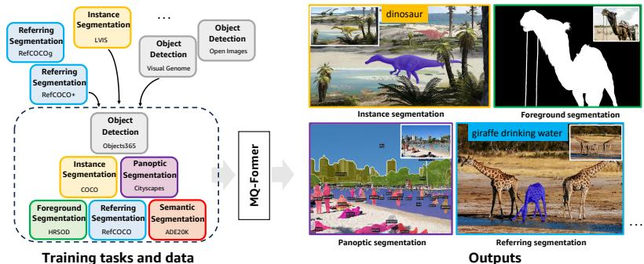

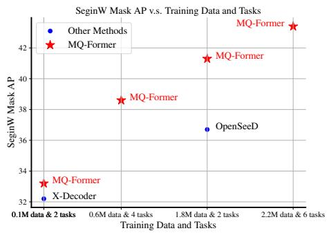  
Figure 1. MQ-Former, a scalable segmentation model, is designed to train across a wide range of datasets and segmentation tasks at scale, continuously evolves by leveraging existing and newly arrived datasets. The model supports open-vocabulary inference and excels in handling multiple segmentation tasks simultaneously, such as instance, panoptic, semantic, foreground and referring segmentation. The graph demonstrates the model’s strong generalization capabilities, as indicated by its performance improvements on the SeginW benchmark, which scales efficiently with increasing amounts of training data and tasks.

Building on this foundation, we introduce a scalable segmentation architecture called MQ-Former. MQ-Former can be trained on diverse segmentation tasks and datasets at scale, as shown in Figure 1, without being limited to specific datasets [21, 26, 73] or tasks [18, 71] as previous works. A key advantage of MQ-Former’s scalable design is its ability to continuously improve segmentation performance by training on a wide variety of existing datasets and tasks. We demonstrate that scaling up both the volume of training data and diversity of tasks consistently enhances the model’s segmentation capabilities, particularly for realworld, free-form open-set segmentation tasks. As shown in Figure 1 (right), when we scale the data and tasks from 0.1M to 0.6M and include more diverse tasks, the open-set segmentation mask AP performance on the SeginW benchmark [75] improves from 33.2 to 38.6. While current public datasets provide a good starting point, we are eager to explore the limits of the model’s generalization capabilities by utilizing even more diverse segmentation data. However, human annotation for segmentation is usually expensive, e.g., requiring a few minutes to annotate a single COCO image. To circumvent this data limitation, we propose to harness synthetic data, i.e., synthetic segmentation masks for pixel-level segmentation and synthetic segment captions for open-vocabulary semantic alignment. This is feasible as some recent models can already generate impressive synthetic segmentation masks [20, 24] and object-level captions [56, 69], and the synthetic data has been proven helpful for model improvement [10, 13]. With the low cost of generating synthetic data, we can easily scale up training. Incorporating synthetic data not only mitigates the challenge of data scarcity but also strengthens the model’s robustness and semantic understanding. By further scaling with synthetic data, MQ-Former pushes its performance even higher, reaching 43.2, an additional improvement of 4.6 points. These advancements represent a significant step toward developing a scalable and highly generalized image segmentation model.

Overall, this paper makes three key contributions: (1) We introduce MQ-Former, a scalable segmentation architecture capable ofjoint training and evaluation across multiple tasks and datasets, overcoming the limitations of task- or dataset-specific models. (2) We show that scaling the model across diverse tasks and datasets consistently improves its generalization ability. (3) By incorporating synthetic data, MQ-Former achieves state-of-the-art performance on several open-set segmentation benchmarks.

## 2. Related Work

Scalable segmentation models Early unified segmentation models lack scalability due to architectural modifications required for different datasets and tasks [7, 8, 28]. For instance, Mask DINO [28] uses a one-stage encoder-decoder for semantic segmentation, but a two-stage approach for instance and panoptic segmentation, limiting scalability. Some models achieve partial scalability for tasks [18, 44, 71] or datasets [21, 26, 73], but not both. For example, OneFormer [18] and OpenSeeD [70] scale tasks but struggle with dataset scalability. OneFormer lacks the ability to unify class spaces across datasets, while OpenSeeD requires additional stuff/thing annotations, which are impractical for most datasets. Few models attempt to address both data and task scalability. X-Decoder [75] and DaTaSeg [15] address both but perform poorly in instance segmentation.

Table 1. Summary of data and task scalability of related image segmentation works. Unlike previous works that are only scalale to specific datasets or limited tasks, MQ-Former overcomes these constraints by enabling joint data and task scalability.
<table><tr><td rowspan="2"></td><td rowspan="2">Data Scalability</td><td colspan="5">Task Scalability</td><td rowspan="2">Detection</td></tr><tr><td>Instance</td><td>Semantic</td><td>Panoptic</td><td>Referring</td><td>Foreground</td></tr><tr><td>MSeg [26] UniSeg [21] OneFormer [18] OpenSeeD [70] OMG-Seg [31] X-Decoder [75] DaTaSeg [15] Our MQ-Former</td><td>√ √ &gt;&gt;&gt;&gt;</td><td>&gt;&gt;~</td><td>&gt;</td><td>&gt;</td><td>√</td><td></td><td>√ √</td></tr></table>

Using synthetic data for stronger model For pseudo caption generation, [10] uses an image captioning model to generate captions for object detection but overlooks context information. TAP [43] enhances SA-1B [24] with regionlevel captions, though its data is not open-sourced, and its impact on segmentation models remains unclear. For pseudo mask generation, PseudoSeg [77] creates pseudo masks from unlabeled or image-labeled data for semantic segmentation, while OpenSeeD [70] generates pseudo masks from bounding boxes during training. However, we argue that these methods increase training costs. In contrast, inspired by recent segmentation models capable of generating high-quality mask predictions [20, 24], we generate synthetic data offline, treating it as ground truth during training.

## 3. Method

In this section, we first present an overview of the MQ-Former architecture. We then introduce the novel mixed query mechanism, a key component that drives effective scalability within the architecture. Next, we explain how MQ-Former scales across both data and tasks. Finally, we outline our efforts to further enhance scalability using synthetic data.

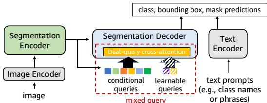  
Figure 2. The overview of MQ-Former architecture. The model takes an image and a list of textual language prompts as input and outputs their corresponding localized segment masks.

## 3.1. MQ-Former Architecture

Figure 2 shows the architecture of the proposed MQ-Former. It has four major components, image and text encoder, and segmentation encoder and decoder. The image encoder, segmentation encoder, and segmentation decoder are based on the architecture design of Mask DINO [28]. The image encoder processes the input image into multiscale features, which are then refined by the segmentation encoder. To support open-vocabulary prediction and diverse data scalability, a text encoder, inspired by X-Decoder [75] and X-DETR [3], is included to encode text queries into semantic embeddings. The segmentation decoder uses multiple object queries to attend to image features, aligning object embeddings with text embeddings to predict class, bounding box, and segmentation mask.

## 3.2. Query Design for Scalable Segmentation

Object queries are central to transformer-based detection and segmentation models, drawing significant attention [27, 37, 41, 57, 68, 74]. This section reviews the common learnable object query strategy in segmentation architectures and introduces our new mixed query mechanism.

Learnable query relies on a single set of object queries trained from scratch to interact with image features, encoding object location and class information (see Figure 3 (a)). Due to its simplicity, this approach has been widely adopted in the object detection and segmentation [7, 15, 55, 75]. For example, X-Decoder [75] applies learnable queries to pursue data and task scalability. However, several studies have demonstrated that learnable queries perform suboptimally in object detection [27, 37, 74]. Our experiments reveal similar findings in image segmentation: while learnable queries perform well for semantic segmentation, they fall short in instance-level tasks such as instance segmentation. Table 2 highlights this performance gap compared to more advanced query designs, limiting X-Decoder’s broader scalability across complex tasks and data.

To address the shortcomings of learnable queries in instance-level segmentation, we explore more advanced query designs that have proven successful in object detection. One such approach is the conditional query [27, 37, 68, 74], initially proposed in [74] and refined in [27, 37, 68]. Conditional queries aim to mimic the proposal generation mechanism found in traditional two-stage object detection frameworks [48], but adapted for transformer-based detectors. Unlike learnable queries, which are independently trained, conditional queries are derived directly from the transformer encoder output, as illustrated in Figure 3 (b). The transformer encoder is trained to predict region proposals, from which high-confidence proposals are selected and fed into the transformer decoder as object queries for final predictions like bounding boxes or segmentation masks.

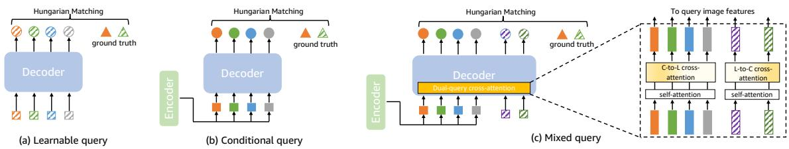  
Figure 3. The comparison of different query strategies. Square with diagonal slashes: learnable query; solid square: conditional query; circle with slashes: query embedding of learnable queries; solid circle: query embedding of conditional queries; triangle with slashes: ground truth of stuff class; solid triangle: ground truth of thing classes; rectangle with slashes: intermediate query embedding of learnable queries; solid rectangle: intermediate query embedding of conditional queries. (a) learnable query is learned from scratch. (b) conditional query is derived and selected from encoder. (c) mixed query fuses both types of queries by dual-query cross attention, conditional-to learnable (C-to-L) and a learnable-to-conditional (L-to-C) cross-attention modules.

Conditional queries are well-suited for detecting objects likely present in an image, showing strong performance in object detection [74]. However, our experiments reveal that this strategy does not universally benefit all segmentation tasks. As shown in Table 2, the performance on semantic segmentation is significantly worse compared to learnable queries. This is because, in semantic segmentation, many classes (often referred to as “stuff” classes) represent background regions with undefined shapes and spatial extents. Conditional queries, derived from local image features, struggle to capture these characteristics effectively, leading to suboptimal results. This is different from learnable query that is learned from scratch, not conditional on an encoder output that usually derived from a local patch feature [70]. Since stuff classes are prevalent in real-world datasets, solely using conditional queries also limits model scalability across diverse tasks and datasets.

Both learnable and conditional queries have their respective strengths: learnable queries excel at handling large, amorphous background regions, while conditional queries specialize in capturing local, instance-level features. However, their individual limitations hinder scalability across diverse datasets and tasks. This raises a simple yet powerful idea: can we combine the strengths of both to enhance scalability? Following this line of thinking, we propose a mixed query strategy (Figure 3 (c)). In this approach, the object query set consists of both learnable and conditional queries, which interact with each other through a deep fusion mechanism via dual-query cross-attention. In each decoder layer, query fusion is conducted by a conditionalto-learnable and a learnable-to-conditional cross-attention modules. The idea is that each type of queries should refine their representation through mutual exchange by considering the information from another type of queries. For loss computation, Hungarian matching is applied across all object queries, without differentiating between query types, allowing the model to seamlessly integrate both types of queries for improved scalability across diverse segmentation datasets and tasks.

With dual-query cross-attention mechanism, the mixed query seamlessly integrates learnable queries with conditional queries, offering several key advantages. First, dynamic query selection. Without rigid assignment, two types of queries can dynamically choose their preferred objects to detect for each example. And since they are complementary each other for global background feature and local instance feature, this property broadens the scope of the trainable dataset and tasks and therefore improves the scalability of the model. Second, a hierarchical and interactive feature representation. Dual-query cross-attention can lead to a hierarchical feature representation where learnable queries capture the overall structure and semantics of the objects in the scene. On the other hand, conditional queries refine these global features by attending to specific parts of the image. This interaction allows the model to dynamically adjust focus, using conditional queries to zero in on hard-tosegment objects while still retaining the global understanding provided by learnable queries. This can improve the model’s ability to handle both coarse and fine segmentation tasks. For complex objects or occluded regions, mixed query could also provide complementary perspectives on the same object. Overall, mixed query dynamically prioritizes query types according to data and task demands, improving the model’s generalization capabilities, as shown in the experiments.

## 3.3. Scalable Segmentation across Data and Tasks

Under our MQ-Former architecture, we are ready to scale up image segmentation both for datasets and tasks. This is thanks to a neat and unified input data format of training MQ-Former. For the segmentation datasets of different tasks, the training set can always be reformulated to a unified format $\mathbfcal { D } = \{ ( \mathbf { x } _ { i } , \mathbf { y } _ { i } ) \} _ { i = 1 } ^ { N }$ where $\mathbf { x } _ { i }$ is the image and $\mathbf { y } _ { i } = \{ ( c _ { j } , \mathbf { b } _ { j } , \mathbf { m } _ { j } ) \} _ { j = 1 } ^ { B }$ its B annotations. $( c _ { j } , \mathbf { b } _ { j } , \mathbf { m } _ { j } )$ is a triplet that depicts a single mask annotation on the image. $c _ { j }$ is the semantic class label (e.g., “apple”, “road” for semantic/instance/panoptic/foreground segmentation), or a text description (e.g., “a person wearing a red shirt” for referring segmentation), to describe the semantic information characterized with the binary mask region m . $\mathbf { b } _ { j }$ is the bounding box annotation of this region which can be derived from the mask annotation. Notably, $c _ { j }$ could be any natural language description without demanding extra annotation or query assignment. This is unlike prior works [1, 31, 47, 70] that impose strict task or class assignments for each query, such as OpenSeeD [70], which needs stuff/things discrimination for each class. This limitation restricts its dataset and task scalability as such annotation is not available for most public datasets like Objects365 [51], Visual Genome [25] since there is no clear boundary between stuff and thing classes. For example, “window” and “table” classes are labeled as thing in ADE20K [72] but as stuff in COCO [33]. Additionally, tasks like referring segmentation cannot classify their free-form annotations as either stuff or thing, further highlighting the benefit of our unified and annotation-flexible approach.

The whole model thus can be trained with loss function as follows,

$$
\begin{array} { r l } & { \mathcal { L } = \displaystyle \sum _ { ( \mathbf { x } _ { i } , \mathbf { y } _ { i } ) \in \mathcal { D } } \sum _ { ( c _ { j } , \mathbf { b } _ { j } , \mathbf { m } _ { j } ) \in \mathbf { y } _ { i } } \mathcal { L } _ { c } ( \mathbf { P } ^ { c } ( \mathbf { x } _ { i } ) , \mathbf { H } ( c _ { j } ) ) } \\ & { + \mathcal { L } _ { b } ( \mathbf { P } ^ { b } ( \mathbf { x } _ { i } ) , \mathbf { b } _ { j } ) + \mathcal { L } _ { m } ( \mathbf { P } ^ { m } ( \mathbf { x } _ { i } ) , \mathbf { m } _ { j } ) , } \end{array}\tag{1}
$$

where $\mathcal { L } _ { c } , \mathcal { L } _ { b } , \mathcal { L } _ { m }$ are the class, bounding box (bbox) and mask loss, respectively. They are applied to class, bbox and segment mask embeddings, $\mathbf { P } ^ { c } , \mathbf { P } ^ { b } , \mathbf { P } ^ { m }$ , from the decoder outputs and text embedding H, for supervision (for clarity, we omit the weight for each loss term and P, H represent the functions and their resulting embeddings). The class loss is the focal loss [34] applied on the dot-product between the class embedding and text embedding. The bbox loss is generalized IoU and L1 loss [49] between the bounding box embedding and ground truth. The mask loss is calculated with generalized dice loss [52] on the mask prediction which is derived from the mask embedding and a pixel encoder. Since semantic labels are encoded as textual descriptions, the model supports open-vocabulary and free-form scenarios without complex label alignment across datasets. Hungarian matching and loss computation are performed on the query embedding outputs of both query sets together, avoiding strict associations of query types with specific classes or tasks, as in prior work [1, 31, 47, 70]. The unified data and training format of MQ-Former and soft constraint on the annotation of training data make MQ-Former scalable to wider diverse datasets and tasks.

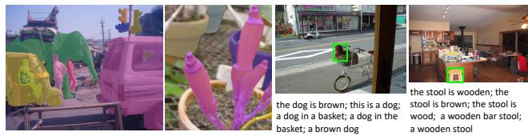  
Figure 4. Synthetic data visualization. Left: synthetic masks by SAM; Right: synthetic captions by OFA-akin model.

## 3.4. Scalabilty to More Data and Tasks

To push the boundaries of the scalable image segmentation model, we aim to scale it up to encompass more diverse datasets and tasks. However, the sizes of well curated segmentation datasets are usually relatively small 2 because pixel-wise mask annotation is expensive, which poses a significant limitation in exploring the full potential of scalability. To circumvent this challenge, we propose to use synthetic data, which is cheap to generate, easy to scale up and has been proven effective to strengthen the model, for instance, in object detection [10, 13] image captioning [11]. Given that some recent models can generate high-quality synthetic segmentation masks (e.g SAM [24]) and synthetic captions (e.g., OFA [56], GLIPv2 [69]), we believe that the synthetic segmentation data can play a crucial role in exploring the scalability of our model. In this work, we leverage two types of synthetic data to expand both the training set and the range of tasks.

Synthetic segmentation mask: Instead of generating synthetic segmentation masks directly on unlabeled image, it is much easier to segment the mask given an object bounding box because some recent works have shown that they are pretty good at this task [20, 24, 76]. The size of object detection dataset is usually more than dozen times larger than that of segmentation, e.g., Objects365 [51] of 1.7M images v.s. COCO [33] of 120K images. With the generated synthetic masks, we can convert every object detection dataset to a segmentation dataset to have more diverse training data.

Synthetic segmentation caption: The standard segmentation/detection datasets usually lack rich textual descriptions, e.g., 80 fixed category names for COCO. This is a big challenge for open-vocabulary segmentation model, especially for the task of referring segmentation. The widely used referring segmentation datasets are RefCOCO, Ref-COCO+ and RefCOCOg as well as RefClef [19, 66], whose combination has only about 50K images. The reason to this small dataset size is because annotating a caption description to every individual object segment is expensive. In order to enrich the semantic information of the training data and improve the generalization ability of the model, we train a OFA-akin [56] model on the task of object captioning, i.e., generating synthetic caption for each object given the bounding box. With this object captioning model, we generate five synthetic captions with the highest confidences for each object, and use them to expand the training data size. One of the synthetic captions is randomly selected per object at each training iteration.

Table 2. The performance comparison of different query strategies.
<table><tr><td rowspan="2">Query strategy</td><td colspan="2">Scalability</td><td rowspan="2">Training data</td><td rowspan="2">Instance COCO Mask AP</td><td rowspan="2">Panoptic COCO PQ</td><td rowspan="2">Semantic ADE mIoU</td><td rowspan="2">Open-vocabulary SeginW Mask AP</td></tr><tr><td>#Dataset #Task</td><td></td></tr><tr><td rowspan="3">learnable</td><td>1</td><td>1</td><td>COCO-PS</td><td>48.3</td><td>54.1</td><td>15.4</td><td>25.9</td></tr><tr><td>2</td><td>2</td><td>COCO-PS + ADE-SS</td><td>48.1</td><td>54.3</td><td>50.4</td><td>27.8</td></tr><tr><td>4</td><td>4</td><td>COCO-PS + ADE-SS + VG + refer</td><td>48.6</td><td>54.1</td><td>50.1</td><td>32.1</td></tr><tr><td rowspan="3">conditional</td><td>1</td><td>1</td><td>COCO-PS</td><td>49.7</td><td>56.4</td><td>5.9</td><td>27.8</td></tr><tr><td>2</td><td>2</td><td>COCO-PS + ADE-SS</td><td>49.8</td><td>56.5</td><td>43.2</td><td>29.4</td></tr><tr><td>4</td><td>4</td><td>COCO-PS + ADE-SS + VG + refer</td><td>49.5</td><td>56.2</td><td>43.9</td><td>34.7</td></tr><tr><td rowspan="3">mixed query</td><td>1</td><td>1</td><td>COCO-PS</td><td>49.9(+1.6)</td><td>56.5(+2.4)</td><td>17.2(+11.3)</td><td>28.7(+2.8)</td></tr><tr><td>2</td><td>2</td><td>COCO-PS + ADE-SS</td><td>49.6(+1.5)</td><td>56.5(+2.2)</td><td>51.7(+8.5)</td><td>30.6(+2.4)</td></tr><tr><td>4</td><td>4</td><td>COCO-PS + ADE-SS + VG + refer</td><td>49.9(+1.3)</td><td>56.8(+2.7)</td><td>52.1(+8.2)</td><td>38.4(+6.3)</td></tr></table>

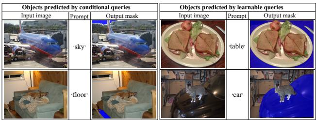  
Figure 5. The counter prediction of examples by mixed query. Left: the stuff objects are predicted with conditional queries instead of learnable queries; Right: the thing objects are predicted with learnable queries instead of conditional queries.

## 4. Experiments

To verify the dataset and task scalabilty of MQ-Former, we experiment on a variety of datasets proposed for different tasks: COCO [33] and ADE20K [72] for semantic segmentation (SS), instance segmentation (IS) and panoptic segmentation (PS); LVIS [16] for instance segmentation; RefCOCO, RefCOCO+, RefCOCOg [19, 66] for referring segmentation (RS); HRSOD [67] and other six datasets [9, 32, 40, 45, 53, 59] for foreground segmentation (FS); Objects365 [51] and Visual Genome [25] for object detection (OD). Additionally, we generate synthetic captions on COCO, denoted as “COCO-syn” for referring segmentation. We also create synthetic masks for Visual Genome and Objects365 (“Objects365-syn-m”) for instance segmentation, and further generate synthetic captions on Objects365 for referring segmentation, “Objects365-syn”.

To validate the real-world generalization ability of the model, several datasets or benchmarks are employed. Pascal Context [42] and BDD [65] are used for open-set evaluation. SeginW benchmark which has 25 datasets is used for open-vocabulary in-the-wild segmentation evaluation [75]. RefCOCOg [66] is used for free-form referring segmentation. We use mIoU as the evaluation metric for semantic and referring segmentation, Mask AP for instance segmentation, PQ [23] for panoptic segmentation, following [22, 28, 70, 75]. The hyperparameters of the architecture and training follow Mask DINO [28]. The pretrained Swin Transformer [38] and CLIP language encoder [46] are adopt as the vision and text encoder, respectively, but it is noted that any vision or language backbone encoders can be used by MQ-Former. The mixed query set consists of 100 learnable and 300 conditional queries, following some popular settings [28, 70].

## 4.1. Query Ablation

We begin by comparing three query strategies when used for scalable image segmentation. The model is scaled up to both datasets and tasks at three scales: (1) “one dataset and one task” where the training set is COCO with panoptic segmentation annotations (“COCO-PS”); (2) “two datasets and two tasks” where the training set comprises COCO-PS and ADE20K with semantic segmentation annotations (“ADE-SS”); (3) “four datasets and four tasks” where we add two additional training sets and tasks, Visual Genome with instance segmentation (“VG”) and referring segmentation RefCOCO/RefCOCO+/RefCOCOg (“refer”). The evaluation uses ADE and COCO for closed-set performance, while SeginW is utilized to assess the open-set generalization capabilities of the models.

The mixed query strategy is compared against two other strategies, all using a total of 400 queries. As shown in Table 2, across both scaling scenarios, the learnable query exhibits weak performance on instance-level segmentation tasks, with a notable drop of around 2 points on COCO and SeginW. Even more significant, the conditional query shows a degradation of over 7 points in semantic segmentation performance on ADE. These results suggest that neither of the individual query strategies is an optimal choice for scalable image segmentation. In contrast, the mixed query demonstrates superior performance across all evaluation tasks, highlighting its scalability to diverse tasks and datasets without suffering performance loss. Moreover, mixed query exhibits stronger generalization ability, as evidenced by huge performance improvements on SeginW.

The superior performance of the mixed query stems from its sample-wise dynamic query selection mechanism. We analyze the ratio of thing and stuff objects predicted by the conditional and learnable queries, respectively. Thing objects typically correspond to local foreground instances, such as “person” or “book”, while stuff objects generally represent global background regions like “sky” or “sea”. On COCO, we find that conditional queries capture 99.6% of thing objects, while learnable queries detect 53.3% of stuff objects. A similar trend is observed in ADE panoptic segmentation, with conditional queries accounting for 99.8% of thing objects and learnable queries handling 61.4% of stuff objects. This suggests that, in most cases, thing objects are predicted by conditional queries, whereas stuff objects are handled by learnable queries. However, this is not always the case. Figure 5 illustrates counterexamples where, despite “sky” and “floor” being classified as stuff classes, conditional queries are used because these features behave more like local instances in the images. Similarly, in images containing “table” and “car”, which are typically thing classes, learnable queries are triggered since these objects appear more as global background features. These findings demonstrate that query selection in the mixed query is dynamic and hierarchical. The conditional query tends to focus on local objects, while the learnable query adapts to capture global objects, adjusting adaptively to each image, as discussed in section 3, contrasting with some approaches in the literature [1, 47, 70] that rely on hard assignments based on classes or tasks, limiting scalability.

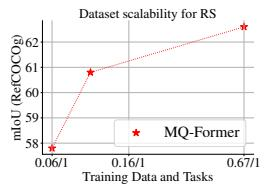

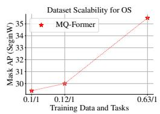

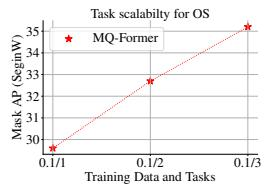

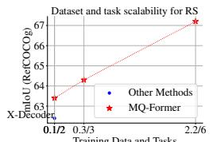  
Training Data and Tasks

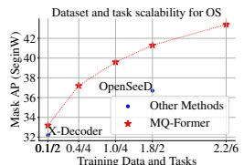  
Training Data and Tasks  
Figure 6. The performance improvement with data and task scaling up. The open-vocabulary segmentation (OS), Mask AP of SeginW, and free-form referring segmentation (RS), mIoU of RefCOCOg, ability keeps increasing with dataset and task scalability (the size of the training data (M)/ number of different training tasks). From left to right: only scaling up dataset for referring segmentation, only scaling up dataset for open-vocabulary segmentation, only scaling up task for open-vocabulary segmentation, scaling up both dataset and task for referring segmentation and scaling up both dataset and task for open-vocabulary segmentation.

Table 3. The comparison to state of the arts on open-set benchmarks (left) and closed-set benchmarks (right). ‘×’ represents that the method is not capable of handling the task; ‘−’ represents no results reported in the original paper. We bold the best entry in each column.
<table><tr><td></td><td colspan="8">Open-set comparison</td><td colspan="10">Closed-set comparison</td></tr><tr><td></td><td></td><td></td><td>ADE</td><td></td><td></td><td></td><td>PC-59PC-459BDD</td><td>SeginW</td><td></td><td></td><td></td><td></td><td>COCO</td><td></td><td>ADE</td><td></td><td>RefCOCOgUHRSD</td><td></td></tr><tr><td>Task</td><td>PS</td><td>IS</td><td>OD</td><td>SS</td><td>SS</td><td>SS</td><td>PS</td><td>IS</td><td></td><td>Task</td><td>PS</td><td>IS</td><td>OD</td><td>SS</td><td>PS</td><td>SS</td><td>RS</td><td>FS</td></tr><tr><td>Method</td><td>PQ</td><td></td><td>Mask AP Box AP mIoU</td><td></td><td>mIoU</td><td>mIoU</td><td>PQ</td><td>Mask AP</td><td></td><td>Method</td><td></td><td></td><td>PQ Mask AP Box AP mIoU</td><td></td><td>PQ mIoU</td><td></td><td>mIoU</td><td>MSE</td></tr><tr><td>LSeg+ [14]</td><td></td><td></td><td></td><td>18.0</td><td>46.5</td><td>7.8</td><td></td><td></td><td></td><td>LAVT [64]</td><td>×</td><td>×</td><td>×</td><td>×</td><td>× ×</td><td></td><td>63.3</td><td>×</td></tr><tr><td>SPNet [58]</td><td></td><td></td><td></td><td></td><td>24.3</td><td></td><td></td><td></td><td>Specialist</td><td>PolyFormer [35]</td><td>X</td><td>X</td><td>×</td><td>×</td><td>X</td><td>X</td><td>71.2</td><td>X</td></tr><tr><td>ZS3Net [2]</td><td></td><td></td><td></td><td></td><td>19.4</td><td></td><td></td><td></td><td></td><td>PGNet [54]</td><td>X</td><td>X</td><td>X</td><td>×</td><td>X</td><td>X</td><td>X</td><td>0.04</td></tr><tr><td>MaskCLIP [12]</td><td>15.1</td><td>6.0</td><td>14.9</td><td>23.7</td><td>45.9</td><td>10.0</td><td></td><td></td><td></td><td>InSPyReNet [22]</td><td>×</td><td>X</td><td>X</td><td>X</td><td>×</td><td>×</td><td>×</td><td>0.02</td></tr><tr><td>GroupViT [61]</td><td></td><td></td><td></td><td>10.6</td><td>25.9</td><td>4.9</td><td></td><td></td><td></td><td>Mask2Former [8]]</td><td>57.8</td><td>48.6</td><td>52.1</td><td>67.4</td><td>48.1</td><td>56.1</td><td>×</td><td>×</td></tr><tr><td>OpenSeg [14]</td><td></td><td></td><td></td><td>21.1</td><td>42.1</td><td>9.0</td><td></td><td></td><td></td><td>Mask DINO [28]</td><td>58.3</td><td>50.6</td><td>56.2</td><td>67.5</td><td></td><td></td><td>×</td><td>×</td></tr><tr><td>ODISE [62]</td><td>22.6</td><td>14.4</td><td>15.8</td><td>29.9</td><td>57.3</td><td>14.5</td><td></td><td></td><td></td><td>UNINEXT [63]</td><td></td><td>49.6</td><td></td><td></td><td></td><td></td><td>1</td><td></td></tr><tr><td>X-Decoder [75]</td><td>21.8</td><td>13.1</td><td>17.5</td><td>29.6</td><td>64.0</td><td>16.1</td><td>17.8</td><td>32.3</td><td>Generalist</td><td>[OneFormer [18]</td><td>57.9</td><td>49.0</td><td></td><td>67.4</td><td>51.457.0</td><td></td><td>X</td><td>一</td></tr><tr><td>OpenSeeD [70]</td><td>19.7</td><td>15.0</td><td>17.7</td><td>23.4</td><td></td><td></td><td>19.4</td><td>36.1</td><td></td><td>X-Decoder [75]</td><td>56.9</td><td>46.7</td><td></td><td>67.5</td><td>49.658.1</td><td></td><td>64.6</td><td>X</td></tr><tr><td>DaTaSeg [15]</td><td>-</td><td></td><td></td><td></td><td>51.4 65.0</td><td>11.1</td><td>29.3</td><td>43.4</td><td></td><td>[OMG-Seg [31]</td><td>55.4</td><td>45.5</td><td></td><td></td><td></td><td></td><td></td><td></td></tr><tr><td>MQ-Former</td><td>22.1</td><td>17.3</td><td>19.2</td><td>25.0</td><td></td><td>18.1</td><td></td><td></td><td></td><td>MQ-Former</td><td>58.8</td><td>52.3</td><td>58.4</td><td>68.4</td><td>52.6 58.1</td><td></td><td>68.2</td><td>0.03</td></tr></table>

## 4.2. Ablation on Data and Task Scaling up

We next verify the scalability of MQ-Former across both datasets and tasks. The left two figures in Figure 6 demonstrate the model’s dataset scalability. In the first figure, we evaluate the model on referring segmentation tasks, starting with training on RefCOCO/+/g datasets. By scaling up the training set to include additional COCO-sync data, the performance on RefCOCOg validation set improves from 57.8 to 60.8. Further scaling up to include 30% of Objects365-syn dataset increases the performance to 62.6. A similar trend is observed for open-vocabulary tasks when the model is trained on instance segmentation and the dataset is scaled from COCO to COCO+ADE, and then to COCO+ADE+30% of Objects365-syn-m, as shown in the second figure. The middle figure illustrates task scalability. Training on a fixed 100K COCO images, we progressively scale the tasks from panoptic segmentation to include instance segmentation and referring segmentation with synthetic description. The open-vocabulary performance increases steadily from 29.6 to 32.7 and then to 35.2. The last two figures validate the simultaneous scalability of both datasets and tasks. When scaling up both dimensions together, the referring and open-vocabulary segmentation tasks show consistent improvements. Notably, compared to the non-scalable OpenSeeD framework, which cannot benefit from additional training resources, MQ-Former demonstrates significant advantages. Furthermore, X-Decoder, due to its suboptimal learnable query strategy, underperforms MQ-Former on the same datasets and tasks.

## 4.3. Comparison with the State-of-the-art

We scale up our model with a larger set of datasets and tasks. We train it on around 2.2M distinct images examples from COCO, LVIS, Visual Genome,

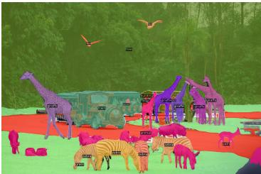

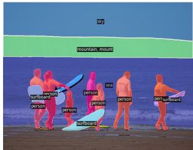  
(a) Open-vocabulary panoptic segmentation

  
(b) Open-vocabulary instance segmentation

  
(c) Free-form referring segmentation

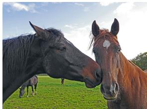

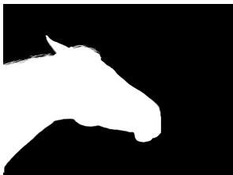

(d) Free-form referring matting  

  
Figure 7. Qualitative results of MQ-Former on each task. For every pair of images, the left is the input image and the right is the prediction. The text prompt for the example in (b) is “Cardinal”; “children sitting in the grass” in (c) and the two prompts for (d) are “left horse” and “woman wearing a blue mask”.

Objects365, RefCOCO/+/g and several foreground datasets and 57M mask annotations on six tasks (instance/semantic/panoptic/referring/foreground segmentation and object detection). The comparison is conducted on various open/closed-set segmentation benchmarks and the results are presented in Table 3. For closed set comparison, two types of SOTA are compared, task or dataset specialist models and unified generalist models for multiple segmentation tasks. First, all other models are unable to handle one or a few listed tasks but MQ-Former can cover all of them. Second, our model improves the state-of-the-art segmentation of generalist model on most benchmarks and achieves comparable performances to SOTA of specialist model, using one single model. This benefits from its scalability so that more diverse data and task are included during training, leading better knowledge integration and fusion, enabling a model of stronger generalization.

## 4.4. Qualitative Results and Applications

Finally, we present qualitative results in Figure 7, demonstrating MQ-Former’s strong performance across various segmentation tasks. A notable application of MQ-Former is showcased in image matting, as illustrated in Figure 7(d). Most current image matting methods are classagnostic [29, 30, 36], which means they do not allow control over which object is segmented. However, with MQ-Former, we integrate a refinement module based on AE-Matter [36], enabling controllable image matting. This marriage allows MQ-Former to refine instance segmentation to a more precise level, capturing intricate details such as the fur of a horse and the hair of a woman.

## 5. Conclusion

In this paper, we have introduced MQ-Former, a scalable image segmentation model that can be trained on diverse datasets and tasks at scale. Our experiments have validated the effectiveness of MQ-Former in improving segmentation performance as data volume and task diversity increase. Moreover, we showed that incorporating synthetic data further boosts the model’s generalization capabilities while reducing the reliance on expensive human annotations. MQ-Former marks a significant step toward universal segmentation models, opening the door for future research to explore even larger and more complex segmentation tasks.

Acknowledgement We acknowledge the encouragement and support from C.J. Taylor and appreciate the insightful discussions with Yue Wu.

## References

[1] Ali Athar, Alexander Hermans, Jonathon Luiten, Deva Ramanan, and Bastian Leibe. Tarvis: A unified approach for target-based video segmentation. In CVPR, pages 18738– 18748, 2023. 2, 5, 7

[2] Maxime Bucher, Tuan-Hung Vu, Matthieu Cord, and Patrick Perez. Zero-shot semantic segmentation. ´ NeurIPS, 32, 2019. 7

[3] Zhaowei Cai, Gukyeong Kwon, Avinash Ravichandran, Erhan Bas, Zhuowen Tu, Rahul Bhotika, and Stefano Soatto. X-detr: A versatile architecture for instance-wise visionlanguage tasks. In ECCV, pages 290–308, 2022. 3

[4] Kai Chen, Jiangmiao Pang, Jiaqi Wang, Yu Xiong, Xiaoxiao Li, Shuyang Sun, Wansen Feng, Ziwei Liu, Jianping Shi, Wanli Ouyang, et al. Hybrid task cascade for instance segmentation. In CVPR, pages 4974–4983, 2019. 1

[5] Liang-Chieh Chen, George Papandreou, Iasonas Kokkinos, Kevin Murphy, and Alan L Yuille. Deeplab: Semantic image segmentation with deep convolutional nets, atrous convolution, and fully connected crfs. PAMI, pages 834–848, 2017.

[6] Bowen Cheng, Maxwell D Collins, Yukun Zhu, Ting Liu, Thomas S Huang, Hartwig Adam, and Liang-Chieh Chen. Panoptic-deeplab: A simple, strong, and fast baseline for bottom-up panoptic segmentation. In CVPR, pages 12475– 12485, 2020. 1

[7] Bowen Cheng, Alex Schwing, and Alexander Kirillov. Perpixel classification is not all you need for semantic segmentation. NeurIPS, pages 17864–17875, 2021. 3

[8] Bowen Cheng, Ishan Misra, Alexander G Schwing, Alexander Kirillov, and Rohit Girdhar. Masked-attention mask transformer for universal image segmentation. In CVPR, pages 1290–1299, 2022. 3, 7

[9] Ming-Ming Cheng, Niloy J. Mitra, Xiaolei Huang, Philip H. S. Torr, and Shi-Min Hu. Global contrast based salient region detection. PAMI, pages 569–582, 2015. 6

[10] Han-Cheol Cho, Won Young Jhoo, Wooyoung Kang, and Byungseok Roh. Open-vocabulary object detection using pseudo caption labels. arXiv preprint arXiv:2303.13040, 2023. 2, 3, 5

[11] Caffagni Davide, Manuele Barraco, Marcella Cornia, Lorenzo Baraldi, Rita Cucchiara, et al. Synthcap: Augmenting transformers with synthetic data for image captioning. In ICIAP, 2023. 5

[12] Zheng Ding, Jieke Wang, and Zhuowen Tu. Openvocabulary panoptic segmentation with maskclip. arXiv preprint arXiv:2208.08984, 2022. 7

[13] Mingfei Gao, Chen Xing, Juan Carlos Niebles, Junnan Li, Ran Xu, Wenhao Liu, and Caiming Xiong. Open vocabulary object detection with pseudo bounding-box labels. In ECCV, pages 266–282, 2022. 2, 5

[14] Golnaz Ghiasi, Xiuye Gu, Yin Cui, and Tsung-Yi Lin. Scaling open-vocabulary image segmentation with image-level labels. In ECCV, pages 540–557, 2022. 7

[15] Xiuye Gu, Yin Cui, Jonathan Huang, Abdullah Rashwan, Xuan Yang, Xingyi Zhou, Golnaz Ghiasi, Weicheng Kuo, Huizhong Chen, Liang-Chieh Chen, et al. Dataseg: Tam-

ing a universal multi-dataset multi-task segmentation model. NeurIPS, 36, 2023. 1, 3, 7

[16] Agrim Gupta, Piotr Dollar, and Ross Girshick. Lvis: A dataset for large vocabulary instance segmentation. In CVPR, pages 5356–5364, 2019. 6

[17] Kaiming He, Georgia Gkioxari, Piotr Dollar, and Ross Gir-´ shick. Mask r-cnn. In ICCV, pages 2961–2969, 2017. 1

[18] Jitesh Jain, Jiachen Li, Mang Tik Chiu, Ali Hassani, Nikita Orlov, and Humphrey Shi. Oneformer: One transformer to rule universal image segmentation. In CVPR, pages 2989– 2998, 2023. 1, 2, 3, 7

[19] Sahar Kazemzadeh, Vicente Ordonez, Mark Matten, and Tamara Berg. Referitgame: Referring to objects in pho tographs of natural scenes. In EMNLP, pages 787–798, 2014. 5, 6

[20] Lei Ke, Mingqiao Ye, Martin Danelljan, Yifan Liu, Yu-Wing Tai, Chi-Keung Tang, and Fisher Yu. Segment anything in high quality. arXiv preprint arXiv:2306.01567, 2023. 2, 3, 5

[21] Dongwan Kim, Yi-Hsuan Tsai, Yumin Suh, Masoud Faraki, Sparsh Garg, Manmohan Chandraker, and Bohyung Han. Learning semantic segmentation from multiple datasets with label shifts. In ECCV, pages 20–36, 2022. 1, 2, 3

[22] Taehun Kim, Kunhee Kim, Joonyeong Lee, Dongmin Cha, Jiho Lee, and Daijin Kim. Revisiting image pyramid structure for high resolution salient object detection. In ACCV, pages 108–124, 2022. 6, 7

[23] Alexander Kirillov, Kaiming He, Ross Girshick, Carsten Rother, and Piotr Dollar. Panoptic segmentation. In´ CVPR, pages 9404–9413, 2019. 2, 6

[24] Alexander Kirillov, Eric Mintun, Nikhila Ravi, Hanzi Mao, Chloe Rolland, Laura Gustafson, Tete Xiao, Spencer Whitehead, Alexander C Berg, Wan-Yen Lo, et al. Segment anything. arXiv preprint arXiv:2304.02643, 2023. 2, 3, 5

[25] Ranjay Krishna, Yuke Zhu, Oliver Groth, Justin Johnson, Kenji Hata, Joshua Kravitz, Stephanie Chen, Yannis Kalan tidis, Li-Jia Li, David A Shamma, et al. Visual genome: Connecting language and vision using crowdsourced dense image annotations. IJCV, pages 32–73, 2017. 5, 6

[26] John Lambert, Zhuang Liu, Ozan Sener, James Hays, and Vladlen Koltun. Mseg: A composite dataset for multidomain semantic segmentation. In CVPR, pages 2879–2888, 2020. 1, 2, 3

[27] Feng Li, Hao Zhang, Shilong Liu, Jian Guo, Lionel M Ni, and Lei Zhang. Dn-detr: Accelerate detr training by introducing query denoising. In CVPR, pages 13619–13627, 2022. 2, 3

[28] Feng Li, Hao Zhang, Huaizhe Xu, Shilong Liu, Lei Zhang, Lionel M Ni, and Heung-Yeung Shum. Mask dino: Towards a unified transformer-based framework for object detection and segmentation. In CVPR, pages 3041–3050, 2023. 3, 6, 7

[29] Jizhizi Li, Sihan Ma, Jing Zhang, and Dacheng Tao. Privacypreserving portrait matting. In ACMMM, pages 3501–3509, 2021. 8

[30] Jizhizi Li, Jing Zhang, and Dacheng Tao. Deep image matting: A comprehensive survey. arXiv preprint arXiv:2304.04672, 2023. 8

[31] Xiangtai Li, Haobo Yuan, Wei Li, Henghui Ding, Size Wu, Wenwei Zhang, Yining Li, Kai Chen, and Chen Change Loy. Omg-seg: Is one model good enough for all segmentation? In CVPR, pages 27948–27959, 2024. 1, 3, 5, 7

[32] Jun Hao Liew, Scott Cohen, Brian Price, Long Mai, and Jiashi Feng. Deep interactive thin object selection. In WACV, pages 305–314, 2021. 6

[33] Tsung-Yi Lin, Michael Maire, Serge Belongie, James Hays, Pietro Perona, Deva Ramanan, Piotr Dollar, and C Lawrence´ Zitnick. Microsoft coco: Common objects in context. In ECCV, pages 740–755, 2014. 5, 6

[34] Tsung-Yi Lin, Priya Goyal, Ross Girshick, Kaiming He, and Piotr Dollar. Focal loss for dense object detection. In´ ICCV, pages 2980–2988, 2017. 5

[35] Jiang Liu, Hui Ding, Zhaowei Cai, Yuting Zhang, Ravi Kumar Satzoda, Vijay Mahadevan, and R Manmatha. Polyformer: Referring image segmentation as sequential polygon generation. In CVPR, pages 18653–18663, 2023. 1, 7

[36] Qinglin Liu, Xiaoqian Lv, Quanling Meng, Zonglin Li, Xiangyuan Lan, Shuo Yang, Shengping Zhang, and Liqiang Nie. Revisiting context aggregation for image matting. In ICML, 2024. 8

[37] Shilong Liu, Feng Li, Hao Zhang, Xiao Yang, Xianbiao Qi, Hang Su, Jun Zhu, and Lei Zhang. Dab-detr: Dynamic anchor boxes are better queries for detr. arXiv preprint arXiv:2201.12329, 2022. 2, 3

[38] Ze Liu, Yutong Lin, Yue Cao, Han Hu, Yixuan Wei, Zheng Zhang, Stephen Lin, and Baining Guo. Swin transformer: Hierarchical vision transformer using shifted windows. In ICCV, pages 10012–10022, 2021. 6

[39] Jonathan Long, Evan Shelhamer, and Trevor Darrell. Fully convolutional networks for semantic segmentation. In CVPR, pages 3431–3440, 2015. 1

[40] Lucy AC Mansilla and Paulo AV Miranda. Oriented image foresting transform segmentation: Connectivity constraints with adjustable width. In SIBGRAPI, pages 289–296, 2016. 6

[41] Depu Meng, Xiaokang Chen, Zejia Fan, Gang Zeng, Houqiang Li, Yuhui Yuan, Lei Sun, and Jingdong Wang. Conditional detr for fast training convergence. In ICCV, pages 3651–3660, 2021. 3

[42] Roozbeh Mottaghi, Xianjie Chen, Xiaobai Liu, Nam-Gyu Cho, Seong-Whan Lee, Sanja Fidler, Raquel Urtasun, and Alan Yuille. The role of context for object detection and semantic segmentation in the wild. In CVPR, pages 891–898, 2014. 6

[43] Ting Pan, Lulu Tang, Xinlong Wang, and Shiguang Shan. Tokenize anything via prompting. ECCV, 2024. 3

[44] Jie Qin, Jie Wu, Pengxiang Yan, Ming Li, Ren Yuxi, Xuefeng Xiao, Yitong Wang, Rui Wang, Shilei Wen, Xin Pan, et al. Freeseg: Unified, universal and open-vocabulary image segmentation. In CVPR, pages 19446–19455, 2023. 3

[45] Xuebin Qin, Hang Dai, Xiaobin Hu, Deng-Ping Fan, Ling Shao, and Luc Van Gool. Highly accurate dichotomous image segmentation. In ECCV, 2022. 6

[46] Alec Radford, Jong Wook Kim, Chris Hallacy, Aditya Ramesh, Gabriel Goh, Sandhini Agarwal, Girish Sastry,

Amanda Askell, Pamela Mishkin, Jack Clark, et al. Learn ing transferable visual models from natural language supervision. In ICML, pages 8748–8763, 2021. 6

[47] Amit Kumar Rana, Sabarinath Mahadevan, Alexander Hermans, and Bastian Leibe. Dynamite: Dynamic query bootstrapping for multi-object interactive segmentation transformer. arXiv preprint arXiv:2304.06668, 2023. 2, 5, 7

[48] Shaoqing Ren, Kaiming He, Ross Girshick, and Jian Sun. Faster r-cnn: Towards real-time object detection with region proposal networks. NeurIPS, 28, 2015. 4

[49] Hamid Rezatofighi, Nathan Tsoi, JunYoung Gwak, Amir Sadeghian, Ian Reid, and Silvio Savarese. Generalized intersection over union: A metric and a loss for bounding box regression. In CVPR, pages 658–666, 2019. 5

[50] Olaf Ronneberger, Philipp Fischer, and Thomas Brox. U-net: Convolutional networks for biomedical image segmentation. In MICCAI, pages 234–241, 2015. 1

[51] Shuai Shao, Zeming Li, Tianyuan Zhang, Chao Peng, Gang Yu, Xiangyu Zhang, Jing Li, and Jian Sun. Objects365: A large-scale, high-quality dataset for object detection. In ICCV, pages 8430–8439, 2019. 5, 6

[52] Carole H Sudre, Wenqi Li, Tom Vercauteren, Sebastien Ourselin, and M Jorge Cardoso. Generalised dice overlap as a deep learning loss function for highly unbalanced segmentations. In MICCAI Workshop, pages 240–248, 2017. 5

[53] Lijun Wang, Huchuan Lu, Yifan Wang, Mengyang Feng, Dong Wang, Baocai Yin, and Xiang Ruan. Learning to detect salient objects with image-level supervision. In CVPR, 2017. 6

[54] Pengfei Wang, Chengquan Zhang, Fei Qi, Shanshan Liu, Xiaoqiang Zhang, Pengyuan Lyu, Junyu Han, Jingtuo Liu, Errui Ding, and Guangming Shi. Pgnet: Real-time arbitrarily shaped text spotting with point gathering network. In AAAI, pages 2782–2790, 2021. 7

[55] Pei Wang, Zhaowei Cai, Hao Yang, Gurumurthy Swaminathan, Nuno Vasconcelos, Bernt Schiele, and Stefano Soatto. Omni-detr: Omni-supervised object detection with transformers. In CVPR, pages 9367–9376, 2022. 3

[56] Peng Wang, An Yang, Rui Men, Junyang Lin, Shuai Bai, Zhikang Li, Jianxin Ma, Chang Zhou, Jingren Zhou, and Hongxia Yang. Ofa: Unifying architectures, tasks, and modalities through a simple sequence-to-sequence learning framework. In ICML, pages 23318–23340, 2022. 2, 5

[57] Yingming Wang, Xiangyu Zhang, Tong Yang, and Jian Sun. Anchor detr: Query design for transformer-based detector. In AAAI, pages 2567–2575, 2022. 3

[58] Yongqin Xian, Subhabrata Choudhury, Yang He, Bernt Schiele, and Zeynep Akata. Semantic projection network for zero-and few-label semantic segmentation. In CVPR, pages 8256–8265, 2019. 7

[59] Chenxi Xie, Changqun Xia, Mingcan Ma, Zhirui Zhao, Xiaowu Chen, and Jia Li. Pyramid grafting network for onestage high resolution saliency detection. In CVPR, pages 11717–11726, 2022. 6

[60] Yuwen Xiong, Renjie Liao, Hengshuang Zhao, Rui Hu, Min Bai, Ersin Yumer, and Raquel Urtasun. Upsnet: A unified panoptic segmentation network. In CVPR, pages 8818–8826, 2019. 1

[61] Jiarui Xu, Shalini De Mello, Sifei Liu, Wonmin Byeon, Thomas Breuel, Jan Kautz, and Xiaolong Wang. Groupvit: Semantic segmentation emerges from text supervision. In CVPR, pages 18134–18144, 2022. 7

[62] Jiarui Xu, Sifei Liu, Arash Vahdat, Wonmin Byeon, Xiaolong Wang, and Shalini De Mello. Open-vocabulary panoptic segmentation with text-to-image diffusion models. In CVPR, pages 2955–2966, 2023. 1, 7

[63] Bin Yan, Yi Jiang, Jiannan Wu, Dong Wang, Ping Luo, Zehuan Yuan, and Huchuan Lu. Universal instance perception as object discovery and retrieval. In CVPR, pages 15325– 15336, 2023. 7

[64] Zhao Yang, Jiaqi Wang, Yansong Tang, Kai Chen, Hengshuang Zhao, and Philip HS Torr. Lavt: Language-aware vision transformer for referring image segmentation. In CVPR, pages 18155–18165, 2022. 7

[65] Fisher Yu, Wenqi Xian, Yingying Chen, Fangchen Liu, Mike Liao, Vashisht Madhavan, Trevor Darrell, et al. Bdd100k: A diverse driving video database with scalable annotation tooling. arXiv preprint arXiv:1805.04687, page 6, 2018. 6

[66] Licheng Yu, Patrick Poirson, Shan Yang, Alexander C Berg, and Tamara L Berg. Modeling context in referring expressions. In ECCV, pages 69–85, 2016. 5, 6

[67] Yi Zeng, Pingping Zhang, Jianming Zhang, Zhe Lin, and Huchuan Lu. Towards high-resolution salient object detection. In ICCV, 2019. 6

[68] Hao Zhang, Feng Li, Shilong Liu, Lei Zhang, Hang Su, Jun Zhu, Lionel M Ni, and Heung-Yeung Shum. Dino: Detr with improved denoising anchor boxes for end-to-end object detection. arXiv preprint arXiv:2203.03605, 2022. 2, 3

[69] Haotian Zhang, Pengchuan Zhang, Xiaowei Hu, Yen-Chun Chen, Liunian Harold Li, Xiyang Dai, Lijuan Wang, Lu Yuan, Jenq-Neng Hwang, and Jianfeng Gao. Glipv2: unifying localization and vl understanding. In NeurIPS, pages 36067–36080, 2022. 2, 5

[70] Hao Zhang, Feng Li, Xueyan Zou, Shilong Liu, Chunyuan Li, Jianwei Yang, and Lei Zhang. A simple framework for open-vocabulary segmentation and detection. In ICCV, pages 1020–1031, 2023. 1, 2, 3, 4, 5, 6, 7

[71] Wenwei Zhang, Jiangmiao Pang, Kai Chen, and Chen Change Loy. K-net: Towards unified image segmentation. NeurIPS, pages 10326–10338, 2021. 2, 3

[72] Bolei Zhou, Hang Zhao, Xavier Puig, Sanja Fidler, Adela Barriuso, and Antonio Torralba. Scene parsing through ade20k dataset. In CVPR, pages 633–641, 2017. 5, 6

[73] Qiang Zhou, Yuang Liu, Chaohui Yu, Jingliang Li, Zhibin Wang, and Fan Wang. Lmseg: Language-guided multidataset segmentation. arXiv preprint arXiv:2302.13495, 2023. 2, 3

[74] Xizhou Zhu, Weijie Su, Lewei Lu, Bin Li, Xiaogang Wang, and Jifeng Dai. Deformable detr: Deformable transformers for end-to-end object detection. arXiv preprint arXiv:2010.04159, 2020. 2, 3, 4

[75] Xueyan Zou, Zi-Yi Dou, Jianwei Yang, Zhe Gan, Linjie Li, Chunyuan Li, Xiyang Dai, Harkirat Behl, Jianfeng Wang, Lu Yuan, et al. Generalized decoding for pixel, image, and language. In CVPR, pages 15116–15127, 2023. 1, 2, 3, 6, 7

[76] Xueyan Zou, Jianwei Yang, Hao Zhang, Feng Li, Linjie Li, Jianfeng Gao, and Yong Jae Lee. Segment everything every where all at once. arXiv preprint arXiv:2304.06718, 2023. 5

[77] Yuliang Zou, Zizhao Zhang, Han Zhang, Chun-Liang Li, Xiao Bian, Jia-Bin Huang, and Tomas Pfister. Pseudoseg: Designing pseudo labels for semantic segmentation. arXiv preprint arXiv:2010.09713, 2020. 3