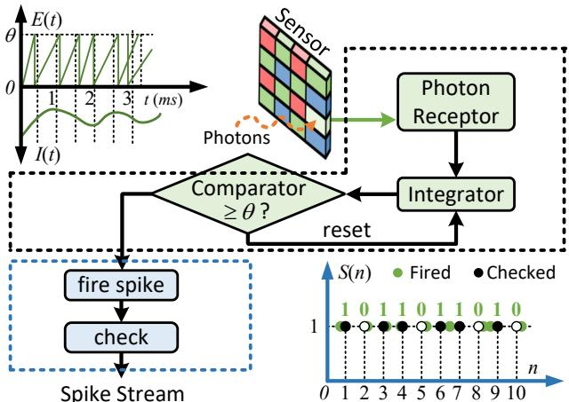
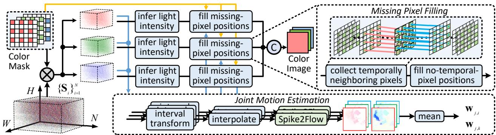
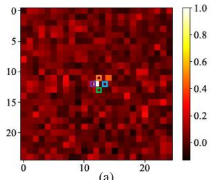
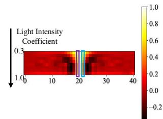
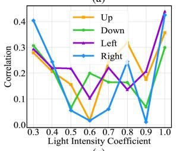
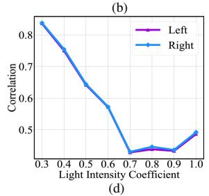
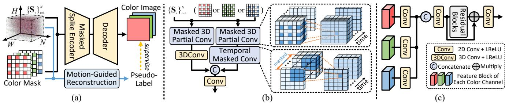
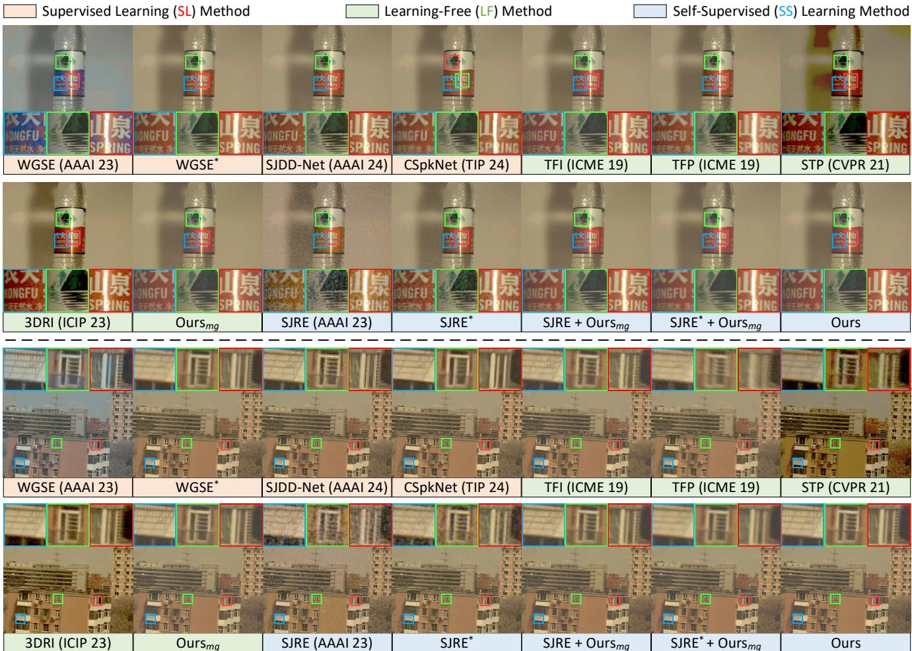
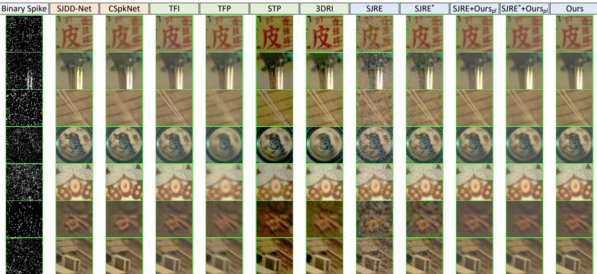

This CVPR paper is the Open Access version, provided by the Computer Vision Foundation. Except for this watermark, it is identical to the accepted version; the final published version of the proceedings is available on IEEE Xplore.

# Self-Supervised Learning for Color Spike Camera Reconstruction

Yanchen Dong1, Ruiqin Xiong1\*, Xiaopeng Fan2, Zhaofei Yu3, Yonghong Tian1,4,5, Tiejun Huang1,3

1School of Computer Science, Peking University

2School of Computer Science and Technology, Harbin Institute of Technology

3Institute for Artificial Intelligence, Peking University

4School of Electronic and Computer Engineering, Peking University

5Peng Cheng Laboratory

yanchendong@stu.pku.edu.cn, {rqxiong, yuzf12, yhtian, tjhuang}@pku.edu.cn, fxp@hit.edu.cn

## Abstract

Spike camera is a kind of neuromorphic camera with ultra-high temporal resolution, which can capture dynamic scenes by continuously firing spike signals. To capture color information, a color filter array (CFA) is employed on the sensor of the spike camera, resulting in Bayer-pattern spike streams. How to restore high-quality color images from the binary spike signals remains challenging. In this paper, we propose a motion-guided reconstruction method for spike cameras with CFA, utilizing color layout and estimated motion information. Specifically, we develop a joint motion estimation pipeline for the Bayer-pattern spike stream, exploiting the motion consistency of channels. We propose to estimate the missing pixels ofeach color channel according to temporally neighboring pixels ofthe corresponding color along the motion trajectory. As the spike signals are read out at discrete time points, there is quantization noise that impacts the image quality. Thus, we analyze the correlation of the noise in spatial and temporal domains and propose a self-supervised network utilizing a masked spike encoder to handle the noise. Experiments on real-world captured Bayer-pattern spike streams show that our method can restore color images with better visual quality, compared with state-of-the-art methods. The source codes are available at https://github.com/csycdong/SSL-CSC.

## 1. Introduction

With the development of machine vision, there has been an increasing demand for high-speed imaging, especially in some emerging applications, such as autonomous driving and unmanned aerial vehicles. How to capture dynamic scenes with high-speed motion and respond quickly becomes a key challenge. Conventional digital cameras usually require the scene to be still during the exposure time for photoelectric signal accumulation. The motion of captured objects will bring undesirable blur to snapshot images of the cameras, limiting their applications in high-speed imaging.

Spike camera [7, 8, 10, 22, 35] is a type of neuromorphic camera mimicking the structure of the human visual system. Benefiting from its ultra-high temporal resolution (e.g., 40,000Hz), the spike camera shows great potential in recording high-speed scenes. Different from another kind of neuromorphic camera called event camera [25, 26], the spike camera captures absolute light intensity instead of light intensity changes. The first-generation spike camera is the gray-scale spike camera (GSC). To capture color information of dynamic scenes, the Bayer-pattern color filter array (CFA) is employed on the sensor, resulting in the color spike camera (CSC) [9, 11–14]. How to restore high-quality color images from the Bayer-pattern spike stream is still an open task, with the following challenges:

• Missing pixels of each color channel. According to the Bayer-pattern color layout, 75% (red and blue) or 50% (green) pixels are missing in each color channel.

• High-speed motion. Spikes fired by a certain pixel do not always describe the same point of the object due to high-speed motion. Thus, it is likely to introduce blur.

• Quantization noise in spike signals. The spike signals are read out at discrete time points, bringing fluctuation and randomness to continuous photoelectric accumulation and resulting in quantization noise.

Some spike camera reconstruction methods [12, 36, 37, 40, 42] tend to employ end-to-end convolutional neural networks (CNNs). As it is hard to collect spike streams with corresponding high-quality ground truth, they tried to synthesize massive training pairs from videos. However, there are gaps between synthetic data and real-world captured data, reducing the practical performance.

In this paper, we develop a motion-guided reconstruction method for CSCs. To be specific, we propose to fill the missing pixel positions based on temporally neighboring pixels of the corresponding color, utilizing motion trajectory jointly estimated from color channels. We also fill the positions without available temporal pixels. As the discrete read-out of spike signals, there is quantization noise that impacts the image quality. Taking the preliminary reconstruction results as pseudo-labels, we propose a self-supervised network for CSC reconstruction. According to the analysis of quantization noise in temporal and spatial domains, we propose an encoder to extract features of each color channel and handle noise by our developed masked 3D partial convolution (MPConv) and temporal masked convolution (TMConv). In experiments, our self-supervised method achieved the best performance among methods without the supervision of ground truth. Although our method does not exceed supervised methods on synthetic data, it achieves better practical performance on real-world captured samples. The main contributions can be summarized as

• Considering the color layout and motion, we propose a motion-guided scheme to search temporally neighboring pixels to estimate the missing pixels of each color channel. We also develop a self-supervised reconstruction network with the preliminary results as pseudo-labels.

• We analyze the correlation of quantization noise caused by discrete signal read-out in temporal and spatial domains and propose a masked spike encoder to extract features and suppress the noise.

• Experimental results on real-world captured Bayerpattern spike streams show that our self-supervised reconstruction method achieves better visual quality than the state-of-the-art supervised methods.

## 2. Related Work

## 2.1. Reconstruction for Spike Cameras

As the first attempt at spike camera reconstruction, Zhu et al. [45] utilized the number of spike signals within a temporal window (TFP) or temporally neighboring spike intervals (TFI) to infer the light intensity of dynamic scenes. However, the former strategy is likely to bring motion blur, and the latter often brings undesired noise. To overcome the issues, a Motion-Aligned Filter (MAF) [38, 41] was proposed to suppress both motion blur and noise. Differently, Zhu et al. [46, 47] employed a three-layer spiking neural model mimicking human vision. Zheng et al. [44] tried to handle the task with a Short-Term Plasticity (STP) mechanism. Inspired by deep learning, Zhao et al. [40] developed the first spike camera reconstruction network, Spk2ImgNet, bringing significant performance gains. Zhang et al. [37] utilized temporal-robust features of spike signals in timefrequency space with wavelet transforms, resulting in another gray-scale reconstruction network, WGSE. Considering the difficulty of collecting paired training data, Chen et al. [4] proposed a self-supervised joint learning framework for motion estimation and reconstruction.

All the above methods are designed for the firstgeneration spike camera that can only generate gray-scale signals. Focusing on spike cameras with CFA, Dong et al. [9] presented 3D residual interpolation (3DRI) to first restore color images from the Bayer-pattern spike stream. Based on supervised learning, Dong et al. [13] developed a demosaicing network called CSpkNet to restore color visual signals from the Bayer-pattern spike stream. Starting from the observation model of spike cameras with CFA, an optimization-inspired network SJDD-Net [12] was also proposed for color image reconstruction of spike cameras.

## 2.2. Reconstruction for Other Emerging Sensors

The well-known event camera [1, 25, 26, 31] is another type of neuromorphic camera, designed to capture light intensity changes. As the first reconstruction attempt, Kim et al. [23] employed an Extended Kalman Filter to restore gradient images. Based on deep learning, E2VID [32] was proposed to reconstruct images in an end-to-end way, with great visua performance. To achieve lower computational complexity, Scheerlinck et al. [34] explored FireNet as a lightweight network. For color imaging, Scheerlinck et al. [33] proposed the first color event camera dataset and methods to restore color images from events.

Spike cameras and event cameras are designed for highspeed applications. Differently, quanta image sensor (QIS) [2, 15–17, 19] is a sensor developed for applications in lowlight imaging, which can detect individual photons through spatial and temporal oversampling. Choi et al. [6] presented the first deep neural network for QIS reconstruction. To achieve dynamic and low-light imaging with the QIS, Chi et al. [5] proposed a training strategy that transfers knowledge from motion and denoising teachers to a student network. Besides, Gnanasambandam et al. [18] designed a demosaicing method for color imaging of QIS.

## 3. Preliminary

## 3.1. Color Spike Camera

Spike camera is a neuromorphic camera that accumulates photoelectric signals according to absolute light intensity and continuously outputs binary streams at ultra-high temporal resolution. The gray-scale spike camera (GSC) can only produce gray-scale visual signals. In contrast, the color spike camera (CSC) with a CFA on the sensor can capture color information of dynamic scenes. As shown in Fig. 1, the structure of CSCs mimics the human visual system. For each pixel, the photon receptor captures photons and transforms them into accumulations in the integrator, continuously monitored by the comparator. Whenever the accumulated photoelectric signals reach a predetermined threshold θ, the pixel triggers a flag for spike firing. Then the pixel will be reset and continue to accumulate signals, restarting an accumulate-and-fire cycle [41]. For a certain pixel $( x , y )$ , the accumulated electric signal $\mathbf { E } _ { c }$ of the integrator at arbitrary time point t can be written as

  
Figure 1. Working mechanism of the color spike camera. The symbol θ denotes the firing threshold.

$$
\mathbf { E } ( t , x , y ) = \int _ { 0 } ^ { t } \eta \cdot \mathcal { P } ( \mathbf { I } ( \tau , x , y ) ) d \tau \quad \mathrm { m o d } \ \theta ,\tag{1}
$$

where η denotes the photoelectric conversion rate, $\mathcal { P } ( \cdot )$ denotes Poisson process of photon arrival, and ${ \mathbf I } ( \tau , x , y )$ denotes the instantaneous intensity at time τ. According to the working mechanism, we develop a CSC simulator, with details in the Supplementary Material.

## 3.2. Quantization Noise

Ideally, the pixel is reset immediately after firing a spike signal. For a certain pixel $( x , y )$ , the number of spike signals fired before arbitrary time point t can be written as

$$
\mathcal { N } ( t , x , y ) = \lfloor \frac { 1 } { \theta } \int _ { 0 } ^ { t } \mathcal { P } ( \mathbf { I } ( \tau , x , y ) ) d \tau \rfloor .\tag{2}
$$

In real hardware implementation, the check-and-reset process is controlled by a clock. Thus, the signals are read out at discrete time points. For the n-th $( n \in \mathbb { N } ^ { + } )$ time point, the read-out spike signal ${ \bf S } _ { n } ( x , y )$ can be formulated by spike count difference of neighboring time points as

$$
\mathbf { S } _ { n } ( x , y ) = \left\{ \begin{array} { l l } { 1 , } & { \mathcal { N } ( t _ { n } , x , y ) - \mathcal { N } ( t _ { n - 1 } , x , y ) > 0 } \\ { 0 , } & { \mathcal { N } ( t _ { n } , x , y ) - \mathcal { N } ( t _ { n - 1 } , x , y ) = 0 } \end{array} , \right.\tag{3}
$$

where $t _ { n }$ denotes the time of the n-th discrete time point. Perfectly, we have $t _ { n } - t _ { n - 1 } \approx 0$ , while $t _ { n } - t _ { n - 1 } = 5 0 \mu s$ according to the sensor frequency of CSCs. As a result, quantization noise is introduced into the output binary spike stream. For example, the difference between $\mathcal { N } ( t _ { n } , x , y )$ and $\mathcal { N } ( t _ { n - 1 } , x , y )$ can be larger than 1, while the signal is read out like only one spike signal fired.

## 3.3. Problem Statement

As a neuromorphic camera, the CSC has an array of $H \times W$ pixels working independently on its sensor. After N times of the check-and-reset process, it outputs a Bayer-pattern spike stream $\{ \mathbf { S } _ { i } \} _ { i = 1 } ^ { N } .$ In this paper, we aim to restore a color image $\mathbf { T } \in \ [ 0 , 1 ] ^ { 3 \times H \times \hat { W } }$ with high visual quality from the $N \times H \times W$ binary data. To achieve it, we need to infer the light intensity of the missing pixels of each color channel and handle the quantization noise in spike signals. Denoting the Bayer-pattern color mask, which records the color layout of the three color channels, as $\mathbf { M } \in \{ 0 , 1 \} ^ { 3 \times H \times W }$ (0 means a missing pixel), the target of our method $\mathcal { F }$ can be formulated as $\mathcal { F } ( \{ \mathbf { S } _ { i } \} _ { i = 1 } ^ { N } , \mathbf { M } )  \mathbf { T }$

## 4. Motion-Guided Preliminary Reconstruction

## 4.1. Overall Pipeline

To restore a color image from the input Bayer-pattern spike stream $\{ \mathbf { S } _ { i } \} _ { i = 1 } ^ { N }$ , we develop a motion-guided reconstruction method as shown in Fig. 2. Considering the missing spatial pixels (75% or 50%) of each color channel, we propose to estimate the values of missing pixels by available temporally neighboring pixels. To be specific, we first perform pixel-wise multiplication between each spike frame and the color masks to split out the spike signals of each color channel. Then, we infer the coarse light intensity of color channels by the pixel-independent method TFI [45]. To fill the missing pixel positions, we try to estimate the values by pixels of other time points. However, due to the high-speed motion within the spike stream, it is likely to introduce blur when using temporal pixels. Thus, we propose a joint motion estimation method to obtain optical flows from the spike signals of the color channels. Along the motion trajectories, we collect the available temporal pixels to estimate the missing pixels, resulting in the color channels without missing pixels. Finally, the restored color image can be obtained by concatenating the three color channels.

## 4.2. Joint Motion Estimation

So far, some optical flow estimation methods [21, 39, 42] have been proposed to analyze motion from binary spike signals. However, these methods are designed for GSCs and unsuitable for CSCs that generate Bayer-pattern spike streams. Based on Spike2Flow [42] for grayscale spike signals, we propose a joint motion estimation strategy for Bayer-pattern spike streams. Since the input of Spike2Flow is intervals of temporally neighboring spike signals, we first transform the spike stream $\{ \mathbf { S } _ { i } ^ { c } \} _ { i = 1 } ^ { N }$ of each color channel $c \in \{ R , G , B \}$ into intervals as follows:

$$
\begin{array} { r } { \Psi _ { n } ^ { c } ( x , y ) = \operatorname* { m i n } \{ k | \mathbf { S } _ { i } ^ { c } ( x , y ) = 1 , k \geq N \} } \\ { - \operatorname* { m a x } \{ k | \mathbf { S } _ { i } ^ { c } ( x , y ) = 1 , k < N \} , } \end{array}\tag{4}
$$

(c)  
  
Figure 2. Pipeline of the motion-guided reconstruction method for CSCs, with two parts: joint motion estimation and missing pixels filling. Spike2Flow [42] is a motion estimation method for GSCs.

where $\Psi _ { n } ^ { c } ( x , y )$ denotes the shortest interval of two temporally neighboring spikes that covers the n-th spike frame. Since there are missing pixels, we employ linear interpolation to estimate the values roughly, resulting in available input for the GSC optical flow estimation method. Then we can get the optical flows from the middle time point to the beginning and end time points of each color channel, $\mathbf { w } _ { j , i } ^ { c }$ and $\mathbf { w } _ { j , k } ^ { c } .$ As the missing pixels of each color impact the quality of optical flows a lot, we propose to exploit the motion consistency of color channels by jointly utilizing the optical flows, which can be formulated as

$$
\mathbf { w } _ { j , i } , \mathbf { w } _ { j , k } = \left[ \begin{array} { l } { \mathbf { U } _ { j , i } } \\ { \mathbf { V } _ { j , i } } \end{array} \right] , \left[ \begin{array} { l } { \mathbf { U } _ { j , k } } \\ { \mathbf { V } _ { j , k } } \end{array} \right] = \frac { 1 } { 3 } \sum _ { c } \mathbf { w } _ { j , i } ^ { c } , \frac { 1 } { 3 } \sum _ { c } \mathbf { w } _ { j , k } ^ { c } ,\tag{5}
$$

where U and V denotes motion components in the x and y directions, respectively.

## 4.3. Missing Pixel Filling

As there are spatially missing pixels in each color channel, we propose to collect available temporally neighboring pixels to estimate the values of missing pixel positions. The available pixels for missing positions refer to pixels along the motion trajectory and share the same color with the missing positions. As shown in Fig. 2, we collect the pixels based on the estimated optical flows. Specifically, for a certain non-missing position $( x _ { t } , y _ { t } )$ at the t-th time point, the relation between it and its middle-time-point position $( x _ { j } , y _ { j } )$ along the motion trajectory can formulated as

$$
( x _ { t } , y _ { t } ) = \left( x _ { j } + \frac { t - j } { \beta - j } \cdot { \bf U } _ { j , \beta } ( x _ { j } , y _ { j } ) , y _ { j } + \frac { t - j } { \beta - j } \cdot { \bf V } _ { j , \beta } ( x _ { j } , y _ { j } ) \right) ,\tag{6}
$$

where $\beta$ equals to i (when $t < j )$ or k (when $t > j )$ , and $i , j , k$ denotes the beginning, middle and end time points. Thus, we can warp the non-missing pixels of other time points. The pixels of the middle time point can be estimated by summing the available temporal pixels. To normalize the result, we can divide the sum by the sum of the warped binary color masks, which can be written as

$$
\mathbf { I } ^ { c } = \frac { \sum _ { t = 1 } ^ { n } \mathcal { W } ( \mathbf { L } _ { i } ^ { c } , \frac { t - j } { \beta - j } \cdot \mathbf { w } _ { j , \beta } ) } { \sum _ { t = 1 } ^ { n } \mathcal { W } ( \mathbf { M } ^ { c } , \frac { t - j } { \beta - j } \cdot \mathbf { w } _ { j , \beta } ) } , c \in \{ R , G , B \} ,\tag{7}
$$

where Ic denotes the restored color channel, $\mathcal { W } ( \cdot )$ denotes the wrapping operation, $\mathbf { L } _ { i } ^ { c }$ denotes the preliminary light intensity by TFI, and ${ \bf M } ^ { c }$ denotes the color mask. Considering the positions without available temporal pixels $( i . e .$ $\begin{array} { r } { \sum _ { t = 1 } ^ { n ^ { - } } \mathcal { W } ( \mathbf { \bar { M } } ^ { c } , \frac { t - j } { \beta - j } \cdot \mathbf { w } _ { j , \beta } ) = 0 ) } \end{array}$ , we can estimate the values via interpolation by non-missing spatial pixels.

## 5. Self-Supervised Reconstruction Network

## 5.1. Correlation Analysis of Quantization Noise

  
Figure 3. (a) Hot map for the correlation of quantization noise in the spatial domain. (intensity coefficient $\alpha = 0 . 6 )$ (b) Hot map for the correlation of quantization noise in the temporal domain. (c) Correlation changes of 4 pixels in (a) over α. (d) Correlation changes of 2 pixels in (b) over α.

Based on the neighboring pixels along the motion trajectory, we obtain the restored color image from the Bayerpattern spike stream. However, the result suffers from undesired noise and artifacts. To restore a cleaner color image from the input spike stream, we try to statistically analyze the quantization noise via the simulator. Assuming the quantization noise does not exist, we can infer the nearly exact light intensity by the interval-based TFI [45] as $\delta / \Psi _ { n } ,$ where δ denotes the maximum dynamic range. Thus, the quantization noise can be estimated by the difference between the ground truth and the interval-based inference as

  
Figure 4. (a) Architecture of the self-supervised reconstruction network based on the motion-guided method. (b) The structure of the masked spike encoder (MSE). (c) The structure of the decoder.

$$
\widetilde { \mathbf { n } } _ { q } ^ { c } = \left( \frac { \delta } { \Psi } - \widehat { \mathbf { I } } ^ { c } \right) \odot \mathbf { M } ^ { c } , c \in \{ R , G , B \} ,\tag{8}
$$

where $\widetilde { \mathbf { n } } _ { q } ^ { c }$ denotes the estimated quantization noise of color $c , \widehat { \mathbf { I } } ^ { c }$ edenotes the corresponding color channel of the ground btruth image, and ⊙ denotes element-wise multiplication. To explore the correlation of the quantization noise in both spatial and temporal domains, we employ the Pearson correlation coefficient, which can be calculated by

$$
\begin{array} { r } { \rho _ { s } ^ { c } ( x , y ) = \frac { \mathrm { c o v } ( \widetilde { \mathbf { n } } _ { q } ^ { c } ( n , \hat { x } , \hat { y } ) , \widetilde { \mathbf { n } } _ { q } ^ { c } ( n , x , y ) ) } { \sigma ( \widetilde { \mathbf { n } } _ { q } ^ { c } ( n , \hat { x } , \hat { y } ) ) \sigma ( \widetilde { \mathbf { n } } _ { q } ^ { c } ( n , x , y ) ) ) } , } \\ { \rho _ { t } ^ { c } ( n ) = \frac { \mathrm { c o v } ( \widetilde { \mathbf { n } } _ { q } ^ { c } ( \hat { n } , x , y ) , \widetilde { \mathbf { n } } _ { q } ^ { c } ( n , x , y ) ) } { \sigma ( \widetilde { \mathbf { n } } _ { q } ^ { c } ( \hat { n } , x , y ) ) \sigma ( \widetilde { \mathbf { n } } _ { q } ^ { c } ( n , x , y ) ) ) } , } \end{array}\tag{9}
$$

(10)

where $\rho _ { s } ^ { c } ( x , y )$ e edenotes the quantization noise correlation coefficient of a certain position $( x , y )$ in spatial domain, $\rho _ { t } ^ { c } ( n )$ denotes the coefficient of certain position n in temporal domain, nˆ, xˆ and yˆ denotes the central index of temporal, width and height dimensions. Based on synthetic spike streams and ground truth from REDS [29], we statistically obtain the hot maps of noise correlation. To explore the relation between noise correlation and brightness, we use multiple sets of light intensity coefficient α to linearly adjust the scene brightness. According to Fig. 3, the noise correlation in the spatial domain is weak and irregular, while that in the temporal domain shows a stronger correlation and regular tendency with the light intensity changes.

## 5.2. Network Architecture

Considering the correlation of quantization noise, we propose a self-supervised reconstruction network to restore a cleaner color image from $\{ \mathbf { S } _ { i } \} _ { i = 1 } ^ { N } ,$ with the results of the motion-guided reconstruction method as pseudo-labels. The architecture of the network is shown in Fig. 4, including a masked spike encoder (MSE) and a decoder. In particular, we develop masked 3D partial convolution (MPConv) to extract temporal features of each color channel from the binary spike signals. To handle the noise, we present temporal masked convolution (TMConv) with a temporal blind spot. Finally, we fuse the features of each color channel and restore the final image by residual blocks [20].

## 5.3. Masked Spike Encoder

The Bayer-pattern spike stream contains binary signals with color and temporal information, which suffers from quantization noise as introduced in the Preliminary. To interpret the binary signals and suppress the noise of each color channel, we propose the masked spike encoder shown in Fig. 4, with $\{ \mathbf { S } _ { i } \} _ { i = 1 } ^ { N }$ and the mask of a certain color as input. Inspired by partial convolution [27], we extend it to 3D and develop masked 3D partial convolution (MPConv), aiming to extract color and temporal information simultaneously. Given the color mask, we can perform 3D convolution on a temporal clip of spike signals of a certain color, splitting out color channels and extracting temporal features.

According to the correlation analysis, the quantization noise can be roughly regarded as temporally correlated but spatially independent. Inspired by spatial blind spots [24] to handle correlated noise, we propose temporal masked convolution (TMConv) with a temporal blind spot in the 3D convolutional kernel to suppress the temporally correlated noise. As shown in Fig. 4 (b), part of the spatially central positions in the kernel along the temporal dimension are masked. To handle both the correlated and independent noise, we employ TMConv and the general 3D convolution in two branches and fuse the outputs as the final encoded features of a certain color channel.

## 6. Experiments

## 6.1. Implementation Details

For training, the Bayer-pattern (RGGB) spike frames are randomly cropped into 128 × 128 patches. According to previous deep methods [3, 4, 37, 40] and discussion in [43], we set the number of input spike frames N to 41. We employ the Adam optimizer with the $\ell _ { 1 }$ loss function. The learning rate is $1 0 ^ { - 4 }$ and will decay to 0.9 times after every 7500 iterations. Besides, we employ the PyTorch framework and an NVIDIA RTX 3090 GPU.

## 6.2. Experimental Settings

Datasets. With the CSC simulator, we generated $5 \times 2 4 0$ = 1200 samples from 240 dynamic scenes of REDS [29] as the training dataset. When generating the dataset, the light intensity coefficient α, designed to control the brightness of dynamic scenes in the simulator, is randomly chosen from [0.6, 1.0] to improve the model’s adaptability to various light intensities. To evaluate the performance, we generate three Bayer-pattern Spike Stream datasets, RBSS, DBSS and GBSS from REDS, DAVIS [30] and GoPro [28]. For RBSS and DBSS, we generate three versions with different brightness settings, $\alpha \in \{ 0 . 6 , 0 . 8 , 1 . 0 \}$ , while the light intensity coefficient α of GBSS is randomly chosen from [0.6, 1.0]. The main motion sources of the datasets are different, aiming to evaluate the models more fully. We also verify the generalizability of the model trained on BSS [12].

<table><tr><td rowspan="2">Dataset</td><td rowspan="2">Method</td><td rowspan="2">Type</td><td colspan="3"> $\alpha = 0 . 6$ </td><td colspan="3"> $\alpha = 0 . 8$ </td><td colspan="3"> $\alpha = 1 . 0$ </td></tr><tr><td>PSNR ↑</td><td>SSIM↑</td><td>LPIPS ↓</td><td>PSNR↑</td><td>SSIM ↑</td><td>LPIPS ↓</td><td>PSNR ↑</td><td>SSIM ↑</td><td>LPIPS ↓</td></tr><tr><td rowspan="14">RBSS</td><td>WGSE [37]</td><td>SL</td><td>31.87dB</td><td>0.8946</td><td>0.1299</td><td>29.89dB</td><td>0.8843</td><td>0.1288</td><td>27.85dB</td><td>0.8726</td><td>0.1332</td></tr><tr><td>WGSE*</td><td>SL</td><td>32.19dB</td><td>0.8532</td><td>0.2411</td><td>30.01dB</td><td>0.8317</td><td>0.2543</td><td>28.22dB</td><td>0.8146</td><td>0.2658</td></tr><tr><td>SJDD-Net [12]</td><td>SL</td><td>35.47dB</td><td>0.9043</td><td>0.1197</td><td>33.98dB</td><td>0.8974</td><td>0.1126</td><td>32.68dB</td><td>0.8929</td><td>0.1091</td></tr><tr><td>CSpkNet [13]</td><td>SL</td><td>35.62dB</td><td>0.9088</td><td>0.1077</td><td>34.18dB</td><td>0.9048</td><td>0.0997</td><td>32.75dB</td><td>0.9003</td><td>0.0986</td></tr><tr><td>TFI [45]</td><td>LF</td><td>29.24dB</td><td>0.7289</td><td>0.3063</td><td>25.95dB</td><td>0.6596</td><td>0.3538</td><td>23.97dB</td><td>0.6294</td><td>0.3731</td></tr><tr><td>TFP [45]</td><td>LF</td><td>27.86dB</td><td>0.6859</td><td>0.3896</td><td>25.60dB</td><td>0.6482</td><td>0.3960</td><td>23.78dB</td><td>0.6207</td><td>0.3986</td></tr><tr><td>STP [44]</td><td>LF</td><td>25.50dB</td><td>0.6296</td><td>0.3357</td><td>24.01dB</td><td>0.5991</td><td>0.3722</td><td>23.32dB</td><td>0.5978</td><td>0.3759</td></tr><tr><td>3DRI [9]</td><td>LF</td><td>29.59dB</td><td>0.7900</td><td>0.2120</td><td>28.39dB</td><td>0.8028</td><td>0.2002</td><td>26.95dB</td><td>0.8029</td><td>0.1946</td></tr><tr><td> $\mathrm { O u r s } _ { m g }$ </td><td>LF</td><td>31.42dB</td><td>0.8093</td><td>0.2003</td><td>29.65dB</td><td>0.7850</td><td>0.1975</td><td>28.08dB</td><td>0.7660</td><td>0.1990</td></tr><tr><td>SJRE [4]</td><td>SS</td><td>26.76dB</td><td>0.5241</td><td>0.4262</td><td>25.77dB</td><td>0.5341</td><td>0.4166</td><td>24.84dB</td><td>0.5499</td><td>0.4050</td></tr><tr><td>SJRE*</td><td>SS</td><td>28.15dB</td><td>0.6091</td><td>0.4916</td><td>26.90dB</td><td>0.6108</td><td>0.4570</td><td>25.74dB</td><td>0.6167</td><td>0.4292</td></tr><tr><td> $\mathbf { S J R E } + \mathbf { O u r s } _ { m g }$ </td><td>SS</td><td>32.39dB</td><td>0.8488</td><td>0.2121</td><td>30.73dB</td><td>0.8377</td><td>0.2082</td><td>29.21dB</td><td>0.8283</td><td>0.2089</td></tr><tr><td> $\mathrm { S J R E } ^ { * } + \mathrm { O u r s } _ { m g }$ </td><td>SS</td><td>30.40dB</td><td>0.7902</td><td>0.3075</td><td>28.35dB</td><td>0.7637</td><td>0.3170</td><td>26.64dB</td><td>0.7429</td><td>0.3265</td></tr><tr><td>Ours</td><td>SS</td><td>32.90dB</td><td>0.8583</td><td>0.1949</td><td>31.34dB</td><td>0.8486</td><td>0.1866</td><td>29.95dB</td><td>0.8417</td><td>0.1829</td></tr><tr><td rowspan="14">DBSS</td><td>WGSE</td><td>SL</td><td>29.45dB</td><td>0.9018</td><td>0.1100</td><td>27.22dB</td><td>0.8872</td><td>0.1207</td><td>25.25dB</td><td>0.8728</td><td>0.1316</td></tr><tr><td>WGSE*</td><td>SL</td><td>34.58dB</td><td>0.9065</td><td>0.1485</td><td>32.43dB</td><td>0.8923</td><td>0.1578</td><td>30.62dB</td><td>0.8804</td><td>0.1663</td></tr><tr><td>SJDD-Net</td><td>SL</td><td>37.85dB</td><td>0.9376</td><td>0.0723</td><td>36.10dB</td><td>0.9264</td><td>0.0745</td><td>34.85dB</td><td>0.9269</td><td>0.0709</td></tr><tr><td>CSpkNet</td><td>SL</td><td>37.66dB</td><td>0.9391</td><td>0.0714</td><td>36.23dB</td><td>0.9359</td><td>0.0681</td><td>34.64dB</td><td>0.9311</td><td>0.0695</td></tr><tr><td>TFI</td><td>LF</td><td>29.80dB</td><td>0.7210</td><td>0.2978</td><td>26.11dB</td><td>0.6287</td><td>0.3776</td><td>24.17dB</td><td>0.5957</td><td>0.4101</td></tr><tr><td>TFP</td><td>LF</td><td>29.34dB</td><td>0.7529</td><td>0.3188</td><td>27.25dB</td><td>0.7277</td><td>0.3202</td><td>25.53dB</td><td>0.7101</td><td>0.3207</td></tr><tr><td>STP</td><td>LF</td><td>25.77dB</td><td>0.6585</td><td>0.3212</td><td>24.15dB</td><td>0.5978</td><td>0.3814</td><td>23.49dB</td><td>0.5874</td><td>0.3975</td></tr><tr><td>3DRI</td><td>LF</td><td>30.65dB</td><td>0.8463</td><td>0.1640</td><td>29.47dB</td><td>0.8520</td><td>0.1563</td><td>28.07dB</td><td>0.8478</td><td>0.1559</td></tr><tr><td>Oursmg</td><td>LF</td><td>32.08dB</td><td>0.8247</td><td>0.1595</td><td>30.19dB</td><td>0.7932</td><td>0.1683</td><td>28.51dB</td><td>0.7657</td><td>0.1836</td></tr><tr><td>SJRE</td><td>SS</td><td>26.39dB</td><td>0.5048</td><td>0.4382</td><td>25.34dB</td><td>0.5154</td><td>0.4314</td><td>24.32dB</td><td>0.5267</td><td>0.4237</td></tr><tr><td>SJRE*</td><td>SS</td><td>29.03dB</td><td>0.6355</td><td>0.4258</td><td>28.07dB</td><td>0.6440</td><td>0.3845</td><td>27.12dB</td><td>0.6521</td><td>0.3540</td></tr><tr><td> $\mathbf { S J R E } + \mathbf { O u r s } _ { m g }$ </td><td>SS</td><td>34.50dB</td><td>0.8927</td><td>0.1256</td><td>32.96dB</td><td>0.8856</td><td>0.1242</td><td>31.45dB</td><td>0.8795</td><td>0.1263</td></tr><tr><td> $\mathrm { S J R E ^ { * } } + \mathrm { O u r s } _ { m g }$ </td><td>SS</td><td>32.52dB</td><td>0.8544</td><td>0.1946</td><td>30.61dB</td><td>0.8387</td><td>0.2020</td><td>28.96dB</td><td>0.8262</td><td>0.2098</td></tr><tr><td>Ours</td><td>SS</td><td>34.89dB</td><td>0.8969</td><td>0.1179</td><td>33.37dB</td><td>0.8879</td><td>0.1146</td><td>31.98dB</td><td>0.8815</td><td>0.1126</td></tr></table>

Table 1. Quantitative comparison on synthetic data with 3 light coefficients. SL, LF and SS denote the supervised learning, learning-free and self-supervised methods, respectively. Red and blue indicate the best performance in methods w and w./o. ground truth, respectively.
<table><tr><td rowspan="2">Method</td><td colspan="4">Methods w Ground Truth (SL)</td><td colspan="8">Methods w./o. Ground Truth (LF + SS)</td></tr><tr><td>WGSE</td><td>WGSE*</td><td>SJDD-Net</td><td>CSpkNet</td><td>TFI</td><td>TFP</td><td>STP</td><td>3DRI</td><td> $\mathrm { O u r s } _ { m g }$ </td><td>SJRE</td><td>SJRE*</td><td>Ours</td></tr><tr><td>PSNR (dB) ↑</td><td>28.43</td><td>33.77</td><td>38.35</td><td>38.03</td><td>27.14</td><td>27.97</td><td>24.88</td><td>31.04</td><td>32.56</td><td>26.39</td><td>28.83</td><td>35.73</td></tr><tr><td>SSIM ↑</td><td>0.9315</td><td>0.9366</td><td>0.9625</td><td>0.9641</td><td>0.7085</td><td>0.7653</td><td>0.6699</td><td>0.8973</td><td>0.8549</td><td>0.5701</td><td>0.6927</td><td>0.9323</td></tr><tr><td>LPIPS↓</td><td>0.0767</td><td>0.1293</td><td>0.0356</td><td>0.0334</td><td>0.3174</td><td>0.3102</td><td>0.3294</td><td>0.0980</td><td>0.1031</td><td>0.4050</td><td>0.3623</td><td>0.0671</td></tr><tr><td>FLOPs (G)↓</td><td>3828.1</td><td>3827.0</td><td>4727.4</td><td>3582.4</td><td></td><td>=</td><td></td><td></td><td></td><td>3955.1</td><td>3960.2</td><td>3226.3</td></tr><tr><td>Params (M) ↓</td><td>3.8067</td><td>3.8056</td><td>3.7529</td><td>6.6573</td><td></td><td></td><td></td><td></td><td></td><td>1.1922</td><td>1.1920</td><td>1.0515</td></tr><tr><td>Running Time (s) ↓</td><td>0.8913</td><td>0.8954</td><td>2.5138</td><td>2.6162</td><td>0.0487</td><td>0.0856</td><td>13.457</td><td>58.129</td><td>0.7385</td><td>3.2716</td><td>2.7063</td><td>1.5223</td></tr></table>

Table 2. Quantitative and computational complexity comparison on GBSS with random light coefficient $\alpha \in [ 0 . 6 , 1 . 0 ]$

Compared Methods. We have three types of compared methods: supervised learning (SL) methods, learning-free (LF) methods and self-supervised (SS) learning methods. For SL methods, we first choose the state-of-the-art (SOTA) CSC reconstruction networks SJDD-Net [12] and CSpkNet [13]. We also employ the GSC reconstruction network WGSE [37]. To adapt WGSE to the task, we use Bayerpattern spike streams for end-to-end learning. Besides, we also adopt the strategy in [33] that estimates the intensities of each color channel separately and then combines them into a color image, denoted as WGSE∗. These SL models are supervised by ground truth images. For LF methods, we choose the spike camera demosaicing method 3DRI. We also combine the pixel-independent GSC light inference methods TFI/TFP [45] and STP [44] with a linear interpolation-based demosaicing method. As there are no self-supervised (SS) methods for CSCs, we choose the SOTA self-supervised methods for GSCs, namely SJRE [4]. For color image reconstruction, we adopt the two strategies for WGSE to SJRE, resulting in SJRE and SJRE∗. Besides, we replace the pseudo-label of SJRE and SJRE∗ with pseudo-labels by our motion-guided method oursmg.

  
Figure 5. Visual comparison on the real-world captured Bayer-pattern spike streams from BSS [12]. The first sample records a fast-rotating water bottle (object motion). The second one is captured by afast-shaking CSC (camera motion). Zoom in for better visual comparison.

## 6.3. Comparison Results

Quantitative Comparison. Table 1 presents the quantitative results on RBSS and DBSS. It can be found that the supervised learning methods perform better than most methods without supervised training. Supervised by ground truth images, the SL method CSpkNet achieves the best performance in most cases. Our SS method performs the best among the methods without ground truth (LF + SS), achieving competitive performance with the supervised WGSEbased methods. $\mathrm { O u r s } _ { m g }$ achieves the best performance among all the LF methods. Trained with the pseudo-labels by $\mathrm { o u r s } _ { m g } ,$ our network (ours) obtains better results than $\mathrm { o u r s } _ { m g } .$ Besides, WGSE∗ and SJRE∗, which adopt the color-independent strategy [33], show better PSNR performance than WGSE and SJRE, respectively. With pseudolabels by $\begin{array} { r } { \operatorname { o u r s } _ { m g } , } \end{array}$ , the SS SJRE-based methods achieve significant performance gains. As shown in Table 2, results on the dataset with random α share a similar situation to that in Table 1. Besides, ours gains a minimal number of parameters and floating point of operations (FLOPs) among all the learning-based methods (SL + SS).

Visual Comparison. As shown in Fig. 5 and Fig. 6, we performed comparison experiments on real-world captured Bayer-pattern spike streams from BSS [12] to verify the practical performance. In contrast, the results of our self-supervised network achieve better details and less noise than other methods, including the SOTA supervised methods SJDD-Net and CSpkNet. Considering quantization noise, our network suppresses the noise compared with $\mathrm { o u r s } _ { m g } .$ Compared to WGSE and SJRE, WGSE∗ and SJRE∗ with another color-independent strategy obtain more precise color. With pseudo-labels by $\begin{array} { r } { \operatorname { o u r s } _ { m g } , } \end{array}$ the noise and artifacts from SJRE and SJRE∗ are reduced a lot, achieving better visual quality. Besides, the results of 3DRI enjoy good details but severe noise. The visual results of TFI and STP also tend to be noisy, while those of TFP look blurry.

## 6.4. Ablation Study

Motion-Guided Mehotd. Table 3 presents the ablation study on RBSS. First, we perform independent motion estimation for each color channel in Case (A). To verify the interpolation, we only extract pixels of each color without spatial interpolation for motion estimation in Case (B). Then, the temporal pixels are filtered directly without the motion-guided search in Case (C). We also replace the intensity inference method TFI by TFP with multiple windows in Cases (D), (E) and (F). After that, we remove the consideration of color layout and search pixels directly to verify its effectiveness in Case (G). Finally, we remove the no-temporal-pixel position filling operation in Case (H).

  
Figure 6. Visual comparison on more real-world captured samples from BSS. BSS is a widely used real-world captured dataset for CSC reconstruction [11–13], involving both object and camera motion. Please enlarge the figure to better see the visual difference.

<table><tr><td>Case</td><td>Setting Description</td><td>α = 0.6 α = 0.8</td><td></td><td>α = 1.0 Avg. ↑</td></tr><tr><td>(A)</td><td>w./o. joint motion estimation</td><td>31.27</td><td>29.50</td><td>27.91 29.56</td></tr><tr><td>(B)</td><td>w./o. spatial interpolation</td><td>31.44</td><td>29.51</td><td>27.81 29.59</td></tr><tr><td>(C)</td><td>w./o. motion-guided search</td><td>28.48</td><td>25.96</td><td>24.17 26.20</td></tr><tr><td>(D)</td><td>TFP (short) for inference</td><td>30.25</td><td>28.84</td><td>27.41 28.83</td></tr><tr><td>(E)</td><td>TFP (medium) for inference</td><td>30.07</td><td>27.99</td><td>26.21 28.09</td></tr><tr><td>(F)</td><td>TFP (long) for inference</td><td>28.98</td><td>26.71</td><td>24.87 26.85</td></tr><tr><td>(G)</td><td>Pixel search w./o. color layout</td><td>30.16</td><td>27.86</td><td>26.23 28.08</td></tr><tr><td>(H)</td><td>w./o. filling no-pixel positions</td><td>31.31</td><td>29.54</td><td>27.96 29.60</td></tr><tr><td>(1)</td><td>Our motion-guided method</td><td>31.42</td><td>29.65</td><td>28.08 29.72</td></tr></table>

Table 3. Ablation study for the motion-guided method. Deeper blocks denote higher PSNR(dB).

Self-Supervised Network. We perform the study for the self-supervised network as shown in Table 4. To verify the performance of pseudo-labels by $\begin{array} { r } { \operatorname { o u r s } _ { m g } , } \end{array}$ we replace it with TFI-based and TFP-based pseudo-labels in Cases (A), (B), (C) and (D). Then, we employ 2D/3D convolution as baselines in Case (E) and Case (F) to verify the performance of the MSE module. In Case (G), we remove the MPConv to show its effectiveness and the necessity of color extraction. To demonstrate the collaboration of convolution for spatial and temporal noise, we keep only the 3DConv or TMConv in Cases (H) and (I). We also employ the same type in the two branches to further verify it in Cases (J) and (K).

<table><tr><td>Case</td><td>Setting Description</td><td>α = 0.6α = 0.8</td><td></td><td>α = 1.0</td><td>Avg. ↑</td></tr><tr><td>(A)</td><td>TFI pseudo-label</td><td>30.61</td><td>28.76</td><td>27.06</td><td>28.81</td></tr><tr><td>(B)</td><td>TFP pseudo-label (short)</td><td>28.05</td><td>26.34</td><td>24.60</td><td>26.33</td></tr><tr><td>(C)</td><td>TFP pseudo-label (medium)</td><td>28.65</td><td>26.82</td><td>25.14</td><td>26.87</td></tr><tr><td>(D)</td><td>TFP pseudo-label (long)</td><td>28.87</td><td>26.50</td><td>24.60</td><td>26.66</td></tr><tr><td>(E)</td><td>Replacing MSE with 2DConv</td><td>30.18</td><td>28.22</td><td>26.47</td><td>28.29</td></tr><tr><td>(F)</td><td>Replacing MSE with 3DConv</td><td>30.31</td><td>28.36</td><td>26.66</td><td>28.44</td></tr><tr><td>(G)</td><td>w./o. MPConv in MSE</td><td>30.60</td><td>28.72</td><td>27.07</td><td>28.80</td></tr><tr><td>(H)</td><td>Only a single 3DConv in MSE</td><td>32.81</td><td>31.25</td><td>29.84</td><td>31.30</td></tr><tr><td>(I)</td><td>Only a single TMConv in MSE</td><td>32.83</td><td>31.27</td><td>29.86</td><td>31.32</td></tr><tr><td>(J)</td><td>Only 3DConv in two branches</td><td>32.87</td><td>31.29</td><td>29.86</td><td>31.34</td></tr><tr><td>(K)</td><td>Only TMConv in two branches</td><td>32.84</td><td>31.24</td><td>29.78</td><td>31.29</td></tr><tr><td>(L)</td><td>Our self-supervised network</td><td>32.90</td><td>31.34</td><td>29.95</td><td>31.40</td></tr></table>

Table 4. Ablation study for the self-supervised network.

## 7. Conclusion

We propose a motion-guided reconstruction method for CSCs. To be specific, we develop a joint motion estimation pipeline for the Bayer-pattern spike stream. Then, we utilize the color layout and motion information to fill the missing pixel position of each color channel according to the temporally neighboring pixels of the corresponding color. To handle quantization noise, we analyze the correlation of the noise and develop a self-supervised network based on our masked spike encoder. Experiments on real-world captured data show that our method achieves better visual performance than the state-of-the-art supervised method.

## Acknowledgments

This work was supported in part by the National Natural Science Foundation of China under Grants 22127807, 62072009, 62422601, and in part by the Beijing Nova Program (20230484362).

## References

[1] Christian Brandli, Raphael Berner, Minhao Yang, Shih-Chii Liu, and Tobi Delbruck. A 240×180 130db 3µs latency global shutter spatiotemporal vision sensor. IEEE Journal ofSolid-State Circuits, 49(10):2333–2341, 2014. 2

[2] Claudio Bruschini, Samuel Burri, Scott Lindner, Arin C Ulku, Chao Zhang, I Michel Antolovic, Martin Wolf, and Edoardo Charbon. Monolithic spad arrays for highperformance, time-resolved single-photon imaging. In 2018 International Conference on Optical MEMS and Nanophotonics (OMN), pages 1–5. IEEE, 2018. 2

[3] Shiyan Chen, Chaoteng Duan, Zhaofei Yu, Ruiqin Xiong, and Tiejun Huang. Self-supervised mutual learning for dynamic scene reconstruction of spiking camera. IJCAI, 2022. 5

[4] Shiyan Chen, Zhaofei Yu, and Tiejun Huang. Selfsupervised joint dynamic scene reconstruction and optical flow estimation for spiking camera. In Proceedings of the AAAI Conference on Artificial Intelligence, pages 350–358, 2023. 2, 5, 6

[5] Yiheng Chi, Abhiram Gnanasambandam, Vladlen Koltun, and Stanley H Chan. Dynamic low-light imaging with quanta image sensors. In Computer Vision–ECCV 2020: 16th European Conference, Glasgow, UK, August 23–28, 2020, Proceedings, Part XXI 16, pages 122–138. Springer, 2020. 2

[6] Joon Hee Choi, Omar A Elgendy, and Stanley H Chan. Image reconstruction for quanta image sensors using deep neural networks. In IEEE International Conference on Acoustics, Speech and Signal Processing (ICASSP), pages 6543– 6547. IEEE, 2018. 2

[7] Siwei Dong, Tiejun Huang, and Yonghong Tian. Spike camera and its coding methods. In Data Compression Conference (DCC), page 437, 2017. 1

[8] Siwei Dong, Lin Zhu, Daoyuan Xu, Yonghong Tian, and Tiejun Huang. An efficient coding method for spike camera using inter-spike intervals. In Data Compression Conference (DCC), page 568, 2019. 1

[9] Yanchen Dong, Jing Zhao, Ruiqin Xiong, and Tiejun Huang. 3D residual interpolation for spike camera demosaicing. In IEEE International Conference on Image Processing (ICIP), pages 1461–1465. IEEE, 2022. 1, 2, 6

[10] Yanchen Dong, Jing Zhao, Ruiqin Xiong, and Tiejun Huang. High-speed scene reconstruction from low-light spike streams. In IEEE International Conference on Visual Communications and Image Processing (VCIP), pages 1–5. IEEE, 2022. 1

[11] Yanchen Dong, Ruiqin Xiong, Jian Zhang, Zhaofei Yu, Xiaopeng Fan, Shuyuan Zhu, and Tiejun Huang. Superresolution reconstruction from bayer-pattern spike streams. In Proceedings of the IEEE/CVF Conference on Computer Vision and Pattern Recognition (CVPR), pages 24871– 24880, 2024. 1, 8

[12] Yanchen Dong, Ruiqin Xiong, Jing Zhao, Jian Zhang, Xiaopeng Fan, Shuyuan Zhu, and Tiejun Huang. Joint demosaicing and denoising for spike camera. In Proceedings of the AAAI Conference on Artificial Intelligence, pages 1582– 1590, 2024. 1, 2, 6, 7

[13] Yanchen Dong, Ruiqin Xiong, Jing Zhao, Jian Zhang, Xiaopeng Fan, Shuyuan Zhu, and Tiejun Huang. Learning a deep demosaicing network for spike camera with color filter array. IEEE Transactions on Image Processing, 33:3634– 3647, 2024. 2, 6, 8

[14] Yanchen Dong, Ruiqin Xiong, Xiaopeng Fan, Shuyuan Zhu, Jin Wang, and Tiejun Huang. Dynamic scene reconstruction for color spike camera via zero-shot learning. IEEE Transactions on Computational Imaging, 11:129–141, 2025. 1

[15] Neale AW Dutton, Luca Parmesan, Andrew J Holmes, Lind say A Grant, and Robert K Henderson. 320×240 oversam pled digital single photon counting image sensor. In Symposium on VLSI Circuits Digest of Technical Papers, pages 1–2. IEEE, 2014. 2

[16] Neale AW Dutton, Istvan Gyongy, Luca Parmesan, Salvatore Gnecchi, Neil Calder, Bruce R Rae, Sara Pellegrini, Lindsay A Grant, and Robert K Henderson. A spad-based qvga image sensor for single-photon counting and quanta imaging. IEEE Transactions on Electron Devices, 63(1):189–196, 2015.

[17] NA Dutton12, Luca Parmesan12, Salvatore Gnecchi12, Istvan Gyongy, Neil Calder, Bruce R Rae, Lindsay A Grant, and Robert K Henderson. Oversampled itof imaging tech niques using spad-based quanta image sensors. In Proc. Int. Image Sensor Workshop, pages 170–173, 2015. 2

[18] Abhiram Gnanasambandam, Omar Elgendy, Jiaju Ma, and Stanley H Chan. Megapixel photon-counting color imaging using quanta image sensor. Optics express, 27(12):17298– 17310, 2019. 2

[19] Istvan Gyongy, Neale Dutton, Parmesan Luca, and Robert Henderson. Bit-plane processing techniques for low-light, high speed imaging with a spad-based qis. In International Image Sensor Workshop, 2015. 2

[20] Kaiming He, Xiangyu Zhang, Shaoqing Ren, and Jian Sun. Deep residual learning for image recognition. In Proceedings of the IEEE/CVF Conference on Computer Vision and Pattern Recognition (CVPR), pages 770–778, 2016. 5

[21] Liwen Hu, Rui Zhao, Ziluo Ding, Lei Ma, Boxin Shi, Ruiqin Xiong, and Tiejun Huang. Optical flow estimation for spiking camera. In Proceedings of the IEEE/CVF Conference on Computer Vision and Pattern Recognition (CVPR), pages 17844–17853, 2022. 3

[22] Tiejun Huang, Yajing Zheng, Zhaofei Yu, Rui Chen, Yuan Li, Ruiqin Xiong, Lei Ma, Junwei Zhao, Siwei Dong, Lin Zhu, et al. 1000× faster camera and machine vision with ordinary devices. Engineering, 25:110–119, 2023. 1

[23] Hanme Kim, Ankur Handa, Ryad Benosman, Sio-Hoi Ieng, and Andrew J Davison. Simultaneous mosaicing and track ing with an event camera. J. Solid State Circ, 43:566–576, 2008. 2

[24] Wooseok Lee, Sanghyun Son, and Kyoung Mu Lee. Ap bsn: Self-supervised denoising for real-world images via asymmetric pd and blind-spot network. In Proceedings of the IEEE/CVF Conference on Computer Vision and Pattern Recognition (CVPR), pages 17725–17734, 2022. 5

[25] Patrick Lichtsteiner, Christoph Posch, and Tobi Delbruck. A 128×128 120db 15µs latency asynchronous temporal con

trast vision sensor. IEEE Journal of Solid-State Circuits, 43 (2):566–576, 2008. 1, 2

[26] Martin Litzenberger, Christoph Posch, D Bauer, Ahmed Nabil Belbachir, P Schon, B Kohn, and H Garn. Embedded vision system for real-time object tracking using an asynchronous transient vision sensor. In 2006 IEEE 12th Digital Signal Processing Workshop & 4th IEEE Signal Processing Education Workshop, pages 173–178. IEEE, 2006. 1, 2

[27] Guilin Liu, Fitsum A Reda, Kevin J Shih, Ting-Chun Wang, Andrew Tao, and Bryan Catanzaro. Image inpainting for irregular holes using partial convolutions. In Proceedings of the European Conference on Computer Vision (ECCV), pages 85–100, 2018. 5

[28] Seungjun Nah, Tae Hyun Kim, and Kyoung Mu Lee. Deep multi-scale convolutional neural network for dynamic scene deblurring. In Proceedings of the IEEE/CVF Conference on Computer Vision and Pattern Recognition (CVPR), pages 3883–3891, 2017. 6

[29] Seungjun Nah, Sungyong Baik, Seokil Hong, Gyeongsik Moon, Sanghyun Son, Radu Timofte, and Kyoung Mu Lee. NTIRE 2019 challenge on video deblurring and superresolution: Dataset and study. In IEEE Conference on Computer Vision and Pattern Recognition Workshops (CVPRW), pages 1996–2005, 2019. 5

[30] Jordi Pont-Tuset, Federico Perazzi, Sergi Caelles, Pablo Arbelaez, Alex Sorkine-Hornung, and Luc Van Gool. The 2017´ davis challenge on video object segmentation. arXiv preprint arXiv:1704.00675, 2017. 6

[31] Christoph Posch, Daniel Matolin, and Rainer Wohlgenannt. A QVGA 143db dynamic range frame-free pwm image sensor with lossless pixel-level video compression and timedomain cds. IEEE Journal of Solid-State Circuits, 46(1): 259–275, 2010. 2

[32] Henri Rebecq, Rene Ranftl, Vladlen Koltun, and Davide´ Scaramuzza. Events-to-video: Bringing modern computer vision to event cameras. In Proceedings of the IEEE/CVF Conference on Computer Vision and Pattern Recognition (CVPR), pages 3857–3866, 2019. 2

[33] Cedric Scheerlinck, Henri Rebecq, Timo Stoffregen, Nick Barnes, Robert Mahony, and Davide Scaramuzza. Ced: Color event camera dataset. In IEEE/CVF Conference on Computer Vision and Pattern Recognition Workshops (CVPRW), pages 0–0, 2019. 2, 6, 7

[34] Cedric Scheerlinck, Henri Rebecq, Daniel Gehrig, Nick Barnes, Robert Mahony, and Davide Scaramuzza. Fast image reconstruction with an event camera. In Proceedings of the IEEE/CVF Winter Conference on Applications of Computer Vision (WACV), pages 156–163, 2020. 2

[35] Yuanlin Wang, Ruiqin Xiong, Jing Zhao, and Tiejun Huang. Reconstruct dynamic scene for spike camera based on 3d space time similarity. In IEEE International Conference on Image Processing (ICIP), pages 1595–1601. IEEE, 2024. 1

[36] Xijie Xiang, Lin Zhu, Jianing Li, Yixuan Wang, Tiejun Huang, and Yonghong Tian. Learning super-resolution reconstruction for high temporal resolution spike stream. IEEE Transactions on Circuits and Systems for Video Technology, 2021. 1

[37] Jiyuan Zhang, Shanshan Jia, Zhaofei Yu, and Tiejun Huang. Learning temporal-ordered representation for spike streams based on discrete wavelet transforms. In Proceedings of the AAAI Conference on Artificial Intelligence, pages 137–147, 2023. 1, 2, 5, 6

[38] Jing Zhao, Ruiqin Xiong, and Tiejun Huang. High-speed motion scene reconstruction for spike camera via motion aligned filtering. In IEEE International Symposium on Cir cuits and Systems (ISCAS), pages 1–5, 2020. 2

[39] Jing Zhao, Ruiqin Xiong, Rui Zhao, Jin Wang, Siwei Ma, and Tiejun Huang. Motion estimation for spike camera data sequence via spike interval analysis. In IEEE International Conference on Visual Communications and Image Processing (VCIP), pages 371–374. IEEE, 2020. 3

[40] Jing Zhao, Ruiqin Xiong, Hangfan Liu, Jian Zhang, and Tiejun Huang. Spk2ImgNet: Learning to reconstruct dynamic scene from continuous spike stream. In Proceedings of the IEEE/CVF Conference on Computer Vision and Pattern Recognition (CVPR), pages 11996–12005, 2021. 1, 2, 5

[41] Jing Zhao, Ruiqin Xiong, Jiyu Xie, Boxin Shi, Zhaofei Yu, Wen Gao, and Tiejun Huang. Reconstructing clear image for high-speed motion scene with a retina-inspired spike cam era. IEEE Transactions on Computational Imaging, 8:12–27, 2021. 2, 3

[42] Rui Zhao, Ruiqin Xiong, Jing Zhao, Zhaofei Yu, Xiaopeng Fan, and Tiejun Huang. Learning optical flow from continu ous spike streams. Advances in Neural Information Processing Systems, 35:7905–7920, 2022. 1, 3, 4

[43] Rui Zhao, Ruiqin Xiong, Jian Zhang, Zhaofei Yu, Shuyuan Zhu, Lei Ma, and Tiejun Huang. Spike camera image reconstruction using deep spiking neural networks. IEEE Trans actions on Circuits and Systemsfor Video Technology, 2023. 5

[44] Yajing Zheng, Lingxiao Zheng, Zhaofei Yu, Boxin Shi, Yonghong Tian, and Tiejun Huang. High-speed image recon struction through short-term plasticity for spiking cameras. In Proceedings of the IEEE/CVF Conference on Computer Vision and Pattern Recognition (CVPR), pages 6358–6367, 2021. 2, 6

[45] Lin Zhu, Siwei Dong, Tiejun Huang, and Yonghong Tian. A retina-inspired sampling method for visual texture reconstruction. In IEEE International Conference on Multimedia and Expo (ICME), pages 1432–1437. IEEE, 2019. 2, 3, 4, 6

[46] Lin Zhu, Siwei Dong, Jianing Li, Tiejun Huang, and Yonghong Tian. Retina-like visual image reconstruction via spiking neural model. In Proceedings of the IEEE/CVF Conference on Computer Vision and Pattern Recognition (CVPR), pages 1438–1446, 2020. 2

[47] Lin Zhu, Siwei Dong, Jianing Li, Tiejun Huang, and Yonghong Tian. Ultra-high temporal resolution visual reconstruction from a fovea-like spike camera via spiking neuron model. IEEE Transactions on Pattern Analysis and Machine Intelligence, 45(1):1233–1249, 2022. 2