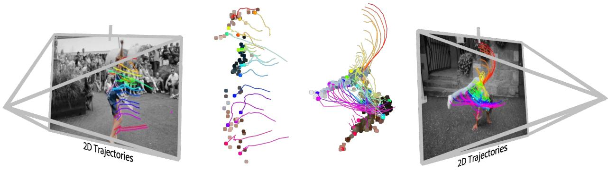
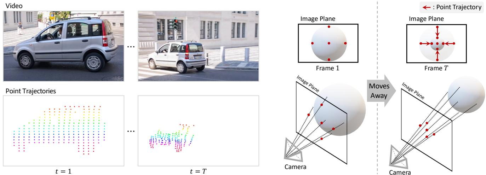
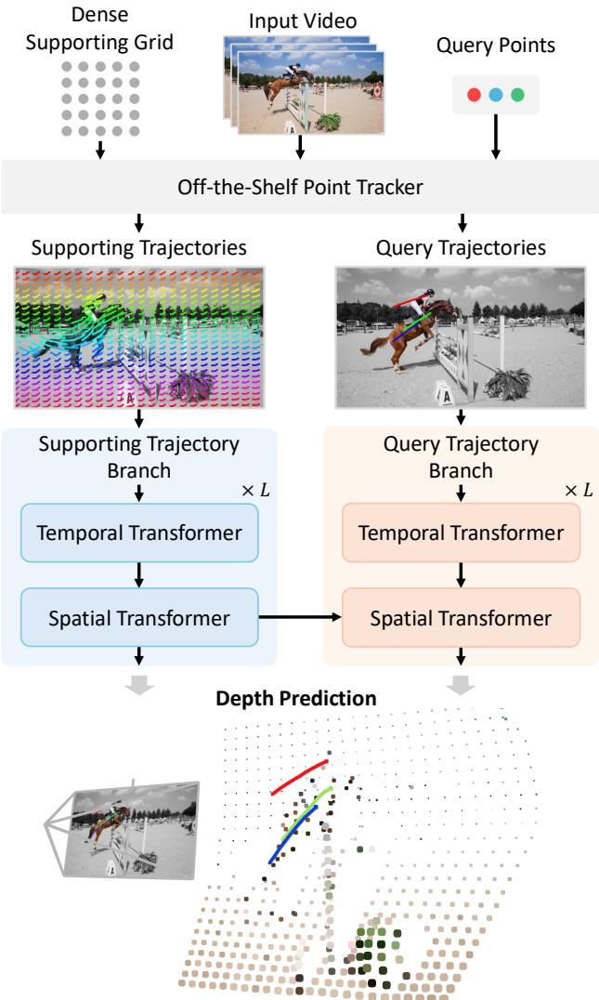
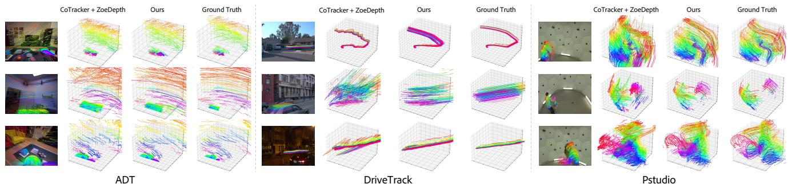

# Seurat: From Moving Points to Depth

Seokju Cho1 Jiahui Huang2 Seungryong Kim1 Joon-Young Lee2

1KAIST AI 2Adobe Research

  
3D Trajectories  
Figure 1. Seurat predicts precise and smooth depth changes for dynamic objects over time by only looking at the 2D point trajectories, which encode depth cues in their motion patterns. The figure illustrates 2D point tracks lifted into 3D space with our depth predictions on videos from the DAVIS dataset [41].

## Abstract

Accurate depth estimation from monocular videos remains challenging due to ambiguities inherent in singleview geometry, as crucial depth cues like stereopsis are absent. However, humans often perceive relative depth intuitively by observing variations in the size and spacing of objects as they move. Inspired by this, we propose a novel method that infers relative depth by examining the spatial relationships and temporal evolution of a set of tracked 2D trajectories. Specifically, we use off-the-shelf point tracking models to capture 2D trajectories. Then, our approach employs spatial and temporal transformers to process these trajectories and directly infer depth changes over time. Evaluated on the TAPVid-3D benchmark, our method demonstrates robust zero-shot performance, generalizing effectivelyfrom synthetic to real-world datasets. Results indicate that our approach achieves temporally smooth, highaccuracy depth predictions across diverse domains.

## 1. Introduction

Understanding the 3D structure of a scene is essential for numerous applications, including image and video generation [56], robotics [12], autonomous driving [40], and 3D reconstruction [32]. However, obtaining accurate depth information from monocular images is challenging due to inherent ambiguities [17], difficulties in scale and shift determination [42], and the considerable diversity of real-world scenes [42, 55]. In monocular video sequences, additional complexities arise from dynamic objects exhibiting intricate movements [36] and lengthy sequences complicating the maintenance of temporal coherence in depth estimation [21].

A classical method for obtaining precise depth information is Structured Light 3D Scanning [13, 14, 33], which involves projecting known patterns onto surfaces. The deformation of these patterns upon interacting with surfaces encodes valuable data about the 3D structure of the objects. This effectively transforms the spatial variations in the scene into measurable distortions in the projected pattern, allowing for accurate depth reconstruction.

Drawing inspiration from Structured Light methods [13, 14, 33], we propose that similar principles can be applied to monocular video sequences, assuming local object rigid ity. Just as the deformation of a projected pattern reveals depth information, the patterns formed by the trajectories of tracked points [9–11, 23] in video sequences can reveal the 3D structure of a scene. These trajectories inherently capture spatial relationships and motion patterns relative to the camera, providing robust cues for depth estimation. For example, points moving away from the camera create denser trajectory patterns, as illustrated in Figure 2. Analyzing the relative motion of these points allows us to discern whether objects or surfaces approach or recede from the camera, facilitating accurate temporal depth estimation.

  
(a) From the points alone, we can tell if the car is moving away or approaching.  
(b) Object recedes, points converge toward center.  
Figure 2. Motivation of our work. (a) By only looking at the tracked points, we can easily perceive that the object (here, a car) is moving away. (b) As a 3D object (here, a sphere) moves away from the camera, the pattern of its projected 2D points on the image plane changes, providing depth cues. In the initial frame (left), points are spaced farther apart on the image plane. As the object recedes (right), these 2D points converge toward the center, indicating increasing depth. This change in the density of projected points allows for inference of relative depth changes from motion in monocular video.

Specifically, we begin by extracting trajectories using off-the-shelf point-tracking models [9, 24]. To exploit depth information encoded in these trajectories, we employ both spatial and temporal transformers [1, 24], which respectively model spatial relationships and ensure temporal smoothness. Furthermore, we explicitly decouple the supporting trajectories from query trajectories to avoid potential biases during depth estimation.

We observe that processing an entire video sequence simultaneously results in highly complex and unstable depth predictions, particularly for objects exhibiting rapid movements relative to the camera. To mitigate this issue, we predict temporal depth changes within sliding windows, assuming that depth variations are more consistent and manageable in shorter segments. Additionally, we introduce a specially designed window-wise log-ratio depth loss to achieve accurate depth supervision. We found this approach critical for reliably learning relative depth.

Our work introduces a novel trajectory-based framework for depth estimation from monocular videos, capitalizing on the temporal evolution of point trajectories without relying on stereo [7] or multi-view setups [35], additional sensors [49], strong feature backbones [4, 28, 37], or extensive annotated datasets [42]. Our approach infers depth change over time in a strictly zero-shot manner, trained solely on a synthetic dataset [18] without any pre-trained feature backbone. Despite this simplicity, our model demonstrates robust generalization capabilities and performs effectively on real-world datasets.

We evaluate our proposed method on the TAPVid-3D benchmark [27], highlighting its effectiveness and robustness in diverse scenarios, including driving scenes [15, 16], egocentric viewpoints [38], and videos containing deformations [22]. Qualitative analyses further demonstrate that our method consistently produces temporally smooth and highly accurate depth predictions.

## 2. Related Work

Point tracking in 2D. Track Any Point (TAP) [9, 11, 19, 23, 26, 27], or point tracking, aims to track any given query point throughout a video sequence along with its visibility status. PIPs [19] iteratively refines trajectories using an MLP-Mixer [50] architecture. TAP-Net [10] constructs a global cost volume followed by convolutions and applies a soft-argmax operation for point tracking. TAPIR [11] initializes trajectories with TAP-Net and refines them using PIPs’ iterative refinement method. CoTracker [23] tracks multiple points simultaneously and models the interactions between them using a Transformer [52] architecture. TAPTR [29, 30] introduces the perspective of object detection to the point tracking. LocoTrack [9] enhances the cost volume with the neighboring points of query points, constructing 4D local correlation volume. Another approach involves test-time training [46, 51, 53], which can benefit from optimization regularization. In our work, we leverage these off-the-shelf point tracking models and extract depth information from the trajectories they produce.

Point tracking in 3D. Recently, SpatialTracker [54] demonstrated that point tracking can be improved by operating in 3D space. This is accomplished by lifting tracked points into 3D using a monocular depth estimation model [3], followed by iterative refinement within a triplane representation [6], which enhances the accuracy of the resulting 2D point trajectories. While SpatialTracker leverages 3D structural information to enable more robust tracking, our approach instead focuses on uncovering the 3D geometry inherently encoded within the trajectories themselves. TrackTo4D [25] performs Structure-from-Motion [44] from trajectory data, representing dynamic parts with a low-dimensional basis [5]. Unlike TrackTo4D, we do not introduce extra constraints or assumption for dynamic parts.

Monocular depth estimation. With advancements in deep learning, MDE has achieved rapid progress by learning depth from large and diverse datasets. MegaDepth [31] demonstrated that training on extensive, varied datasets leads to better generalization and improved robustness to domain shifts. MiDaS [42] built on this by blending datasets from multiple sources. Recent work has further expanded data sources by incorporating self-training on unlabeled data [55] or using foundational models as a backbone, such as Stable Diffusion [43] or DINOv2 [37]. Although these approaches show strong results on per-frame depth estimation, they often show flickering when applied to video.

## 3. Method

## 3.1. Motivation and Overview

Estimating depth from monocular videos is challenging due to limited depth cues and inherent ambiguities in monocular images [17]. Traditional methods primarily focus on spatial relative depth [3, 4, 42, 55], which concerns the depth differences between points within the same frame. In contrast, we infer depth changes over time, exploiting the rich temporal information that monocular videos inherently contains.

We observe that point trajectories over time encapsulate valuable temporal depth information. Specifically, the motion patterns of tracked points can reveal whether objects or surfaces are moving towards or away from the observer, as illustrated in Figure 2. Our approach leverages the temporal evolution of 2D point trajectories to predict depth changes, avoiding reliance on stereo [7, 49], multiview setups [20, 28], additional sensors [49], or large-scale dataset [42].

Formally, given a monocular video with T frames, we employ an off-the-shelf point tracking model [9, 24] to extract $N$ trajectories along with their occlusion statuses:

• Trajectories: $\mathcal { T } = \{ \mathbf { p } _ { i } \} _ { i = 1 } ^ { N }$ , where each trajectory $\mathbf { p } _ { i } =$ $\{ p _ { i , t } \} _ { t = 1 } ^ { T }$ consists of the 2D positions of point i across frames.

• Occlusion Statuses: $\begin{array} { r c l } { \gamma } & { = } & { \{ \mathbf { v } _ { i } \} _ { i = 1 } ^ { N } } \end{array}$ , where $\begin{array} { r l } { \mathbf { v } _ { i } } & { { } = } \end{array}$

$\{ v _ { i , t } \} _ { t = 1 } ^ { T }$ indicates the visibility of point i at each frame.

We develop a model that takes the extracted trajectories $\tau$ and occlusion statuses V as input to predict temporal changes in depth. Specifically, our model estimates the depth ratio along each trajectory i: $r _ { i , t } = d _ { i , t } / d _ { i , t _ { 0 } }$ , relative to a reference frame $t _ { 0 }$ , where $d _ { i , t }$ t represents the depth of point i at frame t.

We begin by detailing the theoretical basis behind extracting depth cues from trajectories in Sec. 3.2. Subsequently, we introduce our Transformer-based model architecture for depth ratio prediction in Sec. 3.3. Next, we describe the sliding window training and inference in Sec. 3.4 and outline the inference strategy in Sec. 3.5, which combines predicted depth ratios $\hat { r }$ with a metric monocular depth estimation model to produce the final metric depth estimates $\hat { d } _ { i , t }$

## 3.2. Theoretical Analysis

Point trajectories over time encapsulate valuable temporal relative depth information. Specifically, the motion patterns of tracked points can reveal depth changes based on the density variation of points projected onto the image plane. Under the assumption of $\mathrm { a }$ pinhole camera model, consider a small surface patch with area $A _ { \mathrm { s u r f a c e } }$ at depth $d _ { t }$ and orientation $\theta _ { t }$ in frame $t ,$ where $\theta _ { t }$ is the angle between the surface normal and the camera’s optical axis. The projected area of this patch onto the image plane is given by:

$$
A _ { t } ^ { \mathrm { i m a g e } } = \left( \frac { f } { d _ { t } } \right) ^ { 2 } A ^ { \mathrm { s u r f a c e } } \cos \theta _ { t } ,\tag{1}
$$

where $f$ is the focal length of the camera. The density of projected points $\rho _ { t } ^ { \mathrm { i m a g e } }$ is inversely proportional to $A _ { t } ^ { \mathrm { i m a g e } }$

$$
\rho _ { t } ^ { \mathrm { i m a g e } } \propto \frac { ( d _ { t } ) ^ { 2 } } { f ^ { 2 } A _ { \mathrm { s u r f a c e } } \cos \theta _ { t } } .\tag{2}
$$

Assuming local rigidity in a small area $A ^ { \mathrm { s u r f a c e } }$ , the ratio of densities at times t and $t _ { 0 }$ is:

$$
{ \frac { \rho _ { t _ { 0 } } ^ { \mathrm { i m a g e } } } { \rho _ { t } ^ { \mathrm { i m a g e } } } } = \left( { \frac { d _ { t _ { 0 } } } { d _ { t } } } \right) ^ { 2 } \left( { \frac { \cos \theta _ { t } } { \cos \theta _ { t _ { 0 } } } } \right) ^ { 2 } .\tag{3}
$$

Taking the square root yields the depth ratio $r _ { t } .$ , which is the depth variation over time with respect to the anchor timestep $t _ { 0 } { \mathrm { : } }$

$$
r _ { t } = \frac { d _ { t } } { d _ { t _ { 0 } } } = \sqrt { \frac { \rho _ { t } ^ { \mathrm { i m a g e } } } { \rho _ { t _ { 0 } } ^ { \mathrm { i m a g e } } } } \frac { \cos \theta _ { t } } { \cos \theta _ { t _ { 0 } } } .\tag{4}
$$

It is important to note that the theoretical derivation above assumes the object is locally rigid and requires precise knowledge of its rotational orientation over time cos $\theta _ { t } /$ cos $\theta _ { t _ { 0 } }$ . Calculating depth changes deterministically using these formulas demands accurate measurements of rotation and local rigidity, which can be impractical in realworld scenarios, as validated in Table 4.

  
Figure 3. Overall architecture. We first use off-the-shelf point tracker [9, 24] to extract 2D trajectories of query points and a dense supporting grid, then, these trajectories are processed with a temporal and a spatial transformer in two separate branches. Motion information encoded by the supporting branch is injected into the query branch via cross-attention. Finally, two regression heads output ratio depths of both supporting and query trajectories.

To overcome these limitations, we employ a transformerbased framework that implicitly captures the complexities of object motion and rotation through learned representations. This approach allows us to estimate ratio depth without relying solely on the explicit calculations provided by the equations, making the prediction more robust to variations in object properties and motion dynamics.

## 3.3. Processing Trajectories with Transformer

For effective depth estimation, it’s crucial that the model captures the comprehensive motion patterns of the entire scene. Relying solely on user-defined or dataset-provided query points may not suffice, as they might not adequately represent the scene’s overall motion due to their uneven distribution, often biased to the salient objects [2, 10, 57]. This limitation can hinder the model’s ability to infer depth accurately, especially in regions lacking sufficient trajectory.

To address this challenge, we introduce supporting trajectories derived from a grid of uniformly sampled points across the image. These grid-shaped trajectories offer a uniform and dense representation of the scene’s motion, effectively capturing both local and global movements. By incorporating these supporting trajectories, the model gains a holistic understanding of the scene’s dynamics, which is essential for accurate depth estimation.

Additionally, to prevent the biased distribution of query points from influencing the supporting trajectories, we decouple the model into two branches. The supporting trajectory branch processes the supporting grid trajectories to capture global motion information, while the query trajectory branch processes the query trajectories. The motion information encoded by the supporting branch is then injected into the query branch using cross-attention [52]. This design ensures that the depth predictions for query points are informed by the overall scene motion without being biased by the distribution of the query points. The overall architecture is illustrated in Figure 3.

## 3.3.1 Supporting Trajectory Branch

The supporting trajectory branch processes a uniform grid of trajectories $\mathcal { T } _ { s }$ , which we refer to as supporting trajectories. These are obtained by tracking a predefined grid of points using the point tracking model [9, 24]. The supporting trajectories capture the overall motion dynamics of the scene and provide contextual information that aids in accurate depth estimation.

Let $\bar { \mathcal { T } _ { s } } ~ = ~ \{ { \bf p } _ { i } ^ { \mathrm { s u p p } } \} _ { i = 1 } ^ { i = N _ { s } }$ denote the supporting trajectories, where $N _ { s }$ is the number of supporting points. Each supporting trajectory $\mathbf { p } _ { i } ^ { \mathrm { s u p p } }$ is associated with an occlusion status $\mathbf { v } _ { i } ^ { \mathrm { s u p p } } \in \mathcal { V } _ { s }$ . The encoder processes these trajectories using a Transformer architecture [52] with alternating temporal and spatial attention layers [1, 8, 24].

Formally, the supporting trajectories are embedded and processed through L layers:

$$
\begin{array} { r l } & { \mathbf { h } _ { s } ^ { 0 } = \mathrm { E m b e d d i n g } ( \mathcal { T } _ { s } , \mathcal { V } _ { s } ) } \\ & { \mathbf { h } _ { s } ^ { l } = \mathrm { T r a n s f o r m e r L a y e r } _ { s } ^ { l } ( \mathbf { h } _ { s } ^ { l - 1 } ) , \quad l = 1 , \ldots , L , } \end{array}\tag{5}
$$

where ${ \bf h } _ { s } ^ { 0 }$ is the initial embedding of the supporting trajectories from trajectory position and occlusion status. Each

Transformer layer TransformerL $\mathsf { \_ m y e r } _ { s } ^ { l }$ consists of temporal attention followed by spatial attention, following recent works in point tracking [8, 24]. The intermediate features $\mathbf h _ { s } ^ { l }$ captures the encoded motion information from the supporting trajectories, serving as a rich representation of the scene’s dynamics.

## 3.3.2 Query Trajectory Branch

The query trajectory branch processes trajectories $\mathcal { T } _ { q }$ and their visibility status $\gamma _ { q } ,$ , obtained by tracking user-defined query points. The query trajectory branch predicts the ratio depth by incorporating motion information from the supporting trajectories. To achieve this, we employ a Transformer architecture with cross-attention that attend to the motion information encoded from supporting trajectories. This allows the query decoder to leverage the global motion context while focusing on the specific query points.

The decoding process is defined as:

$$
\begin{array} { l } { { \mathbf { h } _ { q } ^ { 0 } = \mathrm { E m b e d d i n g } ( \mathcal { T } _ { q } , \mathcal { V } _ { q } ) } } \\ { { \mathbf { h } _ { q } ^ { l } = \mathrm { T r a n s f o r m e r L a y e r } _ { q } ^ { l } ( \mathbf { h } _ { q } ^ { l - 1 } , \mathbf { h } _ { s } ^ { l - 1 } ) , \quad l = 1 , \ldots , L , } } \end{array}\tag{6}
$$

where ${ \bf h } _ { q } ^ { 0 }$ is the initial embedding of the query trajectories derived from their positions and occlusion status. Each Transformer layer TransformerLaye $\mathrm { r } _ { q } ^ { l }$ includes a crossattention that aggregates information from the supporting trajectories with $\mathbf { h } _ { s } ^ { l - 1 }$ . The output $\mathbf { h } _ { q } ^ { ( L ) }$ provides a refined representation for depth ratio prediction. Note that for each query point, trajectory is independently processed to prevent the predictions from being influenced by the distribution of query points.

Both the supporting encoder and the query decoder have ratio depth prediction heads attached to their final layers, which output the estimated relative depth changes for the trajectories. Additionally, inspired by [8, 9, 19, 24, 48], we iteratively refine the predicted depths by feeding the current predictions back into the model in subsequent iterations.

## 3.4. Sliding Window Prediction

Processing entire video sequences at once may lead to complex and divergent depth results due to the increased complexity of long-range motion patterns and the potential for supporting trajectories to move out of the frame. To address this, we employ a sliding window approach during both training and inference.

The sliding window approach involves segmenting the video sequence into shorter temporal windows of length $W$ , with an overlap to ensure continuity, setting the window stride as S. In our model, the query trajectories persist across windows, while the supporting trajectories are re-initialized for each window, making the supporting trajectories more likely to remain within the frame.

Training with window-wise log ratio depth loss. To align our training objective with Eq. 4, we focus on predicting the log depth ratio for each frame with respect to the starting frame of the current window. By predicting the log depth ratios, the model becomes invariant to the absolute scale of depth, focusing instead on the relative changes. The log depth ratio for point i at time t within window w is defined as:

$$
\ell _ { i , t } ^ { w } = \log \left( r _ { i , t } ^ { w } \right) = \log \left( \frac { d _ { i , t } ^ { w } } { d _ { i , 0 } ^ { w } } \right) , \quad t \in [ 0 , W - 1 ] ,\tag{7}
$$

where $W$ is the window size, and $d _ { i , t } ^ { w }$ is the ground-truth depth of point i at time t within w-th window.

Our model predicts $\hat { \ell } _ { i , t } ^ { w }$ , the predicted log depth ratios for each point i at time t within window w. We train the model using an $L _ { 1 }$ loss between the predicted and ground-truth log depth ratios $\ell _ { i , t } \mathrm { : }$

$$
\mathcal { L } = \sum _ { i } \sum _ { w } \sum _ { t } \left| \hat { \ell } _ { i , t } ^ { w } - \ell _ { i , t } ^ { w } \right| .\tag{8}
$$

This loss encourages the model to accurately predict the depth changes within each window, focusing on the temporal relative depth. We apply the loss to the depth predictions of both the query trajectories and the supporting trajectories.

Inference with sliding window. Within each sliding window, the model predicts log depth ratios, denoted as $\hat { \ell } _ { i , t } ^ { w } ,$ relative to the first frame of that window. To obtain depth predictions for the entire sequence, these log depth ratios are accumulated, and then exponentiated to convert them back to linear-scale depth ratios. Importantly, during inference, the supporting point depth ratios are discarded after each window; only the query point depth ratios are accumulated, as the supporting points serve solely to improve depth estimation within the current window. Specifically, the accumulated depth ratio $\hat { r } _ { i , t }$ for point i at time t is calculated as:

$$
\hat { r } _ { i , t } = \exp \left( \hat { \ell } _ { i , t _ { k } } ^ { k } + \sum _ { w = 0 } ^ { k - 1 } \hat { \ell } _ { i , S } ^ { w } \right) , \quad t _ { k } = t - S k ,\tag{9}
$$

where $\hat { \ell } _ { i , t } ^ { w }$ represents the predicted log depth ratio for t-th frame in window $w , S$ denotes the stride of the sliding window, k is the index of the last window that contains time $t ,$ and $t _ { k }$ represents the time index of t within window k.

## 3.5. Incorporating Depth Ratio and Metric Depth

Although our predicted depth ratios accurately capture changes over time, the accumulated ratio $\boldsymbol { \hat { r } } _ { i , 1 }$ t for the entire video reflects only the depth change relative to the initial frame. Therefore, in the final step, we correct each accumulated depth ratio using an off-the-shelf metric depth estimator [3, 4].

<table><tr><td rowspan="2">Depth Estimator</td><td rowspan="2">Point Tracker</td><td colspan="2">Aria [38] 3D-AJ↑ APD↑ TC↓</td><td rowspan="2">3D-AJ↑ APD ↑ TC↓</td><td colspan="3">DriveTrack [2]</td><td colspan="3">PStudio [22]</td><td colspan="3">Average</td></tr><tr><td></td><td></td><td></td><td></td><td></td><td>3D-AJ↑ APD ↑ TC ↓|</td><td></td><td></td><td></td><td>3D-AJ↑ APD↑</td><td>TC↓</td></tr><tr><td>Oracle depth*</td><td>CoTracker [24] |</td><td>55.9</td><td>70.3</td><td></td><td>53.2</td><td>71.7</td><td></td><td>46.9</td><td>65.0</td><td></td><td>52.0</td><td>69.0</td><td>-</td></tr><tr><td>TAPIR-3D [27]</td><td></td><td>8.5</td><td>14.9</td><td></td><td>10.2</td><td>17.0</td><td></td><td>7.2</td><td>13.1</td><td></td><td>8.6</td><td>15.0</td><td>-</td></tr><tr><td colspan="10">Per-frame Depth Estimator</td><td></td><td></td><td></td><td></td><td></td></tr><tr><td rowspan="4">ZoeDepth [3]</td><td>Oracle tracker* CoTracker [24]</td><td>19.1 16.5</td><td>28.6 25.5</td><td>0.05</td><td>10.8 9.5</td><td>17.4</td><td>1.27 1.34</td><td>15.5 11.8</td><td>24.3</td><td>0.05</td><td>15.1</td><td>23.4</td><td>0.46</td></tr><tr><td>LocoTrack [9]</td><td>15.7</td><td>25.4</td><td>0.06</td><td></td><td>16.2</td><td>1.33</td><td></td><td>20.4</td><td>0.05</td><td>12.6 12.5</td><td>20.7</td><td>0.48</td></tr><tr><td></td><td></td><td></td><td>0.06</td><td>10.0</td><td>16.3</td><td></td><td>11.8</td><td>20.1</td><td>0.04</td><td></td><td>20.6</td><td>0.48</td></tr><tr><td>Oracle tracker*</td><td>13.4</td><td>21.3</td><td>0.14</td><td>6.7</td><td>12.0</td><td>3.72</td><td>8.9</td><td>15.3</td><td>0.16</td><td>9.7</td><td>16.2</td><td>1.34</td></tr><tr><td rowspan="3">DepthPro [4]</td><td>CoTracker [24]</td><td>11.3</td><td>18.7</td><td>0.16</td><td>5.4</td><td>10.5</td><td>3.87</td><td>6.7</td><td>12.7</td><td>0.16</td><td>7.8</td><td>14.0</td><td>1.40</td></tr><tr><td>LocoTrack [9]</td><td>10.8</td><td>18.6</td><td>0.15</td><td>5.6</td><td>10.3</td><td>4.18</td><td>6.7</td><td>12.5</td><td>0.17</td><td>7.7</td><td>13.8</td><td>1.50</td></tr><tr><td colspan="11">Video Depth Estimator</td></tr><tr><td rowspan="3">DepthCrafter [21]</td><td>Oracle tracker*</td><td>17.5</td><td>27.1</td><td>0.02</td><td>9.8</td><td>16.4</td><td>0.75</td><td>13.8</td><td>22.6</td><td>0.03</td><td>13.7</td><td>22.0</td><td>0.26</td></tr><tr><td>CoTracker [24]</td><td>15.1</td><td>24.3</td><td>0.04</td><td>8.4</td><td>15.2</td><td>0.98</td><td>11.1</td><td>19.5</td><td>0.03</td><td>11.5</td><td>19.7</td><td>0.35</td></tr><tr><td>LocoTrack [9]</td><td>13.9</td><td>23.5</td><td>0.03</td><td>8.8</td><td>15.1</td><td>0.95</td><td>11.0</td><td>19.3</td><td>0.03</td><td>11.2</td><td>19.3</td><td>0.34</td></tr><tr><td rowspan="3">ChronoDepth [45]</td><td>Oracle tracker*</td><td>12.3</td><td>18.7</td><td>0.22</td><td>7.1</td><td>12.7</td><td>3.94</td><td>3.5</td><td>6.5</td><td>0.33</td><td>7.6</td><td>12.6</td><td>1.50</td></tr><tr><td>CoTracker [24]</td><td>11.0</td><td>17.8</td><td>2.37</td><td>6.1</td><td>11.7</td><td>7.43</td><td>3.0</td><td>5.9</td><td>0.37</td><td>6.7</td><td>11.8</td><td>3.39</td></tr><tr><td>LocoTrack [9]</td><td>10.5</td><td>17.6</td><td>0.23</td><td>6.4</td><td>11.6</td><td>1.49</td><td>3.0</td><td>5.9</td><td>0.38</td><td>6.6</td><td>11.7</td><td>0.70</td></tr><tr><td rowspan="2">Seurat (Ours)</td><td>CoTracker [24]</td><td>25.1</td><td>36.9</td><td>0.01</td><td>11.6</td><td>20.4</td><td>0.15</td><td>17.3</td><td>28.5</td><td>0.01</td><td>18.0</td><td>28.6</td><td>0.05</td></tr><tr><td>LocoTrack [9]</td><td>24.1</td><td>34.6</td><td>0.08</td><td>12.7</td><td>20.4</td><td>0.55</td><td>17.4</td><td>27.6</td><td>0.07</td><td>18.1</td><td>27.4</td><td>0.23</td></tr></table>

Table 1. Quantitative results on TAPVid-3D [27] minival split with per-trajectory depth scaling. Oracle tracker∗ rows use ground truth 2D trajectories, while Oracle depth∗ row uses ground-truth depth estimation to determine the upper bound.

Concretely, we perform piecewise scale matching for each visible subsequence $\boldsymbol { \mathcal { S } } _ { i , t }$ . Here, $\boldsymbol { \mathcal { S } } _ { i , t }$ is the set of consecutive frames that includes time $t ,$ during which a particular point i remains visible. We compute a scale factor $s _ { i , t }$ by matching the median of $\hat { r } _ { i , t }$ to the median of the MDE model’s depth estimates over all $t ^ { \prime } \in S _ { i , t } \colon$

$$
s _ { i , t } = \frac { \mathrm { m e d i a n } _ { t ^ { \prime } \in S _ { i , t } } \Bigl ( d _ { \mathrm { M D E } } \bigl ( p _ { i , t ^ { \prime } } \bigr ) \Bigr ) } { \mathrm { m e d i a n } _ { t ^ { \prime } \in S _ { i , t } } \bigl ( \hat { r } _ { i , t ^ { \prime } } \bigr ) } ,\tag{10}
$$

where $d _ { \mathrm { M D E } } ( p _ { i , t ^ { \prime } } )$ is the MDE-predicted depth at point $p _ { i , t ^ { \prime } } .$ obtained by bilinear interpolation from the depth map. We then apply this scale factor to our predicted ratio to obtain the final depth estimate:

$$
\hat { d } _ { i , t } = s _ { i , t } \ \cdot \ \hat { r } _ { i , t } .\tag{11}
$$

By matching medians in each subsequence, we align our model’s temporal depth changes with the MDE model’s metric depth estimates. This integration leverages the strengths of both approaches: our model offers temporally coherent depth changes, while the MDE model ensures reliable spatial depth relationships within each frame. The resulting estimates are therefore both temporally stable and spatially precise.

## 4. Experiment

## 4.1. Evaluation Protocol and Baselines

Evaluation protocol. We assess trajectory depth accuracy using the TAPVid-3D benchmark [27], which encompasses both outdoor and indoor scenarios through egocentric videos, driving scenes, and studio setups. For details on the datasets included in the TAPVid-3D benchmark, please refer to the supplementary materials.

We measure the accuracy of the predicted position using APD, which represents the percentage of points within a threshold δ. Unlike 2D point tracking, which defines threshold values in pixels, we use a depth-adaptive threshold [27]. We report the average score across $\delta = 1 , 2 , 4 , 8 , 1 6$ . 3D-AJ reflects combined accuracy for both position and occlusion. In this study, we prioritize position accuracy over occlusion, as we rely on the occlusion accuracy of an offthe-shelf 2D point tracker. We also measure the temporal coherence (TC) [8, 53] of the predicted 3D tracks, which is the L2 distance between the ground-truth acceleration of the trajectory and that of the predicted trajectory.

Baselines. For comparison, we construct simple baselines by pairing a 2D point tracking model with a monocular depth estimation (MDE) model. By unprojecting the 2D tracks generated by the tracking module using depth estimates from the MDE model, we obtain a 3D trajectory over the video sequence. For 2D point tracking, we use recent state-of-the-art models for their accuracy, specifically LocoTrack [9] and CoTracker [24]. We carefully select MDE models, ensuring that their training sets do not overlap with our evaluation benchmark dataset. Some stateof-the-art MDE models, such as UniDepth [39], use the Waymo dataset [47] for training. To avoid overlap, we use ZoeDepth [3] and DepthPro [4] as our baseline models.

<table><tr><td rowspan="2">Depth Estimator</td><td rowspan="2">Point Tracker</td><td colspan="3">Aria [38]</td><td colspan="3">DriveTrack [2]</td><td colspan="3">PStudio [22]</td><td colspan="3">Average</td></tr><tr><td>3D-AJ↑ APD ↑</td><td></td><td>TC↓</td><td>3D-AJ↑ APD↑ TC↓</td><td></td><td></td><td>3D-AJ ↑ APD ↑ TC↓</td><td></td><td></td><td></td><td>3D-AJ↑ APD↑</td><td>TC↓</td></tr><tr><td>Oracle depth*</td><td>CoTracker [24] |</td><td>55.9</td><td>70.3</td><td>-</td><td>53.2</td><td>71.7</td><td>-</td><td>46.9</td><td>65.0</td><td>-</td><td>52.0</td><td>69.0</td><td>一</td></tr><tr><td rowspan="3">DepthCrafter [21]</td><td>Oracle tracker*</td><td>9.5</td><td>15.1</td><td>0.016</td><td>9.6</td><td>15.2</td><td>0.484</td><td>13.4</td><td>21.1</td><td>0.015</td><td>10.8</td><td>17.1</td><td>0.172</td></tr><tr><td>CoTracker [24]</td><td>7.4</td><td>12.2</td><td>0.041</td><td>7.2</td><td>12.3</td><td>0.594</td><td>9.3</td><td>16.4</td><td>0.015</td><td>8.0</td><td>13.6</td><td>0.217</td></tr><tr><td>LocoTrack [9]</td><td>6.7</td><td>12.2</td><td>0.030</td><td>7.0</td><td>11.5</td><td>0.584</td><td>8.2</td><td>14.5</td><td>0.017</td><td>7.3</td><td>12.7</td><td>0.210</td></tr><tr><td rowspan="3">ChronoDepth [45]</td><td>Oracle tracker*</td><td>12.3</td><td>18.7</td><td>0.033</td><td>8.0</td><td>13.3</td><td>0.913</td><td>11.8</td><td>18.9</td><td>0.020</td><td>10.7</td><td>17.0</td><td>0.322</td></tr><tr><td>CoTracker [24]</td><td>10.1</td><td>15.9</td><td>0.045</td><td>6.7</td><td>11.9</td><td>0.895</td><td>8.6</td><td>15.4</td><td>0.020</td><td>8.5</td><td>14.4</td><td>0.320</td></tr><tr><td>LocoTrack [9]</td><td>9.4</td><td>15.7</td><td>0.044</td><td>6.2</td><td>10.7</td><td>0.888</td><td>8.3</td><td>14.7</td><td>0.022</td><td>8.0</td><td>13.7</td><td>0.318</td></tr><tr><td rowspan="2">Seurat (Ours) + ZoeDepth [3]</td><td>CoTracker [24]</td><td>11.3</td><td>18.0</td><td>0.012</td><td>7.5</td><td>12.9</td><td>0.244</td><td>11.4</td><td>19.2</td><td>0.012</td><td>10.1</td><td>16.7</td><td>0.089</td></tr><tr><td>LocoTrack [9]</td><td>10.7</td><td>16.7</td><td>0.086</td><td>7.6</td><td>12.3</td><td>0.567</td><td>10.4</td><td>16.8</td><td>0.069</td><td>9.6</td><td>15.3</td><td>0.241</td></tr><tr><td rowspan="2">Seurat (Ours) + DepthPro [4]</td><td>CoTracker [24]</td><td>15.1</td><td>22.5</td><td>0.012</td><td>8.4</td><td>13.9</td><td>0.219</td><td>12.5</td><td>20.5</td><td>0.013</td><td>12.0</td><td>19.0</td><td>0.081</td></tr><tr><td>LocoTrack [9]</td><td>14.5</td><td>21.4</td><td>0.086</td><td>8.7</td><td>13.5</td><td>0.551</td><td>12.0</td><td>18.8</td><td>0.070</td><td>11.7</td><td>17.9</td><td>0.236</td></tr></table>

Table 2. Quantitative results of affine-invariant depth on TAPVid-3D [27] minival split. Compared to video depth estimators, our model shows superior performance. Oracle tracker∗ rows use ground-truth 2D trajectories, while Oracle depth∗ row uses ground-truth depth estimation to determine the upper bound.
<table><tr><td rowspan="2"></td><td rowspan="2">Method</td><td colspan="2">Average</td><td rowspan="2"># of Layers</td><td colspan="2">Average</td></tr><tr><td>3D-AJ</td><td>APD</td><td>3D-AJ</td><td>APD</td></tr><tr><td>(I)</td><td>Seurat (Ours)</td><td>18.0</td><td>28.6</td><td>1</td><td>15.5</td><td>25.1</td></tr><tr><td>(II)</td><td>(I) - Two-branch design</td><td>13.7</td><td>23.1</td><td>2 (Ours)</td><td>18.0</td><td>28.6</td></tr><tr><td>(III)</td><td>(I) - Sliding window</td><td>8.8</td><td>16.1</td><td>3</td><td>17.8</td><td>28.3</td></tr><tr><td>(IV)</td><td>(I) - Window-wise loss</td><td>14.9</td><td>24.5</td><td>4</td><td>17.8</td><td>28.1</td></tr></table>

Table 3. Ablation studies. Left: Ablation of main components. We conduct gradually exclude core components from our full model. Right: Ablation on the number of layers $L .$
<table><tr><td>Depth Ratio Estimator</td><td>Point Tracker</td><td colspan="2">Aria 3D-AJ↑ APD↑</td><td colspan="2">DriveTrack 3D-AJ↑ APD↑</td><td colspan="2">PStudio 3D-AJ↑ APD↑</td><td colspan="2">Average 3D-AJ↑ APD ↑</td></tr><tr><td>Hand-crafted baseline</td><td>CoTracker</td><td>8.6</td><td>15.2</td><td>5.3</td><td>10.4</td><td>4.2</td><td>8.1</td><td>6.0</td><td>11.2</td></tr><tr><td>Seurat (Ours)</td><td>CoTracker</td><td>25.1</td><td>36.9</td><td>11.6</td><td>20.4</td><td>17.3</td><td>28.5</td><td>18.0</td><td>28.6</td></tr></table>

Table 4. Comparison with handcrafted baseline. Handcrafted implementation of Eq. 4 exhibits lower performance.

## 4.2. Implementation Details

We train our model using the AdamW optimizer [34] with a learning rate of $5 \times 1 0 ^ { - 4 }$ and a weight decay of $1 \times 1 0 ^ { - 5 }$ We linearly decayed the learning rate during training, with warm-up step of 1,000. We conduct training for 100,000 steps on eight NVIDIA RTX 3090 GPUs, using a batch size of 1 per GPU. We generate 90,000 training samples from the Kubric [18] MOVi-F dataset generator. We use the number of Transformer layers [52] as L = 2, where each layer has a hidden dimension of 384 and uses 8 attention heads. The supporting grid size is set to 24 × 24. For LocoTrack [9], we use the base model with a resolution of 256 × 256. For CoTracker [24], we use the global grid of 6 × 6. We set the temporal window size W = 8.

## 4.3. Main Results

Quantitative results. We conduct a quantitative evaluation on the TAPVid-3D benchmark in Table 1 and Table 2. For comparison, we combine existing point tracking methods [9, 24] with monocular depth estimators [3, 4] and video depth estimators [21, 45] by unprojecting the tracked 2D trajectories into 3D space using the predicted depth maps.

<table><tr><td>Depth Ratio Estimator</td><td>Point Tracker</td><td colspan="2">Aria 3D-AJ ↑ APD ↑</td><td colspan="2">DriveTrack 3D-AJ ↑ APD ↑</td><td colspan="2">PStudio 3D-AJ ↑ APD ↑</td><td colspan="2">Average 3D-AJ ↑ APD ↑</td></tr><tr><td>Seurat + Texture patch</td><td>CoTracker</td><td>21.0</td><td>31.8</td><td>10.3</td><td>18.6</td><td>16.1</td><td>27.1</td><td>15.8</td><td>25.8</td></tr><tr><td>Seurat (Ours)</td><td>CoTracker</td><td>25.1</td><td>36.9</td><td>11.6</td><td>20.4</td><td>17.3</td><td>28.5</td><td>18.0</td><td>28.6</td></tr></table>

Table 5. Texture patch ablation. Additional texture information reduces performance.
<table><tr><td rowspan="2">Method</td><td colspan="2">Aria</td><td colspan="2">DriveTrack 3D-AJ↑ APD↑</td><td colspan="2">PStudio</td></tr><tr><td>3D-AJ↑ APD↑</td><td></td><td></td><td></td><td>3D-AJ↑ APD ↑</td><td></td></tr><tr><td>ZoeDepth + CoTracker</td><td>9.8</td><td>15.8</td><td>7.2</td><td>12.3</td><td>10.2</td><td>17.9</td></tr><tr><td>ZoeDepth + CoTracker + 1 iter. of Gaussian smoothing</td><td>4.8</td><td>8.6</td><td>6.3</td><td>11.1</td><td>7.7</td><td>14.1</td></tr><tr><td>ZoeDepth + CoTracker + 3 iters. of Gaussian smoothing</td><td>4.4</td><td>8.0</td><td>6.0</td><td>10.7</td><td>7.4</td><td>13.6</td></tr><tr><td>Seurat (Ours)</td><td>14.6</td><td>21.9</td><td>6.9</td><td>11.8</td><td>12.7</td><td>20.7</td></tr></table>

Table 6. Comparison to simple Gaussian smoothing. Simple Gaussian smoothing of per-frame depth estimates proves insufficient for achieving precise video depth.

Despite the simplicity of this approach, their strong tracking and depth performance provide a robust baseline.

Table 1 presents the tracking precision evaluated on a per-trajectory basis, with each trajectory scaled according to the depth of its query point. By individually scaling each trajectory, we can assess how accurately our method captures depth changes over time for each point, aligning with the focus of our approach. Our method significantly outperforms other baselines in position precision (APD), especially in the Aria dataset. Notably, unlike other depth prediction models [3, 4] trained on 14-21 large-scale annotated real datasets, our method trained on single synthetic dataset demonstrates more robust generalizability in depth prediction. Additionally, it excels in temporal coherence, particularly on the DriveTrack dataset, achieving more than 40× better coherence, underscoring the stability of our approach.

Table 2 presents the tracking precision obtained when predicted depths are adjusted to ground truth depths using a single scale and shift value per video, determined via least squares. This evaluation is similar to the common practice in video depth estimation studies [21, 45]. This metric reflects the accuracy of depth predictions across an entire video sequence. Our method achieves strong results on both the Aria and PStudio datasets, particularly when combined with DepthPro [4]. Additionally, we show that our model provides even better temporal coherence compared to existing video depth estimation methods.

  
Figure 4. Qualitative comparisons to baselines. We visualize 3D trajectories using the TAPVid-3D [27] benchmark. Compared to baselines that use combinations such as CoTracker with ZoeDepth, our model achieves superior depth smoothness and accuracy.

Qualitative results. In Figure 4, we compare our method with baseline models. Our model demonstrates exceptionally smooth depth predictions with high accuracy relative to the ground truth.

## 4.4. Ablation and Analysis

Component ablation. We conduct an ablation study, presented on the left of Table 3. In (II), we remove the twobranch design (query and supporting trajectory branches) of our architecture, instead processing both supporting and query trajectories together using a Transformer encoder. In (III), we eliminate the sliding window approach, processing the entire video sequence at once. In (IV), rather than using ratio depth with respect to the first frame of the sliding window, we use ratio depth with respect to the query point.

The observed performance degradation when omitting each design choice demonstrates the effectiveness of our approach. Specifically, in (II), joint processing of supporting and query points negatively impacts performance. In (III), processing the full sequence at once significantly reduces performance, suggesting that handling the whole sequence may complicate the learning process due to complex motion patterns. Finally, (IV) shows that predicting ratio depth within a sliding window is beneficial for the model.

Ablation on the number of layers L. On the left of Table 3, we show the score with varying number of Transformer layers. We found that more than 2 layers does not guarantees the performance boost.

Analysis on hand-crafted deterministic baseline. In Table 4, we validate the handcrafted baseline that implements Eq. 4. To measure how the local spatial density of semidensely sampled trajectories evolves over time, we use a kernel-based approach that compares each point’s neighborhood structure across frames. Specifically, for each trajectory point, we fix its k-nearest neighbors based on their positions in the first frame and then compute a kernel density estimate in each frame using Gaussian kernels applied to the Euclidean distances between the point and its fixed neighbors in that frame. This provides a smooth, robust estimate of local density that reflects how tightly clustered a point remains with respect to its original neighborhood over time. The density at each frame is then normalized by the corresponding density in the first frame, yielding a relative density change per point across the temporal window.

The results imply that the hand-crafted baseline performs significantly worse than ours, which we believe is due to its sensitivity to prediction noise and its inability to estimate surface normals, demonstrating the impracticality of estimating trajectory density using a handcrafted method.

Analysis of the impact of texture as input. To investigate whether texture information can help the model infer depth changes, we conduct an analysis by adding an RGB input path to our model, as shown in Table 5. Specifically, we extract local RGB patches around the trajectory, flatten them, and concatenate them with the Transformer input. The results show that incorporating texture information actually degrades performance. We suspect this is because training on texture data may lead to overfitting to the synthetic dataset.

Is Seurat simply smoothing the per-frame depth jitter? Table 6 addresses whether Seurat is just trajectory smoothing. Simple Gaussian smoothing of the lifted trajectory, using per-frame depth estimates, yielded worse results than Seurat, indicating that Seurat enforces temporal geometric consistency beyond simple smoothing.

## 5. Conclusion

We introduce a novel trajectory-based framework for depth estimation that leverages the temporal evolution of point trajectories in monocular videos. Using spatial and temporal transformers within a sliding window approach, our method processes trajectory data to accurately capture depth changes with high temporal smoothness. This approach offers a fresh perspective on 3D understanding from monocular videos—simple, effective, and straightforward to implement. We hope this method will inspire further exploration and innovation in related fields.

Acknowledgements. This research was supported by Institute of Information & communications Technology Planning & Evaluation (IITP) grant funded by the Korea government (MSIT) (RS-2019-II190075, RS-2024-00509279, RS-2025-II212068, RS-2023-00227592) and the Culture, Sports, and Tourism R&D Program through the Korea Creative Content Agency grant funded by the Ministry of Culture, Sports and Tourism (RS-2024-00345025, RS-2024- 00333068), and National Research Foundation of Korea (RS-2024-00346597).

## References

[1] Anurag Arnab, Mostafa Dehghani, Georg Heigold, Chen Sun, Mario Luciˇ c, and Cordelia Schmid. Vivit: A video´ vision transformer. In Proceedings of the IEEE/CVF international conference on computer vision, pages 6836–6846, 2021. 2, 4

[2] Arjun Balasingam, Joseph Chandler, Chenning Li, Zhoutong Zhang, and Hari Balakrishnan. Drivetrack: A benchmark for long-range point tracking in real-world videos, 2023. 4, 6, 7

[3] Shariq Farooq Bhat, Reiner Birkl, Diana Wofk, Peter Wonka, and Matthias Muller. Zoedepth: Zero-shot trans-¨ fer by combining relative and metric depth. arXiv preprint arXiv:2302.12288, 2023. 3, 5, 6, 7

[4] Aleksei Bochkovskii, Amael Delaunoy, Hugo Germain,¨ Marcel Santos, Yichao Zhou, Stephan R Richter, and Vladlen Koltun. Depth pro: Sharp monocular metric depth in less than a second. arXiv preprint arXiv:2410.02073, 2024. 2, 3, 5, 6, 7, 8

[5] Christoph Bregler, Aaron Hertzmann, and Henning Biermann. Recovering non-rigid 3d shape from image streams. In Proceedings IEEE Conference on Computer Vision and Pattern Recognition. CVPR 2000 (Cat. No. PR00662), pages 690–696. IEEE, 2000. 3

[6] Eric R Chan, Connor Z Lin, Matthew A Chan, Koki Nagano, Boxiao Pan, Shalini De Mello, Orazio Gallo, Leonidas J Guibas, Jonathan Tremblay, Sameh Khamis, et al. Efficient geometry-aware 3d generative adversarial networks. In Proceedings of the IEEE/CVF conference on computer vision and pattern recognition, pages 16123–16133, 2022. 3

[7] Jia-Ren Chang and Yong-Sheng Chen. Pyramid stereo matching network. In Proceedings ofthe IEEE conference on computer vision and pattern recognition, pages 5410–5418, 2018. 2, 3

[8] Seokju Cho, Jiahui Huang, Seungryong Kim, and Joon-Young Lee. Flowtrack: Revisiting optical flow for longrange dense tracking. In Proceedings of the IEEE/CVF Conference on Computer Vision and Pattern Recognition (CVPR), pages 19268–19277, 2024. 4, 5, 6

[9] Seokju Cho, Jiahui Huang, Jisu Nam, Honggyu An, Seungryong Kim, and Joon-Young Lee. Local all-pair correspondence for point tracking. arXiv preprint arXiv:2407.15420, 2024. 1, 2, 3, 4, 5, 6, 7

[10] Carl Doersch, Ankush Gupta, Larisa Markeeva, Adria Recasens, Lucas Smaira, Yusuf Aytar, Joao Carreira, Andrew

Zisserman, and Yi Yang. Tap-vid: A benchmark for tracking any point in a video. Advances in Neural Information Processing Systems, 35:13610–13626, 2022. 2, 4

[11] Carl Doersch, Yi Yang, Mel Vecerik, Dilara Gokay, Ankush Gupta, Yusuf Aytar, Joao Carreira, and Andrew Zisserman. Tapir: Tracking any point with per-frame initialization and temporal refinement. In Proceedings of the IEEE/CVF International Conference on Computer Vision, pages 10061– 10072, 2023. 1, 2

[12] Xingshuai Dong, Matthew A Garratt, Sreenatha G Anavatti, and Hussein A Abbass. Towards real-time monocular depth estimation for robotics: A survey. IEEE Transactions on Intelligent Transportation Systems, 23(10):16940–16961, 2022. 1

[13] Philipp Fechteler and Peter Eisert. Adaptive colour classification for structured light systems. IET Computer Vision, 3 (2):49–59, 2009. 1

[14] Philipp Fechteler, Peter Eisert, and Jurgen Rurainsky. Fast and high resolution 3d face scanning. In 2007 IEEE International Conference on Image Processing, pages III–81. IEEE, 2007. 1

[15] Andreas Geiger, Philip Lenz, and Raquel Urtasun. Are we ready for autonomous driving? the kitti vision benchmark suite. In Conference on Computer Vision and Pattern Recognition (CVPR), 2012. 2

[16] Andreas Geiger, Philip Lenz, Christoph Stiller, and Raquel Urtasun. Vision meets robotics: The kitti dataset. International Journal ofRobotics Research (IJRR), 2013. 2

[17] Clement Godard, Oisin Mac Aodha, and Gabriel J Bros-´ tow. Unsupervised monocular depth estimation with leftright consistency. In Proceedings of the IEEE conference on computer vision and pattern recognition, pages 270–279, 2017. 1, 3

[18] Klaus Greff, Francois Belletti, Lucas Beyer, Carl Doersch, Yilun Du, Daniel Duckworth, David J Fleet, Dan Gnanapragasam, Florian Golemo, Charles Herrmann, et al. Kubric: A scalable dataset generator. In Proceedings of the IEEE/CVF Conference on Computer Vision and Pattern Recognition, pages 3749–3761, 2022. 2, 7

[19] Adam W Harley, Zhaoyuan Fang, and Katerina Fragkiadaki. Particle video revisited: Tracking through occlusions using point trajectories. In European Conference on Computer Vision, pages 59–75. Springer, 2022. 2, 5

[20] Richard Hartley. Multiple view geometry in computer vision. Cambridge university press, 2003. 3

[21] Wenbo Hu, Xiangjun Gao, Xiaoyu Li, Sijie Zhao, Xiaodong Cun, Yong Zhang, Long Quan, and Ying Shan. Depthcrafter: Generating consistent long depth sequences for open-world videos. arXiv preprint arXiv:2409.02095, 2024. 1, 6, 7

[22] Hanbyul Joo, Hao Liu, Lei Tan, Lin Gui, Bart Nabbe, Iain Matthews, Takeo Kanade, Shohei Nobuhara, and Yaser Sheikh. Panoptic studio: A massively multiview system for social motion capture. In Proceedings of the IEEE international conference on computer vision, pages 3334–3342, 2015. 2, 6, 7

[23] Nikita Karaev, Ignacio Rocco, Benjamin Graham, Natalia Neverova, Andrea Vedaldi, and Christian Rupprecht. Co-

tracker: It is better to track together. arXiv preprint arXiv:2307.07635, 2023. 1, 2

[24] Nikita Karaev, Ignacio Rocco, Benjamin Graham, Natalia Neverova, Andrea Vedaldi, and Christian Rupprecht. Cotracker: It is better to track together. arXiv preprint arXiv:2307.07635v2, 2023. 2, 3, 4, 5, 6, 7

[25] Yoni Kasten, Wuyue Lu, and Haggai Maron. Fast encoderbased 3d from casual videos via point track processing. arXiv preprint arXiv:2404.07097, 2024. 3

[26] Ines Hyeonsu Kim, Seokju Cho, Jiahui Huang, Jung\` Yi, Joon-Young Lee, and Seungryong Kim. Exploring temporally-aware features for point tracking. arXiv preprint arXiv:2501.12218, 2025. 2

[27] Skanda Koppula, Ignacio Rocco, Yi Yang, Joe Heyward, Joao Carreira, Andrew Zisserman, Gabriel Brostow, and Carl˜ Doersch. Tapvid-3d: A benchmark for tracking any point in 3d. arXiv preprint arXiv:2407.05921, 2024. 2, 6, 7, 8

[28] Vincent Leroy, Yohann Cabon, and Jer´ ome Revaud. Ground-ˆ ing image matching in 3d with mast3r. arXiv preprint arXiv:2406.09756, 2024. 2, 3

[29] Hongyang Li, Hao Zhang, Shilong Liu, Zhaoyang Zeng, Feng Li, Tianhe Ren, Bohan Li, and Lei Zhang. Taptrv2: Attention-based position update improves tracking any point. arXiv preprint arXiv:2407.16291, 2024. 2

[30] Hongyang Li, Hao Zhang, Shilong Liu, Zhaoyang Zeng, Tianhe Ren, Feng Li, and Lei Zhang. Taptr: Tracking any point with transformers as detection. In European Conference on Computer Vision, pages 57–75. Springer, 2025. 2

[31] Zhengqi Li and Noah Snavely. Megadepth: Learning singleview depth prediction from internet photos. In Proceedings of the IEEE conference on computer vision and pattern recognition, pages 2041–2050, 2018. 3

[32] Zhengqi Li, Qianqian Wang, Forrester Cole, Richard Tucker, and Noah Snavely. Dynibar: Neural dynamic image-based rendering. In Proceedings of the IEEE/CVF Conference on Computer Vision and Pattern Recognition, pages 4273– 4284, 2023. 1

[33] Kai Liu, Yongchang Wang, Daniel L Lau, Qi Hao, and Laurence G Hassebrook. Dual-frequency pattern scheme for high-speed 3-d shape measurement. Optics express, 18(5): 5229–5244, 2010. 1

[34] Ilya Loshchilov and Frank Hutter. Decoupled weight decay regularization. arXiv preprint arXiv:1711.05101, 2017. 7

[35] Jonathon Luiten, Georgios Kopanas, Bastian Leibe, and Deva Ramanan. Dynamic 3d gaussians: Tracking by persistent dynamic view synthesis, 2023. 2

[36] Xuan Luo, Jia-Bin Huang, Richard Szeliski, Kevin Matzen, and Johannes Kopf. Consistent video depth estimation. ACM Transactions on Graphics (ToG), 39(4):71–1, 2020. 1

[37] Maxime Oquab, Timothee Darcet, Th ´ eo Moutakanni, Huy´ Vo, Marc Szafraniec, Vasil Khalidov, Pierre Fernandez, Daniel Haziza, Francisco Massa, Alaaeldin El-Nouby, et al. Dinov2: Learning robust visual features without supervision. arXiv preprint arXiv:2304.07193, 2023. 2, 3

[38] Xiaqing Pan, Nicholas Charron, Yongqian Yang, Scott Peters, Thomas Whelan, Chen Kong, Omkar Parkhi, Richard Newcombe, and Yuheng Carl Ren. Aria digital twin: A new

benchmark dataset for egocentric 3d machine perception. In Proceedings of the IEEE/CVF International Conference on Computer Vision, pages 20133–20143, 2023. 2, 6, 7

[39] Luigi Piccinelli, Yung-Hsu Yang, Christos Sakaridis, Mattia Segu, Siyuan Li, Luc Van Gool, and Fisher Yu. Unidepth: Universal monocular metric depth estimation, 2024. 6

[40] Marc Pollefeys, David Nister, J-M Frahm, Amir Ak-´ barzadeh, Philippos Mordohai, Brian Clipp, Chris Engels, David Gallup, S-J Kim, Paul Merrell, et al. Detailed realtime urban 3d reconstruction from video. International Journal ofComputer Vision, 78:143–167, 2008. 1

[41] Jordi Pont-Tuset, Federico Perazzi, Sergi Caelles, Pablo Arbelaez, Alex Sorkine-Hornung, and Luc Van Gool. The 2017´ davis challenge on video object segmentation. arXiv preprint arXiv:1704.00675, 2017. 1

[42] Rene Ranftl, Katrin Lasinger, David Hafner, Konrad´ Schindler, and Vladlen Koltun. Towards robust monocular depth estimation: Mixing datasets for zero-shot cross-dataset transfer. IEEE transactions on pattern analysis and machine intelligence, 44(3):1623–1637, 2020. 1, 2, 3

[43] Robin Rombach, Andreas Blattmann, Dominik Lorenz, Patrick Esser, and Bjorn Ommer. High-resolution image¨ synthesis with latent diffusion models. In Proceedings of the IEEE/CVF conference on computer vision and pattern recognition, pages 10684–10695, 2022. 3

[44] Johannes L Schonberger and Jan-Michael Frahm. Structurefrom-motion revisited. In Proceedings of the IEEE conference on computer vision and pattern recognition, pages 4104–4113, 2016. 3

[45] Jiahao Shao, Yuanbo Yang, Hongyu Zhou, Youmin Zhang, Yujun Shen, Matteo Poggi, and Yiyi Liao. Learning temporally consistent video depth from video diffusion priors. arXiv preprint arXiv:2406.01493, 2024. 6, 7

[46] Yunzhou Song, Jiahui Lei, Ziyun Wang, Lingjie Liu, and Kostas Daniilidis. Track everything everywhere fast and robustly. In European Conference on Computer Vision, pages 343–359. Springer, 2025. 2

[47] Pei Sun, Henrik Kretzschmar, Xerxes Dotiwalla, Aurelien Chouard, Vijaysai Patnaik, Paul Tsui, James Guo, Yin Zhou, Yuning Chai, Benjamin Caine, Vijay Vasudevan, Wei Han, Jiquan Ngiam, Hang Zhao, Aleksei Timofeev, Scott Ettinger, Maxim Krivokon, Amy Gao, Aditya Joshi, Yu Zhang, Jonathon Shlens, Zhifeng Chen, and Dragomir Anguelov. Scalability in perception for autonomous driving: Waymo open dataset. In Proceedings of the IEEE/CVF Conference on Computer Vision and Pattern Recognition (CVPR), 2020. 6

[48] Zachary Teed and Jia Deng. Raft: Recurrent all-pairs field transforms for optical flow. In Computer Vision–ECCV 2020: 16th European Conference, Glasgow, UK, August 23– 28, 2020, Proceedings, Part II 16, pages 402–419. Springer, 2020. 5

[49] Zachary Teed and Jia Deng. Droid-slam: Deep visual slam for monocular, stereo, and rgb-d cameras. Advances in neural information processing systems, 34:16558–16569, 2021. 2, 3

[50] Ilya O Tolstikhin, Neil Houlsby, Alexander Kolesnikov, Lucas Beyer, Xiaohua Zhai, Thomas Unterthiner, Jessica Yung,

Andreas Steiner, Daniel Keysers, Jakob Uszkoreit, et al. Mlp-mixer: An all-mlp architecture for vision. Advances in neural information processing systems, 34:24261–24272, 2021. 2

[51] Narek Tumanyan, Assaf Singer, Shai Bagon, and Tali Dekel. Dino-tracker: Taming dino for self-supervised point tracking in a single video. In European Conference on Computer Vision, pages 367–385. Springer, 2025. 2

[52] A Vaswani. Attention is all you need. Advances in Neural Information Processing Systems, 2017. 2, 4, 7

[53] Qianqian Wang, Yen-Yu Chang, Ruojin Cai, Zhengqi Li, Bharath Hariharan, Aleksander Holynski, and Noah Snavely. Tracking everything everywhere all at once. arXiv preprint arXiv:2306.05422, 2023. 2, 6

[54] Yuxi Xiao, Qianqian Wang, Shangzhan Zhang, Nan Xue, Sida Peng, Yujun Shen, and Xiaowei Zhou. Spatialtracker: Tracking any 2d pixels in 3d space. In Proceedings of the IEEE/CVF Conference on Computer Vision and Pattern Recognition, pages 20406–20417, 2024. 2

[55] Lihe Yang, Bingyi Kang, Zilong Huang, Xiaogang Xu, Jiashi Feng, and Hengshuang Zhao. Depth anything: Unleashing the power of large-scale unlabeled data. In Proceedings of the IEEE/CVF Conference on Computer Vision and Pattern Recognition, pages 10371–10381, 2024. 1, 3

[56] Lvmin Zhang, Anyi Rao, and Maneesh Agrawala. Adding conditional control to text-to-image diffusion models. In Proceedings of the IEEE/CVF International Conference on Computer Vision, pages 3836–3847, 2023. 1

[57] Yang Zheng, Adam W Harley, Bokui Shen, Gordon Wetzstein, and Leonidas J Guibas. Pointodyssey: A large-scale synthetic dataset for long-term point tracking. In Proceedings of the IEEE/CVF International Conference on Computer Vision, pages 19855–19865, 2023. 4