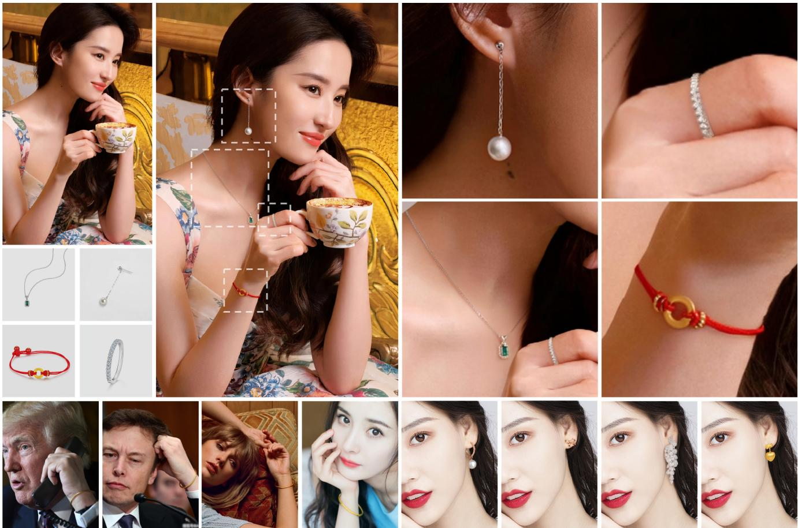
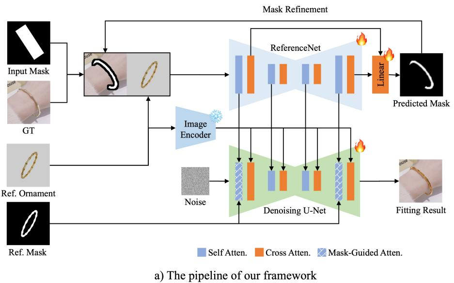
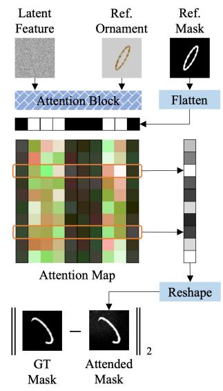
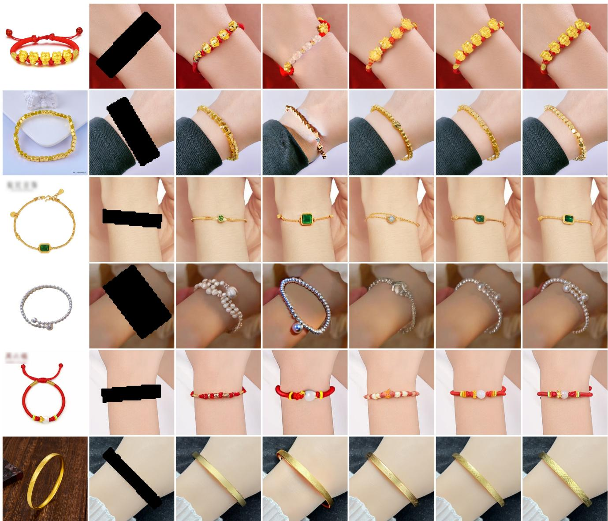
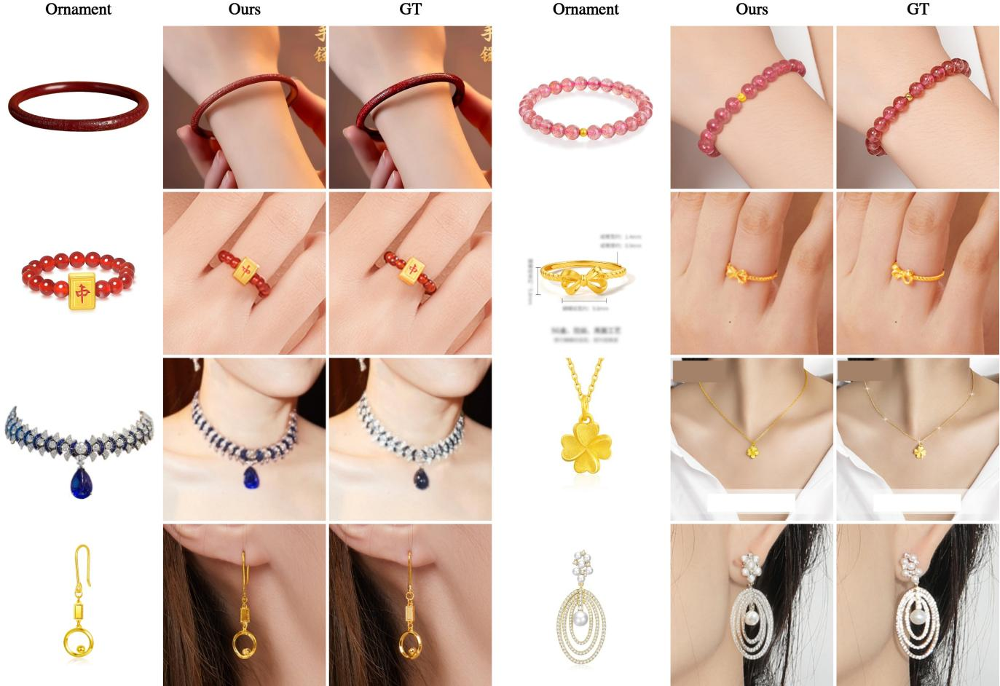
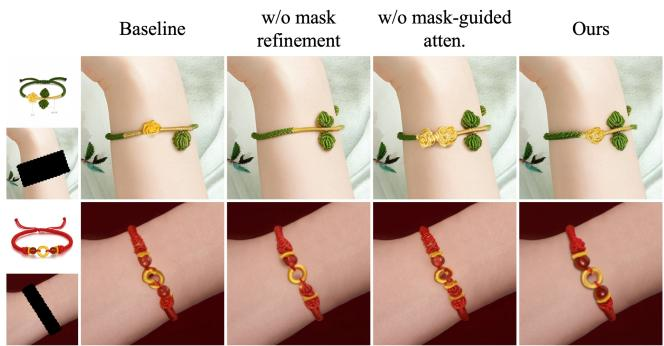
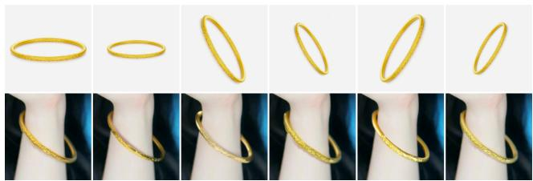

# Shining Yourself: High-Fidelity Ornaments Virtual Try-on with Diffusion Model

Yingmao Miao1,2\*, Zhanpeng Huang2†, Rui Han2, Zibin Wang2, Chenhao Lin1†, Chao Shen1 1Xi’an Jiaotong University, 2 SenseTime Research

mym2017@stu.xjtu.edu.cn,{linchenhao,chaoshen}@xjtu.edu.cn, {huangzhanpeng,hanrui,wangzibin}@sensetime.com

  
Figure 1. Shining Yourself. We propose the virtual try-on task for ornaments including bracelets, rings, earrings, and necklaces for the first time. Our method achieves realistic virtual try-on results and high-fidelity identity preservation of ornament using pose-aware mask prediction and mask-guided attention. Project Page: https://shiningyourself.github.io/

## Abstract

While virtual try-on for clothes and shoes with diffusion models has gained attraction, virtual try-on for ornaments, such as bracelets, rings, earrings, and necklaces, remains

largely unexplored. Due to the intricate tiny patterns and repeated geometric sub-structures in most ornaments, it is much more difficult to guarantee identity and appearance consistency under large pose and scale variances between ornaments and models. This paper proposes the task of virtual try-on for ornaments and presents a method to improve the geometric and appearance preservation of orna-

ment virtual try-ons. Specifically, we estimate an accurate wearing mask to improve the alignments between ornaments and models in an iterative scheme alongside the denoising process. To preserve structure details, wefurther regularize attention layers to map the reference ornament mask to the wearing mask in an implicit way. Experimental results demonstrate that our method successfully wears ornaments from reference images onto target models, handling substantial differences in scale and pose while preserving identity and achieving realistic visual effects.

## 1. Introduction

As diffusion model [9, 15, 16, 22, 24, 26, 40] becomes the de facto standard in image generation, it’s also widely adopted in the field of virtual try-on [7, 17, 32, 35, 39, 42]. Given a reference image of an item and a target image of a model, the task is to get a preview of the fitting effect using image generation methods. Since no in-person wearing or physical fitting room is required, it has great potential for massive advertising materials generation in various applications of retail, e-commerce, and advertisement.

The main challenge of virtual try-on is how to generate a realistic fitting effect while preserving the fidelity of the garment. Massive efforts [7, 17, 32, 35, 39] have been dedicated to solving the problem in the field of garments. The methods usually employ a network module (e.g., CLIP image encoder [21] or ReferenceNet [11, 16]) to extract garment features, which are injected into the process of diffusion denoising to preserve the identity and details of the garment. It has made great progress to be widely adopted for commercial use.

However, few works focus on virtual try-ons of ornaments such as bracelets, rings, earrings, and necklaces, despite significant practical demand. Virtual try-on for ornaments presents unique challenges that existing methods struggle to address effectively. 1) Most ornaments often feature intricate, small-scale geometric structures, such as rings and holes, that are difficult to preserve in virtual tryons. In contrast, garments typically have sparser and/or repeated textures and lack complex geometric details. 2) For garment try-ons, generative visual artifacts can blend with natural cloth deformations and wrinkles, reducing their visibility. However, most ornaments are rigid or consist of rigid components, making any distortion or artifacts immediately noticeable. 3) Most garment virtual try-on methods require silhouette, skeleton, and semantic maps as additional inputs, while even the coarse silhouette mask of the ornament is not easy to depict due to its diverse structures and posedepended occlusion.

To tackle the problems, we propose a method to predict an accurate wearing mask to align the poses and scales between ornaments and models without additional inputs such as the silhouette, skeleton, or semantic maps. Our method also preserves structures and detailed features using a maskguided attention of ornaments and models to preserve geometric structures. Specifically, to obtain a precise poseaware wearing mask without explicit extraction of various maps of ornaments and models, we refine the mask from an input mask as coarse as a bounding box. A refined mask is then estimated using the intermediate features in the generation, which is further used as input to predict a more accurate one iteratively. As the mask indicates structure information, especially for multiple and tiny geometric structures, we formulate the attention layers to implicitly learn a mapping between the reference mask and the ground truth mask to preserve the structure patterns in ornaments. In summary, our contributions are as follows:

• To the best of our knowledge, we are the first to use diffusion models for virtual try-ons of various ornaments including bracelets, rings, earrings, and necklaces. Our method can generate realistic virtual try-on results as well as high-fidelity preservation of ornament identity.

• We propose an iterative scheme to estimate a pose-aware wearing mask to significantly improve the pose and scale alignments between ornaments and models. It also facilitates virtual try-on applications without the requirements of various additional inputs such as silhouette, semantic, and skeleton maps.

• By constraining attention to learning a mapping between reference and wearing masks, our method improves geometric feature preservation, especially for tiny items with complicated geometric structures, such as ornaments.

## 2. Related Works

Personalized image generation To address the challenge of text prompts not fully capturing user intent, personalized image generation, and editing have garnered significant attention from researchers. Inversion-based methods, such as Textual Inversion [10] focus on optimizing a special prompt word to represent a target concept. Meanwhile, finetuning approaches [12, 20, 23, 25] adjust pre-trained diffusion models using a small set of images of the target concept to create personalized models. Although these methods can generate high-fidelity images, they do not allow users to control the generation area for the target, and the additional optimization and fine-tuning required during inference can hinder large-scale applications. On the other hand, some zero-shot and training-free personalized image generation methods [30, 36], can produce images of target concepts. However, they excel in stylized generation by representing high-level semantic features in the lack of preserving details and identity.

Local image editing Our virtual ornament-wearing task closely resembles local image editing techniques. However, most previous local image editing methods relied on text prompts, such as Blended Diffusion [1] and Blended Latent Diffusion [2], which employed multi-step semantic blending during denoising to produce harmonious images containing target semantic information within a defined mask. Inpainting Anything [37] replaces any object in the input image with a target described by text prompts. However, for virtual ornament wearing, it is crucial to ensure alignment with the intricate details of the target. The traditional image composition pipeline [5, 8] involves cutting and pasting foreground images onto background images, followed by the harmonization techniques. Recently, numerous diffusion-based methods [6, 27, 31, 34] have emerged in this field, significantly enhancing the quality and coherence of generated images. For instance, Paint by Example [34] employs a CLIP image encoder [21] to convert reference images into embeddings for guidance, generating objects that are semantically aligned with the reference image. ObjectStitch [27] similarly utilizes CLIP to align text and images, guiding the generation of the diffusion model. ObjectDrop [31] first trains an object removal network, assembles a large dataset, and subsequently conducts object insertion training. AnyDoor [6] leverages ControlNet and a DINO [3] encoder to extract detailed semantic information, improving its ability to maintain object identities. These methods focus on general object insertion into the background smoothly without pose alignment, which is normally required in virtual try-on tasks, especially for ornament wearing that needs precise pose alignment between the ornament and wrist, finger, or neck.

  
b) The mask-guided attention  
Figure 2. The overview of our method. a) In training, given reference ornament and model images and masks, our method concatenates ornament and masked model images as input to the ReferenceNet branch, which extracts features to predict wearing mask in an iterative way. The extracted features are also injected into the denoising U-Net to improve details generation. b) We enforce the attention layers to preserve structure details by formulating the layers to map the reference ornament mask to the ground truth wearing mask in an implicit way rather than directly imposing the mask onto attention maps.

Virtual try-on Virtual try-on [7, 17, 32, 35, 39, 42] takes a model image and an item image to generate an image of the model wearing the item. Early virtual try-on methods were based on Generative Adversarial Networks (GANs). Recently, with the significant success of diffusion models, researchers have explored their application in the field of virtual try-on. Most works focus on virtual try-on of garments, such as TryonDiffusion [42], OOTDiffusion [32], and IDM-VTON [7]. These methods utilize two parallel U-Nets for garment feature extraction, integrating them through self-attention and achieving impressive results. StableVI-TON [17] introduced a zero-initialization cross-attention module to inject garment features into the denoising network. A few works [4, 33] explore virtual try-on of shoes and earrings. In their settings, either the shoe pose is fixed to be aligned by the model or the earring has an almost vertical pose as it hangs down from the ear. Ornament virtual try-on requires pose alignment with different body parts at various poses and scales. Methods such as OOTDiffusion and IDM-VTON use additional inputs such as skeleton and semantic maps to guide wearing pose. In contrast, it’s much more difficult to depict ornament wearing mask due to complicated tiny geometry structures and pose-related occlusion.

## 3. Methodology

We propose a zero-shot method for ornament virtual tryon with a reference ornament image, a target model image, and a coarse bounding box. The bounding box coarsely indicates the wearing location as ornament wearing is userspecific (e.g., a ring has its finger symbolism). We can generate realistic and high-fidelity fitting effects without additional inputs such as pose and semantic maps. The model comprises two vital components: 1) an iterative pose-aware wearing mask prediction and refinement module from the bounding box, which improves pose alignments between the ornament and the model; 2) a mask-guided attention module to improve identity and detail preservation. The framework of our method is illustrated in Fig. 2a.

## 3.1. Diffusion model and ReferenceNet

Diffusion model Our method is built upon the latent diffusion model (LDM) and ReferenceNet module, which has been widely adopted for condition generation and virtual try-on tasks. A typical LDM implementation [22] comprises an encoder-decoder module and a denoising network. The encoder embeds the input image into a low-dimension latent code to reduce computational overhead, which is diffused and then denoised by the denoising network to recover from a random noise. The denoised latent code is then decoded to generate an RGB image. The training process is formalized as follows:

$$
\mathcal { L } _ { 1 } = \mathbb { E } _ { z _ { 0 } , c , \epsilon , t } ( | | \epsilon - \epsilon _ { \theta } ( z _ { t } , c , t ) | | _ { 2 } ^ { 2 } )\tag{1}
$$

where $z _ { t }$ represents the latent feature at time step t, which can be obtained through $z _ { t } = \sqrt { \bar { \alpha _ { t } } } z _ { 0 } + \sqrt { 1 - \bar { \alpha _ { t } } } \epsilon , \epsilon \in$ $\mathcal { N } ( 0 , I )$ . c is the condition embedding from a text prompt or reference image with a text or image encoder, and injected into the cross-attention layers to guide the generation. Our model adopts the widely used CLIP image encoder to extract features of the reference ornament image.

ReferenceNet module The module is widely used in virtual try-ons to improve detail and structure preservation. It is designed to be similar and parallelized with the denoising U-Net. The module extracts hierarchical latent features of the reference image which are injected into related layers in the denoising network. Specifically, latent features in the ReferenceNet are concatenated onto their counterparts in the denoising network for attention calculation.

## 3.2. Pose-aware Mask Refinement

We conducted several experiments to explore how the pose and scale impact the generative results, from which we have several key findings: 1) The diffusion-based model has the capability to fit ornaments to various model poses even without finetuning on ornament try-on datasets, which is attributed to the image prior from the pre-trained diffusion base model. 2) Poses and scales have significant influences on the fitting effects. In general, using an accurate wearing mask will significantly improve the pose alignment between ornaments and models even with large poses and scale variances. However, the wearing mask is not equivalent to the semantic mask, which is predicted from an existing image while wearing mask is hallucinated from two irrelevant ornament and model images. It’s difficult or even infeasible to obtain accurate wearing mask in inference. In addition, ornaments usually show close-up views, which require a much more accurate wearing mask than the coarse silhouette mask in garment virtual try-on.

Previous works [13, 29] have shown that intermediate results (e.g., latent features and attention maps) in early generative phases contain the semantic structure of the generated images. It might be possible to extract a wearing mask from these intermediate maps. However, extracted masks are too coarse to be used. To solve the problem, we proposed to estimate a more accurate wearing mask. We add an additional linear layer to predict the wearing mask from the intermediate maps. The predicted wearing mask is further used as input to guide the generation. The iterative refinement converges to an accurate pose-aware mask aligned with the model in the final generative image. Specifically, triplet images of an ornament, a model, and a coarse bounding box $M _ { b }$ are fed into the ReferenceNet. The ornament latent features $f _ { o } ^ { t }$ and the model latent features $f _ { m } ^ { t }$ are injected into the denoising counterpart similar to most networks in garment virtual try-ons. The latent features are further concatenated and linearly projected to predict the wearing mask $\hat { M } _ { p } ^ { t } .$ . The predicted mask and the bounding box are blended as a new wearing mask input, which is updated as follows:

$$
\hat { M } _ { p } ^ { t - 1 } = \alpha _ { t } \odot \hat { M } _ { p } ^ { t - 1 } + ( 1 - \alpha _ { t } ) \odot M _ { b }\tag{2}
$$

$$
\hat { M } _ { p } ^ { t } = \mathrm { M L P } ( [ f _ { m } ^ { t } \odot \hat { M } _ { p } ^ { t - 1 } , f _ { o } ^ { t } ] )\tag{3}
$$

where $\alpha _ { t } \in [ 0 , 1 ]$ is a hyperparameter in terms of training step t. In the early training, the predicted wearing mask is coarse, and $\alpha _ { t }$ is set to be small. As the mask gets more accurate in the late stage, $\alpha _ { t }$ approximates to 1.0.

As mask prediction and image generation are entangled, we employ an ornament try-on dataset with wearing masks to regularize mask prediction with a $L _ { 2 }$ loss:

$$
\mathcal { L } _ { 2 } = | | \hat { M } _ { p } ^ { T } - M _ { o } ^ { g t } | | _ { 2 } ^ { 2 }\tag{4}
$$

where $M _ { o } ^ { g t }$ is the ground-truth wearing mask. The regularization is important to prevent the dual degeneration of both results due to mutual dependence. In inference, only a bounding box is required to indicate the user-specific wearing location.

## 3.3. Mask-guided Attention

The precise wearing mask improves the alignment between ornaments and models with various poses and scales. It also has a positive effect on detail generation. However, most ornaments comprise complicated tiny geometric components such as repeated shapes and/or ring structures in

Ornament

Paint-by-Example

Ours

GT

Input Bbox  
AnyDoor  
IDM-VTON  
  
Figure 3. Visual comparison between previous methods and ours. No existing method could keep appearance and structure consistent, especially geometric details and numbers of components in ornaments. Our method preserves both details and identity and achieves high quality and high-fidelity fitting results.

pearl necklaces and beaded bracelets. Our early attempts found that the model had difficulty preserving the topology and/or the number of components, especially in repeated geometric patterns. To take a few examples, it may ignore small parts interleaved with other large components, or fill the hole of a ring structure. We suspect that existing generative networks can capture appearance and spatial details rather than geometric structures, as geometric shapes require hard constraints on local primitive structures of edges and contours.

Attention maps retain shape details with affinities between the spatial features [13]. A possible solution is to impose a geometric structure constraint in attention maps. The semantic segmentation mask contains rich geometric structure information, but the mask is difficult to extract due to massive tiny complicated sub-components in ornaments. As the binary mask is also full of geometric structures of edges and contours and easy to obtain (e.g., with SAM [19]), we propose to employ the reference ornament mask to inject geometric structure into the generation.

However, directly blending attention maps with the mask may mask out too much information to degrade generated results. We introduce an indirect way to restrict geometric structure changes of ornaments in reference and generated images. Specifically, we obtain attention maps $\overline { { \{ M _ { a } ^ { i } \quad \in \mathbb { R } ^ { d _ { i } \times d _ { i } } \} _ { 1 } ^ { N } } }$ of latent features and ornament embeddings from various layers in denoising U-Net, where $N$ is the number of extracted attention maps and $d _ { i }$ is the dimension of i-th attention map. The ornament mask $M _ { o }$ in the reference image is down-sampled and flattened as onedimensional masks $\{ M _ { o } ^ { i } \ \in \mathbb { R } ^ { d _ { i } } \bar  \} _ { 1 } ^ { N }$ . We then apply $M _ { o } ^ { i }$ to mask out the attention map ${ \cal M } _ { a } ^ { i }$ along one dimension and margin it along the other dimension. The result is then reshaped and up-sampled to $\tilde { M } _ { o } ^ { i }$ as the same dimension of $M _ { o }$ . All result masks $\{ \tilde { M } _ { o } ^ { i } \}$ are then averaged as the final mask $\ddot { M } _ { o } .$ , which can be formulated as:

$$
M _ { o } ^ { i } = \mathbf { T } _ { \mathrm { f l a t t e n } } ^ { \sqrt { d _ { i } } \times \sqrt { d _ { i } }  d _ { i } } \circ \mathbf { T } _ { \mathrm { d o w n s a m p l i n g } } ^ { d _ { 0 } \times d _ { 0 }  \sqrt { d _ { i } } \times \sqrt { d _ { i } } } \circ M _ { o }\tag{5}
$$

$$
\tilde { M } _ { o } ^ { i } = M _ { a } ^ { i } \odot \underbrace { [ { M _ { o } ^ { i } } ^ { T } , . . . , { M _ { o } ^ { i } } ^ { T } ] } _ { d _ { i } }\tag{6}
$$

$$
\tilde { M } _ { o } ^ { i } = \mathbf { T } _ { \mathrm { u p s a m p l i n g } } ^ { \sqrt { d _ { i } } \times \sqrt { d _ { i } }  d _ { 0 } \times d _ { 0 } } \circ \mathbf { T } _ { \mathrm { r e s h a p e } } ^ { d _ { i }  \sqrt { d _ { i } } \times \sqrt { d _ { i } } } \circ \sum \tilde { M } _ { o } ^ { i } [ r ] [ c ]\tag{7}
$$

$$
\tilde { M } _ { o } = \frac { 1 } { N } \sum _ { i } ^ { N } \tilde { M } _ { o } ^ { i }\tag{8}
$$

where $\mathbf { T _ { o p s } ^ { d 1  d 2 } }$ is the operator with ops as operation type and $\mathbf { d } \mathbf { 1 }  \mathbf { d } \dot { 2 }$ as dimension mapping from d1 to d2. Sequential operators are defined to execute from right to left. The masking operation enforces latent features to attend to ornament regions in the reference image, while the margining operation diffuses ornament features to the wearing region in the generated image. The reference mask $M _ { o }$ is mapped to the wearing masks $\tilde { M } _ { o }$ via the attention map. Inversely, in order to enable the attention map to learn the mapping, we require the transformed wearing masks $\tilde { M } _ { o }$ to be consistent with the ground truth wearing ornament mask $M _ { o } ^ { g t }$ with an $L _ { 2 }$ loss as below:

$$
\mathcal { L } _ { 3 } = | | \tilde { M } _ { o } - M _ { o } ^ { g t } | | _ { 2 } ^ { 2 }\tag{9}
$$

The process is shown in Fig.2b. Down-sampling and upsampling operations are not displayed for concise illustration.

## 3.4. Training

Dataset Inspired by the common practice in garment virtual try-ons, we collect image pairs of ornaments and models wearing the ornaments. We mask out the ornament in the model image to obtain the target image and ground-truth wearing mask. The reference ornament image, the model image with masked-out ornament, and the original model image are combined as a training triplet image. We also label the masks in ornament images as reference masks.

Our dataset does not require pose alignment between the ornament and the model, which is easy to collect, and also prevents the model from learning a simple copy-andpaste strategy. In total, we collect about 64k image triplets, roughly evenly distributed over four categories of bracelets, rings, earrings, and necklaces. Each image triplet also contains a reference mask and a wearing mask of the ornament. Training loss Our training loss comprises the aforementioned three items :

$$
\mathscr { L } _ { t o t a l } = \mathscr { L } _ { 1 } + \lambda _ { 1 } \mathscr { L } _ { 2 } + \lambda _ { 2 } \mathscr { L } _ { 3 }\tag{10}
$$

where $\lambda _ { 1 }$ and $\lambda _ { 2 }$ are loss weights. The two weights decay as the training step increases, which forces the model to learn the wearing mask in the early stages. As the mask becomes accurate, the model focuses on the generation of appearance details. The scheme follows common observation [28] that image layout and structure are sketched in the early stage and details are generated in the late stage.

## 4. Experiments

## 4.1. Implement details

Our model adopts the Stable Diffusion V1.5 as the network backbone. The ornament region is cropped and resized to $5 1 2 \times 5 1 2$ , and Adam [18] optimizer is chosen with an initial learning rate of $1 e ^ { - 5 }$ . We employ a simple linear decay for the $\alpha ( t )$ and select the self-attention maps with the highest resolution from the encoder and decoder for masked-guided attention. We found these simple settings are enough to obtain compelling results. We follow a similar scheme as AnyDoor [6] in handling inputs and composing final results. Specifically, the ground truth mask is resized to be square, and the cropped image is scaled by a factor of 1.5. The generated result is pasted back to the original masked region to compose the final result. Our model takes about 10 hours to train on 8 A100 GPUs with 10 epochs.

For quantitative comparison, we adopt FID [14] and LPIPS [41] to evaluate image quality, while the CLIP image similarity score and DINO-based feature similarity score are used to measure the identity consistency of the ornaments. All results are calculated and averaged on a test image set split from our dataset.

## 4.2. Comparisons

As we are the first to focus on ornament virtual try-ons, we select several works that are most related to ours in the broad field of image edits. These works include Paintby-Example(CVPR’23) [34], AnyDoor(CVPR’24) [6], and IDM-VTON(ECCV’24) [7]. The first two works are designed to insert reference objects into target images, while the latter is dedicated to garment virtual try-ons. Similar to ours, these methods require a reference image of the item and a target image as well as masks to define local edit regions. All methods are trained or fine-tuned with our dataset. Limited to the page length requirement, we take the bracelet category as an example to illustrate all visual results. Please refer to the Appendix for more results of other ornament categories.

  
Figure 4. Virtual try-on results on other categories including bracelets, rings, necklaces, and earrings.

Table 1. Quantitative evaluations between our and other methods
<table><tr><td rowspan="2">Method</td><td colspan="4">Compared against ground truth</td><td colspan="2">Compared against reference ornament</td></tr><tr><td>FID↓</td><td>LPIPS↓</td><td>CLIP Score↑</td><td>DINO Score↑</td><td>CLIP Score↑</td><td>DINO Score↑</td></tr><tr><td>Paint-by-Example [34]</td><td>23.49</td><td>0.0789</td><td>85.6</td><td>64.8</td><td>57.2</td><td>35.4</td></tr><tr><td>AnyDoor [6]</td><td>28.28</td><td>0.1029</td><td>85.1</td><td>67.2</td><td>54.8</td><td>35.9</td></tr><tr><td>IDM-VTON [7]</td><td>22.99</td><td>0.0709</td><td>85.9</td><td>65.0</td><td>55.9</td><td>35.2</td></tr><tr><td>Ours</td><td>19.00</td><td>0.0593</td><td>88.7</td><td>74.5</td><td>57.3</td><td>38.7</td></tr><tr><td>Ground Truth</td><td>–</td><td>–</td><td>一</td><td>-</td><td>59.0</td><td>43.3</td></tr></table>

Qualitative results Fig. 3 qualitatively compares fitting results on ornaments of various structures and poses. Paintby-Example could hardly preserve geometric structures and appearance in most cases. AnyDoor struggles to preserve the scales of the whole structure and/or major parts. IDM-VTON could preserve the scale to a certain extent, but it has problems maintaining structure layouts, especially for complicated ornaments with multiple parts. None of the previous methods could hold the number of sub-parts in ornaments or recover repeated geometric patterns. Our method has the most visual appearance and structure similarities to both reference ornaments and ground truth images, which indicates its ability to preserve both appearance and local and global structures, and tiny surface geometric patterns (the last row). Surprisingly, our results seem to be biased towards reference ornaments with less specular reflections than ground truth. It’s partially because model images do not have enough hints of environmental illumination that our model has difficulty in learning the exact light effect as the ground truth.

Table 2. Quantitatively comparisons of our models with different module configurations.
<table><tr><td>Method</td><td>CLIP Score↑</td><td>DINO Score↑</td></tr><tr><td>Baseline</td><td>86.9</td><td>71.9</td></tr><tr><td>w/o mask refinement</td><td>88.5</td><td>73.3</td></tr><tr><td>w/o mask-guided atten.</td><td>88.0</td><td>73.9</td></tr><tr><td>Ours</td><td>88.7</td><td>74.5</td></tr></table>

Quantitative results Table 1 illustrates a quantitative comparison between ours and previous methods. The two ornaments in reference and ground-truth images are usually captured with different conditions such as views and illumination. Therefore, we compare the results generated by all methods against both the reference ornaments and the ground truth, and calculate the corresponding consistency metrics. Our approach achieves the best results in all metrics, demonstrating its capability to generate more realistic and high-fidelity virtual results.

## 4.3. Ablation Study

We conduct a comprehensive ablation study to evaluate the effectiveness of our proposed components. The experiments are designed by adding a component from the basic models. The baseline is adapted from ReferenceNet and Stable Diffusion. The results are evaluated from both qualitative and quantitative aspects. Fig. 5 shows the visual comparisons with various component configurations. The basic model has noticeable defects in details and geometric structures. If we do not integrate the mask prediction, the results lack appearance details and specular lights. It may also lose structure consistency to some extent (e.g., flow structure missing in the first ornament). Without mask-guided attention, both the local and global structures are destroyed in form of adding or missing components as well as changing scales. On the other hand, the full model preserves both appearance and geometric details as well as global structures. The quantitative results in Table 2 also indicate the importance of the two proposed modules to improve the final virtual try-on results. More results are in the Appendix.

## 4.4. More Results

We use our method to wear various types of ornaments including bracelets, necklaces, earrings, and rings. Figure 4 lists the results. Other configurations including a model wearing different ornaments and different models wearing the same ornaments are also illustrated in Figure 1 (the last row). All results demonstrate that our method can handle various ornament structures of local and global rigid and non-rigid components. More results are in the Appendix.

Figure 5. The visual comparisons of our models with different module configurations. The full model archives the best results with the proposed two modules.  
  
Figure 6. Our model is robust to achieve consistent results with different poses and scales.

To evaluate the robustness of our model under conditions of different poses and scales. We also conduct experiences by randomly rotating and scaling the reference ornament, which is then used to wear on the same model. As Fig. 6 shows, the results are consistent in details and geometric structures with different configurations. The experiment results show our model is robust with large pose differences between ornaments and models.

## 5. Conclusion

We propose the virtual try-on ornament task for the first time. To tackle the more challenging problems of intricate geometric structures in ornaments, we devise two modules of mask prediction and mask-guided attention to obtain accurate wearing masks and impose geometric structures, which preserve both appearance details and geometric structures to achieve identity consistency. Currently, our method is biased toward reference images rather than ground truth images, which lack specular reflections to a certain extent. Inspired by the work [38], we would like to add more fine-grained lighting control in our future work. Besides, inaccurate control over wearing orientations (e.g., rotated along a wrist) leading to featured components being hidden behind the wrist occasionally. Secondary masks and local feature injection into the diffusion process may fix the problem.

## Acknowledge

This research is supported by Sensetime, the National Key Research and Development Program of China (2023YFB3107401), the National Natural Science Foundation of China (T2341003, 62376210, 62161 160337, 62132011, U21B2018, U24B20185, 62206217), the Shaanxi Province Key Industry Innovation Program (2023-ZDLGY-38). Special thanks to Jessie Geng for the coordination of computing resources.

## References

[1] Omri Avrahami, Dani Lischinski, and Ohad Fried. Blended diffusion for text-driven editing of natural images. In Proceedings of the IEEE/CVF conference on computer vision and pattern recognition, pages 18208–18218, 2022. 3

[2] Omri Avrahami, Ohad Fried, and Dani Lischinski. Blended latent diffusion. ACM transactions on graphics (TOG), 42 (4):1–11, 2023. 3

[3] Mathilde Caron, Hugo Touvron, Ishan Misra, Herve J´ egou,´ Julien Mairal, Piotr Bojanowski, and Armand Joulin. Emerging properties in self-supervised vision transformers. In Proceedings ofthe IEEE/CVF international conference on computer vision, pages 9650–9660, 2021. 3

[4] Binghui Chen, Wenyu Li, Yifeng Geng, Xuansong Xie, and Wangmeng Zuo. Shoemodel: Learning to wear on the user-specified shoes via diffusion model. arXiv preprint arXiv:2404.04833, 2024. 3

[5] Bor-Chun Chen and Andrew Kae. Toward realistic image compositing with adversarial learning. In Proceedings of the IEEE/CVF conference on computer vision and pattern recognition, pages 8415–8424, 2019. 3

[6] Xi Chen, Lianghua Huang, Yu Liu, Yujun Shen, Deli Zhao, and Hengshuang Zhao. Anydoor: Zero-shot object-level image customization. In Proceedings of the IEEE/CVF Conference on Computer Vision and Pattern Recognition, pages 6593–6602, 2024. 3, 6, 7, 1

[7] Yisol Choi, Sangkyung Kwak, Kyungmin Lee, Hyungwon Choi, and Jinwoo Shin. Improving diffusion models for authentic virtual try-on in the wild. In ECCV, pages 206–235, 2024. 2, 3, 6, 7, 1

[8] Wenyan Cong, Jianfu Zhang, Li Niu, Liu Liu, Zhixin Ling, Weiyuan Li, and Liqing Zhang. Dovenet: Deep image harmonization via domain verification. In Proceedings of the IEEE/CVF conference on computer vision and pattern recognition, pages 8394–8403, 2020. 3

[9] Prafulla Dhariwal and Alexander Nichol. Diffusion models beat gans on image synthesis. In Advances in Neural Information Processing Systems, pages 8780–8794. Curran Associates, Inc., 2021. 2

[10] Rinon Gal, Yuval Alaluf, Yuval Atzmon, Or Patashnik, Amit Haim Bermano, Gal Chechik, and Daniel Cohen-or. An image is worth one word: Personalizing text-to-image generation using textual inversion. In The Eleventh International Conference on Learning Representations. 2

[11] Yuwei Guo, Ceyuan Yang, Anyi Rao, Zhengyang Liang, Yaohui Wang, Yu Qiao, Maneesh Agrawala, Dahua Lin, and Bo Dai. Animatediff: Animate your personalized textto-image diffusion models without specific tuning. In The Twelfth International Conference on Learning Representa tions. 2

[12] Ligong Han, Yinxiao Li, Han Zhang, Peyman Milanfar, Dimitris Metaxas, and Feng Yang. Svdiff: Compact param eter space for diffusion fine-tuning. In Proceedings of the IEEE/CVF International Conference on Computer Vision, pages 7323–7334, 2023. 2

[13] Amir Hertz, Ron Mokady, Jay Tenenbaum, Kfir Aberman, Yael Pritch, and Daniel Cohen-or. Prompt-to-prompt image editing with cross-attention control. In The Eleventh Inter national Conference on Learning Representations. 4, 5

[14] Martin Heusel, Hubert Ramsauer, Thomas Unterthiner, Bernhard Nessler, and Sepp Hochreiter. Gans trained by a two time-scale update rule converge to a local nash equilib rium. Advances in neural information processing systems, 30, 2017. 6

[15] Jonathan Ho, Ajay Jain, and Pieter Abbeel. Denoising diffusion probabilistic models. Advances in neural information processing systems, 33:6840–6851, 2020. 2

[16] Li Hu. Animate anyone: Consistent and controllable imageto-video synthesis for character animation. In Proceedings of the IEEE/CVF Conference on Computer Vision and Pattern Recognition, pages 8153–8163, 2024. 2

[17] Jeongho Kim, Guojung Gu, Minho Park, Sunghyun Park, and Jaegul Choo. Stableviton: Learning semantic correspon dence with latent diffusion model for virtual try-on. In Proceedings of the IEEE/CVF Conference on Computer Vision and Pattern Recognition, pages 8176–8185, 2024. 2, 3

[18] Diederik P Kingma. Adam: A method for stochastic opti mization. arXiv preprint arXiv:1412.6980, 2014. 6

[19] Alexander Kirillov, Eric Mintun, Nikhila Ravi, Hanzi Mao, Chloe Rolland, Laura Gustafson, Tete Xiao, Spencer Whitehead, Alexander C Berg, Wan-Yen Lo, et al. Segment anything. In Proceedings of the IEEE/CVF International Con ference on Computer Vision, pages 4015–4026, 2023. 5

[20] Nupur Kumari, Bingliang Zhang, Richard Zhang, Eli Shechtman, and Jun-Yan Zhu. Multi-concept customization of text-to-image diffusion. In Proceedings of the IEEE/CVF Conference on Computer Vision and Pattern Recognition, pages 1931–1941, 2023. 2

[21] Alec Radford, Jong Wook Kim, Chris Hallacy, Aditya Ramesh, Gabriel Goh, Sandhini Agarwal, Girish Sastry, Amanda Askell, Pamela Mishkin, Jack Clark, et al. Learning transferable visual models from natural language supervision. In International conference on machine learning, pages 8748–8763. PMLR, 2021. 2, 3

[22] Robin Rombach, Andreas Blattmann, Dominik Lorenz, Patrick Esser, and Bjorn Ommer. High-resolution image¨ synthesis with latent diffusion models. In Proceedings of the IEEE/CVF conference on computer vision and pattern recognition, pages 10684–10695, 2022. 2, 4

[23] Nataniel Ruiz, Yuanzhen Li, Varun Jampani, Yael Pritch, Michael Rubinstein, and Kfir Aberman. Dreambooth: Fine

tuning text-to-image diffusion models for subject-driven generation. In Proceedings of the IEEE/CVF conference on computer vision and pattern recognition, pages 22500– 22510, 2023. 2

[24] Chitwan Saharia, William Chan, Saurabh Saxena, Lala Li, Jay Whang, Emily L Denton, Kamyar Ghasemipour, Raphael Gontijo Lopes, Burcu Karagol Ayan, Tim Salimans, et al. Photorealistic text-to-image diffusion models with deep language understanding. Advances in neural information processing systems, 35:36479–36494, 2022. 2

[25] Jing Shi, Wei Xiong, Zhe Lin, and Hyun Joon Jung. Instantbooth: Personalized text-to-image generation without test-time finetuning. In Proceedings of the IEEE/CVF Conference on Computer Vision and Pattern Recognition, pages 8543–8552, 2024. 2

[26] Jiaming Song, Chenlin Meng, and Stefano Ermon. Denoising diffusion implicit models. In International Conference on Learning Representations. 2

[27] Yizhi Song, Zhifei Zhang, Zhe Lin, Scott Cohen, Brian Price, Jianming Zhang, Soo Ye Kim, and Daniel Aliaga. Objectstitch: Object compositing with diffusion model. In Proceedings of the IEEE/CVF Conference on Computer Vision and Pattern Recognition, pages 18310–18319, 2023. 3

[28] Yoad Tewel, Omri Kaduri, Rinon Gal, Yoni Kasten, Lior Wolf, Gal Chechik, and Yuval Atzmon. Training-free consistent text-to-image generation. ACM Transactions on Graphics (TOG), 43(4):1–18, 2024. 6

[29] Narek Tumanyan, Michal Geyer, Shai Bagon, and Tali Dekel. Plug-and-play diffusion features for text-driven image-to-image translation. In Proceedings of the IEEE/CVF Conference on Computer Vision and Pattern Recognition (CVPR), pages 1921–1930, 2023. 4

[30] Qixun Wang, Xu Bai, Haofan Wang, Zekui Qin, Anthony Chen, Huaxia Li, Xu Tang, and Yao Hu. Instantid: Zero-shot identity-preserving generation in seconds. arXiv preprint arXiv:2401.07519, 2024. 2

[31] Daniel Winter, Matan Cohen, Shlomi Fruchter, Yael Pritch, Alex Rav-Acha, and Yedid Hoshen. Objectdrop: Bootstrapping counterfactuals for photorealistic object removal and insertion. arXiv preprint arXiv:2403.18818, 2024. 3

[32] Yuhao Xu, Tao Gu, Weifeng Chen, and Chengcai Chen. Ootdiffusion: Outfitting fusion based latent diffusion for controllable virtual try-on. arXiv preprint arXiv:2403.01779, 2024. 2, 3

[33] Youze Xue, Binghui Chen, Yifeng Geng, Xuansong Xie, Jiansheng Chen, and Hongbing Ma. Strictly-id-preserved and controllable accessory advertising image generation. arXiv preprint arXiv:2404.04828, 2024. 3

[34] Binxin Yang, Shuyang Gu, Bo Zhang, Ting Zhang, Xuejin Chen, Xiaoyan Sun, Dong Chen, and Fang Wen. Paint by example: Exemplar-based image editing with diffusion models. In Proceedings of the IEEE/CVF Conference on Computer Vision and Pattern Recognition, pages 18381–18391, 2023. 3, 6, 7, 1

[35] Xu Yang, Changxing Ding, Zhibin Hong, Junhao Huang, Jin Tao, and Xiangmin Xu. Texture-preserving diffusion models for high-fidelity virtual try-on. In Proceedings of

the IEEE/CVF Conference on Computer Vision and Pattern Recognition, pages 7017–7026, 2024. 2, 3

[36] Hu Ye, Jun Zhang, Sibo Liu, Xiao Han, and Wei Yang. Ip adapter: Text compatible image prompt adapter for text-to image diffusion models. 2023. 2

[37] Tao Yu, Runseng Feng, Ruoyu Feng, Jinming Liu, Xin Jin, Wenjun Zeng, and Zhibo Chen. Inpaint anything: Segment anything meets image inpainting. arXiv preprint arXiv:2304.06790, 2023. 3

[38] Chong Zeng, Yue Dong, Pieter Peers, Youkang Kong, Hongzhi Wu, and Xin Tong. Dilightnet: Fine-grained light ing control for diffusion-based image generation. In ACM SIGGRAPH 2024 Conference Papers, 2024. 8

[39] Jianhao Zeng, Dan Song, Weizhi Nie, Hongshuo Tian, Tongtong Wang, and An-An Liu. Cat-dm: Controllable accelerated virtual try-on with diffusion model. In Proceedings of the IEEE/CVF Conference on Computer Vision and Pattern Recognition, pages 8372–8382, 2024. 2, 3

[40] Lvmin Zhang, Anyi Rao, and Maneesh Agrawala. Adding conditional control to text-to-image diffusion models. In Proceedings of the IEEE/CVF International Conference on Computer Vision, pages 3836–3847, 2023. 2

[41] Richard Zhang, Phillip Isola, Alexei A Efros, Eli Shechtman, and Oliver Wang. The unreasonable effectiveness of deep features as a perceptual metric. In Proceedings of the IEEE conference on computer vision and pattern recognition, pages 586–595, 2018. 6

[42] Luyang Zhu, Dawei Yang, Tyler Zhu, Fitsum Reda, William Chan, Chitwan Saharia, Mohammad Norouzi, and Ira Kemelmacher-Shlizerman. Tryondiffusion: A tale of two unets. In Proceedings ofthe IEEE/CVF Conference on Com puter Vision and Pattern Recognition, pages 4606–4615, 2023. 2, 3