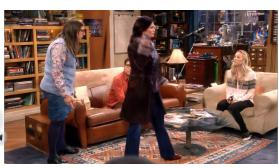

# ShowMak3r: Compositional TV Show Reconstruction

Sangmin Kim Seunguk Do Jaesik Park\* Seoul National University, Republic of Korea {sm.kim, seunguk.do, jaesik.park}@snu.ac.kr

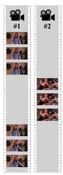  
ShowMak3r  
Input Video Clip

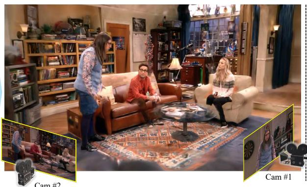  
Reconstructed TV Show

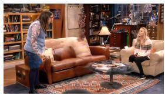

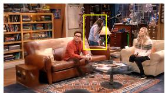

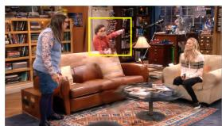  
Figure 1. We introduce ShowMak3r, a comprehensive pipeline that reconstructs dynamic radiance fields from TV shows. Given a video clip that shows limited viewpoints and abrupt shot changes, our pipeline recovers the background stage and dynamic actors that are trackable across the shot changes. The scene is compositional and editable, so we can render it from novel viewpoints while selectively editing individual actors. Our method also recovers detailed human appearances, including facial expressions.

## Abstract

Reconstructing dynamic radiance fields from video clips is challenging, especially when entertainment videos like TV shows are given. Many challenges make the reconstruction difficult due to (1) actors occluding with each other and having diverse facial expressions, (2) cluttered stages, and (3) small baseline views or sudden shot changes. To ad dress these issues, we present ShowMak3r, a comprehensive reconstruction pipeline that allows the editing ofscenes like how video clips are made in a production control room. In ShowMak3r, a 3DLocator module locates recovered actors on the stage using depth prior and estimates unseen human poses via interpolation. The proposed ShotMatcher module then tracks the actors under shot changes. Furthermore, ShowMak3r introduces a face-fitting network that dynamically recovers the actors’ expressions. Experiments on Sitcoms3D dataset show that our pipeline can reassemble TV show scenes with new cameras at different timestamps. We also demonstrate that ShowMak3r enables interesting ap-

plications such as synthetic shot-making, actor relocation, insertion, deletion, and pose manipulation. Project page : https://nstar1125.github.io/showmak3r

## 1. Introduction

Considerable advances in radiance field reconstruction approaches [22, 36] transform how we reconstruct and visualize the scenes. Recent methods aim to bring video clips into 4D space to enable novel viewpoint rendering or scene editing. However, recovering the radiance field from dynamic scenes remains a challenging problem. Approaches in this category have mainly focused on scenarios with multi-view synchronized cameras or fully observed scenes [20, 43, 65].

The reconstruction gets even harder for entertainment videos, such as TV shows captured by shot-changing (video transition by another camera) monocular cameras. Compared to existing benchmark datasets [17], TV show video clips present additional challenges. First, it contains scenes that are inherently hard to reconstruct, such as multiple actors interacting and occluding each other on the cluttered stages or actors showing detailed facial changes to express their emotions. In addition, the videos are filmed with multiple cameras and then edited to appear as a continuous timeline, resulting in sudden shot changes. Furthermore, cameras are mainly positioned in front of the scene, creating partial observations and thus limiting information about the actors’ backsides. Therefore, even the state-of-the-art methods [24, 60] fail to recover consistent dynamic radiance fields due to incorrect human-scene alignment and inconsistent deformation of human movements.

In this work, we present ShowMak3r, a comprehensive pipeline that reconstructs the dynamic radiance field from TV shows, enabling viewpoint editing like how the video clip is made in a production control room. We first build a stage from the aggregated images and recover parametric models of dynamic actors. Since the estimated humans from the video clip and the reconstructed stage have different coordinate systems, we propose the 3DLocator module, which aligns the actors to their correct locations on the stage by leveraging depth estimation while estimating unseen human poses via interpolation. After positioning the actors, we use the ShotMatcher module to perform human association at the shot boundaries to track actors across different shots.

As the facial change of the actors is a key element in TV show videos, we implement an implicit face-fitting network to change human expressions across frames to address this dynamically. Experiments with the Sitcom3D dataset [45] show that our pipeline can successfully reconstruct from TV show videos. We also demonstrate various applications with ShowMak3r, including actor relocation, insertion, deletion, and pose manipulations. To our knowledge, ShowMak3r is the first comprehensive method for total reconstruction of the stage and multiple actors given the shot-changing videos.

Our contributions can be summarized as below:

• We introduce ShowMak3r, a comprehensive pipeline that reconstructs the dynamic radiance field from TV shows, enabling viewpoint editing like a production control room.

• We propose 3DLocator that accurately aligns actors on the stage. 3DLocator even aims to solve unseen poses due to occlusions.

• We present ShotMatcher that enables continuous tracking of actors under shot change. Our approach associates actors even when they are not visible in certain shots.

• We implement an implicit face-fitting network to recover and express dynamic facial expressions.

• Extensive experiments show the validity of our approach and demonstrate possible applications such as actor relocation, insertion, deletion, and pose manipulation.

## 2. Related Work

4D Scene Reconstruction. Attempts have been made to extend radiance fields [22, 36] into spatio-temporal models [2, 20, 28, 30, 42, 43, 49, 65] for reconstructing 4D scenes from synchronized multi-camera videos. These techniques have since evolved to handle single-view video inputs [7, 26, 29, 30, 32, 56, 57, 60, 61], increasing their applicability across various scenarios. More recently, feed-forward methods that directly generate dynamic point clouds have emerged [34, 68], eliminating the need for perscene training. However, despite these advancements, current 4D reconstruction methods still struggle with TV show content, which often features limited camera angles, rapid human motion, and abrupt scene transitions.

3D Avatar Reconstruction from Videos. Human radiance fields [8, 11, 12, 14, 15, 17, 18, 24, 31, 37, 38, 41, 46, 50, 51, 53, 54, 58, 64, 66, 69], which incorporates radiance fields [22, 36] with parametric human models [33, 44], have demonstrated that photo-realistic 3D human avatars can be reconstructed from monocular video. These representations later evolved into generalizable humans radiance fields [5, 13, 27, 39, 63], which eliminated the need for extensive per-avatar training time. More recently, approaches to adopt diffusion models [47, 52] as additional priors [10, 16, 48, 62] for recovering unseen regions have been studied [6, 25]. When reconstructing 3D humans from TV shows, facial features are particularly crucial. Researchers have proposed utilizing pretrained expression encoders [53] or directly leveraging SMPL-X expression parameters[37] to enhance facial features. However, these approaches typically demand multi-view face images [53] or face challenges in capturing nuanced expressions from TV show videos [37]. To address these limitations, we propose a simple, yet highly effective approach of refining facial expressions through an implicit deformation network.

Composite Human-Scene Reconstruction. Previous approaches for reconstructing scenes with humans [11, 24, 28] treat backgrounds as static and use separate representations for humans and backgrounds. However, these methods require videos to capture the entire human body, including foot contact with the floor, making them unsuitable for TV show settings. Sitcoms3D [45] addresses it by reconstructing sitcom videos through NeRF-W [35] for consistent backgrounds and optimizing SMPL parameters using adjacent shots. However, it lacks human texture and requires identical humans to appear in neighboring shots. OmniRe [3] reconstructs outdoor scenes with dynamic objects, including pedestrians and vehicles. However, it relies on LiDAR sensors for geometric data and isn’t designed for scenarios with shot changes. In contrast, our method effectively positions actors within the stage without requiring multiple shots, foot contact points, or additional sensors.

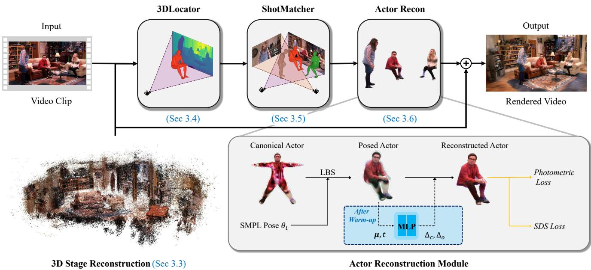  
Figure 2. Overview of our ShowMak3r pipeline. Given a TV show video clip, we perform dense reconstruction of the stage (Sec. 3.3), locate SMPL models to the stage (Sec. 3.4), associate SMPL models across shots to track actors (Sec. 3.5), and recover the detailed appearance of the actors (Sec. 3.6). 3D Gaussians of the stage and the actors are rendered to produce novel frames.

## 3. Method

## 3.1. Overview

In video clips of TV shows, several actors perform on the stage. The TV shows are structured into three hierarchical level semantics: scene, shot, andframe. A scene represents a sequence of related shots that follow a continuous narrative flow [21], a shot captures continuous frames within a single camera [55], and a frame refers to an individual image within the sequence. Our work aims to reconstruct dynamic scenes from such frame hierarchy in TV shows.

As shown in Fig. 2, Sec 3.3 presents how we reconstruct the consistent stage. Sec 3.4 introduces how our 3DLocator positions multiple actors into correct locations on the stage. Sec 3.5 explains the proposed ShotMatcher to track actors during shot-change. Sec 3.6 shows how to reconstruct dynamic actors and their expressions with ourface-fitting network.

Scene representation. Our approach represents the stage and the actors with 3DGS [22], an explicit approach that reconstructs a radiance field with 3D Gaussians. Each Gaussian consists of attributes, including center $\pmb { \mu } \in \mathbb { R } ^ { 3 }$ , rotation $\mathbf { q } \in \mathbb { R } ^ { 4 }$ , scale $\mathbf { s } \in \mathbb { R } ^ { 3 }$ , color $\mathbf { c } \in \mathbb { R } ^ { 3 }$ , and opacity $o \in \mathbb { R } .$ The k-th Gaussian is defined as follows:

$$
g _ { k } ( \mathbf { p } ) = o _ { k } \mathrm { e x p } ^ { - \frac { 1 } { 2 } ( \mathbf { p } - \pmb { \mu } _ { k } ) ^ { T } \pmb { \Sigma } _ { k } ^ { - 1 } ( \mathbf { p } - \pmb { \mu } _ { k } ) } ,\tag{1}
$$

where position is $\textbf { p } \in \ \mathbb { R } ^ { 3 }$ , and the covariance matrix is $\Sigma _ { k } \ : = \ : { \bf R } _ { k } { \bf S } _ { k } { \bf S } _ { k } ^ { T } { \bf R } _ { k } ^ { T } . \ : \ : { \bf R } _ { k } \in S O ( 3 )$ and $\mathbf { S } _ { k } \in \mathbb { R } _ { + } ^ { 3 }$ are obtained from quaternion of q and scale s. Unlike implicit methods [17], 3D Gaussians $\mathcal { G } = \{ g _ { k } \} _ { k = 1 \ldots K }$ have an explicit nature, which makes it effective for reconstructing the stage $\mathcal { G } ^ { \mathrm { s t a g e } }$ and multiple actors $\mathcal { G } _ { n } ^ { \mathrm { a c t o r } }$ by simply compositing multiple Gaussian sets as $\mathcal { G } ^ { \mathrm { T V s h o w } } = \bar { \mathcal { G } } ^ { \mathrm { s t a g e } } \cup \bar { \{ \mathcal { G } _ { n } ^ { \mathrm { a c t o r } } \} _ { n = 1 \ldots N } }$

## 3.2. Preprocessing

Camera parameters. We recover the camera pose $\pi _ { f }$ of each frame f using SfM systems. We observe that GLOMAP [40] robustly handles panning frames by globally estimating camera poses and the 3D structure of all input images at once. To reduce the effect of transient actors, we mask input images with the binary segmentation map of actors $M _ { f } ^ { a c t o r }$ using SAM [23], and obtain $M _ { f } ^ { s t a g e }$ by inverting $M _ { f } ^ { \dot { a } c t o r }$

Guiding depth maps. By following the convention, we reconstruct $\mathcal { G } ^ { \mathrm { s t a g e } }$ using 3DGS [22] given the camera poses π. However, we experience vanilla 3DGS struggles with the reconstruction due to the partially observed background or narrow baselines, which are frequent in TV shows. Therefore, we utilize the monocular depth as guidance to fulfill the limited observations. After we get dense depth predictions $\{ D _ { f } ^ { \mathrm { m o n o } } \in \mathbb { R } ^ { H \times W } | f = 1 , 2 , . . . , \bar { F } \}$ from a data-driven approach [1], we adjust scale a and offset b of each depth map to match the camera coordinate system predicted by the SfM pipeline.

Specifically, given the SfM point clouds $\mathcal { P } _ { f }$ visible at $f -$

th frame, we find $a ^ { * }$ and $b ^ { * }$ as follows:

$$
a ^ { * } , b ^ { * } = \underset { a , b } { \arg \operatorname* { m i n } } \sum _ { \mathbf { p } \in \mathcal { P } _ { f } } \mathcal { L } ( \mathbf { p } ; a , b ) ,\tag{2}
$$

where the Huber loss $\mathcal { L } ( p ; a , b )$ with the depth of projected point $p _ { z }$ for a view π is defined as follows:

$$
\mathcal { L } ( \mathbf { p } ; a , b ) = \left\{ \begin{array} { l l } { \frac { 1 } { 2 } ( p _ { z } - ( a D ^ { \mathrm { m o n o } } ( \pi ( \mathbf { p } ) ) + b ) ) ^ { 2 } \quad \mathrm { i f ~ } | p _ { z } | \leq \delta _ { 1 } , } \\ { \delta _ { 1 } ( | p _ { z } - ( a D ^ { \mathrm { m o n o } } ( \pi ( \mathbf { p } ) ) + b ) | - \frac { \delta _ { 1 } } { 2 } ) \mathrm { ~ o t h e r w i s e } } \end{array} \right.\tag{3}
$$

where we empirically set $\delta _ { 1 } ~ = ~ r _ { \mathrm { s t a g e } } / 1 0 0$ , where rstage represents the scene radius. We then obtain the depth map aligned with the SfM coordinate system by calculating $D ^ { \mathrm { a l i g n e d } } = a ^ { * } \times D ^ { \mathrm { m o n o } } + b ^ { * }$ . We iterate the above process for the entire frame.

Note that the aligned depth map $D ^ { \mathrm { a l i g n e d } }$ is the key component of our pipeline that boosts stage reconstruction (Sec. 3.3) and guides the positioning of the actors (Sec. 3.4).

## 3.3. 3D Stage Reconstruction

We reconstruct dense Gaussians of the stage $\mathcal { G } ^ { \mathrm { s t a g e } }$ using 3DGS [22] with the extended loss that leverages the aligned depth maps $D ^ { \mathrm { a l i g n e d } }$ obtained from Sec. 3.2. We observe that using depth guidance provides a denser and more reliable reconstruction of the stage compared to using only photometric loss.

Gathering background images. Reconstructing a dense and complete stage from a single video clip is challenging for TV show scenarios since only a part of the stage is shown during the video. Interestingly, TV shows like sitcom videos depict a similar environment over the season, so shots in various episodes show diverse views of the stages, which we can utilize for the stage reconstruction. Therefore, we utilize additional background images gathered from different episodes of a sitcom [45].

Depth-guided dense reconstruction. When $\mathcal { G } ^ { \mathrm { s t a g e } }$ being optimized, we can get the rendered depth map $D ^ { \mathrm { r e n d e r } }$ at frame f by utilizing the Gaussian rasterization as follows:

$$
D ^ { \mathrm { r e n d e r } } = \sum _ { k = 1 } ^ { K } d _ { k } \alpha _ { k } \prod _ { k ^ { \prime } = 1 } ^ { k - 1 } ( 1 - \alpha _ { k ^ { \prime } } )\tag{4}
$$

where $d _ { k }$ denotes the z-depth, and $\alpha _ { k }$ is the blending coefficient of the k-th Gaussian in view space.

Given $D ^ { \mathrm { r e n d e r } }$ , we incorporate depth guidance in the log-L1 form [59] for better convergence of 3DGS as follows:

$$
\mathcal { L } _ { \mathrm { d e p t h } } = \frac { \log \left( 1 + | M ^ { \mathrm { s t a g e } } D ^ { \mathrm { r e n d e r } } - M ^ { \mathrm { s t a g e } } D ^ { \mathrm { a l i g n e d } } | \right) } { | M ^ { \mathrm { s t a g e } } | } ,\tag{5}
$$

where, $M ^ { s t a g e }$ is background mask obtained from Sec. 3.2. We also add total variation loss for fostering the smoothness

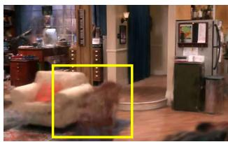

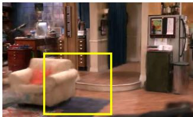  
(a) w/o object removal  
(b) w/ object removal  
Figure 3. An example of transient object removal.

[4, 59] of rendered depth $D ^ { \mathrm { r e n d e r } }$ as follows:

$$
\mathcal { L } _ { \mathrm { T V } } = \frac { 1 } { | D ^ { \mathrm { r e n d e r } } | } \sum _ { \mathbf { u } } \Bigl | \frac { \partial D ^ { \mathrm { r e n d e r } } } { \partial { \mathbf { u } } } \Bigr | _ { 1 }\tag{6}
$$

As a result, our extended loss in addition to vanilla 3DGS losses $( \mathcal { L } _ { c o l o r }$ and ${ \mathcal { L } } _ { \mathrm { D - S S I M } } )$ is defined as follows:

$$
\begin{array} { r l } & { \mathcal { L } _ { \mathrm { b a c k g r o u n d } } = ( 1 - \lambda _ { \mathrm { D - S S I M } } ) \mathcal { L } _ { \mathrm { c o l o r } } + \lambda _ { \mathrm { D - S S I M } } \mathcal { L } _ { \mathrm { D - S S I M } } } \\ & { \phantom { \mathcal { L } } + \lambda _ { \mathrm { d e p t h } } \mathcal { L } _ { \mathrm { d e p t h } } + \lambda _ { \mathrm { s m o o t h } } \mathcal { L } _ { \mathrm { T V } } , } \end{array}\tag{7}
$$

where we empirically set $\lambda _ { \mathrm { D - S S I M } } = 0 . 2 , \lambda _ { \mathrm { d e p t h } } = 0 . 2$ and $\lambda _ { \mathrm { s m o o t h } } = 0 . 5 .$ . We masked actors appearing at depth maps and input images using $M ^ { \mathrm { s t a g e } }$ for stability when optimizing Eq. (7). An example of $\mathcal { G } ^ { \mathrm { s t a g e } }$ is shown in Fig. 2.

Object removal. Since the gathered images have transient objects in the scene, they interfere with the reconstruction process. In particular, objects with no reference frames are hard to reconstruct or delete, which leads to floaters remaining in the background. These artifacts degrade the background quality by a large margin. To mitigate this issue, we annotate these regions and apply image inpainting [47]. Since inpainted areas can be noisy, we apply only the depth loss for robustness. We can successfully recover these regions, as shown in Fig. 3.

## 3.4. Locating Actors on the Stage

Estimating human poses from a 2D image is a welldeveloped problem. We estimate the shape parameter $\beta \in$ $\mathbb { R } ^ { 1 0 }$ and pose parameter $\theta \in \mathbb { R } ^ { 2 4 \times 3 \times 3 }$ of a SMPL model using the off-the-shelf approach [9]. However, when it comes to locating the humans in the designated 3D coordinate system, it becomes a nontrivial problem.

Previous approaches proposed optimizing the human scale and pose with two adjacent shots [45] or identifying the foot intersection point between a SMPL model and the ground plane [11, 17, 24]. However, these methods are inadequate for TV show scenarios since consecutive shots do not always feature the same individuals, and actors frequently have their feet out of the frame.

3DLocator. We propose a 3DLocator module that positions the posed humans to the reconstructed 3D TV stage using a single clip. Specifically, given i-th SMPL vertex $\mathbf { c } _ { i }$ in canonical space, we can apply arbitrary human pose as follows:

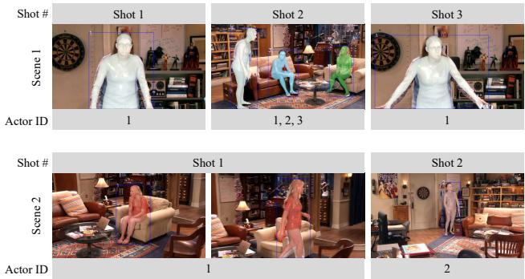  
Figure 4. Results of actor association. ShotMatcher can associate actors even when some individuals do not appear in a shot. If the distance of the matched actors is above the matching threshold, ShotMatcher identifies them as different.

$$
\mathbf { v } _ { i } = \sum _ { j = 1 } ^ { J } w _ { i , j } \big ( \mathbf { R } _ { j } \mathbf { c } _ { i } + \mathbf { t } _ { j } \big ) ,\tag{8}
$$

where $w _ { i , j } \in \mathbb { R }$ is the Linear Blend Skinning(LBS) weights of the j-th joint and i-th vertex, and $\{ \mathbf { R } _ { j } , \mathbf { t } _ { j } \}$ are the rotation and translation of j-th joint determined by predicted SMPL pose parameter $\{ \beta , \theta \}$ . Then, posed SMPL vertices $\mathbf { v } _ { i }$ can be mapped to the stage coordinate as follows:

$$
\mathbf { v } _ { i } ^ { \prime } ( s , \mathbf { t } ) = s \mathbf { v } _ { i } + \mathbf { t } .\tag{9}
$$

3DLocator finds the optimal scale $s \in \mathbb { R }$ and global translation parameters $\mathbf { t } \in { \bar { \mathbb { R } } } ^ { 3 }$ of the posed SMPL.

The core idea of our 3DLocator is to align posed SMPL vertices $\boldsymbol { v } _ { i } ^ { \prime }$ to the aligned mono-depth $D _ { f } ^ { \mathrm { a l i g n e d } }$ (Sec. 3.2). Note that this scheme does not assume the same actor between consecutive shots [45], and does not involve the ground plane assumption [17, 24].

For the alignment, we only consider SMPL’s visible points $\mathbf { v } ^ { \prime } \in \mathscr { V } _ { f }$ at frame $f$ since the human regions of the $D _ { f } ^ { \mathrm { a l i g n e d } }$ indicate the depth of the visible parts. We use Huber loss from Eq. (3) between the z-value of the visible vertices in the camera space and $D _ { f } ^ { \mathrm { a l i g n e d } }$

$$
\begin{array} { r } { \mathcal { L } ( \mathbf { v } , \delta _ { 2 } ; s , \mathbf { t } ) = \mathrm { H u b e r } ( D ^ { \mathrm { a l i g n e d } } ( v _ { x } ^ { \prime } , v _ { y } ^ { \prime } ) , v _ { z } ^ { \prime } ) } \end{array}\tag{10}
$$

where we empirically set $\delta _ { 2 } = r ^ { \mathrm { s t a g e } } / 2 0$ . We use the optimal $s ^ { * }$ and $\mathbf { t } ^ { * }$ to place SMPL model into frame $f .$

## 3.5. Tracking Actors across the Shots

ShotMatcher. 3DLocator module (Sec. 3.4) places SMPL actors on the stage for every frame. Using the modern approach [9], the SMPLs are associated across frames. However, it is still necessary to associate the SMPL model with the different shots to avoid creating multiple actors. To address this issue, we propose a ShotMatcher module to associate actors between shot boundaries.

ShotMatcher calculates the pairwise Euclidean distances between the actors’ 3D coordinates in the last frame of a certain shot and the first frame of the consecutive shot. Among all possible actor-to-actor pairs, ShotMatcher chooses the actor pair with the smallest Euclidean distance that falls below a matching threshold. As shown in Fig. 4, the matching threshold is required to exclude the pair with a far distance. Details are described in the supplement.

Pose interpolation and extrapolation. TV show videos frequently present various occlusion scenarios, such as one actor blocking another, objects obscuring actors, or actors temporarily moving out of the frame. These occlusions interfere with estimating accurate human pose. To address this issue, we analyze SMPL tracking results, identify two stable frames adjacent to the occluded frames, and perform linear interpolation of the actors’ SMPL parameters. We subsequently apply a bidirectional low-pass filter to the interpolated SMPL data to ensure smooth and natural motion.

In TV show videos, one of the main challenges of actor association is the absence of certain actors in some shots. For example, while a wide shot may include all actors on stage, a close-up shot might only feature one or two individuals. To address this, any unmatched actors are filled into the subsequent shots by extrapolating their SMPL parameters from the data at the shot boundary.

## 3.6. 3D Actor Reconstruction

As the final step in our pipeline, we introduce our human reconstruction module that makes $\lbrace \mathcal { G } _ { n } ^ { \mathrm { a c t o r } } \rbrace _ { n = 1 \dots N }$ using 3DGS, given N SMPL models associated with different shots. We first initialize Gaussian centers of $\mathcal { G } _ { n } ^ { \mathrm { a c t o r } }$ using each of the SMPL model’s vertices located in the TV stage coordinate (Sec. 3.5). Then, we optimize $\mathcal { G } _ { n } ^ { \mathrm { a c t o r } }$ using the 3DGS loss extended with SDS loss $\mathcal { L } _ { \mathrm { { S D S } } }$ [25].

Photometric loss. Since the stage can occlude the actors, we estimate foreground masks from the stage structure by comparing the depth between the rasterized background Gaussians $D _ { \mathrm { s t a g e } } ^ { \mathrm { r e n d e r } }$ and the rasterized human Gaussians $D _ { \mathrm { a c t o r } } ^ { \mathrm { r e n d e r } }$ using Eq. (4). If a rendered depth pixel of the actor is smaller than the stage, such pixel is marked as a part of the foreground as follows:

$$
M ^ { \mathrm { f o r e g d } } ( \mathbf { u } ) = \left\{ \begin{array} { l l } { 1 , } & { \mathrm { i f ~ } D _ { \mathrm { s t a g e } } ^ { \mathrm { r e n d e r } } ( \mathbf { u } ) > \left\{ D _ { \mathrm { a c t o r } , n } ^ { \mathrm { r e n d e r } } ( \mathbf { u } ) \right\} _ { n = 1 \dots N } } \\ { 0 , } & { \mathrm { o t h e r w i s e , } } \end{array} \right.\tag{11}
$$

where N denotes the number of humans.

We then apply the foreground masks to both the rendered actors $P = M ^ { \mathrm { f o r e g d } } \odot I _ { \mathrm { a c t o r } } ^ { \mathrm { r e n d e r } }$ and input video frame $Q = M ^ { \mathrm { f o r e g d } } \odot I ,$ and calculate actor loss $\mathcal { L } _ { \mathrm { a c t o r } }$ using the two masked images $\{ P , Q \}$ for the vanila 3DGS loss [22], where ${ \mathcal { L } } _ { \mathrm { a c t o r } }$ is calculated for every visible frame of n-th actor. The effect of using a foreground mask is shown in Fig. 5.

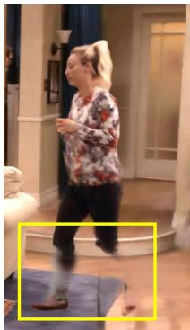  
(a) w/o �!"#\$%&

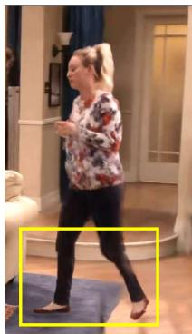  
(b) w/ �!"#\$%&

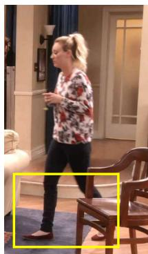  
(c) Ground Truth  
Figure 5. An effect of using the proposed foreground masking.

Unobserved area. Since TV show cameras usually capture the actors from the front, the rest of the part remains unobserved during the entire video clip. Inspired by [25], we use SDS loss [48] with textual inversion to hallucinate the unseen parts of the actors. We compute SDS loss for each Gaussian sets $\lbrace \mathcal { G } _ { n } ^ { \mathrm { a c t o r } } \rbrace _ { n = 1 \dots N }$ with person-specific diffusion $\phi _ { n }$ . The final loss of 3DGS for an individual actor is defined as follows:

$$
\mathcal { L } _ { \mathrm { t o t a l } } = \lambda _ { \mathrm { a c t o r } } \sum _ { f } ^ { F } \mathcal { L } _ { \mathrm { a c t o r } , f } + \lambda _ { \mathrm { S D S } } \mathcal { L } _ { \mathrm { S D S } } ( \mathcal { G } _ { n } ^ { \mathrm { a c t o r } } ; \phi _ { n } )\tag{12}
$$

Refinement. In TV shows, recovering detailed facial expressions are essential for delivering emotion and enhancing realism. We introduce an implicit function-based residual appearance fitting scheme using a Gaussian deformation network [20]. In our scenario, we observe that changing the positions of Gaussians on the face is unsuitable since facial motions are subtle. Instead of moving the Gaussians, we refine colors and opacity to fit the details. Given time t and the position µ of Gaussians, the color and opacity head of the face-fitting network return each residual value as follows,

$$
\Delta \mathbf { c } ( \pmb { \mu } , t ) = F _ { \mathrm { c o l o r } } \Big ( F _ { \theta } \big ( \mathrm { c o n c a t } \{ \gamma ( \pmb { \mu } ) , \gamma ( t ) \} \big ) \Big )\tag{13}
$$

$$
\Delta o ( \pmb { \mu } , t ) = F _ { \mathrm { o p a c i t y } } \Big ( F _ { \theta } \big ( \mathrm { c o n c a t } \{ \gamma ( \pmb { \mu } ) , \gamma ( t ) \} \big ) \Big )\tag{14}
$$

where $\Delta \mathbf { c }$ and $\Delta o$ denotes color and opacity residual, $\{ F _ { \theta } ,$ $F _ { \mathrm { c o l o r } } , F _ { \mathrm { o p a c i t y } } \}$ indicates learnable MLPs for deformation, and $\gamma ( \cdot )$ is positional encoding.

We first train actor Gaussians without the refinement module for 2,000 iterations to reconstruct coarse actors.

Then, for the rest of the iterations, we add the color and the opacity residuals to the actor Gaussians obtained from Eq. (12). For n-th actor, we can update it as follows:

$$
\mathcal { G } _ { n , t } ^ { a c t o r } = \left\{ g _ { k , t } ( \pmb { \mu } , \mathbf { s } , \mathbf { q } , \mathbf { c } + \Delta \mathbf { c } , o + \Delta o ) \right\} _ { k = 1 , \hdots K }\tag{15}
$$

## 4. Experiments

## 4.1. Experiment Setups

We evaluate our pipeline on Sitcoms3D [45] dataset. Sitcoms3D dataset consists of 100-200 images per location from several sitcoms, such as ’The Big Bang Theory (2007)’, ’Friends (1994)’, ’Two and a Half Men (2003)’, ’Everybody Loves Raymond (1996)’. These images are sampled across multiple episodes to capture the total structure of the stage.

For qualitative comparison, we compare our pipeline with three different types of dynamic scene reconstruction approaches on four sitcoms of the Sitcoms3D dataset [45]. We select HUGS [24], Shape-of-Motion [60], and MonST3R [68] as baselines, each representing templatebased, template-free, and feed-forward methods. We also compare the stage reconstruction quality with other 3D reconstruction methods such as Sitcoms3D(NeRF-W [35]), 3DGS [22], GS-W [67], and FSGS [70]. We calculate PSNR, SSIM, and LPIPS metrics with masked human areas excluded for a fair comparison. Lastly, to evaluate the effectiveness of our face-fitting network, we compare our method with ExAvatar [37], which also addresses similar challenges of facial expression reconstruction.

## 4.2. Qualitative Comparison

We compare our method with HUGS [24] (template-based), Shape-of-Motion [60] (template-free), and MonST3R [68] (feed-forward). We compare the viewpoints that depict the stage from the video clip for a fair comparison since other baselines target reconstruction from a monocular video.

Single person scenario. We compare HUGS, which targets single-person scenarios, with the videos featuring a single individual. HUGS utilizes an SfM system for camera pose estimation, so it can not reconstruct the scene from a monocular video clip without sufficient view changes. Therefore, we provide additional background images to HUGS pipeline for camera pose prediction. Although our approach also utilizes SfM for the pose estimation, our depth guidance-based approach helps reconstruct the 3DGS scenes even with minimal camera movement. As shown in Fig. 6, HUGS suffers from properly locating actors in the TV show videos, while ShowMak3r can reconstruct both actor and stage effectively. Note that HUGS has an assumption that the foot is visible and touches the ground, while ShowMak3r does not.

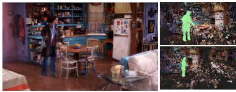

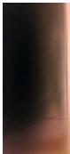

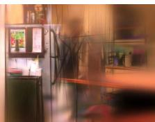

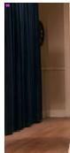

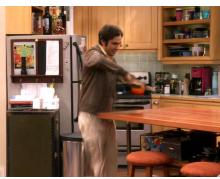

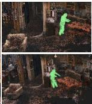

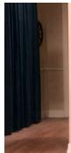

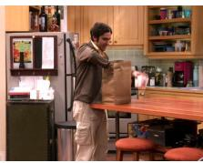

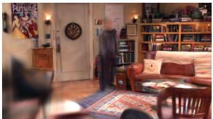  
(a) HUGS

  
(b) ShowMak3r (Ours)

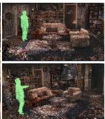

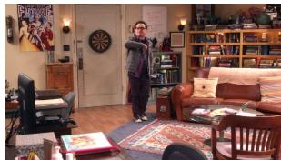  
(c) Ground Truth  
Figure 6. Qualitative comparison on ’The Big Bang Theory’ videos from Sitcoms3D dataset, where each video feature a single actor. Ou method demonstrates superiority in accurately positioning actors on the stage. Green points denote the Gaussian centers for the actors.

TBBT LR

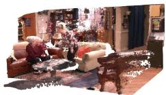

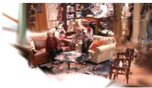

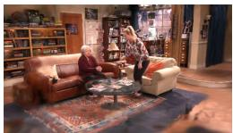

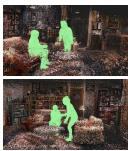

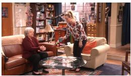

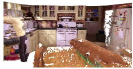

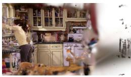

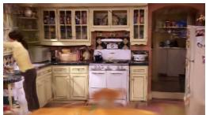

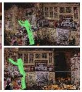

Friends

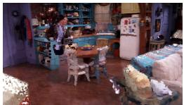

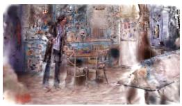

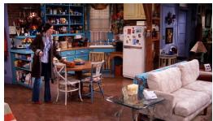

TAAHM

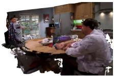  
(a) MonST3R

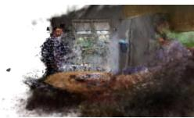  
(b) Shape-of-Motion

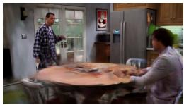  
(c) ShowMak3r (Ours)

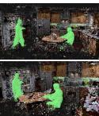

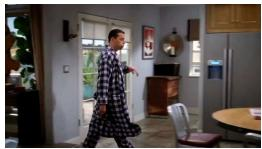  
(d) Reference Frame  
Figure 7. Qualitative comparison on four TV show videos, each featuring multiple actors. The frame from the input viewpoint is referred to as the Reference Frame. Green points denote the Gaussian centers for the actors.

Multiple people scenario. Shape-of-Motion [60] and MonST3R [68] do not rely on template-based models, so we compare them with more challenging multi-people scenarios. We select video clips with a single shot since they assume continuous viewpoints. As demonstrated in Fig. 7, both Shape-of-Motion and MonST3R faces challenges deforming dynamic actors in a moving camera, even when videos with a single shot are given. Our method, however, shows robust reconstruction from videos with arbitrary camera translations. More qualitative results on the various scenes and viewpoints are shown in the supplement.

## 4.3. Quantitative Comparison

Stage reconstruction. We compare our stage reconstruction quality with other 3D reconstruction methods. For a fair comparison, we do not use object removal (Sec. 3.3). Given 165 background images of the TBBT scenario in the Sitcoms3D dataset, we reconstruct the background except for 10 randomly picked images for the testing. As shown in Table. 1, GS-W [67] faces challenges removing transient actors. Also, compared to 3DGS [22], and FSGS [70], masking out actors and using depth priors improves the quality when reconstructing from aggregated sitcom images.

<table><tr><td>Methods</td><td>PSNR↑</td><td>SSIM↑</td><td>LPIPS↓</td></tr><tr><td>Sitcoms3D [45]</td><td>18.81</td><td>0.62</td><td>0.55</td></tr><tr><td>3DGS [22]</td><td>19.21</td><td>0.64</td><td>0.49</td></tr><tr><td>GS-W [67]</td><td>19.35</td><td>0.65</td><td>0.51</td></tr><tr><td>FSGS [70]</td><td>19.34</td><td>0.65</td><td>0.49</td></tr><tr><td>Ours</td><td>19.65</td><td>0.66</td><td>0.49</td></tr></table>

Table 1. Quantitative comparison of stage reconstruction results: We present the reconstruction metrics for the living room from ’The Big Bang Theory’ in the Sitcoms3D dataset.

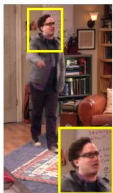  
(a) ExAvatar

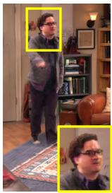

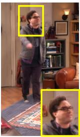  
(b) Ours w/o refine  
(c) Ours

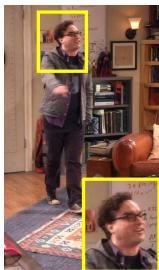  
(d) Ground Truth

Figure 8. Ablation study for face-fitting network.
<table><tr><td>Methods</td><td>PSNR↑</td><td>SSIM↑</td><td>LPIPS↓</td></tr><tr><td>ExAvatar [37]</td><td>20.17</td><td>0.64</td><td>0.25</td></tr><tr><td>Ours w/o refinement</td><td>21.52</td><td>0.82</td><td>0.36</td></tr><tr><td>Ours</td><td>24.34</td><td>0.84</td><td>0.28</td></tr></table>

Table 2. Quantitative comparison of face reconstruction results. We compare the performance of our face-fitting network against ExAvatar [37]. For this comparison, we crop the facial region.

Actor reconstruction. We compare our face-fitting network with ExAvatar [37]. As shown in Fig. 8, while ExAvatar is designed to capture facial expressions, it struggles to recover fine details. In contrast, our simple and practical deformation module enables more precise facial expression adjustments.

## 4.4. Ablation Study

To evaluate the performance of 3DLocator, we propose two simple metrics: MTED (Mean Translation Euclidean Distance) and MPED (Mean Pose Euclidean Distance). These metrics calculate the Euclidean Distance of the global translation between two SMPL models and the Euclidean Distance of 3D joints at shot boundaries. As we can see in Table 3, without using 3DLocator, the fitting does not accurately align with the correct positions, leading to a reduced correlation of the actor between adjacent shots.

<table><tr><td>Methods</td><td>MTED↓</td><td>MPED↓</td></tr><tr><td>Ours w/o 3DLocator</td><td>1.99</td><td>0.24</td></tr><tr><td>Ours</td><td>1.19</td><td>0.10</td></tr></table>

Table 3. Ablation study for 3DLocator. We report Mean Translation Euclidean Distance (MTED) and Mean Pose Euclidean Distance (MPED) across 2 consecutive shots.

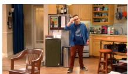

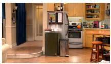  
(a) Actor Deletion

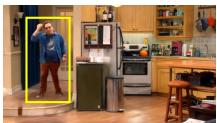  
(b) Actor Relocation

Reference Frame  
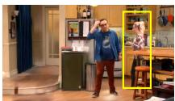  
(c) Actor Insertion

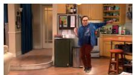  
(d) Pose Manipulation  
Figure 9. The reconstructed scenes with ShowMak3r are editable. Existing actors can be removed, repositioned, or replaced. New actors can be added, and their poses can be adjusted.

## 4.5. Applications

In Fig 9, we show the possible applications with Show-Mak3r. Maintaining separate Gaussian sets for each actor and the stage makes it possible to perform edits, such as removing, relocating, and inserting specific actors from the video. Additionally, actor poses can be manipulated by controlling the pose parameters of the SMPL model.

## 5. Conclusion

We introduce ShowMak3r, a comprehensive pipeline for reconstructing dynamic radiance fields from TV shows. To tackle challenges like actor occlusions, cluttered stages, small baseline views, and sudden shot changes, we propose the following key modules: 3DLocator, which positions actors on the stage by using depth priors and interpolates unseen poses; ShotMatcher, which ensures continuous actor tracking across shot-changes; and face-fitting network for dynamic facial expression recovery. Experiments demonstrate that ShowMak3r effectively reassembles TV shows from novel camera viewpoints. To our knowledge, Show-Mak3r is the first method to reconstruct the stage and multiple actors from shot-changing videos comprehensively.

Limitation and Future Work. Our approach relies on an off-the-shelf 4D human pose estimation approach, which can become noisy in scenarios with severe occlusions. Additionally, our current depth estimation module struggles to predict zoomed-in images, making close-up shots difficult to reconstruct. We aim to expand ShowMak3r to enable explicit editing of the actors.

Acknowledgements. This work was supported by IITP grant (RS-2021-II211343: AI Graduate School Program at Seoul National Univ. (5%) and RS-2023-00227993: Detailed 3D reconstruction for urban areas from unstructured images (30%)) and NRF grant (No.2023R1A1C200781211 (65%)) funded by the Korea government (MSIT). We thank Daeun Lee for her help with the rebuttal experiments.

## References

[1] Aleksei Bochkovskii, Amael Delaunoy, Hugo Germain,¨ Marcel Santos, Yichao Zhou, Stephan R Richter, and Vladlen Koltun. Depth pro: Sharp monocular metric depth in less than a second. arXiv, 2024. 3, 1

[2] Ang Cao and Justin Johnson. Hexplane: A fast representation for dynamic scenes. In Proceedings of the IEEE/CVF Conference on Computer Vision and Pattern Recognition, pages 130–141, 2023. 2

[3] Ziyu Chen, Jiawei Yang, Jiahui Huang, Riccardo de Lutio, Janick Martinez Esturo, Boris Ivanovic, Or Litany, Zan Gojcic, Sanja Fidler, Marco Pavone, et al. Omnire: Omni urban scene reconstruction. In International Conference on Learning Representations, 2025. 2

[4] Jaeyoung Chung, Jeongtaek Oh, and Kyoung Mu Lee. Depth-regularized optimization for 3d gaussian splatting in few-shot images. In Proceedings of the IEEE/CVF Conference on Computer Vision and Pattern Recognition, pages 811–820, 2024. 4

[5] Arnab Dey, Di Yang, Rohith Agaram, Antitza Dantcheva, Andrew I Comport, Srinath Sridhar, and Jean Martinet. Ghnerf: Learning generalizable human features with efficient neural radiance fields. In Proceedings ofthe IEEE/CVF Conference on Computer Vision and Pattern Recognition, pages 2812–2821, 2024. 2

[6] Arindam Dutta, Meng Zheng, Zhongpai Gao, Benjamin Planche, Anwesha Choudhuri, Terrence Chen, Amit K Roy-Chowdhury, and Ziyan Wu. Chrome: Clothed human reconstruction with occlusion-resilience and multiviewconsistency from a single image. In arXiv, 2025. 2

[7] Sara Fridovich-Keil, Giacomo Meanti, Frederik Rahbæk Warburg, Benjamin Recht, and Angjoo Kanazawa. K-planes: Explicit radiance fields in space, time, and appearance. In Proceedings of the IEEE/CVF Conference on Computer Vision and Pattern Recognition, pages 12479–12488, 2023. 2

[8] Chen Geng, Sida Peng, Zhen Xu, Hujun Bao, and Xiaowei Zhou. Learning Neural Volumetric Representations of Dynamic Humans in Minutes. In Proceedings ofthe IEEE/CVF Conference on Computer Vision and Pattern Recognition, pages 8759–8770, 2023. 2

[9] Shubham Goel, Georgios Pavlakos, Jathushan Rajasegaran, Angjoo Kanazawa, and Jitendra Malik. Humans in 4d: Reconstructing and tracking humans with transformers. In Proceedings of IEEE International Conference on Computer Vision, pages 14783–14794, 2023. 4, 5, 1

[10] Alexandros Graikos, Nikolay Malkin, Nebojsa Jojic, and Dimitris Samaras. Diffusion models as plug-and-play priors. In Advances in Neural Information Processing Systems, pages 14715–14728, 2022. 2

[11] Chen Guo, Tianjian Jiang, Xu Chen, Jie Song, and Otmar Hilliges. Vid2Avatar: 3D Avatar Reconstruction From Videos in the Wild via Self-Supervised Scene Decomposition. In Proceedings of the IEEE/CVF Conference on Com puter Vision and Pattern Recognition, pages 12858–12868, 2023. 2, 4, 1

[12] Liangxiao Hu, Hongwen Zhang, Yuxiang Zhang, Boyao Zhou, Boning Liu, Shengping Zhang, and Liqiang Nie. Gaussianavatar: Towards realistic human avatar modeling from a single video via animatable 3d gaussians. In Proceedings of the IEEE/CVF Conference on Computer Vision and Pattern Recognition, pages 634–644, 2024. 2

[13] Shoukang Hu, Fangzhou Hong, Liang Pan, Haiyi Mei, Lei Yang, and Ziwei Liu. Sherf: Generalizable human nerf from a single image. In Proceedings of IEEE International Con ference on Computer Vision, pages 9352–9364, 2023. 2

[14] Shoukang Hu, Tao Hu, and Ziwei Liu. Gauhuman: Articulated gaussian splatting from monocular human videos. In Proceedings of the IEEE/CVF Conference on Computer Vi sion and Pattern Recognition, pages 20418–20431, 2024. 2

[15] Mustafa Is¸ık, Martin Runz, Markos Georgopoulos, Taras¨ Khakhulin, Jonathan Starck, Lourdes Agapito, and Matthias Nießner. Humanrf: High-fidelity neural radiance fields for humans in motion. ACM Transactions on Graphics, 42(4): 1–12, 2023. 2

[16] Ajay Jain, Ben Mildenhall, Jonathan T Barron, Pieter Abbeel, and Ben Poole. Zero-shot text-guided object generation with dream fields. In Proceedings ofthe IEEE/CVF Conference on Computer Vision and Pattern Recognition, pages 867–876, 2022. 2

[17] Wei Jiang, Kwang Moo Yi, Golnoosh Samei, Oncel Tuzel, and Anurag Ranjan. NeuMan: Neural Human Radiance Field from a Single Video. In European Conference on Computer Vision, pages 402–418, Cham, 2022. Springer Nature Switzerland. 1, 2, 3, 4, 5

[18] Yuheng Jiang, Zhehao Shen, Penghao Wang, Zhuo Su, Yu Hong, Yingliang Zhang, Jingyi Yu, and Lan Xu. HiFi4G: High-Fidelity Human Performance Rendering via Compact Gaussian Splatting. In Proceedings of the IEEE/CVF Conference on Computer Vision and Pattern Recognition, pages 19734–19745, 2024. 2

[19] Hanbyul Joo, Hao Liu, Lei Tan, Lin Gui, Bart Nabbe, Iain Matthews, Takeo Kanade, Shohei Nobuhara, and Yaser Sheikh. Panoptic studio: A massively multiview system for social motion capture. In Proceedings of IEEE International Conference on Computer Vision, pages 3334–3342, 2015. 2

[20] HyunJun Jung, Nikolas Brasch, Jifei Song, Eduardo Perez-Pellitero, Yiren Zhou, Zhihao Li, Nassir Navab, and Benjamin Busam. Deformable 3d gaussian splatting for animat able human avatars. In arXiv, 2023. 1, 2, 6

[21] Ephraim Katz. Ephraim katz’s the film encyclopedia, 1979. 3

[22] Bernhard Kerbl, Georgios Kopanas, Thomas Leimkuhler,¨ and George Drettakis. 3d gaussian splatting for real-time radiance field rendering. ACM Transactions on Graphics, 42 (4):139–1, 2023. 1, 2, 3, 4, 6, 7, 8

[23] Alexander Kirillov, Eric Mintun, Nikhila Ravi, Hanzi Mao, Chloe Rolland, Laura Gustafson, Tete Xiao, Spencer White

head, Alexander C Berg, Wan-Yen Lo, et al. Segment anything. In Proceedings of IEEE International Conference on Computer Vision, pages 4015–4026, 2023. 3, 1

[24] Muhammed Kocabas, Jen-Hao Rick Chang, James Gabriel, Oncel Tuzel, and Anurag Ranjan. Hugs: Human gaussian splats. In Proceedings ofthe IEEE/CVF Conference on Computer Vision and Pattern Recognition, pages 505–515, 2024. 2, 4, 5, 6, 1

[25] Inhee Lee, Byungjun Kim, and Hanbyul Joo. Guess the unseen: Dynamic 3d scene reconstruction from partial 2d glimpses. In Proceedings of the IEEE/CVF Conference on Computer Vision and Pattern Recognition, pages 1062– 1071, 2024. 2, 5, 6

[26] Jiahui Lei, Yijia Weng, Adam Harley, Leonidas Guibas, and Kostas Daniilidis. Mosca: Dynamic gaussian fusion from casual videos via 4d motion scaffolds. In arXiv, 2024. 2

[27] Chen Li, Jiahao Lin, and Gim Hee Lee. Ghunerf: Generalizable human nerf from a monocular video. In 2024 International Conference on 3D Vision (3DV), pages 923–932. IEEE, 2024. 2

[28] Tianye Li, Mira Slavcheva, Michael Zollhoefer, Simon Green, Christoph Lassner, Changil Kim, Tanner Schmidt, Steven Lovegrove, Michael Goesele, Richard Newcombe, et al. Neural 3d video synthesis from multi-view video. In Proceedings of the IEEE/CVF Conference on Computer Vision and Pattern Recognition, pages 5521–5531, 2022. 2

[29] Zhengqi Li, Simon Niklaus, Noah Snavely, and Oliver Wang. Neural scene flow fields for space-time view synthesis of dynamic scenes. In Proceedings of the IEEE/CVF Conference on Computer Vision and Pattern Recognition, pages 6498– 6508, 2021. 2

[30] Zhengqi Li, Qianqian Wang, Forrester Cole, Richard Tucker, and Noah Snavely. Dynibar: Neural dynamic image-based rendering. In Proceedings of the IEEE/CVF Conference on Computer Vision and Pattern Recognition, pages 4273– 4284, 2023. 2

[31] Zhe Li, Zerong Zheng, Lizhen Wang, and Yebin Liu. Animatable Gaussians: Learning Pose-dependent Gaussian Maps for High-fidelity Human Avatar Modeling. In Proceedings of the IEEE/CVF Conference on Computer Vision and Pattern Recognition, pages 19711–19722, 2024. 2

[32] Youtian Lin, Zuozhuo Dai, Siyu Zhu, and Yao Yao. Gaussian-flow: 4d reconstruction with dynamic 3d gaussian particle. In Proceedings of the IEEE/CVF Conference on Computer Vision and Pattern Recognition, pages 21136– 21145, 2024. 2

[33] Matthew Loper, Naureen Mahmood, Javier Romero, Gerard Pons-Moll, and Michael J. Black. Smpl: a skinned multiperson linear model. ACM Trans. Graph., 34(6), 2015. 2

[34] Jiahao Lu, Tianyu Huang, Peng Li, Zhiyang Dou, Cheng Lin, Zhiming Cui, Zhen Dong, Sai-Kit Yeung, Wenping Wang, and Yuan Liu. Align3r: Aligned monocular depth estimation for dynamic videos. In arXiv, 2024. 2

[35] Ricardo Martin-Brualla, Noha Radwan, Mehdi SM Sajjadi, Jonathan T Barron, Alexey Dosovitskiy, and Daniel Duckworth. Nerf in the wild: Neural radiance fields for unconstrained photo collections. In Proceedings of the IEEE/CVF

Conference on Computer Vision and Pattern Recognition, pages 7210–7219, 2021. 2, 6

[36] Ben Mildenhall, Pratul P. Srinivasan, Matthew Tancik, Jonathan T. Barron, Ravi Ramamoorthi, and Ren Ng. Nerf: Representing scenes as neural radiance fields for view synthesis. In European Conference on Computer Vision, 2020. 1, 2

[37] Gyeongsik Moon, Takaaki Shiratori, and Shunsuke Saito. Expressive Whole-Body 3D Gaussian Avatar. In European Conference on Computer Vision, pages 19–35, Cham, 2024. Springer Nature Switzerland. 2, 6, 8

[38] Arthur Moreau, Jifei Song, Helisa Dhamo, Richard Shaw, Yiren Zhou, and Eduardo Perez-Pellitero. Human Gaussian´ Splatting: Real-time Rendering of Animatable Avatars. In Proceedings of the IEEE/CVF Conference on Computer Vision and Pattern Recognition, pages 788–798, 2024. 2

[39] Jiteng Mu, Shen Sang, Nuno Vasconcelos, and Xiaolong Wang. Actorsnerf: Animatable few-shot human rendering with generalizable nerfs. In Proceedings of the IEEE/CVF Conference on Computer Vision and Pattern Recognition, pages 18391–18401, 2023. 2

[40] Linfei Pan, Daniel Bar´ ath, Marc Pollefeys, and Jo-´ hannes Lutz Schonberger. Global structure-from-motion re-¨ visited. In European Conference on Computer Vision, 2024. 3, 1

[41] Haokai Pang, Heming Zhu, Adam Kortylewski, Christian Theobalt, and Marc Habermann. ASH: Animatable Gaussian Splats for Efficient and Photoreal Human Rendering. In Proceedings of the IEEE/CVF Conference on Computer Vision and Pattern Recognition, pages 1165–1175, 2024. 2

[42] Keunhong Park, Utkarsh Sinha, Jonathan T Barron, Sofien Bouaziz, Dan B Goldman, Steven M Seitz, and Ricardo Martin-Brualla. Nerfies: Deformable neural radiance fields. In Proceedings of IEEE International Conference on Computer Vision, pages 5865–5874, 2021. 2

[43] Keunhong Park, Utkarsh Sinha, Peter Hedman, Jonathan T Barron, Sofien Bouaziz, Dan B Goldman, Ricardo Martin-Brualla, and Steven M Seitz. Hypernerf: a higherdimensional representation for topologically varying neural radiance fields. ACM Transactions on Graphics, 40(6):1–12, 2021. 1, 2

[44] Georgios Pavlakos, Vasileios Choutas, Nima Ghorbani, Timo Bolkart, Ahmed AA Osman, Dimitrios Tzionas, and Michael J Black. Expressive body capture: 3d hands, face, and body from a single image. In Proceedings of IEEE In ternational Conference on Computer Vision, pages 10975– 10985, 2019. 2

[45] Georgios Pavlakos, Ethan Weber, Matthew Tancik, and Angjoo Kanazawa. The one where they reconstructed 3d humans and environments in tv shows. In European Conference on Computer Vision, pages 732–749. Springer, 2022. 2, 4, 5, 6, 8, 1

[46] Sida Peng, Junting Dong, Qianqian Wang, Shangzhan Zhang, Qing Shuai, Xiaowei Zhou, and Hujun Bao. Animatable neural radiance fields for modeling dynamic hu man bodies. In Proceedings of the IEEE/CVF Conference on Computer Vision and Pattern Recognition, pages 14314– 14323, 2021. 2

[47] Dustin Podell, Zion English, Kyle Lacey, Andreas Blattmann, Tim Dockhorn, Jonas Muller, Joe Penna, and¨ Robin Rombach. Sdxl: Improving latent diffusion models for high-resolution image synthesis. In International Conference on Learning Representations, 2024. 2, 4, 1

[48] Ben Poole, Ajay Jain, Jonathan T Barron, and Ben Mildenhall. Dreamfusion: Text-to-3d using 2d diffusion. In International Conference on Learning Representations, 2023. 2, 6

[49] Albert Pumarola, Enric Corona, Gerard Pons-Moll, and Francesc Moreno-Noguer. D-nerf: Neural radiance fields for dynamic scenes. In Proceedings of the IEEE/CVF Conference on Computer Vision and Pattern Recognition, pages 10318–10327, 2021. 2

[50] Shenhan Qian, Tobias Kirschstein, Liam Schoneveld, Davide Davoli, Simon Giebenhain, and Matthias Nießner. Gaussianavatars: Photorealistic head avatars with rigged 3d gaussians. In Proceedings of the IEEE/CVF Conference on Computer Vision and Pattern Recognition, pages 20299–20309, 2024. 2

[51] Zhiyin Qian, Shaofei Wang, Marko Mihajlovic, Andreas Geiger, and Siyu Tang. 3DGS-Avatar: Animatable Avatars via Deformable 3D Gaussian Splatting. In Proceedings of the IEEE/CVF Conference on Computer Vision and Pattern Recognition, pages 5020–5030, 2024. 2

[52] Robin Rombach, Andreas Blattmann, Dominik Lorenz, Patrick Esser, and Bjorn Ommer. High-resolution image¨ synthesis with latent diffusion models. In Proceedings of the IEEE/CVF Conference on Computer Vision and Pattern Recognition, pages 10684–10695, 2022. 2

[53] Zhijing Shao, Duotun Wang, Qing-Yao Tian, Yao-Dong Yang, Hengyu Meng, Zeyu Cai, Bo Dong, Yu Zhang, Kang Zhang, and Zeyu Wang. Degas: Detailed expressions on fullbody gaussian avatars. In arXiv, 2024. 2

[54] Zhijing Shao, Zhaolong Wang, Zhuang Li, Duotun Wang, Xiangru Lin, Yu Zhang, Mingming Fan, and Zeyu Wang. SplattingAvatar: Realistic Real-Time Human Avatars with Mesh-Embedded Gaussian Splatting. In Proceedings of the IEEE/CVF Conference on Computer Vision and Pattern Recognition, pages 1606–1616, 2024. 2

[55] Robert Sklar. Film: An International History ofthe Medium. Thames and Hudson, 1990. 3

[56] Liangchen Song, Anpei Chen, Zhong Li, Zhang Chen, Lele Chen, Junsong Yuan, Yi Xu, and Andreas Geiger. Nerfplayer: A streamable dynamic scene representation with decomposed neural radiance fields. IEEE Transactions on Visualization and Computer Graphics, 29(5):2732–2742, 2023. 2

[57] Colton Stearns, Adam Harley, Mikaela Uy, Florian Dubost, Federico Tombari, Gordon Wetzstein, and Leonidas Guibas. Dynamic gaussian marbles for novel view synthesis of casual monocular videos. In SIGGRAPHAsia 2024 Conference Papers, pages 1–11, 2024. 2

[58] Shih-Yang Su, Frank Yu, Michael Zollhofer, and Helge ¨ Rhodin. A-nerf: Articulated neural radiance fields for learning human shape, appearance, and pose. Advances in Neural Information Processing Systems, 34:12278–12291, 2021. 2

[59] Matias Turkulainen, Xuqian Ren, Iaroslav Melekhov, Otto Seiskari, Esa Rahtu, and Juho Kannala. Dn-splatter: Depth and normal priors for gaussian splatting and meshing. In arXiv, 2024. 4

[60] Qianqian Wang, Vickie Ye, Hang Gao, Jake Austin, Zhengqi Li, and Angjoo Kanazawa. Shape of motion: 4d reconstruction from a single video. arXiv, 2024. 2, 6, 7

[61] Shizun Wang, Xingyi Yang, Qiuhong Shen, Zhenxiang Jiang, and Xinchao Wang. Gflow: Recovering 4d world from monocular video. In Association for the Advancement of Artificial Intelligence, 2025. 2

[62] Zhengyi Wang, Cheng Lu, Yikai Wang, Fan Bao, Chongxuan Li, Hang Su, and Jun Zhu. Prolificdreamer: High-fidelity and diverse text-to-3d generation with variational score distillation. In Advances in Neural Information Processing Systems, pages 8406–8441, 2023. 2

[63] Zhaorong Wang, Yoshihiro Kanamori, and Yuki Endo. Eg humannerf: Efficient generalizable human nerf utilizing human prior for sparse view. In arXiv, 2024. 2

[64] Chung-Yi Weng, Brian Curless, Pratul P. Srinivasan, Jonathan T. Barron, and Ira Kemelmacher-Shlizerman. HumanNeRF: Free-Viewpoint Rendering of Moving People From Monocular Video. In Proceedings of the IEEE/CVF Conference on Computer Vision and Pattern Recognition, pages 16210–16220, 2022. 2

[65] Guanjun Wu, Taoran Yi, Jiemin Fang, Lingxi Xie, Xiaopeng Zhang, Wei Wei, Wenyu Liu, Qi Tian, and Xinggang Wang. 4d gaussian splatting for real-time dynamic scene rendering. In Proceedings of the IEEE/CVF Conference on Computer Vision and Pattern Recognition, pages 20310–20320, 2024. 1, 2

[66] Zhengming Yu, Wei Cheng, Xian Liu, Wayne Wu, and Kwan-Yee Lin. MonoHuman: Animatable Human Neural Field From Monocular Video. In Proceedings of the IEEE/CVF Conference on Computer Vision and Pattern Recognition, pages 16943–16953, 2023. 2

[67] Dongbin Zhang, Chuming Wang, Weitao Wang, Peihao Li, Minghan Qin, and Haoqian Wang. Gaussian in the wild: 3d gaussian splatting for unconstrained image collections. In European Conference on Computer Vision, pages 341–359. Springer, 2024. 6, 7, 8

[68] Junyi Zhang, Charles Herrmann, Junhwa Hur, Varun Jampani, Trevor Darrell, Forrester Cole, Deqing Sun, and Ming Hsuan Yang. Monst3r: A simple approach for estimating geometry in the presence of motion. International Confer ence on Learning Representations, 2025. 2, 6, 7

[69] Fuqiang Zhao, Wei Yang, Jiakai Zhang, Pei Lin, Yingliang Zhang, Jingyi Yu, and Lan Xu. Humannerf: Efficiently gen erated human radiance field from sparse inputs. In Proceedings of the IEEE/CVF Conference on Computer Vision and Pattern Recognition, pages 7743–7753, 2022. 2

[70] Zehao Zhu, Zhiwen Fan, Yifan Jiang, and Zhangyang Wang. Fsgs: Real-time few-shot view synthesis using gaussian splatting. In European Conference on Computer Vision, pages 145–163. Springer, 2024. 6, 7, 8