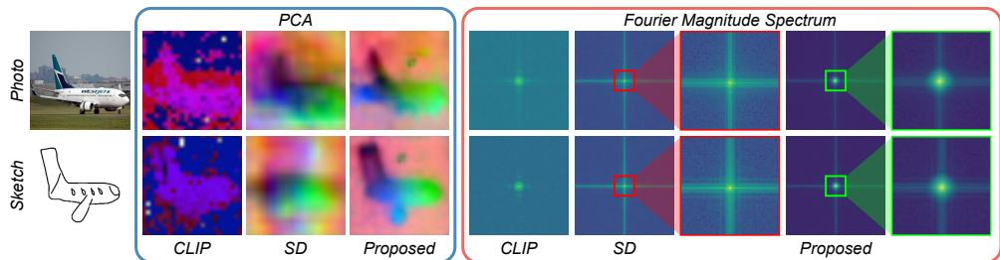
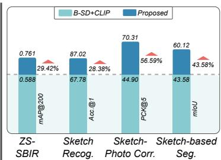
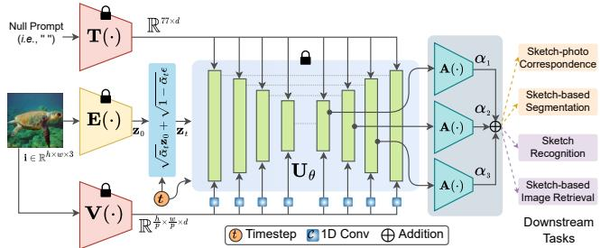
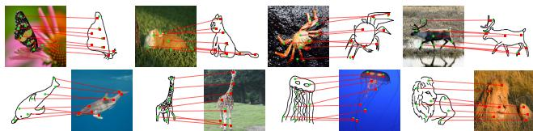
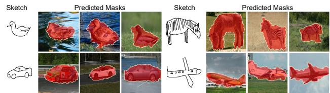
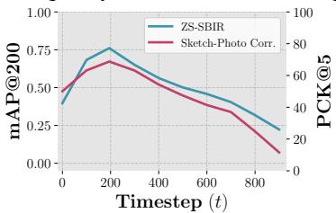

# SketchFusion: Learning Universal Sketch Features through

Fusing Foundation Models

Subhadeep Koley1,2\* Tapas Kumar Dutta1∗ Aneeshan Sain1 Pinaki Nath Chowdhury1

Ayan Kumar Bhunia1 Yi-Zhe Song1,2

1SketchX, CVSSP, University of Surrey, United Kingdom.

2iFlyTek-Surrey Joint Research Centre on Artificial Intelligence.

{s.koley, a.sain, p.chowdhury, a.bhunia, y.song}@surrey.ac.uk

  
Figure 1. (Left): Apart from high-resolution image generation, text-to-image diffusion models (e.g., Stable diffusion (SD) [71]) with their innate object understanding capability [84, 107], have shown remarkable performance across a wide range of image-based vision tasks (e.g., segmentation [94], depth estimation [110], etc.). However, upon analysing the PCA representation of SD’s intermediate UNet features, we observe that it struggles to achieve similar results when working with freehand abstract sketches (detail in Sec. 4). Unlike pixel-perfect photos, highly abstract freehand sketches are sparse and lack detailed textures and colours [26], making it harder for the SD model to extract meaningful features. Furthermore, investigating the SD denoising process in the frequency domain (via Fourier Transform), we observe the predominance of high-frequency (HF) components, rather than their low-frequency (LF) counterpart – crucial for capturing comprehensive semantic context. To mitigate this inherent bias within SD, we reinforce the diffusion process with another pretrained model (i.e., CLIP [67]) whose bias is complementary (i.e., focuses on LF) to SD. Consequently, the proposed extractor can extract semantically meaningful and accurate features from both sketches and photos, that encapsulate a broader frequency spectrum (i.e., HF and LF). (Right:) Testing the proposed method with different sketch-based discriminative and dense prediction tasks (requiring knowledge of both sketch and image), we find a marked improvement over baseline SD+CLIP hybrid feature extractor.

## Abstract

While foundation models have revolutionised computer vision, their effectiveness for sketch understanding remains limited by the unique challenges of abstract, sparse visual inputs. Through systematic analysis, we uncover two fundamental limitations: Stable Diffusion (SD) struggles to extract meaningful features from abstract sketches (unlike its success with photos), and exhibits a pronouncedfrequencydomain bias that suppresses essential low-frequency components needed for sketch understanding. Rather than costly retraining, we address these limitations by strategically combining SD with CLIP, whose strong semantic understanding naturally compensates for SD’s spatial frequency biases. By dynamically injecting CLIP features into SD’s denoising process and adaptively aggregating features across semantic levels, our method achieves state-ofthe-art performance in sketch retrieval (+3.35%), recognition (+1.06%), segmentation (+29.42%), and correspondence learning (+21.22%), demonstrating the first truly universal sketch feature representation in the era offoundation models.

## 1. Introduction

The quest for universal sketch-specific features has been a foundational challenge in computer vision [46, 76, 78, 97]. Sketches, with their inherent characteristics of abstraction, sparsity, and cross-modal interpretation, demand fundamentally different feature representations compared to natural images [45, 100]. While foundation models [67, 71] have revolutionised various visual tasks, their effectiveness for sketch understanding remains largely unexplored [47], particularly given sketch’s unique position at the intersection of human abstraction and computer vision [26, 45].

Through systematic analysis, we find that even powerful foundation models like Stable Diffusion (SD) [71] face significant challenges with sketch data. Our pilot studies (Sec. 4) reveal two fundamental limitations. First, while SD excels at extracting task-specific representative features from pixel-perfect RGB images, it struggles with abstract freehand sketches, likely due to its large-scale pretraining being predominantly focused on photographic data [71]. Second, and more intriguingly, frequency-domain analysis of SD’s UNet reveals an inherent architectural bias: the model systematically promotes high-frequency (HF) components while suppressing low-frequency (LF) information – a characteristic that proves particularly problematic for sketch understanding tasks, especially dense prediction problems like segmentation and correspondence learning.

These findings present a significant challenge. Retraining SD on sketch data risks catastrophic forgetting of its valuable pretrained knowledge [47], while developing sketch-specific architectures would fail to leverage the rich visual understanding already present in foundation models. Our key insight comes from analysing the complementary nature of different foundation models: while SD’s features are spatially-aware but lack semantic accuracy, CLIP’s [67] visual encoder exhibits strong semantic understanding even at the cost of spatial precision. This complementarity suggests that strategic combination [107] of these models could yield features that capture both the detailed structure and semantic meaning necessary for sketch understanding.

Based on this insight, we propose a novel framework that leverages the complementary strengths of these foundation models. Our method systematically injects CLIP’s visual features into multiple layers of SD’s UNet during the denoising process, using lightweight 1D convolutions to influence feature extraction at various semantic levels. PCA analysis of the resulting features demonstrates that this combination successfully captures both the HF spatial details from SD [71] and the LF semantic components from CLIP [67], producing rich, semantically-aware representations suited for diverse sketch-based tasks.

Moreover, we observe that different layers of SD’s UNet capture features at varying levels of semantic-granularity [46], with different combinations better suited to specific downstream tasks [84]. Rather than manually selecting optimal features, we train a dynamic feature aggregator that automatically determines the most effective combination for any given task, eliminating the need for task-specific tuning. This adaptive approach ensures optimal performance across diverse sketch-based applications without requiring manual layer selection or task-specific optimisation.

Our extensive experiments demonstrate the effectiveness of this approach across a comprehensive suite of sketchbased tasks: (i) Sketch Recognition: +1.06% improvement over state-of-the-art, (ii) Sketch-based Image Retrieval: +3.35% improvement in retrieval accuracy, (iii) Sketch-based Segmentation: +29.42% boost in mean IoU, (iv) Sketch-Photo Correspondence: +21.22% increase in matching precision. These significant improvements across all major sketch-specific tasks suggest that our method has uncovered fundamental principles for extracting effective sketch features from foundation models.

In summary, our contributions are: (i) A systematic analysis revealing the limitations of pretrained foundation models for sketch understanding, supported by both empirical results and frequency-domain analysis, (ii) A novel method for combining complementary foundation models that address these limitations without retraining, (iii) An adaptive feature aggregation approach that automatically optimises representations for different downstream tasks, and (iv) Comprehensive experimental validation demonstrating substantial improvements across all major sketch-specific tasks, establishing a new paradigm for universal sketch feature learning.

## 2. Related Works

Diffusion Model for Representation Learning. Diffusion models [34] have now became the de-facto standard for high-resolution 2D [21, 71] and 3D [12, 81] image and video [11] generation. Apart from generation, it gave rise to various image editing frameworks like Prompt-to-Prompt [33], Imagic [40], Dreambooth [73], etc. The success of diffusion models across various generative tasks and their inherent zero-shot generalisability has led to their adoption as efficient feature extractors in different forms of discriminative [23] and dense prediction [109] tasks like image retrieval [46], classification [49], semantic [3] and panoptic [94] segmentation, depth estimation [110], object detection [93], image-to-image translation [47, 86], controllablegeneration [59, 108] and medical imaging [18], to name a few. A few recent works have developed specialised diffusion models together with carefully crafted task-specific designs like test-time adaptation [65], masked-reconstruction [62], or compact latent generation [36] to improve their representation ability. Nonetheless, our pilot study (Sec. 4) reveals that SD, often struggles to extract representative features (Fig. 1 left) from binary and sparse sketches, hampering downstream task performance. In this work, we leverage a pretrained CLIP [67] visual encoder to enhance SD’s feature representation abilities for sketch-based discriminative and dense prediction tasks.

Sketch-based Vision Applications. “Freehand sketch” has now established itself as a worthy interactive alternative modality to text for downstream vision tasks [9, 16, 31, 43, 76, 87, 102]. With its success in sketch-based image retrieval (SBIR) [13, 20, 76, 79], sketches are now being used in a wide array of discriminative [16, 17, 20], generative [27, 43, 108] and dense prediction [7, 35] tasks like controllable 2D [47, 108], 3D [2, 88] image generation and editing [31, 43, 58, 59, 69, 108], video synthesis [92], garment designing [14, 51], segmentation [35], creative content generation [9], object detection [16], salient region prediction [7], augmented and virtual reality applications [56, 57], medical imaging [41], class incremental learning [5], or composed retrieval [44]. In this paper, we aim to tackle some of the sketch-based downstream tasks by reinforcing the diffusion feature extractor via a pretrained CLIP [67] visual encoder. Backbones for Sketch-based Vision Applications. Backbones for sketch-based vision applications can be broadly categorised as – (i) pretrained CNN or Vision Transformer (ViT) [6, 13, 68], (ii) Self-supervised pretraining [4, 50, 64], and (iii) pretrained foundation models [39, 67, 71]. Starting with ImageNet pretrained CNNs [6, 13] or JFT pretrained ViTs [68, 77] with carefully-crafted design choices $( e . g .$ cross [52] and spatial [83] attention, reinforcement learning [6], test-time training [75], meta-learning [74], knowledge distillation [77], etc.), the community moved towards selfsupervised pretraining either via solving pretext tasks like sketch vectorisation [4], rasterisation [4], solving sketchphoto jigsaw [64] or by large-scale photo pretraining [50]. With the advent of large-scale foundation models, several works [43, 46, 76, 79] used them as a backbone for different sketch-based tasks like image generation [43, 108], shape synthesis [2], or retrieval [46, 79]. Foundation models have now become the gold standard for sketch-based tasks due to their strong zero-shot performance and extensive pretrained knowledge [45, 46, 79]. Among these, generative models like SD are spatially aware [46, 107], yet less accurate for dense prediction tasks. In contrast, vision-language models like CLIP [67] offer accurate features but are inherently sparse [107]. In this paper, we aim to get the best of both worlds by enhancing the SD feature extraction with CLIP.

Reinforcing Feature Extractors. There are numerous ways of reinforcing an off-the-shelf pretrained feature extractor to adapt them for different downstream tasks. It can broadly be categorised $\mathrm { a s } - ( i )$ Mixture of Experts (MoE) [22, 104], (ii) Prompt learning [38, 112], (iii) Hybrid models [91, 107], (iv) Finetuning [76, 99], and (v) Global-local feature merging [30, 105]. MoE combines multiple specialised sub-models $( i . e .$ , “experts”), each responsible for specific tasks or data patterns, to boost overall performance and adaptability [22]. In contrast, prompt learning deals with learning additional trainable components in the textual [111, 112] or pixel [1, 38] domain for task-specific adaptation. Hybrid models [89] combine two different kinds of models like CNN and ViT [91], or SD and DINO [107] to extract the best of both worlds. Another avenue deals with finetuning large-scale pretrained models with selective handcrafted data for specific tasks [16, 76]. Finally, a few other works [30, 90, 105] amalgamate global and local features from the same [90] or different [30, 105] models to improve downstream task performance. In this paper, we take the hybrid model approach and complement CNN-based SD features with transformer-based CLIP visual encoder features for different kinds of sketch-based vision tasks.

## 3. Preliminaries

## 3.1. Background: CLIP

Contrastive language-image pretraining (CLIP) [67] architecture consists of a visual and a textual encoder, trained on ∼400M image-text pairs, with the goal of learning a shared embedding manifold. Using N-pair contrastive loss, the model aligns matching image-text pairs by maximising their cosine similarity and minimises it for random unpaired ones [67]. The image encoder, typically a

ViT [24], encodes an image i as a feature vector $\mathbf { V } ( \mathbf { i } ) \ \in$ $\mathbb { R } ^ { d }$ Meanwhile, the textual encoder processes a word sequence $\mathcal { W } ~ = ~ \{ w ^ { 0 } , w ^ { 1 } , \ldots , w ^ { k } \}$ through byte pair encoding [67] and a learnable word embedding layer (vocabulary size of 49, 152), converting each word $w ^ { i }$ into a token embedding, thus creating an embedding sequence ${ \mathcal W } _ { e } = \{ { \bf w } _ { e } ^ { 0 } , { \bf w } _ { e } ^ { 1 } , \ldots , { \bf w } _ { e } ^ { k } \}$ [67]. $\mathcal { W } _ { e }$ is then passed through a transformer network $\mathbf { T } ( \cdot )$ , producing the final text feature $\mathbf { T } ( \mathcal { W } _ { e } ) \in \mathbb { R } ^ { d } \left[ 6 7 \right]$ . Once trained, the CLIP model can be used in downstream tasks to enable zero-shot capability and cross-modal understanding by aligning visual and textual data in a shared embedding space [67].

## 3.2. Background: Stable Diffusion (SD)

Overview. The SD model [71] generates images by gradually removing noise from an initial 2D isotropic Gaussian noise image through iterative refinement. It involves two reciprocal processes – “forward” and “reverse” diffusion [34, 71]. The forward process iteratively adds random Gaussian noise into a clean image $\mathbf { i } _ { 0 } \in \dot { \mathbb { R } } ^ { h \times w \times 3 }$ for t timesteps to generate a noisy image i as $\mathbf { i } _ { t } = \sqrt { \bar { \alpha } _ { t } } \mathbf { i } _ { 0 } +$ $\sqrt { 1 - \bar { \alpha } _ { t } } \epsilon$ . Here, $\epsilon \sim \mathcal { N } ( 0 , \mathbf { I } )$ , and $\{ \alpha _ { t } \} _ { 1 } ^ { T }$ is a pre-defined noise schedule where $\begin{array} { r } { \bar { \alpha } _ { t } = \prod _ { k = 1 } ^ { t } \alpha _ { k } } \end{array}$ with $t { \sim } U ( 0 , T )$ . The reverse process involves training a denoising UNet [72] $\mathbf { U } _ { \theta }$ (with an $l _ { 2 }$ objective), which estimates the input noise $\epsilon \approx \mathbf { U } _ { \theta } ( \mathbf { i } _ { t } , t )$ from the noisy image $\mathbf { i } _ { t }$ at each t. After training, $\mathbf { U } _ { \theta }$ is capable of reconstructing a clean image from a noisy input [71]. The inference process begins with a random $2 D$ noise sample, $\mathbf { i } _ { T } { \sim } \mathcal { N } ( 0 , \mathbf { I } )$ . The trained model $\mathbf { U } _ { \theta }$ is then applied iteratively across $T$ timesteps, progressively reducing noise at each step to produce a cleaner intermediate image, $\mathbf { i } _ { t - 1 }$ , finally generating one of the cleanest samples $\mathbf { i } _ { 0 }$ from the target distribution.

The unconditional denoising diffusion could further be made conditional by governing $\mathbf { U } _ { \theta }$ with different auxiliary signals $( e . g .$ , textual captions) c [71]. Accordingly, $\mathbf { U } _ { \theta } ( \mathbf { i } _ { t } , t , \mathbf { c } )$ can denoise $\mathbf { i } _ { t }$ while being influenced by c, commonly via cross-attention [71].

Architecture. Pixel-space diffusion model [34] is timeintensive as it operates on the full image resolution $( i . e . ,$ $\mathbf { i } _ { 0 } \in \mathbb { R } ^ { h \times w \times 3 } )$ . Contrarily, SD model [71] performs denoising in the latent-space, resulting in significantly faster and more stable processing. In the first stage, SD trains a variational autoencoder (VAE) [42] (an encoder $\mathbf { E } ( \cdot )$ and a decoder $\mathbf { D } ( \cdot ) )$ . E(·) transforms the input image into its latent representation $\mathbf { z } _ { 0 } = \mathbf { E } ( \mathbf { i } _ { 0 } ) \in \mathbb { R } ^ { \frac { h } { 8 } \times \frac { w } { 8 } \times d }$ . In the second stage, the UNet [72] $\mathbf { U } _ { \theta }$ , directly denoises the latent images. $\mathbf { U } _ { \theta }$ comprises 12 encoding, 1 bottleneck, and 12 skip-connected decoding blocks [71]. Inside these encoding and decoding blocks, there are 4 downsampling $\mathbf { ( U _ { d } ^ { 1 - 4 } ) }$ and 4 upsampling $( \mathbf { U _ { u } ^ { 1 - 4 } } )$ layers respectively. In SD, a frozen CLIP textual encoder [67] $\mathbf { T } ( \cdot )$ converts the textual prompt c into token-sequence, that influences the denoising process of $\mathbf { U } _ { \theta }$ through cross-attention. $\mathbf { U } _ { \theta }$ is trained over an $l _ { 2 }$ objective as: $\begin{array} { r } { \mathcal { L } _ { 1 _ { 2 } } = \mathbb { E } _ { \mathbf { z } _ { t } , t , \mathbf { c } , \epsilon } ( | | \epsilon - \mathbf { U } _ { \theta } ( \mathbf { z } _ { t } , t , \mathbf { T } ( \mathbf { c } ) ) | | _ { 2 } ^ { 2 } ) } \end{array}$ During inference, a noisy latent $\mathbf { z } _ { t }$ is sampled directly as: $\mathbf { z } _ { t } { \sim } \mathcal { N } ( 0 , \mathbf { I } )$ ). $\mathbf { U } _ { \theta }$ removes noise from $\mathbf { z } _ { t }$ iteratively over $T$ timesteps (conditioned on $\mathbf { c } )$ to produce a denoised latent image $\overline { { \hat { \mathbf { z } } } } _ { 0 } ~ \in ~ \mathbb { R } ^ { \frac { h } { 8 } \times \frac { w } { 8 } \times d }$ . The final high-resolution image is generated as: $\hat { \mathbf { i } } = \mathbf { D } ( \hat { \mathbf { z } } _ { 0 } ) \in \mathbb { R } ^ { h \times w \times 3 }$

## 4. Pilot Study: Problems and Solution

What’s Wrong with Diffusion Features? Binary and sparse freehand sketches contain much lesser semantic contextual information than pixel-perfect photos [15, 43, 79]. While SD [71] as a backbone feature extractor has established itself as a strong competitor in image-based vision tasks [3, 18, 93, 94, 110], we dive deep into its internal representations to evaluate its effectiveness for the more challenging cross-modal sketch-based vision tasks. To this end, we ask the research question – whether a frozen SD model is capable of extracting features from a sparse sketch that are equally-representative as those derived from a pixel perfect image. Given a few sketch-photo pairs, we extract the corresponding features (detail in Sec. 5.1) from the second upsampling block of a frozen SD’s UNet $\mathbf { U } _ { \theta }$ with a fixed prompt “a photo of $[ \mathrm { C L A S S } ] ^ { \prime }$ and $t = 1 9 5$ . We perform principal component analysis (PCA) on the extracted high-dimensional features and plot the first three principal components as RGB images for visualisation. As seen in Fig. 1 (left), features extracted from sketches are significantly inferior to those extracted from photos. Unlike photos, abstract freehand sketches are sparse and lack detailed textures/colours [15, 43, 79], making it challenging for the SD model to capture fine-grained visual information from it. We hypothesise that SD struggles to extract equally representative features from sketches due to their minimal semantic cues and high level of abstraction [47]. Additionally, as the pretraining of SD was done predominantly on natural images [80], it is comparatively harder for SD to extract rich semantic information from a sparse sketch.

Digging deeper, we follow classical computer vision literature [28, 103] in shifting the focus from spatial-domain, to analyse the behaviour of extracted features from a different perspective, $i . e . .$ , exploring its nature in the frequencydomain. We achieve this by calculating the 2D Fourier magnitude spectrum of the extracted features, where the central region represents the LF components, while the HF components are arranged radially outward from the centre [28] (Fig. 1 left). Here we see that, although SD performs better on photos than sketches, it predominantly focuses on HF components in both cases. This is likely because $\mathrm { { s D } ^ { \prime } { s } }$ UNet is primarily trained as a denoiser thus operating with a global emphasis [107], where its skip connections additionally propagate HF components (e.g., edges), suppressing its LF counterparts $( e . g .$ , overall semantic structures) to ease the reconstruction of high-res image from noise [82]. We hypothesise that this very fact is directly conflicting with the core motivation of our dense prediction task from a sparse data modality $i . e .$ , sketches, where capturing comprehensive semantic [107] context (LF) takes much higher precedence over preserving fine-details (HF), thus limiting SD’s effectiveness [82, 107] for sketches, especially for dense prediction tasks (e.g., sketch-based segmentation).

Reinforcing Diffusion Features. We identify two key problems in SD feature extraction – (i) SD features are not equally-representative for sketches and photos, and (ii) it mainly focuses on HF features, losing the crucial LF ones. In addressing these, our PCA analysis (Fig. 1 left) shows that, although SD is spatially-aware, it lacks accuracy. Inspired by existing works [107] on hybrid models, we propose complementing the SD feature extractor by combining it with another pretrained model that offers high accuracy, even if it is less spatially-aware. To this end, we influence the SD feature extraction pipeline with a pretrained CLIP [67] visual encoder as detailed in Sec. 5. PCA maps of CLIP (Fig. 1 left) features depict highly accurate backgroundforeground separation, inherently providing the LF components that were missing in SD features. Finally, PCA maps of the proposed feature extractor (Fig. 1 left) demonstrate how the final representation is spatially-aware, accurate, integrates both HF and LF and works equally well for both sketches and photos. Apart from qualitative evidence, evaluating the performance of baseline SD+CLIP hybrid model, and the proposed feature extractor across different sketchbased discriminative and dense prediction tasks, we observe an average performance gain of 39.49% (Fig. 1 right).

## 5. Proposed Methodology

Overview. Observations from our pilot study (Sec. 4) motivate us to reinforce the SD [71] feature extraction pipeline for better downstream task accuracy. However, reinforcing the SD feature extractor pipeline is non-trivial. Firstly, finetuning the entire model with task-specific dataset might interrupt SD’s inherent pretrained knowledge [46]. Furthermore, end-to-end finetuning does not necessarily resolve the issues pertaining to spatial-awareness vs. accuracy or HF vs. LF trade-off (Sec. 4). To this end, we resort to a hybrid model [107] approach and use a complementary pretrained model (i.e., CLIP [67]) to strengthen the SD feature extractor pipeline. Secondly, obtaining features from CLIP alone is insufficient. They must be integrated effectively into the denoising process of the SD UNet to yield the performance gains observed in Fig. 1. Finally, different layers of the $\mathrm { { s D } \vec { s } }$ UNet capture a wide array of features across different scales and granularity $( i . e .$ , coarse to fine) [84], each with its own pros and cons suited to various downstream tasks [46]. Thus, it is essential to effectively aggregate these multi-scale features to maximise their utility.

Specifically, our salient design choices are – (i) complementing SD [71] feature extraction with a pretrained CLIP [67] visual model, (ii) an effective CLIP visual feature injection module, and (iii) an aggregation module to unify features from different scales and granularities.

## 5.1. Model Architecture

Stable Diffusion Feature Extraction. Internal activation maps of a pretrained SD UNet $\mathbf { U } _ { \theta }$ contain informationrich representations that have found use in tasks like image segmentation [3], object detection [93], classification [49], etc. Here, we aim to use these internal representations as an efficient backbone feature for various sketchbased vision tasks. Given an image-text pair (i, c), the input image is first passed through the pretrained VAE [42] encoder $\mathbf { E } ( \cdot )$ , converting it into an initial latent representation $\mathbf { z } _ { 0 } ~ = ~ \mathbf { E } ( \mathbf { i } ) ~ \in ~ \mathbb { R } ^ { \frac { h } { 8 } \times \frac { w } { 8 } \times d }$ Then, given a timestep value t, SD performs forward diffusion on $\mathbf { z } _ { 0 }$ to convert it to the $t ^ { t h }$ step noisy latent $\mathbf { z } _ { t }$ . Finally, the textual prompt embedding (Sec. 3.2) T(c), noisy latent $\mathbf { z } _ { t } .$ , and timestep t are passed to the pretrained denoising UNet $[ 7 1 ] \mathbf { U } _ { \theta } ( \cdot )$ to extract the internal features from its skip-connected upsampling layers $\{ \mathbf { U } _ { \mathbf { u } } ^ { n } \to f _ { \mathbf { u } } ^ { n } \} _ { n = 1 } ^ { 4 }$ . In SD v2.1 [71], for an input image $\mathbf { i } \in \bar { \mathbb { R } } ^ { h \times w \times 3 }$ , upsampling layers $\{ \mathbf { U } _ { \mathbf { u } } ^ { n } \} _ { n = 1 } ^ { 4 }$ generate features as: $\begin{array} { r } { f _ { \mathbf { u } } ^ { 1 } \ \in \ \mathbb { R } ^ { \frac { h } { 3 2 } \times \frac { w } { 3 2 } \times 1 2 8 0 } , \ f _ { \mathbf { u } } ^ { 2 } \ \in \ \mathbb { R } ^ { \frac { h } { 1 6 } \times \frac { w } { 1 6 } \times 1 2 8 0 } , } \end{array}$ $f _ { \mathbf { u } } ^ { 3 } ~ \in ~ \mathbb { R } ^ { \frac { h } { 8 } \times \frac { w } { 8 } \times 6 4 0 }$ , and $f _ { \mathbf { u } } ^ { 4 } ~ \in ~ \mathbb { R } ^ { \frac { h } { 8 } \times \frac { w } { 8 } \times 3 2 0 }$ respectively. Due to the unavailability of paired textual prompts in most sketch-photo datasets [26, 29, 78], we use null $( i . e . , \ ^ { 6 6 } )$ prompt in all our experiments.

  
Figure 2. Given the frozen SD [71] and CLIP [67] models, the proposed method learns the aggregation network, 1D convolutional layers, and branch-weights with sketch-photo pairs, via different losses for different downstream tasks (details in Sec. 6).

CLIP Visual Feature Extraction. Akin to SD, pretrained CLIP [67] encoders have also been used in a plethora of vision tasks like segmentation [60], retrieval [76], object detection [16], video captioning [98], to name a few. In this work, we aim to influence the intermediate feature maps of SD [71] with that from the CLIP visual encoder. Specifically, the input image i is passed through the pretrained CLIP visual encoder $\mathbf { V } ( \cdot )$ to extract the patched feature $f _ { \mathbf { v } }$ from the penultimate layer as: $f _ { \mathbf { v } } \ = \ \mathbf { V } ( \mathbf { i } ) \ \in \ \mathbb { R } ^ { \frac { h } { p } \times \frac { w } { p } \times d } ,$ where p is the patch-size of the $\mathbf { V } ( \cdot )$ backbone encoder.

CLIP Feature Injection. Based on the qualitative and quantitative evidence presented in the pilot study (Sec. 4), we hypothesise that CLIP [67] visual and textual embeddings are intrinsically aligned [67, 79]. Prior works [79] have underscored the importance of textual prompts in the quality of extracted features [79]. However, most simple prompts (e.g., “a photo/sketch of [CLASS]”) are inherently coarse-grained, offering only a high-level description of an image. Such general prompts often lack the semantic detail necessary to fully characterise an image [15, 47], limiting the model’s ability to generate highly accurate and contextually-rich feature representations [46].

To address this, we propose injecting CLIP’s visual features into multiple layers of the SD’s UNet, thereby influencing the denoising process at various stages (Fig. 2). This approach not only enhances the accuracy of SD features but also enables the model to draw on semantic information from both CLIP’s visual and textual embeddings.

Specifically, after extracting CLIP’s visual embeddings $f _ { \mathbf { v } } ~ \in ~ \mathbb { R } ^ { \frac { h } { p } \times \frac { w } { p } \times d }$ , we pass them through simple learnable $1 D$ convolutional layers $\mathcal { C } ( \cdot )$ to modify themjust enough to match the feature dimension of different blocks of the UNet. These transformed feature maps are then added to the intermediate UNet features $\{ f _ { \mathbf { u } } ^ { n } \} _ { n = 1 } ^ { 4 }$ at every timestep of the denoising process as: $\hat { f } _ { \bf u } ^ { n } = f _ { \bf u } ^ { n } + \mathcal { C } ( f _ { \bf v } )$ This injection occurs in all timesteps and layers of the UNet, enabling the model to influence the denoising process with the semantic information encoded within CLIP’s visual embeddings.

SD Feature Aggregation. Different layers of $\mathbf { U } _ { \theta }$ capture features of varying semantic-granularity [84], where features from specific layers are ideally suited for certain downstream tasks [46]. Instead of manually selecting each layer for a specific task, we introduce a dynamic approach, allowing the model to automatically extract the most optimal features, thus eliminating the need for manual tuning.

To achieve this, we train a feature aggregation network comprising three ResNet [32] blocks A(·), which transform the CLIP-enhanced SD features $\{ \hat { f } _ { \mathbf { u } } ^ { n } \} _ { n = 1 } ^ { 3 }$ extracted from the first three UNet upsampling layers as: $\bar { f } _ { \mathbf { u } } ^ { n } = \mathbf { A } ( \hat { f } _ { \mathbf { u } } ^ { n } ) \in$ $\mathbb { R } ^ { 6 0 \times 6 0 \times d }$ . The final feature map is then obtained by computing a weighted summation of the aggregated features using a learnable weight parameter $\{ \alpha _ { n } \} _ { n = 1 } ^ { 3 }$ for each featurebranch. This aggregation strategy enables the model to $d y .$ namically adjust its focus on different layers, adaptively modulating the contribution of each feature-branch based on the semantic-granularity of the task.

## 6. Experiments

The proposed feature extractor enriched with the largescale pretrained knowledge of SD [71] and CLIP [67], enables multiple sketch-based discriminative and dense prediction tasks. Specifically, we showcase its efficacy in tasks like – sketch-based image retrieval [76], sketch recognition [100], sketch-photo correspondence learning [55], and sketch-based image segmentation [35] on different datasets [26, 29, 55, 78] and scenarios. In all cases, we only learn $\mathcal { C } ( \cdot )$ , aggregation network $\mathbf { A } ( \cdot )$ , and branch-weights $\alpha _ { n }$ keeping pretrained SD and CLIP models frozen.

## 6.1. Sketch-based Image Retrieval (SBIR)

Problem Statement. Given a query sketch $\mathbf { s } \in \mathbb { R } ^ { h \times w \times 3 }$ of any class ‘j’, category-level SBIR aims to retrieve a photo $\mathbf { p } _ { i } ^ { j }$ from the same class, out of a gallery $\mathcal { G } = \{ \mathbf { p } _ { i } ^ { j } \} _ { i = 1 } ^ { N _ { j } ^ { - } } | _ { j = 1 } ^ { N _ { c } }$ containing images from a total $N _ { c }$ classes with $N _ { j }$ images per class [102]. Whereas, cross-category fine-grained (FG) SBIR setup intends to learn a unified model capable of instance-level matching from a gallery containing photos from multiple $( N _ { c } )$ classes. Conventional SBIR is evaluated on categories $\mathcal { C } ^ { S } = \{ c _ { 1 } ^ { S } , \cdot \cdot \cdot , c _ { N } ^ { S } \}$ that are seen during training. Contrarily, the zero-shot (ZS) paradigm [76] focuses on evaluating on mutually exclusive $( i . e . , \mathcal { C } ^ { S } \cap \mathcal { C } ^ { U } =$ ∅) unseen categories $\mathcal { C } ^ { U } = \{ c _ { 1 } ^ { U } , \cdots , c _ { M } ^ { U } \}$

Training & Evaluation. Following standard literature [76], we use triplet loss to train our SBIR models. Specifically, given the global max-pooled features from the proposed feature extractor, triplet loss aims to minimise the distance δ between an anchor sketch (s) feature $f _ { \mathbf { s } } \in \mathbb { R } ^ { d }$ and a positive photo (p) feature $f _ { \mathbf { p } } \in \mathbb { R } ^ { d }$ from the same category as ${ \mathbf { s } } ,$ while maximising the same from a negative photo (n) feature $f _ { \mathbf { n } } \in \mathbb { R } ^ { d }$ of a different category. Whereas, in case of cross-category FG-SBIR framework we use hard triplets, where the negative sample is a distinct instance $( \mathbf { p } _ { k } ^ { j } ; k \neq i )$ belonging to the same class as the anchor sketch $( \mathbf { s } _ { i } ^ { j } )$ and its paired photo $( \mathbf { p } _ { i } ^ { j } ) \left[ 4 6 \right]$ . With margin $\mu ,$ triplet loss becomes:

$$
\mathcal { L } _ { \mathrm { t r i p l e t } } ( f _ { \mathbf { s } } , f _ { \mathbf { p } } , f _ { \mathbf { n } } ) = { \tt m a x } \{ 0 , \mu + \delta ( f _ { \mathbf { s } } , f _ { \mathbf { p } } ) - \delta ( f _ { \mathbf { s } } , f _ { \mathbf { n } } ) \}\tag{1}
$$

For category-level ZS-SBIR, following [46, 76], we consider top k retrieved images to calculate mean average precision (mAP@k) and precision (P@k). Whereas, for crosscategory ZS-FG-SBIR, we measure Acc.@k, which indicates the percentage of sketches having true-matched photos among the top-k retrieved images.

Dataset & Competitors. Here we use three datasets – (i) Sketchy [78] and Sketchy-extended [53, 78] datasets are used to train and test our cross-category ZS-FG-SBIR and category-level ZS-SBIR models respectively. While Sketchy [78] holds 12, 500 photos from 125 classes, each having at least 5 fine-grained paired sketches, its extended version [53] carries additional 60, 652 photos from ImageNet [19]. We use photos/sketches from 104 classes for training and 21 for testing [102]. (ii) Tu-Berlin [26] contains 204, 489 photos from 250 classes, each having ∼ 80 sketches. We use photos/sketches from 220 classes for training and 30 for testing. (iii) Quick, Draw! [29] holds over 50M sketches from 345 categories. We use photos/sketches from 80 classes for training and 30 for testing.

For category-level ZS-SBIR, we compare our method with SoTA methods like SAKE [54], CAAE [102], CC-GAN [25], GRL [20], SD-PL [46], etc. Whereas, for crosscategory ZS-FG-SBIR, we compare with Gen-VAE [63],

<table><tr><td rowspan="3">Methods</td><td colspan="2">Sketchy [78]</td><td colspan="2">TU-Berlin [26]</td><td colspan="2">Quick, Draw! [29]</td></tr><tr><td>mAP@200</td><td>P@200</td><td>mAP@all</td><td>P@100</td><td>mAP@all</td><td>P@200</td></tr><tr><td></td><td>0.261</td><td>0.228</td><td>0.257</td><td>0.080</td><td>0.141</td></tr><tr><td>B-CLIP B-DINO</td><td>0.250 0.493</td><td>0.481</td><td>0.450</td><td>0.492</td><td>0.167</td><td>0.249</td></tr><tr><td>B-DINOv2</td><td>0.527</td><td>0.533</td><td>0.481</td><td>0.532</td><td>0.170</td><td>0.268</td></tr><tr><td>B-SD</td><td>0.558</td><td>0.571</td><td>0.510</td><td>0.561</td><td>0.179</td><td>0.287</td></tr><tr><td>B-SD+CLIP</td><td>0.588</td><td>0.592</td><td>0.537</td><td>0.589</td><td>0.179</td><td>0.311</td></tr><tr><td>B-Finetuning</td><td>0.120</td><td>0.172</td><td>0.011</td><td>0.010</td><td>0.003</td><td>0.006</td></tr><tr><td>SAKE [54]</td><td>0.497</td><td>0.598</td><td>0.475</td><td>0.599</td><td>一</td><td>一</td></tr><tr><td>IIAE [37]</td><td>0.373</td><td>0.485</td><td>0.412</td><td>0.503</td><td></td><td>一</td></tr><tr><td>CAAE [102]</td><td>0.156</td><td>0.260</td><td>0.005</td><td>0.003</td><td>一</td><td>一</td></tr><tr><td>CCGAN [25]</td><td></td><td></td><td>0.297</td><td>0.426</td><td></td><td></td></tr><tr><td>CVAE [102]</td><td>0.225</td><td>0.333</td><td>0.005</td><td>0.001</td><td>0.003</td><td>0.003</td></tr><tr><td>GRL [20]</td><td>0.369</td><td>0.370</td><td>0.110</td><td>0.121</td><td>0.075</td><td>0.068</td></tr><tr><td>LVM [76]</td><td>0.723</td><td>0.725</td><td>0.651</td><td>0.732</td><td>0.202</td><td>0.388</td></tr><tr><td>SD-PL [46]</td><td>0.746</td><td>0.747</td><td>0.680</td><td>0.744</td><td>0.231</td><td>0.397</td></tr><tr><td>Proposed</td><td>0.761</td><td>0.763</td><td>0.695</td><td>0.753</td><td>0.242</td><td>0.399</td></tr></table>

Table 1. Results for category-level ZS-SBIR.

LVM [76], and SD-PL [46]. Apart from the SoTA methods, we also compare all tasks against a few self-designed Baselines. Among them B-CLIP, B-DINO, B-DINOv2, and B-SD use off-the-shelf pretrained CLIP [67] ViT-L/14, DINO [8] ViT-S/8, DINOv2 [61] ViT-S/14, or SD [71] v2.1 encoders as feature extractors, without task-specific training. We also form another baseline $B { - } S D { + } C L I P$ as a straightforward combination of SD and CLIP features without the proposed feature injection and aggregation modules. Finally, B-Finetuning finetunes the entire pretrained SD UNet and CLIP visual encoder on task-specific data.

<table><tr><td>Methods</td><td>Acc.@1</td><td>Acc.@5</td><td>Methods</td><td>Acc.@1</td><td>Acc.@5</td></tr><tr><td>B-CLIP</td><td>11.84</td><td>21.66</td><td>B-Finetuning</td><td>5.67</td><td>9.17</td></tr><tr><td>B-DINO</td><td>22.49</td><td>46.97</td><td>Gen-VAE [63]</td><td>22.60</td><td>49.00</td></tr><tr><td>B-DINOv2</td><td>21.19</td><td>44.31</td><td>LVM [76]</td><td>28.68</td><td>62.34</td></tr><tr><td>B-SD</td><td>23.98</td><td>49.42</td><td>SD-PL [46]</td><td>31.94</td><td>65.81</td></tr><tr><td>B-SD+CLIP</td><td>24.16</td><td>52.01</td><td>Proposed</td><td>33.01</td><td>67.92</td></tr></table>

Table 2. Results on Sketchy [78] for cross-category ZS-FG-SBIR.

## 6.2. Sketch Recognition

Problem Statement. Sketch recognition deals with identifying and classifying freehand abstract sketches into predefined categories [68, 96]. Given a dataset $\mathcal { D } = \{ ( \mathbf { s } _ { i } , \mathbf { y } _ { i } ) \} _ { i = 1 } ^ { N }$ containing N sketches and their corresponding labels from C classes, the goal is to learn a model that can correctly recognise the class of an input query sketch.

Training & Evaluation. Given the global max-pooled query sketch feature $f _ { \mathbf { s } } ~ \in ~ \mathbb { R } ^ { d }$ , we use standard crossentropy (CE) loss to train our sketch recognition model as,

$$
\mathcal { L } _ { \mathrm { C E } } ( \mathbf { s } _ { i } , \mathbf { y } _ { i } ) = - \frac { 1 } { N } \sum _ { i = 1 } ^ { N } \log p ( \mathbf { y } _ { i } | \mathbf { s } _ { i } ) \quad .\tag{2}
$$

Following [66, 96, 101] we evaluate using Acc.@k.

Dataset & Competitors. For this task, we again use the popular TU-Berlin [26] and Quick, Draw! [29] datasets. For Quick, Draw!, we adopt the data split from [29], with each class containing 70, 000, 2, 500, and 2500 training, validation, and test samples. Apart from the self-designed baselines, we also compare against SoTA methods like SketchMate [96], SketchGNN [101], and SketchXAI [66].

<table><tr><td>Methods</td><td>TU-Berlin</td><td>Quick, Draw!</td><td>Methods</td><td>TU-Berlin</td><td>Quick, Draw!</td></tr><tr><td>B-CLIP</td><td>30.09</td><td>30.87</td><td>B-Finetuning</td><td>10.29</td><td>12.37</td></tr><tr><td>B-DINO</td><td>51.79</td><td>53.28</td><td>SketchMate [96]</td><td>77.96</td><td>79.44</td></tr><tr><td>B-DINOv2</td><td>58.01</td><td>59.12</td><td>SketchGNN [101]</td><td>76.43</td><td>77.31</td></tr><tr><td>B-SD</td><td>61.37</td><td>63.57</td><td>SketchXAI [66]</td><td></td><td>86.10</td></tr><tr><td>B-SD+CLIP</td><td>65.47</td><td>67.78</td><td>Proposed</td><td>84.96</td><td>87.02</td></tr></table>

Table 3. Acc.@1 results for sketch recognition.

## 6.3. Sketch-photo Correspondence

Problem Statement. Sketch-photo correspondence learning involves identifying a mapping between a freehand sketch of an object and its corresponding photo, such that keypoints in the sketch can be semantically aligned with corresponding keypoints in the photo [55]. Given a sketchphoto pair $\{ \mathbf { s } , \mathbf { \bar { p } } \} \in \mathbb { R } ^ { h \times w \times 3 }$ and a set of N query keypoints (on sketch) $K _ { \mathbf { s } } = \{ x _ { i } ^ { s } , y _ { i } ^ { s } \} _ { i = 1 } ^ { N }$ , the aim is to predict a new set of corresponding keypoints $\hat { K } _ { \mathbf { p } } = \{ \hat { x } _ { i } ^ { \mathbf { p } } , \hat { y } _ { i } ^ { \mathbf { p } } \} _ { i = 1 } ^ { N }$ on the photo, such that ${ \hat { K } } _ { \mathbf { p } }$ aligns semantically with $K _ { \mathbf { s } }$

Training & Evaluation. Following [106], we use contrastive $( \mathcal { L } _ { \mathrm { C L } } )$ [67] and end-point error losses to train our sketch-photo correspondence model. Given the sketch and photo features $\{ f _ { \mathbf { s } } , f _ { \mathbf { p } } \} \in \mathbb { R } ^ { 6 0 \times 6 0 \times d }$ from the proposed feature extractor, ${ \mathcal { L } } _ { \mathrm { C L } }$ aims to maximise similarity between local feature patches, while minimising the same between distance ones, for each sketch-photo pairs. Whereas, for endpoint error loss, we first estimate optical flows [106] from the extracted features, followed by calculating $l _ { 2 }$ norm between the estimated (f ) and ground truth $( \mathbf { f } _ { g } )$ flow as:

$$
\mathcal { L } _ { \mathrm { E P E } } ( \mathbf { f } _ { e } ^ { i } , \mathbf { f } _ { g } ^ { i } ) = \frac { 1 } { M } \sum _ { i = 1 } ^ { M } | | \mathbf { f } _ { e } ^ { i } - \mathbf { f } _ { g } ^ { i } | | _ { 2 } ^ { 2 } \quad ,\tag{3}
$$

where, M denotes the patch number $( i . e . , 6 0 )$ . Finally, the overall loss becomes ${ \mathcal { L } } _ { \mathrm { c o r r } } = { \mathcal { L } } _ { \mathrm { C L } } + { \mathcal { L } } _ { \mathrm { E P E } }$ . Following [55] we use PCK@k as a test metric which measures the percentage of keypoints predicted correctly within a distance threshold $( i . e . , k \%$ of the image size).

Dataset & Competitors. For this task, we use the PSC6K [55] dataset that contains more than 150K keypoint annotations for 1250 photos, each having 5 paired sketches (taken from the original Sketchy [78] test split) from 125 classes. We use a 60:40 split for training and testing, where we compare the proposed approach against the self-designed baselines and SoTA methods like WeakAlign[70], WarpC [85], Self-Supervised [55], etc.

<table><tr><td>Methods</td><td>PCK@5</td><td>PCK@10</td><td>Methods</td><td>PCK@5</td><td>PCK@10</td></tr><tr><td>B-CLIP</td><td>22.29</td><td>30.41</td><td>B-Finetuning</td><td>11.58</td><td>17.69</td></tr><tr><td>B-DINO</td><td>34.21</td><td>48.59</td><td>WeakAlign [70]</td><td>43.55</td><td>78.60</td></tr><tr><td>B-DINOv2</td><td>39.91</td><td>56.46</td><td>WarpC [85]</td><td>56.78</td><td>79.70</td></tr><tr><td>B-SD</td><td>41.42</td><td>58.71</td><td>Self-Sup. [55]</td><td>58.00</td><td>84.93</td></tr><tr><td>B-SD+CLIP</td><td>44.90</td><td>62.02</td><td>Proposed</td><td>70.31</td><td>89.86</td></tr></table>

Table 4. Results on PSC6K [55] for sketch-photo correspondence. 6.4. Sketch-based Image Segmentation

Problem Statement. Given a query sketch s $\in \mathbb { R } ^ { h \times w \times 3 }$ of any catgory, sketch-based image segmentation [35] aims to predict a binary segmentation mask, m $\in \mathbb { R } ^ { h \times w \times 1 }$ , depicting the pixel-locations, wherever the queried-concept appears in any candidate image $\mathbf { p } \in \mathbb { R } ^ { h \times w \times 3 }$ of that category, from an entire test gallery. The predicted mask marks pixels belonging to that sketched-concept as 1 and the rest as 0.

Training & Evaluation. We train our segmentation model using binary cross-entropy (BCE) loss, between predicted and ground truth (GT) masks. Given patched photo feature $\bar { \boldsymbol { f } } _ { \mathbf { p } } \in \mathbb { R } ^ { 6 0 \times 6 0 \times d }$ and global max-pooled sketch feature photo features $f _ { \mathbf { s } } \in \mathbb { R } ^ { d }$ from the proposed feature extractor, we calculate the cosine similarity between them to generate a patch-wise correlation map $\mathbf { c } = f _ { \mathbf { s } } \odot f _ { \mathbf { p } } \in \mathbb { R } ^ { 6 0 \times 6 0 }$ . We upsample c to the original spatial resolution $( i . e . , \mathbb { R } ^ { h \times w } )$ followed by differentiable Sigmoid thresholding [10] to get the predicted map. BCE loss between the GT and predicted maps can be calculated as,

$$
\mathcal { L } _ { \mathrm { B C E } } ( y _ { i } , \hat { y } _ { i } ) = - \frac { 1 } { N } \sum _ { i = 1 } ^ { N } [ y _ { i } \log ( \hat { y } _ { i } ) + ( 1 - y _ { i } ) \log ( 1 - \hat { y } _ { i } ) ]\tag{4}
$$

where, N is the number of total pixels, $y _ { i }$ and $\hat { y } _ { i }$ are the GT and predicted mask pixels. During testing, we calculate similar patch-wise correlation map from sketch/photo features and upsample it to the original spatial image dimension, followed by thresholding it with an empirically chosen fixed value (0.47) and standard CRF [48]-based postprocessing. We use mean Intersection over Union (mIoU) and pixel accuracy (pAcc.) as test metrics, which measure the overlap and percentage of correctly predicted pixels between predicted and GT segmentation masks respectively.

Dataset & Competitors. Due to the lack of existing paired sketch-photo-mask datasets, we manually annotate photos of 10 chosen classes from the Sketchy [78] dataset with binary mask annotations, resulting in 5K paired sketchphoto-mask tuples. We split it into 80:20 for training and testing. Besides baselines and SoTA Sketch-a-Segmenter [35], we also compare with a modified version of ZS-Seg [95], which adapts a simple text-based zero-shot segmentation framework for sketches by replacing its CLIP [67] textual encoder with the visual one to encode input sketches.

  
Figure 3. Sketch-photo correspondence (left right : source target) results on PSC6K. Green circles and squares depict source and GT points respectively, while red squares denote predicted points.

## 6.5. Results and Analyses

Following are the observations from quantitative and qualitative results presented in Tab. 1-5 and Fig. 3-4. (i) Naive adaptation of pretrained backbones (e.g., B-CLIP, B-DINO, B-SD, etc.) fail to beat our method in both ZS-SBIR and ZS-FG-SBIR settings (Tab. 1-2), where we achieve an average 76.15 (54.32)% higher mAP@200 (Acc.@1) over all competitors on Sketchy. We posit that our strategic combination of SD and CLIP brings the “best of both worlds”, complementing each other’s flaws. (ii) While

<table><tr><td>Methods</td><td>mIoU</td><td>pAcc.</td><td>Methods</td><td>mIoU</td><td>pAcc.</td></tr><tr><td>B-CLIP</td><td>20.63</td><td>26.82</td><td>B-Finetuning</td><td>20.36</td><td>21.84</td></tr><tr><td>B-DINO</td><td>32.81</td><td>42.06</td><td>DeepLabv3+Sketch [35]</td><td>40.63</td><td>55.23</td></tr><tr><td>B-DINOv2</td><td>34.17</td><td>45.80</td><td>ZS-Seg [95]</td><td>44.73</td><td>60.97</td></tr><tr><td>B-SD</td><td>39.02</td><td>49.03</td><td>Sketch-a-Segmenter [35]</td><td>46.45</td><td>60.28</td></tr><tr><td>B-SD+CLIP</td><td>41.87</td><td>51.91</td><td>Proposed</td><td>60.12</td><td>74.91</td></tr></table>

Table 5. Results for sketch-based image segmentation.

SoTA sketch-recognition frameworks [96, 101] perform reasonably across different datasets (Tab. 3), our method exceeds them with an average Acc.@1 gain of 48.09% (Quick, Draw!). SketchXAI [66] despite being our strongest contender, depicts sub-optimal Acc.@1. This gain is likely due to the large-scale pretraining of SD and CLIP, which enables superior open-world object understanding [107]. (iii) For sketch-photo correspondence learning, our method shows an impressive 21.22% PCK@5 gain over SoTA [55], without the time-consuming two-stage training of [55], or complicated warp-estimation of [85], thanks to SD’s innate object-localisation capability. (iv) Sketch-based segmentation being the most challenging task amongst all, baseline methods perform quite poorly (Tab. 5). However, the proposed method surpasses SoTA [35] with a mIoU (pAcc.) margin of 29.42 (24.27)%. (v) B-Finetuning fails drastically in almost all tasks (Tab. 1-5). We hypothesise that finetuning entire SD and CLIP models with limited sketch data distorts their large-scale pretrained knowledge [46, 76], thus sacrificing the generalisation potential. (vi) Finally, B-SD+CLIP depicts a ∼35.78% lesser scores than ours (averaged over all tasks), which again underpins the need for the proposed feature injection and aggregation strategy, rather than a simple combination of pretrained foundation models.

  
Figure 4. Qualitative results for sketch-based image segmentation. Given a query sketch, our method generates separate segmentation masks for all images of that category. (Zoom-infor the best view.)

## 7. Ablation on Design

[i] Effect of aggregation network. To judge its efficacy, instead of aggregation networks A(·), we manually interpolate features from $\{ \mathbf { U } _ { \mathbf { u } } ^ { n } \} _ { n = 1 } ^ { 3 }$ into R60×60×d dimension and add them (via $\alpha _ { n } )$ to form the final feature map. A rapid PCK@5 (mIoU) drop of 28.65 (26.51)%, in case of w/o Aggregation Network (Tab. 6) indicates its significance in extracting semantically-meaningful features.

[ii] Are learnable branch weights necessary? Learnable weights dynamically ensure the optimum importance of each feature-branch for a specific task. Although less pronounced in PCK@5, mAP@200 drops significantly (4.82%) in case of w/o Learnable Weights (Tab. 6), depicting its influence on the final feature map quality.

<table><tr><td rowspan="2">Methods</td><td rowspan="2">Correspondence PCK@5</td><td rowspan="2">Segmentation</td><td>ZS-SBIR</td><td>Recognition</td></tr><tr><td>mIoU mAP@200</td><td>Acc.@1</td></tr><tr><td rowspan="3">v1.4 SD [71]</td><td>68.91</td><td>57.63</td><td>0.728</td><td>78.82</td></tr><tr><td>v1.5</td><td>69.24 58.91</td><td>0.735</td><td>79.59</td></tr><tr><td>v2.1</td><td>60.12</td><td>0.761</td><td>87.02</td></tr><tr><td rowspan="3">ViT-B/16 CLIP [67] ViT-L/14</td><td>70.31 67.75</td><td>56.38</td><td>0.743</td><td>77.37</td></tr><tr><td>ViT-B/32 69.41</td><td>58.47</td><td>0.758</td><td>78.84</td></tr><tr><td>70.31</td><td>60.12</td><td>0.761</td><td>87.02</td></tr><tr><td>w/o Aggregation Network</td><td>54.65</td><td>47.52</td><td>0.587</td><td>66.71</td></tr><tr><td>w/o Learnable Weights</td><td>68.75</td><td>58.13</td><td>0.726</td><td>83.79</td></tr><tr><td>w/o 1D Convolutions</td><td>55.97</td><td>47.24</td><td>0.602</td><td>71.75</td></tr><tr><td>Ours-full</td><td>70.31</td><td>60.12</td><td>0.761</td><td>87.02</td></tr></table>

Table 6. Ablation on design.

[iii] Contribution of 1D Convolutions. To assess the effectiveness of 1D convolution layers, we use simple linear interpolation to match CLIP and SD UNet feature dimensions, before injection. Sharp PCK@5 drop of 25.62% for w/o 1D Convolutions (Tab. 6) reveals its impact on influencing the diffusion denoising process. We posit that the learnable 1D convolutions not only match the feature dimension but also enrich the CLIP features before injection. [iv] Model variants. The performance of our proposed feature extractor depends crucially on the choice of backbone model variant. Accordingly, we explore with multiple pretrained SD and CLIP backbones. Tab. 6 shows SD v2.1 and CLIP ViT-L/14 to achieve the highest PCK@5 and Acc.@1 for sketch-photo correspondence and recognition respectively. Additionally, we also experiment by replacing the CLIP visual encoder of our method with a DINOv2 [61] ViT-S/14 encoder for the task of ZS-SBIR, to observe a 32.80% drop in mAP@200. This is probably due to CLIP’s [67] multimodal pertaining (diminishing sketch-photo domain gap), over DINOv2’s [61] self-supervised one.

[v] Which timestep value is the most effective? Different diffusion timesteps yield features with drastically different quality [84, 107]. Calculating PCK@5 and mAP@200

for the tasks of correspondence learning and ZS-SBIR respectively, over varying t, we find that t = 195 produces the best results for both tasks. Fig. 5 shows our method to be robust to

Figure 5. Choice of timestep (t).

the choice of $t ,$ where PCK@5 (mAP@200) scores from a wide range of t values consistently surpass the baselines.

## 8. Conclusion

In this paper, we identified SD’s limitations in understanding abstract, sparse sketches. Integrating CLIP’s semantic features with SD’s spatially-aware features, we developed a framework that dynamically combines these strengths. This significantly improves performance across sketch recognition, SBIR, and sketch-based segmentation. Our method highlights the complementary nature of different foundation models and introduces an adaptive feature aggregation network, establishing a new standard for universal sketch feature representation for future research.

## References

[1] Hyojin Bahng, Ali Jahanian, Swami Sankaranarayanan, and Phillip Isola. Exploring visual prompts for adapting large-scale models. arXiv preprint arXiv:2203.17274, 2022. 3

[2] Hmrishav Bandyopadhyay, Subhadeep Koley, Ayan Das, Ayan Kumar Bhunia, Aneeshan Sain, Pinaki Nath Chowdhury, Tao Xiang, and Yi-Zhe Song. Doodle Your 3D: From Abstract Freehand Sketches to Precise 3D Shapes. In CVPR, 2024. 2, 3

[3] Dmitry Baranchuk, Ivan Rubachev, Andrey Voynov, Valentin Khrulkov, and Artem Babenko. Label-Efficient Semantic Segmentation with Diffusion Models. In ICLR, 2021. 2, 4, 5

[4] Ayan Kumar Bhunia, Pinaki Nath Chowdhury, Yongxin Yang, Timothy Hospedales, Tao Xiang, and Yi-Zhe Song. Vectorization and Rasterization: Self-Supervised Learning for Sketch and Handwriting. In CVPR, 2021. 2, 3

[5] Ayan Kumar Bhunia, Viswanatha Reddy Gajjala, Subhadeep Koley, Rohit Kundu, Aneeshan Sain, Tao Xiang, and Yi-Zhe Song. Doodle It Yourself: Class Incremental Learning by Drawing a Few Sketches. In CVPR, 2022. 2

[6] Ayan Kumar Bhunia, Subhadeep Koley, Abdullah Faiz Ur Rahman Khilji, Aneeshan Sain, Pinaki Nath Chowdhury, Tao Xiang, and Yi-Zhe Song. Sketching Without Worrying: Noise-Tolerant Sketch-Based Image Retrieval. In CVPR, 2022. 2, 3

[7] Ayan Kumar Bhunia, Subhadeep Koley, Amandeep Kumar, Aneeshan Sain, Pinaki Nath Chowdhury, Tao Xiang, and Yi-Zhe Song. Sketch2Saliency: Learning to Detect Salient Objects from Human Drawings. In CVPR, 2023. 2

[8] Mathilde Caron, Hugo Touvron, Ishan Misra, Herve J´ egou,´ Julien Mairal, Piotr Bojanowski, and Armand Joulin. Emerging Properties in Self-Supervised Vision Transformers. In ICCV, 2021. 6

[9] Dar-Yen Chen, Subhadeep Koley, Aneeshan Sain, Pinaki Nath Chowdhury, Tao Xiang, Ayan Kumar Bhunia, and Yi-Zhe Song. DemoCaricature: Democratising Caricature Generation with a Rough Sketch. In CVPR, 2024. 2

[10] Honglie Chen, Weidi Xie, Triantafyllos Afouras, Arsha Nagrani, Andrea Vedaldi, and Andrew Zisserman. Localizing Visual Sounds the Hard Way. In CVPR, 2021. 7

[11] Haoxin Chen, Yong Zhang, Xiaodong Cun, Menghan Xia, Xintao Wang, Chao Weng, and Ying Shan. VideoCrafter2: Overcoming Data Limitations for High-Quality Video Diffusion Models. In CVPR, 2024. 2

[12] Gene Chou, Yuval Bahat, and Felix Heide. Diffusion-SDF: Conditional Generative Modeling of Signed Distance Functions. In CVPR, 2023. 2

[13] Pinaki Nath Chowdhury, Ayan Kumar Bhunia, Viswanatha Reddy Gajjala, Aneeshan Sain, Tao Xiang, and Yi-Zhe Song. Partially Does It: Towards Scene-Level FG-SBIR with Partial Input. In CVPR, 2022. 2, 3

[14] Pinaki Nath Chowdhury, Tuanfeng Wang, Duygu Ceylan, Yi-Zhe Song, and Yulia Gryaditskaya. Garment ideation:

Iterative view-aware sketch-based garment modeling. In 3DV, 2022. 2

[15] Pinaki Nath Chowdhury, Ayan Kumar Bhunia, Aneeshan Sain, Subhadeep Koley, Tao Xiang, and Yi-Zhe Song. SceneTrilogy: On Human Scene-Sketch and its Comple mentarity with Photo and Text. In CVPR, 2023. 4, 5

[16] Pinaki Nath Chowdhury, Ayan Kumar Bhunia, Aneeshan Sain, Subhadeep Koley, Tao Xiang, and Yi-Zhe Song. What Can Human Sketches Do for Object Detection? In CVPR, 2023. 2, 3, 5

[17] John P. Collomosse, Tu Bui, and Hailin Jin. LiveSketch: Query Perturbations for Guided Sketch-based Visual Search. In CVPR, 2019. 2

[18] Bram de Wilde, Anindo Saha, Richard PG ten Broek, and Henkjan Huisman. Medical diffusion on a budget: Textual Inversion for medical image generation. In MIDL, 2024. 2, 4

[19] Jia Deng, Wei Dong, Richard Socher, Li-Jia Li, Kai Li, and Li Fei-Fei. ImageNet: A Large-Scale Hierarchical Image Database. In CVPR, 2009. 6

[20] Sounak Dey, Pau Riba, Anjan Dutta, Josep Llados, and Yi-Zhe Song. Doodle to Search: Practical Zero-Shot Sketch based Image Retrieval. In CVPR, 2019. 2, 6

[21] Prafulla Dhariwal and Alexander Nichol. Diffusion Models Beat GANs on Image Synthesis. In NeurIPS, 2021. 2

[22] Francesco Di Sario, Riccardo Renzulli, Enzo Tartaglione, and Marco Grangetto. Boost Your NeRF: A Model-Agnostic Mixture of Experts Framework for High Quality and Efficient Rendering. In ECCV, 2024. 3

[23] Shiyin Dong, Mingrui Zhu, Kun Cheng, Nannan Wang, and Xinbo Gao. Bridging generative and discriminative models for unified visual perception with diffusion priors. In IJCAI, 2024. 2

[24] Alexey Dosovitskiy, Lucas Beyer, Alexander Kolesnikov, Dirk Weissenborn, Xiaohua Zhai, Thomas Unterthiner, Mostafa Dehghani, Matthias Minderer, Georg Heigold, Sylvain Gelly, Jakob Uszkoreit, and Neil Houlsby. An im age is worth 16x16 words: Transformers for image recog nition at scale. In ICLR, 2021. 3

[25] Anjan Dutta and Zeynep Akata. Semantically Tied Paired Cycle Consistency for Zero-Shot Sketch-based Image Retrieval. In CVPR, 2019. 6

[26] Mathias Eitz, James Hays, and Marc Alexa. How do hu mans sketch objects? ACM TOG, 2012. 1, 5, 6

[27] Arnab Ghosh, Richard Zhang, Puneet K Dokania, Oliver Wang, Alexei A Efros, Philip HS Torr, and Eli Shechtman. Interactive Sketch & Fill: Multiclass Sketch-to-Image Translation. In ICCV, 2019. 2

[28] Rafael C Gonzalez and Richard E Woods. Digital Image Processing. Pearson, 2008. 4

[29] David Ha and Douglas Eck. A Neural Representation of Sketch Drawings. In ICLR, 2017. 5, 6

[30] Moayed Haji-Ali, Guha Balakrishnan, and Vicente Ordonez. ElasticDiffusion: Training-free Arbitrary Size Im age Generation through Global-Local Content Separation. In CVPR, 2024. 3

[31] Cusuh Ham, Gemma Canet Tarres, Tu Bui, James Hays, Zhe Lin, and John Collomosse. CoGS: Controllable Generation and Search from Sketch and Style. In ECCV, 2022. 2

[32] Kaiming He, Xiangyu Zhang, Shaoqing Ren, and Jian Sun. Deep Residual Learning for Image Recognition. In CVPR, 2016. 5

[33] Amir Hertz, Ron Mokady, Jay Tenenbaum, Kfir Aberman, Yael Pritch, and Daniel Cohen-Or. Prompt-to-Prompt Image Editing with Cross Attention Control. In ICLR, 2022. 2

[34] Jonathan Ho, Ajay Jain, and Pieter Abbeel. Denoising Diffusion Probabilistic Models. In NeurIPS, 2020. 2, 3

[35] Conghui Hu, Da Li, Yongxin Yang, Timothy M Hospedales, and Yi-Zhe Song. Sketch-a-Segmenter: Sketch-based Photo Segmenter Generation. IEEE TIP, 2020. 2, 5, 7, 8

[36] Drew A Hudson, Daniel Zoran, Mateusz Malinowski, Andrew K Lampinen, Andrew Jaegle, James L McClelland, Loic Matthey, Felix Hill, and Alexander Lerchner. SODA: Bottleneck Diffusion Models for Representation Learning. In CVPR, 2024. 2

[37] HyeongJoo Hwang, Geon-Hyeong Kim, Seunghoon Hong, and Kee-Eung Kim. Variational Interaction Information Maximization for Cross-domain Disentanglement. In NeurIPS, 2020. 6

[38] Menglin Jia, Luming Tang, Bor-Chun Chen, Claire Cardie, Serge Belongie, Bharath Hariharan, and Ser-Nam Lim. Visual prompt tuning. In ECCV, 2022. 3

[39] Tero Karras, Samuli Laine, and Timo Aila. A Style-Based Generator Architecture for Generative Adversarial Networks. In CVPR, 2019. 2

[40] Bahjat Kawar, Shiran Zada, Oran Lang, Omer Tov, Huiwen Chang, Tali Dekel, Inbar Mosseri, and Michal Irani. Imagic: Text-Based Real Image Editing with Diffusion Models. In CVPR, 2023. 2

[41] Kazuma Kobayashi and Lin Gu and Ryuichiro Hataya and Takaaki Mizuno and Mototaka Miyake and Hirokazu Watanabe and Masamichi Takahashi and Yasuyuki Takamizawa and Yukihiro Yoshida and Satoshi Nakamura and Nobuji Kouno and Amina Bolatkan and Yusuke Kurose and Tatsuya Harada and Ryuji Hamamoto. Sketch-based Medical Image Retrieval. Medical Image Analysis, 2024. 2

[42] Diederik P Kingma and Max Welling. Auto-Encoding Variational Bayes. In ICLR, 2014. 3, 5

[43] Subhadeep Koley, Ayan Kumar Bhunia, Aneeshan Sain, Pinaki Nath Chowdhury, Tao Xiang, and Yi-Zhe Song. Picture that Sketch: Photorealistic Image Generation from Abstract Sketches. In CVPR, 2023. 2, 3, 4

[44] Subhadeep Koley, Ayan Kumar Bhunia, Aneeshan Sain, Pinaki Nath Chowdhury, Tao Xiang, and Yi-Zhe Song. You’ll Never Walk Alone: A Sketch and Text Duet for Fine-Grained Image Retrieval. In CVPR, 2024. 2

[45] Subhadeep Koley, Ayan Kumar Bhunia, Aneeshan Sain, Pinaki Nath Chowdhury, Tao Xiang, and Yi-Zhe Song. How to Handle Sketch-Abstraction in Sketch-Based Image Retrieval? In CVPR, 2024. 1, 3

[46] Subhadeep Koley, Ayan Kumar Bhunia, Aneeshan Sain, Pinaki Nath Chowdhury, Tao Xiang, and Yi-Zhe Song. Text-to-Image Diffusion Models are Great Sketch-Photo Matchmakers. In CVPR, 2024. 1, 2, 3, 4, 5, 6, 8

[47] Subhadeep Koley, Ayan Kumar Bhunia, Deeptanshu Sekhri, Aneeshan Sain, Pinaki Nath Chowdhury, Tao Xiang, and Yi-Zhe Song. It’s All About Your Sketch: Democratising Sketch Control in Diffusion Models. In CVPR, 2024. 1, 2, 4, 5

[48] Philipp Krahenb¨ uhl and Vladlen Koltun. Efficient Inference¨ in Fully Connected CRFs with Gaussian Edge Potentials. In NeurIPS, 2011. 7

[49] Alexander C Li, Mihir Prabhudesai, Shivam Duggal, Ellis Brown, and Deepak Pathak. Your Diffusion Model is Secretly a Zero-Shot Classifier. In ICCV, 2023. 2, 5

[50] Ke Li, Kaiyue Pang, and Yi-Zhe Song. Photo Pre-Training, but for Sketch. In CVPR, 2023. 2, 3

[51] Minchen Li, Alla Sheffer, Eitan Grinspun, and Nicholas Vining. FoldSketch: Enriching Garments with Physically Reproducible Folds. ACM TOG, 2018. 2

[52] Fengyin Lin, Mingkang Li, Da Li, Timothy Hospedales, Yi-Zhe Song, and Yonggang Qi. Zero-Shot Everything Sketch-Based Image Retrieval, and in Explainable Style. In CVPR, 2023. 3

[53] Li Liu, Fumin Shen, Yuming Shen, Xianglong Liu, and Ling Shao. Deep Sketch Hashing: Fast Free-hand Sketch Based Image Retrieval. In CVPR, 2017. 6

[54] Qing Liu, Lingxi Xie, Huiyu Wang, and Alan Yuille. Semantic-Aware Knowledge Preservation for Zero-Shot Sketch-Based Image Retrieval. In ICCV, 2019. 6

[55] Xuanchen Lu, Xiaolong Wang, and Judith E Fan. Learning Dense Correspondences between Photos and Sketches. In ICML, 2023. 5, 7, 8

[56] Ling Luo, Yulia Gryaditskaya, Tao Xiang, and Yi-Zhe Song. Structure-Aware 3D VR Sketch to 3D Shape Retrieval. In 3DV, 2022. 2

[57] Ling Luo, Pinaki Nath Chowdhury, Tao Xiang, Yi-Zhe Song, and Yulia Gryaditskaya. 3D VR Sketch Guided 3D Shape Prototyping and Exploration. In ICCV, 2023. 2

[58] Aryan Mikaeili, Or Perel, Daniel Cohen-Or, and Ali Mahdavi-Amiri. SKED: Sketch-guided Text-based 3D Editing. In CVPR, 2023. 2

[59] Chong Mou, Xintao Wang, Liangbin Xie, Yanze Wu, Jian Zhang, Zhongang Qi, and Ying Shan. T2i-adapter: Learning adapters to dig out more controllable ability for text-to image diffusion models. In AAAI, 2024. 2

[60] Jishnu Mukhoti, Tsung-Yu Lin, Omid Poursaeed, Rui Wang, Ashish Shah, Philip HS Torr, and Ser-Nam Lim. Open Vocabulary Semantic Segmentation with Patch Aligned Contrastive Learning. In CVPR, 2023. 5

[61] Maxime Oquab, Timothee Darcet, Th´ eo Moutakanni, Huy´ Vo, Marc Szafraniec, Vasil Khalidov, Pierre Fernandez, Daniel Haziza, Francisco Massa, Alaaeldin El-Nouby, et al. DINOv2: Learning Robust Visual Features without Supervision. TMLR, 2024. 6, 8

[62] Zixuan Pan, Jianxu Chen, and Yiyu Shi. Masked Diffusion as Self-supervised Representation Learner. arXiv preprint arXiv:2308.05695, 2023. 2

[63] Kaiyue Pang, Ke Li, Yongxin Yang, Honggang Zhang, Timothy M Hospedales, Tao Xiang, and Yi-Zhe Song. Generalising Fine-Grained Sketch-Based Image Retrieval. In CVPR, 2019. 6

[64] Kaiyue Pang, Yongxin Yang, Timothy M Hospedales, Tao Xiang, and Yi-Zhe Song. Solving mixed-modal jigsaw puzzle for fine-grained sketch-based image retrieval. In CVPR, 2020. 2, 3

[65] Mihir Prabhudesai, Tsung-Wei Ke, Alexander Cong Li, Deepak Pathak, and Katerina Fragkiadaki. Diffusion-TTA: Test-time Adaptation of Discriminative Models via Generative Feedback. In NeurIPS, 2023. 2

[66] Zhiyu Qu, Yulia Gryaditskaya, Ke Li, Kaiyue Pang, Tao Xiang, and Yi-Zhe Song. SketchXAI: A First Look at Explainability for Human Sketches. In CVPR, 2023. 6, 7, 8

[67] Alec Radford, Jong Wook Kim, Chris Hallacy, Aditya Ramesh, Gabriel Goh, Sandhini Agarwal, Girish Sastry, Amanda Askell, Pamela Mishkin, Jack Clark, et al. Learning Transferable Visual Models From Natural Language Supervision. In ICML, 2021. 1, 2, 3, 4, 5, 6, 7, 8

[68] Leo Sampaio Ferraz Ribeiro, Tu Bui, John Collomosse, and Moacir Ponti. Sketchformer: Transformer-based Representation for Sketched Structure. In CVPR, 2020. 2, 3, 6

[69] Elad Richardson, Yuval Alaluf, Or Patashnik, Yotam Nitzan, Yaniv Azar, Stav Shapiro, and Daniel Cohen-Or. Encoding in Style: a StyleGAN Encoder for Image-to-Image Translation. In CVPR, 2021. 2

[70] Ignacio Rocco, Relja Arandjelovic, and Josef Sivic. End-´ to-end weakly-supervised semantic alignment. In CVPR, 2018. 7

[71] Robin Rombach, Andreas Blattmann, Dominik Lorenz, Patrick Esser, and Bjorn Ommer. High-Resolution Image¨ Synthesis with Latent Diffusion Models. In CVPR, 2022. 1, 2, 3, 4, 5, 6, 8

[72] Olaf Ronneberger, Philipp Fischer, and Thomas Brox. U-Net: Convolutional Networks for Biomedical Image Segmentation. In MICCAI, 2015. 3

[73] Nataniel Ruiz, Yuanzhen Li, Varun Jampani, Yael Pritch, Michael Rubinstein, and Kfir Aberman. DreamBooth: Fine Tuning Text-to-Image Diffusion Models for Subject-Driven Generation. In CVPR, 2023. 2

[74] Aneeshan Sain, Ayan Kumar Bhunia, Yongxin Yang, Tao Xiang, and Yi-Zhe Song. StyleMeUp: Towards Style-Agnostic Sketch-Based Image Retrieval. In CVPR, 2021. 3

[75] Aneeshan Sain, Ayan Kumar Bhunia, Vaishnav Potlapalli, Pinaki Nath Chowdhury, Tao Xiang, and Yi-Zhe Song. Sketch3T: Test-Time Training for Zero-Shot SBIR. In CVPR, 2022. 3

[76] Aneeshan Sain, Ayan Kumar Bhunia, Pinaki Nath Chowdhury, Aneeshan Sain, Subhadeep Koley, Tao Xiang, and Yi-Zhe Song. CLIP for All Things Zero-Shot Sketch-Based Image Retrieval, Fine-Grained or Not. In CVPR, 2023. 1, 2, 3, 5, 6, 8

[77] Aneeshan Sain, Ayan Kumar Bhunia, Subhadeep Koley, Pinaki Nath Chowdhury, Soumitri Chattopadhyay, Tao Xiang, and Yi-Zhe Song. Exploiting Unlabelled Photos for Stronger Fine-Grained SBIR. In CVPR, 2023. 3

[78] Patsorn Sangkloy, Nathan Burnell, Cusuh Ham, and James Hays. The Sketchy Database: Learning to Retrieve Badly Drawn Bunnies. ACM TOG, 2016. 1, 5, 6, 7

[79] Patsorn Sangkloy, Wittawat Jitkrittum, Diyi Yang, and James Hays. A Sketch Is Worth a Thousand Words: Image Retrieval with Text and Sketch. In ECCV, 2022. 2, 3, 4, 5

[80] Christoph Schuhmann, Romain Beaumont, Richard Vencu, Cade Gordon, Ross Wightman, Mehdi Cherti, Theo Coombes, Aarush Katta, Clayton Mullis, Mitchell Wortsman, et al. LAION-5B: An open large-scale dataset for training next generation image-text models. In NeurIPSW, 2022. 4

[81] Jaehyeok Shim, Changwoo Kang, and Kyungdon Joo. Diffusion-Based Signed Distance Fields for 3D Shape Gen eration. In CVPR, 2023. 2

[82] Chenyang Si, Ziqi Huang, Yuming Jiang, and Ziwei Liu. FreeU: Free Lunch in Diffusion U-Net. In CVPR, 2024. 4

[83] Jifei Song, Qian Yu, Yi-Zhe Song, Tao Xiang, and Timothy M Hospedales. Deep Spatial-Semantic Attention for Fine-Grained Sketch-Based Image Retrieval. In ICCV, 2017. 3

[84] Luming Tang, Menglin Jia, Qianqian Wang, Cheng Perng Phoo, and Bharath Hariharan. Emergent Correspondence from Image Diffusion. In NeurIPS, 2023. 1, 2, 4, 5, 8

[85] Prune Truong, Martin Danelljan, Fisher Yu, and Luc Van Gool. Warp Consistency for Unsupervised Learning of Dense Correspondences. In ICCV, 2021. 7, 8

[86] Narek Tumanyan, Michal Geyer, Shai Bagon, and Tali Dekel. Plug-and-Play Diffusion Features for Text-Driven Image-to-Image Translation. In CVPR, 2023. 2

[87] Andrey Voynov, Kfir Aberman, and Daniel Cohen-Or. Sketch-guided text-to-image diffusion models. In SIG-GRAPH, 2023. 2

[88] Fei Wang. Sketch2Vox: Learning 3D Reconstruction from a Single Monocular Sketch Image. In ECCV, 2024. 2

[89] Wenxuan Wang, Quan Sun, Fan Zhang, Yepeng Tang, Jing Liu, and Xinlong Wang. Diffusion Feedback Helps CLIP See Better. In ICLR, 2025. 3

[90] Size Wu, Wenwei Zhang, Lumin Xu, Sheng Jin, Xiangtai Li, Wentao Liu, and Chen Change Loy. CLIPSelf: Vision Transformer Distills Itself for Open-Vocabulary Dense Prediction. In ICLR, 2024. 3

[91] Chunlong Xia, Xinliang Wang, Feng Lv, Xin Hao, and Yifeng Shi. ViT-CoMer: Vision Transformer with Convolutional Multi-scale Feature Interaction for Dense Predic tions. In CVPR, 2024. 3

[92] Jinbo Xing, Hanyuan Liu, Menghan Xia, Yong Zhang, Xin tao Wang, Ying Shan, and Tien-Tsin Wong. ToonCrafter: Generative Cartoon Interpolation. ACM TOG, 2024. 2

[93] Chenfeng Xu, Huan Ling, Sanja Fidler, and Or Litany. 3DiffTection: 3D Object Detection with Geometry-Aware Diffusion Features. In CVPR, 2023. 2, 4, 5

[94] Jiarui Xu, Sifei Liu, Arash Vahdat, Wonmin Byeon, Xiaolong Wang, and Shalini De Mello. Open-Vocabulary Panoptic Segmentation with Text-to-Image Diffusion Mod els. In CVPR, 2023. 1, 2, 4

[95] Mengde Xu, Zheng Zhang, Fangyun Wei, Yutong Lin, Yue Cao, Han Hu, and Xiang Bai. A Simple Baseline for Open-Vocabulary Semantic Segmentation with Pre-trained Vision-language Model. In ECCV, 2022. 7, 8

[96] Peng Xu, Yongye Huang, Tongtong Yuan, Kaiyue Pang, Yi-Zhe Song, Tao Xiang, Timothy M Hospedales, Zhanyu Ma, and Jun Guo. SketchMate: Deep Hashing for Million-Scale Human Sketch Retrieval. In CVPR, 2018. 6, 7, 8

[97] Peng Xu, Timothy Hospedales, Qiyue Yin, Yi-Zhe Song, Tao Xiang, and Liang Wang. Deep Learning for Free-Hand Sketch: A Survey. IEEE TPAMI, 2020. 1

[98] Antoine Yang, Arsha Nagrani, Paul Hongsuck Seo, Antoine Miech, Jordi Pont-Tuset, Ivan Laptev, Josef Sivic, and Cordelia Schmid. Vid2Seq: Large-Scale Pretraining of a Visual Language Model for Dense Video Captioning. In CVPR, 2023. 5

[99] Kai Yang, Jian Tao, Jiafei Lyu, Chunjiang Ge, Jiaxin Chen, Weihan Shen, Xiaolong Zhu, and Xiu Li. Using human feedback to fine-tune diffusion models without any reward model. In CVPR, 2024. 3

[100] Lan Yang, Kaiyue Pang, Honggang Zhang, and Yi-Zhe Song. SketchAA: Abstract Representation for Abstract Sketches. In ICCV, 2021. 1, 5

[101] Lumin Yang, Jiajie Zhuang, Hongbo Fu, Xiangzhi Wei, Kun Zhou, and Youyi Zheng. SketchGNN: Semantic Sketch Segmentation with Graph Neural Networks. ACM TOG, 2021. 6, 7, 8

[102] Sasi Kiran Yelamarthi, Shiva Krishna Reddy, Ashish Mishra, and Anurag Mittal. A Zero-Shot Framework for Sketch Based Image Retrieval. In ECCV, 2018. 2, 6

[103] Dong Yin, Raphael Gontijo Lopes, Jon Shlens, Ekin Dogus Cubuk, and Justin Gilmer. A Fourier Perspective on Model Robustness in Computer Vision. In NeurIPS, 2019. 4

[104] Jiazuo Yu, Yunzhi Zhuge, Lu Zhang, Ping Hu, Dong Wang, Huchuan Lu, and You He. Boosting Continual Learning of Vision-Language Models via Mixture-of-Experts Adapters. In CVPR, 2024. 3

[105] Seonghoon Yu, Paul Hongsuck Seo, and Jeany Son. Zeroshot Referring Image Segmentation with Global-Local Context Features. In CVPR, 2023. 3

[106] Junyi Zhang, Charles Herrmann, Junhwa Hur, Eric Chen, Varun Jampani, Deqing Sun, and Ming-Hsuan Yang. Telling left from right: Identifying geometry-aware semantic correspondence. In CVPR, 2024. 7

[107] Junyi Zhang, Charles Herrmann, Junhwa Hur, Luisa Polania Cabrera, Varun Jampani, Deqing Sun, and Ming-Hsuan Yang. A Tale of Two Features: Stable Diffusion Complements DINO for Zero-Shot Semantic Correspondence. NeurIPS, 2024. 1, 2, 3, 4, 8

[108] Lvmin Zhang and Maneesh Agrawala. Adding Conditional Control to Text-to-Image Diffusion Models. In ICCV, 2023. 2, 3

[109] Manyuan Zhang, Guanglu Song, Xiaoyu Shi, Yu Liu, and Hongsheng Li. Three Things We Need to Know About Transferring Stable Diffusion to Visual Dense Prediction Tasks. In ECCV, 2024. 2

[110] Wenliang Zhao, Yongming Rao, Zuyan Liu, Benlin Liu, Jie Zhou, and Jiwen Lu. Unleashing Text-to-Image Diffusion Models for Visual Perception. In ICCV, 2023. 1, 2, 4

[111] Kaiyang Zhou, Jingkang Yang, Chen Change Loy, and Ziwei Liu. Conditional Prompt Learning for Vision-Language Models. In CVPR, 2022. 3

[112] Kaiyang Zhou, Jingkang Yang, Chen Change Loy, and Ziwei Liu. Learning to Prompt for Vision-Language Models. IJCV, 2022. 3