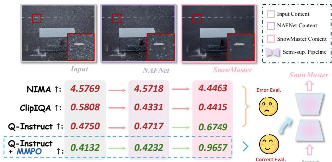
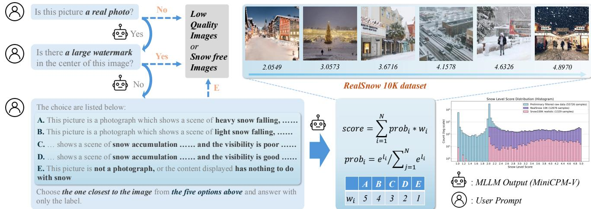
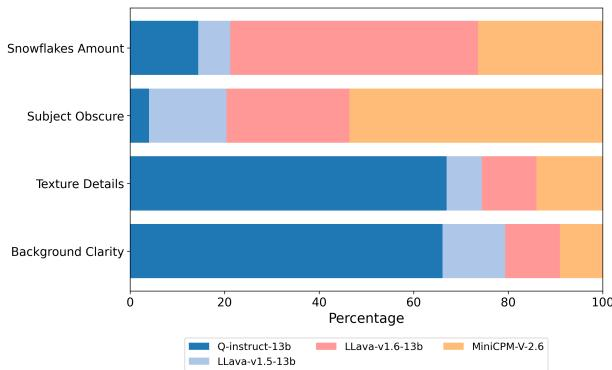
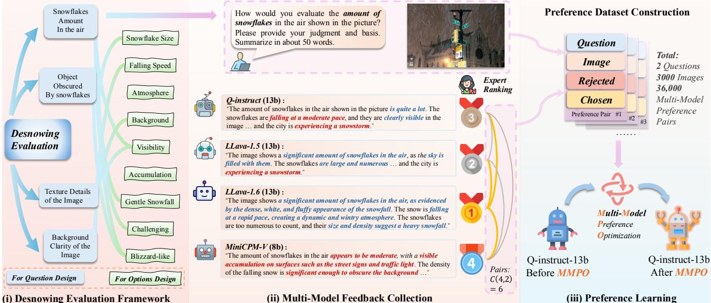
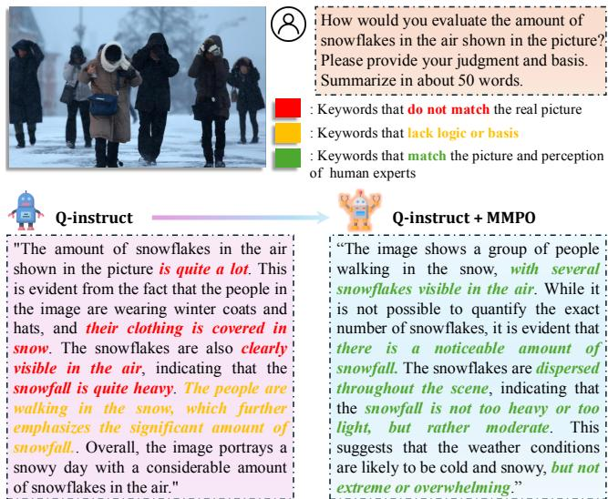
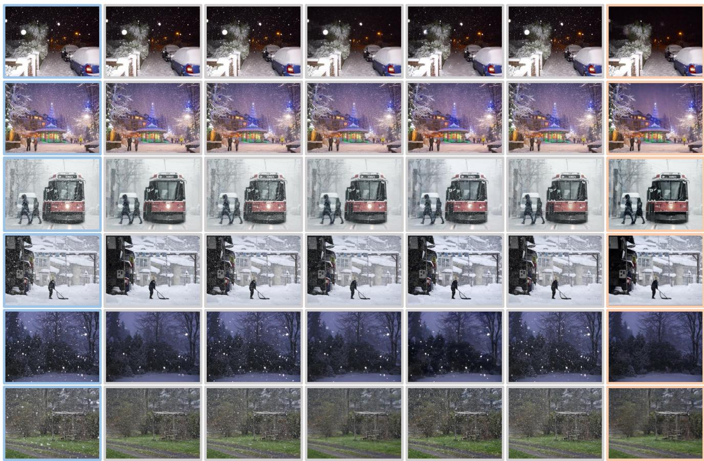

# SnowMaster: Comprehensive Real-world Image Desnowing via MLLM with Multi-Model Feedback Optimization

Jianyu Lai1,∗ Sixiang Chen1,\* Yunlong Lin2 Tian Ye1 Yun Liu3 Song Fei1 Zhaohu Xing1 Hongtao Wu1 Weiming Wang4 Lei Zhu1,5,† 1 The Hong Kong University of Science and Technology (GZ) 2 Xiamen University 3 Southwestern University 4 Hong Kong Metropolitan University 5 The Hong Kong University of Science and Technology Project page: https://alexlai2860.github.io/SnowMaster

## Abstract

Snowfall presents significant challengesfor visual data processing, necessitating specialized desnowing algorithms. However, existing models oftenfail to generalize effectively due to their heavy reliance on synthetic datasets. Furthermore, current real-world snowfall datasets are limited in scale and lack dedicated evaluation metrics designed specificallyfor snowfall degradation, thus hindering the effective integration ofreal snowy images into model training to reduce domain gaps. To address these challenges, wefirst introduce RealSnow10K, a large-scale, high-quality dataset consisting of over 10,000 annotated real-world snowy images. In addition, we curate a preference dataset comprising 36,000 expert-ranked image pairs, enabling the adaptation of multimodal large language models (MLLMs) to better perceive snowy image quality through our innovative Multi-Model Preference Optimization (MMPO). Finally, we propose the SnowMaster, which employs MMPO-enhanced MLLM to perform accurate snowy image evaluation and pseudo-label filtering for semi-supervised training. Experiments demonstrate that SnowMaster delivers superior desnowing performance under real-world conditions.

## 1. Introduction

Snowfall, a common form of adverse weather degradation, reduces image visibility and adversely impacts downstream tasks such as image recognition [2, 61] and segmentation [1, 51]. The inherent complexity of snow poses a challenge to conventional image restoration techniques, necessitating the development of specialized snow removal (desnowing) algorithms to enhance image clarity.

Although current snow removal models achieve impressive performance on benchmark datasets [7, 9, 12, 14, 16], they often struggle to generalize to real-world scenarios. This limitation stems primarily from their only reliance on synthetic snowfall datasets for training. These datasets, generated using simplified physical models, struggle to capture the intricate details of real-world snow degradations, resulting in a domain gap between synthetic and real data. This gap hinders model optimization and impairs generalization to real-world scenarios. Consequently, we pose the question: How can real-world data be effectively utilized to enhance the model’s generalization performance on realworld samples?

  
Figure 1. Comparison of various image desnowing evaluation metrics shows that Q-Instruct [47], enhanced by our MMPO, most accurately perceives differences in snow density between images. Leveraging accurate evaluation model, we optimize our semisupervised network, achieving superior desnowing performance.

Incorporating real-world snowy images into training is an direct and effective approach to enhance model generalization. However, accurate evaluation of these images is a prerequisite for their successful integration into the training process [4, 48, 50]. Yet, evaluating realistic snowfall images remains a significant challenge due to the absence of ground truth for reference evaluation, previous methods often rely on non-reference metrics [31, 32, 43, 57] to assess image restoration quality. These metrics, influenced by numerous factors, fail to accurately isolate and evaluate weather-specific degradation in snowfall images. In this paper, we claim that accurate assessment of snowy images requires a joint effort from both low-level visual and semantic perspectives. Recent advancements in multimodal large language models (MLLMs), such as Q-Instruct [50] and Depict-QA [58], offer promising avenues for developing evaluation frameworks due to their ability to assess lowlevel visual features from a semantic perspective. However, these models currently lack the specialized perception capabilities required to reliably evaluate snowfall-specific characteristics. Conversely, while some more advanced multimodal large language models exhibit better understanding of snowy scenes, they are not fine-tuned for detailed lowlevel visual evaluation, limiting the fundamental premise as powerful evaluators on the snow removal task.

To tackle these challenges, we first establish a comprehensive evaluation framework designed to capture the distinct characteristics of snow in natural images through multi-perspective feedback optimization tailored to snow scenes. To support this framework, we curate and annotate a dataset comprising over 10,000 real-world snow images sourced from the Internet. Additionally, while Direct Preference Optimization (DPO) [36] provides a strong foundation for preference-based learning, we observe that different models exhibit unique strengths across various evaluation perspectives, and assessing snowfall requires a multidimensional approach to ensure robust and reliable outcomes. Therefore, we introduce the Multi-Model Preference Optimization (MMPO) framework, integrating task-specific outputs from multiple multimodal large language models (MLLMs) to construct a snowfall preference dataset. This dataset enables the fine-tuning of Q-Instruct, significantly enhancing its ability to perceive and evaluate snowfall. Finally, we integrate the MMPO fine-tuned Q-Instruct model as an unsupervised evaluation metric to update the pseudolabel database and employ a mean teacher semi-supervised framework to train existing snow removal models, thereby improving their generalization performance in real-world scenarios. Our contributions can be summarized as follows:

• Real-World Snowfall Dataset: We introduce Real-Snow10K, a large-scale, high-quality dataset comprising over 10,000 annotated real-world snow scene images. To the best of our knowledge, this is the largest dataset of real-world image desnowing, providing a robust foundation for model training and evaluation.

• Snowfall Preference Dataset: From RealSnow10K, we select 1.5k real images and engage human experts to rank the outputs of multiple models based on preference. Utilizing these rankings, we construct a human preference dataset containing 36k preference pairs, designed to address two key evaluation questions.

• MMPO for Snowfall Evaluation: We employ Multi-Model Preference Optimization (MMPO) to enhance the perception capabilities of the MLLM on snowfall images. By leveraging carefully designed multiple-choice questions, this MLLM can be used to accurately evaluate the snow removal effect of images.

• Semi-Supervised Training Framework: We integrate the fine-tuned MLLMs into a mean teacher framework, enabling high-quality pseudo-label screening for semisupervised training. The results of SnowMaster exhibits strong generalization capabilities, achieving state-of-theart performance on real-world snowfall datasets.

## 2. Related Works

Single Image Desnowing. Snowflakes exhibit diverse sizes and shapes, complicating image restoration compared to other degradations [3, 8, 22–24, 26–28, 40, 49, 54]. Early methods, such as Pei et al. [34], relied on manual feature extraction but struggled in complex scenes. With deep learning advancements, More and more methods focus on snow removal tasks [6, 7, 10, 12, 14, 16, 17, 59]. Liu et al. [30] introduced DesnowNet, a multi-stage network addressing transparent and opaque snow blocks. Chen et al. [13] proposed HDCWNet, utilizing dual-tree complex wavelet transform (DTCWT) and conflicting channel loss (CC Loss) to enhance snow removal accuracy, though high-frequency information recognition remains challenging. Recent approaches integrate semantic and geometric information with Transformer architectures. Zhang et al. [59] developed DDMSNet, combining semantic segmentation and depth estimation for improved snow shape recognition. Cheng et al. [17] introduced SMGARN, using snow masks guided by self-pixel and cross-pixel attention. TransWeather [42], T3-DiffWeather [11] and other adverse weather restoration methods [15, 25, 33, 55, 56] also advance robustness in extreme weather conditions.

Multi-modality Large Language Models. Multimodal large language models (MLLMs) revolutionized computer vision by integrating visual and textual information. Models such as GPT-4o, MiniCPM-V [53], and LLava [29] excelled in high-level tasks like image description, visual question answering, and document understanding. However, their performance in low-level tasks, particularly image quality assessment (IQA), remained limited due to insufficient detail perception. Recent studies, such as Q-Instruct [50] and DepictQA [58], addressed this gap by incorporating low-level visual tasks into MLLM training datasets. These approaches leveraged human feedback on low-level features, such as clarity, brightness, and texture details, to improve IQA accuracy. Despite these advancements, MLLMs still struggled with weather-related degradations, as existing datasets were not fine-tuned for such conditions.

Score-based IQA Methods. Score-based IQA methods aim to assess image quality by assigning numerical scores that align with human perception. Traditional methods, such as SSIM [46] and PSNR, relied on statistical metrics to evaluate distortions or pixel-level differences. While effective in controlled environments, they often failed to capture the complexities of real-world images. Deep learning models, such as NIMA [41] and HyperIQA [39], improved performance by regressing directly to Mean Opinion Scores (MOS) derived from human ratings. However, these models faced challenges in out-of-distribution (OOD) generalization, as unseen distortions or diverse content types significantly impacted their accuracy. Recent advancements leveraged vision-language models like CLIP [35], with methods such as CLIP-IQA+ [45] and LIQE [60] utilizing visual-text alignment for few-shot and multitask learning. These approaches demonstrated enhanced robustness across datasets but did not fully capture human-perceived quality due to their reliance on visual-text similarity scores. To address these limitations, Large Multi-Modality Models (LMMs) like Q-Align [47] simulated human rating practices by using discrete text-defined rating levels (e.g., “excellent”, “poor”) and converted qualitative ratings into quantitative scores through probability-based averaging. This approach enhanced both accuracy and interpretability, particularly in OOD scenarios.

  
Figure 2. Dataset screening and evaluation. Through a multi-round dialogue mechanism, the multimodal large language model can replace humans to complete the quality screening and content evaluation of input images.

## 3. Dataset Construction

High-quality real data is the foundation of our approach. We propose RealSnow10K, the largest real snow dataset available. In this section, we describe the process of building the dataset, including image collection, image evaluation and classification, and the dataset preference process.

## 3.1. Image Collection, Evaluation and Classification

The first step in building a dataset is to collect images from various sources. We collect more than 100,000 snow scene images from the Internet and screen out over 10,000 highquality images. To ensure the high quality of the dataset, we need to screen and classify the collected images. Images collected from the Internet often have multiple interferences. In addition to the low quality caused by blur and noise in the image itself, it may also be irrelevant or deviate from the keywords we set, which is often difficult to reflec through existing indicators. To address the above problems, traditional dataset production uses manual screening. Although this method is accurate, it is too inefficient when facing a large number of images. To conduct fast and efficient review, we introduce multimodal large language models (MLLMs) with human visual perception capabilities as a reference for evaluating image quality and content.

We design a multi-round dialogue mechanism to screen out unqualified images and evaluate the content of the images. Specifically, the prompt words used in the first and second rounds of dialogue are set to “Is this picture a real photograph? Please answer with only ‘yes’ or ‘no’.” and “Does this image have a large and obvious watermark? Please answer with only ‘yes’ or ‘no’.”, respectively, to screen out synthetic images and low-quality images with large watermarks. The third and fourth rounds of dialogue are used to evaluate the content of the pictures. In the third round of dialogue, we use multiple-choice questions to let the model choose the accurate description of the number of snowflakes from five options. We obtain the logits of each option, calculate the option probability and score, and then distinguish the amount of snowflakes and snow accumulation in different pictures. For the specific dialogue process, please refer to Fig. 2. The fourth round of dialogue is the final classification of the topic of the image, and eight categories are set for MLLM to perform classification.

In the specific implementation, to balance evaluation quality and efficiency, we select the MiniCPM-V-2.6 model as the dataset evaluation model. Despite having only 8B parameters, this model demonstrates outstanding performance and provides a well-distributed scoring range. We partition the RealSnow10K dataset into three subsets: 1,500 images for MMPO fine-tuning, 1,047 images for testing, and 6,406 images for semi-supervised training. Detailed category statistics are provided in the supplementary materials.

  
Figure 3. Performance comparison of different MLLMs for different indicators. The horizontal axis in the figure represents the rank-1 proportion of different MLLMs on different snowfall evaluation indicators.

## 3.2. Preference Dataset Construction Pipeline

To perform multi-model preference optimization (MMPO) on the multimodal large language model, We first use the pre-trained snow removal model to perform preliminary snow removal on 1,500 images and expand the dataset to 3,000 images. We select two indicators with poor performance of Q-instruct from the four indicators for evaluating snowfall: snowflake volume and snowflake occlusion, and design targeted questions for each. Subsequently, we collect the outputs of four MLLMs for these two problems, including Q-instruct-13b, LLava-1.5-13b, LLava-1.6-13b, and MiniCPM-V-2.6. Image evaluation experts rank the outputs of the four models one by one and generate six preference pairs from a ranking. Therefore, for each preference problem, we obtain a preference dataset with a sample size of 18,000.

## 4. Method

## 4.1. Evaluation of Snowy Images

Since there is no reference for real snowfall images, the first task for real scene snow removal tasks is to select an accurate and reliable snowfall image evaluation standard. The size, distribution and shape of snowfall particles in the image are often affected by multiple factors including shooting equipment, wind speed, distance, etc., which also brings challenges to the evaluation of snowfall image quality. Traditional non-reference [39, 41] obviously cannot distinguish different forms of snowfall, nor can they accurately describe the interference of snowfall on the image.

Recently, the development of multimodal large language models has provided a possible solution for snowfall image evaluation. Multimodal large language models are trained on a large number of images and have close to human visual capabilities. Some works [45, 47, 60] introduced CLIP or multimodal large models into image quality assessment tasks (IQA) and obtained good results. Inspired by these works, we try to introduce multimodal large language models into the field of image snow removal. However, there is currently no work exploring the performance of multimodal large language models in evaluating the degradation of snowfall images. Some works [52] use multimodal large language models from a single dimension to evaluate the quality of severe weather images, which is one-sided and unreliable.

In this work, we first establish a detailed framework for evaluating snowing images. By analyzing a large dataset of real snow images, we propose assessing snow image quality across four dimensions: snowflake amount, object obscurity, texture detail, and background clarity. The evaluation framework appears in Fig.4 (i). We select three widely used multimodal large language models and one model, Q-Instruct [47], fine-tuned for low-level visual features. These models analyze real snow images along the four dimensions, and experts evaluate their outputs. A sample output is presented in Fig.4 (ii).

Unfortunately, no model can fully dominate in all four dimensions: based on LLava1.5-13b, Q-instruct, which has been fine-tuned with underlying visual features, has shown obvious advantages in texture detail and background clarity, which is consistent with our expectations. However, in terms of the two indicators of snowflake amount and object obscure for snowflake description, the best performing models are LLava1.6-13b and MiniCPM-V-2.6, which firmly occupy the first and second positions, while q-instruct-13b is relatively backward. The specific rank-1 ratios of different models are shown in Fig.3.

## 4.2. Improving Snowfall Perception via Multi-Model Feedback Optimization

For complex image desnowing task, evaluating performance from multiple perspectives is a prerequisite for achieving satisfactory results. However, as outlined in the previous section, a single multimodal large language model cannot deliver accurate evaluations across all assessment dimensions. At the same time, employing multiple models concurrently for evaluation is computationally infeasible due to excessive resource demands. This leads us to a key question: is it possible to use a single model to simultaneously address the evaluation of multiple perspectives in desnowing tasks?

Fortunately, Q-Instruct [47] model has already undergone targeted fine-tuning on a large-scale dataset, equipping it with the ability to assess fundamental image quality metrics, such as clarity and contrast. Building on this foundation, and inspired by recent advancements in reinforcement learning [18, 36–38], we propose enhancing Q-Instruct through human feedback optimization. Our goal is to enable Q-Instruct to accurately evaluate snowfall, while retaining its capability to assess essential image quality

  
Figure 4. Schematic diagram of the whole process of snowfall image evaluation optimization. The evaluation framework first divides snowfall into four indicators for evaluation, and for each indicator, collects the evaluation answers of multiple multimodal large language models to the image as the data source for preference learning. Finally, direct preference optimization is applied to Q-instruct to improve its output for this indicator. The figure takes the snowflake amount indicator as an example.

Specifically, to address the challenge that different models exhibit distinct strengths and weaknesses across various perspectives, we introduce a novel multi-model preference optimization (MMPO) technique. Unlike conventional approaches, MMPO constructs preference pairs by harnessing the outputs of multiple models, enabling a more comprehensive capture of diverse evaluation criteria. While drawing inspiration from the loss function of Direct Preference Optimization (DPO) [36], MMPO innovatively extends this framework to incorporate the collective strengths of multiple models into a single, cohesive Q-Instruct model. Consequently, the resulting Q-Instruct model excels at thoroughly assessing desnowing performance while preserving its capability to evaluate critical image quality metrics.

Reward Function Reparameterization. In DPO, The reward associated with a response y given context x is reparameterized in terms of the model’s policy $\pi _ { \boldsymbol { \theta } } ( y | \boldsymbol { x } )$ and a reference policy $\pi _ { \mathrm { r e f } } ( y | x )$ , formulated as:

$$
\boldsymbol { r } ( x , y ) = \beta \log \frac { \pi _ { \theta } ( y | x ) } { \pi _ { \mathrm { r e f } } ( y | x ) } + \beta \log Z ( x ) ,\tag{1}
$$

where $\beta$ is a scaling constant and $Z ( x )$ is a partition function to normalize the policy distribution. Through this reparameterization, DPO completes preference optimization without explicitly defining a reward model, simplifying the complex reinforcement learning problem into a classification-based optimization problem. Our proposed MMPO also adopts this reparameterization technique to streamline the formulation of preference optimization.

Multi-Model Feedback Collection. To construct a robust preference dataset, a multi-model feedback collection strategy is employed. For a given input context x, responses $\left\{ y _ { 1 } , y _ { 2 } , \ldots , y _ { N } \right\}$ are collected from N distinct multimodal large language models. These responses are subsequently evaluated and ranked by human experts, yielding a preference ordering $y _ { ( 1 ) } \succ y _ { ( 2 ) } \succ \dots \vdash y _ { ( N ) }$ , where $y _ { ( 1 ) }$ denotes the most preferred response and $y _ { ( N ) }$ the least preferred. From this ordering, preference pairs $( y _ { w } , y _ { l } )$ are generated such that $y _ { w } \succ y _ { l }$ , forming the dataset:

$$
\left\{ ( x , y _ { w } , y _ { l } ) \ : | \ : y _ { w } \succ y _ { l } , y _ { w } , y _ { l } \in \left\{ y _ { 1 } , y _ { 2 } , \dotsc , y _ { N } \right\} \right\} .\tag{2}
$$

This methodology harnesses the diverse capabilities of multiple models to produce a comprehensive set of preference pairs, thereby enhancing the differentiation between superior and inferior responses.

Multi-Model Preference Optimization. Building upon the framework of Direct Preference Optimization $( \mathrm { D P O } ) .$ Multi-Model Preference Optimization (MMPO) is introduced. The loss function is expressed as:

$$
\begin{array} { r l } { L _ { \mathrm { M M P O } } ( \pi _ { \theta } ; \pi _ { \mathrm { r e f } } ) = - \mathbb { E } _ { ( x , y _ { w } , y _ { l } ) \sim D } } & { } \\ { [ \log \sigma ( \beta \log \frac { \pi _ { \theta } ( y _ { w } | x ) } { \pi _ { \mathrm { r e f } } ( y _ { w } | x ) }  } & { - \beta \log \frac { \pi _ { \theta } ( y _ { l } | x ) } { \pi _ { \mathrm { r e f } } ( y _ { l } | x ) } ) ] , } \end{array}\tag{3}
$$

where $\sigma ( \cdot )$ represents the sigmoid function, and $y _ { w }$ and $y _ { l }$ denote the preferred and unpreferred responses, respectively. A distinguishing feature of MMPO is its reliance on a preference dataset D derived from the outputs of multiple models, as outlined in the feedback collection process. This approach integrates the strengths of various MLLMs, allowing the model to leverage a richer collection of preference pairs. Through this optimization, the model’s outputs are aligned with human expert preferences, thereby improving its capacity to generate high-quality responses.

## 4.3. From Perception to Restoration

Using MMPO technology, we use Q-instruct as the base model and fine-tune its preference learning in two aspects where its performance was relatively poor: snowflake amount and object obscure, improving its ability to perceive and understand snowfall. However, how can the improvement in perception be used to optimize the image restoration model?

Inspired by Q-Align [47], we leverage the enhanced perception capabilities of the large model to generate an “image score” that could quantify this improvement. We then use this image score as an evaluation metric within a mean teacher semi-supervised learning framework, combined with a pseudo-label database, to train the image restoration model.

Score calculation. Using one adjective like Q-Align (e.g. “excellent”, “poor”) to describe the snowfall scene directly does not provide an accurate evaluation. We analyze that this is because a single adjective lacks a specific definition. Therefore, we further decompose the prompt words, describe the four indicators such as the number of snowflakes from different perspectives, and design it into a multiple choice question with five options. Based on the calculation method of human subjective opinion score (MOS):

$$
\mathrm { M O S } = \frac { 1 } { N } \sum _ { i = 1 } ^ { N } S _ { i } ,\tag{4}
$$

in which $S _ { i }$ represents the score of the i-th tester. We collect the model’s output logit for the five option tokens, use softmax to calculate the probability of different tokens, and finally get the score through weighted average:

$$
\mathrm { S c o r e } = \frac { 1 } { N } \sum _ { i = 1 } ^ { N } p _ { i } \cdot v _ { i } ,\tag{5}
$$

$$
p _ { i } = \frac { e ^ { l _ { i } } } { \sum _ { j = 1 } ^ { N } e ^ { l _ { j } } } ,\tag{6}
$$

where $l _ { i }$ represents the logit value of the i-th option token. N is 5 to correspond to 5 options. vi is converted into weights from 1 to 5 according to the description of snowfall intensity.

Semi-supervised Training with Pseudo-labeling. Referring to the mean teacher framework and the database mechanism in [36], we leverage scores from four evaluation metrics to enhance semi-supervised training. To ensure the pseudo-label database is updated accurately, we adopt a stringent rule: an update occurs only if (i) at least three teacher scores exceed the student score, and (ii) the teacher score surpasses the current score stored in the pseudo-label database. This dual-condition approach effectively minimizes erroneous updates to the pseudo-labels, improving the reliability of the training process.

  
Figure 5. Comparison of perception ability before and after MMPO. The fine-tuned model output is more in line with human visual perception, more logical, and less hallucinatory.

Loss function and training strategy. We use both supervised loss and pseudo-label loss to train the model. The supervised loss is based on the PSNR between the model’s output and the reference images from the Snow100K [30] dataset. And the pseudo-label loss relies on the L1 norm to measure the difference between the output and pseudolabels. To ensure fast and stable training, we only use supervised loss in the initial 20k steps, and add pseudo-label loss after 20k steps for semi-supervised training. The total loss function is shown as follows:

$$
\mathcal { L } _ { \mathrm { t o t a l } } = \mathcal { L } _ { \mathrm { s u p e r v i s e d } } + \lambda \mathcal { L } _ { \mathrm { p s e u d o } } ( \lambda = 0 \mathrm { i f ~ s t e p < 2 0 k } ) .\tag{7}
$$

## 5. Experiments

## 5.1. Experiment Setup

Training Settings. Our method consists of two phases: the first phase is to fine-tune the scoring model (i.e. Q-Instruct [50]) via proposed MMPO, and the second phase is to semi-supervised train the snow removal model. In the first phase, we set epoch = 1, lr = 1e-6, batchsize = 64; We use Vision-LLM Alignemnt framework [44] to perform MMPO fine-tuning and enable deepspeed for acceleration, set zero-stage to 3 and enable offload for full fine-tuning. In the second phase of snow removal model training, we use NAFNet [5] as the base model, set lr = 2e-4, batchsize = 32. All experiments are performed on two Nvidia A800 GPUs.

(a) Input  
  
(b) NAFNet  
(c) T3-Diff  
(d) TransWeather  
(e) SMGARN  
(f) Snowformer  
(g) SnowMaster  
Figure 6. Visual comparison of different models for snow removal on real images. Please zoom in for a better view. SnowMaster achieves satisfactory snow removal performance in complicated conditions compared to previous methods.

Table 1. The accuracy of MLLMs on different perspectives.
<table><tr><td rowspan="2">MLLMs Accuracy</td><td colspan="2">Snowflakes acc</td><td colspan="2">Quality acc</td></tr><tr><td></td><td>amount ↑ obscure ↑</td><td>texture ↑ background ↑</td><td></td></tr><tr><td>LLava-v1.5-13b[29]</td><td>80.04</td><td>77.17</td><td>55.78</td><td>52.15</td></tr><tr><td>LLava-v1.6-13b[29]</td><td>86.34</td><td>79.56</td><td>52.05</td><td>54.06</td></tr><tr><td>MiniCPM-V[53]</td><td>75.45</td><td>70.04</td><td>42.02</td><td>49.76</td></tr><tr><td>Q-intruct-13b[50]</td><td>76.31</td><td>73.26</td><td>58.36</td><td>63.42</td></tr><tr><td>Q-instruct with MMPO (ours)</td><td>82.14</td><td>80.90</td><td>64.95</td><td>68.58</td></tr><tr><td>MMPO improvement</td><td>+5.83</td><td>+7.64</td><td>+6.59</td><td>+5.16</td></tr></table>

Experimental Details. In the semi-supervised training process, considering the need to make the multimodal large language model output the correct score, we adopt a pseudo-label database initialization strategy using the original image instead of all-0 initialization in [21]. In the test phase, we test 457 test images selected from the real snow scene dataset (RealSnow10K) and 1329 real snow scene images from Snow100K [30].

## 5.2. Evaluation Metrics and Baselines

Following [19, 20], we utilize four non-reference IQA metrics: BRISQUE [31], NIQE [32], PIQE [43], and PAQ2-PIQ [57]. BRISQUE measures quality via spatial natural scene statistics, NIQE assesses deviations from these statistics, PIQE detects block-level distortions, and PAQ2-PIQ, a deep learning approach, predicts global and local quality. These metrics ensure a comprehensive, unsupervised evaluation of diverse distortions. For the baselines, we choose CNN-based models (SMGARN[17], NAFNet[5]), Transformer-based models (Transweather[42], Snowformer[6]) and a diffusion based model (T3-DiffWeather[11]), offering varied references for snowfall image restoration performance.

## 5.3. Results and Analysis

## 5.3.1. Quantitative Results

Effectiveness of MMPO. Table 1 illustrates the performance enhancements of the Q-Instruct [47] model following fine-tuning with MMPO. We utilize NAFNet [5], pretrained for 100,000 steps, as the snow removal model to process the images in the test set, generating a dataset that includes both original and snow-removed images. By inputting these images individually into Q-Instruct, we obtain scores for each image corresponding to specific indicators. Consequently, for each indicator, accuracy is defined as the proportion of snow-removed images whose score is not lower than that of their corresponding original images. The results show that the performance after fine-tuning has been significantly improved which is consistent with our expectations. It is worth noting that in terms of the number of snowflakes, the accuracy after fine-tuning does not exceed that of LLava-1.6. We think this is normal, because the preference data in fine-tuning are all output by these models, and MMPO guides the model to move closer to human preference output, but it may not necessarily surpass the output of the optimal model.

Table 2. Comparison of non-reference metrics after snow removal between different models.
<table><tr><td rowspan="2">Method</td><td colspan="4">Snow100K-realistic [30]</td><td colspan="4">RealSnow10K</td></tr><tr><td>BRISQUE↓</td><td>NIQE↓</td><td>PIQE↓</td><td>PAQ2-PIQ ↑</td><td>BRISQUE↓</td><td>NIQE↓</td><td>PIQE↓</td><td>PAQ2-PIQ ↑</td></tr><tr><td>SMGARN[TCSVT&#x27;22][17]</td><td>19.289</td><td>3.132</td><td>31.927</td><td>69.767</td><td>23.005</td><td>3.580</td><td>31.210</td><td>68.919</td></tr><tr><td>TransWeather[CVPR&#x27;22] [42]</td><td>16.544</td><td>3.025</td><td>30.302</td><td>69.821</td><td>18.564</td><td>3.404</td><td>29.772</td><td>69.671</td></tr><tr><td>NAFNet[ECCV&#x27;22] [5]</td><td>17.566</td><td>2.903</td><td>30.843</td><td>69.951</td><td>20.425</td><td>3.291</td><td>29.877</td><td>69.388</td></tr><tr><td>SnowFormer[Arxiv&#x27;23][6]</td><td>19.389</td><td>2.954</td><td>31.902</td><td>70.015</td><td>23.702</td><td>3.429</td><td>31.99</td><td>69.929</td></tr><tr><td>T3-DiffWeather[ECCV&#x27;24] [11]</td><td>17.744</td><td>2.868</td><td>31.689</td><td>70.042</td><td>20.211</td><td>3.137</td><td>32.991</td><td>70.211</td></tr><tr><td>★ SnowMaster (Ours)</td><td>16.305</td><td>2.797</td><td>30.162</td><td>70.042</td><td>17.546</td><td>3.058</td><td>29.742</td><td>70.304</td></tr></table>

Furthermore, a noteworthy observation emerges: the indicators ‘texture’ and ‘background’, which are not explicitly targeted for optimization, also exhibit moderate improvements. We hypothesize that this phenomenon arises from a comprehensive augmentation of the model’s perceptual capacity regarding snowfall, facilitated by the MMPO fine-tuning process.

Performance analysis of the restoration model. Table 2 presents the performance comparison between our method and other advanced snow removal models. Our proposed method achieves the best results in most indicators.

## 5.3.2. Qualitative Assessment

From the restoration results of the real snowfall image in Fig.6, we can see that the SnowMaster model we proposed has the best performance in multiple scenarios. When facing snowflakes illuminated by lights at night, other models cannot effectively complete the restoration of high-brightness snowflakes, while SnowMaster significantly eliminates the high-brightness snowflakes in the image. When restoring dense snowflake scenes during the day, SnowMaster can effectively remove snowflakes of different scales and retain the original color and texture of the object, while other models have poor restoration effects on smallsized snowflake particles.

## 5.4. Ablation Study

Necessity of MMPO. The Q-Instruct model shows significant improvement after multi-modal preference optimization, particularly in evaluating snowfall images. We perform an ablation test to compare the Q-Instruct model before and after alignment when used as a scoring model in semi-supervised training. The results indicate that the aligned model achieves higher accuracy and ensures more stable training to improve the performance.

Table 3. Ablation on different settings of the proposed framework.
<table><tr><td>Method</td><td>BRISQUE↓</td><td>NIQE↓</td></tr><tr><td>w/o. Semi-supervised learning</td><td>22.52</td><td>3.33</td></tr><tr><td>w/o. MLLM</td><td>20.36</td><td>3.25</td></tr><tr><td>w/o. MMPO</td><td>18.98</td><td>3.19</td></tr><tr><td>w. Single-angle evaluation</td><td>18.21</td><td>3.12</td></tr><tr><td>w. Multi-angle evalutaion (Ours)</td><td>17.55</td><td>3.06</td></tr></table>

Effectiveness of multi-perspectives snowfall evaluation. Our method enhances image screening reliability by evaluating snowfall images from four perspectives, ensuring steady updates to the pseudo-label database. Ablation experiments, conducted by reducing evaluation angles, demonstrate that multi-angle evaluation improves training effectiveness

The role of the semi-supervised learning framework. In order to transfer the improvement of the evaluation performance of the large model on snow scene images to the improvement of the restoration model, we use the mean teacher semi-supervised learning framework. By combining the supervision loss from snow100k and the pseudolabel loss from the real training data, this framework can effectively optimize the restoration effect of real snowfall images. Through ablation experiments, we prove that the semi-supervised framework is the basis of our method.

The specific metrics of the ablation experiments are shown in Table 3.

## 6. Conclusion

SnowMaster integrates a multimodal large language model with a multi-perspective evaluation framework for image desnowing. Leveraging the RealSnow10k dataset, it utilizes a multi-angle evaluation system assessing four key metrics to enhance real-world reliability. Through multimodal preference optimization and semi-supervised training with pseudo-label updates from multi-angle multiplechoice questions, it ensures effective refinement. Experiments confirm its robustness in complex snowfall scenarios, though its computational intensity from multiple evaluations signals a need for future enhancements in training efficiency and resource use.

## Acknowledgments

This work is supported by the Guangzhou-HKUST(GZ) Joint Funding Program (No. 2023A03J0671), the Guangzhou Municipal Science and Technology Project (Grant No. 2024A04J4230), and Guangzhou-HKUST(GZ) Joint Funding Program (No. 2024A03J0618).

## References

[1] Vijay Badrinarayanan, Alex Kendall, and Roberto Cipolla. Segnet: A deep convolutional encoder-decoder architecture for image segmentation. IEEE transactions on pattern analysis and machine intelligence, 39(12):2481–2495, 2017. 1

[2] Chun-Fu Richard Chen, Quanfu Fan, and Rameswar Panda. Crossvit: Cross-attention multi-scale vision transformer for image classification. In Proceedings of the IEEE/CVF International Conference on Computer Vision, pages 357– 366, 2021. 1

[3] Haoyu Chen, Jinjin Gu, Yihao Liu, Salma Abdel Magid, Chao Dong, Qiong Wang, Hanspeter Pfister, and Lei Zhu. Masked image training for generalizable deep image denoising. In Proceedings of the IEEE/CVF Conference on Computer Vision and Pattern Recognition, pages 1692– 1703, 2023. 2

[4] Haoyu Chen, Wenbo Li, Jinjin Gu, Jingjing Ren, Haoze Sun, Xueyi Zou, Zhensong Zhang, Youliang Yan, and Lei Zhu. Low-res leads the way: Improving generalization for superresolution by self-supervised learning. In Proceedings of the IEEE/CVF Conference on Computer Vision and Pattern Recognition, pages 25857–25867, 2024. 1

[5] Liangyu Chen, Xiaojie Chu, Xiangyu Zhang, and Jian Sun. Simple baselines for image restoration. In European conference on computer vision, pages 17–33. Springer, 2022. 6, 7, 8

[6] Sixiang Chen, Tian Ye, Yun Liu, and Erkang Chen. Snowformer: Context interaction transformer with scaleawareness for single image desnowing. arXiv preprint arXiv:2208.09703, 2022. 2, 7, 8

[7] Sixiang Chen, Tian Ye, Yun Liu, Taodong Liao, Yi Ye, and Erkang Chen. Msp-former: Multi-scale projection transformer for single image desnowing. arXiv preprint arXiv:2207.05621, 2022. 1, 2

[8] Sixiang Chen, Tian Ye, Jinbin Bai, Erkang Chen, Jun Shi, and Lei Zhu. Sparse sampling transformer with uncertaintydriven ranking for unified removal of raindrops and rain streaks. In Proceedings of the IEEE/CVF International Conference on Computer Vision, pages 13106–13117, 2023. 2

[9] Sixiang Chen, Tian Ye, Yun Liu, Jinbin Bai, Haoyu Chen, Yunlong Lin, Jun Shi, and Erkang Chen. Cplformer: Crossscale prototype learning transformer for image snow removal. In Proceedings of the 31st ACM international conference on multimedia, pages 4228–4239, 2023. 1

[10] Sixiang Chen, Tian Ye, Chenghao Xue, Haoyu Chen, Yun Liu, Erkang Chen, and Lei Zhu. Uncertainty-driven dynamic

degradation perceiving and background modeling for effi cient single image desnowing. In Proceedings of the 31st ACM International Conference on Multimedia, pages 4269– 4280, 2023. 2

[11] Sixiang Chen, Tian Ye, Kai Zhang, Zhaohu Xing, Yunlong Lin, and Lei Zhu. Teaching tailored to talent: Adverse weather restoration via prompt pool and depth-anything con straint. In European Conference on Computer Vision, pages 95–115. Springer, 2025. 2, 7, 8

[12] Wei-Ting Chen, Hao-Yu Fang, Jian-Jiun Ding, Cheng-Che Tsai, and Sy-Yen Kuo. Jstasr: Joint size and transparencyaware snow removal algorithm based on modified partial convolution and veiling effect removal. In Computer Vision–ECCV 2020: 16th European Conference, Glasgow, UK, August 23–28, 2020, Proceedings, Part XXI 16, pages 754–770. Springer, 2020. 1, 2

[13] Wei-Ting Chen, Hao-Yu Fang, Cheng-Lin Hsieh, Cheng-Che Tsai, I Chen, Jian-Jiun Ding, Sy-Yen Kuo, et al. All snow removed: Single image desnowing algorithm using hierarchical dual-tree complex wavelet representation and contradict channel loss. In Proceedings of the IEEE/CVF International Conference on Computer Vision, pages 4196–4205, 2021. 2

[14] Wei-Ting Chen, Hao-Yu Fang, Cheng-Lin Hsieh, Cheng-Che Tsai, I Chen, Jian-Jiun Ding, Sy-Yen Kuo, et al. All snow removed: Single image desnowing algorithm using hierarchi cal dual-tree complex wavelet representation and contradict channel loss. In Proceedings of the IEEE/CVF International Conference on Computer Vision, pages 4196–4205, 2021. 1, 2

[15] Wei-Ting Chen, Zhi-Kai Huang, Cheng-Che Tsai, Hao-Hsiang Yang, Jian-Jiun Ding, and Sy-Yen Kuo. Learning multiple adverse weather removal via two-stage knowledge learning and multi-contrastive regularization: Toward a unified model. In Proceedings of the IEEE/CVF Conference on Computer Vision and Pattern Recognition, pages 17653– 17662, 2022. 2

[16] Bodong Cheng, Juncheng Li, Ying Chen, Shuyi Zhang, and Tieyong Zeng. Snow mask guided adaptive residual network for image snow removal. arXiv preprint arXiv:2207.04754, 2022. 1, 2

[17] Bodong Cheng, Juncheng Li, Ying Chen, and Tieyong Zeng. Snow mask guided adaptive residual network for image snow removal. Computer Vision and Image Understanding, 236: 103819, 2023. 2, 7, 8

[18] Paul F Christiano, Jan Leike, Tom Brown, Miljan Martic, Shane Legg, and Dario Amodei. Deep reinforcement learning from human preferences. Advances in neural information processing systems, 30, 2017. 4

[19] Jinjin Gu, Haoming Cai, Haoyu Chen, Xiaoxing Ye, Jimmy Ren, and Chao Dong. Image quality assessment for percep tual image restoration: A new dataset, benchmark and met ric. arXiv preprint arXiv:2011.15002, 2020. 7

[20] Jinjin Gu, Haoming Cai, Haoyu Chen, Xiaoxing Ye, Jimmy Ren, and Chao Dong. Pipal: a large-scale image quality assessment dataset for perceptual image restoration. In European Conference on Computer Vision, pages 633–651. Springer, 2020. 7

[21] Shirui Huang, Keyan Wang, Huan Liu, Jun Chen, and Yunsong Li. Contrastive semi-supervised learning for underwater image restoration via reliable bank. In Proceedings of the IEEE/CVF conference on computer vision and pattern recognition, pages 18145–18155, 2023. 7

[22] Yeying Jin, Wending Yan, Wenhan Yang, and Robby T Tan. Structure representation network and uncertainty feedback learning for dense non-uniform fog removal. In Asian Conference on Computer Vision, pages 155–172. Springer, 2022. 2

[23] Yeying Jin, Wenhan Yang, Wei Ye, Yuan Yuan, and Robby T Tan. Shadowdiffusion: Diffusion-based shadow removal using classifier-driven attention and structure preservation. arXiv preprint arXiv:2211.08089, 2022.

[24] Yeying Jin, Beibei Lin, Wending Yan, Wei Ye, Yuan Yuan, and Robby T. Tan. Enhancing visibility in nighttime haze images using guided apsf and gradient adaptive convolution, 2023. 2

[25] Ruoteng Li, Robby T Tan, and Loong-Fah Cheong. All in one bad weather removal using architectural search. In Proceedings of the IEEE/CVF Conference on Computer Vision and Pattern Recognition, pages 3175–3185, 2020. 2

[26] Yunlong Lin, Zhenqi Fu, Ge Meng, Yingying Wang, Yuhang Dong, Linyu Fan, Hedeng Yu, and Xinghao Ding. Domainirrelevant feature learning for generalizable pan-sharpening. In Proceedings of the 31st ACM International Conference on Multimedia, pages 3287–3296, 2023. 2

[27] Yunlong Lin, Zhenqi Fu, Kairun Wen, Tian Ye, Sixiang Chen, Ge Meng, Yingying Wang, Yue Huang, Xiaotong Tu, and Xinghao Ding. Unsupervised low-light image enhancement with lookup tables and diffusion priors. arXiv preprint arXiv:2409.18899, 2024.

[28] Yunlong Lin, Tian Ye, Sixiang Chen, Zhenqi Fu, Yingying Wang, Wenhao Chai, Zhaohu Xing, Lei Zhu, and Xinghao Ding. Aglldiff: Guiding diffusion models towards unsupervised training-free real-world low-light image enhancement. arXiv preprint arXiv:2407.14900, 2024. 2

[29] Haotian Liu, Chunyuan Li, Yuheng Li, and Yong Jae Lee. Improved baselines with visual instruction tuning. In Proceedings of the IEEE/CVF Conference on Computer Vision and Pattern Recognition, pages 26296–26306, 2024. 2, 7

[30] Yun-Fu Liu, Da-Wei Jaw, Shih-Chia Huang, and Jenq-Neng Hwang. Desnownet: Context-aware deep network for snow removal. IEEE Transactions on Image Processing, 27(6): 3064–3073, 2018. 2, 6, 7, 8

[31] Anish Mittal, Anush Krishna Moorthy, and Alan Conrad Bovik. No-reference image quality assessment in the spatial domain. IEEE Transactions on image processing, 21(12): 4695–4708, 2012. 1, 7

[32] Anish Mittal, Rajiv Soundararajan, and Alan C Bovik. Making a “completely blind” image quality analyzer. IEEE Signal processing letters, 20(3):209–212, 2012. 1, 7

[33] Ozan Ozdenizci and Robert Legenstein. Restoring vision in¨ adverse weather conditions with patch-based denoising diffusion models. IEEE Transactions on Pattern Analysis and Machine Intelligence, 2023. 2

[34] Soo-Chang Pei, Yu-Tai Tsai, and Chen-Yu Lee. Removing rain and snow in a single image using saturation and visibility features. In 2014 IEEE International Conference on Multimedia and Expo Workshops (ICMEW), pages 1–6. IEEE, 2014. 2

[35] Alec Radford, Jong Wook Kim, Chris Hallacy, Aditya Ramesh, Gabriel Goh, Sandhini Agarwal, Girish Sastry, Amanda Askell, Pamela Mishkin, Jack Clark, et al. Learning transferable visual models from natural language supervision. In International conference on machine learning, pages 8748–8763. PMLR, 2021. 3

[36] Rafael Rafailov, Archit Sharma, Eric Mitchell, Christopher D Manning, Stefano Ermon, and Chelsea Finn. Direct preference optimization: Your language model is secretly a reward model. Advances in Neural Information Processing Systems, 36, 2024. 2, 4, 5, 6

[37] John Schulman, Sergey Levine, Pieter Abbeel, Michael Jordan, and Philipp Moritz. Trust region policy optimization. In International conference on machine learning, pages 1889– 1897. PMLR, 2015.

[38] John Schulman, Filip Wolski, Prafulla Dhariwal, Alec Rad ford, and Oleg Klimov. Proximal policy optimization algo rithms. arXiv preprint arXiv:1707.06347, 2017. 4

[39] Shaolin Su, Qingsen Yan, Yu Zhu, Cheng Zhang, Xin Ge, Jinqiu Sun, and Yanning Zhang. Blindly assess image qual ity in the wild guided by a self-adaptive hyper network. In Proceedings of the IEEE/CVF conference on computer vision and pattern recognition, pages 3667–3676, 2020. 3, 4

[40] Haoze Sun, Wenbo Li, Jianzhuang Liu, Haoyu Chen, Ren jing Pei, Xueyi Zou, Youliang Yan, and Yujiu Yang. Coser: Bridging image and language for cognitive super-resolution. In Proceedings of the IEEE/CVF Conference on Computer Vision and Pattern Recognition, pages 25868–25878, 2024. 2

[41] Hossein Talebi and Peyman Milanfar. Nima: Neural image assessment. IEEE transactions on image processing, 27(8): 3998–4011, 2018. 3, 4

[42] Jeya Maria Jose Valanarasu, Rajeev Yasarla, and Vishal M Patel. Transweather: Transformer-based restoration of images degraded by adverse weather conditions. In Proceedings of the IEEE/CVF Conference on Computer Vision and Pattern Recognition, pages 2353–2363, 2022. 2, 7, 8

[43] Narasimhan Venkatanath, D Praneeth, Maruthi Chandrasekhar Bh, Sumohana S Channappayya, and Swarup S Medasani. Blind image quality evaluation using perception based features. In 2015 twenty first national conference on communications (NCC), pages 1–6. IEEE, 2015. 1, 7

[44] Chenglong Wang, Yang Gan, Yifu Huo, Yongyu Mu, Murun Yang, Qiaozhi He, Tong Xiao, Chunliang Zhang, Tongran Liu, Quan Du, Di Yang, and Jingbo Zhu. Rovrm: A robust visual reward model optimized via auxiliary textual prefer ence data, 2024. 6

[45] Jianyi Wang, Kelvin CK Chan, and Chen Change Loy. Exploring clip for assessing the look and feel of im ages. In Proceedings of the AAAI Conference on Artificial Intelligence, pages 2555–2563, 2023. 3, 4

[46] Zhou Wang, Alan C Bovik, Hamid R Sheikh, and Eero P Simoncelli. Image quality assessment: from error visibility to structural similarity. IEEE transactions on image processing, 13(4):600–612, 2004. 3

[47] Haoning Wu, Zicheng Zhang, Weixia Zhang, Chaofeng Chen, Liang Liao, Chunyi Li, Yixuan Gao, Annan Wang, Erli Zhang, Wenxiu Sun, et al. Q-align: Teaching lmms for visual scoring via discrete text-defined levels. arXiv preprint arXiv:2312.17090, 2023. 1, 3, 4, 6, 7

[48] Hongtao Wu, Yijun Yang, Angelica I Aviles-Rivero, Jingjing Ren, Sixiang Chen, Haoyu Chen, and Lei Zhu. Semisupervised video desnowing network via temporal decou pling experts and distribution-driven contrastive regularization. In European Conference on Computer Vision, pages 70–89. Springer, 2024. 1

[49] Hongtao Wu, Yijun Yang, Huihui Xu, Weiming Wang, Jinni Zhou, and Lei Zhu. Rainmamba: Enhanced locality learning with state space models for video deraining. In Proceedings of the 32nd ACM International Conference on Multimedia, pages 7881–7890, 2024. 2

[50] Haoning Wu, Zicheng Zhang, Erli Zhang, Chaofeng Chen, Liang Liao, Annan Wang, Kaixin Xu, Chunyi Li, Jingwen Hou, Guangtao Zhai, et al. Q-instruct: Improving lowlevel visual abilities for multi-modality foundation models. In Proceedings of the IEEE/CVF Conference on Computer Vision and Pattern Recognition, pages 25490–25500, 2024. 1, 2, 6, 7

[51] Enze Xie, Wenhai Wang, Zhiding Yu, Anima Anandkumar, Jose M Alvarez, and Ping Luo. Segformer: Simple and efficient design for semantic segmentation with transformers. Advances in Neural Information Processing Systems, 34, 2021. 1

[52] Jiaqi Xu, Mengyang Wu, Xiaowei Hu, Chi-Wing Fu, Qi Dou, and Pheng-Ann Heng. Towards real-world adverse weather image restoration: Enhancing clearness and semantics with vision-language models. In European Conference on Computer Vision, pages 147–164. Springer, 2025. 4

[53] Yuan Yao, Tianyu Yu, Ao Zhang, Chongyi Wang, Junbo Cui, Hongji Zhu, Tianchi Cai, Haoyu Li, Weilin Zhao, Zhihui He, et al. Minicpm-v: A gpt-4v level mllm on your phone. arXiv preprint arXiv:2408.01800, 2024. 2, 7

[54] Tian Ye, Yunchen Zhang, Mingchao Jiang, Liang Chen, Yun Liu, Sixiang Chen, and Erkang Chen. Perceiving and modeling density for image dehazing. In European Conference on Computer Vision, pages 130–145. Springer, 2022. 2

[55] Tian Ye, Sixiang Chen, Jinbin Bai, Jun Shi, Chenghao Xue, Jingxia Jiang, Junjie Yin, Erkang Chen, and Yun Liu. Adverse weather removal with codebook priors. In Proceedings of the IEEE/CVF International Conference on Computer Vision, pages 12653–12664, 2023. 2

[56] Tian Ye, Sixiang Chen, Wenhao Chai, Zhaohu Xing, Jing Qin, Ge Lin, and Lei Zhu. Learning diffusion texture priors for image restoration. In Proceedings of the IEEE/CVF Conference on Computer Vision and Pattern Recognition, pages 2524–2534, 2024. 2

[57] Zhenqiang Ying, Haoran Niu, Praful Gupta, Dhruv Mahajan, Deepti Ghadiyaram, and Alan Bovik. From patches to

pictures (paq-2-piq): Mapping the perceptual space of pic ture quality. In Proceedings of the IEEE/CVF conference on computer vision and pattern recognition, pages 3575–3585, 2020. 1, 7

[58] Zhiyuan You, Zheyuan Li, Jinjin Gu, Zhenfei Yin, Tianfan Xue, and Chao Dong. Depicting beyond scores: Advancing image quality assessment through multi-modal language models. arXiv preprint arXiv:2312.08962, 2023. 2

[59] Kaihao Zhang, Rongqing Li, Yanjiang Yu, Wenhan Luo, and Changsheng Li. Deep dense multi-scale network for snow removal using semantic and depth priors. IEEE Transactions on Image Processing, 30:7419–7431, 2021. 2

[60] Weixia Zhang, Guangtao Zhai, Ying Wei, Xiaokang Yang, and Kede Ma. Blind image quality assessment via visionlanguage correspondence: A multitask learning perspective. In Proceedings of the IEEE/CVF conference on computer vision and pattern recognition, pages 14071–14081, 2023. 3, 4

[61] Haipeng Zhou, Hongqiu Wang, Tian Ye, Zhaohu Xing, Jun Ma, Ping Li, Qiong Wang, and Lei Zhu. Timeline and boundary guided diffusion network for video shadow detection. In Proceedings of the 32nd ACM International Conference on Multimedia, pages 166–175, 2024. 1