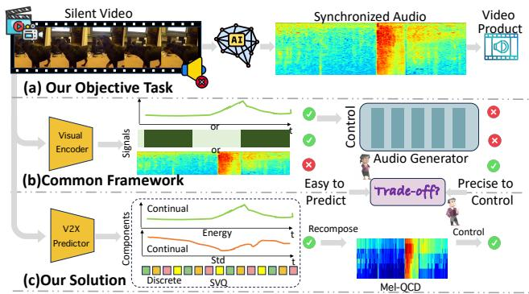
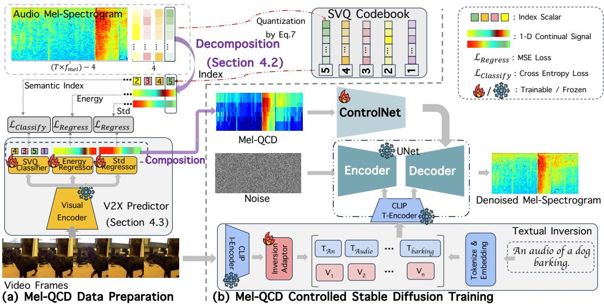
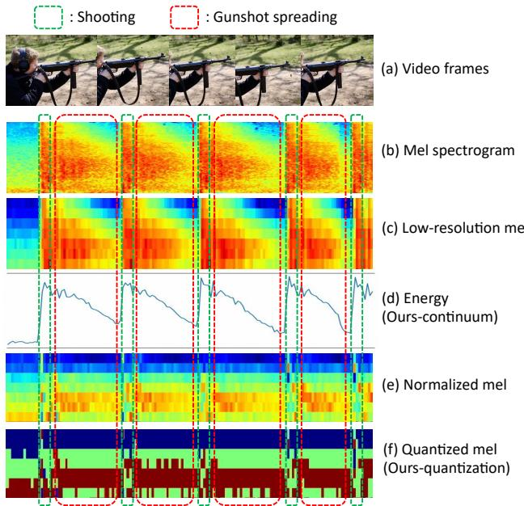
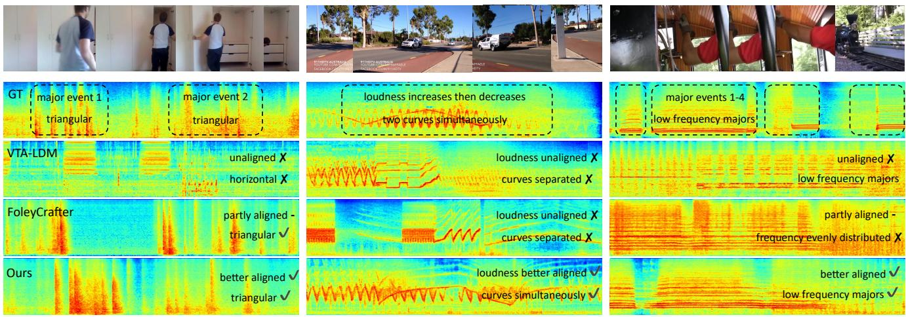
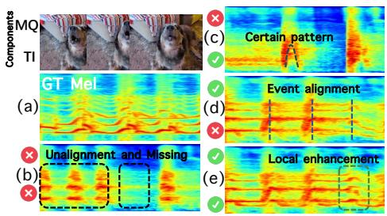

# Synchronized Video-to-Audio Generation via Mel Quantization-Continuum Decomposition

Juncheng Wang12\* Chao Xu2∗ Cheng Yu2∗ Lei Shang2 † Zhe Hu1 Shujun Wang1 ‡ Liefeng Bo2‡

1 The Hong Kong Polytechnic University 2Tongyi Lab, Alibaba Group https://wjc2830.github.io/MelQCD/

## Abstract

Video-to-audio generation is essential for synthesizing realistic audio tracks that synchronize effectively with silent videos. Following the perspective of extracting essential signals from videos that can precisely control the mature text-to-audio generative diffusion models, this paper presents how to balance the representation of melspectrograms in terms of completeness and complexity through a new approach called Mel Quantization-Continuum Decomposition (Mel-QCD). We decompose the mel-spectrogram into three distinct types of signals, employing quantization or continuity to them, we can effectively predict them from video by a devised video-to-all (V2X) predictor. Then, the predicted signals are recomposed andfed into a ControlNet, along with a textual inversion design, to control the audio generation process. Our proposed Mel-QCD method demonstrates state-of-the-art performance across eight metrics, evaluating dimensions such as quality, synchronization, and semantic consistency.

## 1. Introduction

The relevance of multimedia content has positioned videoto-audio (V2A) [19, 21, 43, 45, 50] generation as a critical area of research, focusing on synthesizing realistic audio tracks synchronized with silent video footage. This task is vital for enhancing user experiences in applications such as video editing [4, 28], post-production [25, 33], and content creation [16, 38]. Moreover, as AI increasingly influences video production—often resulting in silent outputs [3, 30, 32]—the development of effective V2A solutions has become essential. High-quality audio generation for AI-generated videos enhances storytelling and emotional impact, bridging the gap between visual and auditory information in various multimedia contexts.

Recent studies have shown promising results in V2A tasks by fine-tuning approaches from mature text-to-audio (T2A) [17, 18, 26, 27, 46] generation, particularly diffusion models. While these methods are driven by various motivations, they can generally be viewed as extracting signals from videos to control the synthesis of audio represented in mel-spectrogram format, as illustrated in Figure 1. For example, FoleyCrafter [50] extracts sound event onset signals from video, which are then used to control the temporal distribution within a text-to-audio generative diffusion model.

  
Figure 1. Task formulation of this paper (a). Previous mainstream approaches focus on extracting control signals from videos to govern audio generation (b). However, they struggle to balance between ease of prediction and precision of control. In response, our proposed Mel-QCD achieves a more effective trade-off (c).

From this perspective, we hypothesize the primary challenge that the community faces is how to better represent an audio signal that can be easily predicted from video while also enabling precise control over audio generation? Intuitively, an easily predictable signal promises effective generalization across different videos. However, to ensure that the generated audio is highly aligned with the conditioned video in both semantic and temporal representations, the signal must encompass adequate information. However, existing methods that fine-tune T2A diffusion models often fall short in one of these two dimensions, limitations that will be further discussed in Section 2.

In this paper, we present Mel Quantization-Continuum Decomposition (Mel-QCD) Control, as a way of trade-off between simplicity and precision. Specifically, we approach the challenge by balancing the representation of the melspectrogram in terms of completeness and complexity. We begin by decomposing the mel-spectrogram into three components: semantic, energy, and standard deviation vectors. To facilitate signal prediction from video, we propose quantizing the semantic vectors into discrete codes and constructing a semantic vector quantization (SVQ) codebook, where the index in the codebook represents the semantic component. This quantization effectively reduces complexity, without losing too much information. Moreover, for the energy and standard deviation vectors, as low-dimension data, we analyze their strong dependency on maintaining continuous distributions to ensure completeness. Hence, we advocate for retaining their original representations.

By decomposing the mel-spectrogram into these components, we develop a video-to-all (V2X) predictor that generates signals from a given video. These individually predicted signals are subsequently recomposed to form a mel-like representation, termed Mel-QCD. Following FoleyCrafter [50] and ReWas [21], we employ a Control-Net [48] to manage the spatial distribution of the generated mel through a T2A diffusion model. Furthermore, recognizing that the predicted Mel-QCD inevitably has some deviations in certain time slots, we incorporate a textual inversion technique to mitigate the semantic shifts caused by these inaccuracies. This enhancement ensures a more consistent alignment of the generated audio with the video, thereby preserving the fundamental semantic integrity.

A primary objective of this work is to explore a more efficient framework for generating high-quality audio conditioned by video. To evaluate our method, we compare its performance with existing mainstream pipelines on the widely recognized VGGSound benchmark across three perspectives: generation quality, synchronization, and semantic consistency, utilizing eight different metrics. Additionally, we conduct extensive analytical experiments to validate the proposed insights.

## 2. Related Work

Text-to-Audio Generation. The primary driver of success in audio generation tasks is the use of Text-to-Audio (TTA) models. Previous efforts adopt GANs [13, 24], normalizing flows [22, 31], and VAEs [39] in this task. Recently, diffusion models [15] have demonstrated significant generative potential in visual domains and have subsequently been extended to audio generation. DiffSound [47] employs a discrete diffusion model to generate sounds from text prompts. Make-An-Audio [18] and AudioLDM [26] excel in generation quality by leveraging advanced latent diffusion models (LDMs) [36]. The following works further incorporates several enhancing designs. Make-An-Audio2 [17] introduces structured text encoding to improve semantic alignment. AudioLDM2 [27] unifies any audio signal into a universal representation, thus supporting various audio generation. Tango [11] utilizes Flan-T5 [7] as the text encoder to precisely convey complex textual concepts. Auffusion [46] reduces the demand for data and computational resources while maintaining excellent text-audio alignment. In this paper, our method is built upon Auffusion, inheriting its excellent text-conditioned generation capabilities while extending it to understand visual semantics.

Video-to-Audio Generation. Another popular research, Video-to-Audio (VTA), aims to generate audio that is semantically aligned and temporally synchronized with the video content. Based on how they connect visual and audio, we categorize the current work into two types. The first category involves training video-to-audio models from scratch. SpecVQGAN [19] and Im2wav [37] design an autoregressive network to generate audio tokens based on the input visual tokens. DiffFoley [29] employs a diffusion model while introducing contrastive learning to unify the video-audio features. VTA-LDM [45] is based on the LDMs and directly combine the visual embeddings through cross attention. However, they require a large-scale highquality visual-audio aligned data for training, hence another category of methods has emerged, resorting to the foundational TTA models. Seeing-and-hearing [43] and VTA-Mapper [41] both project audio to the text embedding space, which is then processed by a pretrained TTA generator. However, the shared video-text space struggles to maintain the fine-grained temporal cues. Concurrent Foley-Crafter [50] and ReWaS [21], inspired by the structural control of ControlNet [48] in text-to-image tasks, utilize onset or energy inferred from visuals as mel-spectrogram hints to explicitly control audio generation. Apparently, these representations lose a lot of visual details, leading to unsatisfactory results. An intuitive solution is to increase signal information, but the difficulty of signal prediction also increases accordingly. Consequently, we delve into the properties of mel-spectrograms and propose several designs to make them easier to predict from visual features, achieving a balance between completeness and complexity.

## 3. Task Formulation

Stable Diffusion Based Text-to-Audio. It is one of the most popular T2A frameworks, where a Ts length audio waveform A $\in \mathbb { R } ^ { 1 \times ( T \times f _ { w a v } ) }$ with a sample rate of $f _ { w a v }$ is transformed into a two dimensional Mel-Spectrogram $\textbf { M } \in \ \mathbb { R } ^ { K \times ( T \times f _ { m e l } ) }$ with a sample rate of $f _ { m e l } .$ and a number of frequency bin of $K ,$ through a Fast Fourier Transform (FFT). Previous T2A latent diffusion models (LDM) [26, 27, 46] use paired audio M and textual embedding $\mathbf { C } _ { T }$ data to train stable diffusion architecture models. At inference time, the trained LDM $\mathcal { F } ( \cdot ; \theta )$ with corresponding parameters $\theta ,$ can transform the user prompted text feature $\mathbf { C } _ { T }$ into a novel Mel-spectrogram as:

  
Figure 2. Pipeline for the proposed Mel-QCD controllable video-to-audio (V2A) generation. The process is divided into two parts: (a) Pre-training, which outlines how to derive Mel-QCD from videos; and (b) Training, which explains how to utilize Mel-QCD and textual inversion to train the video-controlled audio generation model.

$$
\mathbf { M } = \mathcal { F } ( \mathbf { C } _ { T } ; \theta ) .\tag{1}
$$

Later, with a synthesized Mel-spectrogram, a HiFi-GAN Vocoder [23] is used to transform it into audio waveform.

ControlNet Based Video-to-Audio Generation. Control-Net [48] complements the shortcoming of textual prompt that cannot control fine-grained spatial distribution of generated content. Formally, besides the textual prompt, ControlNet requires user to input an additional condition map $\mathbf { C } _ { S } .$ , which describes the basic spatial distribution of the generated content. This explicit and fine-grained maps inspire video-to-audio generation methods [21, 50] to follow suit by converting videos into control hints, thereby achieving precise alignment. Specifically, given $T \times f _ { v }$ frame video data $\mathbf { V } \in \mathbb { R } ^ { ( T \times f _ { v } ) \times \tilde { 3 } \times H \times W }$ , with a sample rate of $f _ { v } ,$ frame resolution of $H \times W$ , a signal predictor $\mathcal { G }$ transform them into the $\mathbf { C } _ { S } = \mathcal { G } ( \mathbf { V } ) \in \mathbb { R } ^ { \tilde { K } \times ( \hat { T ^ { \times } } f _ { m e l } ) }$ of ControlNet with parameters Θ. This process can be defined as:

$$
\mathbf { M } = \mathcal { F } ( \mathbf { C } _ { S } , \mathbf { C } _ { T } ; \Theta ) .\tag{2}
$$

In this study, we aim to address the challenge of generating well-aligned synthesized audio from video input. A crucial aspect of this endeavor is the effective prediction of a high-quality mel-spectrogram representation derived from the video. Consequently, we pose a central question that guides our research: How can we achieve a better balance between the completeness and complexity of the controlling signal G(V) in video-to-audio (V2A) generation? This inquiry underscores the significance of our work in enhancing the fidelity and synchronization of audio synthesis with corresponding video content.

## 4. Our Approach

Overview. To address the primary question posed earlier, we begin with a thorough analysis of the mel-spectrogram in Section 4.1. Building on the insights gained from this analysis, we introduce a novel representation known as Mel Quantization-Continuum Decomposition (Mel-QCD), which is detailed in Section 4.2. Utilizing this innovative representation, we develop V2X signal predictors aimed at extracting Mel-QCD from video inputs, as described in Section 4.3. Finally, we discuss the integration of Mel-QCD within a textual enhanced stable diffusion pipeline in Section 4.4. The whole pipeline of our proposed method has been illustrated in Figure 2.

## 4.1. Mel-Signal Decomposition

To better understand the mel-input, we first decompose the original mel-spectrogram signal and analyze the significance of each component of the mel-map. This decomposition allows us to retain the most significant aspects of the signal, ensuring its completeness, while reducing complexity by discarding the relatively trivial components.

To achieve this, we begin by decomposing the melsignal. Given a mel-map $\mathbf { M } \in \dot { } \mathbb { R } ^ { \mathbf { \bar { K } } \times ( T \times f _ { m e l } ) }$ , for any time slot $t ,$ the audio signal $\mathbf { M } _ { . , t } \in \mathbb { R } ^ { K \times 1 }$ can be expressed as:

  
Figure 3. Properties of each component of the mel-map containing two sound events: shooting and gunshot spreading. The energy reflects the continuum of the mel-map while the normalized mel reflects the semantic clustering property.

$$
{ \bf M } _ { k , t } = { \bf E } _ { t } + { \bf S } _ { k , t } \times { \bf D } _ { t } , \quad \mathrm { w h e r e }\tag{3}
$$

$$
\mathbf { E } _ { t } = \frac { 1 } { K } \sum _ { k = 1 } ^ { K } \mathbf { M } _ { k , t } \quad \in \mathbb { R } ^ { 1 } ,\tag{4}
$$

$$
{ \bf D } _ { t } = \sqrt { \frac { 1 } { K } \sum _ { k = 1 } ^ { K } ( { \bf M } _ { k , t } - { \bf E } _ { t } ) ^ { 2 } } \quad \in \mathbb { R } ^ { 1 } ,\tag{5}
$$

$$
\begin{array} { r l } { \mathbf { S } _ { \cdot , t } = \operatorname { N o r m } ( \mathbf { M } _ { \cdot , t } ) } & { { } \in \mathbb { R } ^ { K \times 1 } . } \end{array}\tag{6}
$$

After decomposing the mel-map into these three components, we will examine the properties of each one to assess their significance in representing the original mel-map.

Proposition 1 (Properties of Each Component). Given a mel-map represented audio M, the components $\mathbf { S } _ { \cdot , t }$ tend to be distinguishable concerning sound events, while the other two components, $\mathbf { E } _ { t }$ and $\mathbf { D } _ { t } ,$ , are continuously distributed across different sound events.

Intuitive Explanation. To begin with, $\mathbf { S } _ { \cdot , t }$ represents the shape of the mel-distribution within a time slot. This shape, as described by [1], determines the semantic content of the audio. Consequently, one can identify audio events based on their semantic characteristics. In contrast, $\mathbf { E } _ { t }$ reflects the energy of the sound, which tends to represent its overall loudness [21]. As a result, sound events cannot be distinguished solely based on their loudness. Regarding $\mathbf { D } _ { t } ,$ , it indicates the divergence in distribution across frequency dimensions, which includes semantic information [1]. However, its value distribution is heavily dependent on $\mathbf { E } _ { t }$ , leading to a continuous distribution across sound events.

Empirical Explanation. Figure 3 demonstrates different components of the mel spectrogram for a video in which a man shoots continuously. Generally, there exists two kinds of sound events, shooting and gunshot spreading. As is shown in Figure $3 ( \mathsf { b } ) ( \mathsf { c } )$ , both the original and lowresolution $\mathbf { M } _ { . , t }$ in different time slots of gunshot spreading are not similar, thus cannot effectively cluster into a certain class for the sound event. However, after our decomposition in Figure 3(d)(e), $\mathbf { E } _ { t }$ contains the main continuum of $\mathbf { M } _ { . , t } .$ and $\mathbf { S } _ { \cdot , t }$ has a better clustering property in the certain sound event. As is shown in Figure $3 \ ( \mathrm { f } ) , \ \mathbf { S } _ { \cdot , t }$ can be quantized to decrease complexity with minimum loss of semantic information with the help of the clustering property (t-SNE visualization is shown in the Appendix). As such, we can improve the trade-off of completeness and complexity by the above quantization-continuum decomposition.

## 4.2. Mel Quantization-Continuum Decomposition

Although we use three components to represent the complete mel-map, the difficulty in inferring $\mathbf { S } _ { . , t }$ from videos should not be overlooked. To balance the signal completeness and predicting complexity, we present our proposed solution, which we term Mel Quantization-Continuum Decomposition (Mel-QCD). Specifically, considering the distinguishable nature of sound events in the semantic component $\mathbf { S } _ { \cdot , t }$ , the clustering distribution of these events allows us to quantize them while retaining the energy $\mathbf { E } _ { t }$ and standard deviation $\mathbf { D } _ { t }$ as continuous signals.

Semantic Vector Quantization (SVQ). Given the clustering property of semantic vectors, the original continuous representation of $\mathbf { S } _ { \cdot , t }$ assigns different indexes to vectors within the same cluster, resulting in redundancy.

For instance, given N samples belonging to M categories, where $N \ > > \ M$ , the continuous indexing of all samples incurs a complexity of $\mathcal { O } ( N )$ . However, by leveraging their clustering properties, we can discretize the indices for samples that share the same category, thereby reducing complexity to $\mathcal { O } ( M )$

Thus, we propose to discretize the values within $\mathbf { S } _ { \cdot , t }$ One intuitive approach is to cluster the values and replace them with their respective clustering centroids. However, due to the high complexity of clustering algorithms, we suggest an alternative method to quantize the semantic vector $\mathbf { S } \mapsto [ \mathbf { S } ]$ by rounding and clamping its values. This process can be mathematically described as follows:

$$
[ \mathbf { S } ] _ { k , t } = \left\{ { \begin{array} { l l } { { \mathrm { r o u n d } } ( \mathbf { S } _ { k , t } ) } & { { \mathrm { i f } } \ \mathbf { S } _ { k , t } \in [ - \lambda , \lambda ] } \\ { - \lambda } & { { \mathrm { i f } } \ \mathbf { S } _ { k , t } < - \lambda } \\ { \lambda } & { { \mathrm { i f } } \ \mathbf { S } _ { k , t } > \lambda , } \end{array} } \right.\tag{7}
$$

where λ is a pre-defined bounding positive integer. This quantization strategy ensures that, compared to the continuous semantic vector, the quantized version does not lose significant completeness, thanks to its inherent intra-sound event compactness. However, it is vital to note, at each time slot, the dimension of $[ \mathbf { S } ] _ { \cdot , t }$ remains $K \times 1$ meaning that quantization alone cannot eliminate prediction difficulty.

To address this, we propose constructing a codebook for the semanticly quantized vectors. Through quantization, the possible values of semantic vector become finite within any given time slot. This allows us to treat SVQ prediction as a classification task, selecting from a finite set of possibilities. Specifically, for a SVQ at one time slot, [S].,t, we consider all possible combinations of K scalar values within a range of $[ - \lambda , \lambda ]$ . This generates a codebook with a length of $( 2 \lambda + 1 ) ^ { K }$ , representing all feasible combinations. Instead of predicting K individual items, we perform a single classification task over this set of $( 2 \lambda + 1 ) ^ { \bar { K } }$ codes. Consequently, this approach reduces the prediction complexity by a factor of K.

Energy & Standard Deviation Continuum. As previously discussed, the energy signal must be maintained in a continuous form to ensure precise representation. Therefore, we do not apply any special processing to it, opting instead to regress it directly from videos. Additionally, to reconstruct a mel-map, as derived in Eq. 3, the standard deviation D is also essential. Given that its complexity is similar to that of the energy signal, we likewise retain it in a continuous format and directly regress it.

## 4.3. V2X Signal Predictors

With thoroughly processed ground-truth signals derived from the original mel-maps, we are now ready to design the video-to-all signals (V2X) predictors $\mathcal { G } = \mathcal { H } \times \mathcal { P }$ , where H represents the visual encoder [20] and P denotes the signalspecific predictors.

For the design of H, we resample the video signal ${ \textbf { V } } \in$ $\mathbb { R } ^ { ( T \times f _ { v } ) \times \dots } \ \mathrm { t o }$ obtain ${ \mathbf V } ^ { \prime } \in \mathbb { R } ^ { \frac { T \times f _ { m e l } } { 4 } \times \dots }$ and utilize offthe-shelf visual encoders to derive $\mathcal { H } _ { 1 } ( \mathbf { V } ^ { \prime } ) \in \mathbb { R } ^ { \frac { T \times f _ { m e l } } { 4 } \times d }$ where d denotes the frame embedding dimension.

The design of $\mathcal { P }$ varies across different signals, which we will elaborate on below:

SVQ Classifier. Recapping, the length of the SVQ codebook is $( 2 \lambda + 1 ) ^ { K }$ , and this length influences the complexity of task. Empirically, the mel-map is derived from the waveform via FFT with a frequency bin of $K = 2 5 6$ , which results in an exponential increase in codebook length.

To mitigate this issue, we downsample the mel-map along the frequency dimension, resulting in $K ^ { \prime } = 8$ . For the choice of λ, we set $\lambda = 1$ . These two values are fixed for a dataset. It is worth noting that we have conducted ablation studies on this part in Section 5 and demonstrated that even with such a high level of compression, we can still achieve good conditional generation. This further supports the conclusion of Proposition 1, which highlights the substantial redundancy of semantic vectors.

By this method, we reduce the length of the codebook to $3 ^ { 8 } = 6 5 6 1$ . Although this is a significant reduction, it is still too large for classification. Therefore, we propose to factorize the $3 ^ { 8 }$ classification into two $3 ^ { 4 } = 8 1$ classifications [6], further diminishing task complexity. To this end, we employ some transformer and MLP layers to classify.

Energy & Standard Deviation Regressor. To regress these two continuous signals, we directly apply multiple naive transformer and MLP layers to predict the continuous scalars for each time slot. For details regarding some experimental techniques, please refer to the Appendix.

## 4.4. Mel-QCD Controlled Stable Diffusion

After obtaining three kinds of signals by $\hat { \mathbf { S } } , \hat { \mathbf { E } } , \hat { \mathbf { D } } = \mathcal { G } ( \mathbf { V } ^ { \prime } )$ we can compose it into our final Mel-QCD ${ \bf M } ^ { q c d }$ by:

$$
\mathbf { M } _ { k , t } ^ { q c d } = \hat { \mathbf { E } } _ { t } + \hat { \mathbf { S } } _ { k , t } \times \hat { \mathbf { D } } _ { t } .\tag{8}
$$

Hence, ${ \bf M } ^ { q c d }$ already includes a rich set of easily obtainable local dynamic semantics, but we cannot ensure that every time slot is perfectly precise. These local inaccuracies can lead to shifts in the overall distribution, thus we further introduce a Textual Inversion [10, 44] module to refine the global semantics. Unlike the semantic adapter used in FoleyCrafter, textual inversion can enhance the visual understanding capabilities without affecting the frozen U-Net features, thus allowing it to be trained independently and merged with ControlNet with minimal impact on the main data flow. Specifically, we first predefine the prompt according to the sound event label, which is tokenized and mapped into the token embedding space by employing a CLIP embedding lookup module [34]. Then, the Inversion Adapter averages the CLIP visual embeddings of videos along the time dimension and maps them into aligned pseudo-word token embeddings $\{ V _ { 1 } , \ldots , V _ { n } \}$ , as shown in Figure 2. Note that this module is forward-only and $n$ tokens are set to describe the sound event as comprehensively as possible from the visual inputs. Then, the two token embeddings are concatenated and sent to the CLIP text encoder, obtaining the semantically enhanced textual guidance $C _ { T }$

Finally, we obtain $\mathbf { M } ^ { q c d }$ as ControlNet hints $C _ { S }$ and textual embedding $C _ { T }$ , both are incorporated with a Text-to-Audio base model to train Θ.

$$
\mathcal { L } = \mathbb { E } _ { \mathbf { z } _ { 0 } , t , \mathbf { C } _ { S } , \mathbf { C } _ { T } , \epsilon \sim \mathcal { N } ( 0 , 1 ) } [ | | \epsilon - \epsilon _ { \theta } ( \mathbf { z } _ { t } , t , \mathbf { C } _ { S } , \mathbf { C } _ { T } ) | | _ { 2 } ^ { 2 } ] ,\tag{9}
$$

where $\mathbf { z } _ { t }$ is the noisy latent, t is the diffusion step, $\epsilon _ { \theta }$ is a denosing network.

Table 1. Comparison of our method with other state-of-the-art Foley generation models using the VGGSound test set. The highes performance among the various methods is highlighted in bold, while the second-best performance is underlined.
<table><tr><td rowspan="2">Method</td><td colspan="3">Quality</td><td colspan="3">Synchronization</td><td colspan="2">Semantic</td></tr><tr><td>FID↓</td><td>MKL↓</td><td>Class ACC↑</td><td> $\mathrm { \mathbf { W }  – D i s ^ { \downarrow } }$ </td><td> $\mathrm { J S - D i v ^ { \downarrow } }$ </td><td>Onset ACC↑</td><td>IB-AA↑</td><td>IB-AV↑</td></tr><tr><td>Auffusion [46]</td><td>22.26</td><td>5.54</td><td>18.36</td><td>0.44</td><td>0.12</td><td>22.30</td><td>0.35</td><td>0.22</td></tr><tr><td>SpecVQGAN [19]</td><td>19.31</td><td>6.47</td><td>5.64</td><td>0.45</td><td>0.10</td><td>24.34</td><td>0.18</td><td>0.13</td></tr><tr><td>Im2Wav [37]</td><td>16.16</td><td>5.66</td><td>16.70</td><td>0.45</td><td>0.13</td><td>22.10</td><td>0.31</td><td>0.20</td></tr><tr><td>DiffFoley [29]</td><td>15.15</td><td>6.47</td><td>23.27</td><td>0.49</td><td>0.14</td><td>16.02</td><td>0.32</td><td>0.23</td></tr><tr><td>VTA-LDM [45]</td><td>11.77</td><td>4.72</td><td>27.72</td><td>0.37</td><td>0.11</td><td>26.83</td><td>0.44</td><td>0.28</td></tr><tr><td>Seeing-and-Hearing [43]</td><td>20.32</td><td>6.08</td><td>10.56</td><td>0.68</td><td>0.17</td><td>20.49</td><td>0.43</td><td>0.38</td></tr><tr><td>FoleyCrafter [50]</td><td>13.11</td><td>4.14</td><td>31.54</td><td>0.43</td><td>0.13</td><td>24.33</td><td>0.48</td><td>0.29</td></tr><tr><td>Ours</td><td>11.73</td><td>2.96</td><td>45.91</td><td>0.33</td><td>0.11</td><td>25.42</td><td>0.52</td><td>0.31</td></tr></table>

## 5. Experiments

## 5.1. Settings

Dataset. The main experiments are conducted in the VG-GSound dataset [5]. We manually curate 56k videos with semantically aligned and temporally synchronized audio, using 55k for training and the remaining 1.1k for testing. For analysis and ablations, we utilize the AvSync15 [49], a high-quality subset of VGGSound, and adhere to its predefined splits for training and testing samples.

Baselines. We compare our method with recent SOTA methods. Firstly, Auffusion [46] is a text-to-audio method that serves as our base model. Secondly, SpecVQGAN [19], Im2Wav [37], DiffFoley [29], and VTA-LDM [45] represent existing video-to-audio generation approaches, each of which is trained from the scratch. Thirdly, Seeingand-Hearing [43] and FoleyCrafter [50] are another type of video-to-audio method that involve text-to-audio priors, with the latter following the similar technological approach as us. Note that we do not include ReWaS [21] because its open-source code cannot reproduce the results as expected. Evaluation Metrics. We focus on three key aspects to conduct objective evaluations. Quality: Drawing on previous studies [29, 41, 43], we utilize the Frechet Distance (FID) [14] and Mean KL Divergence (MKL) [19] as metrics. Additionally, Class ACC is employed to gauge the classification accuracy of the generated sounds. Synchronization: We report the Onset ACC as used in CondFoleyGen [9] and further analyze the Onset Detection Function [2, 42] for both generated and ground truth audios, then computing the Wasserstein Distance (W-Dis) and Jensen-Shannon Divergence (JS-Div) between the distribution of the two to measure the temporal alignment. Semantic: To evaluate semantic relevance, we compare the ImageBind scores [12] between the generated audio and both the corresponding video (IB-AV) and ground truth audio (IB-AA).

## 5.2. Main Results

As shown in Table 1, we evaluate the results across three dimensions: generation quality, temporal synchronization, and semantic consistency. Notably, our method achieves state-of-the-art performance on the majority of metrics, with the exception of Onset ACC and IB-AV. When comparing VTA-LDM to our approach, it exceeds our performance by approximately 1.5% on the Onset Acc metric. Despite its marginally better performance, VTA-LDM exhibits equivalent performance to ours on the similar synchronization metric, JS-Div. We attribute this to the more training data that VTA-LDM utilizes, which likely allows it to rely on visual cues and prioritize the video reference, resulting in improved video-audio synchronization. Regarding the IB-AV metric, it is important to note that Seeing-and-Hearing employs ImageBind as its visual encoder, thereby increasing the intrinsic relevance of its generated audio to the Image-Bind video embeddings. Nonetheless, outside of Seeingand-Hearing, our method still achieves state-of-the-art performance. For qualitative evaluation, Figure 4 presents a series of cases in the VGGSound test set.

## 5.3. Comparison Among Different Control Signals

We compare our proposed Mel-QCD with various audiovisual signals from recent research, including onset binary masks [50], energy signals [21], low-resolution mel [42], and CLIP video embeddings [35]. Additionally, we evaluate our quantization against audio quantization, specifically the first (Codec-1) and first two (Codec-2) RVQ codebooks from [8]. And we maintain consistent setups, signal predictor and ControlNet, and without include textual inversion.

For each control signal type, we utilize both ground-truth and predicted measures to assess completeness and complexity. Ground-truth results gauge completeness, while predicted results quantify trade-offs. As shown in Table 2, Codec-2 exhibits the best overall performance in terms of completeness, effectively preserving original audio information. However, the EnCodec codebooks (Codec-1 and Codec-2) have high complexity due to their codebook sizes of $1 0 2 4 ^ { 3 }$ and $1 0 2 4 ^ { 6 }$ Our proposed Mel-QCD performs comparably to low-resolution mel and significantly outperforms onset and energy, highlighting its capacity to retain semantic cues. CLIP video embeddings suffer the worst completeness and complexity since they derive from video rather than audio. In terms of trade-offs, Codec-1 and Codec-2 all show relatively low performance, indicating that an excessive focus on either completeness or complexity undermines balance. In contrast, Mel-QCD achieves the best FID, MKL, and Class ACC, and ranks second in Onset ACC. Compared to onset and energy signals, Mel-QCD retains more semantics with minimal complexity increase. When compared to low-resolution mel, it retains nearly all semantic information while effectively reducing complexity. Consequently, Mel-QCD demonstrates superior performance in trade-off completeness and complexity.

Case 1: a man walking and opening drawers  
Case 2: two police cars passing by  
Case 3: a train horning  
  
Figure 4. Case study on the VGGSound test set. The first row displays the video frame, followed by mel spectrograms from the ground truth (GT), VTA-LDM, FoleyCrafter, and our method. As shown, our result performs better than others over synchronization.

Table 2. Comparison among different control signals in terms of completeness and complexity. Results using ground-truth signals measure completeness, while using predicted signals measure trade-off. All types are processed to the same dimension before input into ControlNet.
<table><tr><td rowspan="2">Control Type</td><td rowspan="2">Proposed by</td><td colspan="4">Ground Truth</td><td colspan="4">Predicted</td></tr><tr><td>FID↓</td><td>MKL↓</td><td>Class ACC↑</td><td>Onset ACC↑</td><td>FID↓</td><td>MKL↓</td><td>Class ACC↑</td><td>Onset ACC↑</td></tr><tr><td>Ours</td><td>This paper</td><td>47.57</td><td>1.67</td><td>66.67</td><td>71.47</td><td>61.00</td><td>1.66</td><td>64.67</td><td>31.68</td></tr><tr><td>Onset</td><td>FoleyCrafter [50]</td><td>65.38</td><td>2.19</td><td>56.67</td><td>63.31</td><td>68.72</td><td>2.34</td><td>56.67</td><td>27.62</td></tr><tr><td>Energy</td><td>ReWas [21]</td><td>57.21</td><td>1.93</td><td>62.67</td><td>69.13</td><td>71.18</td><td>2.11</td><td>56.67</td><td>29.20</td></tr><tr><td>Low-Resolution Mel</td><td>TiVA [42]</td><td>47.50</td><td>1.64</td><td>65.34</td><td>69.51</td><td>65.10</td><td>2.64</td><td>52.00</td><td>35.71</td></tr><tr><td>CLIP Video Embedding</td><td>EgoSonics [35]</td><td>90.08</td><td>1.94</td><td>60.67</td><td>39.38</td><td>90.08</td><td>1.94</td><td>60.67</td><td>39.38</td></tr><tr><td>Codec-1</td><td>EnCodec [8]</td><td>60.00</td><td>1.81</td><td>62.00</td><td>70.09</td><td>102.80</td><td>3.31</td><td>40.67</td><td>30.92</td></tr><tr><td>Codec-2</td><td>EnCodec [8]</td><td>48.42</td><td>1.39</td><td>69.34</td><td>71.73</td><td>101.13</td><td>3.09</td><td>40.67</td><td>29.67</td></tr></table>

## 5.4. Ablation Study

Ablating Method Component. To validate the effectiveness of the proposed Mel-QCD (MQ) and Textual Inversion (TI), we perform the following results. As illustrated in Figure 5, the ground truth (GT) mel-spectrogram (a) shows three dog barking events, each characterized by distinct frequency spikes. In the absence of MQ and TI, our base model (b) produces irregularly timed dog barks with visualunrelated patterns. When TI is applied alone (c), the model captures certain frequency patterns through global semantic control, though it lacks temporal alignment. Conversely, the MQ (d) provides explicit dynamic semantic cues, allowing the model to align sound events and fit local frequency spikes. Finally, incorporating TI alongside MQ (e) enhances local semantic details, resulting in more accurate overall distributions. Quantitative results in Table 3 support these claims that both modules improve performance.

Table 3. Ablation study on the method component. Decomp., Discrete, and SVQ are three key designs in Mel-QCD.
<table><tr><td rowspan=1 colspan=1>Decomp.</td><td rowspan=1 colspan=1>Discrete</td><td rowspan=1 colspan=1>SVQ</td><td rowspan=1 colspan=1>TI</td><td rowspan=1 colspan=1>FID↓</td><td rowspan=1 colspan=1>MKL↓</td><td rowspan=1 colspan=1>Class ACC↑</td></tr><tr><td rowspan=1 colspan=1>X</td><td rowspan=1 colspan=1>X</td><td rowspan=1 colspan=1>X</td><td rowspan=1 colspan=1>X</td><td rowspan=1 colspan=1>65.10</td><td rowspan=1 colspan=1>2.64</td><td rowspan=1 colspan=1>52.00</td></tr><tr><td rowspan=1 colspan=1>√</td><td rowspan=1 colspan=1>X</td><td rowspan=1 colspan=1>X</td><td rowspan=1 colspan=1>x</td><td rowspan=1 colspan=1>61.97</td><td rowspan=1 colspan=1>2.10</td><td rowspan=1 colspan=1>54.67</td></tr><tr><td rowspan=1 colspan=1>√</td><td rowspan=1 colspan=1>√</td><td rowspan=1 colspan=1>X</td><td rowspan=1 colspan=1>X</td><td rowspan=1 colspan=1>61.44</td><td rowspan=1 colspan=1>1.80</td><td rowspan=1 colspan=1>58.67</td></tr><tr><td rowspan=1 colspan=1>√</td><td rowspan=1 colspan=1>√</td><td rowspan=1 colspan=1>√</td><td rowspan=1 colspan=1>X</td><td rowspan=1 colspan=1>61.00</td><td rowspan=1 colspan=1>1.66</td><td rowspan=1 colspan=1>64.67</td></tr><tr><td rowspan=1 colspan=1>x</td><td rowspan=1 colspan=1>X</td><td rowspan=1 colspan=1>x</td><td rowspan=1 colspan=1>√</td><td rowspan=1 colspan=1>75.65</td><td rowspan=1 colspan=1>2.02</td><td rowspan=1 colspan=1>58.33</td></tr><tr><td rowspan=1 colspan=1>√</td><td rowspan=1 colspan=1>√</td><td rowspan=1 colspan=1>√</td><td rowspan=1 colspan=1>√</td><td rowspan=1 colspan=1>57.36</td><td rowspan=1 colspan=1>1.53</td><td rowspan=1 colspan=1>69.33</td></tr></table>

  
Figure 5. Visual comparison with different variants of our method.

Table 4. Ablation study on the choice of SVQ parameters in terms of the effectiveness of signal prediction and overall performance.
<table><tr><td rowspan=1 colspan=2>Parameters</td><td rowspan=2 colspan=1>Codebook Length</td><td rowspan=2 colspan=1>ACC↑</td><td rowspan=2 colspan=1>Sim↑</td><td rowspan=2 colspan=1>FID↓</td><td rowspan=2 colspan=1>MKL↓</td></tr><tr><td rowspan=1 colspan=1>λ</td><td rowspan=1 colspan=1>K</td></tr><tr><td rowspan=1 colspan=1>1</td><td rowspan=1 colspan=1>4</td><td rowspan=1 colspan=1>6,5612</td><td rowspan=1 colspan=1>21.87</td><td rowspan=1 colspan=1>67.85</td><td rowspan=1 colspan=1>59.02</td><td rowspan=1 colspan=1>2.38</td></tr><tr><td rowspan=1 colspan=1>1</td><td rowspan=1 colspan=1>8</td><td rowspan=1 colspan=1>6,561</td><td rowspan=1 colspan=1>32.95</td><td rowspan=1 colspan=1>74.21</td><td rowspan=1 colspan=1>54.46</td><td rowspan=1 colspan=1>1.92</td></tr><tr><td rowspan=1 colspan=1>1</td><td rowspan=1 colspan=1>16</td><td rowspan=1 colspan=1>6,5612</td><td rowspan=1 colspan=1>34.73</td><td rowspan=1 colspan=1>69.83</td><td rowspan=1 colspan=1>53.09</td><td rowspan=1 colspan=1>1.94</td></tr><tr><td rowspan=1 colspan=1>1</td><td rowspan=1 colspan=1>32</td><td rowspan=1 colspan=1>6,5614</td><td rowspan=1 colspan=1>24.61</td><td rowspan=1 colspan=1>68.93</td><td rowspan=1 colspan=1>57.49</td><td rowspan=1 colspan=1>2.44</td></tr><tr><td rowspan=1 colspan=1>2</td><td rowspan=1 colspan=1>16</td><td rowspan=1 colspan=1>390,6252</td><td rowspan=1 colspan=1>20.90</td><td rowspan=1 colspan=1>71.39</td><td rowspan=1 colspan=1>55.10</td><td rowspan=1 colspan=1>2.27</td></tr><tr><td rowspan=1 colspan=1>2</td><td rowspan=1 colspan=1>32</td><td rowspan=1 colspan=1>390,6254</td><td rowspan=1 colspan=1>22.91</td><td rowspan=1 colspan=1>66.91</td><td rowspan=1 colspan=1>86.81</td><td rowspan=1 colspan=1>3.51</td></tr></table>

Table 5. Ablation study on the choice of down sampling strategy over the temporal dimension.
<table><tr><td rowspan=1 colspan=1>Temporal DownSample Strategy</td><td rowspan=1 colspan=1>Numberof Signal</td><td rowspan=1 colspan=1>FID↓</td><td rowspan=1 colspan=1>MKL↓</td><td rowspan=1 colspan=1>Class ACC↑</td><td rowspan=1 colspan=1>Onset ACC↑</td></tr><tr><td rowspan=1 colspan=1>DownSample</td><td rowspan=1 colspan=1>256</td><td rowspan=1 colspan=1>47.87</td><td rowspan=1 colspan=1>1.65</td><td rowspan=1 colspan=1>67.33</td><td rowspan=1 colspan=1>69.10</td></tr><tr><td rowspan=1 colspan=1>Original</td><td rowspan=1 colspan=1>1024</td><td rowspan=1 colspan=1>47.54</td><td rowspan=1 colspan=1>1.67</td><td rowspan=1 colspan=1>66.67</td><td rowspan=1 colspan=1>71.47</td></tr><tr><td rowspan=1 colspan=1>Temoral Smooth</td><td rowspan=1 colspan=1>256</td><td rowspan=1 colspan=1>52.43</td><td rowspan=1 colspan=1>1.64</td><td rowspan=1 colspan=1>62.67</td><td rowspan=1 colspan=1>71.33</td></tr><tr><td rowspan=1 colspan=1>Temporal Mean</td><td rowspan=1 colspan=1>256</td><td rowspan=1 colspan=1>53.48</td><td rowspan=1 colspan=1>1.54</td><td rowspan=1 colspan=1>61.33</td><td rowspan=1 colspan=1>63.70</td></tr></table>

Ablating SVQ from Generation. We assess the trade-off between completeness and complexity in our Semantic Vector Quantization (SVQ) by varying λ and K to adjust codebook length. We analyze classification accuracy (ACC), cosine similarity (Sim) of predictions, and quality metrics of the generated audio, using GT energy and standard deviation to isolate the impact of other control signals.

As shown in Table 4, decreases in ACC and Sim suggest that longer codebook lengths complicate signal prediction. Additionally, FID and MKL scores remain similar for the first two rows of the table but decline with increased codebook lengths, highlighting that the rising prediction difficulty significantly affects overall generation performance.

Ablating Temporal Downsample Strategies. As discussed in Section 4, the number of video frames is less than the temporal length of the original mel spectrogram. Consequently, we cannot predict the number of signals that matches the temporal length of the mel. For instance, at a frame rate of 25 frames per second (FPS), a typical video would generate 250 frames, while the mel spectrogram has a temporal length of 1024. This necessitates downsampling to achieve a temporal dimension reduction by a factor of 1 4

To evaluate the choice of downsampling strategies, we compare three variants: downsampling with repetition, smoothing using the Savitzky-Golay filter [40], and downsampling by taking the mean. As shown in Table 5, the naive approach of downsampling with repetition yields results comparable to those using the original resolution.

Table 6. Ablation study on the choice of compression strategy over the frequency dimension.
<table><tr><td rowspan=1 colspan=1>Frequency DownSample Strategy</td><td rowspan=1 colspan=1>FID↓</td><td rowspan=1 colspan=1>MKL↓</td><td rowspan=1 colspan=1>Class ACC↑</td><td rowspan=1 colspan=1>Onset ACC↑</td></tr><tr><td rowspan=1 colspan=1>DS-Repeat</td><td rowspan=1 colspan=1>47.57</td><td rowspan=1 colspan=1>1.67</td><td rowspan=1 colspan=1>66.67</td><td rowspan=1 colspan=1>71.47</td></tr><tr><td rowspan=1 colspan=1>DS-Sparse</td><td rowspan=1 colspan=1>50.04</td><td rowspan=1 colspan=1>1.68</td><td rowspan=1 colspan=1>64.00</td><td rowspan=1 colspan=1>70.42</td></tr><tr><td rowspan=1 colspan=1>Mel-8 Repeat</td><td rowspan=1 colspan=1>51.50</td><td rowspan=1 colspan=1>1.72</td><td rowspan=1 colspan=1>59.33</td><td rowspan=1 colspan=1>69.10</td></tr><tr><td rowspan=1 colspan=1>Mel-8 Sparse</td><td rowspan=1 colspan=1>58.01</td><td rowspan=1 colspan=1>2.10</td><td rowspan=1 colspan=1>56.67</td><td rowspan=1 colspan=1>70.25</td></tr></table>

Table 7. Ablation study on the number of pseudo-word tokens.
<table><tr><td rowspan=1 colspan=1>n</td><td rowspan=1 colspan=1>FID↓</td><td rowspan=1 colspan=1>MKL</td><td rowspan=1 colspan=1>Class ACC↑</td><td rowspan=1 colspan=1>IB-AV↑</td></tr><tr><td rowspan=1 colspan=1>1</td><td rowspan=1 colspan=1>110.21</td><td rowspan=1 colspan=1>4.50</td><td rowspan=1 colspan=1>35.33</td><td rowspan=1 colspan=1>27.85</td></tr><tr><td rowspan=1 colspan=1>4</td><td rowspan=1 colspan=1>92.95</td><td rowspan=1 colspan=1>3.03</td><td rowspan=1 colspan=1>47.67</td><td rowspan=1 colspan=1>28.62</td></tr><tr><td rowspan=1 colspan=1>16</td><td rowspan=1 colspan=1>83.32</td><td rowspan=1 colspan=1>2.61</td><td rowspan=1 colspan=1>54.33</td><td rowspan=1 colspan=1>29.17</td></tr><tr><td rowspan=1 colspan=1>32</td><td rowspan=1 colspan=1>75.65</td><td rowspan=1 colspan=1>2.02</td><td rowspan=1 colspan=1>58.33</td><td rowspan=1 colspan=1>30.27</td></tr><tr><td rowspan=1 colspan=1>64</td><td rowspan=1 colspan=1>79.18</td><td rowspan=1 colspan=1>1.91</td><td rowspan=1 colspan=1>55.67</td><td rowspan=1 colspan=1>30.30</td></tr></table>

Ablating Frequency Downsample Strategies. For the compression of the frequency dimension, we employ two main strategies: downsampling and performing a Fast Fourier Transform (FFT) with a reduced number of frequency bins. To achieve recovery that meets the resolution requirements of ControlNet, we consider two approaches: repetition and sparsity, i.e., repetition means nearest interpolation, and sparsity means padding 0 between valid values to restore original frequency bins. As demonstrated in Table 6, the straightforward method of downsampling with repetition remains the most effective option.

Ablating the Number of Pseudo-Word Tokens. To find the optimal number of pseudo-word tokens, we assess audio quality and semantic alignment for different values n. As shown in Table 7. It is clear that as n increases, the overall semantics becomes more detailed, reflecting on the improvement of various metrics. However, when increasing n from 32 to 64, there is no significant boosting in overal performance. Considering increase the number of pseudoword tokens raises memory usage, the optimal balance between computational load and performance is at n = 32.

## 6. Conclusion

In this paper, we introduced a novel method for generating audio that aligns closely with conditional videos using Mel Quantization-Continuum Decomposition (Mel-QCD). We emphasized that representing the mel-spectrogram with predictable and comprehensive information enables effective control over text-to-audio diffusion models, facilitating seamless audio synthesis that corresponds to the video. Mel-QCD aims to optimize the trade-off between completeness and complexity in mel representation, further enhanced by our video-to-all (V2X) predictor for precise audio generation control. Extensive experiments and ablation studies demonstrate that our approach produces high-quality audio with superior temporal synchronization and semantic consistency when conditioned on video input.

## References

[1] Adriano Abbado. Perceptual correspondences of abstract animation and synthetic sound. Leonardo. Supplemental Issue, pages 3–5, 1988. 4

[2] Juan Pablo Bello, Laurent Daudet, Samer Abdallah, Chris Duxbury, Mike Davies, and Mark B Sandler. A tutorial on onset detection in music signals. IEEE Transactions on speech and audio processing, 13(5):1035–1047, 2005. 6

[3] Tim Brooks, Bill Peebles, Connor Holmes, Will DePue, Yufei Guo, Li Jing, David Schnurr, Joe Taylor, Troy Luhman, Eric Luhman, et al. Video generation models as world simulators. 2024. URL https://openai. com/research/videogeneration-models-as-world-simulators, 3, 2024. 1

[4] Duygu Ceylan, Chun-Hao P Huang, and Niloy J Mitra. Pix2video: Video editing using image diffusion. In Proceedings of the IEEE/CVF International Conference on Computer Vision, pages 23206–23217, 2023. 1

[5] Honglie Chen, Weidi Xie, Andrea Vedaldi, and Andrew Zisserman. Vggsound: A large-scale audio-visual dataset. In ICASSP 2020-2020 IEEE International Conference on Acoustics, Speech and Signal Processing (ICASSP), pages 721–725. IEEE, 2020. 6

[6] Daria Cherniuk, Stanislav Abukhovich, Anh-Huy Phan, Ivan Oseledets, Andrzej Cichocki, and Julia Gusak. Quantization aware factorization for deep neural network compression. arXiv preprint arXiv:2308.04595, 2023. 5

[7] Hyung Won Chung, Le Hou, Shayne Longpre, Barret Zoph, Yi Tay, William Fedus, Yunxuan Li, Xuezhi Wang, Mostafa Dehghani, Siddhartha Brahma, et al. Scaling instructionfinetuned language models. Journal of Machine Learning Research, 25(70):1–53, 2024. 2

[8] Alexandre Defossez, Jade Copet, Gabriel Synnaeve, and´ Yossi Adi. High fidelity neural audio compression. arXiv preprint arXiv:2210.13438, 2022. 6, 7

[9] Yuexi Du, Ziyang Chen, Justin Salamon, Bryan Russell, and Andrew Owens. Conditional generation of audio from video via foley analogies. In Proceedings of the IEEE/CVF Conference on Computer Vision and Pattern Recognition, pages 2426–2436, 2023. 6

[10] Rinon Gal, Yuval Alaluf, Yuval Atzmon, Or Patashnik, Amit H Bermano, Gal Chechik, and Daniel Cohen-Or. An image is worth one word: Personalizing text-toimage generation using textual inversion. arXiv preprint arXiv:2208.01618, 2022. 5

[11] Deepanway Ghosal, Navonil Majumder, Ambuj Mehrish, and Soujanya Poria. Text-to-audio generation using instruction-tuned llm and latent diffusion model. arXiv preprint arXiv:2304.13731, 2023. 2

[12] Rohit Girdhar, Alaaeldin El-Nouby, Zhuang Liu, Mannat Singh, Kalyan Vasudev Alwala, Armand Joulin, and Ishan Misra. Imagebind: One embedding space to bind them all. In Proceedings of the IEEE/CVF Conference on Computer Vision and Pattern Recognition, pages 15180–15190, 2023. 6

[13] Ian Goodfellow, Jean Pouget-Abadie, Mehdi Mirza, Bing Xu, David Warde-Farley, Sherjil Ozair, Aaron Courville, and

Yoshua Bengio. Generative adversarial nets. Advances in neural information processing systems, 27, 2014. 2

[14] Martin Heusel, Hubert Ramsauer, Thomas Unterthiner, Bernhard Nessler, and Sepp Hochreiter. Gans trained by a two time-scale update rule converge to a local nash equilibrium. Advances in neural information processing systems, 30, 2017. 6

[15] Jonathan Ho, Ajay Jain, and Pieter Abbeel. Denoising diffusion probabilistic models. Advances in neural information processing systems, 33:6840–6851, 2020. 2

[16] Li Hu. Animate anyone: Consistent and controllable imageto-video synthesis for character animation. In Proceedings of the IEEE/CVF Conference on Computer Vision and Pattern Recognition, pages 8153–8163, 2024. 1

[17] Jiawei Huang, Yi Ren, Rongjie Huang, Dongchao Yang, Zhenhui Ye, Chen Zhang, Jinglin Liu, Xiang Yin, Zejun Ma, and Zhou Zhao. Make-an-audio 2: Temporal-enhanced text to-audio generation. arXivpreprint arXiv:2305.18474, 2023. 1, 2

[18] Rongjie Huang, Jiawei Huang, Dongchao Yang, Yi Ren, Luping Liu, Mingze Li, Zhenhui Ye, Jinglin Liu, Xiang Yin, and Zhou Zhao. Make-an-audio: Text-to-audio generation with prompt-enhanced diffusion models. In International Conference on Machine Learning, pages 13916– 13932. PMLR, 2023. 1, 2

[19] Vladimir Iashin and Esa Rahtu. Taming visually guided sound generation. arXiv preprint arXiv:2110.08791, 2021. 1, 2, 6

[20] Vladimir Iashin, Weidi Xie, Esa Rahtu, and Andrew Zisserman. Synchformer: Efficient synchronization from sparse cues. In ICASSP 2024-2024 IEEE International Conference on Acoustics, Speech and Signal Processing (ICASSP), pages 5325–5329. IEEE, 2024. 5

[21] Yujin Jeong, Yunji Kim, Sanghyuk Chun, and Jiyoung Lee. Read, watch and scream! sound generation from text and video. arXiv preprint arXiv:2407.05551, 2024. 1, 2, 3, 4, 6, 7

[22] Jaehyeon Kim, Sungwon Kim, Jungil Kong, and Sungroh Yoon. Glow-tts: A generative flow for text-to-speech via monotonic alignment search. Advances in Neural Informa tion Processing Systems, 33:8067–8077, 2020. 2

[23] Jungil Kong, Jaehyeon Kim, and Jaekyoung Bae. Hifi-gan: Generative adversarial networks for efficient and high fidelity speech synthesis. Advances in neural information processing systems, 33:17022–17033, 2020. 3

[24] Felix Kreuk, Gabriel Synnaeve, Adam Polyak, Uriel Singer, Alexandre Defossez, Jade Copet, Devi Parikh, Yaniv Taig-´ man, and Yossi Adi. Audiogen: Textually guided audio gen eration. arXiv preprint arXiv:2209.15352, 2022. 2

[25] Yao-Chih Lee, Ji-Ze Genevieve Jang, Yi-Ting Chen, Elizabeth Qiu, and Jia-Bin Huang. Shape-aware text-driven layered video editing. In Proceedings of the IEEE/CVF Conference on Computer Vision and Pattern Recognition, pages 14317–14326, 2023. 1

[26] Haohe Liu, Zehua Chen, Yi Yuan, Xinhao Mei, Xubo Liu, Danilo Mandic, Wenwu Wang, and Mark D Plumbley. Audioldm: Text-to-audio generation with latent diffusion models. arXiv preprint arXiv:2301.12503, 2023. 1, 2, 3

[27] Haohe Liu, Yi Yuan, Xubo Liu, Xinhao Mei, Qiuqiang Kong, Qiao Tian, Yuping Wang, Wenwu Wang, Yuxuan Wang, and Mark D Plumbley. Audioldm 2: Learning holistic audio generation with self-supervised pretraining. IEEE/ACM Transactions on Audio, Speech, and Language Processing, 2024. 1, 2, 3

[28] Shaoteng Liu, Yuechen Zhang, Wenbo Li, Zhe Lin, and Jiaya Jia. Video-p2p: Video editing with cross-attention control. In Proceedings of the IEEE/CVF Conference on Computer Vision and Pattern Recognition, pages 8599–8608, 2024. 1

[29] Simian Luo, Chuanhao Yan, Chenxu Hu, and Hang Zhao. Diff-foley: Synchronized video-to-audio synthesis with latent diffusion models. Advances in Neural Information Processing Systems, 36, 2024. 2, 6

[30] OpenAI. Sora: Creating video from text. https://openai.com/sora, 2024. 1

[31] George Papamakarios, Eric Nalisnick, Danilo Jimenez Rezende, Shakir Mohamed, and Balaji Lakshminarayanan. Normalizing flows for probabilistic modeling and inference. Journal of Machine Learning Research, 22(57):1–64, 2021. 2

[32] PiKa. Pika. https://pika.art/try, 2024. 1

[33] Chenyang Qi, Xiaodong Cun, Yong Zhang, Chenyang Lei, Xintao Wang, Ying Shan, and Qifeng Chen. Fatezero: Fusing attentions for zero-shot text-based video editing. In Proceedings of the IEEE/CVF International Conference on Computer Vision, pages 15932–15942, 2023. 1

[34] Alec Radford, Jong Wook Kim, Chris Hallacy, Aditya Ramesh, Gabriel Goh, Sandhini Agarwal, Girish Sastry, Amanda Askell, Pamela Mishkin, Jack Clark, et al. Learning transferable visual models from natural language supervision. In International conference on machine learning, pages 8748–8763. PMLR, 2021. 5

[35] Aashish Rai and Srinath Sridhar. Egosonics: Generating synchronized audio for silent egocentric videos. arXiv preprint arXiv:2407.20592, 2024. 6, 7

[36] Robin Rombach, Andreas Blattmann, Dominik Lorenz, Patrick Esser, and Bjorn Ommer. High-resolution image¨ synthesis with latent diffusion models. In Proceedings of the IEEE/CVF conference on computer vision and pattern recognition, pages 10684–10695, 2022. 2

[37] Roy Sheffer and Yossi Adi. I hear your true colors: Image guided audio generation. In ICASSP 2023-2023 IEEE International Conference on Acoustics, Speech and Signal Processing (ICASSP), pages 1–5. IEEE, 2023. 2, 6

[38] Linrui Tian, Qi Wang, Bang Zhang, and Liefeng Bo. Emo: Emote portrait alive-generating expressive portrait videos with audio2video diffusion model under weak conditions. arXiv preprint arXiv:2402.17485, 2024. 1

[39] Aaron Van Den Oord, Oriol Vinyals, et al. Neural discrete representation learning. Advances in neural information processing systems, 30, 2017. 2

[40] Pauli Virtanen, Ralf Gommers, Travis E Oliphant, Matt Haberland, Tyler Reddy, David Cournapeau, Evgeni Burovski, Pearu Peterson, Warren Weckesser, Jonathan Bright, et al. Scipy 1.0: fundamental algorithms for scientific computing in python. Nature methods, 17(3):261–272, 2020. 8

[41] Heng Wang, Jianbo Ma, Santiago Pascual, Richard Cartwright, and Weidong Cai. V2a-mapper: A lightweight solution for vision-to-audio generation by connecting foun dation models. In Proceedings of the AAAI Conference on Artificial Intelligence, pages 15492–15501, 2024. 2, 6

[42] Xihua Wang, Yuyue Wang, Yihan Wu, Ruihua Song, Xu Tan, Zehua Chen, Hongteng Xu, and Guodong Sui. Tiva: Timealigned video-to-audio generation. In Proceedings of the 32nd ACM International Conference on Multimedia, pages 573–582, 2024. 6, 7

[43] Yazhou Xing, Yingqing He, Zeyue Tian, Xintao Wang, and Qifeng Chen. Seeing and hearing: Open-domain visualaudio generation with diffusion latent aligners. In Proceed ings of the IEEE/CVF Conference on Computer Vision and Pattern Recognition, pages 7151–7161, 2024. 1, 2, 6

[44] Chao Xu, Yang Liu, Jiazheng Xing, Weida Wang, Mingze Sun, Jun Dan, Tianxin Huang, Siyuan Li, Zhi-Qi Cheng, Ying Tai, et al. Facechain-imagineid: Freely crafting high fidelity diverse talking faces from disentangled audio. In Proceedings of the IEEE/CVF Conference on Computer Vi sion and Pattern Recognition, pages 1292–1302, 2024. 5

[45] Manjie Xu, Chenxing Li, Xinyi Tu, Yong Ren, Rilin Chen, Yu Gu, Wei Liang, and Dong Yu. Video-to-audio generation with hidden alignment. arXiv preprint arXiv:2407.07464, 2024. 1, 2, 6

[46] Jinlong Xue, Yayue Deng, Yingming Gao, and Ya Li. Auf fusion: Leveraging the power of diffusion and large language models for text-to-audio generation. arXiv preprint arXiv:2401.01044, 2024. 1, 2, 3, 6

[47] Dongchao Yang, Jianwei Yu, Helin Wang, Wen Wang, Chao Weng, Yuexian Zou, and Dong Yu. Diffsound: Discrete diffusion model for text-to-sound generation. IEEE/ACM Transactions on Audio, Speech, and Language Processing, 31:1720–1733, 2023. 2

[48] Lvmin Zhang, Anyi Rao, and Maneesh Agrawala. Adding conditional control to text-to-image diffusion models. In Proceedings of the IEEE/CVF International Conference on Computer Vision, pages 3836–3847, 2023. 2, 3

[49] Lin Zhang, Shentong Mo, Yijing Zhang, and Pedro Morgado. Audio-synchronized visual animation. arXiv preprint arXiv:2403.05659, 2024. 6

[50] Yiming Zhang, Yicheng Gu, Yanhong Zeng, Zhening Xing, Yuancheng Wang, Zhizheng Wu, and Kai Chen. Foleycrafter: Bring silent videos to life with lifelike and synchro nized sounds. arXiv preprint arXiv:2407.01494, 2024. 1, 2, 3, 6, 7