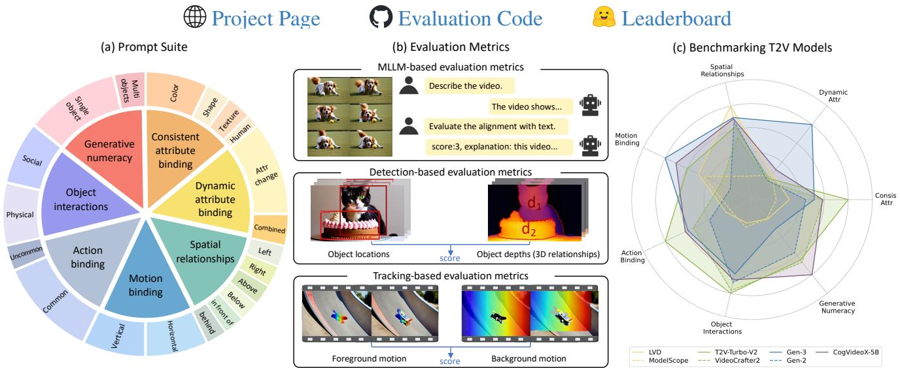
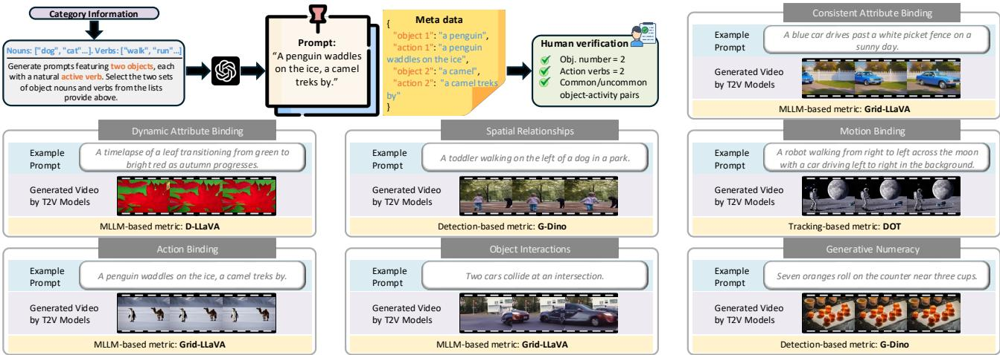
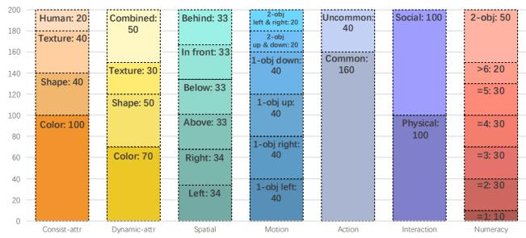
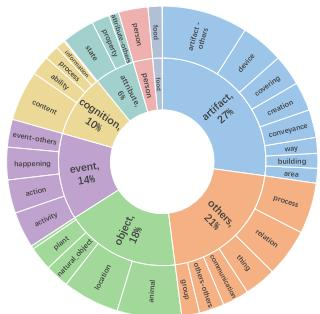
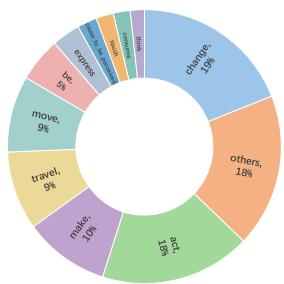

# T2V-CompBench: A Comprehensive Benchmark for Compositional Text-to-video Generation

Kaiyue Sun1 Kaiyi Huang1 Xian Liu2 Yue Wu3 Zihan Xu1 Zhenguo Li3 Xihui Liu1\* 1The University of Hong Kong 2The Chinese University of Hong Kong 3Huawei Noah’s Ark Lab

  
Figure 1. Overview of T2V-CompBench. We propose T2V-CompBench, a comprehensive compositional text-to-video generation bench mark that consists of seven categories: consistent attribute binding, dynamic attribute binding, spatial relationships, motion binding, action binding, object interactions, and generative numeracy. We propose three types of evaluation metrics: MLLM-based, Detection based, and Tracking-based metrics. We benchmark various text-to-video generation models.

## Abstract

Text-to-video (T2V) generative models have advanced sig nificantly, yet their ability to compose different objects, attributes, actions, and motions into a video remains unexplored. Previous text-to-video benchmarks also neglect this important ability for evaluation. In this work, we conduct the first systematic study on compositional text-to-video generation. We propose T2V-CompBench, the first benchmark tailored for compositional text-to-video generation. T2V-CompBench encompasses diverse aspects of compositionality, including consistent attribute binding, dynamic attribute binding, spatial relationships, motion binding, action binding, object interactions, and generative numeracy. We further carefully design evaluation metrics of multimodal large language model (MLLM)-based, detectionbased, and tracking-based metrics, which can better reflect the compositional text-to-video generation quality of

seven proposed categories with 1400 text prompts. The effectiveness of the proposed metrics is verified by correlation with human evaluations. We also benchmark various text-to-video generative models and conduct in-depth analysis across different models and various compositional categories. We find that compositional text-to-video generation is highly challenging for current models, and we hope our attempt could shed light onfuture research in this direction.

## 1. Introduction

Text-to-video (T2V) generation has made significant progress in recent years [2, 3, 14, 17, 18, 23, 43, 60, 65, 66, 72, 73, 84]. However, generating videos that accurately depict multiple objects, attributes, and motions in complex and dynamic scenes based on fine-grained text prompts remains a challenging task. In this work, we aim to conduct a systematic study on compositional T2V generation.

Compositional text-to-image (T2I) generation, which aims to compose multiple objects, attributes, and their relationships into complex scenes, has been widely studied in previous methods [5, 11, 37]. Benchmarks for compositional T2I generation [20] have been accepted as an important evaluation dimension for T2I foundation models [1, 7, 10]. However, most works on T2V generation focus on generating videos with simple text prompts, neglecting the significance of compositional T2V generation. Moreover, existing video generation benchmarks [22, 40, 41] primarily evaluate video quality, motion quality, and text-video alignment with single-object text prompts, and benchmarks for compositional T2V generation have not been systematically and extensively investigated in previous literature.

To this end, we propose T2V-CompBench, a comprehensive benchmark designed for compositional text-to-video generation. This benchmark emphasizes compositionality through multiple objects with attributes, quantities, actions, interactions, and spatio-temporal dynamics. We design a prompt suite composed of seven categories, where each category consists of 200 text prompts for video generation. When constructing the prompts, we emphasize temporal dynamics and guarantee that each prompt contains at least one active verb. The seven categories are as follows and examples are illustrated in Figure 2: 1) Consistent attribute binding. This category includes prompts featuring two objects, each with a distinct attribute. The attributes associated with each object are consistent throughout the video. 2) Dynamic attribute binding. Prompts in this category focus on dynamic attribute binding for objects, where the attributes change over time. 3) Spatial relationships. In this category, each prompt mentions two objects and specifies the spatial relationship between them. 4) Motion binding. Each prompt in this category includes one or two objects and a moving direction is specified for each object. 5) Action binding. Prompts in this category describe two objects, each with a distinct action. 6) Object interactions. This category tests the models’ abilities to understand and generate dynamic interactions between multiple objects, including physical interactions and social interactions. 7) Generative numeracy. The text prompts in this category include one or two objects with quantities ranging from one to eight.

Another challenge lies in the evaluation of compositional T2V generation. Commonly used metrics, such as Inception Score [59], Frechet Inception Distance (FID) [´ 16], Frechet Video Distance (FVD) [´ 64], and CLIPScore [15], cannot fully reflect the compositionality of T2V generation models. Evaluating compositionality of T2V models requires a fine-grained understanding of not only objects and attributes in each frame but also the dynamics and motions across frames. It is orders of magnitude more complex than evaluating T2I models.

To address this challenge, we take temporal dynamics across frames into consideration and design different metrics to evaluate different categories in the benchmark. Specifically, we design multimodal large language mode (MLLM)-based metrics, including image-LLM and video-LLM, to evaluate consistent attribute binding, dynamic attribute binding, action binding, and object interactions. We devise detection-based metrics to evaluate spatial relationships and generative numeracy. We propose tracking-based metrics to evaluate motion binding. The effectiveness of our proposed metrics is validated by computing the correlation with human evaluations. We evaluate various T2V generation models on T2V-CompBench and analyze their performances on different compositional categories.

The contributions of our paper are three-fold. 1) To our best knowledge, we are the first to propose a benchmark for compositional text-to-video generation, featuring seven categories with 1400 text prompts. 2) We propose comprehensive evaluation metrics for the seven categories and verify their effectiveness through correlation with human evaluations. 3) We benchmark various T2V models and provide a systematic study with insightful analysis, which will inspire future research in this direction.

## 2. Related Work

## 2.1. Text-to-video Generation.

Recently, diffusion models have gained significant attention in the field of text-to-video generation, building on the success of text-to-image models. Existing text-to-video diffusion models can be roughly categorized into two types, namely the diffusion unet-based [3, 14, 17, 23, 43, 60, 66, 84] and the Diffusion Transformer (DiT)-based [19, 34, 44, 62, 80]. In this paper, we evaluate a list of text-to-video diffusion models, including officially open-sourced models and commercial models. This comprehensive evaluation ensures the diversity of T2V approaches and provides insights into their capabilities.

## 2.2. Compositional Text-to-image Generation.

Recent studies have delved into compositionality in text-toimage generation [5, 8, 11, 12, 20, 21, 25, 31–33, 37, 39, 45, 50, 51, 55, 67, 70, 74, 78]. T2I-CompBench [20] proposed the first comprehensive benchmark to evaluate compositionality in text-to-image models, focusing on attributes binding, relationships, and complex compositions. While these evaluations are tailored exclusively to the image domain, video generation requires a deeper consideration of spatiotemporal dynamics. Our work pioneers the development of benchmarking compositional text-to-video generation.

## 2.3. Benchmarks for Text-to-video Generation.

Previous methods evaluate T2V models from the perspectives of video quality and text-video alignment. For video quality, the commonly used metrics, such as Inception Score (IS) [59] and Frechet Video Distance (FVD) [´ 64] are adopted to evaluate video diversity and fidelity. For textvideo alignment, CLIPScore [15] is proposed to measure the similarity of the text prompt and the frames, using the pre-trained CLIP model [54]. However, these metrics are not suitable for complex compositional prompts.

  
Figure 2. Prompt generation process and illustrations of the seven compositional categories.

Recent T2V benchmarks design text prompts and metrics to evaluate the video quality and text-video alignment in open domains. VBench [22] and EvalCrafter [40] propose comprehensive benchmarks to evaluate T2V models from various perspectives. FETV [41] categorizes prompts based on major content, controllable attributes, and prompt complexity. ChronoMagic-Bench [82] evaluates T2V models’ ability in generating time-lapse videos. However, most prompts provided in these benchmarks focus on singleobject rather than composition of multiple objects. Although some of them involves evaluation dimensions that include multiple objects, their prompts, such as “a bird and a cat” in multiple objects dimension of VBench [22], do not reflect the dynamics in videos. ChronoMagic-Bench [82] emphasizes the generation of natural metamorphic timelapse videos, while excluding unnatural attribute-change videos, which are also essential for evaluating the design and creative capabilities of T2V models. A comprehensive definition of compositionality in text-to-video generation is currently lacking in the literature. Therefore, we introduce the first benchmark for evaluating compositional text-tovideo generation, with tailored evaluation metrics that we validate through extensive human correlation studies.

## 3. Benchmark Construction

## 3.1. Problem Definition and Categorization

Compositional T2V generation has not been comprehensively explored in prior research. Therefore, we first clarify the problem definition and categorization. Previous literature on compositional T2I generation [5, 11, 20, 21] typically focuses on attribute binding, object relationships and numeracy. However, in the context of compositional T2V, we need to consider the composition in both spatial and temporal dimensions. In spatial dimension, we follow the framework established in compositional T2I and define categories of consistent attribute binding, spatial relationships, and numeracy. These categories require the generated video frames consistently align with the text prompts. In temporal dimension, we introduce categories of dynamic attribute binding, motion binding, action binding, and object interactions. These categories specifically address whether the temporal dynamics of the video follow the text prompts.

## 3.2. Prompt Categories

Consistent Attribute Binding. We define four attribute types including color, shape, texture and human-related attributes. Each prompt has two objects, two attributes, and at least one active verb, with each attribute associates with a specific object. Among all the prompts, 20% are challenging and uncommon cases that aim to test the model’s ability to generalize to unseen combinations, such as “Blue apple bouncing near a pink tree”.

Dynamic Attribute Binding. This category focuses on how the attributes of objects change over time. For example, “Green avocado darkens to black as the tomato beside it ripens to a deep red”. We define four aspects inspired by TempCompass [42]: color & light change, shape & size change, texture change, and combined change. 80% of the prompts describe common attribute changes in real world, while the remaining 20% are less common or artificial.

Spatial Relationships. This category requires the model to generate two objects with specified spatial relationships across the video. We define six types of spatial relationships: “on the left of”, “on the right of”, “above”, “below”, “in front of”, and “behind”. We construct contrastive “left” and “right” prompts by inverting the spatial relationships. Motion Binding. Prompts in this category contain one or two objects with specified moving directions. We define four types of moving directions: “leftwards”, “rightwards”, “upwards” and “downwards”. Each object in the prompt moves in one of the directions.

  
Figure 3. Illustration of prompt categories. We show the number of prompts for the seven categories and their respective subgroups.

Action Binding. This category tests the models’ abilities to bind actions to corresponding objects when there are multiple objects and multiple actions described. Two objects are involved in the prompt, each engaged in an activity. This category contains 80% common prompts and 20% uncommon prompts, which can be further divided into uncommon object coexistence and uncommon object-activity pairs.

Object Interactions. This category tests the models’ abilities to understand and generate dynamic interactions, including physical interactions causing motion change or state change and social interactions between live entities.

Generative Numeracy. To analyze the models’ abilities to generate correct number of objects, we construct prompts in quantity groups. In each group, the same noun is paired with different quantities, such as “Three/Four/Five dogs run through a field”. We also construct prompts with two objects like “Three/Four cows graze in the pasture, and one/two sheep wanders/wander nearby”.

We prepare 200 prompts for each of the seven categories. Figure 3 displays the prompt subgroups along with the number of prompts associated with each subgroup.

## 3.3. Prompt Suite Generation

Vocabulary Construction. To ensure our prompt suite matches the real users’ desires, we analyze 1.67 million unique T2V prompts collected by VidProM [68] from Pika Discord channels. We use WordNet [46] to identify the metaclasses of nouns and verbs, and their distributions are visualized in Figure 4. Firstly, as our goal is to benchmark T2V models ability to compose multiple concepts, we focus on entry-level objects that occur with high frequency. Secondly, to facilitate evaluation, we select “thing” categories, i.e. individual objects that can be easily labeled with bounding boxes like “car” and “dog”, rather than “stuff”

categories, i.e. objects without clear boundaries such as “sky”. Based on these principles, we analyze real user prompts to identify high-frequency nouns that belong to specific metaclasses, such as person, artifacts (e.g., conveyance and device), animals, plants, and food. We identify high-frequency verbs and attributes in a similar way. To account for the inherent dynamics of videos, we pair objects with vibrant active verbs, like those in the metaclasses of “move”, “travel”, and “act”, while avoiding static actions like “think”, “see” or “rest”. Attributes are also drawn from relevant metaclasses. In total, we collected 260 object nouns, 200 active verbs, and 80 attributes. The prompt suite is generated using these words that reflect the interests of real users. For more details about word selection, please refer to Appendix A.1.

  
(a) Meta types of nouns

  
(b) Meta types of verbs  
Figure 4. Word distributions of real-user prompts. We show the types of nouns and verbs of real-user prompts from VidProM [68].

Prompt Generation. Since we evaluate compositional T2V generation, the prompts must follow specified requirements. As a result, sourcing from existing dataset captions is challenging. Additionally, using a fixed template for automatic prompt generation is not ideal, since real user prompts are free-form and diverse. Therefore, we have opted to use GPT-4 [48] to generate the prompts. The 200 prompts in each category are generated by prompting GPT-4 [48] with the collected high-frequency words and the specific requirements for the category. Although not all prompt categories are designed to evaluate actions and motions, we ensure all prompts in our benchmark contain at least one active verb, to prevent the T2V model from generating static videos. GPT-4 [48] returns both prompts and the parsed meta information for the prompts that facilitates evaluation. All the generated prompts are verified by humans, and improper prompts are filtered out. Please refer to Appendix A.2 for more details about prompt generation. Please refer to Appendix A.3 for prompt suite statistics.

## 4. Evaluation Metrics

We observe that the evaluation metrics for compositional T2I generation [20, 21, 75] cannot be directly adopted for evaluating compositional T2V generation, due to the large number of frames and complex spatio-temporal dynamics in videos. Most T2V models generate short videos in 2-5 seconds. For a fair comparison, we evenly extract 6 frames for MLLM-based evaluation, and 16 frames for detectionbased evaluation, and sample the videos to a frame rate of 8 frames per second (FPS) for tracking-based evaluation. Figure 1(b) illustrates the three types of evaluation metrics.

## 4.1. MLLM-based Evaluation Metrics

Multimodal Large Language Models (MLLMs) have shown great capabilities in understanding complex contents in images and videos [36, 48, 76, 85]. Inspired by their effectiveness in video understanding, we exploit MLLMs as evaluators for compositional text-to-video generation.

Video LLM-based metrics for consistent attribute binding, action binding, and object interactions. To handle the complex spatio-temporal information in videos, we investigate video LLMs such as Image Grid [24] and PLLaVA [76], which extends LLaVA [36] from single image input to multi-frame input. We empirically find that Image Grid performs better than PLLaVA in our compositional categories. Specifically, Image Grid uniformly samples 6 frames from the video to form an image grid as the input to LLaVA [36]. Additionally, we boost the ability of video LLMs and avoid hallucinations by the chain-ofthought mechanism [71] along with disentangled questions, where we first ask the MLLM to describe the video content, and then request it to grade each aspect of the text-video alignment. We denote this metric as Grid-LLaVA.

• To evaluate consistent attribute binding, we use GPT-4 [48] to parse the prompts into disentangled phrases (e.g., “A blue car drives past a white picket fence on a sunny day” is parsed into “a blue car” and “a white picket fence”), and then ask the video LLM to assign a matching grade for each disentangled phrase in relation to the Image Grid. The grades for both phrases are combined and averaged to produce a final numerical score.

• For action binding, we use GPT-4 [48] to extract objects and their actions. For example, given the prompt “A dog runs through a field while a cat climbs a tree”, we extract the phrases “a dog”, “a dog runs through a field”, “a cat”, and “a cat climbs a tree”. We then ask the video LLM to check the presence of objects and evaluate the alignment between each object-action pair and the Image Grid.

• For object interactions, we prompt the video LLM to check the presence of objects and then assess the quality of the interaction based on the text. This evaluation includes examining dynamics of objects, the overall development and outcome of the interaction process.

Image LLM-based metrics for dynamic attribute binding. Evaluating dynamic attribute binding, such as the prompt “Bright green leaf wilts to brown” is challenging as it requires a deep understanding of dynamic changes across frames. We find that current video LLMs perform poorly in this area, so we develop a frame-by-frame evaluation metric based on an Image LLM such as LLaVA [36]. We utilize GPT-4 [48] to parse the initial state (“bright green leaf”) and the final state (“brown leaf”). We then prompt LLaVA [36] to score the alignment between each frame and each of the two states. Our scoring function is designed to encourage the first frame to align with the initial state, the last frame to align with the final state, and the middle frames to be in between. We denote this metric as D-LLaVA. For more details about using MLLMs as evaluation metrics, please refer to Appendix C.2.

## 4.2. Detection-based Evaluation Metrics

Most vision-language models face difficulties with spatial and numeracy-related understandings. So we introduce the object detection model GroundingDINO (G-Dino) [38] to detect objects for each frame, filter out duplicate bounding boxes with high intersection-over-union (IoU), and then define rule-based metrics based on the object detection results.

2D Spatial Relationships. For 2D spatial relationships including “left”, “right”, “above”, and “below”, we define rule-based metrics for each frame similar to T2I-CompBench [20]. Specifically, for each pair of objects, we denote their centers as $( x _ { 1 } , y _ { 1 } )$ and (x2, y2), respectively. The first object is on the left of the second object if x1 < x2, and $\left| x _ { 1 } - x _ { 2 } \right| > \left| y _ { 1 } - y _ { 2 } \right|$ . The rule is similar for other 2D spatial relationships. If there is more than one pair of objects in a frame, we select the most probable one based on their IoU and confidence scores. The per-frame score is (1 IoU) if there is an object pair that satisfies the relationship, or 0 if no object pair satisfies the relationship. The video-level score is the average of per-frame scores.

3D Spatial Relationships. 3D spatial relationships (“in front of”, “behind”) cannot be identified by purely 2D bounding boxes. With the 2D boxes detected by GroundingDINO [38], we further leverage Segment Anything [26] to predict masks of the specified objects and then leverage Depth Anything [77] to predict depth maps. The depth of an object is defined as the average depth values of the pixels inside the object mask. We define per-frame score based on the IoU and relative depth between two objects, and the video-level score is the average of per-frame scores.

Generative Numeracy. To evaluate generative numeracy, we count the number of objects detected for each object class. If the detected quantity matches the number in text prompt, we assign a score of 1 for that object class. Otherwise, we assign a score of 0. The frame-level score is calculated as the average score of all object classes, and the video-level score is the average of all frames.

## 4.3. Tracking-based Evaluation Metrics

The evaluation metric for motion binding aims to identify the moving direction of objects in videos. However, in many cases, object motions are entangled with camera motions, making it difficult to determine the true direction of an object’s movement. In videos, the actual moving direction of an object is the relative moving direction between the foreground object and the background. Therefore, we introduce a tracking-based method to determine the moving directions of the foreground and background separately. Specifically, we use GroundingSAM [56] to obtain masks for the foreground objects and the background. Then, we apply DOT [47] to track points in both the foreground and background throughout the video. We compute the average motion vectors for the points in both the foreground and background, and the difference between these two vectors gives us the actual moving direction of the object. The final score reflects whether this actual moving direction aligns with the motion described in the text prompts. We denote this metric as DOT.

## 5. Experiments

## 5.1. Evaluated Text-to-video Models

We evaluate the performance of 23 T2V models on T2V-CompBench, including 17 open-source models and 6 commercial models. For more details of the evaluated models, please refer to Appendix B.1.

To organize the T2V models, we categorize them into five groups: 1) DiT-based models: Latte [44], Open-Sora 1.1 and 1.2 [19], Open-Sora-Plan v1.0.0 and v1.3.0 [34], CogVideoX-5B [80] and Mochi [62]. Models with the same foundation model: 2) ModelScope [66], Zero-Scope [61], and LVD [33]; 3) AnimateDiff [13] and Magic-Time [81]; 4) Videocrafter2 [6], VideoTetris [63], Vico [79], and T2V-Turbo-V2 [30].1 5) Commercial models: Pika-1.0 [52], Gen-2 [57], Gen-3 [58], Dreamina 1.2 [4], PixVerse-V3 [53], and Kling-1.0 [27].

We follow the official default implementations of these T2V models in evaluation, please refer to Appendix B.2.

## 5.2. Evaluation Metrics

Conventional Metrics. We compare our proposed metrics with five metrics widely used in previous studies: 1) CLIP-Score [15] (denoted as CLIP) calculates the cosine similarity between CLIP text and image embeddings. 2) BLIP-CLIP [5] (denoted as B-CLIP) applies BLIP [28] to generate captions for images, and then calculates the text-text cosine similarity between the CLIP embeddings of captions and input prompts. 3) BLIP-BLEU [40] (denoted as B-BLEU) employs BLIP2 [29] for caption generation, then calculates the BLEU [49] similarity between the captions and input prompts. Here, we use the same implementation as EvalCrafter [40], which averages five captions generated by BLIP2 [29]. 4) BLIP-VQA [20] (denoted as B-VQA) leverages the visual question answering (VQA) ability of BLIP2 [28] to evaluate the text-image alignment, focusing specifically on attribute binding. The video-level scores of these metrics are calculated by averaging across all frames. We also include 5) ViCLIP score [22], which measures textvideo alignment by calculating the similarity between text and video features extracted by ViCLIP model [69].

In addition, VPEval [9] introduces detection-based metrics using GroundingDINO [38] to evaluate spatial relationships in T2I generation. VideoDirectorGPT [35] adapts VPEval [9] to evaluate object movement direction in videos by obtaining the object locations in the first and last frames. Therefore, we include the detection-based metrics from VPEval [9]: 6) VPEval-S, and from VideoDirectorGPT [35]: 7) M-GDino, as compared metrics to evaluate the spatial relationships and motion binding in our benchmark. Similarly, VPEval-S is adapted for T2V evaluation by averaging the scores over all frames.

Our Proposed Metrics. As introduced in Section 4, the image LLM-based metric D-LLaVA is designed to evaluate dynamic attribute binding. The detection-based metric G-Dino is designed for spatial relationships and numeracy. The tracking-based metric DOT is designed for motion binding. Additionally, we test the video LLM-based metrics Grid-LLaVA and PLLaVA for all categories. We also test the image LLM-based metric LLaVA, which evaluates the text-video alignment on a frame basis for all categories except dynamic attribute binding and motion binding.

In next section, we identify the best metric for each category by analyzing the correlation between results given by these metrics and human annotators.

## 5.3. Human Evaluation Correlation Analysis

In this section, we conduct human evaluations and compute the correlation between scores from automatic metrics and humans to identify the best metric for each category.

Human Evaluation. For the human evaluation of each category, we randomly select 15 prompts out of 200 prompts and use 6 T2V models to generate a total of 90 videos. Additionally, we include 10 ground truth videos for dynamic attribute binding and 11 for object interactions. The total number of videos for human evaluation is 651. We employ the platform of Amazon Mechanical Turk, where we ask three annotators to score the text-video alignment for each video. We then average across the three scores for each text-video pair and calculate the correlation between these human scores and the automatic evaluation scores with Kendall’s ⌧ and Spearman’s ⇢. For more details about human evaluation, please refer Appendix E.

<table><tr><td rowspan="2">Metric</td><td colspan="2">Consist-attr</td><td colspan="2">Dynamic-attr</td><td colspan="2">Spatial</td><td colspan="2">Motion</td><td colspan="2">Action</td><td colspan="2">Interaction</td><td colspan="2">Numeracy</td></tr><tr><td>τ(↑) ρ(↑)</td><td></td><td>τ(↑)</td><td>ρ(↑)</td><td>τ(↑)</td><td>ρ(↑)</td><td>τ(↑)</td><td>ρ(↑)</td><td>τ(↑)</td><td>ρ(↑)</td><td>τ(↑)</td><td>ρ(↑)</td><td>τ(↑)</td><td>ρ(↑)</td></tr><tr><td>conventional metrics</td><td></td><td></td><td></td><td></td><td></td><td></td><td></td><td></td><td></td><td></td><td></td><td></td><td></td><td></td></tr><tr><td>CLIP</td><td>0.3667</td><td>0.4859</td><td>-0.0096</td><td>-0.01401</td><td>0.2395</td><td>0.3343</td><td>0.1381</td><td>0.1818</td><td>0.2796</td><td>0.3799</td><td>0.1187</td><td>0.1587</td><td>0.0560</td><td>0.0821</td></tr><tr><td>B-CLIP</td><td>0.2609</td><td>0.3562</td><td>0.2100</td><td>0.2917</td><td>0.1247</td><td>0.1647</td><td>-0.0582</td><td>-0.0889</td><td>0.0915</td><td>0.1246</td><td>0.1455</td><td>0.2103</td><td>0.0694</td><td>0.0829</td></tr><tr><td>B-BLEU</td><td>0.2030</td><td>0.2777</td><td>0.0854</td><td>0.1041</td><td>0.1006</td><td>0.1396</td><td>-0.1450</td><td>-0.1978</td><td>0.2505</td><td>0.3577</td><td>0.1040</td><td>0.1479</td><td>0.1275</td><td>0.1770</td></tr><tr><td>B-VQA ViCLIP</td><td>0.5194</td><td>0.6964</td><td></td><td></td><td></td><td></td><td></td><td></td><td></td><td></td><td></td><td></td><td></td><td></td></tr><tr><td></td><td>0.4520</td><td>0.6116</td><td>0.0079</td><td>0.0074</td><td>0.2257</td><td>0.3222</td><td>0.0834</td><td>0.1144</td><td>0.2481</td><td>0.3361</td><td>0.2308</td><td>0.3229</td><td>0.1036</td><td>0.1421</td></tr><tr><td>MLLM-based metrics</td><td></td><td></td><td></td><td></td><td></td><td></td><td></td><td></td><td></td><td></td><td></td><td></td><td></td><td></td></tr><tr><td>PLLaVA</td><td>0.2715</td><td>0.3105</td><td>0.1845</td><td>0.2201</td><td>-0.1252</td><td>-0.1509</td><td>0.0401</td><td>0.0498</td><td>0.4326</td><td>0.5066</td><td>-0.2233</td><td>-0.2607</td><td>0.2253</td><td>0.3142</td></tr><tr><td>LLaVA Grid-LLaVA (ours)</td><td>0.6373</td><td>0.7461 0.7893</td><td></td><td></td><td>0.4258</td><td>0.5332</td><td></td><td></td><td>0.5272</td><td>0.6714</td><td>0.4213</td><td>0.5358</td><td>0.3212</td><td>0.4540 0.2809</td></tr><tr><td>D-LLaVA (ours)</td><td>0.6636</td><td></td><td>0.1435 0.4362</td><td>0.1678 0.5061</td><td>0.4815</td><td>0.5763</td><td>0.1349</td><td>0.1619</td><td>0.5969</td><td>0.7353</td><td>0.4557</td><td>0.5925</td><td>0.2266</td><td></td></tr><tr><td>detection-based metrics</td><td></td><td></td><td></td><td></td><td></td><td></td><td></td><td></td><td></td><td></td><td></td><td></td><td></td><td></td></tr><tr><td>VPEval-S</td><td></td><td></td><td></td><td></td><td></td><td></td><td></td><td></td><td></td><td></td><td></td><td></td><td></td><td></td></tr><tr><td>M-GDino</td><td></td><td></td><td></td><td></td><td>0.3137</td><td>0.3853</td><td>0.2059</td><td>0.2306</td><td></td><td></td><td></td><td></td><td></td><td></td></tr><tr><td>G-Dino (ours)</td><td></td><td></td><td></td><td></td><td>0.5769</td><td>0.7057</td><td></td><td></td><td></td><td></td><td></td><td></td><td>0.4063</td><td>0.5378</td></tr><tr><td>tracking-based metric</td><td></td><td></td><td></td><td></td><td></td><td></td><td></td><td></td><td></td><td></td><td></td><td></td><td></td><td></td></tr><tr><td>DOT (ours)</td><td></td><td></td><td></td><td></td><td></td><td></td><td>0.4523</td><td>0.5366</td><td></td><td></td><td></td><td></td><td></td><td></td></tr></table>

Table 1. The correlation between automatic evaluations and human evaluations. Our proposed evaluation metrics show enhanced performance in Kendall’s ⌧ and Spearman’s ⇢.

Comparisons across Evaluation Metrics. The correlation results are presented in Table 1. These results validate the effectiveness of our proposed metrics, which are highlighted in bold. Specifically, Grid-LLaVA excels in consistent attribute binding, action binding and object interactions, D-LLaVA is the best for dynamic attribute binding, G-Dino is the top metric for spatial relationships and generative numeracy, and DOT is the most reliable for motion binding. Although Grid-LLaVA is the top metric for three categories, its performance is marginally inferior to those best metrics in other categories. LLaVA performs reasonably well across all the categories it evaluates, which reveals its abilities in capturing attributes, spatial layout, numeracy and object relationships. It falls short compared to Grid-LLaVA in action binding and object interactions. This is because Grid-LLaVA has the advantage of analyzing multiple frames simultaneously, which allows it to account for temporal changes rather than relying solely on a static frame. Please refer to Appendix C.1 for limitations of existing metrics and robustness of our proposed metrics.

## 5.4. Quantitative Evaluation

The performance of the models in T2V-CompBench evaluated by our proposed metrics is shown in Table 2. A comparison of different models reveals the following findings: #1: Evolution of T2V Models. Earlier models prioritize single-frame visual quality, while later models focus more on inter-frame dynamics and motion quality. For example, VideoCrafter2 [6] uses synthesized high-quality images to improve aesthetics and object composition, resulting in strong performance both for itself and for models adapted from it in consistent attribute binding, action binding, and object interaction. On the other hand, later models such as CogVideoX-5B [80] and T2V-Turbo-V2 [30] use either special architecture for large motion generation or motion guidance from training datasets, so they perform better in categories requiring temporal dynamics such as motion binding. #2: Adapted Models. Models adapted from VideoCrafter2 [6], including VideoTetris [63], Vico [79], and T2V-Turbo-V2 [30], improves in most categories. MagicTime [81] shows a significant improvement in dynamic attribute binding compared to AnimateDiff [13]. LVD [33] demonstrates enhancements in almost all categories compared to ModelScope [66]. Its design, which leverages LLM-guided layout planning, allows it to achieve high accuracy in understanding spatial relationships and motion directions. However, its performance in other categories like dynamic attributes and numeracy is still restricted by its base model.

## 5.5. Qualitative Evaluation

The challenging cases for the seven compositional categories are illustrated in Figure 28 and 29, with the difficulty level decreasing from top to bottom rows. Figure 28 shows example videos from open-source models, while Figure 29 shows those from commercial models. In our evaluation of various categories, we identify the following insights:

#1: Dynamic Attribute Binding is the most challenging category. As shown in row #1 of Figure 28 and 29, the evaluated T2V models tend to focus on certain keywords in the prompts, but overlook the required transitions in attributes. Consequently, they usually generate fixed objects or attributes that do not have any change through the video. #2: T2V models struggle with generating correct spatial relationships, motion directions, and quantities. The second most challenging categories include spatial relationships, motion binding, and numeracy (rows #4, #3, and #2 in Figure 28 and 29). In spatial relationships, most T2V models struggle to differentiate between locality terms such as “left” and “right”, resulting in random spatial layouts in the generated videos. The issue is even more pronounced in motion binding, where models can hardly ever understand moving directions, such as “sail to the left” or “flying right towards”. Most T2V models not only fail to move in the correct directions but also have difficulties generating significant movement for objects. This suggests that future work should focus more on improving temporal dynamics and motion control. Achieving this will require specialized datasets with detailed captions, as well as the development of tailored motion modules to enable controllable motion in videos. In addition, generating videos with correct number of objects requires accurate counting. While the T2V models perform well with the quantities fewer than three, they often fail to accurately generate larger quantities of objects. #3: While Object Interactions, Action Binding, and Consistent Attribute Binding are generally easier to handle, T2V models still encounter challenging scenarios. Text-to-video examples from object interactions, action binding, and consistent attribute binding are shown in rows #5-7 in Figure 28 and Figure 29. In object interactions, some T2V models tend to produce static videos that do not depict the full interaction process. Regarding action binding, models may find it difficult to generate correct actions. For instance, given the prompt “A dog runs through a field while a cat climbs a tree”, the models might incor rectly show both animals running instead of representing their respective actions, or they may only depict one animal while ignoring the other. In terms of consistent attribute binding, models sometimes fail to accurately associate attributes with the correct objects or overlook certain object entirely. For additional analysis of the evaluation results, please refer to Appendix D.

<table><tr><td>Model</td><td>Release</td><td>Consist-attr</td><td>Dynamic-attr</td><td>Spatial</td><td>Motion</td><td>Action</td><td>Interaction</td><td>Numeracy</td></tr><tr><td>Metric</td><td>yy-mm</td><td>Grid-LLaVA</td><td>D-LLaVA</td><td>G-Dino</td><td>DOT</td><td>Grid-LLaVA</td><td>Grid-LLaVA</td><td>G-Dino</td></tr><tr><td>diffusion unet-based</td><td></td><td></td><td></td><td></td><td></td><td></td><td></td><td></td></tr><tr><td>ModelScope [66]</td><td>23-03</td><td>0.5148</td><td>0.0161</td><td>0.4118</td><td>0.2408</td><td>0.3639</td><td>0.4613</td><td>0.1986</td></tr><tr><td>ZeroScope [61]</td><td>23-06</td><td>0.4011</td><td>0.0091</td><td>0.4287</td><td>0.2454</td><td>0.3661</td><td>0.4196</td><td>0.2408</td></tr><tr><td>LVD [33]</td><td>23-09</td><td>0.5439</td><td>0.0171</td><td>0.5405</td><td>0.2457</td><td>0.3802</td><td>0.4502</td><td>0.2008</td></tr><tr><td>AnimateDiff [13]</td><td>23-07</td><td>0.4325</td><td>0.0097</td><td>0.3920</td><td>0.2227</td><td>0.2844</td><td>0.3970</td><td>0.1767</td></tr><tr><td>MagicTime [81]</td><td>24-04</td><td></td><td>0.0151</td><td>1</td><td></td><td></td><td></td><td></td></tr><tr><td>Show-1 [83]</td><td>23-09</td><td>0.5670</td><td>0.0115</td><td>0.4544</td><td>0.2291</td><td>0.3881</td><td>0.6244</td><td>0.3086</td></tr><tr><td>VideoCrafter2 [6]</td><td>24-01</td><td>0.6182</td><td>0.0103</td><td>0.4838</td><td>0.2259</td><td>0.5030</td><td>0.6365</td><td>0.3330</td></tr><tr><td>VideoTetris [63]</td><td>24-06</td><td>0.6211</td><td>0.0104</td><td>0.4832</td><td>0.2249</td><td>0.4939</td><td>0.6578</td><td>0.3467</td></tr><tr><td>Vico [79]</td><td>24-06</td><td>0.5887</td><td>0.0107</td><td>0.4974</td><td>0.2219</td><td>0.5111</td><td>0.5957</td><td>0.3230</td></tr><tr><td>T2V-Turbo-V2 [30]</td><td>24-10</td><td>0.6723</td><td>0.0127</td><td>0.5025</td><td>0.2556</td><td>0.6087</td><td>0.6439</td><td>0.3261</td></tr><tr><td>DiT-based</td><td></td><td></td><td></td><td></td><td></td><td></td><td></td><td></td></tr><tr><td>Latte [44]</td><td>24-01</td><td>0.4713</td><td>0.0080</td><td>0.4340</td><td>0.2155</td><td>0.4146</td><td>0.4146</td><td>0.2320</td></tr><tr><td>Open-Sora 1.1 [19]</td><td>24-04</td><td>0.5414</td><td>0.0109</td><td>0.5406</td><td>0.2261</td><td>0.5037</td><td>0.5565</td><td>0.2259</td></tr><tr><td>Open-Sora 1.2 [19]</td><td>24-06</td><td>0.5639</td><td>0.0189</td><td>0.5063</td><td>0.2468</td><td>0.4833</td><td>0.5039</td><td>0.3719</td></tr><tr><td>Open-Sora-Plan v1.0.0 [34]</td><td>24-04</td><td>0.4246</td><td>0.0086</td><td>0.4520</td><td>0.2148</td><td>0.4009</td><td>0.4150</td><td>0.2331</td></tr><tr><td>Open-Sora-Plan v1.3.0 [34]</td><td>24-10</td><td>0.6076</td><td>0.0119</td><td>0.5162</td><td>0.2377</td><td>0.4524</td><td>0.4483</td><td>0.2952</td></tr><tr><td>CogVideoX-5B [80]</td><td>24-08</td><td>0.6164</td><td>0.0219</td><td>0.5172</td><td>0.2658</td><td>0.5333</td><td>0.6069</td><td>0.3706</td></tr><tr><td>Mochi [62]</td><td>24-10</td><td>0.5973</td><td>0.0246</td><td>0.5480</td><td>0.2334</td><td>0.4759</td><td>0.5381</td><td>0.2718</td></tr><tr><td>commercial</td><td></td><td></td><td></td><td></td><td></td><td></td><td></td><td></td></tr><tr><td>Pika-1.0 [52]</td><td>23-11</td><td>0.5536</td><td>0.0128</td><td>0.4650</td><td>0.2234</td><td>0.4250</td><td>0.5198</td><td>0.3870</td></tr><tr><td>Gen-2 [57]</td><td>23-02</td><td>0.5795</td><td>0.0109</td><td>0.5126</td><td>0.2173</td><td>0.4413</td><td>0.6144</td><td>0.3039</td></tr><tr><td>Gen-3 [58]</td><td>24-06</td><td>0.5980</td><td>0.0687</td><td>0.5194</td><td>0.2754</td><td>0.5233</td><td>0.5906</td><td>0.2306</td></tr><tr><td>Dreamina 1.2 [4]</td><td>24-06</td><td>0.6913</td><td>0.0051</td><td>0.5773</td><td>0.2361</td><td>0.5924</td><td>0.6824</td><td>0.4380</td></tr><tr><td>PixVerse-V3 [53]</td><td>24-10</td><td>0.7060</td><td>0.0624</td><td>0.5979</td><td>0.2867</td><td>0.8722</td><td>0.8309</td><td>0.6066</td></tr><tr><td>Kling-1.0 [27]</td><td>24-07</td><td>0.6931</td><td>0.0098</td><td>0.5690</td><td>0.2562</td><td>0.5787</td><td>0.7128</td><td>0.4413</td></tr></table>

Table 2. T2V-CompBench evaluation results using proposed metrics. Scores are normalized between 0 and 1. A higher score indicates better performance. Bold signifies the highest score within each category. Blue highlights the top score among diffusion unet-based models. Yellow highlights the top score among DiT-based models. Red highlights the top score among commercial models.

## 6. Conclusion

We conduct the first systematic study on compositionality in text-to-video generation. We propose T2V-CompBench, a comprehensive benchmark for compositional text-to-video generation, with 1400 prompts in seven categories. We further design a suite of evaluation metrics for the seven categories, all of them are validated by correlations with human evaluation. Finally, we benchmark various T2V models and provide insightful analysis and findings based on the results. Compositional text-to-video generation is highly challenging for current models, and we hope our work will inspire future works to improve the compositionality of text-tovideo models. For limitations and social impacts of our work, please refer to Appendix G and F.

## Acknowledgement

This work is partially supported by the National Nature Science Foundation of China (No. 62402406).

## References

[1] James Betker, Gabriel Goh, Li Jing, Tim Brooks, Jianfeng Wang, Linjie Li, Long Ouyang, Juntang Zhuang, Joyce Lee, Yufei Guo, Wesam Manassra, Prafulla Dhariwal, Casey Chu, Yunxin Jiao, and Aditya Ramesh. Improving image generation with better captions. https://cdn.openai.com papers/dall-e-3.pdf, 2023. 2

[2] Andreas Blattmann, Tim Dockhorn, Sumith Kulal, Daniel Mendelevitch, Maciej Kilian, Dominik Lorenz, Yam Levi, Zion English, Vikram Voleti, Adam Letts, Varun Jampani, and Robin Rombach. Stable video diffusion: Scaling latent video diffusion models to large datasets. arXiv preprint arXiv:2311.15127, 2023. 1

[3] Andreas Blattmann, Robin Rombach, Huan Ling, Tim Dockhorn, Seung Wook Kim, Sanja Fidler, and Karsten Kreis. Align your latents: High-resolution video synthesis with latent diffusion models. In CVPR, 2023. 1, 2

[4] Capcut. Dreamina. https://dreamina.capcut. com/ai-tool/home, 2024. 6, 8, 16, 19

[5] Hila Chefer, Yuval Alaluf, Yael Vinker, Lior Wolf, and Daniel Cohen-Or. Attend-and-excite: Attention-based semantic guidance for text-to-image diffusion models. In ACM Trans. Graph., 2023. 2, 3, 6

[6] Haoxin Chen, Yong Zhang, Xiaodong Cun, Menghan Xia, Xintao Wang, Chao Weng, and Ying Shan. Videocrafter2: Overcoming data limitations for high-quality video diffusion models. arXiv preprint arXiv:2401.09047, 2024. 6, 7, 8, 15, 16, 19, 20

[7] Junsong Chen, Jincheng Yu, Chongjian Ge, Lewei Yao, Enze Xie, Yue Wu, Zhongdao Wang, James Kwok, Ping Luo, Huchuan Lu, et al. Pixart-alpha: Fast training of diffusion transformer for photorealistic text-to-image synthesis. In ICLR, 2024. 2

[8] Minghao Chen, Iro Laina, and Andrea Vedaldi. Trainingfree layout control with cross-attention guidance. In WACV, 2024. 2

[9] Jaemin Cho, Abhay Zala, and Mohit Bansal. Visual programming for text-to-image generation and evaluation. In NeurIPS, 2023. 6

[10] Patrick Esser, Sumith Kulal, Andreas Blattmann, Rahim Entezari, Jonas Muller, Harry Saini, Yam Levi, Dominik¨ Lorenz, Axel Sauer, Frederic Boesel, Dustin Podell, Tim Dockhorn, Zion English, Kyle Lacey, Alex Goodwin, Yannik Marek, and Robin Rombach. Scaling rectified flow transformers for high-resolution image synthesis. In ICML, 2024. 2

[11] Weixi Feng, Xuehai He, Tsu-Jui Fu, Varun Jampani, Arjun Akula, Pradyumna Narayana, Sugato Basu, Xin Eric Wang, and William Yang Wang. Training-free structured diffusion guidance for compositional text-to-image synthesis. In ICLR, 2023. 2, 3

[12] Hanan Gani, Shariq Farooq Bhat, Muzammal Naseer, Salman Khan, and Peter Wonka. Llm blueprint: Enabling text-to-image generation with complex and detailed prompts. In ICLR, 2024. 2

[13] Yuwei Guo, Ceyuan Yang, Anyi Rao, Yaohui Wang, Yu Qiao, Dahua Lin, and Bo Dai. Animatediff: Animate your personalized text-to-image diffusion models without specific tuning. In ICLR, 2024. 6, 7, 8, 14, 15, 16, 19

[14] Yingqing He, Tianyu Yang, Yong Zhang, Ying Shan, and Qifeng Chen. Latent video diffusion models for high-fidelity long video generation. arXiv preprint arXiv:2211.13221, 2022. 1, 2

[15] Jack Hessel, Ari Holtzman, Maxwell Forbes, Ronan Le Bras, and Yejin Choi. CLIPScore: a reference-free evaluation metric for image captioning. In EMNLP, 2021. 2, 3, 6

[16] Martin Heusel, Hubert Ramsauer, Thomas Unterthiner, Bernhard Nessler, and Sepp Hochreiter. Gans trained by a two time-scale update rule converge to a local nash equilibrium. In NeurIPS, 2017. 2

[17] Jonathan Ho, William Chan, Chitwan Saharia, Jay Whang, Ruiqi Gao, Alexey Gritsenko, Diederik P Kingma, Ben Poole, Mohammad Norouzi, David J Fleet, et al. Imagen video: High definition video generation with diffusion models. arXiv preprint arXiv:2210.02303, 2022. 1, 2

[18] Wenyi Hong, Ming Ding, Wendi Zheng, Xinghan Liu, and Jie Tang. Cogvideo: Large-scale pretraining for text-to-video generation via transformers. In ICLR, 2023. 1

[19] hpcaitech. Open-sora: Democratizing efficient video pro duction for all, 2024. 2, 6, 8, 15, 16, 19, 21

[20] Kaiyi Huang, Kaiyue Sun, Enze Xie, Zhenguo Li, and Xihui Liu. T2i-compbench: A comprehensive benchmark for open-world compositional text-to-image generation. In NeurIPS, 2023. 2, 3, 4, 5, 6

[21] Kaiyi Huang, Chengqi Duan, Kaiyue Sun, Enze Xie, Zhenguo Li, and Xihui Liu. T2i-compbench++: An enhanced and comprehensive benchmark for compositional text-to-image generation. In TPAMI, 2025. 2, 3, 4

[22] Ziqi Huang, Yinan He, Jiashuo Yu, Fan Zhang, Chenyang Si, Yuming Jiang, Yuanhan Zhang, Tianxing Wu, Qingyang Jin, Nattapol Chanpaisit, Yaohui Wang, Xinyuan Chen, Limin Wang, Dahua Lin, Yu Qiao, and Ziwei Liu. VBench: Comprehensive benchmark suite for video generative models. In CVPR, 2024. 2, 3, 6

[23] Levon Khachatryan, Andranik Movsisyan, Vahram Tadevosyan, Roberto Henschel, Zhangyang Wang, Shant Navasardyan, and Humphrey Shi. Text2video-zero: Textto-image diffusion models are zero-shot video generators. In ICCV, 2023. 1, 2

[24] Wonkyun Kim, Changin Choi, Wonseok Lee, and Won jong Rhee. An image grid can be worth a video: Zeroshot video question answering using a vlm. arXiv preprint arXiv:2403.18406, 2024. 5

[25] Yunji Kim, Jiyoung Lee, Jin-Hwa Kim, Jung-Woo Ha, and Jun-Yan Zhu. Dense text-to-image generation with attention modulation. In ICCV, 2023. 2

[26] Alexander Kirillov, Eric Mintun, Nikhila Ravi, Hanzi Mao, Chloe Rolland, Laura Gustafson, Tete Xiao, Spencer Whitehead, Alexander C. Berg, Wan-Yen Lo, Piotr Dollar, and´

Ross Girshick. Segment anything. arXiv:2304.02643, 2023. 5

[27] Kuaishou. Kling. https://kling.kuaishou.com/, 2024. 6, 8, 16, 19, 23

[28] Junnan Li, Dongxu Li, Caiming Xiong, and Steven Hoi. Blip: Bootstrapping language-image pre-training for unified vision-language understanding and generation. In ICML, 2022. 6

[29] Junnan Li, Dongxu Li, Silvio Savarese, and Steven Hoi. Blip-2: Bootstrapping language-image pre-training with frozen image encoders and large language models. In ICML, 2023. 6

[30] Jiachen Li, Qian Long, Jian Zheng, Xiaofeng Gao, Robinson Piramuthu, Wenhu Chen, and William Yang Wang. T2vturbo-v2: Enhancing video generation model post-training through data, reward, and conditional guidance design. arXiv preprint arXiv:2410.05677, 2024. 6, 7, 8, 15, 16, 18, 19, 23

[31] Yuheng Li, Haotian Liu, Qingyang Wu, Fangzhou Mu, Jianwei Yang, Jianfeng Gao, Chunyuan Li, and Yong Jae Lee. Gligen: Open-set grounded text-to-image generation. In ICCV, 2023. 2

[32] Zhiheng Li, Martin Renqiang Min, Kai Li, and Chenliang Xu. Stylet2i: Toward compositional and high-fidelity textto-image synthesis. In CVPR, 2022.

[33] Long Lian, Baifeng Shi, Adam Yala, Trevor Darrell, and Boyi Li. Llm-grounded video diffusion models. In ICLR, 2023. 2, 6, 7, 8, 15, 16, 18, 19, 20, 23

[34] Bin Lin, Yunyang Ge, Xinhua Cheng, Zongjian Li, Bin Zhu, Shaodong Wang, Xianyi He, Yang Ye, Shenghai Yuan, Liuhan Chen, et al. Open-sora plan: Open-source large video generation model. arXiv preprint arXiv:2412.00131, 2024. 2, 6, 8, 15, 16, 19, 20

[35] Han Lin, Abhay Zala, Jaemin Cho, and Mohit Bansal. Videodirectorgpt: Consistent multi-scene video generation via llm-guided planning. In COLM, 2024. 6

[36] Haotian Liu, Chunyuan Li, Yuheng Li, and Yong Jae Lee. Improved baselines with visual instruction tuning. In CVPR, 2024. 5, 17

[37] Nan Liu, Shuang Li, Yilun Du, Antonio Torralba, and Joshua B Tenenbaum. Compositional visual generation with composable diffusion models. In ECCV, 2022. 2

[38] Shilong Liu, Zhaoyang Zeng, Tianhe Ren, Feng Li, Hao Zhang, Jie Yang, Qing Jiang, Chunyuan Li, Jianwei Yang, Hang Su, Jun Zhu, and Lei Zhang. Grounding dino: Marrying dino with grounded pre-training for open-set object detection. In ECCV, 2024. 5, 6

[39] Xuantong Liu, Tianyang Hu, Wenjia Wang, Kenji Kawaguchi, and Yuan Yao. Referee can play: An alternative approach to conditional generation via model inversion. In ICML, 2024. 2

[40] Yaofang Liu, Xiaodong Cun, Xuebo Liu, Xintao Wang, Yong Zhang, Haoxin Chen, Yang Liu, Tieyong Zeng, Raymond Chan, and Ying Shan. Evalcrafter: Benchmarking and evaluating large video generation models. In CVPR, 2024. 2, 3, 6

[41] Yuanxin Liu, Lei Li, Shuhuai Ren, Rundong Gao, Shicheng Li, Sishuo Chen, Xu Sun, and Lu Hou. Fetv: A bench

mark for fine-grained evaluation of open-domain text-tovideo generation. In NeurIPS, 2024. 2, 3

[42] Yuanxin Liu, Shicheng Li, Yi Liu, Yuxiang Wang, Shuhuai Ren, Lei Li, Sishuo Chen, Xu Sun, and Lu Hou. Tempcompass: Do video llms really understand videos? In ACL Findings, 2024. 3, 24

[43] Zhengxiong Luo, Dayou Chen, Yingya Zhang, Yan Huang, Liang Wang, Yujun Shen, Deli Zhao, Jingren Zhou, and Tieniu Tan. Videofusion: Decomposed diffusion models for high-quality video generation. In CVPR, 2023. 1, 2

[44] Xin Ma, Yaohui Wang, Gengyun Jia, Xinyuan Chen, Zi wei Liu, Yuan-Fang Li, Cunjian Chen, and Yu Qiao. Latte: Latent diffusion transformer for video generation. arXiv preprint arXiv:2401.03048, 2024. 2, 6, 8, 15, 16, 19

[45] Tuna Han Salih Meral, Enis Simsar, Federico Tombari, and Pinar Yanardag. Conform: Contrast is all you need for high fidelity text-to-image diffusion models. In CVPR, 2024. 2

[46] George A Miller. Wordnet: a lexical database for english. Communications ofthe ACM, 38(11):39–41, 1995. 4, 12, 13

[47] Guillaume Le Moing, Jean Ponce, and Cordelia Schmid. Dense optical tracking: Connecting the dots. In CVPR, 2024. 6

[48] OpenAI. GPT-4 technical report. arXiv preprint arXiv:2303.08774, 2024. 4, 5, 22

[49] Kishore Papineni, Salim Roukos, Todd Ward, and Wei-Jing Zhu. Bleu: a method for automatic evaluation of machine translation. In ACL, 2002. 6

[50] Dong Huk Park, Samaneh Azadi, Xihui Liu, Trevor Darrell, and Anna Rohrbach. Benchmark for compositional text-toimage synthesis. In NeurIPS, 2021. 2

[51] Maitreya Patel, Changhoon Kim, Sheng Cheng, Chitta Baral, and Yezhou Yang. Eclipse: A resource-efficient text-toimage prior for image generations. In CVPR, 2024. 2

[52] Pika. Pika. https://www.pika.art, 2024. 6, 8, 16, 19

[53] PixVerse. Pixverse. https://app.pixverse.ai, 2024. 6, 8, 16, 18, 19, 20, 21, 23

[54] Alec Radford, Jong Wook Kim, Chris Hallacy, Aditya Ramesh, Gabriel Goh, Sandhini Agarwal, Girish Sastry, Amanda Askell, Pamela Mishkin, Jack Clark, et al. Learning transferable visual models from natural language supervision. In ICML, 2021. 3

[55] Royi Rassin, Eran Hirsch, Daniel Glickman, Shauli Ravfogel, Yoav Goldberg, and Gal Chechik. Linguistic binding in diffusion models: Enhancing attribute correspondence through attention map alignment. In NeurIPS, 2024. 2

[56] Tianhe Ren, Shilong Liu, Ailing Zeng, Jing Lin, Kun chang Li, He Cao, Jiayu Chen, Xinyu Huang, Yukang Chen, Feng Yan, Zhaoyang Zeng, Hao Zhang, Feng Li, Jie Yang, Hongyang Li, Qing Jiang, and Lei Zhang. Grounded sam: Assembling open-world models for diverse visual tasks. arXiv preprint arXiv:2401.14159, 2024. 6

[57] Runway. Gen-2: Generate novel videos with text, images or video clips. https://research.runwayml.com/ gen2, 2024. 6, 8, 16, 19

[58] Runway. Introducing gen-3 alpha: A new frontier for video generation. https://runwayml.com/blog/

introducing-gen-3-alpha/, 2024. 6, 8, 16, 19, 20, 23

[59] Tim Salimans, Ian Goodfellow, Wojciech Zaremba, Vicki Cheung, Alec Radford, and Xi Chen. Improved techniques for training gans. In NeurIPS, 2016. 2, 3

[60] Uriel Singer, Adam Polyak, Thomas Hayes, Xi Yin, Jie An, Songyang Zhang, Qiyuan Hu, Harry Yang, Oron Ashual, Oran Gafni, et al. Make-a-video: Text-to-video generation without text-video data. arXiv preprint arXiv:2209.14792, 2022. 1, 2

[61] Spencer Sterling. Zeroscope. https://huggingface. co/cerspense/zeroscope\_v2\_576w, 2023. 6, 8, 15, 16, 19

[62] Genmo Team. Mochi 1. https://github.com/ genmoai/models, 2024. 2, 6, 8, 15, 16, 18, 19, 20

[63] Ye Tian, Ling Yang, Haotian Yang, Yuan Gao, Yufan Deng, Jingmin Chen, Xintao Wang, Zhaochen Yu, Xin Tao, Pengfei Wan, Di Zhang, and Bin Cui. Videotetris: Towards compositional text-to-video generation. In NeurIPS, 2024. 6, 7, 8, 15, 16, 19, 20

[64] Thomas Unterthiner, Sjoerd van Steenkiste, Karol Kurach, Raphael Marinier, Marcin Michalski, and Sylvain Gelly. To-¨ wards accurate generative models of video: A new metric & challenges. arXiv preprint arXiv:1812.01717, 2018. 2, 3

[65] Ruben Villegas, Mohammad Babaeizadeh, Pieter-Jan Kindermans, Hernan Moraldo, Han Zhang, Mohammad Taghi Saffar, Santiago Castro, Julius Kunze, and Dumitru Erhan. Phenaki: Variable length video generation from open domain textual descriptions. In International Conference on Learning Representations, 2022. 1

[66] Jiuniu Wang, Hangjie Yuan, Dayou Chen, Yingya Zhang, Xiang Wang, and Shiwei Zhang. Modelscope text-to-video technical report. arXiv preprint arXiv:2308.06571, 2023. 1, 2, 6, 7, 8, 14, 15, 16, 18, 19, 21

[67] Ruichen Wang, Zekang Chen, Chen Chen, Jian Ma, Haonan Lu, and Xiaodong Lin. Compositional text-to-image synthesis with attention map control of diffusion models. arXiv preprint arXiv:2305.13921, 2023. 2

[68] Wenhao Wang and Yi Yang. Vidprom: A million-scale real prompt-gallery dataset for text-to-video diffusion models. In NeurIPS, 2024. 4, 12

[69] Yi Wang, Yinan He, Yizhuo Li, Kunchang Li, Jiashuo Yu, Xin Ma, Xinhao Li, Guo Chen, Xinyuan Chen, Yaohui Wang, Conghui He, Ping Luo, Ziwei Liu, Yali Wang, Limin Wang, and Yu Qiao. Internvid: A large-scale video-text dataset for multimodal understanding and generation. In ICLR, 2023. 6

[70] Zhenyu Wang, Enze Xie, Aoxue Li, Zhongdao Wang, Xihui Liu, and Zhenguo Li. Divide and conquer: Language models can plan and self-correct for compositional text-to-image generation. arXiv preprint arXiv:2401.15688, 2024. 2

[71] Jason Wei, Xuezhi Wang, Dale Schuurmans, Maarten Bosma, Fei Xia, Ed Chi, Quoc V Le, Denny Zhou, et al. Chain-of-thought prompting elicits reasoning in large language models. In NeurIPS, 2022. 5, 16

[72] Chenfei Wu, Lun Huang, Qianxi Zhang, Binyang Li, Lei Ji, Fan Yang, Guillermo Sapiro, and Nan Duan. Godiva: Gen-

erating open-domain videos from natural descriptions. arXiv preprint arXiv:2104.14806, 2021. 1

[73] Chenfei Wu, Jian Liang, Lei Ji, Fan Yang, Yuejian Fang, Daxin Jiang, and Nan Duan. Nuwa: Visual synthesis pre-¨ training for neural visual world creation. In European conference on computer vision, pages 720–736. Springer, 2022. 1

[74] Qiucheng Wu, Yujian Liu, Handong Zhao, Trung Bui, Zhe Lin, Yang Zhang, and Shiyu Chang. Harnessing the spatialtemporal attention of diffusion models for high-fidelity textto-image synthesis. In ICCV, 2023. 2

[75] Xindi Wu, Dingli Yu, Yangsibo Huang, Olga Russakovsky, and Sanjeev Arora. Conceptmix: A compositional image generation benchmark with controllable difficulty. In NeurIPS, 2024. 4

[76] Lin Xu, Yilin Zhao, Daquan Zhou, Zhijie Lin, See Kiong Ng, and Jiashi Feng. Pllava: Parameter-free llava extension from images to videos for video dense captioning. arXiv preprint arXiv:2404.16994, 2024. 5

[77] Lihe Yang, Bingyi Kang, Zilong Huang, Xiaogang Xu, Jiashi Feng, and Hengshuang Zhao. Depth anything: Unleashing the power of large-scale unlabeled data. In CVPR, 2024. 5

[78] Ling Yang, Zhaochen Yu, Chenlin Meng, Minkai Xu, Stefano Ermon, and Bin Cui. Mastering text-to-image diffu sion: Recaptioning, planning, and generating with multi modal llms. In ICML, 2024. 2

[79] Xingyi Yang and Xinchao Wang. Compositional video generation as flow equalization. arXiv preprint arXiv:2407.06182, 2024. 6, 7, 8, 15, 16, 18, 19

[80] Zhuoyi Yang, Jiayan Teng, Wendi Zheng, Ming Ding, Shiyu Huang, Jiazheng Xu, Yuanming Yang, Wenyi Hong, Xiaohan Zhang, Guanyu Feng, et al. Cogvideox: Text-to-video diffusion models with an expert transformer. arXiv preprint arXiv:2408.06072, 2024. 2, 6, 7, 8, 15, 16, 19, 20, 23

[81] Shenghai Yuan, Jinfa Huang, Yujun Shi, Yongqi Xu, Ruijie Zhu, Bin Lin, Xinhua Cheng, Li Yuan, and Jiebo Luo. Magictime: Time-lapse video generation models as metamorphic simulators. arXiv preprint arXiv:2404.05014, 2024. 6, 7, 8, 15, 16

[82] Shenghai Yuan, Jinfa Huang, Yongqi Xu, Yaoyang Liu, Shaofeng Zhang, Yujun Shi, Ruijie Zhu, Xinhua Cheng, Jiebo Luo, and Li Yuan. Chronomagic-bench: A benchmark for metamorphic evaluation of text-to-time-lapse video gen eration. 2024. 3

[83] David Junhao Zhang, Jay Zhangjie Wu, Jia-Wei Liu, Rui Zhao, Lingmin Ran, Yuchao Gu, Difei Gao, and Mike Zheng Shou. Show-1: Marrying pixel and latent diffusion models for text-to-video generation. IJCV, pages 1–15, 2024. 6, 8, 15, 16, 19

[84] Daquan Zhou, Weimin Wang, Hanshu Yan, Weiwei Lv, Yizhe Zhu, and Jiashi Feng. Magicvideo: Efficient video generation with latent diffusion models. arXiv preprint arXiv:2211.11018, 2022. 1, 2

[85] Deyao Zhu, Jun Chen, Xiaoqian Shen, Xiang Li, and Mohamed Elhoseiny. Minigpt-4: Enhancing vision-language understanding with advanced large language models. arXiv preprint arXiv:2304.10592, 2023. 5