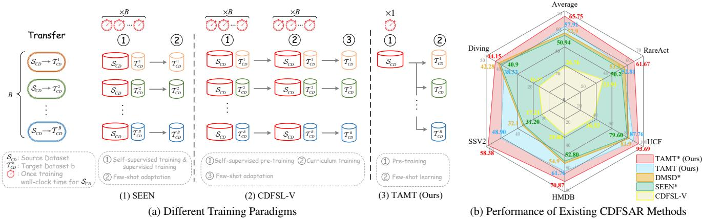
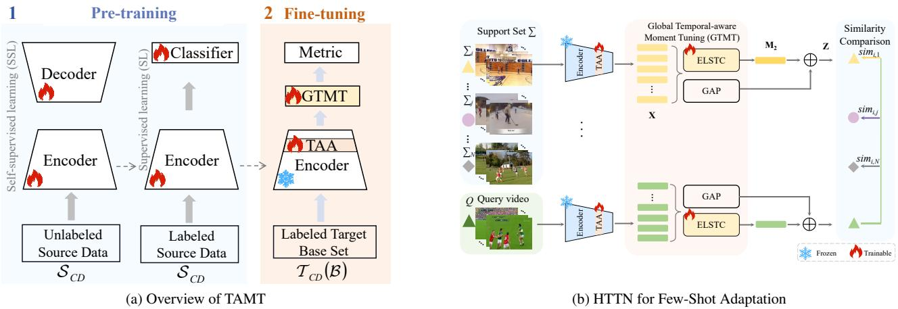
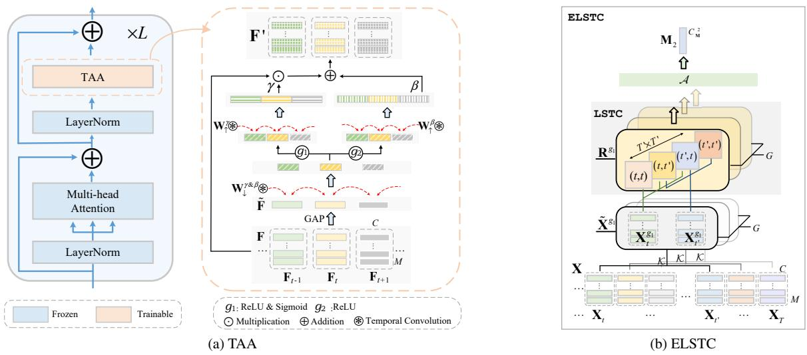
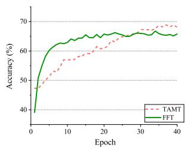
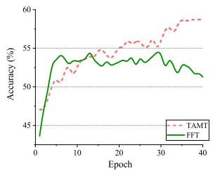

# TAMT: Temporal-Aware Model Tuning for Cross-Domain Few-Shot Action Recognition

Yilong Wang1,\* Zilin Gao2,∗ Qilong Wang1,† Zhaofeng Chen3 Peihua $\mathrm { L i ^ { 2 } }$ Qinghua Hu1 1Tianjin University 2Dalian University of Technology 3Yancheng Institute of Technology

## Abstract

Going beyond few-shot action recognition (FSAR), crossdomain FSAR (CDFSAR) has attracted recent research interests by solving the domain gap lying in source-to-target transfer learning. Existing CDFSAR methods mainly focus on joint training of source and target data to mitigate the side effect of domain gap. However, such kind of methods suffer from two limitations: First, pair-wise joint training requires retraining deep models in case ofone source data and multiple target ones, which incurs heavy computation cost, especiallyfor large source and small target data. Second, pre-trained models after joint training are adopted to target domain in a straightforward manner, hardly taking full potential ofpre-trained models and then limiting recognition performance. To overcome above limitations, this paper proposes a simple yet effective baseline, namely Temporal-Aware Model Tuning (TAMT)for CDFSAR. Specifically, our TAMT involves a decoupled paradigm by performing pre-training on source data and fine-tuning target data, which avoids retrainingfor multiple target data with single source. To effectively and efficiently explore the potential ofpre-trained models in transferring to target domain, our TAMT proposes a Hierarchical Temporal Tuning Network (HTTN), whose core involves local temporal-aware adapters (TAA) and a global temporal-aware moment tuning (GTMT). Particularly, TAA learnsfew parameters to recalibrate the intermediatefeatures offrozen pre-trained models, enabling efficient adaptation to target domains. Furthermore, GTMT helps to generate powerful video representations, improving match performance on the target domain. Experiments on several widely used video benchmarks show our TAMT outperforms the recently proposed counterparts by 13%∼31%, achieving new state-of-the-art CDFSAR results.

## 1. Introduction

Few-shot action recognition (FSAR) aims to develop video recognition models with high generalization ability by using limited annotated samples, which has achieved remarkable progress with the rapid development of deep models and pretraining techniques [6, 17, 27, 45–48, 50, 52, 54, 55]. Going beyond FSAR, cross-domain FSAR (CDFSAR) has been attracting recent research interests [38, 49], which focuses on transferring knowledge from the well-annotated source domain to target one with few annotated samples. Intuitively, the domain gap between source and target data will clearly impact the performance of transfer learning [1, 15, 29].

As a seminal work, SEEN [49] proposes a joint training paradigm to alleviate side effect of domain gap, where a parameter-shared model is trained on source data and target one with supervision learning and self-supervised contrastive learning objectives, respectively. After the joint training, a simple nearest neighbor classifier is straightforwardly used for inference in target domain. As a parallel work, CDFSL V [38] proposes a two-stage joint training paradigm, where the model is first pre-trained on source and target data in a self-supervised manner, and then a curriculum learning is developed to further tune the model on source and target data. Subsequently, a few-shot classifier is fine-tuned on the annotated target data for inference.

Although some advanced efforts are made [38, 49], they generally suffer from two limitations. First, both SEEN [49] and CDFSL-V [38] involve joint training paradigms. As illustrated in Fig. 1a (1) and (2), they require to retrain the models B times, given a single source data $ { \boldsymbol { S } } _ { C D }$ and B target data $\{ \mathcal T _ { C D } ^ { 1 } , \cdot \cdot \cdot , \mathcal T _ { C D } ^ { B } \}$ (a commonly used setting [38, 49]). It potentially incurs heavy computation cost due to frequent retraining on source data $ { \boldsymbol { S } } _ { C D }$ , especially for large $\scriptstyle { S _ { C D } }$ and small $\mathcal { T } _ { C D } ^ { b } .$ . Second, during the inference stage, pre-trained models are generally adopted to target domain in a straightforward manner, i.e., simple nearest neighbor classifier [49] or a fine-tuned classifier [38]. They hardly take full advantage of pre-trained models to dynamically fit target data with the frozen backbone, and so potentially limit the final recognition performance.

To address the above limitations, this paper proposes a simple yet effective baseline, namely Temporal-Aware Model Tuning (TAMT). Particularly, as shown in Fig. 1a (3), our TAMT involves a decoupled paradigm by pre-training the model on source data and subsequently fine-tuning it on target data. For model pre-training, we introduce a selfsupervised followed by a supervised learning scheme to consider abilities of both generalization and semantic features extraction. As such, in the case of one source data and multiple target data, our TAMT only requires model pre-training one time, significantly decreasing training cost.

  
Figure 1. (a) Comparison of existing CDFSAR methods in terms of training paradigm under the case of a single source data $ { \boldsymbol { S } } _ { C D }$ and B target data $\{ \mathcal T _ { C D } ^ { 1 } , \bar { \cdot } \cdot \cdot , \mathcal T _ { C D } ^ { B } \}$ . (b) Comparison (%) of existing CDFSAR methods with K-100 as source data. All results are conducted with $1 1 2 \times 1 1 2$ resolution except methods marked by \* (224 × 224 resolution)

To explore the potential of pre-trained models in domain adaptation, our TAMT proposes a Hierarchical Temporal Tuning Network (HTTN), whose core involves local Temporal-Aware Adapters (TAA) and a Global Temporalaware Moment Tuning (GTMT). Particularly, TAA introduces few learnable parameters to recalibrate a part of intermediate features outputted by frozen pre-training models, which helps adapt pre-training models to target data efficiently. By considering the significance of global representations in metric-based few-shot classification, our GTMT proposes to exploit spatio-temporal feature distribution approximated first- and second-order moments to generate powerful video representations. Particularly, GTMT presents an efficient long-short temporal covariance (ELSTC) to effectively compute second-order moments of spatio-temporal features. By equipping with TAA and GTMT, our HTTN dynamically adopts pre-trained models to target data in an effective and efficient way, clearly improving recognition performance. As shown in Fig. 1b, our proposed TAMT can bring significant performance gains over existing methods with lower training cost. To evaluate our TAMT, experiments are conducted on five source datasets (i.e., Kinetics-400 (K-400) [7], Kinetics-100 (K-100) [59], Something-Something V2 (SSV2) [16], Diving48 (Diving) [24] and UCF-101 (UCF) [41]) and five target datasets (i.e., HMDB51 (HMDB) [23], SSV2, Diving, UCF-101 (UCF) [41] and RareAct [30]). The contributions of this work can be summarized as follows:

1) In this paper, we propose a simple yet effective baseline for the cross-domain few-shot action recognition (CDFSAR) task, namely Temporal-Aware Model Tuning (TAMT). To our best knowledge, TAMT makes the first attempt to introduce a decoupled training paradigm for CDFSAR, effectively avoiding frequent retraining in the case of one source data and multiple target data.

2) Unlike previous CDFSAR works, our TAMT pays more attention to effectively and efficiently adopting pre-trained models to target data. Particularly, a lightweight Hierarchical Temporal Tuning Network (HTTN) is proposed to recalibrate intermediate features and generate powerful video representations for the frozen pre-training models via local Temporal-Aware Adapters (TAA) and a Global Temporal-aware Moment Tuning (GTMT), respectively.

3) Extensive experiments are conducted on various video benchmarks, and the results show our TAMT significantly outperforms the recently proposed CDFSAR methods.

## 2. Related Work

## 2.1. Few-Shot Action Recognition

With the development of large video models and the insurmountable success of action recognition methods [2, 9, 26, 35, 44, 51, 53, 56], few-shot action recognition methods are emerging and thriving. Existing few-shot action recognition methods mainly use pre-trained backbone models on image benchmarks (e.g., ImageNet-1k [10] and CLIP [37]), which focus on the frame-level alignment between query and support videos in few-shot learning (FSL). Some early researches [3, 5, 6] estimate temporal alignment for frame-level features to match the query videos and support set. TRX [33] leverages an attentional mechanism to match each query video with all videos in the support set. HyRSM [45] introduces a hybrid relation module and designs a Bi-MHM for flexible matching. STRM [42] proposes a spatio-temporal enrichment module to analyze spatial and temporal contexts. MASTAF [27] uses self-attention and cross-attention modules to increase the inter-class variations while decrease the intra-class variations. MoLo [48] learns long-range temporal context and motion cues for comprehensive few-shot matching. CLIP-FSAR [52] devises a videotext contrastive objective and proposes a prototype modulation to fully utilize the rich semantic priors in CLIP. Different from the aforementioned works, our method aims to perform an effective yet efficient temporal-aware model tuning on the pre-trained frozen backbones to realize CDFSAR tasks.

## 2.2. Cross-Domain Few-Shot Action Recognition

Cross-domain few-shot learning requires base and test data from different domains. BS-CDFSL [19] first introduces an image benchmark for cross-domain few-shot learning, and early studies handle cross-domain action recognition by mainly focusing on deep feature learning and crossdomain learning [12]. Meanwhile, as supplements, previous works [13, 14] also introduce some source-target data pairs to evaluate the performance of CDFSAR. Recently, SEEN [49] proposes to integrate supervised learning with an auxiliary self-supervised contrastive learning to tackle the issue of domain gap lying in CDFSAR task. For above works [13, 14, 49], there exist some shared classes lying in the constructed source-target data pairs, which however, is not expected in CDFSL task. CDFSL-V [38] proposes a new benchmark to solve this problem by removing all overlapping classes between the source and target datasets. DMSD [18] designs two branches called the original-source and the mixed-source branches for meta-training based on the pipeline of CDFSL-V. But different from pair-wise joint training studied in previous CDFSAR methods [18, 38, 49], our proposed TAMT develops a decoupled paradigm to avoid frequent retraining in case of one source data and multiple target data, while proposing an HTTN method to effectively and efficiently adapt pre-training models for the target domain. Experimental comparisons (Sec. 4.2) show our TAMT significantly outperforms existing counterparts.

## 3. Method

In this section, we first provide a brief definition of CDFSAR task. Then, we show the overview of our decoupled TAMT paradigm, which pre-trains models on source data while fine-tuning the pre-trained models on target one. Finally, we detailedly introduce the proposed hierarchical temporal tuning network (HTTN) for model tuning on target domain, which consists of local Temporal-Aware Adapters (TAA) and Global Temporal-aware Moment Tuning (GTMT).

## 3.1. Problem Formulation

CDFSAR task aims to develop an FSAR model for mitigating the side effect brought by domain gap between the source dataset $ { \boldsymbol { S } } _ { C D }$ and the target dataset $\mathcal { T } _ { C D }$ . In the context of cross-domain, the model could be trained on well-annotated $\scriptstyle { S _ { C D } }$ and $\mathcal { T } _ { C D }$ with few annotated samples. After that, the transferring performance of the proposed method is evaluated on target domain $\mathcal { T } _ { C D }$ . In the target-domain $\mathcal { T } _ { C D }$ , the pre-trained model is evaluated on its novel (test) set $\mathcal { N }$ under FSL protocol, by providing training samples from its base (training) set B, w.r.t., $\mathcal { T } _ { C D } = B \bigcup \mathcal { N }$ . For one FSL inference unit (dubbed as task or episode), it consists of unknown query videos $\{ \mathcal { Q } _ { 1 } , \cdots , \mathcal { Q } _ { U } \}$ , and an annotated support set Σ. For N-way K-shot setting, each episode involves N categories and each category has K samples in Σ. The final goal of CDFSAR is to accurately classify each query video $\mathcal { Q } _ { i }$ by leveraging the limited data available in the support set Σ. Particularly, to assess the transferring performance in a convincing way, the classes are non-overlapping in $ { \boldsymbol { S } } _ { C D }$ and $\mathcal { T } _ { C D } , \mathrm { i . e . } , \mathcal { S } _ { C D } \bigcap \mathcal { T } _ { C D } = \emptyset$ , and $\mathcal { N } \cap \boldsymbol { B } = \boldsymbol { \mathcal { O } }$ for FSL.

## 3.2. Overview of Temporal-aware Model Tuning

Compared to FSAR, CDFSAR is further challenged by domain gap lying in source-to-target transfer learning. Previous works [38, 49] develop some joint training paradigms on source and target data to mitigate side effect of domain gap. As shown in Fig. 1a, joint training paradigm generally suffers from model retraining in case of one source and multiple target data. Besides, they take no full advantage of pre-trained models by using some straightforward fewshot adaptation methods, potentially limiting recognition performance. To solve above issues, we propose a decoupled training paradigm, namely TAMT. As shown in Fig. 2 (a), our TAMT can be summarized as two phases: pre-training on $\scriptstyle { S _ { C D } }$ and fine-tuning on $\mathcal { T } _ { C D }$ . Specifically, the model is first pre-trained on $ { \boldsymbol { S } } _ { C D }$ to learn the knowledge from source domain. Subsequently, it is fine-tuned on $\mathcal { T } _ { C D }$ to perform transfer learning on target domain. The details are as follows. Pre-training on Source Data. In this work, our TAMT pre-trains the models only on source data. To consider both generalization and representation abilities of pre-trained model, our TAMT develops a two-stage pre-training strategy. Inspired by success of self-supervised learning (SSL) on video pre-trained models [43], we first introduce the reconstruction-based SSL solution to train our models for capturing general spatio-temporal structures lying videos, helping our pre-trained models can be well generalized to various downstream tasks. However, such SSL solution usually focuses on the fundamental features [20], while neglecting high-level semantic information [31, 36, 44, 58], and limiting representation or discriminative abilities of pretrained models. Existing works [31, 36, 58] make attempts to combine reconstruction-based SSL with self-supervised contrastive learning to improve discriminative ability of pretrained models. By considering the samples are well annotated on source data, we simply incorporate a supervised learning (SL) after SSL to enhance the representation ability of pre-trained models. To be specific, the encoder E of the model is first trained with reconstruction-based SSL, and then it is optimized with recognition objectives on annotated SCD. As such, our two-stage pre-training strategy potentially achieves generalization and representation trade-off, where both SSL and SL play key roles in the final performance. More analysis can refer to Sec. 4.3.

  
Figure 2. (a) Overview of our TAMT paradigm, which pre-trains the models on $ { \boldsymbol { S } } _ { C D }$ and fine-tunes them on $\mathcal { T } _ { C D }$ . Specifically, for pre-training stage, the model is first optimized with a reconstruction-based SSL solution, while the encoder E is post-trained with the SL objective. Subsequently, the pre-trained E is fine-tuned for few-shot adaptation on $\mathcal { T } _ { C D }$ by using our HTTN. (b) HTTN for few-shot adaptation, where a metric-based is used for few-shot adaptation. Particularly, our HTTN consists of local Temporal-Aware Adapters (TAA) and Global Temporal-aware Moment Tuning (GTMT).

Fine-tuning on Target Data. By considering the issue of domain shift between source data and target one, we propose a hierarchical temporal tuning network (HTTN), aiming to effectively and efficiently adopt the pre-trained model E to target domain. In particular, we construct our HTTN by using a metric-based FSL pipeline [40]. To fully explore the potential of the frozen pre-trained models in transferring to target domain, we present local temporal-aware adapters (TAA) and a global temporal-aware moment tuning (GTMT) to recalibrate the intermediate features and generate powerful video representations according to few annotated samples on target domain, respectively. The details of our HTTN will be described in the following subsection.

## 3.3. Hierarchical Temporal Tuning Network

To perform few-shot adaptation of pre-trained models on target domain $\mathcal { T } _ { C D }$ , we propose a Hierarchical Temporal Tuning Network (HTTN). As depicted in Fig. 2 (b), our HTTN integrates several local Temporal-Aware Adapters (TAA) into last-L transformer blocks of pre-trained model E, and insert a Global Temporal-aware Moment Tuning (GTMT) module with efficient long-short temporal covariance (EL-STC) at the end of E. Given an input video, the features are extracted by the frozen E, which are recalibrated by our TAA modules and subsequently fed into GTMT to generate final representation. Ultimately, the representations derived from query and support videos are compared using a similarity metric, which serves as logits for training and inference.

Local Temporal-Aware Adapter (TAA). In the decoupled training protocol of TAMT, it is important to utilize target domain for tuning source pre-trained model. However, the conventional full fine-tuning (FFT) strategy will optimize all of the parameters, bringing high training consumption and potentially posing the risk of overfitting, particularly in the few-shot learning scenario. As suggested in previous works for NLP and image classification tasks [21, 25], we introduce a parameter-efficient approach for recalibrating video features in a temporal-aware manner.

Given a certain intermediate-layer feature $\mathbf { F } \in \mathbb { R } ^ { T \times M \times C }$ where T, M, C denotes temporal length, token number in one frame and channel number, respectively. TAA introduces a few learnable scale and bias parameters for features of each frame, which can be written as follows:

$$
\mathbf { F } ^ { \prime } = \gamma \odot \mathbf { F } \oplus { \boldsymbol { \beta } } ,\tag{1}
$$

where $\odot$ and $\oplus$ represent the multiplication and addition operations, respectively. For the sake of convenience, here we omit the expansion operation along M dimension for scale $\gamma \in \mathbb { R } ^ { T \times \dot { C } }$ and bias ${ \bar { \boldsymbol { \beta } } } \in \mathbb { R } ^ { T \times C }$ . Particularly, γ and $\beta$ indicate the temporal cues of F decided by transformation functions W and G respectively. Therefore, we have

$$
\gamma = \mathcal { W } \left( \widehat { \mathbf { F } } \right) = \mathbf { W } _ { \uparrow } ^ { \gamma } \circledast g _ { 1 } \left( \mathbf { W } _ { \downarrow } ^ { \gamma } \circledast \widehat { \mathbf { F } } \right) ,\tag{2}
$$

$$
\boldsymbol { \beta } = \mathcal { G } \left( \widehat { \mathbf { F } } \right) = \mathbf { W } _ { \uparrow } ^ { \beta } \circledast g _ { 2 } \left( \mathbf { W } _ { \downarrow } ^ { \beta } \circledast \widehat { \mathbf { F } } \right) ,\tag{3}
$$

where $\widehat { \mathbf { F } } \in \mathbb { R } ^ { T \times C }$ presents the output of global average pooling on F. By taking Eqn. (2) as an example, function W is efficiently implemented by a two-layer temporal convolution with temporal kernel $k _ { t } ~ > ~ 1$ (denoted as $\circledast$ effectively capturing the temporal information. Particularly, for parameter efficiency, W is realized by involving a dimensionality reduction operation $C \to { \frac { C } { o } } { \overset { \cdot } { \to } } C$ with a hyper parameter of $\rho$ and parameters of $\mathbf { W } _ { \downarrow } ^ { \gamma }$ and $\mathbf { W } _ { \uparrow } ^ { \gamma }$ . And the operation $g _ { * }$ is on behalf of the activation function, aiming to enhance the non-linear relation, among which $g _ { 1 }$ is a ReLU layer followed by a sigmoid function, $g _ { 2 }$ is a single ReLU layer. Moreover, for further parameter efficiency, $\mathbf { W } _ { \downarrow } ^ { \gamma }$ and $\mathbf { W } _ { \downarrow } ^ { \beta }$ are implemented with a parameter-shared $\mathbf { W } _ { \downarrow } ^ { \gamma \& \beta }$ , w.r.t., $\mathbf { W } _ { \downarrow } ^ { \gamma \& \beta } : = \mathbf { W } _ { \downarrow } ^ { \gamma } : = \mathbf { W } _ { \downarrow } ^ { \beta }$ . The structure of TAA is illustrated in Fig. 3 (a). Practically, $\rho$ is set to 4 and $k _ { t } = 3$ throughout all of experiments in this work.

  
Figure 3. Overview of our proposed Hierarchical Temporal Tuning Network (HTTN), where (a) local temporal-aware adapters (TAA) are inserted into the last L transformer blocks to recalibrate the intermediate features of frozen pre-training models in an efficient manner. At the end of HTTN, a Global Temporal-aware Moment Tuning (GTMT) module with efficient long-short temporal covariance (ELSTC) is used to obtain powerful video representations for improving matching performance.

Note that, as shown in Fig. 3 (a), our light-weight TAA is generally embedded into last-L transformer blocks in a plug-and-play manner. Thus, HTTN can be efficiently tuned by freezing most of the pre-trained parameters, and only partially learning a few parameters, which provides a both parameter- and memory-efficient tuning solution for the pre-trained model. Simple adapters [21, 25] focus only on modeling spatial information, our TAA additionally learns temporal information. And different from other temporal adapters [8, 32], which respectively uses an autoregressive task and 3D depth-wise convolution for temporal alignment and adapter, our TAA efficiently re-scales and translates video features in a temporal-aware way.

Global Temporal-Aware Moment Tuning (GTMT). In general, the FSL task can be regarded as a comparison problem between query and support representations $\mathbf { Z } _ { \mathcal { Q } _ { i } }$ and $\mathbf { Z } _ { S _ { j } }$ in query video set $\mathcal { Q } _ { i }$ and support video set $S _ { j }$ , i.e., s $\ i m _ { i , j } = { \mathcal { D } } \left( \mathbf { Z } _ { { \mathcal { Q } } _ { i } } , \mathbf { Z } _ { { \mathcal { S } } _ { j } } \right)$ where D is a pre-defined metric. Intuitively, a powerful representation Z will help the matching performance. By considering that previous works [38, 49] take no merit of rich statistical information inherent in deep features, our HTTN proposes Global Temporal-Aware Moment Tuning (GTMT) method to exploit probability distribution for modeling video features, which can effectively characterize statistics of features and provide powerful representations [4, 11]. Let $\mathbf { X } \in \mathbb { R } ^ { T \times \mathbf { \bar { M } } \times C }$ be the features from the last transformer block of HTTN, the probability distribution of features X can be approximately portrayed by feature moment [11]. Let $\Phi _ { \mathbf { X } } ( u )$ be characteristic function of features X with argument $u \in \mathbb { R } , \mathbf { Z }$ can be written as:

$$
\mathbf { Z } : = \Phi _ { \mathbf { X } } ( u ) = 1 + \alpha _ { 1 } \mathbf { M } _ { 1 } + \alpha _ { 2 } \mathbf { M } _ { 2 } + \cdots = 1 + \sum _ { p = 1 } ^ { \infty } \alpha _ { p } \mathbf { M } _ { p } ,\tag{4}
$$

where $\mathbf { M } _ { p }$ indicates the $p ^ { t h }$ -order moment of X and $\alpha _ { p } \in \mathbb { R }$ is the coefficient. For the consideration of computational cost, p is maximum to 2, which involves the zero-, first-, and second-order moments.

By considering the temporal dynamic in the video features, we compute the first- and second-order moment ${ { \bf { M } } _ { 1 } }$ and $\mathbf { M } _ { 2 }$ in a temporal manner. To be specific, ${ { \bf { M } } _ { 1 } }$ can be obtained by the global average pooling (GAP) layer:

$$
\mathbf { M } _ { 1 } = \mathtt { G A P } \left( \mathbf { X } \right) = \frac { 1 } { T M } \sum _ { t = 1 } ^ { T } \sum _ { m = 1 } ^ { M } \mathbf { X } _ { t , m } .\tag{5}
$$

However, a straightforward implementation of the secondorder moment $\mathbf { M } _ { 2 } .$ , referring to a simple temporal covariance with concurrently considering interaction across all frames (termed as TCov), typically needs $\left( T C \right) ^ { 2 }$ -dimensional computation consumption. Thereby, we propose an Efficient Long-Short Temporal Covariance layer (ELSTC),

$$
\mathbf { M } _ { 2 } = \mathrm { E L S T C } \left( \mathbf { X } \right) = \mathcal { A } \left( \mathrm { L S T C } \left( \mathbf { X } ^ { g _ { 1 } } \right) ; \cdot \cdot \cdot ; \mathrm { L S T C } \left( \mathbf { X } ^ { g _ { G } } \right) \right) .\tag{6}
$$

For high efficiency, the sequence feature X is split into $G$ groups along temporal dimension and can be rewritten as: $\mathbf { X } = [ \mathbf { X } ^ { g _ { 1 } } ; \cdot \cdot \cdot ; \mathbf { X } ^ { g _ { G } } ]$ , where notation [·] indicates concatenation. For group $g _ { e }$ $\mathbf { X } ^ { g _ { e } } \in \mathbb { R } ^ { T ^ { \prime } \times M \overset { . } { \times } \overset { . } { C } }$ is with temporal length $\begin{array} { r } { T ^ { \prime } = \frac { \mathbf { \bar { \Phi } } _ { T } } { G } } \end{array}$ , leading to reduce the computation consumption G times. In each group $g _ { e } ,$ , aiming for temporal-aware modeling, we devise LSTC to compute long-short temporal covariance as follows:

$$
\mathsf { L S T C } \left( \mathbf { X } ^ { g _ { e } } \right) = \left\{ \mathbf { R } _ { t , t ^ { \prime } } ^ { g _ { e } } \right\} _ { t , t ^ { \prime } } ^ { T ^ { \prime 2 } } ;\tag{7}
$$

$$
\mathbf { R } _ { t , t ^ { \prime } } ^ { g _ { e } } = \frac { 1 } { M } \sum _ { m = 1 } ^ { M } \widetilde { \mathbf { X } } _ { t , m } ^ { g _ { e } \top } \widetilde { \mathbf { X } } _ { t ^ { \prime } , m } ^ { g _ { e } } ; \widetilde { \mathbf { X } } = \mathcal { K } \left( \mathbf { X } \right) .\tag{8}
$$

In group $g _ { e }$ , the covariance matrix $\mathbf { R } _ { t , t ^ { \prime } } ^ { g _ { e } } \in \mathbb { R } ^ { \frac { C } { \tau } \times \frac { C } { \tau } }$ captures temporal correlation between t-th and $t ^ { \prime } .$ -th frame of $ { \widetilde { \mathbf { X } } } \in$ $\begin{array} { r } { \mathbb { R } ^ { T ^ { \prime } \times M \times \frac { C } { \tau } } } \end{array}$ . The feature $\widetilde { \mathbf { X } }$ is a transformation of $\mathbf { X }$ with an MLP layer $\kappa .$ , bringing the dimension reduction by a hyper parameter τ : $\begin{array} { r } { C  \frac { C } { \tau } } \end{array}$ . ⊤ represents transposition operation.

In particular, for one covariance matrix $\mathbf { R } _ { t , t ^ { \prime } } ^ { g _ { e } }$ ′ in group $g _ { e } ,$ , the timestamps t and $t ^ { \prime }$ always have a temporal gap $\Delta ,$ ranging from 0 to $( T - G )$ with an interval of G. For $\Delta = 0$ $\mathbf { R } _ { t , t } ^ { g _ { e } }$ indicates the static appearance information of $\widetilde { \mathbf { X } } _ { t } ^ { g _ { e } }$ , and for other $\Delta \neq 0 , \mathbf { R } _ { t , t } ^ { g _ { e } }$ ′ outputs the temporal cross-covariance of $\widetilde { \mathbf { X } } _ { t } ^ { g _ { e } }$ and $\widetilde { \mathbf { X } } _ { t + \Delta } ^ { g _ { e } }$ . As a result, the output of LSTC $\left( \mathbf { X } ^ { g _ { e } } \right)$ describes the various temporal correlations from short-term (one frame) static appearance to long-term crossing $( T - G )$ frames motion information.

Furthermore, the outputs derived from G groups are ultimately summarized with ${ \mathcal { A } } ,$ generating a holistic video representation $\mathbf { M } _ { 2 }$ . To the sake of clarity, the output of LSTC for group $g _ { e }$ is rewritten as $\mathbf { Y } ^ { g _ { e } } \in \check { \mathbb { R } } ^ { T ^ { \prime } \frac { C } { \tau } \times T ^ { \prime } \frac { C ^ { \star } } { \tau } \times 1 }$ by concatenating all $\{ \mathbf { R } _ { * , * } ^ { g _ { e } } \}$ in group $g _ { e }$ . And then, $\mathbf { M } _ { 2 }$ is:

$$
{ \bf M } _ { 2 } = { \mathcal A } \left( { \bf Y } ^ { g _ { 1 } } , \cdot \cdot \cdot , { \bf Y } ^ { g _ { G } } \right) ,\tag{9}
$$

where the indication A denotes two convolutional layers with $k _ { c } \times k _ { c }$ kernel, with each followed by a BN layer and ReLU activation function. By setting the proper stride and output channel, the dimension of G-group output is changed from $T ^ { \prime } { \frac { C } { \tau } } \times T ^ { \prime } { \frac { C } { \tau } } \times G$ to $C _ { \mathbf { M } } \times C _ { \mathbf { M } } \times 1$ , and vectorized to $C _ { \mathbf { M } } ^ { 2 } \times 1$ ultimately. By omitting the constant zero-order in Eqn. (4), the final representation of our HTTN is expressed by combining the first and second-order moment as follows:

$$
\mathbf { Z } = \mathcal { H } \left( \mathbf { M } _ { 2 } \right) \oplus \mathbf { M } _ { 1 } ,\tag{10}
$$

where a linear projection H is used to align the dimension of $\mathbf { M } _ { 2 }$ with that of ${ { \bf { M } } _ { 1 } }$ , i.e., $C _ { \mathbf { M } } ^ { 2 } \to C$ . In this work, $k _ { c } =$ $3 , \tau = 6 , C _ { \bf M } = 6 4$ for all experiments.

## 4. Experiments

We extensively compare our TAMT with state-of-the-arts on both CDFSAR and FSAR tasks (see supplementary material), and conduct the ablation study on CDFSAR task.

## 4.1. Experimental Settings

Datasets. For CDFSAR task, we use the K-400 [7], K-100 [59], SSV2 [16], Diving [24] and UCF [41] as the source domains $\mathcal { S } _ { C D } .$ , which transfer to following five target domains $\tau _ { C D } \mathrm { : }$ HMDB [23], SSV2, Diving, UCF and RareAct [30]. For the source datasets, we follow the nonoverlapping setting protocol [38] between $\scriptstyle { S _ { C D } }$ and $\mathcal { T } _ { C D }$ in cross-domain scenario. Specifically, source datasets K-400 and K-100 are removed some shared classes with UCF and HMDB, resulting in 364 and 61 categories retained respectively. For the target datasets, we utilize established splits for HMDB, SSV2, Diving and UCF as outlined in previous studies [27, 38, 39, 45, 48, 57]. For RareAct database, we split the base, validation and novel set with 48, 8 and 8 classes. For FSAR task, TAMT is evaluated on SSV2, HMDB and UCF, whose splits follow their configurations in CDFSAR. Implementation Details. We adopt VideoMAE [43] as the backbone, which is respectively built on ViT-S or ViT-B architectures for CDFSAR and FSAR for fair comparison. If not specified otherwise, the input resolution is $1 1 2 \times 1 1 2$ for ViT-S in CDFSAR and $2 2 4 \times 2 2 4$ in ViT-B for FSAR. The video inputs of the model are set to 16 frames, and then they are reduced to 8 in the patch embedding stage before the first transformer block. For optimization, we use SGD as the optimizer and adopt a cosine decay strategy to schedule the learning rate. The training epochs are set to 400, 140 and 40 for the SSL, SL and fine-tuning, respectively. In the pre-training phase, we employ the mean squared error and cross-entropy (CE) losses for SSL and SL, respectively. For the fine-tuning phase, we use CE loss. Euclidean distance is served as the metric function D. We report accuracy in 5-way 1-shot and 5-way 5-shot settings on a single view, averaging 10,000 episodes for inference. Source code is available at https://github.com/TJU-YDragonW/TAMT.

## 4.2. Comparison with State-of-the-Arts

To fully evaluate our TAMT in the CDFSAR task, we conduct experiments with 5 source datasets and 5 target datasets, which form a nearly one-vs.-one cross-domain setting. Besides, we compare with state-of-the-art CDFSAR methods, which to our best knowledge cover all published CDFSAR works. The results of different methods in terms of 5-way 5-shot accuracy are reported in Tab. 1, where the best and second best results are highlighted in red and blue font, respectively. From Tab. 1 we can conclude that (1) our TAMT outperforms existing methods by 13%∼31% across all settings, leading to large performance gains. (2) On two widely used source datasets (K-400 and K-100), TAMT outperforms CDFSL-V [38] by an average of 21.13% and 31.15% across five target datasets, respectively. For the source datasets SSV2, Diving and UCF, our TAMT achieves improvements of 28.02%, 17.92% and 13.11% over CDFSL-V on average across different target datasets. (3) TAMT achieves performance improvements of 18.07%, 27.18%, 3.25%, 14.09%, and 11.47% over SEEN [49] across five target domains, while outperforming DMSD [18] with 15.97%, 26.28%, 1.87%, 11.79% and 8.37%. Furthermore, compared to CDFSL-V, our TAMT with decoupled training paradigm has nearly 5× less training computational cost1. These results above clearly demonstrate that our TAMT provides a promising baseline for the CDFSAR task in terms of both efficiency and effectiveness.

<table><tr><td rowspan="2">Method</td><td rowspan="2">Source</td><td colspan="6">Target</td></tr><tr><td>HMDB</td><td>SSV2</td><td>Diving</td><td>UCF</td><td>RareAct</td><td>Average</td></tr><tr><td>STARTUP++ [34]</td><td rowspan="7">K-400</td><td>44.71</td><td>39.60</td><td>14.92</td><td>60.82</td><td>45.22</td><td>41.05</td></tr><tr><td>DD++ [22]</td><td>48.04</td><td>44.50</td><td>16.23</td><td>63.26</td><td>47.01</td><td>43.81</td></tr><tr><td>STRM [42]</td><td>24.98</td><td>35.01</td><td>16.69</td><td>42.33</td><td>39.01</td><td>31.60</td></tr><tr><td>HYRSM [45]</td><td>29.81</td><td>40.09</td><td>17.57</td><td>45.65</td><td>44.27</td><td>35.49</td></tr><tr><td>CDFSL-V [38]</td><td>53.23</td><td>49.92</td><td>17.84</td><td>65.42</td><td>49.80</td><td>47.24</td></tr><tr><td>TAMT (Ours)</td><td>74.14</td><td>59.18</td><td>45.18</td><td>95.92</td><td>67.44</td><td>68.37(+21.13)</td></tr><tr><td>TAMT* (Ours)</td><td>77.82</td><td>64.20</td><td>49.16</td><td>97.08</td><td>73.31</td><td>72.31</td></tr><tr><td>STARTUP++ [34]</td><td rowspan="7">K-100</td><td>24.97</td><td>15.16</td><td>14.55</td><td>32.20</td><td>31.77</td><td>23.73</td></tr><tr><td>DD++ [22]</td><td>25.99</td><td>16.00</td><td>16.24</td><td>34.10</td><td>31.20</td><td>24.71</td></tr><tr><td>SEEN*† [49]</td><td>52.80</td><td>31.20</td><td>40.90</td><td>79.60</td><td>50.20</td><td>50.94</td></tr><tr><td>CDFSL-V [38]</td><td>29.80</td><td>17.21</td><td>16.37</td><td>36.53</td><td>33.91</td><td>26.76</td></tr><tr><td>DMSD*† [18]</td><td>54.90</td><td>32.10</td><td>42.28</td><td>81.90</td><td>53.30</td><td>52.90</td></tr><tr><td>TAMT (Ours)</td><td>61.76</td><td>48.90</td><td>38.33</td><td>87.76</td><td>52.81</td><td>57.91(+31.15)</td></tr><tr><td>TAMT* (Ours)</td><td>70.87</td><td>58.38</td><td>44.15</td><td>93.69</td><td>61.67</td><td>65.75</td></tr><tr><td>CDFSL-V [38]</td><td rowspan="2">SSV2</td><td>29.86</td><td></td><td>17.60</td><td>33.30</td><td>35.25</td><td>29.00</td></tr><tr><td>TAMT (Ours)</td><td>63.66</td><td></td><td>38.75</td><td>83.45</td><td>42.23</td><td>57.02(+28.02)</td></tr><tr><td>CDFSL-V [38]</td><td rowspan="2">Diving</td><td>28.45</td><td>17.46</td><td></td><td>31.98</td><td>34.11</td><td>28.00</td></tr><tr><td>TAMT (Ours)</td><td>45.18</td><td>38.09</td><td>1</td><td>63.52</td><td>36.88</td><td>45.92(+17.92)</td></tr><tr><td>STARTUP++ [34]</td><td rowspan="4">UCF</td><td>23.56</td><td></td><td>14.84</td><td></td><td>31.31</td><td>23.24</td></tr><tr><td>DD++ [22]</td><td>24.06</td><td></td><td>16.15</td><td></td><td>32.00</td><td>24.07</td></tr><tr><td>CDFSL-V [38]</td><td>28.86</td><td></td><td>16.07</td><td></td><td>33.91</td><td>26.82</td></tr><tr><td>TAMT (Ours)</td><td>45.34</td><td></td><td>33.38</td><td></td><td>41.08</td><td> $\underline { { 3 9 . 9 3 _ { ( + 1 3 . 1 1 ) } } }$ </td></tr></table>

Table 1. Comparison(%) of state-of-the-arts on CDFSAR setting in terms of 5-way 5-shot accuracy, where five datasets (K-400, K-100 SSV2, Diving and UCF) are used as source data for transferring to five target datasets. All results are conducted with 112 × 112 resolution by using ViT-S backbone, except methods marked by $^ { * } \left( 2 2 4 \times 2 2 4 \right.$ resolution) and marked by † (backbone of ResNet-18).
<table><tr><td colspan="2">Pre-tr</td><td colspan="10">Tuning</td><td rowspan="2">Average</td><td rowspan="2"></td></tr><tr><td>SSL</td><td>SL</td><td></td><td>SSV2</td><td></td><td></td><td>Diving</td><td></td><td></td><td>UCF</td><td></td><td></td></tr><tr><td rowspan="2">√</td><td></td><td>Frozen</td><td>FFT</td><td>TAMT</td><td>Frozen</td><td>FFT</td><td>TAMT</td><td>Frozen</td><td>FFT</td><td>TAMT</td><td>Frozen</td><td>FFT</td><td>TAMT</td></tr><tr><td></td><td>29.27</td><td>48.99</td><td>47.21</td><td>22.10</td><td>35.13</td><td>33.59</td><td>55.30</td><td>80.92</td><td>77.59</td><td>35.56</td><td>55.01</td><td>52.80</td></tr><tr><td>√</td><td>√</td><td>34.91</td><td>41.39</td><td>45.15</td><td>27.15</td><td>33.27</td><td>37.96</td><td>88.41</td><td>89.36</td><td>89.73</td><td>50.16</td><td>54.67</td><td>56.48</td></tr><tr><td></td><td>√</td><td>40.45</td><td>55.99</td><td>59.18</td><td>28.09</td><td>42.85</td><td>45.18</td><td>94.69</td><td>94.95</td><td>95.92</td><td>54.41</td><td>64.30</td><td>66.76</td></tr></table>

Table 2. Results (%) of various pre-training (Pre-tr) schemes and tuning strategies in terms of 5-way 5-shot accuracy (ViT-S as backbone). Memory: Training memory cost of FFT and TAMT. Parameter: Training parameters of FFT and TAMT.

<table><tr><td>Method</td><td>Memory</td><td>Parameters</td><td>Training Time</td></tr><tr><td>FFT</td><td>17.5G</td><td>29.9M</td><td>10.6h</td></tr><tr><td>TAMT</td><td>1.9G</td><td>2.8M</td><td>7.3h</td></tr></table>

Table 3. Efficiency Comparison for FFT and TAMT.

  
(a) Training

  
(b) Validation  
Figure 4. Convergence curves of FFT and TAMT on SSV2 dataset.

## 4.3. Ablation Studies

In this subsection, we conduct ablation studies to evaluate the effect of various components on three target datasets, i.e.,

<table><tr><td rowspan=1 colspan=1>Adapter  Moment</td><td rowspan=1 colspan=2>SSV2</td><td rowspan=1 colspan=3>Diving</td><td rowspan=1 colspan=2>UCF</td><td rowspan=1 colspan=3>Average</td></tr><tr><td rowspan=6 colspan=1>GAPNoneGTMTGAPTCovTAAELSTCGTMT</td><td rowspan=1 colspan=1></td><td rowspan=1 colspan=1>40.45</td><td rowspan=1 colspan=1></td><td rowspan=1 colspan=1>28.09</td><td rowspan=1 colspan=1></td><td rowspan=1 colspan=1>94.69</td><td rowspan=1 colspan=1></td><td rowspan=1 colspan=1></td><td rowspan=1 colspan=1>54.41</td><td rowspan=1 colspan=1></td></tr><tr><td rowspan=1 colspan=1></td><td rowspan=1 colspan=1>53.41</td><td rowspan=1 colspan=1></td><td rowspan=1 colspan=1>42.87</td><td rowspan=1 colspan=1></td><td rowspan=1 colspan=1>94.97</td><td rowspan=1 colspan=1></td><td rowspan=1 colspan=2>63.58</td><td rowspan=1 colspan=1></td></tr><tr><td rowspan=1 colspan=1></td><td rowspan=1 colspan=1>54.66</td><td rowspan=1 colspan=1></td><td rowspan=1 colspan=1>43.26</td><td rowspan=1 colspan=1></td><td rowspan=1 colspan=1>95.23</td><td rowspan=1 colspan=1></td><td rowspan=1 colspan=2>64.38</td><td rowspan=1 colspan=1></td></tr><tr><td rowspan=1 colspan=1></td><td rowspan=1 colspan=1>56.72</td><td rowspan=1 colspan=1></td><td rowspan=1 colspan=1>43.68</td><td rowspan=1 colspan=1></td><td rowspan=1 colspan=1>95.16</td><td rowspan=1 colspan=1></td><td rowspan=1 colspan=1></td><td rowspan=1 colspan=1>65.19</td><td rowspan=1 colspan=1></td></tr><tr><td rowspan=1 colspan=1></td><td rowspan=1 colspan=1>58.56</td><td rowspan=1 colspan=1></td><td rowspan=1 colspan=1>43.90</td><td rowspan=1 colspan=1></td><td rowspan=1 colspan=1>95.37</td><td rowspan=1 colspan=1></td><td rowspan=1 colspan=2>65.94</td><td rowspan=1 colspan=1></td></tr><tr><td rowspan=1 colspan=1></td><td rowspan=1 colspan=1>59.18</td><td rowspan=1 colspan=1></td><td rowspan=1 colspan=1>45.18</td><td rowspan=1 colspan=1></td><td rowspan=1 colspan=1>95.92</td><td rowspan=1 colspan=1></td><td rowspan=1 colspan=1></td><td rowspan=1 colspan=1>66.76</td><td rowspan=1 colspan=1></td></tr></table>

(a) Separated local or global modules.

<table><tr><td>Method</td><td>SSV2</td><td>Diving</td><td>UCF</td><td>Average</td></tr><tr><td>Adapter [21]</td><td>52.01</td><td>40.72</td><td>95.05</td><td>62.59</td></tr><tr><td>SSF [25]</td><td>50.46</td><td>31.51</td><td>95.25</td><td>59.07</td></tr><tr><td>TAM [28]</td><td>53.74</td><td>42.67</td><td>94.96</td><td>63.79</td></tr><tr><td>ST-Adapter [32]</td><td>54.26</td><td>43.12</td><td>95.16</td><td>64.18</td></tr><tr><td>TAMT (Ours)</td><td>59.18</td><td>45.18</td><td>95.92</td><td>66.76</td></tr></table>

(b) Adapter counterparts.  
Table 4. Effect of core components (i.e., TAA & GTMT) on HTTN, where the results (%) in terms of 5-way 5-shot accuracy are reported.

SSV2, Diving and UCF, with K-400 serving as the source dataset. If not specified otherwise, the group number G is 4, and TAA block number L is 2 for the default option, whose ablation studies are reported in the supplemental material. The results highlighted with the same color indicate the identical deployment and experimental setting. To compare the training efficiency, we compare the GPU memory allocation required for training one episode (with 85 instances) on a server equipped with single NVIDIA TiTAN RTX A6000 GPU and Intel Xeon 8358 @ 2.6GHz CPU.

Pre-training and Fine-Tuning Strategies. We first assess the effect of various pre-training protocols (i.e., SSL, SL, and their combinations) and different fine-tuning approaches. For fine-tuning methods, Frozen, FFT, and our TAMT approaches learn none, full, or partial parameters of the pretrained model, respectively. Particularly, Frozen method employs a learnable logistic regression classifier for fewshot inference [38]. As shown in Tab. 2, combining SSL with SL as a pre-training protocol consistently yields superior performance2 over SSL or SL alone, across different fine-tuning methods and various target benchmarks, achieving gains of about 10%∼20%. By integrating SSL with SL for pre-training, our TAMT consistently outperforms FFT by about 1%∼3%. These results verify the effectiveness of our TAMT in mitigating the potential risk of overfitting under the optimal SSL & SL pre-training protocol. Furthermore, as shown in Tab. 3, our TAMT requires only ∼ 0.1× GPU memory, 0.1× learnable parameters, and 0.7× training time compared to FFT, indicating the high efficiency of our TAMT decoupled training paradigm. Additionally, the convergence curves of models trained by FFT and our TAMT on SSV2 dataset [16] are illustrated in Fig. 4, where we can observe that FFT reaches earlier performance saturation than TAMT at the training stage, and validation performance degrades in the later training period (after ∼30 epochs). This may suggest that FFT, with fine-tuning all parameters, suffers from the issue of overfitting again.

Effect of TAA and GTMT. We explore the individual contributions of TAA and GTMT within our HTTN in Tab. 4.

When evaluated separately, both TAA and GTMT exhibit notable performance enhancements, as detailed in Tab. 4 (a). Specifically, in the absence of any adapter, GTMT outperforms the conventional GAP with an overall accuracy improvement of 9.17%, showcasing remarkable superiority on the challenging SSV2 and Diving with improvements of 12.96% and 14.78%, respectively. In addition, by integrating TAA with a variety of global statistical methods, our GTMT surpasses its counterparts, achieving the highest average performance of 66.76% across three datasets. It is evident that the approaches utilizing second-order statistics (TCov, EL-STC and GTMT) generally outperform first-order methodology (GAP). And among various second-order fashions, our ELSTC notably exceeds TCov with 0.75% average gains in a more efficient manner (with 262K vs. 4K dimension gap, see supplementary material for detailed analysis). Moreover, by adopting first-order for ELSTC, GTMT achieves a further improvement of 0.82%. These findings prove that TAA and GTMT can serve as competitive solutions for local and global tuning strategies. Furthermore, our TAMT also consistently surpasses its adapter counterparts—Adapter [21], SSF [25], TAM [28] and ST-Adapter [32]—with average performance improvements of 4.17%, 7.69%, 2.97% and 2.58% as detailed in Tab. 4 (b), respectively.

## 5. Conclusion

This paper proposed a novel Temporal-Aware Model Tuning (TAMT) method for cross-domain few-shot action recognition (CDFSAR) task. Particularly, to our best knowledge, our TAMT makes the first attempt to introduce a decoupled training paradigm for CDFSAR, effectively avoiding model retraining in the case of single source data and multiple target data. Moreover, from the perspectives of local feature recalibration and global (powerful) representation generation, a Hierarchical Temporal Tuning Network (HTTN) is proposed to effectively transfer the pre-trained models to target domain in a memory- and parameter-efficient manner. Extensive comparisons on CDFSAR tasks verify the effectiveness of our TAMT. We believe our TAMT provides a strong baseline for CDFSAR, and potentially contributes to push CDFSAR forward.

## Acknowledgement

This work was supported in part by the National Natural Science Foundation of China under Grant 62276186, 62471083, 61971086, in part by the Haihe Lab of ITAI under Grant 22HHXCJC00002.

## References

[1] Aibek Alanov, Vadim Titov, Maksim Nakhodnov, and Dmitry Vetrov. StyleDomain: Efficient and lightweight parameterizations of StyleGAN for one-shot and few-shot domain adaptation. In Proceedings ofthe IEEE/CVF International Conference on Computer Vision (ICCV), pages 2184–2194, 2023. 1

[2] Anurag Arnab, Mostafa Dehghani, Georg Heigold, Chen Sun, Mario Lucic, and Cordelia Schmid. ViViT: A video vision transformer. In IEEE/CVF International Conference on Computer Vision (ICCV), pages 6816–6826, 2021. 2

[3] Mina Bishay, Georgios Zoumpourlis, and Ioannis Patras. TARN: Temporal attentive relation network for few-shot and zero-shot action recognition. British Machine Vision Conference (BMVC), pages 130.1–130.14, 2019. 2

[4] Christopher M Bishop and Nasser M Nasrabadi. Pattern recognition and machine learning. Springer, 2006. 5

[5] Congqi Cao, Yajuan Li, Qinyi Lv, Peng Wang, and Yanning Zhang. Few-shot action recognition with implicit temporal alignment and pair similarity optimization. Computer Vision and Image Understanding (CVIU), 210:103250, 2021. 2

[6] Kaidi Cao, Jingwei Ji, Zhangjie Cao, Chien Yi Chang, and Juan Carlos Niebles. Few-shot video classification via temporal alignment. In IEEE/CVF Conference on Computer Vision and Pattern Recognition (CVPR), pages 10615–10624, 2020. 1, 2

[7] Joao Carreira and Andrew Zisserman. Quo vadis, Action Recognition? A new model and the kinetics dataset. In proceedings ofthe IEEE Conference on Computer Vision and Pattern Recognition (CVPR), pages 6299–6308, 2017. 2, 6

[8] Guangyi Chen, Xiao Liu, Guangrun Wang, Kun Zhang, Philip HS Torr, Xiao-Ping Zhang, and Yansong Tang. Temadapter: Adapting image-text pretraining for video question answer. In Proceedings ofthe IEEE/CVF International Conference on Computer Vision (ICCV), pages 13945–13955, 2023. 5

[9] Zixuan Chen, Junhong Zou, and Xiaotao Wang. Semantic segmentation on VSPW dataset through aggregation of transformer models. arXiv preprint arXiv:2109.01316, 2021. 2

[10] Jia Deng, Wei Dong, Richard Socher, Li-Jia Li, Kai Li, and Li Fei-Fei. ImageNet: A large-scale hierarchical image database. In IEEE Conference on Computer Vision and Pattern Recognition (CVPR), pages 248–255, 2009. 2

[11] Mingze Gao, Qilong Wang, Zhenyi Lin, Pengfei Zhu, Qinghua Hu, and Jingbo Zhou. Tuning pre-trained model via moment probing. In Proceedings of the IEEE/CVF International Conference on Computer Vision (ICCV), pages 11803–11813, 2023. 5

[12] Zan Gao, Tao-tao Han, Lei Zhu, Hua Zhang, and Yinglong Wang. Exploring the cross-domain action recognition prob-

lem by deep feature learning and cross-domain learning. IEEE Access, 6:68989–69008, 2018. 3

[13] Zan Gao, Leming Guo, Weili Guan, Anan Liu, and Shengyong Chen. A pairwise attentive adversarial spatiotemporal network for cross-domain few-shot action recognition-R2. IEEE Transactions on Image Processing, 30:767–782, 2020. 3

[14] Zan Gao, Yibo Zhao, Hua Zhang, Da Chen, An-An Liu, and Shengyong Chen. A novel multiple-view adversarial learning network for unsupervised domain adaptation action recognition. IEEE Transactions on Cybernetics, 52(12):13197– 13211, 2022. 3

[15] Zhiqiang Gao, Kaizhu Huang, Rui Zhang, Dawei Liu, and Jieming Ma. Towards better robustness against common corruptions for unsupervised domain adaptation. In IEEE International Conference on Computer Vision (ICCV), pages 18882–18893, 2023. 1

[16] Raghav Goyal, Samira Ebrahimi Kahou, Vincent Michalski, Joanna Materzynska, Susanne Westphal, Heuna Kim, Valentin Haenel, Ingo Fruend, Peter Yianilos, Moritz Mueller-Freitag, et al. The “Something Something” video database for learning and evaluating visual common sense. In IEEE International Conference on Computer Vision (ICCV), pages 5843–5851, 2017. 2, 6, 8

[17] Fei Guo, YiKang Wang, Han Qi, Li Zhu, and Jing Sun. Consistency prototype module and motion compensation for fewshot action recognition (CLIP-CPM2C). Neurocomputing, 611:128649, 2025. 1

[18] Fei Guo, Yi Kang Wang, Han Qi, Li Zhu, and Jing Sun. DMSD-CDFSAR: Distillation from mixed-source domain for cross-domain few-shot action recognition. Expert Systems With Applications, 270, 2025. 3, 7

[19] Yunhui Guo, Noel C. Codella, Leonid Karlinsky, James V. Codella, and Rogerio Feris. A broader study of cross-domain few-shot learning. In European Conference on Computer Vision (ECCV), pages 124–141, 2020. 3

[20] Kaiming He, Xinlei Chen, Saining Xie, Yanghao Li, Piotr Dollar, and Ross Girshick. Masked autoencoders are scalable´ vision learners. In Proceedings of the IEEE/CVF Conference on Computer Vision and Pattern Recognition (CVPR), pages 16000–16009, 2022. 3

[21] Neil Houlsby, Andrei Giurgiu, Stanislaw Jastrzebski, Bruna Morrone, Quentin De Laroussilhe, Andrea Gesmundo, Mona Attariyan, and Sylvain Gelly. Parameter-efficient transfer learning for NLP. In International Conference on Machine Learning (ICML), pages 2790–2799, 2019. 4, 5, 8

[22] Ashraful Islam, Chun-Fu Richard Chen, Rameswar Panda, Leonid Karlinsky, Rogerio Feris, and Richard J Radke. Dynamic distillation network for cross-domain few-shot recognition with unlabeled data. Advances in Neural Information Processing Systems (NeurIPS), 34:3584–3595, 2021. 7

[23] H. Kuehne, H. Jhuang, E. Garrote, T. Poggio, and T. Serre. HMDB: A large video database for human motion recognition. In International Conference on Computer Vision (ICCV), pages 2556–2563, 2011. 2, 6

[24] Yingwei Li, Yi Li, and Nuno Vasconcelos. RESOUND: Towards action recognition without representation bias. In Pro-

ceedings of the European Conference on Computer Vision (ECCV), pages 513–528, 2018. 2, 6

[25] Dongze Lian, Daquan Zhou, Jiashi Feng, and Xinchao Wang. Scaling & shifting your features: A new baseline for efficient model tuning. In Advances in Neural Information Processing Systems (NeurIPS), pages 109–123, 2022. 4, 5, 8

[26] Liqun Lin, Zheng Wang, Jiachen He, Weiling Chen, Yiwen Xu, and Tiesong Zhao. Deep quality assessment of compressed videos: A subjective and objective study. IEEE Transactions on Circuits and Systems for Video Technology, 33(6): 2616–2626, 2023. 2

[27] Xin Liu, Huanle Zhang, Hamed Pirsiavash, and Xin Liu. MASTAF: A model-agnostic spatio-temporal attention fusion network for few-shot video classification. In Proceedings of the IEEE/CVF Winter Conference on Applications of Computer Vision (WACV), pages 2508–2517, 2023. 1, 3, 6

[28] Zhaoyang Liu, Limin Wang, Wayne Wu, Chen Qian, and Tong Lu. TAM: Temporal adaptive module for video recognition. In Proceedings of the IEEE/CVF International Conference on Computer Vision (ICCV), pages 13708–13718, 2021. 8

[29] Kang Ma, Ying Fu, Dezhi Zheng, Yunjie Peng, Chunshui Cao, and Yongzhen Huang. Fine-grained unsupervised domain adaptation for gait recognition. In Proceedings of the IEEE/CVF International Conference on Computer Vision (ICCV), pages 11313–11322, 2023. 1

[30] Antoine Miech, Jean Baptiste Alayrac, Ivan Laptev, Josef Sivic, and Andrew Zisserman. RareAct: A video dataset of unusual interactions. arXiv preprint arXiv:2008.01018, 2020. 2, 6

[31] Maxime Oquab, Timothee Darcet, Th´ eo Moutakanni, Huy Vo,´ Marc Szafraniec, Vasil Khalidov, Pierre Fernandez, Daniel Haziza, Francisco Massa, Alaaeldin El-Nouby, et al. DINOv2: Learning robust visual features without supervision. arXiv preprint arXiv:2304.07193, 2023. 3

[32] Junting Pan, Ziyi Lin, Xiatian Zhu, Jing Shao, and Hongsheng Li. ST-Adapter: Parameter-efficient image-to-video transfer learning. Advances in Neural Information Processing Systems (ICCV), 35:26462–26477, 2022. 5, 8

[33] Toby Perrett, Alessandro Masullo, Tilo Burghardt, Majid Mirmehdi, and Dima Damen. Temporal-relational cross Transformers for few-shot action recognition. In IEEE/CVF Conference on Computer Vision and Pattern Recognition (CVPR), pages 475–484, 2021. 2

[34] Cheng Perng Phoo and Bharath Hariharan. Self-training for few-shot transfer across extreme task differences. In International Conference on Learning Representations (ICLR), 2021. 7

[35] A. J. Piergiovanni, Weicheng Kuo, and Anelia Angelova. Rethinking Video ViTs: Sparse video tubes for joint image and video learning. In IEEE/CVF Conference on Computer Vision and Pattern Recognition (CVPR), pages 2214–2224, 2023. 2

[36] Zekun Qi, Runpei Dong, Guofan Fan, Zheng Ge, Xiangyu Zhang, Kaisheng Ma, and Li Yi. Contrast with reconstruct: Contrastive 3D representation learning guided by generative pretraining. In International Conference on Machine Learning (ICML), 2023. 3

[37] Alec Radford, Jong Wook Kim, Chris Hallacy, Aditya Ramesh, Gabriel Goh, Sandhini Agarwal, Girish Sastry, Amanda Askell, Pamela Mishkin, and Jack Clark. Learning transferable visual models from natural language supervision. In International Conference on Machine Learning (ICML), pages 8748–8763. PMLR, 2021. 2

[38] Sarinda Samarasinghe, Mamshad Nayeem Rizve, Navid Kardan, and Mubarak Shah. CDFSL-V: Cross-domain few-shot learning for videos. In Proceedings of the IEEE/CVF international conference on computer vision (ICCV), pages 11643–11652, 2023. 1, 3, 5, 6, 7, 8

[39] Yuheng Shi, Xinxiao Wu, Hanxi Lin, and Jiebo Luo. Commonsense knowledge prompting for few-shot action recognition in videos. IEEE Transactions on Multimedia, 26:8395– 8405, 2024. 6

[40] Jake Snell, Kevin Swersky, and Richard Zemel. Prototypical networks for few-shot learning. In Proceedings of the 31st International Conference on Neural Information Processing Systems (NeurIPS), pages 4080–4090, 2017. 4

[41] Khurram Soomro, Amir Roshan Zamir, and Mubarak Shah. UCF101: A dataset of 101 human actions classes from videos in the wild. arXiv preprint arXiv:1212.0402, 2012. 2, 6

[42] Anirudh Thatipelli, Sanath Narayan, Salman Khan, Rao Muhammad Anwer, Fahad Shahbaz Khan, and Bernard Ghanem. Spatio-temporal relation modeling for few-shot action recognition. In IEEE/CVF Conference on Computer Vision and Pattern Recognition (CVPR), pages 19926–19935, 2022. 2, 7

[43] Zhan Tong, Yibing Song, Jue Wang, and Limin Wang. Video-MAE: Masked autoencoders are data-efficient learners for self-supervised video pre-training. Advances in neural information processing systems (NeurIPS), 35:10078–10093, 2022. 3, 6

[44] Limin Wang, Bingkun Huang, Zhiyu Zhao, Zhan Tong, Yinan He, Yi Wang, Yali Wang, and Yu Qiao. VideoMAE V2: Scaling video masked autoencoders with dual masking. In Proceedings of the IEEE/CVF Conference on Computer Vision and Pattern Recognition (CVPR), pages 14549–14560, 2023. 2, 3

[45] Xiang Wang, Shiwei Zhang, Zhiwu Qing, Mingqian Tang, Zhengrong Zuo, Changxin Gao, Rong Jin, and Nong Sang. Hybrid relation guided set matching for few-shot action recognition. In IEEE/CVF Conference on Computer Vision and Pattern Recognition (CVPR), pages 19916–19925, 2022. 1, 2, 6, 7

[46] Xixi Wang, Xiao Wang, Bo Jiang, and Bin Luo. Few-shot learning meets transformer: Unified query-support transformers for few-shot classification. IEEE Transactions on Circuits and Systems for Video Technology, 33(12):7789–7802, 2023.

[47] Xiao Wang, Weirong Ye, Zhongang Qi, Guangge Wang, Jianping Wu, Ying Shan, Xiaohu Qie, and Hanzi Wang. Taskaware dual-representation network for few-shot action recognition. IEEE Transactions on Circuits and Systemsfor Video Technology, 33(10):5932–5946, 2023.

[48] Xiang Wang, Shiwei Zhang, Zhiwu Qing, Changxin Gao, Yingya Zhang, Deli Zhao, and Nong Sang. MoLo: Motionaugmented long-short contrastive learning for few-shot action

recognition. In Proceedings of the IEEE/CVF Conference on Computer Vision and Pattern Recognition (CVPR), pages 18011–18021, 2023. 1, 3, 6

[49] Xiang Wang, Shiwei Zhang, Zhiwu Qing, Yiliang Lv, Changxin Gao, and Nong Sang. Cross-domain few-shot action recognition with unlabeled videos. Computer Vision and Image Understanding (CVIU), 233:103737, 2023. 1, 3, 5, 7

[50] Xiang Wang, Shiwei Zhang, Hangjie Yuan, Yingya Zhang, Changxin Gao, Deli Zhao, and Nong Sang. Few-shot action recognition with captioning foundation models. arXiv preprint arXiv:2310.10125, 2023. 1

[51] Xiao Wang, Yang Lu, Wanchuan Yu, Yanwei Pang, and Hanzi Wang. Few-shot action recognition via multi-view representation learning. IEEE Transactions on Circuits and Systems for Video Technology, pages 1–1, 2024. 2

[52] Xiang Wang, Shiwei Zhang, Jun Cen, Changxin Gao, Yingya Zhang, Deli Zhao, and Nong Sang. CLIP-guided prototype modulating for few-shot action recognition. International Journal ofComputer Vision, 132(6):1899–1912, 2024. 1, 3

[53] Yi Wang, Kunchang Li, Yizhuo Li, Yinan He, Bingkun Huang, Zhiyu Zhao, Hongjie Zhang, Jilan Xu, Yi Liu, Zun Wang, Sen Xing, Guo Chen, Junting Pan, Jiashuo Yu, Yali Wang, Limin Wang, and Yu Qiao. InternVideo: General video foundation models via generative and discriminative learning. arXiv preprint arXiv:2212.03191, 2022. 2

[54] Yuyang Wanyan, Xiaoshan Yang, Chaofan Chen, and Changsheng Xu. Active exploration of multimodal complementarity for few-shot action recognition. In Proceedings of the IEEE/CVF Conference on Computer Vision and Pattern Recognition (CVPR), pages 6492–6502, 2023. 1

[55] Jiazheng Xing, Mengmeng Wang, Yudi Ruan, Bofan Chen, Yaowei Guo, Boyu Mu, Guang Dai, Jingdong Wang, and Yong Liu. Boosting few-shot action recognition with graphguided hybrid matching. In Proceedings of the IEEE/CVF International Conference on Computer Vision (ICCV), pages 1740–1750, 2023. 1

[56] Shen Yan, Xuehan Xiong, Anurag Arnab, Zhichao Lu, Mi Zhang, Chen Sun, and Cordelia Schmid. Multiview Transformers for video recognition. In IEEE/CVF Conference on Computer Vision and Pattern Recognition (CVPR), pages 3323–3333, 2022. 2

[57] Songyang Zhang, Jiale Zhou, and Xuming He. Learning implicit temporal alignment for few-shot video classification. International Joint Conference on Artificial Intelligence (IJ-CAI), pages 1309–1315, 2021. 6

[58] Jinghao Zhou, Chen Wei, Huiyu Wang, Wei Shen, Cihang Xie, Alan Yuille, and Tao Kong. Image BERT pre-training with online tokenizer. In International Conference on Learning Representations (ICLR), 2021. 3

[59] Linchao Zhu and Yi Yang. Compound memory networks for few-shot video classification. In Proceedings of the European Conference on Computer Vision (ECCV), pages 751–766, 2018. 2, 6