# TCFG: Tangential Damping Classifier-free Guidance

Mingi Kwon\* Yonsei University kwonmingi@yonsei.ac.kr

Shin seong Kim\* Yonsei University tltydl2@yonsei.ac.kr

Yi Ting Hsiao University of Michigan hsiaoyt@umich.edu

Jaeseok Jeong Yonsei University jete jeong@yonsei.ac.kr

Youngjung Uh Yonsei University yj.uh@yonsei.ac.kr

## Abstract

Diffusion models have achieved remarkable success in text-to-image synthesis, largely attributed to the use of classifier-free guidance (CFG), which enables high-quality, condition-aligned image generation. CFG combines the conditional score (e.g., text-conditioned) with the unconditional score to control the output. However, the unconditional score is in charge ofestimating the transition between manifolds of adjacent timesteps from xt to xt−1, which may inadvertently interfere with the trajectory toward the specific condition. In this work, we introduce a novel approach that leverages a geometric perspective on the unconditional score to enhance CFG performance when conditional scores are available. Specifically, we propose a method that filters the singular vectors of both conditional and unconditional scores using singular value decomposition. This filtering process aligns the unconditional score with the conditional score, thereby refining the sampling trajectory to stay closer to the manifold. Our approach improves image quality with negligible additional computation. We provide deeper insights into the score function behavior in diffusion models and present a practical technique for achieving more accurate and contextually coherent image synthesis. project page

## 1. Introduction

Diffusion models [12, 31] have shown remarkable progress in image generation [19, 27, 30]. In particular, the emergence of classifier-free guidance [6, 11] (CFG) has attracted significant attention because it allows us to provide desired guidance by leveraging the conditional estimated score directly within the diffusion model.

The classifier-free guidance fundamentally computes the final score by combining the unconditional and conditional estimated scores. This approach ensures a generation that aligns well with the given condition. Additionally, using an appropriate guidance scale has been shown to enhance image quality across various tasks, further driving improvements in applications like text-to-image generation.

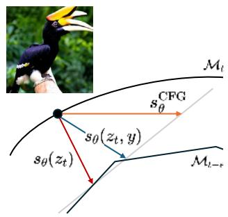

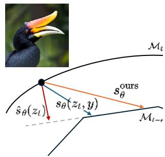  
(a) Classifier-free guidance  
(b) Ours  
Figure 1. (a) Classifier-free guidance. When the unconditional score $\scriptstyle { s _ { \theta } } ( z _ { t } )$ and the conditional score $\pmb { s } _ { \theta } ( z _ { t } , y )$ are misaligned, the result of CFG tends to fall off the manifold. (b) Our proposed method reduces the misalignment between the unconditional score $\scriptstyle { s _ { \theta } } ( z _ { t } )$ and the conditional score $\pmb { s } _ { \theta } ( z _ { t } , y )$ , ensuring sampling aligns with the target manifold.

Let us say the guided score $\scriptstyle { \tilde { s } } _ { \theta }$ as $\tilde { s } _ { \theta } = s _ { \theta } ^ { \mathrm { u n c o n d } } +$ $\omega _ { \mathrm { s c a l e } } ( s _ { \theta } ^ { \mathrm { c o n d } } - s _ { \theta } ^ { \mathrm { u n c o n d } } )$ . In text-to-image models, the text condition $( s _ { \theta } ^ { \mathrm { c o n d } } )$ is randomly replaced with a null condition $( s _ { \theta } ^ { \mathrm { u n c o n d } } )$ during training (e.g., with a probability $\mathsf { p } = 0 . 1 )$ enabling the null condition to act as a general estimator for any sample. It means that $s _ { \theta } ^ { \mathrm { u n c o n d } }$ is the score estimated from $z _ { t } \mathrm { ~ t o ~ } z _ { t - 1 }$ for all samples in the sampling trajectory of diffusion models.

The unconditional score for any sample has certainly enabled the successful use of classifier-free guidance. However, we argue that there can be a misalignment between the unconditional and conditional estimated scores (See Eq. (2) in Sec. 2), which hinders the approximation toward the manifold by the given condition. Fig. 1 (a) conceptually illustrates the potential issue that arises when the manifold of the unconditional score differs from that of the conditional score. In this paper, we show that this misalignment can be resolved with a simple algorithm, which significantly reduces the tendency of CFG to generate off-manifold samples, as illustrated in Fig. 1 (b).

Our approach is based on the following insights. First, the score predicted by the diffusion model estimates the intrinsic dimension of the data manifold [32]. Additionally, this intrinsic dimension can be captured by the tangent space of the target manifold [3, 9]. Instead of directly estimating the intrinsic dimension, we focus on utilizing the tangential component inherent in the unconditional score during classifier-free guidance. By reducing its misalignment with the conditional score, we enhance the alignment and ultimately improve the quality of the generated outputs.

Specifically, we push the score $\scriptstyle { \tilde { s } } _ { \theta }$ toward the normal direction of the conditional manifold by eliminating the values of column vectors with small singular values using the orthogonal matrix V obtained through the singular value decomposition of the conditional and unconditional scores.

In this paper, we propose a novel sampling method that leverages the unconditional score within CFG. To support our approach, we first lay out the theoretical foundation in section Sec. 2 and Sec. 3, discussing the manifold hypothesis and its connection to diffusion models. In Sec. 4, we provide a comprehensive explanation of our proposed method. This is followed by a detailed analysis using a toy example in Sec. 5, and we demonstrate the practical applicability of our method on real-world text-to-image models in Sec. 6.

Our experiments show a significant improvement in the MS-COCO Frechet Inception Distance (FID) across vari-´ ous models that utilize classifier-free guidance, e.g., diffusion models (Stable Diffusion v1.5 [26] and SDXL [23]) and rectified flow (Stable Diffusion 3 [8]). Additionally, our method improves DiT [21] FID on ImageNet. Notably, our method helps mitigate the overexposure bias problem, leading to resulting images that better align with the underlying data distribution, as supported by improved quantitative metrics.

## 2. Background

Diffusion models Diffusion models learn the score that reverses the forward noising process. This forward process from the real data distribution $p ( \pmb { x } _ { 0 } )$ to a latent distribution $p ( z _ { 1 } ) \sim N ( 0 , \sigma _ { \mathrm { m a x } } ^ { 2 } I )$ along timesteps $t \in [ 0 , 1 ]$ is defined by a Gaussian kernel: $z _ { t } = x _ { 0 } + \sigma ( t ) { \epsilon }$ . The function $\sigma ( t )$ is a noise schedule where $\sigma ( 0 ) = 0$ and $\sigma ( 1 ) = \sigma _ { \mathrm { m a x } }$ , determining the amount of noise to be added at each timestep t to erase information from x.

A generative process is represented as its reverse with a

stochastic differential equation (SDE):

$$
\begin{array} { r l } & { \mathrm { d } z = - \dot { \sigma } ( t ) \sigma ( t ) \nabla _ { z _ { t } } \log p _ { t } ( z _ { t } ) \mathrm { d } t } \\ & { \qquad - \beta ( t ) \sigma ( t ) ^ { 2 } \nabla _ { z _ { t } } \log p _ { t } ( z _ { t } ) \mathrm { d } t + \sqrt { 2 \beta ( t ) } \sigma ( t ) \mathrm { d } \omega _ { t } , } \end{array}
$$

where $\mathrm { d } \omega _ { t }$ is a standard Wiener process. Alternatively, it can be expressed as an ordinary differential equation:

$$
\mathrm { d } z = - \dot { \sigma } ( t ) \sigma ( t ) \nabla _ { z _ { t } } \log p _ { t } ( z _ { t } ) \mathrm { d } t .
$$

Diffusion models approximate the score function $\nabla _ { z _ { t } } \log { p _ { t } ( z _ { t } ) }$ with a neural network $s _ { \theta } ( z _ { t } , t )$ They are trained to predict the clean data from the noisy ${ \boldsymbol { z } } _ { t }$ . The trained model performs the reverse process using:

$$
\nabla _ { z _ { t } } \log p _ { t } ( z _ { t } ) \approx \frac { s _ { \theta } ( z _ { t } , t ) - z _ { t } } { \sigma ( t ) ^ { 2 } } .
$$

Classifier guidance (CG) and classifier-free guidance (CFG) For an arbitrary class label $y ,$ CG defines the classconditional sampling distribution $\tilde { p } _ { \boldsymbol { \theta } } ( \boldsymbol { z } _ { t } \mid \boldsymbol { y } )$ as:

$$
\tilde { p } _ { \theta } ( z _ { t } \mid y ) \propto p _ { \theta } ( z _ { t } \mid y ) p _ { \theta } ( y \mid z _ { t } ) ^ { \gamma } ,
$$

where $p _ { \theta } ( y \mid z _ { t } )$ is the classifier distribution and $\gamma$ is a scaling parameter. [6] When $\gamma > 0$ , it is known to reduce sample diversity but enhance quality. However, CG requires a classifier that can predict label $y$ from the noisy ${ \boldsymbol { z } } _ { t }$ . CFG proposes a method to sample from the conditional distribution by expressing the classifier distribution $p _ { \theta } ( y \mid z _ { t } )$ in terms of the conditional distribution $p _ { \theta } ( z _ { t } \mid \boldsymbol { y } )$ and the unconditional distribution $p _ { \theta } ( z _ { t } ) $

$$
\tilde { p } _ { \theta } ( z _ { t } \mid y ) \propto p _ { \theta } ( z _ { t } \mid y ) ^ { 1 + \gamma } p _ { \theta } ( z _ { t } ) ^ { - \gamma } .
$$

As a result, the final score $\nabla _ { z _ { t } }$ log $\tilde { p } _ { \theta } ( z _ { t } \mid \ y )$ is approximated by:

$$
\begin{array} { c } { { \nabla _ { z _ { t } } \log \tilde { p } _ { \theta } ( z _ { t } \mid y ) = ( 1 + \gamma ) s _ { \theta } ( z _ { t } , y ) - \gamma s _ { \theta } ( z _ { t } ) } } \\ { { = s _ { \theta } ( z _ { t } ) + \omega ( s _ { \theta } ( z _ { t } , y ) - s _ { \theta } ( z _ { t } ) ) , } } \end{array}
$$

where $\omega = 1 + \gamma . \ [ 1 1 ]$

In practice, both $s _ { \theta } ( x _ { t } , y )$ and $s _ { \theta } ( z _ { t } )$ are approximated by a single neural network that is jointly trained to estimate both the conditional and unconditional scores. Textto-image models use the null condition $y _ { \mathrm { n u l l } } = \emptyset$ as a class label to train $\pmb { s } _ { \theta } ( z _ { t } ) \approx \pmb { s } _ { \theta } ( z _ { t } , y _ { \mathrm { n u l l } } )$ . This approach allows $\pmb { s } _ { \theta } ( z _ { t } , y ) - \pmb { s } _ { \theta } ( z _ { t } )$ to provide guidance similar to the gradient of an implicit classifier. Hereafter, we will simply denote ${ \pmb s } _ { \theta } ( z _ { t } , y _ { \mathrm { n u l l } } ) \ \mathrm { a s } \ s _ { \theta } ( z _ { t } )$

Diffusion models and data manifold encoding The manifold hypothesis suggests that high-dimensional data lies on or near a lower-dimensional manifold, making intrinsic dimension estimation essential for data representation [9]. This intrinsic dimension is often encoded in the manifold’s tangent spaces, which capture underlying degrees of freedom and align local structures to reveal the global geometry [3, 33].

Building on these ideas, further studies have analyzed the approximation and generalization capabilities of diffusion models [20, 22, 24], and have also proven that their score functions can approximate the tangent space of the data manifold [32]. In particular, for a compact embedded sub-manifold $M \subset \mathbb { R } ^ { n }$ , it has been shown that for a sample $\boldsymbol { z } _ { t } \in \mathbb { R } ^ { n }$ sufficiently close1 to the target data, the score $\nabla _ { z _ { t } } \log p _ { t } ( z _ { t } ) ( \approx s _ { \theta } ( z _ { t } ) )$ ) and orthogonal projection $\pi ( \boldsymbol { z } _ { t } )$ onto data manifold $\mathcal { M } _ { 0 }$ satisfy a key relationship. For the projection $\mathbf { N } _ { p }$ onto the normal space and $\mathbf { T } _ { p }$ onto the tangent space of $\mathcal { M } _ { 0 } .$ , the ratio of their magnitudes goes to zero as t approaches 0 (i.e., gets closer to the target data). In other words, for samples ${ \boldsymbol { z } } _ { t }$ close to the target data, the following equation holds:

$$
\begin{array} { r } { \frac { \| \mathbf { T } _ { p } \nabla _ { \mathbf { z } _ { t } } \log p _ { t } ( z _ { t } ) \| } { \| \mathbf { N } _ { p } \nabla _ { \mathbf { z } _ { t } } \log p _ { t } ( z _ { t } ) \| } \to 0 , \quad \mathrm { a s ~ } t \to 0 , } \end{array}\tag{1}
$$

where $\mathbf { T } _ { p }$ and $\mathbf { N } _ { p }$ are the projection operators onto the tangent space $\mathscr { T } _ { \pi ( z _ { t } ) } \mathscr { M } _ { 0 }$ and the normal space $\mathcal { N } _ { \pi ( z _ { t } ) } \mathcal { M } _ { 0 } .$ respectively (for a detailed proof, see Theorem 4.1, Corollary 4.2 and Appendix D in [32]).

This implies that, for samples sufficiently close to the target manifold $\mathcal { M } _ { 0 } .$ , the cosine similarity between the score function and the normal vector $\begin{array} { r } { \mathbf { n } = \frac { \pi ( \pmb { z } _ { t } ) - \pmb { z } _ { t } } { \| \pi ( \pmb { z } _ { t } ) - \pmb { z } _ { t } \| } } \end{array}$ converges to $\begin{array} { r } { \mathbf { \Gamma } _ { ( \mathrm { i } . \mathrm { e } . , \textit { S } _ { \mathrm { c o s } } ( \mathbf { n } , \nabla _ { z _ { t } } \log p _ { t } ( z _ { t } ) ) } \xrightarrow { t  0 } 1 ) } \end{array}$

This suggests that for a sample ${ \boldsymbol { z } } _ { t }$ very close to the target, the score function $\nabla _ { \mathbf { z } } \log p _ { t } ( z _ { t } ) \approx s _ { \theta } ( z _ { t } )$ becomes an element of the normal space of the target manifold (that is, $\nabla _ { \mathbf { z } } \log { p _ { t } ( z _ { t } ) } \in \mathcal { N } _ { \pi ( z _ { t } ) } \mathcal { M } _ { 0 } \approx \mathcal { N } _ { \pi ( z _ { 0 } ) } \mathcal { M } _ { 0 }$ for sufficiently small t). Leveraging this property, the estimated diffusion score can approximate the intrinsic dimension of the target data by utilizing the huge gap in the singular values of the sampling scores $S = \left[ s _ { \theta } \left( \bar { z _ { t } ^ { ( 1 ) } } , t \right) , \ldots , \bar { s _ { \theta } } \left( z _ { t } ^ { ( 4 n ) } , t \right) \right]$ where the singular vectors corresponding to the higher singular values represent the normal components of $\mathcal { M } _ { 0 }$ , while those corresponding to the lower singular values represent the tangential components.[32]

## 3. Intuition

In this section, we assume the mathematical concept behind our method and supporting experiments. Our approach refines CFG at each step by dropping the tangential component of the unconditional score, enhancing the quality of conditional generation. This adjustment allows the conditional score to guide the generated sample more directly toward the manifold specified by the condition, improving alignment.

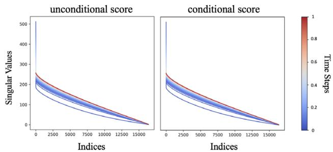  
Figure 2. Singular values of the score function across all timesteps. We computed the singular values for all timesteps using a total of 17,000 samples from Stable Diffusion v1.5. For both the unconditional and the conditional scores, a significant drop in singular values was observed at indices close to 0 across all timesteps. This suggests the existence of an intermediate manifold.

To support this, we provide empirical evidence suggesting that not only does the target data manifold $\mathcal { M } _ { 0 }$ exist but there is also a manifold $\mathcal { M } _ { t - \epsilon }$ at each time step $t \in ( 0 , 1 )$ where $\nabla _ { \mathbf { z } } \log p _ { t } ( z _ { t } ) \in \mathcal { N } _ { \pi _ { t - \epsilon } ( z _ { t } ) } \mathcal { M } _ { t - \epsilon } .$

There exists an intermediate manifold $\mathcal { M } _ { t }$ We hypothesize the existence of a manifold $\mathcal { M } _ { ( t - \epsilon ) }$ that contains $\nabla _ { z _ { t } } \log { p _ { t } ( z _ { t } ) }$ as elements of its normal space, not only for samples close to the target data but also for $t \in ( 0 , 1 )$ Specifically, we assume the following:

Assumption 1. Suppose that the support of the data distribution $P _ { 0 }$ is contained in a compact embedded submanifold $\mathcal { M } _ { 0 } \subset \mathbb { R } ^ { d }$ , and let $P _ { t }$ be the distribution of latents at time t diffused from $P _ { 0 }$ . Then, under mild assumptions2, $\forall t \in ( 0 , 1 ) , \exists t ^ { \prime } \in ( t - \epsilon , t + \epsilon )$ such that:

$$
\nabla _ { z _ { t } } \log p _ { t } ( z _ { t } ) \in \mathcal { N } _ { \pi _ { t ^ { \prime } } ( z _ { t } ) } \mathcal { M } _ { t ^ { \prime } } ,
$$

for sufficiently small ϵ and orthogonal projection $\pi _ { t ^ { \prime } } ( z _ { t } )$ onto manifold $\boldsymbol { \mathcal { M } } _ { t ^ { \prime } }$ . This hypothesis is indirectly supported by the clear gap in singular values arranged in descending order for a sufficient number of samples. This phenomenon occurs not only when t goes to 0 (near the image manifold) but also consistently for all time step $t \in ( 0 , 1 )$

To observe the gap, we compute 17,000 score samples across all timesteps on Stable Diffusion v1.5. Let $[ \sigma _ { 1 } , \dots , \sigma _ { D } ]$ represent the singular values from the SVD applied to $s _ { \theta } ( z _ { t } )$ and $\textstyle { \boldsymbol { s } } _ { \boldsymbol { \theta } } ( z _ { t } , y )$ , with 17,000 samples collected per timestep, arranged in descending order. The corresponding singular vectors are denoted as $[ \pmb { v } _ { 1 } , \ldots , \pmb { v } _ { D } ] ^ { T }$ for $s _ { \theta } ( z _ { t } )$ and $[ \hat { \pmb { v } } _ { 1 } , \dots , \hat { \pmb { v } } _ { D } ] ^ { T }$ for $\textstyle { \boldsymbol { s } } _ { \boldsymbol { \theta } } ( z _ { t } , y )$ respectively $( D \approx ^ { 3 } 1 7 , 0 0 0 )$ .

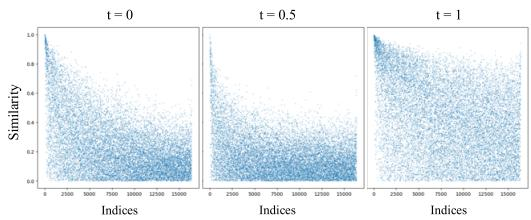  
Figure 3. Cosine similarity between singular vectors of unconditional and conditional scores. We computed the singular vectors $V$ at each timestep using a total of 17,000 samples from Stable Diffusion v1.5. We observe the similarity of significant singular vectors (i.e., those with indices close to 0) between unconditional and conditional scores are mostly high across all timesteps T.

As shown in Fig. 2, both $s _ { \theta } ( z _ { t } )$ and $\textstyle { \boldsymbol { s } } _ { \boldsymbol { \theta } } ( z _ { t } , y )$ have gaps between the highest singular values and the rest for all $t \in [ 0 , 1 ]$ , not just for $0 + \epsilon .$ Interpreting from the perspective that the score function $s _ { \theta } ( z _ { t } )$ becomes an element of the data manifold’s normal space as t approaches 0 [32]. Assuming the existence of an intermediate manifold $\mathcal { M } _ { t }$ for all $t \in ( 0 , 1 )$ , this suggests that the singular vectors associated with the largest singular values contain dominant components of $\mathcal { N M } _ { t } .$ , while vectors associated with smaller singular values correspond to component of $\mathcal { T M } _ { t }$

Tangential misalignment between unconditional and conditional score We empirically justify the principle of modifying the unconditional score by dropping the components with low singular values and retaining only the com ponents with high singular values.

Fig. 3 shows that conditional and unconditional singular vectors $[ \pmb { v } _ { 1 } , \ldots , \pmb { v } _ { D } ] ^ { T }$ and $[ \hat { \pmb { v } } _ { 1 } , \dots , \hat { \pmb { v } } _ { D } ] ^ { T }$ at corresponding indices are more similar when their singular values are high than the rest.

More specifically, the cosine similarity of the singular vectors ${ \pmb v } _ { 1 }$ and $\hat { v } _ { 1 }$ associated with the highest singular value $\sigma _ { 1 }$ from $s _ { \theta } ( z _ { t } )$ and $\boldsymbol { s } _ { \boldsymbol { \theta } } ( z _ { t } , y )$ , respectively, is higher than the others.

$$
\begin{array} { r l } & { [ S _ { \mathrm { c o s } } ( \pmb { v } _ { 1 } , \hat { \pmb { v } } _ { 1 } ) > S _ { \mathrm { c o s } } ( \pmb { v } _ { j } , \hat { \pmb { v } } _ { j } ) ] } \\ & { \approx [ S _ { \mathrm { c o s } } ( \mathbf { N } _ { p } \nabla _ { z _ { t } } \log p _ { t } ( z _ { t } , y ) , \mathbf { N } _ { p } \nabla _ { z _ { t } } \log p _ { t } ( z _ { t } ) ) } \\ & { > S _ { \mathrm { c o s } } ( \mathbf { T } _ { p } \nabla _ { z _ { t } } \log p _ { t } ( z _ { t } , y ) , \mathbf { T } _ { p } \nabla _ { z _ { t } } \log p _ { t } ( z _ { t } ) ) ] } \end{array}\tag{2}
$$

for $1 < j \le D$ . The cosine similarity $S _ { c o s }$ between two vectors ${ \mathbf { } } v _ { i }$ and ${ \boldsymbol { v } } _ { j }$ is defined as $\begin{array} { r } { S _ { \mathrm { c o s } } ( \pmb { v } _ { i } , \pmb { v } _ { j } ) = \frac { \pmb { v } _ { i } \cdot \pmb { v } _ { j } } { \| \pmb { v } _ { i } \| \| \pmb { v } _ { j } \| } } \end{array}$

This indicates that the intermediate manifolds associated with $\nabla _ { z _ { t } } \log { p _ { t } ( z _ { t } ) }$ and $\nabla _ { z _ { t } } \log { p _ { t } ( z _ { t } , y ) }$ share similar normal components, while their tangent components are relatively less aligned.

These less-aligned components interfere with the generative process, making it harder to align with the target manifold. We modify the unconditional score $s _ { \theta } ( z _ { t } )$ at each timestep by removing its tangential components that are less aligned with the conditional score $\textstyle { \boldsymbol { s } } _ { \boldsymbol { \theta } } ( z _ { t } , y )$ . We provide detailed methods in the following section.

## 4. Methods

Our main method proceeds as follows. At each step, we take the predicted unconditional score $s _ { \theta } ( z _ { t } )$ and the conditional score $\textstyle { \boldsymbol { s } } _ { \boldsymbol { \theta } } ( z _ { t } , y )$ and concatenate them into a score matrix $A = [ s _ { \theta } ( z _ { t } ) , s _ { \theta } ( z _ { t } , y ) ]$ . Next, we perform SVD on $A ,$ , obtaining singular values and corresponding singular vectors that consider both components $s ( z _ { t } )$ and $s ( z _ { t } , y )$ This results in singular vectors $[ { \pmb v } _ { 1 } , { \pmb v } _ { 2 } , \ldots , { \pmb v } _ { D } ] ^ { T }$ where ${ \pmb v } _ { 1 }$ is the normal component of both $s ( z _ { t } )$ and $s ( z _ { t } , y )$ . We project the unconditional score onto ${ \pmb v } _ { 1 }$ and drop the rest.

$$
\hat { \pmb { s } } _ { \theta } ( z _ { t } ) = \pmb { s } _ { \theta } ( z _ { t } ) \cdot \pmb { V } ^ { T } \cdot [ \pmb { v } _ { 1 } , \pmb { 0 } ] .\tag{3}
$$

Consequently, the singular vectors associated with high singular values in the score matrix A retain the well-aligned, normal components of $s _ { \theta } ( z _ { t } )$ and $\textstyle { \boldsymbol { s } } _ { \boldsymbol { \theta } } ( z _ { t } , y )$ , while those with lower singular values represent misaligned tangential components, which we set to zero in Eq. (3) to drop these components from the unconditional score. Next, we update the score $\hat { \boldsymbol { s } } _ { \boldsymbol { \theta } } ( z _ { t } , y )$ with classifier-free guidance (CFG):

$$
\nabla _ { z _ { t } } \log \hat { p } _ { t } ( z _ { t } | y ) = \boldsymbol { \hat { s } } _ { \boldsymbol { \theta } } ( z _ { t } ) + w ( \boldsymbol { s } _ { \boldsymbol { \theta } } ( z _ { t } , y ) - \boldsymbol { \hat { s } } _ { \boldsymbol { \theta } } ( z _ { t } ) ) .\tag{4}
$$

Algorithm 1 Tangential damping classifier-free guidance   
(TCFG)   
Inputs: $\mathbf { s } _ { \theta } ( z _ { t } )$ and $\mathbf { s } _ { \boldsymbol { \theta } } ( z _ { t } | \boldsymbol { y } ) \colon$ predicted unconditional and   
conditional scores, $t \in ( 0 , 1 )$ : time step, y : condition, w:   
CFG scale.   
Output: $z _ { \mathrm { 0 } }$   
1: for $t \in ( 0 , 1 )$ do   
2: Get $\scriptstyle { \pmb { s } } _ { \boldsymbol { \theta } }$ from ${ \boldsymbol { z } } _ { t }$   
3: Make score matrix $A = [ \pmb { s } _ { \theta } ( z _ { t } ) , \pmb { s } _ { \theta } ( z _ { t } , y ) ]$   
4: $( \sigma _ { i } ) _ { i = 1 } ^ { d } , ( \pmb { w } _ { i } ) _ { i = 1 } ^ { d } , ( \pmb { v } _ { i } ) _ { i = 1 } ^ { d }  \mathrm { S V D } ( \pmb { A } )$   
5: $\hat { \pmb { s } } _ { \theta } ( \pmb { z } _ { t } ) = \pmb { s } _ { \theta } ( \pmb { z } _ { t } ) \cdot \pmb { V } ^ { T } \cdot [ \pmb { v } _ { 1 } , \mathbf { 0 } ]$   
6: (Dropping $\mathbf { T } \nabla _ { z _ { t } } \log p _ { t } ( \mathbf { \boldsymbol { x } } _ { t } ) )$   
7: $\hat { s } _ { \theta } ( z _ { t } , y ) = \hat { s } _ { \theta } ( z _ { t } ) + w ( s _ { \theta } ( z _ { t } , y ) - \hat { s } _ { \theta } ( z _ { t } ) )$   
8: Update ${ \boldsymbol { z } } _ { t }$   
9: end for   
10: Output $z _ { \mathrm { 0 } }$   
$( \sigma _ { i } ) _ { i = 1 } ^ { d } , ( \mathbf { w } _ { i } ) _ { i = 1 } ^ { d } , ( \mathbf { v } _ { i } ) _ { i = 1 } ^ { d }$ denote singular values, left   
and right singular vectors respectively.

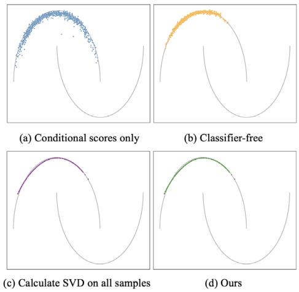  
Figure 4. Sampling results on different methods with diffusion model trained on two moons dataset. Our proposed methods $( \mathrm { c } , \mathrm { d } )$ demonstrate a closer match to the target distribution compared to using conditional scores only or CFG. In (c), SVD is computed across all samples, while in (d), SVD is calculated separately for each pair of conditional and unconditional scores.

We provide a detailed algorithm in Algorithm 1.

Unlike traditional CFG update methods, $\nabla _ { z _ { t } } \log \hat { p _ { t } } ( z _ { t } | y )$ drops tangential component from the unconditional score at each step. It prevents accumulating misaligned components from the unconditional score $s _ { \theta } ( z _ { t } )$ using the direction of the manifold defined by the given condition y over time evolution. This concept is further illustrated with a simple distribution in Sec. 5, where the toy example clarifies the benefits of our methods.

## 5. Toy example

We empirically verify our method on a toy problem, generating the two moons dataset. Experiments consist of the generated samples with different guidances including the original classifier-free guidance (CFG) and ours, and the sampling trajectories following their respective score functions.

The target data distribution $p ( X _ { 0 } )$ consists of samples distributed along two distinct curves (moons). We trained a conditional diffusion model using a small neural network that receives a binary label $y \in \{ 0 , 1 \}$ for the two moons or $y = \emptyset$ denoting the null condition. For detailed settings, please refer to the Appendix.

Fig. 4 shows the generated samples using four different guiding strategies. (a) uses only the conditional score $\textstyle { \boldsymbol { s } } _ { \boldsymbol { \theta } } ( z _ { t } , y )$ . (b) uses the CFG score. (c) and (d) employ our guidance score at each step with multiple samples and one sample, respectively, to compute singular value decomposition (SVD) of the unconditional score $s _ { \theta } ^ { i } ( z _ { t } )$ and conditional score $s _ { \theta } ^ { i } ( z _ { t } , y )$

According to the result, generated samples using our strategies lie closer to the target compared to those generated using only the conditional score or CFG. CFG, while potentially bringing samples closer to the target than merely using conditional scores, may face challenges due to the misalignment of tangent components between unconditional scorse and conditional scores.

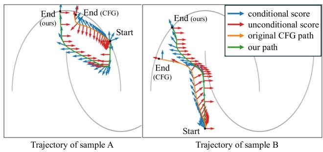  
Figure 5. Visualization of the sampling trajectory. In CFG (orange path), the unconditional scores (red arrows) include components that point towards directions other than the target distribution, making the final destination deviate from the target distribution. Whereas, our method (green path) removes the inconsistent tangent components in unconditional scores and eventually reaches the target distribution.

In contrast, our guidance score can reduce the tangent component of the unconditional score at each step. This helps samples converge more effectively towards the target data, which suggests that the tangent components of the unconditional score might hinder alignment with the target data manifold under the given condition, and our method helps in mitigating this misalignment.

We further validate this hypothesis by examining the trajectories of generated samples. Fig. 5 visualizes the trajectories induced by our score $\nabla _ { z _ { t } } \log \hat { p _ { t } } ( z _ { t } | y )$ compared to the original CFG score $\nabla _ { z _ { t } } \log \tilde { p } _ { \theta } ( z _ { t } | y )$ . As shown, in the orange CFG trajectory, the direction of unconditional scores changes frequently. This results in difficulties for the blue conditional score to maintain an orthogonal direction relative to the target manifold near the target distribution. In contrast, our method consistently adjusts the score to predict in a direction closer to orthogonal with respect to the target manifold, particularly as the samples converge toward the target data. Our method removes the tangential component of the unconditional score with respect to the manifold of the conditional score. This results in a direction that leans either to the right or to the left.

Additionally, the similar results between (c) and (d) in Fig. 4 suggest that computing SVD for only a single sample is sufficient to yield nearly the same result.

## 6. Experiments

In this section, we demonstrate that our method is applicable to high-dimensional diffusion models. We employ representative diffusion models such as Stable Diffusion v1.5 [27] and SDXL [23], and showed that it functions identically on SD v3 [7], which is based on Rectified Flow. Additionally, we conducted experiments on DiT [21], which is trained on ImageNet [5].

<table><tr><td colspan="2"></td><td>FID ↓</td><td>CLIPScore ↑</td></tr><tr><td rowspan="2">SD v1.5</td><td>original</td><td>13.26</td><td>0.31</td></tr><tr><td>+ ours</td><td>13.12</td><td>0.31</td></tr><tr><td rowspan="2">SDXL</td><td>original</td><td>13.36</td><td>0.32</td></tr><tr><td>+ ours</td><td>12.65</td><td>0.32</td></tr><tr><td rowspan="2">SD v3</td><td>original</td><td>16.66</td><td>0.32</td></tr><tr><td>+ ours</td><td>13.74</td><td>0.32</td></tr></table>

Table 1. Zero-shot FID and CLIPScore measured on MSCOCO 30k. Our method consistently improves FID across all models—Stable Diffusion v1.5, SDXL, and SD v3—while maintaining a nearly identical CLIPScore.
<table><tr><td></td><td>FID↓</td><td>sFID↓</td><td>Precision ↑</td><td>Recall ↑</td><td>IS ↑</td></tr><tr><td>DiT</td><td>32.67</td><td>17.92</td><td>0.90</td><td>0.13</td><td>271.1</td></tr><tr><td>DiT+ours</td><td>29.5</td><td>13.27</td><td>0.90</td><td>0.19</td><td>270.0</td></tr></table>

Table 2. Evaluation metrics measured on ImageNet 50k using DiT. Our method achieves better performance in FID, sFID, Precision, and Recall while showing a slight decrease in Inception Score.

Experimental details For the text-to-image models, we used zero-shot FID [10] and CLIPScore [25] on the MS-COCO 2014 validation set [17] consisting of 30,000 images under the commonly used text-to-image evaluation protocols. [7, 23, 27] For DiT, we evaluated using 50,000 images under the same settings as ADM [6]. All models used the official pretrained weights, and sampling was performed using the same latent codes. We used the best CFG scales as the default value of each repository. Our method does not increase the inference time of all baselines.

Quantitative evaluation Tab. 1 presents the FID and CLIP Scores for SD1.5, SDXL, and SD3. Our method achieved better FID scores while maintaining the same CLIP Scores across all three models. Notably, the decrease in FID is larger for SDXL compared to SD1.5, and even larger for SD3 compared to SDXL. We speculate that this is because SD3, known as a better model publicly, has a relatively clearer manifold. Furthermore, the results on SD3 demonstrate that our method is applicable not only to diffusion models but also to all CFG-based score functions, including those based on Rectified Flow. Fig. 6 also shows FID-CLIP curves on SDXL, demonstrating that FID improves even as the CFG scale changes.

Tab. 2 shows the results on the DiT model. Except for a slight decrease in Inception Score, our method exhibits relatively superior performance in FID, sFID, and Recall. This indicates that our method can be equally applied to both text-to-image generation and class-conditioned generation.

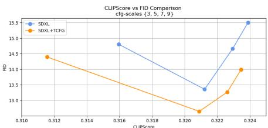  
Figure 6. FID-CLIP curves on SDXL with 50 sampling steps.

Qualitative evaluation Our method drops the tangential component from the unconditional score while retaining the normal component. This reduces misalignment with the conditional score, thereby improving image quality as shown in Fig. 7. Specifically, the changes introduced by our approach transform “strange” objects or scenes into more “plausible” images. This indirectly demonstrates that the misalignment of the unconditional score in the conventional CFG was causing the “strange” aspects in the final outputs.

For example, our method converts physically impossible or unusual combinations of objects (SD3), uncommon appearances or characteristics (SDXL), and ambiguous shapes or forms (SD1.5) into “normal” results.

Fig. 8 presents the results obtained from DiT. We observed that our method causes relatively more changes in the images generated by DiT. We speculate that this is because DiT is trained on ImageNet dataset with class labels. The results qualitatively show that when using our method, DiT generates images that are more detailed, have better structure, and appear more natural.

Notably, in both text-to-image and class-conditioned image generation, we observed a reduction in the overexposure bias problem. We attribute this improvement to the mitigation of misalignment between the unconditional score and the conditional score.

What happened to the unconditional score? In this paragraph, we qualitatively demonstrate that the misalignment with the conditional score is reduced when we drop the tangential component from the unconditional score and retain the normal component. We compared the results sampled using CFG with those sampled using the null condition (i.e., unconditional) when generating images from the same random noise (i.e., latent variables) in SDXL. In our method, we used the text condition to compute sˆ but used only sˆ for denoising; that is, we set ω = 0. Although this approach does not perfectly explain our method, we can indirectly infer its role by observing how the modified null condition changes.

Fig. 9 shows that images sampled using the original null condition generate different objects such as trees, snowy mountain landscapes, and women. In contrast, images generated using our modified null condition sˆ show that the tree part takes the form of a feather, the snowy mountain landscape changes into a woman, and the woman transforms into a shape resembling a glove. These changes align with the objects we aim to generate: a feather, a woman, and a baseball glove. We observe that these changes due to the null condition help eliminate unwanted structures or artifacts in the generated images. In other words, we demonstrate that the misalignment of the null condition is reduced, and we claim that this improvement aids in image generation.

SD3  
SD3 + ours  
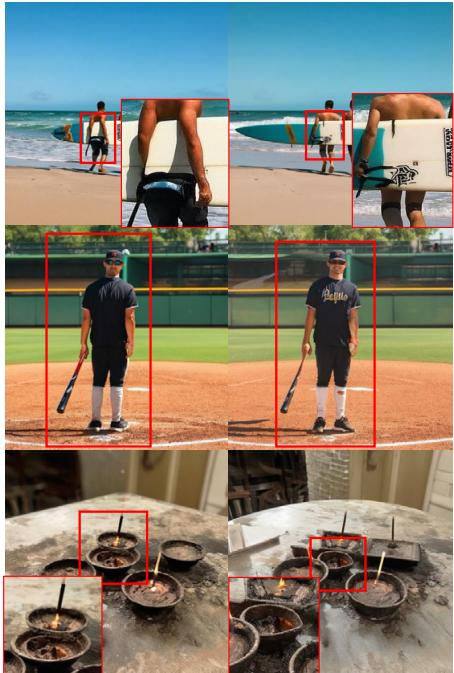

SDXL  
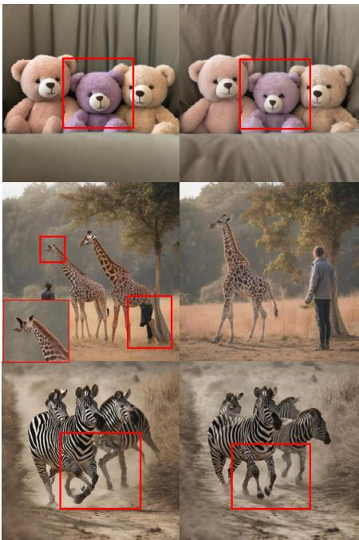  
SDXL + ours

SD1.5  
SD1.5 + ours  
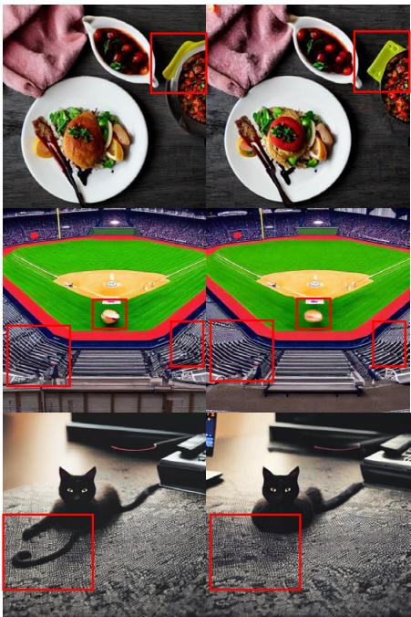

Figure 7. Qualitative evaluation of text-to-image models. Our method prevents overexposure, enhancing the shapes and details of objects.  
DiT  
DiT + ours  
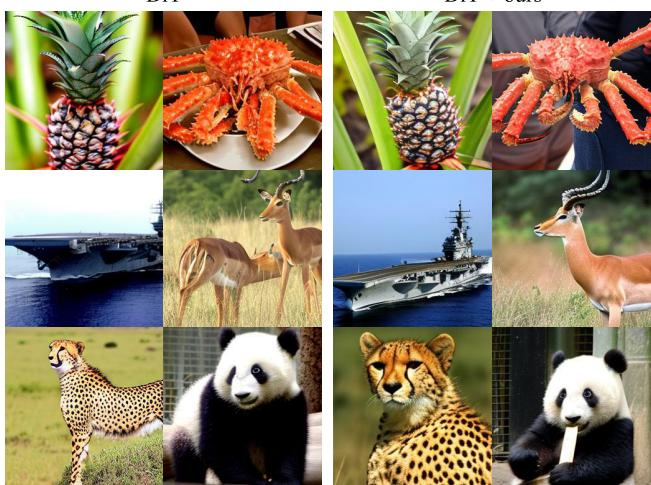  
Figure 8. Qualitative evaluation of DiT Our method mitigates overexposure and enhances object shapes and details in DiT models trained on ImageNet.

<table><tr><td></td><td>SAG</td><td>SAG+TCFG</td><td>PAG</td><td>PAG+TCFG</td><td>CFGPP</td><td>CFGPP+TCFG</td></tr><tr><td>FID</td><td>13.53</td><td>11.48</td><td>14.45</td><td>11.87</td><td>13.97</td><td>13.44</td></tr><tr><td>CLIP Score</td><td>0.31</td><td>0.30</td><td>0.31</td><td>0.31</td><td>0.32</td><td>0.32</td></tr></table>

Table 3. Quantitative comparison with existing baselines. The evaluation was conducted on 30k images from the MS-COCO dataset using the official code; SD v1.4 for SAG, SD v1.5 for PAG and SDXL for CFG++.

## 7. Related work

Calssifier-free guidance Experimental methods to enhance the performance of Classifier-Free Guidance (CFG) have been studied. SAG [13] proposed a method to improve CFG by using intermediate self-attention maps. PAG [2] suggested computing CFG by transforming self-attention maps into identity matrices. ICG [29] enhanced CFG by utilizing random text embeddings. Recently, CFG++ [4] demonstrated better performance by modifying the CFG computation method. Our proposed approach modifies the unconditional score based on the conditional score and can be used alongside these existing works; please refer to Tab. 3 and the appendix for more results.

Manifold hypothesis and diffusion There are also several studies that have utilized the manifold hypothesis properties of the score function estimated by diffusion models to address various inherent challenges associated with diffusion processes. One approach introduces the manifold memorization hypothesis to understand model memorization through the relationship between data and model manifold dimensionalities [28]. Another extends memorization theory to diffusion models [1], showing that high-variance subspaces are selectively lost due to memorization effects. Separately, different researchers proposed an approach for detecting synthetic images generated by diffusion models, achieving high accuracy across diverse datasets [18].

Original  
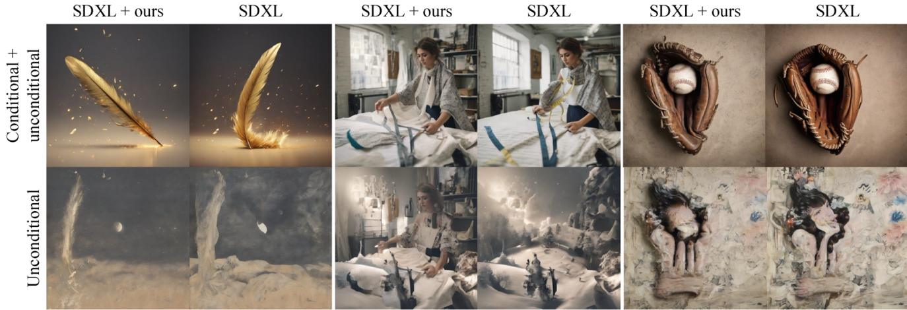  
Figure 9. TCFG reduces misalignments between unconditional and conditional generation. Starting from the same random noise z1, when SDXL samples images with only the unconditional score, it produces random images such as trees, snowy mountain landscapes, and women. In contrast, our modified unconditional score, projected on dominant (conditional), generates images that somewhat match the desired text prompts. This is because our method reduces misalignment with the conditional score by dropping the tangential components of the unconditional score. Once the misalignment decreases, the quality of the final images (unconditional + conditional score) improves: The base of the feather has a more natural structure, the human arm appears more natural, and the extra string on the left side of the baseball glove is removed.

Ours  
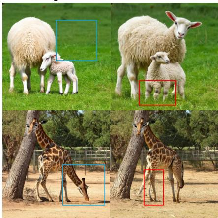  
Figure 10. Limitations Our method occasionally struggles to fix severely wrong regions in the baseline samples.

## 8. Discussion and conclusion

Our work experimentally analyzes the issues arising in the standard CFG method, where the tangential component of the unconditional score does not align well with that of the conditional score. By using SVD to drop the tangential component in the unconditional score, we effectively improve text-to-image generation quality. Additionally, our CFG method is easily applicable, has low computational cost, and enhances image quality. We leverage the ability of the diffusion model’s score function to encode the intrinsic dimension of the target data, demonstrating the misalignment between the conditional and unconditional scores to improve sampling quality. This is the first attempt to utilize this misalignment to enhance sampling.

Despite these advantages, several unresolved issues remain. First, it is uncertain whether the misalignment of tangential component and the alignment of normal component between the predicted unconditional score $\scriptstyle { s _ { \theta } ( z _ { t } ) }$ and the conditional score $\textstyle { \boldsymbol { s } } _ { \boldsymbol { \theta } } ( z _ { t } , y )$ in the CFG setting, at a given timestep t, would similarly apply to the features derived from a separately trained classifier and the null condition score in the classifier guidance setting. Second, while our task leverages the capability of diffusion models to estimate intrinsic dimensions for enhancing conditional sampling methods, we present only experimental observations regarding the existence of an intermediate manifold for t ∈ [0, 1], without theoretical proof. Further exploration and rigorous analysis of these aspects are left as future work. Third, additional investigation is needed to adapt our approach effectively in the context of diffusion distillation using CFG scale as an input [14, 15], which we also identify as a promising direction for future research.

Finally, although our method successfully demonstrated on-manifold image generation, we observed that when the original image exhibits significant abnormalities, substantial changes may occasionally cause the structure to break down. Fig. 10 illustrates such examples. Nevertheless, it is evident that our method transforms “strange” images into more “normal” ones.

## References

[1] Beatrice Achilli, Enrico Ventura, Gianluigi Silvestri, Bao Pham, Gabriel Raya, Dmitry Krotov, Carlo Lucibello, and Luca Ambrogioni. Losing dimensions: Geometric memorization in generative diffusion. arXiv preprint arXiv:2410.08727, 2024. 8

[2] Donghoon Ahn, Hyoungwon Cho, Jaewon Min, Wooseok Jang, Jungwoo Kim, SeonHwa Kim, Hyun Hee Park, Kyong Hwan Jin, and Seungryong Kim. Self-rectifying diffusion sampling with perturbed-attention guidance. arXiv preprint arXiv:2403.17377, 2024. 7, 2

[3] Yoshua Bengio, Aaron Courville, and Pascal Vincent. Representation learning: A review and new perspectives. IEEE Transactions on Pattern Analysis and Machine Intelligence, 35(8):1798–1828, 2013. 2, 3

[4] Hyungjin Chung, Jeongsol Kim, Geon Yeong Park, Hyelin Nam, and Jong Chul Ye. Cfg++: Manifold-constrained classifier free guidance for diffusion models. arXiv preprint arXiv:2406.08070, 2024. 7, 2

[5] Jia Deng, Wei Dong, Richard Socher, Li-Jia Li, Kai Li, and Li Fei-Fei. Imagenet: A large-scale hierarchical image database. In 2009 IEEE conference on computer vision and pattern recognition, pages 248–255. Ieee, 2009. 6

[6] Prafulla Dhariwal and Alexander Nichol. Diffusion models beat gans on image synthesis. Advances in Neural Information Processing Systems, 34:8780–8794, 2021. 1, 2, 6

[7] Patrick Esser, Sumith Kulal, Andreas Blattmann, Rahim Entezari, Jonas Muller, Harry Saini, Yam Levi, Dominik¨ Lorenz, Axel Sauer, Frederic Boesel, et al. Scaling rectified flow transformers for high-resolution image synthesis. In Forty-first International Conference on Machine Learning, 2024. 6

[8] Patrick Esser, Sumith Kulal, Andreas Blattmann, Rahim Entezari, Jonas Muller, Harry Saini, Yam Levi, Dominik¨ Lorenz, Axel Sauer, Frederic Boesel, et al. Scaling rectified flow transformers for high-resolution image synthesis. In Forty-first International Conference on Machine Learning, 2024. 2

[9] Charles Fefferman, Sanjoy Mitter, and Hariharan Narayanan. Testing the manifold hypothesis. Journal of the American Mathematical Society, 29(4):983–1049, 2016. 2

[10] Martin Heusel, Hubert Ramsauer, Thomas Unterthiner, Bernhard Nessler, and Sepp Hochreiter. Gans trained by a two time-scale update rule converge to a local nash equilibrium. Advances in neural information processing systems, 30, 2017. 6

[11] Jonathan Ho and Tim Salimans. Classifier-free diffusion guidance. arXiv preprint arXiv:2207.12598, 2022. 1, 2

[12] Jonathan Ho, Ajay Jain, and Pieter Abbeel. Denoising diffusion probabilistic models. Advances in Neural Information Processing Systems, 33:6840–6851, 2020. 1

[13] Susung Hong, Gyuseong Lee, Wooseok Jang, and Seungryong Kim. Improving sample quality of diffusion models using self-attention guidance. In Proceedings ofthe IEEE/CVF International Conference on Computer Vision, pages 7462– 7471, 2023. 7, 1

[14] Yi-Ting Hsiao, Siavash Khodadadeh, Kevin Duarte, Wei-An Lin, Hui Qu, Mingi Kwon, and Ratheesh Kalarot. Plug-andplay diffusion distillation. In Proceedings of the IEEE/CVF Conference on Computer Vision and Pattern Recognition, pages 13743–13752, 2024. 8

[15] Black Forest Labs. FLUX. https://github.com/ black-forest-labs/flux, 2024. Accessed: 2024- 11-15. 8

[16] John M Lee. Introduction to Riemannian manifolds. Springer, 2018. 3

[17] Tsung-Yi Lin, Michael Maire, Serge Belongie, James Hays, Pietro Perona, Deva Ramanan, Piotr Dollar, and C Lawrence´ Zitnick. Microsoft coco: Common objects in context. In Computer Vision–ECCV 2014: 13th European Conference, Zurich, Switzerland, September 6-12, 2014, Proceedings, Part V 13, pages 740–755. Springer, 2014. 6

[18] Peter Lorenz, Ricard L Durall, and Janis Keuper. Detecting images generated by deep diffusion models using their local intrinsic dimensionality. In Proceedings of the IEEE/CVF International Conference on Computer Vision, pages 448– 459, 2023. 8

[19] Alex Nichol, Prafulla Dhariwal, Aditya Ramesh, Pranav Shyam, Pamela Mishkin, Bob McGrew, Ilya Sutskever, and Mark Chen. Glide: Towards photorealistic image generation and editing with text-guided diffusion models. arXiv preprint arXiv:2112.10741, 2021. 1

[20] Kazusato Oko, Shunta Akiyama, and Taiji Suzuki. Diffusion models are minimax optimal distribution estimators. In International Conference on Machine Learning, pages 26517– 26582. PMLR, 2023. 3

[21] William Peebles and Saining Xie. Scalable diffusion models with transformers. In Proceedings of the IEEE/CVF International Conference on Computer Vision, pages 4195–4205, 2023. 2, 6

[22] Jakiw Pidstrigach. Score-based generative models detect manifolds. Advances in Neural Information Processing Systems, 35:35852–35865, 2022. 3

[23] Dustin Podell, Zion English, Kyle Lacey, Andreas Blattmann, Tim Dockhorn, Jonas Muller, Joe Penna, and¨ Robin Rombach. Sdxl: Improving latent diffusion models for high-resolution image synthesis. arXiv preprint arXiv:2307.01952, 2023. 2, 6

[24] Phillip Pope, Chen Zhu, Ahmed Abdelkader, Micah Goldblum, and Tom Goldstein. The intrinsic dimension of images and its impact on learning. arXiv preprint arXiv:2104.08894, 2021. 3

[25] Alec Radford, Jong Wook Kim, Chris Hallacy, Aditya Ramesh, Gabriel Goh, Sandhini Agarwal, Girish Sastry, Amanda Askell, Pamela Mishkin, Jack Clark, et al. Learning transferable visual models from natural language supervision. In International Conference on Machine Learning, pages 8748–8763. PMLR, 2021. 6

[26] Robin Rombach, Andreas Blattmann, Dominik Lorenz, Patrick Esser, and Bjorn Ommer. High-resolution image¨ synthesis with latent diffusion models. In Proceedings of the IEEE/CVF Conference on Computer Vision and Pattern Recognition (CVPR), pages 10684–10695, 2022. 2

[27] Robin Rombach, Andreas Blattmann, Dominik Lorenz, Patrick Esser, and Bjorn Ommer. High-resolution image¨ synthesis with latent diffusion models. In Proceedings of the IEEE/CVF Conference on Computer Vision and Pattern Recognition, pages 10684–10695, 2022. 1, 6

[28] Brendan Leigh Ross, Hamidreza Kamkari, Tongzi Wu, Rasa Hosseinzadeh, Zhaoyan Liu, George Stein, Jesse C Cresswell, and Gabriel Loaiza-Ganem. A geometric framework for understanding memorization in generative models. arXiv preprint arXiv:2411.00113, 2024. 7

[29] Seyedmorteza Sadat, Manuel Kansy, Otmar Hilliges, and Romann M Weber. No training, no problem: Rethinking classifier-free guidance for diffusion models. arXiv preprint arXiv:2407.02687, 2024. 7

[30] Chitwan Saharia, William Chan, Saurabh Saxena, Lala Li, Jay Whang, Emily Denton, Seyed Kamyar Seyed Ghasemipour, Burcu Karagol Ayan, S Sara Mahdavi, Rapha Gontijo Lopes, et al. Photorealistic text-to-image diffusion models with deep language understanding. arXiv preprint arXiv:2205.11487, 2022. 1

[31] Jiaming Song, Chenlin Meng, and Stefano Ermon. Denoising diffusion implicit models. arXiv preprint arXiv:2010.02502, 2020. 1

[32] Jan Pawel Stanczuk, Georgios Batzolis, Teo Deveney, and Carola-Bibiane Schonlieb. Diffusion models encode the in-¨ trinsic dimension of data manifolds. In Forty-first International Conference on Machine Learning, 2024. 2, 3, 4

[33] Zhenyue Zhang and Hongyuan Zha. Principal manifolds and nonlinear dimensionality reduction via tangent space alignment. SIAMjournal on scientific computing, 26(1):313–338, 2004. 3