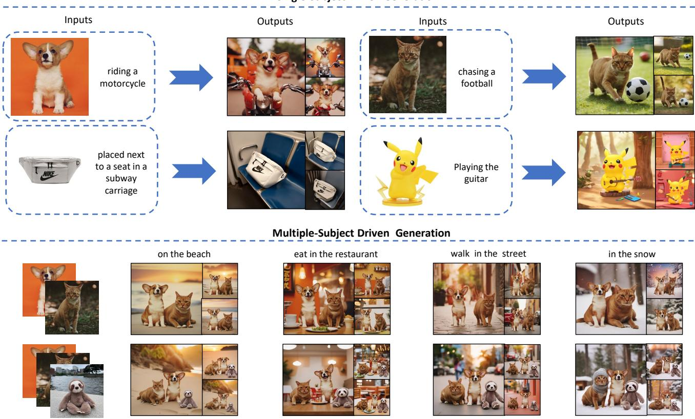
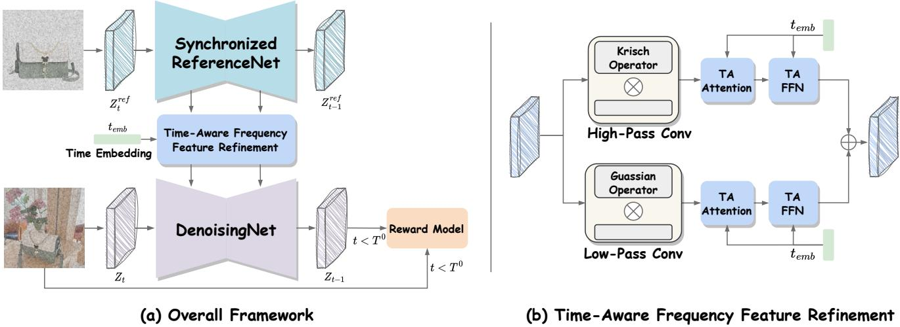
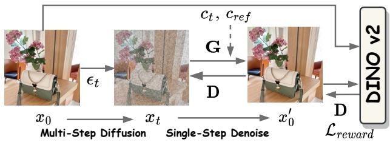
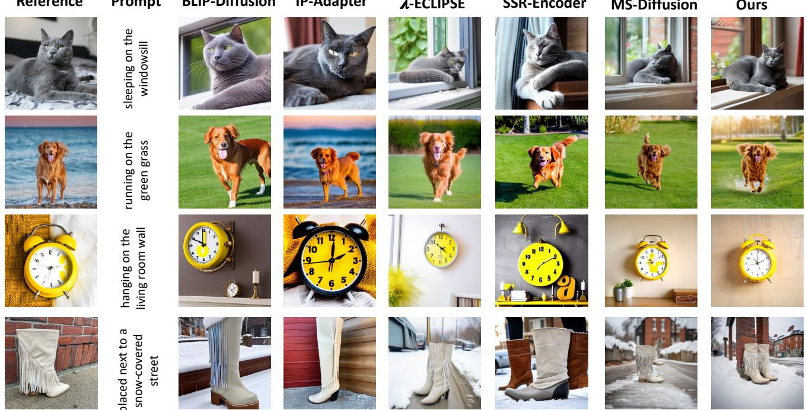
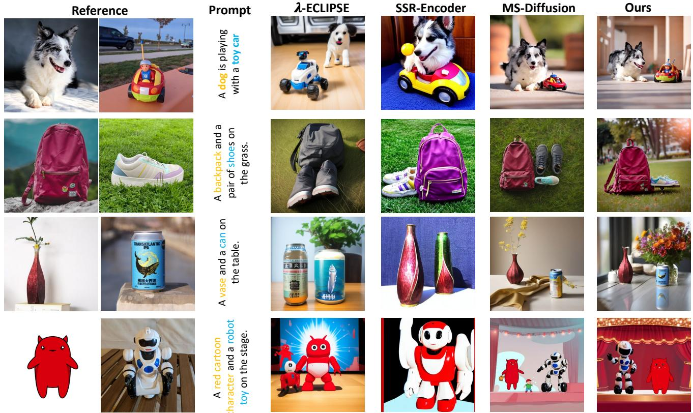
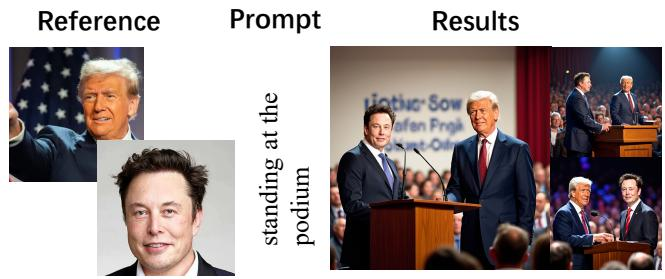
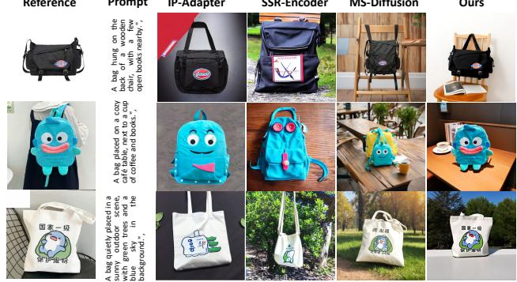
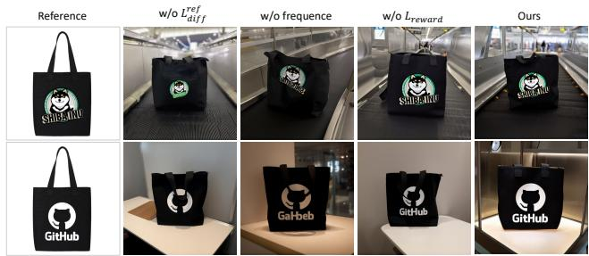
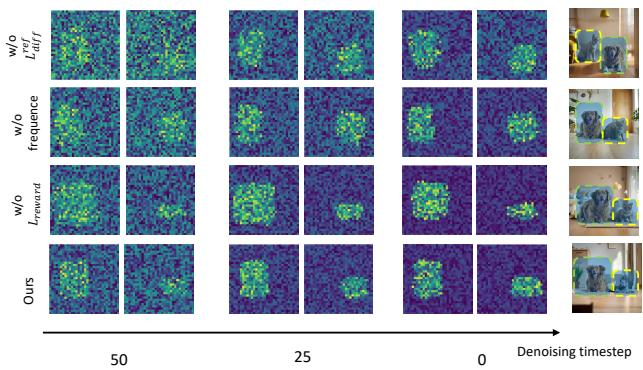

Single-Subject Driven Generation

# TFCustom: Customized Image Generation with Time-Aware Frequency Feature Guidance

Mushui Liu1∗ Dong She2∗ Jingxuan Pang1 Qihan Huang1 Jiacheng Ying1 Wanggui He3 Yuanlei Hou4 Siming Fu1∗†

1Zhejiang University 2University of Science and Technology of China 3Alibaba Group 4 Middle East Centre, RIPED

  
Figure 1. Our proposed TFCustom demonstrates capabilities in single-subject and multi-subject driven generation tasks.

## Abstract

Subject-driven image personalization has seen notable ad vancements, especially with the ReferenceNet paradigm, which excels in integrating reference imagefeaturesfor creative and commercial applications. However, current ReferenceNet implementations mainly function as latent-level feature extractors, limiting their potential. This restricts

the delivery of suitable features to the denoising backbone across timesteps, resulting in suboptimal image consistency. In this paper, we revisit reference feature extraction and propose TFCustom, a framework that focuses on reference image features at different temporal and frequency levels We introduce synchronized ReferenceNet to extract reference features while optimizing noise injection and denoising. We also propose a time-aware frequency refinement module that uses high- and low-frequency filters with time embeddings to adaptively select reference feature injection. Additionally, we introduce a reward-based loss to improve

the similarity between reference objects and generated images. Experimental results show that TFCustom outperforms existing methods in single-object and multi-object reference generation, with significant improvements in textual details.

## 1. Introduction

With the development of deep learning [14, 19, 24, 46, 52] and text-to-image models [8, 15, 23, 32, 34], customization generation which aims to synthesize text-driven images for given subjects, has recently revolutionized content creation. It has seen a shift from test-time fine-tuning methods (e.g., DreamBooth [35], Custom Diffusion [18]) to fine-tuningfree techniques (e.g., IP-Adapter [53], Subject-Diffusion [26], MS-Diffusion [48]). The latter approaches remove the need for fine-tuning during inference, significantly reducing computational costs while maintaining flexibility, and making them more scalable and practical for real-world use cases.

These fine-tuning-free methods generally fall into two categories: image encoder-based [4, 5, 58] feature injection and reference network (ReferenceNet-based) [6, 12, 51] feature injection. Image encoder methods, such as IPAdapter [53] and ELITE [49], utilize pre-trained encoders like CLIP [33] to extract high-level features, which are then injected into the generation process via mechanisms such as decoupled cross-attention. While these methods are computationally efficient and straightforward, they tend to rely on high-level, abstract features, which may not capture the fine-grained details necessary for precise control over reference object characteristics. The increasing demand for greater consistency in reference images has brought significant attention to the concept of ReferenceNet [16] in the field. ReferenceNet-based methods [17, 47, 50, 57] introduce an additional diffusion network within the traditional Diffusion Net denoising process. In this setup, reference images are encoded by VAE and then used as inputs for ReferenceNet. This novel architecture enables the correlation of features across layers in both diffusion networks, which helps in making better use of the reference images.

Although ReferenceNet-based methodologies have made significant advancements, several challenges remain. Currently, ReferenceNet predominantly operates as a latent-level feature extractor, thereby not fully realizing its potential. While ReferenceNet maintains a consistent intensity of feature conditioning over time, the denoising backbone requires the injection of varying intensities and granularities of reference information at different timesteps. Specifically, during the earlier stages of denoising, the backbone tends to emphasize contour information, whereas, in the later stages, it focuses more on the refinement of details [45]. This limitation hinders the ability to provide the denoising backbone with the appropriate features necessary for optimal performance across varying timesteps, ultimately leading to subpar image consistency.

In this work, we introduce TFCustom, a novel finetuning-free personalized generation framework that incorporates temporal awareness for reference feature injection. Unlike previous approaches, TFCustom considers the alignment of reference image features with generated image features across different time steps of the diffusion process. Specifically, we first apply noise to the reference image at multiple time steps, with ReferenceNet extracting features at various scales and granularities. The training of ReferenceNet follows a diffusion loss function, ensuring proper alignment with the denoising process. Additionally, we introduce a time-aware frequency module that enables the controlled injection of high- and low-frequency reference features. This module allows low-frequency features to define the primary subject at early time steps, while high-frequency features are progressively injected to refine finer image details. To further improve the model’s ability to handle multi-object reference generation, we propose a novel reward-based loss function that enhances the alignment between the reference and generated objects. This loss function computes object ID similarity during the denoising process, minimizing conflicts between reference objects and improving the overall coherence of multi-object scenes. The experimental results demonstrate our method consistently outperforms the state-of-the-art approaches on all the benchmarks.

Overall, our contributions are as follows:

• We propose a novel customized image generation framework, which includes synchronized noise injection and denoising within ReferenceNet, along with a time-aware frequency feature refinement module for extracting finegrained image details.

• We propose a reward-based loss function that alleviates multi-object conflicts and enhances object identity consistency in generated images.

• Our model achieves state-of-the-art performance in single-object reference generation on DreamBooth and MS-Bench datasets. Additionally, we demonstrate superior qualitative results in terms of texture and textual detail generation compared to existing methods.

## 2. Related Work

Subject Driven Text-to-Image Generation. Despite significant advancements in image generation [1, 8, 15, 23, 34], the field still falls short of meeting the requirements for personalized generation [38–40, 42, 48, 54]. This gap has consequently drawn significant attention to subject-driven text-to-image generation methods [4, 26, 43]. Textual Inversion [9] and DreamBooth [35] use a textual identifier to bind the visual concept through fine-tuning model textual embedding or UNet model. CustomDiffusion [18] further extends multi-subject generation by multiple identifiers. IP-Adapter [53] injects the visual concept by decoupling the cross-attention between text and images in a zero-shot manner. JeDi [55] learns the joint distribution of multiple textimage pairs that share a common subject to facilitate personalized generation. Subject-Diffusion [26] trains multiple adapters inside the model with an attention control mechanism for multiple-subject personalization. SSR-Encoder [58] and MS-Diffusion [48] develop the query architecture to encode the subject images via mask or layout control for multiple-subject personalization. This paper explores the zero-shot multiple-objects driven generation via synchronized ReferenceNet optimization.

ReferenceNet Based Personalized Generation. ReferenceNet [16, 41, 57] has shown remarkable capabilities in maintaining image consistency for personalized generation tasks. AnimateAnyone [16] first utilizes ReferenceNet for personalized human animation, employing a pre-trained generative model to extract reference features. FlashFace [57] extended this approach by combining ReferenceNet with ControlNet [56], enabling identity-preserving portrait generation that accommodates multiple reference images. Part2Whole [17] uses ReferenceNet to handle multi-part human body generation, while OOTD [50] and Stable-Garment [47] integrate it into virtual try-on tasks, aligning clothing features precisely with the target human body. These methods highlight ReferenceNet’s versatility in image and video generation. To further improve performance, we introduce a synchronized ReferenceNet that refines reference features at each time step, enabling more precise feature injection and enhancing generation accuracy.

Frequency Information in Image Generation. Frequency information plays a crucial role in image restoration tasks [7, 22, 27, 36]. Recent advancements in text-to-image generation have leveraged frequency-based conditions, like canny and HED images, to control generation, as seen in ControlNet [56] and T2I-Adapter [28]. FCDiffusion [11] and FBSdiff [10] employ DCT-transformed image features to enhance texture detail in image-to-image generation. In this work, our method adaptively injects reference image features via learnable high-pass and low-pass filters in a time-aware fashion, enriching each denoising step with frequency-specific information for more refined generation.

## 3. Method

Our proposed TFCustom addresses these issues through three components: Sec. 3.2 Synchronized Reference Guidance, Sec. 3.3 Time-Aware Frequency Feature Refinement, and Sec. 3.4 Reward Model Optimization, as illustrated in Fig. 2. First, the reference image is incrementally noised over T steps before feature extraction via the ReferenceNet, aligning it with the denoising network’s noisy latent features. Next, a time-aware frequency module injects frequency-specific information from the reference image into the noisy latent representation. Finally, a reward model optimizes this process, enhancing the quality and consistency of the generated reference-based images.

## 3.1. Prelimenaries

Diffusion models. Denoising Diffusion Probabilistic Models (DDPM) are a class of generative models that leverage a diffusion process to generate data. By progressively adding Gaussian noise to the data over a specified number of time steps, a sequence of increasingly noisy samples is produced. The forward process can be described as follows:

$$
\boldsymbol { q } ( x _ { T } | x _ { 0 } ) = \mathcal { N } ( x _ { T } ; \sqrt { \alpha _ { T } } x _ { 0 } , ( 1 - \alpha _ { T } ) \mathbf { I } )\tag{1}
$$

where $\begin{array} { r } { \alpha _ { t } = \prod _ { s = 1 } ^ { t } ( 1 - \beta _ { s } ) } \end{array}$ . Here, $\beta _ { t }$ represents a variance schedule that regulates the noise level at each time step t, and N denotes a Gaussian distribution. In the reverse diffusion process, the model learns to denoise the noisy samples step by step, effectively generating new data from pure noise:

$$
p _ { \theta } ( x _ { t - 1 } | x _ { t } ) = \mathcal { N } ( x _ { t - 1 } ; \mu _ { \theta } ( x _ { t } , t ) , \sigma _ { \theta } ^ { 2 } ( t ) \mathbf { I } )\tag{2}
$$

where $\mu _ { \theta }$ and $\sigma _ { \theta }$ are learned parameters that depend on the current noisy sample $x _ { t }$ and the time step t. The optimization goal is the variational lower bound on the loglikelihood of the data, which can be simplified to:

$$
L = \mathbb { E } _ { t , x _ { 0 } , \epsilon } \left[ \Vert \epsilon - \epsilon _ { \theta } ( x _ { t } , t ) \Vert ^ { 2 } \right]\tag{3}
$$

## 3.2. Synchronized ReferenceNet Guidance

The synchronized ReferenceNet is initially transferred from the denoising network. During training, at each time step t, we apply a noise process to the reference image $x _ { \mathrm { r e f } } .$ , adding noise for t steps, resulting in the noise reference ${ x } _ { \mathrm { r e f } } ^ { t }$ as formulated in Eq. (1). This step ensures that the reference features are temporally aligned with the noisy latent features processed by the denoising network. Once the noised reference ${ x } _ { \mathrm { r e f } } ^ { t }$ is generated, it passes through the synchronized ReferenceNet, which extracts the relevant features $\mathbf { F } _ { \mathrm { r e f } }$ and estimates the corresponding noise pattern. The extracted reference features and predicted noise are then optimized according to the objective $\mathcal { L } _ { \mathrm { d i f f } } ^ { \mathrm { r e f } }$ defined in Eq. (3). This objective encourages the synchronized ReferenceNet to provide refined guidance that is consistent with the noisy latent representations, enabling the denoising network to more effectively incorporate reference information for improved reconstruction quality.

Given that the object information hierarchically learned by the denoising network varies significantly across different timesteps, the early timesteps tend to focus on learning macro-level information such as contours, while the later timesteps progressively refine texture details. However, the synchronized timestep information obtained from $\mathcal { L } _ { \mathrm { d i f f } } ^ { \mathrm { r e f } }$ encompasses the entire reference object’s information at timestep $t ,$ which can be overly complex for the denoising network. To address this issue, we have implemented a Time-Aware Frequency Feature Refinement module (which will be described detailed in Sec. 3.3) to refine the reference information, thereby enhancing the learning process of the denoising network, as outlined in Eq. 7.

  
Figure 2. (a) Overall Framework. Our TFCustom includes three key components: Synchronized Reference Net, Time-Aware Frequency Feature Refinement (TA-FFR), and Reward Model Optimization for subject-driven generation. (b) TA-FFR Module. This module extracts different frequency features in a time-aware manner, adaptively injecting reference features for enhanced generation quality.

With the enhanced reference features $\mathbf { F } _ { \mathrm { e n h } } .$ , we inject them using a Shared Self-Attention mechanism [16, 17]. Specifically, in each self-attention layer, given the features of N reference images ${ \bf F } _ { \mathrm { e n h } } ^ { 1 : N }$ and the feature map $\mathbf { F } ^ { 0 }$ from the denoising net, we concatenate these feature maps sideby-side as input to the self-attention layer, represented as $[ \dot { \mathbf { F } } _ { \mathrm { e n h } } ^ { 0 } | \mathbf { F } _ { \mathrm { e n h } } ^ { 1 } | \cdot \cdot \cdot | \mathbf { F } _ { \mathrm { e n h } } ^ { N } ]$ . This setup enables each location s on $\mathbf { F } ^ { 0 }$ to attend to all locations on itself and the reference feature maps, computed as follows:

$$
\begin{array} { r l } & { \tilde { \mathbf { F } } _ { s } ^ { 0 } = \mathrm { S o f t M a x } \left( \frac { \mathbf { F } _ { s } ^ { 0 } W _ { q } \cdot \left( \left[ \mathbf { F } _ { \mathrm { e n h } } ^ { 0 } , \mathbf { F } _ { \mathrm { e n h } } ^ { 1 } , \dots , \mathbf { F } _ { \mathrm { e n h } } ^ { N } \right] \right) ^ { \top } W _ { k } } { \sqrt { d } } \right) } \\ & { \qquad \cdot \left( \left[ \mathbf { F } _ { \mathrm { e n h } } ^ { 0 } , \mathbf { F } _ { \mathrm { e n h } } ^ { 1 } , \dots , \mathbf { F } _ { \mathrm { e n h } } ^ { N } \right] \right) W _ { v } , } \end{array}\tag{4}
$$

where $W _ { q } , W _ { k } , W _ { v }$ are corresponding projection weight matrices. And d is the dimensionality of the key vectors.

## 3.3. Time-Aware Frequency Feature Refinement

Inspired by previous work [45], which illustrates that neural network learns hierarchically—starting with low-frequency features that define shape and structure, followed by highfrequency details for realism, we propose that reference image feature injection should follow a similar coarse-to-fine approach. This would better align with the denoising stages of diffusion.

To achieve this, we introduce a Time-Aware Frequency Feature Refinement (TA-FFR), as shown in Fig. 2. This module separates reference image features into highfrequency and low-frequency components, each processed independently to capture unique information. The highfrequency path applies a Krisch operator for edge and detail preservation, while the low-frequency path uses a Gaussian operator to retain foundational structures. These operators are initialized as $5 \times 5$ convolution kernels $\mathbf { H } _ { \mathrm { c o n v } }$ is Krisch operator, and $\mathbf { L } _ { \mathrm { c o n v } }$ is Gaussian operator. Both operators are scaled by learnable parameters to adjust the frequency extraction dynamically:

$$
\mathbf { H } _ { \mathrm { o u t } } = \mathrm { C o n v } _ { \mathbf { H } } ( \mathbf { F } _ { \mathrm { r e f } } ) \cdot \mathbf { W } _ { \mathrm { H } } , \quad \mathbf { L } _ { \mathrm { o u t } } = \mathrm { C o n v } _ { \mathbf { L } } ( \mathbf { F } _ { \mathrm { r e f } } ) \cdot \mathbf { W } _ { \mathrm { L } } ,\tag{5}
$$

where $\mathbf { F } _ { \mathrm { r e f } }$ denotes reference image features, and $\mathbf { W } _ { \mathrm { H } }$ and $\mathbf { W } _ { \mathrm { L } }$ are scaling factors for high and low frequencies.

Each frequency component then undergoes Time-Aware Attention (TA-Attention) and Time-Aware Feed-Forward Network (TA-FFN), which incorporate time-step information using a time embedding $\mathbf { t } _ { \mathrm { e m b } }$ via Adaptive Layer Normalization (AdaLN) proposed in DiT [31]:

$$
\begin{array} { r } { \mathbf { F } _ { \mathrm { h i g h } } = \mathrm { T A . F F N } ( \mathrm { T A . A t t e n t i o n } ( \mathrm { A d a L N } ( \mathbf { H } _ { \mathrm { o u t } } , \mathbf { t } _ { \mathrm { e m b } } ) ) ) } \\ { \mathbf { F } _ { \mathrm { l o w } } = \mathrm { T A . F F N } ( \mathrm { T A . A t t e n t i o n } ( \mathrm { A d a L N } ( \mathbf { L } _ { \mathrm { o u t } } , \mathbf { t } _ { \mathrm { e m b } } ) ) ) , } \end{array}\tag{6}
$$

where $\mathbf { F } _ { \mathrm { h i g h } }$ and $\mathbf { F } _ { \mathrm { l o w } }$ represent high-frequency and lowfrequency features. Then the final enhanced feature is obtained by combining these outputs:

$$
\mathbf { F } _ { \mathrm { e n h } } = \mathbf { F } _ { \mathrm { h i g h } } + \mathbf { F } _ { \mathrm { l o w } } .\tag{7}
$$

  
Figure 3. Reward Model Optimization Process. $\mathbf { \ddot { G } } ^ { , }$ and $\mathbf { \bar { \Psi } D } ^ { \prime \prime }$ indicate the network’s forward pass and backward optimization.

This design ensures a coarse-to-fine feature injection, enhancing the model’s ability to integrate temporal and spatial details, thereby improving the quality of the generated images.

## 3.4. Reward Model Optimization

Our model can simulate the noise levels of both the reference image and the target image. Based on the following equation, we can perform a one-step prediction of the source image, allowing us to naturally determine the reward model score based on the noise level by:

$$
x _ { 0 } ^ { \prime } \approx \frac { x _ { t } - \sqrt { 1 - \alpha _ { t } } \epsilon _ { \theta } ( x _ { t } , x _ { \mathrm { r e f } } , c _ { t } , t ) } { \sqrt { \alpha _ { t } } } .\tag{8}
$$

where $c _ { t }$ refers to the textual condition. This equation’s calculation error increases with timestep t. Therefore, during the training phase, we only apply the reward loss for timestep $t < T _ { 0 }$

$$
\mathcal { L } _ { \mathrm { r e w a r d } } = \mathrm { D i s } ( \mathrm { D I N } 0 _ { v 2 } ( x _ { 0 } ) , \mathrm { D I N } 0 _ { v 2 } ( x _ { 0 } ^ { \prime } ) )\tag{9}
$$

where Dis is cosine similarity metric and $\mathtt { D I N O } _ { v 2 }$ is the DINO v2 model [2] to compute the similarity between the target domain’s denoised output and the features generated by the reference net. It is worth noticing that in our synchronized noise injection scheme, the output of the reference net corresponds to the noise level at timestep t, which provides meaningful information. Thus, we take advantage of this synchronized noise injection feature and introduce a diffusion loss, $L _ { \mathrm { r e f } } ,$ for the reference net, which supervises the feature extraction capability of the reference branch. The overall loss function can be formulated as:

$$
\begin{array} { r } { \mathcal { L } = \mathcal { L } _ { \mathrm { d i f f } } ^ { \mathrm { d e n o i s i n g } } + \lambda _ { 1 } \mathcal { L } _ { \mathrm { d i f f } } ^ { \mathrm { r e f } } + \lambda _ { 2 } \mathcal { L } _ { \mathrm { r e w a r d } } , } \end{array}\tag{10}
$$

where $\lambda _ { 1 }$ and $\lambda _ { 2 }$ is hyper-parameters to balance.

## 4. Experiments

## 4.1. Experiment Setup

Datasets. The training dataset comprises 2.3 million (M) in-house image pairs. We assess the performance on single-subject tasks using the DreamBench dataset [35] and on multi-subject tasks using the MS-Bench dataset [48]. DreamBench encompasses 30 subjects and 25 prompts, while MS-Bench includes 40 subjects and 1148 combinations, with each combination being associated with up to 6 prompts, resulting in a total of 4488 unique test samples. Furthermore, we collect an additional 20 real-world cases featuring complex textures, characters, and patterns for further qualitative evaluation.

<table><tr><td rowspan=1 colspan=1>Method</td><td rowspan=1 colspan=1>Type</td><td rowspan=1 colspan=1>CLIP-I DINO CLIP-T</td></tr><tr><td rowspan=1 colspan=1>BLIP-Diffusion [20]</td><td rowspan=1 colspan=1>No-FT</td><td rowspan=1 colspan=1>77.9    59.4    30.0</td></tr><tr><td rowspan=1 colspan=1>IP-Adapter [53]</td><td rowspan=1 colspan=1>No-FT</td><td rowspan=1 colspan=1>81.0    61.3    29.2</td></tr><tr><td rowspan=1 colspan=1>Emu2 [44]</td><td rowspan=1 colspan=1>No-FT</td><td rowspan=1 colspan=1>76.5    56.3    27.3</td></tr><tr><td rowspan=1 colspan=1>Kosmos-G [29]</td><td rowspan=1 colspan=1>No-FT</td><td rowspan=1 colspan=1>82.2    61.8    25.0</td></tr><tr><td rowspan=1 colspan=1>λ-ECLIPSE [30]</td><td rowspan=1 colspan=1>No-FT</td><td rowspan=1 colspan=1>78.3    61.3    30.7</td></tr><tr><td rowspan=1 colspan=1>SSR-Encoder [58]</td><td rowspan=1 colspan=1>No-FT</td><td rowspan=1 colspan=1>82.1    61.2    30.8</td></tr><tr><td rowspan=1 colspan=1>MS-Diffusion [48]</td><td rowspan=1 colspan=1>No-FT</td><td rowspan=1 colspan=1>79.2    67.1    32.1</td></tr><tr><td rowspan=1 colspan=1>TFCustom</td><td rowspan=1 colspan=1>No-FT</td><td rowspan=1 colspan=1>84.1    71.4    33.9</td></tr><tr><td rowspan=5 colspan=1>Textual Inversion [9]DreamBooth [35]BLIP-Diffusion [20]λ-ECLIPSE [30]MS-Diffusion [48]TFCustom</td><td rowspan=1 colspan=1>FT</td><td rowspan=1 colspan=1>78.0    56.9    25.5</td></tr><tr><td rowspan=1 colspan=1>FT</td><td rowspan=1 colspan=1>80.3    66.8    30.5</td></tr><tr><td rowspan=1 colspan=1>FT</td><td rowspan=1 colspan=1>80.5    67.0    30.2</td></tr><tr><td rowspan=1 colspan=1>FT</td><td rowspan=1 colspan=1>79.6    68.2    30.4</td></tr><tr><td rowspan=1 colspan=1>FTFT</td><td rowspan=1 colspan=1>80.5    70.2    31.385.9    74.1    35.1</td></tr></table>

Table 1. Quantitative comparison for single-subject models. FT denotes fine-tuned models on DreamBench [35]. The best and second-best results are shown in bold and underline, respectively.

Implementation Details. During training, we employ the AdamW optimizer with a learning rate of 1e-4 and train the model for 100K steps on 32 NVIDIA A100 80GB GPUs, using a batch size of 4 per GPU. The $\lambda _ { 1 }$ and $\lambda _ { 2 }$ in Eq. (10) are set to 0.4 and 0.6. To enable classifier-free guidance, we apply a probability of 0.05 to independently drop text and images, and 0.05 to drop both simultaneously. For inference, we adapt the DDIM sampler with 50 steps and set the guidance scale to 7.5.

Evaluation Metrics. We evaluate performance based on both image and text fidelity metrics. For image fidelity, we compute the cosine similarity between generated images and subject images within the CLIP (denoted as CLIP-I) and DINO feature spaces. Text fidelity is measured by calculating the cosine similarity between generated images and text prompts in the CLIP space (referred to as CLIP-T). In the context of multi-subject personalization, average fidelity scores may not adequately reflect the representation of individual subjects. Therefore, we also employ the multi-subject DINO (M-DINO) metric [48] to assess whether each subject was accurately recreated.

Competitors. We compare our model with BLIP-Diffusion [20], IP-Adapter [53], Kosmos-G [29], Emu2 [44], λ- ECLIPSE [30], SSR-Encoder [58], and MS-Diffusion [48] for single concept personalization, and with MS-Diffusion [48], SSR-Encoder [58] and λ-ECLIPSE [30] for multi-

Reference

Prompt

BLIP-Diffusion

IP-Adapter

SSR-Encoder

  
Figure 4. Qualitative comparison with existing state-of-the-art customization methods. TFCustom produces higher-quality results with better subject similarity and text controllability compared to existing methods.

subject personalization.

## 4.2. Performance Comparision

Quantitive Comparison of Single-Subject. The results are presented in Tab. 1. In the zero-shot evaluation (without fine-tuning on DreamBench), our proposed TFCustom achieves the highest scores across all metrics, with CLIP-I, DINO, and CLIP-T values of 84.1, 71.4, and 33.9, respectively. These results surpass the second-best methods by margins of 1.9 in CLIP-I (compared to 82.2 by Kosmos-G), 4.3 in DINO (compared to 67.1 by MS-Diffusion), and 1.8 in CLIP-T (compared to 32.1 by MS-Diffusion). Notably, our method even surpasses models fine-tuned at test time, showcasing robust zero-shot capabilities. TFCustom’s superior performance can be attributed to the synchronized reference network, which provides multi-scale features for highly detailed image generation, and the timeaware frequency module, which harmonizes semantic information with reference image features. Additionally, the reward model enhances object similarity by leveraging referential cues. When fine-tuned on DreamBench, TFCustom shows further improvements, achieving top scores in CLIP-I, DINO, and CLIP-T metrics with values of 85.9, 74.1, and 35.1, respectively. This highlights TFCustom’s adaptability in personalization scenarios, demonstrating strong transferability across various contexts.

Quantitive Comparison of Multi-Subject. We also compare multi-subject personalization performance in Tab. 2. The results show that TFCustom achieves state-of-the-art performance across CLIP-I, DINO, M-DINO, and CLIP-T metrics, with scores of 74.3, 43.8, 12.9, and 36.9, respectively, significantly surpassing other reference image generation methods. Compared to MS-Diffusion, TFCustom demonstrates superior text-following capability, as evidenced by its higher CLIP-T scores, outperforming methods like MS-Diffusion and SSR-Encoder. Additionally, TFCustom excels in the M-DINO metric, highlighting its ability to preserve multi-object details in generated images.

<table><tr><td>Method CLIP-I DINO</td><td colspan="3">M-DINO CLIP-T</td></tr><tr><td>λ-ECLIPSE [30]</td><td>72.4 41.9</td><td>9.4</td><td>31.6</td></tr><tr><td>SSR-Encoder [58]</td><td>72.5 42.5</td><td>10.7</td><td>30.3</td></tr><tr><td>MS-Diffusion [48]</td><td>69.8 42.5</td><td>10.8</td><td>34.1</td></tr><tr><td>TFCustom</td><td>74.3 43.8</td><td>12.9</td><td>36.9</td></tr></table>

Table 2. Quantitative comparison for multi-subject models. The best and second-best results are shown in bold and underline, respectively.

Qualitative Results. Fig. 4 presents qualitative results from the DreamBench dataset, demonstrating our model’s remarkable capacity for generating high-fidelity singlesubject images with excellent detail preservation. Furthermore, Fig. 5 illustrates qualitative outcomes from the MS-Bench dataset. Our approach adeptly maintains the textual interactions among multiple subjects within the generated images, ensuring that each subject remains distinct and easily recognizable. This effectively mitigates issues related to subject omission or conflicts.

  
Figure 5. Qualitative comparison of multiple-subject customization. TFCustom achieves enhanced text controllability and subject fidelity compared to existing methods. Customized words are highlighted.

  
Figure 6. Visualizations in customized human generation.

Complex Scenarios. We evaluate the customized human generation in Fig. 6. The result shows that TFCustom is still capable of generating high-quality results for customized human generation. Additionally, we evaluate our model in real-world generation scenarios, as shown in Fig. 7. Our model is capable of generating images that accurately capture the fine-grained details of the reference images, including text, textures, and complex patterns. These showcase its strong capability in reference image feature transfer and high-quality image generation.

  
Figure 7. Visualizations in complex scenarios with intricate patterns and text.

## 4.3. Ablation Study

Model Design. We conduct ablation experiments to assess each component of our method, as shown in Tab. 3. $\mathcal { L } _ { \mathrm { r e f } }$ represents synchronized denoising, $\mathcal { L } _ { \mathrm { r e w a r d } }$ involves the reward model, and Frequency denotes the time-aware frequency separation module. Each component significantly enhances performance. Synchronized denoising $\mathcal { L } _ { \mathrm { r e f } }$ sets a strong baseline, executing scores of 83.2, 72.4, and 32.9 for CLIP-T, CLIP-I, and DINO. The Frequency module improves the performance across metrics (e.g., CLIP-I improves from 71.5 to 72.4), effectively enhancing temporal coherence and structural detail. The reward model $\mathcal { L } _ { \mathrm { r e w a r d } }$ further boosts results by an average of 1.3 points (e.g., CLIP-I increases from 72.4 to 73.7), capturing nuanced information critical for quality restoration. With all components combined, we achieve the highest scores, demonstrating the complementary strengths of each component. Fig. 8 further examines the effect of each component, demonstrating the guidance of each component.

<table><tr><td>Lref</td><td> $\mathcal { L } _ { \mathrm { r e w a r d } }$  Freq.</td><td>CLIP-I DINO CLIP-T</td></tr><tr><td>X X</td><td>X</td><td>81.3 71.5 32.7</td></tr><tr><td>√ X</td><td>X</td><td>83.2 72.4</td></tr><tr><td></td><td></td><td>32.9</td></tr><tr><td>X</td><td>84.3</td><td>73.7 34.1</td></tr><tr><td></td><td>85.9</td><td>74.1 35.1</td></tr></table>

Table 3. Impact (%) of different components. Freq. denotes TA-FFR module.

<table><tr><td></td><td colspan="3">Data Scale |CLIP-I DINO CLIP-T</td></tr><tr><td>0.5 M</td><td>80.1</td><td>69.8</td><td>30.1</td></tr><tr><td>1M</td><td>84.0</td><td>72.8</td><td>32.3</td></tr><tr><td>1.5 M</td><td>84.9</td><td>73.7</td><td>34.8</td></tr><tr><td>2.3 M</td><td>85.9</td><td>74.1</td><td>35.1</td></tr></table>

Table 4. Impact (%) of data scale.

<table><tr><td>Model</td><td colspan="2">CLIP-I DINO CLIP-T</td></tr><tr><td>DeepLabv3-MBv2</td><td>84.1 72.7</td><td>34.6</td></tr><tr><td>FCN-R101</td><td>84.3 72.9</td><td>34.6</td></tr><tr><td>UperNet-R50</td><td>85.4 73.8</td><td>34.7</td></tr><tr><td>DINOv2</td><td>85.9 74.1</td><td>35.1</td></tr></table>

Table 5. Impact (%) of different reward models.

  
Figure 8. The visualization of various ablation modules indicates that each proposed component within our methodology contributes positively to the overall results.

Reward Model. Following [21], we examine the effectiveness of different reward models, as shown in Tab. 5. DINOv2 [2] achieves the highest scores across all metrics, demonstrating superior performance in text relevance and image fidelity. FCN [25] with ResNet-101 [13] backbone(FCN-R101), DeepLabv3 [3] with MobileNetv2 [37] (DeepLabv3-MBv2) also perform well, though slightly lower, confirming that the reward model enhances feature retention and alignment across architectures, with DINOv2 as the optimal choice.

## 4.4. Further Analysis

Feature Map Visualization. Figure 9 visualizes the crossattention map between reference and latent features, aggregated across all layers to a uniform scale and averaging. Distinct reference images produce unique feature maps, as shown in the top row. Our method demonstrates consistent object perception across timesteps, a capability lacking in previous ReferenceNet features. Additionally, the incorporation of frequency loss and the reward model enables our approach to capture finer details, resulting in enhanced im-

age quality and more precise object representation.  
  
Figure 9. Cross-Attention Feature Maps. Visualization of the attention maps between reference features and latent features.

Training Data. Tab. 4 demonstrates the impact of training data size on model performance. As the amount of data increases, we observe consistent improvements across all evaluation metrics (CLIP-T, CLIP-I, and DINO). Specifically, using 0.5M data samples yields moderate results, but expanding to 1M and 1.5M significantly enhances model accuracy, indicating the value of larger datasets in refining feature representation. The best performance is achieved with 2.3M samples, highlighting that increased training data directly contributes to more robust and detailed outputs.

## 5. Conclusions

In this study, we propose TFCustom, a novel model framework that emphasizes the importance of reference image features across different temporal steps and frequency levels. Our approach uses synchronized ReferenceNet to extract these features while optimizing noise injection and denoising processes. Additionally, we introduce a time-aware frequency refinement module that employs high- and lowfrequency filters, along with time embeddings, to dynamically adjust the intensity of reference feature injection. To improve alignment between reference objects and generated images, we propose a reward model loss that strengthens their correspondence. Experimental results demonstrate the effectiveness of our framework, achieving state-of-the-art performance and significant improvements in texture and textual detail generation compared to existing methods.

## References

[1] James Betker, Gabriel Goh, Li Jing, Tim Brooks, Jianfeng Wang, Linjie Li, Long Ouyang, Juntang Zhuang, Joyce Lee, Yufei Guo, et al. Improving image generation with better captions. Computer Science. https://cdn. openai. com/papers/dall-e-3. pdf, 2:3, 2023. 2

[2] Mathilde Caron, Hugo Touvron, Ishan Misra, Herve J ´ egou,´ Julien Mairal, Piotr Bojanowski, and Armand Joulin. Emerging properties in self-supervised vision transformers. In ICCV, 2021. 5, 8

[3] Liang-Chieh Chen, George Papandreou, Florian Schroff, and Hartwig Adam. Rethinking atrous convolution for semantic image segmentation, 2017. 8

[4] Xi Chen, Lianghua Huang, Yu Liu, Yujun Shen, Deli Zhao, and Hengshuang Zhao. Anydoor: Zero-shot object-level image customization. CoRR, abs/2307.09481, 2023. 2

[5] Xi Chen, Zhiheng Liu, Mengting Chen, Yutong Feng, Yu Liu, Yujun Shen, and Hengshuang Zhao. Livephoto: Real image animation with text-guided motion control, 2023. 2

[6] Yisol Choi, Sangkyung Kwak, Kyungmin Lee, Hyungwon Choi, and Jinwoo Shin. Improving diffusion models for authentic virtual try-on in the wild, 2024. 2

[7] Yuning Cui, Syed Waqas Zamir, Salman Khan, Alois Knoll, Mubarak Shah, and Fahad Shahbaz Khan. Adair: Adaptive all-in-one image restoration via frequency mining and modulation. arXiv preprint arXiv:2403.14614, 2024. 3

[8] Patrick Esser, Sumith Kulal, Andreas Blattmann, Rahim Entezari, Jonas Muller, Harry Saini, Yam Levi, Dominik¨ Lorenz, Axel Sauer, Frederic Boesel, et al. Scaling rectified flow transformers for high-resolution image synthesis. In Forty-first International Conference on Machine Learning, 2024. 2

[9] Rinon Gal, Yuval Alaluf, Yuval Atzmon, Or Patashnik, Amit Haim Bermano, Gal Chechik, and Daniel Cohen-Or. An image is worth one word: Personalizing text-to-image generation using textual inversion. In ICLR, 2023. 2, 5

[10] Xiang Gao and Jiaying Liu. Fbsdiff: Plug-and-play frequency band substitution of diffusion features for highly controllable text-driven image translation. In ACM MM, pages 4101–4109, 2024. 3

[11] Xiang Gao, Zhengbo Xu, Junhan Zhao, and Jiaying Liu. Frequency-controlled diffusion model for versatile textguided image-to-image translation. In AAAI, pages 1824– 1832, 2024. 3

[12] Yuming Gu, You Xie, Hongyi Xu, Guoxian Song, Yichun Shi, Di Chang, Jing Yang, and Linjie Luo. Diffportrait3d: Controllable diffusion for zero-shot portrait view synthesis, 2024. 2

[13] Kaiming He, Xiangyu Zhang, Shaoqing Ren, and Jian Sun. Deep residual learning for image recognition, 2015. 8

[14] Kaiming He, Xiangyu Zhang, Shaoqing Ren, and Jian Sun. Deep residual learning for image recognition. In CVPR, pages 770–778, 2016. 2

[15] Wanggui He, Siming Fu, Mushui Liu, Xierui Wang, Wenyi Xiao, Fangxun Shu, Yi Wang, Lei Zhang, Zhelun Yu, Haoyuan Li, et al. Mars: Mixture of auto-regressive mod-

els for fine-grained text-to-image synthesis. In AAAI, 2025. 2

[16] Li Hu, Xin Gao, Peng Zhang, Ke Sun, Bang Zhang, and Liefeng Bo. Animate anyone: Consistent and controllable image-to-video synthesis for character animation, 2024. 2, 3, 4

[17] Zehuan Huang, Hongxing Fan, Lipeng Wang, and Lu Sheng. From parts to whole: A unified reference framework for con trollable human image generation, 2024. 2, 3, 4

[18] Nupur Kumari, Bingliang Zhang, Richard Zhang, Eli Shechtman, and Jun-Yan Zhu. Multi-concept customization of text-to-image diffusion. In CVPR, pages 1931–1941, 2023. 2, 3

[19] Bozheng Li, Mushui Liu, Gaoang Wang, and Yunlong Yu. Frame order matters: A temporal sequence-aware model for few-shot action recognition. In AAAI, 2025. 2

[20] Dongxu Li, Junnan Li, and Steven C. H. Hoi. Blip-diffusion: Pre-trained subject representation for controllable text-toimage generation and editing. In NeurIPS, 2023. 5

[21] Ming Li, Taojiannan Yang, Huafeng Kuang, Jie Wu, Zhaon ing Wang, Xuefeng Xiao, and Chen Chen. Controlnet++: Improving conditional controls with efficient consistency feedback. In ECCV, 2024. 8

[22] Chengxu Liu, Xuan Wang, Shuai Li, Yuzhi Wang, and Xueming Qian. Fsi: Frequency and spatial interactive learning for image restoration in under-display cameras. In ICCV, pages 12537–12546, 2023. 3

[23] Mushui Liu, Yuhang Ma, Yang Zhen, Jun Dan, Yunlong Yu, Zeng Zhao, Zhipeng Hu, Bai Liu, and Changjie Fan. Llm4gen: Leveraging semantic representation of llms for text-to-image generation. In AAAI, 2025. 2

[24] Mushui Liu, Fangtai Wu, Bozheng Li, Ziqian Lu, Yunlong Yu, and Xi Li. Envisioning class entity reasoning by large language models for few-shot learning. In AAAI, 2025. 2

[25] Jonathan Long, Evan Shelhamer, and Trevor Darrell. Fully convolutional networks for semantic segmentation, 2015. 8

[26] Jian Ma, Junhao Liang, Chen Chen, and Haonan Lu. Subject diffusion: Open domain personalized text-to-image generation without test-time fine-tuning. In ACM SIGGRAPH 2024 Conference Papers, pages 1–12, 2024. 2, 3

[27] Xintian Mao, Yiming Liu, Fengze Liu, Qingli Li, Wei Shen, and Yan Wang. Intriguing findings of frequency selection for image deblurring. In AAAI, pages 1905–1913, 2023. 3

[28] Chong Mou, Xintao Wang, Liangbin Xie, Yanze Wu, Jian Zhang, Zhongang Qi, and Ying Shan. T2i-adapter: Learning adapters to dig out more controllable ability for text-to-image diffusion models. In AAAI, pages 4296–4304, 2024. 3

[29] Xichen Pan, Li Dong, Shaohan Huang, Zhiliang Peng, Wenhu Chen, and Furu Wei. Kosmos-g: Generating images in context with multimodal large language models. arXiv preprint arXiv:2310.02992, 2023. 5

[30] Maitreya Patel, Sangmin Jung, Chitta Baral, and Yezhou Yang. lambda-eclipse: Multi-concept personalized text-toimage diffusion models by leveraging clip latent space. arXiv preprint arXiv:2402.05195, 2024. 5, 6

[31] William Peebles and Saining Xie. Scalable diffusion models with transformers. In ICCV, pages 4172–4182, 2023. 4

[32] Dustin Podell, Zion English, Kyle Lacey, Andreas Blattmann, Tim Dockhorn, Jonas Muller, Joe Penna, and¨ Robin Rombach. SDXL: improving latent diffusion models for high-resolution image synthesis. CoRR, abs/2307.01952, 2023. 2

[33] Alec Radford, Jong Wook Kim, Chris Hallacy, Aditya Ramesh, Gabriel Goh, Sandhini Agarwal, Girish Sastry, Amanda Askell, Pamela Mishkin, Jack Clark, Gretchen Krueger, and Ilya Sutskever. Learning transferable visual models from natural language supervision. In ICML, pages 8748–8763, 2021. 2

[34] Robin Rombach, Andreas Blattmann, Dominik Lorenz, Patrick Esser, and Bjorn Ommer. High-resolution image syn-¨ thesis with latent diffusion models. In CVPR, pages 10674– 10685, 2022. 2

[35] Nataniel Ruiz, Yuanzhen Li, Varun Jampani, Yael Pritch, Michael Rubinstein, and Kfir Aberman. Dreambooth: Fine tuning text-to-image diffusion models for subject-driven generation. In CVPR, pages 22500–22510, 2023. 2, 5

[36] Donghun Ryou, Inju Ha, Hyewon Yoo, Dongwan Kim, and Bohyung Han. Robust image denoising through adversarial frequency mixup. In CVPR, pages 2723–2732, 2024. 3

[37] Mark Sandler, Andrew Howard, Menglong Zhu, Andrey Zhmoginov, and Liang-Chieh Chen. Mobilenetv2: Inverted residuals and linear bottlenecks, 2019. 8

[38] D She, Mushui Liu, Jingxuan Pang, Jin Wang, Zhen Yang, Wanggui He, Guanghao Zhang, Yi Wang, Qihan Huang, Haobin Tang, et al. Customvideox: 3d reference attention driven dynamic adaptation for zero-shot customized video diffusion transformers. arXiv preprint arXiv:2502.06527, 2025. 2

[39] Fei Shen and Jinhui Tang. Imagpose: A unified conditional framework for pose-guided person generation. In NeurIPS, 2024.

[40] Fei Shen, Hu Ye, Jun Zhang, Cong Wang, Xiao Han, and Wei Yang. Advancing pose-guided image synthesis with progressive conditional diffusion models. In ICLR, 2023. 2

[41] Fei Shen, Xin Jiang, Xin He, Hu Ye, Cong Wang, Xiaoyu Du, Zechao Li, and Jinghui Tang. Imagdressing-v1: Customizable virtual dressing. In AAAI, 2025. 3

[42] Fei Shen, Cong Wang, Junyao Gao, Qin Guo, Jisheng Dang, Jinhui Tang, and Tat-Seng Chua. Long-term talkingface generation via motion-prior conditional diffusion model. arXiv preprint arXiv:2502.09533, 2025. 2

[43] Fei Shen, Hu Ye, Sibo Liu, Jun Zhang, Cong Wang, Xiao Han, and Wei Yang. Boosting consistency in story visualization with rich-contextual conditional diffusion models. In AAAI, 2025. 2

[44] Quan Sun, Yufeng Cui, Xiaosong Zhang, Fan Zhang, Qiying Yu, Yueze Wang, Yongming Rao, Jingjing Liu, Tiejun Huang, and Xinlong Wang. Generative multimodal models are in-context learners. In CVPR, pages 14398–14409, 2024. 5

[45] Matthew Tancik, Pratul Srinivasan, Ben Mildenhall, Sara Fridovich-Keil, Nithin Raghavan, Utkarsh Singhal, Ravi Ramamoorthi, Jonathan Barron, and Ren Ng. Fourier features let networks learn high frequency functions in low dimen-

sional domains. Advances in neural information processing systems, 33:7537–7547, 2020. 2, 4

[46] Ashish Vaswani, Noam Shazeer, Niki Parmar, Jakob Uszkoreit, Llion Jones, Aidan N Gomez, Łukasz Kaiser, and Illia Polosukhin. Attention is all you need. In NeurIPS, 2017. 2

[47] Rui Wang, Hailong Guo, Jiaming Liu, Huaxia Li, Haibo Zhao, Xu Tang, Yao Hu, Hao Tang, and Peipei Li. Stablegarment: Garment-centric generation via stable diffusion, 2024. 2, 3

[48] X. Wang, Siming Fu, Qihan Huang, Wanggui He, and Hao Jiang. Ms-diffusion: Multi-subject zero-shot image person alization with layout guidance, 2024. 2, 3, 5, 6

[49] Yuxiang Wei, Yabo Zhang, Zhilong Ji, Jinfeng Bai, Lei Zhang, and Wangmeng Zuo. ELITE: encoding visual concepts into textual embeddings for customized text-to-image generation. In ICCV, pages 15897–15907, 2023. 2

[50] Yuhao Xu, Tao Gu, Weifeng Chen, and Chengcai Chen. Ootdiffusion: Outfitting fusion based latent diffusion for controllable virtual try-on, 2024. 2, 3

[51] Zhongcong Xu, Jianfeng Zhang, Jun Hao Liew, Hanshu Yan, Jia-Wei Liu, Chenxu Zhang, Jiashi Feng, and Mike Zheng Shou. Magicanimate: Temporally consistent human image animation using diffusion model, 2023. 2

[52] Zhen Yang, Guibao Shen, Liang Hou, Mushui Liu, Luozhou Wang, Xin Tao, Pengfei Wan, Di Zhang, and Ying-Cong Chen. Rectifiedhr: Enable efficient high-resolution image generation via energy rectification. arXiv preprint arXiv:2503.02537, 2025. 2

[53] Hu Ye, Jun Zhang, Sibo Liu, Xiao Han, and Wei Yang. Ip adapter: Text compatible image prompt adapter for text-toimage diffusion models. arXiv preprint arXiv:2308.06721, 2023. 2, 3, 5

[54] Jiacheng Ying, Mushui Liu, Zhe Wu, Runming Zhang, Zhu Yu, Siming Fu, Si-Yuan Cao, Chao Wu, Yunlong Yu, and Hui-Liang Shen. Restorerid: Towards tuningfree face restoration with id preservation. arXiv preprint arXiv:2411.14125, 2024. 2

[55] Yu Zeng, Vishal M. Patel, Haochen Wang, Xun Huang, Ting-Chun Wang, Ming-Yu Liu, and Yogesh Balaji. Jedi: Joint image diffusion models for finetuning-free personalized textto-image generation. In CVPR 2024, pages 6786–6795, 2024. 3

[56] Lvmin Zhang, Anyi Rao, and Maneesh Agrawala. Adding conditional control to text-to-image diffusion models. In ICCV, pages 3813–3824, 2023. 3

[57] Shilong Zhang, Lianghua Huang, Xi Chen, Yifei Zhang, Zhi-Fan Wu, Yutong Feng, Wei Wang, Yujun Shen, Yu Liu, and Ping Luo. Flashface: Human image personalization with high-fidelity identity preservation, 2024. 2, 3

[58] Yuxuan Zhang, Jiaming Liu, Yiren Song, Rui Wang, Hao Tang, Jinpeng Yu, Huaxia Li, Xu Tang, Yao Hu, Han Pan, and Zhongliang Jing. Ssr-encoder: Encoding selective sub ject representation for subject-driven generation. In CVPR, pages 8069–8078, 2024. 2, 3, 5, 6