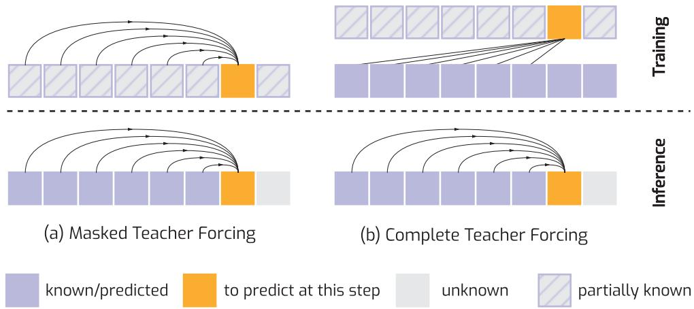
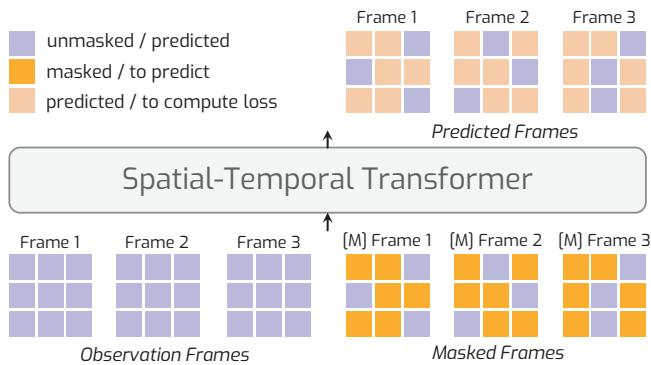
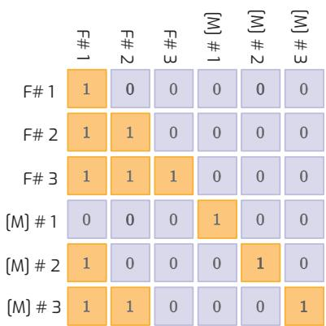
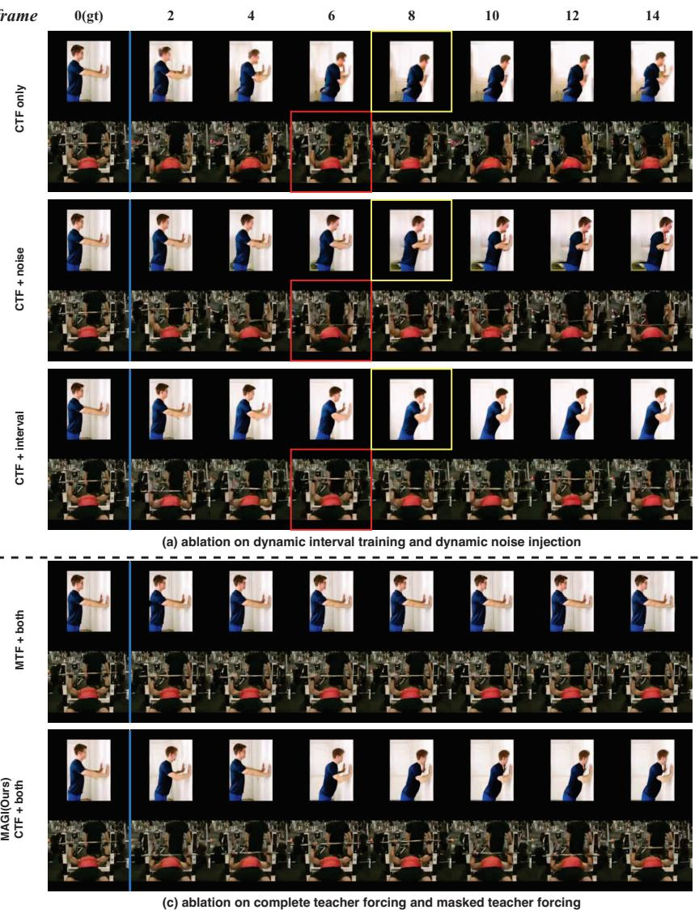
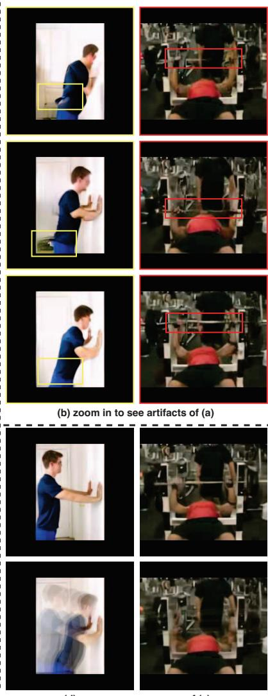
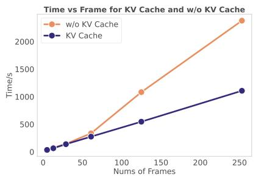
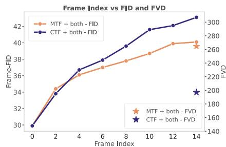
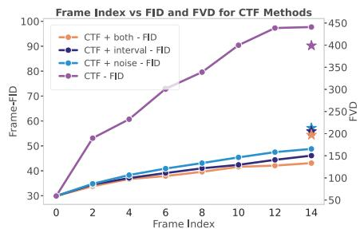
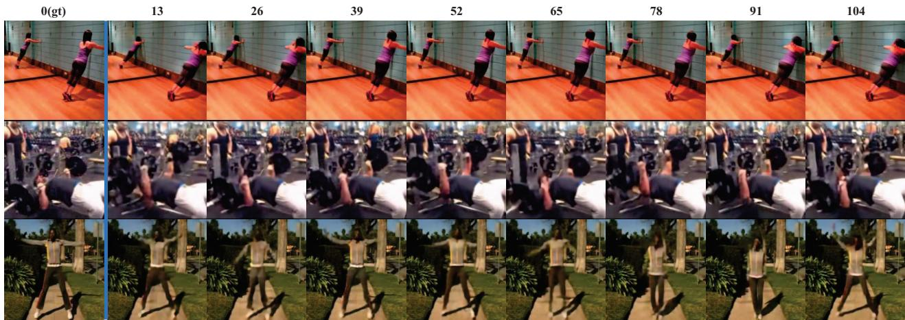

# Taming Teacher Forcing for Masked Autoregressive Video Generation

Deyu Zhou1 Quan Sun2 Yuang Peng2, 4 Kun Yan2 Runpei Dong3 Duomin Wang2 Zheng Ge2 Nan Duan2 Xiangyu Zhang2

1HKUST(GZ) 2StepFun 3UIUC 4THU MAGI-VIDEO-GENERATION.GITHUB.IO

## Abstract

We introduce MAGI, a hybrid video generation framework that combines masked modelingfor intra-frame generation with causal modeling for next-frame generation. Our key innovation, Complete Teacher Forcing (CTF), conditions maskedframes on complete observationframes rather than masked ones (namely Masked Teacher Forcing, MTF), enabling a smooth transition from token-level (patch-level) to frame-level autoregressive generation. CTF significantly outperforms MTF, achieving a +23% improvement in FVD scores on first-frame conditioned video prediction. To address issues like exposure bias, we employ targeted training strategies, setting a new benchmark in autoregressive video generation. Experiments show that MAGI can generate long, coherent video sequences exceeding 100 frames, even when trained on as few as 16 frames, highlighting its potentialfor scalable, high-quality video generation.

## 1. Introduction

Generating order matters in autoregressive image generation. While existing approaches mostly reply on simple raster-scan order, recent studies [8, 22] have demonstrated superior results through alternative generation strategies. These include randomized spatial order with bidirectional attention [4, 22, 51] and generation along increased scales [5, 8]. Despite its fundamental importance, in the realm of autoregressive video generation, however, the discussion of generation order has been largely overlooked.

Existing autoregressive video generation methods can be categorized into two groups according to the prediction granularity, as shown in Tab. 1. The first group, exemplified by MAGViT [51], adopts a masked modeling approach\* where visual tokens are generated in descending order according to their logit probabilities. While this approach uses bi-directional attention across frames, it presents two significant limitations: substantial computational overhead during inference since it is unable to utilize KV Cache [9, 23], and neglect temporal causality between consecutive frames. These oversights are particularly noteworthy given the remarkable success of causal modeling in large language models. Some other methods in this group [2, 6] have explored frame-level prediction with casual temporal attention. However, these methods are limited due to incomplete history observation, which causes an intrinsic traininginference gap.

The second group comprises fully autoregressive approaches operating on visual patches [20, 46, 48, 50], exemplified by recent works like VideoPoet [20] and Emu3 [46]. Despite their successful temporal modeling, these methods have not incorporated contemporary advances from image generation research in intra-frame generation. Instead, they continue to rely on raster-scan order - an approach demonstrated sub-optimal in image generation [22].

In this paper, we introduce Masked Autoregressive video GeneratIon (MAGI), a hybrid framework that synergizes the strengths of both video generation paradigms by combining masked modeling for intra-frame generation with causal modeling for inter-frame dependencies. We start with a naive implementation. This initial implementation explores a straightforward approach where tokens in each next frame are generated conditioned on previous masked frames (Figure 1(a)). While this can be viewed as a natural extension of MaskGIT [4] and Muse [5] to autoregressive video generation, our analysis reveals a fundamental limitation in its implementation of teacher forcing (TF) [47]. To be specific, TF involves feeding the model the groundtruth (correct) output from the previous time step as input during training, rather than using the model’s own predicted output. However, our initial approach, which we term as Masked Teacher Forcing (MTF), deviates from this principle by substituting ground-truth tokens with mask tokens. Despite similar approaches being explored in interactive generative models (e.g., Genie [2]), we identify a critical training-inference discrepancy: during training, next-frame generation is conditioned on a mixture of visible and masked tokens, while during inference, it relies solely on complete visual tokens from previous frames. Our experiments demonstrate that this inconsistency compromises generation quality, especially motion coherency.

Table 1. Comparison of autoregressive paradigms across different methods. We compare MAGI with various methods based on temporal attention mechanisms (how each frame attends to others), support for KV Cache [23] and variable context lengths, observation completeness (the completeness of the context frames used for conditioning), and the prediction granularity (patch or frame). †: MAGVIT predicts masked tokens of multiple frames simultaneously. Genie [2] and MAGI predict multiple tokens of single frame simultaneously.
<table><tr><td>Prediction Granularity</td><td>Method</td><td>Temporal Attention</td><td>KV Cache</td><td>Var. Context</td><td>Observation</td></tr><tr><td>Patch</td><td>VideoGPT [50], Phenaki [43], Omni [45]</td><td>Causal</td><td>√</td><td>√</td><td>Complete</td></tr><tr><td rowspan="4">Frame</td><td>MAGVIT† [51], GameNGen [40]</td><td>Bidirectional</td><td>x</td><td>x</td><td>Complete</td></tr><tr><td>Diffusion Forcing [6]</td><td>Causal</td><td>√</td><td>√</td><td>Noisy</td></tr><tr><td>Genie [2]</td><td>Causal</td><td>√</td><td>√</td><td>Masked</td></tr><tr><td>MAGI (with CTF)</td><td>Causal</td><td>√</td><td>√</td><td>Complete</td></tr></table>

To address these limitations, we propose Complete Teacher Forcing (CTF), an advanced paradigm that maintains training-test consistency by conditioning next-frame generation on complete visual observations from history frames during training. This is achieved through a novel mechanism that prepends complete video tokens to the masked input sequence and employs a carefully designed attention mask. Empirical results show that CTF better captures motion, outperforming MTF by 23% in terms of FVD scores on first-frame conditioned video prediction.

In addition, we tackle the persistent challenge of exposure bias [32] in autoregressive video generation through two complementary strategies: dynamic interval training and noise injection [40]. Dynamic interval training refers to randomly sampling frames with varying intervals during training, which introduces diversity into the data distribution and helps the model to better generalize to different temporal frequencies. Dynamic noise injection, on the other hand, involves adding random noise to observation frames during training, which helps improve the model’s robustness by simulating the possible errors may occur in inference. Combined with these two techniques, MAGI establishes a robust baseline for autoregressive video generation. Through extensive evaluations, we demonstrate that MAGI achieves superior video generation quality and length scalability. For example, MAGI can generate coherent video sequences that exceed 100 frames, even when trained on sequences as short as 16 frames. This underscores the potential of our approach for scalable video generation.

## 2. Background and Problem Statement

## 2.1. Autoregressive Video Generation

Given a video $V ~ \in ~ \mathbb { R } ^ { N \times H \times W \times 3 } ,$ , the sequence of N frames with height H and width W can be denoted as $V ~ = ~ \{ f _ { i } ~ \in ~ \bar { \mathbb { R } } ^ { H \times W \times 3 } | i ~ = ~ 1 , \dots , N \}$ . Each frame can be further divided into m patches, represented as $\left\{ \mathbf { x } _ { 1 1 } , \mathbf { x } _ { 1 2 } , \ldots , \mathbf { x } _ { 1 m } , \ldots , \mathbf { x } _ { n 1 } , \mathbf { x } _ { n 2 } , \ldots , \mathbf { x } _ { n m } \right\}$ . Autoregressive video generation models primarily differ in the granularity of causality (patch-level vs. frame-level) and the training paradigm (teacher forcing), discussed below.

Patch-level Methods Patch-level autoregressive models [46, 50] operate by modeling the video on a patch-bypatch basis. The likelihood of generating entire video with a model parameterized by θ is decomposed into the product of posterior of each patch conditioned all preceding patches:

$$
p ( { \cal V } ) = \prod _ { t = 1 } ^ { N \times m } p ( \mathbf x _ { t } \mid \mathbf x _ { 1 } , \mathbf x _ { 2 } , . . . , \mathbf x _ { t - 1 } ; \theta ) ,\tag{1}
$$

where $p _ { t }$ represents a patch in a predefined ordering. The model generates each patch sequentially by conditioning on all previously generated patches, capturing both spatial and temporal dependencies.

Frame-level Methods Frame-level autoregressive models [2, 40] model the video at the granularity of entire frames. Similarly, the likelihood of video modeling is:

$$
p ( V ) = \prod _ { t = 1 } ^ { n } p ( f _ { t } \mid f _ { 1 } , f _ { 2 } , . . . , f _ { t - 1 } ; \theta ) ,\tag{2}
$$

where $f _ { t }$ is the entire frame generated conditioned on all history frames. In this fashion, the patches in each frame are generated in parallel.

Teacher Forcing Teacher forcing [47] is a widely adopted training strategy in autoregressive models, where the model conditions on the true previous frame or patch rather than its own predictions [10, 47]. This method is commonly used in patch-level autoregressive video models [20, 45, 48, 50] as well as in language models [28, 29], where the model is supervised through next token or patch prediction, effectively “shifting” one token or patch at a time during training.

## 2.2. Can we achieve frame-level teacher forcing?

While teacher forcing is effective in autoregressive language models [28, 29], its application to frame-level video generation is largely unexplored. Few works adopt a straightforward “shift one frame” paradigm for frame-level video models.

  
Figure 1. Conceptual comparison of masked teacher forcing and our proposed complete teacher forcing mechanisms in auto regressive video generation. The blocks here illustrate individual frames. These two mechanisms differ in how history observation frames are used to condition next frame generation during training. (a): The observation frames are maskedframes [2, 13] that are par tially observable. (b): Every frame is generated conditioned onfully observable history frames.

Instead, existing methods often rely on masked frame prediction, where masked frames are conditioned on other frames. For example, Genie [2] extends MaskGIT [4] to video generation by conditioning masked frames on other masked teacher frames—a strategy we refer to as Masked Teacher Forcing (MTF). Similarly, Diffusion Forcing [6] introduces temporal causal attention with a novel noise strategy but conditions each frame on noisy teacher frames, further diverging from traditional teacher forcing. GameNGen [40] employs bidirectional diffusion models with binary mask tokens to represent masked and conditional frames; however, it relies on fixed-length conditional frames, limiting autoregressive flexibility and preventing the use of efficient mechanisms like KV Cache—one notable advantage of traditional autoregressive methods. Generating videos autoregressively at the patch level is also suboptimal because inter-frames lack clear raster-scan spatial causality. In contrast, videos exhibit strong temporal causality, suggesting that predicting videos frame by frame, while generating the tokens within each frame in parallel, is more effective.

To address these issues, MAGI fully leverages teacher forcing for frame-level autoregressive video generation, enabling more flexible, efficient, and scalable video generation.

## 3. Approach

Existing frame-level autoregressive video generation models, such as GameNGen [40], typically use binary masks to distinguish between frames used for prediction and those used for conditioning. These models are trained to predict future frames conditioned on a fixed-length sequence of preceding frames. This fixed conditioning contrasts with the greater flexibility of autoregressive language models, which condition on prefixes of variable length. In this work, we leverage MAR [22], a state-of-the-art masked image generation framework, and investigate crucial design choices for masked autoregressive video generation. Our focus includes exploring different autoregressive paradigms and methods for mitigating exposure bias and error accumulation during autoregressive inference.

Masked Teacher Forcing vs. Complete Teacher Forcing. A natural extension of masked image generation [4, 22] to autoregressive video prediction is to modify the attention mechanism [2], incorporating causal temporal attention during the training phase for masked frames. We refer to this approach as Masked Teacher Forcing (MTF), as illustrated on the right of Fig. 1. However, this method introduces a significant training-inference gap: during training, the model attends to a high mask ratio, while at inference time, it must predict future frames conditioned on previously generated unmasked ones. This mismatch between training and inference undermines the model’s ability to generate realistic videos, ultimately limiting its performance.

The formal formulation of MTF is as follows:

$$
p ( f _ { j } ^ { m } \mid f _ { 1 } ^ { m } , f _ { 2 } ^ { m } , \ldots , f _ { j - 1 } ^ { m } ; \theta ) , \quad j \in \{ 1 , 2 , \ldots , n \} .\tag{3}
$$

where $f _ { j } ^ { m }$ represents the j-th masked frame, while the frames $\mathbf { \bar { \mathbf { f } } } _ { 1 } ^ { m } , f _ { 2 } ^ { m } , \dots , f _ { j - 1 } ^ { m }$ are the previously predicted masked frames. In this formulation, during training, each masked frame attends to previously masked frames and itself. However, the approach introduces a significant gap between the training and the inference phase, because the model must predict masked frames conditioned on previously unmasked generated ones at the inference stage.

  
Figure 2. Overview of MAGI video generation framework. MAGI receives observation frames and corresponding masked frames as inputs, enabling autoregressive video generation with Complete Teacher Forcing (Sec. 3).

To address this issue and more effectively bridge the gap between training and inference, we propose a novel autoregressive paradigm, termed Complete Teacher Forcing (CTF), as shown on the left of Fig. 1. Unlike MTF, CTF conditions on unmasked observed frames during training, predicting each masked frame. Formally, let the observation frames be denoted as $\{ f _ { 1 } , f _ { 2 } , \ldots , f _ { n } \}$ , where n is the number of frames. The autoregressive formulation for predicting the j-th masked frame, $f _ { j } ^ { m }$ , is conditioned on both the previous unmasked observation frames and itself, i.e.,

$$
p ( f _ { j } ^ { m } \mid f _ { 1 } , f _ { 2 } , \ldots , f _ { j - 1 } ; \theta ) , \quad j \in \{ 1 , 2 , \ldots , n \} ,\tag{4}
$$

where $p ( f _ { j } ^ { m } \mid \cdot ; \theta )$ is the autoregressive model. Note that $f _ { 1 } ^ { m }$ is conditioned only on itself, which resembles image generation. For all $j > 1 , f _ { j } ^ { m }$ attends to both the previous unmasked observation frames and itself, making this approach consistent between training and inference.

Addressing Exposure Bias & Error Accumulation Although CTF reduces the gap between training and inference, it still faces challenges related to exposure bias [55] and error accumulation [21]. Specifically, the model may struggle to generate realistic video sequences during inference when relying on self-predicted frames.

To mitigate these issues, we introduce two strategies:

• Dynamic interval training. Video clips are sampled with random frame intervals, which forces the model to learn longer temporal dependencies and larger motion ranges, thus improving prediction stability for long videos. However, we find that a vanilla usage of this strategy leads to videos generated with uncontrollable motion range during inference. For example, prediction with a random motion range leads to unsatisfactory video generation results on UCF-101 that requires generation in 25 FPS. To support controllable generation to handle varying userspecified frame intervals, we introduce learnable interval embeddings which encodes different intervals into specific embeddings like positional encoding [42]. Specifically, the x-th interval embedding will be added to hidden states when sampling with an interval x which enables the model’s awareness of the desired generation interval.

  
Figure 3. Temporal attention mask in our CTF during training. The attention within observation frames causal, while the attention within masked frames are atrous. In this fashion, each masked frame attends to itself and unmasked history observation frames. During inference, a standard causal mask is employed, where each frame attends only to previously generated frames.

• Dynamic noise injection. As pointed out by Valevski et al. [40], there is a domain shift caused by teacher forcing and auto-regressive modeling, and thus data corruption using an injected noise during training is useful. Inspired by this practice, we also adopt a dynamic noise injection strategy. In addition, similar to interval embeddings, a learnable noise level embedding is concatenated with hidden states as the model inputs. Both techniques are crucial for improving the robustness of CTF by ensuring better generalization and stability during inference.

## 4. Architecture

We introduce MAGI, as shown in Fig. 2, a novel family of masked autoregressive video generation models, which incorporates the techniques outlined above. We implement MAGI with a Transformer architecture, detailed as follows.

Transformer Decoder & Temporal Attention MAGI employs a stack of spatial-temporal Transformer blocks consisting of interleaved 2D spatial attention layers and 1D temporal attention layers. As shown in Fig. 2, we prepend the complete observation frames with masked frames as the input of our Transformer. For CTF, we design a special temporal attention mask, as shown in Fig. 3. In the temporal layer, each frame only attends to itself and its preceding observation frames. The observation frames only attend to previous frames. Thus, the attention paradigm of CTF is consistent between training and inference.

Diffusion Head [22] Atop the Transformer decoder, we stack multi-layer perceptron (MLP) layers as the diffusion head, following MAR [22]. This component predicts masked tokens through a denoising diffusion procedure [16], enhancing the model’s capacity for autoregressive generation.

Learnable Positional Embeddings To distinguish between masked and unmasked frames, we introduce two distinct learnable positional embeddings: one for the masked frames and another for the observation frames. Additionally, we adopt a learnable positional embedding for the diffusion head, as proposed in MAR [22].

Spatial and Temporal Positional Embeddings We utilize sinusoidal positional embeddings [42] for both 2D spatial and 1D temporal encodings, ensuring that the model effectively captures spatiotemporal relationships across frames. Frame Interval Embeddings As part of our dynamic interval training strategy, we introduce a learnable interval embedding, with a vocabulary length of 25, which covers frame intervals ranging from 1 to 25. This embedding allows the model to capture long-range temporal dependencies across varying frame intervals.

Noise Level Embeddings To support dynamic noise injection, we incorporate random Gaussian noise into the observation frames during training, following GameNGen [40]. We use a noise level with a range of [1, 5], which is encoded through a learnable vocabulary embedding, with a dimension the same as the Transformer’s hidden dimension. This enables the model to adapt to different noise levels during the denoising process.

## 5. Experiments

## 5.1. Experimental Setup

Datasets For the five-frame conditional video prediction tasks, we use the Kinetics-600 dataset [3], which consists of 480,000 videos spanning 600 action categories. For unconditional and first-frame conditional video generation‡, we utilize the UCF-101 dataset [35], containing over 13,000 clips across 101 human action classes and with totally 27 hours of recording length.

Implementation Details We set the learning rate to $2 ~ \times$ $1 0 ^ { - 4 }$ for Kinetics-600 and $1 \times 1 0 ^ { - 4 }$ for UCF-101. Our largest model is trained for 150 epochs on Kinetics-600 and 1,400 epochs on UCF-101, with batch sizes of 256 and 128, respectively. Other hyperparameters follow the settings in MAR [22]. For Kinetics-600, we use the 3D-VAE from OmniTokenizer [45]. For UCF-101, we use the 2D-VAE from Stable Diffusion 1.4 [31] and the 3D-VAE from Cosmos [26]. During training, we sample 17 frames for the 3D-VAE and 16 frames for the 2D-VAE, respectively. All models are trained at a resolution of 256 256.

Inference and Evaluation For inference, we follow the strategy outlined in MAR [22], using 64 iterative steps for masked frame prediction per frame. The inference procedure is significantly accelerated using KV Cache. For evaluation on Kinetics-600, we generate 50,000 videos using context frames randomly sampled from the test set and compute the Frechet Video Distance (FVD) [´ 39] against the ground-truth videos, both resized to 64 64 resolution. For UCF-101, we follow the evaluation protocol of previous works [24, 45]. We randomly sample 2,048 videos and compute the FVD against 2,048 randomly selected groundtruth videos from the dataset.

## 5.2. Teacher Forcing Matters in Autoregressive Video Generation

CTF Outperforms MTF Our CTF significantly outperforms MTF by nearly 23% on first-frame conditioned video prediction. As shown in Fig. 5b, although MTF achieves slightly better frame-wise FID, it results in substantially worse overall FVD compared to CTF. Per-frame analysis (Fig. 4c-d) reveals that CTF better models temporal motion, while MTF generates high-quality static images lacking temporal coherence.

Why Does CTF Achieve Superior FVD? We argue that although MTF’s training on highly masked observations (using an optimal mask ratio of 70%–100%) is beneficial for generating visually similar frames and achieving lower FID scores, it imposes a significant limitation. Because MTF is trained to predict frames with minimal past information, it cannot effectively utilize full observations during inference. In contrast, CTF, trained on full observations, captures motion more accurately, leading to superior FVD scores.

## 5.3. Addressing Exposure Bias

Training Strategies Matters An ablation study (Fig. 5c) demonstrates the importance of our proposed training strategies: Removing either or both dynamic interval training§ and dynamic noise injection significantly degrades CTF’s FVD and FID, underscoring the exposure bias in autoregressive prediction. Combining both yields the best performance, demonstrating their synergistic effect.

Does MTF Also Benefit from These Training Strategies? These training strategies prove beneficial not only for CTF but also for MTF. While we focus our quantitative analysis on CTF and omit the full results for MTF due to space limitations, similar trends of performance improvement were observed. Notably, even when MTF benefits from these strategies, CTF consistently achieves superior results (see Fig. 5b), demonstrating its inherent advantages.

  
Figure 4. Case Study of Proposed Training Techniques: This figure evaluates the impact of dynamic interval training and dynamic noise injection on CTF and MTF by: 1) visualizing CTF with and without these strategies; and 2) comparing CTF and MTF when both use them. All methods perform first-frame conditional video prediction on UCF-101 [35]. The results demonstrate the efficacy of the proposed training strategies and the superior motion and temporal coherence of CTF.

## 5.4. Benchmarking with Previous Methods

Video Prediction We evaluate our model trained on Kinetics-600 [3] against existing non-autoregressive (NAR) and autoregressive (AR) methods (Tab. 2). Our method, MAGI, achieves an FVD score of 11.5, establishing a new state-of-the-art among AR models and significantly outperforming the patch-level AR method Omni [45]. Notably, our MAGI achieves -21.4 significantly lower FVD than Omni whose FVD is 32.9. This result demonstrates the effectiveness of frame-level autoregressive modeling with Complete Teacher Forcing. Examples of generated videos are provided in Appendix Fig. 7.

Unconditional Video Generation For unconditional video generation on UCF-101 [35] (Tab. 3), our method achieves state-of-the-art results among AR models, outperforming Latte [24], a DiT-based NAR model, by approximately 50 FVD points using the same VAE. Furthermore, using a stronger VAE (Cosmos [26]), our method becomes competitive with state-of-the-art NAR methods.

## 5.5. Further Analysis

Tab. 1 outlines the core differences between MAGI and other methods. MAGI achieves a smooth transition from patch-level to frame-level autoregressive generation while retaining key advantages, analyzed below.

  
(a) Speed comparison.

  
(b) MTF v.s. CTF.

  
(c) Ablation on first-frame conditional generation.  
Figure 5. a) Speed of generation process with varying numbers of frames. MAGI achieves a significant speedup by utilizing KV Cache b) Masked Teacher Forcing (MTF) v.s. Complete Teacher Forcing (CTF). Both methods utilize the proposed training strategies — dynamic interval training and dynamic noise injection. We report FID scores for individual frames and FVD scores for all frames on UCF101 [35]. CTF achieves significantly better FVD scores but slightly worse FID scores compared to MTF. This result demonstrates that CTF better captures motion with temporal coherence, even when the quality of individual frames is lower. c) The results of ablation study on first-frame conditional video predcition of UCF-101 [35]. The “star” indicates the FVD scores of each method with the same color.

Table 2. Video Prediction on Kinetics-600 [3]. The results are evaluated on the testset on Kinetics-600. We report the FVD64, 50K, obtained from 50K samples in the resolution of 64 64. NAR: Non-autoregressive methods. AR: Autoregressive methods.
<table><tr><td>Type</td><td>Method</td><td>VAE</td><td>FVD64, 50K↓</td></tr><tr><td>NAR</td><td>Video Diffusion [17]</td><td></td><td>16.2</td></tr><tr><td>NAR</td><td>RIN [18]</td><td></td><td>10.8</td></tr><tr><td>NAR</td><td>MAGVIT [51]</td><td>MAGVIT [51]</td><td>9.9</td></tr><tr><td>NAR</td><td>MAGVIT-v2 [52]</td><td>MAGVIT-v2 [52]</td><td>4.3</td></tr><tr><td>AR</td><td>ViVQVAE [44]</td><td>VQVAE [41]</td><td>64.3</td></tr><tr><td>AR</td><td>Phenaki [43]</td><td>VQVAE [41]</td><td>36.4</td></tr><tr><td>AR</td><td>Omni [45]</td><td>Omni [45]</td><td>32.9</td></tr><tr><td>AR</td><td>MAGI</td><td>Omni [45]</td><td>11.5</td></tr></table>

Generation Order Matters Our experiments (Fig. 5b and 5c) demonstrate that single-frame FID increases as the number of AR steps grows, regardless of the training paradigms and strategies employed. This finding underscores the importance of generation order in autoregressive video generation. Since frame-level generation requires fewer AR steps than patch-level generation, it can better preserve image quality over long sequences by mitigating error accumulation. Moreover, fewer autoregressive steps reduce the propagation of errors that typically accumulate in sequential generation processes, leading to more coherent and stable video outputs. This efficiency not only enhances visual fidelity but also contributes to faster inference times, which are critical for practical applications.

KV Cache A key practical advantage of MAGI is its efficient inference. MAGI’s frame-level KV Cache enables approximately linear scaling of inference time with the number of generated frames (Fig. 5a), a significant advantage over the parallel computation required by NAR methods.

Table 3. Unconditional video generation on UCF-101 [35]. We report the $\mathrm { F V D } _ { 2 5 6 } ,$ which is the FVD obtained from 2048 samples in the resolution of 256 256.
<table><tr><td>Type</td><td>Method</td><td>VAE</td><td>FVD256, 2048↓</td></tr><tr><td>NAR</td><td>MoCoGAN [38]</td><td></td><td>2886.9</td></tr><tr><td>NAR</td><td>MoCoGAN-HD [37]</td><td></td><td>1729.6</td></tr><tr><td>NAR</td><td>DIGAN [53]</td><td></td><td>1630.2</td></tr><tr><td>NAR</td><td>StyleGAN-V [34]</td><td></td><td>1431.0</td></tr><tr><td>NAR</td><td>PVDM [54]</td><td>PVDM [54]</td><td>1141.9</td></tr><tr><td>NAR</td><td>MoStGAN-V [33]</td><td></td><td>1380.3</td></tr><tr><td>NAR</td><td>Latte [24]</td><td>SD1.4 [31]</td><td>477.9</td></tr><tr><td>NAR</td><td>DiM [25]</td><td>SD1.4 [31]</td><td>358.8</td></tr><tr><td>NAR</td><td>Matten [36]</td><td>SD1.4 [31]</td><td>210.6</td></tr><tr><td>AR</td><td>VideoGPT [50]</td><td>3D VQVAE [41]</td><td>2880.6</td></tr><tr><td>AR</td><td>MAGI</td><td>SD1.4 [31]</td><td>420.6</td></tr><tr><td>AR</td><td>MAGI</td><td>Cosmos [26]</td><td>297.8</td></tr></table>

Practical Advantages of Autoregressive Generation To explore this, we train MAGI on UCF-101 [35] using randomly sampled 16-frame clips and evaluate its long-term prediction capability in a first-frame conditional generation setting. Fig. 6 demonstrates the promising predictive performance of MAGI, achieving reasonable results for sequences up to 100 frames in specific scenarios, particularly those with relatively static backgrounds and simple object motions. We observe performance degradation for videos with non-periodic motions (e.g., diving), which we attribute, in part, to the simplicity of the UCF-101 dataset and the challenging extrapolation required by the first-frame conditional setting. Specifically, for non-periodic actions like diving, the model lacks cues to predict subsequent actions once the primary action is complete, rendering metrics like FVD inappropriate. Therefore, we focus on demonstrating MAGI’s long-range prediction capability in these specific scenarios to showcase its potential for capturing long-range temporal dependencies and motivate further investigation.

  
Figure 6. Long-term Video Prediction. MAGI predicts over 100 frames from a single input frame, maintaining reasonable motion even when trained on only 16 frames.

## 6. Related Work

Autoregressive Visual Generation Autoregressive language modeling [28, 29] has propelled the development of visual content generation using discrete visual tokens [41]. In this framework, pre-trained visual tokenizers like VQ VAE [41] map visual patches into a discrete latent space, allowing visual generation to be approached similarly to language modeling. Early works such as DALL-E [30] focus on text-to-image generation by learning a joint distribution between text and discrete image representations using an autoregressive cross-entropy loss. Concurrently, VideoGPT [50] extends this idea to video generation, employing discrete tokens for autoregressive video prediction. VideoPoet [20] further advances this approach by integrating a causal video tokenizer, MAGVIT-v2 [52], for multimodal video generation. OmniTokenizer [45] proposes a unified tokenizer for both discrete and continuous representations, enabling patch-level autoregressive video generation. In contrast, our work focuses on frame-level causality rather than patch-level, avoiding the limitations of rasterscan order and outperforming patch-level baselines.

Masked and Diffusion Video Generation Diffusion models have recently gained prominence in visual generation tasks [7, 11, 14, 16, 31], extending effectively to video generation. Video diffusion models [1, 17] employ bidirectional attention and binary mask embeddings to enable frame-level autoregressive prediction. Notable works such as GameNGen [40] use bidirectional diffusion models for real-time game generation. However, due to their bidirectional nature, these models cannot leverage KV Cache for extended video generation, limiting their scalability. Several masked video generators, such as Genie [2], extend MaskGIT [4] into a causal-attention-based architecture for video generation. Despite their advantages, these methods suffer from the training-inference gap inherent in masked autoregressive modeling, which negatively impacts generation quality. In contrast, our approach fully leverages KV Cache during inference, facilitated by our training paradigm that bridges the training-inference gap through a novel Complete Teacher Forcing paradigm.

Addressing Exposure Bias for Autoregressive Video Generation Autoregressive models often suffer from exposure bias [55] and error accumulation [21], which degrade performance over long sequences. To mitigate these issues, we adopt noise injection from GameN-Gen [40]—where Gaussian noise is added to observation frame latents during training. Additionally, we introduce dynamic interval training, exposing the model to frames with varying temporal intervals to enhance generalization. As shown in Fig. 4, both strategies individually improve robustness, and their combination yields even greater performance gains in autoregressive video generation.

## 7. Conclusion

We present MAGI, a hybrid framework that combines masked and causal modeling to achieve efficient and scalable video generation. We identify that the teacher forcing paradigm makes a significant difference—our Complete Teacher Forcing (CTF) approach effectively bridges the training-inference gap inherent in Masked Teacher Forcing (MTF). Additionally, we introduce essential training strategies to alleviate exposure bias. Through comprehensive experiments, we validate the effectiveness of each component. Our final model achieves state-of-the-art performance among autoregressive video generation methods. We also demonstrate the generation of long, coherent video sequences exceeding 100 frames from training sequences as short as 16 frames, highlighting MAGI’s potential as a scalable autoregressive video generation model.

## Acknowledgements

We would like to thank Tianhong Li for his insightful suggestions, invaluable help, and exceptional support. We would also like to thank Chenfei Wu, Haoyang Huang, Guoqing Ma, Hongyu Zhou, Liangyu Chen, Chunrui Han, Yimin Jiang and Yu Deng for their constructive discussions and advice, which greatly improved this work.

## References

[1] Tim Brooks, Bill Peebles, Connor Holmes, Will DePue, Yufei Guo, Li Jing, David Schnurr, Joe Taylor, Troy Luhman, Eric Luhman, Clarence Ng, Ricky Wang, and Aditya Ramesh. Video generation models as world simulators. 2024. 8

[2] Jake Bruce, Michael D Dennis, Ashley Edwards, Jack Parker-Holder, Yuge Shi, Edward Hughes, Matthew Lai, Aditi Mavalankar, Richie Steigerwald, Chris Apps, et al. Genie: Generative interactive environments. In Forty-first International Conference on Machine Learning, 2024. 1, 2, 3, 8

[3] Joao Carreira, Eric Noland, Andras Banki-Horvath, Chloe Hillier, and Andrew Zisserman. A short note about kinetics-600. arXiv preprint arXiv:1808.01340, 2018. 5, 6, 7

[4] Huiwen Chang, Han Zhang, Lu Jiang, Ce Liu, and William T Freeman. Maskgit: Masked generative image transformer. In Proceedings of the IEEE/CVF Conference on Computer Vision and Pattern Recognition, pages 11315–11325, 2022. 1, 3, 8

[5] Huiwen Chang, Han Zhang, Jarred Barber, AJ Maschinot, Jose Lezama, Lu Jiang, Ming-Hsuan Yang, Kevin Murphy, William T. Freeman, Michael Rubinstein, Yuanzhen Li, and Dilip Krishnan. Muse: Text-to-image generation via masked generative transformers. arXiv preprint arXiv:2301.00704, 2023. 1

[6] Boyuan Chen, Diego Marti Monso, Yilun Du, Max Simchowitz, Russ Tedrake, and Vincent Sitzmann. Diffusion forcing: Next-token prediction meets full-sequence diffusion. arXiv preprint arXiv:2407.01392, 2024. 1, 2, 3

[7] Junsong Chen, Jincheng Yu, Chongjian Ge, Lewei Yao, Enze Xie, Yue Wu, Zhongdao Wang, James Kwok, Ping Luo, Huchuan Lu, and Zhenguo Li. Pixart-α: Fast training of diffusion transformer for photorealistic text-to-image synthesis, 2023. 8

[8] Lijie Fan, Tianhong Li, Siyang Qin, Yuanzhen Li, Chen Sun, Michael Rubinstein, Deqing Sun, Kaiming He, and Yonglong Tian. Fluid: Scaling autoregressive text-to-image generative models with continuous tokens. arXiv preprint arXiv:2410.13863, 2024. 1

[9] Suyu Ge, Yunan Zhang, Liyuan Liu, Minjia Zhang, Jiawei Han, and Jianfeng Gao. Model tells you what to discard: Adaptive KV cache compression for llms. In The Twelfth International Conference on Learning Representations, ICLR 2024, Vienna, Austria, May 7-11, 2024. OpenReview.net, 2024. 1

[10] Anirudh Goyal, Alex Lamb, Ying Zhang, Saizheng Zhang, Aaron C. Courville, and Yoshua Bengio. Professor forcing: A new algorithm for training recurrent networks. In

Advances in Neural Information Processing Systems 29: An nual Conference on Neural Information Processing Systems 2016, December 5-10, 2016, Barcelona, Spain, pages 4601– 4609, 2016. 2

[11] Yuwei Guo, Ceyuan Yang, Anyi Rao, Zhengyang Liang, Yaohui Wang, Yu Qiao, Maneesh Agrawala, Dahua Lin, and Bo Dai. Animatediff: Animate your personalized text to-image diffusion models without specific tuning. arXiv preprint arXiv:2307.04725, 2023. 8

[12] Yoav HaCohen, Nisan Chiprut, Benny Brazowski, Daniel Shalem, Dudu Moshe, Eitan Richardson, Eran Levin, Guy Shiran, Nir Zabari, Ori Gordon, et al. Ltx-video: Realtime video latent diffusion. arXiv preprint arXiv:2501.00103, 2024. 13

[13] Kaiming He, Xinlei Chen, Saining Xie, Yanghao Li, Piotr Dollar, and Ross B. Girshick. Masked autoencoders´ are scalable vision learners. In IEEE/CVF Conference on Computer Vision and Pattern Recognition, CVPR 2022, New Orleans, LA, USA, June 18-24, 2022, pages 15979–15988. IEEE, 2022. 3

[14] Yingqing He, Tianyu Yang, Yong Zhang, Ying Shan, and Qifeng Chen. Latent video diffusion models for high-fidelity video generation with arbitrary lengths. arXiv preprint arXiv:2211.13221, 2(3):4, 2022. 8

[15] Jonathan Ho and Tim Salimans. Classifier-free diffusion guidance. arXiv preprint arXiv:2207.12598, 2022. 12

[16] Jonathan Ho, Ajay Jain, and Pieter Abbeel. Denoising diffusion probabilistic models. Advances in neural information processing systems, 33:6840–6851, 2020. 5, 8, 13

[17] Jonathan Ho, Tim Salimans, Alexey Gritsenko, William Chan, Mohammad Norouzi, and David J Fleet. Video diffusion models. Advances in Neural Information Processing Systems, 35:8633–8646, 2022. 7, 8

[18] Allan Jabri, David Fleet, and Ting Chen. Scalable adap tive computation for iterative generation. arXiv preprint arXiv:2212.11972, 2022. 7

[19] Bingyi Kang, Yang Yue, Rui Lu, Zhijie Lin, Yang Zhao, Kaixin Wang, Gao Huang, and Jiashi Feng. How far is video generation from world model: A physical law perspective. arXiv preprint arXiv:2411.02385, 2024. 13

[20] Dan Kondratyuk, Lijun Yu, Xiuye Gu, Jose Lezama,´ Jonathan Huang, Grant Schindler, Rachel Hornung, Vigh nesh Birodkar, Jimmy Yan, Ming-Chang Chiu, et al. Videopoet: A large language model for zero-shot video gen eration. arXiv preprint arXiv:2312.14125, 2023. 1, 2, 8, 12

[21] Michael Laskey, Jonathan Lee, Roy Fox, Anca Dragan, and Ken Goldberg. Dart: Noise injection for robust imitation learning. In Conference on robot learning, pages 143–156. PMLR, 2017. 4, 8

[22] Tianhong Li, Yonglong Tian, He Li, Mingyang Deng, and Kaiming He. Autoregressive image generation without vector quantization. In The Thirty-eighth Annual Conference on Neural Information Processing Systems, 2024. 1, 3, 5, 12, 13

[23] Shi Luohe, Hongyi Zhang, Yao Yao, Zuchao Li, and ha zhao. Keep the cost down: A review on methods to opti mize LLM’s KV-cache consumption. In First Conference on Language Modeling, 2024. 1, 2

[24] Xin Ma, Yaohui Wang, Gengyun Jia, Xinyuan Chen, Ziwei Liu, Yuan-Fang Li, Cunjian Chen, and Yu Qiao. Latte: Latent diffusion transformer for video generation. arXiv preprint arXiv:2401.03048, 2024. 5, 6, 7

[25] Shentong Mo and Yapeng Tian. Scaling diffusion mamba with bidirectional ssms for efficient image and video generation. arXiv preprint arXiv:2405.15881, 2024. 7

[26] NVIDIA. Cosmos tokenizer. https://github com/ NVIDIA/C T k i , 2024. Accessed: 2024- 11-15. 5, 6, 7, 12

[27] Dustin Podell, Zion English, Kyle Lacey, Andreas Blattmann, Tim Dockhorn, Jonas Muller, Joe Penna, and¨ Robin Rombach. Sdxl: Improving latent diffusion models for high-resolution image synthesis. arXiv preprint arXiv:2307.01952, 2023. 13

[28] Alec Radford. Improving language understanding by generative pre-training. 2018. 2, 8

[29] Alec Radford, Jeffrey Wu, Rewon Child, David Luan, Dario Amodei, Ilya Sutskever, et al. Language models are unsupervised multitask learners. OpenAI blog, 1(8):9, 2019. 2, 8

[30] A. Ramesh, Mikhail Pavlov, Gabriel Goh, Scott Gray, Chelsea Voss, Alec Radford, Mark Chen, and Ilya Sutskever. Zero-shot text-to-image generation. ArXiv, abs/2102.12092, 2021. 8

[31] Robin Rombach, Andreas Blattmann, Dominik Lorenz, Patrick Esser, and Bjorn Ommer. High-resolution image¨ synthesis with latent diffusion models. In Proceedings of the IEEE/CVF conference on computer vision and pattern recognition, pages 10684–10695, 2022. 5, 7, 8

[32] Florian Schmidt. Generalization in generation: A closer look at exposure bias. In Proceedings of the 3rd Workshop on Neural Generation and Translation@EMNLP-IJCNLP 2019, Hong Kong, November 4, 2019, pages 157–167. Association for Computational Linguistics, 2019. 2

[33] Xiaoqian Shen, Xiang Li, and Mohamed Elhoseiny. Mostgan-v: Video generation with temporal motion styles. In Proceedings of the IEEE/CVF Conference on Computer Vision and Pattern Recognition, pages 5652–5661, 2023. 7

[34] Ivan Skorokhodov, Sergey Tulyakov, and Mohamed Elhoseiny. Stylegan-v: A continuous video generator with the price, image quality and perks of stylegan2. In Proceedings of the IEEE/CVF conference on computer vision and pattern recognition, pages 3626–3636, 2022. 7

[35] K Soomro. Ucf101: A dataset of 101 human actions classes from videos in the wild. arXiv preprint arXiv:1212.0402, 2012. 5, 6, 7

[36] Yao Teng, Yue Wu, Han Shi, Xuefei Ning, Guohao Dai, Yu Wang, Zhenguo Li, and Xihui Liu. Dim: Diffusion mamba for efficient high-resolution image synthesis. arXiv preprint arXiv:2405.14224, 2024. 7

[37] Yu Tian, Jian Ren, Menglei Chai, Kyle Olszewski, Xi Peng, Dimitris N Metaxas, and Sergey Tulyakov. A good image generator is what you need for high-resolution video synthesis. arXiv preprint arXiv:2104.15069, 2021. 7

[38] Sergey Tulyakov, Ming-Yu Liu, Xiaodong Yang, and Jan Kautz. Mocogan: Decomposing motion and content for

video generation. In Proceedings ofthe IEEE conference on computer vision and pattern recognition, pages 1526–1535, 2018. 7

[39] Thomas Unterthiner, Sjoerd Van Steenkiste, Karol Kurach, Raphael Marinier, Marcin Michalski, and Sylvain Gelly. Towards accurate generative models of video: A new metric & challenges. arXiv preprint arXiv:1812.01717, 2018. 5

[40] Dani Valevski, Yaniv Leviathan, Moab Arar, and Shlomi Fruchter. Diffusion models are real-time game engines. arXiv preprint arXiv:2408.14837, 2024. 2, 3, 4, 5, 8

[41] Aaron Van Den Oord, Oriol Vinyals, et al. Neural discrete representation learning. Advances in neural information pro cessing systems, 30, 2017. 7, 8

[42] A Vaswani. Attention is all you need. Advances in Neural Information Processing Systems, 2017. 4, 5

[43] Ruben Villegas, Mohammad Babaeizadeh, Pieter-Jan Kindermans, Hernan Moraldo, Han Zhang, Mohammad Taghi Saffar, Santiago Castro, Julius Kunze, and Dumitru Erhan. Phenaki: Variable length video generation from open domain textual descriptions. In International Conference on Learning Representations, 2022. 2, 7

[44] Jacob Walker, Ali Razavi, and Aaron van den Oord. Pre-¨ dicting video with vqvae. arXiv preprint arXiv:2103.01950, 2021. 7

[45] Junke Wang, Yi Jiang, Zehuan Yuan, Binyue Peng, Zuxuan Wu, and Yu-Gang Jiang. Omnitokenizer: A joint image-video tokenizer for visual generation. arXiv preprint arXiv:2406.09399, 2024. 2, 5, 6, 7, 8, 12

[46] Xinlong Wang, Xiaosong Zhang, Zhengxiong Luo, Quan Sun, Yufeng Cui, Jinsheng Wang, Fan Zhang, Yueze Wang, Zhen Li, Qiying Yu, et al. Emu3: Next-token prediction is all you need. arXiv preprint arXiv:2409.18869, 2024. 1, 2

[47] Ronald J. Williams and David Zipser. A learning algorithm for continually running fully recurrent neural networks. Neu ral Computation, 1(2):270–280, 1989. 1, 2

[48] Chenfei Wu, Jian Liang, Lei Ji, Fan Yang, Yuejian Fang, Daxin Jiang, and Nan Duan. Nuwa: Visual synthesis pre- ¨ training for neural visual world creation. In European conference on computer vision, pages 720–736. Springer, 2022. 1, 2

[49] Enze Xie, Junsong Chen, Junyu Chen, Han Cai, Haotian Tang, Yujun Lin, Zhekai Zhang, Muyang Li, Ligeng Zhu, Yao Lu, et al. Sana: Efficient high-resolution text-to-image synthesis with linear diffusion transformers. In The Thir teenth International Conference on Learning Representations, 2025. 13

[50] Wilson Yan, Yunzhi Zhang, Pieter Abbeel, and Aravind Srinivas. Videogpt: Video generation using vq-vae and transformers. arXiv preprint arXiv:2104.10157, 2021. 1, 2, 7, 8

[51] Lijun Yu, Yong Cheng, Kihyuk Sohn, Jose Lezama, Han ´ Zhang, Huiwen Chang, Alexander G Hauptmann, Ming-Hsuan Yang, Yuan Hao, Irfan Essa, et al. Magvit: Masked generative video transformer. In Proceedings of the IEEE/CVF Conference on Computer Vision and Pattern Recognition, pages 10459–10469, 2023. 1, 2, 7, 12

[52] Lijun Yu, Jose Lezama, Nitesh B Gundavarapu, Luca Ver- ´ sari, Kihyuk Sohn, David Minnen, Yong Cheng, Vighnesh

Birodkar, Agrim Gupta, Xiuye Gu, et al. Language model beats diffusion–tokenizer is key to visual generation. arXiv preprint arXiv:2310.05737, 2023. 7, 8, 12

[53] Sihyun Yu, Jihoon Tack, Sangwoo Mo, Hyunsu Kim, Junho Kim, Jung-Woo Ha, and Jinwoo Shin. Generating videos with dynamics-aware implicit generative adversarial networks. arXiv preprint arXiv:2202.10571, 2022. 7

[54] Sihyun Yu, Kihyuk Sohn, Subin Kim, and Jinwoo Shin. Video probabilistic diffusion models in projected latent space. In Proceedings of the IEEE/CVF conference on computer vision and pattern recognition, pages 18456–18466, 2023. 7

[55] Wen Zhang, Yang Feng, Fandong Meng, Di You, and Qun Liu. Bridging the gap between training and inference for neural machine translation. arXiv preprint arXiv:1906.02448, 2019. 4, 8