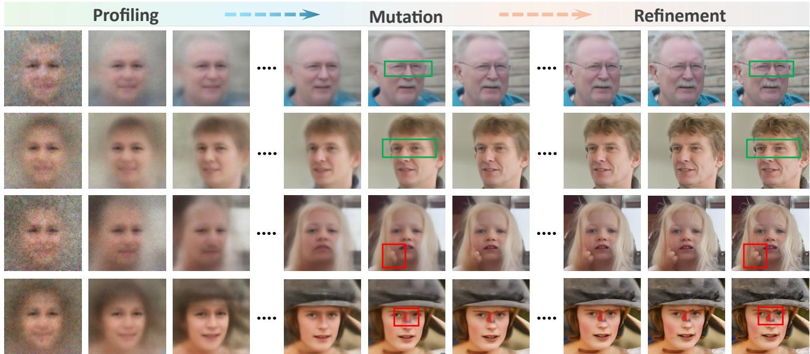
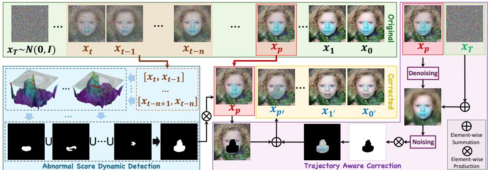
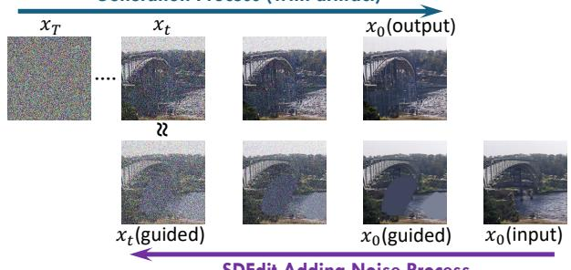
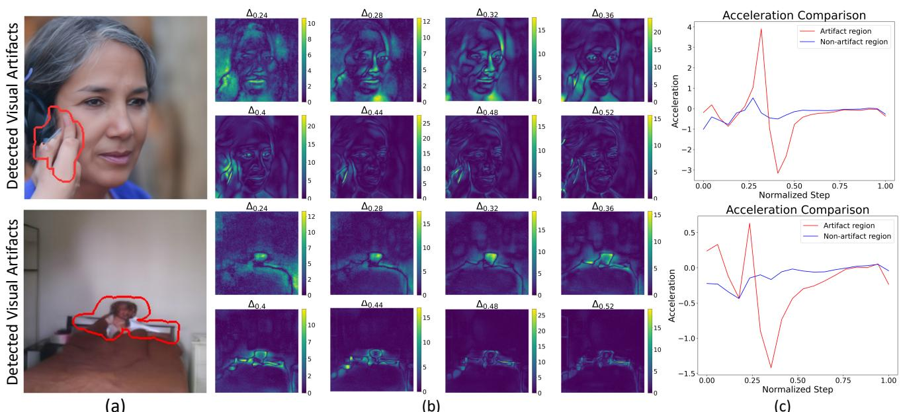
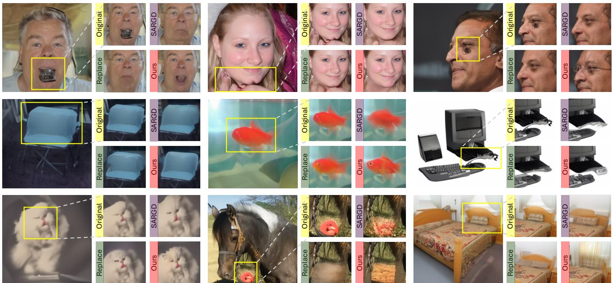
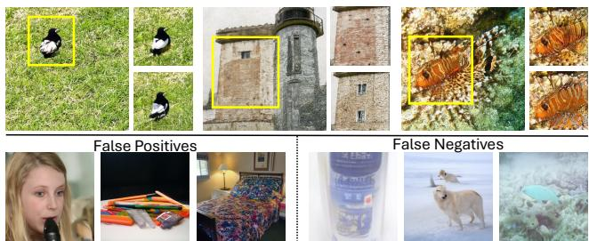
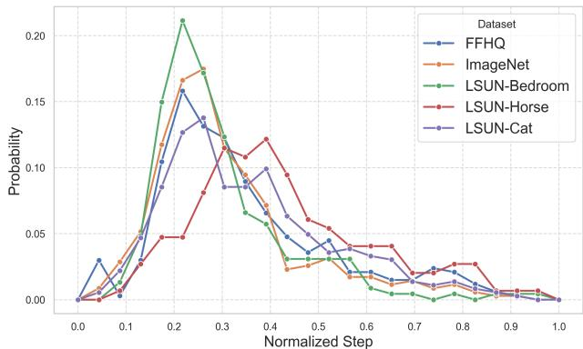
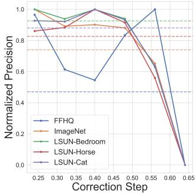
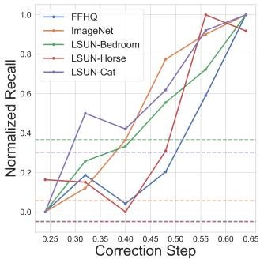
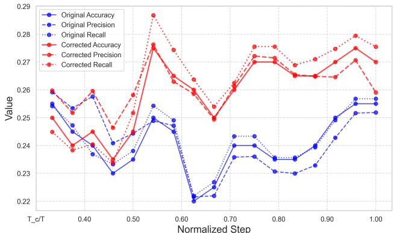

# Temporal Score Analysis for Understanding and Correcting Diffusion Artifacts

Yu Cao Zengqun Zhao Ioannis Patras Shaogang Gong Queen Mary University of London {yu.cao, zengqun.zhao, i.patras, s.gong}@qmul.ac.uk

  
Figure 1. Why do diffusion models generate artifacts? We discover that a diffusion generative process necessarily undergoes three phases, we call them: (2) “Profiling” which recovers holistic mean templates, (2) “Mutation” which introduces local divergence, and (3) “Refinement” which rationalizes pixel-wise generation in spatial context. Four visual examples are shown: The first two rows are two examples of rational local mutations (in green boxes) either naturally integrated (Row 1) or reasonably eliminated (Row 2). The bottom two rows show two failure cases when mutations were trapped unreasonably (in red boxes), resisting refinement and resulting in artifacts Phases are visualized in equal intervals for clarity; please zoom in for more details.

## Abstract

Visual artifacts remain a persistent challenge in diffusion models, even with training on massive datasets. Current solutions primarily rely on supervised detectors, yet lack understanding of why these artifacts occur in the first place. In our analysis, we identify three distinct phases in the diffusion generative process: Profiling, Mutation, and Refinement. Artifacts typically emerge during the Mutation phase, where certain regions exhibit anomalous score dynamics over time, causing abrupt disruptions in the normal evolution pattern. This temporal nature explains why existing methodsfocusing only on spatial uncertainty ofthefinal outputfail at effective artifact localization. Based on these insights, we propose ASCED (Abnormal Score Correction for Enhancing Diffusion), that detects artifacts by monitoring abnormal score dynamics during the diffusion process,

with a trajectory-aware on-the-fly mitigation strategy that appropriate generation of noise in the detected areas. Unlike most existing methods that apply post hoc corrections, e.g., by applying a noising-denoising scheme after generation, our mitigation strategy operates seamlessly within the existing diffusion process. Extensive experiments demonstrate that our proposed approach effectively reduces artifacts across diverse domains, matching or surpassing existing supervised methods without additional training. Project page: YuCao16.github.io/ASCED.

## 1. Introduction

Diffusion models have emerged as powerful foundation models in computer vision [5], achieving remarkable success in image generation [7, 15–17, 32], image inpainting [24, 27, 35], and text-to-image task [30–32]. However, even trained on large-scale datasets, diffusion generative images still exhibit two significant flaws: visual artifacts and hallucinations [43, 47]. Visual artifacts appear as local irregularities in texture or structure, while hallucinations involve semantically incoherent content, e.g., extra limbs or misplaced objects. In this work, we focus on addressing diffusion artifacts, which present a fundamental challenge to achieving reliable and high-quality image generation.

  
Figure 2. Diagram of our framework. Denoising and Noising are using Eq. (5) and Eq. (1), respectively.

Existing methods primarily treat visual artifact detection as a classification problem, i.e., identifying problematic generations for filtering or reconstruction. These methods typically rely on a specialized classifier, either trained on manually annotated artifact datasets [43] or leveraging a pre-trained Large Multi-Modal Model (LMM) [22]. However, such post hoc interventions fail to address a fundamental problem: Why and when do artifacts emerge in diffusion models? To bridge this gap, we begin by examining the diffusion generation process itself.

We discover that while diffusion process is guided by the same fundamental equation across time (i.e. diffusion steps), in practice, the model exhibits different behavior that can be roughly categorized in three different temporal phases that we name Profiling, Mutation, and Refinement. In the “Profiling” phase, the model sketches the basic semantic global layout; in the “Mutation” phase it explores potential local pixel-wise variations to create local structure; in the “Refinement” phase it attempts to resolve these local pixel-wise variations into coherent visual details in context (see Fig. 1 for visual examples and Sec. 3.2 for a detailed analysis). This understanding of the generation process reveals that while visual artifacts may appear randomly, they follow systematic and identifiable temporal patterns during image formation. Recent uncertainty-based approaches try to identify artifacts by converting diffusion models into Bayesian networks and employ techniques such as Last Layer Laplace Approximation [9] to generate pixellevel variance matrices [20]. However, these uncertainty quantification analyses only capture spatial variations in the final output, i.e., V ar(x<sub>0</sub>), missing crucial temporal dynamics during the generation process. Our study shows that diffusion artifacts emerge when certain image regions exhibit abnormal evolution patterns over time, primarily during the Mutation phase of the generation process. Specifically, their pixel values stop updating properly while the surrounding areas continue to evolve. This phenomenon, which we formally define as “score traps” in Sec. 3.2, explains why examining only the final output is insufficient and misplaced for effective diffusion artifact detection.

Building on these insights, we propose ASCED: Abnormal Score Correction for Enhancing Diffusion, as shown in Fig. 2. At the heart of the method is the estimation of a score, in this context the direction and magnitude of pixel-wise evolution at each diffusion generative step, and a scheme that analyses its temporal dynamics and detects abnormalities. We show both theoretically and experimentally that these abnormalities strongly correlate with artifact formation, making early detection possible at a stage where intervention is still feasible, before artifacts become irreversibly embedded in the generation process. We leverage this early detection capability by implementing a novel trajectory-aware correction mechanism that disrupts the evolution of artifact regions while preserving overall generation diversity. Importantly, ASCED operates in a fully unsupervised manner without requiring manual annotations or domain-specific training, making it readily applicable across various domains, , particularly valuable when training data may be limited or protected.

Our contributions are: (1) We provide new insights into the formation of visual artifacts in the diffusion generative process, advancing the understanding of diffusion model internal mechanisms. (2) We introduce a novel method that detects potential artifact regions by monitoring abnormal score dynamics temporally, without any manually labeled training required. (3) We further develop a on-the-fly trajectory-aware correction mechanism that effectively mitigates artifacts while preserving image diversity.

## 2. Related Works

Visual Artifact Detection initially targeted superresolution artifacts, where upsampling operations are the main source [45]. These methods analyze either spatial domain characteristics to capture texture differences between real and generated images [23, 41], or frequency domain patterns to study artifact characteristics in high-frequency components [12, 13]. More recent work has shifted focus to detecting artifacts in general image generation, developing specialized classifiers trained on manually annotated datasets [43] or utilizing pre-trained large vision models [22]. However, these supervised approaches require extensive manual labeling and may not generalize well across different domains. A parallel direction explores uncertainty quantification methods to understand visual artifacts. While various approaches including variational inference [4, 18], Laplace approximation [26, 29], and Markov Chain Monte Carlo [38, 44] have been developed, their application to diffusion models remains limited [20]. BayesDiff [20] pioneers pixel-level uncertainty quantification in diffusion models using Last-layer Laplace approximation [9], yet the connection between spatial uncertainty and visual artifacts remains unclear.

Generation Quality Enhancement Various approaches have been proposed to enhance generation quality. The truncation trick in BigGAN [6] demonstrated that restricting the sampling space can significantly improve generation fidelity, suggesting similar principles might apply to diffusion models. For diffusion-based generation, classifier guidance [11] has been introduced to steer the generation process. SARGD [49] extends this idea by utilizing a pre-trained artifact detector to guide the generation towards artifact-free regions. Latent diffusion models [30] take a different approach by applying diffusion in a learned latent space, demonstrating that controlled evolution in a constrained space can lead to higher-quality output.

Diffusion Model for Representation Learning has evolved toward latent space disentanglement and controllable editing. The former aims to uncover interpretable factors in the generative process. Recent studies [28, 42, 48] observed stage-wise attribute emergence during generation, but focus differently than our analysis of artifact formation mechanisms. Controllable editing techniques [27, 31, 37, 46] can be applied for artifact removal, yet require per-sample manipulation and address symptoms rather than causes. Our approach instead corrects abnormal score dynamics during the generation process itself.

## 3. Methodology

Our approach consists two steps: Detection (Sec. 3.2) and Correction (Sec. 3.3). Specifically, we localize artifact pixel regions by identifying abnormal score dynamics during the diffusion inference process (Detection) and develop a novel artifact correction algorithm without delaying inference (Correction). We give a theoretical analysis of our key concepts on score trap and temporal weighting (Sec. 3.4).

Generation Process (with artifact)  
  
Figure 3. Artifact generation through denoising (top) and brush stroke noising via SDEdit [27] (bottom), demonstrating the model’s inability to distinguish artifacts during generation.

## 3.1. Preliminaries

Diffusion Model Let $x _ { 0 } ~ \in ~ \mathbb { R } ^ { c \times h \times w }$ be an image. The forward process of a diffusion model gradually diffuses the data distribution $q ( x )$ towards $q _ { t } ( x _ { t } ) , \forall t \ \in \ [ 0 , T ]$ , with $q _ { T } ( x _ { T } ) = \mathcal { N } ( \mathbf { 0 } , I )$ as a trivial Gaussian distribution. From a score viewpoint, it can be described by the Stochastic Differential Equation (SDE):

$$
d \mathbf { x } _ { t } = f \left( \mathbf { x } _ { t } , t \right) d t + \pmb { g } \left( \mathbf { x } _ { t } , t \right) d \mathbf { w } _ { t } , \quad t \in [ 0 , T ]\tag{1}
$$

where w is the standard Wiener process, $f ( \cdot )$ and $g ( \cdot )$ are scalar drift and diffusion coefficients, respectively. Anderson [2] states that the reverse process of Eq. (1) is also a diffusion process as:

$$
d \mathbf { x } _ { s } = \left[ f ( \mathbf { x } _ { s } , s ) - g ( x _ { s } , s ) ^ { 2 } s ( x _ { s } , s ) \right] \mathrm { d } s + g ( x _ { s } , s ) \mathrm { d } \mathbf { w } _ { s }\tag{2}
$$

where $\mathbf { x } _ { s } : = x _ { T - t }$ and $s \left( x _ { s } , s \right) : = \nabla _ { \mathbf { x } _ { s } } \log p _ { s } \left( \mathbf { x } _ { s } \right)$ is the score function of the marginal distribution over $x _ { s }$ . Song et al. [35] leverage this property to generate samples by first drawing $x _ { T } \sim \mathcal { N } ( \mathbf { 0 } , \mathbf { I } )$ and then solving the reverse SDE using a learned score network $\boldsymbol { s } _ { \boldsymbol { \theta } } \left( \boldsymbol { x } _ { t } , t \right)$

By using Tweddie’s formula [36], DDPM (Denoising Diffusion Probabilistic Model) [16] can be shown as an equivalent interpretation of Eq. (2) [25]:

$$
\mathbf { \ } _ { s _ { \theta } } \left( \mathbf { \Delta x } _ { t } , t \right) = - \frac { 1 } { \sqrt { 1 - \bar { \alpha } _ { t } } } \mathbf { \epsilon } _ { \theta } \left( \mathbf { \Delta x } _ { t } , t \right)\tag{3}
$$

where $\begin{array} { r c l } { \bar { \alpha } _ { t } } & { = } & { \prod _ { s = 1 } ^ { t } \alpha _ { s } } \end{array}$ , with mean coefficient $\alpha _ { t }$ , and $\boldsymbol { \epsilon } _ { \boldsymbol { \theta } } \left( \boldsymbol { x } _ { t } , t \right)$ is the noise network of DDPM.

Definition of Visual Artifacts Generation flaws can be distinguished into two categories: Visual Artifacts and Hallucinations. Visual artifacts manifest as local irregularities or distortions in a generated image, such as blurred patches, unnatural textures, broken structures. In contrast, hallucinations refer to semantically generating incoherent content, such as extra limbs, misplaced objects or counterfactuals. In this paper, we focus specifically on detecting and correcting visual artifacts generated by diffusion models.

## 3.2. Detection by Anomalous Score Dynamic

To understand how visual artifacts emerge during generations, we examine diffusion model behavior through the lens of image editing. SDEdit [27] demonstrates that diffusion models can transform irregularities, e.g., brush strokes, into semantically meaningful content through a noise-thendenoise process, revealing the inherent Refinement capability of diffusion models. We observe that such irregularities after noising become structurally indistinguishable from states containing artifacts during generation, as shown in Fig. 3. While diffusion models can successfully refine noised brush strokes, they fail to correct the corresponding artifacts during generation. This contrast reveals that diffusion models lack the ability to identify artifacts as patterns requiring refinement during the generation process.

  
Figure 4. Visualization of score dynamics and visual artifact detection. (a) Generated images with detected visual artifact regions highlighted (red). (b) Visualization of score dynamics (normalized) between adjacent time steps as activation maps. Brighter regions (green to yellow) indicate areas of higher score variation, while darker regions (blue to black) show areas of lower score change. (c). Score acceleration curves (representing the rate of change in score dynamics between consecutive timesteps) comparing artifact regions (red) with non-artifact regions (blue). The artifact regions exhibit characteristic rapid acceleration followed by deceleration, while non-artifact regions maintain stable score dynamics over time throughout a generative (inference) process

To better understand this, we examine the generation process from a score perspective, as it directly represents the evolution of pixel values [35]. We define score dynamics as the difference between temporally adjacent score values: $\Delta s _ { \theta } ( x _ { t } ^ { i , j } , t ) = s _ { \theta } ( x _ { t } ^ { i , j } , t ) - \bar { s _ { \theta } } ( x _ { t - 1 } ^ { i , j } , \bar { t } - 1 )$ ). Analysis reveals that image generation begins with establishing basic structures, followed by a phase of stochastic exploration where irregular patterns may emerge; we call these phases Profiling and Mutation, respectively. As shown in Fig. 4, regions containing visual artifacts exhibit characteristic patterns during mutation: They appear as localized regions of intense score variations (Fig. 4 (b)) and display dramatic acceleration followed by sudden deceleration in their score trajectories (Fig. 4 (c)). In contrast, normal regions maintain a stable evolution throughout generation.

Based on these observations, we propose a novel approach to detecting and localizing potential artifact regions over time in a diffusion inference process. Specifically, let $\Omega \subset \mathbb { R } ^ { 2 }$ denote the spatial domain of the image, and $\Omega _ { t } ^ { a } ~ \subset ~ \Omega$ represent regions where abnormal evolution patterns emerge at timestep t. For each spatial location $( i , j ) \in \Omega$ , we track the score dynamics through consecutive timesteps. To account for the varying score magnitudes across different images and timesteps, we maintain a score bank $\boldsymbol { S } \ : = \ : \{ s _ { \theta } ( x _ { k } , k ) \} _ { k = t } ^ { T }$ and apply a temporal weighting function $w ( t )$ that addresses the inherent decay of score magnitudes. Formally, we define artifact regions as:

$$
\Omega _ { t } ^ { a } : = \left. ( i , j ) \in \Omega \mid \left| \Delta ( w ( t ) \cdot s _ { \theta } ( x _ { t } ^ { i , j } , t ) ) \right| > \tau \right.\tag{4}
$$

where $\begin{array} { r } { w ( t ) = \frac { 1 - \bar { \alpha _ { t } } } { \sqrt { \bar { \alpha _ { t } } } } } \end{array}$ (see Sec. 3.4 for theoretical analysis) and τ is adaptively determined as the maximum between the Median Absolute Deviation (MAD) of the weighted score dynamics and the mean of score bank S. The final artifact regions Ω<sup>a</sup> are accumulated across the score bank, with detailed procedures provided in Algorithm 1.

## 3.3. Real-Time Correction

After detecting artifacts, we need a correction strategy to effectively refine the artifact region. Two natural approaches emerge: either to revert to the states before the artifacts emerge through state replacement or to limit directly abnormal score changes through score clipping. For state replacement, we first predict the clean image from an earlier timestep t using [16]:

```latex
Algorithm 1 Pseudo Code for Proposed ASCED Method
1: Input: Score network $\begin{array} { r l } {  { \pmb { s } _ { \theta } ( \cdot ) } } \end{array}$ which requires T steps to generate, detection starting step $T _ { d }$ and correction step $T _ { c }$
2: Initialize $x _ { T } \sim \mathcal { N } ( 0 , \mathbf { I } )$ , Score Bank $\mathcal { S }  \{ \}$ , Visual Artifact Mask $\Omega ^ { a } \gets \{ \}$
3: for t = T, t--, while $t > = 0$ do
4: $\pmb { x } _ { t - 1 } = \sqrt { \alpha _ { t - 1 } } \pmb { x } _ { 0 } - \sqrt { 1 - \alpha _ { t - 1 } } \sqrt { 1 - \bar { \alpha } _ { t } } \pmb { s } _ { \theta } ( x _ { t } , t )$ , where $\begin{array} { r } { \pmb { x } _ { 0 } = \frac { \pmb { x } _ { t } + ( 1 - \bar { \alpha } _ { t } ) \pmb { s } _ { \theta } ( x _ { t } , t ) } { \sqrt { \bar { \alpha } _ { t } } } } \end{array}$ \triangleright Original Diffusion Process
5: if $\begin{array} { r } { T _ { c } < t < = T _ { d } } \end{array}$ then
6: S.append $\left( \boldsymbol { s } _ { \boldsymbol { \theta } } ( \boldsymbol { x } _ { t } , t ) \right)$ \triangleright Store score value into Score Bank
7: else if $t = = T _ { c }$ then \triangleright Anomalous Score Dynamics Detection Step
8: for $k = 0 , k { + } { + } ,$ while $k < \left( T _ { c } - T _ { d } \right)$ do \triangleright Determine Ω<sup>a</sup> by accumulation
9: $\Omega ^ { a } = \Omega ^ { a } \cup \Big \{ ( i , j ) \in \Omega \mid \Big | \Delta ( w ( k ) \cdot s _ { \theta } ( x _ { k } ^ { i , j } , k ) ) \Big | > \tau \Big \} \triangleright \tau = \operatorname* { m a x } \{ \mathrm { M A D } ( \Delta ( w ( k ) \cdot s _ { \theta } ( x _ { k } ^ { i , j } , k ) ) ) , \operatorname* { m e a n } ( \mathcal { S } ) \}$
10: $\pmb { x } _ { t } = \pmb { x } _ { t } \cdot \mathbb { 1 } _ { \overline { { \Omega } } ^ { a } } + \left( \sqrt { \bar { \alpha } _ { t } } \hat { \pmb { x } } _ { 0 } ( t ) + \sqrt { 1 - \bar { \alpha } _ { t } } \epsilon \right) \cdot \gamma ( t ) \xi \mathbb { 1 } _ { \Omega ^ { a } }$ \triangleright Trajectory-aware Targeted Correction Step
11: return $x _ { 0 }$
```

$$
\hat { \pmb { x } } _ { 0 } ( { \pmb x } _ { t } , t ) = \frac { 1 } { \sqrt { \bar { \alpha } _ { t } } } \left( { \pmb x } _ { t } + ( 1 - \bar { \alpha } _ { t } ) \nabla _ { \theta } \log p ( { \pmb x } _ { t } ) \right) ,\tag{5}
$$

Then replacing the artifact regions with corresponding states from this predicted clean image after re-noising to the current timestep. Score clipping directly limits the magnitude of score changes during inference. However, both state replacement and score clipping fundamentally disrupt the mutation process, leading to reduced generation diversity. To address this problem, we propose Trajectoryaware Targeted Correction (TTC), which introduces controlled perturbations specifically in artifact regions at correction timestep $T _ { c } \mathbf { : }$

$$
\hat { \pmb { x } } _ { T _ { c } } = \pmb { x } _ { T _ { c } } \cdot \mathbb { 1 } _ { \overline { { \Omega } } ^ { a } } + \left( \sqrt { \bar { \alpha } _ { T _ { c } } } \pmb { x } _ { 0 } ^ { \prime } + \sqrt { 1 - \bar { \alpha } _ { T _ { c } } } \epsilon \right) \cdot \gamma \xi \mathbb { 1 } _ { \Omega ^ { a } }\tag{6}
$$

where $\pmb { x } _ { 0 } ^ { \prime } = \hat { \pmb { x } } _ { 0 } ( \pmb { x } _ { T _ { c } } , T _ { c } ) , \epsilon , \xi \overset { \mathrm { i i d } } { \sim } \mathcal { N } ( 0 , \mathbf { I } )$ , 1<sub>Ω</sub>a is indicator function for artifact regions and perturbation intensity $\gamma .$

TTC builds upon the understanding of score traps: $\mathrm { R e \mathrm { - } }$ gions where pixels become locked in persistent score patterns after experiencing dramatic score changes. Through controlled perturbations, TTC disrupts these fixed patterns and allows pixels to resume normal evolution with surrounding regions. Sec. 3.4 provides a detailed analysis of these score trap mechanisms and their relationship to visual artifacts. Generation quality and diversity comparison across correction strategies is shown in Fig. 5.

## 3.4. Theoretical Analysis

We provide a theoretical analysis for the score trap and the choice of the temporal weighting function in $\operatorname { E q . }$ (4).

Theoretical Analysis of Score Traps For normal generation, the score evolution of each pixel is coupled with its neighborhood through the learned neural score function [8]:

$$
s _ { \theta } ( x _ { t } ^ { i , j } , t ) = \nabla _ { x _ { t } ^ { i , j } } \log p _ { \theta } ( x _ { t } ^ { i , j } | \mathcal { C } ( i , j ) , t )\tag{7}
$$

where $\mathcal { C } ( i , j )$ represents the contextual information from neighboring pixels. This coupling ensures coordinated evolution toward the data manifold. When regions experience abnormal score dynamics, they can enter score traps where local patterns persist despite significant score values, disrupting the natural coupled evolution process. These trapped regions evolve based primarily on their local patterns, losing the contextual relationships necessary for coherent image generation.

This reveals how our perturbation-based correction re-establishes contextual relationships. For a trapped pixel $( i , j )$ , the perturbation $\gamma \cdot \xi$ introduces stochastic variations that disrupt the isolated score patterns, creating opportunities for these regions to re-couple with their surroundings through the natural score evolution process. Meanwhile, in areas without abnormal patterns, these modest perturbations preserve the original coupled evolution, ensuring the method remains harmless to non-artifact regions; see Sec. 7.2 for further mathematical derivations and proofs.

Score Normalization The score function learned by diffusion models can be interpreted as a vector field guiding the denoising trajectory, inducing a probability flow [34]:

$$
\frac { d \pmb { x } } { d t } = - \frac { 1 } { 2 } \sigma _ { t } ^ { 2 } \nabla \log p _ { t } ( \pmb { x } _ { t } )\tag{8}
$$

The temporal evolution of this probability flow can be characterized by its divergence in the probability density field. Theoretically, we can model this through a flow operator $\mathcal { G } \colon$

$$
\mathcal { G } ( t ) = \nabla \cdot \left( \frac { \partial } { \partial t } \int _ { \tau = 0 } ^ { t } \mathcal { P } ( \pmb { x } _ { \tau } , \tau ) d \tau \right)\tag{9}
$$

where $\mathcal { P } ( \pmb { x } _ { \tau } , \tau )$ denotes the local probability density at position $\scriptstyle { \mathbf { 2 } } \left( { \mathbf { 2 } } \right) = { \mathbf { 2 } } \left( { \mathbf { 2 } } \right) = { \mathbf { 3 } } \left( { \mathbf { 2 } } \right) = { \mathbf { 2 } } \left( { \mathbf { 3 } } \right) = { \mathbf { 3 } } \left( { \mathbf { 2 } } \right)$ and time τ . This formulation allows us to monitor the accumulation of probability density changes over time. We observe that the clean image prediction (Eq. (5)) reflects these changes in the probability flow. Under the assumption of smooth probability density evolution between adjacent time steps [19, 33, 34], score dynamics are captured through $\begin{array} { r } { \frac { \partial } { \partial t } \hat { { \pmb x } } _ { 0 } ( t ) } \end{array}$ . Consequently, a normalization factor $\begin{array} { r } { w ( t ) = \frac { 1 - \bar { \alpha _ { t } } } { \sqrt { \bar { \alpha _ { t } } } } } \end{array}$ is derived from the coefficient of the score term in Eq. (5), helping to equalize the scale of score variations throughout the denoising process.

Table 1. Quantitative Comparisons on five datasets. The methods compared include BayesDiff [20] and SARGD [49], and three baseline methods: State Replacement Score Clipping and PAL [43] + TTC. All methods use DDIM sampling with identical noise seeds to generate 10,000 images per dataset, ensuring each approach modifies the same deterministic trajectories for fair comparison. The best scores are in bold and second best in underline with bold. Sup and UnS denote supervised and unsupervised methods, respectively.
<table><tr><td rowspan="2">Methods</td><td rowspan="2">Type</td><td colspan="3">FFHQ[17]</td><td colspan="3">ImageNet[10]</td><td colspan="3">LSUN-Cat[40]</td><td colspan="3">LSUN-Horse[40]</td><td colspan="3">LSUN-Bedroom[40]</td></tr><tr><td>FID↓</td><td>Pre. ↑</td><td>Rec. ↑</td><td>FID↓</td><td>Pre. ↑</td><td>Rec. ↑</td><td>FID↓</td><td>Pre.↑</td><td>Rec. ↑</td><td>FID↓</td><td>Pre.↑</td><td>Rec. ↑</td><td>FID↓</td><td>Pre. ↑</td><td>Rec. ↑</td></tr><tr><td>Original [34]</td><td>UnS</td><td>36.69</td><td>0.629</td><td>0.493</td><td>14.68</td><td>0.739</td><td>0.734</td><td>22.17</td><td>0.513</td><td>0.586</td><td>29.36</td><td>0.510</td><td>0.642</td><td>12.96</td><td>0.627</td><td>0.583</td></tr><tr><td>State Replace</td><td>UnS</td><td>37.09</td><td>0.635</td><td>0.495</td><td>14.61</td><td>0.743</td><td>0.733</td><td>22.79</td><td>0.510</td><td>0.587</td><td>30.36</td><td>0.502</td><td>0.642</td><td>12.95</td><td>0.628</td><td>0.574</td></tr><tr><td>Score Clipping</td><td>UnS</td><td>36.36</td><td>0.630</td><td>0.498</td><td>14.58</td><td>0.742</td><td>0.736</td><td>22.12</td><td>0.515</td><td>0.585</td><td>29.26</td><td>0.511</td><td>0.642</td><td>12.92</td><td>0.627</td><td>0.585</td></tr><tr><td>BayesDiff [20]</td><td>UnS</td><td>36.99</td><td>0.632</td><td>0.491</td><td>14.53</td><td>0.743</td><td>0.730</td><td>22.50</td><td>0.513</td><td>0.585</td><td>28.70</td><td>0.518</td><td>0.634</td><td>12.88</td><td>0.625</td><td>0.569</td></tr><tr><td>SARGD [49]</td><td>Sup</td><td>38.37</td><td>0.637</td><td>0.464</td><td>15.34</td><td>0.731</td><td>0.727</td><td>22.65</td><td>0.523</td><td>0.570</td><td>30.02</td><td>0.510</td><td>0.621</td><td>13.82</td><td>0.639</td><td>0.554</td></tr><tr><td>PAL [43] + TTC</td><td>Sup</td><td>36.35</td><td>0.624</td><td>0.500</td><td>14.01</td><td>0.731</td><td>0.747</td><td>21.83</td><td>0.514</td><td>0.588</td><td>28.68</td><td>0.519</td><td>0.646</td><td>12.71</td><td>0.629</td><td>0.579</td></tr><tr><td>ASCED (Ours)</td><td>UnS</td><td>36.28</td><td>0.637</td><td>0.503</td><td>14.41</td><td>0.750</td><td>0.735</td><td>21.91</td><td>0.515</td><td>0.593</td><td>27.66</td><td>0.521</td><td>0.652</td><td>12.53</td><td>0.628</td><td>0.590</td></tr></table>

## 4. Experiments

Basic setups We conducted experiments on five datasets: FFHQ [17], ImageNet [10], LSUN-Bedroom [40], LSUN-Cat [40], and LSUN-Horse [40]. We employed the Guided Diffusion model framework and pre-trained weights from OpenAI [11] and Segmentation-DDPM [3]. Quantitative evaluations were performed using FID [14], which measures the Frechet distance between real and generated image ´ distributions, along with Precision and Recall [21], which evaluate sample fidelity and diversity, respectively.

Implementation details For detecting diffusion artifacts, our approach was compared with LLaVA-v1.5-13B [22] and PAL [43], while artifact removal comparisons were made with BayesDiff [20] and the adapted SARGD [49]. All experiments were performed on NVIDIA A100 / H100 GPUs. We used DDIM [34] to improve inference efficiency with a Number of Function Evaluations (NFE) set to 25. Remark: We demonstrate in Sec. 7.1 that there is no significant correlation between NFE and the generation of artifacts. Full implementation details are provided in Sec. 6.

## 4.1. Quantitative Comparisons to Existing Methods

We first evaluate the effectiveness of ASCED in improving generative quality through comparisons with both unsupervised (BayesDiff [20]) and supervised (SARGD [49]) SOTA methods, along with the original diffusion model [11] and two baselines from Sec. 3.3 (state replacement and score clipping). To isolate the effectiveness of our correction method, we also evaluate a hybrid approach combining artifact detector PAL (used in SARGD) with our Trajectory-aware Targeted Correction (TTC). Quantitative results are shown in Tab. 1. Among unsupervised methods, our ASCED demonstrates superior performance across all datasets, consistently achieving better FID and Precision scores while maintaining higher Recall values than BayesDiff and baselines, indicating both improved generation quality and better preservation of diversity.

Compared to the supervised methods, our proposed ASCED method shows leading performance across most experiments, achieving superior results on FFHQ, LSUN-Horse, and LSUN-Bedroom, while maintaining competitive performance on ImageNet and LSUN-Cat. The better performances of PAL and SARGD on these two datasets are due to that they are supervised artifact detectors specifically trained on these datasets [43]. Their advantages are not generalizable to other datasets FFHQ, LSUN-(Horse, Bedroom). In contrast, ASCED as an unsupervised method has generalisable advantages in all domains without dataset specific training, making it more practical and scalable. Additionally, our method demonstrates significant computational efficiency advantages. In our experiments, ASCED detects and corrects artifacts in approximately 0.09 s per image, which is 8.8× faster than PAL (0.79 s).

The effectiveness of the correction mechanism (TTC) becomes particularly evident when comparing SARGD with PAL(used in SARGD) + TTC, where the trajectoryaware correction demonstrates significant advantages in preserving generation diversity across all datasets, reflected in consistently higher Recall scores.

Table 2. Visual Artifact Detection Accuracy Comparison between PAL (Supervised, Sup) [43], LLaVA (Zero-Shot, ZS) [22], and our method (Unsupervised, UnS) on FFHQ [17], ImageNet [10], and LSUN-(Bedroom, Cat, Horse) [40].
<table><tr><td>Method</td><td>Type</td><td>FFHQ</td><td>ImageNet</td><td>Bedroom</td><td>Cat</td><td>Horse</td></tr><tr><td>PAL</td><td>Sup</td><td>51.4%</td><td>69.2%</td><td>52.4%</td><td>69.8%</td><td>60.9%</td></tr><tr><td>LLaVA</td><td>ZS</td><td>63.1%</td><td>91.1%</td><td>75.9%</td><td>59.5%</td><td>72.2%</td></tr><tr><td>Ours</td><td>UnS</td><td>56.7% (-6.4)</td><td>67.7% (-1.5)</td><td>65.0% (-10.9)</td><td>68.3% (-1.5)</td><td>70.3% (-1.9)</td></tr></table>

## 4.2. Artifact Detection Performance Analysis

To validate the accuracy of our method in identifying visual artifacts, we manually selected 200 images for each dataset from the diffusion model outputs, consisting of 100 images with visual artifacts and 100 without. We then evaluated ASCED against zero-shot large multi-modal model LLaVAv1.5-13B [22] and supervised artifact detector PAL [43]. For LLaVA evaluation, we produced 50 different prompts and reported the results for the most effective prompt. Details on prompt generation are provided in Sec. 6.2. The accuracy for both methods is presented in Tab. 2.

As an unsupervised method, ASCED achieves promising detection performance, maintaining close accuracy to supervised approaches LLaVA and PAL across most datasets. Notably, these methods analyze final generated images, whereas our approach detects artifacts during the generation process through score dynamics, enabling early intervention before artifacts fully manifest. However, our method does show limitations in specific cases, such as low-contrast images where subtle abnormalities are difficult to distinguish from normal variations (leading to False Negatives), and instances where the diffusion model successfully rationalizes initially abnormal patterns during refinement (causing False Positives). Representative examples of these cases are illustrated in Fig. 6.

  
Figure 5. Qualitative Comparison of different correction methods. For each example, we show the original output with visual artifacts (left) and zoomed-in views of the artifact regions corrected by different methods (right): SARGD [49], state replacement (Replace), and our trajectory-aware targeted correction (Ours). Rows from top to bottom: FFHQ[17], ImageNet[10], and LSUN-(Cat, Horse, Bedroom)[40].

## 4.3. Qualitative Analysis of Correction Methods

To better illustrate the advantage of Trajectory-aware Targeted Correction (TTC) over baselines, Fig. 5 shows qualitative comparisons consisting of the original outputs with artifacts, results from state replacement (Sec. 3.3), SARGD [49], and TTC (ours). While all methods can remove artifacts, TTC demonstrates superior detail preservation in corrected regions. Specifically, both state replacement and SARGD tend to converge to similar expressions and local details, constraining natural variations, as they directly modify the generation states. SARGD faces further limitations from its artifact detector being trained on a specific domain [43], affecting its generalization ability. More importantly, by preserving mutation phase operations, our trajectory-aware correction enables diverse yet coherent generations even when correcting the same region. Additional comparison results are provided in Sec. 8.2.

Do corrections at Non-Artifact Regions harm? As with any detection method, our proposed scheme will inevitably encounter false positives, leading to add perturbations in non-artifact areas. Our experiments demonstrate that applying the correction mechanism to regions without visual artifacts, as shown in Fig. 6, introduces modest variations while preserving semantic coherence with the surrounding context and not generating new artifacts. Extended visual results and detection performance analysis can be found in Sec. 7.2 and Sec. 4.2, respectively.

  
Figure 6. Top: Applied our correction method to clean regions (yellow box). Bottom: Typical failure cases.

## 4.4. Further Analysis

Distribution of Abnormal Score Dynamics In Fig. 7, we plot the frequency of abnormal scores at each time step (normalized by total diffusion time step T). The score dynamics demonstrate distinct patterns across different stages: remaining stable in early steps where basic structures emerge, experiencing significant variations in the middle stage, and gradually stabilizing again in the later steps during details’ refinement. The presence of the long tail indicates that some variations persist into later steps, suggesting an extended period of details’ adjustment. This behavioral pattern naturally aligns with our hypothesis that the generation undergoes three phases: profiling, mutation, and rationalization. This temporal pattern suggests that, while early intervention might be possible, determining the latest effective correction point is crucial for maximizing the detection of potential artifacts.

  
Figure 7. Temporal Analysis of abnormal score dynamics across FFHQ [17], ImageNet [10], LSUN-(Bedroom, Cat, Horse) [40].

Impact of Correction Timing We investigate how the choice of correction timestep $T _ { c }$ affects artifact removal effectiveness. Through extensive experiments, we identify a threshold at approximately $T _ { c } ^ { * } / T \approx 0 . 4 8$ across different diffusion processes, representing the latest viable correction point before the model lacks sufficient steps for refinement. As shown in Fig. 8, both Precision and Recall metrics achieve optimal performance as $T _ { c }$ approaches $T _ { c } ^ { * }$ . This optimal timing allows for maximum artifact detection while ensuring adequate refinement steps. Most datasets show stable performance before $T _ { c } ^ { * }$ followed by a sharp decline, while FFHQ exhibits more fluctuation before $T _ { c } ^ { * }$ and decreases gradually afterward. Individual dataset curves with analysis are provided in Sec. 7.4.



  
Figure 8. Impact of correction timestep $T _ { c }$ on artifact removal performance evaluated by Precision (fidelity, ↑) and Recall (diversity, ↑). The dashed lines indicate the baseline precision / recall of the original diffusion model on each dataset.

Latent Code Improvement To evaluate how our correction method influences latent representations, we conduct a linear probe experiment [39] using a classifier-guided diffusion model [11] on ImageNet [10]. Specifically, we generate samples following two paths: the original diffusion process and our corrected process. At an intermediate timestep $t ,$ we obtain the original state $x _ { t }$ and apply our correction method to get the corrected state $\hat { x } _ { t }$ . We then continue the diffusion process for k steps to obtain $x _ { t - k }$ and $\hat { x } _ { t - k }$ from the original and corrected states, respectively. We generate $N$ labeled samples using both paths, with $y ^ { i }$ denoting the class label, resulting in two sets:

$$
\begin{array} { r } { \mathcal { D } _ { \mathrm { o r i g } } = \{ ( \boldsymbol { x } _ { t - k } ^ { i } , \boldsymbol { y } ^ { i } ) \} _ { i = 1 } ^ { N } , \quad \mathcal { D } _ { \mathrm { c o r r } } = \{ \left( \hat { x } _ { t - k } ^ { i } , \boldsymbol { y } ^ { i } \right) \} _ { i = 1 } ^ { N } } \end{array}\tag{10}
$$

We train two separate classifiers on $\mathcal { D } _ { \mathrm { o r i g } }$ and $\mathcal { D } _ { \mathrm { c o r r } }$ respectively, with results shown in Fig. 9. The higher accuracy achieved by improved latent codes throughout the remaining steps demonstrates that our method enhances the semantic quality of latent representations, and this improvement affects overall accuracy rather than individual precision or recall metrics. Notably, we observe that the classification accuracy reaches its peak earlier in the generation process with our method and remains stable through the refinement phase, while the original process exhibits a decrease-increase pattern during refinement.

  
Figure 9. Linear probe classification results comparing latent representations from original and corrected diffusion trajectories across Accuracy, Precision and Recall metrics.

## 5. Conclusion

We present a novel analysis of the diffusion generation process, decomposing it into profiling, mutation, and refinement phases, which provides fundamental insights into artifact formation mechanisms. Based on these insights, we develop ASCED, an unsupervised framework that successfully detects and corrects artifacts while preserving generation diversity. Extensive experiments demonstrate that ASCED achieves competitive performance with state-ofthe-art supervised methods across multiple datasets. The training-free nature of our approach enables immediate application to any diffusion model, making it a practical solution for improving generation quality.

Future Work While our approach effectively detects artifacts through temporal pattern analysis, promising directions include improving detection in low-contrast regions, developing more robust discrimination between transient and persistent abnormalities, and extending these insights to other generative frameworks.

## Acknowledgments

This work was partially supported by Veritone, Adobe, and has utilized Queen Mary’s Apocrita HPC facility from QMUL Research-IT.

## References

[1] Josh Achiam, Steven Adler, Sandhini Agarwal, Lama Ahmad, Ilge Akkaya, Florencia Leoni Aleman, Diogo Almeida, Janko Altenschmidt, Sam Altman, Shyamal Anadkat, et al. Gpt-4 technical report. arXiv preprint arXiv:2303.08774, 2023. 11

[2] Brian DO Anderson. Reverse-time diffusion equation models. Stochastic Processes and their Applications, 12(3):313– 326, 1982. 3

[3] Dmitry Baranchuk, Ivan Rubachev, Andrey Voynov, Valentin Khrulkov, and Artem Babenko. Label-efficient semantic segmentation with diffusion models. arXiv preprint arXiv:2112.03126, 2021. 6

[4] Charles Blundell, Julien Cornebise, Koray Kavukcuoglu, and Daan Wierstra. Weight uncertainty in neural network. In International conference on machine learning, pages 1613– 1622. PMLR, 2015. 3

[5] Rishi Bommasani, Drew A Hudson, Ehsan Adeli, Russ Altman, Simran Arora, Sydney von Arx, Michael S Bernstein, Jeannette Bohg, Antoine Bosselut, Emma Brunskill, et al. On the opportunities and risks of foundation models. arXiv preprint arXiv:2108.07258, 2021. 1

[6] Andrew Brock. Large scale gan training for high fidelity natural image synthesis. arXiv preprint arXiv:1809.11096, 2018. 3

[7] Yu Cao and Shaogang Gong. Few-shot image generation by conditional relaxing diffusion inversion. arXiv preprint arXiv:2407.07249, 2024. 1

[8] Ricky TQ Chen, Yulia Rubanova, Jesse Bettencourt, and David K Duvenaud. Neural ordinary differential equations. Advances in neural information processing systems, 31, 2018. 5

[9] Erik Daxberger, Agustinus Kristiadi, Alexander Immer, Runa Eschenhagen, Matthias Bauer, and Philipp Hennig. Laplace redux-effortless bayesian deep learning. Advances in Neural Information Processing Systems, 34:20089–20103, 2021. 2, 3

[10] Jia Deng, Wei Dong, Richard Socher, Li-Jia Li, Kai Li, and Li Fei-Fei. Imagenet: A large-scale hierarchical image database. In 2009 IEEE conference on computer vision and pattern recognition, pages 248–255. Ieee, 2009. 6, 7, 8

[11] Prafulla Dhariwal and Alexander Nichol. Diffusion models beat gans on image synthesis. Advances in neural information processing systems, 34:8780–8794, 2021. 3, 6, 8

[12] Ricard Durall, Margret Keuper, and Janis Keuper. Watch your up-convolution: Cnn based generative deep neural networks are failing to reproduce spectral distributions. In Proceedings of the IEEE/CVF conference on computer vision and pattern recognition, pages 7890–7899, 2020. 3

[13] Tarik Dzanic, Karan Shah, and Freddie Witherden. Fourier spectrum discrepancies in deep network generated images.

Advances in neural information processing systems, 33: 3022–3032, 2020. 3

[14] Martin Heusel, Hubert Ramsauer, Thomas Unterthiner, Bernhard Nessler, and Sepp Hochreiter. Gans trained by a two time-scale update rule converge to a local nash equilibrium. Advances in neural information processing systems, 30, 2017. 6

[15] Irina Higgins, Loic Matthey, Arka Pal, Christopher Burgess, Xavier Glorot, Matthew Botvinick, Shakir Mohamed, and Alexander Lerchner. beta-vae: Learning basic visual concepts with a constrained variational framework. In Interna tional conference on learning representations, 2016. 1

[16] Jonathan Ho, Ajay Jain, and Pieter Abbeel. Denoising dif fusion probabilistic models. Advances in neural information processing systems, 33:6840–6851, 2020. 3, 4

[17] Tero Karras, Samuli Laine, and Timo Aila. A style-based generator architecture for generative adversarial networks. In Proceedings of the IEEE/CVF conference on computer vision and pattern recognition, pages 4401–4410, 2019. 1, 6, 7, 8

[18] Mohammad Khan, Didrik Nielsen, Voot Tangkaratt, Wu Lin, Yarin Gal, and Akash Srivastava. Fast and scalable bayesian deep learning by weight-perturbation in adam. In International conference on machine learning, pages 2611–2620. PMLR, 2018. 3

[19] Diederik Kingma, Tim Salimans, Ben Poole, and Jonathan Ho. Variational diffusion models. Advances in neural infor mation processing systems, 34:21696–21707, 2021. 5, 14

[20] Siqi Kou, Lei Gan, Dequan Wang, Chongxuan Li, and Zhijie Deng. Bayesdiff: Estimating pixel-wise uncertainty in diffusion via bayesian inference. arXiv preprint arXiv:2310.11142, 2023. 2, 3, 6

[21] Tuomas Kynka¨anniemi, Tero Karras, Samuli Laine, Jaakko¨ Lehtinen, and Timo Aila. Improved precision and recall metric for assessing generative models. Advances in neural in formation processing systems, 32, 2019. 6

[22] Haotian Liu, Chunyuan Li, Yuheng Li, and Yong Jae Lee. Improved baselines with visual instruction tuning. In Proceedings of the IEEE/CVF Conference on Computer Vision and Pattern Recognition, pages 26296–26306, 2024. 2, 3, 6, 11

[23] Zhengzhe Liu, Xiaojuan Qi, and Philip HS Torr. Global texture enhancement for fake face detection in the wild. In Pro ceedings of the IEEE/CVF conference on computer vision and pattern recognition, pages 8060–8069, 2020. 3

[24] Andreas Lugmayr, Martin Danelljan, Andres Romero, Fisher Yu, Radu Timofte, and Luc Van Gool. Repaint: Inpainting using denoising diffusion probabilistic models. In Proceedings of the IEEE/CVF conference on computer vision and pattern recognition, pages 11461–11471, 2022. 1

[25] Calvin Luo. Understanding diffusion models: A unified perspective. arXiv preprint arXiv:2208.11970, 2022. 3, 14

[26] David John Cameron Mackay. Bayesian methods for adap tive models. California Institute of Technology, 1992. 3

[27] Chenlin Meng, Yutong He, Yang Song, Jiaming Song, Jiajun Wu, Jun-Yan Zhu, and Stefano Ermon. Sdedit: Guided image synthesis and editing with stochastic differential equa tions. arXiv preprint arXiv:2108.01073, 2021. 1, 3, 4

[28] Konpat Preechakul, Nattanat Chatthee, Suttisak Wizadwongsa, and Supasorn Suwajanakorn. Diffusion autoencoders: Toward a meaningful and decodable representation. In Proceedings of the IEEE/CVF Conference on Computer Vision and Pattern Recognition, pages 10619–10629, 2022. 3

[29] Hippolyt Ritter, Aleksandar Botev, and David Barber. A scalable laplace approximation for neural networks. In 6th international conference on learning representations, ICLR 2018- conference track proceedings. International Conference on Representation Learning, 2018. 3

[30] Robin Rombach, Andreas Blattmann, Dominik Lorenz, Patrick Esser, and Bjorn Ommer. High-resolution image¨ synthesis with latent diffusion models. In Proceedings of the IEEE/CVF conference on computer vision and pattern recognition, pages 10684–10695, 2022. 1, 3

[31] Nataniel Ruiz, Yuanzhen Li, Varun Jampani, Yael Pritch, Michael Rubinstein, and Kfir Aberman. Dreambooth: Fine tuning text-to-image diffusion models for subject-driven generation. In Proceedings of the IEEE/CVF Conference on Computer Vision and Pattern Recognition, pages 22500– 22510, 2023. 3

[32] Chitwan Saharia, William Chan, Saurabh Saxena, Lala Li, Jay Whang, Emily L Denton, Kamyar Ghasemipour, Raphael Gontijo Lopes, Burcu Karagol Ayan, Tim Salimans, et al. Photorealistic text-to-image diffusion models with deep language understanding. Advances in Neural Information Processing Systems, 35:36479–36494, 2022. 1

[33] Jascha Sohl-Dickstein, Eric Weiss, Niru Maheswaranathan, and Surya Ganguli. Deep unsupervised learning using nonequilibrium thermodynamics. In International conference on machine learning, pages 2256–2265. PMLR, 2015. 5

[34] Jiaming Song, Chenlin Meng, and Stefano Ermon. Denoising diffusion implicit models. arXiv preprint arXiv:2010.02502, 2020. 5, 6

[35] Yang Song, Jascha Sohl-Dickstein, Diederik P Kingma, Abhishek Kumar, Stefano Ermon, and Ben Poole. Score-based generative modeling through stochastic differential equations. arXiv preprint arXiv:2011.13456, 2020. 1, 3, 4

[36] Charles M Stein. Estimation of the mean of a multivariate normal distribution. The annals of Statistics, pages 1135– 1151, 1981. 3

[37] Bram Wallace, Akash Gokul, and Nikhil Naik. Edict: Exact diffusion inversion via coupled transformations. In Proceedings of the IEEE/CVF Conference on Computer Vision and Pattern Recognition, pages 22532–22541, 2023. 3

[38] Max Welling and Yee W Teh. Bayesian learning via stochastic gradient langevin dynamics. In Proceedings of the 28th international conference on machine learning (ICML-11), pages 681–688. Citeseer, 2011. 3

[39] Weilai Xiang, Hongyu Yang, Di Huang, and Yunhong Wang. Denoising diffusion autoencoders are unified self-supervised learners. arXiv preprint arXiv:2303.09769, 2023. 8

[40] Fisher Yu, Ari Seff, Yinda Zhang, Shuran Song, Thomas Funkhouser, and Jianxiong Xiao. Lsun: Construction of a large-scale image dataset using deep learning with humans in the loop. arXiv preprint arXiv:1506.03365, 2015. 6, 7, 8

[41] Ning Yu, Larry S Davis, and Mario Fritz. Attributing fake images to gans: Learning and analyzing gan fingerprints. In Proceedings of the IEEE/CVF international conference on computer vision, pages 7556–7566, 2019. 3

[42] Zhongqi Yue, Jiankun Wang, Qianru Sun, Lei Ji, Eric I Chang, Hanwang Zhang, et al. Exploring diffusion timesteps for unsupervised representation learning. arXiv preprint arXiv:2401.11430, 2024. 3

[43] Lingzhi Zhang, Zhengjie Xu, Connelly Barnes, Yuqian Zhou, Qing Liu, He Zhang, Sohrab Amirghodsi, Zhe Lin, Eli Shechtman, and Jianbo Shi. Perceptual artifacts localization for image synthesis tasks. In Proceedings of the IEEE/CVF International Conference on Computer Vision, pages 7579– 7590, 2023. 2, 3, 6, 7

[44] Ruqi Zhang, Chunyuan Li, Jianyi Zhang, Changyou Chen, and Andrew Gordon Wilson. Cyclical stochastic gradi ent mcmc for bayesian deep learning. arXiv preprint arXiv:1902.03932, 2019. 3

[45] Xu Zhang, Svebor Karaman, and Shih-Fu Chang. Detecting and simulating artifacts in gan fake images. In 2019 IEEE in ternational workshop on information forensics and security (WIFS), pages 1–6. IEEE, 2019. 3

[46] Yuxin Zhang, Nisha Huang, Fan Tang, Haibin Huang, Chongyang Ma, Weiming Dong, and Changsheng Xu. Inversion-based style transfer with diffusion models. In Pro ceedings of the IEEE/CVF conference on computer vision and pattern recognition, pages 10146–10156, 2023. 3

[47] Yue Zhang, Yafu Li, Leyang Cui, Deng Cai, Lemao Liu, Tingchen Fu, Xinting Huang, Enbo Zhao, Yu Zhang, Yulong Chen, et al. Siren’s song in the ai ocean: a survey on hallucination in large language models. arXiv preprint arXiv:2309.01219, 2023. 2

[48] Zijian Zhang, Zhou Zhao, and Zhijie Lin. Unsupervised rep resentation learning from pre-trained diffusion probabilistic models. Advances in neural information processing systems, 35:22117–22130, 2022. 3

[49] Qingping Zheng, Ling Zheng, Yuanfan Guo, Ying Li, Song cen Xu, Jiankang Deng, and Hang Xu. Self-adaptive realityguided diffusion for artifact-free super-resolution. In Proceedings of the IEEE/CVF Conference on Computer Vision and Pattern Recognition, pages 25806–25816, 2024. 3, 6, 7, 11