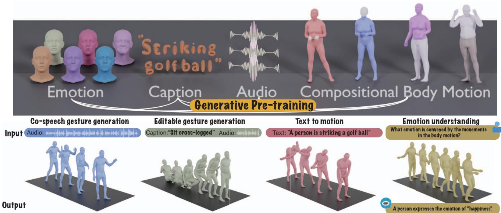
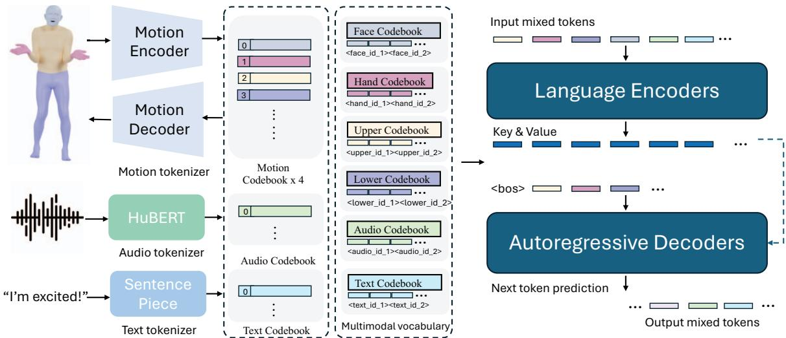
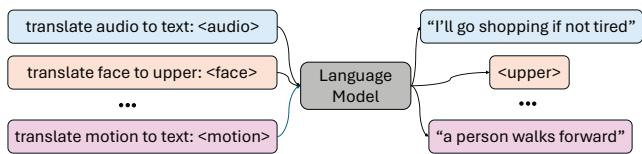
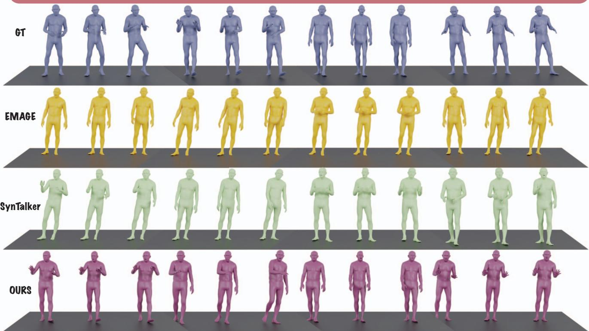
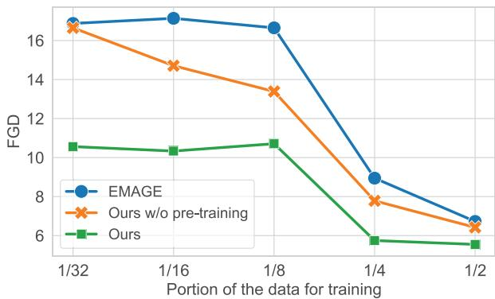
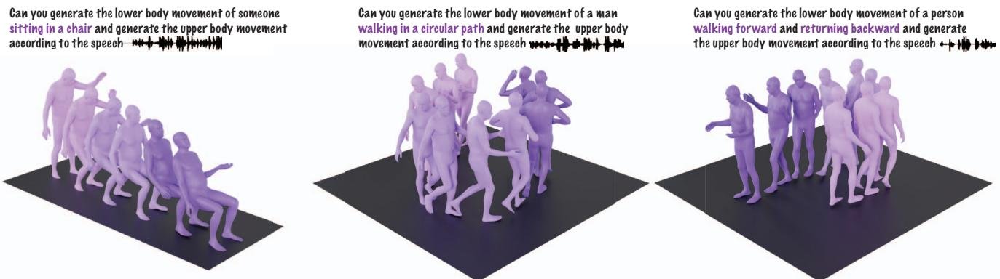
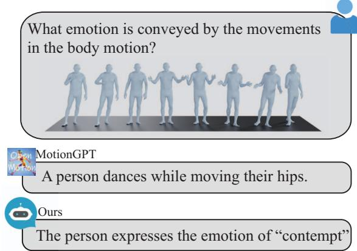

# The Language of Motion: Unifying Verbal and Non-verbal Language of 3D Human Motion

Changan Chen∗ Juze Zhang∗ Shrinidhi K. Lakshmikanth∗ Yusu Fang Ruizhi Shao Gordon Wetzstein Li Fei-Fei Ehsan Adeli Stanford University

  
Figure 1. We introduce a language-model-based motion understanding and generation framework that takes in any of the audio/motion/text modalities and outputs the desired target modality. Coupled with our generative pre-training strategy, our model demonstrates competitive performance on an array of tasks, showing promising signs toward unified verbal and non-verbal language of human motions.

## Abstract

Human communication is inherently multimodal, involving a combination of verbal and non-verbal cues such as speech, facial expressions, and body gestures. Modeling these behaviors is essential for understanding human interaction andfor creating virtual characters that can communicate naturally in applications like games, films, and virtual reality. However, existing motion generation models are typically limited to specific input modalities—either speech, text, or motion data—and cannotfully leverage the diversity of available data. In this paper, we propose a novel framework that unifies verbal and non-verbal language using multimodal language models for human motion understanding and generation. This model is flexible in taking text, speech, and motion or any combination of them as input. Coupled with our novel pre-training strategy, our model not only achieves state-of-the-art perfor-

mance on co-speech gesture generation but also requires much less data for training. Our model also unlocks an array of novel tasks such as editable gesture generation and emotion prediction from motion. We believe unifying the verbal and non-verbal language of human motion is essential for real-world applications, and language models offer a powerful approach to achieving this goal. Project page: languageofmotion github io.

## 1. Introduction

Human communication is multimodal. We use spoken and body language, including hand gestures, facial expressions, body postures and emotional expressions to interact with each other effectively. For example, people use linguistic cues along with body language, including hand gestures, facial expressions, overall body posture, and even emotional expressions to interact with the environment effectively. Modeling these multimodal behaviors is essential for understanding and generating human motion, enabling a wide range of applications for virtual characters in games, movies, and virtual reality—areas that have recently received substantial attention.

Existing work has been focused on modeling human motion from different modalities, such as speech [43, 48, 70], text [23, 64, 75], egocentric vision [30, 34], or the surrounding environment [5, 25, 63, 74, 77]. These models only take specific modalities as input, whose performance is thus limited to the data available for their downstream task. For example, co-speech gesture generation work typically trains speaker-dependent models [3, 19, 43, 70], which requires high-quality speech–motion capture of a person. While gesture style varies from person to person, many gestures are shared across people as well as non-speech-driven motion, such as walking or waving hands. Existing work has yet to leverage motion priors from all forms of motion data.

One of the promising ways to unify different tasks is multimodal language models, where a single language model can take different modalities as input and output target modalities. These models have shown promising results in a wide range of multimodal tasks, such as visual question answering [2, 33, 42], audio understanding and generation [6, 15, 73], and text-to-motion generation [9, 10, 61, 75, 82]. While language models have been widely applied, it has not been explored in the speech-text– motion generation setting.

We argue language models play a crucial role in unifying the verbal and non-verbal language of human motion for three reasons: 1) language models naturally connect different modalities, 2) speech is highly semantic, and tasks like modeling laughter in response to a joke require strong semantic reasoning capabilities and 3) language models are equipped with strong semantic understanding from extensive pre-training.

Towards this goal, we propose a novel multimodal language model for expressional motion generation and understanding (see Fig. 1). To leverage language models to model motion, we first tokenize motion separately for different body parts (face, hand, upper-body, lower-body). Such compositionality has shown to be more beneficial to model the expressive human expressions [43, 48]. Along with offthe-shelf tokenizers for text and speech [28], we can represent any given modality inputs as a sequence of tokens, which are consumed by language models. To train the language models, we design a two-stage training pipeline. The model is first pre-trained to align various modalities with compositional body motion alignment and audio–text alignment. After pre-training, we compile downstream tasks into instructions and train the model on these instructions to allow the model to follow various task instructions.

We first validate our model on the BEATv2 co-speech gesture generation benchmark [43] and show that our model strongly outperforms state-of-the-art models. We then conduct a thorough evaluation to demonstrate the effectiveness of our pre-training tasks. We also show that our pre-training strategy is more powerful when under severe data scarcity. While never seeing speech–motion data during pre-training, our model reaches competitive performance with a relatively small amount of data for a novel speaker, showing remarkable generalization. By performing post-training on both speech–motion and text–motion tasks, we show that our model not only follows audio and text prompts but also unlocks novel tasks such as predicting emotion from motion data. Please watch the Supp. video for the qualitative examples. To the best of our knowledge, this is the first work to build multimodal language models to unify the verbal and non-verbal language of 3D human motions.

## 2. Related Work

## 2.1. Speech-Driven Motion Generation

Human communication is multimodal and we use our speech, facial expressions, and body gestures to communicate with each other. Given this complimentary nature, recent work [1, 31] explores cross-modal generation of human motion from speech in different forms. These models are trained and evaluated on specific upper body joints, full body joints, and even facial expressions. Recent work in co-speech gesture generation often utilizes generative models to create gestures from audio conditions [8, 12, 43, 69]. Other work also explores the possibility of generating the listener’s motion [46, 47, 59]. Another area of research focuses on generating speech-driven co-speech facial expressions, with notable works including ViCO [85] and CodeTalker [67]. However, these works are limited in that they only take speech as input and do not utilize other forms of motion data, making it challenging to follow both speech and textual cues. To tackle this, we propose to unify input/output modalities with a language model framework.

## 2.2. Text to Motion Generation

Humans communicate with spoken language and nonverbal means such as emotions and interactions with surrounding environment [25, 63], among other cues. Recent work has explored generating human motion from text descriptions [4, 13, 16–18, 24, 26, 44, 52, 56, 62, 66, 76, 76, 83]. Some work attempts to generate human motion using diffusion models [11, 57, 58, 72, 78, 78, 79, 86] while other work exploring language models for generating human motion [9, 23, 38, 61, 64, 64, 75, 80, 82]. While these works have shown promising results in generating human motion from text instructions, they fall short in capturing the underlying meaning of the motion language itself. This limitation makes it challenging to develop a model capable of generating human motion from both verbal and non-verbal language. In this work, we propose a novel framework to capture patterns in body language and subtle expressive gestures inherently present in human communication.

  
Figure 2. Method overview. We employ modality-specific tokenizers to process various input modalities. Specifically, we train a compositional body motion VQ-VAE to tokenize face, hands, upper body, and lower body motions into discrete tokens, combining these modality specific vocabularies(audio and text) into a unified multimodal vocabulary. During training, mixed tokens from different modalities are used as input, and the output is generated through an encoder-decoder language model. The mixed tokens are fed into the transformer encoder, while the decoder predicts the probability distribution of the next token in an autoregressive manner at each step.

## 2.3. Multimodal Language Models

Recent years have witnessed the rise of language models [7, 14, 53, 54, 65, 84], primarily leveraging transformer architectures [60] that process text tokens as input and generate text tokens. Building upon these advancements, substantial efforts have expanded into multimodal language models capable of handling various types of input and output, with notable examples including BLIP-2 [32], LLaVA [42], and VideoChat [35]. Furthermore, the scope of multimodal language models (MM-LLMs) has broadened to include modality-specific outputs, as demonstrated by models like GILL [27] and SpeechGPT [73]. Efforts such as LLaVA [42] and AudioGPT [22] are advancing towards seamless any-to-any modality conversion, with the goal of emulating human-like cognitive abilities in multimodal contexts. Inspired by this line of work, we propose a new framework aimed at unifying verbal and non-verbal language within language models. Our framework takes text, speech, and motion data as input and generates human motion or text as output, further exploring the potential synergy between different tasks and modalities to enhance the performance of human motion generation.

## 3. Multimodal Language Model for Motion Generation and Understanding

In this section, we present a multimodal language model for motion generation and understanding, which is illustrated in Fig. 2. We first describe the tokenization of different modalities (Sec. 3.2), then we introduce our generative pretraining for modality alignment (Sec. 3.3), and finally, we detail post-training for instructions following(Sec. 3.4).

## 3.1. Preliminaries

We use the neutral SMPL-X [51] body model including FLAME [37] face model. This model is parameterized by per-person body shape $\beta ~ \in ~ \mathbb { R } ^ { T \times 3 0 0 }$ , 55 joint pose $\mathbf { g } \in \mathbb { R } ^ { \hat { T } \times 5 5 \times 3 }$ , facial expression $\psi \in \mathbb { R } ^ { T \times 1 0 0 }$ , and global body translation $\gamma \in \mathbb { R } ^ { T \times 3 }$ , where T is the frame number.

## 3.2. Tokenization

In order for our modelt take various modalities as input (audio, tex,t and motion), we first tokenize different modalities with modality-specific tokenizers, and then combine them into a multimodal vocabulary.

Compositional body motion tokenization. Following the motion representation approach in EMAGE [43], we divide the body into four parts with 6D rotation representation: 9 joints forming the lower-body $\mathbf { g } _ { l } ~ \in ~ \mathbb { R } ^ { T \times \hat { 5 } 4 }$ , 13 joints forming the upper-body $\mathbf { g } _ { u } ~ \in ~ \overline { { \mathbb { R } ^ { T } } } \times 7 8$ , 30 joints forming the hands $\mathbf { g } _ { h } \in \mathbb { R } ^ { T \times 1 8 0 }$ and 1-joint along with 100 expression parameters representing the face $\mathbf { g } _ { f } ~ \in ~ \mathbb { R } ^ { T \times 1 0 6 }$ Collectively, the motion space is represented as $\begin{array} { r l } { G } & { { } = } \end{array}$ $\left\{ \mathbf { g } _ { f } , \mathbf { g } _ { h } , \mathbf { g } _ { u } , \mathbf { g } _ { l } \right\}$ . Notably, we avoid using the commonly adopted HumanML3D representation [16] (H3D-Format) in text-to-motion tasks, as it predominantly focuses on skeletal movement, emphasizing swinging motions while overlooking twisting rotations of body parts—an essential aspect for effectively conveying body language. With this compositional representation, we train four separate VQ-VAEs to tokenize the body pose for each part. Each VQ-VAE encoder applies a four-layer temporal convolutional network (TCN) to extract continuous latent motion features $\mathbf { z } ^ { 1 : T } = \mathcal { E } ( \mathbf { g } ^ { 1 : T } )$ . This encoded representation $\mathbf { z } ^ { 1 : T }$ is quantized using:

$$
\mathbf { q } ^ { t } = \mathcal { Q } ( \mathbf { z } ^ { t } ) : = \arg \operatorname* { m i n } _ { \mathbf { q } ^ { k } \in Q } \| \mathbf { z } ^ { t } - \mathbf { q } ^ { k } \| ^ { 2 }\tag{1}
$$

where $\mathbf { q } ^ { t }$ is the discrete code in the codebook representing the encoded $\mathbf { z } ^ { t }$ . Collectively, the quantized motion latent space is $Q = \{ \mathbf q _ { f } , \mathbf q _ { h } , \mathbf q _ { u } , \mathbf q _ { l } \}$ . Each VQ-VAE decoder $\mathcal { D }$ decodes the quantized motion $\mathbf { q } ^ { t }$ back into the motion space $\hat { \mathbf { g } } ^ { 1 : T } = \mathcal { D } ( \mathbf { q } ^ { 1 : T } )$ and applies the following reconstruction losses:

$$
\begin{array} { r l } & { \mathcal { L } _ { t o t a l } = \mathcal { L } _ { \mathrm { r e c } } ( \mathbf { g } , \hat { \mathbf { g } } ) + \mathcal { L } _ { \mathrm { v e l } } ( \mathbf { g } ^ { \prime } , \hat { \mathbf { g } } ^ { \prime } ) + } \\ & { \quad \quad \quad \mathcal { L } _ { \mathrm { a c c } } ( \mathbf { g } ^ { \prime \prime } , \hat { \mathbf { g } } ^ { \prime \prime } ) + \mathcal { L } _ { \mathrm { m r e c } } ( \mathbf { g } , \hat { \mathbf { g } } ) + } \\ & { \quad \quad \quad \mathcal { L } _ { \mathrm { m v e l } } ( \mathbf { g } ^ { \prime } , \hat { \mathbf { g } } ^ { \prime } ) + \mathcal { L } _ { \mathrm { m a c c } } ( \mathbf { g } ^ { \prime \prime } , \hat { \mathbf { g } } ^ { \prime \prime } ) + } \\ & { \quad \quad \quad \mathcal { L } _ { \mathrm { c o m m } } ( \mathbf { g } , \mathbf { q } ) , } \end{array}\tag{2}
$$

where $\hat { \mathbf { g } } ^ { \prime }$ represent the reconstructed motion, $\hat { \mathbf { g } } ^ { \prime }$ and $\mathbf { g } ^ { \prime }$ represent the velocity of $\hat { \bf g }$ and $\mathbf { g } ,$ while $\hat { \mathbf { g } } ^ { \prime \prime }$ and $\mathbf { g } ^ { \prime \prime }$ represent their acceleration. For lower-body, upper-body and hands VQ-VAEs, pose reconstruction loss $\mathcal { L } _ { r e c }$ is a Geodesic loss. For face VQ-VAE, $\mathcal { L } _ { r e c }$ is $\ell _ { 2 }$ loss. Pose velocity/acceleration losses $\mathcal { L } _ { v e l }$ and $\mathcal { L } _ { a c c }$ are $\ell _ { 1 }$ losses. Mesh reconstruction loss $\mathcal { L } _ { m r e c }$ is $\ell _ { 2 }$ loss. Mesh velocity/acceleration losses $\mathcal { L } _ { m v e l }$ and $\mathcal { L } _ { m a c c }$ are $\ell _ { 1 }$ losses. Codebook commitment loss $\mathcal { L } _ { c o m m }$ is $\ell _ { 2 }$ loss. Vertices of the SMPLX-2020 mesh computed from the pose g and $\hat { \bf g }$ are used to compute mesh losses.

Speech tokenization. Similar to the motion modality, speech data is also continuous by nature. To facilitate speech training within a language model, we used Hu-BERT [20] to represent audio streams as discrete tokens. In this work, audio input is sampled at 16 kHz, resulting in $\mathbf { a } \in \mathbb { R } ^ { T \times s }$ , where s represents the audio frame rate after quantization. HuBERT further downsamples audio by a factor of 320, resulting in $s = 5 0$ . This frame rate, compared to the typical motion frame rate of 30 fps, provides an acceptable input token length for language models. The resulting audio token space is noted as $A = \left\{ \mathbf { a } \right\}$

Text tokenization. Following previous work [23, 54], we use SentencePiece [28] to tokenize text inputs and outputs into WordPiece tokens [29, 55] for the language model, with a vocabulary of 32,000 wordpieces inherited from the T5 [54] language model, which can be represented as $W =$ w . This vocabulary enables the model to process a fixed set of predetermined languages. Additionally, we extend the vocabulary with several multimodal tokens to support multi-modal inputs.

Multimodal vocabulary. Altogether, we have a combined token space defined as $M : = Q \cup A \cup W \cup C =$ $\left\{ \mathbf { q } _ { f } , \mathbf { q } _ { u } , \mathbf { q } _ { h } , \mathbf { q } _ { l } , \mathbf { a } , \mathbf { w } \right\}$ Each modality-specific tokenizer outputs its modality-specific vocabulary. To build a unified language model that can process these different modalities, we need to combine these vocabularies into a joint vocabulary. Since the language model is pre-trained with the text modality, we choose to extend the original text vocabulary $V _ { t } = \mathsf { \bar { \{ \boldsymbol { v } } _ { t } ^ { i } \} } _ { i = 1 } ^ { K _ { t } }$ with vocabularies from other modalities, including audio $V _ { a } = \{ v _ { a } ^ { i } \} _ { i = 1 } ^ { K _ { a } }$ , face $V _ { f } = \{ v _ { f } ^ { i } \} _ { i = 1 } ^ { K _ { f } }$ hands $V _ { h } = \{ v _ { h } ^ { i } \} _ { i = 1 } ^ { K _ { h } }$ , upper body $V _ { u } = \{ v _ { u } ^ { i } \} _ { i = 1 } ^ { K _ { u } }$ , and lower body $V _ { l } = \{ v _ { l } ^ { i } \} _ { i = 1 } ^ { K _ { l } }$ , following previous work [23]. In particular, the motion vocabulary is defined as a combination of four body-part vocabularies: $V _ { m } = \{ v _ { f } ^ { i } , v _ { h } ^ { i } , v _ { u } ^ { i } , v _ { l } ^ { i } \} _ { i = 1 } ^ { K _ { m } }$ Additionally, each modality-specific vocabulary includes special tokens for boundary recognition, such as </soa> and </eoa> to indicate the start and end of an audio sequence. As a result, all modalities can be represented in a unified format with one joint multimodal vocabulary $V = \{ V _ { t } , V _ { a } , V _ { f } , V _ { h } , V _ { u } , V _ { l } \}$

  
Figure 3. Illustration of pre-training. We pre-train our language model by translating one modality to another using paired data.

## 3.3. Pre-training for Modality Alignment

Existing motion generation models rely heavily on paired data to train downstream tasks. Yet, collecting high-quality paired motion data is both costly and time consuming while there exists a large amount of unpaired data of each modality that can be explored. Inspired by this, we introduce our generative pre-training strategy, as shown in Fig. 3. More specifically, we implement two types of modality alignment during the pre-training stage: compositional motion alignment and audio–text alignment that are detailed below.

Compositional body motion alignment. Our body motion is inherently compositional, i.e., different body parts move in accordance. For example, when we are happy, our faces express smiles and our gestures tend to become more positive. The correlation between different body part motions is universal, transcending cultural boundaries. This shared prior forms the basis of our approach. To explore this correspondence, we consider two types of motion alignment tasks: spatial and temporal.

Spatial. To model the correlation between these different body parts, we train the model to take in a randomly selected combination of body parts (e.g., upper or upper + face) and predict another randomly selected combination of other body parts (e.g., lower or lower + hand). This helps our model learn the spatial relations between body parts.

Below is one example template that defines task prompts, conditions, and answers. The model takes both prompts and conditions as input and is expected to output the answer.

Task Prompts: Translate upper to lower body.   
Conditions: Upper Body Tokens $V _ { \mathrm { c o n d i t i o n } } ~ = ~ \{ v _ { u } ^ { i } ~ \in ~$   
$V _ { u } \mid i \in$ sequence token index   
Answer: Lower Body Tokens $V _ { \mathrm { A n s w e r } } = \{ v _ { l } ^ { i } \in V _ { l } |$   
i sequence token index

Temporal. Predicting how motion changes as a function of time is also an important self-supervision, which enables the model to capture the temporal evolution of motion. We model this by randomly masking off certain motion frames to help the model learn the temporal priors of motion.

Task Prompts: Translate mask to unmasked motion.   
Conditions: Masked Tokens $V _ { \mathrm { c o n d i t i o n } } = \{ v _ { m } ^ { i } \in V _ { m } \ |$   
i masked sequence token index .   
Answer: Unmasked Motion Tokens $V _ { \mathrm { A n s w e r } } = \{ v _ { m } ^ { i } \in$   
V  i unmasked sequence token index

Audio-text alignment. In addition to the motion modality, we also design translation tasks between audio and text modalities, leveraging the abundance of available data. These tasks follow the format of “predicting modality Y from modality $X ^ { \ast }$ . For example, “predicting text from audio” should help the model’s performance in “predicting motion from audio” by mapping the audio embeddings into the well-pre-trained text embedding space.

## 3.4. Post-training with Instruction Following

After pre-training, the model gains an understanding of the underlying grammar and syntax within motion modality’s vocabulary and good alignment between audio and text modalities. We then fine-tune the model with paired data on downstream tasks such as co-speech gesture generation or text-to-motion generation. To enable the model to perform desired downstream tasks while following natural human instructions, we construct a multi-task instruction-following template by formatting several key tasks such as audio-tomotion, text-to-motion, and emotion-to-motion into instructions. Specifically, for each task, we compose dozens of different instruction templates, resulting in more than one thousand different tasks, each having a unique instruction prompt. An example of our instruction template is shown below. See Supp. for more examples.

Task Prompts: Based on < Audio Placeholder $> ,$   
generate a full-body movement sequence involving   
face, hands, upper body, and lower body that matches   
the audio’s rhythm.   
Conditions: Audio Tokens $V _ { \mathrm { c o n d i t i o n } } = \{ v _ { a } ^ { i } \in V _ { a } \mid i \in$   
audio sequence token index

Answer: Unmasked Motion Tokens $V _ { \mathrm { A n s w e r } } = \{ v _ { m } ^ { i } \in$ $V \mid i \in \{$ motion sequence token index

## 3.5. Language Model Training Details

Our model leverages 220M pre-trained Flan-T5-Base model [54] with an encoder–decoder transformer structure to address the conditional generation task. Through our shared multimodal vocabulary V , every input modality is represented as “text” tokens, allowing us to fully leverage the original T5 model for each conditional generation task. Specifically, with constructed modality latent codebook indices—such as index 8 of the upper body codebook—the upper body can be formatted as $^ { 6 6 } <$ upper $8 \ > \ '$ . Thus, the input can be converted into a sequence of tokens $S _ { i } =$ $\{ s _ { i } ^ { k } \} _ { k = 1 } ^ { \bar { L } }$ , where $s _ { i } \in V$ and L represents the input length. Similarly, the model outputs a sequence of tokens $S _ { o } ~ =$ $\{ s _ { o } ^ { k } \} _ { k = 1 } ^ { L } .$ , with a fixed input/output token length and $s _ { o } \in V .$

Since our model is encoder-decoder architecture, we set a maximum input length of 512. We specify modalities with start and stop tokens. Following the original T5 implementation, the sequence of tokens is sent to the encoder, and the decoder then performs next-token predictions in an autoregressive manner at each step. The training objective can be formulated as follows:

$$
\mathcal { L } _ { L M } = - \sum _ { k = 0 } ^ { L _ { t } - 1 } \log p _ { \theta } \big ( s _ { t } ^ { k } | s _ { t } ^ { < k } , s _ { i } \big ) ,\tag{3}
$$

where $s _ { t }$ represents each token within the sequence, serving as the index in our unified vocabulary V. Through nexttoken prediction, our model learns the underlying distribution of each modality, enabling the accurate and meaningful generation of target “words”. For both pre-training and post-training, we finetune the model’s entire weights instead of performing low-rank adaptation (LORA [21]) since our goal is to maximally align each modality.

## 4. Experiments

In this section, we first evaluate our model on the co-speech gesture generation benchmark, then investigate the generalization enabled by generative multimodal pre-training, demonstrate our model’s capability in following both audio and text prompts, and lastly our novel ability to predict emotion from motion.

## 4.1. Co-Speech Gesture Generation

To evaluate our model’s audio-to-motion generation ability, we choose to benchmark on co-speech gesture generation on the BEATv2 dataset [43], where the goal is to generate body gesture motion for a given speech of a speaker. Existing co-speech generation work typically models speakerdependent gestures [43, 47, 70]. During the pre-training stage, our model utilizes large-scale unpaired data in a self-supervised setup, drawing from two primary datasets, BEATv2 and Librispeech [49]. Together, these datasets provide approximately 1,000 hours of audio-to-text data and 60 hours of motion data. During the post-training, to ensure a fair comparison with baselines, we adopt the same evaluation protocol as [43], i.e., training and testing on speaker-2 and using their motion tokenizer. For pre-training, we ensure the model does not see any audio-to-motion data. Following prior work [43], we adopt Frechet Gesture Distance (FGD) [71] to evaluate the realism of the body gestures, Beat Correlation (BC) [36] to assess speech-motion synchrony and Diversity [31], which is calculated with the $\ell _ { 1 }$ distance between multiple body gesture clips.

<table><tr><td></td><td>FGD↓</td><td>BC↑</td><td>Diversity↑</td><td>Condition Signal</td></tr><tr><td>DisCo [40]</td><td>9.417</td><td>6.439</td><td>9.912</td><td>audio</td></tr><tr><td>CaMN [41]</td><td>6.644</td><td>6.769</td><td>10.86</td><td>audio, text, facial</td></tr><tr><td>DiffStyleGesture [68]</td><td>8.811</td><td>7.241</td><td>11.49</td><td>audio, style</td></tr><tr><td>Habibie et al. [19]</td><td>9.040</td><td>7.716</td><td>8.213</td><td>audio, text</td></tr><tr><td>TalkSHOW [70]</td><td>6.209</td><td>6.947</td><td>13.47</td><td>audio</td></tr><tr><td>SynTalker [8]</td><td>6.413</td><td>7.971</td><td>12.721</td><td>audio, text</td></tr><tr><td>EMAGE [43]</td><td>5.512</td><td>7.724</td><td>13.06</td><td>audio, text</td></tr><tr><td>Ours w/o language pre-training</td><td>7.470</td><td>6.148</td><td>14.162</td><td>audio</td></tr><tr><td>Ours w/o multimodal pre-training</td><td>5.408</td><td>7.742</td><td>14.418</td><td>audio</td></tr><tr><td>Ours</td><td>5.301</td><td>7.780</td><td>15.167</td><td>audio</td></tr></table>

Table 1. Co-speech gesture generation results on BEATv2 benchmark. We report FGD $\times 1 0 ^ { - 1 }$ $\mathrm { B C \times 1 0 ^ { - 1 } }$ , Diversity, which measures realism, speech-motion synchronization, and diversity respectively. Our model outperforms state-of-the-art methods on this benchmark.
<table><tr><td></td><td>FGD↓ BC↑</td><td>Diversity↑</td></tr><tr><td>W/o pre-training</td><td>5.501 7.721</td><td>14.281</td></tr><tr><td>W/o A2T</td><td>5.443 7.721</td><td>14.499</td></tr><tr><td>W/o spatial</td><td>6.336 7.381</td><td>14.173</td></tr><tr><td>W/o temporal</td><td>6.800 7.341</td><td>13.810</td></tr><tr><td>W/o motion</td><td>7.776 7.344</td><td>14.640</td></tr><tr><td>Ours</td><td>5.301 7.780</td><td>15.165</td></tr></table>

Table 2. Ablations of pre-training.

The results are shown in Table 1. Compared with the state-of-the-art methods on this benchmark, our model achieves better performance across all metrics, indicating that our model generates more realistic, and diverse motion that is synchronized with the speech. Existing work often supplies additional signals to the model to boost the model’s performance such as the text transcribed from the speech [19, 41, 43] or onset/amplitudes [43], partially due to the lack of semantic understanding of speech. In our model, since we use a pre-trained language model, the model naturally has a strong semantic understanding, allowing our model to show competitive performance without heavy reliance on hand-crafting features. If we use randomly initialized model weights, we can see that the model’s performance drops drastically, indicating that language pretraining is vital for co-speech gesture generation. If we remove our multimodal pre-training stage, the model’s performance also deteriorates, showing that our model benefits from the generative pre-training.

To further understand our model’s performance, we show some qualitative results of our model in Fig. 4. We can see that our model generates gestures that are synchronized with the speech. See Supp. video for more examples.

## 4.2. Effect of Generative Pre-training

Generating gesture motion for a new speaker requires collecting high-quality motion data, typically from motion capture systems. Collecting such data is time-consuming. In this section, we first validate the importance of each pretraining task and then investigate whether our generative pre-training leads to better generalization on new speakers and thus reduces the amount of data required for training.

Validating pre-training tasks. To understand how different pre-training objectives contribute to the performance, we ablate the audio-to-text alignment task (“w/o A2T”), the spatial body motion alignment task (“w/o spatial”), the temporal body motion alignment task (“w/o temporal”) and the whole body alignment task (“w/o motion”).

The results are shown in Table 1. “w/o A2T” lowers the model’s performance, indicating that aligning the audio embedding space with text helps with semantic understanding and also the downstream gesture generation task. Removing either spatial motion prediction, temporal motion prediction or them altogether hurts the performance, showing that learning spatial-temporal motion priors in the pre-training stage is important for the downstream tasks.

Effect on the training data. We hypothesize that our pre-training strategy captures strong multimodal correlation and motion priors, which could reduce the reliance on the amount of paired data for downstream tasks. To validate this hypothesis, we follow the setting in Sec. 4.1 and limit the amount of training data available to the model during the pre-training stage. Note that the model has never seen audio2motion data during pre-training. We set the amount of the data to ${ \frac { 1 } { 2 ^ { n } } } , n \in [ 1 . . . 5 ]$ . We train our full model, our model without pre-training and EMAGE to convergence under each setting and evaluate on the same test set.

  
Figure 4. Qualitative example on co-speech gesture generation. Given a speech, we visualize the ground truth 3D motion accompanying the audio, the motion generated by the baseline EMAGE [43], SynTalker [8] and our method. Our model generates more diverse and expressive motion compared to the baseline, especially when the speaker emphasizes on certain words such as “tired” and “because”.

  
Figure 5. Generation performance vs. the amount of post-training data. Our model learns a stronger motion prior from pre-training and thus shows much better under data scarcity.

The results are shown in Figure 5. We can see that our full model starts with much lower FGD compared with the model without pre-training even when only using 1/32 of the paired training. As expected, as the amount of paired fine-tuning data increases, the performance reduces but our full model always outperforms the w/o pre-training ablation and EMAGE, showing that our model benefits pretraining and shows greater generalization under extreme data scarcity.

## 4.3. Unifying Audio-to-Motion and Text-to-Motion for Editable Generation

By taking a language model-driven approach, our model is capable of following both audio and text prompts. We first train the motion tokenizer on both BEATv2 and AMASS [45] datasets since the range of motion in these two datasets is very different. We use the same tasks for pre-training. For post-training, we combine Audio2Motion and Text2Motion with various instructions, in which textto-motion with HumanML3D [16] text annotations. See Supp. for details.

By training on both text-to-motion and audio-to-motion data, our model supports joint audio-text prompts, enabling what we call editable gesture generation. This approach facilitates the generation of synergistic full-body motions conditioned on both speech and flexibly chosen prompts. For instance, the model can generate the motion of a person walking while talking. In this work, we demonstrate this capability by prompting the model separately for specific body part motions and then combining them seamlessly. Combining conversation gestures with daily motions is extremely useful for applications such as gaming or VR. We show several qualitative examples in Fig. 6. We can see that the model can generate human motion that follows both audio and text prompts, showing the emergent capabilities of our model. See Supp. video for more examples.

  
Figure 6. Editable gesture generation. We prompt the language with text and audio information and it outputs motions that are both expressional gesture motion as well as general movement motion.

  
Figure 7. Qualitative example of emotion prediction.

## 4.4. Predicting Emotion from Motion

Our model’s flexibility in the input/output modality also unlocks an array of new tasks such as translation between different body parts or modalities. In this section, we propose a novel task that predicts emotion from motion.

Reading someone’s body language, i.e., predicting emotion from motion is important for applications such as mental health or psychiatry, however, existing audio2motion or motion2text do not have this capability. We extract the emotion labels (neutral, anger, happiness, fear, disgust, sadness, contempt, and surprise) on BEATv2 and convert them into instructions for training. To be compatible with arbitrary language output from MotionGPT, we evaluate the model performance by measuring the BLEU [50], Rouge Cider [39], and BERTScore [81] between the prediction and the ground truth, which measures the semantic distances between texts. See more details in Supp.

<table><tr><td></td><td>Bleu@1↑</td><td>Rouge Cider↑</td><td>BertScore↑</td></tr><tr><td>GT</td><td>100</td><td>100</td><td>99.9</td></tr><tr><td>Random</td><td>2.45</td><td>4.44</td><td>0.19</td></tr><tr><td>MotionGPT</td><td>1.68</td><td>10.67</td><td>2.31</td></tr><tr><td>Ours</td><td>14.71</td><td>26.67</td><td>16.94</td></tr></table>

Table 3. Motion to emotion. We prompt our model to predict emotion given a motion sequence.

The results are shown in Table 3. MotionGPT entirely fails this task with a performance similar to a random baseline because it was only trained to caption general motion rather than subtle gesture movement and body language. Our model outperforms the random and MotionGPT by a large margin, showing our model’s ability to predict the emotion from motion. We also show one qualitative example in Fig. 7.

## 5. Discussion

In this work, we propose a novel multimodal language model to unify verbal and non-verbal language with a novel pre-training objective. Our model not only shows state-ofthe-art performance on co-speech gestures but also unlocks an array of novel tasks.

While promising, the model sometimes fails to produce coherent motion potentially due to discrete motion tokenization. Moving forward, we believe incorporating continuous tokenization is an important step to improve the quality of the generated motion.

We believe unifying verbal and non-verbal language of human motion generation and understanding is crucial for real-world applications, and language models provide a powerful framework to approach that goal.

Acknowledgments: This project was partially funded by NIH grant R01AG089169 and UST. The authors would also like to thank Georgios Pavlakos for his valuable discussion, Chaitanya Patel, Jingyan Zhang, and Bin Li for their feedback on the paper.

## References

[1] Chaitanya Ahuja, Dong Won Lee, Yukiko I Nakano, and Louis-Philippe Morency. Style transfer for co-speech gesture animation: A multi-speaker conditional-mixture approach. In ECCV, pages 248–265. Springer, 2020. 2

[2] Jean-Baptiste Alayrac, Jeff Donahue, Pauline Luc, Antoine Miech, Iain Barr, Yana Hasson, Karel Lenc, Arthur Mensch, Katherine Millican, Malcolm Reynolds, Roman Ring, Eliza Rutherford, Serkan Cabi, Tengda Han, Zhitao Gong, Sina Samangooei, Marianne Monteiro, Jacob Menick, Sebastian Borgeaud, Andrew Brock, Aida Nematzadeh, Sahand Sharifzadeh, Mikolaj Binkowski, Ricardo Barreira, Oriol Vinyals, Andrew Zisserman, and Karen Simonyan. Flamingo: a visual language model for few-shot learning. In Advances in Neural Information Processing Systems, 2022. 2

[3] Tenglong Ao, Zeyi Zhang, and Libin Liu. Gesturediffuclip: Gesture diffusion model with clip latents. ACM Transactions on Graphics (TOG), 42(4):1–18, 2023. 2

[4] Nikos Athanasiou, Alpar Ceske, Markos Diomataris,´ Michael J Black, and Gul Varol. Motionfix: Text-driven¨ 3d human motion editing. arXiv preprint arXiv:2408.00712, 2024. 2

[5] Bharat Lal Bhatnagar, Xianghui Xie, Ilya A Petrov, Cristian Sminchisescu, Christian Theobalt, and Gerard Pons-Moll. Behave: Dataset and method for tracking human object interactions. In CVPR, pages 15935–15946, 2022. 2

[6] Zalan Borsos, Rapha ´ el Marinier, Damien Vincent, Eugene ¨ Kharitonov, Olivier Pietquin, Matt Sharifi, Dominik Roblek, Olivier Teboul, David Grangier, Marco Tagliasacchi, and Neil Zeghidour. Audiolm: a language modeling approach to audio generation, 2023. 2

[7] Tom B. Brown, Benjamin Mann, Nick Ryder, Melanie Subbiah, Jared Kaplan, Prafulla Dhariwal, Arvind Neelakantan, Pranav Shyam, Girish Sastry, Amanda Askell, Sandhini Agarwal, Ariel Herbert-Voss, Gretchen Krueger, Tom Henighan, Rewon Child, Aditya Ramesh, Daniel M. Ziegler, Jeffrey Wu, Clemens Winter, Christopher Hesse, Mark Chen, Eric Sigler, Mateusz Litwin, Scott Gray, Benjamin Chess, Jack Clark, Christopher Berner, Sam McCandlish, Alec Radford, Ilya Sutskever, and Dario Amodei. Language models are few-shot learners, 2020. 3

[8] Bohong Chen, Yumeng Li, Yao-Xiang Ding, Tianjia Shao, and Kun Zhou. Enabling synergistic full-body control in prompt-based co-speech motion generation. In Proceedings of the 32nd ACM International Conference on Multimedia, pages 6774–6783, 2024. 2, 6, 7

[9] Ling-Hao Chen, Shunlin Lu, Ailing Zeng, Hao Zhang, Benyou Wang, Ruimao Zhang, and Lei Zhang. Motionllm: Understanding human behaviors from human motions and videos, 2024. 2

[10] Xin Chen, Biao Jiang, Wen Liu, Zilong Huang, Bin Fu, Tao Chen, and Gang Yu. Executing your commands via motion diffusion in latent space. In CVPR, pages 18000–18010, 2023. 2

[11] Xin Chen, Biao Jiang, Wen Liu, Zilong Huang, Bin Fu, Tao Chen, Jingyi Yu, and Gang Yu. Executing your commands via motion diffusion in latent space. In CVPR, 2023. 2

[12] Kiran Chhatre, Radek Daneˇcek, Nikos Athanasiou, Giorgioˇ Becherini, Christopher Peters, Michael J. Black, and Timo Bolkart. AMUSE: Emotional speech-driven 3D body animation via disentangled latent diffusion. In CVPR, pages 1942–1953, 2024. 2

[13] Seunggeun Chi, Hyung-gun Chi, Hengbo Ma, Nakul Agarwal, Faizan Siddiqui, Karthik Ramani, and Kwonjoon Lee. M2d2m: Multi-motion generation from text with discrete diffusion models. arXiv preprint arXiv:2407.14502, 2024. 2

[14] Jacob Devlin, Ming-Wei Chang, Kenton Lee, and Kristina Toutanova. Bert: Pre-training of deep bidirectional transformers for language understanding, 2019. 3

[15] Yuan Gong, Hongyin Luo, Alexander H Liu, Leonid Karlinsky, and James Glass. Listen, think, and understand. arXiv preprint arXiv:2305.10790, 2023. 2

[16] Chuan Guo, Shihao Zou, Xinxin Zuo, Sen Wang, Wei Ji, Xingyu Li, and Li Cheng. Generating diverse and natural 3d human motions from text. In CVPR, pages 5152–5161, 2022. 2, 3, 7

[17] Chuan Guo, Xinxin Zuo, Sen Wang, and Li Cheng. Tm2t: Stochastic and tokenized modeling for the reciprocal generation of 3d human motions and texts. In ECCV, pages 580– 597. Springer, 2022.

[18] Chuan Guo, Yuxuan Mu, Muhammad Gohar Javed, Sen Wang, and Li Cheng. Momask: Generative masked modeling of 3d human motions. In CVPR, pages 1900–1910, 2024. 2

[19] Ikhsanul Habibie, Weipeng Xu, Dushyant Mehta, Lingjie Liu, Hans-Peter Seidel, Gerard Pons-Moll, Mohamed Elgharib, and Christian Theobalt. Learning speech-driven 3d conversational gestures from video, 2021. 2, 6

[20] Wei-Ning Hsu, Benjamin Bolte, Yao-Hung Hubert Tsai, Kushal Lakhotia, Ruslan Salakhutdinov, and Abdelrahman Mohamed. Hubert: Self-supervised speech representation learning by masked prediction of hidden units. IEEE/ACM transactions on audio, speech, and language processing, 29: 3451–3460, 2021. 4

[21] Edward J Hu, Yelong Shen, Phillip Wallis, Zeyuan Allen-Zhu, Yuanzhi Li, Shean Wang, Lu Wang, and Weizhu Chen. Lora: Low-rank adaptation of large language models. arXiv preprint arXiv:2106.09685, 2021. 5

[22] Rongjie Huang, Mingze Li, Dongchao Yang, Jiatong Shi, Xuankai Chang, Zhenhui Ye, Yuning Wu, Zhiqing Hong, Jiawei Huang, Jinglin Liu, et al. Audiogpt: Understanding and generating speech, music, sound, and talking head. In AAAI, pages 23802–23804, 2024. 3

[23] Biao Jiang, Xin Chen, Wen Liu, Jingyi Yu, Gang Yu, and Tao Chen. Motiongpt: Human motion as a foreign language. In NeurIPS, 2023. 2, 4

[24] Biao Jiang, Xin Chen, Chi Zhang, Fukun Yin, Zhuoyuan Li, Gang Yu, and Jiayuan Fan. Motionchain: Conversational motion controllers via multimodal prompts. In ECCV, pages 54–74. Springer, 2025. 2

[25] Nan Jiang, Zhiyuan Zhang, Hongjie Li, Xiaoxuan Ma, Zan Wang, Yixin Chen, Tengyu Liu, Yixin Zhu, and Siyuan Huang. Scaling up dynamic human-scene interaction modeling. In Proceedings ofthe IEEE/CVF Conference on Computer Vision and Pattern Recognition, pages 1737–1747, 2024. 2

[26] Korrawe Karunratanakul, Konpat Preechakul, Supasorn Suwajanakorn, and Siyu Tang. Guided motion diffusion for controllable human motion synthesis. In ICCV, pages 2151– 2162, 2023. 2

[27] Jing Yu Koh, Daniel Fried, and Russ R Salakhutdinov. Generating images with multimodal language models. Advances in Neural Information Processing Systems, 36, 2024. 3

[28] T Kudo. Sentencepiece: A simple and language independent subword tokenizer and detokenizer for neural text processing. arXiv preprint arXiv:1808.06226, 2018. 2, 4

[29] Taku Kudo. Subword regularization: Improving neural network translation models with multiple subword candidates. arXiv preprint arXiv:1804.10959, 2018. 4

[30] Gen Li, Kaifeng Zhao, Siwei Zhang, Xiaozhong Lyu, Mihai Dusmanu, Yan Zhang, Marc Pollefeys, and Siyu Tang. EgoGen: An Egocentric Synthetic Data Generator. In IEEE Conference on Computer Vision and Pattern Recognition (CVPR), 2024. 2

[31] Jing Li, Di Kang, Wenjie Pei, Xuefei Zhe, Ying Zhang, Zhenyu He, and Linchao Bao. Audio2gestures: Generating diverse gestures from speech audio with conditional variational autoencoders. In Proceedings of the IEEE/CVF International Conference on Computer Vision, pages 11293– 11302, 2021. 2, 6

[32] Junnan Li, Dongxu Li, Silvio Savarese, and Steven Hoi. Blip-2: Bootstrapping language-image pre-training with frozen image encoders and large language models. In International conference on machine learning, pages 19730– 19742. PMLR, 2023. 3

[33] Junnan Li, Dongxu Li, Silvio Savarese, and Steven Hoi. BLIP-2: bootstrapping language-image pre-training with frozen image encoders and large language models. In ICML, 2023. 2

[34] Jiaman Li, Karen Liu, and Jiajun Wu. Ego-body pose estimation via ego-head pose estimation. In Proceedings of the IEEE/CVF Conference on Computer Vision and Pattern Recognition, pages 17142–17151, 2023. 2

[35] KunChang Li, Yinan He, Yi Wang, Yizhuo Li, Wenhai Wang, Ping Luo, Yali Wang, Limin Wang, and Yu Qiao. Videochat: Chat-centric video understanding. arXiv preprint arXiv:2305.06355, 2023. 3

[36] Ruilong Li, Shan Yang, David A. Ross, and Angjoo Kanazawa. Ai choreographer: Music conditioned 3d dance generation with aist++, 2021. 6

[37] Tianye Li, Timo Bolkart, Michael J Black, Hao Li, and Javier Romero. Learning a model of facial shape and expression from 4d scans. ACM Trans. Graph., 36(6):194–1, 2017. 3

[38] Han Liang, Jiacheng Bao, Ruichi Zhang, Sihan Ren, Yuecheng Xu, Sibei Yang, Xin Chen, Jingyi Yu, and Lan Xu. Omg: Towards open-vocabulary motion generation via mixture of controllers. In CVPR, pages 482–493, 2024. 2

[39] Chin-Yew Lin. Rouge: A package for automatic evaluation of summaries. In Text summarization branches out, pages 74–81, 2004. 8

[40] Haiyang Liu, Naoya Iwamoto, Zihao Zhu, Zhengqing Li, You Zhou, Elif Bozkurt, and Bo Zheng. Disco: Disentangled implicit content and rhythm learning for diverse co-speech gestures synthesis. In Proceedings of the 30th ACM International Conference on Multimedia, pages 3764–3773, 2022. 6

[41] Haiyang Liu, Zihao Zhu, Naoya Iwamoto, Yichen Peng, Zhengqing Li, You Zhou, Elif Bozkurt, and Bo Zheng. Beat: A large-scale semantic and emotional multi-modal dataset for conversational gestures synthesis. In ECCV, 2022. 6

[42] Haotian Liu, Chunyuan Li, Qingyang Wu, and Yong Jae Lee. Visual instruction tuning, 2023. 2, 3

[43] Haiyang Liu, Zihao Zhu, Giorgio Becherini, Yichen Peng, Mingyang Su, You Zhou, Xuefei Zhe, Naoya Iwamoto, Bo Zheng, and Michael J. Black. Emage: Towards unified holistic co-speech gesture generation via expressive masked audio gesture modeling. In CVPR, 2024. 2, 3, 5, 6, 7

[44] Jinpeng Liu, Wenxun Dai, Chunyu Wang, Yiji Cheng, Yansong Tang, and Xin Tong. Plan, posture and go: Towards open-world text-to-motion generation. arXiv preprint arXiv:2312.14828, 2023. 2

[45] Naureen Mahmood, Nima Ghorbani, Nikolaus F Troje, Gerard Pons-Moll, and Michael J Black. Amass: Archive of motion capture as surface shapes. In ICCV, pages 5442–5451, 2019. 7

[46] Evonne Ng, Hanbyul Joo, Liwen Hu, Hao Li, Trevor Darrell, Angjoo Kanazawa, and Shiry Ginosar. Learning to listen: Modeling non-deterministic dyadic facial motion. In CVPR, 2022. 2

[47] Evonne Ng, Sanjay Subramanian, Dan Klein, Angjoo Kanazawa, Trevor Darrell, and Shiry Ginosar. Can language models learn to listen? In ICCV, 2023. 2, 5

[48] Evonne Ng, Javier Romero, Timur Bagautdinov, Shaojie Bai, Trevor Darrell, Angjoo Kanazawa, and Alexander Richard. From audio to photoreal embodiment: Synthesizing humans in conversations, 2024. 2

[49] Vassil Panayotov, Guoguo Chen, Daniel Povey, and Sanjeev Khudanpur. Librispeech: an asr corpus based on public domain audio books. In 2015 IEEE international conference on acoustics, speech and signal processing (ICASSP), pages 5206–5210. IEEE, 2015. 6

[50] Kishore Papineni, Salim Roukos, Todd Ward, and Wei-Jing Zhu. Bleu: a method for automatic evaluation of machine translation. In Proceedings of the 40th annual meeting of the Association for Computational Linguistics, pages 311–318, 2002. 8

[51] Georgios Pavlakos, Vasileios Choutas, Nima Ghorbani, Timo Bolkart, Ahmed AA Osman, Dimitrios Tzionas, and Michael J Black. Expressive body capture: 3d hands, face, and body from a single image. In CVPR, pages 10975– 10985, 2019. 3

[52] Mathis Petrovich, Michael J Black, and Gul Varol. Temos:¨ Generating diverse human motions from textual descriptions. In European Conference on Computer Vision, pages 480– 497. Springer, 2022. 2

[53] Ryan Po, Wang Yifan, Vladislav Golyanik, Kfir Aberman, Jonathan T Barron, Amit Bermano, Eric Chan, Tali Dekel, Aleksander Holynski, Angjoo Kanazawa, et al. State of the art on diffusion models for visual computing. In Computer Graphics Forum, page e15063. Wiley Online Library, 2024. 3

[54] Colin Raffel, Noam Shazeer, Adam Roberts, Katherine Lee, Sharan Narang, Michael Matena, Yanqi Zhou, Wei Li, and Peter J. Liu. Exploring the limits of transfer learning with a unified text-to-text transformer, 2023. 3, 4, 5

[55] Rico Sennrich. Neural machine translation of rare words with subword units. arXiv preprint arXiv:1508.07909, 2015. 4

[56] Yonatan Shafir, Guy Tevet, Roy Kapon, and Amit H Bermano. Human motion diffusion as a generative prior. arXiv preprint arXiv:2303.01418, 2023. 2

[57] Guy Tevet, Sigal Raab, Brian Gordon, Yonatan Shafir, Daniel Cohen-Or, and Amit H. Bermano. Human motion diffusion model. In ICLR, 2022. 2

[58] Guy Tevet, Sigal Raab, Brian Gordon, Yoni Shafir, Daniel Cohen-or, and Amit Haim Bermano. Human motion diffusion model. In The Eleventh International Conference on Learning Representations, 2023. 2

[59] Minh Tran, Di Chang, Maksim Siniukov, and Mohammad Soleymani. Dyadic interaction modeling for social behavior generation. In ECCV, 2024. 2

[60] Ashish Vaswani, Noam Shazeer, Niki Parmar, Jakob Uszkoreit, Llion Jones, Aidan N Gomez, Łukasz Kaiser, and Illia Polosukhin. Attention is all you need. In Advances in Neural Information Processing Systems, 2017. 3

[61] Yuan Wang, Di Huang, Yaqi Zhang, Wanli Ouyang, Jile Jiao, Xuetao Feng, Yan Zhou, Pengfei Wan, Shixiang Tang, and Dan Xu. Motiongpt-2: A general-purpose motion-language model for motion generation and understanding. arXiv, 2024. 2

[62] Zhenzhi Wang, Jingbo Wang, Dahua Lin, and Bo Dai. Intercontrol: Generate human motion interactions by controlling every joint. arXiv preprint arXiv:2311.15864, 2023. 2

[63] Zan Wang, Yixin Chen, Baoxiong Jia, Puhao Li, Jinlu Zhang, Jingze Zhang, Tengyu Liu, Yixin Zhu, Wei Liang, and Siyuan Huang. Move as you say, interact as you can: Language-guided human motion generation with scene affordance. In Proceedings of the IEEE/CVF Conference on Computer Vision and Pattern Recognition (CVPR), 2024. 2

[64] Qi Wu, Yubo Zhao, Yifan Wang, Yu-Wing Tai, and Chi-Keung Tang. Motionllm: Multimodal motion-language learning with large language models, 2024. 2

[65] Yecheng Wu, Zhuoyang Zhang, Junyu Chen, Haotian Tang, Dacheng Li, Yunhao Fang, Ligeng Zhu, Enze Xie, Hongxu Yin, Li Yi, et al. Vila-u: a unified foundation model integrating visual understanding and generation. arXiv preprint arXiv:2409.04429, 2024. 3

[66] Yiming Xie, Varun Jampani, Lei Zhong, Deqing Sun, and Huaizu Jiang. Omnicontrol: Control any joint at any time for

human motion generation. arXiv preprint arXiv:2310.08580, 2023. 2

[67] Jinbo Xing, Menghan Xia, Yuechen Zhang, Xiaodong Cun, Jue Wang, and Tien-Tsin Wong. Codetalker: Speech-driven 3d facial animation with discrete motion prior. In CVPR, pages 12780–12790, 2023. 2

[68] Sicheng Yang, Zhiyong Wu, Minglei Li, Zhensong Zhang, Lei Hao, Weihong Bao, Ming Cheng, and Long Xiao. Diffusestylegesture: Stylized audio-driven co-speech gesture generation with diffusion models. In Proceedings of the Thirty-Second International Joint Conference on Artificial Intelligence, IJCAI-23, pages 5860–5868. International Joint Conferences on Artificial Intelligence Organization, 2023. 6

[69] Hongwei Yi, Hualin Liang, Yifei Liu, Qiong Cao, Yandong Wen, Timo Bolkart, Dacheng Tao, and Michael J Black. Generating holistic 3d human motion from speech. In CVPR, pages 469–480, 2023. 2

[70] Hongwei Yi, Hualin Liang, Yifei Liu, Qiong Cao, Yandong Wen, Timo Bolkart, Dacheng Tao, and Michael J. Black. Generating holistic 3d human motion from speech. In CVPR, 2023. 2, 5, 6

[71] Youngwoo Yoon, Bok Cha, Joo-Haeng Lee, Minsu Jang, Jaeyeon Lee, Jaehong Kim, and Geehyuk Lee. Speech gesture generation from the trimodal context of text, audio, and speaker identity. ACM Transactions on Graphics, 39(6), 2020. 6

[72] Ye Yuan, Jiaming Song, Umar Iqbal, Arash Vahdat, and Jan Kautz. Physdiff: Physics-guided human motion diffusion model. In ICCV, pages 16010–16021, 2023. 2

[73] Dong Zhang, Shimin Li, Xin Zhang, Jun Zhan, Pengyu Wang, Yaqian Zhou, and Xipeng Qiu. Speechgpt: Empowering large language models with intrinsic cross-modal conversational abilities, 2023. 2, 3

[74] Juze Zhang, Haimin Luo, Hongdi Yang, Xinru Xu, Qianyang Wu, Ye Shi, Jingyi Yu, Lan Xu, and Jingya Wang. Neuraldome: A neural modeling pipeline on multi-view humanobject interactions. In Proceedings of the IEEE/CVF Conference on Computer Vision and Pattern Recognition, pages 8834–8845, 2023. 2

[75] Jianrong Zhang, Yangsong Zhang, Xiaodong Cun, Shaoli Huang, Yong Zhang, Hongwei Zhao, Hongtao Lu, and Xi Shen. T2m-gpt: Generating human motion from textual descriptions with discrete representations. In CVPR, 2023. 2

[76] Jianrong Zhang, Yangsong Zhang, Xiaodong Cun, Yong Zhang, Hongwei Zhao, Hongtao Lu, Xi Shen, and Ying Shan. Generating human motion from textual descriptions with discrete representations. In CVPR, pages 14730–14740, 2023. 2

[77] Juze Zhang, Jingyan Zhang, Zining Song, Zhanhe Shi, Chengfeng Zhao, Ye Shi, Jingyi Yu, Lan Xu, and Jingya Wang. Hoi-mˆ 3: Capture multiple humans and objects interaction within contextual environment. In CVPR, pages 516–526, 2024. 2

[78] Mingyuan Zhang, Zhongang Cai, Liang Pan, Fangzhou Hong, Xinying Guo, Lei Yang, and Ziwei Liu. Motiondiffuse: Text-driven human motion generation with diffusion model. arXiv preprint arXiv:2208.15001, 2022. 2

[79] Mingyuan Zhang, Xinying Guo, Liang Pan, Zhongang Cai, Fangzhou Hong, Huirong Li, Lei Yang, and Ziwei Liu. Remodiffuse: Retrieval-augmented motion diffusion model. In ICCV, pages 364–373, 2023. 2

[80] Mingyuan Zhang, Daisheng Jin, Chenyang Gu, Fangzhou Hong, Zhongang Cai, Jingfang Huang, Chongzhi Zhang, Xinying Guo, Lei Yang, Ying He, et al. Large motion model for unified multi-modal motion generation. arXiv, 2024. 2

[81] Tianyi Zhang, Varsha Kishore, Felix Wu, Kilian Q Weinberger, and Yoav Artzi. Bertscore: Evaluating text generation with bert. arXiv preprint arXiv:1904.09675, 2019. 8

[82] Yaqi Zhang, Di Huang, Bin Liu, Shixiang Tang, Yan Lu, Lu Chen, Lei Bai, Qi Chu, Nenghai Yu, and Wanli Ouyang. Motiongpt: Finetuned llms are general-purpose motion generators. In AAAI, 2024. 2

[83] Zhikai Zhang, Yitang Li, Haofeng Huang, Mingxian Lin, and Li Yi. Freemotion: Mocap-free human motion synthesis with multimodal large language models. In ECCV, pages 403– 421. Springer, 2025. 2

[84] Wayne Xin Zhao, Kun Zhou, Junyi Li, Tianyi Tang, Xiaolei Wang, Yupeng Hou, Yingqian Min, Beichen Zhang, Junjie Zhang, Zican Dong, Yifan Du, Chen Yang, Yushuo Chen, Zhipeng Chen, Jinhao Jiang, Ruiyang Ren, Yifan Li, Xinyu Tang, Zikang Liu, Peiyu Liu, Jian-Yun Nie, and Ji-Rong Wen. A survey of large language models, 2024. 3

[85] Mohan Zhou, Yalong Bai, Wei Zhang, Ting Yao, Tiejun Zhao, and Tao Mei. Responsive listening head generation: A benchmark dataset and baseline. In ECCV, 2022. 2

[86] Wenyang Zhou, Zhiyang Dou, Zeyu Cao, Zhouyingcheng Liao, Jingbo Wang, Wenjia Wang, Yuan Liu, Taku Komura, Wenping Wang, and Lingjie Liu. Emdm: Efficient motion diffusion model for fast and high-quality motion generation. In ECCV, pages 18–38. Springer, 2025. 2