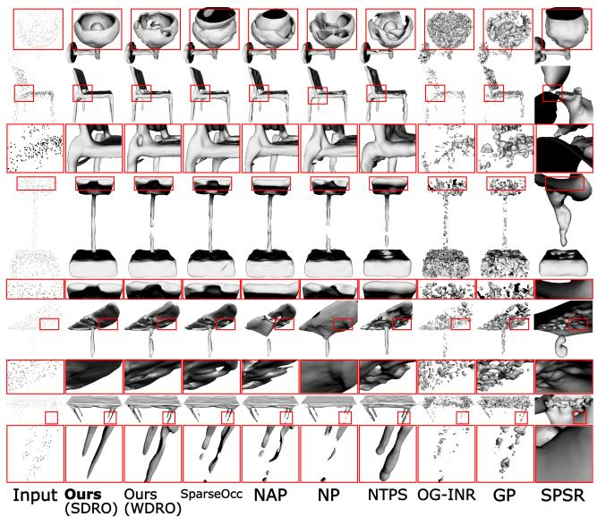
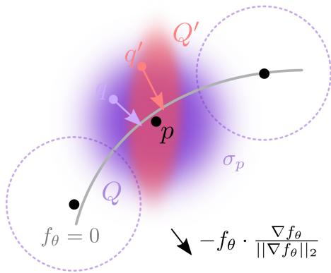
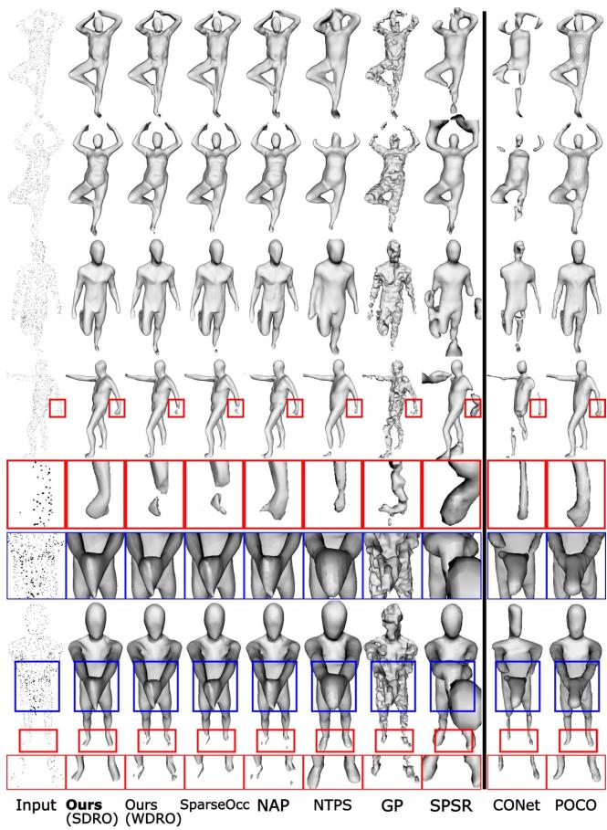
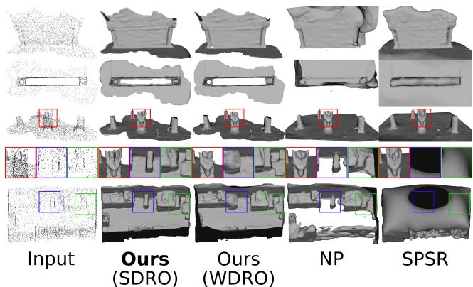
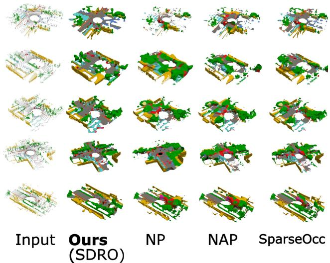
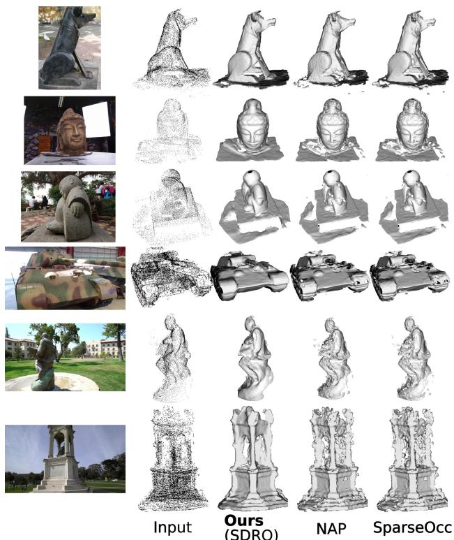
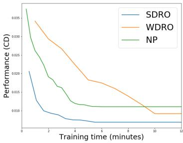

# Toward Robust Neural Reconstruction from Sparse Point Sets

Amine Ouasfi, Shubhendu Jena, Eric Marchand, Adnane Boukhayma Inria, Univ. Rennes, CNRS, IRISA

## Abstract

We consider the challenging problem of learning Signed Distance Functions (SDF)from sparse and noisy 3D point clouds. In contrast to recent methods that depend on smoothness priors, our method, rooted in a distributionally robust optimization (DRO)framework, incorporates a regularization term that leverages samples from the uncertainty regions of the model to improve the learned SDFs. Thanks to tractable dual formulations, we show that this framework enables a stable and efficient optimization of SDFs in the absence of ground truth supervision. Using a variety of synthetic and real data evaluationsfrom different modalities, we show that our DRO based learningframework can improve SDF learning with respect to baselines and the state-of-theart methods.

## 1. Introduction

3D reconstruction from point clouds remains a longstanding problem at the intersection of computer vision, graphics, and machine learning. While traditional optimization techniques like Poisson Reconstruction [28, 37] and Moving Least Squares [27] perform well on dense, clean point clouds with accurate normal estimations, recent deep learning-based approaches offer improved robustness, especially when handling noisy or sparse inputs. These methods often eliminate the need for normal data. Many existing approaches rely on deep priors learned from large, fully labeled 3D datasets such as ShapeNet [18], but this strategy requires expensive training, and the resulting models are still susceptible to generalization issues when exposed to out-of-distribution data—whether due to changes in input density or domain shifts, as noted by [20, 64]. Indeed, as demonstrated in Tab. 2, our unsupervised approach outperforms supervised generalizable models when tested on data that is sparser and diverges from the training data. This highlights the importance of developing learning frameworks that can ensure robust reconstruction under these challenging conditions.

Recent work [62] shows that strategies that can successfully recover SDF representations from dense point clouds, such as Neural-Pull (NP) [52], often struggle when the point cloud is sparse and noisy due to overfitting. As a consequence, the extracted shapes have missing parts and hallucinations (cf. Fig. 4, Fig. 1). Instead of relying on smoothness priors, [62] shifts the focus on how training distributions of spatial queries affect the performance of the SDF network. It introduces a special case of distributionally robust optimization (DRO) [71, 80] for SDF learning. Within this framework, the network is trained by considering the worst-case distribution in terms of the loss function in a neighborhood around the observed training distribution. To tackle the challenging task of finding worst-case distributions, the training strategy proposed by [62] that we dub here NAP for Neural Adversarial Pull, relies on a first-order taylor approximation of the loss to find query-pointwise adversarial samples that are used to regularize the training. These are defined as query points that maximize the loss. In this paper, instead of relying on pointwise adversaries, we leverage recent advances in DRO literature to explore a tractable formulation for finding actual worst-case distributions for the first time in the context of reconstruction from point cloud. Our solution also proves to be more resilient to noise in the sparse input setting.

  
Figure 1. We fit a neural SDF to a sparse noisy point cloud solely, using a distributionally robust loss function. Compared to the state-of-the-art, our method provides more faithful and robust reconstructions, as can be seen in these detailed and thin structures of ShapeNet [18] objects.

One key design choice that determines the type and the level of input noise that can be mitigated as well as the tractability of the problem is the uncertainty set. That is the set of distributions where the worst-case distribution can be found. This is usually defined as a neighborhood of the initial training distribution. To measure the distance between distributions, various metrics have been explored in DRO literature, including f-divergence [7, 58, 60], alongside the Wasserstein distance [10, 59]. The latter has demonstrated notable advantages in terms of efficiency and simplicity, in addition to being widely adopted in computer vision and graphics downstream applications [68, 73, 77, 78], as it takes into account the geometry of the sample space, in contrast to other metrics.

In order to learn a neural SDF from a sparse noisy point cloud within a DRO framework, we proceed in this work as follows. • We first present a tractable implementation for this problem (SDF WDRO) benefiting from the dual reformulation [10] of the DRO problem with the Wasserstein distribution metric [10, 14, 59, 75]. We build on NP [52], but instead of using their predefined empirical spatial query distribution (sampling normally around each of the input points), we rely on queries from the worst-case distribution in the Wasserstein ball around the empirical distribution. While this reduces overfitting and leads to more robust reconstructions thanks to using more informative samples throughout training instead of overfitting on easy ones, this improvement comes at the cost of additional training time compared to the NP baseline as shown in Fig. 7. • Furthermore, by interpreting the Wasserstein distance computation as a mass transportation problem, recent advances in Optimal Transport shows that it is possible to obtain theoretically grounded approximations by regularizing the original mass transportation problem with a relative entropy penalty on the transport plan (e.g. [23]). The resulting distance is referred to as Sinkhorn distance. Thus, we show subsequently that substituting the Wasserstein distance with the Sinkhorn one in our SDF DRO problem results in a computationally efficient dual formulation [81] that significantly improves the convergence time of our first baseline SDF WDRO. The training algorithm of the resulting SDF SDRO is outlined in Algorithm 1. Thanks to the entropic regularization, SDF SDRO produces more diffused spatial adversaries by smoothing the worst-case distribution [5, 9, 81]. As a result, errors in the SDF approximation are better distributed across the shape, improving overall performance.

Through extensive quantitative and qualitative evaluation under several real and synthetic benchmarks for object, non rigid and scene level shape reconstruction, our results show that our final method (SDF SDRO) outperforms SDF WDRO, the baseline NP, as well as the most relevant competition, notably the current state-of-the-art in unsupervised learning of SDFs from sparse point cloud, such as NTPS [20], NAP [62] and SparseOcc [65].

Summary of intuition and contribution We understand the approach proposed in [62] as a means of distributing the SDF approximation errors evenly throughout the 3D shape. Point cloud low-density and noisy areas are where this SDF error tends to concentrate. While in [62] the query points are independently perturbed within a local radius, our key idea is to construct a distribution of the most challenging query samples around the shape in terms of the loss function by “perturbing” the initial distribution of query points. The cost of this perturbation is controlled globally through an optimal transport distance. Minimizing the expected loss over this distribution flattens the landscape of the loss spatially, ensuring that the implicit model behaves consistently in the 3D space. As demonstrated by [79], not only does this generalize the approach proposed in [62], but also provides stronger adversaries that can be used to regularize the training, which justifies our superior results.

## 2. Related Work

Reconstruction from Point Clouds Traditional methods for reconstructing shapes include combinatorical techniques that divide the input point cloud into parts, such as using alpha shapes [8], Voronoi diagrams [2], or triangulation [16, 49, 72]. An alternative approach, is to define implicit functions, whose zero level set represents the target shape, using the input samples. This can be achieved by incorporating global smoothing priors [45, 64, 85, 86], such as radial basis functions [15] and Gaussian kernel fitting [74], or local smoothing priors like moving least squares [27, 40, 50, 55]. A different approach consists of solving a Poisson equation with boundary conditions [37]. In recent years, there has been a shift towards representing these implicit functions using deep neural networks, with parameters learned via gradient descent, either in a supervised (e.g. [12, 22, 31, 46, 61, 63, 69, 70, 86]) or unsupervised manner. These implicit representations [56, 67] aleviate many of the shortcomings of explicit ones (e.g. meshes [33, 36, 83] and point clouds [1, 24, 38]) in modelling shape, radiance and light fields (e.g. [17, 32, 34, 42, 43, 57, 84, 88]), as they allow to model arbitrary topologies at virtually infinite resolution.

Unsupervised Implicit Neural Reconstruction A neural network is used to fit a single point cloud without additional supervision in this setting. Regularizations, such as the spatial gradient constraint based on the Eikonal equation proposed by Gropp et al. [26], the spatial Laplacian constraint introduced in [6], and Lipschitz regularization on the network [48] are used to constrain the learned SDF, leading to performance improvement. [76] introduced periodic activations. [47] shows that an occupancy function can be learned such that its log transform converges to a distance function. [3] learns SDF from unsigned distances, with normal supervision on the spatial gradient of the function [4]. [52] express the nearest point on the surface as a function of the neural signed distance and its gradient. Several state-of-the-art reconstruction methods (e.g. [19, 20, 29, 52– 54, 62, 89]) build on this strategy. Self-supervised local priors are used to handle very sparse inputs [53] or enhance generalization [54]. [13] proposed to learn an occupancy function by assuming that needle end points near the surface are statistically located on opposite sides of the surface. [85] solved a kernel ridge regression problem using points and their normals. [70] proposed a differentiable Poisson solving layer to efficiently obtain an indicator function grid from predicted normals. [41] learns an implicit field using Octree-based labeling as a guiding mechanism. [20] provides additional coarse surface supervision to the shape network using a learned surface parametrization. However, when the input is sparse and noisy, most of the methods mentioned above continue to face challenges in generating accurate reconstructions due to insufficient supervision. [65] learns an occupancy function by sampling from its uncertainty field and stabilizes the optimization by biasing the occupancy function towards minimal entropy fields. [62] augments the training with adversarial samples around the input point cloud. Differently from this literature, we explore here a new paradigm for learning unsupervised neural SDFs for the first time, namely through DRO with Wasserstein uncertainty sets.

  
Figure 2. We learn a neural SDF $f _ { \theta }$ from a point cloud (black dots) by minimizing the error between projection of spatial queries {q} on the level set of the field (gray curve) and their nearest input point $p .$ Instead of learning with a standard predefined distribution of queries Q, we optimize for the worst-case query distribution $Q ^ { \prime }$ within a ball of distributions around Q.

## 3. Method

Let Ξ be a subset of $\mathbb { R } ^ { 3 }$ , and let ${ \mathcal { M } } ( \Xi )$ , and ${ \mathcal { P } } ( { \Xi } )$ represent the set of measures and the set of probability measures on $\Xi ,$ respectively. Given a noisy, sparse unoriented point cloud $\mathbf { P } \subset \Xi ^ { N _ { p } }$ , our objective is to reconstruct a corresponding watertight 3D shape reconstruction, i.e. the shape surface $s$ that best fits the point cloud P. To achieve this, we parameterise the shape function f to be learned with an MLP $f _ { \theta }$ that implicitly represents the signed distance field to the target shape S. The reconstructed shape $\hat { S }$ is represented as the zero level set of the SDF (signed distance function) $f _ { \theta } \colon \hat { \mathcal { S } } = \{ q \in \mathbb { R } ^ { 3 } \mid f _ { \theta } ( q ) = 0 \}$ . In practice, we use the Marching Cubes algorithm [51] to extract an explicit triangle mesh for S<sup>ˆ</sup> by querying neural network $f _ { \theta }$

## 3.1. Learning an SDF by Query Neural Pulling

Neural Pull (NP) [52] approximates a signed distance function by pulling query points to their their nearest input point cloud sample using the gradient of the SDF network. The normalized gradient is multiplied by the negated signed distance predicted by the network in order to pull both inside and outside queries to the surface. Query points are drawn from normal distributions centered at at input samples $\{ p \}$ with local standard deviations $\{ \sigma _ { p } \}$ defined as the maximum euclidean distance to the $K$ nearest points to $p$ in P:

$$
\Omega : = \bigcup _ { p \in \mathbf { P } } \{ q \sim \mathcal { N } ( p , \sigma _ { p } \mathbf { I } _ { 3 } ) \} ,\tag{1}
$$

The neural SDF $f _ { \theta }$ is trained in [52] with empirical risk minimization (ERM) using the following objective:

$$
\mathcal { L } ( \theta , q ) = | | q - f _ { \theta } ( q ) \cdot \frac { \nabla f _ { \theta } ( q ) } { | | \nabla f _ { \theta } ( q ) | | _ { 2 } } - p | | _ { 2 } ^ { 2 } ,\tag{2}
$$

where $p$ is the closest point to $q$ in $\mathbf { P } .$ . By minimizing the expected loss under the empirical distribution $\begin{array} { r } { Q = \sum _ { q \in \Omega } \delta _ { q } } \end{array}$ owhere $\delta _ { q }$ is the dirac distribution or the unit mass on q, this objective ensures that the samples in P are on zero level set of the neural SDF $f _ { \theta }$

## 3.2. Neural SDF DRO

Inspired by [62], we focus on how to distribute the SDF approximation errors evenly throughout the shape as without regularization these errors tends to concentrate in lowdensity and noisy areas. NAP [62] introduces the following regularization term:

$$
\mathcal L _ { \mathrm { N A P } } ( \boldsymbol { \theta } , \boldsymbol { Q } ) = \underset { \boldsymbol { q } \sim \boldsymbol { Q } } { \mathbb { E } } \underset { \boldsymbol { \delta } , \lvert \lvert \boldsymbol { \delta } \rvert \rvert _ { 2 } < \rho } { \operatorname* { m a x } } \mathcal L ( \boldsymbol { \theta } , \boldsymbol { q } + \boldsymbol { \delta } ) ,\tag{3}
$$

Where the perturbation radius $\rho$ controles the distance to the spatial adversaries. Using a first order Taylor expansion of the loss, this problem is solved efficiently in [62] by deriving individual perturbations on the query points q as follows:

$$
\hat { \delta } = \rho \frac { \nabla _ { \boldsymbol { q } } \mathcal { L } ( \boldsymbol { \theta } , \boldsymbol { q } ) } { | | \nabla _ { \boldsymbol { q } } \mathcal { L } ( \boldsymbol { \theta } , \boldsymbol { q } ) | | _ { 2 } }\tag{4}
$$

We consider the DRO problem introduced by NAP with Wasserstein uncertainty sets ( Eq. (5)). We optimize the parameters of the SDF network θ under the worst-case expected

loss among a ball of distributions $Q ^ { \prime }$ in this uncertainty set [10, 25],:

$$
\begin{array} { r l } & { \underset { \theta \mathrm { \tiny ~ \mathscr { Q } ^ { \prime } : } \mathcal { W } _ { c } ( { \mathscr { Q } ^ { \prime } } , { \mathscr { Q } } ) < \epsilon ^ { q ^ { \prime } \sim Q ^ { \prime } } } { \operatorname* { i n f } } \mathcal { L } ( \theta , q ^ { \prime } ) , } \\ & { \mathrm { w h e r e \quad } \mathcal { W } _ { c } ( { \mathscr { Q } ^ { \prime } } , { \mathscr { Q } } ) : = \underset { \gamma \in \Gamma ( { \mathscr { Q } ^ { \prime } } , { \mathscr { Q } } ) } { \operatorname* { i n f } } \int c d \gamma . } \end{array}\tag{5}
$$

Here, $\epsilon > 0$ and ${ \mathcal { W } } _ { c }$ denotes the optimal transport (OT) or a Wasserstein distance for a cost function $c ,$ defined as the infimum over the set $\Gamma ( Q ^ { \prime } , Q )$ of couplings whose marginals are $Q ^ { \prime }$ and $Q .$ . We refer the reader to the body of work in $e . g .$ [10, 25] for more background.

Neural SDF Wasserstein DRO (WDRO) A tractable reformulation of the optimization problem defined in Equation Eq. (5) is made possible thanks to the following duality result [10]. For upper semi-continuous loss functions and nonnegative lower semi-continuous costs satisfying $c \left( z , z ^ { \prime } \right) = 0$ iff $z = z ^ { \prime }$ , the optimization problem (Eq. (5)) is equivalent to:

$$
\begin{array} { r l r } {  { \operatorname* { i n f } _ { \theta , \lambda \geq 0 } \{ \lambda \epsilon + \mathcal { L } _ { \mathrm { W D R O } } ( \theta , Q ) \} , } } \\ & { } & { \quad \mathrm { w h e r e } \ \mathcal { L } _ { \mathrm { W D R O } } ( \theta , Q ) = \mathbb { E } _ { q \sim Q } [ \operatorname* { s u p } _ { q ^ { \prime } } \{ \mathcal { L } ( \theta , q ^ { \prime } ) - \lambda c ( q ^ { \prime } , q ) \} ] . } \end{array}\tag{6}
$$

As shown in [14], solving the optimization above with a fixed dual variable λ yields inferior results to the case where λ is updated. In fact, optimizing λ allows to capture global information when solving the outer minimization, whilst only local information (local worst-case spatial queries) is considered when minimizing ${ \mathcal { L } } _ { \mathrm { W D R O } }$ solely.

Following [14], the optimization in Equation Eq. (6) can be carried as follows: Given the current model parameters $\theta$ and the dual variable $\lambda ,$ the worst-case spatial query $q ^ { \prime }$ corresponding to a query $q$ drawn from the empirical distribution Q can be obtained through a perturbation of $q$ followed by a few steps of iterative gradient ascent over $\mathcal { L } ( \theta , q ^ { \prime } ) - \lambda c \left( q ^ { \prime } , q \right)$ . Subsequently, inspired by the Danskin’s theorem, λ can be updated accordingly $\begin{array} { r } { \lambda  \lambda - \eta _ { \lambda } ( \epsilon - \frac { 1 } { N _ { b } } \sum _ { i = 1 } ^ { N _ { b } } c ( q _ { i } ^ { \prime } , q _ { i } ) ) } \end{array}$ , where $N _ { b }$ represents the query batch size, and $\eta _ { \lambda } > 0$ symbolizes a learning rate [14] . The current batch loss ${ \mathcal { L } } _ { \mathrm { W D R O } }$ can then be backpropagated. We provide an Algorithm in supplemental material recapitulating this training.

While NAP consists of a hard-ball projection with locally adaptive radii, WDRO samples from the worst case distribution around the shape, (Equation Eq. (6)) through a soft-ball projection controlled by the parameter λ that is adjusted throughout the training. The λ update rule ensures that it grows when the worst-case sample distance from the initial queries exceeds the Wasserstein ball radius ϵ. While this approach provides promising results, it suffers from rather slow convergence, as shown in Figure Fig. 7. Furthermore, because our nominal distribution $Q$ is finitely supported, the worst-case distribution generated with WDRO is proven to be a discrete distribution [25], even while the underlying actual distribution is continuous. As pointed out in [81], this questions whether WDRO hedges the right family of distributions or generates too conservative solutions. In the next section, we show how these limitations can be addressed by taking inspiration from recent advances in Optimal Transport.

Neural SDF Wasserstein DRO with entropic regularization (SDRO) One key technical aspect underpinning the recent achievements of Optimal Transport in various applications lies in the use of regularization, particularly entropic regularization [5]. This approach has paved the way for efficient computational methodologies ( e.g. [23]) to obtain theoretically-grounded approximations of Wasserstein distances. Building upon these advancements, recent work [5, 81] extend the framework of Wasserstein Distributionally Robust Optimization with entropic regularization by substituting the Wasserstein distance in Equation Eq. (5) with the Sinkhorn distance [81].

For $P , Q \in { \mathcal { P } } ( \Xi )$ , the Sinkhorn distance is defined as:

$$
\mathcal { W } _ { \rho } ( P , Q ) = \operatorname* { i n f } _ { \substack { \gamma \in \Gamma ( P , Q ) } } \left\{ \mathbb { E } _ { ( x , y ) \sim \gamma } [ c ( x , y ) ] + \rho H ( \gamma \mid \mu \otimes \nu ) \right\} ,\tag{7}
$$

where $\rho \geq 0$ is a regularization parameter. $\mu$ and ν are two reference measures in ${ \mathcal { M } } ( \Xi )$ such that $P$ and $Q$ are absolutely continuous w.r.t. to $\mu$ and ν respectively, $H ( \gamma |$ $\mu \otimes \nu )$ denotes the relative entropy of $\gamma$ with respect to the product measure $\mu \otimes \nu$

$$
H ( \gamma \mid \mu \otimes \nu ) = \mathbb { E } _ { ( x , y ) \sim \gamma } \left[ \log \left( \frac { \mathrm { d } \gamma ( x , y ) } { \mathrm { d } \mu ( x ) \mathrm { d } \nu ( y ) } \right) \right] ,\tag{8}
$$

where $\frac { \mathrm { d } \gamma ( x , y ) } { \mathrm { d } \mu ( x ) \mathrm { d } \nu ( y ) }$ stands for the density ratio of $\gamma$ with respect to $\mu \otimes \nu$ evaluated at $( x , y )$

Compared to the Wasserstein distance, Sinkhorn distance regularizes the original mass transportation problem with relative entropy penalty on the transport plan. The choice of the reference measures $\mu$ and ν acts as a prior on the DRO problem. Following [81], we fix $\mu$ as our empirical distribution $Q$ and ν as the Lebesgue measure. Consequently, optimization problem in Equation Eq. (5) with the Sinkhorn distance admits the following dual form:

$$
\operatorname* { i n f } _ { \theta , \lambda \geq 0 } \left\{ \lambda \bar { \epsilon } + \lambda \rho \mathbb { E } _ { q \sim Q } \left[ \log \mathbb { E } _ { q ^ { \prime } \sim \mathbb { Q } _ { q , \rho } } \left[ e ^ { \mathcal { L } \left( \theta , q ^ { \prime } \right) / \left( \lambda \rho \right) } \right] \right] \right\} ,\tag{9}
$$

where ϵ¯ is a constant that depends on $\rho$ and ϵ ([81]). Additionally, distribution $\mathbb { Q } _ { q , \rho }$ is defined through:

$$
\mathrm { d } \mathbb { Q } _ { x , \rho } ( z ) : = \frac { e ^ { - c ( x , z ) / \rho } } { \mathbb { E } _ { u \sim \nu } \left[ e ^ { - c ( x , u ) / \rho } \right] } \mathrm { d } \nu ( z ) .\tag{10}
$$

As discussed in [81], optimizing λ within problem Eq. (9) leads to instability. Hence, for a given fixed $\lambda > 0$ , optimization Eq. (9) can be carried practically by sampling a set of $N _ { s }$ samples $q ^ { \prime } \sim \mathbb { Q } _ { q , \rho }$ for each query $q ,$ then backpropagating the following distributionaly robust loss:

$$
\begin{array} { r } { \mathcal { L } _ { \mathrm { S D R O } } ( \theta , Q ) = \lambda \rho \mathbb { E } _ { q \sim Q } \left[ \log \mathbb { E } _ { q ^ { \prime } \sim \mathbb { Q } _ { q , \rho } } \left[ e ^ { \mathcal { L } ( \theta , q ^ { \prime } ) / ( \lambda \rho ) } \right] \right] . } \end{array}\tag{11}
$$

Algorithm 1 summarizes the training of our SDRO based method.

## 3.3. Training Objective

Similar to [62] we train using the strategy of [44] which combines the original objective and the distributionally robust one:

$$
\mathfrak { L } ( \theta , q ) = \frac { 1 } { 2 \lambda _ { 1 } } \mathcal { L } ( \theta , q ) + \frac { 1 } { 2 \lambda _ { 2 } } \mathcal { L } _ { \mathrm { D R O } } ( \theta , q ) + \ln ( 1 + \lambda _ { 1 } ) + \ln ( 1 + \lambda _ { 2 } ) .\tag{12}
$$

where $\lambda _ { 1 }$ and $\lambda _ { 2 }$ are learnable weights and $\mathcal { L } _ { \mathrm { D R O } }$ is either L<sub>SDRO</sub> or L<sub>WDRO</sub>.

```latex
Algorithm 1 The training procedure of our method with
SDRO.
Input: Point cloud P, learning rate α, number of iterations $N _ { \mathrm { i t } } .$
batch size $N _ { b }$
SDRO hyperparameters: $\rho , \lambda , N _ { s } .$
Output: Optimal parameters $\theta ^ { * }$
Compute local st. devs. $\begin{array} { r } { \left\{ \sigma _ { p } \right\} ( \sigma _ { p } = \operatorname* { m a x } _ { t \in K \mathrm { n n } ( p , \mathbf { P } ) } | | t - p | | _ { 2 } ) , } \end{array}$
Q ← sample(P, $\{ \sigma _ { p } \} )$ (Equ. Eq. (1))
Compute nearest points in P for all samples in $\in \mathfrak { Q }$
Initialize $\lambda _ { 1 } = \lambda _ { 2 } = 1 .$
for $N _ { \mathrm { i t } }$ times do
Sample $N _ { b }$ query points $\{ q , q \sim Q \}$
For each $q ,$ sample $N _ { s }$ points $\begin{array} { r l r } { \{ q ^ { \prime } , q ^ { \prime } } & { { } \sim } & { \mathbb { Q } _ { q , \rho } \} } \end{array}$
(Equ.Eq. (10))
Compute SDRO losses $\{ { \mathcal { L } } _ { \mathrm { S D R O } } ( \theta , q ) \}$ (Equ. Eq. (11))
Compute combined losses $\{ \mathfrak { L } ( \theta , q ) \}$ (Equ. Eq. (12))
$( \theta , \lambda _ { 1 } , \lambda _ { 2 } ) \gets ( \theta , \lambda _ { 1 } , \lambda _ { 2 } ) - \alpha \nabla _ { \theta , \lambda _ { 1 } , \lambda _ { 2 } } \Sigma _ { q } \mathfrak { L } ( \theta , q )$
end for
```

## 4. Results

To assess the performance of our approach, we conducted evaluations on widely used 3D reconstruction benchmarks. In line with previous research, we assess the accuracy of 3D meshes generated by our MLPs after convergence. We benchmark our method against SOTA methods for sparse unsupervised reconstruction, including NP [52], NAP [62], SparseOcc [65], and NTPS [20]. Further, we extend our comparisons to include approaches such as SAP [70], DIGS [6], NDrop [13], and NSpline [85], as well as hybrid methods that incorporate both explicit and implicit representations, such as OG-INR [41] and GridPull (GP) [21]. We also evaluate our approach relative to SOTA supervised methods. These include robust, generalizable feed-forward methods such as POCO [12], CONet [69], and NKSR [30], in addition to prior-based optimization strategies tailored for sparse data, like On-Surf [53]. Following the settings adopted by NAP, our experiments employ point clouds with $N _ { p } = 1 0 2 4$ points.

## 4.1. Metrics

We evaluate our method using standard metrics commonly employed for 3D reconstruction tasks. Specifically, we compute the L1 Chamfer Distance $\left( \mathrm { C D } _ { 1 } \right)$ and L2 Chamfer Distance $\mathrm { ( C D _ { 2 } ) }$ , both scaled by a factor of $1 0 ^ { 2 }$ . Additionally, we compute the F-Score (FS), based on Euclidean distance, and the Normal Consistency (NC) between the meshes generated by our approach and the ground-truth. Detailed mathematical formulations for these metrics are provided in the supplementary material.

## 4.2. Datasets and input definitions

We evaluate our approach on several benchmark datasets representing a variety of 3D data.

ShapeNet [18] provides a diverse set of synthetic 3D models across 13 distinct categories. In line with previous work, we report results on the Table, Chair, and Lamp classes, utilizing the train/test splits specified in [85]. For each mesh, we generate noisy input point clouds by sampling 1024 points and adding Gaussian noise with a standard deviation of 0.005, as done in [12, 62, 69]. Faust [11] includes real 3D scans of 10 different human body identities, each captured in 10 distinct poses. We sample 1024 points from these scans to serve as input for our method. 3D Scene [90] contains large-scale, real-world scenes acquired with a handheld commodity range sensor. We follow the protocols in [20, 35, 52, 62] to generate sparse point clouds with a density of 100 points per $\mathrm { m ^ { 3 } }$ and present results for several scenes, including Burghers, Copyroom, Lounge, Stonewall, and Totempole. SemanticPOSS [66] contains LiDAR data collected from 6 sequences of road scenes. Each scan captures a 51.2m range ahead, 25.6m on either side, and 6.4m vertically. We provide qualitative results from each of these sequences. Finally, we extend our evaluation to challenging scenes from the BlendedMVS [87] dataset, which is a multiview stereo dataset, with scenes consisting of architecture, sculptures, and small objects with complex backgrounds as well as Tanks and Temples [39] dataset, which consists of large-scale indoor and outdoor scenes, with high-resolution images captured by a handheld monocular RGB camera. For both the datasets, sparse views are used with VGGSfM [82] to generate sparse, noisy input point clouds for our setup.

## 4.3. Implementation details

Our MLP model, denoted as $f _ { \theta } ,$ follows the architecture outlined in Neural Pull (NP) [52]. We train the model using the Adam optimizer with a batch size of $N _ { b } = 5 0 0 0$ and set

  
Figure 3. Faust [11] reconstructions. CONet and POCO use data priors.

K = 51 to compute the local standard deviations $\sigma _ { p } ,$ in line with NP. Training is performed on a single NVIDIA RTX A6000 GPU. For fair and practical comparison, we select the optimal evaluation epoch for each method based on Chamfer distance between the reconstructed and input point clouds, choosing the epoch that minimizes this metric. We also conduct a hyperparameter search on the SRB benchmark to determine the best parameters for our method.

For the Wasserstein Robust DRO (WRDO) approach, we perform two gradient ascent steps $( N _ { i t } ^ { w d r o } = 2 )$ with a learning rate $\alpha _ { w d r o } = 1 0 ^ { - 3 }$ in the inner loop. The dual variable is initialized as $\lambda = 8 0$ , and the Wasserstein ball radius is fixed at $\epsilon = 1 0 ^ { - 4 }$ . For Standard DRO (SDRO), we use $N _ { s } = 5$ samples per query point $q \sim Q$ , with $\lambda = 2 0$ in our experiments. The transport cost is defined as $c ( \cdot , \cdot ) =$ $\frac { 1 } { 2 } | | \cdot - \cdot | | ^ { 2 }$ , implying that sampling from $\mathbb { Q } _ { q , \rho }$ follows a Gaussian distribution $\mathcal { N } ( q , \rho \mathbf { I } _ { 3 } )$ .

## 4.4. Object level reconstruction

We evaluate the reconstruction of ShapeNet [18] objects from sparse and noisy point clouds. A quantitative comparison is presented in Tab. 1, while Fig. 1 offers a qualitative assessment of the results. Our approach, based on Wasserstein Robust DRO (WDRO), outperforms existing methods in terms of reconstruction accuracy, as measured by $\mathrm { C D _ { 1 } }$ and $\mathrm { C D _ { 2 } }$ . When combined with the SDRO loss, our method further improves across all evaluation metrics. This is reflected in the visually enhanced reconstruction quality, which demonstrates superior detail and structure preservation. While NTPS produces generally acceptable coarse reconstructions, its use of thin plate spline smoothing limits its ability to capture finer details. NAP and SparaseOcc are able to produce better reconstructions but struggle under high levels of noise. Additionally, we find that OG-INR struggles to achieve satisfactory convergence under sparse and noisy conditions, despite its success in denser scenarios aided by Octree-based sign fields.

<table><tr><td rowspan=1 colspan=4>CD1 CD2 NC</td><td rowspan=1 colspan=1>FS</td></tr><tr><td rowspan=1 colspan=2>SPSR [37]     2.34</td><td rowspan=1 colspan=1>0.224</td><td rowspan=1 colspan=1>0.74</td><td rowspan=1 colspan=1>0.50</td></tr><tr><td rowspan=1 colspan=2>OG-INR [41]   1.36</td><td rowspan=1 colspan=1>0.051</td><td rowspan=1 colspan=1>0.55</td><td rowspan=1 colspan=1>0.55</td></tr><tr><td rowspan=1 colspan=1>NP [52]</td><td rowspan=1 colspan=1>1.16</td><td rowspan=1 colspan=1>0.074</td><td rowspan=1 colspan=1>0.84</td><td rowspan=1 colspan=1>0.75</td></tr><tr><td rowspan=1 colspan=1>GP [21]</td><td rowspan=1 colspan=1>1.07</td><td rowspan=1 colspan=1>0.032</td><td rowspan=1 colspan=1>0.70</td><td rowspan=1 colspan=1>0.74</td></tr><tr><td rowspan=1 colspan=1>NTPS [20]</td><td rowspan=1 colspan=1>1.11</td><td rowspan=1 colspan=1>0.067</td><td rowspan=1 colspan=1>0.88</td><td rowspan=1 colspan=1>0.74</td></tr><tr><td rowspan=1 colspan=1>NAP [62]</td><td rowspan=1 colspan=1>0.76</td><td rowspan=1 colspan=1>0.020</td><td rowspan=1 colspan=1>0.87</td><td rowspan=1 colspan=1>0.83</td></tr><tr><td rowspan=1 colspan=1>SparseOcc [65]</td><td rowspan=1 colspan=1>0.76</td><td rowspan=1 colspan=1>0.020</td><td rowspan=1 colspan=1>0.88</td><td rowspan=1 colspan=1>0.83</td></tr><tr><td rowspan=1 colspan=1>Ours (WDRO)</td><td rowspan=1 colspan=1>0.77</td><td rowspan=1 colspan=1>0.015</td><td rowspan=1 colspan=1>0.87</td><td rowspan=1 colspan=1>0.83</td></tr><tr><td rowspan=1 colspan=1>Ours (SDRO)</td><td rowspan=1 colspan=1>0.63</td><td rowspan=1 colspan=1>0.012</td><td rowspan=1 colspan=1>0.90</td><td rowspan=1 colspan=1>0.86</td></tr></table>

Table 1. ShapeNet [18] reconstructions from sparse noisy unoriented point clouds.
<table><tr><td rowspan=1 colspan=3>CD1 CD2</td><td rowspan=1 colspan=1>NC</td><td rowspan=1 colspan=1>FS</td></tr><tr><td rowspan=1 colspan=2>POCO [12]    0.308</td><td rowspan=1 colspan=1>0.002</td><td rowspan=1 colspan=1>0.934</td><td rowspan=1 colspan=1>0.981</td></tr><tr><td rowspan=1 colspan=2>CONet [69]    1.260</td><td rowspan=1 colspan=1>0.048</td><td rowspan=1 colspan=1>0.829</td><td rowspan=1 colspan=1>0.599</td></tr><tr><td rowspan=1 colspan=2>On-Surf [53]   0.584</td><td rowspan=1 colspan=1>0.012</td><td rowspan=1 colspan=1>0.936</td><td rowspan=1 colspan=1>0.915</td></tr><tr><td rowspan=1 colspan=2>NKSR [30]    0.274</td><td rowspan=1 colspan=1>0.002</td><td rowspan=1 colspan=1>0.945</td><td rowspan=1 colspan=1>0.981</td></tr><tr><td rowspan=1 colspan=2>SPSR [37]    0.751</td><td rowspan=1 colspan=1>0.028</td><td rowspan=1 colspan=1>0.871</td><td rowspan=1 colspan=1>0.839</td></tr><tr><td rowspan=1 colspan=1>GP [21]</td><td rowspan=1 colspan=1>0.495</td><td rowspan=1 colspan=1>0.005</td><td rowspan=1 colspan=1>0.887</td><td rowspan=1 colspan=1>0.945</td></tr><tr><td rowspan=1 colspan=1>NTPS [20]</td><td rowspan=1 colspan=1>0.737</td><td rowspan=1 colspan=1>0.015</td><td rowspan=1 colspan=1>0.943</td><td rowspan=1 colspan=1>0.844</td></tr><tr><td rowspan=1 colspan=1>NAP [62]</td><td rowspan=1 colspan=1>0.220</td><td rowspan=1 colspan=1>0.001</td><td rowspan=1 colspan=1>0.956</td><td rowspan=1 colspan=1>0.981</td></tr><tr><td rowspan=1 colspan=1>SparseOcc [65]</td><td rowspan=1 colspan=1>0.260</td><td rowspan=1 colspan=1>0.002</td><td rowspan=1 colspan=1>0.952</td><td rowspan=1 colspan=1>0.974</td></tr><tr><td rowspan=1 colspan=1>Ours (WDRO)</td><td rowspan=1 colspan=1>0.255</td><td rowspan=1 colspan=1>0.002</td><td rowspan=1 colspan=1>0.953</td><td rowspan=1 colspan=1>0.977</td></tr><tr><td rowspan=1 colspan=1>Ours (SDRO)</td><td rowspan=1 colspan=1>0.251</td><td rowspan=1 colspan=1>0.002</td><td rowspan=1 colspan=1>0.955</td><td rowspan=1 colspan=1>0.979</td></tr></table>

Table 2. Faust [11] reconstructions from sparse noisy unoriented point clouds. POCO, CONet, On-Surf and NKSR use data priors.

## 4.5. Real articulated shape reconstruction

We evaluate the reconstruction of human shapes from the Faust dataset [11] using sparse, noisy point clouds. Quantitative and qualitative comparisons with competing methods are provided in Tab. 2 and Fig. 3, respectively. Across all metrics, our distributionally robust training procedures demonstrate superior performance, with SDRO achieving slightly better accuracy and faster convergence than WDRO. Visually, our reconstructions exhibit a significant improvement, especially in capturing finer details at body extremities, which pose challenges due to sparse input data and can lead to ambiguous shape predictions, similar to the fine structures observed in ShapeNet experiments. Notably, NAP outperforms our approach in this setting, and our method is comparable to SparseOcc, as these methods tend to perform better under low noise conditions, whereas ours is specifically designed for robustness under higher noise levels. In contrast, NTPS reconstructions tend to be coarser with fewer details. It is also worth mentioning that several generalizable methods, particularly those trained on ShapeNet (seen in the upper section of the table), show limited effectiveness in this experiment.

<table><tr><td rowspan="2"></td><td colspan="3">Burghers</td><td colspan="3">Copyroom</td><td colspan="3">Lounge</td><td colspan="3">Stonewall</td><td colspan="3">Totemple</td><td colspan="3">Mean</td></tr><tr><td>CD1</td><td>CD2</td><td>NC</td><td>CD1</td><td>CD2</td><td>NC</td><td>CD1</td><td>CD2</td><td>NC</td><td>CD1</td><td>CD2</td><td>NC</td><td>CD1</td><td>CD2</td><td>NC</td><td>CD1</td><td>CD2</td><td>NC</td></tr><tr><td>SPSR [37]</td><td>0.178</td><td>0.2050</td><td>0.874</td><td>0.225</td><td>0.2860</td><td>0.861</td><td>0.280</td><td>0.3650</td><td>0.869</td><td>0.300</td><td>0.4800</td><td>0.866</td><td>0.588</td><td>1.6730</td><td>0.879</td><td>0.314</td><td>0.6024</td><td>0.870</td></tr><tr><td>NDrop [13]</td><td>0.200</td><td>0.1140</td><td>0.825</td><td>0.168</td><td>0.0630</td><td>0.696</td><td>0.156</td><td>0.0500</td><td>0.663</td><td>0.150</td><td>0.0810</td><td>0.815</td><td>0.203</td><td>0.1390</td><td>0.844</td><td>0.175</td><td>0.0894</td><td>0.769</td></tr><tr><td>NP [52]</td><td>0.064</td><td>0.0080</td><td>0.898</td><td>0.049</td><td>0.0050</td><td>0.828</td><td>0.133</td><td>0.0380</td><td>0.847</td><td>0.060</td><td>0.0050</td><td>0.910</td><td>0.178</td><td>0.0240</td><td>0.908</td><td>0.097</td><td>0.0160</td><td>0.878</td></tr><tr><td>SAP [70]</td><td>0.153</td><td>0.1010</td><td>0.807</td><td>0.053</td><td>0.0090</td><td>0.771</td><td>0.134</td><td>0.0330</td><td>0.813</td><td>0.070</td><td>0.0070</td><td>0.867</td><td>0.474</td><td>0.3820</td><td>0.725</td><td>0.151</td><td>0.1064</td><td>0.797</td></tr><tr><td>NSpline [85]</td><td>0.135</td><td>0.1230</td><td>0.891</td><td>0.056</td><td>0.0230</td><td>0.855</td><td>0.063</td><td>0.0390</td><td>0.827</td><td>0.124</td><td>0.0910</td><td>0.897</td><td>0.378</td><td>0.7680</td><td>0.892</td><td>0.151</td><td>0.2088</td><td>0.872</td></tr><tr><td>NTPS [20]</td><td>0.055</td><td>0.0050</td><td>0.909</td><td>0.045</td><td>0.0030</td><td>0.892</td><td>0.129</td><td>0.0220</td><td>0.872</td><td>0.054</td><td>0.0040</td><td>0.939</td><td>0.103</td><td>0.0170</td><td>0.935</td><td>0.077</td><td>0.0102</td><td>0.897</td></tr><tr><td>NAP [62]</td><td>0.051</td><td>0.006</td><td>0.881</td><td>0.037</td><td>0.002</td><td>0.833</td><td>0.044</td><td>0.011</td><td>0.862</td><td>0.035</td><td>0.003</td><td>0.912</td><td>0.042</td><td>0.002</td><td>0.925</td><td>0.041</td><td>0.004</td><td>0.881</td></tr><tr><td>SparseOcc [65]</td><td>0.022</td><td>0.001</td><td>0.871</td><td>0.041</td><td>0.012</td><td>0.812</td><td>0.021</td><td>0.001</td><td>0.870</td><td>0.028</td><td>0.003</td><td>0.931</td><td>0.026</td><td>0.001</td><td>0.936</td><td>0.027</td><td>0.003</td><td>0.886</td></tr><tr><td>Ours (WDRO)</td><td>0.014</td><td>0.0006</td><td>0.871</td><td>0.028</td><td>0.0036</td><td>0.820</td><td>0.038</td><td>0.0051</td><td>0.803</td><td>0.019</td><td>0.0005</td><td>0.930</td><td>0.009</td><td>0.0003</td><td>0.936</td><td>0.022</td><td>0.0020</td><td>0.872</td></tr><tr><td>Ours (SDRO)</td><td>0.015</td><td>0.0006</td><td>0.873</td><td>0.021</td><td>0.0017</td><td>0.823</td><td>0.027</td><td>0.0032</td><td>0.842</td><td>0.021</td><td>0.0006</td><td>0.932</td><td>0.020</td><td>0.0005</td><td>0.934</td><td>0.020</td><td>0.0013</td><td>0.881</td></tr></table>

Table 3. 3D Scene [90] reconstructions from sparse point clouds.

  
Figure 4. 3D Scene [90] reconstructions from sparse unoriented point clouds.

## 4.6. Real scene level reconstruction

We report reconstruction results on the 3D Scene dataset [90] from sparse point clouds, following in [20]. Comparative results for state-of-the-art methods, including NTPS, NP, SAP, NDrop, and NSpline, are obtained from NTPS, while the performances of NAP and SparseOcc are cited from their respective publications and summarized in Tab. 3. Our method demonstrates superior performance in this setting, attributable to our loss function’s capacity to handle high levels of noise, unlike NAP. Qualitative comparisons with our NP baseline and SPSR are shown in Fig. 4, where specific regions highlighted by colored boxes illustrate areas where our approach achieves notably high detail and reconstruction fidelity.

Additionally, we conduct qualitative comparisons on BlendedMVS [87] and large-scale scenes from the Tanks & Temples dataset [39] using sparse views. VGGSfM [82], a recent state-of-the-art fully differentiable structure-frommotion pipeline, is used to generate the sparse point cloud inputs for this experiment. Although VGGSfM effectively generates point clouds by triangulating 2D point trajectories and learned camera poses, the sparse input views result in sparse and noisy point clouds, making SDF-based reconstruction challenging. To illustrate the strength of our method, we compare 3 examples from each dataset against SparseOcc and NAP in Fig. 6, demonstrating sharper details, especially on large-scale scenes from Tanks & Temples, where other methods struggle due to noise in VGGSfM’s point clouds.

  
Figure 5. SemanticPOSS [66] reconstruction from road scene LiDAR data.

To further evaluate the robustness of our method, we present reconstruction results on the SemanticPOSS dataset [66] and provide qualitative comparisons with SparseOcc, NAP, and NP in Fig. 5. The visualizations use the dataset’s color-coded semantic segmentations, which were not utilized during training. Our approach achieves marked improvements in reconstruction quality, largely due to our DRO framework. In particular, elements such as cars, trees, and pedestrians are reconstructed with significantly greater detail and precision, whereas baseline methods often blend these object categories into indistinct forms. Additionally, our SDRO method is notably effective in preserving the broader scene structure. Although SparseOcc and NAP demonstrate solid performance under low-noise conditions, their accuracy deteriorates sharply under higher noise levels. Additional qualitative examples are provided in the supplementary materials.

  
Figure 6. Reconstructions from VGGSfM point clouds of sparse views from BlendedMVS [87] and Tanks & Temples datasets [39].

## 5. Ablation studies

Noise ablation To examine the influence of input noise (displacement from the surface) and sparsity on our method’s performance in comparison to the NP baseline, we conduct an ablation study across different noise levels, as shown in Tab. 4. The results consistently indicate that our method outperforms the baseline at various noise levels. This suggests that our distributionally robust training approach is effective in reducing noise due to both sparse inputs and displacement. Additionally, under high-noise conditions, our method demonstrates superior performance over both NAP and SparseOcc.

Training time To evaluate the computational efficiency of our approach, we present a performance analysis over training time in Fig. 7, comparing our DRO methods with the NP baseline. The plot demonstrates the performance attained after specific training durations. Notably, WDRO achieves baseline performance after approximately 3 minutes and reaches its peak in 10 minutes. On the other hand, SDRO shows an advantage over the NP baseline after just 2 minutes of training, attaining optimal performance in under 6 minutes, matching the baseline’s convergence time while outperforming both the baseline and WDRO. This observation underscores the computational advantages of using the Sinkhorn distance in our distributionally robust optimization formulation (Eq. (5)), as opposed to the Wasserstein distance. Further ablation results can be found in the supplementary material.



Figure 7. Performance over training time on Shapenet [18] class Tables.
<table><tr><td></td><td>σ = 0.0 CD1 NC</td><td>σ = 0.005 CD1 NC</td><td>σ = 0.025 CD1 NC</td></tr><tr><td rowspan="2">NP (baseline) [52] NAP [62]</td><td>0.73 0.906</td><td>1.07 0.847</td><td>2.45 0.668</td></tr><tr><td>0.63 0.926</td><td>0.75 0.86</td><td>2.21 0.67</td></tr><tr><td>SparseOcc [65]</td><td>0.56 0.931</td><td>0.77 0.89</td><td>2.16 0.68</td></tr><tr><td>Ours(SDRO)</td><td>0.43 0.945</td><td>0.65 0.91</td><td>1.54 0.702</td></tr></table>

Table 4. Ablation of our method under varying levels of noise on Shapenet [18] class Tables.

## 6. Limitations

Our method is able to significantly improve over recent state of the art methods such as NAP and SparseOcc in very challenging scenarios. However, when the input points are clean and dense, NAP can show competitive or even better performance as shown in Tab. 2 and in the density ablation in the supplementary material. An interesting direction for future research could be to explore strategies that combine local adaptive radii control in NAP with the global control on the worst-case distribution in SDRO. We aim to investigate this as part of our future work.

## 7. Conclusion

We have shown that regularizing implicit shape representation learning from sparse unoriented point clouds through distributionally robust optimization with wasserstein uncertainty sets can lead to superior reconstructions. We believe these new findings can usher in a new body of work incorporating distributional robustness in learning neural implicit functions, which in turn can potentially have a larger impact beyond the specific scope of this paper.

## References

[1] Kara-Ali Aliev, Artem Sevastopolsky, Maria Kolos, Dmitry Ulyanov, and Victor Lempitsky. Neural point-based graphics. In Computer Vision–ECCV 2020: 16th European Conference, Glasgow, UK, August 23–28, 2020, Proceedings, Part XXII 16, 2020. 2

[2] Nina Amenta, Sunghee Choi, and Ravi Krishna Kolluri. The power crust, unions of balls, and the medial axis transform. CG, 2001. 2

[3] Matan Atzmon and Yaron Lipman. Sal: Sign agnostic learning of shapes from raw data. In CVPR, 2020. 3

[4] Matan Atzmon and Yaron Lipman. Sald: Sign agnostic learning with derivatives. In ICML, 2020. 3

[5] Waïss Azizian, Franck Iutzeler, and Jérôme Malick. Regularization for wasserstein distributionally robust optimization. ESAIM: Control, Optimisation and Calculus of Variations, 29:33, 2023. 2, 4

[6] Yizhak Ben-Shabat, Chamin Hewa Koneputugodage, and Stephen Gould. Digs: Divergence guided shape implicit neural representation for unoriented point clouds. In Proceedings of the IEEE/CVF Conference on Computer Vision and Pattern Recognition, pages 19323–19332, 2022. 2, 5

[7] Aharon Ben-Tal, Dick Den Hertog, Anja De Waegenaere, Bertrand Melenberg, and Gijs Rennen. Robust solutions of optimization problems affected by uncertain probabilities. Management Science, 59(2):341–357, 2013. 2

[8] Fausto Bernardini, Joshua Mittleman, Holly Rushmeier, Claudio Silva, and Gabriel Taubin. The ball-pivoting algorithm for surface reconstruction. TVCG, 1999. 2

[9] Jose Blanchet and Yang Kang. Semi-supervised learning based on distributionally robust optimization, 2020. 2

[10] Jose Blanchet and Karthyek Murthy. Quantifying distributional model risk via optimal transport. Mathematics of Operations Research, 44(2):565–600, 2019. 2, 4

[11] Federica Bogo, Javier Romero, Matthew Loper, and Michael J. Black. FAUST: Dataset and evaluation for 3D mesh registration. In CVPR, 2014. 5, 6

[12] Alexandre Boulch and Renaud Marlet. Poco: Point convolution for surface reconstruction. In Proceedings of the IEEE/CVF Conference on Computer Vision and Pattern Recognition, pages 6302–6314, 2022. 2, 5, 6

[13] Alexandre Boulch, Pierre-Alain Langlois, Gilles Puy, and Renaud Marlet. Needrop: Self-supervised shape representation from sparse point clouds using needle dropping. In 2021 International Conference on 3D Vision (3DV), pages 940–950. IEEE, 2021. 3, 5, 7

[14] Tuan Anh Bui, Trung Le, Quan Tran, He Zhao, and Dinh Phung. A unified wasserstein distributional robustness framework for adversarial training. arXiv preprint arXiv:2202.13437, 2022. 2, 4

[15] Jonathan C Carr, Richard K Beatson, Jon B Cherrie, Tim J Mitchell, W Richard Fright, Bruce C McCallum, and Tim R Evans. Reconstruction and representation of 3d objects with radial basis functions. In SIGGRAPH, 2001. 2

[16] Frédéric Cazals and Joachim Giesen. Effective Computational Geometryfor Curves and Surfaces. 2006. 2

[17] Eric R Chan, Connor Z Lin, Matthew A Chan, Koki Nagano, Boxiao Pan, Shalini De Mello, Orazio Gallo, Leonidas J Guibas, Jonathan Tremblay, Sameh Khamis, et al. Efficient geometry-aware 3d generative adversarial networks. In Proceedings ofthe IEEE/CVF Conference on Computer Vision and Pattern Recognition, pages 16123–16133, 2022. 2

[18] Angel X Chang, Thomas Funkhouser, Leonidas Guibas, Pat Hanrahan, Qixing Huang, Zimo Li, Silvio Savarese, Manolis Savva, Shuran Song, Hao Su, et al. Shapenet: An informationrich 3d model repository. arXiv preprint arXiv:1512.03012, 2015. 1, 5, 6, 8

[19] Chao Chen, Yu-Shen Liu, and Zhizhong Han. Latent partition implicit with surface codes for 3d representation. In European Conference on Computer Vision (ECCV), 2022. 3

[20] Chao Chen, Zhizhong Han, and Yu-Shen Liu. Unsupervised inference of signed distance functions from single sparse point clouds without learning priors. In Proceedings of the IEEE/CVF Conference on Computer Vision and Pattern Recognition (CVPR), 2023. 1, 2, 3, 5, 6, 7

[21] Chao Chen, Yu-Shen Liu, and Zhizhong Han. Gridpull: Towards scalability in learning implicit representations from 3d point clouds. In Proceedings of the ieee/cvf international conference on computer vision, pages 18322–18334, 2023. 5, 6

[22] Julian Chibane and Gerard Pons-Moll. Implicit feature networks for texture completion from partial 3d data. In European Conference on Computer Vision, pages 717–725. Springer, 2020. 2

[23] Marco Cuturi. Sinkhorn distances: Lightspeed computation of optimal transport. Advances in neural information processing systems, 26, 2013. 2, 4

[24] Haoqiang Fan, Hao Su, and Leonidas J Guibas. A point set generation network for 3d object reconstruction from a single image. In CVPR, 2017. 2

[25] Rui Gao and Anton Kleywegt. Distributionally robust stochastic optimization with wasserstein distance. Mathematics of Operations Research, 48(2):603–655, 2023. 4

[26] Amos Gropp, Lior Yariv, Niv Haim, Matan Atzmon, and Yaron Lipman. Implicit geometric regularization for learning shapes. In ICML, 2020. 2

[27] Gaël Guennebaud and Markus Gross. Algebraic point set surfaces. In ACM siggraph 2007 papers, pages 23–es. 2007. 1, 2

[28] Fei Hou, Chiyu Wang, Wencheng Wang, Hong Qin, Chen Qian, and Ying He. Iterative poisson surface reconstruction (ipsr) for unoriented points. arXiv preprint arXiv:2209.09510, 2022. 1

[29] Han Huang, Yulun Wu, Junsheng Zhou, Ge Gao, Ming Gu, and Yushen Liu. Neusurf: On-surface priors for neural surface reconstruction from sparse input views. In AAAI, 2024. 3

[30] Jiahui Huang, Zan Gojcic, Matan Atzmon, Or Litany, Sanja Fidler, and Francis Williams. Neural kernel surface reconstruction. In Proceedings of the IEEE/CVF Conference on Computer Vision and Pattern Recognition (CVPR), pages 4369–4379, 2023. 5, 6

[31] Jiahui Huang, Zan Gojcic, Matan Atzmon, Or Litany, Sanja Fidler, and Francis Williams. Neural kernel surface reconstruction. In Proceedings of the IEEE/CVF Conference on

Computer Vision and Pattern Recognition, pages 4369–4379, 2023. 2

[32] Ajay Jain, Ben Mildenhall, Jonathan T. Barron, Pieter Abbeel, and Ben Poole. Zero-shot text-guided object generation with dream fields. 2022. 2

[33] Shubhendu Jena, Franck Multon, and Adnane Boukhayma. Neural mesh-based graphics. In European Conference on Computer Vision, 2022. 2

[34] Shubhendu Jena, Franck Multon, and Adnane Boukhayma. Geotransfer: Generalizable few-shot multi-view reconstruction via transfer learning. In European Conference on Computer Vision, 2024. 2

[35] Chiyu Jiang, Avneesh Sud, Ameesh Makadia, Jingwei Huang, Matthias Nießner, Thomas Funkhouser, et al. Local implicit grid representations for 3d scenes. In CVPR, 2020. 5

[36] Hiroharu Kato, Yoshitaka Ushiku, and Tatsuya Harada. Neural 3d mesh renderer. In CVPR, 2018. 2

[37] Michael Kazhdan and Hugues Hoppe. Screened poisson surface reconstruction. TOG, 2013. 1, 2, 6, 7

[38] Bernhard Kerbl, Georgios Kopanas, Thomas Leimkühler, and George Drettakis. 3d gaussian splatting for real-time radiance field rendering. ACM Transactions on Graphics, 2023. 2

[39] Arno Knapitsch, Jaesik Park, Qian-Yi Zhou, and Vladlen Koltun. Tanks and temples: Benchmarking large-scale scene reconstruction. ACM Transactions on Graphics (ToG), 36(4): 1–13, 2017. 5, 7, 8

[40] Ravikrishna Kolluri. Provably good moving least squares. TALG, 2008. 2

[41] Chamin Hewa Koneputugodage, Yizhak Ben-Shabat, and Stephen Gould. Octree guided unoriented surface reconstruction. In Proceedings ofthe IEEE/CVF Conference on Computer Vision and Pattern Recognition, pages 16717–16726, 2023. 3, 5, 6

[42] Qian Li, Franck Multon, and Adnane Boukhayma. Learning generalizable light field networks from few images. In ICASSP 2023-2023 IEEE International Conference on Acoustics, Speech and Signal Processing (ICASSP), pages 1–5. IEEE, 2023. 2

[43] Qian Li, Franck Multon, and Adnane Boukhayma. Regularizing neural radiance fields from sparse rgb-d inputs. In 2023 IEEE International Conference on Image Processing (ICIP), pages 2320–2324. IEEE, 2023. 2

[44] Lukas Liebel and Marco Körner. Auxiliary tasks in multi-task learning. arXiv preprint arXiv:1805.06334, 2018. 5

[45] Siyou Lin, Dong Xiao, Zuoqiang Shi, and Bin Wang. Surface reconstruction from point clouds without normals by parametrizing the gauss formula. ACM Transactions on Graphics, 42(2):1–19, 2022. 2

[46] Stefan Lionar, Daniil Emtsev, Dusan Svilarkovic, and Songyou Peng. Dynamic plane convolutional occupancy networks. In Proceedings of the IEEE/CVF Winter Conference on Applications of Computer Vision, pages 1829–1838, 2021. 2

[47] Yaron Lipman. Phase transitions, distance functions, and implicit neural representations. In ICML, 2021. 3

[48] Hsueh-Ti Derek Liu, Francis Williams, Alec Jacobson, Sanja Fidler, and Or Litany. Learning smooth neural functions via

lipschitz regularization. arXiv preprint arXiv:2202.08345, 2022. 2

[49] Minghua Liu, Xiaoshuai Zhang, and Hao Su. Meshing point clouds with predicted intrinsic-extrinsic ratio guidance. In ECCV, 2020. 2

[50] Shi-Lin Liu, Hao-Xiang Guo, Hao Pan, Peng-Shuai Wang, Xin Tong, and Yang Liu. Deep implicit moving least-squares functions for 3d reconstruction. In CVPR, 2021. 2

[51] William E Lorensen and Harvey E Cline. Marching cubes: A high resolution 3d surface construction algorithm. In SIG-GRAPH, 1987. 3

[52] Baorui Ma, Zhizhong Han, Yu-Shen Liu, and Matthias Zwicker. Neural-pull: Learning signed distance functions from point clouds by learning to pull space onto surfaces. In ICML, 2021. 1, 2, 3, 5, 6, 7, 8

[53] Baorui Ma, Yu-Shen Liu, and Zhizhong Han. Reconstructing surfaces for sparse point clouds with on-surface priors. In Proceedings of the IEEE/CVF Conference on Computer Vision and Pattern Recognition, pages 6315–6325, 2022. 3, 5, 6

[54] Baorui Ma, Yu-Shen Liu, Matthias Zwicker, and Zhizhong Han. Surface reconstruction from point clouds by learning predictive context priors. In Proceedings of the IEEE/CVF Conference on Computer Vision and Pattern Recognition, pages 6326–6337, 2022. 3

[55] Corentin Mercier, Thibault Lescoat, Pierre Roussillon, Tamy Boubekeur, and Jean-Marc Thiery. Moving level-of-detail surfaces. ACM Transactions on Graphics (TOG), 41(4):1–10, 2022. 2

[56] Lars Mescheder, Michael Oechsle, Michael Niemeyer, Sebastian Nowozin, and Andreas Geiger. Occupancy networks: Learning 3d reconstruction in function space. In Proceedings ofthe IEEE/CVF conference on computer vision and pattern recognition, pages 4460–4470, 2019. 2

[57] Ben Mildenhall, Pratul P Srinivasan, Matthew Tancik, Jonathan T Barron, Ravi Ramamoorthi, and Ren Ng. Nerf: Representing scenes as neural radiance fields for view synthesis. In ECCV, 2020. 2

[58] Takeru Miyato, Shin-ichi Maeda, Masanori Koyama, Ken Nakae, and Shin Ishii. Distributional smoothing with virtual adversarial training. arXiv preprint arXiv:1507.00677, 2015. 2

[59] Peyman Mohajerin Esfahani and Daniel Kuhn. Data-driven distributionally robust optimization using the wasserstein metric: performance guarantees and tractable reformulations. Mathematical Programming, 171(1-2):115–166, 2018. 2

[60] Hongseok Namkoong and John C Duchi. Stochastic gradient methods for distributionally robust optimization with f-divergences. In NIPS, pages 2208–2216, 2016. 2

[61] Amine Ouasfi and Adnane Boukhayma. Few’zero level set’- shot learning of shape signed distance functions in feature space. In ECCV, 2022. 2

[62] Amine Ouasfi and Adnane Boukhayma. Few-shot unsupervised implicit neural shape representation learning with spatial adversaries. arXiv preprint arXiv:2408.15114, 2024. 1, 2, 3, 5, 6, 7, 8

[63] Amine Ouasfi and Adnane Boukhayma. Mixing-denoising generalizable occupancy networks. 3DV, 2024. 2

[64] Amine Ouasfi and Adnane Boukhayma. Robustifying generalizable implicit shape networks with a tunable non-parametric model. Advances in Neural Information Processing Systems, 36, 2024. 1, 2

[65] Amine Ouasfi and Adnane Boukhayma. Unsupervised occupancy learning from sparse point cloud. In Proceedings of the IEEE/CVF Conference on Computer Vision and Pattern Recognition, pages 21729–21739, 2024. 2, 3, 5, 6, 7, 8

[66] Yancheng Pan, Biao Gao, Jilin Mei, Sibo Geng, Chengkun Li, and Huijing Zhao. Semanticposs: A point cloud dataset with large quantity of dynamic instances. In 2020 IEEE Intelligent Vehicles Symposium (IV), pages 687–693, 2020. 5, 7

[67] Jeong Joon Park, Peter Florence, Julian Straub, Richard Newcombe, and Steven Lovegrove. Deepsdf: Learning continuous signed distance functions for shape representation. In CVPR, 2019. 2

[68] Ofir Pele and Michael Werman. A linear time histogram metric for improved sift matching. In European Conference on Computer Vision, pages 495–508, 2008. 2

[69] Songyou Peng, Michael Niemeyer, Lars Mescheder, Marc Pollefeys, and Andreas Geiger. Convolutional occupancy networks. In European Conference on Computer Vision, pages 523–540. Springer, 2020. 2, 5, 6

[70] Songyou Peng, Chiyu Jiang, Yiyi Liao, Michael Niemeyer, Marc Pollefeys, and Andreas Geiger. Shape as points: A differentiable poisson solver. Advances in Neural Information Processing Systems, 34:13032–13044, 2021. 2, 3, 5, 7

[71] Hamed Rahimian and Sanjay Mehrotra. Distributionally robust optimization: A review. arXiv preprint arXiv:1908.05659, 2019. 1

[72] Marie-Julie Rakotosaona, Noam Aigerman, Niloy Mitra, Maks Ovsjanikov, and Paul Guerrero. Differentiable surface triangulation. In SIGGRAPH Asia, 2021. 2

[73] Yossi Rubner, Carlo Tomasi, and Leonidas J Guibas. The earth mover’s distance as a metric for image retrieval. International Journal of Computer Vision, 40(2):99–121, 2000. 2

[74] Bernhard Schölkopf, Joachim Giesen, and Simon Spalinger. Kernel methods for implicit surface modeling. In NeurIPS, 2004. 2

[75] Aman Sinha, Hongseok Namkoong, Riccardo Volpi, and John Duchi. Certifying some distributional robustness with principled adversarial training. arXiv preprint arXiv:1710.10571, 2017. 2

[76] Vincent Sitzmann, Julien Martel, Alexander Bergman, David Lindell, and Gordon Wetzstein. Implicit neural representations with periodic activation functions. In NeurIPS, 2020. 3

[77] Justin Solomon, Raif Rustamov, Leonidas Guibas, and Adrian Butscher. Earth mover’s distances on discrete surfaces. ACM Transactions on Graphics, 33(4):67, 2014. 2

[78] Justin Solomon, Fernando De Goes, Gabriel Peyré, Marco Cuturi, Adrian Butscher, Andy Nguyen, Taegyu Du, and Leonidas Guibas. Convolutional wasserstein distances: Efficient optimal transportation on geometric domains. ACM Transactions on Graphics, 34(4):66, 2015. 2

[79] Matthew Staib and Stefanie Jegelka. Distributionally robust deep learning as a generalization of adversarial training. In NIPS workshop on Machine Learning and Computer Security, page 4, 2017. 2

[80] Riccardo Volpi, Hongseok Namkoong, Ozan Sener, John C Duchi, Vittorio Murino, and Silvio Savarese. Generalizing to unseen domains via adversarial data augmentation. Advances in neural information processing systems, 31, 2018. 1

[81] Jie Wang, Rui Gao, and Yao Xie. Sinkhorn distributionally robust optimization. arXiv preprint arXiv:2109.11926, 2021. 2, 4, 5

[82] Jianyuan Wang, Nikita Karaev, Christian Rupprecht, and David Novotny. Vggsfm: Visual geometry grounded deep structure from motion. In Proceedings of the IEEE/CVF Conference on Computer Vision and Pattern Recognition, pages 21686–21697, 2024. 5, 7

[83] Nanyang Wang, Yinda Zhang, Zhuwen Li, Yanwei Fu, Wei Liu, and Yu-Gang Jiang. Pixel2mesh: Generating 3d mesh models from single rgb images. In ECCV, 2018. 2

[84] Peng Wang, Lingjie Liu, Yuan Liu, Christian Theobalt, Taku Komura, and Wenping Wang. Neus: Learning neural implicit surfaces by volume rendering for multi-view reconstruction. arXiv preprint arXiv:2106.10689, 2021. 2

[85] Francis Williams, Matthew Trager, Joan Bruna, and Denis Zorin. Neural splines: Fitting 3d surfaces with infinitely-wide neural networks. In CVPR, 2021. 2, 3, 5, 7

[86] Francis Williams, Zan Gojcic, Sameh Khamis, Denis Zorin, Joan Bruna, Sanja Fidler, and Or Litany. Neural fields as learnable kernels for 3d reconstruction. In CVPR, 2022. 2

[87] Yao Yao, Zixin Luo, Shiwei Li, Jingyang Zhang, Yufan Ren, Lei Zhou, Tian Fang, and Long Quan. Blendedmvs: A largescale dataset for generalized multi-view stereo networks. In Proceedings of the IEEE/CVF conference on computer vision and pattern recognition, pages 1790–1799, 2020. 5, 7, 8

[88] Lior Yariv, Jiatao Gu, Yoni Kasten, and Yaron Lipman. Volume rendering of neural implicit surfaces. Advances in Neural Information Processing Systems, 34:4805–4815, 2021. 2

[89] Mae Younes, Amine Ouasfi, and Adnane Boukhayma. Sparsecraft: Few-shot neural reconstruction through stereopsis guided geometric linearization. In European Conference on Computer Vision. 3

[90] Qian-Yi Zhou and Vladlen Koltun. Dense scene reconstruction with points of interest. ACM Transactions on Graphics (ToG), 32(4):1–8, 2013. 5, 7