# Towards Lossless Implicit Neural Representation via Bit Plane Decomposition

Woo Kyoung Han1 Byeonghun Lee1 Hyunmin Cho1 Sunghoon Im2\* Kyong Hwan Jin1\* 1Korea University 2DGIST

{wookyoung0727, byeonghun\_lee, hyun\_cho, kyong\_jin}@korea.ac.kr, sunghoonim@dgist.ac.kr

## Abstract

We quantify the upper bound on the size of the implicit neural representation (INR) model from a digital perspective. The upper bound ofthe model size increases exponentially as the required bit-precision increases. To this end, we present a bit-plane decomposition method that makes INR predict bit-planes, producing the same effect as reducing the upper bound of the model size. We validate our hypothesis that reducing the upper bound leads to faster convergence with constant model size. Our method achieves lossless representation in 2D image and audiofitting, even for high bit-depth signals, such as 16-bit, which was previously unachievable. We pioneered the presence ofbit bias, which INR prioritizes as the most significant bit (MSB). We expand the application of the INR task to bit depth expansion, lossless image compression, and extreme network quantization. Our source code is available at https: //github.com/WooKyoungHan/LosslessINR.

## 1. Introduction

Implicit neural representations (INRs), parameterizing the continuous signals with an artificial neural network (ANN), have been in the spotlight in various areas for recent years. From a signed distance function by Park et al. [28] to the best-known research by Mildenhall et al. [25] for radiance fields, INR shows promising performance in many fields [5, 12, 13, 17, 19, 24, 36, 39]. The fundamental principle of INR, which aims to train real-world signals with parameters operating in a range and domain of a continuous set, inspired various applications such as super-resolution [5, 19, 20] and a novel view synthesis [25].

However, research exploring precision close to the continuous range, i.e., analog, has not been actively pursued. Computers operate with digital signals, not analog ones, with values constrained by quantization, such as 8-bit or 16-bit for images and 24-bit for audio. Therefore, signal representation necessitates the concept of quantization, where bit precisionthe number of bits required to represent the signal-serves a pivotal function. Furthermore, lossless representation is defined as satisfying the given bit precision across all input values. Although existing methods produce high-quality images, achieving complete lossless representation remains challenging, especially for high dynamic range images like 16 bits.

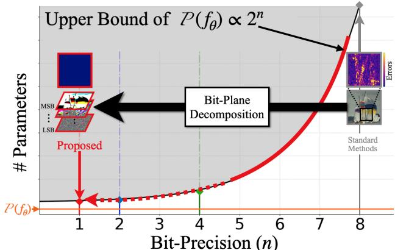  
Figure 1. Overview of the proposed method and error maps at 1,500 iterations. The upper bound on the number of parameters $( \mathcal { P } ( f _ { \theta } ) \propto 2 ^ { n } )$ of INR (f✓) grow proportionally to a bit-precision (n). We propose a bit-plane decomposition method, reducing the upper bound, enabling faster convergence, and ultimately achieving a lossless representation. The closer (f✓) is to the upper bound, the faster it converges, enabling lossless representation

In this paper, based on “The implicit ANN approximations with described error tolerance and explicit parameter bounds" by Jentzen et al. [16], we quantify the upper bound of the size of an INR with given bit-precision. Fig. 1 show that the theoretical upper bound of model size increases as an exponential function proportional to required bit-precision. We suggest a method to reduce the quantified upper bound by bit-plane decomposition. We decompose the signal into bit-planes and represent them, leading to lossless representation. Our method is based on the hypothesis that INR reaches the target error—the maximum allowable error to ensure a lossless representation—as the upper bound approaches the model size. We validate our hypothesis through experiments in Fig. 8. As in Fig. 2, our method makes INR represent a lossless signal in a bit-for-bit manner, which was previously

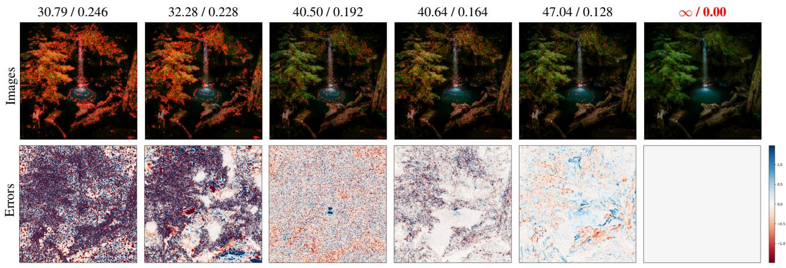  
Figure 2. Visual Demonstration of representing 2D Image (PSNR(dB) / Bit-Error-Rate (BER) at top of images). ReLU with position encoding (P.E) [25], WIRE [34], gaussian activation [32], SIREN [37], FINER[22] and ours. We highlight the occurrence of significant errors with red dots.

## unachievable.

We discovered that INRs learn the most significant bits (MSBs) faster than the least significant bits (LSBs) regardless of activations. We named the observed phenomenon ‘Bit Bias.’ Additionally, we empirically show that the frequency of the bit axis also has a bias in learning. We demonstrate three applications utilizing our method: lossless compression through lossless representation, bit-depth expansion through a bit axis, and ternary INR through robustness on weight quantization.

In summary, our main contributions are as follows:

• We quantify the upper bound on the number of parameters of the implicit neural network based on the given bit precision.

• We propose a bit-plane decomposition for lossless implicit neural representation and validate our hypothesis that reducing bit precision lowers the upper bound on the number of parameters, leading to faster convergence to lossless representation compared to other networks.

• We discovered the existence of bit bias, where most significant bits converge faster than least significant bits, as in spectral bias.

• Our approach extends the application of INR to lossless compression, bit-depth expansion, and model quantization.

## 2. Related Work

Implicit Neural Representation INRs present signals with an ANN that takes spatial coordinates as input. Research to improve the performance of INRs has been conducted to enhance the low representing power of multi-layer perceptrons (MLP). Sitzmann et al. [37], addressed this challenge by employing a sine activation function and inspired researchers to apply various activations to INRs [22, 32, 34]. Research about enhancing the capacity of INR [6, 21, 26, 46, 47] have been conducted. Müller et al. [26], and Xie et al. [46] utilize hash-tables in INRs to enable faster training and accommodate larger signals compared to other methods. However, previous studies were not interested in making concrete lossless representations. The application of INR is also gaining attention. Specifically, several approaches [8, 9, 11, 38] extend the application of INR to lossy compression. Recently, the methods [11, 14] demonstrate remarkable performance by learning a Bayesian INR and encoding a sample.

Even by increasing the parameters significantly, INRs have difficulty achieving representations aimed at high accuracy as in Fig. 3. We focus on reducing the required model size based on bit precision and propose a bit-plane decomposition method to achieve lossless representation with a sufficiently sized model. Our approach offers new applications that were not proposed in existing INRs. We devise a lossless compression approach by combining lossless representation with existing methods. Using bit depth as an axis enables a bit-depth expansion through extrapolation. We propose a ternary INR that utilizes the robustness of our approach to weight quantization.

Spectral Bias Rahaman et al. [31] have shown the presence of a spectral bias which makes it challenging for INR to learn high-frequency components. To address this challenge, approaches [19, 25, 37, 41] that map coordinates into sinusoidal functions have been proposed. The prior works [25, 41] suggested fixed frequencies to solve spectral bias known as position encoding, while Lee and Jin [19] proposed a learnable position encoding which enables INR to learn continuous Fourier spectra. We reinterpret the spectral bias in the bit-plane aspect, which is our proposed method’s core concept. Bit-plane is mainly used for image dequantization [12, 30] or vision model quantization tasks [48]. We found the existence of a similar phenomenon like spectral bias, which we call bit bias. Our method achieves lossless representations efficiently by mitigating this phenomenon.

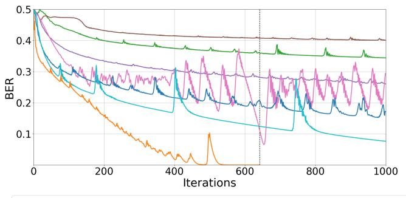

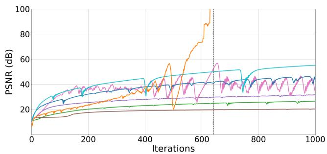  
Figure 3. Training curve on a single image of DIV2K[1] dataset. Bit-Error-Rate(BER) (left) and PSNR (right). Vertical lines indicate the iteration when the model achieves lossless representation.

## 3. Method

In this section, we quantify the upper bound of the INR based on the given bit-precision, grounded in theory [16]. Our proposed bit-plane decomposition method reduces the quantified upper bound and accelerates the attainment of the target error bound, leading to lossless representation.

## 3.1. Preliminary

Quantization A quantization is an inevitable function for all signals to convert analog to digital, which is defined below:

$$
\mathcal { Q } _ { n } ( \hat { x } ) : = \arg \operatorname* { m i n } _ { x } \lvert \lvert x - \hat { x } \rvert \rvert _ { 1 } \quad ( x \in Q _ { n } ) ,\tag{1}
$$

where $n \in \mathbb N$ denotes bit precision, and $Q _ { n } \subset \mathbb { Q }$ is a finite set. We assume the elements of $Q _ { n }$ have normalized and uniformly distributed $( { \bf e . g . } , Q _ { 8 } = \{ 0 , \frac { 1 } { 2 ^ { 8 } - 1 }  , \frac { 2 } { 2 ^ { 8 } - 1 } . . . 1 \}$ for 8-bit images). We set the range dimension of a function as 1 without loss of generality. Let $h : \mathbb { R } ^ { d }  \mathbb { R }$ be a continuous and analog function in d-dimensional space and let $h _ { n }$ be a digital function with n-bits precision:

$$
\begin{array} { r } { h _ { n } : \mathbb { R } ^ { d } \xrightarrow { h } \mathbb { R } \xrightarrow { \mathcal { Q } _ { n } ( . ) } Q _ { n } . } \end{array}\tag{2}
$$

With our assumption, a ceiling of error $\epsilon ( n )$ between h and $h _ { n }$ is a function of precision defined as below:

$$
\epsilon ( n ) : = \frac { 1 } { 2 ( 2 ^ { n } - 1 ) } .\tag{3}
$$

Explicit Bounds Jentzen et al. [16] have demonstrated the explicit upper bounds of the number of parameters of ANNs. This provides a specific number of parameters regarding the particular error tolerance proposed in the universal approximation theory (UAT) [7].

Let $L \in \mathbb { R }$ is a Lipschitz constant that satisfy xi, $\mathbf { x } _ { j } \in$ $\mathbb { R } ^ { d }$ that $| | h ( \mathbf { x } _ { i } ) - h ( \mathbf { x } _ { j } ) | | _ { 1 } \leq L | | \mathbf { x } _ { i } - \mathbf { x } _ { j } | | _ { 1 }$ . Then, there exists MLP $( : = h _ { \theta } )$ that holds:

1. The number of parameters: $\mathcal { P } ( h _ { \theta } ) \leq \mathfrak { C } \epsilon ^ { - 2 d } ( : = \mathcal { U } _ { d } )$

2. The ceiling of the error: sup $| | h _ { \theta } ( \mathbf { x } ) - h ( \mathbf { x } ) | | _ { 1 } \leq \epsilon ,$ where $\mathcal { P } ( \cdot )$ is the number of parameters and C is a constant determined by the condition of the domain. We provide details of the theorem and C in the supplement material.

## 3.2. Problem Formulation

Lossless Representation A lossless representation requires having n-bit precision, where n remains identical to that of the ground truth digital signal at every point. The INR, coordinate-based MLP $\left( h _ { \theta } \right)$ , aims to parameterize a function h with trainable parameters, ✓. Since our target is to represent $h _ { n } .$ , the output of $h _ { \theta }$ should map to $Q _ { n }$ for digital representation as Eq. (2). The parameterized function $h _ { \theta } : \mathbb { R } ^ { d } $ R achieves n-bit precision with respect to an analog function $h : \mathbb { R } ^ { d }  \mathbb { R }$ at $\left( \mathbf { x } , h _ { n } ( \mathbf { x } ) \right)$ , if and only if $\mathbf { x } \in \mathbb { R } ^ { d }$ , the predicted output $\hat { h } _ { \theta } ( \mathbf { x } )$ satisfies:

$$
\begin{array} { r } { \mathcal { Q } _ { n } \big ( \hat { h } _ { \theta } ( \mathbf { x } ) \big ) = h _ { n } ( \mathbf { x } )  \hat { h } _ { \theta } ( \mathbf { x } ) \in [ h _ { n } ( \mathbf { x } ) - \epsilon ( n ) , h _ { n } ( \mathbf { x } ) + \epsilon ( n ) ] . } \end{array}\tag{4}
$$

where $\hat { h } _ { \theta }$ indicate predicted values. If a parameterized function $h _ { \theta }$ satisfies Eq. (4) at $\forall \mathbf { x } \in { \mathcal { X } }$ , it is defined to have n-bit precision with respect to an analog function $h : \mathbb { R } ^ { d }  \mathbb { R }$ i.e.:

$$
\underset { { \mathbf { x } } \in \mathcal { X } } { \operatorname* { s u p } } | | h _ { n } ( { \mathbf { x } } ) - \hat { h } _ { \theta } ( { \mathbf { x } } ) | | _ { 1 } \leq \epsilon ( n ) .\tag{5}
$$

The lossless representation is identical to make $h _ { \theta }$ satisfy Eq. (5). According to UAT [7], it is known that if there is a sufficient number of parameters Eq. (5) be satisfied. However, efficient methods to achieve Eq. (5), especially for large n, have not been well studied.

Upper Bound Based on the Sec. 3.1, we derive the upper bound $( \mathcal { U } _ { d } )$ . The ‘upper bound’ represents the threshold where more parameters don’t improve the representation. $\mathcal { U } _ { d }$ takes bit precision (n), the number of bits required to represent a signal, and signal’s dimension (d) as a dependent variable:

$$
\mathcal { U } _ { d } ( n ) : = \mathfrak { C } \epsilon ( n ) ^ { - 2 d } = \mathfrak { C } ( 2 ^ { n + 1 } - 2 ) ^ { 2 d } .\tag{6}
$$

In conclusion, the upper bound $\mathcal { U } _ { d } ( n )$ of the h✓ increases exponentially as a function of the given bit n. We hypothesize that $h _ { \theta }$ achieves Eq. (5) faster more efficiently as $\mathcal { P } ( h _ { \theta } )$ approaches $\mathcal { U } _ { d }$ . We validate the hypothesis in Sec. 4.2 by adjusting n of target signals. We decrease the upper bound $\mathcal { U } _ { d } ( n )$ by reducing the required precision (n).

<table><tr><td rowspan=1 colspan=4>Method</td><td rowspan=1 colspan=4>Tanh+P.E [25] ReLU+P.E [25]]</td><td rowspan=1 colspan=2>WIRE [34]</td><td rowspan=1 colspan=2>Gauss [32]</td><td rowspan=1 colspan=2>SIREN [37]</td><td rowspan=1 colspan=2>FINER [22]</td><td rowspan=1 colspan=2>Ours</td></tr><tr><td rowspan=5 colspan=1>16--it</td><td rowspan=1 colspan=2>Iterations $\overline { { ( \dow</td><td rowspan=1 colspan=1>narrow ) } }$ </td><td rowspan=1 colspan=12>5000</td><td rowspan=1 colspan=2>3450(±877)</td></tr><tr><td rowspan=2 colspan=1>TESTIMAGES [2]</td><td rowspan=1 colspan=1>PSNR</td><td rowspan=1 colspan=1>SSIM (↑)</td><td rowspan=1 colspan=1>25.63</td><td rowspan=1 colspan=1>0.5447</td><td rowspan=1 colspan=1>35.91</td><td rowspan=1 colspan=1>0.8229</td><td rowspan=1 colspan=1>45.36</td><td rowspan=1 colspan=1>0.9341</td><td rowspan=1 colspan=1>69.40</td><td rowspan=1 colspan=1>0.9928</td><td rowspan=1 colspan=1>78.52</td><td rowspan=1 colspan=1>0.9969</td><td rowspan=1 colspan=1>80.17</td><td rowspan=1 colspan=1>0.9995</td><td rowspan=1 colspan=1>8</td><td rowspan=1 colspan=1>1.0000</td></tr><tr><td rowspan=1 colspan=1>RMSE</td><td rowspan=1 colspan=1>BER (↓)</td><td rowspan=1 colspan=1>3428.1</td><td rowspan=1 colspan=1>0.4224</td><td rowspan=1 colspan=1>1049.5</td><td rowspan=1 colspan=1>0.3794</td><td rowspan=1 colspan=1>359.17</td><td rowspan=1 colspan=1>0.3232</td><td rowspan=1 colspan=1>22.217</td><td rowspan=1 colspan=1>0.2167</td><td rowspan=1 colspan=1>7.7672</td><td rowspan=1 colspan=1>0.1544</td><td rowspan=1 colspan=1>6.4222</td><td rowspan=1 colspan=1>0.1498</td><td rowspan=1 colspan=1>0.0000</td><td rowspan=1 colspan=1>0.0000</td></tr><tr><td rowspan=2 colspan=1>MIT-5k [3]</td><td rowspan=1 colspan=1>PSNR</td><td rowspan=1 colspan=1>SSIM (↑)</td><td rowspan=1 colspan=1>26.95</td><td rowspan=1 colspan=1>0.4644</td><td rowspan=1 colspan=1>37.43</td><td rowspan=1 colspan=1>0.8064</td><td rowspan=1 colspan=1>45.61</td><td rowspan=1 colspan=1>0.9241</td><td rowspan=1 colspan=1>66.90</td><td rowspan=1 colspan=1>0.9795</td><td rowspan=1 colspan=1>78.39</td><td rowspan=1 colspan=1>0.9970</td><td rowspan=1 colspan=1>86.48</td><td rowspan=1 colspan=1>0.9987</td><td rowspan=1 colspan=1>8</td><td rowspan=1 colspan=1>1.0000</td></tr><tr><td rowspan=1 colspan=1>RMSE</td><td rowspan=1 colspan=1>BER (↓)</td><td rowspan=1 colspan=1>2943.5</td><td rowspan=1 colspan=1>0.4195</td><td rowspan=1 colspan=1>880.50</td><td rowspan=1 colspan=1>0.3734</td><td rowspan=1 colspan=1>343.460</td><td rowspan=1 colspan=1>.3202</td><td rowspan=1 colspan=1>29.611</td><td rowspan=1 colspan=1>0.2306</td><td rowspan=1 colspan=1>7.8885</td><td rowspan=1 colspan=1>0.1560</td><td rowspan=1 colspan=1>3.1079</td><td rowspan=1 colspan=1>0.1138</td><td rowspan=1 colspan=1>0.0000</td><td rowspan=1 colspan=1>0.0000</td></tr><tr><td rowspan=5 colspan=1>8-it</td><td rowspan=1 colspan=2>Iterations (</td><td rowspan=1 colspan=1>↓)</td><td rowspan=1 colspan=12>1000</td><td rowspan=1 colspan=2>790(±109)</td></tr><tr><td rowspan=2 colspan=1>[DIV2K [1]</td><td rowspan=1 colspan=1>PSNR S</td><td rowspan=1 colspan=1>SIM (↑)</td><td rowspan=1 colspan=1>21.08</td><td rowspan=1 colspan=1>0.4956</td><td rowspan=1 colspan=1>27.68</td><td rowspan=1 colspan=1>0.8124</td><td rowspan=1 colspan=1>35.69</td><td rowspan=1 colspan=1>0.9572</td><td rowspan=1 colspan=1>54.70</td><td rowspan=1 colspan=1>0.9940</td><td rowspan=1 colspan=1>47.19</td><td rowspan=1 colspan=1>0.9955</td><td rowspan=1 colspan=1>55.03</td><td rowspan=1 colspan=1>0.9989</td><td rowspan=1 colspan=1>8</td><td rowspan=1 colspan=1>1.0000</td></tr><tr><td rowspan=1 colspan=1>RMSE</td><td rowspan=1 colspan=1>BER (↓)</td><td rowspan=1 colspan=1>22.519</td><td rowspan=1 colspan=1>0.3921</td><td rowspan=1 colspan=1>10.533</td><td rowspan=1 colspan=1>0.3318</td><td rowspan=1 colspan=1>4.1864</td><td rowspan=1 colspan=1>0.2365</td><td rowspan=1 colspan=1>0.4694</td><td rowspan=1 colspan=1>0.0953</td><td rowspan=1 colspan=1>1.1144</td><td rowspan=1 colspan=1>0.1343</td><td rowspan=1 colspan=1>0.4519</td><td rowspan=1 colspan=1>0.0528</td><td rowspan=1 colspan=1>0.0000</td><td rowspan=1 colspan=1>0.0000</td></tr><tr><td rowspan=2 colspan=1>Kodak [10]</td><td rowspan=1 colspan=1>PSNR</td><td rowspan=1 colspan=1>SSIM (↑)</td><td rowspan=1 colspan=1>23.94</td><td rowspan=1 colspan=1>0.5894</td><td rowspan=1 colspan=1>30.94</td><td rowspan=1 colspan=1>0.8473</td><td rowspan=1 colspan=1>37.86</td><td rowspan=1 colspan=1>0.9532</td><td rowspan=1 colspan=1>48.28</td><td rowspan=1 colspan=1>0.9864</td><td rowspan=1 colspan=1>47.28</td><td rowspan=1 colspan=1>0.9919</td><td rowspan=1 colspan=1>55.93</td><td rowspan=1 colspan=1>0.9985</td><td rowspan=1 colspan=1>8</td><td rowspan=1 colspan=1>1.0000</td></tr><tr><td rowspan=1 colspan=1>RMSE</td><td rowspan=1 colspan=1>BER (↓)</td><td rowspan=1 colspan=1>16.201</td><td rowspan=1 colspan=1>0.3709</td><td rowspan=1 colspan=1>7.2378</td><td rowspan=1 colspan=1>0.3036</td><td rowspan=1 colspan=1>3.2634</td><td rowspan=1 colspan=1>0.2234</td><td rowspan=1 colspan=1>0.9830</td><td rowspan=1 colspan=1>0.1456</td><td rowspan=1 colspan=1>1.1029</td><td rowspan=1 colspan=1>0.1382</td><td rowspan=1 colspan=1>0.4074</td><td rowspan=1 colspan=1>0.0447</td><td rowspan=1 colspan=1>0.0000</td><td rowspan=1 colspan=1>0.0000</td></tr></table>

Table 1. Quantitative comparison on 16-bit (top) and 8-bit (bottom) image fitting with existing INR methods. The iteration number of our methods indicates ‘mean( std)’ for the total dataset. The text color red/blue indicates the best and second-best, respectively.

## 3.3. Methodology

Bit-Plane Decomposition Let n-bit images be $\mathbf { I } _ { n } : \mathbb { R } ^ { 2 } $ $Q _ { n } ^ { 3 }$ . By employing Eqs. (5) and $( 6 ) , \mathcal { U } _ { d } ( n )$ that required to ensure representing lossless ${ \mathbf I } _ { 8 }$ and $\mathbf { I } _ { 1 6 }$ are significant numbers $( > 1 0 ^ { 1 0 } \cdot \mathfrak { C } , 1 0 ^ { 2 0 } \cdot \mathfrak { C } .$ , respectively). To this end, we suggest a bit-plane decomposition method for implicit neural representation. Instead of n-bit images, we decompose images into bit-planes and represent them. Bit-planes are binary images1 $\mathbf { \bar { B } } ^ { ( i ) } \in \{ 0 , 1 \} ^ { \dot { H } \times W \times 3 }$ that satisfy:

$$
\mathbf { I } _ { n } = \frac { 1 } { 2 ^ { n } - 1 } \sum _ { i = 0 } ^ { n - 1 } 2 ^ { i } \mathbf { B } ^ { ( i ) } ,\tag{7}
$$

where, i denote i-th least significant bit-plane. Our method reduces a bit precision n to 1, thereby reducing $\mathcal { U } _ { d } ( 1 ) = 1 6 \mathfrak { C }$ As a result, our approach brings the number of parameters closer to Eq. (6) and makes it easier to achieve Eq. (5).

A straightforward method for representing an n-bit signal is employing parallel sequence of INRs i.e. $[ f _ { \theta } ^ { ( i ) } ]$ ], each representing bit-plane $[ \mathbf { B } ^ { ( i ) } ]$ . Inspired by the recent dequantization approach proposed by Han et al. [12], we propose a method that employs an additional coordinate (i) to represent an n-bit image, as shown below:

$$
\mathbf { B } ^ { ( i ) } ( \mathbf { x } ) \simeq f _ { \theta } ( \mathbf { x } , i ) ,\tag{8}
$$

where, $\mathbf { x } \in \mathbb { R } ^ { 2 }$ indicates spatial coordinate. Eq. (8) is motivated by the fact that each element of $[ \mathbf { B } ^ { ( i ) } ]$ is not independent but highly correlated. In other words, our proposed method considers an image as a 3-dimensional function with the bit coordinate.

Loss Function We optimize our parameters with the equation below:

$$
\hat { \theta } = \arg \operatorname* { m i n } _ { \theta } \mathcal { L } ( \mathbf { B } ^ { ( i ) } ( \mathbf { x } ) , \hat { f } _ { \theta } ( \mathbf { x } , i ) ) ,\tag{9}
$$

where, $\mathcal { L }$ indicates a loss function. In our approach, candidate loss function $\mathcal { L }$ to optimize parameters ✓ include general regression losses such as $| | \cdot | | _ { p }$ with $p = 1 , 2$ . Furthermore, the optimization problem in our approach with $k = 1$ can be considered as a binary classification problem. We observed that the binary cross-entropy (BCE) loss effectively optimizes ✓ and conducted the ablation study in Sec. 5.

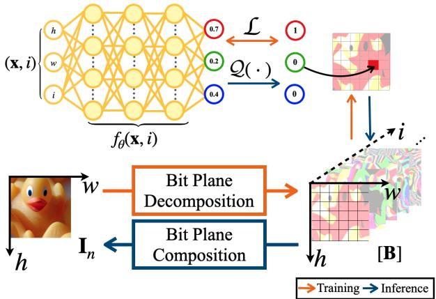  
Figure 4. Overall process of our proposed method. We improve the performance of INR by lowering the upper bound of the number of parameters ( ) and achieve lossless neural representation.

Fig. 4 shows the overall process of our method. After training, we reassemble quantized images to n-bit precision representation using Eqs. (1), (2) and (7) i.e.:

$$
\mathbf { I } _ { n } ( \mathbf { x } ; \theta ) : \overset { \mathrm { T r a i n i n g } } { \underset { \mathrm { I n f e r e n c e } } { \underbrace { ( \mathbf { x } , i ) \overset { f _ { \theta } } { \longleftrightarrow } [ \hat { \mathbf { B } } ] } } } \overset { Q ( \cdot ) } { \underset { \mathrm { I n f e r e n c e } } { \underbrace { Q ( \cdot ) } } } \left[ \mathbf { B } \right] \overset { E q . ( 7 ) } { \longrightarrow } \mathbf { I } _ { n } .\tag{10}
$$

Note that $\hat { \mathbf { B } } \in \mathbb { Q } ^ { H \times W \times 3 }$ which satisfy Eq. (4) for all coordinates. In summary, our method represent ${ \mathbf I } _ { n }$ as below:

$$
\mathbf { I } _ { n } ( \mathbf { x } ; \theta ) = \frac { 1 } { 2 ^ { n } - 1 } \sum _ { i = 0 } ^ { n - 1 } 2 ^ { i } \mathcal { Q } ( \hat { f } _ { \theta } ( \mathbf { x } , i ) ) .\tag{11}
$$

The extended description of the method is in the supplement material for n-ary representations of Fig. 8.

Ours  
ReLU +P.E [25]  
FINER [22]  
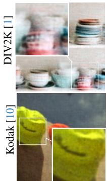

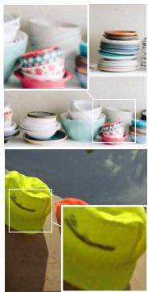  
WIRE [34]

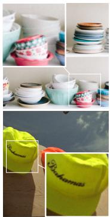  
Gauss [32]

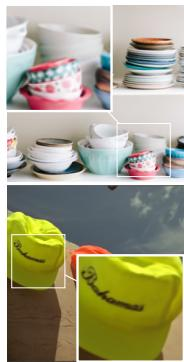  
SIREN [37]

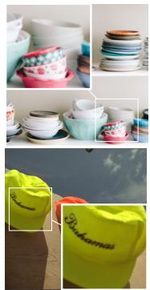  
GT

Figure 5. Qualitative comparison of under-fitted images (# of Iterations : 400) with existing methods.  
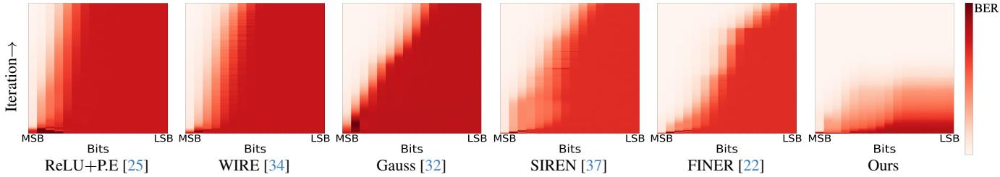  
Figure 6. Bit-Error-Rate of each bit-plane on a TESTIMAGE [2]. The X-axis is for bit depth (MSB to LSB), and the Y-axis is for iteration.

<table><tr><td rowspan="2"></td><td colspan="2">Kodak [10]</td><td colspan="2">TESTIMAGES [2]</td></tr><tr><td>#Iter.(↓)</td><td>PSNR (↑)</td><td>#Iter.(↓)</td><td>PSNR (↑)</td></tr><tr><td>Instant-NGP [26]</td><td>2000</td><td>52.82</td><td>5000</td><td>54.92</td></tr><tr><td>Instant-NGP + Ours</td><td>1130</td><td>∞</td><td>4668</td><td>∞</td></tr><tr><td>DINER [46]</td><td>5000</td><td>39.59</td><td>5000</td><td>38.30</td></tr><tr><td>DINER + Ours</td><td>3347</td><td>∞</td><td>3915</td><td>∞</td></tr><tr><td>Gauss [32]</td><td>15000</td><td>100.48</td><td>50000</td><td>74.88</td></tr><tr><td>Gauss + Ours</td><td>7931</td><td>∞</td><td>29546</td><td>∞</td></tr><tr><td>FINER [22]</td><td>500</td><td>48.52</td><td>2000</td><td>56.58</td></tr><tr><td>FINER + Ours</td><td>428</td><td>∞</td><td>1464</td><td>∞</td></tr></table>

Table 2. Quantitative comparison results combining existing methods with ours. Coordinate encoding method (top) and activation modification method (bottom).

## 4. Experiments

## 4.1. Implementation Details

To validate our proposed method, we conduct experiments on MIT-fiveK [3] and TESTIMAGES1200 [2] dataset that require high dynamic range (0-65,535). The TESTIMAGES dataset includes 40 natural images. We select the last 1,000 images (with indices from 4,001 to 5,000) labeled by expert E in the MIT-fiveK dataset. We also conducted the representation experiments on general 8-bit imaged datasets: validation set of DIV2K [1], which includes 100 images, and Kodak [10], containing 24 images. All images are centercropped and downsampled to a size of 256. Coordinates are normalized to [ 1, 1] as per prior works. Our method is compared with existing methods, including Tanh and ReLU activations with position encoding (+P.E) [25], wavelet [34], Gaussian [32], sine activation [37], and variable periodic activation [22]. All reported values, including baselines, are evaluated after the quantization (Eq. (1)). For a fair comparison, we take the average and standard deviation of the number of iterations and train baselines for a larger number than our average. We adopt the sine activation function for generality and use the BCE loss function unless otherwise stated. In Sec. 5, we conduct ablation studies on activation functions and loss functions. All networks have an identical number of parameters: 5 hidden layers, each with 512 dimensions, ensuring a fair comparison. We use NVIDIA RTX 3090 24GB for training and optimized all networks by Adam [18], with a 1e-4 learning rate.

## 4.2. Image Representation

Validation We quantify the theoretical upper bound of INRs with a given bit precision. We provide experimental evidence supporting our hypothesis: if ${ \mathcal { P } } ( f _ { \theta } )$ is close to the upper bound $\lambda _ { d } ,$ then it is more efficient to achieve Eq. (5). We set all networks with the same number of parameters and set bit-precision (n) as a variable. The detailed figure is in the supplementary. Fig. 8 shows the experiment results for our hypothesis. In Tab. 3, the proposed method performs best against others regarding fast convergence. There are two reasons for fast convergence while the upper bound ( ) is higher than the second column of Tab. 3. First, BCE converges faster than $\mathcal { L } _ { \mathrm { M S E } }$ as in Fig. 11. Second, the experimental group uses the same number of layers and hidden parameters for quantized images while the bit bias exists in the image, which is inefficient.

Quantitative Results In Tab. 1, we report peak signal-tonoise ratio (PSNR(dB)), structural similarity index measure (SSIM), root mean squared error (RMSE) and bit-error-rate (BER) for evaluation on 16-bit and 8-bit image datasets. We pick the best values of metrics for each image during the training. RMSE and SSIM are calculated using integer value. Our method accomplishes lossless representation on all 16-bit and 8-bit images in experiments. Our method converges faster than all other baselines. Fig. 3 represents the results on a single 8-bit image. Note that minimizing BER is highly correlated to increasing PSNR but not equivalent. As a result, our proposed method has consistently low BER throughout the learning process, while the PSNR does not. Tab. 2 demonstrate that our proposed method can be applied to other existing INR approaches. We integrate our method with conventional approaches that use hash inputs [26, 46], as well as with efficient activation functions [22, 32]. For hash-based methods [26, 46], we follow the settings specified in their respective papers. We measure the average number of iterations for each result, ensuring that each baseline was trained sufficiently for a fair comparison. Our method is compatible with existing methods while achieving lossless representation.

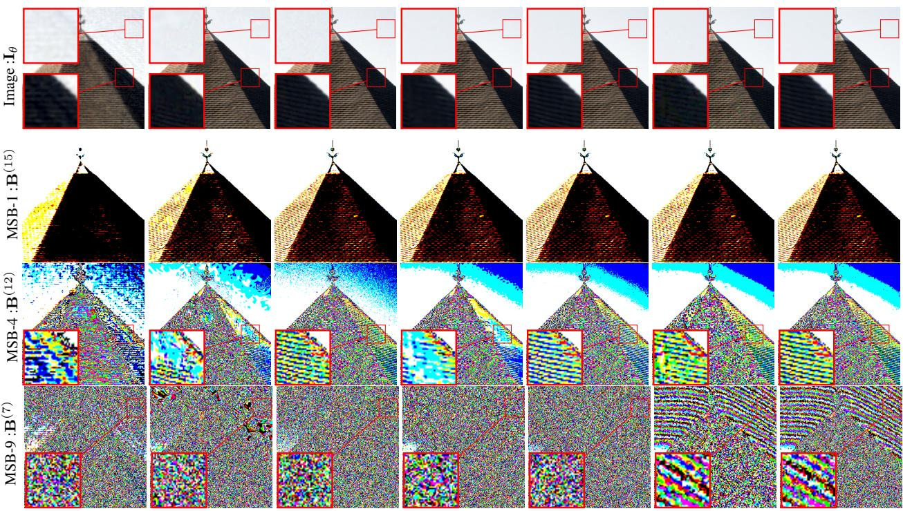  
ReLU+P.E [25]  
WIRE [34]  
Gauss [32]  
SIREN [37]  
FINER [22]  
Ours  
GT

Figure 7. Qualitative comparison of an under-fitted image (# of Iterations : 400) and its bit-plane. The experiment was conducted on the 16-bit image of TESTIMAGE [2]. MSB-n indicates nth bit-plane from the MSB.  
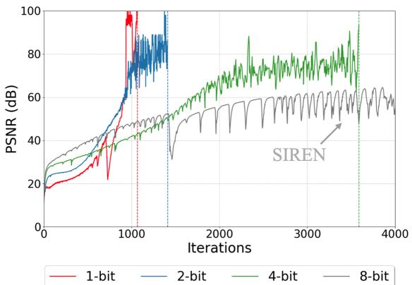

Figure 8. Comparison of convergence curve for an 8-bit image based on bit precision. Vertical dashed lines indicate the iteration when the model achieves lossless. We show that when (f✓) is constant and close to $\mathcal { U } _ { d } ( n )$ , convergence occurs effectively, enabling lossless representation.
<table><tr><td rowspan=1 colspan=1>Method</td><td rowspan=1 colspan=1>BitPrecision (n)</td><td rowspan=1 colspan=1>Ud(n)(· × €)</td><td rowspan=1 colspan=1>LossFunction</td><td rowspan=1 colspan=1>PSNR(dB)</td><td rowspan=1 colspan=1>#Iter. $( \mathrm { M e a n } \pm \mathrm { s t d } )$ </td></tr><tr><td rowspan=1 colspan=1>ExperimentGroup</td><td rowspan=1 colspan=1>124</td><td rowspan=1 colspan=1>161.30K0.81M</td><td rowspan=1 colspan=1>LMSE</td><td rowspan=1 colspan=1>8(Lossless)</td><td rowspan=1 colspan=1> $\overline { { 1 2 3 3 \pm 2 4 1 } }$  $1 2 8 8 \pm 2 3 5$  $3 8 5 2 \pm 7 1 0$ </td></tr><tr><td rowspan=1 colspan=1>SIREN</td><td rowspan=1 colspan=1>8</td><td rowspan=1 colspan=1>67.7G</td><td rowspan=1 colspan=1> $\overline { { \mathcal { L } _ { \mathrm { M S E } } } }$ </td><td rowspan=1 colspan=1>102.8</td><td rowspan=1 colspan=1>5000</td></tr><tr><td rowspan=1 colspan=1>Proposed</td><td rowspan=1 colspan=1>1</td><td rowspan=1 colspan=1>64</td><td rowspan=1 colspan=1> $\mathcal { L } _ { \mathrm { B C E } }$ </td><td rowspan=1 colspan=1>∞ $\lvert ( \mathrm { L o s s l e s s } )$ </td><td rowspan=1 colspan=1>778 ± 83</td></tr></table>

Table 3. Quantitative result of our hypothesis test experiment on Kodak [10]. The number of iterations is proportional to $\mathcal { U } _ { d } ( n )$ .

Qualitative Results We report a visual comparison of underfitted images in Fig. 5. Different artifacts occur during training, such as blurry artifacts for WIRE [34] and SIREN [37], or noise-like artifacts for Gauss [32]. Our method learns both high-frequency and low-frequency components faster than the others; however, salt-pepper impulse noise artifacts are present in the training stage. In Fig. 2, we present converged images with all baselines. Since the converged images are not easily discernible to human eyes, we highlight the occurrence of dominant errors $( \ge \mathrm { M S B { - } 4 ) }$ . The error map indicates residual between the ground truth (GT). Our method makes INR represent no error in image representation.

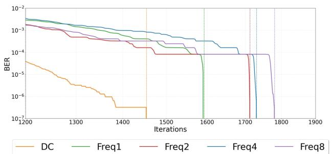

Figure 9. Quantitative comparison based on frequency to the bit axis. Vertical dashed lines indicate the iteration when the model achieves lossless.
<table><tr><td rowspan=1 colspan=1></td><td rowspan=1 colspan=1>Weight</td><td rowspan=1 colspan=1>Model Size(Byte↓)</td><td rowspan=1 colspan=1>PSNR(dB↑)</td><td rowspan=1 colspan=1>#Iter.(↓)</td><td rowspan=1 colspan=1>#BitOps.(/Pixel)</td></tr><tr><td rowspan=1 colspan=1>OursSIREN</td><td rowspan=1 colspan=1> $\overline { { \{ - 1 , 0 , 1 \} } }$ FP32</td><td rowspan=1 colspan=1>656.18K1.27M</td><td rowspan=1 colspan=1>8119.7</td><td rowspan=1 colspan=1>80K200K</td><td rowspan=1 colspan=1>50.66M405.2M</td></tr></table>

Table 4. Model size and weight & performance comparison in the aspect of model quantization.

## 4.3. Bit & Bit-Spectral Bias

Bit Bias In this section, we examine two different biases that we discovered: 1) ‘bit bias’ and 2)‘bit-spectral bias,’ validating them through experiments. In Fig. 6, conducted on a single 16-bit image, the experiment quantitatively demonstrates the presence of bit bias across all tested baselines. Whether weights are assigned or not to the MSBs 2, there is a common challenge in representing the LSBs. Fig. 7 shows that fitting artifacts mentioned in Sec. 4.2 are related to bit bias. According to Fig. 7, MSBs are nearly indiscernible between INRs and GT. However, significant differences were observed in LSBs $\mathbf { B } ^ { ( i ) } ( i \leq 1 3 )$ . In conclusion, the proposed method effectively reduces bit bias resulting in representing the signal’s LSBs.

Bit-spectral Bias In the following, we study our method’s bit axis and its bias. Spectral bias [31] exists on the bit axis. Therefore, specific pixel values are difficult to represent in our structure. The experiment is conducted on the 16-bit synthetic CYMK-RGB image, where we set frequency along the bit axis as a variable. Fig. 9 quantitatively shows the existence of bit-spectral bias. In conclusion, our method parameterizes specific values like 65,535 or 0 (DC) faster than high-frequency values. Implementation details and qualitative results are shown in the supplementary material.

## 4.4. Applications

We propose new applications by using our method. We introduce ternary INR with extreme weight quantization, bitdepth expansion using a bit axis, and lossless compression utilizing lossless representation. The implementation details are in the supplement material.

Ternary Implicit Neural Representation The intuitive question is whether 32-bit floating precision (FP32) parameters are necessary when parameterizing outputs with 1-bit precision. To address our concern, we design a ternaryweighted (1.58-bit) implicit neural representation for an image fitting that employs the novel method proposed by Wang et al. [45] and Ma et al. [23]. Each fully connected layer has ternary weights and calculates its output as follows:

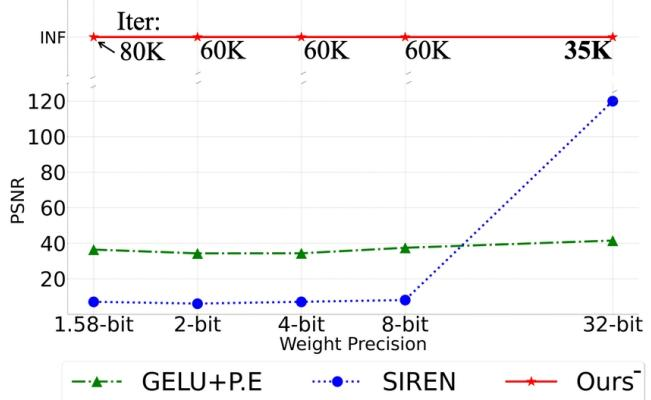

Figure 10. Quantitative comparison of performance (Y-axis) according to the parameter precision (X-axis)
<table><tr><td colspan="2">PSNR(dB↑)|SSIM(↑))</td><td>8-bit → 16-bit</td><td>8-bit → 12-bit</td></tr><tr><td>ZP</td><td rowspan="3">Rule-based</td><td>52.92|0.9990</td><td>53.31|0.9990</td></tr><tr><td>MIG</td><td>55.91|0.9991</td><td>55.93|0.9991</td></tr><tr><td>BR [44]</td><td>52.98|0.9991</td><td>53.32|0.9991</td></tr><tr><td>BECNN [40]</td><td rowspan="2">Supervised</td><td>53.14|0.9986</td><td>N/A</td></tr><tr><td>BitNet [4]</td><td>53.60|0.9970</td><td>N/A</td></tr><tr><td>ABCD [12] Ours</td><td>Self-supervised</td><td>59.39|0.9997 55.92|0.9993</td><td>59.37|0.9995 55.94|0.9997</td></tr></table>

Table 5. Quantitative comparison in the bit-depth expansion on TESTIMAGES[2]. Red and blue indicate the best and the secondbest performance, respectively. ‘N/A’ indicates not applicable.

$$
y = \beta \gamma \tilde { \mathcal { W } } \tilde { x } , \quad ( \tilde { \mathcal { W } } \in \{ - 1 , 0 , 1 \} ^ { d _ { \mathrm { o u t } } \times d _ { \mathrm { i n } } } ) ,\tag{12}
$$

where x˜ is layer normalized and quantized values of input x and $\begin{array} { r } { \beta : = \frac { 1 } { d _ { \mathrm { i n } } d _ { \mathrm { o u t } } } | | \mathcal { W } | | _ { 1 } , \gamma : = | | x | | _ { \infty } } \end{array}$ as suggested in [45].

In Tab. 4 and Fig. 10, we show the performance comparison of weight-quantized INRs. As shown in Fig. 10, our proposed method accomplishes lossless image representation until ternary weights. The activation for our ternary INR should be the GELU [15] function, and we denote it as $\mathrm { \cdot } _ { \mathrm { O u r s } } - \mathrm { \cdot }$ . Periodic activations must follow the strict weight initialization [22, 37]; breaking such initialization by the quantization makes the network collapse. The numbers under ‘Ours’ in Fig. 10 indicate the minimum iteration number for each model. In Tab. 4, We report model size, the number of parameters of f✓ (i.e. (f✓)) in bytes and the number of bit operations (BitOps). The proposed method requires less storage and BitOps than SIREN.

Bit Depth Expansion Our method conducts bit depth expansion by extrapolating the bit-axis. In Tab. 5, we conduct a quantitative comparison with existing methods. We train on the 8 MSBs of a 16-bit image and predict the lower 8 bits without using the 16-bit ground truth. To the best of our knowledge, our method is the first attempt at a self-supervised learning approach for bit depth expansion. Our method performs superior than existing rulebased algorithms or learning-based methods (BitNet [4] and BECNN[40]).

<table><tr><td>Bits Per Pixel (bpp)(↓)</td><td>MNIST</td><td>Fashion MNIST</td></tr><tr><td>PNG [33]</td><td>3.52(+36%)</td><td>5.78(-5%)</td></tr><tr><td>JPEG2000 [42] WebP [35]</td><td>6.75(+162%)</td><td>7.74(+27%)</td></tr><tr><td>TIFF [29]</td><td>2.11(-18%) 3.93(+52%)</td><td>6.60(+8%)</td></tr><tr><td>RECOMBINER[14]+Ours</td><td></td><td>6.76(+11%)</td></tr><tr><td></td><td>2.58</td><td>6.11</td></tr></table>

Table 6. Quantitative comparison for lossless compression. Red and blue indicate the best and second-best performance, respectively.
<table><tr><td rowspan="2"></td><td colspan="3">MNIST</td><td colspan="3">Fashion MNIST</td></tr><tr><td>bpp PSNR</td><td>SSIM</td><td>RMSE</td><td>bpp PSNR</td><td>SSIM</td><td>RMSE</td></tr><tr><td>RECOMBINER [14]</td><td>4.2048.60</td><td>0.994</td><td>0.945</td><td>9.0656.64</td><td>0.996</td><td>0.375</td></tr><tr><td>RECOMBINER+Ours</td><td>2.58 8</td><td>1.000</td><td>0.000</td><td>6.11 8</td><td>1.000</td><td>0.000</td></tr></table>

Table 7. Quantitative comparison between RECOMBINER [14] and RECOMBINER with our method.

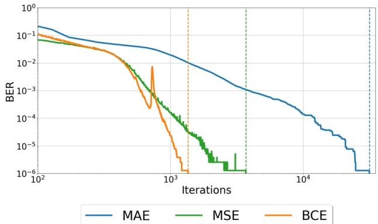  
Figure 11. Quantitative ablation study on loss function of our method on TESTIMAGE[2]. Vertical dashed lines indicate the iteration when the model achieves lossless representations.

Lossless Compression We conduct lossless compression experiments by applying our method to the state-of-the-art INR compression method [14]. In Tab. 6, a simple combination of [14] and ours shows superior results compared to existing lossless image codecs such as PNG [33], JPEG2000 [42], WebP [35], and TIFF [35]. In Tab. 7, [14] cannot achieve lossless representation, even if the bpp is significantly increased.

## 5. Discussion

Ablation Study We conduct ablation studies for the loss function of the proposed method. We utilize a 16-bit sample image in the TESTIMAGE dataset [2] and reduce the model size to observe convergence speed. In Fig. 11, the performance of MSE is close to that of BCE, while MAE exhibits a slow convergence speed. Although achieving lossless representation through MSE or MAE is possible, BCE shows the fastest convergence speed.

We conduct an ablation study on the input dimension d. In Tab. 8, we extend a 3-dimensional coordinate to a 4- dimensional one by incorporating color as a coordinate. As Eq. (6), increasing a dimension increases the upper bound and makes INR converge slower than the proposed method.

<table><tr><td>Method Coord.</td><td>Proposed  ${ \mathbf x } = ( h , w , i )$ </td><td>Tested  ${ \bf x } = ( h , w , i , c )$ </td></tr><tr><td>#Iter.(↓)</td><td>790</td><td>1438</td></tr></table>

Table 8. Quantitative ablation study of our method on Kodak [10] as the input dimension d increases (3  4).
<table><tr><td>Text</td><td colspan="2">Jack would become Eva&#x27;s happy husband</td></tr><tr><td>Method</td><td>PSNR(dB)(↑)</td><td>Prediction from [43]</td></tr><tr><td>GT Audio</td><td></td><td>Jack would become even happy ashon</td></tr><tr><td>SIREN [37]</td><td>68.54</td><td>Jark will become evil&#x27;s haring ho</td></tr><tr><td>DINER [46]</td><td>85.19</td><td>Jar would become even hary ashon</td></tr><tr><td>Ours</td><td>8</td><td>Jack would become even happy ashon</td></tr></table>

Table 9. Qualitative comparison on speech to text (STT) results of the represented audio using a pre-trained STT network [43].

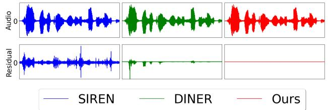  
Figure 12. Qualitative comparison on representing the Librispeech [27] data with a floating point precision (FP32) and its residual.

Floating Point Representation Our approach has been discussed in the context of fixed precisions. We also verified whether our method can be applied to floating-point data, such as audio. The detailed formulation is in the supplement. In Fig. 12, we show the representation result of Librispeech data [27] and demonstrate that the FP32 data format is fitted by our method losslessly. In Tab. 9, we report the speech-totext (STT) results predicted by pre-trained model [43] and compare our method with other methods [37, 46].

Limitation As mentioned by Jentzen et al. [16], when d exceeds 5, such as in radiance fields, the suggested upper bounds $\mathcal { U } _ { d }$ increase extremely high $( \mathcal { U } _ { 5 } ( 8 ) \simeq 1 . 2 3 \mathfrak { C } \times 1 0 ^ { 2 7 } )$ Although our proposed approach performs better in representing low-dimensional data, the main drawback lies in predicting high-dimensional data. Further research is needed to explore parameter-efficient learning; thus, we demonstrate the use of recent techniques in the supplement material.

## 6. Conclusion

We quantify the upper bound of the size of INRs based on the given bit precision. Through bit-plane decomposition, we achieve lossless representation, which was previously unachievable. With experiments, we validate our hypothesis that "lowering the upper bound accelerates the achievement of lossless representation in INR." Furthermore, we reinterpret the concept of spectral bias from a digital computing perspective and explain new notions of ‘bit bias.’ Our method mitigates the bit bias and makes INR represent true LSBs, resulting in lossless representation. We demonstrate that our method enables true lossless representation in followed applications: ternary networks, lossless compression, and bit-depth expansion.

## Acknowledgments

This work was partly supported by the National Research Foundation of Korea (NRF) grant funded by the Korea government (MSIT) (RS-2024-00335741) and (RS-2024-00413303).

## References

[1] Eirikur Agustsson and Radu Timofte. NTIRE 2017 Challenge on Single Image Super-Resolution: Dataset and Study. In Proceedings ofthe IEEE Conference on Computer Vision and Pattern Recognition (CVPR) Workshops, 2017.

[2] Nicola Asuni and Andrea Giachetti. Testimages: A large data archive for display and algorithm testing. Journal of Graphics Tools, 17(4):113–125, 2013.

[3] Vladimir Bychkovsky, Sylvain Paris, Eric Chan, and Frédo Durand. Learning photographic global tonal adjustment with a database of input / output image pairs. In The Twenty-Fourth IEEE Conference on Computer Vision and Pattern Recognition, 2011.

[4] Junyoung Byun, Kyujin Shim, and Changick Kim. BitNet: Learning-based bit-depth expansion. In Asian Conference on Computer Vision, pages 67–82. Springer, 2018.

[5] Yinbo Chen, Sifei Liu, and Xiaolong Wang. Learning Continuous Image Representation With Local Implicit Image Function. In Proceedings of the IEEE/CVF Conference on Computer Vision and Pattern Recognition (CVPR), pages 8628–8638, 2021.

[6] Zhang Chen, Zhong Li, Liangchen Song, Lele Chen, Jingyi Yu, Junsong Yuan, and Yi Xu. Neurbf: A neural fields representation with adaptive radial basis functions. In Proceedings of the IEEE/CVF International Conference on Computer Vision, pages 4182–4194, 2023.

[7] George Cybenko. Approximation by superpositions of a sigmoidal function. Mathematics of control, signals and systems, 2(4):303–314, 1989.

[8] Emilien Dupont, Adam Golinski, Milad Alizadeh, Yee Whye´ Teh, and Arnaud Doucet. Coin: Compression with implicit neural representations. arXiv preprint arXiv:2103.03123, 2021.

[9] Emilien Dupont, Hrushikesh Loya, Milad Alizadeh, Adam Golinski, Yee Whye Teh, and Arnaud Doucet. Coin++:´ Neural compression across modalities. arXiv preprint arXiv:2201.12904, 2022.

[10] Rich Franzen. Kodak lossless true color image suite. source: http://r0k. us/graphics/kodak, 4(2), 1999.

[11] Zongyu Guo, Gergely Flamich, Jiajun He, Zhibo Chen, and José Miguel Hernández-Lobato. Compression with bayesian implicit neural representations. Advances in Neural Information Processing Systems, 36:1938–1956, 2023.

[12] Woo Kyoung Han, Byeonghun Lee, Sang Hyun Park, and Kyong Hwan Jin. ABCD: Arbitrary bitwise coefficient for dequantization. In Proceedings ofthe IEEE/CVF Conference on Computer Vision and Pattern Recognition, pages 5876–5885, 2023.

[13] Woo Kyoung Han, S. Im, J. Kim, and Kyong Hwan Jin. JDEC: Jpeg decoding via enhanced continuous cosine coefficients. In

2024 IEEE/CVF Conference on Computer Vision and Pattern Recognition (CVPR), 2024.

[14] Jiajun He, Gergely Flamich, Zongyu Guo, and José Miguel Hernández-Lobato. Recombiner: Robust and enhanced compression with bayesian implicit neural representations. arXiv preprint arXiv:2309.17182, 2023.

[15] Dan Hendrycks and Kevin Gimpel. Gaussian error linear units (gelus). arXiv preprint arXiv:1606.08415, 2016.

[16] Arnulf Jentzen, Benno Kuckuck, and Philippe von Wurstemberger. Mathematical introduction to deep learning: Methods, implementations, and theory. arXiv preprint arXiv:2310.20360, 2023.

[17] Chiyu "Max" Jiang, Avneesh Sud, Ameesh Makadia, Jingwei Huang, Matthias Niessner, and Thomas Funkhouser. Local Implicit Grid Representations for 3D Scenes. In IEEE/CVF Conference on Computer Vision and Pattern Recognition (CVPR), 2020.

[18] Diederik P. Kingma and Jimmy Ba. Adam: A Method for Stochastic Optimization. In 3rd International Conference on Learning Representations, ICLR 2015, San Diego, CA, USA, May 7-9, 2015, Conference Track Proceedings, 2015.

[19] Jaewon Lee and Kyong Hwan Jin. Local texture estimator for implicit representation function. In Proceedings of the IEEE/CVF Conference on Computer Vision and Pattern Recognition (CVPR), pages 1929–1938, 2022.

[20] Jaewon Lee, Kwang Pyo Choi, and Kyong Hwan Jin. Learning local implicit fourier representation for image warping. In European Conference on Computer Vision (ECCV), pages 182–200. Springer, 2022.

[21] David B Lindell, Dave Van Veen, Jeong Joon Park, and Gordon Wetzstein. Bacon: Band-limited coordinate networks for multiscale scene representation. In Proceedings of the IEEE/CVF conference on computer vision and pattern recognition, pages 16252–16262, 2022.

[22] Zhen Liu, Hao Zhu, Qi Zhang, Jingde Fu, Weibing Deng, Zhan Ma, Yanwen Guo, and Xun Cao. Finer: Flexible spectral-bias tuning in implicit neural representation by variable-periodic activation functions. arXiv preprint arXiv:2312.02434, 2023.

[23] Shuming Ma, Hongyu Wang, Lingxiao Ma, Lei Wang, Wenhui Wang, Shaohan Huang, Li Dong, Ruiping Wang, Jilong Xue, and Furu Wei. The era of 1-bit llms: All large language models are in 1.58 bits. arXiv preprint arXiv:2402.17764, 2024.

[24] Lars Mescheder, Michael Oechsle, Michael Niemeyer, Sebastian Nowozin, and Andreas Geiger. Occupancy Networks: Learning 3D Reconstruction in Function Space. In Proceedings ofthe IEEE/CVF Conference on Computer Vision and Pattern Recognition (CVPR), 2019.

[25] Ben Mildenhall, Pratul P. Srinivasan, Matthew Tancik, Jonathan T. Barron, Ravi Ramamoorthi, and Ren Ng. NeRF: Representing Scenes as Neural Radiance Fields for View Synthesis. In Proceedings of the European Conference on Computer Vision (ECCV), 2020.

[26] Thomas Müller, Alex Evans, Christoph Schied, and Alexander Keller. Instant neural graphics primitives with a multiresolution hash encoding. ACM transactions on graphics (TOG), 41(4):1–15, 2022.

[27] Vassil Panayotov, Guoguo Chen, Daniel Povey, and Sanjeev Khudanpur. Librispeech: an asr corpus based on public domain audio books. In 2015 IEEE international conference on acoustics, speech and signal processing (ICASSP), pages 5206–5210. IEEE, 2015.

[28] Jeong Joon Park, Peter Florence, Julian Straub, Richard Newcombe, and Steven Lovegrove. DeepSDF: Learning Continuous Signed Distance Functions for Shape Representation. In Proceedings of the IEEE/CVF Conference on Computer Vision and Pattern Recognition (CVPR), 2019.

[29] Charles A Poynton. Overview of tiff 5.0. In Image Processing and Interchange: Implementation and Systems, pages 152– 158. SPIE, 1992.

[30] Abhijith Punnappurath and Michael S Brown. A little bit more: Bitplane-wise bit-depth recovery. IEEE Transactions on Pattern Analysis and Machine Intelligence, 2021.

[31] Nasim Rahaman, Aristide Baratin, Devansh Arpit, Felix Draxler, Min Lin, Fred Hamprecht, Yoshua Bengio, and Aaron Courville. On the Spectral Bias of Neural Networks. In Proceedings of the 36th International Conference on Machine Learning, pages 5301–5310. PMLR, 2019.

[32] Sameera Ramasinghe and Simon Lucey. Beyond periodicity: Towards a unifying framework for activations in coordinatemlps. In European Conference on Computer Vision, pages 142–158. Springer, 2022.

[33] Greg Roelofs. PNG: the definitive guide. O’Reilly & Associates, Inc., 1999.

[34] Vishwanath Saragadam, Daniel LeJeune, Jasper Tan, Guha Balakrishnan, Ashok Veeraraghavan, and Richard G Baraniuk. Wire: Wavelet implicit neural representations. In Proceedings ofthe IEEE/CVF Conference on Computer Vision and Pattern Recognition, pages 18507–18516, 2023.

[35] Zhanjun Si and Ke Shen. Research on the webp image format. In Advanced graphic communications, packaging technology and materials, pages 271–277. Springer, 2016.

[36] Vincent Sitzmann, Michael Zollhoefer, and Gordon Wetzstein. Scene Representation Networks: Continuous 3D-Structure-Aware Neural Scene Representations. In Advances in Neural Information Processing Systems. Curran Associates, Inc., 2019.

[37] Vincent Sitzmann, Julien Martel, Alexander Bergman, David Lindell, and Gordon Wetzstein. Implicit Neural Representations with Periodic Activation Functions. In Advances in Neural Information Processing Systems, pages 7462–7473. Curran Associates, Inc., 2020.

[38] Yannick Strümpler, Janis Postels, Ren Yang, Luc Van Gool, and Federico Tombari. Implicit neural representations for image compression. In European Conference on Computer Vision, pages 74–91. Springer, 2022.

[39] Kun Su, Mingfei Chen, and Eli Shlizerman. Inras: Implicit neural representation for audio scenes. Advances in Neural Information Processing Systems, 35:8144–8158, 2022.

[40] Yuting Su, Wanning Sun, Jing Liu, Guangtao Zhai, and Peiguang Jing. Photo-realistic image bit-depth enhancement via residual transposed convolutional neural network. Neurocomputing, 347:200–211, 2019.

[41] Matthew Tancik, Pratul Srinivasan, Ben Mildenhall, Sara Fridovich-Keil, Nithin Raghavan, Utkarsh Singhal, Ravi Ramamoorthi, Jonathan Barron, and Ren Ng. Fourier Features Let Networks Learn High Frequency Functions in Low Dimensional Domains. In Advances in Neural Information Processing Systems, pages 7537–7547. Curran Associates, Inc., 2020.

[42] D Taubman. Jpeg 2000: Image compression fundamentals, standards and practice, 2002.

[43] Silero Team. Silero models: pre-trained enterprise-grade stt / tts models and benchmarks, 2021.

[44] Robert A Ulichney and Shiufun Cheung. Pixel bit-depth increase by bit replication. In Color Imaging: Device-Independent Color, Color Hardcopy, and Graphic Arts III, pages 232–241. SPIE, 1998.

[45] Hongyu Wang, Shuming Ma, Li Dong, Shaohan Huang, Huaijie Wang, Lingxiao Ma, Fan Yang, Ruiping Wang, Yi Wu, and Furu Wei. Bitnet: Scaling 1-bit transformers for large language models. arXiv preprint arXiv:2310.11453, 2023.

[46] Shaowen Xie, Hao Zhu, Zhen Liu, Qi Zhang, You Zhou, Xun Cao, and Zhan Ma. DINER: Disorder-invariant implicit neural representation. In Proceedings of the IEEE/CVF Conference on Computer Vision and Pattern Recognition, pages 6143– 6152, 2023.

[47] Guandao Yang, Sagie Benaim, Varun Jampani, Kyle Genova, Jonathan Barron, Thomas Funkhouser, Bharath Hariharan, and Serge Belongie. Polynomial neural fields for subband decomposition and manipulation. Advances in Neural Information Processing Systems, 35:4401–4415, 2022.

[48] Shien Zhu, Luan HK Duong, and Weichen Liu. Xor-net: an efficient computation pipeline for binary neural network inference on edge devices. In 2020 IEEE 26th international conference on parallel and distributed systems (ICPADS), pages 124–131. IEEE, 2020.