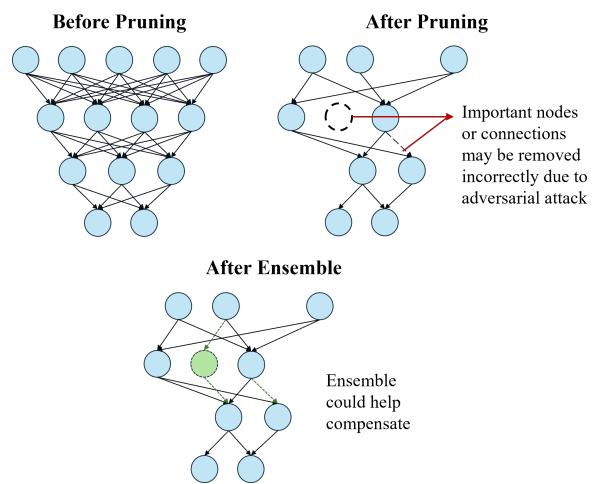
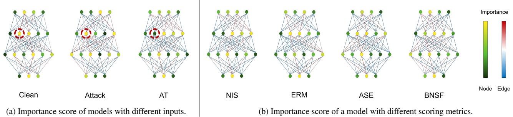
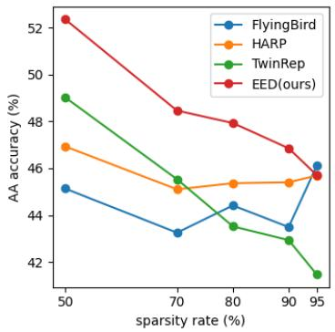
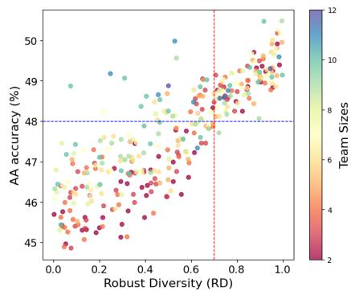
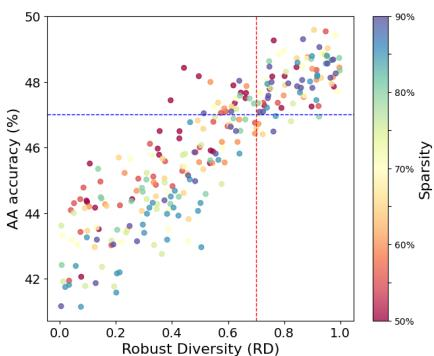

# Two is Better than One: Efficient Ensemble Defense for Robust and Compact Models

Yoojin Jung Byung Cheol Song Department of Electrical and Computer Engineering, Inha University Incheon, Republic of Korea yooon0505@gmail.com, bcsong@inha.ac.kr

## Abstract

Deep learning-based computer vision systems adopt complex and large architectures to improve performance, yet theyface challenges in deployment on resource-constrained mobile and edge devices. To address this issue, model compression techniques such as pruning, quantization, and matrix factorization have been proposed; however, these compressed models are often highly vulnerable to adversarial attacks. We introduce the Efficient Ensemble Defense (EED) technique, which diversifies the compression of a single base model based on different pruning importance scores and enhances ensemble diversity to achieve high adversarial robustness and resource efficiency. EED dynamically determines the number of necessary sub-models during the inference stage, minimizing unnecessary computations while maintaining high robustness. On the CIFAR-10 and SVHN datasets, EED demonstrated state-of-the-art robustness performance compared to existing adversarial pruning techniques, along with an inference speed improvement ofup to 1.86 times. This proves that EED is a powerful defense solution in resource-constrained environments.

## 1. Introduction

Convolutional Neural Networks (CNNs) have shown remarkable performance across various computer vision tasks, such as image classification, object detection, and semantic segmentation[18, 33, 36]. However, CNNs have become increasingly wider and deeper to achieve higher performance, leading to complex architectures with vast numbers of parameters. This complexity inherently results in significant computational costs and storage demands, making deployment on resource-constrained edge devices challenging[4, 42]. To address this challenge, a number of model compression techniques, including pruning[14, 24], quantization[3], and matrix decomposition[8], have been proposed to minimize model size and computational load without compromising accuracy.

  
Figure 1. Challenges in AP and the potential of ensemble methods: AP weakens the network by removing critical parameters, reducing robustness and increasing vulnerability to adversarial attacks. An ensemble approach mitigates pruning effects by combining pruned models, enhancing robustness through their collective strength (illustrated in green).

Meanwhile, deep learning models are highly vulnerable to adversarial attacks that induce false predictions by disturbing the input image with small perturbations[11, 37]. This vulnerability is particularly pronounced in sparsely compressed models, which are even more sensitive to adversarial attacks than standard models[35, 44]. Consequently, common adversarial defense techniques such as adversarial training (AT) [20, 27], label smoothing [41, 51], and defensive distillation[31], while generally effective, often experience a degradation in performance when applied to compressed models. This indicates that existing compression techniques may compromise adversarial robustness even if they maintain accuracy on clean test sets. In response, adversarial pruning (AP), a model compression technique that considers adversarial robustness[34, 48, 52], has emerged;

however, AP still exhibits lower robustness compared to non-compressed defense models[32].

We assume that this degradation in robustness arises from reduced generalization capability and information loss caused by pruning. Specifically, adversarial attacks may cause the model to misidentify and even remove critical nodes or connections during the pruning process. In Sec.3.3, we validate this assumption by observing importance scores, which reflect how each component contributes to the loss function through the gradients of the weights[50]. Our findings demonstrate that adversarial examples significantly impact the importance scores of individual parameters.

Ensemble defense[7, 39] has recently gained attention in adversarial defense research for enhancing the stability and robustness of multiple base classifiers against attacks. As illustrated in Fig.1, we believe that ensemble defense methods can help mitigate generalization degradation and information loss during the pruning process. Since ensemble learning can compensate for deficiencies in individual compressed models due to removed parameters by other models and offset individual errors by combining outputs. However, traditional ensemble defenses inherently suffer from a large capacity, as they require multiple base models[15, 30]. This raises an important question: Is it possible to develop an ensemble defense algorithm that not only achieves robustness but also results in a compact compressed model?

As an answer to this, we propose Efficient Ensemble Defense (EED). Instead of using multiple base models, we compress a single base model by employing different pruning metrics and then utilize these compressed submodels in the ensemble. This approach reduces the overall capacity compared to traditional ensemble defense models that rely on multiple base models. Given that using smaller models in an ensemble can lead to reduced defensive efficacy[46], we enhance the variety of the compressed models by incorporating a diversity term in the ensemble selection process, thereby improving ensemble effectiveness while maintaining robustness. Additionally, by adopting inference-efficient ensemble[25], we dynamically add sub-networks and perform ensemble operations as needed during inference, improving overall efficiency.

The main contributions of our work are as follows:

• Propose EED, that overcomes the limitations of traditional AP by enhancing the ensemble diversity and compensating for individual errors, thereby achieving robustness against adversarial attacks while being compact.

• Reduce memory by using a single base model in ensemble, and decrease computational costs by dynamically adding models only when necessary during inference.

• Achieve state-of-the-art performance across various attack benchmarks on the CIFAR-10 and SVHN datasets.

## 2. Related Works

## 2.1. Adversarial Attack and Defense

Adversarial attacks exploit the inherent vulnerabilities of deep learning models by adding specific noise to the input, thereby inducing incorrect predictions. These specially crafted inputs, designed to deceive deep learning models, are called adversarial examples. Early studies highlighted the susceptibility of deep learning models to adversarial examples[37]. Then, more potent attacks such as FGSM[11], PGD[27], and AutoAttack[6] have emerged.

On the other hand, defense methods against attacks have also been evolved. The most well-known adversarial training (AT)[1, 20, 27] enhanced robustness by training adversarial examples. Other strategies involve regularizing geometric properties such as the curvature of the loss function [41, 45], or restoring potentially attacked images to purified versions[29, 49]. Adversarial pruning (AP) and ensemble defense are also one of adversarial defenses (details are given in Sec.3.1.)

## 2.2. Adversarial Pruning

AP is a pruning technique (primarily weight pruning) that considers the adversarial context, aiming to reduce the complexity of neural networks while preserving robustness against adversarial attacks. HYDRA demonstrated that empirical adversarial robustness can be achieved through a lowest weight magnitude (LWM) pruning method. R-ADMM[48] and HARP[52] incorporated the alternating direction method of multipliers (ADMM) framework into LWM-based pruning to enhance robustness. In some studies [12, 22, 26], a traditional pruning method, i.e., the Lottery Ticket Hypothesis, was integrated with AT. However, they all failed to maintain generalized robustness at higher sparsity rates (s )[13, 19, 38], and struggled to defend against adaptive attacks[9, 16]. This suggests that conventional AP has not fully resolved the trade-off between model capacity and robustness.

## 2.3. Ensemble Defense

Ensemble defense (ED), which applies ensemble learning to adversarial defense, has been actively studied due to its promising performance[7, 39]. The core of ED is to improve predictions through an ensemble diversity loss that considers adversarial robustness during training. ADP[30] used Shannon entropy and geometric diversity for uncertainty, while GAL[17] utilized cosine similarities between model loss gradients to formalize diversity. DVERGE[47] introduced vulnerability diversity to ensure that each model is robust to the weaknesses of others, and MOL[5] increased perturbation diversity by using expert models trained on different attacks. Thus, ED has significantly enhanced robustness by reducing the risk of overfitting to adversarial examples and diversifying the decision boundary, though with increased model capacity and computational costs.

## 3. Preliminaries

## 3.1. Notations

Adversarial Attack Let $x ~ \in ~ \mathbb { R } ^ { d }$ be an input example, $y \in \{ 1 , \ldots , C \}$ the true label, and $f ( \cdot )$ a classifier with parameters θ. The classifier’s prediction for input x is given by $f ( x ) = \arg \operatorname* { m a x } _ { i \in \{ 1 , . . . , C \} } f _ { i } ( x )$ , where $f _ { i } ( x )$ denotes the predicted probability for class i. An adversarial example $x ^ { \prime }$ is crafted by adding a perturbation δ to x, aiming to maximize the model’s prediction error while keeping $x ^ { \prime }$ close to x under a norm constraint. Formally, an adversarial attack is defined by:

$$
x ^ { \prime } = x + \delta = \arg \operatorname* { m a x } _ { \| x - x ^ { \prime } \| < \epsilon } \mathcal { L } ( f ( x ^ { \prime } ) , y )\tag{1}
$$

where $\mathcal { L }$ is the loss function and ϵ is the perturbation budget that constrains the strength of the attack under an $\ell _ { p } { \mathrm { - n o r m } }$ Adversarial Training AT is a defense method that improves model robustness by training on adversarially perturbed samples alongside clean samples. The objective for AT is usually formulated by:

$$
\operatorname* { m i n } _ { \theta } \mathbb { E } _ { ( x , y ) \sim \mathcal { D } } \left[ \operatorname* { m a x } _ { \delta : \| \delta \| _ { p } \leq \epsilon } \mathcal { L } ( f ( x ^ { \prime } ; \theta ) , y ) \right]\tag{2}
$$

where D is the data distribution.

Adversarial Pruning Given a pre-trained model $f ( \theta )$ under AT, we aim to maintain robustness while applying a pruning mask M across layers to achieve compression. The general pruning is carried out by removing parameters until the network reaches a desired $s _ { r }$ . So, pruning involves creating M, formalized as follows:

$$
M = \arg \operatorname* { m i n } _ { \| \mathbf { m } \| _ { 0 } \leq 1 - s _ { r } } \mathcal { L } ( f ( \theta ) \otimes m , x , y ) .\tag{3}
$$

$$
m = \left\{ \begin{array} { l l } { 0 , } & { \mathrm { i f ~ } \theta _ { i } \mathrm { ~ i s ~ t o ~ b e ~ p r u n e d } } \\ { 1 , } & { \mathrm { o t h e r w i s e } } \end{array} , \right. \quad \forall \theta _ { i } \in \theta\tag{4}
$$

For AP, we follow the strategy from HARP[52]. To enhance adversarial robustness, inner maximization generates adversarial examples, targeting a worst-case loss under the PGD attacks:

$$
\operatorname* { m a x } _ { \delta } \mathcal { L } _ { r } ( f ( \theta ) \odot M , x + \delta , y )\tag{5}
$$

where $\mathcal { L } _ { r }$ defines the robust loss function, incorporating attack-specific parameters. And the global non-uniform pruning strategy jointly optimizes a compression rate $c _ { r }$ and importance scores I across layers. This is defined by:

$$
\begin{array} { r } { \underset { c _ { r } , I } { \operatorname* { m i n } } \mathbb { E } _ { ( x , y ) \sim D } \left[ \underset { \delta } { \operatorname* { m a x } } \mathcal { L } _ { r } ( f ( \theta ) \odot M , x + \delta , y ) \right] } \\ { + \varphi \cdot \mathcal { L } _ { p } ( f ( \theta ) \odot M , a _ { t } ) } \end{array}\tag{6}
$$

where ${ \mathcal { L } } _ { p }$ enforces target compression $a _ { t }$ across all layers L to guide non-uniform pruning rates.

## 3.2. Pruning Importance Score

The importance score’s definition varies by pruning method. This section details its definition and computation, as discussed in Sec.3.1.

Neuron Importance Score (NIS) NIS [50] is a common pruning score that minimizes the weighted distance between the original and pruned final responses in a given layer. Given a neural network $f ^ { ( n ) }$ with n layers, and the importance score of the final layer response $I ^ { ( n ) }$ , the importance score of the i-th layer $\bar { I ^ { ( i ) } }$ is calculated as follows:

$$
I ^ { ( i ) } = \left| w ^ { ( i + 1 ) } \right| ^ { T } \cdot \left| w ^ { ( i + 2 ) } \right| ^ { T } \cdot \cdot \cdot \left| w ^ { ( n ) } \right| ^ { T } \cdot I ^ { ( n ) }\tag{7}
$$

Here, $w ^ { ( i ) }$ refers to the weight matrix of the i-th layer. In this case, the importance of a neuron in the network can be computed recursively along the network. Thus, $I ^ { ( i ) }$ can be propagated from the importance score of the $( i + 1 )$ -th layer as follow:

$$
I _ { N I S } ^ { ( i ) } = \left| w ^ { ( i + 1 ) } \right| ^ { T } \cdot I ^ { ( i + 1 ) }\tag{8}
$$

Empirical Risk Minimization (ERM) The importance score based on ERM, used in HYDRA[34] and HARP, is defined as follows, based on the weight magnitudes of a pre-trained model.

$$
I _ { E R M } ^ { ( i ) } = \frac { \eta \cdot | \theta ^ { ( i ) } | } { \operatorname* { m a x } ( | \theta ^ { ( i ) } | ) }\tag{9}
$$

Here, $J _ { E R M } ^ { ( i ) }$ represents the importance score for the weights of the i-th layer, $\theta ^ { ( i ) }$ denotes the weight matrix of that layer, and η is a scaling factor determined by the layer’s structure and receptive field size.

Adversarial Saliency Estimation (ASE) MAD [21] computes the ASE for each parameter, removing the least salient ones. Adversarial saliency is estimated via a second-order Taylor expansion, with the saliency score $I _ { A S E }$ for each parameter $w ^ { ( i ) }$ defined as:

$$
I _ { A S E } = \frac { 1 } { 2 } \left[ \frac { \partial ^ { 2 } \mathcal { L } } { \partial ( w ^ { ( i ) } ) ^ { 2 } } \right] | w ^ { ( i ) } | ^ { 2 }\tag{10}
$$

Here, $\frac { \partial ^ { 2 } \mathcal { L } } { \partial ( w ^ { ( i ) } ) ^ { 2 } }$ is the Hessian of the loss function with respect to $\boldsymbol { w } ^ { ( i ) }$ , reflecting the impact of parameter changes on the loss, and $| w ^ { ( i ) } | ^ { 2 }$ reflects the magnitude and importance of the corresponding parameter.

Batch Normalization Scaling Factor (BNSF) BNAP [43] identifies the magnitude of the Batch Normalization (BN) scaling factor $\gamma$ as a robustness measure across channels, used as the pruning criterion. The BN layer normalizes weights $w _ { i k } ^ { j }$ into the following effective weights:

  
Figure 2. Importance score visualization for the 4-5-6-3 CNN model on the MNIST dataset: yellow/red indicate higher importance, green/blue indicate lower.

$$
\hat { w } _ { i k } ^ { j } = \frac { \gamma _ { i } ^ { j } w _ { i k } ^ { j } } { ( \sigma _ { i } ^ { j } ) ^ { 2 } + \epsilon } \approx \frac { \gamma _ { i } ^ { j } w _ { i k } ^ { j } } { \sigma _ { i } ^ { j } }\tag{11}
$$

where i is the layer index, $j$ is the channel index of i-th layer, and k is the channel index in the (i − 1)-th layer. In this case, ϵ is small enough to be neglected, and $\gamma _ { i } ^ { j }$ and $\boldsymbol { \sigma } _ { i } ^ { j }$ each play a role in readjusting the weights per channel. Therefore, the computed weights can be used as the importance score.

## 3.3. A Closer Look at Adversarial Pruning via Importance Score

Least Importance Score [50] is a common pruning criterion that assesses each parameter’s (weights, filters, channels) importance to overall network performance, pruning the least important first. This score clarifies the impact of adversarial examples on pruning. We compared importance scores between models trained on clean data, adversarial data, and adversarially-trained models using a simple CNN architecture.

As shown in Fig. 2a, importance scores differ significantly between models trained on clean versus adversarial datasets. In the AT model, trained on both, scores do not consistently fall between clean and adversarial values but more closely resemble the clean model. Notably, nodes highly important in both cases (e.g., the second node in the second layer) may appear less important in the AT model. This suggests that training on both datasets may obscure importance, potentially leading to pruning of critical nodes or connections.

Moreover, we evaluated the same model with different importance scoring methods mentioned earlier. The results in Fig.2b suggest that the order of importance for nodes and connections can vary depending on the scoring method. In other words, each sub-network pruned with a different importance scoring method may contain important information that is not shared by the others. This implies that submodels sharing the same base model could act as multiple models in ED, while complementing each other.

## 4. Efficient Ensemble Defense (EED)

A common hypothesis in adversarial ensemble defense is that training and combining multiple base models enhances adversarial robustness compared to a single model [7]. However, traditional ED methods often increase model capacity, which is counterproductive for reducing computational and memory costs. But is it truly impossible to achieve an efficient adversarial ensemble defense for a compact model?

We propose a novel Efficient Ensemble Defense (EED) method that leverages model compression while maintaining robustness. Sec.3.3 has demonstrated the potential for sub-models, pruned based on different importance scores from a single base model, to act as multiple base models in an ensemble. By ensembling these sub-models, we can reduce model capacity compared to traditional ED. However, it is observed that the smaller the model during ensemble, the more the robustness performance decreases; thus, high diversity is required to mitigate this issue[30]. Therefore, we enhance the ensemble effect and maintain robustness through robust diversity evaluation and misclassification regularization. Furthermore, to improve inference speed—a primary goal of model compression—we dynamically add sub-models during inference and perform ensemble only as needed, thus enhancing inference efficiency.

EED is designed with three main considerations: 1) the diversity of pruned sub-models, 2) improvement of robustness during the ensemble process, and 3) maintaining compactness throughout the ensemble process.

## 4.1. Enhancing Robust Diversity

Our strategy begins with generating sub-models from a base model through pruning, where each sub-model undergoes an AP process based on a unique importance score. This AP adheres to the principles described in Sec.3.1, utilizing four importance scoring methods detailed in Sec.3.2. To further enhance diversity, we divide the training dataset for pruning into multiple subsets, with each subset designated to train a specific sub-model. Some subsets are shared across all sub-models to retain common core knowledge, while the remaining subsets are distributed across different sub-models to ensure each to learn somewhat different aspects of the data. These subsets are randomly reshuffled whenever the importance scoring method changes. This approach amplifies model diversity, as each sub-model becomes specialized in defending against attacks targeting specific patterns or features in the data. Ultimately, we establish a model pool composed of sub-models with varying importance scoring methods or trained on different datasets.

Algorithm 1 Efficient Ensemble Defense (EED)   
Input: Training data D, base model M   
Output: Ensemble Selected   
for each subset $D _ { i } \subset D$ do   
$F _ { i } \gets \mathbf { A }$ dversarialPruning(M, Di)   
$S e t ( D ) \gets S e t ( D ) \cup F _ { i }$   
end for   
EnsSet ← FormEnsembleSet $( S e t ( D ) )$   
for each ensemble $E \in E n s S e t$ do   
RD ← CalculateRobustDiversity(E)   
end for   
Selected ← SelectEnsemble(EnsSet, RD)   
for each training example $( x , y ) \in D$ do   
$\mathcal { L } _ { E E D } ( x , y )  \mathcal { L } _ { E } + \mathcal { L } _ { R } + \mathcal { L } _ { C }$   
Selected ← UpdateModels(Selected, LEED)   
end for   
{— INFERENCE PHASE }   
for each test example $x \in T$ do   
pred ← InitializePredictions(Selected)   
t ← 1   
while not sufficient robustness do   
pred ← UpdateEnsemble(pred, Selected[t])   
t ← t + 1   
qt ← CalculateStoppingCriterion(pred)   
if robustness criterion met then   
break   
end if   
end while   
end for   
Output pred

Let this be denoted as pool of N models trained on the dataset D, represented as $S e t ( D ) = \{ F _ { 0 } , \dots , F _ { N - 1 } \}$ . The ensemble set EnsSet represents the collection of all possible ensemble teams with sizes S ranging from 2 to N formed from Set(D). The number of ensemble teams is given by $\begin{array} { r } { | E n s S e t | = \sum _ { S = 2 } ^ { N } { \binom { N } { S } } = 2 ^ { N } - ( 1 + N ) } \end{array}$

To quantify the diversity among sub-models within each ensemble team, we define a Robust Diversity (RD) score based on the probability of defense failure for the model. The diversity score relies on two probabilities ${ \mathrm { : } } p _ { o n e }$ and ptwo. pone is the probability that a randomly chosen model fails to defend (viz. the attack succeeds), while $p _ { t w o }$ is the expected probability that two randomly selected models both fail to defend:

$$
p _ { o n e } = \sum _ { i = 1 } ^ { S } \frac { S _ { i } } { S } p _ { i } , \quad p _ { t w o } = \sum _ { i = 1 } ^ { S } \frac { S _ { i } ( i - 1 ) } { S ( S - 1 ) } p _ { i }\tag{12}
$$

Here, $p _ { i }$ represents the defense failure probability of the i-th model among the total S models. Based on the two probabilities, the RD score is defined by:

$$
R D = 1 - { \frac { p _ { t w o } } { p _ { o n e } } }\tag{13}
$$

This RD metric measures diversity. $R D = 1$ indicates maximum diversity (i.e., even if one model fails in defense, the likelihood of other models succeeding is high), while $R D = 0$ indicates no diversity (i.e., both models fail in defense). The EED framework applies RD-based ensemble selection to form the smallest ensemble from the EnsSet of sub-models with the high RD scores.

## 4.2. Regularization against Misclassification

As in the existing ED technique [47], the classifier is trained by combining the classification loss, regularization(Reg) and diversity(Div) terms. Specifically, for a single training example (x, y), the ensemble loss function is defined by:

$$
\begin{array} { r } { \mathcal { L } _ { E } ( x , y ) = \displaystyle \sum _ { i = 1 } ^ { N } \ell ( F _ { i } ( x ) , y ) + \alpha R e g ( h ( x ) ) } \\ { + \beta D i v ( h ^ { 1 } ( x ) , h ^ { 2 } ( x ) , \ldots , h ^ { N } ( x ) , y ) } \end{array}\tag{14}
$$

Here, α and $\beta$ are hyperparameters, and $\begin{array} { r l } { h ^ { i } ( x ) } & { { } = } \end{array}$ $( h _ { 1 } ^ { i } ( x ) , \ldots , h _ { C } ^ { i } ( x ) ) , i \in \mathbb { N }$ represents the output of the ith classifier. The final output is calculated using the average combiner $\begin{array} { r } { h ( x ) = \frac { 1 } { N } \sum _ { i = 1 } ^ { N ^ { \bullet } } h ^ { i } ( x ) } \end{array}$

To improve the robustness of EED, we employ an additional regularization term that focuses on the probability scores of the most misclassified class, inspired by iGAT [7]. For a given example $( x , y )$ , the proposed term is defined by:

$$
\begin{array} { r } { \mathcal { L } _ { R } ( x , y ) = - \psi _ { 0 / 1 } ( c ( h ^ { 1 } ( x ) , \dots , h ^ { N } ( x ) ) , y ) } \\ { \cdot \log \bigg ( 1 - C \underset { i = 1 } { \overset { N } { \operatorname* { m a x } } } \underset { j = 1 } { \overset { C } { \operatorname* { m a x } } } h _ { i } ^ { j } ( x ) \bigg ) } \end{array}\tag{15}
$$

The error function ψ0/1(f, y) = $\begin{array} { r } { \frac { 1 } { | D | } \sum _ { x \in D } 1 \left[ f _ { y } ( x ) < \operatorname* { m a x } _ { c = y } f _ { c } ( x ) \right] } \end{array}$ returns 0 if f correctly predicts the label $y ,$ , and 1 otherwise. This regularization term plays a crucial role in guiding the model to reduce misclassifications, especially improving its ability to handle ambiguous data points or difficult input examples. By doing so, each base classifier focuses more on the examples it misclassified, enhancing the robustness of the overall ensemble model across diverse input spaces.

## 4.3. Regularization for Compactness

Another key objective of the EED framework is maintaining the compressed models’ compactness while maximizing the ensemble merit. To achieve this, we design a compactness regularization term $\mathcal { L } _ { C }$ to maintain weight and activation sparsity among the sub-models, thereby improving the compactness of the ensemble. The weight regularization term controls the sparsity of the sub-model weights, ensuring that they remain sparse above a certain threshold, thus suppressing model capacity growth. Specifically, the weight sparsity regularization term ${ \mathcal { L } } _ { W }$ is defined as follows:

$$
\mathcal { L } _ { W } ( x , y ) = \sum _ { i = 1 } ^ { N } \| W _ { i } \| _ { 1 } ,\tag{16}
$$

Here, $\| W _ { i } \| _ { 1 }$ denotes the $L _ { 1 }$ -norm of the weights $W _ { i }$ of the i-th sub-model, which encourages sparsity by minimizing the sum of the absolute values of the weights.

To control the activation sparsity of the sub-models, we use an additional sparsity regularization term $\mathcal { L } _ { A }$ , which encourages each sub-model to reduce unnecessary neuron activations. This term is defined as follows:

$$
\mathcal { L } _ { A } ( x , y ) = \sum _ { i = 1 } ^ { N } \| h ^ { i } ( x ) \| _ { 0 } ,\tag{17}
$$

Here, $\| h ^ { i } ( x ) \| _ { 0 }$ represents the sum of the number of nonzero activations in the output $h ^ { i } ( x )$ of the i-th sub-model.

Thus, $\mathcal { L } _ { C }$ can be summarized as follows:

$$
\mathcal { L } _ { C } ( x , y ) = \lambda _ { 1 } \mathcal { L } _ { W } + \lambda _ { 2 } \mathcal { L } _ { A }\tag{18}
$$

The hyperparameter $\lambda _ { 1 }$ regulates weight sparsity, with higher values leading to more sparse weights and reduced model capacity. Similarly, λ2 controls activation sparsity, making neuron activations sparser, which results in a more compact model structure that saves memory and computational resources.

Finally, the overall loss function of EED is as follows:

$$
\mathcal { L } _ { E E D } ( x , y ) = \mathcal { L } _ { E } ( x , y ) + \omega \mathcal { L } _ { R } ( x , y ) + \gamma \mathcal { L } _ { C } ( x , y )\tag{19}
$$

The EED framework provides high robustness against adversarial attacks while ensuring compactness through these multiple regularization terms, making it suitable to efficient applications like real-time inference.

## 4.4. Dynamic Ensemble for Inference Efficiency

In the training phase, EED optimizes all sub-models to ensure diversity and robustness. To enhance the compactness and efficiency of EED during the inference phase, we adopt an inference-efficient ensemble method [25]. We apply this to adversarial defense by dynamically constructing an ensemble of varying sizes for each sample, termed Dynamic

Inference Ensemble (DIE). Specifically, for a given sample x, EED dynamically determines the optimal point to stop while adding each sub-models progressively. As a result, by monitoring the uncertainty of each sub-model on adversarial examples and only introducing additional models when necessary, we avoid unnecessary computations while maintaining high robustness.

DIE sequentially adds sub-models and evaluates the robustness of the predictions at each stage. Starting with the first sub-model $F _ { 1 }$ , a new sub-model $F _ { t }$ is added at each stage t, and the intermediate ensemble prediction $\hat { y } _ { e n s } ^ { t }$ is updated. These intermediate predictions serve as a criterion for assessing how robust the added sub-models are. The intermediate ensemble prediction based on the predictions $\hat { y } _ { i }$ of each sub-model $F _ { i }$ is computed by:

$$
\hat { y } _ { e n s } ^ { t } = \frac { 1 } { t } \sum _ { i = 1 } ^ { t } \hat { y } _ { i }\tag{20}
$$

Here, each $\hat { y } _ { e n s } ^ { t }$ represents the combined prediction of the sub-models for the input (both clean and adversarial examples), and it plays a role in strengthening the overall robustness of the ensemble.

At each stage t, the early stopping probability $q _ { t }$ is assessed. If the current ensemble performance is determined to be robust enough, the addition of sub-models is halted. The value of $q _ { t }$ is computed based on the prediction uncertainty and confidence. The prediction uncertainty is computed by KL-divergence of t and (t − 1)-th ensemble predictions, and the prediction confidence setting follows WoC[40]. The optimal stopping point $z _ { x }$ is defined as follows, based on a geometric distribution modeling with discrete Bernoulli trials:

$$
z _ { x } = \arg \operatorname* { m a x } _ { t } \left( q _ { t } \prod _ { i = 1 } ^ { t - 1 } ( 1 - q _ { i } ) \right)\tag{21}
$$

Here, $q _ { t }$ is dynamically adjusted at each stage based on robustness, and sub-models are added only when necessary, allowing for efficient use of computational resources.

The final ensemble prediction $\hat { y } _ { e n s }$ is calculated as the average of the predictions of all sub-models up to the stopping point $z _ { x } \mathrm { . }$

$$
\hat { y } _ { e n s } = \frac { 1 } { z _ { x } } \sum _ { i = 1 } ^ { z _ { x } } \hat { y } _ { i }\tag{22}
$$

This approach takes into account the predictions of all submodels while avoiding the inclusion of unnecessary ones, thereby enhancing efficiency. By applying different ensemble sizes for each sample, the overall computational cost is reduced while still being robust against adversarial attacks.

DIE finds a balance between efficiency and robustness, quickly identifying the optimal combination of sub-models to ensure strong performance even in real-time inference settings. As a result, the EED framework can lower the average inference cost in adversarial attack scenarios while maintaining high level of robustness, making it an effective defense, even in resource-constrained environments.

Table 1. Comparison of various AP methods and EED on CIFAR-10 and SVHN datasets when sparsity rate $s _ { r } = 8 0 \%$
<table><tr><td rowspan="2"></td><td rowspan="2">Setting</td><td colspan="6">CIFAR-10</td><td colspan="6">SVHN</td><td rowspan="2">Prams</td></tr><tr><td>Clean</td><td>PGD</td><td>AA</td><td>C&amp;W</td><td>DF</td><td>Speed up</td><td>Clean</td><td>PGD</td><td>AA</td><td>C&amp;W</td><td>DF</td><td>Speed up</td></tr><tr><td rowspan="9">Resnet 18</td><td>AT[27]</td><td>87.05</td><td>56.14</td><td>48.02</td><td>57.60</td><td>53.10</td><td>1.00x</td><td>93.37</td><td>56.27</td><td>50.14</td><td>58.85</td><td>59.80</td><td>1.00x</td><td>11.2M</td></tr><tr><td>R-ADMM[48]</td><td>81.25</td><td>48.00</td><td>43.92</td><td>49.17</td><td>39.11</td><td>1.68x</td><td>74.81</td><td>49.73</td><td>37.40</td><td>52.62</td><td>43.40</td><td>1.63x</td><td></td></tr><tr><td>HYDRA[34]</td><td>77.36</td><td>52.92</td><td>43.74</td><td>49.64</td><td>45.91</td><td>1.77x</td><td>91.06</td><td>52.22</td><td>47.62</td><td>55.13</td><td>46.13</td><td>1.74x</td><td></td></tr><tr><td>RST[10]</td><td>61.02</td><td>41.01</td><td>18.38</td><td>51.02</td><td>26.82</td><td>1.86x</td><td>82.39</td><td>46.29</td><td>36.35</td><td>52.65</td><td>39.27 44.72</td><td>1.83x</td><td rowspan="6">2.2M</td></tr><tr><td>MAD[21]</td><td>74.18</td><td>50.38</td><td>41.27</td><td>54.17</td><td>38.44</td><td>1.69x</td><td>92.84</td><td>51.65</td><td>39.87</td><td>59.80</td><td></td><td>1.70x</td></tr><tr><td>Flying Bird[2]</td><td>81.07</td><td>51.62</td><td>44.41</td><td>56.08</td><td>45.29</td><td>1.79x</td><td>90.21</td><td>52.06</td><td>42.01</td><td>57.30</td><td>52.23</td><td>1.76x</td></tr><tr><td>HARP[52]</td><td>83.84</td><td>52.56</td><td>45.36</td><td>56.57</td><td>47.04</td><td>1.81x</td><td>92.60</td><td>54.16</td><td>45.89</td><td>57.28</td><td>51.24</td><td>1.80x</td></tr><tr><td>TwinRep[23] EED(ours)</td><td>77.26 86.13</td><td>52.04 55.71</td><td>43.52 48.13</td><td>56.60 57.03</td><td>46.18 51.97</td><td>1.82x</td><td>92.96</td><td>53.83</td><td>44.73</td><td>56.26</td><td>48.61</td><td>1.78x</td></tr><tr><td></td><td></td><td></td><td></td><td></td><td></td><td>1.86x</td><td>93.15</td><td>55.74</td><td>50.18</td><td>58.37</td><td>56.05</td><td>1.85x</td></tr><tr><td rowspan="9">VGG 16</td><td>AT[27]</td><td>82.70 76.51</td><td>54.49 47.19</td><td>48.52 40.41</td><td>54.91 44.80</td><td>56.91 48.29</td><td>1.00x 1.65x</td><td>93.06 65.40</td><td>57.64 48.39</td><td>52.28 44.64</td><td>55.36 48.92</td><td>61.49 49.85</td><td>1.00x 1.66x</td><td rowspan="7">14.7M</td></tr><tr><td>R-ADMM[48]</td><td>78.83</td><td></td><td></td><td></td><td></td><td></td><td></td><td></td><td></td><td></td><td>53.42</td><td></td></tr><tr><td>HYDRA[34]</td><td>77.29</td><td>47.85 39.90</td><td>44.85 30.15</td><td>45.73</td><td>49.41</td><td>1.72x</td><td>90.82 82.39</td><td>53.66 41.94</td><td>46.30 45.52</td><td>52.63 43.58</td><td>38.81</td><td>1.72x 1.81x</td></tr><tr><td>RST[10]</td><td>73.65</td><td>48.81</td><td>40.88</td><td>32.02 47.16</td><td>42.03 45.50</td><td>1.83x 1.80x</td><td>89.94</td><td>49.46</td><td>40.31</td><td>53.03</td><td>47.37</td><td>1.69x</td></tr><tr><td>MAD[21]</td><td>77.36</td><td>49.43</td><td>45.73</td><td>50.38</td><td>48.34</td><td>1.68x</td><td>90.11</td><td>53.29</td><td>49.18</td><td>52.81</td><td>50.78</td><td>1.73x</td></tr><tr><td>Flying Bird[2]</td><td>80.92</td><td>51.77</td><td>44.02</td><td>52.79</td><td>52.17</td><td>1.73x</td><td>93.22</td><td>55.53</td><td>44.73</td><td>52.96</td><td>56.16</td><td>1.77x</td></tr><tr><td>HARP[52]</td><td>76.04</td><td>50.12</td><td>43.26</td><td>52.42</td><td>51.59</td><td>1.79x</td><td>92.60</td><td>54.61</td><td>49.06</td><td>51.24</td><td>56.58</td><td>1.75x</td></tr><tr><td>TwinRep[23] EED(ours)</td><td>81.39</td><td>54.26</td><td>47.49</td><td>53.27</td><td>53.94</td><td>1.79x</td><td>93.14</td><td>57.19</td><td>51.49</td><td>53.12</td><td>60.27</td><td>1.77x</td></tr><tr><td></td><td></td><td></td><td></td><td></td><td></td><td></td><td></td><td></td><td></td><td></td><td></td><td></td><td></td></tr></table>

## 5. Experimental Evaluations

## 5.1. Experiment Setups

Classifiers and Datasets We utilize two specific architectures, ResNet18 and VGG16, as classifiers and conduct experiments focusing on CIFAR-10 and SVHN. We divide the dataset into d subsets for pruning into various sub-models, setting d = 4 to create three sub-models for each pruning metric. 25% of the dataset is shared across all sub-models, while the remaining 75% is allocated separately for each of the three sub-models. With four pruning metrics in play, we end up with a total of N = 12 sub-models, which together form the ensemble set, denoted as EnsSet. For ensemble learning, the entire dataset is used.

Attacks We use PGD-20 attacker with a step size of 2/255 to generate adversarial examples for training, and Auto Attack(AA)[6], C&W[1] and Deepfool(DF)[28] for evaluation. Except for DF using $l _ { 2 }$ norm, the rest use $l _ { \infty }$ norm, and all attacks use perturbation strength $\epsilon = 8 / 2 5 5$

Training We use the Madry[27] as AT method. The batch size is set to 512, and the multi-step learning rates are {0.01, 0.002} for CIFAR-10 and {0.1, 0.02, 0.004} for SVHN. The hyperparameters are set as follows: $\omega = 1 0 , \lambda _ { 1 } = 0 . 7 ,$ $\lambda _ { 2 } ~ = ~ 0 . 2 5$ , and the RD threshold is set to 0.7. $c _ { r }$ is set to be more than four times sparser than the desirable $s _ { r } ,$ considering the size of N, and $\gamma$ is adjusted to ensure that the $s _ { r }$ is met even after the ensemble. (When $s _ { r } { = } 8 0 \%$ , we set $c _ { r } = 9 5 \%$ and $\gamma = 4 . )$ Each experiment is run on an NVIDIA RTX A6000 GPU with 8 CPU cores.

## 5.2. Result Comparison and Analysis

This section compares the proposed EED with existing APs for sparsity $\mathrm { { r a t e } } ( s _ { r } )$ of 80% on the CIFAR-10 and SVHN datasets. Table 1 demonstrates that EED consistently provided superior adversarial robustness, with significantly higher accuracy against attacks such as PGD, AA, C&W, and DF compared to other methods. Additionally, EED maintained high performance on clean data, indicating a proper balance between adversarial robustness and clean accuracy.

Note that EED demonstrates superior robustness, particularly against strong attacks such as AA and PGD, outperforming existing defense methods like HYDRA, HARP, and TwinRep. For example, in the CIFAR-10 experiment using the ResNet-18 architecture, EED achieved 55.71% accuracy against PGD and 48.13% against AA, showing an improvement of over 2% compared to other methods and achieving the highest robustness. Moreover, despite using only 20% of the model’s parameters, the performance drop in AT was minimal, less than 0.5%. Also, EED showed stronger defense capabilities than AT against PGD in the ResNet-18- based SVHN experiment.

As a result, EED accomplished remarkable performance improvements without sacrificing efficiency. Notably, it also records up to 1.86 times faster inference speeds, comparable to or exceeding existing techniques. This is crucial for practical applications where computational resources may be limited, demonstrating that EED is an ideal defense method for resource-constrained environments. Furthermore, EED showed consistent performance across different model architectures such as ResNet-18 and VGG-16, suggesting that EED can be applied to a wide range of network architectures with minimal adjustment.

  
Figure 3. Robust performance by $s _ { r } .$

  
(a) RD analysis on ensemble team size.

  
(b) RD analysis on sub-model sparsity.  
Figure 4. Correlation between RD and robustness in different ensemble components.

## 5.3. Ablation Studies

Ablation studies are conducted on Resnet18 and CIFAR-10. Changes along Sparsity Fig.3 shows the change in robustness performance with respect to the sparsity rate. EED demonstrated the highest performance compared to the existing top three methods, except for a very high $s _ { r }$ (95%) against AA. EED tended to show a decrease in performance as $s _ { r }$ increases, which is believed to be due to the reduction in ensemble diversity caused by the higher compression rate. On the other hand, at lower $s _ { r }$ , EED exhibited higher robustness than AT due to the enhanced ensemble diversity. More detailed experimental results for different $s _ { r }$ can be found in the supplementary materials.

Analyzing Robust Diversity Fig.4 analyzes the role of RD in EED. Fig.3a, which shows robustness according to ensemble team size, demonstrates that a high RD is necessary for small ensemble sizes to achieve high performance. Fig.3b shows robustness from the RD perspective with respect to the compression rate $\left( c _ { r } \right)$ of the sub-models. We can find that to maintain high performance while keeping sub-models small, a high RD is also required.

Analyzing Regularization Components EED has two regularization terms, as mentioned in Sec.4.2 and Sec.4.3. Regularization against misclassification $( L _ { R } )$ is controlled by $\omega ,$ while regularization for compactness $( L _ { C } )$ is controlled by γ. This section analyzes the impact of each term on the performance of EED. Tab.2 shows that $L _ { R }$ has a greater effect on clean performance, while $L _ { C }$ has a larger impact on attack performance. In particular, when the compactness term is not used, attack performance significantly deteriorates, which is likely due to the need of reducing the ensemble size further to meet the $s _ { r } .$ , thereby diminishing the ensemble advantages.

Effect of Dynamic Inference Ensemble Tab.3 analyzes the effect of DIE for different sparsity rates. At $s _ { r } ~ = ~ 8 0 \%$ , DIE had little impact on the main performance and only showed a slight speed improvement. On the other hand, at $s _ { r } = 5 0 \%$ , activating DIE resulted in performance improvements of 1.81% and 1.59% for PGD and AA, respectively, while significantly improving inference speed. This suggests that DIE is more effective at lower sparsity. The reason for this performance improvement is that, with lower sparsity, the ensemble can be larger, thus enhancing the optimization effect of the dynamic ensemble. In contrast, without DIE, the likelihood of conflicts between the sub-models may increase as the ensemble grows larger.

Table 2. Analysis of EED with regularization terms.
<table><tr><td></td><td>Settings</td><td>Clean</td><td>PGD</td><td>AA</td></tr><tr><td rowspan="2">CIFAR-10</td><td>EED</td><td>86.13</td><td>55.71</td><td>48.13</td></tr><tr><td> $\overline { { \omega = 0 } }$ </td><td>74.16</td><td>47.45</td><td>36.37</td></tr><tr><td rowspan="2">Resnet 18</td><td> $\gamma = 0$ </td><td>76.33</td><td>39.10</td><td>31.59</td></tr><tr><td> $\omega , \gamma = 0$ </td><td>73.95</td><td>37.83</td><td>28.94</td></tr></table>

Table 3. Correlation between dynamic inference ensemble and $s _ { r }$
<table><tr><td></td><td>Settings</td><td>Clean</td><td>PGD</td><td>AA</td><td>Speed up</td></tr><tr><td> $s _ { r } = 8 0 \%$ </td><td>w/ dynamic w/o dynamic</td><td>86.13 86.20</td><td>55.71 55.62</td><td>48.13 48.11</td><td>1.86x 1.80x</td></tr><tr><td> $s _ { r } = 5 0 \%$ </td><td>w/ dynamic w/o dynamic</td><td>86.15 85.93</td><td>56.09 54.28</td><td>52.35 50.76</td><td>1.64x 1.27x</td></tr></table>

## 6. Conclusion

This paper proposes the Efficient Ensemble Defense (EED) technique to maintain both compression and robustness of deep learning models. EED constructs an ensemble of submodels using different pruning importance scores to enhance adversarial robustness while reducing model size and computational cost. By addressing information loss and limited model diversity caused by pruning with ensemble methods and regularization, EED outperforms existing AP methods in accuracy and robustness. Experimental results show superior resilience of EED against various attacks on the CIFAR-10 and SVHN, maintaining inference efficiency. EED also proves its applicability in diverse neural network architectures and resource-constrained environments.

## Acknowledgment

This work was supported by Institute of Information & communications Technology Planning & Evaluation (IITP) grant funded by the Korea government (MSIT) (No.RS-2022-00155915 (Artificial Intelligence Convergence Innovation Human Resources Development (Inha University)) and No. 2021-0-02068 (AI Innovation Hub)), and this work was partly supported by the National Research Foundation of Korea (NRF) grant funded by the MSIT (No. 2022R1A2C2010095).

## References

[1] Nicholas Carlini and David Wagner. Towards evaluating the robustness of neural networks. In 2017 ieee symposium on security and privacy (sp), pages 39–57. Ieee, 2017. 2, 7

[2] Tianlong Chen, Zhenyu Zhang, Pengjun Wang, Santosh Balachandra, Haoyu Ma, Zehao Wang, and Zhangyang Wang. Sparsity winning twice: Better robust generalization from more efficient training. arXiv preprint arXiv:2202.09844, 2022. 7

[3] Wenlin Chen, James Wilson, Stephen Tyree, Kilian Weinberger, and Yixin Chen. Compressing neural networks with the hashing trick. In International conference on machine learning, pages 2285–2294. PMLR, 2015. 1

[4] Wuyang Chen, Ziyu Jiang, Zhangyang Wang, Kexin Cui, and Xiaoning Qian. Collaborative global-local networks for memory-efficient segmentation of ultra-high resolution images. In Proceedings of the IEEE/CVF conference on computer vision and pattern recognition, pages 8924–8933, 2019. 1

[5] Hao Cheng, Kaidi Xu, Zhengang Li, Pu Zhao, Chenan Wang, Xue Lin, Bhavya Kailkhura, and Ryan Goldhahn. More or less (mol): Defending against multiple perturbation attacks on deep neural networks through model ensemble and compression. In 2022 IEEE/CVF Winter Conference on Applications of Computer Vision Workshops (WACVW), pages 645– 655. IEEE, 2022. 2

[6] Francesco Croce and Matthias Hein. Reliable evaluation of adversarial robustness with an ensemble of diverse parameter-free attacks. In International conference on machine learning, pages 2206–2216. PMLR, 2020. 2, 7

[7] Yian Deng and Tingting Mu. Understanding and improving ensemble adversarial defense. NeurIPS, 36, 2024. 2, 4, 5

[8] Misha Denil, Babak Shakibi, Laurent Dinh, Marc’Aurelio Ranzato, and Nando De Freitas. Predicting parameters in deep learning. Advances in neural information processing systems, 26, 2013. 1

[9] Guneet S Dhillon, Kamyar Azizzadenesheli, Zachary C Lipton, Jeremy Bernstein, Jean Kossaifi, Aran Khanna, and Anima Anandkumar. Stochastic activation pruning for robust adversarial defense. arXiv preprint arXiv:1803.01442, 2018. 2

[10] Yonggan Fu, Qixuan Yu, Yang Zhang, Shang Wu, Xu Ouyang, David Cox, and Yingyan Lin. Drawing robust scratch tickets: Subnetworks with inborn robustness are

found within randomly initialized networks. Advances in Neural Information Processing Systems, 34:13059–13072, 2021. 7

[11] Ian Goodfellow, Jonathon Shlens, and Christian Szegedy. Explaining and harnessing adversarial examples. In International Conference on Learning Representations, 2015. 1, 2

[12] Yiwen Guo, Chao Zhang, Changshui Zhang, and Yurong Chen. Sparse dnns with improved adversarial robustness. Advances in neural information processing systems, 31, 2018. 2

[13] Song Han, Huizi Mao, and William J Dally. Deep compression: Compressing deep neural networks with pruning, trained quantization and huffman coding. arXiv preprint arXiv:1510.00149, 2015. 2

[14] Song Han, Jeff Pool, John Tran, and William Dally. Learning both weights and connections for efficient neural network. Advances in neural information processing systems, 28, 2015. 1

[15] Warren He, James Wei, Xinyun Chen, Nicholas Carlini, and Dawn Song. Adversarial example defense: Ensembles of weak defenses are not strong. In 11th USENIX workshop on offensive technologies (WOOT 17), 2017. 2

[16] Tong Jian, Zifeng Wang, Yanzhi Wang, Jennifer Dy, and Stratis Ioannidis. Pruning adversarially robust neural networks without adversarial examples. In 2022 IEEE Interna tional Conference on Data Mining (ICDM), pages 993–998. IEEE, 2022. 2

[17] Sanjay Kariyappa and Moinuddin K Qureshi. Improving adversarial robustness of ensembles with diversity training. arXiv preprint arXiv:1901.09981, 2019. 2

[18] Alex Krizhevsky, Geoffrey Hinton, et al. Learning multiple layers of features from tiny images. 2009. 1

[19] Souvik Kundu, Mahdi Nazemi, Peter A Beerel, and Massoud Pedram. Dnr: A tunable robust pruning framework through dynamic network rewiring of dnns. In Proceedings of the 26th Asia and South Pacific Design Automation Conference, pages 344–350, 2021. 2

[20] Alexey Kurakin, Ian Goodfellow, and Samy Bengio. Adversarial machine learning at scale. arXiv preprint arXiv:1611.01236, 2016. 1, 2

[21] Byung-Kwan Lee, Junho Kim, and Yong Man Ro. Masking adversarial damage: Finding adversarial saliency for robust and sparse network. In Proceedings of the IEEE/CVF Conference on Computer Vision and Pattern Recognition, pages 15126–15136, 2022. 3, 7

[22] Bai Li, Shiqi Wang, Yunhan Jia, Yantao Lu, Zhenyu Zhong, Lawrence Carin, and Suman Jana. Towards practical lottery ticket hypothesis for adversarial training. arXiv preprint arXiv:2003.05733, 2020. 2

[23] Chenhao Li, Qiang Qiu, Zhibin Zhang, Jiafeng Guo, and Xueqi Cheng. Learning adversarially robust sparse networks via weight reparameterization. In Proceedings of the AAAI Conference on Artificial Intelligence, pages 8527– 8535, 2023. 7

[24] Hao Li, Asim Kadav, Igor Durdanovic, Hanan Samet, and Hans Peter Graf. Pruning filters for efficient convnets. arXiv preprint arXiv:1608.08710, 2016. 1

[25] Ziyue Li, Kan Ren, Yifan Yang, Xinyang Jiang, Yuqing Yang, and Dongsheng Li. Towards inference efficient deep ensemble learning. In Proceedings of the AAAI Conference on Artificial Intelligence, pages 8711–8719, 2023. 2, 6

[26] Ningyi Liao, Shufan Wang, Liyao Xiang, Nanyang Ye, Shuo Shao, and Pengzhi Chu. Achieving adversarial robustness via sparsity. Machine Learning, pages 1–27, 2022. 2

[27] Aleksander Madry, Aleksandar Makelov, Ludwig Schmidt, Dimitris Tsipras, and Adrian Vladu. Towards deep learning models resistant to adversarial attacks. In International Conference on Learning Representations, 2018. 1, 2, 7

[28] Seyed-Mohsen Moosavi-Dezfooli, Alhussein Fawzi, and Pascal Frossard. Deepfool: a simple and accurate method to fool deep neural networks. In Proceedings of the IEEE conference on computer vision and pattern recognition, pages 2574–2582, 2016. 7

[29] Weili Nie, Brandon Guo, Yujia Huang, Chaowei Xiao, Arash Vahdat, and Anima Anandkumar. Diffusion models for adversarial purification. arXiv preprint arXiv:2205.07460, 2022. 2

[30] Tianyu Pang, Kun Xu, Chao Du, Ning Chen, and Jun Zhu. Improving adversarial robustness via promoting ensemble diversity. In International Conference on Machine Learning, pages 4970–4979. PMLR, 2019. 2, 4

[31] Nicolas Papernot, Patrick McDaniel, Xi Wu, Somesh Jha, and Ananthram Swami. Distillation as a defense to adversarial perturbations against deep neural networks. In 2016 IEEE symposium on security and privacy (SP), pages 582– 597. IEEE, 2016. 1

[32] Giorgio Piras, Maura Pintor, Ambra Demontis, Battista Biggio, Giorgio Giacinto, and Fabio Roli. Adversarial pruning: A survey and benchmark of pruning methods for adversarial robustness. arXiv preprint arXiv:2409.01249, 2024. 2

[33] J Redmon. You only look once: Unified, real-time object detection. In Proceedings ofthe IEEE conference on computer vision and pattern recognition, 2016. 1

[34] Vikash Sehwag, Shiqi Wang, Prateek Mittal, and Suman Jana. Hydra: Pruning adversarially robust neural networks. Advances in Neural Information Processing Systems, 33: 19655–19666, 2020. 1, 3, 7

[35] Ilia Shumailov, Yiren Zhao, Robert Mullins, and Ross Anderson. To compress or not to compress: Understanding the interactions between adversarial attacks and neural network compression. Proceedings of Machine Learning and Systems, 1:230–240, 2019. 1

[36] Karen Simonyan and Andrew Zisserman. Two-stream convolutional networks for action recognition in videos. Advances in neural information processing systems, 27, 2014. 1

[37] Christian Szegedy, Wojciech Zaremba, Ilya Sutskever, Joan Bruna, Dumitru Erhan, Ian Goodfellow, and Rob Fergus. Intriguing properties of neural networks. In International Conference on Learning Representations, 2014. 1, 2

[38] Lukas Timpl, Rahim Entezari, Hanie Sedghi, Behnam Neyshabur, and Olga Saukh. Understanding the effect of sparsity on neural networks robustness. arXiv preprint arXiv:2206.10915, 2022. 2

[39] Florian Tramer, Alexey Kurakin, Nicolas Papernot, Ian\` Goodfellow, Dan Boneh, and Patrick McDaniel. Ensemble adversarial training: Attacks and defenses. In International Conference on Learning Representations, 2018. 2

[40] Xiaofang Wang, Dan Kondratyuk, Eric Christiansen, Kris M Kitani, Yair Movshovitz-Attias, and Elad Eban. Wisdom of committees: An overlooked approach to faster and more accurate models. In International Conference on Learning Representations, 2021. 6

[41] Yisen Wang, Difan Zou, Jinfeng Yi, James Bailey, Xingjun Ma, and Quanquan Gu. Improving adversarial robustness requires revisiting misclassified examples. In International conference on learning representations, 2019. 1, 2

[42] Yue Wang, Jianghao Shen, Ting-Kuei Hu, Pengfei Xu, Tan Nguyen, Richard Baraniuk, Zhangyang Wang, and Yingyan Lin. Dual dynamic inference: Enabling more efficient, adaptive, and controllable deep inference. IEEE Journal of Se lected Topics in Signal Processing, 14(4):623–633, 2020. 1

[43] Xiao Wei, Yao Zhu, and Shu-Tao Xia. Batch normalization assisted adversarial pruning: Towards lightweight, sparse and robust models. In 2021 International Joint Conference on Neural Networks (IJCNN), pages 1–8. IEEE, 2021. 3

[44] Boxi Wu, Jinghui Chen, Deng Cai, Xiaofei He, and Quanquan Gu. Do wider neural networks really help adversarial robustness? Advances in Neural Information Processing Systems, 34:7054–7067, 2021. 1

[45] Dongxian Wu, Shu-Tao Xia, and Yisen Wang. Adversarial weight perturbation helps robust generalization. Advances in neural information processing systems, 33:2958–2969, 2020. 2

[46] Yanzhao Wu, Ling Liu, Zhongwei Xie, Ka-Ho Chow, and Wenqi Wei. Boosting ensemble accuracy by revisiting ensemble diversity metrics. In Proceedings of the IEEE/CVF Conference on Computer Vision and Pattern Recognition, pages 16469–16477, 2021. 2

[47] Huanrui Yang, Jingyang Zhang, Hongliang Dong, Nathan Inkawhich, Andrew Gardner, Andrew Touchet, Wesley Wilkes, Heath Berry, and Hai Li. Dverge: diversifying vul nerabilities for enhanced robust generation of ensembles. Advances in Neural Information Processing Systems, 33: 5505–5515, 2020. 2, 5

[48] Shaokai Ye, Kaidi Xu, Sijia Liu, Hao Cheng, Jan-Henrik Lambrechts, Huan Zhang, Aojun Zhou, Kaisheng Ma, Yanzhi Wang, and Xue Lin. Adversarial robustness vs. model compression, or both? In Proceedings of the IEEE/CVF International Conference on Computer Vision, pages 111–120, 2019. 1, 2, 7

[49] Jongmin Yoon, Sung Ju Hwang, and Juho Lee. Adversarial purification with score-based generative models. In In ternational Conference on Machine Learning, pages 12062– 12072. PMLR, 2021. 2

[50] Ruichi Yu, Ang Li, Chun-Fu Chen, Jui-Hsin Lai, Vlad I Morariu, Xintong Han, Mingfei Gao, Ching-Yung Lin, and Larry S Davis. Nisp: Pruning networks using neuron importance score propagation. In Proceedings of the IEEE conference on computer vision and pattern recognition, pages 9194–9203, 2018. 2, 3, 4

[51] Hongyang Zhang, Yaodong Yu, Jiantao Jiao, Eric Xing, Laurent El Ghaoui, and Michael Jordan. Theoretically principled trade-off between robustness and accuracy. In International conference on machine learning, pages 7472–7482. PMLR, 2019. 1

[52] Qi Zhao and Christian Wressnegger. Holistic adversarially robust pruning. In The Eleventh International Conference on Learning Representations, 2023. 1, 2, 3, 7