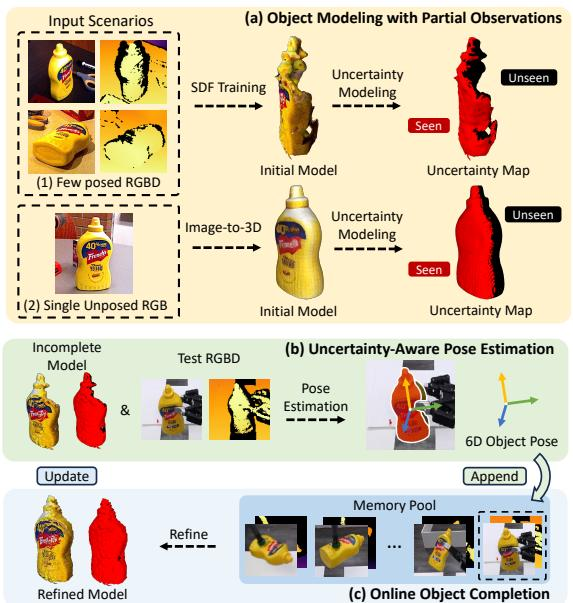
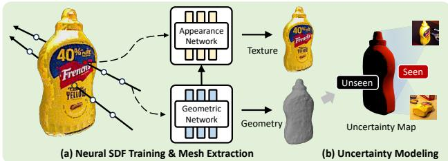
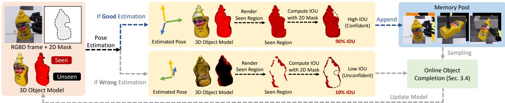
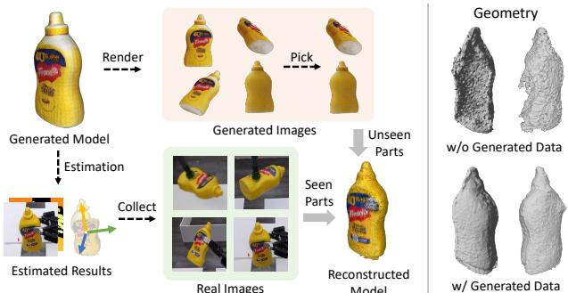
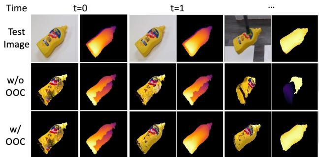

# UA-Pose: Uncertainty-Aware 6D Object Pose Estimation and Online Object Completion with Partial References

Ming-Feng Li1 Xin Yang4 Fu-En Wang4 Hritam Basak2 Yuyin Sun4 Shreekant Gayaka4 Min Sun3,4 Cheng-Hao Kuo4

1Carnegie Mellon University 2Stony Brook University 3National Tsing Hua University 4Amazon

## Abstract

6D object pose estimation has shown strong generalizability to novel objects. However, existing methods often require either a complete, well-reconstructed 3D model or numerous reference images that fully cover the object. Estimating 6D poses from partial references, which capture only fragments of an object’s appearance and geometry, remains challenging. To address this, we propose UA-Pose, an uncertainty-aware approach for 6D object pose estimation and online object completion specifically designed for partial references. We assume access to either (1) a limited set of RGBD images with known poses or (2) a single 2D image. For the first case, we initialize a partial object 3D model based on the provided images and poses, while for the second, we use image-to-3D techniques to generate an initial object 3D model. Our method integrates uncertainty into the incomplete 3D model, distinguishing between seen and unseen regions. This uncertainty enables confidence assessment in pose estimation and guides an uncertainty-aware sampling strategy for online object completion, enhancing robustness in pose estimation accuracy and improving object completeness. We evaluate our method on the YCB-Video, YCBInEOAT, and HO3D datasets, including RGBD sequences ofYCB objects manipulated by robots and human hands. Experimental results demonstrate significant performance improvements over existing methods, particularly when object observations are incomplete or partially captured. Project page: https://minfenli.github.io/UA-Pose/

## 1. Introduction

6D object pose estimation, which determines the rigid 6- degree-of-freedom transformation between an object and a camera, is essential for various real-world applications such as robotic manipulation [17, 38, 39, 49] and augmented reality [22, 29]. Recent research introduced model -based and model-free approaches that can generalize to arbitrary novel objects. These methods push the boundaries of pose estimation for real-world applications and can be divided into two scenarios based on the object information available beforehand. Model-based methods [1, 2, 4, 11, 13, 16, 23, 24, 28] require textured 3D CAD models of the object to estimate 6D object poses in 2D images by establishing 2D-3D correspondences. In contrast, model-free methods leverage a large set of posed reference RGB images [19], RGBD images [10, 41], or video sequences [7, 31] to estimate object poses without the need for CAD models.

  
Figure 1. Overview of UA-Pose. (a) We initialize an incomplete object 3D model M (Sec. 3.2), which is a hybrid mesh that combines texture, geometry, and uncertainty. (b) Given a sequence of RGBD test images, our method estimates the 6D pose of the object in each test image (Sec. 3.3) based on the incomplete model M. (c) While more test images are captured, we store them with estimated poses in a memory pool, which will be used for online object completion (Sec. 3.4) to refine the incomplete model M.

To bridge model-based and model-free methods, FoundationPose [41] proposes a unified framework that supports both model-based and model-free setups, using 3D CAD models or posed RGBD images (referred to as references). While effective in generalizing to novel objects, FoundationPose and similar model-free methods [7, 10, 31] still depend on high-quality 3D models or sufficient posed RGBD images that capture the object from sufficient viewpoints. However, assuming the availability of high-quality 3D models is often impractical due to the vast number of objects that remain uncaptured or unmodeled in real-world environments. Likewise, obtaining adequate posed RGBD images is challenging, as real-world settings frequently involve limited viewpoints, occlusions from nearby objects, and complexities in estimating camera poses in dynamic scenes.

To address these challenges, we present UA-Pose, an uncertainty-aware approach for 6D pose estimation and online object completion as shown in Fig. 1. Our approach is designed to work with partial reference inputs that can include valuable meta-information for robotic tasks, such as grasping patterns, detection markers, or affordance labels. We consider two scenarios: (1) When a limited set of reference RGBD images with known poses is available, we initialize an incomplete 3D model using these images and poses; (2) When only a single unposed RGB image is available, we apply image-to-3D techniques to generate an initial object 3D model for pose estimation. By marking unseen regions as uncertain, we introduce a hybrid representation (Sec. 3.2) that integrates texture, geometry, and uncertainty. The uncertainty is utilized during our proposed uncertainty-aware pose estimation (Sec. 3.3) to provide confidence for estimated poses. Additionally, we propose an uncertainty-aware sampling strategy to select informative images for online object completion, iteratively refining the object 3D model during testing (Sec. 3.4).

We evaluate our approach on the YCB-Video, YCBInEOAT, and HO3D datasets. The results demonstrate significant improvements over existing methods and highlight the applicability of our uncertainty-aware approach in realworld scenarios where fully captured 3D models are often unavailable. To summarize, our contributions are:

• We propose an uncertainty-aware approach for 6D object pose estimation (Sec. 3.3) and online object completion (Sec. 3.4), which improves both pose accuracy and object completeness when only partial references are available.

• We develop a hybrid representation (Sec. 3.2) incorporating uncertainty. The uncertainty enables confidence assessment in pose estimation and supports an uncertaintyaware sampling strategy for online object completion.

• We demonstrate pose estimation from a single RGB image by leveraging single-image-to-3D methods, which generate an initial model for pose estimation and provide augmented data for online object completion (Sec. 3.5).

• Our method supports different partial object references as input, which could be associated to meta-information, making it feasible for real-world applications.

## 2. Related Work

## 2.1. Model-based Object Pose Estimation

Traditional model-based pose estimation methods can be divided into two categories: instance-level [8, 9, 12, 25] and category-level [3, 15, 32, 34, 46, 47]. Both types of methods assume that a textured CAD model of the specific object or similar object categories is available during training. However, these approaches are limited to objects seen during training, significantly restricting their applicability in real-world scenarios where many objects remain unseen or unmodeled. To address this limitation, zero-shot methods have been proposed [2, 11, 13, 16, 28], which estimate the pose of novel objects by providing their CAD models at test time. These methods use object CAD models to either render 2D images for feature matching and 2D-3D correspondence estimation or leverage point clouds from CAD models to estimate 3D-3D correspondences. While these approaches improve generalization to unseen objects, they still require access to high-quality 3D models at test time, which is often impractical in real-world settings.

## 2.2. Model-free Object Pose estimation

Model-free methods eliminate the need for an explicit textured CAD model. Gen6D [19] introduces a pipeline to estimate object poses from RGB images with known poses. However, due to limited training data, Gen6D faces challenges with out-of-distribution test cases and images affected by occlusions. OnePose [31] and its extension OnePose++ [7] use structure-from-motion techniques to reconstruct 3D point clouds from sequential RGB images and employ pre-trained 2D-3D matching networks to estimate the pose of test images. FS6D [10] employs a transformer-based architecture to extract features from multi-view RGBD images for pose estimation. More recently, FoundationPose [41], trained on a large synthetic dataset, presents a unified framework that supports both model-based and model-free setups. In its model-free setting, FoundationPose requires posed reference images that capture the object from sufficient viewpoints to reconstruct 3D models for robust pose estimation. In general, these model-free pose estimation methods rely on either sequential RGB images with known poses or densely posed RGBD images. However, assuming pre-captured posed RGBD images for unseen objects is impractical for two key reasons: first, real-world applications often involve numerous unseen objects, making it infeasible to pre-capture and collect images for each object; and second, even if sufficient images of the novel object are available, accurately estimating camera poses in dynamic environments is challenging.

## 2.3. Object Pose Tracking and Reconstruction

Assuming test images for pose estimation are sequential, 6D object pose tracking methods [36, 40] leverage temporal cues to achieve efficient, smooth, and accurate pose predictions across consecutive frames by estimating relative pose transformations from each frame to the initial frame. For instance, BundleSDF [40] is a 6D pose tracking method that estimates poses from sequential RGBD images while simultaneously training a signed distance field (SDF) [45] representation to maintain consistent pose estimates over time. However, pose tracking methods are constrained to tracking object poses within sequential images from a single video, without support for using reference images for initial pose estimation. In contrast, our method is designed to estimate object poses based on given object references, which may include metadata beneficial for robotic applications, such as grasping patterns, barcodes, or affordance labels.

## 2.4. Single-Image-to-3D and Pose Estimation

Recently, single-image-to-3D methods have been developed to generate 3D models from a single image [18, 20, 21, 26, 27, 33, 43]. These methods offer potential for pose estimation when textured CAD models are unavailable. For instance, GigaPose [23] explored using generated models for pose estimation; however, relying on generated 3D models that are not closely similar to real objects can lead to imprecise pose estimates. To address this, we apply a singleimage-to-3D approach [43] to synthesize a generated model for early pose estimation. As real RGBD images are gradually collected during testing, they are used to create a refined object model, while the generated model from singleimage-to-3D methods is leveraged to produce augmented data to improve object geometry in the uncaptured parts. Incorporating these augmented data into the SDF training yields more complete object models, ultimately improving the robustness and accuracy of pose estimation.

## 3. Method

An overview of our method is illustrated in Fig. 1. We begin by initializing an incomplete object 3D model M using partial references, which can be either: (1) a few reference RGBD images with known poses or (2) a single unposed RGB image of the object. In this work, we propose a hybrid object representation (Sec. 3.2) that integrates texture, geometry, and uncertainty, serving as the incomplete model M for uncertainty-aware pose estimation (Sec. 3.3).

Given a sequence of k RGB test images, $\begin{array} { r l } { \mathcal { T } } & { { } = } \end{array}$ $\{ I _ { 0 } , I _ { 1 } , \ldots , I _ { k - 1 } \}$ , corresponding depth maps , and an initial segmentation mask $m _ { 0 }$ for the object of interest in the first image $I _ { 0 } ,$ , our method estimates the 6D pose of the object $\xi _ { i }$ in each subsequent test image $I _ { i }$ using the proposed uncertainty-aware pose estimation approach (Sec. 3.3), based on the incomplete 3D model M. During testing, newly captured test RGBD images and their estimated poses will be appended to a memory pool. These images will be used for online object completion (Sec. 3.4) to refine the incomplete object 3D model M. Notably, when the input reference is a single unposed RGB image, we employ a single-image-to-3D approach [43] to initialize a generated model Mˆ to assist in pose estimation and object completion. More details are described in Sec. 3.5.

## 3.1. Background: Model-free Pose Estimation

Given RGBD reference images of a novel object and their camera poses, the task of model-free pose estimation is to determine the 6D object poses (i.e., the rigid 6D transformation from the object to the camera) of that novel object in test RGBD images. FoundationPose [41] is a foundational model for 6D pose estimation trained on a large-scale dataset. In the model-free setup, it uses sufficient RGBD reference images (e.g., 16 RGBD images) that fully cover the object to train a Signed Distance Field (SDF) and then extracts a mesh by marching cubes as the 3D object model. Given the 3D object model to render object images, it introduces a two-stage pipeline with two specialized networks: a pose refinement network, which refines pose hypotheses by estimating the relative pose between the test image and rendered object images, and a pose selection network, which identifies the best pose by comparing the test image with rendered images based on these refined poses. However, RGBD reference images that fully represent the object’s appearance and geometry are usually unavailable in real-world scenarios. As a result, model-free methods may struggle to provide accurate pose estimates when only incomplete object models or sparse observations are available.

## 3.2. Hybrid Object Representation

To address the limitations, we introduce a hybrid object representation that integrates the object’s texture, geometry, and uncertainty, as shown in Fig. 2. This uncertainty marks the seen and unseen regions of an incomplete 3D object model and provides confidence in pose estimations, helping to filter out less reliable results. Given a set of RGBD images, object masks, and their camera poses, we train an object-centric neural Signed Distance Field (SDF) [45] to learn the partial object’s appearance and geometry.

We then extract a 3D mesh using the marching cubes algorithm to explicitly model uncertainty. Inspired by Visual Hull [14], we define object uncertainty based on visibility inferred from 2D object masks. By projecting these masks onto the mesh M, we label regions of M seen in the reference images as “certain” and those unseen as “uncertain”, as shown in Fig. 2. This approach allows pose estimation to account for both the seen and unseen parts of the object.

  
Figure 2. Hybrid Object Representation Modeling. We propose a hybrid object representation (Sec. 3.2) that integrates the object’s texture, geometry, and uncertainty. (a) First, a neural SDF is trained and extracted as a mesh representing the object’s appearance and geometry (Sec. 3.2.1). (b) Then, we check the visibility of each mesh vertex from the viewpoint of each reference image to create the uncertainty map (Sec. 3.2.2), which reflects the seen and unseen regions of an incomplete 3D object model.

## 3.2.1 Neural SDF Training and Mesh Extraction

We follow SDF training methods similar to [40, 41] to train a neural SDF for object modeling. The SDF defines the object surface as the set of 3D points:

$$
S = \{ x \in \mathbb { R } ^ { 3 } \mid \varOmega ( x ) = 0 \} .\tag{1}
$$

where $\varOmega : \mathbb { R } ^ { 3 }  \mathbb { R }$ is the SDF geometry function that maps each 3D point x to a signed distance value s and $s = 0$ indicates the object’s surface. Given RGBD images, object masks, and their camera poses, we use a neural SDF to reconstruct the object’s appearance and geometry, represented by two networks [45] as shown in Fig. 2. The geometric network $\varOmega : x \mapsto s$ takes a 3D point $x \in \mathbb { R } ^ { 3 }$ as input and outputs a signed distance value $s \in \mathbb R$ . The appearance network $\varPhi : ( f _ { \varOmega ( x ) } , d ) \mapsto c$ takes an intermediate feature vector $f _ { \varOmega ( x ) }$ from the geometric network along with a view direction d $\mathbf { \epsilon } \in \mathbb { R } ^ { 3 }$ and outputs the color $c \in \mathbb { R } ^ { 3 }$ for the point. Rendering. Given the object pose $\xi ,$ we render an image by casting rays through each pixel. Along each ray $r ,$ 3D points are sampled at multiple positions as follows:

$$
\begin{array} { r } { x _ { i } ( r ) = o ( r ) + t _ { i } d ( r ) , } \end{array}\tag{2}
$$

where $o ( r )$ denotes the ray origin and $d ( r )$ denotes the ray direction from the camera to the object determined by the object pose $\xi .$ The parameter $t _ { i } \in \mathbb { R } _ { + }$ determines the point position along the ray. Following the approach in [40], the color c of a ray r is computed by integrating sampled points near the object surface through volumetric rendering:

$$
c ( r ) = \int _ { z ( r ) - \lambda } ^ { z ( r ) + 0 . 5 \lambda } w ( x _ { i } ) \varPhi ( f _ { \varOmega ( x _ { i } ) } , d ( x _ { i } ) ) d t ,\tag{3}
$$

$$
w ( x _ { i } ) = \frac { 1 } { 1 + e ^ { - \alpha \varOmega ( x _ { i } ) } } \frac { 1 } { 1 + e ^ { \alpha \varOmega ( x _ { i } ) } } ,\tag{4}
$$

where $w ( x _ { i } )$ is a bell-shaped probability density function [35] based on the distance of each point from the implicit object surface and α adjusts the sharpness of the density distribution. $z ( r )$ represents the $\mathrm { r a y } ^ { \prime } \mathrm { s }$ depth from the depth image and λ is the truncation distance. During volumetric rendering, $z ( r )$ and λ are used to exclude 3D points far from the object surface, enhancing rendering efficiency and preventing the SDF from overfitting to empty regions.

During training, we supervise this rendering by comparing it to the reference RGB images with the color loss:

$$
\mathcal { L } _ { c } = \frac { 1 } { \vert \mathcal { R } \vert } \sum _ { r \in \mathcal { R } } \Vert c ( r ) - \bar { c } ( r ) \Vert _ { 2 } ,\tag{5}
$$

where $\bar { c } ( r )$ is the ground-truth color at the pixel through which the ray r passes. For geometry learning, we leverage depth information from the provided depth maps to supervise the neural (SDF) through two losses [40]: the nearsurface loss $\mathcal { L } _ { s }$ and the empty space loss $\mathcal { L } _ { e } , \ \mathcal { L } _ { s }$ encourage the SDF surface to align closely with depth values and $\mathcal { L } _ { e }$ enforces that points along the ray between the camera and the surface remain empty. Additionally, we apply an eikonal regularization loss $\mathcal { L } _ { e i k }$ [5] to the near-surface SDF to enforce smoothness. The total loss is represented as:

$$
\mathcal { L } = w _ { c } \mathcal { L } _ { c } + w _ { e } \mathcal { L } _ { e } + w _ { s } \mathcal { L } _ { s } + w _ { e i k } \mathcal { L } _ { e i k } ,\tag{6}
$$

where $w _ { c } , w _ { e } , w _ { s } ,$ and $w _ { e i k }$ are weighting factors.

To explicitly model uncertainty, we convert the implicit surface defined by the neural SDF into an explicit 3D mesh $\mathcal { E } = ( V , C , F )$ with the vertices $V .$ , vertex colors $C ,$ and faces F. To achieve this, we extract a mesh from the trained neural SDF representation using the marching cubes algorithm, which guarantees a closed-surface mesh including vertices from any viewing angle. This allows us to model the visibility of the object from any viewing angle even if some parts are not visible in the reference images.

Each vertex $v _ { i } \in V$ is assigned a color $c _ { i } \in C _ { : }$ , which is computed using the appearance function \Phi , which maps the intermediate feature vector $f _ { \varOmega ( v _ { i } ) }$ from the geometry network and a view direction $d \in \mathbb { R } ^ { 3 }$ to the RGB color:

$$
c _ { i } = \varPhi ( f _ { \varOmega ( v _ { i } ) } , d ) .\tag{7}
$$

## 3.2.2 Uncertainty Modeling

To model the uncertainty map that represents whether a vertex is visible from the viewpoints of input references, for each vertex $v _ { i } ~ \in ~ V .$ , we check its visibility from the viewpoint of each reference image $\bar { I } _ { j } \in \bar { \mathcal { I } }$ through the mesh rasterization process, which rasterizes 3D vertices onto 2D image pixels. We define an uncertainty score $u ( v _ { i } )$ based on whether $v _ { i }$ is visible from any of the viewpoints in the reference images $\bar { I _ { j } }$ . This uncertainty score $u ( v _ { i } ) \in \{ 0 , 1 \}$ labels vertices on the mesh as “certain” if they are seen in any reference image $( u ( v _ { i } ) = 0 )$ and as “uncertain” if they remain unseen $( u ( v _ { i } ) = 1 )$ . The resulting uncertainty map $\mathcal { U } = \{ u ( v _ { i } ) \mid v _ { i } \in V \}$ is incorporated into our hybrid object representation $\mathcal { M } = ( \mathcal { E } , \mathcal { U } )$ , allowing the pose estimation process to distinguish between seen and unseen regions.

  
Figure 3. Pipeline for Uncertainty-Aware Pose Estimation. Through uncertainty modeling (Sec. 3.2.2), we propose an uncertainty-aware pipeline to assess the confidence of estimated poses (Sec. 3.3). For each estimated pose, we calculate its seen $I o U ,$ which measures the overlap between the seen regions of the 3D model and the 2D object mask for the test image. When seen IoU is high, the pose is deemed confident, and both the pose and its RGBD image are added to the memory pool for object completion. Conversely, if the estimated pose has a low seen IoU, it is considered unreliable. In such cases, we employ an uncertainty-aware image sampling strategy to select images from the memory pool for online object completion (Sec. 3.4), thus enhancing pose estimation by refining the object model during testing.

Guidance from Uncertainty Map. Given an object pose $\xi \in \mathbb { R } ^ { 3 \times 4 }$ , the model M can used to render an RGB image $\bar { I } _ { \xi } ^ { \mathrm { r e n d } } \in \mathbb { R } ^ { H \times W \times 3 }$ , a depth map $D _ { \boldsymbol { \xi } } ^ { \mathrm { r e n d } } \in \mathbb { R } ^ { H \times W }$ , a rendered object mask $m _ { \xi } ^ { \mathrm { r e n d } } \in \{ 0 , 1 \} ^ { H \times W }$ , and an uncertainty map $U _ { \xi } ^ { \mathrm { r e n d } } \in \{ 0 , 1 \} ^ { \bar { H } \times W }$ at a resolution of $H \times W$ . To evaluate the validity and confidence of an estimated pose, we introduce two metrics: uncertainty rate and seen IoU. The uncertainty rate measures the proportion of the uncertain pixels over the total pixels within the rendered object mask:

$$
\frac { \sum ( U _ { \xi } ^ { \mathrm { r e n d } } \odot m _ { \xi } ^ { \mathrm { r e n d } } ) } { \sum ( m _ { \xi } ^ { \mathrm { r e n d } } ) } ,\tag{8}
$$

where ⊙ denotes element-wise logical multiplication. The seen $I o U$ measures the overlap between seen (certain) regions of the rendered object mask and the object mask in the test image, which is defined as:

$$
\mathrm { I o U } ( \lnot U _ { \xi } ^ { \mathrm { r e n d } } \odot m _ { \xi } ^ { \mathrm { r e n d } } , m ^ { \mathrm { t e s t } } ) ,\tag{9}
$$

where $m ^ { \mathrm { t e s t } }$ is the object mask from the test image, $\neg U _ { \xi } ^ { \mathrm { r e n d } } ( \cdot )$ $m _ { \xi } ^ { \mathrm { r e n d } }$ identifies “certain” pixels within the rendered object mask, and IoU represents the Intersection over Union function. Since pose estimation is more robust when based on seen regions of the 3D model, a high seen IoU indicates high confidence in the pose estimation, whereas a low seen IoU suggests that the estimation is not reliable.

## 3.3. Uncentainty-aware Pose Estimation

After modeling the uncertainty, the hybrid object representation could be used in our uncertainty-aware pose estimation pipeline, as shown in Fig. 3. In this work, we leverage the pose refinement and the pose selection modules of [41] and assume that the test images are sequential. To obtain per-frame 2D object masks in test images for calculating the uncertainty rate and seen $I o U ,$ given first frame object mask $m _ { 0 }$ , the object masks of the following frames $\{ m _ { 1 } , m _ { 2 } , \dots , m _ { k - 1 } \}$ is determined by off-the-shelf segmentation methods [44].

Pose Initialization. Given an RGBD video, object masks for each frame, and an incomplete object model M, we begin by estimating the object pose for the first frame by generating multiple pose hypotheses. For each hypothesis, the translation is initialized using the 3D point projected from the center of the 2D object mask, determined by the median depth value within this region. For rotation, we uniformly sample $N _ { v }$ viewpoints from an icosphere centered on the object and orient the camera to face the object’s center. Subsequently, $N _ { i n }$ in-plane rotations are sampled and applied to each viewpoint, yielding $N _ { v } \cdot N _ { i n }$ hypothesized object poses. Each object pose can be represented as $[ R | t ] \in \mathbb { S E } ( 3 )$ , where $R \in \mathbb { S O } ( 3 )$ is the rotation and $\pm \in \mathbb { R } ^ { 3 }$ is the translation.

Pose Refinement. After generating $N _ { v } \cdot N _ { i n }$ pose hypotheses, we apply the refinement module [41] to improve pose accuracy. Specifically, given a rendered RGBD image of the object from each pose hypothesis and the test RGBD image of the target object, the network outputs a pose update $\varDelta R \in \mathbb { S O } ( 3 )$ and $\varDelta t \in \mathbb { R } ^ { 3 }$ to refine the pose hypothesis, aligning it more closely with the observed object pose in the test image. Each refined pose is represented as $[ R ^ { + } | t ^ { + } ] \in \mathbb { S E } ( 3 )$ , where $\pmb { t } ^ { + } = \pmb { t } + \Delta \pmb { t }$ and $R ^ { + } = \varDelta R \otimes R$ This refinement process could be iteratively repeated. In this work, each pose is refined five times for pose estimation on the first frame and twice for subsequent frames.

Pose Selection. Given a set of refined pose hypotheses, we apply our proposed metrics (Sec. 3.2.2) to filter out unreliable poses: the uncertainty rate, which measures the proportion of uncertain pixels within the rendered object mask, and the seen IoU, which quantifies the overlap between previously seen (certain) regions of the object and the object mask in the test image. A pose hypothesis is discarded when its uncertainty rate is above the threshold $T _ { u }$ or its seen IoU is below the threshold $T _ { s } ,$ ensuring that only reliable hypotheses that adequately cover seen object regions are considered. At last, we use the pose selection module [41] to identify the most accurate pose as the final estimate.

Pose Tracking. Given the sequential nature of RGBD video frames, object poses in adjacent frames are typically similar. For each frame following the initial one, we take the estimated pose from the previous frame as the sole pose hypothesis and refine it using the pose refinement module to generate the estimated pose for the current frame. This iterative process continues across the video sequence, leveraging temporal cues for stable and smooth pose estimation. Memory Pool. To enhance pose estimation by completing the object model during testing, we select test RGBD images with their estimated poses to incrementally refine the object representation. For efficiency, we introduce a memory pool $\mathcal { P } = \{ \xi _ { 0 } , \xi _ { 1 } , \xi _ { 2 } , . . . , \xi _ { | \mathcal { P } | - 1 } \}$ that stores the most informative |P| viewpoints to maintain a compact yet diverse set of test image frames for object completion, where $\xi _ { i }$ is the estimated pose corresponding to a test image $I _ { i } .$ The first frame $\xi _ { i }$ is automatically added to $\mathcal { P } _ { \cdot }$ , establishing the canonical coordinate system for the novel object. Subsequent frames are added when their viewpoints contribute to the multi-view diversity in the pool. Specifically, before adding a new frame, we calculate the rotational geodesic distance between the new frame and the last frame added to the pool. A frame is included in $\mathcal { P }$ only if this geodesic distance exceeds a threshold $T _ { g e o } ,$ ensuring that each frame offers a unique viewpoint to enhance model completeness while keeping $\mathcal { P }$ compact. Note that not all estimated poses are reliable, adding inaccurate results to the memory pool may cause noisy SDF training during object completion. To mitigate this, we introduce an image-filtering strategy to filter out low-confidence estimations. As illustrated in Fig. 3, when a pose is estimated, its confidence is evaluated using our proposed metric, seen IoU, which measures the overlap between the seen regions of the 3D model and the 2D object mask in the test image. Since a high seen IoU indicates greater confidence in an estimated pose, frames are added to the memory pool only if their seen IoU exceeds a threshold $T _ { c o n f } .$ , ensuring that low-confidence poses are excluded.

## 3.4. Uncentainty-aware Object Completion

As shown in Fig. 3, online object completion is triggered when the seen IoU of the current test frame falls below a threshold $T _ { c o m p l e t e }$ , indicating that the current pose estimation may no longer be reliable. As new frames are continuously added, the memory pool $\mathcal { P }$ can grow excessively large, which may reduce SDF training efficiency. To manage this, we perform uncertainty-aware sampling to select the K most informative frames for object completion.

Uncertainty-aware Sampling. Early in the video sequence, when $| { \mathcal { P } } | \leq K$ , all frames in the pool are included without selection. However, once the pool size exceeds $K ,$ we apply an uncertainty-aware image selection strategy to maximize the coverage of unseen object regions. This process selects a subset, $\mathcal { P } ^ { ' } \subset \mathcal { P }$ , that reveals the most unseen areas of the object. The selection process begins by including the initial and most recent frames in the pool to establish the starting and ending viewpoints. Next, an iterative strategy is employed: at each iteration, we select the pose that reveals the largest unseen region. This continues until K poses are selected.

  
Figure 4. Pipeline for leveraging generated models. In Sec. 3.5, the initial model generated by image-to-3D techniques is used to estimate poses for the first few frames. As more frames are captured, a refined object model is trained to replace the initial generated model, resulting in a more complete representation. To further leverage the generated 3D model, we render RGBD images from the image-to-3D generated model as augmented data for SDF training. This supervision enhances the object geometry in unseen regions, providing more complete information for pose estimation.

## 3.5. Leveraging Image-to-3D Generation

Given a single unposed RGB image, we employ imageto-3D techniques to generate an initial object 3D model Mˆ for pose estimation. The viewpoint associated with the initial RGB image is labeled as “certain,” while other areas that are inferred by the image-to-3D method are marked “uncertain”. The generated model is then rescaled to align with the object size in the test images. Specifically, we use the depth map and object mask from the first frame of the test image to approximate a rough model size. We then sample slightly larger and smaller models, generate pose hypotheses, and employ the pose selection module [41] to select the optimal pose hypothesis and corresponding model size.

Refer to Fig. 4, the initial generated model is used to estimate poses for the first few test frames until the rotational geodesic distance between the initial pose and a new estimated pose exceeds a threshold $T _ { g e n } .$ As more frames are captured, a refined object model is trained to replace the initial generated model, resulting in a more complete representation. To further leverage the generated 3D model, we render RGBD images from the image-to-3D generated model as augmented data for SDF training. This supervision enhances the object geometry in unseen regions, providing more complete information for pose estimation. See the supplementary materials for additional details.

## 4. Experiment

## 4.1. Datasets

YCB-Video [42]: The YCB-Video dataset contains RGBD video sequences of everyday objects from the YCB objects, widely used for benchmarking 6D object pose estimation.

YCBInEOAT [37]: YCBInEOAT extends the YCB-Video dataset with RGBD sequences of YCB objects manipulated by a dual-arm robot. This dataset focuses on real-world scenarios involving robot-object interactions.

HO3D [6]: The HO3D (Hand-Object 3D) dataset contains RGBD sequences of human hands interacting with objects, capturing complex hand-object interactions and occlusions.

## 4.2. Experimental setup

Baselines. We evaluate our method against state-of-the-art RGBD model-free 6D pose estimation methods [10, 30, 41] under two scenarios where partial object references are given as (1) A limited set of reference RGBD images (2 views) that include known poses. (2) A single unposed RGB object image. In scenario (2), we leverage image-to-3D techniques [43] to generate an initial object 3D model and iteratively estimate the object pose during testing.

Metrics. We consider ADD and ADD-S metrics for 6D pose estimation, which measure the accuracy of estimated poses. The Area Under the Curve (AUC) is calculated and reported for both the ADD and ADD-S metrics, following the protocols in [40–42]. Furthermore, to demonstrate the effectiveness of our method for online object completion, we report the Chamfer Distance (CD), which measures the average distance between points of the reconstructed model and the ground-truth model.

## 4.3. Comparison Results on YCB-Video

We first evaluate UA-Pose on the YCB-Video [42] dataset, a widely used benchmark for 6D pose estimation, and compare our approach with state-of-the-art model-free methods [10, 30, 41] with a limited set of reference images.

As presented in Tab. 1, our method significantly outperforms FoundationPose [41] with only 2 reference images in all metrics. Moreover, both our method and FoundationPose outperforms LoFTR [30] and FS6D-DPM [10] with 16 reference images with a large margin. This shows that FoundationPose is the strongest baseline for our further analysis. When only a single unposed RGB image of the object is available, we apply a single-image-to-3D approach [43] to generate an initial 3D model for pose estimation. Experimental results, shown in Tab. 1, indicate that directly using the generated model with Foundation-Pose may not yield optimal results, as these models may not accurately represent real objects. In contrast, UA-Pose uses the generated model only for initial pose estimation and for rendering RGBD images as augmented data to aid object completion, as described in Sec. 3.5. This approach reconstructs a model more closely aligned with the real object, leading to improved pose estimation accuracy.

Table 1. Quantitative results on the YCB-Video dataset. “Comp.” indicates whether the method includes online completion, and “-” denotes that the method does not reconstruct object shapes. Results for [10, 30] are adopted from [41]. Experiments for ”single RGB + Image-to-3D” are conducted on a subset of the YCB-Video dataset. See supplementary materials for details.
<table><tr><td></td><td>Input</td><td>Comp.</td><td>Mean ADD ADD-S</td><td>CD</td></tr><tr><td>LoFTR [30]</td><td>16 references</td><td>No</td><td>26.2 52.5</td><td>=</td></tr><tr><td>FS6D-DPM [10]</td><td>16 references</td><td>No</td><td>42.1 88.4</td><td>=</td></tr><tr><td>FoundationPose [41]</td><td>2 references</td><td>No</td><td>87.4 94.3</td><td>0.57</td></tr><tr><td>Ours</td><td>2 references</td><td>Yes</td><td>92.8 96.5</td><td>0.53</td></tr><tr><td>FoundationPose [41]</td><td>single RGB + Image-to-3D</td><td>No</td><td>88.9 93.6</td><td>0.67</td></tr><tr><td>Ours</td><td>single RGB + Image-to-3D</td><td>Yes</td><td>93.2 96.9</td><td>0.62</td></tr></table>

Table 2. Quantitative results on the YCBInEOAT dataset. “Comp.” indicates that the method performs online completion.
<table><tr><td></td><td>Input</td><td>Comp.</td><td>Mean ADD ADD-S</td><td>CD</td></tr><tr><td>FoundationPose [41]</td><td>2 references</td><td>No</td><td>68.52 84.80</td><td>0.60</td></tr><tr><td>Ours</td><td>2 references</td><td>Yes</td><td>89.99 94.35</td><td>0.57</td></tr><tr><td>FoundationPose [41]</td><td>single RGB + Image-to-3D</td><td>No</td><td>83.39 90.66</td><td>0.61</td></tr><tr><td>Ours</td><td>single RGB + Image-to-3D</td><td>Yes</td><td>89.24 93.99</td><td>0.60</td></tr></table>

## 4.4. Comparison Results on YCBInEOAT

We evaluated UA-Pose on the YCBInEOAT [37] dataset to assess its performance in challenging robotic scenarios in real-world where objects are manipulated by robotic arms.

In Table 2, when 2 reference images are provided, UA-Pose demonstrates superior performance compared to FoundationPose, highlighting the effectiveness of our uncertainty-aware mechanisms and online object completion for robust pose estimation in robotic scenarios. As illustrated in Fig. 5, simply using the incomplete model generated from the partial references often leads to inaccurate estimations. In contrast, our method achieves robust pose estimation with uncertainty-aware mechanisms and online object completion. When only a single unposed RGB image of the object is available, UA-Pose also consistently surpasses FoundationPose across all metrics. This demonstrates the flexibility of UA-Pose to utilize diverse partial references, which could carry useful meta-information.

## 4.5. Comparison Results on HO3D

We evaluated UA-Pose on the HO3D dataset to assess its effectiveness in complex hand-object interaction scenarios where objects are frequently rotated and occluded.

As shown in Tab. 3, when 2 reference images are provided, FoundationPose fails to make accurate estimations when objects in the test video exhibit frequent and strong rotations. In contrast, UA-Pose accurately estimates object poses under the challenging hand-object interaction scenarios. As for utilizing the generated models from the single-image-to-3D approach for pose estimation, UA-Pose achieves more accurate estimations than FoundationPose. Note that even if the generated models in Tab. 3 show lower Chamfer Distance (CD) than refined models obtained from object completion, directly using generated models for FoundationPose results in considerably lower ADD and ADD-S. This indicates that even though generated models have good geometry (low CD), geometry alone cannot accurately represent real objects for pose estimation because the textures of generated models are not good enough in unseen areas that are not covered by the initial partial references.

  
Figure 5. Qualitative comparison on the YCBInEOAT. Object image (left) and depth map (right) pairs are rendered based on the estimated object poses using the incomplete model. Without uncertainty-aware mechanisms and Online Object Completion (referred to as “w/o OOC”), the incomplete model often leads to inaccurate estimations. In contrast, our method (referred to as “w/ OOC”) achieves robust pose estimation by incorporating uncertainty-aware mechanisms and online object completion.

## 4.6. Ablation Study

Key Components. Tab. 4 presents an ablation study for key components of UA-Pose on the YCBInEOAT dataset. All experiments start with the initialized model based on two reference images and are evaluated using ADD, ADD-S, and CD. Additionally, we report $N _ { r e b u i l d }$ , the total number of times object completion is applied across test sequences to refine the incomplete model M. The “w/o object completion” setup disables online object completion, illustrating its importance for achieving accurate pose estimation. In “w/o uncertainty-aware object completion”, object completion is applied every time a new test image is added to the memory pool, instead of completing the model only when the seen IoU threshold is below $T _ { c o m p l e t e }$ . This leads to poorer performance and a higher $N _ { r e b u i l d }$ count, increasing unnecessary computation for object completion. The “w/o image-filtering strategy” experiment omits the imagefiltering strategy (Sec. 3.3) for excluding unreliable poses, allowing low-confidence poses to be added to the memory pool and resulting in decreased pose accuracy. In “w/o uncertainty-aware sampling”, we use the geodesic distancebased sampling strategy from [40] instead of our proposed uncertainty-aware sampling strategy (Sec. 3.4) to sample images for object completion. The results demonstrate our proposed sampling method is better at selecting informative images for accurate pose estimation. Finally, the “Ours (full)” setup that incorporates all our key components achieves the best performance across ADD, ADD-S, CD, and the fewest $N _ { r e b u i l d }$ for object completion.

Table 3. Quantitative results on the HO3D dataset. “Comp.” indicates that the method performs online completion.
<table><tr><td></td><td>Input</td><td>Comp.</td><td>Mean ADD ADD-S</td><td>CD</td></tr><tr><td>FoundationPose [41]</td><td>2 references</td><td>No</td><td>45.67 61.57</td><td>0.78</td></tr><tr><td>Ours</td><td>2 references</td><td>Yes</td><td>91.51 95.56</td><td>0.69</td></tr><tr><td>FoundationPose [41]</td><td>single RGB + Image-to-3D</td><td>No</td><td>72.06 87.87</td><td>0.76</td></tr><tr><td>Ours</td><td>single RGB + Image-to-3D</td><td>Yes</td><td>83.23 93.59</td><td>0.88</td></tr></table>

Table 4. Ablation study. We demonstrate the importance of UA-Pose’s key components on the YCBInEOAT dataset.
<table><tr><td rowspan="2"></td><td colspan="3">Mean</td><td rowspan="2"> $N _ { r e b u i l d }$ </td></tr><tr><td>ADD</td><td>ADDS</td><td>CD</td></tr><tr><td>w/o object completion</td><td>68.52</td><td>84.80</td><td>0.60</td><td>4</td></tr><tr><td>w/o uncertainty-aware object completion</td><td>85.83</td><td>92.39</td><td>0.72</td><td>181</td></tr><tr><td>w/o image-filtering strategy</td><td>87.70</td><td>93.37</td><td>0.71</td><td>87</td></tr><tr><td>w/o uncertainty-aware sampling</td><td>87.88</td><td>93.39</td><td>0.68</td><td>59</td></tr><tr><td>Ours (full)</td><td>89.99</td><td>94.35</td><td>0.57</td><td>58</td></tr></table>

Table 5. Additional study. We compare our method with FoundationPose [41] and pose tracking methods [36, 40] on the YCBInEOAT dataset. “Comp.” means the method performs online completion, and “\*” denotes using cropped ground-truth meshes [40], which exclude invisible parts in the test sequence, to calculate CD.
<table><tr><td></td><td>Input</td><td>Comp.</td><td>ADD</td><td>Mean ADD-S</td><td>CD</td></tr><tr><td>BundleTrack [36]</td><td>first-frame RGBD</td><td>No</td><td>87.34</td><td>92.53</td><td>2.81*</td></tr><tr><td>BundleSDF [40]</td><td>first-frame RGBD</td><td>Yes</td><td>86.95</td><td>93.77</td><td>1.16*</td></tr><tr><td>FoundationPose [41]</td><td>first-frame RGBD</td><td>No</td><td>74.34</td><td>84.58</td><td>1.12*</td></tr><tr><td>Ours</td><td>first-frame RGBD</td><td>Yes</td><td>88.38</td><td>93.82</td><td>0.75*</td></tr></table>

Additional Study. When no external reference images are available, we demonstrate that we could initialize the object model for pose estimation using the first frame of the test RGBD image sequence. Besides the strongest model-free pose estimation baseline [41], we also compare our method with strong model-free pose tracking approaches [36, 40, 48] on the YCBInEOAT dataset. Refer to Tab. 5, our method achieves the highest performance across ADD, ADD-S, and CD metrics. Note that unlike pose-tracking methods which are limited to estimating relative poses from sequential frames within the same RGBD video, our method can incorporate object reference images as input for useful meta-information.

## 5. Conclusion

We introduced UA-Pose, an uncertainty-aware approach for 6D object pose estimation that addresses the limitations of previous model-free methods in the scenarios in which input object references are incomplete or partially captured. Incorporating mechanisms to handle uncertainty and leverage online object completion to complete object models, our method demonstrates substantial performance improvements on the YCB-Video, YCBInEOAT, and HO3D datasets. We demonstrate UA-Pose is a robust solution for practical real-world applications where full 3D object models and extensive image references are usually unavailable.

## References

[1] Philipp Ausserlechner, David Haberger, Stefan Thalhammer, Jean-Baptiste Weibel, and Markus Vincze. Zs6d: Zero-shot 6d object pose estimation using vision transformers. ICRA, 2024. 1

[2] Andrea Caraffa, Davide Boscaini, Amir Hamza, and Fabio Poiesi. Freeze: Training-free zero-shot 6d pose estimation with geometric and vision foundation models. ECCV, 2024. 1, 2

[3] Dengsheng Chen, Jun Li, Zheng Wang, and Kai Xu. Learning canonical shape space for category-level 6D object pose and size estimation. In CVPR, 2020. 2

[4] Jianqiu Chen, Zikun Zhou, Mingshan Sun, Rui Zhao, Liwei Wu, Tianpeng Bao, and Zhenyu He. Zeropose: Cadprompted zero-shot object 6d pose estimation in cluttered scenes. TCSVT, 2024. 1

[5] Amos Gropp, Lior Yariv, Niv Haim, Matan Atzmon, and Yaron Lipman. Implicit geometric regularization for learning shapes. In ICML, 2020. 4

[6] Shreyas Hampali, Mahdi Rad, Markus Oberweger, and Vincent Lepetit. Honnotate: A method for 3d annotation of hand and object poses. In CVPR, 2020. 7

[7] Xingyi He, Jiaming Sun, Yuang Wang, Di Huang, Hujun Bao, and Xiaowei Zhou. OnePose++: Keypoint-free oneshot object pose estimation without CAD models. NeurIPS, 2022. 1, 2

[8] Yisheng He, Wei Sun, Haibin Huang, Jianran Liu, Haoqiang Fan, and Jian Sun. PVN3D: A deep point-wise 3D keypoints voting network for 6DoF pose estimation. In CVPR, 2020. 2

[9] Yisheng He, Haibin Huang, Haoqiang Fan, Qifeng Chen, and Jian Sun. FFB6D: A full flow bidirectional fusion network for 6D pose estimation. In CVPR, 2021. 2

[10] Yisheng He, Yao Wang, Haoqiang Fan, Jian Sun, and Qifeng Chen. Fs6d: Few-shot 6d pose estimation of novel objects. In CVPR, 2022. 1, 2, 7

[11] Junwen Huang, Hao Yu, Kuan-Ting Yu, Nassir Navab, Slobodan Ilic, and Benjamin Busam. Matchu: Matching unseen objects for 6d pose estimation from rgb-d images. In CVPR, 2024. 1, 2

[12] Yann Labbe, Justin Carpentier, Mathieu Aubry, and Josef´ Sivic. CosyPose: Consistent multi-view multi-object 6D pose estimation. In ECCV, 2020. 2

[13] Yann Labbe, Lucas Manuelli, Arsalan Mousavian, Stephen´ Tyree, Stan Birchfield, Jonathan Tremblay, Justin Carpentier, Mathieu Aubry, Dieter Fox, and Josef Sivic. MegaPose: 6D pose estimation of novel objects via render & compare. In CoRL, 2022. 1, 2

[14] Aldo Laurentini. The visual hull concept for silhouette-based image understanding. IEEE TPAMI, 1994. 3

[15] Taeyeop Lee, Jonathan Tremblay, Valts Blukis, Bowen Wen, Byeong-Uk Lee, Inkyu Shin, Stan Birchfield, In So Kweon, and Kuk-Jin Yoon. TTA-COPE: Test-time adaptation for category-level object pose estimation. In CVPR, 2023. 2

[16] Jiehong Lin, Lihua Liu, Dekun Lu, and Kui Jia. Sam-6d: Segment anything model meets zero-shot 6d object pose estimation. In CVPR, 2024. 1, 2

[17] Jian Liu, Wei Sun, Chongpei Liu, Xing Zhang, and Qiang Fu. Robotic continuous grasping system by shape transformerguided multi-object category-level 6d pose estimation. IEEE Transactions on Industrial Informatics, 2023. 1

[18] Ruoshi Liu, Rundi Wu, Basile Van Hoorick, Pavel Tokmakov, Sergey Zakharov, and Carl Vondrick. Zero-1-to-3: Zero-shot one image to 3d object. In ICCV, 2023. 3

[19] Yuan Liu, Yilin Wen, Sida Peng, Cheng Lin, Xiaoxiao Long, Taku Komura, and Wenping Wang. Gen6D: Generalizable model-free 6-DoF object pose estimation from RGB images. ECCV, 2022. 1, 2

[20] Yuan Liu, Cheng Lin, Zijiao Zeng, Xiaoxiao Long, Lingjie Liu, Taku Komura, and Wenping Wang. Syncdreamer: Learning to generate multiview-consistent images from a single-view image. ICLR, 2024. 3

[21] Xiaoxiao Long, Yuan-Chen Guo, Cheng Lin, Yuan Liu, Zhiyang Dou, Lingjie Liu, Yuexin Ma, Song-Hai Zhang, Marc Habermann, Christian Theobalt, and Wenping Wang. Wonder3d: Single image to 3d using cross-domain diffusion. CVPR, 2024. 3

[22] Eric Marchand, Hideaki Uchiyama, and Fabien Spindler. Pose estimation for augmented reality: A hands-on survey. TVCG, 2015. 1

[23] Van Nguyen Nguyen, Thibault Groueix, Mathieu Salzmann, and Vincent Lepetit. Gigapose: Fast and robust novel object pose estimation via one correspondence. CVPR, 2024. 1, 3

[24] Evin Pınar Ornek, Yann Labb¨ e, Bugra Tekin, Lingni Ma,´ Cem Keskin, Christian Forster, and Tomas Hodan. Foundpose: Unseen object pose estimation with foundation features. ECCV, 2024. 1

[25] Kiru Park, Timothy Patten, and Markus Vincze. Pix2Pose: Pixel-wise coordinate regression of objects for 6D pose estimation. In ICCV, 2019. 2

[26] Guocheng Qian, Jinjie Mai, Abdullah Hamdi, Jian Ren, Aliaksandr Siarohin, Bing Li, Hsin-Ying Lee, Ivan Skorokhodov, Peter Wonka, Sergey Tulyakov, and Bernard Ghanem. Magic123: One image to high-quality 3d object generation using both 2d and 3d diffusion priors. ICLR, 2024. 3

[27] Ruoxi Shi, Hansheng Chen, Zhuoyang Zhang, Minghua Liu, Chao Xu, Xinyue Wei, Linghao Chen, Chong Zeng, and Hao Su. Zero123++: a single image to consistent multi-view diffusion base model. arXiv preprint arXiv:2310.15110, 2023. 3

[28] Ivan Shugurov, Fu Li, Benjamin Busam, and Slobodan Ilic. OSOP: A multi-stage one shot object pose estimation framework. In CVPR, 2022. 1, 2

[29] Yongzhi Su, Jason Rambach, Nareg Minaskan, Paul Lesur, Alain Pagani, and Didier Stricker. Deep multi-state object pose estimation for augmented reality assembly. In ISMAR-Adjunct, 2019. 1

[30] Jiaming Sun, Zehong Shen, Yuang Wang, Hujun Bao, and Xiaowei Zhou. Loftr: Detector-free local feature matching with transformers. In CVPR, 2021. 7

[31] Jiaming Sun, Zihao Wang, Siyu Zhang, Xingyi He, Hongcheng Zhao, Guofeng Zhang, and Xiaowei Zhou. OnePose: One-shot object pose estimation without CAD models. In CVPR, 2022. 1, 2

[32] Meng Tian, Marcelo H Ang, and Gim Hee Lee. Shape prior deformation for categorical 6D object pose and size estimation. In ECCV, 2020. 2

[33] Vikram Voleti, Chun-Han Yao, Mark Boss, Adam Letts, David Pankratz, Dmitry Tochilkin, Christian Laforte, Robin Rombach, and Varun Jampani. Sv3d: Novel multi-view synthesis and 3d generation from a single image using latent video diffusion. In ECCV, 2025. 3

[34] He Wang, Srinath Sridhar, Jingwei Huang, Julien Valentin, Shuran Song, and Leonidas J Guibas. Normalized object coordinate space for category-level 6D object pose and size estimation. In CVPR, 2019. 2

[35] Peng Wang, Lingjie Liu, Yuan Liu, Christian Theobalt, Taku Komura, and Wenping Wang. NeuS: Learning neural implicit surfaces by volume rendering for multi-view reconstruction. In NeurIPS, 2021. 4

[36] Bowen Wen and Kostas Bekris. Bundletrack: 6d pose tracking for novel objects without instance or category-level 3d models. In IROS, 2021. 3, 8

[37] Bowen Wen, Chaitanya Mitash, Baozhang Ren, and Kostas E Bekris. se (3)-tracknet: Data-driven 6d pose tracking by calibrating image residuals in synthetic domains. In IROS, 2020. 7

[38] Bowen Wen, Wenzhao Lian, Kostas Bekris, and Stefan Schaal. CatGrasp: Learning category-level task-relevant grasping in clutter from simulation. In ICRA, 2022. 1

[39] Bowen Wen, Wenzhao Lian, Kostas Bekris, and Stefan Schaal. You only demonstrate once: Category-level manipulation from single visual demonstration. RSS, 2022. 1

[40] Bowen Wen, Jonathan Tremblay, Valts Blukis, Stephen Tyree, Thomas Muller, Alex Evans, Dieter Fox, Jan Kautz,¨ and Stan Birchfield. Bundlesdf: Neural 6-dof tracking and 3d reconstruction of unknown objects. In CVPR, 2023. 3, 4, 7, 8

[41] Bowen Wen, Wei Yang, Jan Kautz, and Stan Birchfield. Foundationpose: Unified 6d pose estimation and tracking of novel objects. CVPR, 2024. 1, 2, 3, 4, 5, 6, 7, 8

[42] Yu Xiang, Tanner Schmidt, Venkatraman Narayanan, and Dieter Fox. Posecnn: A convolutional neural network for 6d object pose estimation in cluttered scenes. RSS, 2018. 7

[43] Jiale Xu, Weihao Cheng, Yiming Gao, Xintao Wang, Shenghua Gao, and Ying Shan. Instantmesh: Efficient 3d mesh generation from a single image with sparse-view large reconstruction models. arXiv preprint arXiv:2404.07191, 2024. 3, 7

[44] Jinyu Yang, Mingqi Gao, Zhe Li, Shang Gao, Fangjing Wang, and Feng Zheng. Track anything: Segment anything meets videos. arXiv preprint arXiv:2304.11968, 2023. 5

[45] Lior Yariv, Yoni Kasten, Dror Moran, Meirav Galun, Matan Atzmon, Basri Ronen, and Yaron Lipman. Multiview neural surface reconstruction by disentangling geometry and appearance. NeurIPS, 2020. 3, 4

[46] Ruida Zhang, Yan Di, Fabian Manhardt, Federico Tombari, and Xiangyang Ji. SSP-Pose: Symmetry-aware shape prior deformation for direct category-level object pose estimation. In IROS, 2022. 2

[47] Linfang Zheng, Chen Wang, Yinghan Sun, Esha Dasgupta, Hua Chen, Ales Leonardis, Wei Zhang, and Hyung Jinˇ Chang. HS-Pose: Hybrid scope feature extraction for category-level object pose estimation. In CVPR, 2023. 2

[48] Zihan Zhu, Songyou Peng, Viktor Larsson, Weiwei Xu, Hujun Bao, Zhaopeng Cui, Martin R Oswald, and Marc Pollefeys. Nice-slam: Neural implicit scalable encoding for slam. In CVPR, 2022. 8

[49] Chungang Zhuang, Shaofei Li, and Han Ding. Instance segmentation based 6d pose estimation of industrial objects using point clouds for robotic bin-picking. Robotics and Computer-Integrated Manufacturing, 2023. 1