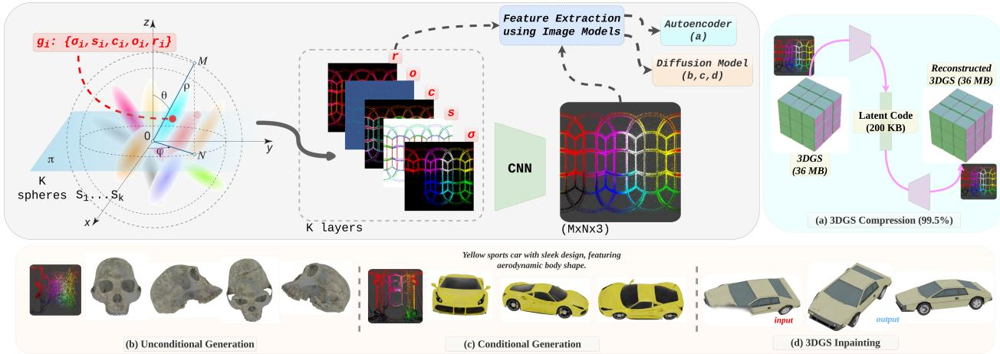
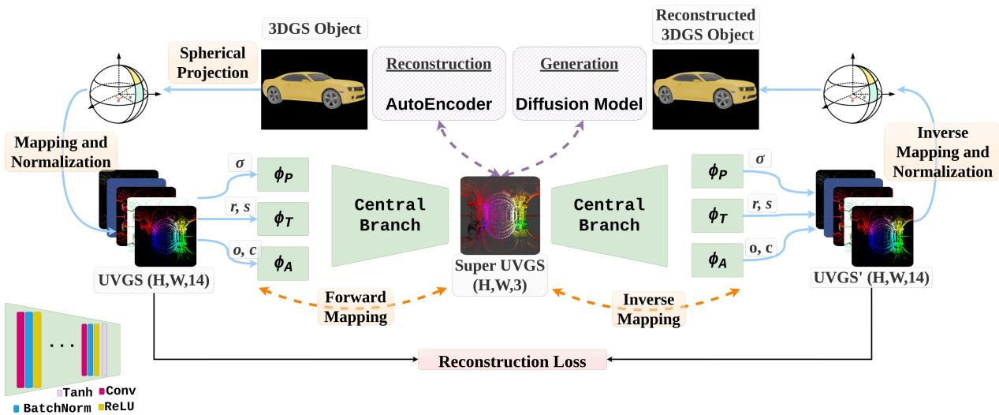
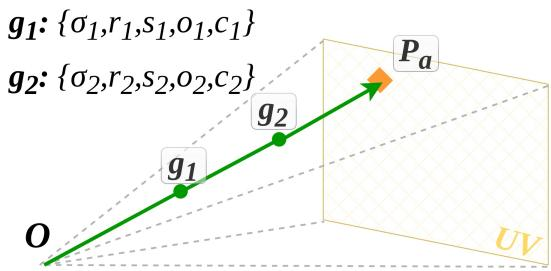
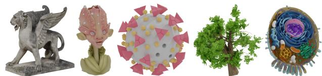
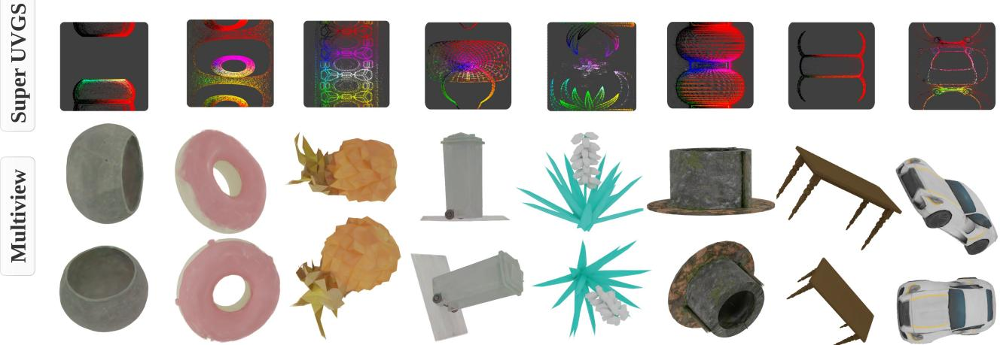
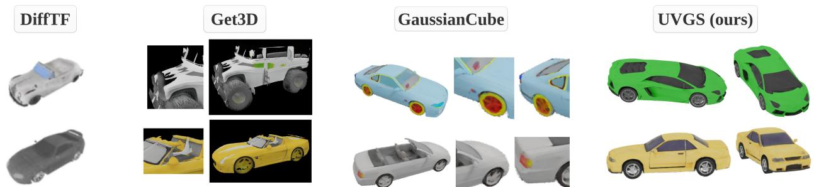
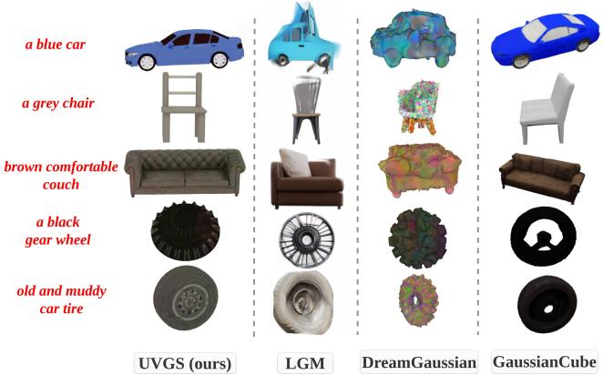
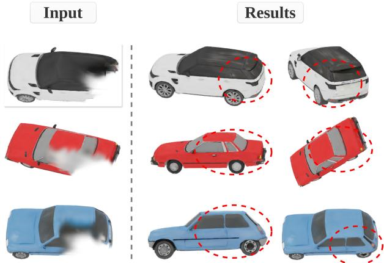

https://aashishrai3799.github.io/uvgs

# UVGS: Reimagining Unstructured 3D Gaussian Splatting using UV Mapping

Aashish Rai1,2 Dilin Wang2 Mihir Jain2 Nikolaos Sarafianos2 Kefan Chen1,2 Srinath Sridhar1 Aayush Prakash2

1Brown University

2Meta Reality Labs

  
Figure 1. We propose UVGS - an structured image-like representation for 3DGS obtained by spherical mapping of its primitives. The obtained UVGS maps can be further unified to a 3-channel Super UVGS image to bridging the gap between 3DGS and existing image foundation models. We show Super UVGS can compress the 3DGS assets using pretrained image Autoencoders, and for direct unconditional and conditional 3DGS object generation using diffusion models. We also present one of the first experiments on 3DGS inpainting.

## Abstract

3D Gaussian Splatting (3DGS) has demonstrated superior quality in modeling 3D objects and scenes. However, generating 3DGS remains challenging due to their discrete, unstructured, and permutation-invariant nature. In this work, we present a simple yet effective method to overcome these challenges. We utilize spherical mapping to transform 3DGS into a structured 2D representation, termed UVGS. UVGS can be viewed as multi-channel images, withfeature dimensions as a concatenation of Gaussian attributes such as position, scale, color, opacity, and rotation. We further find that these heterogeneous features can be compressed into a lower-dimensional (e.g., 3-channel) shared feature space using a carefully designed multi-branch network. The compressed UVGS can be treated as typical RGB images. Remarkably, we discover that typical VAEs trained with latent diffusion models can directly generalize to this new representation without additional training. Our novel representation makes it effortless to leverage foundational 2D models, such as diffusion models, to directly model 3DGS. Additionally, one can simply increase the 2D UV resolution

to accommodate more Gaussians, making UVGS a scalable solution compared to typical 3D backbones. This approach immediately unlocks various novel generation applications of 3DGS by inherently utilizing the already developed superior 2D generation capabilities. In our experiments, we demonstrate various unconditional, conditional generation, and inpainting applications of 3DGS based on diffusion models, which were previously non-trivial.

## 1. Introduction

The creation of high-quality 3D content is essential in applications like virtual reality, game design, robotics, and movie production, where realistic 3D representations play a critical role. Typical 3D representations like Neural Radiance Fields (NeRF) [25] are promising but require substantial computational resources, limiting their scalability for realtime applications. Moreover, NeRF is an implicit representation, which makes editing and manipulation challenging. Recently, 3D Gaussian Splatting (3DGS) [17] emerged as a compelling alternative, enabling efficient and high-fidelity 3D rendering through a large set of Gaussian primitives that model spatial and visual properties. As an explicit representation, 3DGS offers several advantages over NeRF. However, while 3DGS offers benefits in terms of speed and visual quality, its unstructured, permutation-invariant nature presents significant challenges for generative tasks. Much like point clouds, it lacks a coherent spatial structure, impeding its integration with conventional image-based generative models. This lack of structure and coherence among primitives hinders the application of image-based generative models [23, 55, 61], which rely on structured data representations.

Previous methods have tackled these challenges by transforming 3DGS into structured formats, such as voxel grids [8, 14, 55] or image-based representations like Splatter Image [40] or triplanes [64]. Other approaches employ diffusion models to directly predict 3DGS attributes [28]. These methods, while achieving impressive visual results, often require substantial computational resources, memoryintensive multi-view rendering, complex architectures limiting their scalability and flexibility for high-fidelity generation. Generating and processing 3DGS directly by efficiently utilizing modern generative models like Variational Autoencoders (VAEs) and diffusion models is limited as the neural networks are not permutation invariant.

To address these shortcomings, we introduce UV Gaussian Splatting (UVGS), which provides a structured transformation of 3D Gaussian primitives into a 2D representation while preserving essential 3D information. We use spherical mapping [37] that inscribes Gaussian splats in a spherical surface, and projects attributes like position, rotation, scale, opacity, and color into an organized 14-channel image-like UV map. This mapping introduces spatial structure, resolving issues of permutation invariance by introducing local correspondences between neighboring Gaussians and global coherence across the entire 3D object. The result is a representation that functions as a “3D representation” structured in a 2D map format, enabling compatibility with powerful image-based neural network architectures.

While UVGS introduces structure into 3D Gaussian Splatting, its full 14-channel attribute-specific representation presents challenges for direct integration with pretrained 2D generative models, as these models typically expect a simpler, image-compatible data. Each of its heterogeneous attributes—position, color, and transformation—has its own distinct distribution and resides in a separate feature space, making it challenging to represent the 3D object in a unified shared space. To address this, we introduce Super UVGS, a compact 3-channel representation that unifies these diverse attributes into a cohesive format. Using a carefully designed multi-branch mapping network, Super UVGS consolidates the distinct attribute spaces into a shared feature space, enabling a more collective representa tion of the object. This unified transformation not only facilitates zero-shot compatibility with pretrained 2D models but also optimizes memory usage and computational efficiency, making Super UVGS highly practical for large-scale 3D tasks. Unlike previous approaches that use Triplanes, voxels, occupancy grid, neural fields etc. and require specialized 3D architectures to train on 3D data, UVGS effortlessly leverages widely available pretrained 2D foundational models. This zero-shot generalization capability allows UVGS to fully benefit from priors learned in 2D domains from large amount of data, improving both flexibility and scalability. To sum up our main contributions are:

• Efficient Structured Representation of 3DGS: We present UVGS, an image-like representation that solves permutation invariance and unstructured nature of discrete 3DGS through spherical mapping, making direct feature extraction possible by organizing unordered points into a coherent 2D representation compatible with 2D models.

• Compact and Scalable Super UVGS Representation: To address scalability while dealing with large scale 3DGS points and enabling the direct integration of pre-trained 2D foundation models, we introduce Super UVGS - a low-dimensional version of UVGS maps that retains high fidelity features while reducing memory overhead.

• Diverse 3D Applications: Our approach unlocks seamless integration of 3DGS with pre-trained 2D foundation models for various tasks, including unconditional and conditional generation of 3DGS.

## 2. Related Work

3D Generative/Reconstruction Models for Objects: Generation or reconstruction of 3D assets has been a long standing task [3, 21, 24, 26, 27, 31, 34, 35, 39, 41, 43, 50, 54]. Previous reconstruction approaches like NeRF [1, 25] are often slow and do not provide a defining geometry [5, 11, 16, 20, 22, 24, 32, 35, 48, 60, 62]. Advancements in the field led to the emergence of explicit voxel grid based representations that encode colors and opacities directly [8, 29, 45]. These approaches achieve significant speed ups compared to the NeRF based approaches, but they can’t produce high fidelity assets due to the low resolution of voxel grids. On the other hand, triplane representation [13, 38, 47, 63] provides a trade-off between the quality and memory utilization. Another line of work [10, 53] splits the input mesh into different patches and simplifies the object generation problem to an image generation problem. However such methods rely on either cutting through the mesh to create a geometry image [10] or rely on an existing UV representation of the geometry and utilize subset of existing UV islands [53] resulting in loss of details. Recently, there has been a notable advancement in 3D Gaussian Splatting (3DGS) for the representation of objects and scenes leding to the emergence of 3DGS showcasing impressive real-time results in reconstruction and generation tasks [14, 17, 19, 30, 42, 49, 51, 52, 54, 56, 63]. Recent advances in the 3D generative models for asset synthesis using the existing geometries like NeRF, voxel grids, or triplane geometries [2, 12, 42, 52, 56, 63] leverage generative models [15, 36] and the existing 3D datasets [4, 9]. However, most of the works employing 3DGS or other representations use multiview rendering and Score Distillation Sampling (SDS) to achieve convincing generation and reconstruction capabilities [7, 31]. These approaches demand high memory and compute resources and are often quite slow in optimizing due to per scene optimization.

  
Figure 2. The input 3DGS object is first converted to UVGS maps through spherical mapping. We use a multibranch forward mapping network to convert the obtained 14-channel UVGS to a compact 3-channel Super UVGS image. This represents the 3DGS object in a structured manner and can be used with image foundation models for reconstruction or generation. The Super UVGS is mapped back to UVGS through branched inverse mapping, which in turn can be reconstructed back to the 3DGS object through inverse spherical mapping

Giving Structures to Discrete Gaussians: Although, 3DGS has led to breakthrough in the reconstruction field by demonstrating superior performance in multiple domains, the generation of 3DGS directly remains challenging due to its discreteness and unstructured nature [55, 61]. These characteristics present substantial challenges when integrating them with conventional computer vision models, like Autoencoders and generative models [61]. The research in direct learning of trained 3DGS primitives is largely unexplored [23]. Some efforts attempt to address this by directly predicting 3DGS attributes using diffusion models [28] while others like Splatter Image [40] project Gaussian objects into image-based representations through direct 3D-unaware projection. These methods struggle with maintaining multiview consistency, as the model only infers seen poses correctly, while hallucinating for unseen poses.

Concurrent works [14, 55] follow the voxel-based representations to transport Gaussians into structural voxel grids with volume generation models for generating Gaussians. However, these methods are computationally expensive for high-resolution voxels, face difficulties in preserving highquality Gaussian reconstructions due to information loss during voxelization. DiffGS [61] tries to solve the above issues by proposing three continuous functions to represent 3DGS. However, it is limited to only category-level generation and learning generic probability functions for all the categories poses significant compute and design challenges. In contrary, we introduce an efficient way to give structures to discrete Gaussians by taking inspiration from the developments in 3D graphics. Our method does not require any learning to map an unstructured set of Gaussians to this efficient and structured representation (termed UVGS). The proposed representation provides local and global correspondence among different Gaussian points making the widely available existing computer vision frameworks learn and extract underlying features from them.

## 3. Methodology

Preliminaries: 3DGS represents an object or a scene with a collection of Gaussians primitives to model the geometry and view-dependent appearance. For a 3DGS set, $G ~ = ~ \{ g _ { i } \} _ { i = 1 } ^ { N }$ , representing an object with N individual Gaussians, the geometry of the $i ^ { t h }$ Gaussian is explicitly parameterized via 3D covariance matrix $\Sigma _ { i }$ and it’s center $\sigma _ { i } \ \in \ \mathbb { R } ^ { 3 } \ { \mathrm { ~ a s : } } \qquad g _ { i } ( x ) \ = \ e ^ { ( - { \frac { 1 } { 2 } } ( x - \sigma _ { i } ) ^ { T } \Sigma ^ { - 1 } ( x - \sigma _ { i } ) ) }$ where, the covariance matrix $\Sigma _ { i } ~ = ~ r _ { i } s _ { i } s _ { i } ^ { T } r _ { i } ^ { T }$ is factorized into a rotation matrix $r _ { i } ~ \in { \mathbb { R } } ^ { 4 }$ and a scale matrix $s _ { i } ~ \in ~ \mathbb { R } ^ { 3 }$ The appearance of the $i - t h$ Gaussian is represented by a color value $c _ { i } \in \mathbb { R } ^ { 3 }$ and an opacity value $o _ { i } ~ \in ~ R$ . In practice, the color is represented by a series of Spherical Harmonics (SH) coefficients, but for simplicity, we represent the view-independent color by just RGB values. Thus, a single Gaussian can be represented by a set of five attributes as $g _ { i } = \{ \sigma _ { i } , r _ { i } , s _ { i } , o _ { i } , c _ { i } \} \in \mathbb { R } ^ { 1 4 }$ , and the entire 3DGS can be represented by a set of N such Gaussians as: $G = \{ \{ \sigma _ { i } , r _ { i } , s _ { i } , o _ { i } , c _ { i } \} \} _ { i = 1 } ^ { N }$

## 3.1. Spherical Mapping

3DGS is represented as a permutation invariant set with no structural correspondence among different Gaussians $g _ { i } ,$ making it challenging to extract meaningful features from this set containing a few hundred thousands of them using neural networks. To address this, we introduce a novel representation that gives structure to this unstructured set of points and solves the permutation invariance issue for faster and better feature extraction. We propose to accomplish this by employing spherical mapping to map the 3DGS primitives to an image-like representation that is both invariant to random shuffling of 3DGS points and well structured.

We begin the mapping by inscribing the 3DGS object into a sphere with the same center as the object in the canonical space. Inscribing a 3DGS object into a sphere involves enclosing the object within a sphere. This begins by determining the geometric center of the object. The next step is to calculate the radius of the sphere, which is achieved by measuring the Euclidean distance from the center to the farthest point on the object. The radius of the sphere is defined such that the sphere fully encloses the object. The sphere acts as a bounding volume for the entire object.

We consider each Gaussian $g _ { i }$ in 3D to be centered at the mean position represented by $\sigma _ { i }$ with Cartesian coordinates $( x _ { i } , y _ { i } , z _ { i } )$ . The aim is to get the spherical coordinates $( \rho _ { i } , \theta _ { i } , \phi _ { i } )$ for each Gaussian $g _ { i } .$ . To do so, we calculate the azimuthal $\theta _ { i }$ and polar $\phi _ { i }$ angles for each $g _ { i }$ along with the distance from the origin to the point, $\rho _ { i }$ . The spherical radius is defined as $\rho _ { i } = \sqrt { x _ { i } ^ { 2 } + y _ { i } ^ { 2 } + z _ { i } ^ { 2 } }$ , the azimuthal angle as $\theta _ { i } = \tan ^ { - 1 } ( y _ { i } , x _ { i } )$ , while the polar angle as $\phi _ { i } = \cos ^ { - 1 } ( z _ { i } , \rho _ { i } )$ . The azimuthal and polar angles are then normalized, such that we can map them on a 2D UV map of $M \times N$ dimensionality with 14-channels. $\theta _ { i }$ and $\phi _ { i }$ are converted to degrees and mapped to UV image coordinates: $\begin{array} { r } { \theta _ { i \mathrm { \ s c a l e d } } = \left\lfloor \frac { \pi + \theta _ { i } } { 2 \pi } \times \mathbf { M } \right\rfloor } \end{array}$ ， $\begin{array} { r } { \phi _ { i \mathrm { ~ s c a l e d } } = \left| \frac { \phi _ { i } } { \pi } \times \mathbf { N } \right| } \end{array}$ Each channel in the UV map stores 3DGS attributes, including $\{ \sigma _ { i } , \ r _ { i } , \ s _ { i } , \ o _ { i } , \ c _ { i } \} \in \mathbb { R } ^ { 1 4 }$ . We refer this 14-channel UV map as $U V G S , U \in \mathbb { R } ^ { M \times N \times 1 4 }$ defined as:

$$
\mathbf { U } [ \phi _ { i { \mathrm { ~ s c a l e d } } } , \theta _ { i { \mathrm { ~ s c a l e d } } } , : ] = [ \sigma _ { i } , \ r _ { i } , \ s _ { i } , \ o _ { i } , \ c _ { i } ] .\tag{1}
$$

This transformed UVGS representation provides spatial coherence and solves the permutation invariance problem as any random arrangement of points will now map to the same UVGS representation U. It should be noted that this kind of transformation will also preserve the spatial correlation between the Gaussian points in 3D and transform them to 2D UV maps by mapping them to neighboring pixels. This provides both the local level correspondence among the neighboring Gaussians and the overall global correspondence for the object. Thus, solving the unstructured and discreteness problems. This enables standard neural network architectures (e.g. CNNs) to effectively capture correlations among neighboring Gaussians for efficient feature extraction.

  
Figure 3. Dynamic Selection. In spherical mapping of 3DGS points to UV maps, multiple points may map to the same pixel, creating a many-to-one issue. Our Dynamic Selection approach addresses this by retaining the attributes of the point with the highest opacity per pixel on the same ray.

To further unify the extracted position (σ), transformation $( r , s )$ , and color $( c , o )$ maps in a same feature space and use the existing image foundation models, we map the obtained UVGS $\bar { U } \in \bar { \mathbb { R } ^ { M \times N \times 1 4 } }$ further to a 3-channel image $S \in \mathbb { R } ^ { M \times N \times 3 }$ (termed as Super UVGS), using a Convolutional Neural Network (CNN). A multi-branch forward mapping network is employed to map $U \in \mathbb { R } ^ { M \times N \times 1 4 }$ to the 3-channel Super UVGS $S \in \mathbb { R } ^ { M \times N \times 3 }$ . We provide all technical details in Sec. 3.3 and the supplementary material.

The Super UVGS representation effectively retains all the details of 3DGS attributes and can be directly utilized with existing widely available image-based models. We demonstrate this by showing perfect reconstruction of 3DGS object from Super UVGS image in the experiments section. This semantically structured representation S offers both local and global correspondence in representing Gaussian attributes and needs relatively less storage.

## 3.2. Dynamic GS Selection and Multiple Layers

When projecting 3DGS points to UV maps using spherical mapping, multiple points may map to the same pixel in UV space as shown in Fig. 3. Two 3DGS points $\left( g _ { 1 } \right)$ and $\left( g _ { 2 } \right)$ map to the same pixel on UV map $( P _ { a } )$ causing many-to-one mapping issue. To address this, we propose a Dynamic Selection approach where each UV pixel retains the 3DGS attribute with the highest opacity intersecting the same ray. Using the same example in Fig. 3, if opacity $o _ { 1 }$ of Gaussian $g _ { 1 }$ is less than opacity $o _ { 2 }$ of $g _ { 2 }$ . Then only g2 will be stored in the UV map at pixel $P _ { a }$ . We observed that this method helps maintain the geometry and appearance of the 3DGS object while resolving many-to-one mapping issues with minimal quality loss. For more complex objects or real-world scene representation, we stack multiple such layers of UV maps, where each UVGS pixel now holds attributes of the top-K opacity values of 3DGS primitives. This can be accomplished by inscribing the 3DGS object inside multiple spheres where each sphere maps the 3DGS attribute corresponding to the top- $K ^ { t h }$ opacity value along the same ray. More details on this are presented in the supplementary. To show the effectiveness of proposed UVGS maps in capturing the intricacies of a complex objects, we used a pretrained image based autoencoder to reconstruct objects using a 4 layer UVGS as shown in Fig. 4.

  
Figure 4. Complex object reconstructions (K=4) using pretrained image-based autoencoder.

## 3.3. Mapping Networks

Our goal is to bring the extracted UVGS maps to a common feature space to better represent the object collectively and to make the 14-channel UVGS representations $U ~ \in ~ \mathbb { R } ^ { M \times N \times 1 4 }$ work with the widely available image based foundation models. To accomplish this, we map it to a 3-channel image which can be easily processed by the existing architectures while also maintaining the spatial correspondence. We design a simple yet effective multi-branch CNN to extract features from different UVGS attributes and map them to a 3-channel feature-rich image, termed Super UVGS. The structured UVGS maps provides local and global features that can be learned by a CNN.

Forward Mapping The first layer is a set of three mapping branches for position, transform, and appearance $( \phi _ { P } ^ { f } , \ \phi _ { T } ^ { f } , \ \phi _ { A } ^ { f } )$ respectively. We refer to them as position, transformation, and appearance branch. The position branch takes the mean position (σ) as an input and processes it to give a position feature map $M _ { P }$ . Similarly, the transformation branch takes the rotation (r) and scale (s) together to generate another feature map $M _ { T }$ . The last, appearance branch takes the color (c) and opacity (o) together to produce another feature map $M _ { A }$ . All the three features maps from position, transformation, and appearance branch are concatenated to get a final feature map, before passing them to the next module, called the Central Branch. The central branch $( \phi _ { C } ^ { f } )$ is composed of multiple hidden Convolution layers, where each layer is followed by BatchNorm and ReLu activation. The last layer of the central branch is activated using tanh to ensure the Super UVGS does not take any ambiguous value resulting in gradient explosion or undesired artifacts. The obtained Super UVGS S representation squeezes all the 3DGS attributes to a 3 dimensional image while also maintaining local and global structural correspondence among them.

Inverse Mapping We design an inverse mapping network that aims to map the obtained 3-channel Super UVGS image $S \in \mathbb { R } ^ { M \times \hat { N ^ { \times 3 } } }$ back to the UVGS maps to obtain each of the five different 3DGS attributes $\{ \sigma , \ r , \ s , \ o , \ c \}$ . The inverse mapping network simply follows the forward mapping network architecture in the reverse order, where at first, we put the Central Branch $( \phi _ { i C } )$ followed by attribute specific position, transformation, and appearance branches $( \phi _ { i P } , \phi _ { i T } , \phi _ { i A } )$ . We provide more details on mapping network in the supplementary.

Branched mapping layers: The rationale behind using branched mapping layers in both forward and reverse mapping networks is to prevent the incompatibility issues arising due the the different value distribution of 3DGS attributes. Note that the disparate distributions of values within each set of attributes in 3D Gaussian Splatting, $( i . e . ,$ mean position, transformation, and color), pose a challenge to the model when processed collectively. For instance, neighboring Gaussians in UVGS maps show smooth changes in position and color values but typically have large variations in rotation, scale, and opacity values. This results in gradient anomalies and slow convergence. To address this, we propose a multi-branch network architecture, where attribute-specific branches implicitly learn to process these distinct attribute specific properties, focusing on their unique features before passing them to the central branch. The central branch receives a concatenated stack of processed attributes and exploits the correlation between them by extracting local feature correspondences. This information is then mapped to a 3-channel Super UVGS image, effectively capturing the complex relationships between the various attributes. This approach enables our network to manage diverse attribute distributions, resulting in faster convergence, improved accuracy, and specialized processing for each attribute set.

Reconstruction Losses: Since the obtained UVGS maps have both local and global features, we opted for imagebased losses to train the overall architecture. We use a set of Mean Squared Error (MSE) and Learned Perceptual Image Patch Similarity (LPIPS) [59] between the obtained UVGS from spherical mapping U and the predicted UVGS Uˆ from inverse mapping network. We calculate the LPIPS loss over four attributes of 3DGS including mean position $( \sigma )$ , view independent color (c), scale (s), and rotation (r). The overall LPIPS loss for UV maps can be written as a linear sum of individual attribute loss terms as:

$$
\mathcal { L } _ { U V - l p i p s } = \mathcal { L } _ { \sigma } + \mathcal { L } _ { s } + \mathcal { L } _ { r } + \mathcal { L } _ { c }\tag{2}
$$

The overall loss function for the training can be written as: $\mathcal { L } _ { u v g s } = \mathcal { L } _ { m s e } + \lambda . \mathcal { L } _ { U V - l p i p s }$ where λ is a scalar and varied from 0 to 10 during the course of training.

## 4. Experiments

3DGS Dataset and UV maps To train the mapping networks and learn a latent space for unconditional and conditional sampling, we need large amount of 3DGS assets. However, there’s a lack of such a large-scale dataset for high quality 3DGS assets. To this end, we create a custom large scale dataset by converting the Objaverse [9] meshes into 3DGS representation 1. We start by designing a scene of 88 cameras in a canonical space and use it to capture Objaverse objects from various angles covering all of the object views. The 88 rendered views from different angles are then used to train a 3DGS for 10K iterations using [17]. This way, we create a high-quality and large-scale 3DGS dataset of ∼400K objects and scenes from Objaverse. We only use static scenes or objects from Objaverse. After fitting all the object to 3DGS representation, we convert the objects to the corresponding UV maps (i.e., UVGS) through Spherical Mapping as illustrated in Fig. 2. For the course of our experiments, we only map the objects to a single layer UV maps as it was sufficient to represent the general purpose Objaverse objects with minimal quality loss. Through map ping, we gathered a UVGS dataset of ∼400K maps. We fix the size of the UVGS maps to 512 × 512. Through our experiments, we found that UV maps of size 512 × 512 are sufficient to represent objects in our dataset and capable of storing upto 262K unique Gaussians. Table 1 compares 1-4 layer UV maps. We also did experiments on ShapeNet [4] cars dataset for evaluation purposes.

  
Figure 5. Figure shows a wide variety of high-quality unconditional generation result from our method using Latent Diffusion Model. We train an LDM to randomly sample Super UVGS images from random noise. The Super UVGS can be converted to 3DGS object using inverse mapping network and inverse spherical projection. The unconditional generation model was trained on Objaverse dataset.

Baselines & Metrics: To evaluate the quality of reconstructed 3DGS objects from both Super UVGS image and Autoencoder latent space to 3D, we use PSNR and LPIPS [58]. The aim is to convert the given 3DGS object to UVGS, and then to Super UVGS, and further to Autoencoder’s latent space and calculate the metrics from the reconstructions at every step to prove the proposed method doesn’t significantly affect the quality of reconstructions, while also providing a structurally meaningful representation that is much compact and easier to use with existing image based models. We compare the generational capabilities of our method against various conditional and unconditional SOTA 3D object generation method including the ones using multiview rendering for optimization DiffTF [2], Get3D [12], methods trying to give structural representation to Gaussians, GaussianCube [55], and general purpose SOTA large 3D content generation models like DreamGaussian [42], LGM [44], and EG3D [3]. We also compare the quality of our generation results using FID and KID.

Table 1. PSNR and LPIPS comparison for various reconstruction methods using UVGS and Super UVGS representations on Objaverse Cars and Full datasets. AE, VAE, VQVAE are pretrained image based models. K is the number of UVGS layers used. We also report the compression % (CP) compared to the fitted 3DGS.
<table><tr><td>Method</td><td>|PSNR(C/F)|LPIPS(C/F)|CP(%)</td><td></td><td></td></tr><tr><td>3DGS UVGS (@K=1) UVGS (@K=2)</td><td>34.6 / 34.2 31.3 / 31.1 32.8 / 31.9</td><td>0.02 / 0.02 0.06 / 0.06 0.04 / 0.05</td><td>0 53.0 45.6</td></tr><tr><td>UVGS (@K=4) Super UVGS (@K=1)</td><td>34.2 / 33.2</td><td>0.02 / 0.03</td><td>33.3</td></tr><tr><td></td><td>31.2 / 31.1</td><td>0.07 / 0.08</td><td>89.7</td></tr><tr><td>AE (@K=1)</td><td>30.9 / 30.8</td><td>0.07 / 0.09</td><td>99.5</td></tr><tr><td>VAE (@K=1)</td><td>30.6 / 30.9</td><td>0.07 / 0.09</td><td>99.5</td></tr><tr><td>VQVAE (@K=1)</td><td>30.3 / 30.1</td><td>0.08 / 0.10</td><td>99.7</td></tr></table>

Mapping Network Training Details We train the forward and inverse mapping networks to project the obtained UVGS maps $U \in \mathbb { R } ^ { \breve { M } \times N \times 1 4 }$ to Super UVGS image $S \in \mathbb { R } ^ { M \times N \times 3 }$ , and back to the reconstructed UVGS maps $\hat { U } \in \mathbb { R } ^ { M \times N \times 1 4 }$ . We provide an in-depth discussion of all implementation details in the supplementary material.

## 4.1. UVGS AutoEncoder and 3DGS Compression

The obtained Super UVGS image is a structurally meaningful representation that can have various applications in the generation and reconstruction of new 3D assets as it contains features that can be learned by the existing image based models. Through our experiments, we show that a 3- channel Super UVGS image can be directly reconstructed using a pretrained image based Autoencoders or VAEs without any fine-tuning. We tested on three different models including image AE, KL-VAE [18], VQVAE [46] and each performed quite well without any significant quality loss. The reconstruction PSNR and LPIPS values are presented in Table 1. This means we can now leverage the powerful compression capabilities of image based Autoencoders to compress the storage requirements of 3DGS by more than 99%. We have shows the storage comparison results in Table 1. It is interesting to note that the Super UVGS representation itself can be used to compress the memory requirement for storing 3DGS object by up to 89.7%.

  
Figure 6. Comparison of unconditional 3D asset generation on the cars category with SOTA methods. Figure shows that DiffTF [2] produces low-quality, low-resolution cars lacking detail. While Get3D [12] achieve higher resolution, it suffers from 3D inconsistency, numerous artifacts, and lacks 3D detail. Similar issues are found in GaussianCube [55] along with symmetric inconsistency in the results. In contrast, our method generates high-quality, high-resolution objects that are 3D consistent with sharp and well-defined edges.

  
Figure 7. We compare the performance of our model against various SOTA methods for text-conditional object synthesis. Our method not only generates high-quality assets for simpler objects, but also for complicated objects with intricate geometry.

## 4.2. Unconditional & Conditional Generation

We aim to show the effectiveness of Super UVGS representation for directly generating 3DGS objects from a learned latent space. We consider Super UVGS images as a compact and structured proxy for representing 3DGS objects as it maintains the 3D object information while also providing learnable features. The existing methods fail to directly generate a large number of Gaussians (e.g. 100K+) to represent objects with sufficient quality either due to the lack of 3D generative model architectures that support such large number of unstructured points, or due to the lack of a large 3DGS dataset [28, 40, 44, 55, 63]. We leverage the

Super UVGS representation and use the existing 2D image generative models like Diffusion Models [15] for this task. Specifically, to train a generative model capable of randomly sampling new high-quality 3DGS assets for various downstream tasks, we use an unconditional Latent Diffusion Model (LDM) [36] on the obtained Super UVGS images. As illustrated in Section 4.1, we can use a pretrained image VAE to map the Super UVGS image to a latent space and reconstruct back. Hence, we only train a LDM on the latent space. More implementation details are provided in the supplementary.

Unconditional LDM: To design a generative model capable of randomly sampling new high-quality 3DGS assets for various downstream tasks, we train an unconditional LDM [36] on the learned Super UVGS images. Following [33, 36, 57], we use DDIM [15] for faster and consistent sampling with up to 1000 time steps used in the forward diffusion process, and 20 during denoising. Once trained, the model is used to randomly sample Super UVGS images, resulting in high quality 3DGS assets through inverse mapping. Results are presented in Fig 5. We demonstrate that our method inherently learns to generate multiview consistent images due to the powerful Super UVGS representation unlike most prior works using rendering-based losses.

Conditional LDM: Similar to unconditional generation, we also trained a text-conditioned LDM following the SD’s [33, 36, 57] pipeline and using the predicted text for our dataset. The trained model can be used to generate high-quality text-conditioned 3DGS assets that are multiview consistent. The results are demonstrated in Fig 6.

The above experiments proves the effectiveness of our proposed Super UVGS representation in 3D object synthesis using widely available 2D image models. It also highlights that this compact 3-channel Super UVGS representation stores not just the spatial correspondence among different pixels, but also the rich 3D information of the objects. This way, we can easily convert a 3D asset generation problem into a 2D image generation problem without the use of any complex 3D architecture to handle large amount of unstructured and permutation invariant 3DGS primitives, and neither relying upon computationally expensive multiview rendering or SDS loss. Baseline comparison for unconditional and conditional generation is presented in Table 2.

  
Figure 8. 3DGS Inpainting: We present one of the first inpainting results on 3DGS directly leveraging the Super UVGS images and the denoising capabilities of diffusion models.

## 4.3. 3DGS Inpainting

Leveraging the powerful Super UVGS representation, we present in Fig. 8 one of the first experiments on inpainting 3DGS directly without using any multiview rendering or distilling information from diffusion models. We try to recover the missing Gaussians by leveraging the denoising capabilities of LDM and trying to predict the missing corresponding parts of the Super UVGS image. We believe, this can have potential applications in sparse view reconstruction. More details are given in the supplementary.

## 4.4. Ablation Studies & Discussion

We conduct exhaustive ablation studies to justify some of our framework’s design choices including the effect of branching in mapping networks, the use of single layer UVGS maps, and the resolution of UVGS maps. We performed our experiments on our custom Objaverse [9] 3DGS dataset and evaluate the performance of our model in terms of PSNR, SSIM, and LPIPS. The results are presented in Table 3. From the table, it can be seen that by using four layers of UVGS maps (K=4), we can almost match the reconstruction quality of fitted 3DGS results, while we realized that simply with a single layer UVGS, we are able to maintain the overall geometry and appearance of the object for our dataset with a PSNR of more than 30. We also compared the reconstruction performance of our method with and without using branching in the mapping network. It can be clearly seen that using branching network significantly increases the reconstruction quality from Super UVGS space. The main reasoning behind this is the specialization of attributes that the branching provides to individually process each attribute first.

Table 2. We compare the FID and KID of unconditional generation using the current SOTA methods on 20K randomly generated samples from each method and ours. We also compare our method against SOTA text-conditioned generation frameworks on CLIP Score for 10K generated objects from each method.
<table><tr><td colspan="2">Unconditional Generation</td><td colspan="2">Text-Conditioned Generation</td></tr><tr><td>Method</td><td>|FID ↓ KID ↓||Method</td><td></td><td>CLIP Score ↑</td></tr><tr><td>Get3D [12]</td><td>53.17 4.19</td><td>DreamGaussian [42]</td><td>28.51</td></tr><tr><td>DiffTF [2]</td><td>84.57 8.73</td><td>Shap. E [6]</td><td>30.53</td></tr><tr><td>EG3D [3]</td><td>74.51 6.62</td><td>LGM [44]</td><td>30.74</td></tr><tr><td>GaussianCube</td><td>34.67 3.72</td><td>GaussianCube [55]</td><td>30.34</td></tr><tr><td>UVGS (Ours)</td><td>26.20 3.24</td><td>UVGS (Ours)</td><td>32.62</td></tr></table>

Table 3. We present quantitative ablation study for number of UVGS layers (K), UVGS map resolution, and the effect of branching in mapping network on the Objaverse 3DGS dataset.
<table><tr><td>Method</td><td></td><td>PSNR LPIPS|UVGS Size</td><td>PSNR LPIPS</td><td></td></tr><tr><td>UVGS @K = 1|</td><td>31.1</td><td>0.06</td><td> $\lvert 5 1 2 \times 5 1 2 \left( \oplus K = 1 \right) \rvert$ </td><td>31.1 0.08</td></tr><tr><td>UVGS @K = 2</td><td>31.9</td><td>0.05</td><td> $\big | 2 5 6 \times 2 5 6 ( \oplus K = 1 )$ </td><td>28.2 0.23</td></tr><tr><td>UVGS @K = 4</td><td>33.2</td><td>0.03</td><td>Without Branching</td><td>27.8 0.31</td></tr></table>

Limitations & Future Work: While single layer UVGS images can recover the geometry of the object, they sometimes suffer in terms of appearance and the generated objects might look washed out. We believe this can be solved by using a multi-layer UVGS maps. Similarly, the single layer UVGS map is limited to representing simpler everyday objects, and may not be sufficient to represent highlydetailed and complex objects or scenes. In the future, we want to extend this framework to learn features for realworld scenes and complex objects like a human head with multi-layer UV mapping. We also want to make this representation more efficient by better utilizing the empty pixels of UVGS maps and Super UVGS images while also maintaining the underlying features and 3D information.

## 5. Conclusion

We introduced a novel method to solve the underlying issues with 3D Gaussian Splatting (3DGS) that prevent the direct integration of them with the large number of existing image foundational models. We proposed UVGS - a structured representation for 3DGS obtained by spherical mapping of 3DGS primitives to UV maps. We further squeezed the multi-attribute UVGS maps to a 3-channel unified and structured Super UVGS image, which not only maintains the 3D structural information of the object, but also provides a compact feature space for 3DGS attributes. The obtained Super UVGS images are directly integrated with the existing image foundational models for 3DGS compression and unconditional and conditional generation using diffusion models. Leveraging these Super UVGS images, we showed one of the first inpainting experiments on 3DGS.

ACKNOWLEDGEMENTS A part of this work was supported by NSF CAREER grant 2143576 and ONR DURIP grant N00014-23-1-2804.

## References

[1] Jonathan T Barron, Ben Mildenhall, Matthew Tancik, Peter Hedman, Ricardo Martin-Brualla, and Pratul P Srinivasan. Mip-nerf: A multiscale representation for anti-aliasing neural radiance fields. In Proceedings of the IEEE/CVF international conference on computer vision, pages 5855–5864, 2021. 2

[2] Ziang Cao, Fangzhou Hong, Tong Wu, Liang Pan, and Ziwei Liu. Large-vocabulary 3d diffusion model with transformer. arXiv preprint arXiv:2309.07920, 2023. 3, 6, 7, 8

[3] Eric R Chan, Connor Z Lin, Matthew A Chan, Koki Nagano, Boxiao Pan, Shalini De Mello, Orazio Gallo, Leonidas J Guibas, Jonathan Tremblay, Sameh Khamis, et al. Efficient geometry-aware 3d generative adversarial networks. In Proceedings of the IEEE/CVF conference on computer vision and pattern recognition, pages 16123–16133, 2022. 2, 6, 8

[4] Angel X. Chang, Thomas Funkhouser, Leonidas Guibas, Pat Hanrahan, Qixing Huang, Zimo Li, Silvio Savarese, Manolis Savva, Shuran Song, Hao Su, Jianxiong Xiao, Li Yi, and Fisher Yu. ShapeNet: An Information-Rich 3D Model Repository. Technical Report arXiv:1512.03012 [cs.GR], Stanford University — Princeton University — Toyota Technological Institute at Chicago, 2015. 3, 6

[5] Anpei Chen, Zexiang Xu, Andreas Geiger, Jingyi Yu, and Hao Su. Tensorf: Tensorial radiance fields. In European conference on computer vision, pages 333–350. Springer, 2022. 2

[6] Minghao Chen, Junyu Xie, Iro Laina, and Andrea Vedaldi. Shap-editor: Instruction-guided latent 3d editing in seconds. In Proceedings of the IEEE/CVF Conference on Computer Vision and Pattern Recognition, pages 26456–26466, 2024. 8

[7] Zilong Chen, Feng Wang, Yikai Wang, and Huaping Liu. Text-to-3d using gaussian splatting. In Proceedings of the IEEE/CVF Conference on Computer Vision and Pattern Recognition, pages 21401–21412, 2024. 3

[8] Yen-Chi Cheng, Hsin-Ying Lee, Sergey Tulyakov, Alexander G Schwing, and Liang-Yan Gui. Sdfusion: Multimodal 3d shape completion, reconstruction, and generation. In Proceedings of the IEEE/CVF Conference on Computer Vision and Pattern Recognition, pages 4456–4465, 2023. 2

[9] Matt Deitke, Dustin Schwenk, Jordi Salvador, Luca Weihs, Oscar Michel, Eli VanderBilt, Ludwig Schmidt, Kiana Ehsani, Aniruddha Kembhavi, and Ali Farhadi. Objaverse: A universe of annotated 3d objects. In Proceedings of the IEEE/CVF Conference on Computer Vision and Pattern Recognition, pages 13142–13153, 2023. 3, 5, 8

[10] Slava Elizarov, Ciara Rowles, and Simon Donne. Ge-´ ometry image diffusion: Fast and data-efficient text-to-3d with image-based surface representation. arXiv preprint arXiv:2409.03718, 2024. 2

[11] Sara Fridovich-Keil, Alex Yu, Matthew Tancik, Qinhong Chen, Benjamin Recht, and Angjoo Kanazawa. Plenoxels: Radiance fields without neural networks. In Proceedings of the IEEE/CVF conference on computer vision and pattern recognition, pages 5501–5510, 2022. 2

[12] Jun Gao, Tianchang Shen, Zian Wang, Wenzheng Chen, Kangxue Yin, Daiqing Li, Or Litany, Zan Gojcic, and Sanja Fidler. Get3d: A generative model of high quality 3d textured shapes learned from images. Advances In Neural Information Processing Systems, 35:31841–31854, 2022. 3, 6, 7, 8

[13] Anchit Gupta, Wenhan Xiong, Yixin Nie, Ian Jones, and Barlas Oguz. 3dgen: Triplane latent diffusion for textured mesh˘ generation. arXiv preprint arXiv:2303.05371, 2023. 2

[14] Xianglong He, Junyi Chen, Sida Peng, Di Huang, Yangguang Li, Xiaoshui Huang, Chun Yuan, Wanli Ouyang, and Tong He. Gvgen: Text-to-3d generation with volumetric representation. In European Conference on Computer Vision, pages 463–479. Springer, 2025. 2, 3

[15] Jonathan Ho, Ajay Jain, and Pieter Abbeel. Denoising diffusion probabilistic models. Advances in neural information processing systems, 33:6840–6851, 2020. 3, 7

[16] Han Huang, Yulun Wu, Junsheng Zhou, Ge Gao, Ming Gu, and Yu-Shen Liu. Neusurf: On-surface priors for neural surface reconstruction from sparse input views. In Proceed ings of the AAAI Conference on Artificial Intelligence, pages 2312–2320, 2024. 2

[17] Bernhard Kerbl, Georgios Kopanas, Thomas Leimkuhler,¨ and George Drettakis. 3d gaussian splatting for real-time radiance field rendering. ACM Trans. Graph., 42(4):139–1, 2023. 1, 2, 6

[18] Diederik P Kingma. Auto-encoding variational bayes. arXiv preprint arXiv:1312.6114, 2013. 7

[19] Jiahe Li, Jiawei Zhang, Xiao Bai, Jin Zheng, Xin Ning, Jun Zhou, and Lin Gu. Dngaussian: Optimizing sparse-view 3d gaussian radiance fields with global-local depth normalization. In Proceedings of the IEEE/CVF Conference on Computer Vision and Pattern Recognition, pages 20775–20785, 2024. 2

[20] Shujuan Li, Junsheng Zhou, Baorui Ma, Yu-Shen Liu, and Zhizhong Han. Neaf: Learning neural angle fields for point normal estimation. In Proceedings of the AAAI conference on artificial intelligence, pages 1396–1404, 2023. 2

[21] Chen-Hsuan Lin, Jun Gao, Luming Tang, Towaki Takikawa, Xiaohui Zeng, Xun Huang, Karsten Kreis, Sanja Fidler, Ming-Yu Liu, and Tsung-Yi Lin. Magic3d: High-resolution text-to-3d content creation. In Proceedings ofthe IEEE/CVF Conference on Computer Vision and Pattern Recognition, pages 300–309, 2023. 2

[22] Baorui Ma, Haoge Deng, Junsheng Zhou, Yu-Shen Liu, Tiejun Huang, and Xinlong Wang. Geodream: Disentangling 2d and geometric priors for high-fidelity and consistent 3d generation. arXiv preprint arXiv:2311.17971, 2023. 2

[23] Qi Ma, Yue Li, Bin Ren, Nicu Sebe, Ender Konukoglu, Theo Gevers, Luc Van Gool, and Danda Pani Paudel. Shapesplat: A large-scale dataset of gaussian splats and their selfsupervised pretraining. arXiv preprint arXiv:2408.10906, 2024. 2, 3

[24] Gal Metzer, Elad Richardson, Or Patashnik, Raja Giryes, and Daniel Cohen-Or. Latent-nerf for shape-guided generation of 3d shapes and textures. In Proceedings of the IEEE/CVF Conference on Computer Vision and Pattern Recognition, pages 12663–12673, 2023. 2

[25] Ben Mildenhall, Pratul P Srinivasan, Matthew Tancik, Jonathan T Barron, Ravi Ramamoorthi, and Ren Ng. Nerf: Representing scenes as neural radiance fields for view synthesis. Communications ofthe ACM, 65(1):99–106, 2021. 1, 2

[26] Chaerin Min and Srinath Sridhar. Genheld: Generating and editing handheld objects. arXiv preprint arXiv:2406.05059, 2024. 2

[27] Chaerin Min, Sehyun Cha, Changhee Won, and Jongwoo Lim. Tsdf-sampling: Efficient sampling for neural surface field using truncated signed distance field. arXiv preprint arXiv:2311.17878, 2023. 2

[28] Yuxuan Mu, Xinxin Zuo, Chuan Guo, Yilin Wang, Juwei Lu, Xiaofeng Wu, Songcen Xu, Peng Dai, Youliang Yan, and Li Cheng. Gsd: View-guided gaussian splatting diffusion for 3d reconstruction. arXiv preprint arXiv:2407.04237, 2024. 2, 3, 7

[29] Norman Muller, Yawar Siddiqui, Lorenzo Porzi,¨ Samuel Rota Bulo, Peter Kontschieder, and Matthias Nießner. Diffrf: Rendering-guided 3d radiance field diffusion. In Proceedings of the IEEE/CVF Conference on Computer Vision and Pattern Recognition, pages 4328–4338, 2023. 2

[30] Francesco Palandra, Andrea Sanchietti, Daniele Baieri, and Emanuele Rodola. Gsedit: Efficient text-guided edit-\` ing of 3d objects via gaussian splatting. arXiv preprint arXiv:2403.05154, 2024. 2

[31] Ben Poole, Ajay Jain, Jonathan T Barron, and Ben Mildenhall. Dreamfusion: Text-to-3d using 2d diffusion. arXiv preprint arXiv:2209.14988, 2022. 2, 3

[32] Albert Pumarola, Enric Corona, Gerard Pons-Moll, and Francesc Moreno-Noguer. D-nerf: Neural radiance fields for dynamic scenes. In Proceedings of the IEEE/CVF Conference on Computer Vision and Pattern Recognition, pages 10318–10327, 2021. 2

[33] Aashish Rai and Srinath Sridhar. Egosonics: Generating synchronized audio for silent egocentric videos. arXiv preprint arXiv:2407.20592, 2024. 7

[34] Aashish Rai, Hiresh Gupta, Ayush Pandey, Francisco Vicente Carrasco, Shingo Jason Takagi, Amaury Aubel, Daeil Kim, Aayush Prakash, and Fernando De la Torre. Towards realistic generative 3d face models. In Proceedings of the IEEE/CVF Winter Conference on Applications of Computer Vision, pages 3738–3748, 2024. 2

[35] Amit Raj, Srinivas Kaza, Ben Poole, Michael Niemeyer, Nataniel Ruiz, Ben Mildenhall, Shiran Zada, Kfir Aberman, Michael Rubinstein, Jonathan Barron, et al. Dreambooth3d: Subject-driven text-to-3d generation. In Proceedings ofthe IEEE/CVF international conference on computer vision, pages 2349–2359, 2023. 2

[36] Robin Rombach, Andreas Blattmann, Dominik Lorenz, Patrick Esser, and Bjorn Ommer. High-resolution image¨ synthesis with latent diffusion models. In Proceedings of the IEEE/CVF conference on computer vision and pattern recognition, pages 10684–10695, 2022. 3, 7

[37] Li Shen and Fillia Makedon. Spherical mapping for processing of 3d closed surfaces. Image and vision computing, 24 (7):743–761, 2006. 2

[38] J Ryan Shue, Eric Ryan Chan, Ryan Po, Zachary Ankner, Jiajun Wu, and Gordon Wetzstein. 3d neural field generation using triplane diffusion. In Proceedings of the IEEE/CVF Conference on Computer Vision and Pattern Recognition, pages 20875–20886, 2023. 2

[39] Jingxiang Sun, Bo Zhang, Ruizhi Shao, Lizhen Wang, Wen Liu, Zhenda Xie, and Yebin Liu. Dreamcraft3d: Hierarchical 3d generation with bootstrapped diffusion prior. arXiv preprint arXiv:2310.16818, 2023. 2

[40] Stanislaw Szymanowicz, Chrisitian Rupprecht, and Andrea Vedaldi. Splatter image: Ultra-fast single-view 3d reconstruction. In Proceedings of the IEEE/CVF Conference on Computer Vision and Pattern Recognition, pages 10208– 10217, 2024. 2, 3, 7

[41] Fariborz Taherkhani, Aashish Rai, Quankai Gao, Shaunak Srivastava, Xuanbai Chen, Fernando De la Torre, Steven Song, Aayush Prakash, and Daeil Kim. Controllable 3d generative adversarial face model via disentangling shape and appearance. In Proceedings of the IEEE/CVF Winter Conference on Applications of Computer Vision, pages 826–836, 2023. 2

[42] Jiaxiang Tang, Jiawei Ren, Hang Zhou, Ziwei Liu, and Gang Zeng. Dreamgaussian: Generative gaussian splatting for efficient 3d content creation. arXiv preprint arXiv:2309.16653, 2023. 2, 3, 6, 8

[43] Junshu Tang, Tengfei Wang, Bo Zhang, Ting Zhang, Ran Yi, Lizhuang Ma, and Dong Chen. Make-it-3d: High-fidelity 3d creation from a single image with diffusion prior. In Proceedings ofthe IEEE/CVF international conference on computer vision, pages 22819–22829, 2023. 2

[44] Jiaxiang Tang, Zhaoxi Chen, Xiaokang Chen, Tengfei Wang, Gang Zeng, and Ziwei Liu. Lgm: Large multi-view gaussian model for high-resolution 3d content creation. In European Conference on Computer Vision, pages 1–18. Springer, 2025. 6, 7, 8

[45] Zhicong Tang, Shuyang Gu, Chunyu Wang, Ting Zhang, Jianmin Bao, Dong Chen, and Baining Guo. Volumediffusion: Flexible text-to-3d generation with efficient volumetric encoder. arXiv preprint arXiv:2312.11459, 2023. 2

[46] Aaron Van Den Oord, Oriol Vinyals, et al. Neural discrete representation learning. Advances in neural information processing systems, 30, 2017. 7

[47] Tengfei Wang, Bo Zhang, Ting Zhang, Shuyang Gu, Jianmin Bao, Tadas Baltrusaitis, Jingjing Shen, Dong Chen, Fang Wen, Qifeng Chen, et al. Rodin: A generative model for sculpting 3d digital avatars using diffusion. In Proceedings ofthe IEEE/CVF conference on computer vision and pattern recognition, pages 4563–4573, 2023. 2

[48] Yiming Wang, Qin Han, Marc Habermann, Kostas Daniilidis, Christian Theobalt, and Lingjie Liu. Neus2: Fast learning of neural implicit surfaces for multi-view reconstruction. In Proceedings of the IEEE/CVF International Conference on Computer Vision, pages 3295–3306, 2023. 2

[49] Yuxuan Wang, Xuanyu Yi, Zike Wu, Na Zhao, Long Chen, and Hanwang Zhang. View-consistent 3d editing with gaussian splatting. In European Conference on Computer Vision, pages 404–420. Springer, 2025. 2

[50] Zhengyi Wang, Cheng Lu, Yikai Wang, Fan Bao, Chongxuan Li, Hang Su, and Jun Zhu. Prolificdreamer: High-fidelity and diverse text-to-3d generation with variational score distillation. Advances in Neural Information Processing Systems, 36, 2024. 2

[51] Guanjun Wu, Taoran Yi, Jiemin Fang, Lingxi Xie, Xiaopeng Zhang, Wei Wei, Wenyu Liu, Qi Tian, and Xinggang Wang. 4d gaussian splatting for real-time dynamic scene rendering. In Proceedings of the IEEE/CVF Conference on Computer Vision and Pattern Recognition, pages 20310–20320, 2024. 2

[52] Yinghao Xu, Zifan Shi, Wang Yifan, Hansheng Chen, Ceyuan Yang, Sida Peng, Yujun Shen, and Gordon Wetzstein. Grm: Large gaussian reconstruction model for efficient 3d reconstruction and generation. arXiv preprint arXiv:2403.14621, 2024. 2, 3

[53] Xingguang Yan, Han-Hung Lee, Ziyu Wan, and Angel X Chang. An object is worth 64x64 pixels: Generating 3d object via image diffusion. arXiv preprint arXiv:2408.03178, 2024. 2

[54] Taoran Yi, Jiemin Fang, Guanjun Wu, Lingxi Xie, Xiaopeng Zhang, Wenyu Liu, Qi Tian, and Xinggang Wang. Gaussiandreamer: Fast generation from text to 3d gaussian splatting with point cloud priors. arXiv preprint arXiv:2310.08529, 2023. 2

[55] Bowen Zhang, Yiji Cheng, Jiaolong Yang, Chunyu Wang, Feng Zhao, Yansong Tang, Dong Chen, and Baining Guo. Gaussiancube: Structuring gaussian splatting using optimal transport for 3d generative modeling. arXiv preprint arXiv:2403.19655, 2024. 2, 3, 6, 7, 8

[56] Kai Zhang, Sai Bi, Hao Tan, Yuanbo Xiangli, Nanxuan Zhao, Kalyan Sunkavalli, and Zexiang Xu. Gs-lrm: Large reconstruction model for 3d gaussian splatting. In European Conference on Computer Vision, pages 1–19. Springer, 2025. 2, 3

[57] Lvmin Zhang, Anyi Rao, and Maneesh Agrawala. Adding conditional control to text-to-image diffusion models. In Proceedings of the IEEE/CVF International Conference on Computer Vision, pages 3836–3847, 2023. 7

[58] Richard Zhang, Phillip Isola, Alexei A Efros, Eli Shechtman, and Oliver Wang. The unreasonable effectiveness of deep features as a perceptual metric. In Proceedings of the IEEE conference on computer vision and pattern recognition, pages 586–595, 2018. 6

[59] Richard Zhang, Phillip Isola, Alexei A Efros, Eli Shechtman, and Oliver Wang. The unreasonable effectiveness of deep features as a perceptual metric. In CVPR, 2018. 5

[60] Junsheng Zhou, Yu-Shen Liu, and Zhizhong Han. Zero-shot scene reconstruction from single images with deep prior assembly. arXiv preprint arXiv:2410.15971, 2024. 2

[61] Junsheng Zhou, Weiqi Zhang, and Yu-Shen Liu. Diffgs: Functional gaussian splatting diffusion. arXiv preprint arXiv:2410.19657, 2024. 2, 3

[62] Junsheng Zhou, Weiqi Zhang, Baorui Ma, Kanle Shi, Yu-Shen Liu, and Zhizhong Han. Udiff: Generating conditional unsigned distance fields with optimal wavelet diffusion. In Proceedings of the IEEE/CVF Conference on Computer Vi sion and Pattern Recognition, pages 21496–21506, 2024. 2

[63] Zi-Xin Zou, Zhipeng Yu, Yuan-Chen Guo, Yangguang Li, Ding Liang, Yan-Pei Cao, and Song-Hai Zhang. Triplane meets gaussian splatting: Fast and generalizable single-view 3d reconstruction with transformers. In Proceedings of the IEEE/CVF Conference on Computer Vision and Pattern Recognition, pages 10324–10335, 2024. 2, 3, 7

[64] Zi-Xin Zou, Zhipeng Yu, Yuan-Chen Guo, Yangguang Li, Ding Liang, Yan-Pei Cao, and Song-Hai Zhang. Triplane meets gaussian splatting: Fast and generalizable single-view 3d reconstruction with transformers. In Proceedings of the IEEE/CVF Conference on Computer Vision and Pattern Recognition, pages 10324–10335, 2024. 2