# Uni4D: Unifying Visual Foundation Models for 4D Modeling from a Single Video

David Yifan Yao Albert J. Zhai Shenlong Wang University of Illinois at Urbana-Champaign

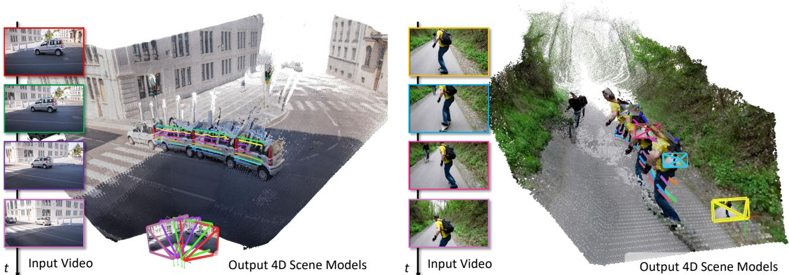  
Figure 1. Given a casually captured video, Uni4D harnesses pretrained visual foundation models and multi-stage optimization to jointly estimate camera poses, dynamic geometry, and dense 3D motion. The resulting camera poses and geometry are accurate, consistent, and coherent both temporally and spatially. This is all done without any additional training or fine-tuning.

## Abstract

Thispaperpresents a unified approach to understanding dynamic scenes from casual videos. Large pretrained vision foundation models, such as vision-language, video depth prediction, motion tracking, and segmentation models, offer promising capabilities. However, training a single model for comprehensive 4D understanding remains challenging. We introduce Uni4D, a multi-stage optimizationframework that harnesses multiple pretrained models to advance dynamic 3D modeling, including static/dynamic reconstruction, camera pose estimation, and dense 3D motion tracking. Our results show state-of-the-art performance in dynamic 4D modeling with superior visual quality. Notably, Uni4D requires no retraining or fine- tuning, highlighting the effectiveness of repurposing visual foundation models for 4D understanding. Code and more results are available at: https://davidyao99.github.io/uni4d.

## 1. Introduction

Over the past two years, many visual foundation models have emerged [4, 21, 23, 25, 27, 31, 44, 58, 63], achieving high accuracy on tasks like depth prediction, segmentation, human parsing, normal estimation, few-view reconstruction, and motion tracking. These models leverage supervised learning on large, diverse datasets, achieving impressive accuracy and remarkable generalization. However, these advances have not translated to 4D (time + geometry) modeling, a longstanding challenge in computer vision. We see two main reasons: first, collecting high-quality, groundtruth 4D data from real-world environments remains complex and resource-intensive. Second, 4D understanding is a holistic problem involving interconnected tasks like camera pose estimation, 3D reconstruction, and dynamics tracking. Although each subtask shows progress, data-driven cues remain noisy, and more importantly, unifying them synergistically for holistic modeling remains challenging. This paper seeks to answer: Can we harness the success ofvisualfoundation modelsfor dynamic 4D modeling?

In this paper, we propose Uni4D, a novel framework that reconstructs 4D scenes from a single video captured in the wild. Our method integrates data-driven foundation models and conventional model-driven dynamic structurefrom-motion, combining data-driven cues and model-based knowledge synergistically. Our intuition is simple: each data-driven visual cue, such as video segmentation, pixellevel motion tracking, and video depth, is a partial projection from the 4D world to the 2D video. The key is to create a 4D scene representation that coherently aligns with each cue while incorporating strong prior knowledge of real-world motion and shape to resolve temporary inconsistencies. To achieve this, we take an energy-minimization perspective, framing the problem as an optimization task that jointly infers camera poses, static and dynamic geometry, and motion. The dynamic 4D modeling framework is complex, as it involves various optimization variables, visual cues, and constraints. To overcome the challenge of joint reasoning, we carefully design a novel three-stage, divide-and-conquer pipeline that progressively incorporates camera poses, static geometry, and dynamic geometry and motion into the optimization framework. Uni4D leverages pretrained foundation models across different tasks, requiring no task-specific retraining or fine-tuning. This design sidesteps the need for 4D ground-truth data, a major challenge in the field. Through incorporating strong priors on geometry and dynamic motion, our method produces realistic 4D scenes that are coherent across space and time while maintaining high accuracy.

We demonstrate the effectiveness of Uni4D on various datasets. As shown in Fig. 1, our method effectively recovers the clean geometry and motion of the scene, as well as camera trajectories, from a single video. As shown in Fig. 2, our model outperforms all dynamic 4D modeling baselines in both camera pose and geometry.

## 2. Related Works

Structure from Motion and SLAM. Structure from Motion (SfM) is a classical problem in computer vision that aims to jointly recover camera parameters and 3D structure from images [2, 10, 41, 47, 48]. Simultaneous localization and mapping (SLAM) is a similar problem that focuses on real-time efficiency in an online setting [11, 13, 38, 53]. The core idea for many approaches to SfM and SLAM is to optimize a form of reprojection error with respect to both camera parameters and 3D points, also known as bundle adjustment [55]. This relies on the key assumption that the scene being viewed is rigid (“static”), making these approaches not applicable to dynamic scenes.

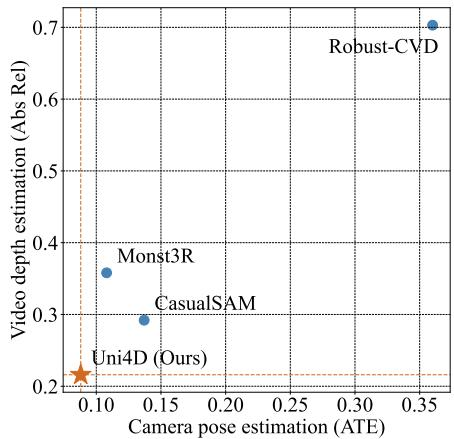  
Figure 2. Uni4D outperforms other recent 4D modeling methods in both camera pose and geometry accuracy on the Sintel dataset.

4D Understanding. The problem of non-rigid structure from motion is highly ill-posed. Previous works on nonrigid SfM leveraged various forms of priors or weaker assumptions on shape and or motion to make the problem solvable [3, 6, 28, 29, 70]. With the rise of modern segmentation models, many works have studied category-specific articulation and rigidity priors, focusing on object categories such as humans [17, 49, 52, 64], animals [60–62, 66], and vehicles [18, 37]. The generality of such methods is limited by their category-specific nature. Recently, several works have also begun to leverage trained neural networks as priors for 4D understanding in a more freeform manner [30, 65, 68, 69]. However, these methods involve either training a network [65, 69] or optimizing specific layers of an existing network [30, 68], making it difficult to integrate newer models into the pipeline. Our method takes the strategy further and integrates pretrained models in a completely modular manner, fully unleashing their generalization capabilities and allowing for seamless integration of newer models. Note that various recent works have also studied 4D reconstruction in an optimization-based framework [15, 32, 35, 57, 59]. However, these methods have additional rendering capacities and focus on rendering metrics, while we focus on recovering high-quality geometry.

Visual Foundation Models. In recent years, a number of visual foundation models have been developed, achieving remarkable performance on tasks like depth estimation [5, 20, 23, 44, 63], detection and segmentation [12, 27, 36, 46], human parsing [25], surface normal estimation [4, 14], few-view reconstruction [34, 58], and point tracking [21, 22, 31]. Our insight is that nearly all of these models have the potential to contribute towards holistic 4D understanding, and harnessing them in a unifying framework can advance the state-of-the-art in tasks such as nonrigid structure from motion. To this end, we integrate the following pretrained models in Uni4D: UniDepthv2 [45] for geometry initialization, CoTracker3 [22] for correspondence initialization, and a collection of Recognize Anything Model [67], ChatGPT [1], Grounding-SAM [27, 36], and DEVA [9] for dynamic object segmentation. Through multi-stage optimization with a few regularizing priors, we are able to use these models to extract accurate pose and 4D geometry from monocular video.

## 3. Method

In this paper, we are interested in recovering 4D geometry and camera parameters from a monocular casual video. Our model is built on the intuition that the 2D visual cues from the video can be seen as perspective projections of 4D geometry and motion, where the video depth represents a projection of 4D geometry, 2D dense tracking corresponds to a projection of 4D motion, and segmentation reflects a projection of the 4D dynamic object silhouette. We propose a novel, training-free, foundation-model-based energy minimization scheme that leverages visual cues to jointly infer camera poses, geometry, and motion, enabling generalization across diverse videos.

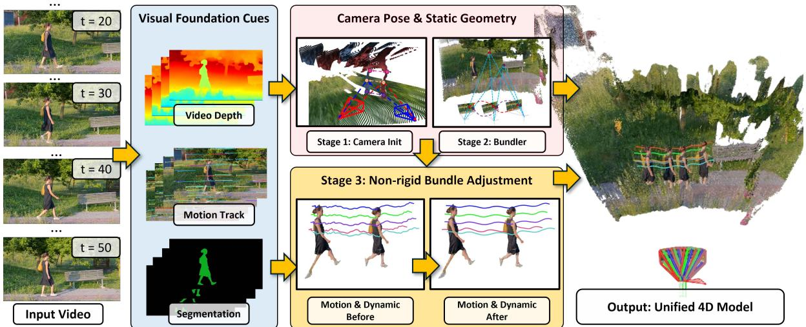  
Figure 3. Given a casually captured video, Uni4D exploits visual foundation models to extract dynamic segmentation, video depth, and motion tracks. Static geometry and poses are obtained through tracklet-based structure-from-motion along with camera motion priors. Dynamic geometry is improved through nonrigid bundle adjustment and scene motion priors. A final fusion densifies geometry to obtain high quality 4D reconstruction.

## 3.1. Pretrained Visual Cues

We first exploit foundation models to extract visual cues, including dynamic segmentation, video depth, and motion tracking. All of the models are pre-trained on large and diverse datasets and exhibit strong generalization abilities.

Video Segmentation. Recognizing and segmenting dynamic objects is crucial for 4D scene understanding. We leverage the latest advancements in video semantic segmentation and tracking to estimate dynamic objects over time. First, we use RAM [67] to identify semantic classes in the video. These classes are then filtered through GPT-4o [1] to exclude static and background elements (e.g., buildings, poles), retaining only dynamic objects (e.g., humans, animals, vehicles). Next, Grounding-SAM [27, 36] performs segmentation at each keyframe, and DEVA [9] tracks these segments over time, resulting in accurate dynamic video segmentation $\{ \mathbf { M _ { t } } \} _ { t = 0 } ^ { T }$

Dense Motion Tracking. We use dense pixel tracking to establish correspondences over time, which serve as motion cues to assist inference of geometry reconstruction and dynamic object 3D motion. Unlike traditional 4D reconstruction methods relying on optical flow [65, 68], dense motion tracklets yield more correspondence pairs across large viewpoints and structural changes. Pixel tracking also outperforms sparse matching in density and surpasses flow propagation in robustness, making it ideal for dynamic 4D reconstruction.We utilize Co-TrackerV3 [22] for its robustness, as it employs a 4D cost volume with an attention mechanism to track 2D points through occlusions, recently proving to be effective for dynamic neural rendering. We apply Co-Tracker bi-directionally on a dense grid every 10 frames to ensure thorough coverage. We filter and classify tracklets using segmentation masks yielding a set of correspondent point trajectories $\{ \mathbf { Z } _ { k } \in \mathbf { \bar { \mathbb { R } } } ^ { T \times 2 } \} _ { k = 0 } ^ { K }$ at visible time steps determined by Co-Tracker.

Video Depth Estimation. Monocular depth reasoning, while insufficient as a standalone tool for complete 4D geometry recovery, provides strong geometry initialization cues. In our model, we use UniDepthV2 [45], a monocular depth estimation network, to estimate an initial depth map, $\{ \mathbf { D _ { t } } \} _ { t = 0 } ^ { T } .$ , and initial camera intrinsics, $\bf { K } _ { \mathrm { i n i t } }$

## 3.2. Energy Formulation

We now describe the energy formulation of our proposed dynamic 4D reconstruction framework. Let $\mathcal { M } =$ $\bar { \{ \mathbf { M } _ { t } \} _ { t = 0 } ^ { T } , \mathcal { D } } = \{ \mathbf { D } _ { t } \} _ { t = 0 } ^ { T } , \mathcal { Z } = \{ \mathbf { Z } _ { k } \} _ { k = 0 } ^ { K }$ be the input dynamic segmentation, monocular depth, dense motion trajectory extracted from the input video ${ \mathcal { T } } = \{ \mathbf { I _ { t } } \} _ { t = 0 } ^ { T }$ . Formally, our goal is to obtain camera parameters C, namely poses T and intrinsics K, and a set of 4D point clouds $\mathcal { P }$ containing both dynamic and static parts separately as $\mathcal { P } = \{ \mathbf { P } _ { \mathrm { s t a t i c } } , \mathcal { P } _ { \mathrm { d y n } } \}$ . Here, $\mathbf { P _ { \mathrm { s t a t i c } } }$ does not change over time and $\mathcal { P } _ { \mathrm { d y n } } \stackrel {  } { = } \{ \mathbf { p } _ { k } \ \in \ \mathbb { R } ^ { T \times 3 } \} _ { k }$ is a temporally varying point cloud, where each $\mathbf { p } _ { k }$ is a dynamic point trajectory. We represent the camera poses as rigid transforms $\mathcal { T } = \{ \pmb { \xi } _ { t } \in \mathbb { S } \mathbb { E } ( 3 ) \} _ { t = 0 } ^ { T }$ , and parameterize the rotations as so(3) rotation vectors as a minimal representation for easy optimization. We assume all frames share the same intrinsic

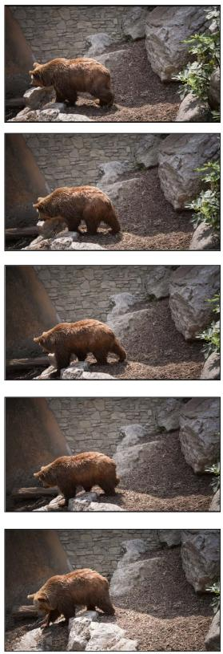  
Input Video

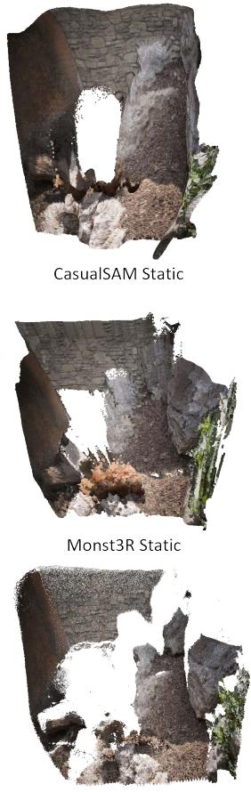  
Ours Static

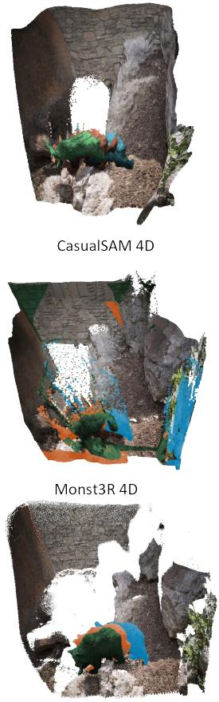  
Ours 4D

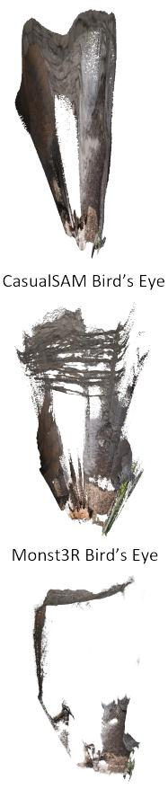  
Ours Bird's Eye

Figure 4. Qualitative results of 4D reconstruction on the DAVIS [43] dataset. CasualSAM [68] suffers from slanted geometry, and Monst3R [65] has unclear geometry and does not resolve conflicts from multiple views (note the wall in the bird’s-eye view). Both Casu alSAM and Monst3R lack clean dynamic reconstruction and segmentation. Uni4D achieves a realistic layout, thanks to joint optimization, and provides accurate dynamic segmentation and reconstruction by leveraging foundation visual models as cues.

matrix K where we optimize focal lengths $f _ { x }$ and $f _ { y }$ . We formulate the 4D joint reasoning problem as minimization of the following energy function:

$$
E _ { \mathrm { B A } } ( { \mathcal { C } } , { \bf P } _ { \mathrm { s t a t i c } } ) + E _ { \mathrm { N R } } ( { \mathcal { P } } _ { \mathrm { d y n } } ) + E _ { \mathrm { m o t i o n } } ( { \mathcal { P } } _ { \mathrm { d y n } } ) + E _ { \mathrm { c a m } } ( T )\tag{1}
$$

where $E _ { \mathrm { B A } } ( \mathcal { C } , \mathbf { P } _ { \mathrm { s t a t i c } } )$ is a bundle adjustment term that measures the discrepancy between static-region correspondences and the static 3D structure $\mathbf { P _ { \mathrm { s t a t i c } } }$ through perspective reprojection. $E _ { \mathrm { N R } } ( \mathcal { P } _ { \mathrm { d y n } } )$ is a non-rigid structure-frommotion energy term that measures the disagreement between the dynamic point cloud and their tracklet correspondences, $E _ { \mathrm { c a m } } ( \tau )$ is a regularization term on the camera motion smoothness, and $E _ { \mathrm { m o t i o n } } ( \mathcal { P } _ { \mathrm { d y n } } )$ is a regularization term on the dynamic structure and motion. Each energy term is involved in different stages of the optimization process, which will be described in Sec. 3.3.

Static Bundle Adjustment Term. The bundle adjustment energy $E _ { \mathrm { B A } } ( \mathcal { C } , \mathbf { P } _ { \mathrm { s t a t i c } } )$ measures the consistency between the pixel-level correspondences and the 3D structure of static scene elements. Given the input pixel tracks $\mathcal { Z } =$ $\{ \mathbf { Z } _ { k } \}$ and video segmentation $\mathcal { M } ,$ we filter all tracks corresponding to static areas and minimize the distance between the projected pixel location and the observed pixel location:

$$
E _ { \mathrm { B A } } ( \mathcal { C } , \mathbf { P } _ { \mathrm { s t a t i c } } ; \mathcal { Z } , \mathcal { M } ) = \sum _ { \mathbf { z } _ { k } \in \mathcal { M } } \sum _ { t } \mathbf { w } _ { \mathbf { k } , \mathbf { t } } \| \mathbf { z } _ { k , t } - \pi _ { \mathbf { K } } ( \mathbf { p } _ { k } , \pmb { \xi } _ { t } ) \| _ { 2 }\tag{2}
$$

where ${ \bf z } _ { k , t }$ is the k-th 3D point’s corresponding pixel track’s 2D coordinates at time $t , \mathbf { w _ { k , t } } \in \{ 0 , 1 \}$ is a visibility indicator and $\pi _ { \mathbf { K } }$ is the perspective projection function.

Non-Rigid Bundle Adjustment Term. For dynamic objects, we impose a nonrigid bundle adjustment term, $E _ { \mathrm { N R } } ( \mathcal { P } _ { \mathrm { d y n } } )$ , which measures the discrepancy between the dynamic point cloud and pixel tracklets. Here, each pixel tracklet corresponds to a dynamic 3D point sequence, $\{ \mathbf { p } _ { k , t } \} _ { t }$ , optimized for each observed tracklet:

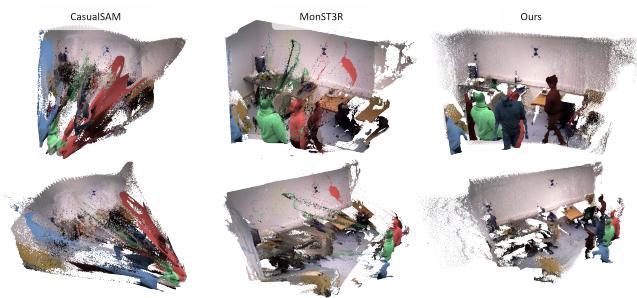  
Figure 5. Qualitative results on Bonn dataset. Both CasualSAM and MonST3R have trailing artifacts and incorrect dynamic estimations. Uni4D provides clear dynamic and static geometry.

$$
E _ { \mathrm { N R } } ( \mathcal { P } _ { \mathrm { d y n } } ; \mathcal { C } , \mathcal { Z } , \mathcal { M } ) = \sum _ { \mathbf { z } _ { k } \in \mathcal { M } } \sum _ { t } \mathbf { w } _ { \mathbf { k } , \mathbf { t } } \| \mathbf { z } _ { k , t } - \pi _ { \mathbf { K } } ( \mathbf { p } _ { k , t } , \pmb { \xi } _ { t } ) \| _ { 2 }\tag{3}
$$

where $\mathbf { p } _ { k , t } \in \mathbb { R } ^ { 3 }$ is the k-th dynamic point’s location at t.

Camera Motion Prior. Considering that our input is a video, we incorporate a temporal smoothness prior on camera poses that penalizes sudden changes in relative pose: $\pmb { \xi } _ { t  t + 1 } = \pmb { \xi } _ { t + 1 } ^ { - 1 } \cdot \pmb { \xi } _ { t }$ . We reweight this term based on the magnitude of the relative motion: intuitively, if the relative motion is large, we penalize change rates in relative motion less; if the relative motion is small, we apply a higher penalty on change rate. Formally, we have:

$$
E _ { \mathrm { c a m } } ( \mathcal { T } ) = \sum _ { t } E _ { \mathrm { r o t } } ( { \bf R } _ { t - 1 , t , t + 1 } ) + \sum _ { t } E _ { \mathrm { t r a n s } } ( { \bf t } _ { t - 1 , t , t + 1 } )\tag{4)(4}
$$

where $\begin{array} { r l r } { E _ { \mathrm { r o t } } ( { \bf R } _ { t - 1 , t , t + 1 } ) } & { { } = } & { \frac { 2 \| \mathrm { r a d } ( { \bf R } _ { t  t + 1 } ) - \mathrm { r a d } ( { \bf R } _ { t - 1  t } ) \| ^ { 2 } } { \| \mathrm { r a d } ( { \bf R } _ { t - 1  t } ) \| + \| \mathrm { r a d } ( { \bf R } _ { t  t + 1 } ) \| } } \end{array}$ and $\begin{array} { r } { E _ { \mathrm { t r a n s } } ( \mathbf { t } _ { t - 1 , t , t + 1 } ) = \frac { 2 \| \mathbf { t } _ { t  t + 1 } - \mathbf { t } _ { t - 1  t } \| } { \| \mathbf { t } _ { t - 1  t } \| + \| \mathbf { t } _ { t  t + 1 } \| } . } \end{array}$ ; rad converts the rotation matrix into absolute radians.

Dynamic Motion Prior. $E _ { \mathrm { m o t i o n } } ( \mathcal { P } _ { \mathrm { d y n } } )$ is a regularization term that encodes the characteristics of the dynamic structure. It contains two prior terms that are used to regularize the dynamic structure, both of which have demonstrated effectiveness in previous work [39, 50]:

$$
E _ { \mathrm { m o t i o n } } ( \mathcal { P } _ { \mathrm { d y n } } ) = E _ { \mathrm { a r a p } } ( \mathcal { P } _ { \mathrm { d y n } } ) + E _ { \mathrm { s m o o t h } } ( \mathcal { P } _ { \mathrm { d y n } } ) .\tag{5}
$$

$E _ { \mathrm { a r a p } }$ is an as-rigid-as-possible (ARAP) [50] prior that penalizes extreme deformations that compromise local rigidity. Specifically, we obtain the nearest neighbors of each dynamic control point k by applying KNN over the other tracks and enforce that the relative distances between these close-by pairs do not undergo sudden changes:

$$
E _ { \mathrm { a r a p } } = \sum _ { \mathbf { t } } \sum _ { ( k , m ) } \mathbf { w _ { k m , t } } \lVert d ( \mathbf { p _ { k , t } } , \mathbf { p } _ { m , t } ) - d ( \mathbf { p _ { k , t + 1 } } , \mathbf { p } _ { m , t + 1 } ) \rVert _ { 2 }\tag{6}
$$

where $d ( \cdot , \cdot )$ is the L2 distance and $\mathbf { w _ { k m , t } } = 1$ if all relevant points are visible.

$E _ { \mathrm { s m o o t h } }$ is a simple smoothness term that promotes temporal smoothness for the dynamic point cloud:

$$
E _ { \mathrm { s m o o t h } } = \sum _ { \mathbf { t } } \sum _ { \mathbf { p } _ { k } \in \mathcal { P } _ { \mathrm { d y n } } } \mathbf { w } _ { \mathbf { k } , \mathbf { t } } \Vert \mathbf { p } _ { k , t } - \mathbf { p } _ { k , t + 1 } \Vert _ { 2 } .\tag{7}
$$

Despite simplicity, both motion terms are crucial in our formulation, as they significantly reduce ambiguities in 4D dynamic structure estimation, which is highly ill-posed. Unlike other methods, we do not assume strong modelbased motion priors, such as rigid motion [37], articulated motion [61], or a linear motion basis [57].

## 3.3. Inference

Directly minimizing the energy defined in Eq. 1 is nontrivial, as our energy function is highly non-linear and involves millions of free variables. To address this, we developed a three-stage optimization pipeline, enabling us to minimize the energy and estimate the scene variables in a divide-and-conquer fashion.

Stage 1: Camera Initialization. We start by initializing camera parameters. Combining video depth estimation D and dense pixel motion Z allows us to establish 2D-to-3D correspondences. This allows us to initialize and tune C by minimizing the following energy function with respect to camera parameters only. Specifically, we can unproject each video frame’s depth at time t back to 3D and minimize the following energy function:

$$
\operatorname* { m i n } _ { \mathbf { C } } \sum _ { ( t ^ { \prime } , t ) } \sum _ { \mathbf { z } _ { k } \in \lnot \mathcal { M } } \| \mathbf { z } _ { k , t ^ { \prime } } - \pi _ { \mathbf { K } } ( \pi _ { \mathbf { K } } ^ { - 1 } ( \mathbf { z } _ { k , t } , \mathbf { D } _ { t } , \boldsymbol { \xi } _ { t } ) , \boldsymbol { \xi } _ { t ^ { \prime } } ) \| _ { 2 } ^ { 2 }\tag{8}
$$

where $\pi _ { \mathbf { K } } ^ { - 1 }$ is the unprojection function that maps 2D coordinates into 3D world coordinates using estimated depth $\mathbf { D } _ { t }$ . We perform this over all pairs within a temporal sliding window of 5 frames, producing a good initial pose estimate as shown in Tab. 4. Given camera initialization ${ \hat { \mathcal { C } } } ,$ we directly unproject our depth prediction into a common world coordinate system, which provides an initial 4D structure $\hat { \mathcal { P } }$ . This is used as initialization for later optimization.

Stage 2: Bundle Adjustment. Our second stage jointly optimizes camera pose and static geometry by minimizing the static component-related energy in a bundle adjustment fashion. Formally speaking, we solve the following:

$$
\operatorname* { m i n } _ { \mathcal { C } , \mathbf { P } _ { \mathrm { s t a t i c } } } E _ { \mathrm { B A } } ( \mathcal { C } , \mathbf { P } _ { \mathrm { s t a t i c } } ; \mathcal { Z } , \mathcal { M } ) + E _ { \mathrm { c a m } } ( \mathcal { T } )\tag{9}
$$

By enforcing consistency with each other, this improves both the static geometry and the camera pose quality. We perform a final scene integration by unprojecting correspondences into 3D using improved pose and filtering outlier noisy points in 3D.

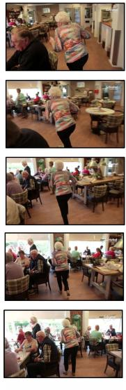

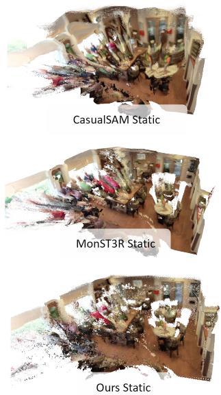

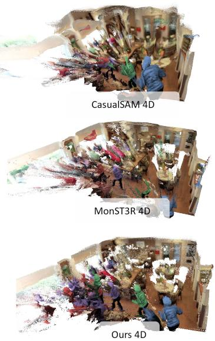

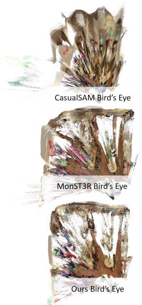  
Figure 6. Qualitative results of 4D reconstruction on DAVIS dataset. CasualSAM [68] distorts the room geometry as evident from the bird’s eye view. Dynamic elements have inconsistent geometry over time. MonST3R [65] has noisy static geometry in the room’s far corner and incomplete dynamic object geometry evident in the green highlight. Uni4D has the cleanest dynamic object reconstruction and segmentation results, with geometrically accurate room shapes as evident from the bird’s eye view.

Stage 3: Non-Rigid Bundle Adjustment. Given the estimated camera pose, our third stage focuses on inferring dynamic structure. Note that we freeze camera parameters in this stage, as we find that incorrect geometry and motion evidence often harm camera pose estimation rather than improve it. Additionally, enabling camera pose optimization introduces extra flexibility in this ill-posed problem, harming robustness. Formally speaking, we solve the following:

$$
\operatorname* { m i n } _ { \mathcal { P } _ { \mathrm { d y n } } } E _ { \mathrm { N R } } ( \mathcal { P } _ { \mathrm { d y n } } ; \mathbf { C } , \mathcal { Z } , \mathcal { M } ) + E _ { \mathrm { m o t i o n } } ( \mathcal { P } _ { \mathrm { d y n } } )\tag{10}
$$

We initialize $\mathcal { P } _ { \mathrm { d y n } }$ using video depth and our optimized camera pose from Stage 2. We scale $E _ { \mathrm { s m o o t h } }$ and $E _ { \mathrm { a r a p } }$ with constants 10 and 100 respectively which we found empirically led to better dynamics. This energy optimization might still leave some high-energy noisy points, often from incorrect cues, motion boundaries, or occlusions. We filter these outliers based on their energy values in a final step.

Fusion. From our energy minimization, we acquire a semi-dense dynamic and static point cloud along with camera parameters. To further densify the point cloud, enabling each pixel to correspond to a 3D point, we perform depthbased interpolation by computing a scale offset. Details can be found in the supplementary.

To unify our outputs into a consistent 4D representation, we use our camera parameters and static masks to project the aligned depth maps into world coordinates. To handle noisy depth values at boundaries, we create an edge mask filter by thresholding gradients of the depth maps.

This process enables us to update the depth value for each high-confidence pixel, which we can then reproject into 3D space to obtain the final dense dynamic geometry reconstruction result, as shown in Fig. 1 and Fig. 3.

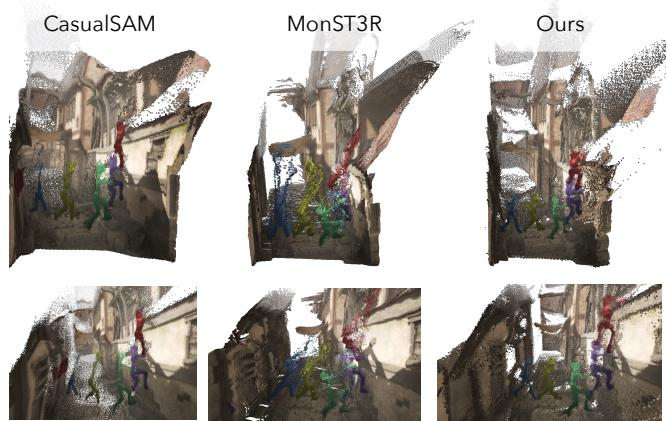  
Figure 7. Qualitative results of 4D reconstruction on Sintel dataset. We highlight and contrast performance on (1) dynamic objects and (2) geometry on planar surfaces.

## 4. Experiments

Uni4D estimates camera pose, depth, and 3D motion from a single video. We perform experiments evaluating its performance with respect to baselines on these tasks.

## 4.1. Implementation Details

For optimization, we use the Adam optimizer with ReduceLROnPlateau and EarlyStopping in PyTorch [26, 42]. We perform 600 iterations per sliding window in stage 1, 2000 iterations in stage 2, and 1000 iterations in stage 3.

<table><tr><td></td><td></td><td colspan="3">Sintel</td><td colspan="3">TUM-dynamics</td><td colspan="3">Bonn</td></tr><tr><td>Category</td><td>Method</td><td>ATE↓</td><td>RPE trans ↓</td><td>RPE rot↓</td><td>ATE↓</td><td>RPE trans ↓</td><td>RPE rot↓</td><td>ATE↓</td><td>RPE trans ↓</td><td>RPE rot ↓</td></tr><tr><td>Pose only</td><td>DPVO*[54]</td><td>0.171</td><td>0.063</td><td>1.291</td><td>0.019</td><td>0.014</td><td>0.406</td><td>0.022</td><td>0.014</td><td>0.913</td></tr><tr><td></td><td>LEAP-VO*[8]</td><td>0.035</td><td>0.065</td><td>1.669</td><td>0.025</td><td>0.031</td><td>2.843</td><td>0.037</td><td>0.014</td><td>0.844</td></tr><tr><td>Joint depth</td><td>Robust-CVD[30]</td><td>0.368</td><td>0.153</td><td>3.462</td><td>0.096</td><td>0.027</td><td>2.590</td><td>0.085</td><td>0.018</td><td>0.803</td></tr><tr><td>&amp; pose</td><td>CasualSAM[68]</td><td>0.137</td><td>0.039</td><td>0.630</td><td>0.036</td><td>0.018</td><td>0.745</td><td>0.024</td><td>0.014</td><td>0.849</td></tr><tr><td></td><td>Monst3R[65]</td><td>0.108</td><td>0.043</td><td>0.729</td><td>0.108</td><td>0.022</td><td>1.371</td><td>0.023</td><td>0.011</td><td>0.807</td></tr><tr><td></td><td>Uni4D</td><td>0.110</td><td>0.032</td><td>0.338</td><td>0.012</td><td>0.004</td><td>0.335</td><td>0.017</td><td>0.010</td><td>0.818</td></tr><tr><td></td><td>Uni4D*</td><td>0.092</td><td>0.033</td><td>0.141</td><td>0.012</td><td>0.004</td><td>0.331</td><td>0.016</td><td>0.010</td><td>0.817</td></tr></table>

Table 1. Camera Pose Evaluation on Sintel, TUM-dynamic, and Bonn datasets. We bold and underline the best and second best results respectively. ∗ indicates known camera intrinsic.

<table><tr><td></td><td></td><td></td><td colspan="2">Sintel</td><td colspan="2">Bonn</td><td colspan="2">KITTI</td></tr><tr><td>Alignment</td><td>Category</td><td>Method</td><td></td><td>Abs Rel ↓ δ&lt;1.25 ↑|A</td><td>|Abs Rel ↓ δ&lt;1.25 ↑|</td><td></td><td>|Abs Rel ↓δ &lt;1.25 ↑</td><td></td></tr><tr><td rowspan="8">Per-sequence scale &amp; shift</td><td rowspan="3">Single-frame depth</td><td>Metric3D[19]</td><td>0.205</td><td>71.9</td><td>0.044</td><td>98.5</td><td>0.039</td><td>98.8</td></tr><tr><td>Depth-pro[5]</td><td>0.280</td><td>60.5</td><td>0.049</td><td>98.6</td><td>0.080</td><td>94.2</td></tr><tr><td>Unidepth[44]</td><td>0.198</td><td>72.8</td><td>0.040</td><td>98.5</td><td>0.038</td><td>98.8</td></tr><tr><td>Video depth</td><td>DepthCrafter[20]</td><td>0.231</td><td>69.0</td><td>0.065</td><td>97.6</td><td>0.112</td><td>88.4</td></tr><tr><td rowspan="4">Joint video depth &amp; pose</td><td>Robust-CVD[30]</td><td>0.358</td><td>49.7</td><td>0.108</td><td>89.8</td><td>0.182</td><td>72.9</td></tr><tr><td>CasualSAM[68]</td><td>0.292</td><td>56.9</td><td>0.069</td><td>96.6</td><td>0.113</td><td>88.3</td></tr><tr><td>Monst3r[65]</td><td>0.358</td><td>52.1</td><td>0.060</td><td>95.0</td><td>0.085</td><td>91.9</td></tr><tr><td>Uni4D</td><td>0.216</td><td>72.5</td><td>0.038</td><td>98.3</td><td>0.098</td><td>89.7</td></tr><tr><td>Per-sequence</td><td colspan="2">Joint depth &amp; pose Monst3r[65]</td><td>0.344</td><td>55.9</td><td>0.041</td><td>98.2</td><td>0.089</td><td>91.4</td></tr><tr><td>scale</td><td colspan="2">Joint depth &amp; pose Uni4D</td><td>0.289</td><td>64.9</td><td>0.038</td><td>98.3</td><td>0.086</td><td>93.3</td></tr></table>

Table 2. Video depth evaluation on Sintel, Bonn, and KITTI datasets. We bold and underline the best and second best results respectively.

We initialize the learning rate at $1 \times 1 0 ^ { - 3 }$ for stage 1, and $1 \times 1 0 ^ { - 2 }$ for stages 2 and 3, reducing all to $1 \times 1 0 ^ { - 4 }$ . Our entire framework takes roughly 5 minutes for a 50-frame video on a RTX A6000 GPU. We include a detailed runtime breakdown in the supplementary. We run all baselines on the datasets using their official implementations and hyperparameters. Co-Trackers [22] are initialized at a dense 50x50 grid, with a 75x75 grid for Sintel to handle its large camera perspective change. All optimization hyperparameters are kept the same for all runs on all datasets.

## 4.2. Pose Estimation

Baselines. We compare with several recent methods for pose estimation in dynamic scenes. LEAPVO [8] and DPVO [54] are learning-based visual odometry methods. Robust-CVD [30] optimizes for pose and depth deformation through an SFM pipeline. CasualSAM [68] further improves on the idea by directly finetuning network weights along with a novel uncertainty formulation. Monst3R [65] is a very recent work that fine-tunes DUSt3R [58] for 4D reconstruction through PnP [33].

Benchmarks and metrics. We evaluate pose estimation on three dynamic datasets: Sintel [7], TUM-dynamics [51], and Bonn [40]. We follow LEAP-VO’s evaluation split for Sintel and use all videos from TUM-dynamics and Bonn. Following MonST3R [65], we subsample every 3 frames from the first 270 frames from TUM-dynamics to save compute. We follow the standard pose evaluation process of aligning camera poses with Umeyama alignment [56]. We report Absolute Translation Error (ATE), Relative Translation and Rotation Error (RPE trans and RPE rot).

Results. As reported in Tab. 1, Uni4D achieves competitive results across all metrics and datasets, highlighting the generalizability and performance of our pipeline. Uni4D is flexible to the availability of camera intrinsics, showing further improvement with known camera intrinsics. Trainingbased approaches such as LEAP-VO achieves good results on synthetic dataset like Sintel but does not generalize well to real-world datasets. Our method matches performance with MonST3R [65] on Sintel and achieves significantly better results on real-world datasets even compared to methods using ground-truth intrinsics.

## 4.3. Video Depth Evaluation

Baselines. For video depth accuracy evaluations, we focus on the top performing metric depth estimators, namely Metric3Dv2 [19], Depth-Pro [63], DepthCrafter [20] and Unidepth [44]. Metric depth estimators are trained without scale and shift alignment, making them strong baselines for video depth estimation. We also include the same baselines as our pose evaluations for joint 4D modeling approaches, namely CasualSAM [68], RCVD [30], and MonST3R [65].

Benchmarks. We evaluate video depth estimates on Sintel [7], Bonn [40] and KITTI [16]. We follow standard video depth evaluation protocols [20] of aligning global shift and scale to predicted video depthmaps. We report the absolute relative error (Abs Rel) and percent of inlier points (δ < 1.25). All methods are aligned in disparity space using the same least-squares alignment. We additionally report scale-aligned depth estimates similar to MonST3R.

Results. By leveraging the strong performance of singleframe metric depth estimation models, Tab. 2 shows Uni4D achieves competitive depth estimation results, with superior performance among joint depth and pose methods, and closely matching the performance of single-frame depth estimation models on some datasets. With per-sequence scale, our model produces more accurate depth estimates across all datasets compared to recently released MonST3R. Our method closely retains depth estimation accuracy of underlying Unidepth depthmaps, while significantly improving its depth consistency shown in Sec. 4.5.

## 4.4. Qualitative

We further show qualitative results of our reconstructions on the DAVIS [43] dataset. We apply MonST3R’s own confidence-guided fusion for their reconstruction. We fuse casualSAM’s depthmaps with dynamic masking by thresholding its uncertainty prediction to output 4D reconstruction. We use highlights to indicate dynamic objects at different timesteps. Throughout our qualitative results in Figs. 4,5,6,7, CasualSAM produces warped geometry and poor dynamic segmentations. MonST3R produces poor geometry in far regions and noisy dynamic masks and shapes. Our model produces the cleanest dynamic segmentations, along with the best dynamic and static geometry.

## 4.5. Ablation Study

We ablate our multi-stage optimization in Tab. 4, highlighting the importance of each stage. Joint 4D optimization adds complexity that requires strong initialization for optimal convergence. Stage 1 introduces drift, which Stage 2 rectifies, resulting in superior final pose estimates.

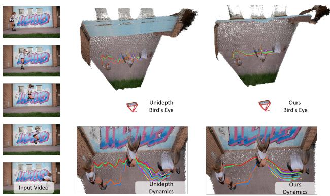

Figure 8. Depth Consistency. Direct fusion of Unidepth [44] predictions causes misaligned scene geometry visible as a layered wall in bird’s-eye view, and jittering dynamic motion. Through motion priors and alignment, Uni4D produces a thin, crisp wall structure and smooth dynamic motion.
<table><tr><td></td><td colspan="3">Sintel</td></tr><tr><td>Method</td><td>SC↓</td><td>δsc&lt;0.01↑</td><td>δsc&lt;0.05 ↑</td></tr><tr><td>Unidepth [44]</td><td>0.109</td><td>31.8</td><td>76.8</td></tr><tr><td>Uni4D</td><td>0.043</td><td>69.3</td><td>88.1</td></tr></table>

Table 3. Video depth consistency on Sintel. Uni4D improves Unidepth in consistency.
<table><tr><td></td><td colspan="3">Sintel</td></tr><tr><td>Method</td><td>ATE↓</td><td>RPE trans ↓</td><td>RPE rot ↓</td></tr><tr><td>Uni4D (stage 1 only)</td><td>0.150</td><td>0.051</td><td>0.551</td></tr><tr><td>Uni4D (stage 2 only)</td><td>0.587</td><td>0.193</td><td>4.12</td></tr><tr><td>Uni4D (full)</td><td>0.110</td><td>0.032</td><td>0.338</td></tr></table>

Table 4. Multi-stage Ablation. We evaluate pose estimation results on Sintel for both stage 1 and stage 2.

Directly reprojecting Unidepth depth maps leads to flickering geometry. We ablate our fused depthmap quantitatively in Tab. 3, showing that Uni4D significantly improves consistency using Self-Consistency (SC) metrics [24]. SC measures depth errors between estimated and reprojected depth maps in static regions. Furthermore, we qualitatively show the effectiveness of Uni4D in rectifying Unidepth inconsistencies in Fig. 8. Our reconstruction achieves much better geometric and temporal consistency over Unidepth. Please refer to the supplementary for more ablative results regarding choice of foundation models.

## 5. Conclusion

This paper presents Uni4D, a framework unifying visual foundation models and structured energy minimization for dynamic 4D modeling from casual video. Our key insight is to optimize a 4D representation that aligns with visual cues from foundation models while following motion and geometry priors. Results show state-of-the-art performance with superior visual quality on Sintel, DAVIS, TUM-Dynamics and Bonn datasets, without any retraining or fine-tuning.

## Acknowledgements

This project is supported by the Intel AI SRS gift, Amazon-Illinois AICE grant, Meta Research Grant, IBM IIDAI Grant, and NSF Awards #2331878, #2340254, #2312102, #2414227, and #2404385. We greatly appreciate the NCSA for providing computing resources.

## References

[1] Josh Achiam, Steven Adler, Sandhini Agarwal, Lama Ahmad, Ilge Akkaya, Florencia Leoni Aleman, Diogo Almeida, Janko Altenschmidt, Sam Altman, Shyamal Anadkat, et al. Gpt-4 technical report. arXiv preprint arXiv:2303.08774, 2023. 2, 3

[2] Sameer Agarwal, Yasutaka Furukawa, Noah Snavely, Ian Simon, Brian Curless, Steven M Seitz, and Richard Szeliski. Building rome in a day. Communications of the ACM, 54 (10):105–112, 2011. 2

[3] Antonio Agudo, Melcior Pijoan, and Francesc Moreno-Noguer. Image collection pop-up: 3d reconstruction and clustering of rigid and non-rigid categories. In Proceedings of the IEEE conference on computer vision and pattern recognition, pages 2607–2615, 2018. 2

[4] Gwangbin Bae and Andrew J Davison. Rethinking inductive biases for surface normal estimation. In Proceedings of the IEEE/CVF Conference on Computer Vision and Pattern Recognition, pages 9535–9545, 2024. 1, 2

[5] Aleksei Bochkovskii, Amael Delaunoy, Hugo Germain,¨ Marcel Santos, Yichao Zhou, Stephan R Richter, and Vladlen Koltun. Depth pro: Sharp monocular metric depth in less than a second. arXiv preprint arXiv:2410.02073, 2024. 2, 7

[6] Christoph Bregler, Aaron Hertzmann, and Henning Biermann. Recovering non-rigid 3d shape from image streams. In Proceedings IEEE Conference on Computer Vision and Pattern Recognition. CVPR 2000 (Cat. No. PR00662), pages 690–696. IEEE, 2000. 2

[7] Daniel J Butler, Jonas Wulff, Garrett B Stanley, and Michael J Black. A naturalistic open source movie for optical flow evaluation. In Computer Vision–ECCV 2012: 12th European Conference on Computer Vision, Florence, Italy, October 7-13, 2012, Proceedings, Part VI 12, pages 611– 625. Springer, 2012. 7, 8

[8] Weirong Chen, Le Chen, Rui Wang, and Marc Pollefeys. Leap-vo: Long-term effective any point tracking for visual odometry. In Proceedings of the IEEE/CVF Conference on Computer Vision and Pattern Recognition, pages 19844– 19853, 2024. 7

[9] Ho Kei Cheng, Seoung Wug Oh, Brian Price, Alexander Schwing, and Joon-Young Lee. Tracking anything with decoupled video segmentation. In Proceedings of the IEEE/CVF International Conference on Computer Vision, pages 1316–1326, 2023. 2, 3

[10] Hainan Cui, Xiang Gao, Shuhan Shen, and Zhanyi Hu. Hsfm: Hybrid structure-from-motion. In Proceedings of the IEEE conference on computer vision and pattern recognition, pages 1212–1221, 2017. 2

[11] Andrew J Davison, Ian D Reid, Nicholas D Molton, and Olivier Stasse. Monoslam: Real-time single camera slam. IEEE transactions on pattern analysis and machine intelli gence, 29(6):1052–1067, 2007. 2

[12] Matt Deitke, Christopher Clark, Sangho Lee, Rohun Tripathi, Yue Yang, Jae Sung Park, Mohammadreza Salehi, Niklas Muennighoff, Kyle Lo, Luca Soldaini, et al. Molmo and pixmo: Open weights and open data for state-of-the-art multimodal models. arXiv preprint arXiv:2409.17146, 2024. 2

[13] Jakob Engel, Thomas Schops, and Daniel Cremers. Lsd-¨ slam: Large-scale direct monocular slam. In European conference on computer vision, pages 834–849. Springer, 2014. 2

[14] Xiao Fu, Wei Yin, Mu Hu, Kaixuan Wang, Yuexin Ma, Ping Tan, Shaojie Shen, Dahua Lin, and Xiaoxiao Long. Geowiz ard: Unleashing the diffusion priors for 3d geometry estimation from a single image. In European Conference on Computer Vision, pages 241–258. Springer, 2025. 2

[15] Chen Gao, Ayush Saraf, Johannes Kopf, and Jia-Bin Huang. Dynamic view synthesis from dynamic monocular video. In Proceedings of the IEEE/CVF International Conference on Computer Vision, pages 5712–5721, 2021. 2

[16] Andreas Geiger, Philip Lenz, Christoph Stiller, and Raquel Urtasun. Vision meets robotics: The kitti dataset. The International Journal of Robotics Research, 32(11):1231–1237, 2013. 8

[17] Shubham Goel, Georgios Pavlakos, Jathushan Rajasegaran, Angjoo Kanazawa\*, and Jitendra Malik\*. Humans in 4D: Reconstructing and tracking humans with transformers. In International Conference on Computer Vision (ICCV), 2023. 2

[18] Zan Gojcic, Or Litany, Andreas Wieser, Leonidas J Guibas, and Tolga Birdal. Weakly supervised learning of rigid 3d scene flow. In Proceedings of the IEEE/CVF conference on computer vision and pattern recognition, pages 5692–5703, 2021. 2

[19] Mu Hu, Wei Yin, Chi Zhang, Zhipeng Cai, Xiaoxiao Long, Hao Chen, Kaixuan Wang, Gang Yu, Chunhua Shen, and Shaojie Shen. Metric3d v2: A versatile monocular geometric foundation model for zero-shot metric depth and surface normal estimation. arXiv preprint arXiv:2404.15506, 2024. 7, 8

[20] Wenbo Hu, Xiangjun Gao, Xiaoyu Li, Sijie Zhao, Xiaodong Cun, Yong Zhang, Long Quan, and Ying Shan. Depthcrafter: Generating consistent long depth sequences for open-world videos. arXiv preprint arXiv:2409.02095, 2024. 2, 7, 8

[21] Nikita Karaev, Ignacio Rocco, Benjamin Graham, Natalia Neverova, Andrea Vedaldi, and Christian Rupprecht. Cotracker: It is better to track together. arXiv preprint arXiv:2307.07635, 2023. 1, 2

[22] Nikita Karaev, Iurii Makarov, Jianyuan Wang, Natalia Neverova, Andrea Vedaldi, and Christian Rupprecht. Cotracker3: Simpler and better point tracking by pseudolabelling real videos. arXiv preprint arXiv:2410.11831, 2024. 2, 3, 7

[23] Bingxin Ke, Anton Obukhov, Shengyu Huang, Nando Metzger, Rodrigo Caye Daudt, and Konrad Schindler. Repurpos

ing diffusion-based image generators for monocular depth estimation. In Proceedings of the IEEE/CVF Conference on Computer Vision and Pattern Recognition, pages 9492– 9502, 2024. 1, 2

[24] Numair Khan, Eric Penner, Douglas Lanman, and Lei Xiao. Temporally consistent online depth estimation using pointbased fusion. In Proceedings of the IEEE/CVF Conference on Computer Vision and Pattern Recognition, pages 9119– 9129, 2023. 8

[25] Rawal Khirodkar, Timur Bagautdinov, Julieta Martinez, Su Zhaoen, Austin James, Peter Selednik, Stuart Anderson, and Shunsuke Saito. Sapiens: Foundation for human vision models. In European Conference on Computer Vision, pages 206–228. Springer, 2025. 1, 2

[26] Diederik P Kingma. Adam: A method for stochastic optimization. arXiv preprint arXiv:1412.6980, 2014. 6

[27] Alexander Kirillov, Eric Mintun, Nikhila Ravi, Hanzi Mao, Chloe Rolland, Laura Gustafson, Tete Xiao, Spencer Whitehead, Alexander C Berg, Wan-Yen Lo, et al. Segment anything. In Proceedings of the IEEE/CVF International Conference on Computer Vision, pages 4015–4026, 2023. 1, 2, 3

[28] Chen Kong and Simon Lucey. Prior-less compressible structure from motion. In Proceedings of the IEEE Conference on Computer Vision and Pattern Recognition, pages 4123– 4131, 2016. 2

[29] Chen Kong, Rui Zhu, Hamed Kiani, and Simon Lucey. Structure from category: A generic and prior-less approach. In 2016 Fourth International Conference on 3D Vision (3DV), pages 296–304. IEEE, 2016. 2

[30] Johannes Kopf, Xuejian Rong, and Jia-Bin Huang. Robust consistent video depth estimation. In Proceedings of the IEEE/CVF Conference on Computer Vision and Pattern Recognition, pages 1611–1621, 2021. 2, 7, 8

[31] Guillaume Le Moing, Jean Ponce, and Cordelia Schmid. Dense optical tracking: connecting the dots. In Proceedings of the IEEE/CVF Conference on Computer Vision and Pattern Recognition, pages 19187–19197, 2024. 1, 2

[32] Jiahui Lei, Yijia Weng, Adam Harley, Leonidas Guibas, and Kostas Daniilidis. Mosca: Dynamic gaussian fusion from casual videos via 4d motion scaffolds. arXiv preprint arXiv:2405.17421, 2024. 2

[33] Vincent Lepetit, Francesc Moreno-Noguer, and Pascal Fua. Ep n p: An accurate o (n) solution to the p n p problem. Internationaljournal ofcomputer vision, 81:155–166, 2009. 7

[34] Vincent Leroy, Yohann Cabon, and Jer´ ome Revaud. Ground-ˆ ing image matching in 3d with mast3r. arXiv preprint arXiv:2406.09756, 2024. 2

[35] Zhengqi Li, Qianqian Wang, Forrester Cole, Richard Tucker, and Noah Snavely. Dynibar: Neural dynamic image-based rendering. In Proceedings of the IEEE/CVF Conference on Computer Vision and Pattern Recognition, pages 4273– 4284, 2023. 2

[36] Shilong Liu, Zhaoyang Zeng, Tianhe Ren, Feng Li, Hao Zhang, Jie Yang, Qing Jiang, Chunyuan Li, Jianwei Yang, Hang Su, et al. Grounding dino: Marrying dino with

grounded pre-training for open-set object detection. arXiv preprint arXiv:2303.05499, 2023. 2, 3

[37] Wei-Chiu Ma, Shenlong Wang, Rui Hu, Yuwen Xiong, and Raquel Urtasun. Deep rigid instance scene flow. In Proceedings of the IEEE/CVF Conference on Computer Vision and Pattern Recognition, pages 3614–3622, 2019. 2, 5

[38] Raul Mur-Artal, Jose Maria Martinez Montiel, and Juan D Tardos. Orb-slam: a versatile and accurate monocular slam system. IEEE transactions on robotics, 31(5):1147–1163, 2015. 2

[39] Richard A Newcombe, Dieter Fox, and Steven M Seitz. Dynamicfusion: Reconstruction and tracking of non-rigid scenes in real-time. In Proceedings of the IEEE conference on computer vision and pattern recognition, pages 343–352, 2015. 5

[40] Emanuele Palazzolo, Jens Behley, Philipp Lottes, Philippe Giguere, and Cyrill Stachniss. Refusion: 3d reconstruction in dynamic environments for rgb-d cameras exploiting resid uals. In 2019 IEEE/RSJ International Conference on Intel ligent Robots and Systems (IROS), pages 7855–7862. IEEE, 2019. 7, 8

[41] Linfei Pan, Daniel Bar ´ ath, Marc Pollefeys, and Johannes L´ Schonberger. Global structure-from-motion revisited. In¨ Eu ropean Conference on Computer Vision (ECCV), 2024. 2

[42] Adam Paszke, Sam Gross, Francisco Massa, Adam Lerer, James Bradbury, Gregory Chanan, Trevor Killeen, Zeming Lin, Natalia Gimelshein, Luca Antiga, et al. Pytorch: An im perative style, high-performance deep learning library. Advances in neural information processing systems, 32, 2019. 6

[43] Federico Perazzi, Jordi Pont-Tuset, Brian McWilliams, Luc Van Gool, Markus Gross, and Alexander Sorkine-Hornung. A benchmark dataset and evaluation methodology for video object segmentation. In Proceedings of the IEEE conference on computer vision and pattern recognition, pages 724–732, 2016. 4, 8

[44] Luigi Piccinelli, Yung-Hsu Yang, Christos Sakaridis, Mattia Segu, Siyuan Li, Luc Van Gool, and Fisher Yu. Unidepth: Universal monocular metric depth estimation. In Proceedings of the IEEE/CVF Conference on Computer Vision and Pattern Recognition, pages 10106–10116, 2024. 1, 2, 7, 8

[45] Luigi Piccinelli, Christos Sakaridis, Yung-Hsu Yang, Mat tia Segu, Siyuan Li, Wim Abbeloos, and Luc Van Gool. Unidepthv2: Universal monocular metric depth estimation made simpler. arXiv preprint arXiv:2502.20110, 2025. 2, 3

[46] Nikhila Ravi, Valentin Gabeur, Yuan-Ting Hu, Ronghang Hu, Chaitanya Ryali, Tengyu Ma, Haitham Khedr, Roman Radle, Chloe Rolland, Laura Gustafson, et al. Sam 2:¨ Segment anything in images and videos. arXiv preprint arXiv:2408.00714, 2024. 2

[47] Johannes L Schonberger and Jan-Michael Frahm. Structurefrom-motion revisited. In Proceedings of the IEEE conference on computer vision and pattern recognition, pages 4104–4113, 2016. 2

[48] Noah Snavely, Steven M Seitz, and Richard Szeliski. Modeling the world from internet photo collections. International journal ofcomputer vision, 80:189–210, 2008. 2

[49] Chonghyuk Song, Gengshan Yang, Kangle Deng, Jun-Yan Zhu, and Deva Ramanan. Total-recon: Deformable scene reconstruction for embodied view synthesis. In Proceedings ofthe IEEE/CVF International Conference on Computer Vision, pages 17671–17682, 2023. 2

[50] Olga Sorkine and Marc Alexa. As-rigid-as-possible surface modeling. In Symposium on Geometry processing, pages 109–116. Citeseer, 2007. 5

[51] Jurgen Sturm, Nikolas Engelhard, Felix Endres, Wolfram¨ Burgard, and Daniel Cremers. A benchmark for the evaluation of rgb-d slam systems. In 2012 IEEE/RSJ international conference on intelligent robots and systems, pages 573–580. IEEE, 2012. 7

[52] Yu Sun, Qian Bao, Wu Liu, Tao Mei, and Michael J Black. Trace: 5d temporal regression of avatars with dynamic cameras in 3d environments. In Proceedings of the IEEE/CVF Conference on Computer Vision and Pattern Recognition, pages 8856–8866, 2023. 2

[53] Zachary Teed and Jia Deng. Droid-slam: Deep visual slam for monocular, stereo, and rgb-d cameras. Advances in neural information processing systems, 34:16558–16569, 2021. 2

[54] Zachary Teed, Lahav Lipson, and Jia Deng. Deep patch visual odometry. Advances in Neural Information Processing Systems, 36, 2024. 7

[55] Bill Triggs, Philip F McLauchlan, Richard I Hartley, and Andrew W Fitzgibbon. Bundle adjustment—a modern synthesis. In Vision Algorithms: Theory and Practice: International Workshop on Vision Algorithms Corfu, Greece, September 21–22, 1999 Proceedings, pages 298– 372. Springer, 2000. 2

[56] Shinji Umeyama. Least-squares estimation of transformation parameters between two point patterns. IEEE Transactions on Pattern Analysis & Machine Intelligence, 13(04): 376–380, 1991. 7

[57] Qianqian Wang, Vickie Ye, Hang Gao, Jake Austin, Zhengqi Li, and Angjoo Kanazawa. Shape of motion: 4d reconstruction from a single video. arXiv preprint arXiv:2407.13764, 2024. 2, 5

[58] Shuzhe Wang, Vincent Leroy, Yohann Cabon, Boris Chidlovskii, and Jerome Revaud. Dust3r: Geometric 3d vision made easy. In Proceedings ofthe IEEE/CVF Conference on Computer Vision and Pattern Recognition, pages 20697– 20709, 2024. 1, 2, 7

[59] Guanjun Wu, Taoran Yi, Jiemin Fang, Lingxi Xie, Xiaopeng Zhang, Wei Wei, Wenyu Liu, Qi Tian, and Xinggang Wang. 4d gaussian splatting for real-time dynamic scene rendering. In Proceedings of the IEEE/CVF Conference on Computer Vision and Pattern Recognition, pages 20310–20320, 2024. 2

[60] Yuefan Wu, Zeyuan Chen, Shaowei Liu, Zhongzheng Ren, and Shenlong Wang. Casa: Category-agnostic skeletal animal reconstruction. Advances in Neural Information Processing Systems, 35:28559–28574, 2022. 2

[61] Gengshan Yang, Minh Vo, Natalia Neverova, Deva Ramanan, Andrea Vedaldi, and Hanbyul Joo. Banmo: Building animatable 3d neural models from many casual videos. In

Proceedings of the IEEE/CVF Conference on Computer Vision and Pattern Recognition, pages 2863–2873, 2022. 5

[62] Gengshan Yang, Shuo Yang, John Z Zhang, Zachary Manch ester, and Deva Ramanan. Ppr: Physically plausible reconstruction from monocular videos. In Proceedings of the IEEE/CVF International Conference on Computer Vision, pages 3914–3924, 2023. 2

[63] Lihe Yang, Bingyi Kang, Zilong Huang, Xiaogang Xu, Jiashi Feng, and Hengshuang Zhao. Depth anything: Unleashing the power of large-scale unlabeled data. In Proceedings of the IEEE/CVF Conference on Computer Vision and Pattern Recognition, pages 10371–10381, 2024. 1, 2, 8

[64] Vickie Ye, Georgios Pavlakos, Jitendra Malik, and Angjoo Kanazawa. Decoupling human and camera motion from videos in the wild. In IEEE Conference on Computer Vision and Pattern Recognition (CVPR), 2023. 2

[65] Junyi Zhang, Charles Herrmann, Junhwa Hur, Varun Jam pani, Trevor Darrell, Forrester Cole, Deqing Sun, and Ming Hsuan Yang. Monst3r: A simple approach for estimating geometry in the presence of motion. arXiv preprint arXiv:2410.03825, 2024. 2, 3, 4, 6, 7, 8

[66] John Z Zhang, Shuo Yang, Gengshan Yang, Arun L Bishop, Swaminathan Gurumurthy, Deva Ramanan, and Zachary Manchester. Slomo: A general system for legged robot motion imitation from casual videos. IEEE Robotics and Au tomation Letters, 2023. 2

[67] Youcai Zhang, Xinyu Huang, Jinyu Ma, Zhaoyang Li, Zhaochuan Luo, Yanchun Xie, Yuzhuo Qin, Tong Luo, Yaqian Li, Shilong Liu, et al. Recognize anything: A strong image tagging model. In Proceedings ofthe IEEE/CVF Con ference on Computer Vision and Pattern Recognition, pages 1724–1732, 2024. 2, 3

[68] Zhoutong Zhang, Forrester Cole, Zhengqi Li, Michael Rubinstein, Noah Snavely, and William T Freeman. Structure and motion from casual videos. In European Conference on Computer Vision, pages 20–37. Springer, 2022. 2, 3, 4, 6, 7, 8

[69] Wang Zhao, Shaohui Liu, Hengkai Guo, Wenping Wang, and Yong-Jin Liu. Particlesfm: Exploiting dense point trajectories for localizing moving cameras in the wild. In European Conference on Computer Vision, pages 523–542. Springer, 2022. 2

[70] Yingying Zhu, Dong Huang, Fernando De La Torre, and Simon Lucey. Complex non-rigid motion 3d reconstruction by union of subspaces. In Proceedings of the IEEE con ference on computer vision and pattern recognition, pages 1542–1549, 2014. 2