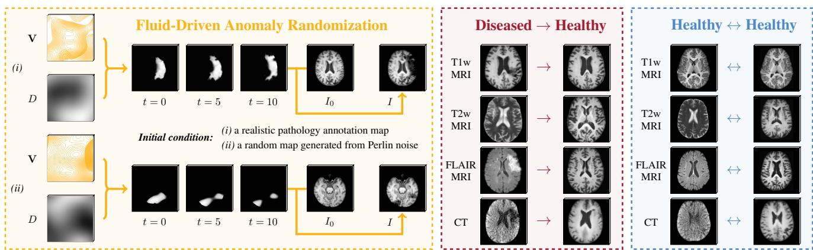
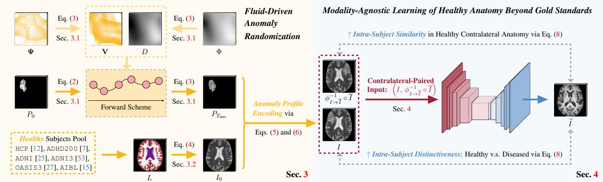
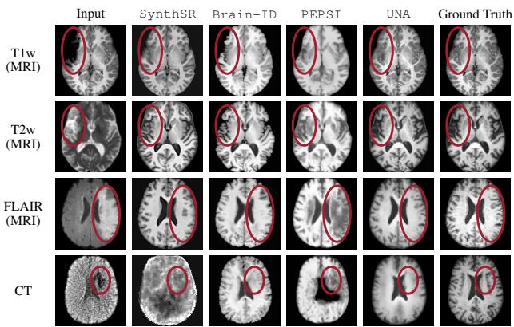
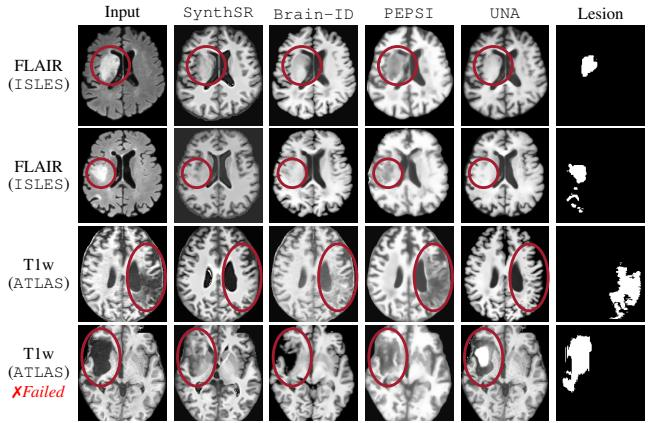
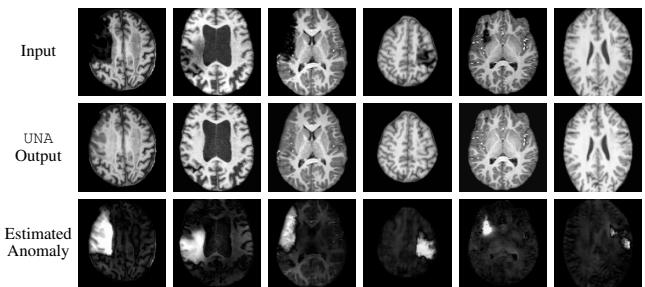
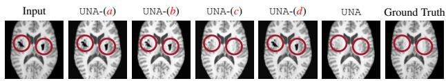

# Unraveling Normal Anatomy via Fluid-Driven Anomaly Randomization

Peirong Liu1 Ana Lawry Aguila1 Juan E. Iglesias1,2,3

1Harvard Medical School and Massachusetts General Hospital 2UCL 3MIT

  
Figure 1. Powered by the proposed fluid-driven anomaly randomization, UNA can handle a range of pathological patterns without requiring paired pathology annotations for training. (i) By bridging the gap between healthy and diseased anatomy, UNA enables the use of general analysis models for images containing pathology; (ii) By reconstructing anatomy in a modality-agnostic manner, UNA facilitates analysis with standard tools designed for high-resolution, healthy T1w MRI.

## Abstract

Data-driven machine learning has made significant strides in medical image analysis. However, most existing methods are tailored to specific modalities and assume a particular resolution (often isotropic). This limits their generalizability in clinical settings, where variations in scan appearance arise from differences in sequence parameters, resolution, and orientation. Furthermore, most general-purpose models are designed for healthy subjects and sufferfrom performance degradation when pathology is present. We introduce UNA (Unraveling Normal Anatomy), the first modality-agnostic learning approach for normal brain anatomy reconstruction that can handle both healthy scans and cases with pathology. We propose a fluid-driven anomaly randomization method that generates an unlimited number of realistic pathology profiles on-the-fly. UNA is trained on a combination of synthetic and real data, and can be applied directly to real images with potential pathology without the need for fine-tuning. We demonstrate UNA’s effectiveness in reconstructing healthy brain anatomy and showcase its direct application to anomaly detection, using both simulated and real images from 3D healthy and stroke datasets, including CT and MRI scans. By bridging the gap between healthy and diseased images, UNA enables the

use ofgeneral-purpose models on diseased images, opening up new opportunities for large-scale analysis of uncurated clinical images in the presence ofpathology. Code is available at https://github.com/peirong26/UNA.

## 1. Introduction

Recent machine learning based methods have significantly advanced the speed and accuracy of brain image analysis tasks, such as image segmentation [11, 26, 37, 41], registration [3, 9, 55], and super-resolution [46, 49]. Human brain imaging in vivo is primarily dominated by Computed Tomography (CT) and Magnetic Resonance Imaging (MRI) [22]. CT is faster and preferred in emergency cases, while MRI provides superior contrast for soft tissues such as the brain. Unlike CT, which is a standardized modality that produces quantitative measurements in Hounsfield units, MRI is generally not calibrated and can generate a wide range of imaging contrasts (e.g., T1w, T2w, FLAIR) to visualize different tissues and abnormalities. This diversity in contrast and the lack of standardization complicate the quantitative analysis of MRI scans. As a result, most existing MRI analysis methods are contrast-specific and often suffer from performance degradation when voxel size or MRI contrast differs between training and testing datasets [52].

This limits the generalizability of machine learning models and leads to redundant data collection and training efforts for new datasets. Recent contrast-agnostic models that leverage synthetic data [5, 20, 23, 24, 33] have demonstrated impressive results, significantly extending their applicability to diverse clinical acquisition protocols. However, these models are primarily designed for analyzing healthy brain anatomy and typically struggle to produce reliable results in the presence of extensive abnormalities (Figs. 3 and 4).

To the best of our knowledge, the recently proposed PEPSI [34] is the only contrast-agnostic brain MRI analysis method that is compatible with extensive pathology. PEPSI leverages synthetic data to estimate T1w and FLAIR MRI from input scans containing pathology. However, it has several limitations: (i) It relies on paired pathology segmentation map associated with each brain anatomy during training, which limits its application to datasets that provide pathology annotations; (ii) It requires access to pretrained pathology segmentation models to compute the implicit pathology segmentation loss; and (iii) It requires additionalfine-tuning to detect anomalies.

Here, we introduce UNA, the first modality-agnostic learning method for Unraveling Normal Anatomy. UNA leverages the power of synthetic data, and can be applied to real images (CT and MRI) of both healthy and diseased populations, without the need for fine-tuning (Fig. 1).

1) We propose fluid-driven anomaly randomization (Sec. 3) to overcome the scarcity of pathology segmentation annotations. Using only limited existing pathology segmentations as initial conditions, our fluid-driven anomaly generator generates unlimited new pathology profiles on-thefly through advection-diffusion partial differential equations (PDEs). This formulation offers a continuous and controllable trajectory for pathology evolution and also naturally enforces realistic constraints on brain abnormalities through boundary conditions (Fig. 1 (left)).

2) We introduce a modality-agnostic learning framework to reconstruct healthy brain anatomy from images with potential pathology (Sec. 4). Our framework leverages symmetry priors of brain anatomy and incorporates subjectspecific anatomical features from contralateral healthy tissue in a self-contrastive learning fashion.

3) We extensively evaluate the healthy anatomy reconstruction performance of UNA on simulated and real images with stroke lesions, in both CT and different MR contrasts (T1w, T2w, and FLAIR) (Secs. 5.1 and 5.2). We further demonstrate the direct application of UNA to anomaly detection, without fine-tuning (Sec. 5.3). UNA achieves state-of-the-art performance in all tasks and modalities.

By bridging the gap between healthy and diseased anatomy UNA enables the use of general-purpose models for images containing pathology, unlocking the tremendous potential for analyzing clinical images with pathology.

## 2. Related Work

Foundation Models in Medical Imaging. Large-scale datasets in medical imaging require significantly more effort to compile than those in natural imaging or language due to varying acquisition protocols and privacy requirements across institutions. Consequently, medical foundation models are not as well developed as their natural image counterparts. There have been, nevertheless, some notable efforts. SAM-Med3D-MoE [51] provides a 3D foundation model for medical image segmentation, trained on 22,000 scans. The MONAI [1] project includes a model zoo with pre-trained models, which are highly task-specific and sensitive to particular image contrasts. Zhou et al. [57] constructed a medical foundation model designed for detecting eye and systemic health conditions from retinal scans. Still, it only functions with color fundus photography and optical coherence tomography modalities. Recently, generalist biomedical AI systems, e.g., GMAI [39] and Med-PaLM M [44, 50], have demonstrated significant potential in biomedical tasks within a vision-language context, including visual question answering, image classification, and radiology report generation. However, they have not tackled more complex dense 3D prediction tasks such as reconstruction, segmentation, and registration.

Contrast-Agnostic Learning for MRI. MRI scans acquired across sites vary substantially in appearance due to differences in contrast, resolution, and orientation. This heterogeneity leads to duplicate training efforts for approaches that are sensitive to specific MR contrast. Classical approaches in brain segmentation used Bayesian inference for contrast robustness [14, 29], but require long processing times and struggle with resolutions that are not high and isotropic [23, 40]. SynthSeg [5, 6] achieves contrastand resolution-agnostic segmentation with a synthetic generator that simulates widely diverse contrasts and resolutions. The same generator has been used to achieve contrast invariance in tasks like image registration [10, 20], superresolution [24], or skull stripping [21]. Brain-ID [33] explored contrast-agnostic feature representations that generalize across various fundamental medical image analysis tasks, including image synthesis, segmentation, and superresolution. However, all these general-purpose methods are either trained exclusively on healthy anatomical labels, or require paired anatomy-pathology annotations, which limits their application primarily to healthy subjects or every specific pathology (e.g., white matter lesions) – as opposed to previously unseen pathology profiles (Figs. 3 and 4).

Fluid-Based Dynamics Modeling. Fluid dynamics is a fundamental topic in physics and plays a crucial role in various real-world applications such as weather forecasting, airflow analysis [8], optical flow [45, 47], image registration [43, 48, 56], and perfusion analysis [32]. In fluid dynamics, advection-diffusion PDEs are commonly employed to describe the fluid transport processes. Liu et al. [35] introduced regularization-free representations to ensure the compressibility and positive semi-definiteness of estimated velocity and diffusion fields. Franz et al. [16] simulated 3D density and velocity fields from single-view data without 3D supervision. Xing et al. [54] proposed to learn the velocity field from past physical observations using Helmholtz dynamics, eliminating the need for ground truth velocity. In these studies, the inverse problem of velocity estimation provides interpretable insights for predicting future fluid behavior. We build upon the concept of fluid flow simulation and frame anomaly pattern randomization as aforward process of advection-diffusion PDEs. This formulation naturally enables us to ensure that simulated anomaly outcomes are well posed, through controllable velocity fields and established boundary conditions (Sec. 3.1).

## 3. Fluid-Driven Anomaly Randomization

Manually annotating pathology to create gold-standard segmentation is extremely costly, particularly for 3D medical images. This process not only requires specialized expertise from clinicians, but is also highly time-consuming and not reproducible. Consequently, large-scale datasets with gold-standard pathology annotations are almost inexistent (BraTS [36] being a notable exception). In addition, discrepancies often arise among the gold-standard pathology segmentation maps provided by different datasets. To address these issues, we seek to design an anomaly randomization approach that is:

i. Expressive: the generated anomaly profiles should exhibit diverse and expressive shapes and intensities that sufficiently reflect the variety of pathological appearances encountered in clinical practice.

ii. Realistic: the randomized abnormalities must conform to realistic constraints. For example, abnormalities in white matter should not appear in other tissue structures, brain tumors should be localized within the brain region.

To achieve these two aims, we propose randomizing unlimited, diverse anomaly profiles by formulating the generation as a forward mass transport process, with realistic constraints naturally guaranteed by boundary conditions. Our anomaly randomization consists of three steps (Alg. 1): (i) Initializations of random anomaly $( P _ { 0 } )$ , velocity (V), and diffusion (D) for anomaly transport; (ii) Forward transport of abnormal intensities for random time steps; (iii) Appearance encoding of the generated anomaly on healthy images of any modality. Sec. 3.1 below describes the generation of abnormal profiles (i-ii), and Sec. 3.2 introduces the encoding of abnormalities on healthy images (iii).

Algorithm 1: Fluid-Driven Anomaly Randomization   
Dataset: Healthy images with anatomy labels $( \mathbb { D } _ { \mathrm { S y n t h } } ) ;$   
Gold standard pathology annotations (D )   
Settings: $\Omega , \Omega _ { p } , \mathbf { n } , T _ { \mathrm { m a x } }$ in Eq. (2); θl, $\theta _ { \mu } , \theta _ { \sigma }$ in Eq. (4)   
Input: Anatomy label L, or, real image $I _ { 0 }$   
Output: Image (I) which is encoded with the randomized   
pathology profile (P)   
/ Initialization \*/   
1 Randomly select $P _ { 0 } \in \mathbb { D } _ { \operatorname { P a t h o l } }$   
2 Randomly select label L or image $I \in \mathbb { D } _ { \mathrm { S y n t h } }$   
/\* Fluid-Driven Forward Randomization /   
3 Randomly sample potential fields Ψ and Φ in Eq. (3)   
4 while $t \leq T _ { m a x }$ do   
5 Randomly pick anomaly transport time $T \leq T _ { \mathrm { m a x } }$   
6 Reconstruct V and D via Eq. (3)   
7 Compute forward scheme via Eqs. (1) and (2)   
8 Obtain randomized $P = P ( \mathbf { x } , T _ { \mathrm { m a x } } )$   
/\* Random Modality Generation \*/   
9 if L as input then   
10 Synthesize random modality $I _ { 0 }$ via Eq. (4)   
/\* Anomaly Profile Encoding /   
11 Encode randomized P into $I _ { 0 }$ via Eqs. (5) and (6)

## 3.1. Anomaly Profile Randomization

Background. Advection-diffusion PDEs describe a large family of fluid dynamics processes, e.g., heat conduction, wind dynamics, and blood flow [8, 32, 54]. In general, the advection term refers to the mass transport driven by fluid flow, while the diffusion term refers to the gradient of mass concentration. Inspired by the advection-diffusion process, which computes the natural progression of mass intensities, we propose to randomize an unlimited variety of anomaly profiles by formulating the generation as $\mathbf { a } f o r -$ ward advection-diffusion, starting from either a single realistic pathology annotation map or a random shape.

Problem Setup. Let $P ( \mathbf { x } , t )$ denote the pathology probability at location x in a bounded domain of interest $\Omega \subset \mathbb { R } ^ { 3 }$ (e.g., brain), at time t. The local pathology probability changes of an anomaly randomization process are described by the advection-diffusion PDE:

$$
\frac { \partial P ( \mathbf { x } , t ) } { \partial t } = \underbrace { - \nabla \left( \mathbf { V } ( \mathbf { x } ) \cdot P ( \mathbf { x } , t ) \right) } _ { \mathrm { F l o w } } + \underbrace { \nabla \cdot \left( D ( \mathbf { x } ) \nabla P ( \mathbf { x } , t ) \right) } _ { \mathrm { D i f f u s i o n } } ,\tag{1}
$$

$$
s . t . \underbrace { P ( \mathbf { x } , 0 ) = P _ { 0 } ( \mathbf { x } ) } _ { \mathrm { I n i t i a l } \mathrm { C o n d i t i o n } } , \underbrace { \frac { P ( \mathbf { x } , t ) } { \partial \mathbf { n } } } _ { \mathrm { Z e r o - N e u m a n n } } \Big | _ { \partial \Omega _ { p } } = 0 , t \leq T _ { \mathrm { m a x } } ,\tag{2}
$$

where t $( T _ { \mathrm { m a x } } )$ refers to the (maximum) time steps used for the generation of new anomaly profiles. The spatially varying velocity field $\mathbf { V } ( \mathbf { x } ) \in \mathbb { R } ^ { 3 }$ and diffusion scalar field $D ( \mathbf { x } ) \in \mathbb { R }$ govern the advection and diffusion process of an initial anomaly, $P _ { 0 } ( \mathbf { x } )$ . The zero Neumann boundary condition ensures that the randomization process of $P _ { 0 }$ satisfies pre-assumed bounds of the anomaly developing regions. To ensure that the dynamics of anomaly changes are well posed, we impose the incompressible flow and nonnegative diffusion constraints on V and D [35], and rewrite the advection-diffusion process in Eq. (1) as:

$$
\begin{array} { r l } & { \frac { \partial P ( \mathbf { x } , t ) } { \partial t } = - \mathbf { V } ( \mathbf { x } ) \cdot \nabla P ( \mathbf { x } , t ) + \nabla \cdot \left( D ( \mathbf { x } ) \nabla P ( \mathbf { x } , t ) \right) } \\ & { \qquad = \underbrace { - \nabla \times \boldsymbol { \Psi } ( \mathbf { x } ) \cdot \nabla P ( \mathbf { x } , t ) } _ { \mathrm { I n c o m p r e s s i b l e ~ F l o w } } + \underbrace { \nabla \cdot \left( \Phi ^ { 2 } ( \mathbf { x } ) \nabla P ( \mathbf { x } , t ) \right) } _ { \mathrm { N o n - N e g a t i v e ~ D i f f u s i o n } } , } \end{array}\tag{3}
$$

where $\Psi \in L ^ { 3 } ( \Omega ) ^ { 3 }$ and $\Phi \in \mathbb { R } ^ { + } ( \Omega )$ refer to the potential fields for representing V and $D ,$ , respectively, such that the resulting flow and diffusion will be incompressible and nonnegative by construction.

Initializations of $P _ { 0 } , \mathbf { V } , D .$ To enrich the diversity of abnormal profiles, we initialize the anomaly $( P _ { 0 }$ in Eq. (2)) from two sources: (i) Publicly available pathology annotations from the ATLAS [31] and ISLES [19] stroke datasets, which include high-quality gold-standard segmentation of stroke lesions. (ii) Random shapes using randomly thresholded Perlin noise, a widely used procedural generation algorithm known for creating rich textures. We further generate random Perlin noise for creating random potentials Ψ for V, and Φ for D.

Forward Scheme. We employ a first-order upwind scheme [30] to approximate the differential operators associated with the advection term, and a nested centralforward-backward difference scheme for the diffusion term in Eq. (3). Discretizing the spatial derivatives leads to a system of ordinary differential equations that can be solved with numerical integration. To enhance numerical stability and ensure compliance with the Courant-Friedrichs-Lewy (CFL) condition [17, 30], we apply the RK45 method for adaptive time-stepping (δt) in advancing to $P ^ { t + \delta t }$

As shown in Fig. 1 (left), we can generate infinite variations from a single pathology profile via the introduced fluid-driven anomaly transport, while naturally satisfying boundary conditions imposed by the brain contour.

## 3.2. Anomaly Apprearance Randomization

As mentioned in Sec. 2, large-scale annotation of 3D medical imaging data requires tremendous effort. UNA is instead trained on a combination of synthetic and real images (many of them labeled automatically). Specifically, we encode the generated pathology profiles, P, into normal anatomy of healthy control scans, enabling the generation of diverse images with random modalities, each exhibiting a distinct appearance introduced by P.

Random Modality Generation. To generate healthy images with complex structural details, we first leverage domain randomization [33] to synthesize images of random modality and resolution with healthy anatomy (Fig. 2 (left)). Specifically, we randomly sample intensities on 3D neuroanatomical segmentation (label maps $L ) ,$ , where the intensities are conditioned on the label at each location:

$$
\begin{array} { r } { \{ I _ { 0 } ( \mathbf { x } ) \sim \mathcal { N } ( \mu _ { l } , \sigma _ { l } ) , l \in L ,  \phantom { ( \mu _ { l } ) } } \\ {  \mu _ { l } \sim \mathcal { U } ( 0 , 1 | \theta _ { \mu } , \theta _ { l } ) , \sigma _ { l } \sim \mathcal { U } ( 0 , 1 | \theta _ { \sigma } , \theta _ { l } ) , } \end{array}\tag{4}
$$

where $\mu _ { l }$ and $\sigma _ { l }$ refer to the mean and variance of the uniform distribution of each label $l . ~ \theta _ { l } , \theta _ { \mu } , \theta _ { \sigma } \in \Theta$ control the shifts and scales. A random deformation field is then generated for augmentation purposes, comprising linear and non-linear transformations [24, 33].

Anomaly Profile Encoding. We encode the random anomaly profiles from Sec. 3.1 into the generated healthy anatomy $I _ { 0 } ,$ , based on a priori knowledge on the white and gray matter intensities of $I _ { 0 }$ [28, 34]:

$$
I ( { \bf x } ) = I _ { 0 } ( { \bf x } ) + \Delta I ( { \bf x } ) * P ( { \bf x } ) ,\tag{5}
$$

$$
s . t . \Delta I ( \mathbf { x } ) \sim \left\{ \begin{array} { l l } { \{ 0 \} , } & { x \notin \Omega _ { P } } \\ { \mathcal { N } ( - \mu _ { \mathrm { w } } / 2 , \mu _ { \mathrm { w } } / 2 ) , } & { x \in \Omega _ { P } , \mu _ { \mathrm { w } } > \mu _ { \mathrm { g } } } \\ { \mathcal { N } ( \mu _ { \mathrm { w } } / 2 , \mu _ { \mathrm { w } } / 2 ) , } & { x \in \Omega _ { P } , \mu _ { \mathrm { w } } \leq \mu _ { \mathrm { g } } } \end{array} \right.\tag{6}
$$

$\mu _ { \mathrm { w } } \left( \mu _ { \mathrm { g } } \right)$ is the mean of $I _ { 0 } { ' } s$ white (gray) matter intensities. A higher $\mu _ { \mathrm { w } }$ resembles T1w, where pathology appears darker, while a lower $\mu _ { \mathrm { w } }$ resembles T2w/FLAIR, where pathology is typically brighter. Considering extreme scenarios, we randomly assign the sign of $\Delta I ( { \bf x } )$ 20% of the time. I further undergoes a standard augmentation pipeline [23], introducing partial voluming [5] and various resolutions, noise, scanning artifacts commonly found in clinical practice.

## 4. Learning Anatomy Beyond Gold Standards

In this section, we present UNA’s end-to-end training framework, which learns to unravel normal anatomy from images of random modality containing potential pathology.

Contralateral-Paired Input. Healthy human brain anatomy typically exhibits a high degree of symmetry in structure. Based on this fact, we combine the original input image (I) with its contralateral-mirrored image (I) to create paired inputs for UNA’s healthy anatomy reconstruction learning. This approach allows our model to “borrow” healthy information from the contralateral counterpart, thereby enhancing subject-specific healthy anatomy reconstruction. To ensure structural correspondence and minimize computational complexity during training, we pre-compute the deformation $( \phi _ { I  \overline { { I } } } )$ between each training subject’s scan and its axial-flipped image using NiftyReg [38,42]. As a result, the contralateral-paired input for each subject sample is represented as $( I , \phi _ { I  \overline { { { I } } } } ^ { - 1 } \circ \overline { { { I } } } )$

Modality-Agnostic Healthy Anatomy Reconstruction. To enhance model generalizability, UNA is trained on both real datasets containing pathology $\left( \mathbb { D } _ { \mathrm { R e a l } } \right)$ and synthetic images $( \mathbb { D } _ { \mathrm { S y n t h } } )$ generated from fluid-driven anomaly randomization (Sec. 3), featuring varying simulated modalities and abnormality conditions. During training, we define the following healthy anatomy reconstruction loss, which takes into account both the subject-level and the voxel-level abnormality of the input image (I):

  
Figure 2. UNA’s framework overview for modality-agnostic learning of healthy anatomy, supported by fluid-driven anomaly randomization.

$$
\begin{array} { r l r } {  { \mathcal { L } _ { \mathrm { R e c o n } } = \int _ { \Omega } k ( \mathbf { x } ) \{ | \widetilde { I } ( \mathbf { x } ) - I ( \mathbf { x } ) | + \lambda _ { \nabla } | \nabla \widetilde { I } ( \mathbf { x } ) - \nabla I ( \mathbf { x } ) | \} } } \\ & { s . t . } & { k ( \mathbf { x } ) = \{ 1 - d \cdot p ( \mathbf { x } )  , \quad \quad \quad \quad \quad \mathbf { x } \in \Omega _ { P } , } \\ & { } & {  ( 1 + \lambda _ { p } ) \cdot ( 1 - d ) \cdot p ( \mathbf { x } ) , \quad \mathbf { x } \notin \Omega _ { P } ,  , } \end{array}\tag{7}
$$

where $d = \lbrace 1 : I \in \mathbb { D } _ { \mathrm { R e a l } } ; 0 : I \in \mathbb { D } _ { \mathrm { S y n t h } } \rbrace$ indicates whether the current image is sourced from real datasets $\left( \mathbb { D } _ { \mathrm { R e a l } } \right)$ or generated synthetically $( \mathbb { D } _ { \operatorname { S y n t h } } )$ The parameters $\lambda _ { \nabla }$ and $\lambda _ { p }$ control the training weights for gradient L1 loss and attention to pathology, respectively. Specifically: (i) if the current training input image (I) is generated by UNA, i.e., the ground truth healthy anatomy of the entire brain region is accessible, we compute the anatomy reconstruction loss across the whole brain (Ω). (ii) Conversely, if I is sourced from real datasets, the ground truth healthy anatomy of the entire brain is not available. In this case, we compute the voxel-wise reconstruction loss exclusively for the healthy regions, while masking out any abnormalities.

Intra-Subject Self-Contrastive Learning. In Eq. (7), the anatomy reconstruction in abnormal regions is not supervised when dealing with real images containing pathology. To enhance the performance of learning healthy anatomy, we propose an intra-subject learning strategy that exploits the (approximate) symmetry of the brain with a contrastive loss that encourages two properties:

i. Similarity in appearance between the reconstructed healthy anatomy and its contralateral healthy counterpart.

ii. Distinctiveness between the reconstructed anatomy and the original regions that exhibit abnormalities.

Specifically, we define this intra-subject contrastive loss as:

$$
\mathcal { L } _ { \mathrm { C o n t r a s t } } = - l o g \frac { \displaystyle \int _ { \Omega _ { p \setminus \overline { { p } } } } e ^ { \widetilde { I } \cdot ( \phi _ { I  \overline { { I } } } ^ { - 1 } \circ \overline { { I } } ) / \alpha } d \mathbf { x } } { \displaystyle \int _ { \Omega _ { p \setminus \overline { { p } } } } e ^ { \widetilde { I } \cdot ( \phi _ { I  \overline { { I } } } ^ { - 1 } \circ \overline { { I } } ) / \beta } + e ^ { \widetilde { I } \cdot I / \gamma } d \mathbf { x } } ,\tag{8}
$$

where $\Omega _ { p \backslash \overline { { p } } } = \Omega _ { p } \setminus ( \Omega _ { p } \cap \Omega _ { \phi _ { I  \overline { { I } } } ^ { - 1 } \circ \overline { { P } } } )$ , ensuring that we exclude pathologies that appear at the same contralateral location on both hemispheres. $\alpha , \beta , \gamma$ represent the corresponding temperature scaling factors of each term.

Thus, UNA’s end-to-end healthy anatomy reconstruction training loss is obtained by the sum of Eqs. (7) and (8):

$$
\begin{array} { r } { \mathcal { L } = \mathcal { L } _ { \mathrm { R e c o n } } + \lambda _ { \mathrm { C o n t r a s t } } \mathcal { L } _ { \mathrm { C o n t r a s t } } , } \end{array}\tag{9}
$$

where $\lambda _ { \mathrm { C o n t r a s t } }$ is the weight of self-contrastive learning loss.

As shown in Fig. 1, as a general model for healthy anatomy reconstruction, UNA also addresses the following tasks: (i) Given an input image without any abnormalities, UNA performs anatomy reconstruction; (ii) Given a T1w MRI of any resolution, UNA performs super-resolution.

## 5. Experiments

We evaluate UNA’s performance and demonstrate its impact from three perspectives. (i) The reconstruction of anatomy from healthy images. This enables analysis with standard tools made for high-resolution T1w MRI, such as segmentation and parcellation using FreeSurfer [13], registration with NiftyReg [38, 42], ANTs [2], etc. (ii) The synthesis of healthy anatomy from images with pathology. This allows for the application of well-established general-purpose models to images with extensive pathology. For a more comprehensive assessment, we test on both synthetic data – where ground truth healthy images are available (Sec. 5.1) – and real images from two public stroke datasets – where the ground truth healthy anatomy is unknown (Sec. 5.2). (iii) We further demonstrate UNA’s direct application to anomaly detection (Sec. 5.3). Our test data includes CT and various MRI modalities (T1w, T2w, FLAIR).

Datasets. We conducted experiments using eight public datasets: ADNI [25], ADNI3 [53], HCP [12], ADHD200 [7], AIBL [15], OASIS3 [27], ATLAS [31], ISLES [19]. ATLAS and ISLES include stroke patients, associated with gold-standard manual segmentations of stroke lesions (referred to as $\mathbb { D } _ { \mathrm { S t r o k e } }$ hereafter). The other datasets contain subjects with healthy anatomy $( \mathbb { D } _ { \mathrm { H e a l t h y } } )$ These datasets cover both MR (T1w, T2w, FLAIR) and CT images. The train/test subject splits for each dataset are listed in Tab. 2.

Synthetic Data Generation. We use the anatomical labels of training subjects from $\mathbb { D } _ { \mathrm { H e a l t h y } }$ for random modality generation (Sec. 3.2). The synthetic abnormal profiles are generated using UNA’s fluid-driven anomaly randomization (Sec. 3), with initial profiles either sampled from the gold standard lesion segmentation maps of training subjects in $\mathbb { D } _ { \mathrm { S t r o k e } }$ , or Perlin noise (Sec. 3.1). For evaluation on simulated data in Sec. 5.1, we employ our synthetic generator to create 1,000 testing samples from $\mathbb { D } _ { \mathrm { H e a l t h y } }$ , encoded with random anomaly profiles from $\mathbb { D } _ { \mathrm { S t r o k e } }$ This generation is solely for providing ground truth healthy anatomy; therefore, we encode random anomaly profiles without applying any additional deformation and corruption.

Metrics. For anatomy reconstruction and synthesis, we use L1 distance, PSNR, and SSIM. For anomaly detection, we assess performance using Dice scores.

Implementation Details. For fair comparisons, we adopt the same 3D UNet [41] as utilized in the models [23,33,34] we compare with. The training sample images are sized at $1 6 0 ^ { 3 }$ , with a batch size of 4. We use the AdamW optimizer, beginning with a learning rate of $1 0 ^ { - 4 }$ for the first 300,000 iterations, which is then reduced to $1 0 ^ { - 5 }$ for the subsequent 100,000 iterations. The additional attention parameter $( \lambda _ { p }$ in Eq. (7)) is set to 1 for healthy anatomy reconstruction in pathological regions. The intra-subject contrastive learning weight $( \lambda _ { \mathrm { { c o n t r a s t } } }$ in Eq. (9)) is set to 2. The training process took approximately 14 days on an NVIDIA A100 GPU.

Competing Models. UNA is the first model achieving modality-agnostic healthy anatomy synthesis and reconstruction. We compare UNA with the closest state-of-theart modality-agnostic models for image reconstruction and anomaly detection: (i) SynthSR [23], a modality-agnostic super-resolution model; (ii) Brain-ID [33], a modalityagnostic feature representation and T1w synthesis model; (iii) PEPSI [34], a modality-agnostic pathology representation model for T1w and FLAIR MRI synthesis. Note that PEPSI does not synthesize healthy tissue in regions of pathology; (iv) VAE [4], an unsupervised anomaly detection variational autoencoder model for brain MRI; (v) LDM [18], an out-of-distribution detection model for 3D medical images using latent diffusion.

<table><tr><td rowspan="2">Modality</td><td rowspan="2">Method</td><td colspan="3">L1 (↓)</td><td colspan="3">PSNR(↑)</td><td colspan="3">SSIM(↑)</td></tr><tr><td>F</td><td>H</td><td>D</td><td>F</td><td>H</td><td>D</td><td>F</td><td>H</td><td>D</td></tr><tr><td rowspan="4">Tlw MRI</td><td>SynthSR [23]</td><td>0.0285</td><td>0.0253</td><td>0.0010</td><td>20.71</td><td>22.90</td><td>36.59</td><td>0.823</td><td>0.879</td><td>0.895</td></tr><tr><td>Brain-ID [33]</td><td>0.0231</td><td>0.0219</td><td>0.0007</td><td>22.86</td><td>23.71</td><td>40.22</td><td>0.859</td><td>0.890</td><td>0.904</td></tr><tr><td>PEPSI [34]</td><td>0.0257</td><td>0.0194</td><td>N/A</td><td>21.78</td><td>23.21</td><td>N/A</td><td>0.831</td><td>0.872</td><td>N/A</td></tr><tr><td>UNA</td><td>0.0147</td><td>0.0143</td><td>0.0003</td><td>31.98</td><td>33.25</td><td>45.61</td><td>0.981</td><td>0.992</td><td>0.998</td></tr><tr><td rowspan="4">T2w MRI</td><td>SynthSR [23]</td><td>0.0362</td><td>0.0337</td><td>0.0016</td><td>18.25</td><td>20.66</td><td>35.47</td><td>0.816</td><td>0.864</td><td>0.880</td></tr><tr><td>Brain-ID [33]</td><td>0.0277</td><td>0.0269</td><td>0.0008</td><td>20.98</td><td>22.31</td><td>39.62</td><td>0.844</td><td>0.881</td><td>0.892</td></tr><tr><td>PEPSI [34]</td><td>0.0295</td><td>0.0279</td><td>N/A</td><td>19.33</td><td>23.18</td><td>N/A</td><td>0.820</td><td>0.845</td><td>N/A</td></tr><tr><td>UNA</td><td>0.0184</td><td>0.0182</td><td>0.0003</td><td>25.14</td><td>26.22</td><td>45.69</td><td>0.938</td><td>0.981</td><td>0.998</td></tr><tr><td rowspan="4">FLAIR MRI</td><td>SynthSR [23]</td><td>0.0327</td><td>0.0300</td><td>0.0016</td><td>19.30</td><td>21.04</td><td>34.88</td><td>0.823</td><td>0.869</td><td>0.895</td></tr><tr><td>Brain-ID [33]</td><td>0.0285</td><td>0.0242</td><td>0.0010</td><td>19.98</td><td>20.32</td><td>38.76</td><td>0.840</td><td>0.879</td><td>0.907</td></tr><tr><td>PEPSI [34]</td><td>0.0301</td><td>0.0287</td><td>N/A</td><td>19.82</td><td>21.59</td><td>N/A</td><td>0.842</td><td>0.850</td><td>N/A</td></tr><tr><td>UNA</td><td>0.0202</td><td>0.0194</td><td>0.0007</td><td>28.34</td><td>28.93</td><td>42.91</td><td>0.921</td><td>0.982</td><td>0.996</td></tr><tr><td rowspan="4">CT</td><td>SynthSR [23]</td><td>0.0541</td><td>0.0536</td><td>0.0029</td><td>13.97</td><td>13.13</td><td>28.50</td><td>0.712</td><td>0.763</td><td>0.725</td></tr><tr><td>Brain-ID [33]</td><td>0.0339</td><td>0.0357</td><td>0.0018</td><td>20.15</td><td>21.20</td><td>32.87</td><td>0.811</td><td>0.824</td><td>0.843</td></tr><tr><td>PEPSI [34]</td><td>0.0473</td><td>0.0420</td><td>N/A</td><td>16.72</td><td>16.90</td><td>N/A</td><td>0.723</td><td>0.782</td><td>N/A</td></tr><tr><td>UNA</td><td>0.0259</td><td>0.0266</td><td>0.0010</td><td>25.63</td><td>25.70</td><td>42.53</td><td>0.883</td><td>0.897</td><td>0.895</td></tr></table>

Table 1. Quantitative comparisons of healthy anatomy reconstruction performance between UNA and state-of-the-art contrastagnostic T1w synthesis models, using images with simulated pathology. PEPSI [34] is designed to emphasize the abnormalities, therefore we do not report its scores within diseased regions. (F: full brain; H: healthy region; D: diseased region.)

  
Figure 3. Qualitative comparisons on healthy anatomy reconstruction, between UNA, and the state-of-the-art modality-agnostic T1w synthesis method. Testing images are generated from real healthy subjects encoded with randomly simulated pathology profiles. Pathology regions are circled in red.

## 5.1. Simulations with Ground Truth Anatomy

To better evaluate UNA’s performance in healthy anatomy reconstruction, we first conduct experiments using 1,000 healthy images encoded with simulated pathologies, for which ground truth segmentations are available for quantitative assessment. To explicitly assess the model performance in pathology regions, we report reconstruction scores not only for the entire brain but also separately for areas that are originally healthy and diseased in the input image.

Tab. 1 reports the quantitative comparison results between UNA and the state-of-the-art modality-agnostic synthesis models. UNA yields the best performance across all metrics, modalities, and regions of interest – including the full brain, healthy anatomy, and pathological regions. Remarkably, UNA outperforms competing models by a large margin in anatomy reconstruction within diseased tissue.

  
Figure 4. Qualitative comparisons on healthy anatomy reconstruction between UNA and state-of-the-art modality-agnostic synthesis models. Testing images are from real stroke datasets (ISLES [19] and ATLAS [31]), where the stroke lesion annotations are provided, yet the ground truth healthy anatomy is unavailable. The last row shows a failure case of UNA, where it “over-corrects” the diseased anatomy. Pathology regions are circled in red.

Visualization results for each test modality are provided in Fig. 3. UNA demonstrates consistent performance across modality and resolution. Notably, other models either fail to capture any anatomy (SynthSR [23]) or generate unrealistic patterns around the pathology (Brain-ID [33] and PEPSI [34]) when given a noisy CT scan $( 4 ^ { \mathrm { t h } }$ row in Fig. 3), whereas UNA successfully reconstructs plausible healthy anatomy.

## 5.2. Real-World Datasets with Potential Pathology

We further evaluate UNA’s performance on all the real datasets as introduced in Sec. 5, among which ATLAS [31] and ISLES [19] contain stroke patients. Tab. 2 reports the reconstruction scores over all datasets and their available modalities: (i) For anatomy reconstruction of originally healthy subjects, UNA achieves the highest scores across most datasets, with the remaining scores on par with Brain-ID [33], which is specifically designed for healthy anatomy; (ii) On the ATLAS stroke dataset, UNA outperforms competing models by a larger margin (≈ 10%).

As shown in Fig. 4, other models tend to generate unrealistic patterns within and around abnormalities, whereas UNA’s reconstructions are notably more visually coherent. Additionally, we present a failure case (4th row in Fig. 4), where we observe that UNA tends to “over-distinguish” the reconstructed healthy anatomy from the diseased regions, particularly in challenging scenarios where the pathology pattern completely occludes the underlying anatomy.

## 5.3. Direct Application: Anomaly Detection

UNA’s ability to synthesize diseased-to-healthy anatomy naturally equips it with the potential for application to anomaly detection. To demonstrate its effectiveness, we directly use the reconstructed healthy anatomy from UNA to detect abnormalities. Specifically, we follow the standard evaluation pipeline for unsupervised anomaly detection in medical images [4,18] and compute UNA’s anomaly estimation maps by calculating the voxel-wise absolute differences between the diseased input and the reconstructed output. The anomaly detection Dice scores are then obtained by comparing the ground truth pathology segmentations with the computed anomaly estimation maps, scaled to the range

<table><tr><td>Modality</td><td>Dataset (Train/Test)</td><td>Method</td><td colspan="3">Reconstruction (on Healthy) L1 (↓) PSNR (↑) SSIM(↑)</td></tr><tr><td rowspan="10"></td><td rowspan="4">ADNI [25] (1841/204)</td><td rowspan="4">SynthSR [23] Brain-ID [33]</td><td>0.014</td><td>26.78</td><td>0.984</td></tr><tr><td>0.012</td><td>33.82</td><td>0.993</td></tr><tr><td>PEPSI [34]</td><td>31.25</td><td>0.989</td></tr><tr><td>0.014</td><td>32.96</td><td>0.995</td></tr><tr><td rowspan="8">HCP [12] (808/87)</td><td>UNA</td><td>0.012</td><td></td><td></td></tr><tr><td>SynthSR [23]</td><td>0.033 0.020</td><td>22.13</td><td>0.854</td></tr><tr><td>Brain-ID [33]</td><td></td><td>27.47</td><td>0.957</td></tr><tr><td>PEPSI [34]</td><td>0.023 0.017</td><td>28.20</td><td>0.971</td></tr><tr><td>UNA</td><td></td><td>31.61</td><td>0.986</td></tr><tr><td>SynthSR [23]</td><td>0.023</td><td>23.60</td><td>0.928</td></tr><tr><td>Brain-ID [33]</td><td>0.021</td><td>29.89</td><td>0.966</td></tr><tr><td rowspan="8">MRI ADHD200[7]</td><td rowspan="8">(298/33) UNA</td><td>PEPSI [34]</td><td>0.020</td><td>26.67</td><td>0.935</td></tr><tr><td></td><td>0.019</td><td>30.01</td><td>0.975</td></tr><tr><td>SynthSR [23]</td><td>0.035</td><td>21.67</td><td>0.882</td></tr><tr><td>Brain-ID [33]</td><td>0.011</td><td>32.48</td><td>0.996</td></tr><tr><td>PEPSI [34]</td><td>0.015</td><td>29.87</td><td>0.976</td></tr><tr><td>UNA</td><td>0.012</td><td>30.12</td><td>0.980</td></tr><tr><td>SynthSR [23]</td><td>0.026</td><td>22.95</td><td>0.916</td></tr><tr><td>Brain-ID [33]</td><td>0.009</td><td>33.73</td><td>0.972</td></tr><tr><td rowspan="6"></td><td rowspan="3">(601/67) * Stroke *</td><td>PEPSI [34]</td><td>0.012</td><td>29.86</td><td>0.950</td></tr><tr><td>UNA</td><td>0.010</td><td>32.89</td><td>0.964</td></tr><tr><td>SynthSR [23]</td><td>0.030</td><td>23.50</td><td>0.881</td></tr><tr><td rowspan="3">ATLAS [31] (590/65)</td><td>Brain-ID [33]</td><td>0.027</td><td>26.09</td><td>0.892</td></tr><tr><td>PEPSI [34]</td><td>0.025</td><td>26.73</td><td>0.905</td></tr><tr><td>UNA</td><td>0.020</td><td>29.10</td><td>0.974</td></tr><tr><td rowspan="5">T2w MRI</td><td rowspan="5">HCP [12] (808/87)</td><td>SynthSR [23] Brain-ID [33]</td><td>0.034 0.016</td><td>21.46 28.10</td><td>0.833 0.934</td></tr><tr><td>PEPSI [34]</td><td>0.018</td><td></td><td>0.915</td></tr><tr><td></td><td></td><td>26.45</td><td>0.949</td></tr><tr><td>UNA</td><td>0.016</td><td>28.62</td><td></td></tr><tr><td>SynthSR [23]</td><td>0.033</td><td>20.08</td><td>0.805</td></tr><tr><td rowspan="5"></td><td rowspan="3">(272/30)</td><td>Brain-ID [33] PEPSI [34]</td><td>0.022 0.024</td><td>23.99</td><td>0.861 0.859</td></tr><tr><td>UNA</td><td>0.021</td><td>22.93 24.76</td><td>0.892</td></tr><tr><td></td><td></td><td></td><td></td></tr><tr><td rowspan="3">ADNI3 [53] (298/33)</td><td>SynthSR [23]</td><td>0.026 0.017</td><td>22.77</td><td>0.919 0.927</td></tr><tr><td>Brain-ID [33] PEPSI [34]</td><td></td><td>26.44</td><td>0.929</td></tr><tr><td>UNA</td><td>0.023 0.015</td><td>25.62 27.43</td><td>0.965</td></tr><tr><td rowspan="3"></td><td rowspan="3">AIBL [15] (302/34)</td><td>SynthSR [23] Brain-ID [33]</td><td>0.029</td><td>21.77</td><td>0.902 0.936</td></tr><tr><td>PEPSI [34]</td><td>0.019</td><td>27.25 25.43</td><td>0.914</td></tr><tr><td>UNA</td><td>0.021 0.017</td><td>27.76</td><td>0.967</td></tr><tr><td rowspan="3">CT</td><td rowspan="3">OASIS3 [27] (795/88)</td><td>SynthSR [23]</td><td>0.041</td><td>20.93</td><td>0.758</td></tr><tr><td>Brain-ID [33]</td><td>0.023</td><td>25.49</td><td>0.891</td></tr><tr><td>PEPSI [34] UNA</td><td>0.027</td><td>22.98</td><td>0.842</td></tr></table>

Table 2. Quantitative comparisons of healthy anatomy reconstruction performance between UNA and state-of-the-art, contrastagnostic T1w synthesis models, evaluated on real images. Since we do not have ground truth anatomy for the stroke datasets, we only report the reconstruction performance within healthy regions. (ISLES [19] stroke dataset does not provide T1w MRI scans, therefore we only show qualitative results on ISLES in Fig. 4.)

  
Figure 5. Visualizations of directly applying UNA’s healthy anatomy reconstruction for anomaly detection. The estimated anomaly is computed as the absolute difference between diseased T1w MRI scans and UNA’s reconstructed healthy anatomy.

<table><tr><td>Image Source</td><td>Dataset</td><td>SynthSR [23]</td><td>Brain-ID [33]</td><td>VAE [4]</td><td>LDM [18]</td><td>UNA</td></tr><tr><td>Healthy T1w</td><td>ADNI [25]</td><td>0.27</td><td>0.26</td><td>0.18</td><td>0.23</td><td>0.36</td></tr><tr><td>with</td><td>HCP [12]</td><td>0.28</td><td>0.28</td><td>0.13</td><td>0.21</td><td>0.33</td></tr><tr><td>Simulated</td><td>ADHD200[7]</td><td>0.23</td><td>0.25</td><td>0.15</td><td>0.23</td><td>0.34</td></tr><tr><td>Pathology</td><td>ADNI3 [53]</td><td>0.27</td><td>0.28</td><td>0.17</td><td>0.24</td><td>0.37</td></tr><tr><td></td><td>AIBL [15]</td><td>0.25</td><td>0.24</td><td>0.12</td><td>0.20</td><td>0.32</td></tr><tr><td>Stroke T1w</td><td>ATLAS [31]</td><td>0.24</td><td>0.24</td><td>0.11</td><td>0.22</td><td>0.31</td></tr></table>

Table 3. Dice scores (↑) of downstream anomaly detection performance based on the voxel-wise absolute differences between the diseased input and the reconstruction. The testing images include healthy T1w MRI scans with simulated pathology, and real T1w MRI images from stroke patients in ATLAS [31] dataset.

  
Figure 6. Ablations on UNA’s healthy anatomy reconstruction.

<table><tr><td rowspan="2">Method</td><td colspan="3">L1 (↓)</td><td colspan="3">PSNR (↑)</td><td colspan="3">SSIM(↑)</td></tr><tr><td>F</td><td>H</td><td>D</td><td>F</td><td>H</td><td>D</td><td>F</td><td>H</td><td>D</td></tr><tr><td>UNA-(a)</td><td>0.0229</td><td>0.0193</td><td>0.0008</td><td>23.71</td><td>25.09</td><td>38.92</td><td>0.859</td><td>0.890</td><td>0.904</td></tr><tr><td>UNA-(b)</td><td>0.0195</td><td>0.0182</td><td>0.0005</td><td>25.79</td><td>27.30</td><td>42.35</td><td>0.903</td><td>0.925</td><td>0.950</td></tr><tr><td>UNA-(c)</td><td>0.0155</td><td>0.0163</td><td>0.0004</td><td>30.00</td><td>31.92</td><td>43.61</td><td>0.959</td><td>0.977</td><td>0.982</td></tr><tr><td>UNA-(d)</td><td>0.0195</td><td>0.0182</td><td>0.0005</td><td>27.13</td><td>28.04</td><td>42.97</td><td>0.931</td><td>0.950</td><td>0.969</td></tr><tr><td>UNA</td><td>0.0147</td><td>0.0143</td><td>0.0003</td><td>31.98</td><td>33.25</td><td>45.61</td><td>0.981</td><td>0.992</td><td>0.998</td></tr></table>

Table 4. Ablation study on UNA. Testing images are real T1w MRI encoded with simulated pathology (same as first-row group in Tab. 1). (F: full brain; H: healthy region; D: diseased region.)

[0, 1] such that they represent the normalized abnormality.   
The same procedure is applied to other competing models.

As shown in Fig. 5, UNA’s difference maps clearly identify anomalies with varying shapes and sizes. Quantitative comparisons are provided in Tab. 3, where UNA: (i) outperforms other modality-agnostic synthesis models, and the state-of-the-art anomaly detection models; and (ii) demonstrates consistent performance across various datasets.

## 5.4. Ablation Study

To assess the contributions of UNA’s individual components, we perform an ablation study with several variants: (a) Training without fluid-driven anomaly randomization, i.e., training exclusively with real images with pathology; (b) Training with fluid-driven anomaly randomization, but initializing the anomaly profiles with random noise; (c) Training without contralateral-paired input, i.e., using only a single image without its contralateral counterpart; (d) Training without the intra-subject self-contrastive loss.

As shown in Fig. 6 and Tab. 4, training without fluiddriven anomaly randomization (UNA-(a)) results in the largest performance drop, showing only slight improvement over Brain-ID [33] (reported in Fig. 3), which does not train on diseased inputs at all. Introducing fluid-driven anomaly randomization improves overall performance, but performance gaps remain evident when compared to the proposed UNA when no real pathology profiles are used for initialization (UNA-(b)). Leveraging subject-specific contralateral information (UNA-(c), UNA-(d)) further enhances reconstruction results, particularly within diseased regions.

## 6. Limitations and Future Work

Handling Extreme Cases. As discussed in Sec. 5.2, UNA appears to “over-correct” its reconstructed healthy anatomy, especially in extreme cases where the pathology in the input image heavily occludes the underlying anatomy. This issue will be further investigated in our future work.

Broader Applications. By bridging the gap between healthy and diseased anatomy, UNA opens up a wide range of applications beyond anomaly detection. For example, it could enable modality-agnostic image registration in the presence of pathology, as well as stroke treatment outcome prediction based on UNA’s reconstructed healthy anatomy. We plan to further explore these applications of UNA.

## 7. Conclusion

We introduce UNA, a modality-agnostic model for reconstructing healthy anatomy that works both with healthy subjects and images with varying degrees of pathology. Our fluid-driven anomaly randomization approach enables the generalization of an unlimited number of anomaly profiles from just a few real pathology segmentations. UNA can be directly applied to real images containing pathologies without fine-tuning. We demonstrate UNA’s superior performance across eight public datasets, including MR and CT images from healthy subjects and stroke patients. Additionally, we showcase UNA’s direct applicability to anomaly detection tasks. By bridging the gap between different modalities and the underlying anatomy, as well as between healthy and diseased images, we believe UNA opens up exciting opportunities for general image analysis in clinical practice, particularly for images with diverse pathologies.

## Acknowledgments

Primarily supported by NIH 1RF1AG080371. Additional support from NIH 1UM1MH130981, 1R21NS138995, 1R01EB031114, 1R01AG070988, 1RF1MH123195.

## References

[1] MONAI model zoo. https://monai.io/model-zoo.html. 2

[2] Brian B Avants, Nick Tustison, Gang Song, et al. Advanced normalization tools (ANTs). Insight j, 2009. 5

[3] Guha Balakrishnan, Amy Zhao, Mert Rory Sabuncu, John V. Guttag, and Adrian V. Dalca. VoxelMorph: A learning framework for deformable medical image registration. IEEE Transactions on Medical Imaging, 2018. 1

[4] Christoph Baur, Stefan Denner, Benedikt Wiestler, Nassir Navab, and Shadi Albarqouni. Autoencoders for unsupervised anomaly segmentation in brain MR images: a comparative study. Medical Image Analysis, 2021. 6, 7, 8

[5] Benjamin Billot, Douglas N. Greve, Oula Puonti, Axel Thielscher, Koen Van Leemput, Bruce R. Fischl, et al. SynthSeg: Segmentation of brain MRI scans of any contrast and resolution without retraining. Medical Image Analysis, 2021. 2, 4

[6] Benjamin Billot, Colin Magdamo, You Cheng, Steven E Arnold, Sudeshna Das, and Juan Eugenio Iglesias. Robust machine learning segmentation for large-scale analysis of heterogeneous clinical brain MRI datasets. Proceedings of the National Academy of Sciences, 2023. 2

[7] Matthew R. G. Brown, Gagan Preet Singh Sidhu, Russell Greiner, Nasimeh Asgarian, Meysam Bastani, Peter H. Silverstone, et al. ADHD-200 global competition: diagnosing ADHD using personal characteristic data can outperform resting state fMRI measurements. Frontiers in Systems Neuroscience, 2012. 5, 6, 7, 8

[8] Emmanuel de Bezenac, Arthur Pajot, and Patrick Gal-´ linari. Deep learning for physical processes: Incorporating prior scientific knowledge. In ICLR, 2018. 2, 3

[9] Bob D. de Vos, Floris F. Berendsen, Max A. Viergever, Hessam Sokooti, Marius Staring, and Ivana Isgum. Aˇ deep learning framework for unsupervised affine and deformable image registration. Medical Image Analysis, 2019. 1

[10] Neel Dey, Benjamin Billot, Hallee E Wong, Clinton J Wang, Mengwei Ren, P Ellen Grant, et al. Learning general-purpose biomedical volume representations

using randomized synthesis. arXiv, abs/2411.02372, 2024. 2

[11] Zhipeng Ding, Xu Han, Peirong Liu, and Marc Niethammer. Local temperature scaling for probability calibration. In ICCV, 2021. 1

[12] David C. Van Essen, Kamil Uˆ gurbil, Edward J.˘ Auerbach, Deanna M. Barch, Timothy Edward John Behrens, Richard D. Bucholz, et al. The human connectome project: A data acquisition perspective. NeuroImage, 2012. 5, 6, 7, 8

[13] Bruce Fischl, David H Salat, Evelina Busa, Marilyn Albert, Megan Dieterich, Christian Haselgrove, et al. Whole brain segmentation: automated labeling of neuroanatomical structures in the human brain. Neuron, 2002. 5

[14] Bruce R. Fischl, David H. Salat, Evelina Busa, Marilyn S. Albert, Megan Dieterich, Christian Haselgrove, et al. Whole brain segmentation automated labeling of neuroanatomical structures in the human brain. Neuron, 2002. 2

[15] Christopher Fowler, Stephanie R. Rainey-Smith, Sabine M. Bird, Julia Bomke, Pierrick T. Bourgeat, et al. Fifteen years of the australian imaging, biomarkers and lifestyle (AIBL) study: Progress and observations from 2,359 older adults spanning the spectrum from cognitive normality to alzheimer’s disease. Journal ofAlzheimer’s Disease Reports, 2021. 5, 6, 7, 8

[16] Erik Franz, Barbara Solenthaler, and Nils Thuerey. Learning to estimate single-view volumetric flow motions without 3d supervision. In ICLR, 2023. 3

[17] Sigal Gottlieb and Lee-Ad J. Gottlieb. Strong stability preserving properties of Runge-Kutta time discretization methods for linear constant coefficient operators. Journal of Scientific Computing, 2003. 4

[18] Mark S Graham, Walter Hugo Lopez Pinaya, Paul Wright, Petru-Daniel Tudosiu, Yee H Mah, James T Teo, et al. Unsupervised 3d out-of-distribution detection with latent diffusion models. In MICCAI, 2023. 6, 7, 8

[19] Moritz R Hernandez Petzsche, Ezequiel de la Rosa, Uta Hanning, Roland Wiest, Waldo Valenzuela, Mauricio Reyes, et al. ISLES 2022: A multi-center magnetic resonance imaging stroke lesion segmentation dataset. Scientific data, 2022. 4, 6, 7

[20] Malte Hoffmann, Benjamin Billot, Douglas N. Greve, Juan Eugenio Iglesias, Bruce R. Fischl, and Adrian V. Dalca. SynthMorph: Learning contrast-invariant registration without acquired images. IEEE Transactions on Medical Imaging, 2020. 2

[21] Andrew Hoopes, Jocelyn S. Mora, Adrian V. Dalca, Bruce R. Fischl, and Malte Hoffmann. SynthStrip:

skull-stripping for any brain image. NeuroImage, 2022. 2

[22] Shah Hussain, Iqra Mubeen, Niamat Ullah, Syed Shahab Ud Din Shah, Bakhtawar Abduljalil Khan, Muhammad Zahoor, et al. Modern diagnostic imaging technique applications and risk factors in the medical field: a review. BioMed research international, 2022. 1

[23] Juan Eugenio Iglesias, Benjamin Billot, Yael Balbastre, Colin G. Magdamo, Steve Arnold, Sudeshna Das, et al. Synthsr: A public AI tool to turn heterogeneous clinical brain scans into high-resolution T1-weighted images for 3D morphometry. Science Advances, 2023. 2, 4, 6, 7, 8

[24] Juan Eugenio Iglesias, Benjamin Billot, Yael Balbastre, Azadeh Tabari, John Conklin, Daniel C. Alexander, et al. Joint super-resolution and synthesis of 1 mm isotropic MP-RAGE volumes from clinical MRI exams with scans of different orientation, resolution and contrast. NeuroImage, 2020. 2, 4

[25] Clifford R. Jack, Matt A. Bernstein, Nick C Fox, Paul M. Thompson, Gene E. Alexander, Danielle J. Harvey, et al. The Alzheimer’s disease neuroimaging initiative (ADNI): MRI methods. Journal ofMagnetic Resonance Imaging, 2008. 5, 6, 7, 8

[26] Konstantinos Kamnitsas, Christian Ledig, Virginia F. J. Newcombe, Joanna P. Simpson, Andrew D. Kane, David K. Menon, et al. Efficient multi-scale 3D CNN with fully connected CRF for accurate brain lesion segmentation. Medical Image Analysis, 2016. 1

[27] Pamela J. LaMontagne, Sarah J. Keefe, Wallace Lauren, Chengjie Xiong, Elizabeth A. Grant, Krista L. Moulder, et al. OASIS-3: Longitudinal neuroimaging, clinical, and cognitive dataset for normal aging and alzheimer’s disease. Alzheimer’s & Dementia, 2018. 5, 6, 7

[28] Pablo Laso, Stefano Cerri, Annabel Sorby-Adams, Jennifer Guo, Farrah Mateen, Philipp Goebl, et al. Quantifying white matter hyperintensity and brain volumes in heterogeneous clinical and low-field portable MRI. In ISBI, 2024. 4

[29] Koenraad Van Leemput, Frederik Maes, Dirk Vandermeulen, and Paul Suetens. A unifying framework for partial volume segmentation of brain MR images. IEEE Transactions on Medical Imaging, 2003. 2

[30] Randall J. LeVeque. Finite Volume Methods for Hyperbolic Problems. Cambridge University Press, 2002. 4

[31] Sook-Lei Liew, Julia M Anglin, Nick W Banks, Matt Sondag, Kaori L Ito, Hosung Kim, et al. A large, open source dataset of stroke anatomical brain images and

manual lesion segmentations. Scientific data, 2018. 4, 6, 7, 8

[32] Peirong Liu, Yueh Z. Lee, Stephen R. Aylward, and Marc Niethammer. Perfusion imaging: An advection diffusion approach. IEEE Transactions on Medical Imaging, 2021. 2, 3

[33] Peirong Liu, Oula Puonti, Xiaoling Hu, Daniel C. Alexander, and Juan E. Iglesias. Brain-ID: Learning contrast-agnostic anatomical representations for brain imaging. In ECCV, 2024. 2, 4, 6, 7, 8

[34] Peirong Liu, Oula Puonti, Annabel Sorby-Adams, William T Kimberly, and Juan E Iglesias. PEPSI: Pathology-enhanced pulse-sequence-invariant representations for brain MRI. In MICCAI, 2024. 2, 4, 6, 7

[35] Peirong Liu, Lin Tian, Yubo Zhang, Stephen Aylward, Yueh Lee, and Marc Niethammer. Discovering hidden physics behind transport dynamics. In CVPR, 2021. 3, 4

[36] Bjoern H Menze, Andras Jakab, Stefan Bauer, Jayashree Kalpathy-Cramer, Keyvan Farahani, Justin Kirby, et al. The multimodal brain tumor image segmentation benchmark (BRATS). IEEE Transactions on Medical Imaging, 2014. 3

[37] Fausto Milletar\`ı, Nassir Navab, and Seyed-Ahmad Ahmadi. V-Net: Fully convolutional neural networks for volumetric medical image segmentation. 3DV, 2016. 1

[38] Marc Modat, Gerard R Ridgway, Zeike A Taylor, Manja Lehmann, Josephine Barnes, David J Hawkes, et al. Fast free-form deformation using graphics processing units. Computer methods and programs in biomedicine, 2010. 4, 5

[39] Michael Moor, Oishi Banerjee, Zahra F H Abad, Harlan M. Krumholz, Jure Leskovec, Eric J. Topol, and Pranav Rajpurkar. Foundation models for generalist medical artificial intelligence. Nature, 2023. 2

[40] Oula Puonti, Juan Eugenio Iglesias, and Koenraad Van Leemput. Fast and sequence-adaptive whole-brain segmentation using parametric bayesian modeling. NeuroImage, 2016. 2

[41] Olaf Ronneberger, Philipp Fischer, and Thomas Brox. U-net: Convolutional networks for biomedical image segmentation. In MICCAI, 2015. 1, 6

[42] Daniel Rueckert, Luke I Sonoda, Carmel Hayes, Derek LG Hill, Martin O Leach, and David J Hawkes. Nonrigid registration using free-form deformations: application to breast MR images. IEEE Transactions on Medical Imaging, 1999. 4, 5

[43] Zhengyang Shen, Jean Feydy, Peirong Liu, Ariel H Curiale, Ruben San Jose Estepar, Raul San Jose Estepar, and Marc Niethammer. Accurate point cloud registration with robust optimal transport. NeurIPS, 2021. 2

[44] Karan Singhal, Shekoofeh Azizi, Tao Tu, Said Mahdavi, Jason Wei, Hyung Won Chung, et al. Large language models encode clinical knowledge. Nature, 2022. 2

[45] Deqing Sun, Xiaodong Yang, Ming-Yu Liu, and Jan Kautz. PWC-net: CNNs for optical flow using pyramid, warping, and cost volume. In CVPR, 2018. 2

[46] Ryutaro Tanno, Daniel E. Worrall, Enrico Kaden, and Daniel C. Alexander. Uncertainty modelling in deep learning for safer neuroimage enhancement: Demonstration in diffusion MRI. NeuroImage, 2020. 1

[47] Zachary Teed and Jia Deng. Raft: Recurrent all-pairs field transforms for optical flow. In ECCV, 2020. 2

[48] Lin Tian, Connor Puett, Peirong Liu, Zhengyang Shen, Stephen R Aylward, Yueh Z Lee, and Marc Niethammer. Fluid registration between lung CT and stationary chest tomosynthesis images. In MICCAI, 2020. 2

[49] Qiyuan Tian, Berkin Bilgic¸, Qiuyun Fan, Chanon Ngamsombat, Natalia Zaretskaya, Nina E. Fultz, et al. Improving in vivo human cerebral cortical surface reconstruction using data-driven super-resolution. Cerebral Cortex, 2020. 1

[50] Tao Tu, Shekoofeh Azizi, Danny Driess, Mike Schaekermann, Mohamed Amin, Pi-Chuan Chang, et al. Towards generalist biomedical ai. arXiv, abs/2307.14334, 2023. 2

[51] Guoan Wang, Jin Ye, Junlong Cheng, Tianbin Li, Zhaolin Chen, Jianfei Cai, et al. SAM-Med3D-MoE: Towards a non-forgetting segment anything model via mixture of experts for 3D medical image segmentation. In MICCAI, 2024. 2

[52] Mei Wang and Weihong Deng. Deep visual domain adaptation: A survey. Neurocomputing, 2018. 1

[53] Michael W. Weiner, Dallas P Veitch, Paul S. Aisen, Laurel A Beckett, Nigel J. Cairns, Robert C. Green, et al. The Alzheimer’s disease neuroimaging initiative 3: Continued innovation for clinical trial improvement. Alzheimer’s & Dementia, 2017. 5, 6, 7, 8

[54] Lanxiang Xing, Haixu Wu, Yuezhou Ma, Jianmin Wang, and Mingsheng Long. HelmFluid: Learning helmholtz dynamics for interpretable fluid prediction. In ICML, 2024. 3

[55] Xiao Yang, Roland Kwitt, and Marc Niethammer. Quicksilver: Fast predictive image registration – a deep learning approach. NeuroImage, 2017. 1

[56] Xiao Yang, Roland Kwitt, Martin Styner, and Marc Niethammer. Quicksilver: Fast predictive image registration–a deep learning approach. NeuroImage, 2017. 2

[57] Yukun Zhou, Mark A Chia, Siegfried Karl Wagner, Murat S. Ayhan, Dominic J Williamson, Robbert R. Struyven, et al. A foundation model for generalizable disease detection from retinal images. Nature, 2023. 2