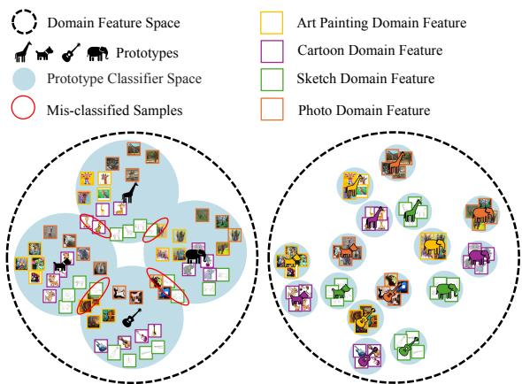
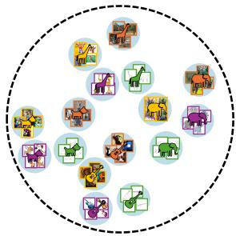
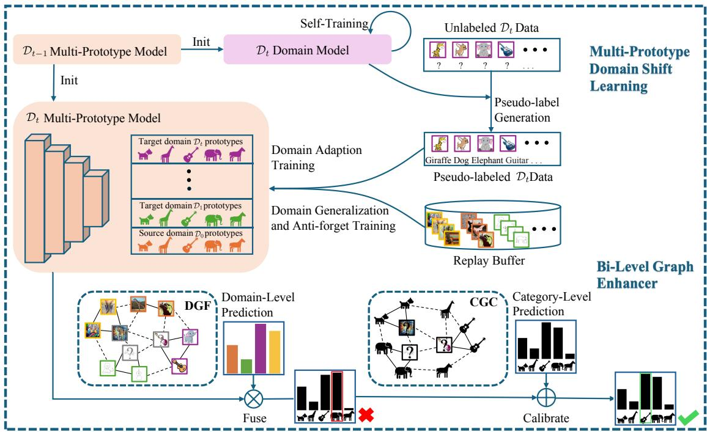
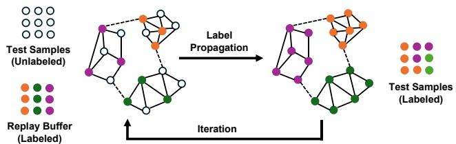
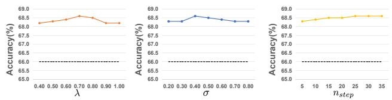
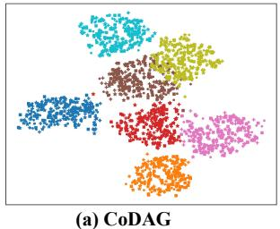
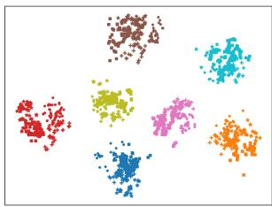

# Unsupervised Continual Domain Shift Learning with Multi-Prototype Modeling

Haopeng Sun1,2 \* Yingwei Zhang1,2 \* Lumin Xu3

Sheng Jin4,5 † Ping Luo4,6 Chen Qian5 Wentao Liu5 Yiqiang Chen1,2 † 1 Beijing Key Lab. of Mobile Computing and Pervasive Device, Institute of Computing Technology, Chinese Academy of Sciences 2 University of Chinese Academy of Sciences

3 The Chinese University of Hong Kong 4 The University of Hong Kong 5 SenseTime Research and Tetras.AI 6 HKU Shanghai Intelligent Computing Research Center sunhaopeng22s@ict.ac.cn, zhangyingwei@ict.ac.cn, jinsheng@tetras.ai, yqchen@ict.ac.cn

## Abstract

In real-world applications, deep neural networks may encounter constantly changing environments, where the test data originates from continually shifting unlabeled target domains. This problem, known as Unsupervised Continual Domain Shift Learning (UCDSL), poses practical difficulties. Existing methods for UCDSL aim to learn domaininvariant representations for all target domains. However, due to the existence of adaptivity gap, the invariant representation may theoretically lead to large joint errors. To overcome the limitation, we propose a novel UCDSL method, called Multi-Prototype Modeling (MPM). Our model comprises two key components: (1) Multi-Prototype Learning (MPL) for acquiring domain-specific representations using multiple domain-specific prototypes. MPL achieves domain-specific error minimization instead ofenforcingfeature alignment across different domains. (2) Bi-Level Graph Enhancer (BiGE) for enhancing domainlevel and category-level representations, resulting in more accurate predictions. We provide theoretical and empirical analysis to demonstrate the effectiveness of our proposed method. We evaluate our approach on multiple benchmark datasets and show that our model surpasses state-of-the-art methods across all datasets, highlighting its effectiveness and robustness in handling unsupervised continual domain shift learning. Codes will be publicly accessible.

## 1. Introduction

Deep Neural Network methods demonstrate strong performance under the assumption of identically and independently distributed (IID) training and test data [6, 12, 43,

59, 68]. However, in real-world scenarios, this assumption often fails as the model may encounter data from nonstationary environments where the target data distribution constantly changes [42, 60, 69]. This situation necessitates addressing the problem of Unsupervised Continual Domain Shift Learning (UCDSL) [7, 25]. UCDSL aims to adapt a pre-trained model to dynamically shifting target domains without access to labeled data from either the source or target domains. UCDSL encompasses three key goals: (1) enhancing the model’s generalization to upcoming and previously unseen domains (Domain Generalization) [29, 50, 61, 65], (2) achieving high performance on the current target domain (Domain Adaptation) [29, 35, 51], and (3) maintaining satisfactory performance on previously encountered domains while avoiding catastrophic forgetting (Continual Learning) [3, 30, 39]. These objectives have practical significance, as exemplified by the need for autonomous robots to seamlessly transfer skills across diverse unseen environments and rapidly adapt to new target environments without forgetting prior knowledge.

A majority of existing UCDSL methods [7, 25] attempt to learn a universal classifier for all domains by enforcing feature alignment across different domains. This approach assumes the existence of an optimal classifier that performs well on all domains. However, this assumption cannot be guaranteed and the learned classifier may deviate significantly from the optimal classifier for a specific target domain. As shown in Fig. 1 Left, these methods primarily focus on achieving universal domain-invariant representations for all domains, disregarding domain-specific information, which limits their discriminative capacity. Consequently, the learned universal classifier exhibits a substantial adaptivity gap with the ideal classifier for each domain, leading to inferior performance on individual domains. To address these issues, we establish an error bound for UCDSL that explicitly considers the adaptivity gap. This bound motivates us to reduce the gap by introducing multiple domain-specific prototypes to enrich the hypothesis space and achieve more comprehensive representations. As shown in Fig. 1 Right, our proposed Multi-Prototype Learning (MPL) explicitly incorporates domain-specific information for each domain by modeling their distributions separately. This approach offers simultaneous benefits in terms of domain generalization, domain adaptation, and forget alleviation. Firstly, MPL enriches the hypothesis space by introducing multiple harmoniously composited domainspecific prototypes, leading to improved generalization for unseen domains. Secondly, MPL preserves complementary information from multiple domains to reduce the adaptivity gap, resulting in enhanced domain adaptation ability. Lastly, during adaptation, MPL explicitly preserves knowledge from previously encountered domains by retaining the corresponding prototypes.

  
Figure 1. Left: Existing methods learn a universal classifier for all domains by enforcing feature alignment of different domains. Right: MPL introduces multiple domain-specific prototypes to achieve lower error bound.

To further enhance the feature representations in our method, we introduce the Bi-Level Graph Enhancer (BiGE), which leverages complementary information from two orthogonal perspectives: domain-wise and categorywise. BiGE consists of two main components: the Domain-aware Graph Fuser (DGF) and the Category-aware Graph Calibrator (CGC). The DGF component utilizes the domain-level representations of real data samples to dynamically construct a domain-aware graph. It learns to integrate the representation capacity of multiple prototypes using a label-propagation-based fusion strategy. By considering the domain-level representations and their relationships, DGF effectively captures domain-specific information and enhances the global feature representations encoded in the prototypes. In addition to focusing solely on global feature representations, we propose the CGC component to exploit the complementary local feature representations present in the real data samples stored in the data buffer. CGC constructs a category-aware graph and aggregates categorylevel representations from neighboring data samples. This aggregation process serves to calibrate the inference results obtained by the global prototypes, incorporating the finegrained category-level information into the predictions. Importantly, we intentionally design the BiGE module to be simple and efficient, without any learnable parameters. Despite its simplicity, extensive experiments demonstrate that our proposed BiGE module significantly improves the prediction accuracy, showcasing its effectiveness in enhancing the feature representations.

We conducted extensive experiments to evaluate the performance of our proposed Multi-Prototype Modeling (MPM) approach on three domain shift datasets (i.e., Digits-5 [9, 13, 16, 33], PACS [17] and DomainNet [36]). Extensive experiments show that our proposed MPM outperforms other state-of-the-art UCDSL methods on these datasets. The empirical results highlight the efficacy and robustness of MPM in handling the continual adaptation to shifting target domains, making it a promising approach for real-world applications.

Our main contributions can be summarized as follows:

• We establish an error bound for unsupervised continual domain shift learning (UCDSL) by considering the adaptivity gap. Motivated by this bound, we propose Multi-Prototype Modeling (MPM). MPM utilizes Multi-Prototype Learning (MPL) to preserve complementary information from multiple domains, which improves the model capability of domain generalization, adaptation, and alleviating catastrophic forgetting.

• We introduce the Bi-Level Graph Enhancer (BiGE) for enhancing domain-level and category-level representations. BiGE incorporates two components, i.e. the Domain-aware Graph Fuser (DGF) and the Categoryaware Graph Calibrator (CGC). DGF dynamically fuses multi-domain prototypes using effective graph modeling, while CGC calibrates the inference results by leveraging local feature representations.

• Extensive experiments conducted on popular domain generalization benchmarks demonstrate the superiority of MPM over previous state-of-the-art UCDSL methods. The results validate the effectiveness of MPM in addressing unsupervised continual domain shift learning tasks.

## 2. Related Work

## 2.1. Domain Adaptation (DA)

Domain adaptation (DA) aims to adapt a model trained in one or more source domains to a different target domain. In conventional DA approaches [24, 27, 28, 35, 38, 56], it is assumed that both the source and target domain data are accessible during training. However, due to privacy regulations or limitation on storage, the source domain data is unavailable in many applications. Source-free domain adaptation (SFDA) [11, 15, 22, 31, 47, 49, 52, 66] has been developed to overcome this issue and achieve domain adaptation without accessing to the source data. However, the domain adaptation is achieved in an offline manner with full access to all the target test data. This makes it not applicable for continually changing scenarios with continual domain shifts.

## 2.2. Domain Generalization (DG)

Domain generalization (DG) [65] aims to achieve good out-of-distribution generalization by using only source data for model learning, without accessing to the target domain data. Existing DG methods are mainly based on domain alignment methods [8, 10, 20, 21, 32, 53], augmentation based [4, 19, 45, 54, 63], and meta-learning based methods [1, 55]. Among these, domain alignment is particularly popular. This approach aims minimize the domain disparity among source domains for learning domain-invariant representations, which is expected to be generalizable to unseen target domains. However, these techniques require a large amount of accurately labeled source data and can suffer from severe catastrophic forgetting when applied to scenarios with continual domain shift.

## 2.3. Unsupervised Continual Domain Shift Learning (UCDSL)

Unsupervised Continual Domain Shift Learning (UCDSL) problem is a more comprehensive and practical setting, where the pre-trained model is adapted to a series of continually appearing unlabeled target domains without accessing to the source domain data. The goal of UCDSL is threefolds: (1) improve the domain generalization performance on new unseen target domains (Domain Generalization); (2) achieve good model performance on a target domain right after adaptation (Domain Adaptation); (3) maintain good performance on previously trained domains after the model is adapted with other new domains (Continual Learning). DEJA VU [25] proposes training-free data augmentation module RandMix to improve domain generalization, T2PL pseudo-labeling mechanism for domain adaptation, and a prototype contrastive alignment algorithm for forgetting alleviation. CoDAG [7] is a simple yet effective baseline for UCDSL, which combines domain adaptation (DA) and ${ \mathrm { d o - } }$ main generalization (DG) in a complementary manner. It uses DA model for quick adaptation and pseudo-label generation for DG model, and uses DG model to learn generalized representations and provide better initialization for DA model. In this paper, we propose Multi-Prototype Learning (MPL) and Bi-Level Graph Enhancer (BiGE) to tackle the problem of UCDSL.

## 3. Multi-Prototype Learning for Unsupervised Continual Domain Shift Learning

## 3.1. Problem Definition

Unsupervised continual domain shift learning (UCDSL) [25] requires a model to sequentially encounters $T + 1$ distinct domains $\mathcal { D } _ { t } \left( t = 0 , 1 , \ldots , T \right)$ and constantly show decent classification performance on all the domains. The first domain $\mathcal { D } _ { 0 }$ serves as the source domain $s$ with labeled samples, while the subsequent domains $\mathcal { D } _ { t } \left( t = 1 , 2 , . . . , T \right)$ are unlabeled target domains $\tau$ . The model is sequentially refined on these domains and is expected to well classify samples from different domains. The model is initially trained on the source domain S and then adapted to the target domains $\tau$ in a continual manner $( i . e .$ , from $\mathcal { D } _ { 1 }$ to $\mathcal { D } _ { T } )$ . For an incoming domain $\mathcal { D } _ { t } \in \mathcal { T } .$ the model is trained using unlabeled samples on the t-th domain and limited data from previously encountered domains (from $\mathcal { D } _ { 0 }$ to $\mathcal { D } _ { t - 1 } )$ that are stored in the replay buffer. The updated model is then evaluated on samples from different domains D $( t = 0 , 1 , \ldots , T )$ There are three main goals for UCDSL: (i) domain generalization for unseen target domains $\{ \mathcal { D } _ { t ^ { \prime } } \} _ { t < t ^ { \prime } \leq T } ;$ ; (ii) domain adaptation for the target domain $\mathcal { D } _ { t } \mathbf { ; }$ (iii) preventing catastrophic forgetting of knowledge gained from previously seen domains $\{ \mathcal { D } _ { t ^ { \prime } } \} _ { 0 \leq t ^ { \prime } < t }$

## 3.2. Multi-Prototype Learning (MPL)

The previous works [7, 25] learn a universal prototype as a global category representative for all the domains to tackle the problem of UCDSL. The extracted image features of the same class from different domains are aligned to search for the optimal representation. However, these methods disregard the domain-specific information, leading to suboptimal performance on individual domains. To solve the above-mentioned problem, we employ multi-prototypes for the task of UCDSL. Each domain is assigned a distinct prototype-based classifier [41], thereby enriching the representation space across various domains.

In this section, we establish the error bounds for UCDSL. By comparing the error bounds, we demonstrate that our proposed multi-prototype learning approach has a lower error rate compared to a single classifier. Following prior works [2, 58], we simplify the problem into a binary classification task for easy understanding. Here we only consider the case of two domains, and it is still reasonable to extend it to multiple domains. We denote the original input space distribution and induced feature space distribution of the source/target domain data as $\mathcal { D } _ { s } / \mathcal { D } _ { t }$ and $\tilde { \mathcal { D } } _ { s } / \tilde { \mathcal { D } } _ { t }$ , respectively. Our model consists of a feature extractor and a set of prototype classifiers. We denote $h$ as the theoretically optimal classification function $( h _ { s }$ for source domain and $h _ { t }$ for target domain), with $\hat { h } _ { s }$ and $\hat { h } _ { t }$ representing the learned function through model training.

  
Figure 2. Multi-Prototype Modeling (MPM) consists of multi-prototype domain shift learning and Bi-Level Graph Enhancer (BiGE). Different colors represent different domains, and different shapes denote different categories.

Definition 1: Classification error. The classification error of the function hˆ under domain $\mathcal { D } _ { i }$ is defined as $\varepsilon _ { i } ( { \hat { h } } ) =$ $\mathbb { E } _ { X \sim \mathcal { D } _ { i } } [ | \hat { h } ( X ) - h ( X ) | ]$ ]. For binary classification functions h and hˆ, we have:

$$
\begin{array} { r } { \varepsilon _ { i } ( \hat { h } ) = \varepsilon _ { i } ( \hat { h } , h ) = \mathbb { E } _ { X \sim \mathcal { D } _ { i } } [ | \hat { h } ( X ) - h ( X ) | ] } \\ { = P _ { X \sim \mathcal { D } _ { i } } ( \hat { h } ( X ) \neq h ( X ) ) . } \end{array}\tag{1}
$$

Definition 2: H-divergence. Given two induced domain feature space distributions $\tilde { \mathcal { D } } _ { s } , \tilde { \mathcal { D } } _ { t }$ and a hypothesis space H, the H-divergence between $\tilde { \mathcal { D } } _ { s } , \tilde { \mathcal { D } } _ { t }$ is defined as:

$$
d _ { \mathcal { H } } ( \tilde { \mathcal { D } } _ { s } , \tilde { \mathcal { D } } _ { t } ) = 2 \operatorname* { s u p } _ { h \in \mathcal { H } } \left| \mathbb { E } _ { X \sim \tilde { \mathcal { D } } _ { s } } [ h ( X ) = 1 ] - \mathbb { E } _ { X \sim \tilde { \mathcal { D } } _ { t } } [ h ( X ) = 1 ] \right| .\tag{2}
$$

Theorem 1: Error boundfor single classifier in UCDSL. Let $\tilde { \mathcal { D } } _ { s }$ and $\tilde { \mathcal { D } } _ { t }$ denote the induced distribution over the feature space for each distribution $\mathcal { D } _ { s }$ and $\mathcal { D } _ { t }$ over the original input space. The following inequality holds for $\varepsilon _ { t } ( \hat { h } )$ with single classifier on the target domain $\mathcal { D } _ { t }$ :

$$
\varepsilon _ { t } ( \hat { h } ) \leq \operatorname* { m i n } \{ \varepsilon _ { s } ( h _ { s } , h _ { t } ) , \varepsilon _ { t } ( h _ { s } , h _ { t } ) \} + \varepsilon _ { s } ( \hat { h } ) + d _ { \mathcal { H } } ( \tilde { \mathcal { D } } _ { s } , \tilde { \mathcal { D } } _ { t } ) .\tag{3}
$$

Theorem 2: Error bound for multi-prototype learning in UCDSL. Let $\tilde { \mathcal { D } } _ { s }$ and $\tilde { \mathcal { D } } _ { t }$ denote the induced distribution over the feature space for each distribution $\mathcal { D } _ { s }$ and $\mathcal { D } _ { t }$ over the original input space. The following inequality holds for $\varepsilon _ { t } ( \hat { h } )$ with multi-prototype learning (with mixed weights $\{ w _ { s } , w _ { t } \} , w _ { s } + w _ { t } = 1 , w _ { s } \geq 0 , w _ { t } \geq 0 , \hat { h } = w _ { s } \hat { h } _ { s } + w _ { t } \hat { h } _ { t }$ ) on the target domain $\mathcal { D } _ { t }$ . We derive the error bound of multi-prototype learning as follows:

$$
\varepsilon _ { t } ( \hat { h } ) \leq \varepsilon _ { t } ( \hat { h } , h _ { s } ) + \varepsilon _ { t } ( h _ { s } , h _ { t } ) .\tag{4}
$$

Furthermore, we show that our error bound is tighter than that of the single classifier (Eq. 3). Additional details can be found in the Supplementary Material.

$$
\begin{array} { r l } & { \varepsilon _ { t } ( \hat { h } , h _ { s } ) + \varepsilon _ { t } ( h _ { s } , h _ { t } ) \leq \varepsilon _ { s } ( \hat { h } , h _ { s } ) + d _ { \mathcal { H } } ( \tilde { \mathcal { D } } _ { s } , \tilde { \mathcal { D } } _ { t } ) + \varepsilon _ { t } ( h _ { s } , h _ { t } ) } \\ & { \qquad = \varepsilon _ { t } \big ( h _ { s } , h _ { t } \big ) + \varepsilon _ { s } ( \hat { h } ) + d _ { \mathcal { H } } ( \tilde { \mathcal { D } } _ { s } , \tilde { \mathcal { D } } _ { t } ) . } \end{array}\tag{5}
$$

In addition, our bound can be rewritten as:

$$
\begin{array} { r l r } {  { \varepsilon _ { t } ( \hat { h } , h _ { s } ) + \varepsilon _ { t } ( h _ { s } , h _ { t } ) = \varepsilon _ { t } ( h _ { s } , h _ { t } ) + \frac { \operatorname* { P r } _ { t } ( X ) } { \operatorname* { P r } _ { s } ( X ) } \varepsilon _ { s } ( \hat { h } ) } } \\ & { } & { \leq \varepsilon _ { s } ( h _ { s } , h _ { t } ) + \varepsilon _ { s } ( \hat { h } ) + d _ { \mathcal H } ( \tilde { \mathcal D } _ { s } , \tilde { \mathcal D } _ { t } ) , } \end{array}\tag{6}
$$

where $\frac { \mathrm { P r } _ { t } ( X ) } { \mathrm { P r } _ { s } ( X ) }$ [2] refers to the data density ratio between the target $( \dot { \mathcal { D } } _ { t } )$ and source $( \mathcal { D } _ { s } )$ domains, and this term is generally set to a constant and ignored.

By combining Eq. 5 and Eq. 6, we achieve that the error bound of multi-prototype learning in UCDSL is tighter than min $\{ \varepsilon _ { s } ( h _ { s } , h _ { t } ) , \varepsilon _ { t } ( h _ { s } , h _ { t } ) \} + \varepsilon _ { s } ( \hat { h } ) + d _ { \mathcal { H } } ( \tilde { \mathcal { D } } _ { s } , \tilde { \mathcal { D } } _ { t } )$ according to Theorem 1, thereby completing the proof.

## 4. Multi-Prototype Modeling (MPM)

Motivated by the theoretical analysis of error bound, we propose Multi-Prototype Modeling (MPM) to tackle the problem of UCDSL. As illustrated in Fig. 2, MPM incorporates multi-prototype domain shift learning and Bi-Level Graph Enhancer (BiGE).

## 4.1. Multi-Prototype Domain Shift Learning

Traditionally, a universal linear layer classifier serves as the single prototype and attempts to learn the global alignment across all the domains. In contrast, we propose to apply a set of classifiers, with each domain corresponding to a specific prototype-based classifier. The model of domain $\mathcal { D } _ { t - 1 }$ comprises a feature extractor and t prototype-based classifiers: one for the source domain and t − 1 for the target domains. The image features are extracted by the feature extractor, and then the corresponding prototype-based classifier is applied to predict the results of a certain domain.

Pseudo-label Generation. To improve performance on domain $\mathcal { D } _ { t }$ and obtain higher-quality pseudo-labels, we perform domain adaptation for the domain model to target this domain. We initialize the domain model using the previous $\mathcal { D } _ { t - 1 }$ multi-prototype model. Leveraging the generalization ability of the multi-prototype model, self-training is employed to adapt the domain model to the new target domain. The self-supervised pseudo-labels are integrated from the predictions of all the prototype-based classifiers via Shannon entropy-based strategy, and the feature extractor and t classifiers are updated using information maximization [7]. After domain adaptation, the domain model is utilized to generate pseudo-labels for the training process stage. Considering classifier confidence and prediction entropy are inversely correlated, we adopt the Shannon entropy-based strategy to integrate predictions individually produced by t prototype-based classifiers into a reliable pseudo-label for each sample on domain $\mathcal { D } _ { t }$

Training process. We first complete the domain adaptation process, adapting the model to domain $\mathcal { D } _ { t } .$ After that, we proceed with domain generation and anti-forget training to enable the multi-prototype model to enhance its generalization ability while preventing the forgetting of previous domain knowledge. To build the multi-prototype model on domain $\mathcal { D } _ { t }$ , we initialize it from the last domain $\mathcal { D } _ { t - 1 }$ multi-prototype model, and introduce a new prototypebased classifier with random initialization for domain $\mathcal { D } _ { t }$ Domain Adaption Training. With feature extractor frozen, the newly introduced prototype classifier is trained using pseudo-labeled samples of domain $\mathcal { D } _ { t }$ with loss function in SHOT [22]. Domain Generation and Anti-forget Training. 4To improve the generalization of the model, we apply data augmentation [25] to the replay buffer and domain $\mathcal { D } _ { t }$ data. We use the Empirical Risk Minimization (ERM) method for model domain generation training. While this approach improves generalization, it may compromise the model’s ability to retain previous domain knowledge. To address this issue, we incorporate the distillation loss [7] to ensure that the model does not forget previous knowledge by enforcing consistent predictions between the previous $\mathcal { D } _ { t - 1 }$ multi-prototype model and the current $\mathcal { D } _ { t }$ multiprototype model for each sample in the data buffer. To alleviate the negative impact of errors in pseudo-labels, we also use the SelNLPL [14] loss function, which is specifically designed to handle noisy labels and prevent performance degradation of the multi-prototype model. See supplementary material for the detailed training process.

  
Figure 3. Iterative prototype label propagation.

Replay Buffer. Our replay buffer consists of two parts: (1) t sets of prototypes and (2) data samples from the previous t domains (one source domain and t − 1 previous target domains). The total size of both parts is restricted by the replay buffer size to avoid increasing memory usage and enable fair comparisons. The maximum number of data (including prototypes and samples) stored in the buffer is set to 200 following the previous works [7]. All the prototypes of multiple domains are stored in the buffer. For the remaining memory, data samples are selected similar to iCaRL [37], which allocates the same quotas for different domains and classes where the most representative samples (closest to the corresponding prototypes) are picked. Notably, the number of samples far exceeds the number of prototypes. Both prototypes and data samples in buffer are replayed for each incoming target domain.

## 4.2. Bi-Level Graph Enhancer (BiGE)

The Bi-Level Graph Enhancer (BiGE) leverages domainlevel and category-level information through the Domainaware Graph Fuser (DGF) and the Category-aware Graph Calibrator (CGG), respectively.

## 4.2.1. Domain-aware Graph Fuser (DGF)

The DGF fuses multi-domain information by constructing a domain-level graph with sample and query nodes. Sample nodes represent domain features of samples from the replay buffer, while query nodes represent domain features of the images to be inferred. The domain features are extracted from the first block of feature extractor, which provides rich domain-aware information [64]. For the target domain $\mathcal { D } _ { t }$ , the node set is denoted as ${ \pmb X } ~ = ~ [ { \pmb x } _ { 1 } , \ldots , { \pmb x } _ { M } , { \pmb x } _ { M + 1 } , \ldots , { \pmb x } _ { M + N } ] ^ { \top } ~ \in ~ \mathbb { R } ^ { ( M + N ) \times C }$ with feature channel C, including M sample nodes ${ { \bf { x } } _ { u } } \left( { 1 \atop { - } } \right.$ $u \leq M )$ with corresponding domain labels $l \in \{ 0 , \ldots , t \}$ and N query nodes xv $( M + 1 \le v \le M + N )$ with unknown domain belongings from $t = 0$ to T. As shown in Fig. 3, domain labels are propagated from sample nodes to unlabeled query nodes in an iterative manner.

Graph Construction. There are $K = t + 1$ domains in total, and the prototype $\mathbf { c } _ { k } \left( 1 \leq k \leq K \right)$ for k-th domain is computed as the mean vector of sample nodes belonging to this domain [41]:

$$
\mathbf { c } _ { k } = \frac { 1 } { \left| X _ { k } \right| } \sum _ { \left( \mathbf { x } _ { i } , l _ { i } \right) \in X _ { k } } \mathbf { x } _ { i } ,\tag{7}
$$

where $X _ { k }$ denotes the set of samples labeled with domain class k. For each query node $\begin{array} { r } { \mathbf { x } _ { v } \ ( M + 1 \leq v \leq M + } \end{array}$ N), a soft domain label $\boldsymbol { s } _ { v } = [ s _ { v 1 } , s _ { v 2 } , . . . , s _ { v K } ] ^ { \intercal } \in \mathbb { R } ^ { K }$ is calculated using the softmax function:

$$
s _ { v k } = \frac { \exp \left( - | | \mathbf { x } _ { v } - \mathbf { c } _ { k } | | _ { 2 } ^ { 2 } \right) } { \sum _ { k = 1 } ^ { K } \exp \left( - | | \mathbf { x } _ { v } - \mathbf { c } _ { k } | | _ { 2 } ^ { 2 } \right) } .\tag{8}
$$

The label matrix of query nodes can be represented as $\pmb { S } _ { V } = [ s _ { M + 1 } , s _ { M + 2 } , . . . , s _ { M + N } ] ^ { \top } \in \mathbb { R } ^ { N \times K }$ for the batch of N query nodes. The label matrix of sample nodes ${ \pmb S } _ { U } \in \mathrm { ~ \mathbb { R } ^ { \pmb { M } \times { K } ~ } ~ }$ is obtained according to their domain labels, where $s _ { u k } ~ = ~ 1$ only if the sample node $\mathbf { x } _ { u }$ belongs to domain k, otherwise $s _ { u k } ~ = ~ 0$ . By combining these two matrices, the overall label matrix is denoted as $\pmb { S } = [ \pmb { S } _ { U } , \pmb { S } _ { V } ] ^ { \top } \in \mathbb { R } ^ { ( M + N ) \times K }$

The relationships among nodes of the domain-level graph is computed by the similarity $w _ { i j }$ between vertices $\mathbf { x } _ { i } \in \mathbf { \partial } X$ and $\mathbf { x } _ { j } \in X ( 1 \leq i , j \leq \bar { M } + N )$ , using the Markov random walks [26, 44, 67] and Bayes’ theorem:

$$
\begin{array} { l } { { \displaystyle w _ { i j } = \mathrm { s i m i l a r i t y } ( \mathbf { x } _ { i } , \mathbf { x } _ { j } ) \propto p ( \mathbf { x } _ { i } | \mathbf { x } _ { j } ) } } \\ { { \displaystyle ~ = \sum _ { k = 1 } ^ { K } p ( \mathbf { x } _ { i } | \mathbf { c } _ { k } ) p ( \mathbf { c } _ { k } | \mathbf { x } _ { j } ) = \sum _ { k = 1 } ^ { K } s _ { i k } \cdot \frac { s _ { j k } } { \sum _ { j ^ { \prime } = 1 } ^ { M + N } s _ { j ^ { \prime } k } } . } } \end{array}\tag{9}
$$

We have $p ( \mathbf { x } _ { i } | \mathbf { c } _ { k } ) = s _ { i k }$ , where $1 \leq i \leq M + N$ and $1 \leq k \leq K$ . The adjacency matrix W is the symmetric matrix and $w _ { i j } = w _ { j i }$

Label Propagation. We propagate labels [62] by optimizing:

$$
Y ^ { * } = \arg \operatorname* { m i n } _ { Y } \frac { 1 } { 2 } ( \sum _ { i , j = 1 } ^ { M + N } w _ { i j } \| y _ { i } - y _ { j } \| _ { 2 } ^ { 2 } + \mu \sum _ { i = 1 } ^ { M + N } \| y _ { i } - s _ { i } \| _ { 2 } ^ { 2 } ) ,\tag{10}
$$

where $s _ { i } ~ \in ~ \mathbb { R } ^ { K }$ is the i-th row of label matrix S, and $\mu > 0$ is the hyperparameter to balance the two optimization terms. $\pmb { Y } = [ y _ { 1 } , y _ { 2 } , . . . , y _ { M + N } ] ^ { \top } \in \mathbb { R } ^ { ( M + N ) \times \overleftarrow { K } }$ is the optimization objective, and $Y ^ { * }$ denotes the optimal solution. $y _ { i } \ ( 1 \leq i \leq M )$ represents the optimized domain labels of sample nodes and $y _ { i } ( M + 1 \le i \le M + N )$ represents those of query nodes as pseudo-labels. The optimal solution of Eq. 10 can be derived as follows (see supplementary material for proof):

$$
\begin{array} { l } { { \pmb { Y } } ^ { \ast } = \left( 1 - \lambda \right) \left( \mathbb { I } - \lambda { \pmb { W } } \right) ^ { - 1 } { \pmb { S } } } \\ { = \left( 1 - \lambda \right) \left( \mathbb { I } - \lambda { \pmb { S } } { \pmb { V } } ^ { - 1 } { \pmb { S } } ^ { \top } \right) ^ { - 1 } { \pmb { S } } , } \end{array}\tag{11}
$$

where I is the identical matrix, V is a diagonal matrix with row sums of S as its elements and $\begin{array} { r } { \lambda = \frac { \bar { 1 } } { 1 + \mu } } \end{array}$

Prototype Updating. To facilitate iterative correction, we use all nodes and labels to update prototypes as follows:

$$
\mathbf { c } _ { k } ^ { * } = \frac { 1 } { \left| X \right| } \frac { \sum _ { i = 1 } ^ { M + N } \mathbf { x } _ { i } y _ { i k } ^ { * } } { \sum _ { j = 1 } ^ { M + N } y _ { j k } ^ { * } } ,\tag{12}
$$

where $y ^ { \ast } \in \mathbf { Y } ^ { \ast }$ . The $C ^ { * } = [ \mathbf { c } _ { 1 } ^ { * } , \mathbf { c } _ { 2 } ^ { * } , . . . , \mathbf { c } _ { K } ^ { * } ] ^ { \top } \in \mathbb { R } ^ { K \times C }$ denotes the updated prototypes. Exponential running average σ is employed to enhance the stability:

$$
\begin{array} { r } { \mathbf { C } _ { n e w } = ( 1 - \sigma ) \mathbf { C } + \sigma C ^ { * } . } \end{array}\tag{13}
$$

Iterative Procession. The above processes of graph construction, label propagation and prototype updating are repeated $n _ { s t e p }$ times $( n _ { s t e p } = 2 5$ in our implementation) to obtain the estimated soft domain labels of query nodes. The predictions produced by different prototype-based classifiers are fused via a weighted sum, where the fusion weights come from the soft labels as possibility belonging to this domain, thereby forming the domain-level prediction for each query image.

## 4.2.2. Category-aware Graph Calibrator (CGC)

Non-parametric classifiers that further utilize local semantic features have shown good potentials in addressing domain gaps [57]. Category-aware Graph Calibrator (CGC) aims to incorporate local semantic features of the data samples in addition to global semantic features of the prototypes, to improve the performance of the model.

CGC constructs a category-aware graph consisting of sample nodes and query nodes. Instead of utilizing domain features as in DGF, the local semantic features extracted from the last block of the ResNet are used to represent nodes in CGC. The sample nodes are with their corresponding pseudo-labeled category labels, while the query nodes are to be inferred. The graph construction and label propagation processes are similar to DGF. The category labels from the sample nodes are propagated to the query nodes by performing Eq. 11. The resulting category labels of the query nodes obtained with the guidance of high-quality pseudolabels from data samples after CGC are denoted as yCGC.

To obtain the final inference results, CGC adopts an Shannon entropy-based strategy [40]. The prototype-based inference results $y _ { P r o t o } ,$ which are based on global semantic features, and the CGC inference results yCGC are combined using weighted averaging. The weights are determined by the entropies of the respective inference results. The final inference result y is computed as:

Table 1. Comparisons on the PACS, Digits-five, and DomainNet datasets for different state-of-the-art methods in TDA, TDG, FA, and All. The results are averaged over 10 different orders from each dataset. The results of the baseline models are referenced from [7]. The best results are highlighted in bold. Our method outperforms all the baselines across all datasets and evaluation metrics tested.
<table><tr><td>Dataset</td><td>Metric</td><td>SHOT+</td><td>SHOT++</td><td>Tent</td><td>AdaCon</td><td>EATA</td><td>L2D</td><td>PDEN</td><td>RaTP</td><td>CoDAG</td><td>Ours</td></tr><tr><td rowspan="4">PACS</td><td>TDA</td><td>81.9±9.2</td><td>84.4±8.0</td><td>78.7±6.9</td><td>79.9±5.9</td><td>80.3±7.1</td><td>78.8±5.6</td><td>77.8±5.2</td><td>84.7±5.1</td><td>87.6±4.0</td><td>89.7±2.8</td></tr><tr><td>TDG</td><td>54.9±13.1</td><td>56.0±10.9</td><td>65.8±11.5</td><td>65.2±10.5</td><td>64.1±12.1</td><td>65.8±9.6</td><td>64.4±9.8</td><td>70.6±9.1</td><td>72.2±8.3</td><td>74.2±6.9</td></tr><tr><td>FA</td><td>74.9±8.1</td><td>83.0±4.0</td><td>81.0±6.2</td><td>81.6±5.9</td><td>82.6±7.0</td><td>77.6±4.6</td><td>76.3±4.0</td><td>83.9±4.7</td><td>88.8±3.0</td><td>90.7±2.2</td></tr><tr><td>All</td><td>70.6±9.2</td><td>74.5±5.7</td><td>75.2±7.8</td><td>75.6±7.1</td><td>75.7±8.6</td><td>74.1±6.2</td><td>72.9±5.9</td><td>79.7±5.7</td><td>82.9±4.8</td><td>84.9±3.5</td></tr><tr><td rowspan="4">Digits-five</td><td>TDA</td><td>78.6±13.2</td><td>81.3±14.0</td><td>68.7±11.0</td><td>71.6±9.2</td><td>72.0±9.8</td><td>84.3±5.4</td><td>82.3±5.8</td><td>88.7±1.8</td><td>92.7±1.7</td><td>94.3±1.9</td></tr><tr><td>TDG</td><td>61.0±14.9</td><td>62.3±13.8</td><td>64.0±13.6</td><td>63.3±13.1</td><td>64.0±12.9</td><td>70.9±6.8</td><td>69.7±7.0</td><td>76.8±3.9</td><td>77.4±4.3</td><td>79.3±3.0</td></tr><tr><td>FA</td><td>58.2±14.9</td><td>64.5±13.3</td><td>66.1±15.7</td><td>72.2±11.2</td><td>73.0±10.9</td><td>76.5±3.8</td><td>74.0±4.0</td><td>85.0±2.2</td><td>87.1±2.1</td><td>88.8±2.6</td></tr><tr><td>All</td><td>65.9±13.5</td><td>69.4±12.9</td><td>66.2±13.3</td><td>69.1±11.0</td><td>69.6±10.9</td><td>77.2±4.8</td><td>75.3±5.1</td><td>83.5±2.1</td><td>85.7±2.2</td><td>87.5±2.4</td></tr><tr><td rowspan="4">DomainNet</td><td>TDA</td><td>66.0±8.8</td><td>66.9±8.7</td><td>53.6±13.2</td><td>62.2±7.7</td><td>62.5±7.3</td><td>56.2±6.2</td><td>55.6±6.6</td><td>65.4±5.1</td><td>71.0±5.7</td><td>73.5±3.9</td></tr><tr><td>TDG</td><td>47.3±11.0</td><td>48.1±10.7</td><td>47.7±11.0</td><td>51.3±10.0</td><td>52.1±9.9</td><td>50.7±9.1</td><td>49.3±9.1</td><td>55.2±7.4</td><td>56.2±7.2</td><td>58.8±6.5</td></tr><tr><td>FA</td><td>58.5±8.3</td><td>66.9±6.0</td><td>56.1±14.5</td><td>61.8±9.0</td><td>62.8±8.8</td><td>52.2±9.4</td><td>50.2±9.5</td><td>63.5±6.6</td><td>70.9±6.6</td><td>73.4±4.4</td></tr><tr><td>All</td><td>57.3±8.9</td><td>60.6±8.0</td><td>52.5±12.4</td><td>58.4±8.6</td><td>59.1±8.3</td><td>53.0±7.6</td><td>51.7±7.8</td><td>61.4±6.0</td><td>66.0±6.2</td><td>68.6±4.7</td></tr></table>

Table 2. Ablation studies on the PACS, Digits-five, and DomainNet datasets.
<table><tr><td rowspan="2">ExpID</td><td colspan="3">Methods</td><td colspan="4">PACS</td><td colspan="4">Digits-five</td><td colspan="4">DomainNet</td><td rowspan="2">ALL</td></tr><tr><td>MPL</td><td>DGF</td><td>CGC</td><td>TDA</td><td>TDG</td><td>FA</td><td>ALL</td><td>TDA</td><td>TDG</td><td>FA</td><td>ALL</td><td>TDA</td><td>TDG</td><td>FA</td><td>ALL</td></tr><tr><td>#1</td><td>√</td><td>√</td><td>√</td><td>89.7</td><td>74.2</td><td>90.7</td><td>84.8</td><td>94.3</td><td>79.3</td><td>88.8</td><td>87.5</td><td>73.5</td><td>58.8</td><td>73.4</td><td>68.6</td><td>80.3</td></tr><tr><td>#2</td><td>√</td><td>√</td><td>x</td><td>89.3</td><td>73.9</td><td>90.4</td><td>84.5</td><td>94.1</td><td>79.0</td><td>88.6</td><td>87.2</td><td>72.2</td><td>58.0</td><td>72.4</td><td>67.5</td><td>79.7 (-0.6)</td></tr><tr><td>#3</td><td>S</td><td>x</td><td>x</td><td>88.9</td><td>73.6</td><td>90.0</td><td>84.2</td><td>93.9</td><td>78.7</td><td>88.3</td><td>87.0</td><td>71.3</td><td>57.4</td><td>71.7</td><td>66.8</td><td>79.3 (-1.0)</td></tr><tr><td>#4</td><td>x</td><td>x</td><td>x</td><td>87.6</td><td>72.2</td><td>88.8</td><td>82.9</td><td>92.7</td><td>77.4</td><td>87.1</td><td>85.7</td><td>71.0</td><td>56.2</td><td>70.9</td><td>66.0</td><td>78.2 (-2.1)</td></tr></table>

$$
y = \frac { y _ { P r o t o } \cdot e _ { P r o t o } + y _ { C G C } \cdot e _ { C G C } } { e _ { P r o t o } + e _ { C G C } } ,\tag{14}
$$

where $e P r o t o$ is the entropy of the prototype-based inference results $y _ { P r o t o } ,$ and eCGC is the entropy of the CGC inference results yCGC. The entropy [40] can be calculated as: $\begin{array} { r } { e = - \sum _ { K } \hat { p } _ { k } \log \hat { p } _ { k } . } \end{array}$ , for the probability $\hat { p } _ { k }$ of class k. This strategy allows for the integration of both global and local semantic information, resulting in robust performance.

## 5. Experiment

## 5.1. Experimental Setup

To ensure fair comparisons, we adopt the experimental settings used in previous studies [7, 25]. We evaluate our approach on three benchmark datasets: PACS [17], Digits-5 [9, 13, 16, 33], and a subset of DomainNet [36]. For the source domain, we randomly assign 80% of the data for training and the remaining 20% for testing. For the target domains, all available data is used for training and testing, assuming the absence of label information. The experiments are repeated three times with different seeds, and the reported performance is the average result with the corresponding standard deviation.

Evaluation Metrics. We follow [7] to employ TDA, TDG and FA as the evaluation metrics to assess the model performance. TDA (Target Domain Adaptation) measures the performance of the model on each target domain immediately after its adaptation. TDG (Target Domain Generalization) evaluates the average performance of the model on each target domain prior to its training stage. FA (Forgetting Alleviation) measures the average performance of the model on each target domain after it has been trained on subsequent domains. For the purpose of comparative analysis among different models, we calculate the average value of each metric across all domains. Furthermore, we introduce a composite score (referred to as “All”) which represents the average of all the metrics combined.

Implementation Details. For the Digits-five dataset,

  
Figure 4. Sensitivity analysis regarding λ, σ and $ { n _ { s t e p } }$ on DomainNet dataset. Accuracy of CoDAG baseline is shown as the dotted black lines. Our model consistently outperforms CoDAG for different hyper-parameters.

DTN [22] is utilized as the feature extractor, while for both PACS and DomainNet, ResNet-50 [12] is employed. Our prototype classifier requires the same data dimension as the data processed by the feature extractor. The SGD optimizer is utilized with a batch size of 64 for all experiments. The replay buffer size is set to 200 for all datasets. Further details can be found in the supplementary material.

## 5.2. Experimental Results

Main Results. We present a comprehensive evaluation of our MPM framework compared to state-of-the-art models on three benchmark datasets: PACS, Digits-five, and DomainNet. To ensure the reliability of our findings, we conduct the evaluation over 10 different dataset orders and average the results. Table 1 showcases the overall performance of our method compared to the baseline models including Source-Free DA (SHOT+ [23] and SHOT++ [23]), Test-Time/Online DA (Tent [46], AdaCon [5] and EATA [34]), Single DG (L2D [48] and PDEN [18]), and UCDSL (RaTP [25] and CoDAG [7]). Across all datasets and evaluation metrics, our MPM framework consistently outperforms the baselines. It is also worth noting that our model achieves the lowest standard deviation in most cases. These results highlight the effectiveness and robustness of our approach in addressing the challenges posed by unsupervised continual domain shift learning. The details of the main experiments are provided in the supplementary material.

Effect of Model Components. We present ablation studies in Table 2 to assess the effectiveness of the proposed Multi Prototype Learning (MPL), Domain-aware Graph Fuser (DGF), and Category-aware Graph Calibrator (CGC) on the PACS, Digits-five, and DomainNet datasets. Across all datasets, these components consistently enhance the performance of the baseline model. Our complete model (ExpID #1) achieves the highest performance. By comparing the results of ExpID #1 and #2, we demonstrate the effective calibration of the model’s inference results by CGC. We also observe that DGF leverages domain-level guidance to fuse predictions from multi-domain prototypes, resulting in improved accuracy (ExpID #2 v.s. #3). For the baseline without DGF (ExpID #3), we apply average weighting to obtain the final predictions. Notably, MPL (ExpID #3) significantly enhances the model’s performance compared to previous baselines that directly employ a single domaininvariant classifier (ExpID #4).

  
(b) MPM (Ours)  
Figure 5. t-SNE visualization of features extracted by (a) CoDAG and (b) MPM on PACS dataset. Distinct colors indicate different categories, while diverse shapes represent different domains.

Hyper-parameter sensitivity. We investigate the sensitivity of MPM to the cost balance coefficient λ (cf. Eq. 11), the exponential running average σ (cf. Eq. 13) and the number of iteration steps $n _ { s t e p } .$ . As shown in Fig. 4, MPM is insensitive to the hyper-parameters and consistently improves upon CoDAG with different hyper-parameters. We choose $\lambda = 0 . 7 , \sigma = 0 . 4$ and $n _ { s t e p } = 2 5$ for best performance.

Visualization of learned feature distribution. The learned feature embeddings are visualized using t-SNE in Fig. 5. Distinct colors indicate different categories, while diverse shapes represent different domains. The CoDAG [7] learned features of different categories are not well separated, and some test samples are hard to distinguish due to the large domain shift. In comparison, our method generates compact and discriminative feature embeddings with tight clusters, demonstrating the superiority of MPM.

## 6. Conclusion

This study introduces Multi-Prototype Modeling (MPM) for addressing unsupervised continual domain shift learning (UCDSL). Theoretical and empirical findings indicate that our proposed Multi-Prototype Learning (MPL) outperforms previous studies that enforce domain-invariant alignment in the UCDSL setting. Additionally, the Bi-Level Graph Enhancer (BiGE) is proposed to enhance domain-level and category-level representations. The Domain-aware Graph Fuser (DGF) learns to fuse multi-domain prototypes using domain-level cues, while the Category-aware Graph Calibrator (CGC) leverages local semantic representations to calibrate inference results. These contributions can serve as inspiration for future research in this field. While similar to previous UCDSL methods, this study is currently applied to classification tasks and has not been adapted for regression problems, such as object detection. We believe that MPM holds promising potential for future research and development in related domains.

## 7. Acknowledgments

This work is supported by the Strategic Priority Research Program of Chinese Academy of Sciences (No.XDA28040500), the Natural Science Foundation of China (No.62302487), Improvement Project of Chinese Academy of Sciences (No.GSZXKYZB2025007), and the Science and Technology Innovation Program of Hunan Province (No.2024JJ9031 and No.2022RC4006).

## References

[1] Yogesh Balaji, Swami Sankaranarayanan, and Rama Chellappa. Metareg: Towards domain generalization using metaregularization. Adv. Neural Inform. Process. Syst., 31, 2018.

[2] Shai Ben-David, John Blitzer, Koby Crammer, and Fernando Pereira. Analysis of representations for domain adaptation. Adv. Neural Inform. Process. Syst., 19, 2006.

[3] Andreea Bobu, Eric Tzeng, Judy Hoffman, and Trevor Darrell. Adapting to continuously shifting domains. Int. Conf. Learn. Represent. Worksh., 2018.

[4] Manh-Ha Bui, Toan Tran, Anh Tran, and Dinh Phung. Exploiting domain-specific features to enhance domain generalization. Adv. Neural Inform. Process. Syst., 34:21189– 21201, 2021.

[5] Dian Chen, Dequan Wang, Trevor Darrell, and Sayna Ebrahimi. Contrastive test-time adaptation. In IEEE Conf. Comput. Vis. Pattern Recog., pages 295–305, 2022.

[6] Senlin Cheng and Haopeng Sun. Spt: Sequence prompt transformer for interactive image segmentation. arXiv preprint arXiv:2412.10224, 2024.

[7] Wonguk Cho, Jinha Park, and Taesup Kim. Complementary domain adaptation and generalization for unsupervised continual domain shift learning. In Int. Conf. Comput. Vis., pages 11442–11452, 2023.

[8] Sarah Erfani, Mahsa Baktashmotlagh, Masud Moshtaghi, Xuan Nguyen, Christopher Leckie, James Bailey, and Rao Kotagiri. Robust domain generalisation by enforcing distribution invariance. In Int. Jt. Conf. Artif. Intell., pages 1455– 1461, 2016.

[9] Yaroslav Ganin and Victor Lempitsky. Unsupervised domain adaptation by backpropagation. In Int. Conf. Mach. Learn., pages 1180–1189. PMLR, 2015.

[10] Renxiang Guan, Zihao Li, Wenxuan Tu, Jun Wang, Yue Liu, Xianju Li, Chang Tang, and Ruyi Feng. Contrastive multiview subspace clustering of hyperspectral images based on graph convolutional networks. IEEE Transactions on Geoscience and Remote Sensing, 62:1–14, 2024.

[11] Renxiang Guan, Wenxuan Tu, Zihao Li, Hao Yu, Dayu Hu, Yuzeng Chen, Chang Tang, Qiangqiang Yuan, and Xinwang Liu. Spatial-spectral graph contrastive clustering with hard sample mining for hyperspectral images. IEEE Transactions on Geoscience and Remote Sensing, pages 1–16, 2024.

[12] Kaiming He, Xiangyu Zhang, Shaoqing Ren, and Jian Sun. Deep residual learning for image recognition. In IEEE Conf. Comput. Vis. Pattern Recog., pages 770–778, 2016.

[13] Jonathan J. Hull. A database for handwritten text recognition research. IEEE Trans. Pattern Anal. Mach. Intell., 16(5): 550–554, 1994.

[14] Youngdong Kim, Junho Yim, Juseung Yun, and Junmo Kim. Nlnl: Negative learning for noisy labels. In Int. Conf. Com put. Vis., pages 101–110, 2019.

[15] Vinod K Kurmi, Venkatesh K Subramanian, and Vinay P Namboodiri. Domain impression: A source data free domain adaptation method. In IEEE Wint. Conf. App. Comput. Vis., pages 615–625, 2021.

[16] Yann LeCun, Leon Bottou, Yoshua Bengio, and Patrick´ Haffner. Gradient-based learning applied to document recog nition. Proceedings ofthe IEEE, 86(11):2278–2324, 1998.

[17] Da Li, Yongxin Yang, Yi-Zhe Song, and Timothy M Hospedales. Deeper, broader and artier domain generalization. In Int. Conf. Comput. Vis., pages 5542–5550, 2017.

[18] Lei Li, Ke Gao, Juan Cao, Ziyao Huang, Yepeng Weng, Xi aoyue Mi, Zhengze Yu, Xiaoya Li, and Boyang Xia. Progressive domain expansion network for single domain gener alization. In IEEE Conf. Comput. Vis. Pattern Recog., pages 224–233, 2021.

[19] Pan Li, Da Li, Wei Li, Shaogang Gong, Yanwei Fu, and Timothy M Hospedales. A simple feature augmentation for domain generalization. In Int. Conf. Comput. Vis., pages 8886– 8895, 2021.

[20] Ya Li, Mingming Gong, Xinmei Tian, Tongliang Liu, and Dacheng Tao. Domain generalization via conditional invariant representations. In AAAI Conf. Artif. Intell., 2018.

[21] Ya Li, Xinmei Tian, Mingming Gong, Yajing Liu, Tongliang Liu, Kun Zhang, and Dacheng Tao. Deep domain general ization via conditional invariant adversarial networks. In Eur. Conf. Comput. Vis., pages 624–639, 2018.

[22] Jian Liang, Dapeng Hu, and Jiashi Feng. Do we really need to access the source data? source hypothesis transfer for unsupervised domain adaptation. Int. Conf. Mach. Learn., pages 6028–6039, 2020.

[23] Jian Liang, Dapeng Hu, Yunbo Wang, Ran He, and Jiashi Feng. Source data-absent unsupervised domain adaptation through hypothesis transfer and labeling transfer. IEEE Trans. Pattern Anal. Mach. Intell., 2021.

[24] Hongbin Lin, Yifan Zhang, Zhen Qiu, Shuaicheng Niu, Chuang Gan, Yanxia Liu, and Mingkui Tan. Prototype guided continual adaptation for class-incremental unsupervised domain adaptation. In Eur. Conf. Comput. Vis., pages 351–368. Springer, 2022.

[25] Chenxi Liu, Lixu Wang, Lingjuan Lyu, Chen Sun, Xiao Wang, and Qi Zhu. Deja vu: Continual model generalization for unseen domains. arXiv preprint arXiv:2301.10418, 2023.

[26] Laszl´ o Lov´ asz. Random walks on graphs.´ Combinatorics, Paul erdos is eighty, 2(1-46):4, 1993.

[27] Xiaowen Ma, Rui Che, Tingfeng Hong, Mengting Ma, Ziyan Zhao, Tian Feng, and Wei Zhang. Sacanet: Scene-aware class attention network for semantic segmentation of remote sensing images. In 2023 IEEE International Conference on Multimedia and Expo (ICME), pages 828–833. IEEE, 2023.

[28] Xiaowen Ma, Jiawei Yang, Tingfeng Hong, Mengting Ma, Ziyan Zhao, Tian Feng, and Wei Zhang. Stnet: Spatial and temporal feature fusion network for change detection in remote sensing images. In 2023 IEEE International Confer ence on Multimedia and Expo (ICME), pages 2195–2200. IEEE, 2023.

[29] Xiaowen Ma, Rui Che, Xinyu Wang, Mengting Ma, Sensen Wu, Tian Feng, and Wei Zhang. Docnet: Dual-domain optimized class-aware network for remote sensing image segmentation. IEEE Geoscience and Remote Sensing Letters, 21:1–5, 2024.

[30] Xiaowen Ma, Jiawei Yang, Rui Che, Huanting Zhang, and Wei Zhang. Ddlnet: Boosting remote sensing change detection with dual-domain learning. In 2024 IEEE International Conference on Multimedia and Expo (ICME), pages 1–6. IEEE, 2024.

[31] Pietro Morerio, Riccardo Volpi, Ruggero Ragonesi, and Vittorio Murino. Generative pseudo-label refinement for unsupervised domain adaptation. In IEEE Wint. Conf. App. Comput. Vis., pages 3130–3139, 2020.

[32] Krikamol Muandet, David Balduzzi, and Bernhard Scholkopf. Domain generalization via invariant fea-¨ ture representation. In Int. Conf. Mach. Learn., pages 10–18. PMLR, 2013.

[33] Yuval Netzer, Tao Wang, Adam Coates, Alessandro Bissacco, Baolin Wu, Andrew Y Ng, et al. Reading digits in natural images with unsupervised feature learning. In NIPS workshop on deep learning and unsupervisedfeature learning, page 4. Granada, 2011.

[34] Shuaicheng Niu, Jiaxiang Wu, Yifan Zhang, Yaofo Chen, Shijian Zheng, Peilin Zhao, and Mingkui Tan. Efficient testtime model adaptation without forgetting. In Int. Conf. Mach. Learn., pages 16888–16905. PMLR, 2022.

[35] Zhongyi Pei, Zhangjie Cao, Mingsheng Long, and Jianmin Wang. Multi-adversarial domain adaptation. In AAAI Conf. Artif. Intell., 2018.

[36] Xingchao Peng, Qinxun Bai, Xide Xia, Zijun Huang, Kate Saenko, and Bo Wang. Moment matching for multi-source domain adaptation. In Int. Conf. Comput. Vis., pages 1406– 1415, 2019.

[37] Sylvestre-Alvise Rebuffi, Alexander Kolesnikov, Georg Sperl, and Christoph H Lampert. icarl: Incremental classifier and representation learning. In IEEE Conf. Comput. Vis. Pattern Recog., pages 2001–2010, 2017.

[38] Kuniaki Saito, Kohei Watanabe, Yoshitaka Ushiku, and Tatsuya Harada. Maximum classifier discrepancy for unsupervised domain adaptation. In IEEE Conf. Comput. Vis. Pattern Recog., pages 3723–3732, 2018.

[39] Antoine Saporta, Arthur Douillard, Tuan-Hung Vu, Patrick Perez, and Matthieu Cord. Multi-head distillation for con-´ tinual unsupervised domain adaptation in semantic segmentation. In IEEE Conf. Comput. Vis. Pattern Recog., pages 3751–3760, 2022.

[40] Claude Elwood Shannon. A mathematical theory of communication. The Bell system technical journal, 27(3):379–423, 1948.

[41] Jake Snell, Kevin Swersky, and Richard Zemel. Prototypical networks for few-shot learning. Adv. Neural Inform. Process. Syst., 30, 2017.

[42] Haopeng Sun, Lumin Xu, Sheng Jin, Ping Luo, Chen Qian, and Wentao Liu. Program: Prototype graph model based pseudo-label learning for test-time adaptation. In Int. Conf. Learn. Represent., 2024.

[43] Haopeng Sun, Yingwei Zhang, Lumin Xu, Sheng Jin, and Yiqiang Chen. Ultra-high resolution segmentation via boundary-enhanced patch-merging transformer. arXiv preprint arXiv:2412.10181, 2024.

[44] Martin Szummer and Tommi Jaakkola. Partially labeled classification with markov random walks. Adv. Neural Inform. Process. Syst., 14, 2001.

[45] Riccardo Volpi, Hongseok Namkoong, Ozan Sener, John C Duchi, Vittorio Murino, and Silvio Savarese. Generalizing to unseen domains via adversarial data augmentation. Adv. Neural Inform. Process. Syst., 31, 2018.

[46] Dequan Wang, Evan Shelhamer, Shaoteng Liu, Bruno Olshausen, and Trevor Darrell. Tent: Fully test-time adaptation by entropy minimization. Int. Conf. Learn. Represent., 2021.

[47] Yuxi Wang, Jian Liang, and Zhaoxiang Zhang. Source datafree cross-domain semantic segmentation: Align, teach and propagate. arXiv preprint arXiv:2106.11653, 2021.

[48] Zijian Wang, Yadan Luo, Ruihong Qiu, Zi Huang, and Mahsa Baktashmotlagh. Learning to diversify for single domain generalization. In Int. Conf. Comput. Vis., pages 834– 843, 2021.

[49] Hao Yan, Yuhong Guo, and Chunsheng Yang. Augmented self-labeling for source-free unsupervised domain adaptation. In NeurIPS Workshop on Distribution Shifts: Connecting Methods and Applications, 2021.

[50] Bowen Yin, Xuying Zhang, Qibin Hou, Bo-Yuan Sun, Deng-Ping Fan, and Luc Van Gool. Camoformer: Masked sep arable attention for camouflaged object detection. arXiv preprint arXiv:2212.06570, 2022.

[51] Bowen Yin, Xuying Zhang, Zhongyu Li, Li Liu, Ming-Ming Cheng, and Qibin Hou. Dformer: Rethinking rgbd repre sentation learning for semantic segmentation. arXiv preprint arXiv:2309.09668, 2023.

[52] Fuming You, Jingjing Li, Lei Zhu, Zhi Chen, and Zi Huang. Domain adaptive semantic segmentation without source data. In ACM Int. Conf. Multimedia, pages 3293– 3302, 2021.

[53] Zhenlong Yuan, Jinguo Luo, Fei Shen, Zhaoxin Li, Cong Liu, Tianlu Mao, and Zhaoqi Wang. DVP-MVS: Synergize Depth-Edge and Visibility Prior for Multi-View Stereo, 2024.

[54] Zhenlong Yuan, Zhidong Yang, Yujun Cai, Kuangxin Wu, Mufan Liu, Dapeng Zhang, Hao Jiang, Zhaoxin Li, and Zhaoqi Wang. Sed-mvs: Segmentation-driven and edgealigned deformation multi-view stereo with depth restoration and occlusion constraint, 2025.

[55] Marvin Zhang, Henrik Marklund, Abhishek Gupta, Sergey Levine, and Chelsea Finn. Adaptive risk minimization: A meta-learning approach for tackling group shift. arXiv preprint arXiv:2007.02931, 8(9):4, 2020.

[56] Yifan Zhang, Ying Wei, Qingyao Wu, Peilin Zhao, Shuaicheng Niu, Junzhou Huang, and Mingkui Tan. Collaborative unsupervised domain adaptation for medical im age diagnosis. IEEE Trans. Image Process., 29:7834–7844, 2020.

[57] Yifan Zhang, Xue Wang, Kexin Jin, Kun Yuan, Zhang Zhang, Liang Wang, Rong Jin, and Tieniu Tan. Adanpc: Ex

ploring non-parametric classifier for test-time adaptation. In Int. Conf. Mach. Learn., pages 41647–41676. PMLR, 2023.

[58] Yi-Fan Zhang, Jindong Wang, Jian Liang, Zhang Zhang, Baosheng Yu, Liang Wang, Dacheng Tao, and Xing Xie. Domain-specific risk minimization for domain generalization. In Proceedings of the 29th ACM SIGKDD Conference on Knowledge Discovery and Data Mining, pages 3409– 3421, 2023.

[59] Chen Zhao, Weiling Cai, Chenyu Dong, and Chengwei Hu. Wavelet-based fourier information interaction with frequency diffusion adjustment for underwater image restoration. In Proceedings of the IEEE/CVF Conference on Computer Vision and Pattern Recognition, pages 8281–8291, 2024.

[60] Chen Zhao, Weiling Cai, Chengwei Hu, and Zheng Yuan. Cycle contrastive adversarial learning with structural consistency for unsupervised high-quality image deraining transformer. Neural Networks, 178:106428, 2024.

[61] Chen Zhao, Wei-Ling Cai, and Zheng Yuan. Spectral normalization and dual contrastive regularization for image-toimage translation. The Visual Computer, pages 1–12, 2024.

[62] Dengyong Zhou, Olivier Bousquet, Thomas Lal, Jason Weston, and Bernhard Scholkopf. Learning with local and¨ global consistency. Adv. Neural Inform. Process. Syst., 16, 2003.

[63] Kaiyang Zhou, Yongxin Yang, Timothy Hospedales, and Tao Xiang. Learning to generate novel domains for domain generalization. In Eur. Conf. Comput. Vis., pages 561–578. Springer, 2020.

[64] Kaiyang Zhou, Yongxin Yang, Yu Qiao, and Tao Xiang. Domain generalization with mixstyle. arXiv preprint arXiv:2104.02008, 2021.

[65] Kaiyang Zhou, Ziwei Liu, Yu Qiao, Tao Xiang, and Chen Change Loy. Domain generalization: A survey. IEEE Trans. Pattern Anal. Mach. Intell., 2022.

[66] Qianyu Zhou, Ke-Yue Zhang, Taiping Yao, Ran Yi, Kekai Sheng, Shouhong Ding, and Lizhuang Ma. Generative domain adaptation for face anti-spoofing. In Eur. Conf. Comput. Vis., pages 335–356. Springer, 2022.

[67] Hao Zhu and Piotr Koniusz. Transductive few-shot learning with prototype-based label propagation by iterative graph refinement. In IEEE Conf. Comput. Vis. Pattern Recog., pages 23996–24006, 2023.

[68] Hao Zhu, Yan Zhu, Jiayu Xiao, Yike Ma, Yucheng Zhang, Jintao Li, and Feng Dai. Misa: mining saliency-aware semantic prior for box supervised instance segmentation. In Proceedings of the Thirty-Third International Joint Conference on Artificial Intelligence, pages 1798–1806, 2024.

[69] Hao Zhu, Yan Zhu, Jiayu Xiao, Tianxiang Xiao, Yike Ma, Yucheng Zhang, and Feng Dai. Exact: Exploring spacetime perceptive clues for weakly supervised satellite image time series semantic segmentation. arXiv preprint arXiv:2412.03968, 2024.