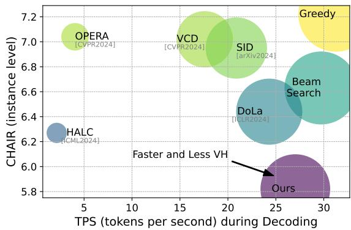
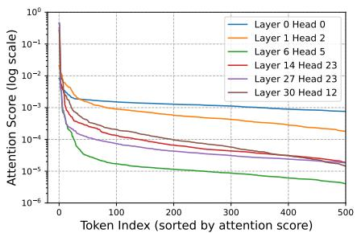
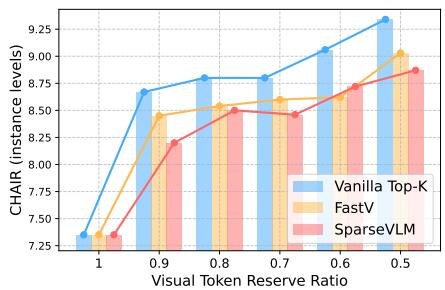
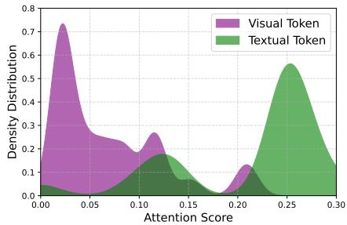
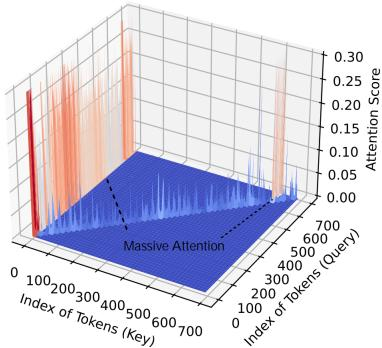
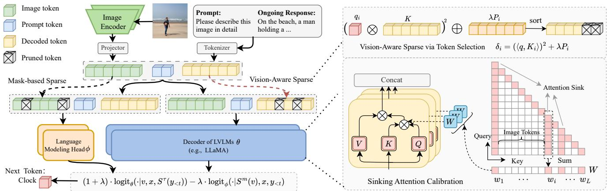
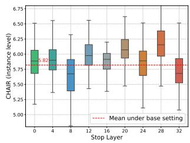
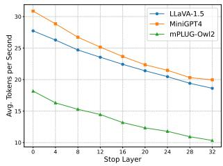

# VASparse: Towards Efficient Visual Hallucination Mitigation via Visual-Aware Token Sparsification

Xianwei Zhuang1, 2, Zhihong Zhu2, Yuxin Xie2, Liming Liang2, Yuexian Zou2\*

1Guangdong Provincial Key Laboratory of Ultra High Definition Immersive Media Technology, Shenzhen Graduate School, Peking University 2School of Electronic and Computer Engineering, Peking University

xwzhuang@stu.pku.edu.cn, zouyx@pku.edu.cn

## Abstract

Large Vision-Language Models (LVLMs) may produce outputs that are unfaithful to reality, also known as visual hallucinations (VH), which significantly impedes their real-world usage. To alleviate VH, various decoding strategies have been proposed to enhance visual information. However, many ofthese methods may require secondary decoding and rollback, which significantly reduces inference speed. In this work, we propose an efficient plug-and-play decoding algorithm via Visual-Aware Sparsification (VASparse)from the perspective of token sparsity for mitigating VH. VASparse is inspired by empirical observations: (1) the sparse activation ofattention in LVLMs, and (2) visual-agnostic tokens sparsification exacerbates VH. Based on these insights, we propose a novel token sparsification strategy that balances efficiency and trustworthiness. Specifically, VASparse implements a visual-aware token selection strategy during decoding to reduce redundant tokens while preserving visual context effectively. Additionally, we innovatively introduce a sparse-based visual contrastive decoding method to recalibrate the distribution ofhallucinated outputs without the time overhead associated with secondary decoding. Subsequently, VASparse recalibrates attention scores to penalize attention sinking ofLVLMs towards text tokens. Extensive experiments acrossfour popular benchmarks confirm the effectiveness of VASparse in mitigating VH across different LVLMfamilies without requiring additional training or post-processing. Impressively, VASparse achieves state-of-the-art performance for mitigating VH while maintaining competitive decoding speed. Code is available at https://github.com/ mengchuang123/VASparse-github.

## 1. Introduction

Motivated by the success of Large Language Models (LLMs), large vision-language models (LVLMs) have made significant advancements in cross-modal understanding and generation through novel model architectures, training methods, and instruction-based data [15, 21, 28, 32, 49, 55]. LVLMs excel at translating complex visual patterns into coherent language representations, leveraging the capabilities of LLMs to significantly enhance visual understanding performance and achieving impressive results across various tasks [2, 13, 27]. However, LVLMs may generate outputs that inaccurately reflect the visual content provided, a phenomenon termed visual hallucinations (VH), which can affect their trustworthiness and suitability in different applications across various domains [17, 24, 26, 31]. Additionally, recent research shows that even advanced and powerful LVLMs remain susceptible to VH [11, 16, 24].

  
Figure 1. Comparison of decoding speed and hallucination mitigation across methods using LLaVA-1.5 [28] (max new tokens is 64), where a lower instance-level CHAIR score [35] indicates less hallucination and higher TPS during decoding (measured by tokens generated per second) reflects greater decoding efficiency. We present the average of five runs on a single A100 GPU. Comparatively, our approach achieves both lower VH and higher efficiency.

Significant efforts have been directed toward mitigating VH in LVLMs to improve both the reliability and fidelity of their outputs. Existing strategies for reducing VH generally fall into three primary categories: post-processing and selfcorrection techniques [18, 46, 54], instruction-based finetuning [26, 48], and decoding strategy methods [7, 10, 20]. Although the progressive process has been achieved, these approaches still present several significant limitations, including: (1) a potential dependence on datasets and training, or the addition of complex post-processing steps or highperforming external LVLMs [26, 48, 54]; (2) the necessity for external tools and time-consuming sampling processes for visual localization [7]; (3) multi-round decoding and repeated rollbacks significantly impact decoding speed, diminishing practical usability [18, 20]. As illustrated in Figure 1, such techniques may reduce VH but also compromise efficiency. For instance, state-of-the-art HALC [7] has been shown to reduce the average decoding speed substantially. Consequently, there is an ongoing need for more efficient solutions to mitigate VH while ensuring both efficiency and trustworthiness of LVLMs.

In this work, we present VASparse, an efficient, plug-andplay method for VH mitigation that balances efficiency and trustworthiness from the perspective of visual-aware token sparsity. VASparse is based on several key empirical observations (cf. Section 3): (1) the attention of LVLMs exhibits a sparse pattern; (2) directly applying vision-agnostic sparsification methods (e.g., [6, 50]) for token pruning tends to worsen visual fuzziness and exacerbate VH. Based on these insights, VASparse incorporates the following innovative strategies to balance fidelity with efficiency:

First, we frame the token sparsification and visual awareness in LVLMs as a unified constrained optimization problem and devise a theoretically optimal token selection strategy during decoding to solve it. Second, we introduce a novel sparse-based visual contrastive decoding strategy to reduce hallucinatory tokens. Specifically, we contrast and redistribute the logits generated by visual-agnostic and visualaware token sparsification to enhance information perception of visual entities, which utilizes embeddings to achieve logits to avoid the time overhead associated with secondary decoding. Third, we propose to penalize sinking attention using cumulative attention scores to prevent the model from overfocusing on language-biased or low-semantic tokens.

As illustrated in Figure 1, our VASparse method achieves optimal performance in VH mitigation, with decoding speeds exceeding those of existing VH mitigation methods. Extensive experiments across four popular VH benchmarks and three LVLM families including LLaVA-1.5 [28], MiniGPT-4 [5] and mPLUG-Owl2 [44], demonstrate that VASparse not only delivers superior performance but also achieves competitive decoding speeds (e.g., achieving better performance and up to 12.9 × speed improvement than HALC [7]).

In summary, our main contributions are threefold:

• We explore VH mitigation from the perspective of token sparsification during decoding and present a novel, efficient, plug-and-play approach that achieves both model fidelity and efficiency, which unifies token sparsity and visual-aware enhancement as an optimization problem.

• We propose a novel visual-aware token selection strategy, along with a sparse-based visual contrastive decoding method to alleviate VH which utilizes embeddings to achieve contrasted logits and avoids multi-round decoding.

• Comprehensive experiments and evaluations demonstrate that VASparse significantly outperforms existing VH mitigation methods in both performance and decoding speed.

## 2. Related Work

Large Vision-Language Model. In recent years, significant progress has been made in visual understanding [51, 52] and question answering [43, 47, 58, 61]. Recent efforts have attempted to employ NLP methods and LLMs [9, 36– 39, 57, 59, 62, 63] as text decoders, combined with visual decoders [33] and a projector, to construct high-performing LVLMs. By integrating visual information with user instructions, LVLMs have achieved significant performance in generating diverse responses and handling complex visual understanding tasks. LLaVA [30] and LLaVA-1.5 [29] integrate pretrained visual encoders and text decoders, leveraging instruction fine-tuning to achieve strong multimodel understanding performance. InstructBLIP [12] and MiniGPT-4 [56] utilize a Q-former [22] to aggregate multimodal features, thereby reducing the number of visual tokens required. With optimized architectures, training modes, and diverse data, increasingly advanced LVLM families, such as Qwen-VL [3], mPLUG-Owl2 [45], and InternVL [8], have also been proposed. In this work, we use various architectures of LLaVA-1.5 [29], MiniGPT-4 [56], and mPLUG-Owl2 [45] to evaluate our approach for mitigating VH.

VH and Evaluation. LVLMs face challenges from VH which specifically refers to instances where generated content includes inaccurate object descriptions or is unfaithful to the input image information. This phenomenon has been observed in both early BERT-based models [23] and recent LVLMs [32, 49, 55]. In the realm of LVLMs, extensive research has delved into the evaluation and detection of VH [24, 31, 40]. CHAIR [35] is one of the most widely adopted benchmarks for assessing VH. POPE [24] evaluates VH through a binary classification framework, utilizing precision, recall, and accuracy. Furthermore, HALC [7] proposes an offline POPE (OPOPE) to enhance VH evaluation. And MME [14] provides a comprehensive performance assessment of LVLMs with respect to objects, attributes, and other factors. We combine these metrics with decoding speed to comprehensively evaluate the effectiveness of our VASparse in reducing VH while maintaining high efficiency.

VH Mitigation. To mitigate VH, various strategies have been developed. Current efforts for reducing VH generally fall into three categories: post-processing techniques [18, 54] and self-correction methods [46]; human feedback-based methods [26, 48]; and decoding strategy approaches [7, 10, 20, 60]. However, the first two strategies may require additional datasets and training or the integration of more powerful external LVLMs [26, 48, 54]. The third approach [7, 10, 18–20, 20] primarily explores contrastive decoding strategies based on visual comparisons, which may involve multiple rounds of decoding, timeconsuming rollbacks, or even the use of external detection tools. Our work focuses on designing efficient, plug-andplay methods that require no additional training.

  
(a) Attention between Tokens is Highly Sparse.

  
(c) Attention Density of Visual and Textual Tokens.

Figure 2. VH evaluation and attention analysis using LLaVA-1.5 on the CHAIR benchmark: (a) token sorting by attention score; (b) token sparsification effects observed with Vanilla Top-K, FastV [6], and SparseVLM [50] on sampled 500 images from the MSCOCO validation set, where Vanilla Top-K denotes keeping tokens with top-K scores in 1-th layer; and (c) attention density distribution across various tokens.  
  
Figure 3. Attention sinking phenomenon in LVLMs: in the 8-th layer and 26-th attention head of LLaVA-1.5, exhibits a substantial concentration of attention on specific tokens, e.g., <.> and <s>.

## 3. Observation and Motivation

In this section, we present the motivation behind our VASparse for mitigating VH. We first provide evidence of attention sparsity in LVLMs and observe that vision-agnostic sparsification can intensify VH. Additionally, we emphasize applying penalties to tokens prone to attention sinking.

## 3.1. Sparse Activation in LVLM Attention

Observation: As shown in Figure 2a, we sort the attention scores calculated for decoding tokens of LVLMs in ascending order. We observe that the attention scores exhibit a clear long-tail distribution, with only a small portion of tokens being heavily activated during decoding. Our results in Figure 2a indicate that retaining only the top 1% of tokens with the highest attention scores can recall over 98% of the total attention score. This suggests that attention in most layers of the LVLM decoder is sparse.

Insights: Our findings substantiate that self-attention in most layers of the LVLM decoder is sparse. This insight suggests the potential for pruning corresponding tokens to reduce computational cost during decoding.

## 3.2. Vision-Agnostic Sparsification Aggravates VH

Observation: Given the sparsity of attention in LVLMs, we evaluate VH with vision-agnostic (do not adjust token selection during decoding) token sparsification, including the vanilla Top-K strategy, FastV [6] and SparseVLM [50]. As shown in Figure 2b, we observe that as the level of sparsification increases, the model becomes more prone to VH.

Insights: Our empirical findings indicate that these vision-agnostic sparsification techniques exacerbate VH in LVLMs, suggesting that merely applying such methods to speed up decoding may undermine output trustworthiness.

## 3.3. Distinct Distribution of Image and Text Tokens

Observation: We analyze the attention distribution of visual and textual tokens, with the results shown in Figure 2c. A clear divergence in distribution is evident: image tokens predominantly occupy lower-attention regions, whereas text tokens concentrate in higher-attention regions.

Insights: These findings suggest that LVLMs tend to prioritize text tokens over image tokens during decoding. This explains why vision-agnostic token sparsification strategies may worsen hallucinations (cf. Section 3.2): they are more likely to prune low-attention image tokens, which may contain crucial visual information. This insight highlights the potential benefits of improving the model’s awareness of image tokens during sparsification.

## 3.4. Attention Sinking on Textual Tokens

Observation: We further analyzed the attention patterns in LVLMs and observed a significant attention ”sink” effect [18,

  
Figure 4. The illustration of the proposed VASparse framework, which consists of (1) the visual-aware token selection designed to prune the generated tokens during decoding; (2) a sparse-based visual contrastive decoding method to recalibrate the distribution of hallucinated outputs; and (3) the calibration strategy for punishing sinking attention.

42] in certain text tokens (as illustrated in Figure 3). This phenomenon resembles the summary token and attention bias effects observed in LLMs [42]. However, distinct from LLMs, our findings indicate that in LVLMs, attention sink tokens are primarily concentrated in text tokens, even when text tokens are vastly outnumbered by image tokens. Notably, these attention sink tokens are typically low in semantic content, such as <.> and <s>.

Insights: Tokens with attention sinking in LVLMs exhibit high attention and low semantic information. This pattern suggests an intrinsic bias within LVLMs. However, excessive focus on low-semantic tokens may cause the model to rely heavily on linguistic priors and neglect visual information. Therefore, applying penalties to these sinking tokens could enhance the LVLM’s perception of visual tokens.

## 4. Methodology

## 4.1. Preliminaries

We consider a general LVLM θ, which integrates a vision encoder, a vision-text interface, and a decoder of LLM. Initially, the image v undergoes processing through the vision encoder to produce embeddings, which are then modified by the interface (e.g., linear layer and Q-Former [22]) to align with the query x. The combined data serves as input to the decoder, which autoregressively generates the output y as:

$$
y _ { t } \sim p _ { \theta } ( y _ { t } | v , x , y _ { < t } ) \propto \exp \left( \log \mathrm { i t } _ { \theta } ( y _ { t } | v , x , y _ { < t } ) \right) ,\tag{1}
$$

where $y _ { t }$ represents the t-th token of $y ,$ and $y _ { < t }$ refers to the sequence of tokens generated prior to the t-th step. The function logit is the logit distribution function.

During decoding, the key K and value V within the attention head are derived from preceding decoding steps and stored in a key-value cache to avoid redundant computations.

Consequently, the attention with dimension D for decoding the t-th token proceeds during decoding as follows:

$$
\mathrm { A t t e n t i o n } ( q _ { t } , K _ { \leq t } ) = \mathrm { S o f t m a x } \left( \frac { q _ { t } K _ { \leq t } ^ { \top } } { \sqrt { D } } \right) ,\tag{2}
$$

where $q _ { t }$ is the query for the current decoding step, and $K _ { \leq t }$ represents the keys up to and including step t.

Our primary goal is to reduce generated hallucinatory tokens to preserve the trustworthiness of the generated text and maintain efficient decoding speed.

## 4.2. Problem Formulation

Building on our observations in Section 3, we decompose the unified objective of achieving both trustworthiness and efficiency for LVLMs into the following sub-goals:

Goal 1 (Token Sparsification): Given the sparsity of LVLMs (cf. Section 3.1), we define token sparsification through a binary mask M, where each element $M _ { i } \in \{ 0 , 1 \}$ Optimal sparsification minimizes $\textstyle \sum _ { i = 1 } ^ { L } M _ { i }$ while maximizing the recall of attention scores, aiming for $q ( M \odot K ) ^ { \top }$ to approximate the full attention score $q \bar { K } ^ { \top }$ as closely as possible, where L is the generated sequence length and $M _ { i } = 0$ indicates that the token $K _ { i }$ will be pruned during decoding.

Goal 2 (Vision-Aware Decoding): During decoding, some tokens may hold lower attention scores but are crucial for decoding visually relevant instances. Ignoring these tokens can exacerbate VH (cf. Section 3.2 and 3.3). We assign each token a vision-aware saliency score $P _ { i }$ to represent its importance for decoding visual instances. A higher $P _ { i }$ indicates that the token should be more likely to be retained.

The above objectives can be summarized as maintaining the original attention scores as much as possible while sparsifying the tokens and considering visual information during the decoding process. We innovatively unify these optimization goals into a constrained optimization problem which minimizes the error between the recalled attention scores and the full attention scores:

Definition 1 (Unified Objective): We define the joint objective of trustworthiness and efficiency in LVLMs as the solution to thefollowing constrained optimization problem:

$$
\begin{array} { c l } { \displaystyle \underset { M } { \mathop { \operatorname* { m i n } } } } & { \displaystyle \mathcal { E } ( M ) = \big \| q K ^ { \top } - q ( M \odot K ) ^ { \top } \big \| ^ { 2 } - \lambda P \cdot M } \\ & { \displaystyle = \sum _ { i = 1 } ^ { L } ( \langle q , K _ { i } \rangle - M _ { i } \langle q , K _ { i } \rangle ) ^ { 2 } - \lambda P _ { i } \cdot M _ { i } } \\ & { } \\ { s . t . } & { M _ { i } \in \{ 0 , 1 \} , \forall i = 1 , 2 , \ldots , L ; \quad \displaystyle \sum _ { i = 1 } ^ { L } M _ { i } = S , } \end{array}\tag{3}
$$

where, $q \in \mathbb { R } ^ { 1 \times D } , K _ { i } \in K$ and $K _ { i } \in \mathbb { R } ^ { 1 \times D } , | | \cdot | | ^ { 2 }$ represents the $L _ { 2 }$ norm. $\langle \cdot , \cdot \rangle$ denotes the inner product, and $S$ is the sparsity rate, and λ is a tradeoff parameter used to balance visual perception and attention recall.

The objective 1 inherently includes the following constraints: (1) Sparsity Constraint: $\begin{array} { r } { \sum _ { i = 1 } ^ { L } M _ { i } \ = \ \dot { S } . } \end{array}$ , and S denotes the number of non-zero elements in M, with $S < L$ and $M _ { i } \in \{ 0 , 1 \} ;$ ; (2) Visual Saliency Constraint: $P = \{ P _ { i } \} _ { i = 1 } ^ { L }$ represents the visual-aware scores. To solve this problem 1 efficiently, we propose a novel visual-aware token selection strategy to achieve efficient VH mitigation as the overall framework shown in Figure 4.

## 4.3. Visual-Aware Token Selection

To solve the unified objective $( D e f . ~ 1 )$ and mitigate VH efficiently, we propose a visual-aware token selection strategy. Specifically, for each attention head, we rank tokens based on an aggregated score $\delta _ { i }$ in descending order, and setting $M _ { i } = 1$ for the top-S tokens and $M _ { i } = 0$ for the rest. The proposed aggregation score $\delta _ { i }$ for each token is defined as:

$$
\delta _ { i } = \left( \langle q , K _ { i } \rangle \right) ^ { 2 } + \lambda P _ { i } ,\tag{4}
$$

where, $\langle \cdot , \cdot \rangle$ denotes the inner product, the score $\delta _ { i }$ combines both the attention score $\langle q , K \rangle$ and the visual saliency $P _ { i }$ ensuring that the visually relevant tokens are retained while preserving computational efficiency.

To obtain visual-aware scores (Goal 2 in Section $4 . 2 ) $ we utilize the attention scores of each generated token and the image tokens, which are treated as the visual saliency scores for the respective tokens. Specifically, we compute the visual saliency score $P$ by retaining the weights from the last attention head in the LVLM’s historical calculations:

$$
P _ { i } = \frac { \exp \left( \sum _ { k \in \mathbb { Z } ( v ) } a _ { i , k } \right) } { \sum _ { j } \exp \left( \sum _ { k \in \mathbb { Z } ( v ) } a _ { j , k } \right) } ,\tag{5}
$$

where $\mathcal { T } ( v )$ represents the set of image tokens and $a _ { i , j }$ is the attention score between tokens i and j.

By using the image token attention scores as a measure of significance, we can effectively leverage the attention weights already computed, while avoiding the introduction of additional computational overhead. For the discarded token set $\mathcal { T } = \{ K _ { i } \ | \ M _ { i } = 0 \}$ , we employ the k-nearest neighbor density peak aggregation algorithm [34] to achieve adaptive token aggregation. Tokens within the same cluster are summed and retained as a single aggregated token.

## 4.4. Sparse-based Visual Contrastive Decoding

Based on our empirical observations, we can leverage the finding that vision-agnostic token sparsification intensifies VH to mitigate language bias in the output distribution. We innovatively propose to amplify the informational contrast within the visual context by redistributing logits in the output by contrasting the decoding probability distributions of vision-aware and vision-agnostic (mask-based) sparsifications $S ^ { \tau }$ and $S ^ { m }$ . However, directly using the output distribution from LVLMs to obtain the contrastive logit distribution would inevitably incur significant overhead due to the secondary decoding process. To address this, we propose using only the embeddings of vision-agnostic tokens as input to the language decoding head ϕ of the LLM decoder to obtain the logit distribution, without going through the full text decoder. Specifically, we adopt the proposed visualaware sparsification strategy $( c f .$ Section 4.3) to obtain the logit distribution $\mathrm { l o g i t } _ { \theta } .$ Then, we randomly mask the visual tokens and input their embeddings directly into the language decoding head of the LLM to obtain the contrastive logit distribution logit ${ \dot { } } _ { \phi } .$ . Finally, we assign the logit distributions of the tokens to obtain the final results:

$$
\begin{array} { r } { y _ { t } \sim ( 1 + \alpha ) \cdot \log \mathrm { i t } _ { \theta } \left( \cdot  { \vert } v , x , S ^ { \tau } ( y _ { < t } ) \right) } \\ { - \alpha \cdot \log \mathrm { i t } _ { \phi } \left( \cdot  { \vert } S ^ { m } ( v ) , x , y _ { < t } \right) , } \end{array}\tag{6}
$$

where, α is a trade-off. Note that our decoding strategy bypasses the LVLM’s decoder (e.g., a LLaMA2-7B [39]), thereby avoiding the secondary computational overhead. Inspired by [20], we apply adaptive plausibility constraints to our sparse-based visual contrastive decoding.

## 4.5. Sinking Attention Penalty

Our observations (cf. Section 3.4) indicate a pronounced attention sinking in LVLMs, where tokens receive disproportionately high attention scores despite low semantic information. Excessive focus on such tokens can blur visual information during decoding. Therefore, a targeted penalty should be applied to tokens exhibiting abnormally high attention scores. We define a penalty weight matrix $W = \{ w _ { 1 } , \cdot \cdot \cdot , w _ { L } \}$ , where each $w _ { i }$ serves as a penalty factor for anomalous attention scores. To efficiently implement the penalty for sinking attention, we accumulate the attention scores of each token with subsequent queries to evaluate the degree of sinking. We then apply sof tmax normalization to obtain a calibration weight for sinking attention:

<table><tr><td rowspan="2">Methods</td><td colspan="3">LLaVA-1.5</td><td colspan="3">MiniGPT-4</td><td colspan="3">mPLUG-Owl2</td></tr><tr><td>CHAIRi↓</td><td>CHAIRs↓</td><td>TPS↑</td><td>CHAIRi↓</td><td>CHAIRs↓</td><td>TPS↑</td><td>CHAIRi↓</td><td>CHAIRs↓</td><td>TPS↑</td></tr><tr><td>FastV*</td><td>8.53</td><td>26.76</td><td>33.21</td><td>16.72</td><td>41.32</td><td>38.29</td><td>11.40</td><td>38.49</td><td>24.6</td></tr><tr><td>SparseVLM*</td><td>8.44</td><td>26.11</td><td>32.47</td><td>16.38</td><td>40.93</td><td>37.81</td><td>11.35</td><td>38.99</td><td>23.73</td></tr><tr><td>Woodpecker†</td><td>6.72</td><td>19.79</td><td></td><td>12.09</td><td>31.69</td><td></td><td>8.99</td><td>25.05</td><td></td></tr><tr><td>LURE†</td><td>6.67</td><td>19.75</td><td></td><td>11.80</td><td>31.67</td><td></td><td>7.78</td><td>22.53</td><td></td></tr><tr><td>Greedy</td><td>7.22</td><td>22.20</td><td>31.25</td><td>12.17</td><td>31.47</td><td>36.64</td><td>8.94</td><td>24.42</td><td>20.36</td></tr><tr><td>Beam Search</td><td>6.43</td><td>19.97</td><td>29.91</td><td>11.57</td><td>31.80</td><td>32.27</td><td>8.72</td><td>23.87</td><td>19.62</td></tr><tr><td>OPERA</td><td>7.04</td><td>21.28</td><td>4.36</td><td>12.34</td><td>32.63</td><td>5.57</td><td>9.07</td><td>24.48</td><td>3.56</td></tr><tr><td>VCD</td><td>7.02</td><td>21.40</td><td>17.58</td><td>11.90</td><td>30.60</td><td>17.69</td><td>9.13</td><td>24.89</td><td>9.89</td></tr><tr><td>DoLa</td><td>6.44</td><td>20.23</td><td>23.61</td><td>11.62</td><td>30.58</td><td>25.01</td><td>8.88</td><td>24.67</td><td>14.74</td></tr><tr><td>SID</td><td>6.95</td><td>20.83</td><td>20.88</td><td>11.85</td><td>31.73</td><td>22.95</td><td>8.54</td><td>23.55</td><td>12.95</td></tr><tr><td>HALC</td><td>6.27</td><td>19.64</td><td>2.15</td><td>11.69</td><td>31.76</td><td>3.86</td><td>7.71</td><td>23.48</td><td>1.52</td></tr><tr><td>Ours</td><td>5.82</td><td>18.51</td><td>27.73</td><td>11.35</td><td>30.19</td><td>30.87</td><td>7.36</td><td>22.03</td><td>18.18</td></tr></table>

Table 1. Comparison of the average results (instance levels CHAIRi and sentence levels CHAIRs ) and token per second (TPS) during decoding with baselines on MSCOCO of five random runs. ∗ represents the image token sparsity method and † is the post-hoc methods.

$$
w _ { j } = \frac { \exp { \left( \sum _ { i = j } ^ { L } a _ { i , j } \right) } } { \sum _ { k = 1 } ^ { L } \exp { \left( \sum _ { i = k } ^ { L } a _ { i , k } \right) } } ,\tag{7}
$$

where $a _ { i , j }$ denotes the element in the i-th row and j-th column of the attention matrix, and $w _ { j }$ represents the j-th element of the weight vector W after applying the softmax operation. This approach ensures that sinking attention is evaluated progressively across subsequent queries, and W will be utilized as a weight as $( 1 + \beta ) q K ^ { \top } - \beta W \odot q K ^ { \top }$ during decoding, as shown in Figure 4.

## 4.6. Theoretical Analysis

Theorem 1 (Global Optimality): By employing the selection strategy defined in Section 4.3, we can obtain a globally optimal solution for the optimization problem defined in Def. 1. Specifically, the sparse mask M derived from this selection strategy satisfies:

$$
M ^ { * } = \arg \operatorname* { m i n } _ { M } \mathcal { E } ( M ) .\tag{8}
$$

Intuition: The proof and more analysis of the theorem 1 is provided in the Appendix. This theorem ensures that the proposed token selection strategy yields the minimum error E(M). This theoretical analysis further validates the effectiveness of the proposed VASparse in achieving both token sparsification and efficient visual perception.

## 5. Experiments

Benchmarks. Following common settings [7, 20, 46], We evaluate the effectiveness of our VASparse in VH mitigation on four popular benchmarks: (1) quantitative metrics CHAIR [35] on MSCOCO dataset [25]; (2) the offline

Polling-based Object Probing Evaluation (POPE) [7, 24] on the MSCOCO dataset; (3) general-purposed Multimodal Large Language Model Evaluation (MME) benchmark [14]; (4) GPT-4 assisted benchmark [53] relies on the advanced GPT-4 to judge the fine-grained VH and calculate Sentencelevel Hallucination Ratio (SHR).

Baselines. We compare our VASparse with greedy decoding and beam search decoding, and various state-of-the-art (SOTA) decoding methods as baselines, including DoLa [10], OPERA [18], VCD [20], SID [19] and HALC [7]. We also compare the post-processing VH elimination method (i.e., Woodpecker [46], LURE [54]) with some token sparsity methods (i.e., FastV [6] and SparseVLMs [50]).

Backbones. Following previous settings [7, 20], we select popular LVLMs families, e.g., LLaVA-1.5 [28], MiniGPT-4 [5] and mPLUG-Owl2 [44] as the base modal for all baselines except Woodpecker and LURE, where, Wood pecker and LURE utilize extra LLMs, i.e., ChatGPT [4] and GPT-4 [1], for self-correction and distillation. We investigate the VH of these LVLMs under different decoding to evaluate the effectiveness of our VASparse.

Settings. We implement the proposed VASparse based on HuggingFace Transformers [41] and combine it with beam search for decoding. We evaluate settings with maximum generation lengths $L _ { m a x }$ of 64 and 512. When $L _ { m a x }$ is 64, the beam size is set to 3, and for $L _ { m a x } = 5 1 2$ , it is set to 2. The sparsity rate top-S is set to 0.9 times $L ,$ and the image masking sparsity rate for $S ^ { m }$ is set to 0.5. The hyperparameter λ in Eq. 4, α in Eq. 6 and β in Section 4.5 are set to 0.1. The decoding process of LVLMs and all experiments are performed on 8 A100 GPUs. For token sparsity methods, we retain 75% of tokens during inference. Other methods use the settings as described in original papers. More details and results under $L _ { m a x } = 5 1 2$ are provided in Appendix.

<table><tr><td rowspan="2">Methods</td><td colspan="3">LLaVA-1.5</td><td colspan="3">MiniGPT-4</td><td colspan="3">mPLUG-Owl2</td></tr><tr><td>Random</td><td>Popular</td><td>Adversarial</td><td>Random</td><td>Popular</td><td>Adversarial</td><td>Random</td><td>Popular</td><td>Adversarial</td></tr><tr><td>Woodpecker†</td><td>59.73</td><td>58.53</td><td>58.07</td><td>53.84</td><td>51.70</td><td>51.27</td><td>58.10</td><td>53.07</td><td>55.42</td></tr><tr><td>LURE†</td><td>60.08</td><td>58.63</td><td>58.34</td><td>53.91</td><td>52.37</td><td>51.38</td><td>58.28</td><td>53.15</td><td>55.65</td></tr><tr><td>Greedy</td><td>58.75</td><td>57.42</td><td>56.64</td><td>53.71</td><td>51.68</td><td>51.92</td><td>57.40</td><td>53.43</td><td>55.43</td></tr><tr><td>Beam Search</td><td>60.38</td><td>58.98</td><td>58.43</td><td>53.97</td><td>52.27</td><td>51.93</td><td>55.31</td><td>52.89</td><td>53.12</td></tr><tr><td>OPERA</td><td>59.80</td><td>58.42</td><td>58.00</td><td>53.08</td><td>51.32</td><td>51.20</td><td>55.70</td><td>53.41</td><td>53.66</td></tr><tr><td>VCD</td><td>60.05</td><td>58.34</td><td>58.02</td><td>53.26</td><td>51.50</td><td>51.07</td><td>58.63</td><td>54.87</td><td>56.13</td></tr><tr><td>DoLa</td><td>59.36</td><td>58.08</td><td>57.44</td><td>53.83</td><td>51.93</td><td>51.72</td><td>57.21</td><td>53.38</td><td>55.24</td></tr><tr><td>SID</td><td>61.63</td><td>59.62</td><td>58.83</td><td>53.86</td><td>51.98</td><td>51.77</td><td>55.82</td><td>53.46</td><td>56.07</td></tr><tr><td>HALC</td><td>60.46</td><td>59.33</td><td>58.50</td><td>53.93</td><td>52.06</td><td>51.80</td><td>56.29</td><td>53.38</td><td>55.84</td></tr><tr><td>Ours</td><td>62.13</td><td>60.93</td><td>59.20</td><td>54.87</td><td>52.93</td><td>52.70</td><td>58.27</td><td>55.28</td><td>56.77</td></tr></table>

Table 2. Comparison of the average F1-score evaluation results under different settings (i.e., Random, Popular, Adversarial) with different baselines and our VASparse on offline POPE benchmark [7, 24] of five random runs, with whole statistical results in Appendix. Higher F1-score indicate better performance and bold indicates the best results. † denotes the post-hoc method.
<table><tr><td rowspan="3">Methods</td><td colspan="4">LLaVA-1.5</td><td colspan="4">MiniGPT-4</td><td colspan="4">mPLUG-Owl2</td></tr><tr><td>Object-level↑</td><td></td><td colspan="2">Attribute-level↑</td><td>Object-level↑</td><td></td><td colspan="2">Attribute-level↑</td><td colspan="2">Object-level↑</td><td colspan="2">Attribute-level↑</td></tr><tr><td>Existence</td><td>Count</td><td>Position</td><td>Color</td><td>Existence</td><td>Count</td><td>Position</td><td>Color</td><td>Existence</td><td>Count</td><td>Position</td><td>Color</td></tr><tr><td>Greedy</td><td>165.67</td><td>120.00</td><td>110.67</td><td>148.33</td><td>137.00</td><td>93.00</td><td>75.00</td><td>125.00</td><td>167.00</td><td>120.00</td><td>105.00</td><td>145.00</td></tr><tr><td>DoLa</td><td>170.00</td><td>120.00</td><td>106.67</td><td>150.67</td><td>137.00</td><td>90.00</td><td>75.33</td><td>122.67</td><td>167.00</td><td>125.00</td><td>110.00</td><td>147.67</td></tr><tr><td>OPERA</td><td>165.00</td><td>115.67</td><td>104.00</td><td>145.00</td><td>140.67</td><td>92.33</td><td>73.00</td><td>125.00</td><td>167.00</td><td>122.33</td><td>100.00</td><td>145.00</td></tr><tr><td>VCD</td><td>175.33</td><td>130.33</td><td>115.00</td><td>155.00</td><td>142.00</td><td>95.33</td><td>71.33</td><td>129.00</td><td>171.33</td><td>125.00</td><td>107.33</td><td>150.00</td></tr><tr><td>HALC</td><td>167.67</td><td>121.33</td><td>106.67</td><td>150.67</td><td>140.00</td><td>92.67</td><td>71.33</td><td>122.67</td><td>167.00</td><td>120.33</td><td>108.67</td><td>145.00</td></tr><tr><td>Ours</td><td>180.00</td><td>132.67</td><td>121.33</td><td>160.00</td><td>147.33</td><td>98.67</td><td>78.67</td><td>133.00</td><td>175.00</td><td>130.00</td><td>110.67</td><td>155.00</td></tr></table>

Table 3. Results on the subset of the MME benchmark for evaluating object-level and attribute-level VH, where the best performances within each setting are bolded. We randomly run it five times to obtain the average result, with the whole statistical results in Appendix.

## 5.1. Main Results

CHAIR Evaluation. Following HALC [7], we set ‘Please describe this image in detail.’ as the input prompt and utilize generated tokens per second (TPS) to evaluate the efficiency, as results are shown in Table 1. Based on the results, we have several detailed observations: (1) It can be observed that our method significantly outperforms existing decoding and post-processing baselines for reducing VH. Our VASparse achieved the lowest VH rate at both the sentence and instance levels across three families of LVLMs, which demonstrates the superiority and generalizability of our method in alleviating VH. (2) Compared to SOTA decoding methods, VASparse maintains competitive decoding speed without secondary decoding or reprocessing via extra LLMs, e.g., achieving speeds that are 12.9× and 6.4× faster than HALC [7] and OPERA [18], respectively. (3) Although the sparsification method accelerates the inference speed, it exacerbates visual ambiguity, which in turn aggravates VH.

POPE Evaluation. Following HALC [7], we utilize offline POPE (OPOPE) benchmark with F1-score as metrics to evaluate VH, which replaces the live interactions of POPE with offline checks. As shown in Table 2, we have several observations: (1) VASparse consistently achieves optimal results in most settings, outperforming both SOTA decoding methods and post-processing methods. This further demonstrates the effectiveness of VASparse; (2) VASparse effectively mitigates VH across three different LVLM architectures, demonstrating the versatility and plug-and-play nature.

MME Benchmarks. Following [7, 20, 46], we adopt objectlevel subsets (“existence” and “count”) and attribute-level subsets ( “position” and “color”) of MME benchmark [14]. to evaluate VH. As shown in Table 3, we can observe that: (1) Our VASparse can significantly reduce object and attribute hallucination, and achieve optimal VH mitigation performance. (2) HALC and OPERA do not exhibit significant VH mitigation on the MME benchmark. This is because the MME evaluation is designed as a binary classification task, requiring LVLMs to output only a few tokens, which limits the effectiveness of methods that need to decode sequences of a certain length and handle special entity tokens.

GPT-4 Assisted Benchmarks. We conduct experiments on the GPT-4 assisted benchmark to evaluate the fine-grained VH of different methods, and the results are presented in Table 5. We can observe that our VASparse achieved the best SHR metric among the four LVLMs, which further confirms the superiority of our method in mitigating VH.

<table><tr><td rowspan="2">G. Settings</td><td rowspan="2"></td><td colspan="3">LLaVA-1.5</td><td colspan="3">MiniGPT-4</td></tr><tr><td>CHAIRi↓</td><td>CHAIRs↓</td><td>TPS↑</td><td>CHAIRi↓</td><td>CHAIRs↓</td><td>TPS↑</td></tr><tr><td rowspan="2">1</td><td>w/o Whole Visual-Aware Token Selection (i.e., Eq. 4)</td><td>6.43</td><td>19.75</td><td>25.54</td><td>11.63</td><td>30.51</td><td>27.55</td></tr><tr><td>w/o Visual Perception Score P in Eq. 4</td><td>6.06</td><td>19.20</td><td>27.80</td><td>11.57</td><td>31.05</td><td>30.96</td></tr><tr><td rowspan="2">2</td><td>w/o Whole SVCD (i.e., Eq. 6)</td><td>6.91</td><td>21.42</td><td>30.68</td><td>11.85</td><td>30.93</td><td>35.83</td></tr><tr><td>w/o Mask-based Sparsification  $S ^ { m }$  in Eq. 6</td><td>6.31</td><td>18.85</td><td>27.47</td><td>11.58</td><td>31.26</td><td>30.30</td></tr><tr><td>3</td><td>w/o Sinking Attention Penalty (i.e., Eq. 7)</td><td>6.32</td><td>19.39</td><td>27.96</td><td>11.52</td><td>31.04</td><td>30.92</td></tr><tr><td>4</td><td>Our Full VASparse</td><td>5.82</td><td>18.51</td><td>27.73</td><td>11.35</td><td>30.19</td><td>30.87</td></tr></table>

Table 4. Ablation experiments on the CHAIR benchmark, with the best results highlighted in bold and the whole results in Appendix.

<table><tr><td>Methods</td><td>LLaVA-1.5</td><td>MiniGPT-4</td><td>mPLUG-Owl2</td></tr><tr><td>Greedy</td><td>36.3</td><td>46.7</td><td>42.3</td></tr><tr><td>OPERA</td><td>34.2</td><td>45.9</td><td>41.7</td></tr><tr><td>VCD</td><td>34.6</td><td>46.0</td><td>41.9</td></tr><tr><td>HALC</td><td>33.9</td><td>45.8</td><td>41.7</td></tr><tr><td>Ours</td><td>33.5</td><td>45.2</td><td>41.1</td></tr></table>

Table 5. Performance (SHR) comparison on GPT-4 assisted benchmark, where, the lower value denotes the lower VH.

## 5.2. Method Analysis

We conduct ablation experiments using CHAIR on MSCOCO to evaluate the effectiveness of the components of our proposed VASparse in detail. Specifically, we evaluate the effectiveness of the components by removing or modifying the specific settings as results shown in Table 5. Effect of the Visual-Aware Token Selection. As shown in Groups 1 and 4 in Table 4, removing the whole visual-aware token selection strategy leads to a performance decrease and reduces decoding speed. This suggests that sparsifying the model’s decoding sequence to some extent can mitigate the language bias in LVLMs and reduce the involvement of certain tokens in attention computation. Moreover, removing the visual perception score also results in a performance decline. These results consistently demonstrate the effectiveness of our visual-aware token selection strategy.

Effect of the Sparse-based Visual Contrastive Decoding. To evaluate the effectiveness of our sparse-based visual contrastive decoding (SVCD), we remove both the full SVCD and the mask-based sparsification Sm in Eq. 6. As shown in Groups 2 and 4 of Table 4, we observe a significant performance decline, which further validates the effectiveness of our SVCD and mask-based sparsification strategy. Effect of the Sinking Attention Calibration. Moreover, we removed the calibration mechanism for the sinking attention, and observed a further decline in the method’s VH mitigation effect. This further demonstrates the relevance of sinking attention to VH and the effectiveness of the proposed attention calibration strategy.

  
(a) CHAIRi evaluation results.

  
(b) TPS during decoding.  
Figure 5. Performance and efficiency analysis of different logit sources: (a) the impact of using different early stopping layers on LLaVA-1.5 performance; (b) the impact of using different early stopping layers on decoding speeds (TPS).

Decoding Efficiency Analysis. To further validate the effect of using embedding features to compute the proposed SVCD, we calculate the contrastive logits from features at different depths of the LVLM decoder to calibrate the distribution, and observe performance and decoding speed, as shown in Figure 5. We observe that by using only embedded features (i.e., stop layer is 0), our method already achieves good VH mitigation performance while attaining optimal decoding speed. In this way, our VASparse effectively avoids the timeconsuming secondary decoding process, achieving a balance between performance and efficiency.

## 6. Conclusion

This work proposes an efficient, plug-and-play decoding strategy, VASparse, to mitigate VH in LVLMs. Inspired by the sparse activation pattern of LVLMs and the role of visual-agnostic token sparsification in worsening VH, we propose a visual-aware token selection strategy during decoding. Subsequently, we innovatively introduce sparse-based visual contrastive decoding to recalibrate the logits without secondary decoding, and adjust sinking attention. Extensive experiments show the effectiveness of VASparse in reducing VH across various benchmarks and LVLM families.

## Acknowledgements

This work is supported by Guangdong Provincial Key Laboratory of Ultra High Definition Immersive Media Technology(Grant No. 2024B1212010006)

## References

[1] OpenAI Josh Achiam and et al. Steven Adler. Gpt-4 technical report. 2023. 6

[2] Jinze Bai, Shuai Bai, Shusheng Yang, Shijie Wang, Sinan Tan, Peng Wang, Junyang Lin, Chang Zhou, and Jingren Zhou. Qwen-vl: A frontier large vision-language model with versatile abilities. ArXiv, abs/2308.12966, 2023. 1

[3] Jinze Bai, Shuai Bai, Shusheng Yang, Shijie Wang, Sinan Tan, Peng Wang, Junyang Lin, Chang Zhou, and Jingren Zhou. Qwen-vl: A frontier large vision-language model with versatile abilities. arXiv preprint arXiv:2308.12966, 2023. 2

[4] Tom B. Brown, Benjamin Mann, Nick Ryder, Melanie Subbiah, Jared Kaplan, Prafulla Dhariwal, Arvind Neelakantan, Pranav Shyam, Girish Sastry, Amanda Askell, Sandhini Agarwal, Ariel Herbert-Voss, Gretchen Krueger, Tom Henighan, Rewon Child, Aditya Ramesh, Daniel M. Ziegler, Jeff Wu, Clemens Winter, Christopher Hesse, Mark Chen, Eric Sigler, Mateusz Litwin, Scott Gray, Benjamin Chess, Jack Clark, Christopher Berner, Sam McCandlish, Alec Radford, Ilya Sutskever, and Dario Amodei. Language models are few-shot learners. ArXiv, abs/2005.14165, 2020. 6

[5] Jun Chen, Deyao Zhu, Xiaoqian Shen, Xiang Li, Zechun Liu, Pengchuan Zhang, Raghuraman Krishnamoorthi, Vikas Chandra, Yunyang Xiong, and Mohamed Elhoseiny. Minigptv2: large language model as a unified interface for visionlanguage multi-task learning. ArXiv, abs/2310.09478, 2023. 2, 6

[6] Liang Chen, Haozhe Zhao, Tianyu Liu, Shuai Bai, Junyang Lin, Chang Zhou, and Baobao Chang. An image is worth 1/2 tokens after layer 2: Plug-and-play inference acceleration for large vision-language models, 2024. 2, 3, 6

[7] Zhaorun Chen, Zhaorun Chen, Zhuokai Zhao, Hongyin Luo, Huaxiu Yao, Bo Li, and Jiawei Zhou. Halc: Object hallucination reduction via adaptive focal-contrast decoding. ArXiv, abs/2403.00425, 2024. 2, 3, 6, 7

[8] Zhe Chen, Jiannan Wu, Wenhai Wang, Weijie Su, Guo Chen, Sen Xing, Muyan Zhong, Qinglong Zhang, Xizhou Zhu, Lewei Lu, et al. Internvl: Scaling up vision foundation models and aligning for generic visual-linguistic tasks. In Proceedings of the IEEE/CVF Conference on Computer Vision and Pattern Recognition, pages 24185–24198, 2024. 2

[9] Wei-Lin Chiang, Zhuohan Li, Zi Lin, Ying Sheng, Zhanghao Wu, Hao Zhang, Lianmin Zheng, Siyuan Zhuang, Yonghao Zhuang, Joseph E Gonzalez, et al. Vicuna: An open-source chatbot impressing gpt-4 with 90%\* chatgpt quality. See https://vicuna. lmsys. org (accessed 14 April 2023), 2(3):6, 2023. 2

[10] Yung-Sung Chuang, Yujia Xie, Hongyin Luo, Yoon Kim, James R. Glass, and Pengcheng He. Dola: Decoding by contrasting layers improves factuality in large language models. ArXiv, abs/2309.03883, 2023. 2, 3, 6

[11] Wenliang Dai, Zihan Liu, Ziwei Ji, Dan Su, and Pascale Fung. Plausible may not be faithful: Probing object hallucination in vision-language pre-training. ArXiv, abs/2210.07688, 2022. 1

[12] Wenliang Dai, Junnan Li, Dongxu Li, Anthony Meng Huat Tiong, Junqi Zhao, Weisheng Wang, Boyang Li, Pascale Fung, and Steven Hoi. Instructblip: Towards general-purpose visionlanguage models with instruction tuning, 2023. 2

[13] Wenliang Dai, Junnan Li, Dongxu Li, Anthony Meng Huat Tiong, Junqi Zhao, Weisheng Wang, Boyang Albert Li, Pascale Fung, and Steven C. H. Hoi. Instructblip: Towards general-purpose vision-language models with instruction tuning. ArXiv, abs/2305.06500, 2023. 1

[14] Chaoyou Fu, Peixian Chen, Yunhang Shen, Yulei Qin, Mengdan Zhang, Xu Lin, Zhenyu Qiu, Wei Lin, Jinrui Yang, Xiawu Zheng, Ke Li, Xing Sun, and Rongrong Ji. Mme: A comprehensive evaluation benchmark for multimodal large language models. ArXiv, abs/2306.13394, 2023. 2, 6, 7

[15] Tao Gong, Chengqi Lyu, Shilong Zhang, Yudong Wang, Miao Zheng, Qianmengke Zhao, Kuikun Liu, Wenwei Zhang, Ping Luo, and Kai Chen. Multimodal-gpt: A vision and language model for dialogue with humans. ArXiv, abs/2305.04790, 2023. 1

[16] Tianrui Guan, Fuxiao Liu, Xiyang Wu, Ruiqi Xian, Zongxia Li, Xiaoyu Liu, Xijun Wang, Lichang Chen, Furong Huang, Yaser Yacoob, Dinesh Manocha, and Tianyi Zhou. Hallusionbench: An advanced diagnostic suite for entangled language hallucination and visual illusion in large vision-language models. 2023. 1

[17] Anish Gunjal, Jihan Yin, and Erhan Bas. Detecting and preventing hallucinations in large vision language models. In AAAI Conference on Artificial Intelligence, 2023. 1

[18] Qidong Huang, Xiao wen Dong, Pan Zhang, Bin Wang, Conghui He, Jiaqi Wang, Dahua Lin, Weiming Zhang, and Neng H. Yu. Opera: Alleviating hallucination in multimodal large language models via over-trust penalty and retrospection-allocation. ArXiv, abs/2311.17911, 2023. 1, 2, 3, 6, 7

[19] Fushuo Huo, Wenchao Xu, Zhong Zhang, Haozhao Wang, Zhicheng Chen, and Peilin Zhao. Self-introspective decoding: Alleviating hallucinations for large vision-language models, 2024. 6

[20] Sicong Leng, Hang Zhang, Guanzheng Chen, Xin Li, Shijian Lu, Chunyan Miao, and Li Bing. Mitigating object hallucinations in large vision-language models through visual contrastive decoding. ArXiv, abs/2311.16922, 2023. 2, 3, 5, 6, 7

[21] Bo Li, Yuanhan Zhang, Liangyu Chen, Jinghao Wang, Jingkang Yang, and Ziwei Liu. Otter: A multi-modal model with in-context instruction tuning. ArXiv, abs/2305.03726, 2023. 1

[22] Junnan Li, Dongxu Li, Silvio Savarese, and Steven Hoi. Blip-2: Bootstrapping language-image pre-training with frozen image encoders and large language models. In International conference on machine learning, pages 19730–19742. PMLR, 2023. 2, 4

[23] Liunian Harold Li, Mark Yatskar, Da Yin, Cho-Jui Hsieh, and Kai-Wei Chang. Visualbert: A simple and performant

baseline for vision and language. ArXiv, abs/1908.03557, 2019. 2

[24] Yifan Li, Yifan Du, Kun Zhou, Jinpeng Wang, Wayne Xin Zhao, and Ji rong Wen. Evaluating object hallucination in large vision-language models. In Conference on Empirical Methods in Natural Language Processing, 2023. 1, 2, 6, 7

[25] Tsung-Yi Lin, Michael Maire, Serge J. Belongie, James Hays, Pietro Perona, Deva Ramanan, Piotr Dollar, and C. Lawrence´ Zitnick. Microsoft coco: Common objects in context. In European Conference on Computer Vision, 2014. 6

[26] Fuxiao Liu, Kevin Lin, Linjie Li, Jianfeng Wang, Yaser Yacoob, and Lijuan Wang. Mitigating hallucination in large multi-modal models via robust instruction tuning. 2023. 1, 2, 3

[27] Haotian Liu, Chunyuan Li, Yuheng Li, and Yong Jae Lee. Improved baselines with visual instruction tuning. ArXiv, abs/2310.03744, 2023. 1

[28] Haotian Liu, Chunyuan Li, Qingyang Wu, and Yong Jae Lee. Visual instruction tuning. ArXiv, abs/2304.08485, 2023. 1, 2, 6

[29] Haotian Liu, Chunyuan Li, Yuheng Li, and Yong Jae Lee. Improved baselines with visual instruction tuning. In Proceedings of the IEEE/CVF Conference on Computer Vision and Pattern Recognition, pages 26296–26306, 2024. 2

[30] Haotian Liu, Chunyuan Li, Qingyang Wu, and Yong Jae Lee. Visual instruction tuning. Advances in neural information processing systems, 36, 2024. 2

[31] Holy Lovenia, Wenliang Dai, Samuel Cahyawijaya, Ziwei Ji, and Pascale Fung. Negative object presence evaluation (nope) to measure object hallucination in vision-language models. ArXiv, abs/2310.05338, 2023. 1, 2

[32] Muhammad Maaz, Hanoona Abdul Rasheed, Salman H. Khan, and Fahad Shahbaz Khan. Video-chatgpt: Towards detailed video understanding via large vision and language models. ArXiv, abs/2306.05424, 2023. 1, 2

[33] Alec Radford, Jong Wook Kim, Chris Hallacy, Aditya Ramesh, Gabriel Goh, Sandhini Agarwal, Girish Sastry, Amanda Askell, Pamela Mishkin, Jack Clark, Gretchen Krueger, and Ilya Sutskever. Learning transferable visual models from natural language supervision, 2021. 2

[34] Alex Rodriguez and Alessandro Laio. Clustering by fast search and find of density peaks. science, 344(6191):1492– 1496, 2014. 5

[35] Anna Rohrbach, Lisa Anne Hendricks, Kaylee Burns, Trevor Darrell, and Kate Saenko. Object hallucination in image captioning. In Conference on Empirical Methods in Natural Language Processing, 2018. 1, 2, 6

[36] Jinghan Ru, Yuxin Xie, Xianwei Zhuang, Yuguo Yin, and Yuexian Zou. Do we really have to filter out random noise in pre-training data for language models?, 2025. 2

[37] Rohan Taori, Ishaan Gulrajani, Tianyi Zhang, Yann Dubois, Xuechen Li, Carlos Guestrin, Percy Liang, and Tatsunori B Hashimoto. Stanford alpaca: An instruction-following llama model, 2023.

[38] Hugo Touvron, Thibaut Lavril, Gautier Izacard, Xavier Martinet, Marie-Anne Lachaux, Timothee Lacroix, Baptiste´ Roziere, Naman Goyal, Eric Hambro, Faisal Azhar, et al.\`

Llama: Open and efficient foundation language models. arXiv preprint arXiv:2302.13971, 2023.

[39] Hugo Touvron, Louis Martin, Kevin Stone, Peter Albert, Amjad Almahairi, Yasmine Babaei, Nikolay Bashlykov, Soumya Batra, Prajjwal Bhargava, Shruti Bhosale, et al. Llama 2: Open foundation and fine-tuned chat models. arXiv preprint arXiv:2307.09288, 2023. 2, 5

[40] Junyan Wang, Yi Zhou, Guohai Xu, Pengcheng Shi, Chenlin Zhao, Haiyang Xu, Qinghao Ye, Mingshi Yan, Ji Zhang, Jihua Zhu, Jitao Sang, and Haoyu Tang. Evaluation and analysis of hallucination in large vision-language models. ArXiv, abs/2308.15126, 2023. 2

[41] Thomas Wolf, Lysandre Debut, Victor Sanh, Julien Chaumond, Clement Delangue, Anthony Moi, Pierric Cistac, Tim Rault, Remi Louf, Morgan Funtowicz, Joe Davison, Sam´ Shleifer, Patrick von Platen, Clara Ma, Yacine Jernite, Julien Plu, Canwen Xu, Teven Le Scao, Sylvain Gugger, Mariama Drame, Quentin Lhoest, and Alexander M. Rush. Huggingface’s transformers: State-of-the-art natural language processing. ArXiv, abs/1910.03771, 2019. 6

[42] Guangxuan Xiao, Yuandong Tian, Beidi Chen, Song Han, and Mike Lewis. Efficient streaming language models with attention sinks, 2024. 4

[43] Yuxin Xie, Zhihong Zhu, Xianwei Zhuang, Liming Liang, Zhichang Wang, and Yuexian Zou. Gpa: Global and prototype alignment for audio-text retrieval. In Proc. Interspeech 2024, pages 5078–5082, 2024. 2

[44] Qinghao Ye, Haiyang Xu, Jiabo Ye, Mingshi Yan, Anwen Hu, Haowei Liu, Qi Qian, Ji Zhang, Fei Huang, and Jingren Zhou. mplug-owl2: Revolutionizing multi-modal large language model with modality collaboration. ArXiv, abs/2311.04257, 2023. 2, 6

[45] Qinghao Ye, Haiyang Xu, Jiabo Ye, Ming Yan, Anwen Hu, Haowei Liu, Qi Qian, Ji Zhang, and Fei Huang. mplugowl2: Revolutionizing multi-modal large language model with modality collaboration. In Proceedings ofthe IEEE/CVF Conference on Computer Vision and Pattern Recognition, pages 13040–13051, 2024. 2

[46] Shukang Yin, Chaoyou Fu, Sirui Zhao, Tong Xu, Hao Wang, Dianbo Sui, Yunhang Shen, Ke Li, Xingguo Sun, and Enhong Chen. Woodpecker: Hallucination correction for multimodal large language models. ArXiv, abs/2310.16045, 2023. 1, 2, 6, 7

[47] Yuguo Yin, Yuxin Xie, Wenyuan Yang, Dongchao Yang, Jinghan Ru, Xianwei Zhuang, Liming Liang, and Yuexian Zou. Atri: Mitigating multilingual audio text retrieval inconsistencies by reducing data distribution errors. arXiv preprint arXiv:2502.14627, 2025. 2

[48] Tianyu Yu, Yuan Yao, Haoye Zhang, Taiwen He, Yifeng Han, Ganqu Cui, Jinyi Hu, Zhiyuan Liu, Hai-Tao Zheng, Maosong Sun, and Tat-Seng Chua. Rlhf-v: Towards trustworthy mllms via behavior alignment from fine-grained correctional human feedback. ArXiv, abs/2312.00849, 2023. 2, 3

[49] Hang Zhang, Xin Li, and Lidong Bing. Video-llama: An instruction-tuned audio-visual language model for video understanding. ArXiv, abs/2306.02858, 2023. 1, 2

[50] Yuan Zhang, Chun-Kai Fan, Junpeng Ma, Wenzhao Zheng, Tao Huang, Kuan Cheng, Denis Gudovskiy, Tomoyuki Okuno,

Yohei Nakata, Kurt Keutzer, et al. Sparsevlm: Visual token sparsification for efficient vision-language model inference. arXiv preprint arXiv:2410.04417, 2024. 2, 3, 6

[51] Yian Zhao, Kehan Li, Zesen Cheng, Pengchong Qiao, Xiawu Zheng, Rongrong Ji, Chang Liu, Li Yuan, and Jie Chen. Graco: Granularity-controllable interactive segmentation. In Proceedings ofthe IEEE/CVF Conference on Computer Vision and Pattern Recognition, pages 3501–3510, 2024. 2

[52] Yian Zhao, Wenyu Lv, Shangliang Xu, Jinman Wei, Guanzhong Wang, Qingqing Dang, Yi Liu, and Jie Chen. Detrs beat yolos on real-time object detection, 2024. 2

[53] Zhiyuan Zhao, Bin Wang, Linke Ouyang, Xiaoyi Dong, Jiaqi Wang, and Conghui He. Beyond hallucinations: Enhancing lvlms through hallucination-aware direct preference optimization. arXiv preprint arXiv:2311.16839, 2023. 6

[54] Yiyang Zhou, Chenhang Cui, Jaehong Yoon, Linjun Zhang, Zhun Deng, Chelsea Finn, Mohit Bansal, and Huaxiu Yao. Analyzing and mitigating object hallucination in large visionlanguage models. ArXiv, abs/2310.00754, 2023. 1, 2, 3, 6

[55] Deyao Zhu, Jun Chen, Xiaoqian Shen, Xiang Li, and Mohamed Elhoseiny. Minigpt-4: Enhancing vision-language understanding with advanced large language models. ArXiv, abs/2304.10592, 2023. 1, 2

[56] Deyao Zhu, Jun Chen, Xiaoqian Shen, Xiang Li, and Mohamed Elhoseiny. Minigpt-4: Enhancing vision-language understanding with advanced large language models. arXiv preprint arXiv:2304.10592, 2023. 2

[57] Xianwei Zhuang, Xuxin Cheng, Liming Liang, Yuxin Xie, Zhichang Wang, Zhiqi Huang, and Yuexian Zou. Pcad: Towards asr-robust spoken language understanding via prototype calibration and asymmetric decoupling. In Proceedings of the 62nd Annual Meeting ofthe Associationfor Computational Linguistics (Volume 1: Long Papers), pages 5235–5246, 2024. 2

[58] Xianwei Zhuang, Xuxin Cheng, Zhihong Zhu, Zhanpeng Chen, Hongxiang Li, and Yuexian Zou. Towards multimodalaugmented pre-trained language models via self-balanced expectation-maximization iteration. In ACM Multimedia 2024, 2024. 2

[59] Xianwei Zhuang, Xuxin Cheng, and Yuexian Zou. Towards explainable joint models via information theory for multiple intent detection and slot filling. Proceedings of the AAAI Conference on Artificial Intelligence, 38(17):19786–19794, 2024. 2

[60] Xianwei Zhuang, Zhihong Zhu, Zhanpeng Chen, Yuxin Xie, Liming Liang, and Yuexian Zou. Game on tree: Visual hallucination mitigation via coarse-to-fine view tree and game theory. In Proceedings ofthe 2024 Conference on Empirical Methods in Natural Language Processing, pages 17984–18003, Miami, Florida, USA, 2024. Association for Computational Linguistics. 3

[61] Xianwei Zhuang, Hongxiang Li, Xuxin Cheng, Zhihong Zhu, Yuxin Xie, and Yuexian Zou. Kdpror: A knowledgedecoupling probabilistic framework for video-text retrieval. In Computer Vision – ECCV 2024, pages 313–331, Cham, 2025. Springer Nature Switzerland. 2

[62] Xianwei Zhuang, Yuxin Xie, Yufan Deng, Liming Liang, Jinghan Ru, Yuguo Yin, and Yuexian Zou. Vargpt: Unified understanding and generation in a visual autoregressive multimodal large language model, 2025. 2

[63] Xianwei Zhuang, Zhihong Zhu, Zhichang Wang, Xuxin Cheng, and Yuexian Zou. UnicoTT: A unified framework for structural chain-of-thought distillation. In The Thirteenth International Conference on Learning Representations, 2025. 2