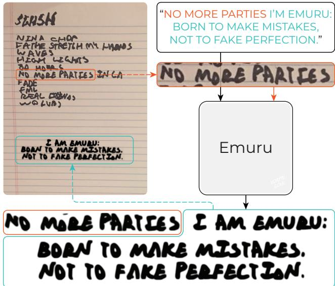
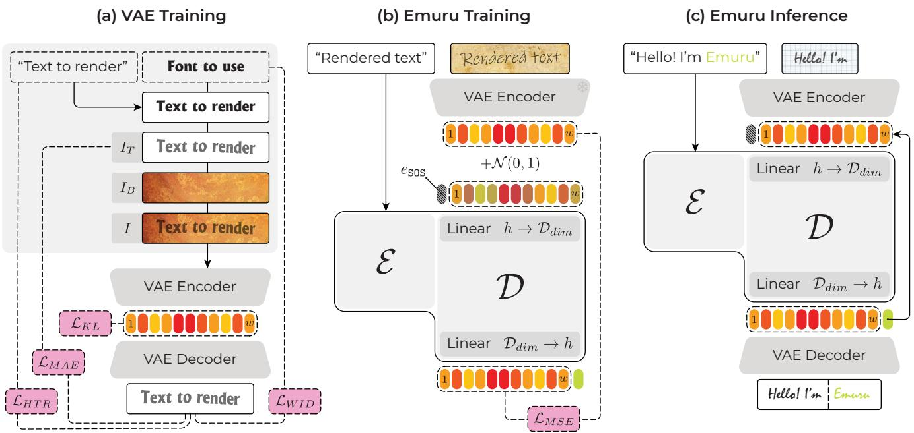
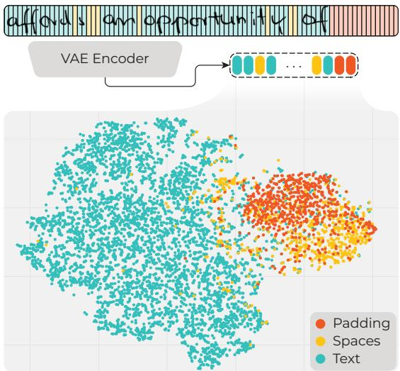
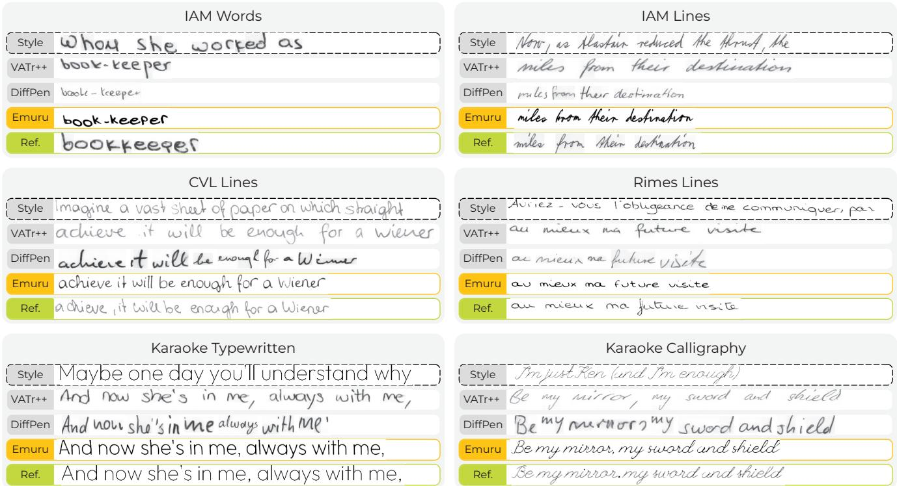
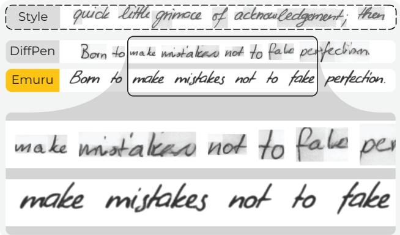

# Zero-Shot Styled Text Image Generation, but Make It Autoregressive

Vittorio Pippi1∗ Fabio Quattrini1∗ Silvia Cascianelli1 Alessio Tonioni2 Rita Cucchiara1 1University of Modena and Reggio Emilia 2Google

## Abstract

Styled Handwritten Text Generation (HTG) has recently received attention from the computer vision and document analysis communities, which have developed several solutions, either GAN- or diffusion-based, that achievedpromising results. Nonetheless, these strategies fail to generalize to novel styles and have technical constraints, particularly in terms of maximum output length and training efficiency. To overcome these limitations, in this work, we propose a novelframeworkfor text image generation, dubbed Emuru. Our approach leverages a powerful text image representation model (a variational autoencoder) combined with an autoregressive Transformer. Our approach enables the generation of styled text images conditioned on textual content and style examples, such as specific fonts or handwriting styles. We train our model solely on a diverse, synthetic dataset of English text rendered in over 100,000 typewritten and calligraphy fonts, which gives it the capability to reproduce unseen styles (bothfonts and users’ handwriting) in zero-shot. To the best of our knowledge, Emuru is the first autoregressive model for HTG, and the first designed specifically for generalization to novel styles. Moreover, our model generates images without background artifacts, which are easier to usefor downstream applications. Extensive evaluation on both typewritten and handwritten, anylength text image generation scenarios demonstrates the effectiveness ofour approach.

## 1. Introduction

The Styled Handwritten Text Generation (HTG) task entails generating images containing user-specified text rendered in a handwriting style resembling one or more reference style samples. In recent years, this task has regained significant attention from the Document Analysis and Computer Vision communities, especially due to its potential applications, ranging from generating synthetic data for other Document Analysis tasks to reproducing written styles to be used in graphic design and assistive technologies [5, 18, 40]. From a technical point of view, handwriting can be treated as a sequence of strokes, as in the Online HTG paradigm, or as a static image, as in the Offline HTG paradigm. Note that Online HTG entails giving the model a style input in the form of strokes trajectories, and letting the model generate strokes trajectories to be rendered on an image. Therefore, Online HTG models are implemented as sequential models [1, 2, 8, 17, 31, 46]. Note that collecting data to train and use Online HTG models involves using digital pens and pads, which is cumbersome and costly and cannot be applied in scenarios where the style to reproduce is from an existing manuscript, e.g., historical documents. For these reasons, Offline HTG, where the style input and the generated output are both static images, has gained more popularity and is also the focus of this work.

  
Figure 1. Our proposed Emuru model can generate images of anylength text lines mimicking out-of-distribution handwriting styles.

Despite the increasing research efforts in Offline HTG, generating synthetic images of handwritten text in a writerspecific style is still challenging. Specifically, current Stateof-the-Art models: A. Struggle to generalize to handwriting styles that are significantly different from those encountered in training; B. Are implemented by making some datasetspecific assumptions due to technical limitations of the architecture adopted, e.g., normalizing character width or enforcing a maximum text line length; C. Cannot disentangle properly the handwriting style (i.e., the shape of the strokes) from the reference image background, and thus, generate undesired artifacts in the output images. To overcome these limitations, in this work, we take a step towards generalizable few-shot styled text image generation and propose Emuru (Figure 1): a continuous-token autoregressive image generation model that can generate text images of any length (B.) with high style fidelity and readability, while increasing generalization to novel styles (A.) and reducing background artifacts (C.). To the best of our knowledge, Emuru is the first autoregressive Offline styled HTG model proposed in the literature.

Emuru consists of a VAE that maps the style sample images in an embedding space where they become a varyinglength sequence of continuous vectors, and an autoregressive Transformer Encoder-Decoder that takes as input the desired style embeddings sequence, the text contained in the style image, and the desired text, and iteratively generates an image containing the desired text in the desired style. The generation is implemented as an autoregressive loop that outputs visual embeddings, which are then fed to the VAE Decoder to obtain the final output image. Given the autoregressive nature of the model, we train it to automatically establish when to stop the generation, thus removing any technical constraint on the maximum output length obtainable. Both the VAE and the autoregressive Transformer in Emuru are trained (separately, in two stages) on a specifically-designed, purely synthetic dataset1. The images in the synthetic dataset are obtained by rendering a large amount of different English text lines (whose characters frequency is designed to be almost uniform) on different background images and with over 100k different fonts, both handwritten (calligraphy) and typewritten. Note that by working with a synthetic dataset, we have all the necessary information for training the VAE to reconstruct the text line image without the background. This way, the learned embeddings encode only the writing style, which gives Emuru the capacity to generate images without background artifacts. Moreover, training style variety and textual character frequency uniformity make Emuru able to generalize better to unseen styles, both typewritten and handwritten, and languages (i.e., characters arrangements).

To validate our proposed approach, we perform an extensive experimental analysis that considers multiple real datasets of handwritten text in multiple Latin alphabet languages. Moreover, we introduce a novel dataset of typewritten and handwritten text images to foster the development of HTG models able to generalize also to typewritten styles. The results of our analysis demonstrate the efficacy of the proposed architectural and training solutions for generating single words and entire lines with increased generalization capability to new styles, both handwritten and typewritten with respect to the State-of-the-Art. The code and weights for Emuru are publicly available2.

## 2. Related Work

The early-proposed approaches for HTG [18, 29, 50, 55] entailed manually segmenting text images into glyphs, which were later recombined based on their handcrafted geometric features. Such approaches did not offer flexibility in terms of styles or text and required intensive human intervention. In recent years, the HTG task has re-gained popularity thanks to the capabilities of learning-based solutions, especially Offline HTG ones.

Offline HTG. Offline HTG approaches generate images of text containing a user-specified content string. Existing works implementing this paradigm rely either on GANbased or Diffusion Model-based solutions. Early learningbased offline HTG works [3, 14] were only able to condition on the desired content but did not offer any control over the handwriting style. This capability was later introduced in [23], which proposed to condition the generation also on a representation of the style. In this respect, the style reference can consist either of a writer identifier [32, 36, 57] (which completely prevents the models from imitating unseen styles) or some reference images in the form of: a paragraph [34], a line [10], fifteen [5, 23, 39, 53] to five [37] words, or a single word [9, 15, 16, 27]. We argue that using more style reference information (i.e., more than one word image) can lead to superior performance and that it is still easy for a user to provide it. For this reason, in this work, we take a single image of a text line as style input.

Most HTG models focus on single words, i.e., short sequences of text tokens. As a result, when these models are used to generate long sequences, they struggle to render all the characters with the same quality and coherent proportions. Moreover, the words rendered are generated inside fixed-height canvases. This can result in different scales and misaligned baselines of words depending on the fact that they contain or do not contain characters with ascenders and descenders. For this reason, using existing HTG models to obtain long pieces of text is cumbersome and cannot be satisfactorily done by simply stitching images of words. To overcome this limitation, some works have been specifically trained to handle text lines [10, 24] and paragraphs [34]. As an alternative applicable to output lengthconstrained HTG models (such as Diffusion Model-based approaches), the authors in [37] have proposed a specific algorithm to stitch and blend short images to obtain longer text. In this work, to enforce proportionality between characters and word baseline alignment, we propose to exploit an autoregressive generative model without constraints on the output size. In particular, we use a single line as the style reference and ask our model to generate entire text lines, automatically establishing when to stop.

  
Figure 2. Our Emuru approach consists of a VAE (a) and an autoregressive Transformer Encoder-Decoder (b), both trained on a massive synthetic dataset of texts rendered in different fonts. At inference time (c), Emuru is given a reference style image, the text in the referenc style image, and the desired text and is tasked to iteratively generate the output styled image, autonomously deciding when to stop.

Autoregressive image generation. Following the success of Transformer-based natural text generation solutions [42, 54], autoregressive image generation has been explored extensively. In most cases, image tokenizers are used to convert continuous images into discrete tokens, and generation is performed as next-token prediction [12, 44, 45, 52, 56]. However, State-of-the-Art performance in image generation is currently mostly obtained by using Diffusion Models [11, 21, 47, 48], which have proven themselves effective in modeling continuous data. Recently, LlamaGen [49] and GIVT [51] have shown the potential of continuous autoregressive generative models. In particular, GIVT [51] leverages a continuous-latent β-VAE [20] and a Transformer Decoder to obtain superior performance compared to quantized VAEs. Removing the vector quantization and using continuous latents allows avoiding excessive information compression and the optimization problems in training [7, 22, 35, 52]. Nonetheless, generative methods for natural images differ from styled HTG ones because they often assume a fixed number of output tokens, either because the image size is fixed or because it is one of the user inputs. On the other hand, for HTG, the length of the generated styled text image depends on the input style and content. To address this aspect, we propose to let the model decide when to stop generating, similar to what is done in natural text generation [42, 54].

## 3. Method

Our framework for text-image generation consists of a powerful text-image representation model (a VAE) combined with an autoregressive Transformer Encoder-Decoder to generate text images conditioned on the desired textual content and a style example, both of which can be of any length. Specifically, the VAE maps the styled text images into a dense latent space and reconstructs them without background. The Transformer autoregressively generates embeddings compatible with those in the VAE latent space, conditioned on the embeddings of the reference style image and the desired text. Then, the VAE Decoder can be used to obtain the final image. A schematic representation of our approach is depicted in Figure 2.

## 3.1. Emuru Training Data

State-of-the-Art HTG models are usually trained on a single dataset at a time, which is quite limiting due to the small variety of featured styles and text in the training images. This causes many HTG models to have a performance drop when generating images that are out-of-distribution for the style and the textual content, e.g., from a different dataset. In light of these considerations and inspired by the effectiveness of the synthetic pretraining of the style Encoder in [38, 39], we develop a massive synthetic dataset, which we use to train our HTG model. The dataset features RGB images containing text lines written over different backgrounds. As for the text content, we collect words from multiple English corpora available on the NLTK library3 and combine 1 to 32 of them into text lines $T ,$ making sure that both rare and common words are both well represented. Moreover, we collect over 100k fonts available online and render the text lines using these fonts on greyscale images, where the background is always white. Finally, we apply several random geometric transformations to the images (see the Supplementary for details). This way, we obtain the text image $I _ { T }$ for each sample in the synthetic dataset. Then, we superimpose $I _ { T }$ to an RGB image $I _ { B }$ depicting a plausible background for text (e.g., paper), randomly selected among a pre-defined set. This way, we obtain the synthetic sample images I with shape $W \times H$ where $H = 6 4$ and W scales proportionally to the length of the text. In total, we obtain 2.2 million text images. Further details about the dataset are given in the Supplementary. Note that we solely use this synthetic dataset for training both the components of our proposed approach: first, the VAE and, in a later stage, the autoregressive Transformer, keeping the VAE frozen.

## 3.2. Emuru VAE

First, we train a β-VAE to encode the text images into a compressed latent space. We choose a convolutional architecture similar to those commonly used in Stable Diffusion Models [47]. The VAE Encoder takes as input the images $I ^ { 3 \times W \times H }$ and maps them in a $c \times h$ × w embedding tensor. Due to the nature of lines of text, $i . e .$ , arbitrary length but mostly fixed height, we model the images as a w-long sequence of $h \times c$ vectors. Intuitively, each of the w vectors encodes a vertical slice of the text line. The Decoder is fed with these vectors and is tasked to reconstruct the grayscale text image $I _ { T }$

We train the VAE by using a Reconstruction loss expressed in terms of $L _ { 1 }$ distance between the ground truth $I _ { T }$ image (i.e., only the text without background) and the reconstructed output $( \mathcal { L } _ { M A E } )$ and the Kullback–Leibler divergence loss $( \mathcal { L } _ { K L } )$ . In line with [47, 51], we weigh this latter loss term with $\beta < < 1$ in order to prioritize reconstruction quality rather than constraining a strongly regularized latent space [20]. Additionally, we incorporate supervision signals (namely, a Cross-Entropy loss ${ \mathcal { L } } _ { W I D }$ and a CTC loss $\mathcal { L } _ { H T R } )$ from two auxiliary networks. The first is a writing style classification network, pretrained on our synthetic dataset to identify the 100k styles from the reconstructed image, which enforces style fidelity. The second is a Handwritten Text Recognition (HTR) model, also pretrained on the synthetic dataset, tasked to recognize the text T in the reconstructed image to enforce readability.

## 3.3. Emuru Autoregressive Transformer

Once we obtained a strong latent image representation with the VAE, we train a generative model by using an autoregressive Transformer featuring a Transformer Encoder $\mathcal { E }$ and a Transformer Decoder $\mathcal { D } ,$ architecturally similar to T5 [43]. Both are trained on samples from the devised synthetic dataset. Specifically, at training time, E takes as input a sequence of characters in the desired content string $( T _ { o u t } )$ tokenized by using the single-character tokenizer. Then, self-attention is computed among these tokens to obtain a sequence of text embeddings $\mathbf { s } = [ s _ { 1 } , . . . , s _ { k } ]$ . On the other hand, the input to the Transformer Decoder D is obtained as follows. First, we feed the pretrained, frozen VAE Encoder with the style image I to obtain a w-long sequence of h-dimensional embeddings, $\mathbf { v } = [ v _ { 1 } , . . . , v _ { w } ]$ . To reduce the risk of exposure bias at inference time, these embeddings are summed to some noise sampled from a Normal distribution. Then, the resulting noisy embeddings are linearly projected into $\mathcal { D } _ { d i m }$ -dimensional vectors, to which we prepend a special start-of-sequence (SOS) learned embedding. The resulting $\mathbf { e } ~ = ~ [ e _ { \mathsf { S 0 S } } , e _ { 1 } , . . . , e _ { w } ]$ vectors are then fed to $\mathcal { D } _ { : }$ , which autoregressively predicts a sequence of vectors $\mathbf e ^ { \prime } = [ e _ { 1 } ^ { \prime } , . . . , e _ { w } ^ { \prime } ]$ To this end, causal masked self-attention is performed on the $\mathbf { e } ^ { \cdot } \mathbf { s } ,$ and unmasked crossattention is performed between the e’s and the s’s from $\mathcal { E } .$ The so-obtained $\mathbf { e ^ { \prime } }$ sequence is projected back into the $\mathbf { v } ^ { \prime }$ sequence of h-dimensional vectors that we use to compute the training loss.

We train the Transformer following a teacher-forcing strategy and using the MSE loss between the predicted $\mathbf { v } ^ { \prime }$ and ground truth v embeddings $( \mathcal { L } _ { M S E } )$ Moreover, to make Emuru handle sequences of different lengths, we take inspiration from the curriculum learning strategy adopted in [24]. The authors proposed to train their HTG model in three stages, with non-overlapping sets of increasingly longer images. Here, we train Emuru in two stages and increase the variability of the training images maximum length. Specifically, we first train on text lines containing from 4 to 7 words, then we fine-tune on lines containing from 1 to 32 words. Note that using only a single loss term in the form of the MSE makes the training process more controllable, thanks to the limited number of hyperparameters involved, and less resource-demanding compared to adversarial and diffusion process-based approaches that also rely on auxiliary networks to obtain regularization signals.

## 3.4. Inference-time behavior

At inference time, we feed Emuru with a reference style image containing a text line $( I _ { s t y l e } )$ and the concatenation of two strings: one with the text in the reference style image $( T _ { s t y l e } )$ , and one with the desired output text $( T _ { o u t } )$ Emuru is tasked to continue the generation from $I _ { s t y l e }$ by following the desired text $T _ { o u t }$ , in the style of the reference image. Specifically, at each generation step t, D predicts the (w +1)-th embedding $( e _ { w + 1 } )$ based on the embeddings of $I _ { s t y l e }$ and the t previously-generated embeddings. Note that all training images used for our model have some padding in the form of white spaces since it is required for batched execution. Therefore, a training sample for Emuru is consistently modeled as a sequence of embeddings relative to characters followed by embeddings relative to white padding. Looking at the VAE latent space, it can be observed that the latter are quite distinguishable from the text characters embeddings (see Figure 3). Thus, we stop the iterative generation of embeddings when Emuru emits P consecutive padding embeddings, which act as an implicit end-of-sequence signal. P is set to 10 after an empirical analysis to minimize the risk of early stopping the generation. At the end of the iterative generation, the new sequence of the generated h-dimensional vectors (excluding the last P padding vectors) is fed to the pretrained, frozen VAE Decoder to obtain the final image.

  
Figure 3. Characters and padding VAE embeddings distribution obtained via t-SNE.

## 4. Experiments

Despite the recently increased interest in HTG, the proposed works on the task do not follow a common, standard evaluation protocol. To fairly assess our contribution against the State-of-the-Art, we re-run the previous approaches for standardizing the evaluation setup. In the following, we give the details of the evaluation protocol we follow and of the competitors considered, which are models for which code and weights were made publicly available. We hope this setting to be embraced by the community as a new standardized benchmark.

Considered Scores. To evaluate the performance of our approach by considering different aspects of the HTG task, we adopt multiple scores in our analysis. These are the Fréchet Inception Distance (FID) [19] and the Kernel Inception Distance (KID) [6], commonly adopted for image generation, and the task-specific Handwriting Distance (HWD) [41]. Moreover, we introduce two other scores. The first is the Binarized FID (BFID), obtained by computing the FID on binarized reference and generated images to capture mostly the perceptual handwriting style and disregard color or textures. The second is the Absolute Character Error Rate Difference (∆CER). To compute it, we consider the State-ofthe-Art text recognition TrOCR-Base [28] model and compute its CER on the reference and generated images to capture their readability while taking into consideration the style. Intuitively, we want the generated images to be as readable as the reference ones but not significantly more, which could mean that the HTG model has collapsed to a very readable style, different from the reference one. Note that we also considered additional scores for our evaluation, which are reported in the Supplementary.

Considered Datasets. Our proposed Emuru is trained only on a large synthetic dataset of images containing English text rendered in calligraphy and typewritten fonts. To assess its generalization capabilities, we consider multiple multi-writer datasets and apply Emuru without any training or fine-tuning. These datasets are the commonly adopted IAM [33] dataset, both in its word-level and line-level format, and the line-level annotated CVL [26] and RIMES [4] datasets. Moreover, we devise a dataset of text lines images obtained by rendering song lyrics in multiple Latinalphabet languages (English, French, German, and Italian) with 100 publicly available fonts4, both calligraphy and typewritten, on a white background. To foster the research on styled text image generation strategies able to generalize also to typewritten styles, we will release this dataset, dubbed Karaoke. Further details about these datasets are reported in the Supplementary. Note that to ensure a consistent and fair evaluation, we define a fixed set of reference style images and desired text to guide the generation for Emuru and the considered competitors, described below.

Considered State-of-the-Art approaches. In our comparison, we consider State-of-the-Art approaches for styled HTG following both the adversarial training paradigm and the denoising diffusion paradigm. Note that for consistent evaluation, we select models for which code and weights have been made available by the respective authors. Specifically, we include in our analysis the Convolutional GAN-based HiGAN+ [16] and TS-GAN [10], and the Transformer GAN-based HWT [5], VATr [39], and VATr++ [53]. Moreover, we consider the recently-proposed DiffPen [37] and One-DM [9] HTG Diffusion Models.

Implementation Details. We train all the components of

our model on a single NVIDIA RTX 4090.

Emuru convolutional VAE has 4 layers for the Encoder and the Decoder, with the output channels for each block set to 32, 64, 128, and 256. The Encoder spatially downsamples the input $I ^ { 3 \times W \times H }$ to a 1-channel latent vector h×w, where $h { = } H / 8$ and $w { = } W / 8$ . We use one channel for the latent space to compress the information on the styled images and allow a lightweight Transformer Decoder to effectively handle the resulting latents. We train the VAE for 60k iterations with the AdamW [30] optimizer and learning rate 1e-4. The loss is composed of four terms: $\mathcal { L } _ { M A E } , \mathcal { L } _ { W I D } .$ $\mathcal { L } _ { H T R } .$ , and $\mathcal { L } _ { K L }$ , combined with weight 1, 0.005, 0.3, and $\beta = 1 \mathrm { e } { - 6 }$ , respectively. Note that for the HTR supervision, we employ noisy teacher-forcing with probability 0.3. As for the auxiliary networks, the writer identification model is a ResNet with 6 blocks trained with the AdamW optimizer, learning rate 1e-4, and batch size 256 until it reached 60% accuracy on the synthetic dataset. The HTR network is a Transformer Encoder-Decoder [25] trained with AdamW, learning rate 1e-4, and batch size 128 until it reached 0.25 CER on the synthetic dataset.

The base architecture of the autoregressive Transformer in Emuru is a T5-Large [43] Encoder-Decoder with two linear adapters, one before the input of the Decoder and another that replaces the original T5 Decoder linear classifier. The adapter layers convert the embedding sequence from the VAE feature space $h = 8$ to the T5-Decoder inner dimension $\mathcal { D } _ { d i m } = 1 0 2 4$ and vice versa. The text input of the Encoder is tokenized with the single-character tokenizer Google-ByT. For the first stage of training, we adopt the AdamW optimizer with learning rate 1e-4 and weight decay 1e-2 and train for 70k iterations with batch size 256, employing noisy teacher-forcing with probability 0.1. All images used in this phase contain from 4 to 7 words and are padded or cropped to a fixed width of 768px. For the second stage of training, we use images containing from 1 to 32 words, padded or cropped to a fixed width of 2048. For this phase, we train for 250 iterations with a virtual batch size of 256 with gradient accumulation, without employing noisy teacher-forcing.

## 4.1. Results

VAE Reconstruction Performance. Since our autoregressive model generates only latent vectors, it is clear that the performance of Emuru is tied to the VAE reconstruction quality. Therefore, we start our experiments by evaluating the quality of the VAE, which is tasked to embed the styled text images into the latent space and perform background removal. We perform extensive analysis on the reconstruction task over multiple datasets and compare Emuru VAE to other VAEs pretrained for natural images from Stateof-the-Art Diffusion Models, namely Stable Diffusion 1.5 (SD1.5) [47] and Stable Diffusion 3 (SD3) [13]. We report the average scores over our considered datasets in Table 1 and the dataset-specific results in the Supplementary. As it emerges from this analysis, our text images-tailored VAE achieves good generalization and style consistency compared to generalist VAEs, also enabling downstream lightweight token modeling using only ∼16% of their parameters and having a single latent channel (note that the VAE has 4 channels in SD1.5 and 16 channels in SD3).

<table><tr><td></td><td> $\mathbf { F I D \downarrow }$ </td><td> $\mathbf { B F I D } \downarrow$ </td><td> $\mathbf { K I D } \downarrow$ </td><td> $\Delta { \bf C E R } \downarrow$ </td><td>HWD↓</td></tr><tr><td>SD1.5 VAE</td><td>29.39</td><td>7.36</td><td>32.14</td><td>0.00</td><td>0.77</td></tr><tr><td>SD3 VAE</td><td>21.90</td><td>3.61</td><td>23.01</td><td>0.00</td><td>0.74</td></tr><tr><td>Emuru VAE</td><td>19.22</td><td>1.62</td><td>16.35</td><td>0.03</td><td>0.85</td></tr></table>

Table 1. Comparison between the VAE featured in Emuru and other VAEs used in Diffusion Model-based HTG solutions when reproducing the images in the test set of different HTG datasets. We report the mean of each score obtained over all the considered datasets. The KID is multiplied by $1 0 ^ { 3 }$ and the best performance is in bold for readability.
<table><tr><td rowspan="2"></td><td colspan="5">IAM Words</td></tr><tr><td>FID↓</td><td>BFID↓</td><td>KID↓</td><td>△CER↓</td><td>HWD↓</td></tr><tr><td>TS-GAN</td><td>129.57</td><td>86.45</td><td>141.08</td><td>0.28</td><td>4.22</td></tr><tr><td>HiGAN+</td><td>50.19</td><td>21.92</td><td>43.39</td><td>0.20</td><td>3.12</td></tr><tr><td>HWT</td><td>27.83</td><td>15.09</td><td>19.64</td><td>0.15</td><td>2.01</td></tr><tr><td>VATr</td><td>30.26</td><td>15.81</td><td>22.31</td><td>0.00</td><td>2.19</td></tr><tr><td>VATr++</td><td>31.91</td><td>17.15</td><td>23.05</td><td>0.07</td><td>2.54</td></tr><tr><td>One-DM</td><td>27.54</td><td>10.73</td><td>21.39</td><td>0.10</td><td>2.28</td></tr><tr><td>DiffPen</td><td>15.54</td><td>6.06</td><td>11.55</td><td>0.06</td><td>1.78</td></tr><tr><td>Emuru</td><td>63.61</td><td>37.73</td><td>62.34</td><td>0.19</td><td>3.03</td></tr><tr><td rowspan="2"></td><td colspan="4">IAM Lines</td><td></td></tr><tr><td>FID↓</td><td>BFID↓</td><td>KID↓</td><td>△CER↓</td><td>HWD↓</td></tr><tr><td>TS-GAN</td><td>44.17</td><td>19.45</td><td>45.42</td><td>0.02</td><td>3.21</td></tr><tr><td>HiGAN+</td><td>74.41</td><td>34.18</td><td>77.27</td><td>0.00</td><td>3.25</td></tr><tr><td>HWT</td><td>44.72</td><td>30.26</td><td>43.49</td><td>0.33</td><td>2.97</td></tr><tr><td>VATr</td><td>35.32</td><td>27.97</td><td>33.61</td><td>0.02</td><td>2.37</td></tr><tr><td>VATr++</td><td>34.00</td><td>21.67</td><td>29.68</td><td>0.03</td><td>2.38</td></tr><tr><td>One-DM</td><td>43.89</td><td>21.54</td><td>44.48</td><td>0.13</td><td>2.83</td></tr><tr><td>DiffPen</td><td>12.89</td><td>6.87</td><td>9.73</td><td>0.03</td><td>2.13</td></tr><tr><td>Emuru</td><td>13.89</td><td>6.19</td><td>11.30</td><td>0.14</td><td>1.87</td></tr></table>

Table 2. Comparison on the word-level and line-level IAM datasets between Emuru and State-of-the-Art approaches trained on IAM. The KID is multiplied by $1 0 ^ { 3 }$ and the best performance is in bold for readability.

Zero-Shot inference on IAM. Current HTG models achieve State-of-the-Art performance by training on a single dataset at a time (generally, the word-level IAM). In Table 2, we compare IAM-trained competitors with Emuru, trained only on the proposed synthetic dataset. We refer to this setting as zero-shot inference because the model has never seen IAM samples during training. The performance of our approach is mostly in line with that of existing methods, even achieving top scores for line generation in terms of BFID and HWD. As these scores focus on style rather than background, this indicates that the generated lines are more representative of the input style. Moreover, as shown in Figure 4, scores such as FID and KID are not representative of aspects like word alignment [41], which is a weakness of models that generate single words and stitch them together to create a sentence, like e.g., DiffPen. Despite not having been trained on IAM samples, Emuru demonstrates strong generalization, performing on par with competitors trained on IAM.

  
Figure 4. Qualitative comparison between Emuru, the GAN-based VATr++, and the Diffusion Model-based DiffPen when generating images from the considered datasets. We report the input style image used for guiding the generation and another reference image in the same style. We let the models generate the same text as in the reference to better observe the style imitation capabilities of the models.

Zero-shot inference on CVL and RIMES. The datasetspecific tailoring of existing methods severely limits their generalization performance, as demonstrated in Table 3. In this zero-shot evaluation on CVL and RIMES lines, all competing models (which have been trained on IAM) show a marked performance drop. In contrast, Emuru achieves top performance across nearly all metrics. Interestingly, despite not being able to capture the input style, some approaches maintain readability in the generated text, as reflected by the relatively stable ∆CER score. These results, in line with those achieved on IAM, demonstrate the generalization capabilities of Emuru, also observed from Figure 4.

Zero-shot inference on the Karaoke. Finally, we evaluate the generalization capability of all models on calligraphy and typewritten text images by considering our devised Karaoke dataset. Different from IAM, CVL, and RIMES, Karaoke has a diverse set of 100 fonts and no background artifacts. In Table 4, we evaluate Emuru against the considered competitors on Karaoke, distinguishing between images of text in calligraphy fonts and typewritten fonts. In both cases, the results are in line with the zero-shot inference comparisons in Table 3, with Emuru achieving the best values across all scores except ∆CER. Arguably, this is because Emuru, like the diffusion-based models, does not have any mechanism to ensure the correctness of the generated text. In the Supplementary, we report further experiments, including fine-tuning Emuru with an HTR-based loss. Across all quantitative experiments in Tables 2 to 4 and the qualitative comparison in Figure 4, Emuru stands out as the only model that exhibits a consistent value range for the scores and comparable zero-shot performance on all the considered datasets. On the other hand, other methods show significant variability, sometimes completely failing to generate images in the style of the target dataset. This highlights Emuru’s robustness and ability to generalize to diverse scenarios.

<table><tr><td rowspan="2"></td><td colspan="5">CVL Lines</td></tr><tr><td>FID↓</td><td>BFID↓</td><td>KID↓</td><td>△CER↓</td><td>HWD↓</td></tr><tr><td>TS-GAN</td><td>42.12</td><td>31.97</td><td>43.15</td><td>0.13</td><td>3.07</td></tr><tr><td>HiGAN+</td><td>78.44</td><td>39.47</td><td>80.39</td><td>0.12</td><td>3.07</td></tr><tr><td>HWT</td><td>31.22</td><td>16.73</td><td>26.14</td><td>0.38</td><td>2.59</td></tr><tr><td>VATr</td><td>34.40</td><td>24.64</td><td>32.21</td><td>0.06</td><td>2.36</td></tr><tr><td>VATr++</td><td>35.53</td><td>19.87</td><td>34.15</td><td>0.12</td><td>2.18</td></tr><tr><td>One-DM</td><td>60.45</td><td>26.58</td><td>64.13</td><td>0.06</td><td>2.66</td></tr><tr><td>DiffPen</td><td>40.40</td><td>17.50</td><td>38.21</td><td>0.01</td><td>2.99</td></tr><tr><td>Emuru</td><td>14.39</td><td>10.77</td><td>12.34</td><td>0.13</td><td>1.82</td></tr><tr><td></td><td colspan="5">RIMES Lines</td></tr><tr><td></td><td>FID↓</td><td>BFID↓</td><td>KID↓</td><td>△CER↓</td><td>HWD↓</td></tr><tr><td>TS-GAN</td><td>109.04</td><td>36.39</td><td>132.90</td><td>0.12</td><td>3.26</td></tr><tr><td>HiGAN+</td><td>160.57</td><td>47.38</td><td>183.82</td><td>0.14</td><td>3.39</td></tr><tr><td>HWT</td><td>118.21</td><td>35.26</td><td>128.66</td><td>0.45</td><td>3.36</td></tr><tr><td>VATr</td><td>113.76</td><td>30.21</td><td>114.21</td><td>0.07</td><td>3.09</td></tr><tr><td>VATr++</td><td>110.04</td><td>35.61</td><td>104.05</td><td>0.10</td><td>2.83</td></tr><tr><td>One-DM</td><td>121.18</td><td>36.07</td><td>121.67</td><td>0.20</td><td>3.36</td></tr><tr><td>DiffPen</td><td>89.79</td><td>18.25</td><td>94.78</td><td>0.04</td><td>2.58</td></tr><tr><td>Emuru</td><td>26.93</td><td>13.26</td><td>21.19</td><td>0.25</td><td>2.18</td></tr></table>

Table 3. Comparison on the line-level CVL and RIMES datasets between Emuru and state-of-the-art approaches trained on IAM. The KID is multiplied by 103 and the best performance is in bold for readability.

<table><tr><td rowspan="2"></td><td colspan="4">Karaoke Calligraphy</td></tr><tr><td>FID↓</td><td>BFID↓</td><td>KID↓ ∆CER↓</td><td>HWD↓</td></tr><tr><td>TS-GAN</td><td>60.30</td><td>12.68</td><td>64.80 0.23</td><td>4.59</td></tr><tr><td>HiGAN+</td><td>125.75</td><td>69.41</td><td>136.75 0.08</td><td>4.90</td></tr><tr><td>HWT</td><td>62.69</td><td>43.03</td><td>59.35 0.32</td><td>4.50</td></tr><tr><td>VATr</td><td>72.22</td><td>47.66</td><td>67.70 0.05</td><td>3.89</td></tr><tr><td>VATr++</td><td>67.16</td><td>46.53</td><td>58.57 0.01</td><td>3.96</td></tr><tr><td>One-DM</td><td>59.73</td><td>38.30</td><td>56.55 0.04</td><td>4.31</td></tr><tr><td>DiffPen</td><td>34.19</td><td>25.78</td><td>28.91 0.16</td><td>4.18</td></tr><tr><td>Emuru</td><td>13.87</td><td>7.99</td><td>9.24 0.13</td><td>2.24</td></tr></table>

<table><tr><td></td><td>FID↓</td><td>BFID↓</td><td>KID↓</td><td>△CER↓</td><td>HWD↓</td></tr><tr><td>TS-GAN</td><td>141.41</td><td>75.78</td><td>157.33</td><td>0.32</td><td>4.70</td></tr><tr><td>HiGAN+</td><td>135.34</td><td>63.39</td><td>146.34</td><td>0.07</td><td>5.19</td></tr><tr><td>HWT</td><td>72.78</td><td>37.40</td><td>62.77</td><td>0.37</td><td>4.57</td></tr><tr><td>VATr</td><td>80.38</td><td>41.02</td><td>70.46</td><td>0.05</td><td>4.14</td></tr><tr><td>VATr++</td><td>76.03</td><td>41.69</td><td>63.17</td><td>0.01</td><td>4.15</td></tr><tr><td>One-DM</td><td>70.75</td><td>44.06</td><td>60.90</td><td>0.05</td><td>4.80</td></tr><tr><td>DiffPen</td><td>78.07</td><td>61.16</td><td>67.17</td><td>0.14</td><td>4.71</td></tr><tr><td>Emuru</td><td>9.85</td><td>4.33</td><td>5.60</td><td>0.11</td><td>1.28</td></tr></table>

Table 4. Comparison on the line-level Karaoke dataset, separating calligraphy and typewritten styles, between Emuru and State-ofthe-Art approaches trained on IAM. The KID is multiplied by 103 and the best performance is in bold for readability.

Editing Application. As mentioned in previous sections, we train Emuru to generalize on unseen styles and to be background-agnostic. Combined, these two characteristics enable Emuru to generate images that are both faithful to the input style and free from background artifacts, which makes them usable in real-world editing scenarios. To illustrate this, in Figure 1, we extract a style sample from a handwritten letter image and task Emuru to render the sentence “Hello World! I am Emuru: Born to make mistakes, not to fake perfection.”. Then, we overlay the resulting image on the same letter. Note that the same results cannot be replicated with other models due to the background artifacts they maintain, as shown in Figure 5. DiffPen effectively copies the style of the IAM sample, but it also reproduces the gray background typical of IAM samples. This issue of learning to imitate the background in addition to the text strokes is common in many HTG approaches because they are trained to mimic the training text images as a whole, including their background. In contrast, by leveraging the VAE’s background removal capabilities, Emuru generates images that reproduce only the text style, and thus, that can be easily blended over any custom background image.

  
Figure 5. Results of image generation from a style image with background artifacts obtained with Emuru and DiffPen. Thanks to the VAE training, Emuru images do not reproduce these artifacts.

## 5. Conclusions

In this paper, we have presented Emuru, a novel autoregressive model for Offline styled text image generation. Our approach relies on a powerful text images representation model (a VAE) combined with an autoregressive Transformer, and both are trained on a diverse, synthetic dataset of English text rendered in over 100,000 typewritten and calligraphy fonts. Emuru effectively addresses the limitations of previous approaches, such as: generalization to novel styles, limited or fixed output length, and entanglement between text style and background style. Extensive evaluation considering multiple datasets, both handwritten and typewritten, demonstrates the effectiveness of Emuru in generating both short and long text sequences with high fidelity to unseen styles and its superiority with respect to the State-of-the-Art in terms of generalization capabilities.

## References

[1] Emre Aksan and Otmar Hilliges. STCN: Stochastic Temporal Convolutional Networks. In ICLR, 2018. 1

[2] Emre Aksan, Fabrizio Pece, and Otmar Hilliges. DeepWriting: Making digital ink editable via deep generative modeling. In CHI, 2018. 1

[3] Eloi Alonso, Bastien Moysset, and Ronaldo Messina. Adversarial Generation of Handwritten Text Images Conditioned on Sequences. In ICDAR, 2019. 2

[4] Emmanuel Augustin, Matthieu Carré, Emmanuèle Grosicki, J-M Brodin, Edouard Geoffrois, and Françoise Prêteux. RIMES evaluation campaign for handwritten mail processing. In IWFHR, 2006. 5

[5] Ankan Kumar Bhunia, Salman Khan, Hisham Cholakkal, Rao Muhammad Anwer, Fahad Shahbaz Khan, and Mubarak Shah. Handwriting Transformers. In ICCV, 2021. 1, 2, 5

[6] Mikołaj Binkowski, Dougal J. Sutherland, Michael Arbel,´ and Arthur Gretton. Demystifying MMD GANs. In ICLR, 2018. 5

[7] Huiwen Chang, Han Zhang, Lu Jiang, Ce Liu, and William T Freeman. Maskgit: Masked generative image transformer. In CVPR, 2022. 3

[8] Gang Dai, Yifan Zhang, Qingfeng Wang, Qing Du, Zhuliang Yu, Zhuoman Liu, and Shuangping Huang. Disentangling Writer and Character Styles for Handwriting Generation. In CVPR, 2023. 1

[9] Gang Dai, Yifan Zhang, Quhui Ke, Qiangya Guo, and Shuangping Huang. One-DM: One-Shot Diffusion Mimicker for Handwritten Text Generation. In ECCV, 2024. 2, 5

[10] Brian Davis, Chris Tensmeyer, Brian Price, Curtis Wigington, Bryan Morse, and Rajiv Jain. Text and Style Conditioned GAN for Generation of Offline Handwriting Lines. In BMVC, 2020. 2, 5

[11] Prafulla Dhariwal and Alexander Nichol. Diffusion models beat gans on image synthesis. NeurIPS, 2021. 3

[12] Patrick Esser, Robin Rombach, and Bjorn Ommer. Taming transformers for high-resolution image synthesis. In CVPR, 2021. 3

[13] Patrick Esser, Sumith Kulal, Andreas Blattmann, Rahim Entezari, Jonas Müller, Harry Saini, Yam Levi, Dominik Lorenz, Axel Sauer, Frederic Boesel, et al. Scaling rectified flow transformers for high-resolution image synthesis. In ICML, 2024. 6

[14] Sharon Fogel, Hadar Averbuch-Elor, Sarel Cohen, Shai Mazor, and Roee Litman. ScrabbleGAN: Semi-Supervised Varying Length Handwritten Text Generation. In CVPR, 2020. 2

[15] Ji Gan and Weiqiang Wang. HiGAN: Handwriting Imitation Conditioned on Arbitrary-Length Texts and Disentangled Styles. In AAAI, 2021. 2

[16] Ji Gan, Weiqiang Wang, Jiaxu Leng, and Xinbo Gao. Hi-GAN+: Handwriting Imitation GAN with Disentangled Representations. ACM Trans. Graphics, pages 1–17, 2022. 2, 5

[17] Alex Graves. Generating Sequences with Recurrent Neural Networks. arXiv preprint arXiv:1308.0850, 2013. 1

[18] TSF Haines, O Mac Aodha, and GJ Brostow. My Text in Your Handwriting. ACM Trans. Graphics, 35(3), 2016. 1, 2

[19] Martin Heusel, Hubert Ramsauer, Thomas Unterthiner, Bernhard Nessler, and Sepp Hochreiter. GANs Trained by a Two Time-Scale Update Rule Converge to a Local Nash Equilibrium. In NeurIPS, 2017. 5

[20] Irina Higgins, Loic Matthey, Arka Pal, Christopher P Burgess, Xavier Glorot, Matthew M Botvinick, Shakir Mohamed, and Alexander Lerchner. beta-vae: Learning basic visual concepts with a constrained variational framework. ICLR, 2017. 3, 4

[21] Jonathan Ho, Ajay Jain, and Pieter Abbeel. Denoising diffusion probabilistic models. NeurIPS, 2020. 3

[22] Minyoung Huh, Brian Cheung, Pulkit Agrawal, and Phillip Isola. Straightening out the straight-through estimator: Overcoming optimization challenges in vector quantized networks. In ICML, 2023. 3

[23] Lei Kang, Pau Riba, Yaxing Wang, Marçal Rusiñol, Alicia Fornés, and Mauricio Villegas. GANwriting: Content-Conditioned Generation of Styled Handwritten Word Images. In ECCV, 2020. 2

[24] Lei Kang, Pau Riba, Marcal Rusinol, Alicia Fornes, and Mauricio Villegas. Content and style aware generation of text-line images for handwriting recognition. IEEE Trans. PAMI, pages 1–1, 2021. 2, 4

[25] Lei Kang, Pau Riba, Marçal Rusiñol, Alicia Fornés, and Mauricio Villegas. Pay attention to what you read: Nonrecurrent handwritten text-line recognition. Pattern Recognit., 2022. 6

[26] Florian Kleber, Stefan Fiel, Markus Diem, and Robert Sablatnig. CVL-DataBase: An Off-Line Database for Writer Retrieval, Writer Identification and Word Spotting. In IC-DAR, 2013. 5

[27] Praveen Krishnan, Rama Kovvuri, Guan Pang, Boris Vassilev, and Tal Hassner. TextStyleBrush: Transfer of Text Aesthetics from a Single Example. IEEE Trans. PAMI, 2023. 2

[28] Minghao Li, Tengchao Lv, Lei Cui, Yijuan Lu, Dinei Florencio, Cha Zhang, Zhoujun Li, and Furu Wei. TrOCR: Transformer-based optical character recognition with pretrained models. AAAI, 2023. 5

[29] Zhouchen Lin and Liang Wan. Style-preserving english handwriting synthesis. Pattern Recognit., pages 2097–2109, 2007. 2

[30] Ilya Loshchilov and Frank Hutter. Decoupled Weight Decay Regularization. In ICLR, 2019. 6

[31] Troy Luhman and Eric Luhman. Diffusion Models for Handwriting Generation. arXiv preprint arXiv:2011.06704, 2020. 1

[32] Canjie Luo, Yuanzhi Zhu, Lianwen Jin, Zhe Li, and Dezhi Peng. SLOGAN: Handwriting Style Synthesis for Arbitrary-Length and Out-of-Vocabulary Text. IEEE Trans. Neural Netw. Learn. Syst., 2022. 2

[33] U-V Marti and Horst Bunke. The IAM-database: an English sentence database for offline handwriting recognition. IJDAR, pages 39–46, 2002. 5

[34] Martin Mayr, Marcel Dreier, Florian Kordon, Mathias Seuret, Jochen Zöllner, Fei Wu, Andreas Maier, and Vincent Christlein. Zero-Shot Paragraph-level Handwriting Imitation with Latent Diffusion Models. arXiv preprint arXiv:2409.00786, 2024. 2

[35] Fabian Mentzer, David Minnen, Eirikur Agustsson, and Michael Tschannen. Finite Scalar Quantization: VQ-VAE Made Simple. In ICLR, 2024. 3

[36] Konstantina Nikolaidou, George Retsinas, Vincent Christlein, Mathias Seuret, Giorgos Sfikas, Elisa Barney Smith, Hamam Mokayed, and Marcus Liwicki. WordStylist: Styled Verbatim Handwritten Text Generation with Latent Diffusion Models. In ICDAR, 2023. 2

[37] Konstantina Nikolaidou, George Retsinas, Giorgos Sfikas, and Marcus Liwicki. DiffusionPen: Towards Controlling the Style of Handwritten Text Generation. ECCV, 2024. 2, 5

[38] Vittorio Pippi, Silvia Cascianelli, Lorenzo Baraldi, and Rita Cucchiara. Evaluating Synthetic Pre-Training for Handwriting Processing Tasks. Pattern Recognit. Lett., 2023. 3

[39] Vittorio Pippi, Silvia Cascianelli, and Rita Cucchiara. Handwritten Text Generation from Visual Archetypes. In CVPR, 2023. 2, 3, 5

[40] Vittorio Pippi, Silvia Cascianelli, Christopher Kermorvant, and Rita Cucchiara. How to choose pretrained handwriting recognition models for single writer fine-tuning. In ICDAR, 2023. 1

[41] Vittorio Pippi, Fabio Quattrini, Silvia Cascianelli, and Rita Cucchiara. HWD: A Novel Evaluation Score for Styled Handwritten Text Generation. In BMVC, 2023. 5, 7

[42] Alec Radford, Jeffrey Wu, Rewon Child, David Luan, Dario Amodei, Ilya Sutskever, et al. Language models are unsupervised multitask learners. OpenAI blog, page 9, 2019. 3

[43] Colin Raffel, Noam Shazeer, Adam Roberts, Katherine Lee, Sharan Narang, Michael Matena, Yanqi Zhou, Wei Li, and Peter J Liu. Exploring the Limits of Transfer Learning with a Unified Text-to-Text Transformer. Journal of Machine Learning Research, pages 1–67, 2020. 4, 6

[44] Aditya Ramesh, Mikhail Pavlov, Gabriel Goh, Scott Gray, Chelsea Voss, Alec Radford, Mark Chen, and Ilya Sutskever. Zero-shot text-to-image generation. In ICML, 2021. 3

[45] Ali Razavi, Aaron Van den Oord, and Oriol Vinyals. Generating diverse high-fidelity images with vq-vae-2. NeurIPS, 2019. 3

[46] Min-Si Ren, Yan-Ming Zhang, Qiu-Feng Wang, Fei Yin, and Cheng-Lin Liu. Diff-Writer: A Diffusion Model-Based Stylized Online Handwritten Chinese Character Generator. In ICONIP, 2023. 1

[47] Robin Rombach, Andreas Blattmann, Dominik Lorenz, Patrick Esser, and Björn Ommer. High-resolution image synthesis with latent diffusion models. In CVPR, 2022. 3, 4, 6

[48] Jascha Sohl-Dickstein, Eric Weiss, Niru Maheswaranathan, and Surya Ganguli. Deep unsupervised learning using nonequilibrium thermodynamics. In ICML, 2015. 3

[49] Peize Sun, Yi Jiang, Shoufa Chen, Shilong Zhang, Bingyue Peng, Ping Luo, and Zehuan Yuan. Autoregressive Model Beats Diffusion: Llama for Scalable Image Generation. arXiv preprint arXiv:2406.06525, 2024. 3

[50] Achint Oommen Thomas, Amalia Rusu, and Venu Govindaraju. Synthetic Handwritten CAPTCHAs. Pattern Recognit., pages 3365–3373, 2009. 2

[51] Michael Tschannen, Cian Eastwood, and Fabian Mentzer. Givt: Generative infinite-vocabulary transformers. In ECCV, 2025. 3, 4

[52] Aaron Van Den Oord, Oriol Vinyals, et al. Neural discrete representation learning. NeurIPS, 30, 2017. 3

[53] Bram Vanherle, Vittorio Pippi, Silvia Cascianelli, Nick Michiels, Frank Van Reeth, and Rita Cucchiara. VATr++: Choose Your Words Wisely for Handwritten Text Generation. IEEE Trans. PAMI, 2024. 2, 5

[54] Ashish Vaswani, Noam Shazeer, Niki Parmar, Jakob Uszkoreit, Llion Jones, Aidan N Gomez, Łukasz Kaiser, and Illia Polosukhin. Attention is all you need. In NeurIPS, 2017. 3

[55] Jue Wang, Chenyu Wu, Ying-Qing Xu, and Heung-Yeung Shum. Combining Shape and Physical Models for On-line Cursive Handwriting Synthesis. IJDAR, pages 219–227, 2005. 2

[56] Jiahui Yu, Yuanzhong Xu, Jing Yu Koh, Thang Luong, Gunjan Baid, Zirui Wang, Vijay Vasudevan, Alexander Ku, Yinfei Yang, Burcu Karagol Ayan, et al. Scaling autoregressive models for content-rich text-to-image generation. TMLR, 2022. 3

[57] Yuanzhi Zhu, Zhaohai Li, Tianwei Wang, Mengchao He, and Cong Yao. Conditional Text Image Generation with Diffusion Models. In CVPR, 2023. 2