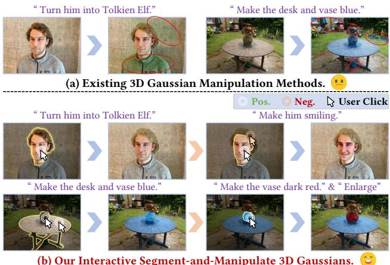
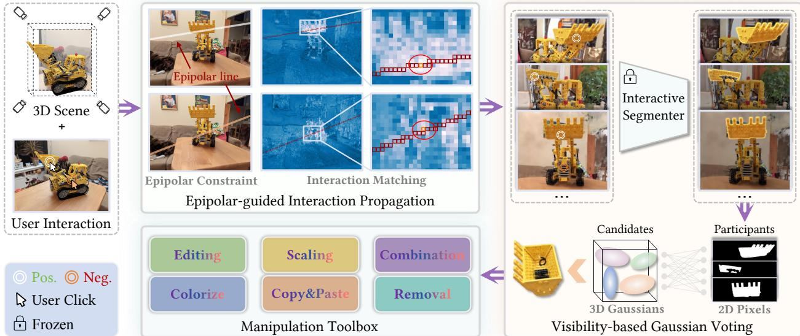
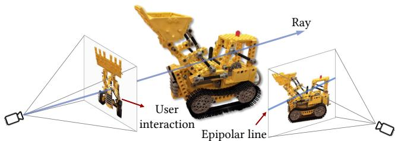
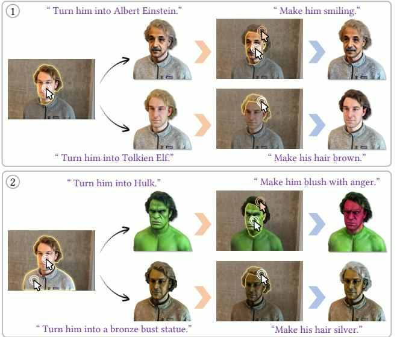
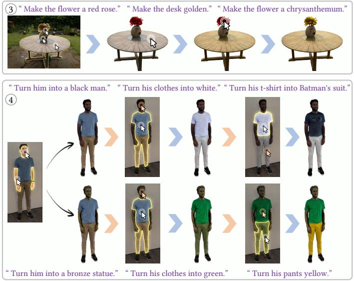
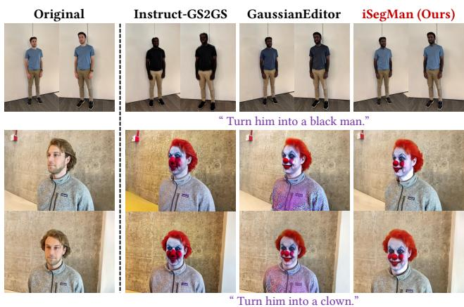
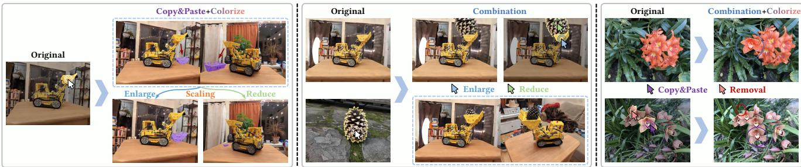
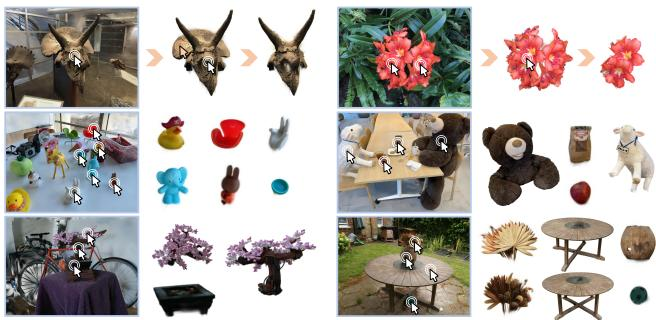

# iSegMan: Interactive Segment-and-Manipulate 3D Gaussians

Yian Zhao1,3 Wanshi Xu1 Ruochong Zheng1,3 Pengchong Qiao1,3 Chang Liu4 Jie Chen1,2,3 B

1School of Electronic and Computer Engineering, Peking University, Shenzhen, China 2Pengcheng Laboratory, Shenzhen, China

3AI for Science (AI4S)-Preferred Program, Peking University Shenzhen Graduate School, China

4Department of Automation and BNRist, Tsinghua University, Beijing, China

zhaoyian@stu.pku.edu.cn jiechen2019@pku.edu.cn

## Abstract

The efficient rendering and explicit nature of 3DGS promote the advancement of3D scene manipulation. However, existing methods typically encounter challenges in controlling the manipulation region and are unable to furnish the user with interactivefeedback, which inevitably leads to unexpected results. Intuitively, incorporating interactive 3D segmentation tools can compensatefor this deficiency. Nevertheless, existing segmentation frameworks impose a preprocessing step of scene-specific parameter training, which limits the efficiency and flexibility of scene manipulation. To deliver a 3D region control module that is well-suited for scene manipulation with reliable efficiency, we propose interactive Segment-and-Manipulate 3D Gaussians (iSegMan), an interactive segmentation and manipulation framework that only requires simple 2D user interactions in any view. To propagate user interactions to other views, we propose Epipolar-guided Interaction Propagation (EIP), which innovatively exploits epipolar constraintfor efficient and robust interaction matching. To avoid scene-specific training to maintain efficiency, wefurther propose the novel Visibility-based Gaussian Voting (VGV), which obtains 2D segmentations from SAM and models the region extraction as a voting game between 2D Pixels and 3D Gaussians based on Gaussian visibility. Taking advantage of the efficient and precise region control of EIP and VGV, we put forth a Manipulation Toolbox to implement various functions on selected regions, enhancing the controllability, flexibility and practicality of scene manipulation. Extensive results on 3D scene manipulation and segmentation tasksfully demonstrate the significant advantages ofiSegMan. Project page is available at https://zhao-yian.github.io/iSegMan

## 1. Introduction

The capacity to interact with the 3D environments is a critical component across a range of applications, including augmented reality (AR) [4], embodied AI [10], and spatial computing [36]. The advancement of these applications continues to propel innovation in user experience. Recently, the efficient differentiable rendering and explicit nature of 3D Gaussian Splatting (3DGS) [19] have propelled the field of 3D scene manipulation to new frontiers. However, existing methods typically face challenges in precisely controlling the manipulation region and are unable to provide interactive feedback to users, which inevitably leads to unexpected or uncontrolled results in practice, cf. Fig. 1(a).

  
Figure 1. (a): Existing 3D manipulation methods. The red circles mark the irrelevant regions affected by editing, leading to unexpected results. (b): Our iSegMan achieves precise control of the manipulation region and interactively performs various functions.

Intuitively, the above deficiency can be compensated for by incorporating interactive 3D segmentation tools, which accept various types of user interactions to achieve precise control of the manipulation region. Traditional 3D representations (e.g.,point clouds [14] and meshes [41]) typically require users to interact directly in 3D space, which involves complex transformation or post-processing, resulting in a poor user experience. With the advent of differentiable rendering techniques (i.e., NeRF [29] and 3DGS [19]), several interactive 3D segmentation frameworks [6, 7, 17] based on 2D user interaction have been explored, which exploits a priori knowledge of the promptable image segmentation model SAM [22] to achieve 3D region selection. However, these methods usually impose a pre-processing step of scene-specific parameter training, which limits the efficiency and flexibility of 3D scene manipulation.

To deliver a 3D region control module that is wellsuited for 3D scene manipulation with reliable efficiency, we propose interactive Segment-and-Manipulate 3D Gaussians (iSegMan), which supports efficient and precise region control and powerful 3D manipulation capability in an interactive manner. To facilitate user interaction, we first classify the existing 3D interactions into three categories: 3D Click, 2D Scribble, and 2D Click, and elaborate on their characteristics (see details in Sec. 2.2). Considering the simplicity and flexibility of the 2D Click, we adopt it for our framework and permit users to interact from any viewpoint. To propagate user interactions to other views, we propose Epipolar-guided Interaction Propagation (EIP), which innovatively exploits epipolar constraint for efficient and robust interaction matching. To avoid scene-specific training to maintain efficiency, we further propose novel Visibility based Gaussian Voting (VGV), which obtains 2D segmentations from SAM [22] and then models the region extraction process as a voting game between 2D Pixels and 3D Gaussians based on Gaussian visibility. Taking advantage of the efficient and precise region control of EIP and VGV, we develop a manipulation toolbox to implement various functions on selected regions, including Semantic Editing, Colorize, Scaling, Copy&Paste, Combination, and Removal, which significantly enhances the controllability, flexibility and practicality of 3D scene manipulation, cf. Fig. 1(b).

To validate the effectiveness of the proposed iSegMan, we perform comprehensive qualitative and quantitative experiments on 3D scene manipulation and segmentation tasks across different scenes, covering all functions provided by the manipulation toolbox. Our iSegMan not only enables efficient and precise control of the manipulation region, but also supports the progressive editing of complex requirements in an interactive manner and improved reusability of 3D assets. Moreover, iSegMan achieves the optimal balance of performance and execution speed and excellent robustness in interactive 3D segmentation.

The main contributions can be summarized as: (i). We propose iSegMan, which precisely controls the manipulation region based on user interactions and invokes functions from the equipped manipulation toolbox according to user requirements, overcoming the limitations of existing meth ods in controlling the manipulation region and failing to provide interactive feedback to the user. (ii). Two novel algorithms, namely EIP and VGV, are proposed to achieve 3D region segmentation without introducing any scene-specific training, achieving optimal execution speed and accuracy, making them well-suited for scene manipulation. (iii). The proposed manipulation toolbox encompasses versatile inspiring functions, providing a powerful solution for various

3DGS-based applications. (iv). The proposed iSegMan not only provides an efficient and novel solution for interactive 3D segmentation, but also greatly enhances the controllability, flexibility and practicality of 3D scene manipulation.

## 2. Related Work

## 2.1. 3D Scene Manipulation

3D scene manipulation is a highly practical application that has received considerable attention from the community. Recently, 3D manipulation has been implemented mainly based on NeRF [29] and 3DGS [19] as follows:

NeRF-based. EditNeRF [26] enables the manipulation of the shape and color of the neural fields by conditioning them on latent codes. CLIP-NeRF [37] and TextDeformer [12] employ the CLIP [33] model to facilitate manipulation through the use of text prompts or reference images. NeRF-Editing[44] and NeuMesh [40] enable the manipulation of NeRF by converting implicit NeRF representations into explicit meshes and exploiting controllable mesh deformations. Instruct-N2N [15], DreamEditor [47], and GenN2N [27] leverage the power of 2D image editors to perform semantic editing on NeRF and achieve impressive results. However, these NeRF-based methods are limited by the intrinsic complexity of the implicit scene data encoding, making it difficult to control the manipulation region.

3DGS-based. The inherently explicit nature of 3DGS makes it easy to implement scene manipulation for specific regions. GSEdit [31] implements global editing of 3D objects, and lacks control over the local region. [38] works with LLMs [25, 48, 49] to provide an automated pipeline and uses existing interactive 3D segmentation tools for additional scene-specific training to control the editing region. GaussianEditor [8] achieves text-driven semantic editing by densifying and optimizing 3D Gaussians within dynamic semantic regions. Although it supports region control based on text prompts, it is limited by the complexity of text descriptions and lacks interactive capability, making it difficult to segment fine-grained regions. In contrast, our method provides efficient and precise region control for scene manipulation in an interactive manner.

## 2.2. Interactive 3D Segmentation

Interactive 3D segmentation has been widely used in downstream tasks due to its flexibility and practicality. Existing methods usually adopt different types of interactions. To facilitate analysis the strengths and weaknesses of various interactions, we classify the existing methods according to the interaction type as follows:

3D Click. InterObject3D [23] first develops the interactive 3D segmentation based on point clouds, allowing users to iteratively input positive / negative 3D clicks to interact with the point clouds. AGILE3D [45] efficiently achieves segmentation of multiple objects in the point clouds and also supports multi-round interactions driven by positive / negative 3D clicks. UniSeg3D [39] unifies multiple 3D segmentation tasks, where interactive segmentation is achieved by 3D superpoints, but this approach only supports positive clicks. iSeg [24] proposes the Mesh Feature Field to implement mesh-based interactive segmentation and receive 3D positive / negative clicks on the surface of objects.

  
Figure 2. Overview of iSegMan. iSegMan contains two novel region control algorithms that are well-suited for scene manipulation with reliable efficiency: Epipolar-guided Interaction Propagation (EIP) and Visibility-based Voting Game (VGV), and a Manipulation Toolbox that includes various manipulation functions. EIP accepts 2D user interactions in any view and leverages epipolar constraint to efficiently and robustly propagate user interactions to other views. To avoid scene-specific training to maintain efficiency, VGV obtains 2D mask from SAM and then models the 3D region extraction as a voting game between 2D Pixels and 3D Gaussians based on Gaussian visibility. Based on the versatile manipulation functions, iSegMan greatly enhances the controllability, flexibility and practicality of 3D scene manipulation.

2D Scribble. NVOS [34] introduces custom-designed 3D features and trains a MLP to achieve scribble-style 3D interaction. ISRF [13] introduces additional feature fields and employs the self-supervised pretrained model to distill semantic features. It extracts 3D regions matching 2D scribble based on feature similarity. Both require time- and memory-consuming scene-specific feature training.

2D Click. Existing methods of this type are typically based on the SAM [22], which provides great potential for interactive 3D segmentation. SA3D [7] segments 3D objects according to 2D clicks in the initial view by alternating mask inverse rendering and heuristic cross-view self-prompting. [18] adopts the same cross-view self-prompting strategy and introduces a two-stage mask refinement scheme. Both methods require multiple repetitions of inverse rendering and involve back-propagation to train the predefined 3D mask in each interaction. Another line of research is essentially 3D clustering, including OmniSeg3D [43], Gaussian Grouping [42], SAGA [6], LangSplat [32], GARField [21], and Click-Gaussian [9]. They first utilize SAM to obtain a set of masks for all views (a time-consuming process), and then distill 3D semantic features from these 2D masks. Once trained, the semantic feature can be clustered to extract the target 3D object. These methods lack the ability to perform multi-round positive and negative interactions, typically only allow clustering of similar features based on positive clicks, and require time- and memory-consuming data pre-processing and feature training pipelines.

Of these interaction types, 2D Click provides the most concise user interface, and avoids the complex transformation involved with 3D Click. Consequently, our method adopts 2D Click for interaction and allows users to input in any view. Compared with existing methods, our method avoids any scene-specific training, achieving optimal execution speed and accuracy.

## 3. Method

In this section, we elaborate on the proposed iSegMan, which comprises two pivotal algorithms for region control that are well-suited for scene manipulation with reliable efficiency: Epipolar-guided Interaction Propagation (EIP) and Visibility-based Voting Game (VGV), as well as a powerful manipulation toolbox that enables the execution of diverse suite of functions on selected regions cf. Fig. 2. Specifically, EIP accepts 2D user interactions in any view and leverages epipolar constraint to efficiently and robustly propagate user interactions to other views. To avoid scenespecific training to maintain efficiency, VGV obtains 2D mask from SAM and then models the 3D region extraction process as a voting game between 2D Pixels and 3D Gaussians based on Gaussian visibility. Based on the versatile functions of the manipulation toolbox, iSegMan greatly enhances the controllability, flexibility and practicality of 3D scene manipulation. The details are described below.

  
Figure 3. Illustration of the epipolar constraint.

## 3.1. Epipolar-guided Interaction Propagation

The EIP is predicated on the principles of Multi-View Stereo (MVS) [35] technology and consists of two steps: epipolar constraint and interaction matching. Formally, let $\pmb { p } _ { v } = ( x _ { v } , y _ { v } )$ represent the coordinates of a user-provided 2D click at the viewpoint v. To propagate $\pmb { p } _ { \imath }$ to other views, an intuitive idea is to match the image features of other views to the feature at $\pmb { p } _ { v }$ . However, the large search space renders the matching process vulnerable to noise, leading to inefficiency and a lack of robustness in the results. To address this issue, we introduce the epipolar constraint to restrict the search space.

Epipolar Constraint. Since the depth $d _ { p _ { v } }$ is a variable when the 2D click $\pmb { p } _ { v }$ is projected into 3D space, this results in a ray $\boldsymbol { r } _ { p _ { \eta } }$ in 3D space that originates from the camera center at the viewpoint v.

Theorem 1. ${ \pmb r } _ { { \pmb p } _ { \imath } }$ is projected onto an epipolar line $e _ { p _ { \eta } } ^ { \tilde { v } }$ at each new viewpoint ${ \tilde { v } } ,$ and the matching click $\pmb { p } _ { \tilde { v } }$ must lie on the epipolar line $e _ { p _ { \eta } } ^ { \tilde { v } }$

Proof. Drawing from principles of epipolar geometry [16], the virtual 3D click, whether on the surface or within the 3D object, must lie on the ray ${ \pmb r } _ { { \pmb p } _ { \imath } }$ . Consequently, the matching 2D click $\mathbf { \Delta } _ { p _ { \tilde { v } } }$ at the new viewpoint v˜ must lie on the epipolar line $e _ { p _ { \eta _ { \tau } } } ^ { \tilde { v } }$ , as depicted in Fig. 3.

Next, we detail the calculation process of the epipolar line $e _ { p _ { \eta } } ^ { \tilde { v } }$ . Given the camera pose $\boldsymbol \pi _ { v } = \mathbf K _ { v } [ \mathbf R _ { v } | \mathbf t _ { v } ]$ , where ${ \bf K } _ { v }$ and $[ \mathbf { R } _ { v } | \mathbf { t } _ { v } ]$ are the intrinsic and extrinsic of the camera respectively. To register the ray $\pmb { r _ { p _ { v } } }$ in the world coordinate system, we select two virtual 3D points $\pmb { p } _ { v } ^ { w _ { 1 } }$ and $\pmb { p } _ { v } ^ { w _ { 2 } }$ on $\boldsymbol { r } _ { p _ { \iota } }$ by sampling the depth $d _ { p _ { v } }$ , as calculated in Eq. (1).

$$
\begin{array} { r } { \begin{array} { r } { [ { \mathbf { R } } _ { v } | \mathbf { t } _ { v } ] = \left( \stackrel { \mathbf { R } _ { v } } {  } \mathbf { \Gamma } \mathbf { \Sigma } ^ { \mathbf { t } _ { v } } ) \mathrm { , } } \\ { \right.p _ { v } ^ { w } = { \mathbf { R } } _ { v } ^ { - 1 } ( d _ { p _ { v } } { \mathbf { K } } _ { v } ^ { - 1 } \cdot [ p _ { v } ^ { \mathrm { T } } , 1 ] ^ { \mathrm { T } } - \mathbf { t } _ { v } ) \mathrm { . } } \end{array} } \end{array}\tag{1}
$$

For simplicity, we set $d _ { p _ { i } }$ to 0 and 1 respectively, so $\pmb { p } _ { v } ^ { w _ { 1 } }$ and $\pmb { p } _ { v } ^ { w _ { 2 } }$ are expressed as Eq. (2).

$$
\begin{array} { c } { { \pmb { p } _ { v } ^ { w _ { 1 } } = - { \bf R } _ { v } ^ { - 1 } { \bf t } _ { v } , } } \\ { { \pmb { p } _ { v } ^ { w _ { 2 } } = { \bf R } _ { v } ^ { - 1 } ( { \bf K } _ { v } ^ { - 1 } \cdot [ { \pmb { p } } _ { v } ^ { \mathrm { T } } , 1 ] ^ { \mathrm { T } } - { \bf t } _ { v } ) . } } \end{array}\tag{2}
$$

Finally, we calculate the normalized direction vector $\tau _ { p _ { \tau } }$ of the ray ${ \pmb r } _ { { \pmb p } _ { \tau } }$ according to Eq. (3).

$$
\tau _ { p _ { v } } = \frac { p _ { v } ^ { w _ { 1 } } - p _ { v } ^ { w _ { 2 } } } { \lVert p _ { v } ^ { w _ { 1 } } - p _ { v } ^ { w _ { 2 } } \rVert } .\tag{3}
$$

To calculate the epipolar line $e _ { p _ { \imath } } ^ { \tilde { v } }$ in the camera coordinate system of the new viewpoint v˜, it is sufficient to transform the coordinate system of the registered ray $\boldsymbol { r } _ { p _ { \iota } }$ again using the camera pose $\pi _ { \tilde { v } } ~ = ~ \mathbf { R } _ { \tilde { v } } [ \mathbf { R } _ { \tilde { v } } | \mathbf { t } _ { \tilde { v } } ]$ ]. Similarly, we sample two virtual 3D points from ${ \pmb r } _ { { \pmb p } _ { v } }$ for the transformation, and the corresponding 2D points $\pmb { p } _ { v } ^ { \tilde { v } }$ in the camera coordinate system of the viewpoint v˜ are calculated as Eq. (4).

$$
[ { \pmb p } _ { v } ^ { \tilde { v } ^ { \mathrm { T } } } , 1 ] ^ { \mathrm { T } } = \frac { 1 } { d _ { { \pmb p } _ { \tilde { v } } } } { \bf K } _ { \tilde { v } } ( { \bf R } _ { \tilde { v } } { \pmb p } _ { v } ^ { w } + { \bf t } _ { \tilde { v } } ) .\tag{4}
$$

Utilizing the two points $\pmb { p } _ { v } ^ { \tilde { v } _ { 1 } }$ and $\pmb { p } _ { v } ^ { \tilde { v } _ { 2 } }$ , we are able to precisely derive the expression for the epipolar line $e _ { p _ { v } } ^ { \tilde { v } }$ within the camera coordinate system.

Interaction Matching. To acquire the matching 2D click $\mathbf { \Delta } _ { p _ { \tilde { v } } }$ at the viewpoint v˜, we further perform the interaction matching based on semantic feature affinity. Specifically, we utilize the self-supervised pretrained model $( e . g .$ DINO [5]) as the feature extractor, where the feature maps of views $\mathcal { T } _ { v }$ and $\mathcal { T } _ { \tilde { v } }$ are denoted as $\mathbf { F } _ { v }$ and $\mathbf { F } _ { \tilde { v } } .$ , respectively. Due to the epipolar constraint, the search space is significantly reduced and we only need to calculate the affinity $\mathcal { A } _ { p _ { v } } ^ { \tilde { v } }$ between the feature $\mathbf { F } _ { v } [ \pmb { p } _ { v } ] \in \mathbb { R } ^ { 1 \times D }$ and the discontinuous feature sequence $\mathbf { F } _ { \tilde { v } } [ e _ { p , \mathrm { ~ } } ^ { \tilde { v } } ] \in \mathbb { R } ^ { M \times D }$ (M indicates the length of the feature sequence, and D denotes the feature dimension), thus reducing noise errors and improving the accuracy and robustness. For implementation, inspired by the Bresenham algorithm [2], we efficiently gather the discontinuous feature sequence $\mathbf { F } _ { \tilde { v } } [ e _ { p _ { v } } ^ { \tilde { v } } ]$ and corresponding indices $\mathbf { \nabla } _ { I _ { \widetilde { v } } }$ along the epipolar line $e _ { p _ { \eta } } ^ { \tilde { v } }$ . Finally, we upsample the coordinates of the selected feature vector with the highest affinity to the original view size to obtain the coordinates of matching 2D click $\pmb { p } _ { \tilde { v } } .$ , cf. Eq. (5).

$$
\begin{array} { r l } & { \mathcal { A } _ { { p } _ { v } } ^ { \tilde { v } } = \mathbf { F } _ { v } [ { \pmb { p } } _ { v } ] \cdot \mathbf { F } _ { \tilde { v } } [ { \pmb { e } } _ { { \pmb { p } } _ { v } } ^ { \tilde { v } } ] ^ { T } \in \mathbb { R } ^ { 1 \times M } , } \\ & { { \pmb { p } } _ { \tilde { v } } = \mathrm { U p s a m p l e } ( { \pmb { I } } _ { \tilde { v } } [ \mathrm { a r g m a x } ( \mathcal { A } _ { { p } _ { v } } ^ { \tilde { v } } ) ] ) . } \end{array}\tag{5}
$$

## 3.2. Visibility-based Gaussian Voting

Based on the interactions of all the views obtained by EIP, we employ the SAM [22] to obtain a set of 2D binarized masks $\mathcal { M } = \{ \mathbf { m } _ { i } | \mathbf { m } _ { i } \in \{ 0 , 1 \} ^ { h \times w } \} _ { i = 1 } ^ { K }$ , where K denotes the number of views, 1 means the pixel is rendered by the target region and 0 means the pixel is rendered by the irrelevant region, h and w are the height and width of the views, respectively. Our goal is to extract target 3D Gaussians from the entire scene based on M. To avoid scene-specific training to maintain efficiency, we model the region extraction process as a voting game from 2D Pixels to 3D Gaussians.

Voting Principle. Voting involves a two-party game, namely the participants and the candidates. We treat 2D Pixels as the participant set P and 3D Gaussians as the candidate set C. There are a total of $h \times w$ participants and N candidates, where N is the number of 3D Gaussians contained in the entire scene. Based on the set of 2D masks M, each participant $\mathbf { \psi } _ { { p } _ { i } } \in \mathcal { P } $ is assigned a vector $\pmb { \tau } _ { i } = ( t _ { 1 } , t _ { 2 } , \dots , t _ { K } )$ , where $t _ { k } \in \{ 0 , 1 \}$ for all k, to indicate whether the visible 3D Gaussians belong to the target region from K views.

Theorem 2. The voting of 2D Pixels on 3D Gaussians is cumulative and asymmetric

Proof. (i). Cumulative: each participant $\mathbf { \nabla } _ { \pmb { p } _ { i } }$ is allowed to vote K $( K > 1 )$ times, i.e., once for each view, so voting is cumulative. (ii). Asymmetric: each participant $\pmb { p } _ { i }$ has different voting powers for different candidates, as each 2D Pixel has a different degree of visibility to 3D Gaussians at distinct positions and depths. Intuitively, the higher the visibility of a candidate to a participant, the higher the probability that the candidate belongs to the same category as the participant (inside or outside the target region). Conversely, the higher the degree of occlusion of a candidate to a participant, the more uncertain the participant is about the candidate and the voting power is reduced.

Inspired by the Alpha Blending of colors in splatting rendering [19], we define the voting power $\Upsilon _ { i , j }$ of each participant $\mathbf { \nabla } _ { \pmb { p } _ { i } }$ for each candidate $c _ { j }$ as the Alpha Blending of its visibility (the opacity of 3D Gaussians), as calculated in Eq. (6). The detailed technical principle of 3DGS [19] and the calculation of α are presented in the Appendix 4.

$$
\Upsilon _ { i , j } = \sigma _ { i } \cdot \alpha _ { i } \prod _ { k = 1 } ^ { i - 1 } ( 1 - \alpha _ { k } ) .\tag{6}
$$

Once the voting power has been determined, all participants can vote for all candidates and the number of votes for each candidate is calculated according to Eq. (7).

$$
\Psi _ { j } = \frac { 1 } { h \times w \times K } \cdot \sum _ { i } \sum _ { k } \pmb { \tau } _ { i } [ k ] \cdot \Upsilon _ { i , j } .\tag{7}
$$

Finally, we select the candidates (3D Gaussians) with the number of votes greater than the predetermined threshold to accurately extract the target region.

Iterative Inspection Mechanism. In the context of openworld scenes, the target region may be invisible at certain viewpoints due to occlusion or out-of-view, resulting in erroneous 2D segmentations produced by SAM. To address this issue, we propose the Iterative Inspection Mechanism (IIM). Specifically, we iteratively execute the voting process at each viewpoint v to obtain the currently selected 3D Gaussians and render the corresponding 2D rendered mask $\mathbf { m } _ { v } ^ { r }$ of that view. If the mask $\mathbf { m } _ { v } ^ { p }$ predicted by SAM in this view does not intersect with the rendered mask $\mathbf { m } _ { v } ^ { r } ,$

IIM determines that the target region cannot be observed at viewpoint v and does not retain the predicted mask $\mathbf { m } _ { v } ^ { p }$ Furthermore, the IIM is capable of mitigating the potential for noise errors introduced by EIP and the SAM. As each predicted mask $\mathbf { m } _ { v } ^ { p }$ must be reviewed by the IIM prior to being allowed to participate in the voting process, any incorrect matching interactions or anomalous segmenter behaviour will be excluded, thus enhancing the robustness. It is worth noting that the implementation of millisecond-level 3D Gaussian voting and rendering ensures that the impact of the IIM on execution speed is negligible.

## 3.3. Manipulation Toolbox

Taking advantage of the efficient and precise region control of EIP and VGV, we put forth a Manipulation Toolbox to implement various functions on selected regions. These functions are detailed below.

Semantic Editing. This function refers to text-driven editing according to the instruction provided by the user. We leverage a powerful image editor, InstructPix2Pix [3], to edit the rendered views and iteratively update the 3D Gaussians using the difference between the edited and original views to achieve 3D editing, following [8, 15]. Specifically, we denote the original scene represented by 3D Gaussians as $\Theta ,$ , and the selected region as $\Theta _ { s } . ~ \Theta _ { s }$ is a non-empty subset of Θ, $i . e . , \Theta _ { s } \subseteq \Theta \wedge \Theta _ { s } \neq \emptyset$ . Given a set of viewpoints V of a scene, we first use the differentiable renderer $\mathcal { R }$ to get the rendered image $\mathcal { T } _ { v }$ at each viewpoint $v \in V$ Then, we iteratively update the 3D Gaussians to maintain the multi-view consistency. In each iteration, we randomly sample a view $\mathcal { T } _ { v }$ and employ the image editor E to edit $\mathcal { T } _ { v }$ based on the instruction e to obtain $\mathcal { T } _ { v } ^ { e }$ . Finally, the imagelevel loss between $\mathcal { T } _ { v }$ and $\mathcal { T } _ { v } ^ { e }$ is calculated to update $\Theta _ { s }$ The calculation process is shown in Eq. (8) and Eq. (9).

$$
\mathcal { T } _ { v } = \mathcal { R } ( \Theta , v ) , \mathcal { T } _ { v } ^ { e } = \mathcal { E } ( \mathcal { T } _ { v } , e ) ,\tag{8}
$$

$$
\nabla _ { \theta } \Theta _ { s } = \mathbb { E } _ { v } \left[ \left( \frac { \partial \| \mathcal { T } _ { v } ^ { e } - \mathcal { T } _ { v } \| _ { 1 } } { \partial \mathcal { T } _ { v } } + \frac { \partial \mathcal { D } ( \mathcal { T } _ { v } , \mathcal { T } _ { v } ^ { e } ) } { \partial \mathcal { T } _ { v } } \right) \cdot \frac { \partial \mathcal { T } _ { v } } { \partial \theta } \right] ,\tag{9}
$$

where θ denotes the trainable parameters of the 3D Gaussians contained in $\Theta _ { s } , \mathcal { D } ( \cdot , \cdot )$ represents the perceptual distance [46]. Note that semantic editing requires multi-step parameter updates, resulting in additional time consumption, but this is not caused by region control. In addition, an annealing strategy is incorporated into the updating of the 3D Gaussians, where the offset of each step is progressively reduced until it reaches zero. We observe that this operation is beneficial in the editing stability.

Colorization. This function changes the color of the selected region by modifying the color attribute of the selected 3D Gaussians. Specifically, we support two modes: Color Replacement and Balanced Coloring. The former is achieved by assigning the color of all selected 3D Gaussians to the target color $\mathbf { } c _ { t } .$ . The latter is achieved by adjusting the mean color value to $c _ { t }$ , as calculated in Eq. (10).

Figure 4. Results of semantic editing. Orange arrows indicate interactive 3D segmentation, and blue arrows indicate semantic editing.  
  
Figure 5. Comparison of semantic editing.

$$
\pmb { c } _ { i } = \pmb { c } _ { i } + \big ( \pmb { c } _ { t } - \frac { 1 } { \hat { N } } \sum _ { i = 1 } ^ { \hat { N } } \pmb { c } _ { i } \big ) ,\tag{10}
$$

where $\hat { N }$ is the number of selected 3D Gaussians.

Scaling. This function enlarges or reduces the selected region while leaving the rest of the scene unchanged. This is achieved by modifying the scaling factor of the selected 3D Gaussians. For implementation, the user is allowed to specify a coefficient ϵ with a value greater than zero. We first calculate the geometric center of the selected 3D Gaussians and then obtain the direction vector of each 3D Gaussian relative to the geometric center. To maintain the geometric invariance for rigid transformation, it is imperative that both the direction vector and the scaling factor of each 3D Gaussian be concurrently scaled by the user-specified coefficient.

The calculation is detailed in Eq. (11).

$$
\bar { \pmb { \mu } } = \frac { 1 } { \hat { N } } \sum _ { i = 1 } ^ { \hat { N } } { \pmb { \mu } } _ { i } , \hat { \pmb { S } } _ { i } = { \pmb { S } } _ { i } \cdot \boldsymbol { \epsilon } ,\tag{11}
$$

where $\hat { \mathbf { } } _ { \pmb { S } _ { i } }$ and $\hat { \pmb { \mu } } _ { i }$ represent the new scaling factor and position of the selected 3D Gaussians, respectively.

Copy&Paste. This function copies the selected region and pastes it elsewhere in the same scene.

Combination. This function extracts the selected region in one scene and inserts it into another scene.

Removal. This function deletes the selected region.

## 4. Experiments

## 4.1. Experimental Settings

Dataset. To demonstrate and compare the performance of 3D manipulation, we perform experiments on two datasets: Mip-NeRF 360 [1] and Instruct-N2N [15]. For interactive 3D segmentation, we compare quantitative results with existing methods on two commonly used datasets: NVOS [34] and SPIn-NeRF [30], and further present qualitative results on a sample of scenes on LERF [20] and LLFF [28]. See the Appendix 1.1 for a detailed description of the dataset.

Metrics. We perform quantitative comparisons of two tasks: semantic editing and interactive 3D segmentation. For semantic editing, we utilize user study and CLIP direction similarity [11] as metrics following [8, 15]. For interactive 3D segmentation, we utilize mAcc and mIoU as metrics following previous works [6, 7].

Implementation Details. All implementation details of the proposed iSegMan are described in the Appendix 1.2.

  
Figure 6. Results of other manipulation functions.

  
Figure 7. Visualization of interactive 3D segmentation.

## 4.2. Qualitative Results

Results of Semantic Editing. To demonstrate the advantages of our iSegMan, we first present the semantic editing results on four cases, cf. Fig. 4. The user provides 2D clicks and the editing instruction, and iSegMan rapidly extracts the target region based on the 2D clicks and performs editing, which is completed in a few minutes. This process allows iterative execution in an interactive manner, forming an editing loop until the user requirements are met. Building such an editing loop presents two distinct advantages. Firstly, it is an effective way for fulfilling complex editing requirements, e.g., the editing process of Case 4 achieves a complex requirement: “Turn the person into a bronze statue wearing a green shirt and yellow pants.” Secondly, it enables reuse of existing results to enhance computational efficiency, e.g., the reuse of the “golden table” in Case 3.

Comparison of Semantic Editing. Moreover, we qualitatively compare our iSegMan with existing methods Instruct-GS2GS [15] and GaussianEditor [8], cf. Fig. 5. Since Instruct-GS2GS cannot explicitly control the editing region, irrelevant regions are significantly affected, e.g., the shirt of the person in the first row has become black by mistake, and the wall color in the second row has become darker. GaussianEditor provides an additional text prompt to specify the editing region. However, the text prompt is difficult to describe for various fine-grained regions, resulting in a poor segmentation accuracy and defective editing results. For instance, the person’s shirts are affected in both scenes, leading to unexpected results. In contrast, our iSegMan achieves precise region control and excellent editing results.

Results of Other Manipulation Functions. We also present the results of other functions in the manipulation toolbox, cf. Fig. 6. Our iSegMan achieves various functions in an interactive manner, greatly enhancing the controllability, flexibility and practicality of 3D manipulation.

<table><tr><td>Metric</td><td>Instruct-GS2GS</td><td>GaussianEditor</td><td>iSegMan (Ours)</td></tr><tr><td>User study ↑</td><td>2.10 ± 0.20</td><td>3.32 ± 0.40</td><td>4.52 ± 0.20</td></tr><tr><td>CLIPdir ↑</td><td>0.1647</td><td>0.2071</td><td>0.2189</td></tr></table>

Table 1. Quantitative comparison of semantic editing. CLIPdir is the CLIP directional similarity.
<table><tr><td rowspan="2">Method</td><td rowspan="2">Training</td><td rowspan="2">mIoU (%)</td><td rowspan="2">mAcc (%)</td><td colspan="2">Execution Time</td></tr><tr><td>Feature</td><td>Segment</td></tr><tr><td>MVSeg [30]</td><td>√</td><td>90.4</td><td>98.8</td><td>=</td><td>=</td></tr><tr><td>ISRF [13]</td><td>√</td><td>71.5</td><td>95.5</td><td></td><td></td></tr><tr><td>SA3D [7]</td><td>√</td><td>91.9</td><td>98.8</td><td>5min</td><td>30s</td></tr><tr><td>LangSplat [32]</td><td>√</td><td>69.5</td><td>94.5</td><td>~2.5h</td><td></td></tr><tr><td>SAGA [6]</td><td>√</td><td>88.0</td><td>98.5</td><td>~1.5h</td><td>10ms</td></tr><tr><td>iSegMan (Ours)</td><td>N/A</td><td>92.4</td><td>99.1</td><td>52s</td><td>6s</td></tr></table>

Table 2. Comparison of interactive 3D segmentation on SPIn-NeRF. “Feature” column indicates the latency of feature training or extraction, and “Segment” column indicates the segmentation latency of each interaction.

Visualization of Interactive 3D Segmentation. To further demonstrate that our iSegMan enables precise region control, we present the visualization of interactive 3D segmentation, cf. Fig. 7. Our iSegMan accurately segments finegrained regions based on 2D clicks and requires no scenespecific training, providing a solid foundation for subsequent manipulation tasks.

## 4.3. Quantitative Results

Comparison of Semantic Editing. We perform a user study and calculate the CLIP directional similarity [11] to quantitatively compare the performance of semantic editing with existing methods (see the Appendix 2 for evaluation details of both metrics). The results are presented in Tab. 1. iSegMan achieves the optimal performance through flexible and fine-grained control over the editing region.

Comparison of Interactive 3D Segmentation. We compare the performance of interactive 3D segmentation with previous methods on SPIn-NeRF and NVOS datasets, cf. Tab. 2 and Tab. 3. Bold indicates the best performance and underlined the second best. “Feature” column indicates the latency of feature training or extraction, and “Segment” column indicates the segmentation latency of each interaction. The execution time of some methods is not reported because they do not support segmentation of 3D Gaussians, and the segmentation time at each interaction of LangSplat [32] is not reported because it does not support interactive segmentation. Our iSegMan achieves excellent performance with less execution time and does not require any supervised training with masks.

<table><tr><td rowspan="2">Method</td><td rowspan="2">Training</td><td rowspan="2">mIoU (%)</td><td rowspan="2">mAcc (%)</td><td colspan="2">Execution Time</td></tr><tr><td>Feature</td><td>Segment</td></tr><tr><td>NVOS [34]</td><td>√</td><td>70.1</td><td>92.0</td><td>-</td><td>=</td></tr><tr><td>ISRF [13]</td><td>√</td><td>83.8</td><td>96.4</td><td>=</td><td></td></tr><tr><td>SA3D [7]</td><td>√</td><td>90.3</td><td>98.2</td><td>2min</td><td>15s</td></tr><tr><td>LangSplat [32]</td><td>√</td><td>74.0</td><td>94.0</td><td>~2h</td><td></td></tr><tr><td>SAGA [6]</td><td>√</td><td>90.9</td><td>98.3</td><td>~1h</td><td>10ms</td></tr><tr><td>iSegMan (Ours)</td><td>N/A</td><td>92.0</td><td>98.4</td><td>30s</td><td>4s</td></tr></table>

Table 3. Comparison of interactive 3D segmentation on NVOS.
<table><tr><td rowspan="2">Sampling Rate</td><td rowspan="2">mIoU (%)</td><td rowspan="2">mAcc (%)</td><td colspan="2">Execution Time</td></tr><tr><td>Feature</td><td>Segment</td></tr><tr><td>100%</td><td>92.4</td><td>99.1</td><td>52s</td><td>6s</td></tr><tr><td>100%</td><td>92.4</td><td>99.1</td><td>52s</td><td>6s</td></tr><tr><td>50%</td><td>92.2</td><td>99.1</td><td>27s</td><td>4s</td></tr><tr><td>25%</td><td>92.1</td><td>99.0</td><td>14s</td><td>2s</td></tr><tr><td>10%</td><td>92.1</td><td>99.0</td><td>7s</td><td>1s</td></tr></table>

Table 4. Results of robustness analysis. ♣ denotes shuffling the view order.

## 4.4. Analysis and Ablation Study

Robustness Analysis. To verify the generalization of our iSegMan under different 3D scenes, we perform a robustness analysis. Specifically, we evaluate the accuracy and execution time of the proposed iSegMan on the SPIn-NeRF dataset under different uniform view sampling rates and shuffled view order (denoted by ♣) conditions based on the original camera trajectory, cf. Tab. 4. The lower the sampling rate, the worse the coherence between views, and the lower the computational cost, leading to faster execution time. In addition, shuffling the view order requires segmenting objects from a completely incoherent view list. The results demonstrate that our iSegMan is capable of maintaining a high level of accuracy, regardless of under sparse and incoherent view conditions (e.g., with a sampling rate of only 10%), or shuffling of the view order. Therefore, our iSegMan is highly robust and enables a trade-off between performance and execution time by reducing the view sampling rate. In contrast, the effectiveness of the cross-view self-prompting strategy proposed by SA3D [7] depends on the accuracy of the rendered mask confidence map, which is limited by the coherence of the rendering viewpoints. Moreover, to ensure the stability of the gradient-based training of the 3D mask, SA3D requires that the number of views should not be too few. Consequently, it is challenging to apply the self-prompting strategy in situations where there is a high degree of visual inconsistency or sparse views.

Ablation Studies. We perform ablation studies on the epipolar constraint, the feature extractor, and the iterative inspection mechanism to verify their effectiveness. The results are presented in Tab. B, Tab. C, and Tab. D in Appendix 3 respectively. The results show that removing the epipolar constraint or the iterative inspection mechanism introduces noise that leads to a significant loss of accuracy, and that our method is robust to the feature extractor.

## 5. Conclusion and Limitation

Conclusion. In this paper, we propose a practical interactive AI agent, namely iSegMan, which precisely controls the manipulation region based on user interactions and invokes functions from the equipped manipulation toolbox according to user requirements, overcoming the limitations of existing methods in controlling the manipulation region and providing interactive feedback to the user. We design two novel algorithms for interactive 3D segmentation that completely avoid the pre-processing step of scene-specific training, making them well-suited for 3D scene manipulation with reliable efficiency and robustness. The equipped manipulation toolbox encompasses versatile inspiring functions, providing a powerful solution for various 3DGSbased applications. Extensive experiments show that our iSegMan has significant advantages for interactive 3D segmentation and manipulation tasks. We hope that our iSeg-Man will serve as a practical tool in production practice.

Limitation. Although the proposed iSegMan achieves flexible, controllable, and interactive 3D scene manipulation, there are a few limitations that need to be addressed. (i). The semantic editing of 3D Gaussians is limited by the image editor. Although our iSegMan supports the step-by-step achievement of complex editing requirements in an interactive manner, this only alleviates this problem to a certain extent, and each editing step is still limited by the image editor. (ii). The latency of each interaction is limited by the computational cost of the specific manipulation function. For instance, the semantic editing involves gradientbased 3D Gaussian parameter optimization, which restricts the real-time nature of the interaction. Improving the efficiency of 3D manipulation while maintaining performance is undoubtedly a promising avenue for future exploration.

Acknowledgements. This work was supported in part by the National Key R&D Program of China (No. 2022ZD0118201), the Shenzhen Medical Research Funds in China (No. B2302037), National Natural Science Foundation of China (NSFC) under Grant No. 61972217, 32071459, 62176249, 62006133, 62271465, 62406167, and AI for Science (AI4S)-Preferred Program, Peking University Shenzhen Graduate School, China.

## References

[1] Jonathan T Barron, Ben Mildenhall, Dor Verbin, Pratul P Srinivasan, and Peter Hedman. Mip-nerf 360: Unbounded anti-aliased neural radiance fields. In Proceedings of the IEEE/CVF Conference on Computer Vision and Pattern Recognition, pages 5470–5479, 2022. 6

[2] Jack E Bresenham. Algorithm for computer control of a digital plotter. In Seminal graphics: pioneering efforts that shaped the field, pages 1–6. 1998. 4

[3] Tim Brooks, Aleksander Holynski, and Alexei A Efros. Instructpix2pix: Learning to follow image editing instructions. In Proceedings of the IEEE/CVF Conference on Computer Vision and Pattern Recognition, pages 18392–18402, 2023. 5

[4] Julie Carmigniani, Borko Furht, Marco Anisetti, Paolo Ceravolo, Ernesto Damiani, and Misa Ivkovic. Augmented reality technologies, systems and applications. Multimedia Tools and Applications, 51:341–377, 2011. 1

[5] Mathilde Caron, Hugo Touvron, Ishan Misra, Herve J´ egou,´ Julien Mairal, Piotr Bojanowski, and Armand Joulin. Emerging properties in self-supervised vision transformers. In Proceedings of the IEEE/CVF International Conference on Computer Vision, pages 9650–9660, 2021. 4

[6] Jiazhong Cen, Jiemin Fang, Chen Yang, Lingxi Xie, Xiaopeng Zhang, Wei Shen, and Qi Tian. Segment any 3d gaussians. arXiv preprint arXiv:2312.00860, 2023. 1, 3, 6, 7, 8

[7] Jiazhong Cen, Zanwei Zhou, Jiemin Fang, Wei Shen, Lingxi Xie, Dongsheng Jiang, Xiaopeng Zhang, Qi Tian, et al. Segment anything in 3d with nerfs. Advances in Neural Information Processing Systems, 36:25971–25990, 2023. 1, 3, 6, 7, 8

[8] Yiwen Chen, Zilong Chen, Chi Zhang, Feng Wang, Xiaofeng Yang, Yikai Wang, Zhongang Cai, Lei Yang, Huaping Liu, and Guosheng Lin. Gaussianeditor: Swift and controllable 3d editing with gaussian splatting. In Proceedings of the IEEE/CVF Conference on Computer Vision and Pattern Recognition, pages 21476–21485, 2024. 2, 5, 6, 7

[9] Seokhun Choi, Hyeonseop Song, Jaechul Kim, Taehyeong Kim, and Hoseok Do. Click-gaussian: Interactive segmentation to any 3d gaussians. arXiv preprint arXiv:2407.11793, 2024. 3

[10] Jiafei Duan, Samson Yu, Hui Li Tan, Hongyuan Zhu, and Cheston Tan. A survey of embodied ai: From simulators to research tasks. IEEE Transactions on Emerging Topics in Computational Intelligence, 6(2):230–244, 2022. 1

[11] Rinon Gal, Or Patashnik, Haggai Maron, Amit H Bermano, Gal Chechik, and Daniel Cohen-Or. Stylegan-nada: Clipguided domain adaptation of image generators. ACM Transactions on Graphics (TOG), 41(4):1–13, 2022. 6, 7

[12] William Gao, Noam Aigerman, Thibault Groueix, Vova Kim, and Rana Hanocka. Textdeformer: Geometry manipulation using text guidance. In ACM SIGGRAPH 2023 Conference Proceedings, pages 1–11, 2023. 2

[13] Rahul Goel, Dhawal Sirikonda, Saurabh Saini, and PJ Narayanan. Interactive segmentation of radiance fields. In

Proceedings of the IEEE/CVF Conference on Computer Vi sion and Pattern Recognition, pages 4201–4211, 2023. 3, 7, 8

[14] Yulan Guo, Hanyun Wang, Qingyong Hu, Hao Liu, Li Liu, and Mohammed Bennamoun. Deep learning for 3d point clouds: A survey. IEEE Transactions on Pattern Analysis and Machine Intelligence, 43(12):4338–4364, 2020. 1

[15] Ayaan Haque, Matthew Tancik, Alexei A Efros, Aleksander Holynski, and Angjoo Kanazawa. Instruct-nerf2nerf: Editing 3d scenes with instructions. In Proceedings of the IEEE/CVF International Conference on Computer Vision, pages 19740–19750, 2023. 2, 5, 6, 7

[16] Richard Hartley and Andrew Zisserman. Multiple view geometry in computer vision. Cambridge university press, 2003. 4

[17] Xu Hu, Yuxi Wang, Lue Fan, Junsong Fan, Junran Peng, Zhen Lei, Qing Li, and Zhaoxiang Zhang. Semantic anything in 3d gaussians. arXiv preprint arXiv:2401.17857, 2024. 1

[18] Jiajun Huang, Hongchuan Yu, Jianjun Zhang, and Hammadi Nait-Charif. Point’n move: Interactive scene object manipu lation on gaussian splatting radiance fields. IET Image Processing, 2023. 3

[19] Bernhard Kerbl, Georgios Kopanas, Thomas Leimkuhler,¨ and George Drettakis. 3d gaussian splatting for real-time radiance field rendering. ACM Transactions on Graphics, 42 (4):1–14, 2023. 1, 2, 5

[20] Justin Kerr, Chung Min Kim, Ken Goldberg, Angjoo Kanazawa, and Matthew Tancik. Lerf: Language embedded radiance fields. In Proceedings of the IEEE/CVF Interna tional Conference on Computer Vision, pages 19729–19739, 2023. 6

[21] Chung Min Kim, Mingxuan Wu, Justin Kerr, Ken Goldberg, Matthew Tancik, and Angjoo Kanazawa. Garfield: Group anything with radiance fields. In Proceedings of the IEEE/CVF Conference on Computer Vision and Pattern Recognition, pages 21530–21539, 2024. 3

[22] Alexander Kirillov, Eric Mintun, Nikhila Ravi, Hanzi Mao, Chloe Rolland, Laura Gustafson, Tete Xiao, Spencer Whitehead, Alexander C Berg, Wan-Yen Lo, et al. Segment anything. In Proceedings of the IEEE/CVF International Con ference on Computer Vision, pages 4015–4026, 2023. 1, 2, 3, 4

[23] Theodora Kontogianni, Ekin Celikkan, Siyu Tang, and Kon rad Schindler. Interactive object segmentation in 3d point clouds. In 2023 IEEE International Conference on Robotics and Automation (ICRA), pages 2891–2897. IEEE, 2023. 2

[24] Itai Lang, Fei Xu, Dale Decatur, Sudarshan Babu, and Rana Hanocka. iseg: Interactive 3d segmentation via interactive attention. arXiv preprint arXiv:2404.03219, 2024. 3

[25] Haotian Liu, Chunyuan Li, Qingyang Wu, and Yong Jae Lee. Visual instruction tuning. Advances in Neural Information Processing Systems, 36:34892–34916, 2023. 2

[26] Steven Liu, Xiuming Zhang, Zhoutong Zhang, Richard Zhang, Jun-Yan Zhu, and Bryan Russell. Editing conditional radiance fields. In Proceedings of the IEEE/CVF Interna tional Conference on Computer Vision, pages 5773–5783, 2021. 2

[27] Xiangyue Liu, Han Xue, Kunming Luo, Ping Tan, and Li Yi. Genn2n: Generative nerf2nerf translation. In Proceedings of the IEEE/CVF Conference on Computer Vision and Pattern Recognition, pages 5105–5114, 2024. 2

[28] Ben Mildenhall, Pratul P Srinivasan, Rodrigo Ortiz-Cayon, Nima Khademi Kalantari, Ravi Ramamoorthi, Ren Ng, and Abhishek Kar. Local light field fusion: Practical view synthesis with prescriptive sampling guidelines. ACM Transactions on Graphics (ToG), 38(4):1–14, 2019. 6

[29] Ben Mildenhall, Pratul P Srinivasan, Matthew Tancik, Jonathan T Barron, Ravi Ramamoorthi, and Ren Ng. Nerf: Representing scenes as neural radiance fields for view synthesis. Communications ofthe ACM, 65(1):99–106, 2021. 1, 2

[30] Ashkan Mirzaei, Tristan Aumentado-Armstrong, Konstantinos G Derpanis, Jonathan Kelly, Marcus A Brubaker, Igor Gilitschenski, and Alex Levinshtein. Spin-nerf: Multiview segmentation and perceptual inpainting with neural radiance fields. In Proceedings of the IEEE/CVF Conference on Computer Vision and Pattern Recognition, pages 20669–20679, 2023. 6, 7

[31] Francesco Palandra, Andrea Sanchietti, Daniele Baieri, and Emanuele Rodola. Gsedit: Efficient text-guided edit-\` ing of 3d objects via gaussian splatting. arXiv preprint arXiv:2403.05154, 2024. 2

[32] Minghan Qin, Wanhua Li, Jiawei Zhou, Haoqian Wang, and Hanspeter Pfister. Langsplat: 3d language gaussian splatting. In Proceedings of the IEEE/CVF Conference on Computer Vision and Pattern Recognition, pages 20051–20060, 2024. 3, 7, 8

[33] Alec Radford, Jong Wook Kim, Chris Hallacy, Aditya Ramesh, Gabriel Goh, Sandhini Agarwal, Girish Sastry, Amanda Askell, Pamela Mishkin, Jack Clark, et al. Learning transferable visual models from natural language supervision. In International Conference on Machine Learning, pages 8748–8763. PMLR, 2021. 2

[34] Zhongzheng Ren, Aseem Agarwala, Bryan Russell, Alexander G Schwing, and Oliver Wang. Neural volumetric object selection. In Proceedings of the IEEE/CVF Conference on Computer Vision and Pattern Recognition, pages 6133– 6142, 2022. 3, 6, 8

[35] Steven M Seitz, Brian Curless, James Diebel, Daniel Scharstein, and Richard Szeliski. A comparison and evaluation of multi-view stereo reconstruction algorithms. In Proceedings of the IEEE/CVF Conference on Computer Vision and Pattern Recognition, pages 519–528. IEEE, 2006. 4

[36] Shashi Shekhar, Steven K Feiner, and Walid G Aref. Spatial computing. Communications of the ACM, 59(1):72–81, 2015. 1

[37] Can Wang, Menglei Chai, Mingming He, Dongdong Chen, and Jing Liao. Clip-nerf: Text-and-image driven manip ulation of neural radiance fields. In Proceedings of the IEEE/CVF Conference on Computer Vision and Pattern Recognition, pages 3835–3844, 2022. 2

[38] Junjie Wang, Jiemin Fang, Xiaopeng Zhang, Lingxi Xie, and Qi Tian. Gaussianeditor: Editing 3d gaussians delicately with text instructions. In Proceedings ofthe IEEE/CVF Con-

ference on Computer Vision and Pattern Recognition, pages 20902–20911, 2024. 2

[39] Wei Xu, Chunsheng Shi, Sifan Tu, Xin Zhou, Dingkang Liang, and Xiang Bai. A unified framework for 3d scene understanding. arXiv preprint arXiv:2407.03263, 2024. 3

[40] Bangbang Yang, Chong Bao, Junyi Zeng, Hujun Bao, Yinda Zhang, Zhaopeng Cui, and Guofeng Zhang. Neumesh: Learning disentangled neural mesh-based implicit field for geometry and texture editing. In European Conference on Computer Vision, pages 597–614. Springer, 2022. 2

[41] Shunyu Yao, Tzu Ming Hsu, Jun-Yan Zhu, Jiajun Wu, Antonio Torralba, Bill Freeman, and Josh Tenenbaum. 3d-aware scene manipulation via inverse graphics. Advances in Neural Information Processing Systems, 31, 2018. 1

[42] Mingqiao Ye, Martin Danelljan, Fisher Yu, and Lei Ke. Gaussian grouping: Segment and edit anything in 3d scenes. arXiv preprint arXiv:2312.00732, 2023. 3

[43] Haiyang Ying, Yixuan Yin, Jinzhi Zhang, Fan Wang, Tao Yu, Ruqi Huang, and Lu Fang. Omniseg3d: Omniversal 3d segmentation via hierarchical contrastive learning. In Pro ceedings of the IEEE/CVF Conference on Computer Vision and Pattern Recognition, pages 20612–20622, 2024. 3

[44] Yu-Jie Yuan, Yang-Tian Sun, Yu-Kun Lai, Yuewen Ma, Rongfei Jia, and Lin Gao. Nerf-editing: geometry editing of neural radiance fields. In Proceedings ofthe IEEE/CVF Conference on Computer Vision and Pattern Recognition, pages 18353–18364, 2022. 2

[45] Yuanwen Yue, Sabarinath Mahadevan, Jonas Schult, Francis Engelmann, Bastian Leibe, Konrad Schindler, and Theodora Kontogianni. Agile3d: Attention guided interactive multiobject 3d segmentation. arXiv preprint arXiv:2306.00977, 2023. 2

[46] Richard Zhang, Phillip Isola, Alexei A Efros, Eli Shechtman, and Oliver Wang. The unreasonable effectiveness of deep features as a perceptual metric. In Proceedings of the IEEE/CVF Conference on Computer Vision and Pattern Recognition, pages 586–595, 2018. 5

[47] Jingyu Zhuang, Chen Wang, Liang Lin, Lingjie Liu, and Guanbin Li. Dreameditor: Text-driven 3d scene editing with neural fields. In SIGGRAPH Asia 2023 Conference Papers, pages 1–10, 2023. 2

[48] Xianwei Zhuang, Yuxin Xie, Yufan Deng, Liming Liang, Jinghan Ru, Yuguo Yin, and Yuexian Zou. Vargpt: Unified understanding and generation in a visual autoregressive multimodal large language model, 2025. 2

[49] Xianwei Zhuang, Zhihong Zhu, Yuxin Xie, Liming Liang, and Yuexian Zou. Vasparse: Towards efficient visual hallucination mitigation for large vision-language model via visualaware sparsification, 2025. 2